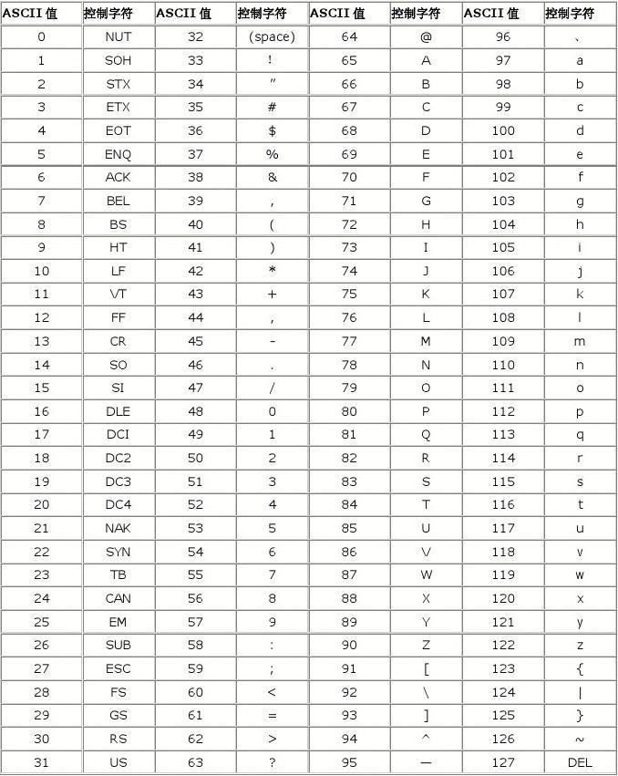
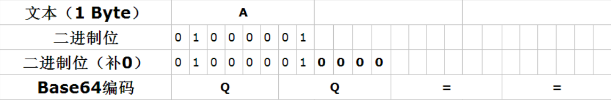
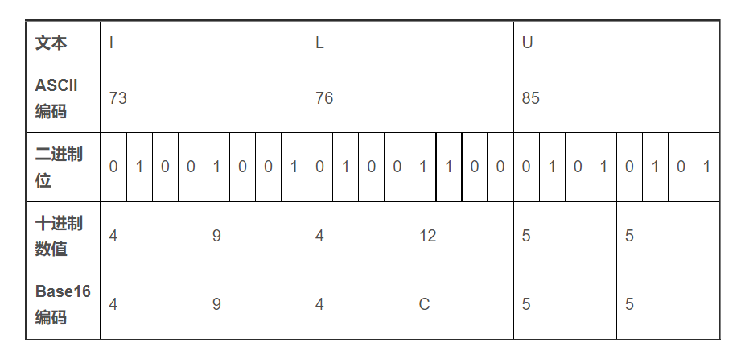
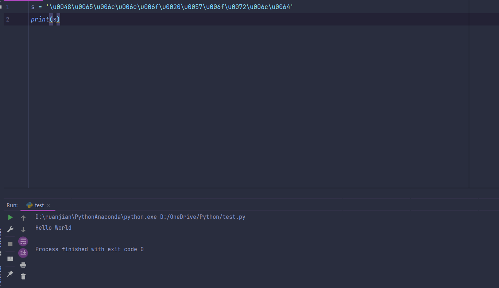
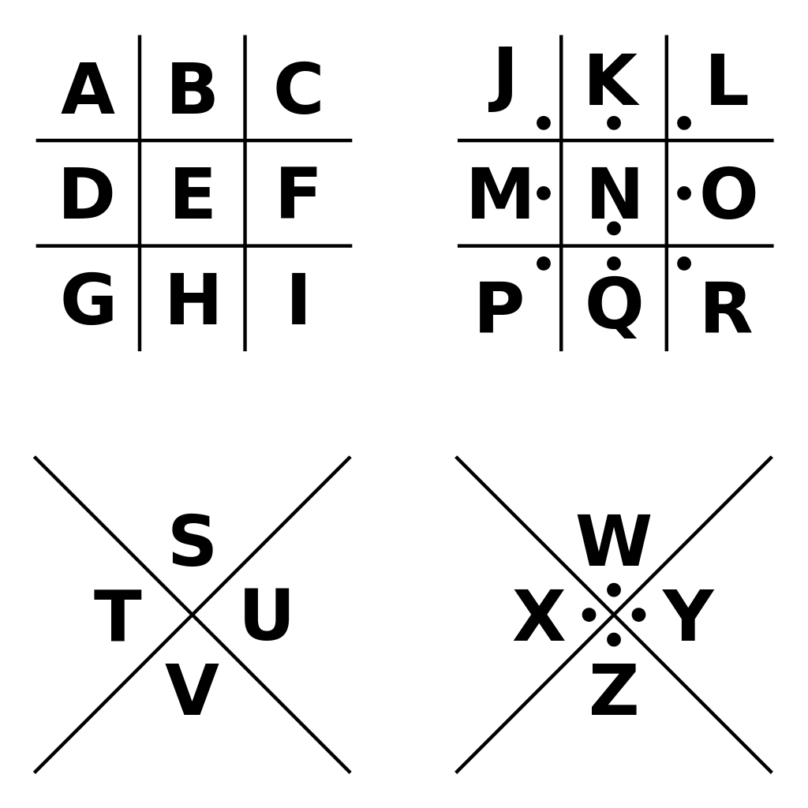
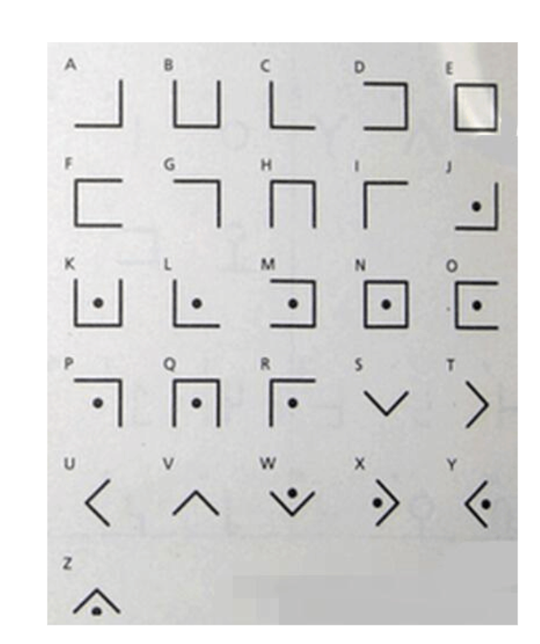
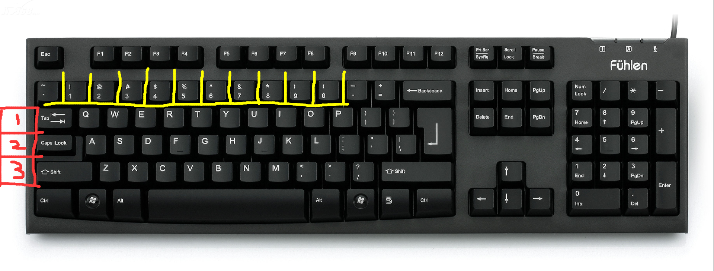
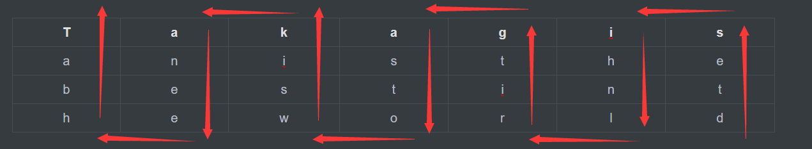

## 前言

参考，我们任课老师的WORD和PPT，结合自己的理解，在结合网上文章的理解。

## 一.BASE64编码

BASE64编码中，特征和所拥有的字符`字母:A-Z a-z;数字:0-9;符号:+ / `，然后末尾经常有一个“=”或者两个“==”。

原理，先把需要加密的字符串每个字符转换成ASCII码，然后ASCII码转换成二进制为8位二进制数字表示，然后在以六位二进制为一组转十进制，最后查找对应的BASE64对照表即可。

ASCII表，常用的无非就是大写字母和小写字母，大写字母的`A`开始是`97`，小写字母的`a`开始是`65`，推算下即可。

比如，这里需要加密“Ken”这个字符串，里面有大写和小写，查找ASCII码表，分别对应的是`75 101 110`，转换成二进制`75:01001011; 101:01100101; 110:01101110;`，先并排在一起，就是**010010110110010101101110**，然后在以六个为一组排序👉**010010 | 110110 | 010101 | 101110**，将这六个二进制重新转换成十进制，分别对应的是，`18 54 21 46`，然后对应base64码表，找出对应的上面重新转换成的十进制数字即可，分别是👉**S2Vu**，所以Ken这个字符串BASE64加密编码之后是`S2Vu`，如果不太清楚，看如下表格。

| 文本                          | K        | e        | n        | NULL   |
| ----------------------------- | -------- | -------- | -------- | ------ |
| ASCII编码                     | 75       | 101      | 110      | NULL   |
| 二进制位                      | 01001011 | 01100101 | 01101110 | NULL   |
| 分组                          | 010010   | 110110   | 010101   | 101110 |
| 转换后的十进制&BASE64码表索引 | 18       | 54       | 21       | 46     |
| 结果&Base64码表               | S        | 2        | V        | u      |

这样应该就差不多了，附上BASE64索引表，如下

| 数值 | 字符 |      | 数值 | 字符 |      | 数值 | 字符 |      | 数值 | 字符 |
| ---- | ---- | ---- | ---- | ---- | ---- | ---- | ---- | ---- | ---- | ---- |
| 0    | A    |      | 16   | Q    |      | 32   | g    |      | 48   | w    |
| 1    | B    |      | 17   | R    |      | 33   | h    |      | 49   | x    |
| 2    | C    |      | 18   | S    |      | 34   | i    |      | 50   | y    |
| 3    | D    |      | 19   | T    |      | 35   | j    |      | 51   | z    |
| 4    | E    |      | 20   | U    |      | 36   | k    |      | 52   | 0    |
| 5    | F    |      | 21   | V    |      | 37   | l    |      | 53   | 1    |
| 6    | G    |      | 22   | W    |      | 38   | m    |      | 54   | 2    |
| 7    | H    |      | 23   | X    |      | 39   | n    |      | 55   | 3    |
| 8    | I    |      | 24   | Y    |      | 40   | o    |      | 56   | 4    |
| 9    | J    |      | 25   | Z    |      | 41   | p    |      | 57   | 5    |
| 10   | K    |      | 26   | a    |      | 42   | q    |      | 58   | 6    |
| 11   | L    |      | 27   | b    |      | 43   | r    |      | 59   | 7    |
| 12   | M    |      | 28   | c    |      | 44   | s    |      | 60   | 8    |
| 13   | N    |      | 29   | d    |      | 45   | t    |      | 61   | 9    |
| 14   | O    |      | 30   | e    |      | 46   | u    |      | 62   | +    |
| 15   | P    |      | 37   | f    |      | 47   | v    |      | 63   | /    |

在附上一张ASCII码表图，如下图，图来自于网络。





### 1.有等号”=”的情况

比如`a`这个字母，ASCII码是`65`，转换成二进制是**01000001**，转换成六个一组**010000 | 01**，就会发现后面不足以组成六位数，就可以在后面添零，就变成了👉**010000 | 010000**，转换成十进制就是`16`，然后根据BASE64码表对应的是`Q`，那么a的加密后就是`QQ`，但是我自己的理解是，加密后的长度也就是编码后的长度必须能整除`4`，才可以，这里QQ不能整除`4`所以不行，就可以加上`=`，长度就可以了，所以最终的编码就是`QQ==`。

另外一种理解，如果要进行编码的字符串，不能被3整除，`后面会多出一个字节或者两个字节`，就可以使用“==”来代替，比如编码`a`，不能被三整除，还差两位就可以被三整除，就可以在最终编码结果加上两个”==”，结合如下图理解更好。





------

## 二.base32加密

和base64加密差不多，这里直接举例子，先看下表是base32的索引表，比如这里我要BASE32编码,`Ken`，对应的ASCII码分别是，`75 101 110`，转换成二进制分别对应的是`75:01001011; 101:01100101; 110:01101110`，然后合在一起，是**0100101101100101011011100**，然后在以五个一组排序👉**01001 | 01101 | 10010 | 10110 | 11100**，然后在转换成十进制就是，`9 13 18 22 28`，根据下面的索引表，就是，`JNSW4`，这里只有五个数，必须要四个四个一组，不足四个就用`=`，来填充，所以就是`JNSW4===`。

| 数值 | 字符 |      | 数值 | 字符 |      | 数值 | 字符 |      | 数值 | 字符 |
| ---- | ---- | ---- | ---- | ---- | ---- | ---- | ---- | ---- | ---- | ---- |
| 0    | A    |      | 9    | J    |      | 18   | S    |      | 27   | 3    |
| 1    | B    |      | 10   | K    |      | 19   | T    |      | 28   | 4    |
| 2    | C    |      | 11   | L    |      | 20   | U    |      | 29   | 5    |
| 3    | D    |      | 12   | M    |      | 21   | V    |      | 30   | 6    |
| 4    | E    |      | 13   | N    |      | 22   | W    |      | 31   | 7    |
| 5    | F    |      | 14   | O    |      | 23   | X    |      |      |      |
| 6    | G    |      | 15   | P    |      | 24   | Y    |      |      |      |
| 7    | H    |      | 16   | Q    |      | 25   | Z    |      |      |      |
| 8    | I    |      | 17   | R    |      | 26   | 2    |      |      |      |

可以看如下表格

| 文本           | K        | e        | n        | NULL  | NULL  |
| -------------- | -------- | -------- | -------- | ----- | ----- |
| ASCII编码      | 75       | 101      | 110      | NULL  | NULL  |
| 二进制位       | 01001011 | 01100101 | 01101110 | NULL  | NULL  |
| 分组           | 01001    | 01101    | 10010    | 10110 | 11100 |
| 分组后的十进制 | 9        | 13       | 18       | 22    | 28    |
| 索引值         | J        | N        | S        | W     | 4     |

------

## 三.base16加密

如果理解了，base64加密和base32加密方式，那么base16加密方式就很好理解了，先看如下base16索引表。

| 数值 | 字符 |      | 数值 | 字符 |
| ---- | ---- | ---- | ---- | ---- |
| 0    | 0    |      | 8    | 8    |
| 1    | 1    |      | 9    | 9    |
| 2    | 2    |      | 10   | A    |
| 3    | 3    |      | 11   | B    |
| 4    | 4    |      | 12   | C    |
| 5    | 5    |      | 13   | D    |
| 6    | 6    |      | 14   | E    |
| 7    | 7    |      | 15   | F    |

先还是和base64和base32一样将需要加密的字符串转换成ASCII码然后转换成二进制，区别就是分组排序的时候是以4个为一组来排序，base64是六个为一组，base32是以五个为一组，如下图理解即可，图来自CSDN。





------

## 四.Unicode编码

特征是以`\u数字或者字母加数字`，比如，\u6211，转换中文就是“我”，`\u`过后是每四个为一组，最简单解码方式可以使用python的print函数输出即可，编码👉**\u0048\u0065\u006c\u006c\u006f\u0020\u0057\u006f\u0072\u006c\u0064**，解码效果如下图👇，成功解码出字符串`Hello World`





上面是解密，加密如下。

编码原理，先将需要加密的字符转换成ASCII编码，然后把ASCII编码转换成十六进制即可，不足四位前面添0即可，比如`a`这个字符，编码之后是0x61，就需要加零就是0x0061，如下是python实现，非常简单。

最重要的就是ord函数和hex函数，ord函数把字符转ASCII，然后hex把数字转十六进制。

```python
str='flag'
dict = []
for i in str:
    result = hex(ord(i)).replace(r'0x',r'\u')
    dict.append(result)
print("".join(dict))
```

------

## 五.URL编码

在浏览器地址栏经常能看见，特征是`%数字加字母`，比如👉**%E4%BD%A0%E5%A5%BD%E4%B8%96%E7%95%8C**，这种类型的，解码之后的原文是，**你好世界**，还是需要用到python,当然也可以在线编码解码，需要用到的是python的`urllib`模块下面的`parse`模块，如下代码。

quote是编码

```python
import urllib.parse as url
str = '你好世界'
print(url.quote(str))
```

输入效果如下

```text
%E4%BD%A0%E5%A5%BD%E4%B8%96%E7%95%8C
```

如何解码，如下python代码。

```python
import urllib.parse as url
str = '%E4%BD%A0%E5%A5%BD%E4%B8%96%E7%95%8C'
print(url.unquote(str))
```

解码效果为`你好世界`

------

## 六.进制转换

### 1.python实现进制转换

------

#### 1.十进制转二进制

可以用到一个函数bin函数，可以之间转换，如下代码。

```python
print(bin(10))
```

输出结果是`0b1010`

------

#### 2.二进制转十进制

可以用到一个int函数，如下代码，int函数里面的2代表的是进制。

```python
str = '1010'
print(int(str,2))
```

输出的数字是`10`。

------

#### 3.十进制转八进制

需要用到一个oct函数，如下代码。

```python
print(oct(100))
```

输入结果是`0o144`

------

#### 4.八进制转十进制

和上面二进制转十进制差不多，如下代码，只需要更改数字即可

```python
str = '144'
print(int(str,8))
```

------

#### 5.十进制转十六进制

需要用到一个hex函数，如下代码。

```python
print(hex(255))
```

输出结果是`0xff`，十六进制转换十进制和上面差不多，只需要更改数字即可。

------

### 2.手算进制

可以直接参考百度百科👉[进制转换](https://baike.baidu.com/item/进制转换/3117222)。

------

## 七.置换密码

### 1.加密

1.明文:`State Key Laboratory of Networking and Switching`

2.加密密钥:`key=(1,5,6,2,3)`

3.将明文分组，按照六个字母一组来分，总共可以分为七组，不足六个字母的可以用双方事先规定好的字符来填充比如空格，如下是分组过后的样子👇。

**P = (StateK)(eyLabo)(ratory)(ofNetw)(orking)(andSwi)(tching)**

4.对每组字符进行加密，根据加密密钥key，把每组的第1位字符放在第5位字符上面，第5位字符放在第6位字符上面，第6位字符放在第2位字符上面，第2位字符放在第3位字符上面，第3位字符放在第1位字符上面，这样排序即可，如下👇。

**P = (aKttSe)(Loyaeb)(tyaorr)(Nwfeot)(kgrion)(dinSaw)(hgcitn)**

最终密文就是`aKttSeLoyaebtyaorrNwfeotkgriondinSawhgcitn`

------

### 2.解密

解密需要的是把密钥给反向过来，原本的密钥是`(1,5,6,2,3)`需要逆置换变成`(1,3,2,6,5)`，然后在按照加密的方法即可解密。

------

## 八.栅栏密码

栅栏密码潜规则，字符不会超过30个。

------

### 1.加密

假设明文是:`THEREISACIPHER`，然后根据上下上下排序，就是

T E E S C P E
H R I A   I H  R

最后连在一起就是TEESCPEHRIAIHR。

加密的另外一种方法，明文是`THEREISACIPHER`，先两个两个分一组，就是，`TH ER EI SA CI PH ER`。

先取出第一个字母：TEESCPE
在取出第二个字母：HRIAIHR

最后连在一起即可。

------

### 2.解密

加密密文：`TEESCPEHRIAIHR`

解密只需要将密文从中间分开，变位两行。

```
T E E S C P E`
`H R I A I H R
```

最后在上下上下组合起来即可。

```
THEREISACIPHER
```

------

## 九.单表代换密码

假设明文是:`helloWorld`

假设密钥是:`KENSSB`，去掉重复的字母就是`KENSB`，然后按照字母顺序排列剩余的字母即可得到一个方阵表，如下表。

| K    | E    | N    | S    | B    |
| ---- | ---- | ---- | ---- | ---- |
| A    | C    | D    | F    | G    |
| H    | I    | J    | L    | M    |
| O    | P    | Q    | R    | T    |
| U    | V    | W    | X    | Y    |
| Z    |      |      |      |      |

然后在从左边下边开始一直到右边排序，即可得到代换密文，代换密码表如下表所示。

| 明文字母 | A    | B    | C    | D    | E    | F    | G    | H    | I    | J    | K    | L    | M    | N    | O    | P    | Q    | R    | S    | T    | U    | V    | W    | X    | Y    | Z    |
| -------- | ---- | ---- | ---- | ---- | ---- | ---- | ---- | ---- | ---- | ---- | ---- | ---- | ---- | ---- | ---- | ---- | ---- | ---- | ---- | ---- | ---- | ---- | ---- | ---- | ---- | ---- |
| 密文字母 | K    | A    | H    | O    | U    | Z    | E    | C    | I    | P    | V    | N    | D    | J    | Q    | W    | S    | F    | L    | R    | X    | B    | G    | M    | T    | Y    |

然后按照，明文字母所对应的密文字母，找到排序即可，`helloword`加密之后的密文是`CUNNQGQFNO`

------

## 十.埃特巴什码

最后一个字母代表的十第一个字母，倒数第二个字母代表的十第二个字母，如下表所示。

| 明文字母 | A    | B    | C    | D    | E    | F    | G    | H    | I    | J    | K    | L    | M    | N    | O    | P    | Q    | R    | S    | T    | U    | V    | W    | X    | Y    | Z    |
| -------- | ---- | ---- | ---- | ---- | ---- | ---- | ---- | ---- | ---- | ---- | ---- | ---- | ---- | ---- | ---- | ---- | ---- | ---- | ---- | ---- | ---- | ---- | ---- | ---- | ---- | ---- |
| 密文字母 | Z    | Y    | X    | W    | V    | U    | T    | S    | R    | Q    | P    | O    | N    | M    | L    | K    | J    | I    | H    | G    | F    | E    | D    | C    | B    | A    |

------

## 十一.凯撒密码

根据如下表排序，如下表是最基础的凯撒密码，就是往右移位，A对应的B，B对应的是C，比如明文是KEN，那么按照下表密文对应的就是LFO。

| 明文字母 | A    | B    | C    | D    | E    | F    | G    | H    | I    | J    | K    | L    | M    | N    | O    | P    | Q    | R    | S    | T    | U    | V    | W    | X    | Y    | Z    |
| -------- | ---- | ---- | ---- | ---- | ---- | ---- | ---- | ---- | ---- | ---- | ---- | ---- | ---- | ---- | ---- | ---- | ---- | ---- | ---- | ---- | ---- | ---- | ---- | ---- | ---- | ---- |
| 密文字母 | B    | C    | D    | E    | F    | G    | H    | I    | J    | K    | L    | M    | N    | O    | P    | Q    | R    | S    | T    | U    | V    | W    | X    | Y    | Z    | A    |

python代码如下，1代表的是移位。

```python
def caser():
    flag = 'HelloWorld'.upper()
    dict_txt = 'abcdefghijklmnopqrstuvwxyz'.upper()
    dec = []
    for i in flag:
        dec.append(dict_txt[dict_txt.index(i)+1])
    print("".join(dec))
if __name__ == '__main__':
    caser()
```

------

## 十二.仿射密码(Affine)

原理是，先将26个字母按照0-25排序也就是(0,1,2,3…25)，密钥为k(a,b)，加密公式为`c=Ea,b(m)≡am+b(mod26)`，解密公式为`m=Da,b(c)≡a-1(c-b)(mod26)`。

如下表是字母索引表

| A    | B    | C    | D    | E    | F    | G    | H    | I    | J    | K    | L    | M    | N    | O    | P    | Q    | R    | S    | T    | U    | V    | W    | X    | Y    | Z    |
| ---- | ---- | ---- | ---- | ---- | ---- | ---- | ---- | ---- | ---- | ---- | ---- | ---- | ---- | ---- | ---- | ---- | ---- | ---- | ---- | ---- | ---- | ---- | ---- | ---- | ---- |
| 0    | 1    | 2    | 3    | 4    | 5    | 6    | 7    | 8    | 9    | 10   | 11   | 12   | 13   | 14   | 15   | 16   | 17   | 18   | 19   | 20   | 21   | 22   | 23   | 24   | 25   |

### 1.加密

例如我这里要加密helloworld加密过程并且密钥是k(7,21)：

h=7，7*7+21(mod26)=18，h=s

e=4，7*4+21(mod26)=23，e=x

l=11，7*11+21(mod26)=20，l=u

l=11，7*11+21(mod26)=20，l=u

o=14，7*14+21(mod26)=15，o=p

w=22，7*22+21(mod26)=19，w=t

o=14，7*14+21(mod26)=15，o=p

r=17，7*17+21(mod26)=10，r=k

l=11，7*11+21(mod26)=20，l=u

d=3，7*3+21(mod26)=16，d=q

所以helloworld加密之后的成果是`sxuuptpkuq`。

------

### 2.解密

知道解密公式是`m=Da,b(c)≡a-1(c-b)(mod26)&m=D7,21(c)≡7-1(c-21)(mod26)     `，密文是`sxuuptpkuq`，解密过程如下。

s=18，7^-1*(18-21)(mod26)

x=23，7^-1*(23-21)(mod26)

省略。。。。

------

### 3.python代码

如下是加密代码。

```python
def affine_cipher_en():
    flag = input('请输入你要加密的明文:')
    k_a = int(input("请输入密钥中的第一个值a："))
    k_b = int(input("请输入密钥中的第一个值b:"))
    flag_list = list(flag.lower())
    flag_en = []
    for i in flag_list:
        flag_en.append(chr(((k_a * (ord(i)-97) + k_b) % 26)+97))
    print(''.join(flag_en))
affine_cipher_en()
```

如下是python解密代码

```python
#解密脚本
def affine_cipher_de():
    flag = input('请输入你要解密的明文:')
    k_a = int(input("请输入密钥中的第一个值a："))
    k_b = int(input("请输入密钥中的第一个值b:"))
    flag_list = list(flag.lower())
    flag_de = []
    for i in flag_list:
        flag_de.append(chr((15 * (ord(i) - 97 - k_b)) % 26 + 97))
    print(''.join(flag_de))
```

------

## 十三.棋盘密码

棋盘密码就是将26个字母放在5x5的方格子里面，ij放在一个格子里面，具体如下表👇。

|      | 1    | 2    | 3    | 4    | 5    |
| ---- | ---- | ---- | ---- | ---- | ---- |
| 1    | a    | b    | c    | d    | e    |
| 2    | f    | g    | h    | i/j  | k    |
| 3    | l    | m    | n    | o    | p    |
| 4    | q    | r    | s    | t    | u    |
| 5    | v    | w    | x    | y    | z    |

其中特点就是每两个数字编做一组，所有的数字都在1-5之间浮动，并且是先列后行的顺序排序。

比如`25 15 33`，所对应的就是`Ken`

------

## 十四.普莱费尔密码

假设密钥是`kensb`，那么排序之后如下表，前面和单表代换一样，假设明文是`stegab`

| k    | e    | n    | s    | b    |
| ---- | ---- | ---- | ---- | ---- |
| A    | C    | D    | F    | G    |
| H    | I/J  | L    | M    | O    |
| P    | Q    | R    | T    | U    |
| V    | W    | X    | Y    | Z    |

加密原理就是如果假设需要加密明文里面的s对应的是p1,t对应的是p2，

1.那么p1，p2在同一行则对应的密文就是紧靠p1，p2右端的字母。

2.如果p1，p2在同一列则对应的密文分别是仅靠p1，p2下端的字母。

3.如果p1，p2不在同一列也不再同一行，那么对应的密文应该是p1，p2为对角顶点确定的矩阵的另外的两个顶点字母，按照同行原则对应。

加密效果如下表。

| st   | eg   | ab   |
| ---- | ---- | ---- |
| FY   | BC   | GK   |

解密就是加密过程。


# 后续篇

## 一.维吉尼亚密码

### 1.加密

维吉尼亚密码就是一些偏移量不同的凯撒密码组成的，首先需要如下表。

| A    | B    | C    | D    | E    | F    | G    | H    | I    | J    | K    | L    | M    | N    | O    | P    | Q    | R    | S    | T    | U    | V    | W    | X    | Y    | Z    |
| ---- | ---- | ---- | ---- | ---- | ---- | ---- | ---- | ---- | ---- | ---- | ---- | ---- | ---- | ---- | ---- | ---- | ---- | ---- | ---- | ---- | ---- | ---- | ---- | ---- | ---- |
| 0    | 1    | 2    | 3    | 4    | 5    | 6    | 7    | 8    | 9    | 10   | 11   | 12   | 13   | 14   | 15   | 16   | 17   | 18   | 19   | 20   | 21   | 22   | 23   | 24   | 25   |

假设密钥是`TAKAGISAN`,则对应上面👆表转换成数字密钥就是`key=(19,0,10,0,6,8,18,0,13)`。

假设明文是`TAKAGISAN IS THE FIRST IN THE WORLD`，然后按照密钥分为九个一组，密钥数字排序如果不够，可以从头开始排序，如下表操作即可，假设下面对应的索引数字为`a`，密钥数字为`b`，那么加密之后的数字`c`就是`(a+b)mod26`取余数即可，最后在按照上表对应的数字排序即可得到密文。

| 明文           | T    | A    | K    | A    | G    | I    | S    | A    | N    | I    | S    | T    | H    | E    | F    | I    | R    | S    | T    | I    | N    | T    | H    | E    | W    | O    | R    | L    | D    |
| -------------- | ---- | ---- | ---- | ---- | ---- | ---- | ---- | ---- | ---- | ---- | ---- | ---- | ---- | ---- | ---- | ---- | ---- | ---- | ---- | ---- | ---- | ---- | ---- | ---- | ---- | ---- | ---- | ---- | ---- |
| 对应的索引数字 | 19   | 0    | 10   | 0    | 6    | 8    | 18   | 0    | 13   | 8    | 18   | 19   | 7    | 4    | 5    | 8    | 17   | 18   | 19   | 8    | 13   | 19   | 7    | 4    | 22   | 14   | 17   | 11   | 3    |
| 密钥数字       | 19   | 0    | 10   | 0    | 6    | 8    | 18   | 0    | 13   | 19   | 0    | 10   | 0    | 6    | 8    | 18   | 0    | 13   | 19   | 0    | 10   | 0    | 6    | 8    | 18   | 0    | 13   | 19   | 0    |
| 加密之后的数字 | 12   | 0    | 20   | 0    | 12   | 16   | 10   | 0    | 0    | 1    | 18   | 3    | 7    | 10   | 13   | 0    | 17   | 5    | 12   | 8    | 23   | 19   | 13   | 12   | 14   | 14   | 4    | 4    | 3    |
| 密文           | M    | A    | U    | A    | M    | Q    | K    | A    | A    | B    | S    | D    | H    | K    | N    | A    | R    | F    | M    | I    | X    | T    | N    | M    | O    | O    | E    | E    | D    |

所以`TAKAGISAN IS THE FIRST IN THE WORLD`加密之后的密文是`MAUAMQKAABSDHKNARFMIXTNMOOEED`。公式就是`(a+b)mod26=c`。

------

### 2.解密

假设已经知道了密钥是`TAKAGISAN`密钥是`key=(19,0,10,0,6,8,18,0,13)`，公式是`(c-b)mod26=a`，也就是对应的索引数字减去密钥数字再来mod26即可，如下表。

| 密文           | M    | A    | U    | A    | M    | Q    | K    | A    | A    | B    | S    | D    | H    | K    | N    | A    | R    | F    | M    | I    | X    | T    | N    | M    | O    | O    | E    | E    | D    |
| -------------- | ---- | ---- | ---- | ---- | ---- | ---- | ---- | ---- | ---- | ---- | ---- | ---- | ---- | ---- | ---- | ---- | ---- | ---- | ---- | ---- | ---- | ---- | ---- | ---- | ---- | ---- | ---- | ---- | ---- |
| 对应的索引数字 | 12   | 0    | 20   | 0    | 12   | 16   | 10   | 0    | 0    | 1    | 18   | 3    | 7    | 10   | 13   | 0    | 17   | 5    | 12   | 8    | 23   | 19   | 13   | 12   | 14   | 14   | 4    | 4    | 3    |
| 密钥数字       | 19   | 0    | 10   | 0    | 6    | 8    | 18   | 0    | 13   | 19   | 0    | 10   | 0    | 6    | 8    | 18   | 0    | 13   | 19   | 0    | 10   | 0    | 6    | 8    | 18   | 0    | 13   | 19   | 0    |
| 解密之后的数字 | 19   | 0    | 10   | 0    | 6    | 8    | 18   | 0    | 13   | 8    | 18   | 19   | 7    | 4    | 5    | 8    | 17   | 18   | 19   | 8    | 13   | 19   | 7    | 4    | 22   | 14   | 17   | 11   | 3    |
| 明文           | T    | A    | K    | A    | G    | I    | S    | A    | N    | I    | S    | T    | H    | E    | F    | I    | R    | S    | T    | I    | N    | T    | H    | E    | W    | O    | R    | L    | D    |

------

## 二.摩斯电码

当然也是字符对应字母，如下表

字母表

| 字符 | 电码符号 | 字符 | 电码符号 | 字符 | 电码符号 | 字符 | 电码符号 |
| ---- | -------- | ---- | -------- | ---- | -------- | ---- | -------- |
| A    | .-       | B    | -…       | C    | -.-.     | D    | -..      |
| E    | .        | F    | ..-.     | G    | –.       | H    | ….       |
| I    | ..       | J    | .—       | K    | -.-      | L    | .-..     |
| M    | –        | N    | -.       | O    | —        | P    | .–.      |
| U    | ..-      | V    | …-       | W    | .–       | X    | -..-     |
| Y    | -.–      | Z    | –..      |      |          |      |          |

标点符号

| 字符 | 电码符号 | 字符 | 电码符号 | 字符 | 电码符号 | 字符 | 电码符号 |
| ---- | -------- | ---- | -------- | ---- | -------- | ---- | -------- |
| .    | .-.-.-   | :    | —…       | ,    | –..–     | ;    | -.-.-.   |
| ?    | ..–..    | =    | -…-      | ‘    | .—-      | /    | -..-.    |
| !    | -.-.–    | -    | -….-     | -    | ..–.-    | “    | .-..-.   |
| (    | -.–.     | )    | -.–.-    | $    | …-..-    | &    | ….       |
| @    | .–.-.    | +    | .-.-.    |      |          |      |          |

数字长码

| 字符 | 电码符号 | 字符 | 电码符号 | 字符 | 电码符号 | 字符 | 电码符号 |
| ---- | -------- | ---- | -------- | ---- | -------- | ---- | -------- |
| 0    | —–       | 1    | .—-      | 2    | ..—      | 3    | …–       |
| 4    | ….-      | 5    | …..      | 6    | -….      | 7    | –…       |
| 8    | —..      | 9    | —-.      |      |          |      |          |

在线解密网址👉[摩斯电码在线解密](https://www.matools.com/morse)。

------

## 三.MD5(哈希算法)

MD5不可逆，只能通过枚举，MD5的特征是，`(1)长度固定`,`(2)只可能小写和数字32个字符`👉[在线CMD加密解密](https://cmd5.com/)，比如加密`123456`，如下。

MD5:`e10adc3949ba59abbe56e057f20f883e`。

------

## 四.猪圈密码表

用格子来做的简单替换，加密，如下图格子适应，和对应图。





如下是字母对应图👇。





按照图表来加密解密即可。

类似的：

### 圣武士密码密码表


### 标准银河字母密码表


------

## 五.九宫格按键加密

也是简单的替换密码，如下表替换。

| 1      | 2 abc | 3 def  |
| ------ | ----- | ------ |
| 4 ghi  | 5 jkl | 6 mno  |
| 7 pqrs | 8 tuv | 9 wxyz |

没有1，比如`a`在第二个格子那么就是`21`，`z`在第9个格子就是`94`，`k`在第五个格子就是`52`。

**另一种形式**：例如密文：ooo yyy ii w uuu ee 

这些字母是26键盘的第一行，上面有对应数字（看一下键盘：q对应1，w对应2....o对应9，y对应6，i对应8，w对应2，u对应7，e对应3），并且位数在1到4位，说明是九键键盘，刚好和题目意思对上了，这种题写法就是比如o,对应9，就在九键键盘上9的位置，看o有多少位，3位的话，就是9那个位置字符串的第三个字符。

所以依次解密上面的密文：

ooo:  o对应键盘9，3个o,九键键盘9的第三个字母：y

yyy：y对应6，3个y,九键键盘6的第三个字母：o

ii: u

w:a

uuu:r

ee:e

脚本处理：

```python
cipher="ooo yyy ii w uuu ee uuuu yyy uuuu y w uuu i i rr w i i rr rrr uuuu rrr uuuu t ii uuuu i w u rrr ee www ee yyy eee www w tt ee"
base=" qwertyuiop"
a=[" "," ","abc","def","ghi","jkl","mno","pqrs","tuv","wxyz"]
for part in cipher.split(" "):
    s=base.index(part[0])
    count=len(part)
    print(a[s][count-1],end="")
```


------

## 六.26键加密

### 1.QWE密码

指的是按照QWE键盘顺序来加密也就是QWERTYUIOP这种，如下表所示。

| A    | B    | C    | D    | E    | F    | G    | H    | I    | J    | K    | L    | M    | N    | O    | P    | Q    | R    | S    | T    | U    | V    | W    | X    | Y    | Z    |
| ---- | ---- | ---- | ---- | ---- | ---- | ---- | ---- | ---- | ---- | ---- | ---- | ---- | ---- | ---- | ---- | ---- | ---- | ---- | ---- | ---- | ---- | ---- | ---- | ---- | ---- |
| Q    | W    | E    | R    | T    | Y    | U    | I    | O    | P    | A    | S    | D    | F    | G    | H    | J    | K    | L    | Z    | X    | C    | V    | B    | N    | M    |

入👆表加密即可。

### 2.坐标加密

先如下图所示，如果是(红色,黄色)也就是先行后列的顺序，`(1,1)=Q，(1,2)=W，(2,1)=A，(2,2)=S`。

如果是(黄色，红色)也就是先列后行的顺序，`(1,1)=Q，(1,2)=A，(2,1)=W，(2,2)=S`。





------

## 七.曲路密码

也是一种换位密码，需要双方事先约定好密钥(曲路路线)

假设明文是`Takagisan is the best in the world`。

填入4行七列表(需要事先约定好)

| T    | a    | k    | a    | g    | i    | s    |
| ---- | ---- | ---- | ---- | ---- | ---- | ---- |
| a    | n    | i    | s    | t    | h    | e    |
| b    | e    | s    | t    | i    | n    | t    |
| h    | e    | w    | o    | r    | l    | d    |

如下图👇加密回环路线，从右往左(需要事先声明好)，最终加密效果就是，`dtesihnlritgastowsjkaneehbat`，解密也非常简单，按照约定，4行7列，回环路线从右往左，密文从左到右，重新排序即可。





------

## 八.当铺密码

当铺密码就是中文与数字的结合，当前的汉字有多少笔画出头，就是转换成数字几。

如下表，就是当铺密码所对应的汉字和所对应的数字。

| 汉字 | 所对应的数字 |
| ---- | ------------ |
| 由   | 1            |
| 中   | 2            |
| 人   | 3            |
| 工   | 4            |
| 大   | 5            |
| 王   | 6            |
| 夫   | 7            |
| 井   | 8            |
| 羊   | 9            |

比如`夫大 工大 夫井`，就是`75 45 78`，对应ASCII码就是`KEN`。

------

## 九.培根密码加密方式

第一种方法如下表

| 字母 | 加密后 | 字母 | 加密后 | 字母 | 加密后 | 字母 | 加密后 | 字母 | 加密后 | 字母 | 加密后 | 字母 | 加密后 | 字母 | 加密后 | 字母 | 加密后 | 字母 | 加密后 |
| ---- | ------ | ---- | ------ | ---- | ------ | ---- | ------ | ---- | ------ | ---- | ------ | ---- | ------ | ---- | ------ | ---- | ------ | ---- | ------ |
| A    | aaaaa  | B    | aaaab  | C    | aaaba  | D    | aaabb  | E    | aabaa  | F    | aabab  | G    | aabba  | H    | aabbb  | I    | abaaa  | J    | abaab  |
| K    | ababa  | L    | ababb  | M    | abbaa  | N    | abbab  | O    | abbba  | P    | abbbb  | Q    | baaaa  | R    | baab   | S    | baaba  | T    | baabb  |
| U    | babaa  | V    | babab  | W    | babba  | X    | babbb  | Y    | bbaaa  | Z    | bbaab  |      |        |      |        |      |        |      |        |

第二种方法如下表

| 字母 | 加密后 | 字母 | 加密后 | 字母 | 加密后 | 字母 | 加密后 |
| ---- | ------ | ---- | ------ | ---- | ------ | ---- | ------ |
| a    | AAAAA  | g    | AABBA  | n    | ABBAA  | t    | BAABA  |
| b    | AAAAB  | h    | AABBB  | o    | ABBAB  | u-v  | BAABB  |
| c    | AAABA  | i-j  | ABAAA  | p    | ABBBA  | w    | BABAA  |
| d    | AAABBA | k    | ABAAB  | q    | ABBBB  | x    | BABAB  |
| e    | AABAA  | l    | ABABA  | r    | BAAAA  | y    | BABBA  |
| f    | AABAB  | m    | ABABB  | s    | BAAAB  | z    | BABBB  |

加密解密python程序如下👇，源自于网络，自己经过了一些修改。


复制代码

python

```python
import re

alphabet = ['a','b','c','d','e','f','g','h','i','j','k','l','m','n','o','p','q','r','s','t','u','v','w','x','y','z']

first_cipher = ["aaaaa","aaaab","aaaba","aaabb","aabaa","aabab","aabba","aabbb","abaaa","abaab","ababa","ababb","abbaa","abbab","abbba","abbbb","baaaa","baaab","baaba","baabb","babaa","babab","babba","babbb","bbaaa","bbaab"]

second_cipher = ["aaaaa","aaaab","aaaba","aaabb","aabaa","aabab","aabba","aabbb","abaaa","abaaa","abaab","ababa","ababb","abbaa","abbab","abbba","abbbb","baaaa","baaab","baaba","baabb","baabb","babaa","babab","babba","babbb"]

def encode():
    string = input("请输入字符来加密:\n")
    e_string1 = ""
    e_string2 = ""
    for index in string:
        for i in range(0,26):
            if index == alphabet[i]:
                e_string1 += first_cipher[i]
                e_string2 += second_cipher[i]
                break
    print("第一种加密方式结果是:\n"+e_string1)
    print("第二种加密方式结果是:\n"+e_string2)
    return

def decode():
    e_string = input("请输入字符来解密:\n")
    e_array = re.findall(".{5}",e_string)
    d_string1 = ""
    d_string2 = ""
    for index in e_array:
        for i in range(0,26):
            if index == first_cipher[i]:
                d_string1 += alphabet[i]
            if index == second_cipher[i]:
                d_string2 += alphabet[i]
    print("第一种解密结果是:\n"+d_string1)
    print("第二种解密结果是:\n"+d_string2)
    return

if __name__ == '__main__':
    while True:
        print("\t*******培根密码加密解密*******")
        print("输入应该是小写密码只包含ab")
        print("1.加密\n2.解密\n3.退出")
        s_number = input("请输入数字来选择\n")
        if s_number == "1":
            encode()
            input()
        elif s_number == "2":
            decode()
            input()
        elif s_number == "3":
            exit()
        else:
            continue
```

------

## 十.RSA算法加密

RSA算法，应该算难的一种了，视频可以去看李永乐老师的👉[李永乐老师讲RSA](https://www.bilibili.com/video/BV1Ts411H7u9?from=search&seid=7967272613449962470)，首先需要知道的东西如下👇。

```text
1.两个质数:p q(只有1和他本身两个约数的数叫做质数)
2.n=p*q
3.φ(n) = (p-1)(q-1)  欧拉函数
4.公钥e是一个1<e<φ(n)的整数，e和φ(n)必须要互质
  私钥d 必须是(e*d)modφ(n)=1，假设φ(n)是20，那
  e取值为3，d取值为7，就是(3*7)mod20=1，余数就
  可以是1，那么私钥就可以是为7。

5.加密，假设M是明文，m的e的平方除以n余数就是c
6.解密，C为密文，同时私钥d,c的d次方除以n余数就是m
```

看懂如上即可看不懂怎么办，我也看不懂，如下的带数操作。

```text
m=14	e=3		p=5		q=11	请写出RSA加密解密过程和结果
```

求n：p*q=5*11=55

求φ(n)：φ(n)=(p-1)*(q-1)=(5-1)(11-1)=40

求d：已知求d公式为`(e*d)modφ(n)=1`，就是`(3*d)mod40=1`，算出d为27。

加密：已知公式为`(m^e)modn=c`套用`(14^3)mod55=c`，算出c为49

解密：已知公式为`(c^d)modn=m`套用`(49^27)mod55=m`，算出m为14

第二测试题如下👇

```text
p=43	q=59	e=13	m=134879475204	用RSA对m进行加密
```

加密公式为`(m^e)modn=c`，我们需要知道e和n即可算出c。

求n：n=p*q=43*59=2537

加密m：(134879475204^e)mod2537=1202