CTF 密码学总结

### 出人意料的flag：

指在题目中获取到了flag，但是这个flag可能长得不像flag，或者flag还要经过进一步的脑洞处理，而不是常规的解密处理。

### 非预期行为：

指解题中出现与预想结果不符合的一系列非预期行为，这基本说明了在中间或前面存在其他自己还没分析的操作。

### 冗余中锁定关键代码：

从后往前看，就是确定比较关键对象，从该对象开始排除其他无关变量，一步步找出与该对象有关的其它变量，最后串起找到的所有相关变量，然后开始逆向分析。

# 题目类型总结：

### 题目描述暗示：

指题目给出的描述中有解题的大方向思路，以及对解题过程中出现的一些疑惑点的解释。

### 字符串中文含义暗示：

指解题中遇到带有中文暗示的字符串，这通常是出题者给的提示，抓住暗示重新梳理思路往往是正确的选择。

## 1. 简单密码类型：

### 摩斯密码：

指解题中的密文涉及摩斯密码，摩斯密码的特征是以.-或01组成的，分隔符有空格或斜杠/。

### url编码：

指解题中的密文涉及url编码，url编码的特征是使用 "%" 其后跟随两位的十六进制数来替换非 ASCII 字符。

### 传统base64解密：

指题目中密文是涉及base64加密，密文通常是4的倍数，基本元素是ABCDEFGHIJKLMNOPQRSTUVWXYZabcdefghijklmnopqrstuvwxyz0123456789+/和补充的'='

### unicode解密：

指解题中密文涉及 unicode 解密，unicode现在已知的特征是ASCII（英文也是ASCII码）转unicode码时是 &# 前缀 +2 个 16 进制数，并用 ; 分隔。中文转unicode时是 \u + 4 个 16 进制数，中间没有间隔。

举例：1234 ----->1234 牛逼-------->\u725b\u903c

### ASCII解密：

指解题中密文涉及ASCII码，需要转成字符。ASCII共128个可显示字符，范围是0~127或0~7F。不同通常每个ASCII码的间隔依据出题者来定。

### 栅栏密码：

指解题中密文涉及栅栏密码，因为栅栏密码有传统的矩阵型和 W 型，所以需要自己辨认。根据题目给的 key 分段来逐个尝试。

### 转轮机加密：

指解题中密文涉及转轮机加密，转轮机密文的特点是等长的分好组的乱序字母，原理是转齿轮把一个字母换成另一个来拼成一句话，所以会有多组密钥，但是只有一组密文。

格式举例，等长的分好组的字符串：

ZWAXJGDLUBVIQHKYPNTCRMOSFE

KPBELNACZDTRXMJQOYHGVSFUWI

### 键盘密码：

指解题中密文涉及键盘密码加密，键盘密码的特征是4~6个为一组，在键盘上呈包围态势，有明显的间隔。

### 16进制转字符：

指解题中密文是由16进制基本元素组成的，0~F或0~f，直接16进制转字符即可。

### 大小写字符提取密码：

指解题中题目给出的密文是一篇小说之类的，其中的内容里面并没有flag，所以内容含义没有意义。但是有一些字母的大小写形式与其他的不一样，这些不一样的字母提取出来就是一种加密类型了。

举例提取大写字符命令：

```
cat 1.txt | grep -o [A-Z] |tr -d '\n'
```

grep -o 只显示匹配到的字符串，tr -d 删除指定字符，不删除换行符的话就很长的打竖显示。

### ROT13加密：

指解题中给出的密文是简单的数字或字母，但是难以判断加密类型，这时可以尝试用一下ROT13之类的字符移动来转换一下，由于是同一层面的数字和字母，所以通常可以装换出同层的具备传统密码特征的密文，就可以继续解题了。

### poem codes诗歌加密：

指解题中密文涉及poem codes诗歌加密，poem codes诗歌加密的特征是诗歌 --> 关键词，原文 --> 参照顺序排列，密文 --> 按诗歌关键词对原文映射取值。

### 仿射密码：

指解题中密文涉及仿射密码，仿射密码加密的特征是一种替换密码，它是一个字母对一个字母的。字母系统中所有字母都藉一简单数学方程加密。

## 2. 复杂密码类型：

### ECC加密：

是一种建立公开密钥加密的算法，基于椭圆曲线数学的椭圆曲线密码学。

### CTF-RSA-tool脚本修改：

指解题中RSA类型是CTF-RSA-tool工具中内嵌类型的一种变形，无法直接用工具生成答案，需要重CTF-RSA-tool中锁定对应的代码，抽出来自己修改才行。

factor_N.py：是对应的解密逻辑封装，解出p、q。

RSAutils.py：是对应的输出结果部分，解决精度和字节串转为字符串问题。

### RSA通用脚本解密：

指简单的RSA题目中，直接给出或求出p、q、e、c的值，不需要再用N来大数分解，所有参数都有了就可以直接运行RSA解密脚本解题了。

### RSA多层模n加密：

指解题中给了多个模，且都是2048bit 4096bit等无法正面分解的数。需要使用欧几里得算法求取模之间的公约数，也可以直接用p1 = gmpy2.gcd(n1, n2) 这个系统提供的欧几里得封装函数。根据欧几里德算法算出的p之后，再用n除以p即可求出q，由此可以得到的参数有p、q、n、e，再使用常规方法计算出d，即可破解密文。

注意：

这和RSA模不互素很像，但是模不互素只用一个n加密，另一个n是给你求公因子而已。

### RSA模不互素：

指解题中RSA类型给了多个模n，且都是2048bit 4096bit等无法正面分解的数，与RSA多层模n加密的区别就是模不互素只用一个n加密，另一个n是给你求公因子而已。

### 低加密指数广播攻击：

指解题中RSA类型给了多个n、c、e，广播指我们需要将一份明文进行多份加密，但是每份使用不同的密钥，密钥中的模数n不同但指数e相同且很小，我们只要拿到多份密文和对应的n就可以利用中国剩余定理进行解密。

### 明文密钥文件提取参数：

指解题中题目给了RSA的明文和密钥文件，可能是多个，所以无法直接用CTF-RSA-tool解题（CTF-RSA-tool好像只能输入一对明文密钥文件）。

密钥文件和明文文件读取出对应数字的方法，提取n、e都是用Crypto.PublicKey.RSA模块，再抽取对应的n,c属性的。

提取加密密文c，则是直接二进制读取文件后用Crypto.Util.number模块的bytes_to_long函数转二进制流为数字的。

### RSA共模攻击：

指解题中题目给了两个相同的n，不同的e、c，来加密密文。

## 文件相关类型：

### 16进制文件流：

指解题中给的密文或者附件中的内容是16进制的文件流，这需要16进制转字符后再base64解码后才能发现是类似于抓包的文件流。所以最开始的16进制流就是文件流，扔入winhex中保存为指定后缀即可。

### 文件流加密：

指解题中题目给的文件扔入winhex工具中16进制显示的内容，文件头等信息不符合题目给的后缀或不符合题目的文件类型描述。这时就要考虑是否在文件流层面上进行了加密处理，通常是简单的移位处理。

### 文件读取对齐的二进制：

指解题中需要从文件中读取二进制数，二进制数有时是不能直接从文件中复制粘贴转换的，因为有时候会有乱码显示。可以用前面积累的 base64 编码的代码写一串从文件中读取对齐的二进制的代码。

(在线转换都会省略最开头的0导致结果位数错误，进而导致结果错误，所以自己要注意)

```
f = open('5key','rb') #以二进制格式打开文件

content = f.read() #读取的是\xhh类型的十六进制

key=['{:0>8}'.format(str(bin(i)).replace('0b','')) for i in content] #从base64编码汲取的经验，二进制8位对齐。

print(''.join(key)[:19])
```

## 3. 算法类总结：

#### 费马分解算法：

指RSA题目类型中模n是4个p、q的混合乘积。

费马分解算法的特征就是n是4个数的乘积，分解n之后我们会得到p、p1、q、q1四组隔开的排列组合，但是我们的脚本可以把组合限定成p * q1， p1 * q,和p * q ，p1 * q这样。

然后通过欧几里得算法求公因子的封装函数gcd(pq1,pq) = p、gcd(p1q,p1q) = q 求出两组各一个数，然后就可以求出φ(n)=φ(p)⋅φ(p1)⋅φ(q)⋅φ(q1)=(p−1)⋅(q−1)⋅(p1−1)⋅(q1−1)了。

#### 排列组合算法：

指解题中加密表单缺少了多个字母，但是这个多个字母有多个组合，因为无法确定是那个组合才能拼凑出正确的加密表单，所以需要用排列组合算法全部穷举出来。

## 4. 密码学脚本类总结：

### ASCII转字符脚本：

指解题中遇到长串ASCII码形式，需要转字符，但是一个个转太麻烦，又没有在线的长串ASCII码转字符网站。且给出的长串ASCII码的间隔依情况而定，如：/119/101/，这时需要自己根据对应间隔写出批量转换脚本。

### 源代码修改逻辑解密：

指解题中在有较完整源代码的情况下代码逻辑比较明朗，且可以逆向。这时需要充分利用有源代码的优势来在源代码中修改处逆向逻辑，不要自己从头到尾另写一份。

### 暴力破解：

指解题中对每个密文在ASCII的32~127中逐个正向加密对比，找到加密后与密文对应的字符后取chr(i)。

### 下标对应解密：

指解题中遇到单表替换类型，类似于仿射密码或base家族变形表单加密，正向字母表中每个字母的值使用一个简单的数学函数映射到对应的值。

对于这种加密映射的单表替换型我们可以反着来把正向表单全部加密得出反向表单，密文在反向表单中的下标等同与flag在正向表单的下标，就是下标等价，类似于base64表单替换。

## 5. 单独的密文类型（优先使用ciphey工具）

### 多层传统加密混合：

#### Bugku的密码学的入门题/.-：（摩斯密码、url编码、出人意料的flag）

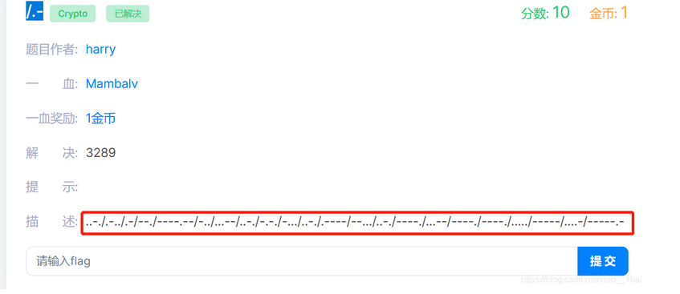

摩斯密码是以.-或01组成的，分隔符有空格或斜杠/，所以直接扔去摩斯密码在线解密即可。

网址：https://www.bejson.com/enc/morse/

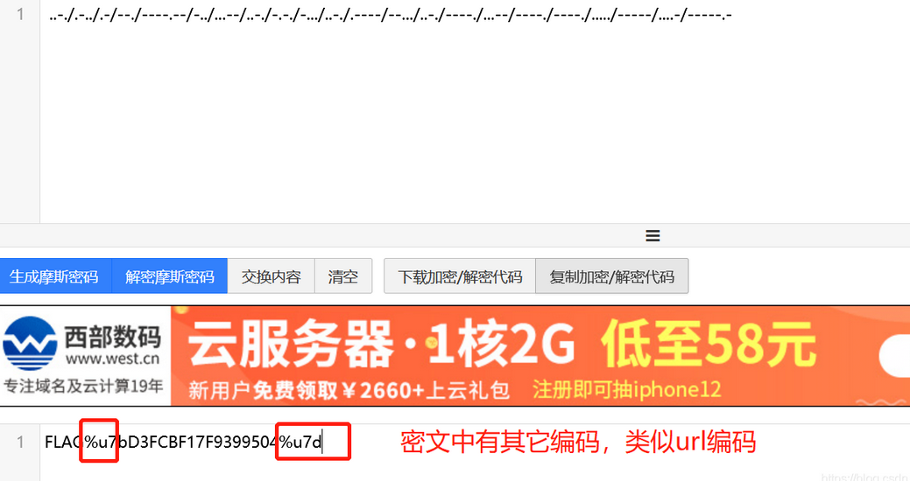

答案差不多了，却被%u7b和%u7d卡住了，猜想是{ }的url编码，{的url编码是%7B，}的url编码是%7D

所以去掉u符号（这里u符号应该是什么十六进制之类的，我也不知道）

直接得到flag：

FLAG{D3FCBF17F9399504}

结果全部要小写：

flag{d3fcbf17f9399504}

#### 攻防世界之混合编码：（base64解密、unicode解密、ASCII转字符脚本、传统base64解密、ASCII解密）

下载附件，打开，发现两个等号和19azA~Z的典型base64编码型，直接base64转换：

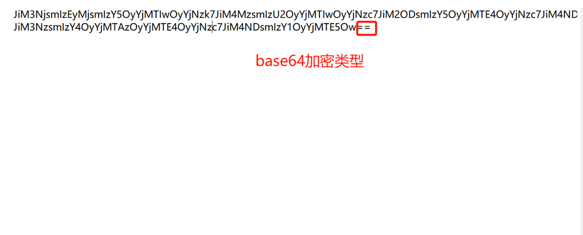

转了一堆&#出来，根据以前的做题经验，猜unicode或hex：

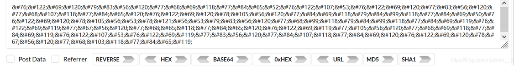

一开始用了十六进制来转，转了个四不像出来，后来发现转错了，unicode在线解码网址：

http://www.jsons.cn/unicode/

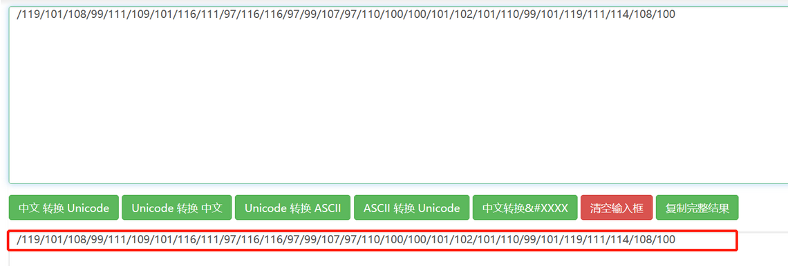

这三个数的看着像ASCII，因为题目暗示混合编码，直接转换看看：ASCCII表对照法：

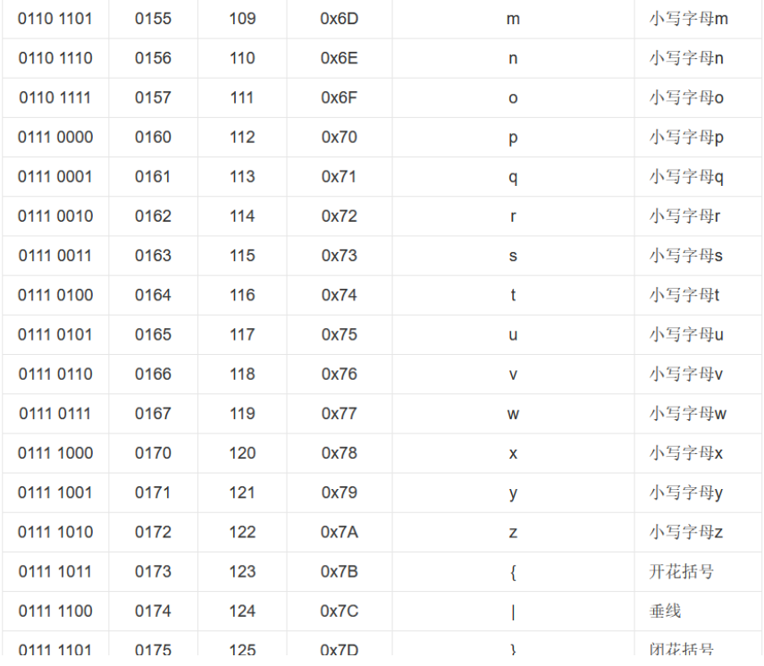

ASCII转字符脚本法：（这里因为string.split切片后返回的是列表，所以可以直接用索引获取。）

```python
import re

r="/119/101/108/99/111/109/101/116/111/97/116/116/97/99/107/97/110/100/100/101/102/101/110/99/101/119/111/114/108/100"

r=re.split("/",r)

#print(r)

flag=""

for i in range(1,len(r)):
    flag+=chr(int(r[i]))

print(flag)
```

### 单层传统加密：

#### Bugku crypto之聪明的小羊：（题目描述暗示、栅栏密码）


好的，传统栅栏密码，下面是我以前的笔记：

所谓栅栏密码，就是把要加密的明文分成N个一组，然后把每组的第1个字连起来，形成一段无规律的话。 不过栅栏密码本身有一个潜规则，就是组成栅栏的字母一般不会太多。（一般不超过30个，也就是一、两句话）

传统栅栏密码(矩阵行列，密钥是行数)：

假如有一个字符串：123456789

取字符串长度的因数进行分组，假如key=3

1 2 3 \\分组情况，每三个数字一组，分为三组

4 5 6

7 8 9

然后每一组依次取一个数字组成一个新字符串：147258369 \\加密完成的字符串

解题：

试一般的栅栏密码,取5为矩阵行数,得到" cyperrocaegireeol} eahfocec gnbip不正确，取5为矩阵列数,得到" cebgccfe en eohplprgecrayoii aoreg”,也不正确，除了常规的栅栏密码,还有

由题目描述可知分两组：

fa{fe13f590

lg6d46d0d0}

那么答案很明显了，上一个下一个即可得flag：

flag{6fde4163df05d900}

#### 攻防世界之转轮机加密：（转轮机加密、）

好了，记住了，以后这个内容格式的就是转轮机加密了：

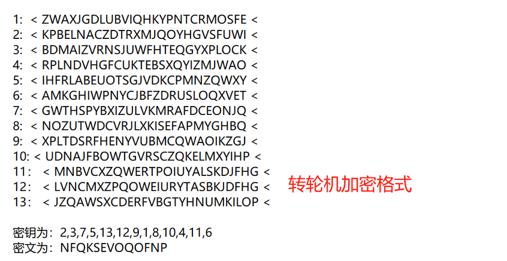

原理就是转齿轮把一个字母换成另一个，直接上一个修改后的大佬脚本：

```python
rotor = [  # 这里是要输入的转轮机原始字符串
    "ZWAXJGDLUBVIQHKYPNTCRMOSFE", "KPBELNACZDTRXMJQOYHGVSFUWI",
    "BDMAIZVRNSJUWFHTEQGYXPLOCK", "RPLNDVHGFCUKTEBSXQYIZMJWAO",
    "IHFRLABEUOTSGJVDKCPMNZQWXY", "AMKGHIWPNYCJBFZDRUSLOQXVET",
    "GWTHSPYBXIZULVKMRAFDCEONJQ", "NOZUTWDCVRJLXKISEFAPMYGHBQ",
    "XPLTDSRFHENYVUBMCQWAOIKZGJ", "UDNAJFBOWTGVRSCZQKELMXYIHP",
    "MNBVCXZQWERTPOIUYALSKDJFHG", "LVNCMXZPQOWEIURYTASBKJDFHG",
    "JZQAWSXCDERFVBGTYHNUMKILOP"
]

cipher = "NFQKSEVOQOFNP"  # 这是要输入转轮机密文
key = [2, 3, 7, 5, 13, 12, 9, 1, 8, 10, 4, 11, 6]  # 这是要输入转轮机密钥
tmp_list = []

for i in range(0, len(rotor)):
    tmp = ""
    k = key[i] - 1
    for j in range(0, len(rotor[k])):
        if cipher[i] == rotor[k][j]:
            if j == 0:
                tmp = rotor[k]
            else:
                tmp = rotor[k][j:] + rotor[k][0:j]
            break

    tmp_list.append(tmp)

# print(tmp_list)

message_list = []

for i in range(0, len(tmp_list[0])):  # 修正循环范围
    tmp = ""
    for j in range(0, len(tmp_list)):
        tmp += tmp_list[j][i]
    message_list.append(tmp)

print(message_list)

def spread_list(lst):
    for item in lst:
        if isinstance(item, (list, tuple)):
            yield from spread_list(item)
        else:
            yield item
    pass

if __name__ == '__main__':
    for i in spread_list(message_list):
        print("*" * 25)
        print(i)  # 在多个输出中查找有语义的字符串即为flag内容
```

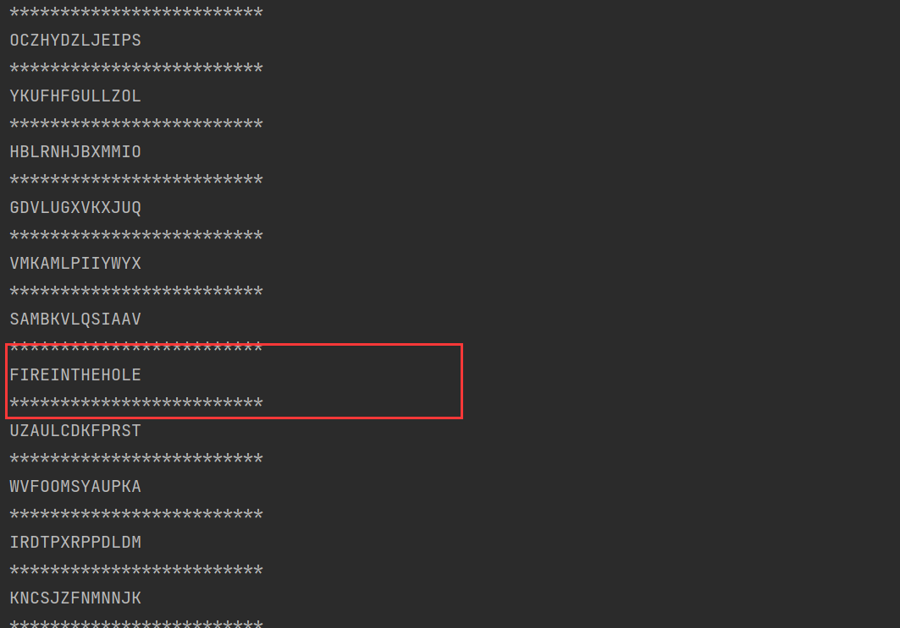


#### 攻防世界之告诉你个秘密：（16进制转字符、键盘密码）

下载附件，是个.txt文件，打开：

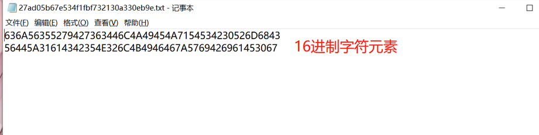

虽然没有f，但是看起来就是16进制的基本组成单位0~F，既然是十六进制就不用先十六进制转字符串，目前接触的也只有十六进制转字符串了：

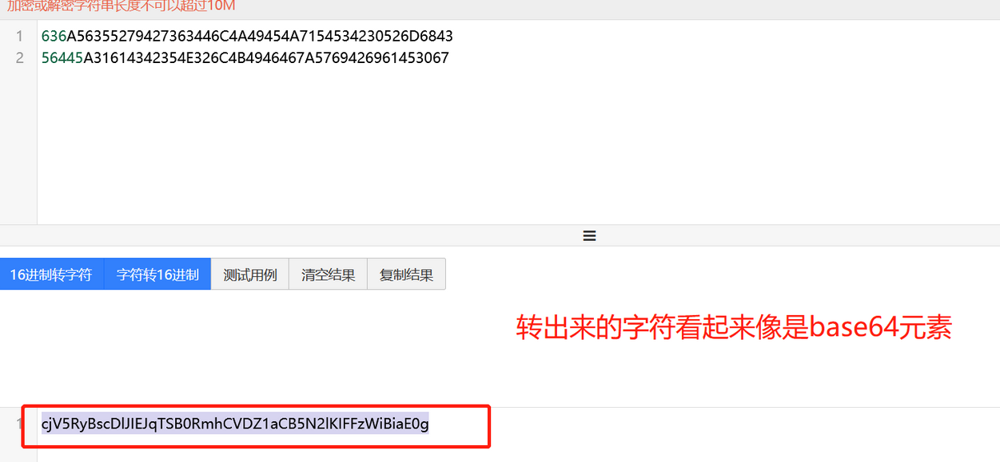

转完之后是大小写字母混合和数字，虽然没有+/，但看起来也的确是base64的基本组成单位了，base64解码一下：

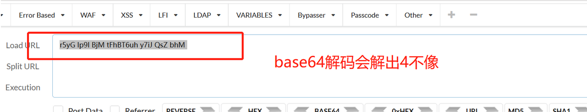

得出的东西是一个四不像，查了很多资料，大部分说是键盘围起来的密码，而且就叫键盘密码。

(唯一的暗示可能就是空格吧，附上别人的一句话：

看到明⽬张胆的空格,再瞅⼀下键盘,发现是键盘密码,)

r5yG lp9I BjM tFhB T6uh y7iJ QsZ bhM

最后flag就是这些字符在键盘中围起来的键，但是要大写才能提交：

TONGYUAN

#### 攻防世界之sherlock：（大小写字符提取密码）

下载附件，是一个txt文档，内容是一篇小说。一开始我以为flag藏在关键字里，我还用百度翻译一个个看内容，现在回想起来真的太傻了，查了资料才发现字符中是有异或点的，大写字母就是要提取出来分析的地方：

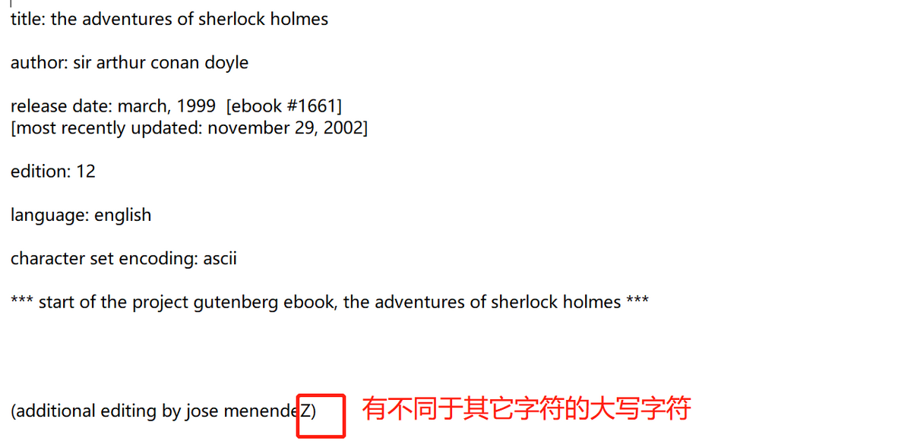

参考了别人的命令写了自己的提取大写shell命令：

```
cat 1.txt | grep -o [A-Z] |tr -d '\n'

cat f590c0f99c014b01a5ab8b611b46c57c.txt | grep -Eo '[A-Z]'| tr -d '\n'
```

其中：

grep -o 只显示匹配到的字符串

tr -d 删除指定字符，不删除换行符的话就很长的打竖显示。

结果：

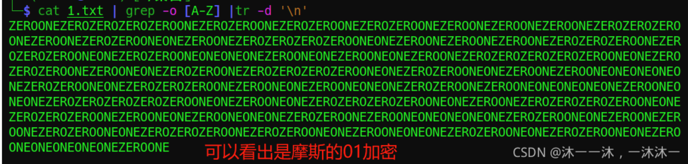

然后可以发现都是ZERO和ONE的单词，不是二进制字符串就是摩斯密码，可是摩斯密码要空格，这里没有，所以是二进制字符串。

然后就是自己写python脚本转换01率，一开始用for语句卡了一下，后来直接换while语句：

```python
key1 = "ZEROONEZEROZEROZEROZEROONEZEROZEROONEZEROZEROONEZEROZEROONEZEROONEZEROONEZEROONEZEROZEROZEROONEZEROONEZEROZEROONEONEZEROONEZEROZEROZEROZEROONEONEZEROONEZEROONEZEROONEZEROZEROZEROONEZEROZEROZEROONEONEZEROZEROONEONEONEONEZEROONEONEZEROONEONEZEROONEZEROZEROZEROZEROZEROONEONEZEROZEROZEROONEZEROONEONEZEROZEROONEZEROZEROZEROZEROONEONEZEROZEROONEONEZEROONEZEROONEONEONEONEONEZEROZEROONEONEZEROZEROZEROONEZEROONEONEZEROONEONEONEZEROZEROONEZEROONEONEONEONEONEZEROONEONEONEZEROZEROZEROZEROZEROONEONEZEROONEONEZEROZEROZEROZEROONEONEZEROONEZEROZEROZEROZEROONEONEZEROZEROZEROONEZEROONEONEZEROONEONEONEZEROZEROONEZEROONEONEONEONEONEZEROZEROONEONEZEROONEZEROONEZEROZEROONEONEZEROZEROZEROONEZEROZEROONEONEZEROONEONEONEZEROZEROONEONEZEROZEROONEONEZEROONEONEONEONEONEZEROONE"

flag = ""
i = 0

while i < len(key1):
    if key1[i] == 'Z' and key1[i + 1] == 'E' and key1[i + 2] == 'R' and key1[i + 3] == 'O':
        i += 4
        flag += '0'
    else:
        flag += '1'
        i += 3

print(flag)
```

结果：

```
010000100100100101010100010100110100001101010100010001100111101101101000001100010110010000110011010111110011000101101110010111110111000001101100001101000011000101101110010111110011010100110001001101110011001101111101

二进制转字符
BITSCTF{h1d3_1n_pl41n_5173}
```

#### 攻防世界之Decrypt-the-Message：（poem codes诗歌加密、）

下载附件，是个.txt文件，内容是诗歌，下面是一行四不像的英文，后来发现是加密后的密文：

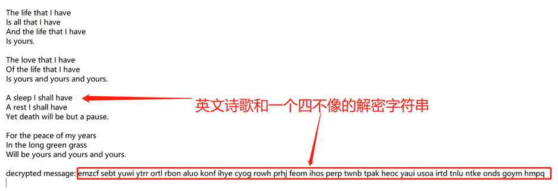

诗歌类的加密：

一开始还以为是唐伯虎点秋香中句子开头组成实际内容，结果发现不是。查了查资料，是poem codes加密。

然后，我也不知道诗歌中关键词在哪，而且题目诗歌内容也太长了，所以只能用github的脚本了：

```python
#python2
#poemcode.py
import sys
import itertools
from os import listdir
from os.path import isfile, join

abc='abcdefghijklmnopqrstuvwxyz'

def loadlist(infile):
	tlist = []
	for line in open(infile,'r'):
		for w in line.split(): tlist.append(w.lower())
	return tlist

def encrypt(code, poem, msg):
	# Load all words of the poem into a temporary list
	twords = loadlist(poem)

	# Select only those words specified in the code in a new list
	pwords = ''
	for c in code: pwords += twords[c].lower()
	plen = len(pwords)

	# We can only support encoding all alphabetical letters, a key length greater len(abc) is not reasonable here
	if plen > len(abc): sys.exit(3)

	# Assign an index for each letter in the key based on the alphabet
	pcode = [None] * plen
	count = 0
	while(count<plen):
		for al in abc:
			for pc, pl in enumerate(pwords):
				if al!=pl: continue
				pcode[pc]=count
				count+=1

	# Load all words of the message into a string
	mwords = ''
	for line in open(msg, 'r'):
		for w in line.split(): mwords+=w.lower()
	mlen = len(mwords)

	# Split message into chunks of size plen, append random (here alphabet) characters to fill the last chunk, if necessary
	cpairs = []
	curlen = plen
	while(curlen<mlen):
		cpairs.append(mwords[curlen-plen:curlen])
		curlen+=plen
	rword = mwords[curlen-plen:curlen]
	rlen = len(rword)
	if rlen < plen: rword += abc[:plen-rlen]
	cpairs.append(rword)

	# Encrypt the message according to the key
	cip = ''
	for i in code: cip+=abc[i]
	cip+=' '
	for i in pcode:
		for pair in cpairs:
			cip += pair[i]
		cip+=' '
	return cip

def decrypt(poem, cip):
	# Load all words of the poem into a temporary list
	twords = loadlist(poem)

	# Load all cipher chunks of the ciphertext into a list
	cwords = loadlist(cip)

	# Get the code rom the first chunk and remove it from the ciphertext list
	code = []
	for i in cwords.pop(0):
		code.append(abc.index(i))
	
	# Select only those words specified in the code in a new multi-arrayed list
	xwords = [[] for x in range(len(code))]
	for xcount, c in enumerate(code):
		tlen = c
		while(c<len(twords)):
			xwords[xcount].append(twords[c].lower())
			c+=26

	# Get all possible combinations
	for comb in itertools.product(*xwords):
		pwords = ''
		for c in comb: pwords+=c
		plen = len(pwords)

		# Rearrange the chunks according to the key
		pcode = [None] * plen
		count = 0
		while(count<plen):
			for al in abc:
				for pc, pl in enumerate(pwords):
					if al!=pl: continue
					pcode[count]=cwords[pc]
					count+=1

		# Decrypt the ciphertext
		msg = ''
		wlen = len(pcode[0])
		for c in range(0, wlen):
			for word in pcode:
				msg+=word[c]
		print msg

# first argument = poem
# second argument = ciphertxt or msg
if len(sys.argv) != 3: sys.exit(2)

#print encrypt([0, 5, 13, 16, 19], sys.argv[1], sys.argv[2])
decrypt(sys.argv[1], sys.argv[2])
```

用法：(python2，ctfpoem是诗歌，ctfcip是加密密文),放到同一目录

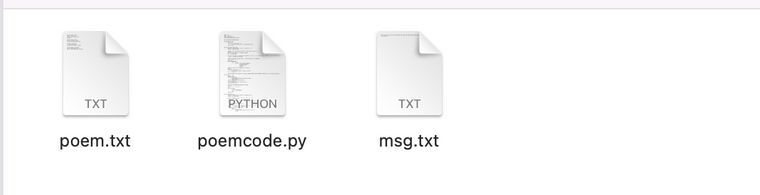

```
python2 poemcode.py poem.txt  msg.txt
```

结果，在众多输出中找到通顺的句子，其实后面我也不知道后面开头的单词合不合理，英语太菜了~(哭 ~)

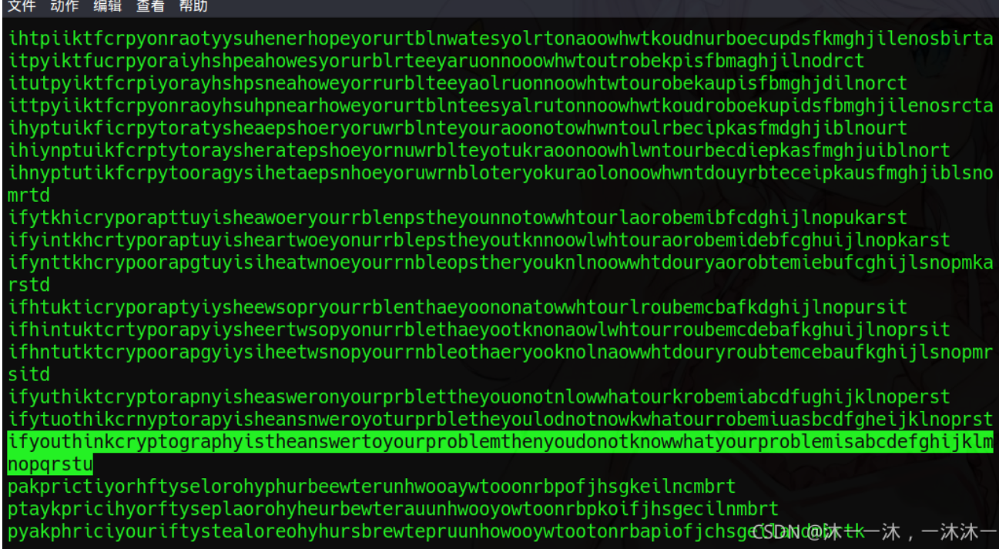

## 6.文件相关类型：

### 攻防世界之你猜猜：（16进制转字符、传统base64解密、16进制文件流）

下载附件，是一个.txt文件，打开，数字和字母：

```
504B03040A0001080000626D0A49F4B5091F1E0000001200000008000000666C61672E7478746C9F170D35D0A45826A03E161FB96870EDDFC7C89A11862F9199B4CD78E7504B01023F000A0001080000626D0A49F4B5091F1E00000012000000080024000000000000002000000000000000666C61672E7478740A0020000000000001001800AF150210CAF2D1015CAEAA05CAF2D1015CAEAA05CAF2D101504B050600000000010001005A000000440000000000
```

字母只有A~F，16进制解码：


嗯~好熟悉，后来想起来是web题中bp抓过的数据，查了资料发现是一个zip文件的16进制数据，竟然这么短也能组成zip的数据，也是开了眼界，zip里面也可以看到有个flag.txt文件。

一开始还直接修改成.zip后缀，真是太天真了，这是把hex数据放入txt文件啊。

打开winhex64复制粘贴成zip文件即可：（左上角编辑，选择剪切板数据--粘贴至新文件-Ascii-Hex）

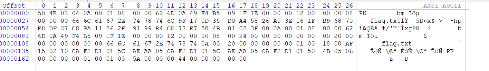

之后另存为fuck.zip

解密的时候发现需要密码，也不是zip伪加密。嗯~查了资料，上网下载了Ziperello来爆破密码，密码组成只能一个个试了：

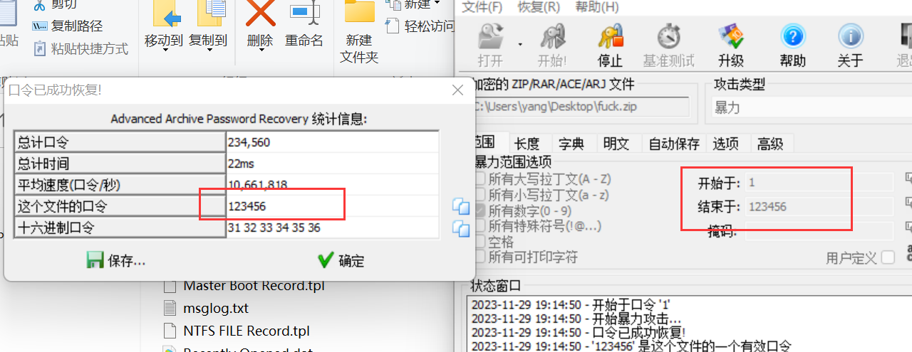

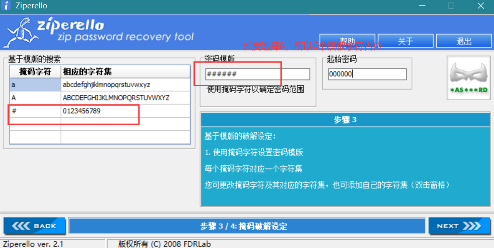

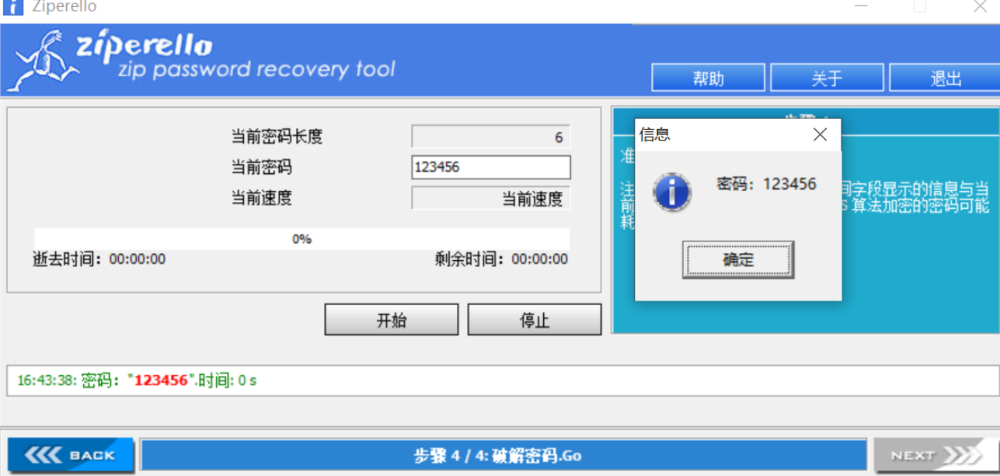

拿到了密码123456，解压得到flag：

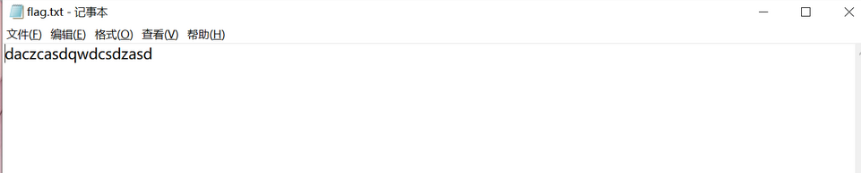

### 攻防世界之banana-princess：（ROT13加密、文件流加密）

下载附件，是一个PDF文件，打不开，题目英文提示香蕉原则，好吧并没有什么用。(^ ~ ^)用记事本打开看一下内容：

看起来像是一个文件流：

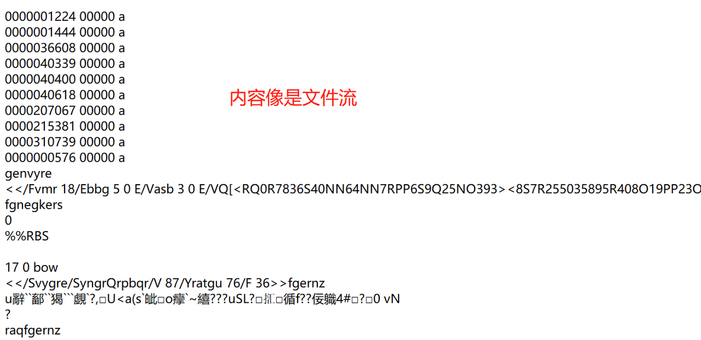

扔到winhex64中再看一下，嗯~其实一开始我也看不出有什么不妥，红框那里是查了资料说与正常PDF有不同。

我们将其放入[winhex](https://so.csdn.net/so/search?q=winhex&spm=1001.2101.3001.7020)中，并打开一个正常的pdf文件，观察并对比其中的差异，正常的如图：

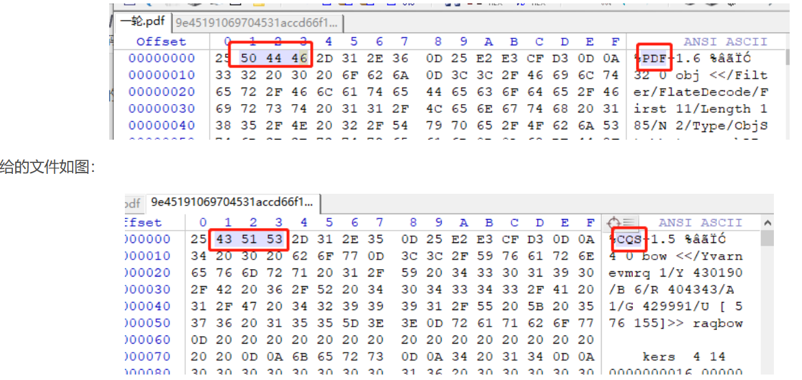


`50 44 46 -> 43 51 53`，将其转换成十进制，`80 68 70 -> 67 81 83`，发现字节之间的差值为13。猜测可能是ROT13加密。

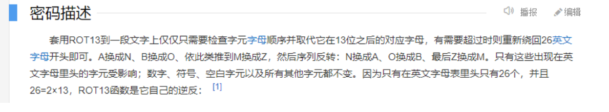

将来pdf丢入kali中：（PS：kali中tr命令的使用：https://blog.csdn.net/weixin_40746176/article/details/104511547）

```
cat 1.pdf | tr 'A-Za-z' 'N-ZA-Mn-za-m' > res.pdf
```

然后，转出来的PDF还自带黑格隐藏，一开始我都不记得怎么分离了，后来查资料说转html可以分离，因为这是两张图片重叠在一起而已。事实上用我的嗨格式永久VIP会员PDF转HTML、WORD、PPT都是可以分离的。

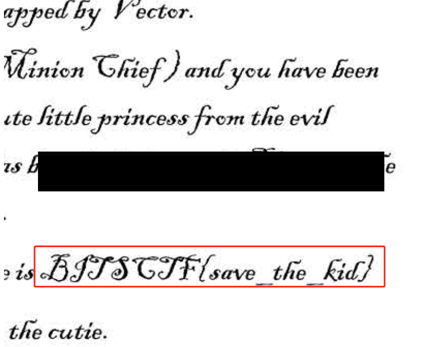

## 7. 流量相关类型：

### 攻防世界之工业协议分析2：（16进制转字符、）

下载附件，是一个pcapng流量文件：


1. 题目提示去分析异常点，就可得到flag，猜测flag就藏在文件中。字符串’flag{'的16进制编码为0x666c61677b。
2. 在[wireshark](https://so.csdn.net/so/search?q=wireshark&spm=1001.2101.3001.7020)中直接查找16进制的字符串，并未找到。猜测该16进制的字符串应该是存放在16进制表的右侧。即该字符串以16进制的方式存储。将该字符串再次转为16进制，得到 36363663363136373762
3. 在wireshark中查找该字符串(**Ctrl+N打开查找对话框，就可以选择文本查找，16进制查找了**)，找到相应位置

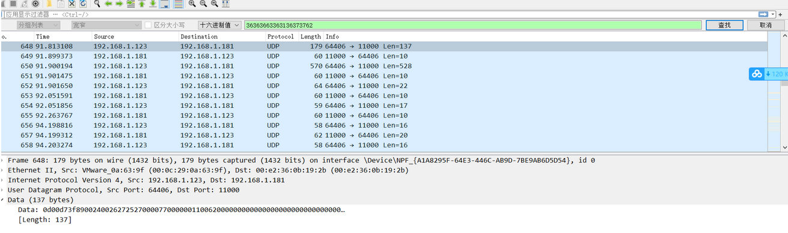

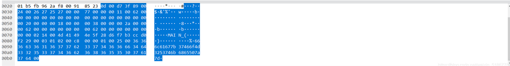

将找到的16进制字符串转为字符，得到flag

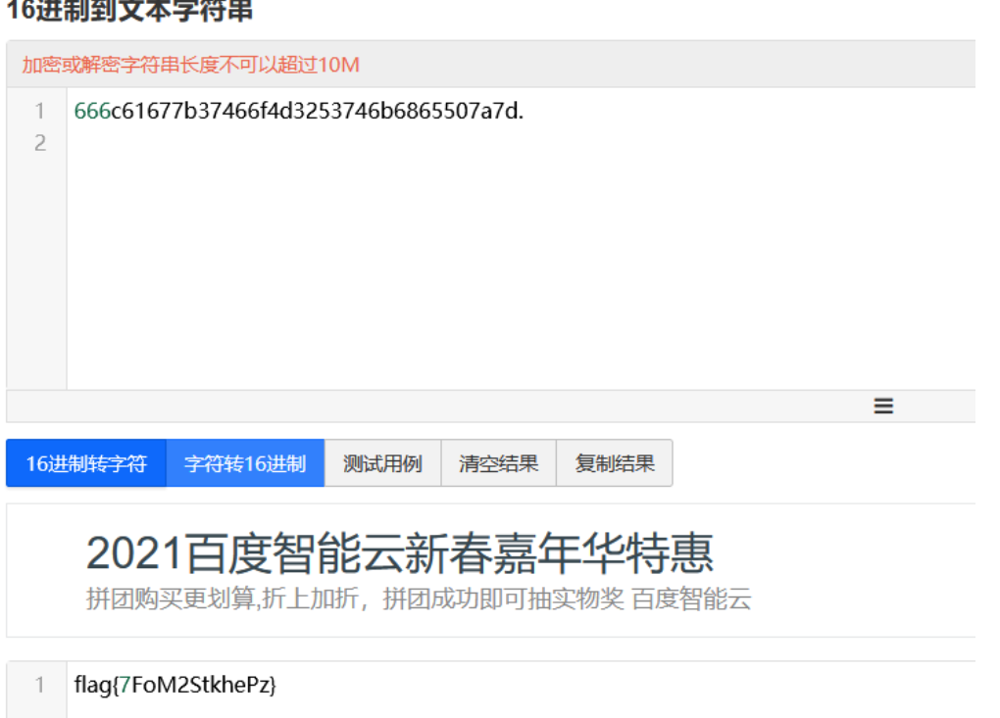


#### 思路二：查找长度异常的包

1. 用wireshark打开pcapng文件
2. 查看长度异常（如仅出现一次）的UDP流量包。对长度排个序
    [](https://img2020.cnblogs.com/blog/1931211/202008/1931211-20200823174211616-372135633.png)
3. 发现147，173，179等包可能异常
    [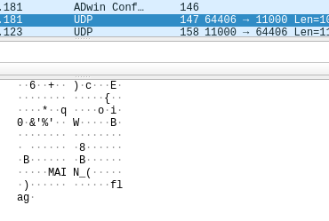](https://img2020.cnblogs.com/blog/1931211/202008/1931211-20200823174342454-1182311841.png)
    长度147的包尾部有flag标志，但没有更多信息。
    [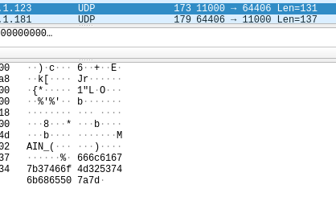](https://img2020.cnblogs.com/blog/1931211/202008/1931211-20200823174459399-1984856475.png)
    长度为173和179的包尾部有一串相同的16进制数，转为ASCII后，均为flag


## 8. 加密逻辑平铺类型

### 传统密码加密逻辑平铺：

#### 2021年9月绿城杯，CRYPTO的[warmup]加密算法：（暴力破解、仿射密码（affine）、下标对应解密）

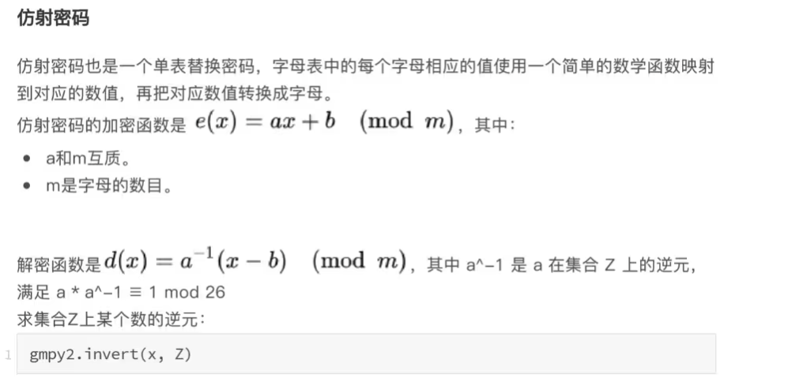

下载附件，是一个文本文件task.py，逻辑代码平铺在里面,打开文件，发现是一个简单的加密表单元素下标对应加密：

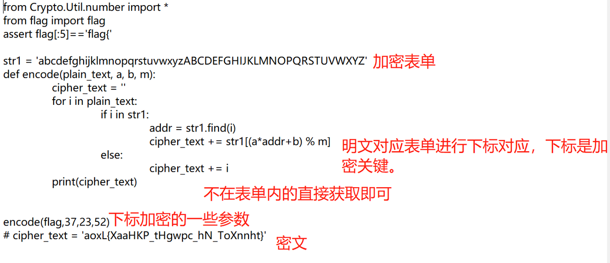

正向爆破

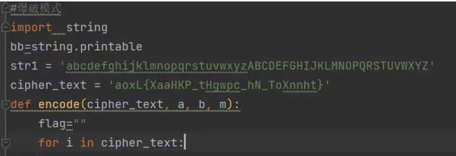

```python
#爆破模式
import  string
bb=string.printable
str1 = 'abcdefghijklmnopqrstuvwxyzABCDEFGHIJKLMNOPQRSTUVWXYZ'
cipher_text = 'aoxL{XaaHKP_tHgwpc_hN_ToXnnht}'
def encode(cipher_text, a, b, m):
    flag=""
    for i in cipher_text:
        for j in bb:
            if j in str1:
                addr = str1.find(j)
                if i== str1[(a * addr + b) % m]:
                    flag+=j
            else:
                if i==j:
                    flag += j
    print(flag)
encode(cipher_text,37,23,52)
```

解密模式 

```python
import gmpy2


import  string
bb=string.printable
cipher_text = 'aoxL{XaaHKP_tHgwpc_hN_ToXnnht}'
str1 = 'abcdefghijklmnopqrstuvwxyzABCDEFGHIJKLMNOPQRSTUVWXYZ'
#仿射解码模式
def decode(cipher_text, a, b, m):
    flag=""
    for i in cipher_text:
            if i in str1:
                addr = str1.find(i)
                a1=gmpy2.invert(a,m)
                j=str1[a1*(addr - b) % m]
                flag+=j
            else:
                flag += i
    print(flag)
decode(cipher_text,37,23,52)
```

或者直接工具解密

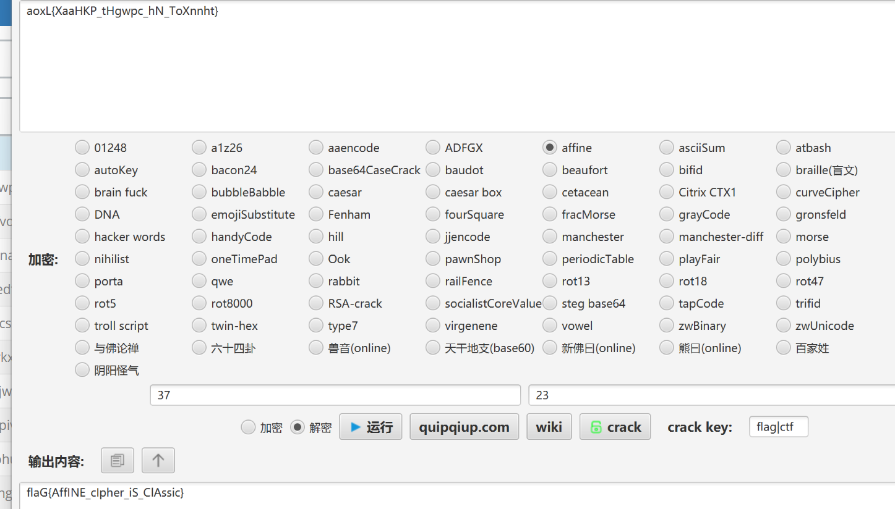

## 9.复杂加密类型

### 9.1 RSA直接给参数类型：

#### 攻防世界之cr3-what-is-this-encryption：（RSA通用脚本解密）

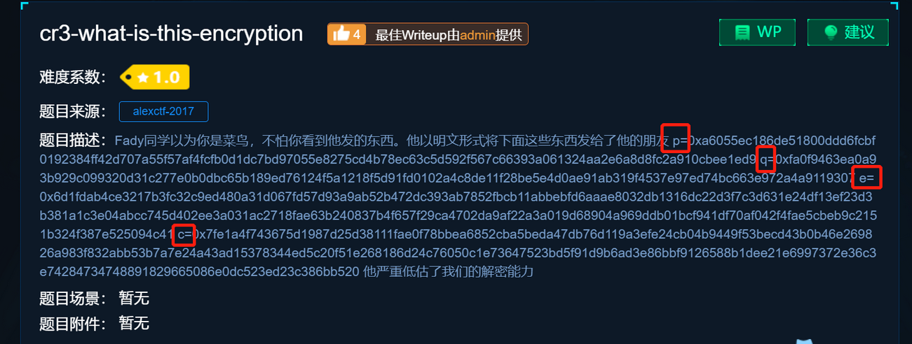

没有附件，依稀看得出有q、p、e、c，是简单的RSA题目，用我之前积累的RSA脚本CTF-RSA-tool跑一下，。。。跑不出来：(反复试了好多次，还是报错，我放弃了)

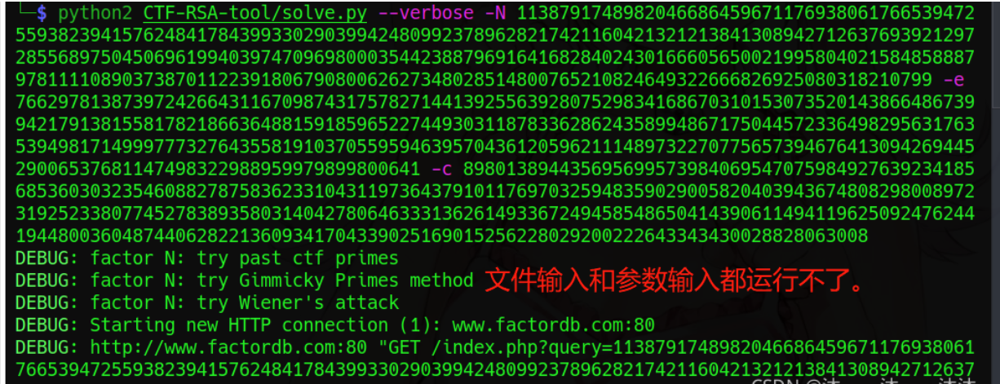

然后在网上查资料中找到一个讲得比较好的脚本和讲解：

https://www.cnblogs.com/zhengna/p/13501563.html

RSA的密钥对生成算法：

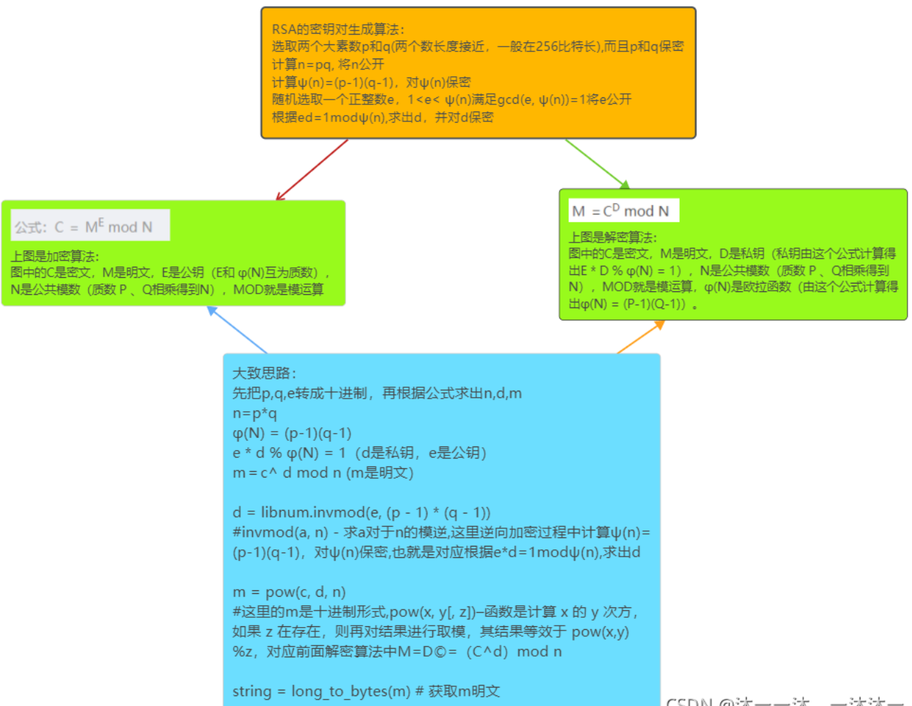

讲得很透彻了，解密的算法也提供了，附上脚本和我的一点点见解：（这是RSA通用脚本）

```python
import libnum
from Crypto.Util.number import long_to_bytes

q = int("0xa6055ec186de51800ddd6fcbf0192384ff42d707a55f57af4fcfb0d1dc7bd97055e8275cd4b78ec63c5d592f567c66393a061324aa2e6a8d8fc2a910cbee1ed9",16)
p = int("0xfa0f9463ea0a93b929c099320d31c277e0b0dbc65b189ed76124f5a1218f5d91fd0102a4c8de11f28be5e4d0ae91ab319f4537e97ed74bc663e972a4a9119307",16)
e = int("0x6d1fdab4ce3217b3fc32c9ed480a31d067fd57d93a9ab52b472dc393ab7852fbcb11abbebfd6aaae8032db1316dc22d3f7c3d631e24df13ef23d3b381a1c3e04abcc745d402ee3a031ac2718fae63b240837b4f657f29ca4702da9af22a3a019d68904a969ddb01bcf941df70af042f4fae5cbeb9c2151b324f387e525094c41",16)
c = 0x7fe1a4f743675d1987d25d38111fae0f78bbea6852cba5beda47db76d119a3efe24cb04b9449f53becd43b0b46e269826a983f832abb53b7a7e24a43ad15378344ed5c20f51e268186d24c76050c1e73647523bd5f91d9b6ad3e86bbf9126588b1dee21e6997372e36c3e74284734748891829665086e0dc523ed23c386bb520
n = q * p
d = libnum.invmod(e, (p - 1) * (q - 1)) #invmod(a, n) - 求a对于n的模逆,这里逆向加密过程中计算ψ(n)=(p-1)(q-1)，对ψ(n)保密,也就是对应根据ed=1modψ(n),求出d
m = pow(c, d, n) # pow(x, y[, z])--函数是计算 x 的 y 次方，如果 z 在存在，则再对结果进行取模，其结果等效于 pow(x,y) %z，对应前面解密算法中M=D(C)=C^d(mod n)
#print(m) #明文的十进制格式
string = long_to_bytes(m) # m明文，用长字节划范围
print(string.decode())


#ALEXCTF{RS4_I5_E55ENT1AL_T0_D0_BY_H4ND}
```

#### 攻防世界之OldDriver：（低加密指数e广播攻击）

下载附件，一个.txt文件，打开，发现是c、n、e的RSA类型题：

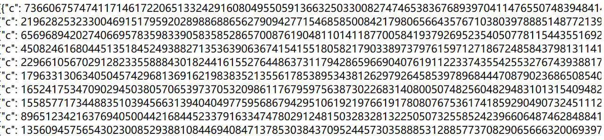

上网查了查，发现类型是低加密指数广播攻击，这里附上别人的话：(里面的中国剩余定理我还没看懂)

首先介绍什么是广播，加入我们需要将一份明文进行多份加密，但是每份使用不同的密钥，密钥中的模数n不同但指数e相同且很小，我们只要拿到多份密文和对应的n就可以利用中国剩余定理进行解密。关于中国剩余定理请参考文章：

https://www.cnblogs.com/freinds/p/6388992.html

只要满足以下情况，我们便可以考虑使用低加密指数广播攻击：

加密指数e非常小

一份明文使用不同的模数n，相同的加密指数e进行多次加密

可以拿到每一份加密后的密文和对应的模数n、加密指数e

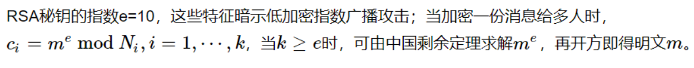

##### 解题脚本

```python
#python3
import gmpy2
from functools import reduce
from Crypto.Util.number import long_to_bytes


# 中国剩余定理
def CRT(cipher, n):
    N = reduce(lambda x, y: x * y, (i for i in n))
    result = 0
    data = zip(cipher, n)
    for ci, ni in data:
        Ni = N // ni
        di = gmpy2.invert(Ni, ni)
        result += ci * Ni * di
    return result % N, N


# 读入 e, n, c
e = 10

c = [
    7366067574741171461722065133242916080495505913663250330082747465383676893970411476550748394841437418105312353971095003424322679616940371123028982189502042,
    21962825323300469151795920289886886562790942771546858500842179806566435767103803978885148772139305484319688249368999503784441507383476095946258011317951461,
    6569689420274066957835983390583585286570087619048110141187700584193792695235405077811544355169290382357149374107076406086154103351897890793598997687053983,
    4508246168044513518452493882713536390636741541551805821790338973797615971271867248584379813114125478195284692695928668946553625483179633266057122967547052,
    22966105670291282335588843018244161552764486373117942865966904076191122337435542553276743938817686729554714315494818922753880198945897222422137268427611672,
    17963313063405045742968136916219838352135561785389534381262979264585397896844470879023686508540355160998533122970239261072020689217153126649390825646712087,
    1652417534709029450380570653973705320986117679597563873022683140800507482560482948310131540948227797045505390333146191586749269249548168247316404074014639,
    15585771734488351039456631394040497759568679429510619219766191780807675361741859290490732451112648776648126779759368428205194684721516497026290981786239352,
    8965123421637694050044216844523379163347478029124815032832813225050732558524239660648746284884140746788823681886010577342254841014594570067467905682359797,
    13560945756543023008529388108446940847137853038437095244573035888531288577370829065666320069397898394848484847030321018915638381833935580958342719988978247]
n = [
    25162507052339714421839688873734596177751124036723831003300959761137811490715205742941738406548150240861779301784133652165908227917415483137585388986274803,
    23976859589904419798320812097681858652325473791891232710431997202897819580634937070900625213218095330766877190212418023297341732808839488308551126409983193,
    18503782836858540043974558035601654610948915505645219820150251062305120148745545906567548650191832090823482852604346478335353784501076761922605361848703623,
    23383087478545512218713157932934746110721706819077423418060220083657713428503582801909807142802647367994289775015595100541168367083097506193809451365010723,
    31775649089861428671057909076144152870796722528112580479442073365053916012507273433028451755436987054722496057749731758475958301164082755003195632005308493,
    22246342022943432820696190444155665289928378653841172632283227888174495402248633061010615572642126584591103750338919213945646074833823905521643025879053949,
    25395461142670631268156106136028325744393358436617528677967249347353524924655001151849544022201772500033280822372661344352607434738696051779095736547813043,
    32056508892744184901289413287728039891303832311548608141088227876326753674154124775132776928481935378184756756785107540781632570295330486738268173167809047,
    52849766269541827474228189428820648574162539595985395992261649809907435742263020551050064268890333392877173572811691599841253150460219986817964461970736553,
    30415984800307578932946399987559088968355638354344823359397204419191241802721772499486615661699080998502439901585573950889047918537906687840725005496238621]

x, N = CRT(c, n)

m = gmpy2.iroot(gmpy2.mpz(x), e)[0]

print(m)
print(long_to_bytes(m))
```


### 9.2 RSA明文密钥文件类型：

#### 攻防世界之best_rsa：（明文密钥文件提取参数、RSA共模攻击、CTF-RSA-tool脚本修改）

下载题目，是一个明文和密钥的4个附件：

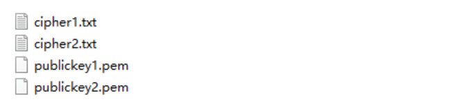

1. 先从两个公钥文件中提取公钥信息

```python
from Crypto.PublicKey import RSA

f1 = open("F:\\ChromeCommon\\c2d6e7158d7b4cd6a747774f0bdc5f72\\publickey1.pem","rb").read()
f2 = open("F:\\ChromeCommon\\c2d6e7158d7b4cd6a747774f0bdc5f72\\publickey2.pem","rb").read()
pub1 = RSA.importKey(f1)
pub2 = RSA.importKey(f2)
n1 = pub1.n
e1 = pub1.e
n2 = pub2.n
e2 = pub2.e
print(n1)
print(n2)
print(e1)
print(e2)
```

> n1 =  13060424286033164731705267935214411273739909173486948413518022752305313862238166593214772698793487761875251030423516993519714215306808677724104692474199215119387725741906071553437840256786220484582884693286140537492541093086953005486704542435188521724013251087887351409946184501295224744819621937322469140771245380081663560150133162692174498642474588168444167533621259824640599530052827878558481036155222733986179487577693360697390152370901746112653758338456083440878726007229307830037808681050302990411238666727608253452573696904083133866093791985565118032742893247076947480766837941319251901579605233916076425572961
>  n2 =  13060424286033164731705267935214411273739909173486948413518022752305313862238166593214772698793487761875251030423516993519714215306808677724104692474199215119387725741906071553437840256786220484582884693286140537492541093086953005486704542435188521724013251087887351409946184501295224744819621937322469140771245380081663560150133162692174498642474588168444167533621259824640599530052827878558481036155222733986179487577693360697390152370901746112653758338456083440878726007229307830037808681050302990411238666727608253452573696904083133866093791985565118032742893247076947480766837941319251901579605233916076425572961
>  e1 = 117
>  e2 = 65537

也可以用openssl工具提取：

```
openssl rsa -pubin -text -modulus -in publickey1/2.pem
```

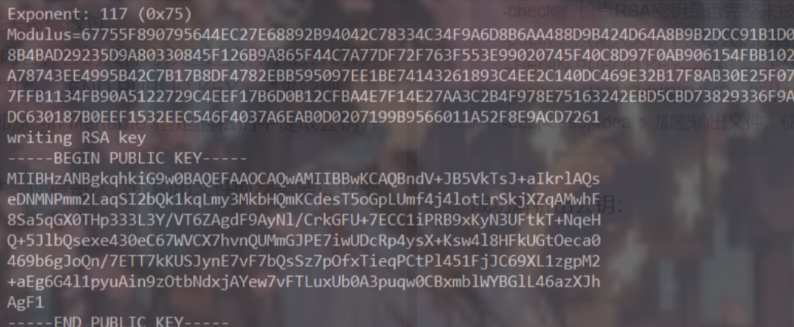


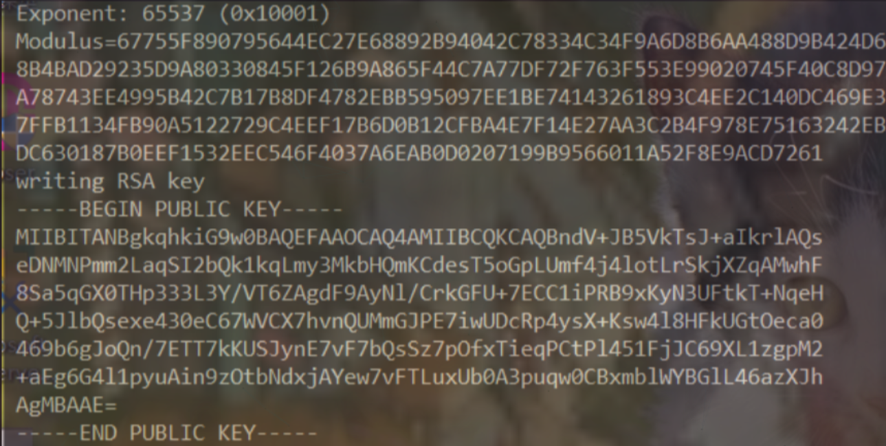

1. 发现`n1==n2`，所以[共模攻击](https://www.cnblogs.com/vict0r/p/13292511.html)（此前已有总结，不再赘述）
2. 利用以前的共模攻击代码（通用）即可

```python
from Crypto.PublicKey import RSA
import libnum
import gmpy2

c1=libnum.s2n(open('cipher1.txt','rb').read())
c2=libnum.s2n(open('cipher2.txt','rb').read())

pub1=RSA.importKey(open('publickey1.pem').read())
pub2=RSA.importKey(open('publickey2.pem').read())
n = pub1.n
e1= pub1.e
e2= pub2.e

s = gmpy2.gcdext(e1,e2)
s1 = s[1]
s2 = s[2]

if s1<0:
	s1 = -s1
	c1 = gmpy2.invert(c1, n)
elif s2<0:
	s2 = -s2
	c2 = gmpy2.invert(c2, n)

m = pow(c1,s1,n)*pow(c2,s2,n) % n
flag = libnum.n2s(m)
print(flag)
```


#### 攻防世界之RSA256

下载压缩包，解压，是两个附件，一个没有后缀，一个.txt文件，打开查看内容，感觉是RSA的密文密钥文件：

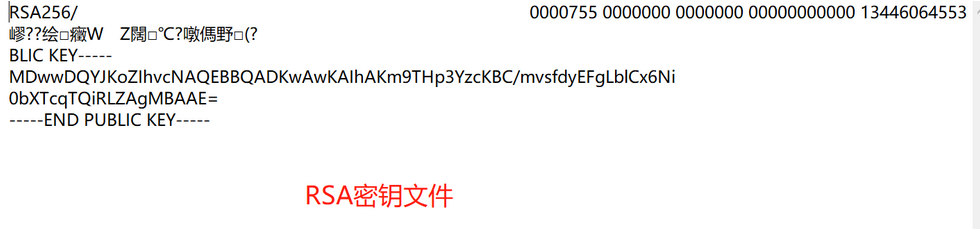

##### 解法1：CTF-RSA-tool直接解

翻一下以前的笔记，这是对CTF-RSA-tool使用的示例，感觉题目类型就是这种密钥和密文的文件：

命令：

```
python2 solve.py --verbose -k 密钥文件 --decrypt 密文文件
```

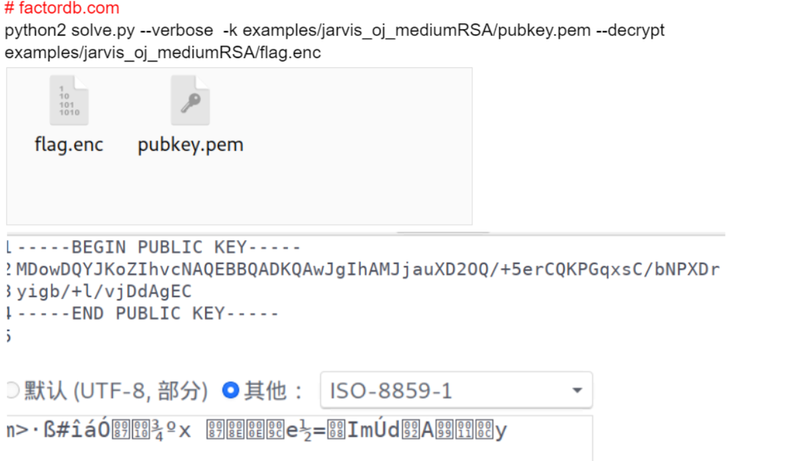

验证猜想，直接脚本跑一下，得到flag：

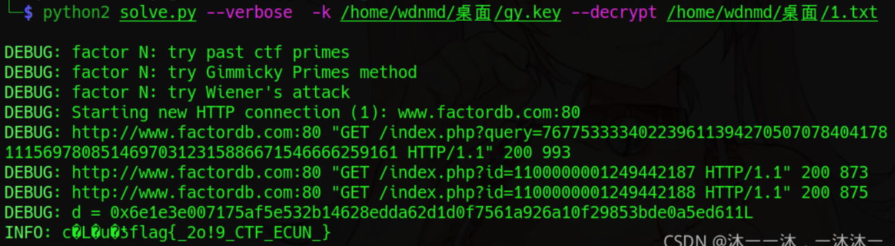

##### 解法2：一步步获取需要的参数，来解密

> 目标： 寻找 n、e、q、p

打开 kali ，利用 [openssl](https://baike.baidu.com/item/openssl/5454803?fr=aladdin) 工具

输入以下命令：

```
openssl rsa -pubin -text -modulus -in gy.key
```

[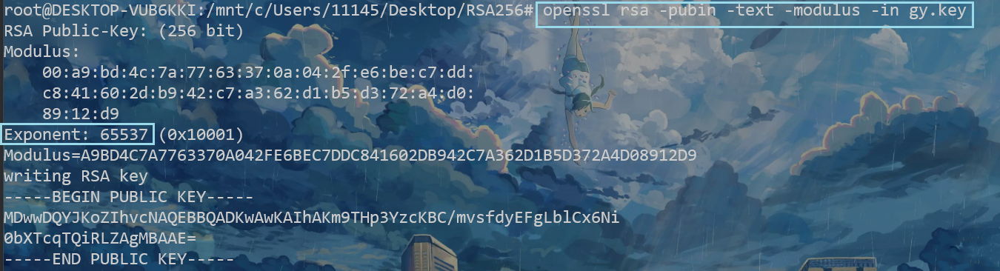](https://img2020.cnblogs.com/blog/2109948/202008/2109948-20200818191623903-1339177095.png)


得到： `e： 65537 (0x10001)`

> openssl rsa [-inform PEM|NET|DER] [-outform PEM|NET|DER] [-in  filename] [-passin arg] [-out filename] [-passout arg] [-sgckey] [-des]  [-des3] [-idea] [-text] [-noout] [-modulus] [-check] [-pubin] [-pubout]  [-engine id]

-in filename：指明私钥文件

-out filename：指明将提取出的公钥保存至指定文件中

-pubout：根据私钥提取出公钥

如题  ： 【攻防世界】[就在其中](https://adworld.xctf.org.cn/task/answer?type=misc&number=1&grade=1&id=4925&page=2)

```
openssl rsautl -decrypt -in key.txt -inkey psa.key -out flag.txt
```

> 密文： key.txt
>
> 私钥：psa.key
>
> 破解保存到 flag.txt

注意到上一步骤中，得到了：

```
Modulus=A9BD4C7A7763370A042FE6BEC7DDC841602DB942C7A362D1B5D372A4D08912D9
Modulus的值目前是十六进制，需转化为十进制：
```

[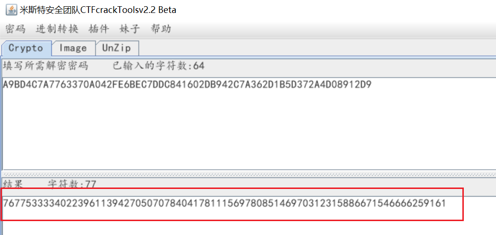](https://img2020.cnblogs.com/blog/2109948/202008/2109948-20200818192341854-2031161850.png)
得到 `n：76775333340223961139427050707840417811156978085146970312315886671546666259161`

已知 n = 76775333340223961139427050707840417811156978085146970312315886671546666259161

分解n

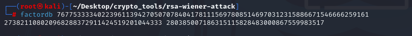

```
p =  273821108020968288372911424519201044333
q =  280385007186315115828483000867559983517
```

至于跑脚本的库的提前准备，可参考我 [之前一篇博客中的环境准备](https://www.cnblogs.com/Jlay/p/RSA_Environment.html) 。

```python
#coding:utf-8
import gmpy2
import rsa
p = 273821108020968288372911424519201044333
q = 280385007186315115828483000867559983517
n = 76775333340223961139427050707840417811156978085146970312315886671546666259161
e = 65537
d = int(gmpy2.invert(e,(p-1)*(q-1)))
privatekey = rsa.PrivateKey(n,e,d,p,q)
with open("E:\\fllllllag.txt","rb") as f:
    print(rsa.decrypt(f.read(),privatekey).decode())
```


[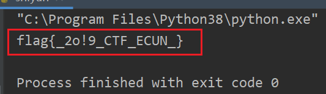](https://img2020.cnblogs.com/blog/2109948/202008/2109948-20200818191735326-191212481.png)


### 9.3 RSA脚本逻辑加密类型：

#### 2021年9月广州羊城杯，CRYPTO的BigRsa：（RSA多层模n加密、RSA模不互素）

下载附件，pub.py打开文件，发现内容是RSA加密过程：

```python
from Crypto.Util.number import *

from flag import *

n1 = 103835296409081751860770535514746586815395898427260334325680313648369132661057840680823295512236948953370895568419721331170834557812541468309298819497267746892814583806423027167382825479157951365823085639078738847647634406841331307035593810712914545347201619004253602692127370265833092082543067153606828049061

n2 = 115383198584677147487556014336448310721853841168758012445634182814180314480501828927160071015197089456042472185850893847370481817325868824076245290735749717384769661698895000176441497242371873981353689607711146852891551491168528799814311992471449640014501858763495472267168224015665906627382490565507927272073

e = 65537

m = bytes_to_long(flag)

c = pow(m, e, n1)

c = pow(c, e, n2)

print("c = %d" % c)
# output

# c = 60406168302768860804211220055708551816238816061772464557956985699400782163597251861675967909246187833328847989530950308053492202064477410641014045601986036822451416365957817685047102703301347664879870026582087365822433436251615243854347490600004857861059245403674349457345319269266645006969222744554974358264
```

解题：

```
题目给出两个N，首先利用gcd测试一下，如果存在一个公因数，那么则存在共享素数
```

[](javascript:void(0);)

```python
import gmpy2
from Crypto.Util.number import *
n1 = 103835296409081751860770535514746586815395898427260334325680313648369132661057840680823295512236948953370895568419721331170834557812541468309298819497267746892814583806423027167382825479157951365823085639078738847647634406841331307035593810712914545347201619004253602692127370265833092082543067153606828049061
n2 = 115383198584677147487556014336448310721853841168758012445634182814180314480501828927160071015197089456042472185850893847370481817325868824076245290735749717384769661698895000176441497242371873981353689607711146852891551491168528799814311992471449640014501858763495472267168224015665906627382490565507927272073
e = 65537
q = gmpy2.gcd(n1,n2)
print(q)
# 10210039189276167395636779557271057346691950991057423589319031237857569595284598319093522326723650646963251941930167018746859556383067696079622198265424441

# 由于存在共享素数，那么直接可以算得n1,n2另一个因子
p1 = n1 // q
p2 = n2 // q
# 下面就是基本操作了，算欧拉，求逆元
d1 = gmpy2.invert(e,(q-1)*(p1-1))
d2 = gmpy2.invert(e,(q-1)*(p2-1))
# 按照题目加密顺序反向解密
c = 60406168302768860804211220055708551816238816061772464557956985699400782163597251861675967909246187833328847989530950308053492202064477410641014045601986036822451416365957817685047102703301347664879870026582087365822433436251615243854347490600004857861059245403674349457345319269266645006969222744554974358264
m = pow(c,d2,n2)
m = pow(m,d1,n1)
print(long_to_bytes(m))
```

解得：b'SangFor{qSccmm1WrgvIg2Uq_cZhmqNfEGTz2GV8}

#### 2021年9月绿城杯，CRYPTO的RSA-2：（费马分解算法）

下载附件，是逻辑平铺类型：

打开文件，发现是分成两段的RSA加密，第一段加密flag[:20]，第二段加密flag[20:]：

```python
from Crypto.Util.number import *

import gmpy2

from flag import flag

assert flag[:5]==b'flag{'

m1 = bytes_to_long(flag[:20])

p = getPrime(512)

p1 = gmpy2.next_prime(p)

q = getPrime(512)

q1 = gmpy2.next_prime(q)

n1 = p*q*p1*q1

print('n1 =',n1)

e = 0x10001

c1 = pow(m1,e,n1)

print('c1 =',c1)

m2 = bytes_to_long(flag[20:])

p2 = getPrime(1024)

q2 = getPrime(1024)

print('p2+q2 =',p2+q2)

print('q2*q2 =',p2*q2)

n2 = p2*p2*q2*q2*q2

print('n2 =',n2)

c2 = pow(m2,e,n2)

print('c2 =',c2)

#n1 = 6348779979606280884589422188738902470575876294643492831465947360363568026280963989291591157710389629216109615274754718329987990551836115660879103234129921943824061416396264358110216047994331119920503431491509529604742468032906950984256964560405062345280120526771439940278606226153077959057882262745273394986607004406770035459301695806378598890589432538916219821477777021460189140081521779103226953544426441823244765828342973086422949017937701261348963541035128661464068769033772390320426795044617751909787914185985911277628404632533530390761257251552073493697518547350246993679844132297414094727147161169548160586911

#c1 = 6201882078995455673376327652982610102807874783073703018551044780440620679217833227711395689114659144506630609087600915116940111002026241056808189658969089532597757995423694966667948250438579639890580690392400661711864264184444018345499567505424672090632235109624193289954785503512742400960515331371813467034511130432319427185134018830006918682733848618201088649690422818940385123599468595766345668931882249779415788129316594083269412221804774856038796248038700275509397599351533280014908894068141056694660319816046357462684688942519849441237878018480036145051967731081582598773076490918572392784684372694103015244826

#p2+q2 = 274773146761138462708137582309097386437793891793691383033856524303010811294101933454824485010521468914846151819876043508541879637544444256520741418495479393777132830985856522008561088410862815913292288683761657919121930016956916865849261153721097671315883469348972925757078089715102032241818526925988645578778

#q2*q2 = 18514724270030962172566965941723224386374076294232652258701085781018776172843355920566035157331579524980108190739141959926523082142273672741849552475156278397131571360099018592018959785627785130126477982765210498547680367230723634424036009539347854344573537848628061468892166199866227984167843139793429682559241317072979374002912607549039431398267184818771503468116379618249319324788996321340764624593443106354104274472601170229835219638093242557547840060892527576940077162990069687019966946826210112318408269749294366586682732614372434218768720577917368726530200897558912687470088583774711767599580037663378929000217

#n2 = 40588227045595304080360385041082238507044292731344465815296032905633525556943787610712651675460810768762763493579129831271018141591546207557410817432455139315527674932933085299277599173971912445226532235814580879585317211349524406424200622675880992390782025158621241499693400288031658194434641718026910652327933253877313106112861283314274635124734817398465059373562194694957841264834312640926278890386089611103714990646541470577351599526904458342660444968591197606820361364761648205241041444681145820799054413179462285509661124362074093583494932706249461954240408827087015525507173082129412234486228092002841868365895837463699200959915782767657258729794037776401995309244941171415842403617486719492483671490834562579225506831496881542530519595438932482796867853234159664409420977526102480385193101883785161080269573707156626838551506024455480650224305894501968583442346807126920740779780593650871645915149689424292912611578291912721896864772950410266629045542480009266574096080138709683466489568290569363478444349563498507530805502511051165160827192795520182720802422213364247355775222858214648603034743679187470844212529134374975737510982287957316878179964602394749601431823167982157434890459245394370728942790117156485268116758052636794417268680901420193002289035538753620555488506926366624641291881353268617130968991258983002165300186971963661666476600998389048880565199317280428349802824448329898502788492233381873026217202981921654673840142095839603360666049476100561268336225902504932800605464136192275593886736746497955270280541423593

#c2 = 25591090168544821761746024178724660839590948190451329227481168576490717242294520739865602061082558759751196452117720647426598261568572440942370039702932821941366792140173428488344932203576334292648255551171274828821657097667106792872200082579319963310503721435500623146012954474613150848083425126987554594651797477741828655238243550266972216752593788734836373144363217639612492397228808215205862281278774096317615918854403992620720969173788151215489908812749179861803144937169587452008097008940710091361183942268245271154461872102813602754439939747566507116519362821255724179093051041994730856401493996771276172343313045755916751082693149885922105491818225012844519264933137622929024918619477538521533548551789739698933067212305578480416163609137189891797209277557411169643568540392303036719952140554435338851671440952865151077383220305295001632816442144022437763089133141886924265774247290306669825085862351732336395617276100374237159580759999593028756939354840677333467281632435767033150052439262501059299035212928041546259933118564251119588970009016873855478556588250138969938599988198494567241172399453741709840486953189764289118312870580993115636710724139809708256360212728127786394411676427828431569046279687481368215137561500777480380501551616577832499521295655237360184159889151837766353116185320317774645294201044772828099074917077896631909654671612557207653830344897644115936322128351494551004652981550758791285434809816872381900401440743578104582305215488888563166054568802145921399726673752722820646807494657299104190123945675647
```

前半部分，n1 = p * q * p1 * q1，p1、q1 分别为 p、q 的下一个素数。所以 p * q1 和 q * p1 接近，很快能分解出 n1 = (p * q1) * (q * p1)，接下来爆破 + 解一元二次方程算出 p、q 即可

```python
import gmpy2
from Crypto.Util.number import long_to_bytes


n1 = 6348779979606280884589422188738902470575876294643492831465947360363568026280963989291591157710389629216109615274754718329987990551836115660879103234129921943824061416396264358110216047994331119920503431491509529604742468032906950984256964560405062345280120526771439940278606226153077959057882262745273394986607004406770035459301695806378598890589432538916219821477777021460189140081521779103226953544426441823244765828342973086422949017937701261348963541035128661464068769033772390320426795044617751909787914185985911277628404632533530390761257251552073493697518547350246993679844132297414094727147161169548160586911
c1 = 6201882078995455673376327652982610102807874783073703018551044780440620679217833227711395689114659144506630609087600915116940111002026241056808189658969089532597757995423694966667948250438579639890580690392400661711864264184444018345499567505424672090632235109624193289954785503512742400960515331371813467034511130432319427185134018830006918682733848618201088649690422818940385123599468595766345668931882249779415788129316594083269412221804774856038796248038700275509397599351533280014908894068141056694660319816046357462684688942519849441237878018480036145051967731081582598773076490918572392784684372694103015244826
e = 0x10001
x = 79679231796035037354449627487236220201878797729093909877127396750043503300636464774059752126148617367251988043645511172901030621825575172979048675217345099706517900079260617448298874437193769061144201311929792287772928471712053565834702260975126852624433945451405258351557569670978748727663718174543709899747
y = 79679231796035037354449627487236220201878797729093909877127396750043503300636464774059752126148617367251988043645511172901030621825575172979048675217341753594180007984204016274224280609480494305040439035855109422239942522968468133274883986349646765947317076885918174299537297351936448296784166003890345486613


assert x * y == n1


for i in range(-2000, 2000):
    if i == 0:
        continue
    for j in range(-2000, 2000):
        if j == 0:
            continue
        s = x - y - i * j  # s = jp + iq
        a = -j
        b = s
        c = -y * i
        delta = (b ** 2 - 4 * a * c)
        if delta >= 0:
            delta_sqrt, is_success = gmpy2.iroot(delta, 2)
            if is_success:
                p = (-b - delta_sqrt) // (2 * a)
                q = y // p
                if p * q == y and p > 0:
                    print(i, j)
                    p1 = p + i
                    q1 = q + j
                    phi = (p - 1) * (q - 1) * (p1- 1) * (q1 - 1)
                    d = gmpy2.invert(e, phi)
                    m = pow(c1, d, n1)
                    print(long_to_bytes(m))
                    break


# -726 828
# b'flag{Euler_funct1ons'
```

后半部分，同样解一元二次方程算出 p、q，由于 p 位数很高，可以直接将 p 作为模数解 rsa

```python
from Crypto.Util.number import long_to_bytes
import gmpy2


s = 274773146761138462708137582309097386437793891793691383033856524303010811294101933454824485010521468914846151819876043508541879637544444256520741418495479393777132830985856522008561088410862815913292288683761657919121930016956916865849261153721097671315883469348972925757078089715102032241818526925988645578778
mul = 18514724270030962172566965941723224386374076294232652258701085781018776172843355920566035157331579524980108190739141959926523082142273672741849552475156278397131571360099018592018959785627785130126477982765210498547680367230723634424036009539347854344573537848628061468892166199866227984167843139793429682559241317072979374002912607549039431398267184818771503468116379618249319324788996321340764624593443106354104274472601170229835219638093242557547840060892527576940077162990069687019966946826210112318408269749294366586682732614372434218768720577917368726530200897558912687470088583774711767599580037663378929000217
n2 = 40588227045595304080360385041082238507044292731344465815296032905633525556943787610712651675460810768762763493579129831271018141591546207557410817432455139315527674932933085299277599173971912445226532235814580879585317211349524406424200622675880992390782025158621241499693400288031658194434641718026910652327933253877313106112861283314274635124734817398465059373562194694957841264834312640926278890386089611103714990646541470577351599526904458342660444968591197606820361364761648205241041444681145820799054413179462285509661124362074093583494932706249461954240408827087015525507173082129412234486228092002841868365895837463699200959915782767657258729794037776401995309244941171415842403617486719492483671490834562579225506831496881542530519595438932482796867853234159664409420977526102480385193101883785161080269573707156626838551506024455480650224305894501968583442346807126920740779780593650871645915149689424292912611578291912721896864772950410266629045542480009266574096080138709683466489568290569363478444349563498507530805502511051165160827192795520182720802422213364247355775222858214648603034743679187470844212529134374975737510982287957316878179964602394749601431823167982157434890459245394370728942790117156485268116758052636794417268680901420193002289035538753620555488506926366624641291881353268617130968991258983002165300186971963661666476600998389048880565199317280428349802824448329898502788492233381873026217202981921654673840142095839603360666049476100561268336225902504932800605464136192275593886736746497955270280541423593
c2 = 25591090168544821761746024178724660839590948190451329227481168576490717242294520739865602061082558759751196452117720647426598261568572440942370039702932821941366792140173428488344932203576334292648255551171274828821657097667106792872200082579319963310503721435500623146012954474613150848083425126987554594651797477741828655238243550266972216752593788734836373144363217639612492397228808215205862281278774096317615918854403992620720969173788151215489908812749179861803144937169587452008097008940710091361183942268245271154461872102813602754439939747566507116519362821255724179093051041994730856401493996771276172343313045755916751082693149885922105491818225012844519264933137622929024918619477538521533548551789739698933067212305578480416163609137189891797209277557411169643568540392303036719952140554435338851671440952865151077383220305295001632816442144022437763089133141886924265774247290306669825085862351732336395617276100374237159580759999593028756939354840677333467281632435767033150052439262501059299035212928041546259933118564251119588970009016873855478556588250138969938599988198494567241172399453741709840486953189764289118312870580993115636710724139809708256360212728127786394411676427828431569046279687481368215137561500777480380501551616577832499521295655237360184159889151837766353116185320317774645294201044772828099074917077896631909654671612557207653830344897644115936322128351494551004652981550758791285434809816872381900401440743578104582305215488888563166054568802145921399726673752722820646807494657299104190123945675647


a = -1
b = s
c = -mul
delta = (b ** 2 - 4 * a * c)
p = (-b - gmpy2.iroot(delta, 2)[0]) // (2 * a)
q = mul // p
assert p * q == mul
phi = p - 1
e = 0x10001
d = gmpy2.invert(e, phi)
m = pow(c2, d, p)
print(long_to_bytes(m))


# b'_1s_very_interst1ng}'
```


#### 2021年10月广东强网杯，CRYPTO的RSA AND BASE?：（排列组合算法、下标对应解密）

下载附件，是一个txt文件，打开，发现RSA密文和类似base32的变码表，也符合题目暗示：

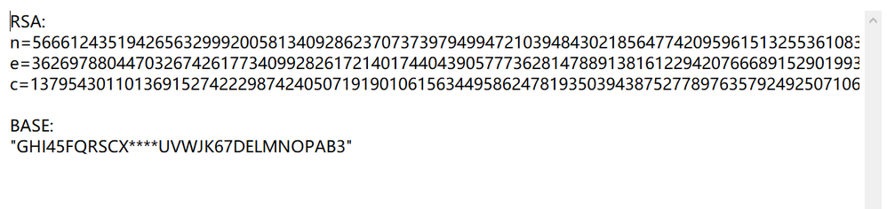

RSA题目照例先用CTF-RSA-TOOL工具跑一下，发现跑得出来：

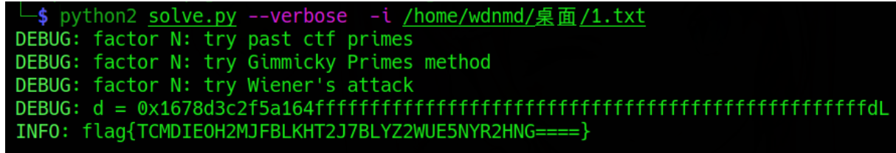

这应该是一层的flag，而且看起来像base32的四个等号，联想题目和TXT文件中后面的BASE码，可以猜出是BASE32变码的加密，而且还有4位未知：

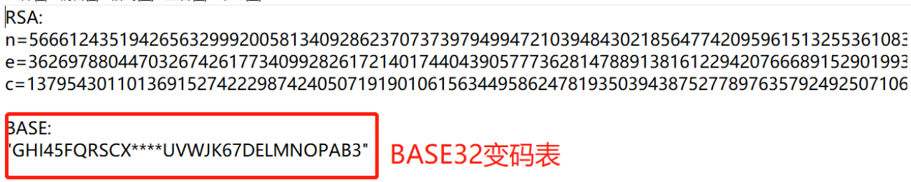

flag{TCMDIEOH2MJFBLKHT2J7BLYZ2WUE5NYR2HNG====}

base32换表，改一下base64换表的脚本，爆破一下得到YZ2T

```makefile
import base64

a = "TCMDIEOH2MJFBLKHT2J7BLYZ2WUE5NYR2HNG===="

string1 = "GHI45FQRSCX" + "YZ2T" + "UVWJK67DELMNOPAB3"
string2 = "ABCDEFGHIJKLMNOPQRSTUVWXYZ234567"

flag = b'flag{'
flag += base64.b32decode(a.translate(str.maketrans(string1, string2))) + b"}"
print(flag)
#b'flag{rsa_and_base_all_right}'
```

## 9.4 ECC椭圆曲线加密：

#### 攻防世界之easy_ECC：（ECC加密）

下载附件，打开：

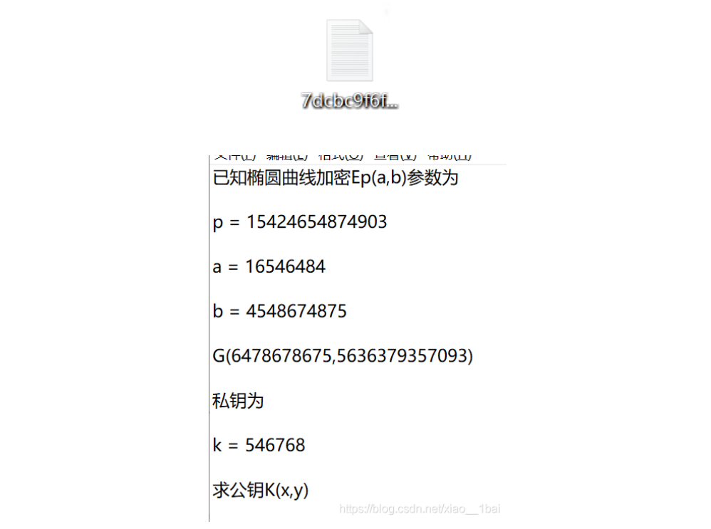

椭圆曲线ECC加密，没接触过，不懂原理

直接用工具解（ECCTOOL）：

各项参数填入其中，点击calc R即可

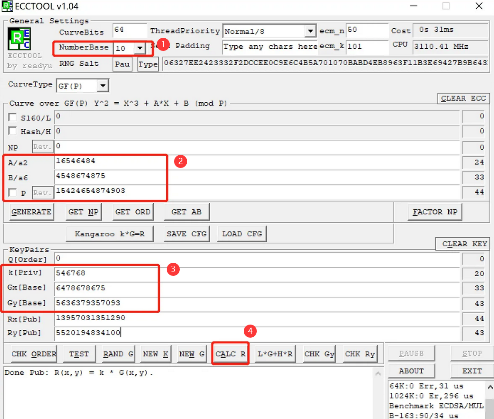

这里直接使用脚本：

```python
import collections
import random

EllipticCurve = collections.namedtuple('EllipticCurve', 'name p a b g n h')

curve = EllipticCurve(
   'secp256k1',
   # Field characteristic.
   p=int(input('p=')),
   # Curve coefficients.
   a=int(input('a=')),
   b=int(input('b=')),
   # Base point.
   g=(int(input('Gx=')),
      int(input('Gy='))),
   # Subgroup order.
   n=int(input('k=')),
   # Subgroup cofactor.
   h=1,
)


# Modular arithmetic ##########################################################

def inverse_mod(k, p):
   """Returns the inverse of k modulo p.

  This function returns the only integer x such that (x * k) % p == 1.

  k must be non-zero and p must be a prime.
  """
   if k == 0:
       raise ZeroDivisionError('division by zero')

   if k < 0:
       # k ** -1 = p - (-k) ** -1 (mod p)
       return p - inverse_mod(-k, p)

   # Extended Euclidean algorithm.
   s, old_s = 0, 1
   t, old_t = 1, 0
   r, old_r = p, k

   while r != 0:
       quotient = old_r // r
       old_r, r = r, old_r - quotient * r
       old_s, s = s, old_s - quotient * s
       old_t, t = t, old_t - quotient * t

   gcd, x, y = old_r, old_s, old_t

   assert gcd == 1
   assert (k * x) % p == 1

   return x % p


# Functions that work on curve points #########################################

def is_on_curve(point):
   """Returns True if the given point lies on the elliptic curve."""
   if point is None:
       # None represents the point at infinity.
       return True

   x, y = point

   return (y * y - x * x * x - curve.a * x - curve.b) % curve.p == 0


def point_neg(point):
   """Returns -point."""
   assert is_on_curve(point)

   if point is None:
       # -0 = 0
       return None

   x, y = point
   result = (x, -y % curve.p)

   assert is_on_curve(result)

   return result


def point_add(point1, point2):
   """Returns the result of point1 + point2 according to the group law."""
   assert is_on_curve(point1)
   assert is_on_curve(point2)

   if point1 is None:
       # 0 + point2 = point2
       return point2
   if point2 is None:
       # point1 + 0 = point1
       return point1

   x1, y1 = point1
   x2, y2 = point2

   if x1 == x2 and y1 != y2:
       # point1 + (-point1) = 0
       return None

   if x1 == x2:
       # This is the case point1 == point2.
       m = (3 * x1 * x1 + curve.a) * inverse_mod(2 * y1, curve.p)
   else:
       # This is the case point1 != point2.
       m = (y1 - y2) * inverse_mod(x1 - x2, curve.p)

   x3 = m * m - x1 - x2
   y3 = y1 + m * (x3 - x1)
   result = (x3 % curve.p,
             -y3 % curve.p)

   assert is_on_curve(result)

   return result


def scalar_mult(k, point):
   """Returns k * point computed using the double and point_add algorithm."""
   assert is_on_curve(point)

   

   if k < 0:
       # k * point = -k * (-point)
       return scalar_mult(-k, point_neg(point))

   result = None
   addend = point

   while k:
       if k & 1:
           # Add.
           result = point_add(result, addend)

       # Double.
       addend = point_add(addend, addend)

       k >>= 1

   assert is_on_curve(result)

   return result


# Keypair generation and ECDHE ################################################

def make_keypair():
   """Generates a random private-public key pair."""
   private_key = curve.n
   public_key = scalar_mult(private_key, curve.g)

   return private_key, public_key


private_key, public_key = make_keypair()
print("private key:", hex(private_key))
print("public key: (0x{:x}, 0x{:x})".format(*public_key))
```

运行之后照着输入题目附件给的参数即可：

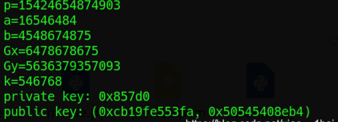

最后的flag为公钥的两个值相加

法三：用sage

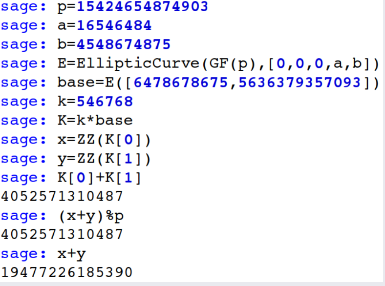

#### 攻防世界之streamgame2：（CTF中的LFSR考点(一)、文件读取对齐的二进制）

附件给出实现流加密的Python脚本与一段输出的密钥流。

**分析**

通过对加密脚本的理解，可得本题的LFSR模型：
 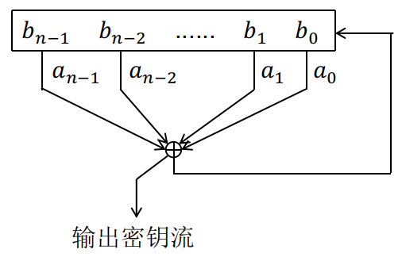

其中 an−1,an−2,⋯,a0

 为程序中 mask 的二进制位，当 ai=1 时，将 bi 输入异或运算，否则 bi

 不输入异或运算；根据模型我们可以得到如下等式：

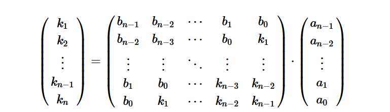

其中的加法为异或，因为an−1=1

，将上式重写如下：

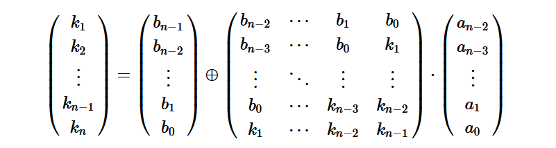

由异或性质：

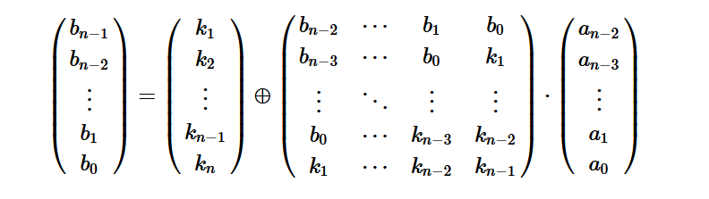


再将等式“还原”：

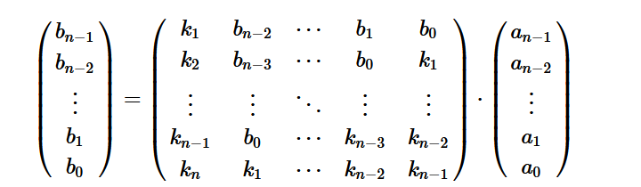

计算的顺序由下至上，即可解出初始状态的所有比特位。

**解题**

实现的Python脚本如下：

```Python
from gmpy2 import c_div

def lfsr(R,mask):
    output = (R << 1) & 0xffffff    
    i=(R&mask)&0xffffff             
    lastbit=0
    while i!=0:
        lastbit^=(i&1)    
        i=i>>1
    output^=lastbit
    return (output,lastbit)

def cal(s,mask):
    lm=len(bin(mask))-2
    R=int(s[-1:]+s[:-1],2)
    ss=''
    for j in range(lm,0,-1):
        (_,tk)=lfsr(R,mask)
        ss=str(tk)+ss
        R=int(s[j-2]+str(tk)+bin(R)[2:].rjust(lm,'0')[1:-1],2)
    return ss

def solve():
    mask=0b1010011000100011100
    lm=len(bin(mask))-2
    with open('key','rb') as f:
        stream=f.read(c_div(lm,8))
    s=''.join([bin(256+ord(it))[3:] for it in stream])
    flag='flag{'+cal(s[:lm],mask)+'}'
    return flag

if __name__=='__main__':
    print solve()
```

程序运行结果如下：

```Bash
$ python solve.py
flag{1110101100001101011}
```

## 10. js类型加密

### js逻辑平铺类型：

#### 攻防世界之flag_in_your_hand1:（字符串中文含义暗示、冗余中锁定关键代码）

下载附件，解压，一个js一个html，两边出击，浏览器看html页面，记事本看js和html的逻辑和它们之间的关系：


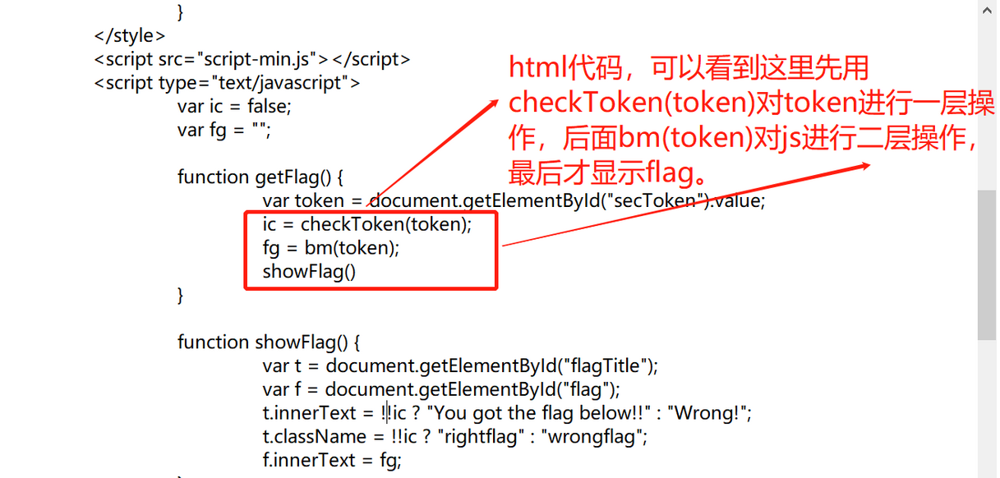


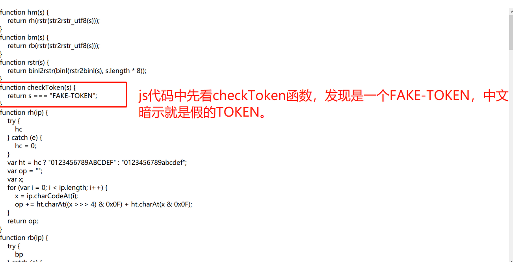


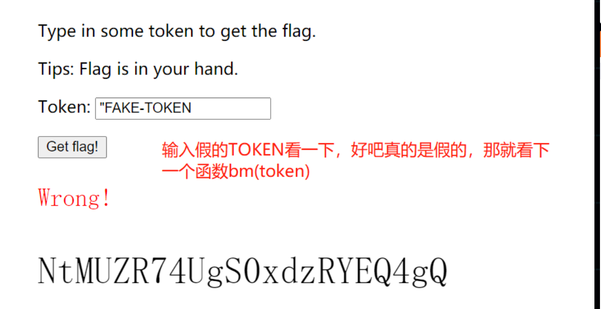

bm函数，我在js代码那里跟踪啊跟踪，发现它是好多个函数的嵌套，没办法了，根本不知道关键逻辑放在哪里。查了资料说看跟踪ic，真是一语惊醒梦中人！ic是判断条件，归根结底还是判断ic,找ic即可：

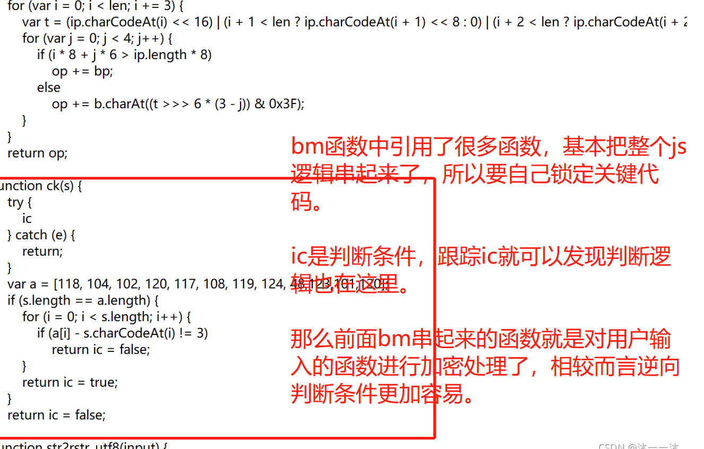

找到ic了，这个ic也的确在bm函数嵌套内，由于在学逆向，所以直接写逆向脚本即可：

```python
key1=[118, 104, 102, 120, 117, 108, 119, 124, 48,123,101,120]

token=""

for i in key1:
    token+=chr(i-3)

print(token)
```

结果：

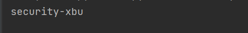


最后回顾一下，为什么下面这个每次都有且每次都不一样呢，观察js代码可以发现每个js函数的接受参数s就是我们传入token，而fg生成函数bm嵌套了很多函数，所以直接逆向bm函数生成flag不现实，而参数token作为s传入后就会加密回显，所以输入错误的token也会显示出不同的加密串：

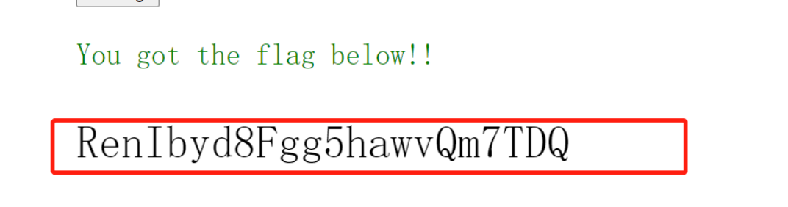

## 11. python类型逻辑加密

### pyc文件反编译：

#### 攻防世界之easychallenge：（源代码修改逻辑解密、）

下载附件，是pyc文件，于是要反编译，一开始看资料说用uncompyle6，我也不知道为什么我的老是报错，后来又找了个在线反编译，可以支持的Python版本比较多：

https://tool.lu/pyc/

反编译代码：

```python
#!/usr/bin/env python
# visit https://tool.lu/pyc/ for more information

import base64

def encode1(ans):

s = ""

for i in ans:

x = ord(i) ^ 36

x = x + 25

s += chr(x)

return s

def encode2(ans):

s = ""

for i in ans:

x = ord(i) + 36

x = x ^ 36

s += chr(x)

return s

def encode3(ans):

return base64.b32encode(ans)

flag = " "

print "Please Input your flag:"

flag = raw_input()

final = "UC7KOWVXWVNKNIC2XCXKHKK2W5NLBKNOUOSK3LNNVWW3E==="

if encode3(encode2(encode1(flag))) == final:

print "correct"

else:

print "wrong"
```

本来是自己一层层改的，怎么加密就怎么逆过来解密，后来发现又犯了以前的错误，有源码就要用源码啊！！！

直接在源码上修改即可：

```python
#!/usr/bin/env python

# visit https://tool.lu/pyc/ for more information

import base64

def decode1(ans):

s = ''

for i in ans:

x = ord(i) -25

x = x ^ 36

s += chr(x)

return s

def decode2(ans):

s = ''

for i in ans:

x = i ^ 36

x = x - 36

s += chr(x)

return s

def decode3(ans):

return base64.b32decode(ans)

final = 'UC7KOWVXWVNKNIC2XCXKHKK2W5NLBKNOUOSK3LNNVWW3E==='

print(decode1(decode2(decode3(final))) )
```

## 12. 传统密码类型解析

### 凯撒密码(24个字母)：

特点:24个字母间的移动

在密码学中，恺撒密码（英语：Caesar cipher），或称恺撒加密、恺撒变换、变换加密，是一种最简单且最广为人知的加密技术。它是一种替换加密的技术，明文中的所有字母都在字母表上向后（或向前）按照一个固定数目进行偏移后被替换成密文。例如，当偏移量是3的时候，所有的字母A将被替换成D，B变成E，以此类推。

加密就是明文向后移动展现出对应的密文。

解密就是密文向前移动展现出对应的明文。

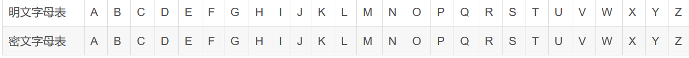

### 摩斯密码(只有01(无规则)或.-，空格或/做分隔符)：

摩尔斯电码也被称作摩斯密码，是一种时通时断的信号代码，通过不同的排列顺序来表达不同的英文字母、数字和标点符号。它发明于1837年，是一种早期的数字化通信形式。不同于现代化的数字通讯，摩尔斯电码只使用零和一两种状态的二进制代码，它的代码包括五种：短促的点信号“・”，读“滴”（Di）保持一定时间的长信号“-”，读“嗒”（Da）表示点和划之间的停顿、每个词之间中等的停顿，以及句子之间长的停顿。

摩斯电码：（格式要求：可用空格或单斜杠/来分隔摩斯电码，但只可用一种，不可混用）

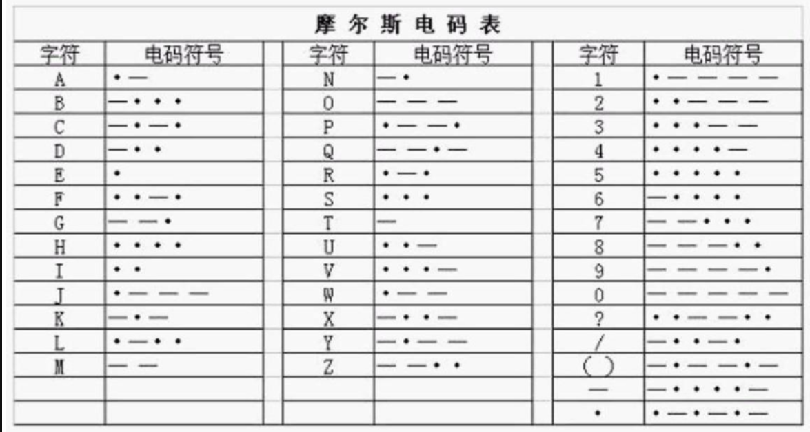

### 云影密码(01248)：

此密码运用了1248代码,因为本人才疏学法,问未发现有过使用的先例,因此暂归为原创密码。由于这个密码,我和片风云影初识,为了纪念,将其命名为“云影密码”。

有了1,2,4,8这四个苘单的数字,你可以以加法表示出0~9任何个数字,例如0=28,7=124,9=18这样,再用1-26来表示A-Z,就可以用作密码了。为了不至于混乱,我个人引入了第五个数字0,来用作间隔,以遍免翻译错误,所以还可以称“01248密码”

注意(3个及以上数字时)：

虽然是相加，但是可以在数字内不按顺序相加，如124可写成(12)4和1(24)结果分别是7和16，只要保证不大于26即可

题目(总不超过26)：

12401011801180212011401804

第一步分割：

即124 、1、118、118、212、114、18、4

第二步基本翻译：

例如124可以表示7,也可以表示16(但不可能是34,因为不会超过26),所以可以放弃来翻译其他没有异议的,可得:124、a、s、s、w、o、18、d

第三步推测得出明文：

可以推测后面的18表示r,前面的为p最合适。

所以最后明文:

password(密码)

### 栅栏密码(分组数作密钥)：

所谓栅栏密码，就是把要加密的明文分成N个一组，然后把每组的第1个字连起来，形成一段无规律的话。 不过栅栏密码本身有一个潜规则，就是组成栅栏的字母一般不会太多。（一般不超过30个，也就是一、两句话）

传统栅栏密码(矩阵行列，密钥是行数)：

假如有一个字符串：123456789

取字符串长度的因数进行分组，假如key=3

1 2 3 \\分组情况，每三个数字一组，分为三组

4 5 6

7 8 9

然后每一组依次取一个数字组成一个新字符串：147258369 \\加密完成的字符串

解题：

试一般的栅栏密码,取5为矩阵行数,得到" cyperrocaegireeol} eahfocec gnbip不正确，取5为矩阵列数,得到" cebgccfe en eohplprgecrayoii aoreg”,也不正确，除了常规的栅栏密码,还有一种w型的栅栏密码。

w型的栅栏密码(第一行是Key数，后面排成w型横竖读取)：

同样一个字符串：123456789

key=3

1----5----9 \\让数字以W型组织，同样是三组，但每组的数量不一定相同

-2--4-6--8

--3----7--

加密密文：159246837

解题：

题目提示:栅栏密码,密钥长度为5

是将明文按照w型排列,并横(竖)向读取密文,其解密过程就是加密的逆过程,即将密文横(竖)向按一定规律排列后,以w型读取,对于此题,根据题目提示为以下5行。

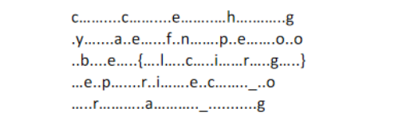

### 培根密码(大小写的ABab，而且必须是5个一组，不是5个就考虑摩斯密码):

培根所用的密码是一种本质上用二进制数设计的，没有用通常的0和1来表示，而是采用a和b

#### 培根密码加密方式

第一种方式：

A aaaaa B aaaab C aaaba D aaabb E aabaa F aabab G aabba H aabbb I abaaa J abaab

K ababa L ababb M abbaa N abbab O abbba P abbbb Q baaaa R baaab S baaba T baabb

U babaa V babab W babba X babbb Y bbaaa Z bbaab

第二种方式:

a AAAAA g AABBA n ABBAA t BAABA

b AAAAB h AABBB o ABBAB u-v BAABB

c AAABA i-j ABAAA p ABBBA w BABAA

d AAABB k ABAAB q ABBBB x BABAB

e AABAA l ABABA r BAAAA y BABBA

f AABAB m ABABB s BAAAB z BABBB

举例

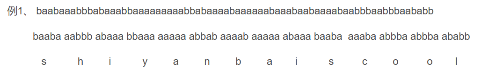

附加解密Python脚本如下：

```python
#!/usr/bin/python

# -*- coding: utf-8 -*-

import re

alphabet = ['a','b','c','d','e','f','g','h','i','j','k','l','m','n','o','p','q','r','s','t','u','v','w','x','y','z']

first_cipher = ["aaaaa","aaaab","aaaba","aaabb","aabaa","aabab","aabba","aabbb","abaaa","abaab","ababa","ababb","abbaa","abbab","abbba","abbbb","baaaa","baaab","baaba","baabb","babaa","babab","babba","babbb","bbaaa","bbaab"]

second_cipher = ["aaaaa","aaaab","aaaba","aaabb","aabaa","aabab","aabba","aabbb","abaaa","abaaa","abaab","ababa","ababb","abbaa","abbab","abbba","abbbb","baaaa","baaab","baaba","baabb","baabb","babaa","babab","babba","babbb"]

def encode():

string = raw_input("please input string to encode:\n") #这里接收要加密的字符串

e_string1 = ""

e_string2 = ""

for index in string:
    for i in range(0,26):
        if index == alphabet[i]:
            e_string1 += first_cipher[i]
            e_string2 += second_cipher[i]
            break

print "first encode method result is:\n"+e_string1
print "second encode method result is:\n"+e_string2
return

def decode():
e_string = raw_input("please input string to decode:\n") #这里接收要解密的字符串
e_array = re.findall(".{5}",e_string)
d_string1 = ""
d_string2 = ""

for index in e_array:
    for i in range(0,26):
        if index == first_cipher[i]:
            d_string1 += alphabet[i]
        if index == second_cipher[i]:
            d_string2 += alphabet[i]

print "first decode method result is:\n"+d_string1
print "second decode method result is:\n"+d_string2
return

if __name__ == '__main__':
while True:
    print "\t*******Bacon Encode_Decode System*******"
    print "input should be lowercase,cipher just include a b"
    print "1.encode\n2.decode\n3.exit"
s_number = raw_input("please input number to choose\n")
if s_number == "1":
    encode()
    raw_input()
elif s_number == "2":
    decode()
    raw_input()
    
elif s_number == "3":
    break

else:
continue
```

### 与佛论禅编码，要加上佛曰：才能转换(BASE64类型转不了就ROT13一下)

与佛论禅

题目文字：

夜哆悉諳多苦奢陀奢諦冥神哆盧穆皤三侄三即諸諳即冥迦冥隸數顛耶迦奢若吉怯陀諳怖奢智侄諸若奢數菩奢集遠俱老竟寫明奢若梵等盧皤豆蒙密離怯婆皤礙他哆提哆多缽以南哆心曰姪罰蒙呐神。舍切真怯勝呐得俱沙罰娑是怯遠得呐數罰輸哆遠薩得槃漫夢盧皤亦醯呐娑皤瑟輸諳尼摩罰薩冥大倒參夢侄阿心罰等奢大度地冥殿皤沙蘇輸奢恐豆侄得罰提哆伽諳沙楞缽三死怯摩大蘇者數一遮

转换后的

MzkuM3gvMUAwnzuvn3cgozMlMTuvqzAenJchMUAeqzWenzEmLJW9

的确是BASE64类型，但是直接BASE64是转换不出来的，还要先ROT13一下，可以算是一个小混淆，长见识了。

### 转轮机加密：

特点是等长的分好组的乱序字母，原理是转齿轮把一个字母换成另一个来拼成一句话。

格式是这样的：

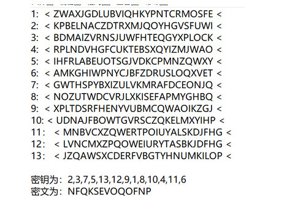

脚本解题积累：

```python
rotor = [  # 这里是要输入的转轮机原始字符串
    "ZWAXJGDLUBVIQHKYPNTCRMOSFE", "KPBELNACZDTRXMJQOYHGVSFUWI",
    "BDMAIZVRNSJUWFHTEQGYXPLOCK", "RPLNDVHGFCUKTEBSXQYIZMJWAO",
    "IHFRLABEUOTSGJVDKCPMNZQWXY", "AMKGHIWPNYCJBFZDRUSLOQXVET",
    "GWTHSPYBXIZULVKMRAFDCEONJQ", "NOZUTWDCVRJLXKISEFAPMYGHBQ",
    "XPLTDSRFHENYVUBMCQWAOIKZGJ", "UDNAJFBOWTGVRSCZQKELMXYIHP",
    "MNBVCXZQWERTPOIUYALSKDJFHG", "LVNCMXZPQOWEIURYTASBKJDFHG",
    "JZQAWSXCDERFVBGTYHNUMKILOP"
]

cipher = "NFQKSEVOQOFNP"  # 这是要输入转轮机密文
key = [2, 3, 7, 5, 13, 12, 9, 1, 8, 10, 4, 11, 6]  # 这是要输入转轮机密钥
tmp_list = []

for i in range(0, len(rotor)):
    tmp = ""
    k = key[i] - 1
    for j in range(0, len(rotor[k])):
        if cipher[i] == rotor[k][j]:
            if j == 0:
                tmp = rotor[k]
            else:
                tmp = rotor[k][j:] + rotor[k][0:j]
            break

    tmp_list.append(tmp)

# print(tmp_list)

message_list = []

for i in range(0, len(tmp_list[0])):  # 修正循环范围
    tmp = ""
    for j in range(0, len(tmp_list)):
        tmp += tmp_list[j][i]
    message_list.append(tmp)

print(message_list)

def spread_list(lst):
    for item in lst:
        if isinstance(item, (list, tuple)):
            yield from spread_list(item)
        else:
            yield item
    pass

if __name__ == '__main__':
    for i in spread_list(message_list):
        print("*" * 25)
        print(i)  # 在多个输出中查找有语义的字符串即为flag内容
```

### 键盘密码：

键盘密码应该不算是一种加密算法，但是一种有趣的设置密码方式。他就是a-z(A-Z)对应成键盘上的字母，把键盘字母一行一行的对应即可。包围的键就是要找的值。

每个围起来的圈之间通常会有明显的间隔，比如空格。

如：r5yG lp9I BjM tFhB T6uh y7iJ QsZ bhM

### poem codes诗歌加密：

(内容地址出处)https://blog.csdn.net/weixin_45530599/article/details/108027293：

① 给出一首诗歌

```
for my purpose holds to sail beyond the sunset, and the baths of all the western stars until I die.
```

② 给出5个关键单词。

```
“for”, “sail”, “all”, “stars”, “die.”
```

对其进行拆散：

```
f o r s a i l a l l s t a r s d i e
```

接下来按照 字母表顺序 进行编号，若遇相同字母，则继续 +1


③ 将要传递的消息进行加密。

```
We have run out of cigars, situation desperate。
```

先对其进行编码。因为给出的5个关键词，其长度为18.所以以18为一组。

若一组长度不满18，则用abc(不要求有序)进行补充。

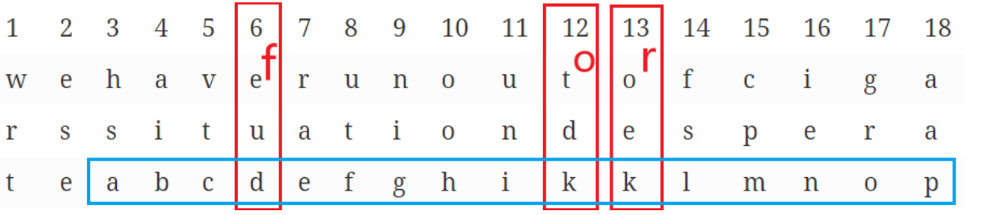

将排好的消息，按照之前给出的诗歌字母编号写下密文。

```
for my purpose holds to sail beyond the sunset, and the baths of all the western stars until I die.
```

如， for --> eud tdk oek 那么得到的又可以按照5个（适当个数）为一组进行重新分组，得到最后密文。

我的看法：

其实排序逻辑挺常规的，就是诗歌 --> 关键词，原文 --> 参照顺序排列，密文 --> 按诗歌关键词对原文映射取值。

解题脚本：

用github的脚本：(单独复制poemcode.py是会报错的，因为文件中有其他依靠)：

git clone git://github.com/abpolym/crypto-tools

用法：(python2，ctfpoem是诗歌，ctfcip是加密密文)

python2 poemcode.py examples/2/ctfpoem examples/2/ctfcip

### URL编码规则：

URL 编码使用 "%" 其后跟随两位的十六进制数来替换非 ASCII 字符。

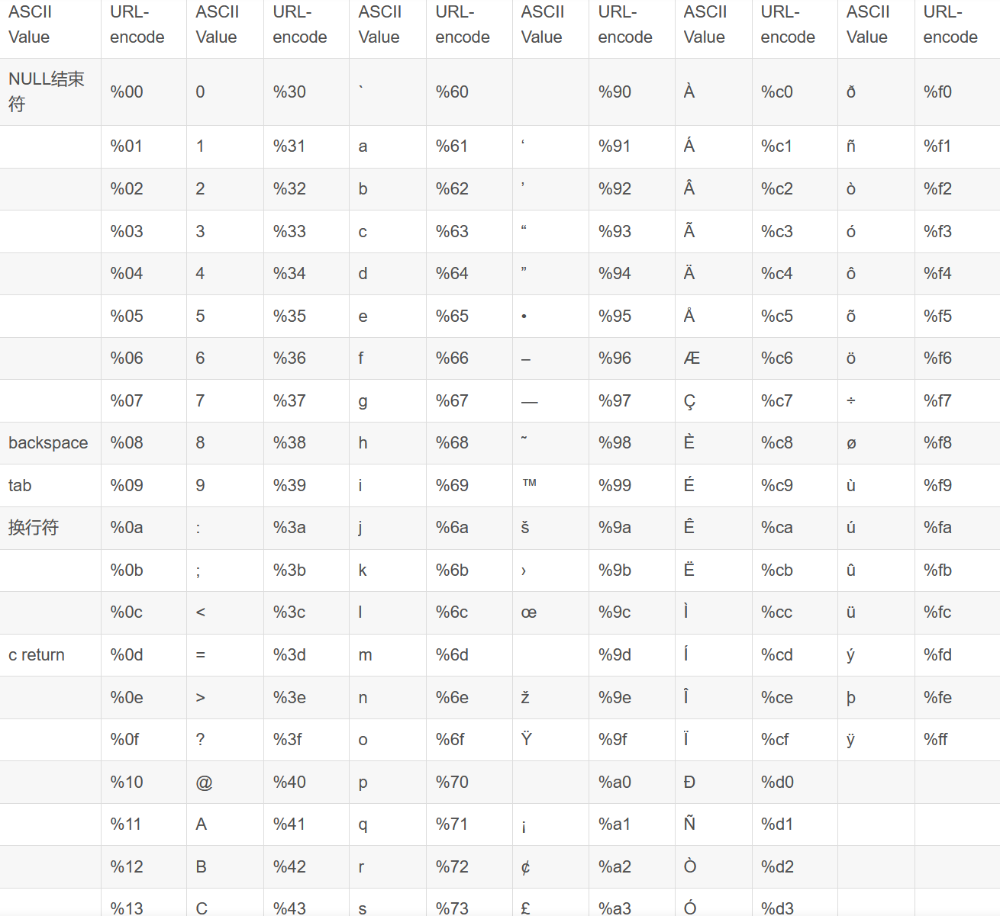

​	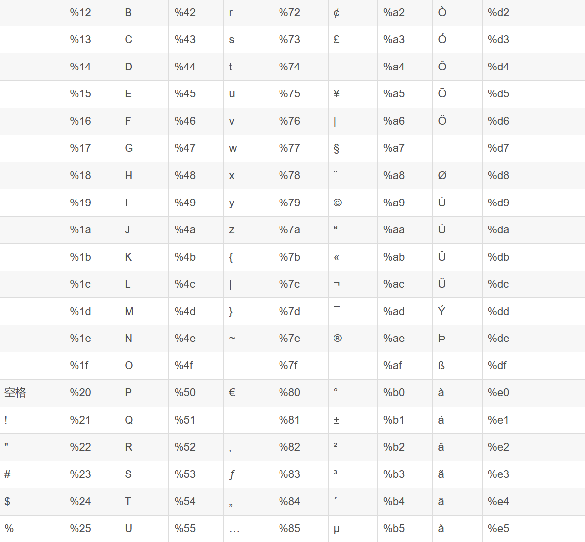

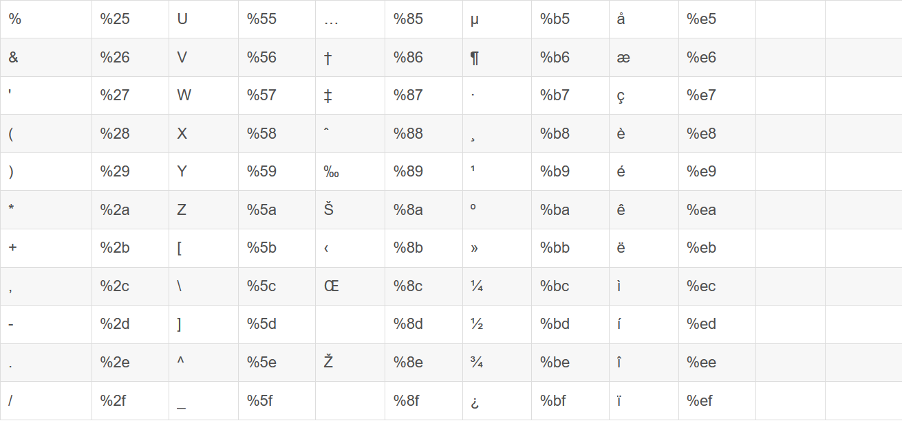

### 仿射密码：

仿射密码是一种替换密码，它是一个字母对一个字母的。为单表加密的一种，字母系统中所有字母都藉一简单数学方程加密，对应至数值，或转回字母。 其仍有所有替代密码之弱处。所有字母皆借由方程加密，b为移动大小。

在仿射加密中，大小为m之字母系统首先对应至0..m-1范围内之数值， 接着使用模数算数来将原文件中之字母转换为对应加密文件中的数字。 （其实这有点像我的base64表单下标替换）

它的加密函数是：（其中a和m互质，m是字母的数目）


解密函数是：


补充求集合Z上数x的逆元的：

gmpy2.invert(x,Z) 或 libnum.invmode(e,(p-1)*(q-1))

a之乘法逆元素仅存在于a与m互质条件下。 由此，没有a的限制，可能无法解密。 易知解密方程逆于加密方程：

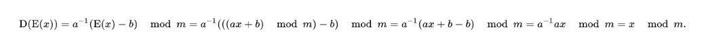

# 解密工具、脚本积累

## Ciphey工具(ubuntu上)

Ciphey 是一个使用自然语言处理和人工智能的全自动解密/解码/破解工具，只需要输入加密文本，它就能给你返回解密文本。

Ciphey 基本使用：

```shell
文件输入：

ciphey -f encrypted.txt

# 或

python -m ciphey -f encrypted.txt

不规范的方法：

ciphey -- "Encrypted input"

# 或

python -m ciphey -- "Encrypted input"

正常方式：

ciphey -t "Encrypted input"

# 或

python -m ciphey -t "Encrypted input"

要去除进度条、概率表和所有噪音，请使用安静模式：

ciphey -t "encrypted text here" -q

Ciphey 支持解密的密文和编码多达51种，下面列出一些基本的选项基本密码：

Caesar Cipher

ROT47 (up to ROT94 with the ROT47 alphabet)

ASCII shift (up to ROT127 with the full ASCII alphabet)

Vigenère Cipher

Affine Cipher

Binary Substitution Cipher (XY-Cipher)

Baconian Cipher (both variants)

Soundex

Transposition Cipher

Pig Latin

现代密码学：

Repeating-key XOR

Single XOR

编码：

Base32

Base64

Z85 (release candidate stage)

Base65536 (release candidate stage)

ASCII

Reversed text

Morse Code

DNA codons (release candidate stage)

Atbash

Standard Galactic Alphabet (aka Minecraft Enchanting Language)

Leetspeak

Baudot ITA2

URL encoding

SMS Multi-tap

DMTF (release candidate stage)

UUencode

Braille (Grade 1)

Ciphey 的功能不仅于本文介绍的这些，本文所介绍的只是冰山一角，它还可以添加属于你自己的解码器：

https://github.com/Ciphey/Ciphey/wiki/Adding-your-own-ciphers
```

## CTF-RSA-tool工具（本机上）

RSA前景知识：

RSA公开密钥密码体制是一种使用不同的加密密钥与解密密钥，“由已知加密密钥推导出解密密钥在计算上是不可行的”密码体制 。

在公开密钥密码体制中，加密密钥（即公开密钥）PK是公开信息，而解密密钥（即秘密密钥）SK是需要保密的。加密算法E和解密算法D也都是公开的。虽然解密密钥SK是由公开密钥PK决定的，但却不能根据PK计算出SK [2] 。

RSA公开密钥密码体制的原理是：根据数论，寻求两个大素数比较简单，而将它们的乘积进行因式分解却极其困难，因此可以将乘积公开作为加密密钥 [4] 。

RSA脚本工具使用说明：

```cmd
usage: solve.py [-h]

用法：solve.py[-h] (--decrypt DECRYPT | -c DECRYPT_INT | --private | -i INPUT | -g)

[--createpub] [-o OUTPUT] [--dumpkey] [--enc2dec ENC2DEC] [-k KEY] [-N N] [-e E] [-d D] [-p P] [-q Q] [--KHBFA KHBFA][--pbits PBITS]

[-v]
It helps CTFer to get first blood of RSA-base CTF problems 它有助于CTFer获得RSA基础CTF问题的第一滴血
-v, --verbose print details 详细的打印细节

optional arguments:可选参数(注意！！！这里之间只可选一个，且必选一个！)：
-h, --help show this help message and exit --帮助显示此帮助消息并退出
--decrypt DECRYPT decrypt a file, usually like "flag.enc" 解密文件，通常类似于“flag.enc”
(通常搭配k的.pem或.pub一起使用)
-c DECRYPT_INT,
--decrypt_int DECRYPT_INT 解密长整形数
--private Print private key if recovered 打印私钥（如果已解密）
-i INPUT input a file with all necessary parameters (see examples/input_example.txt)

输入包含所有必要参数的文件（请参见示例/输入（示例.txt）
-g, --gadget Use some gadgets to pre-process your data first 使用一些小工具先预处理数据
some gadgets:一些小工具预处理数据(全部可选)：
--createpub Take N and e and output to file specified by "-o" or just print it
获取N和e并输出到由“-o”指定的文件或者直接打印出来就行了
-o OUTPUT, --output OUTPUT 输出 Specify the output file path in --createpub mode.

在--createpub模式下指定输出文件路径。
--dumpkey Just print the RSA variables from a key - n,e,d,p,q

只打印一个key-n、e、d、p、q中的RSA变量
--enc2dec ENC2DEC get cipher (in decimalism) from a encrypted file

从加密文件中获取密码（十进制）
the RSA variables:RSA变量：Specify the variables whatever you got指定您得到的变量：(全部可选，实验中发现输入时只能用N、e参数进行命令行输入)

-k KEY, pem file, usually like ".pub" or ".pem", and it begins with "-----BEGIN"

pem文件，通常类似于“.pub”或“.pem”，并以“-----BEGIN”开始

-N N the modulus 模量

-e E the public exponent 公共指数

-d D the private exponent 私人指数

-p P one factor of modulus 模量的一个因子

-q Q one factor of modulus 模量的一个因子

extra variables:额外变量：Used in some special methods 在一些特殊的方法中使用：

--KHBFA KHBFA use Known High Bits Factor Attack, this specify the High Bits of factor

使用已知的高位因子攻击，这指定因子高位

--pbits PBITS customize the bits lenth of factor, default is half of n`s bits lenth

自定义因子的位长度，默认值为n's比特长度

```

多组n,e,c在解题时长这个样子：

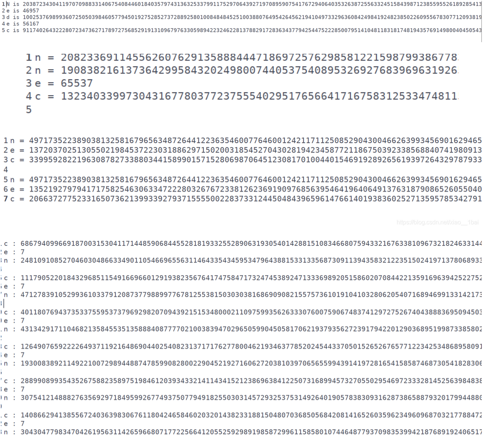

可以看到特征真的就是多个n，e，c，甚至还有d，且不管这里的n,e,c是大还是小，长还是短，都列入多组n,e,c类型里。

一组n,e,c的题目样式：

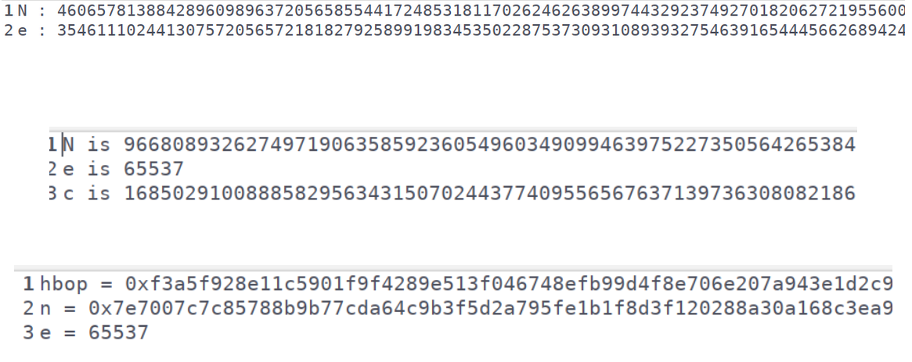

从这里可以看到一组,n,e,c里面甚至可以没有c，这里的n,e,c也不管大小，长短，这里最后一个hbop的解题要用到前面说得sagemath，这里暂且不说。

### 不同情景下工具运行示例：

补充：

单个n,e,c,q,p,的时候最好用单个参数输入的方式，不要用文本读取的方式，因为文本读取的时候DEBUG显示的十六进制的d有时并不是我们想要的

#### 只需要一组密钥的

**wiener_attack**

```
python2 solve.py --verbose -i examples/wiener_attack.txt
```

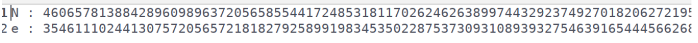

或者通过命令行，只要指定对应参数就行了

```cmd
python2 solve.py --verbose --private -N 460657813884289609896372056585544172485318117026246263899744329237492701820627219556007788200590119136173895989001382151536006853823326382892363143604314518686388786002989248800814861248595075326277099645338694977097459168530898776007293695728101976069423971696524237755227187061418202849911479124793990722597 -e 354611102441307572056572181827925899198345350228753730931089393275463916544456626894245415096107834465778409532373187125318554614722599301791528916212839368121066035541008808261534500586023652767712271625785204280964688004680328300124849680477105302519377370092578107827116821391826210972320377614967547827619
```

#### factordb.com

```
python2 solve.py --verbose -k examples/jarvis_oj_mediumRSA/pubkey.pem --decrypt examples/jarvis_oj_mediumRSA/flag.enc
```

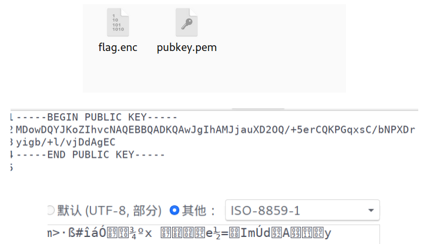

#### Boneh and Durfee attack

TODO: get an example public key solvable by boneh_durfee but not wiener

#### small q attack

```
python2 solve.py --verbose --private -k examples/small_q.pub
```


#### 2017强网杯线上赛 RSA 费马分解（p&q相近时，e=65537）

```
python2 solve.py --verbose -i examples/closed_p_q.txt
```

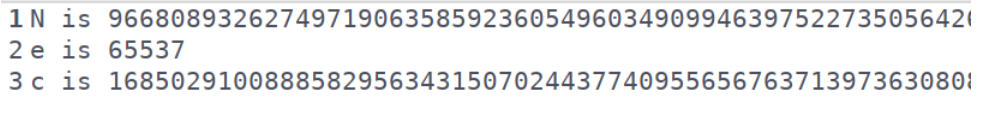

#### Common factor between ciphertext and modulus attack(共模攻击)

```
python2 solve.py --verbose -k examples/common_factor.pub --decrypt examples/common_factor.cipher
```

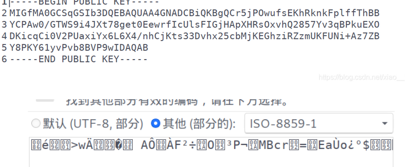

#### 小 e

```
python2 solve.py --verbose -k examples/small_exponent.pub --decrypt examples/small_exponent.cipher
```


#### rabin method when e == 2

```
python2 solve.py --verbose -k examples/jarvis_oj_hardRSA/pubkey.pem --decrypt examples/jarvis_oj_hardRSA/flag.enc
```

#### p,q接近时

```
python2 solve.py --verbose -k examples/smallfraction.pub --private
```

#### Known High Bits Factor Attack

```
python2 solve.py --verbose -i examples/KnownHighBitsFactorAttack.txt
```

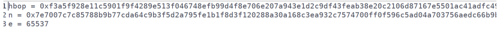

#### 需要多组密钥的

##### 第三届上海市大学生网络安全大赛--rrrsa d泄漏攻击

```
python2 solve.py --verbose -i examples/d_leak.txt
```

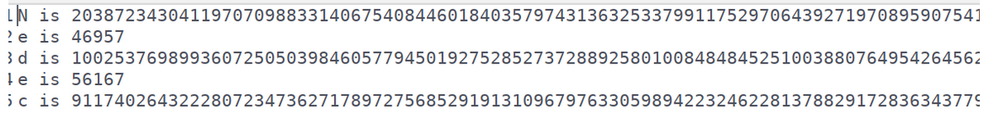

#### 模不互素(给你两个单独分解不了的大数级n)

（模不互素是给你两个单独分解不了的大数级n，方便让你求公因子。然后，只用一个n来加密，对，只用一个n。）

```
python2 solve.py --verbose -i examples/share_factor.txt
```

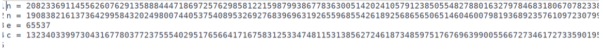

#### 共模攻击(n相同)

python2 solve.py --verbose -i examples/share_N.txt

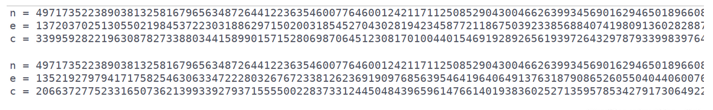

#### Basic Broadcast Attack(低加密指数广播攻击，给一堆e,n，c)

```
python2 solve.py --verbose -i examples/Basic_Broadcast_Attack.txt
```

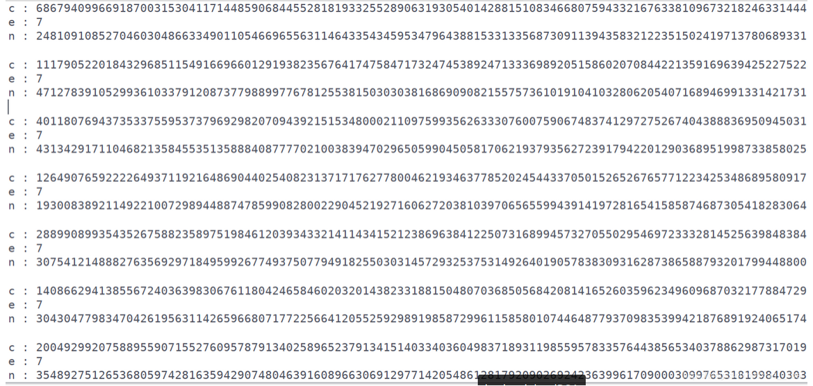


### RSA通用的简单脚本：（已知p、q、e、c值）

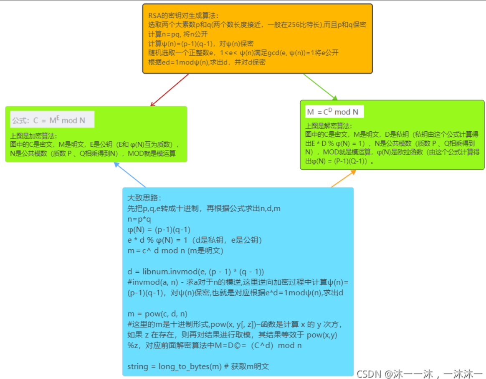

```python
import libnum
from Crypto.Util.number import long_to_bytes

q = int("0xa6055ec186de51800ddd6fcbf0192384ff42d707a55f57af4fcfb0d1dc7bd97055e8275cd4b78ec63c5d592f567c66393a061324aa2e6a8d8fc2a910cbee1ed9",16)
p = int("0xfa0f9463ea0a93b929c099320d31c277e0b0dbc65b189ed76124f5a1218f5d91fd0102a4c8de11f28be5e4d0ae91ab319f4537e97ed74bc663e972a4a9119307",16)
e = int("0x6d1fdab4ce3217b3fc32c9ed480a31d067fd57d93a9ab52b472dc393ab7852fbcb11abbebfd6aaae8032db1316dc22d3f7c3d631e24df13ef23d3b381a1c3e04abcc745d402ee3a031ac2718fae63b240837b4f657f29ca4702da9af22a3a019d68904a969ddb01bcf941df70af042f4fae5cbeb9c2151b324f387e525094c41",16)
c = 0x7fe1a4f743675d1987d25d38111fae0f78bbea6852cba5beda47db76d119a3efe24cb04b9449f53becd43b0b46e269826a983f832abb53b7a7e24a43ad15378344ed5c20f51e268186d24c76050c1e73647523bd5f91d9b6ad3e86bbf9126588b1dee21e6997372e36c3e74284734748891829665086e0dc523ed23c386bb520
n = q * p
d = libnum.invmod(e, (p - 1) * (q - 1)) #invmod(a, n) - 求a对于n的模逆,这里逆向加密过程中计算ψ(n)=(p-1)(q-1)，对ψ(n)保密,也就是对应根据ed=1modψ(n),求出d
m = pow(c, d, n) # pow(x, y[, z])--函数是计算 x 的 y 次方，如果 z 在存在，则再对结果进行取模，其结果等效于 pow(x,y) %z，对应前面解密算法中M=D(C)=C^d(mod n)
#print(m) #明文的十进制格式
string = long_to_bytes(m) # m明文，用长字节划范围
print(string.decode())


#ALEXCTF{RS4_I5_E55ENT1AL_T0_D0_BY_H4ND}
```

### ECC加密：

介绍：

椭圆曲线密码学（英语：Elliptic curve cryptography，缩写为 ECC），一种建立公开密钥加密的算法，基于椭圆曲线数学。

ECC的主要优势是在某些情况下它比其他的方法使用更小的密钥——比如RSA加密算法——提供相当的或更高等级的安全。ECC的另一个优势是可以定义群之间的双线性映射，基于Weil对或是Tate对；双线性映射已经在密码学中发现了大量的应用，例如基于身份的加密。其缺点是同长度密钥下加密和解密操作的实现比其他机制花费的时间长 [1] ，但由于可以使用更短的密钥达到同级的安全程度，所以同级安全程度下速度相对更快。一般认为160比特的椭圆曲线密钥提供的安全强度与1024比特RSA密钥相当。

关键总结：

设私钥、公钥分别为k、K，即K = kG，其中G为G点。

　　公钥加密：

　　选择随机数r，将消息M生成密文C，该密文是一个点对，即：

　　C = {rG, M+rK}，其中K为公钥

　　私钥解密：

　　M + rK - k(rG) = M + r(kG) - k(rG) = M

　　其中k、K分别为私钥、公钥。

题目样式举例：

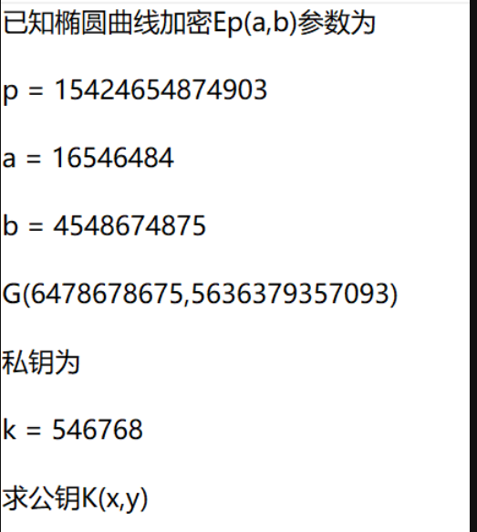

ECC脚本积累(解出最后的公钥和私钥即可)：

```python
import collections
import random

EllipticCurve = collections.namedtuple('EllipticCurve', 'name p a b g n h')

curve = EllipticCurve(
   'secp256k1',
   # Field characteristic.
   p=int(input('p=')),
   # Curve coefficients.
   a=int(input('a=')),
   b=int(input('b=')),
   # Base point.
   g=(int(input('Gx=')),
      int(input('Gy='))),
   # Subgroup order.
   n=int(input('k=')),
   # Subgroup cofactor.
   h=1,
)


# Modular arithmetic ##########################################################

def inverse_mod(k, p):
   """Returns the inverse of k modulo p.

  This function returns the only integer x such that (x * k) % p == 1.

  k must be non-zero and p must be a prime.
  """
   if k == 0:
       raise ZeroDivisionError('division by zero')

   if k < 0:
       # k ** -1 = p - (-k) ** -1 (mod p)
       return p - inverse_mod(-k, p)

   # Extended Euclidean algorithm.
   s, old_s = 0, 1
   t, old_t = 1, 0
   r, old_r = p, k

   while r != 0:
       quotient = old_r // r
       old_r, r = r, old_r - quotient * r
       old_s, s = s, old_s - quotient * s
       old_t, t = t, old_t - quotient * t

   gcd, x, y = old_r, old_s, old_t

   assert gcd == 1
   assert (k * x) % p == 1

   return x % p


# Functions that work on curve points #########################################

def is_on_curve(point):
   """Returns True if the given point lies on the elliptic curve."""
   if point is None:
       # None represents the point at infinity.
       return True

   x, y = point

   return (y * y - x * x * x - curve.a * x - curve.b) % curve.p == 0


def point_neg(point):
   """Returns -point."""
   assert is_on_curve(point)

   if point is None:
       # -0 = 0
       return None

   x, y = point
   result = (x, -y % curve.p)

   assert is_on_curve(result)

   return result


def point_add(point1, point2):
   """Returns the result of point1 + point2 according to the group law."""
   assert is_on_curve(point1)
   assert is_on_curve(point2)

   if point1 is None:
       # 0 + point2 = point2
       return point2
   if point2 is None:
       # point1 + 0 = point1
       return point1

   x1, y1 = point1
   x2, y2 = point2

   if x1 == x2 and y1 != y2:
       # point1 + (-point1) = 0
       return None

   if x1 == x2:
       # This is the case point1 == point2.
       m = (3 * x1 * x1 + curve.a) * inverse_mod(2 * y1, curve.p)
   else:
       # This is the case point1 != point2.
       m = (y1 - y2) * inverse_mod(x1 - x2, curve.p)

   x3 = m * m - x1 - x2
   y3 = y1 + m * (x3 - x1)
   result = (x3 % curve.p,
             -y3 % curve.p)

   assert is_on_curve(result)

   return result


def scalar_mult(k, point):
   """Returns k * point computed using the double and point_add algorithm."""
   assert is_on_curve(point)

   

   if k < 0:
       # k * point = -k * (-point)
       return scalar_mult(-k, point_neg(point))

   result = None
   addend = point

   while k:
       if k & 1:
           # Add.
           result = point_add(result, addend)

       # Double.
       addend = point_add(addend, addend)

       k >>= 1

   assert is_on_curve(result)

   return result


# Keypair generation and ECDHE ################################################

def make_keypair():
   """Generates a random private-public key pair."""
   private_key = curve.n
   public_key = scalar_mult(private_key, curve.g)

   return private_key, public_key


private_key, public_key = make_keypair()
print("private key:", hex(private_key))
print("public key: (0x{:x}, 0x{:x})".format(*public_key))
```

运行脚本，依次填入参数，最后两数和为flag

或者直接工具跑

