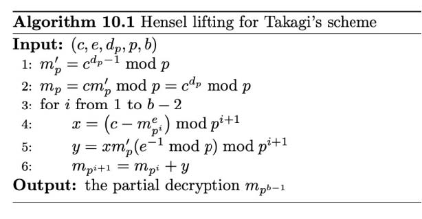

https://www.cnblogs.com/404p3rs0n/p/15542587.html#%E5%85%B6%E4%BB%96%E7%89%B9%E5%88%AB%E6%83%85%E5%BD%A2

## 常用工具

- 分解大素数
   factordb （http://www.factordb.com）
   yafu（p,q相差过大或过小yafu可分解成功）
   sage （`divisors(n)`）（小素数）
   Pollard’s p−1 （`python -m primefac -vs -m=p-1 xxxxxxx`）（光滑数）
   Williams’s p+1（`python -m primefac -vs -m=p+1 xxxxxxx`）（光滑数）

- 在线sage环境：https://sagecell.sagemath.org/

- Openssl
   解析加密密钥：

  ```vbnet
  openssl rsa -pubin -text -modulus -in pub.key
  ```

  生成解密密钥：

  ```vbnet
  python rsatool.py -f PEM -o key.key -p 1 -q 1 -e 1
  
  openssl rsautl -decrypt -inkey key.pem -in flag.enc -out flag
  
  openssl rsautl -decrypt -oaep -inkey key.pem -in flag.enc -out flag （OAEP方式）
  ```

  脚本生成解密密钥：

  ```kotlin
  # coding=utf-8
  import math
  import sys
  from Crypto.PublicKey import RSA
   
  keypair = RSA.generate(1024)
  keypair.p =
  keypair.q =
  keypair.e =
  keypair.n = keypair.p * keypair.q
  Qn = long((keypair.p - 1) * (keypair.q - 1))
   
  i = 1
  while (True):
      x = (Qn * i) + 1
      if (x % keypair.e == 0):
          keypair.d = x / keypair.e
          break
      i += 1
  private = open('private.pem', 'w')
  private.write(keypair.exportKey())
  private.close()
  ```

- 脚本集

  - https://github.com/Ganapati/RsaCtfTool

    ```ruby
      #用法一：已知公钥(自动求私钥)
      $ python3 RsaCtfTool.py --publickey 公钥文件 --uncipherfile 加密文件
      
      #用法二：已知公钥求私钥
      $ python3 RsaCtfTool.py --publickey 公钥文件 --private
      
      #用法三：密钥格式转换
      #把PEM格式的公钥转换为n，e
      $ python3 RsaCtfTool.py --dumpkey --key 公钥文件
      #把n,e转换为PEM格式
      $ python3 RsaCtfTool.py --createpub -n 782837482376192871287312987398172312837182 -e 65537
    ```

  - https://github.com/yifeng-lee/RSA-In-CTF

  - https://github.com/ValarDragon/CTF-Crypto

## 常见类型

### 给p,q,e,c

```makefile
import gmpy2 as gp
import binascii
p =  
q =  
e =  
c =  
n = p*q
phi = (p-1)*(q-1)
d = gp.invert(e,phi)
m = pow(c,d,n)
print(m)
print(bytes.fromhex(hex(m)[2:]))
```

### 给n,e,dp,c

dp≡d(mod(p−1))


∵dp⋅e≡d⋅e≡1(mod(p−1))


∴dp⋅e−1=k⋅(p−1)


∴(dp⋅e−1)⋅d⋅e=k′⋅(p−1),k′=k⋅d⋅e⇔d⋅e=−k′⋅(p−1)+dp⋅e⋅d⋅e≡1(modφ(n))⇔−k′⋅(p−1)+dp⋅e≡1(modφ(n))


∴k1⋅(p−1)+dp⋅e−1=k2⋅(p−1)⋅(q−1)⇔(p−1)⋅(k2⋅(q−1)−k1)+1=dp⋅e


∵dp<p−1∴(k2⋅(q−1)−k1)∈(0,e)


therefore 遍历 (1,e)，当同时满足 (dp⋅e−1)modi==0 和 nmod((dp⋅e−1)//i+1)==0 时，N

 成功分解。

```python
import gmpy2 as gp

e = 
n = 
dp = 
c = 

for x in range(1, e):
	if(e*dp%x==1):
		p=(e*dp-1)//x+1
		if(n%p!=0):
			continue
		q=n//p
		phin=(p-1)*(q-1)
		d=gp.invert(e, phin)
		m=gp.powmod(c, d, n)
		if(len(hex(m)[2:])%2==1):
			continue
		print('--------------')
		print(m)
		print(hex(m)[2:])
		print(bytes.fromhex(hex(m)[2:]))
```

- 变种1：给 p,e,dp,c,b

 ，其中 n=pbq

 。
 [Hensel lifting for Takagi’s scheme](https://books.google.com.hk/books?id=LAxAdqv1z7kC&printsec=frontcover#v=onepage&q&f=false)（p.189）：
 

```python
from Crypto.Util.number import *
import gmpy2
p = 
dp = 
c = 
b = 
e = 
mp1 = pow(c, dp, p)
mp = pow(c, dp - 1, p)
for i in range(1, b - 2):
	x = pow(c - pow(mp1, e), 1, p**(i + 1))
	y = pow(x * mp * (gmpy2.invert(e, p)), 1, p**(i + 1))
	mp1 = mp1 + y
print(long_to_bytes(mp1))
```

变种2：给 n,e,dp0,c,k

，其中 dp0 为 dp 高 (nbits−k) 位，即 dp0=dp>>k

。
 （Coppersmith攻击，已知dp高位攻击）

e⋅dp≡e⋅d≡1(mod(p−1))⇔e⋅dp=k(p−1)+1=kp−k+1⇔e⋅dp+k−1≡0(modp)


∵dp<p−1，∴k<e
∴e⋅(dp0<<k+x)+k−1≡0(modp)


```go
#Sage
dp0 = 
e = 
n = 

F.<x> = PolynomialRing(Zmod(n))
d = inverse_mod(e, n)
for k in range(1, e):
	f = (secret << 200) + x + (k - 1) * d
	x0 = f.small_roots(X=2 ** (200 + 1), beta=0.44, epsilon=1/32)
	if len(x0) != 0:
		dp = x0[0] + (secret << 200)
		for i in range(2, e):
			p = (e * Integer(dp) - 1 + i) // i
			if n % p == 0:
				break
		if p < 0:
			continue
		else:
			print('k = ',k)
			print('p = ',p)
			print('dp = ',dp)
			break
```

变种3：给 n,e,dp,c

，其中 dp很小，e 很大。
 枚举 dp，因 e⋅dp≡1(mod(p−1))
 又由费马小定理，对任意 r，有 me⋅dp≡m(modp)
 即 p∣(me⋅dp−m) 又 p∣n很大概率 p=gcd(me⋅dp−m,n)

- 

### 给p,q,dp,dq,c

dp=dmod(p−1)，dq=dmod(q−1)


∵d=k1(p−1)+dp=k2(q−1)+dq⇔k1(p−1)=(dq−dp)+k2(q−1)⇔k1p−1gcd(p−1,q−1)=dq−dpgcd(p−1,q−1)+k2q−1gcd(p−1,q−1)⇒k1p−1gcd(p−1,q−1)≡dq−dpgcd(p−1,q−1)(modq−1gcd(p−1,q−1))⇔k1≡inv(p−1gcd(p−1,q−1),q−1gcd(p−1,q−1))⋅dq−dpgcd(p−1,q−1)(modq−1gcd(p−1,q−1))


将 k1=k3q−1gcd(p−1,q−1)+inv(p−1gcd(p−1,q−1),q−1gcd(p−1,q−1))⋅dq−dpgcd(p−1,q−1)

 代入 d=k1(p−1)+dp


d=k3(p−1)(q−1)gcd(p−1,q−1)+inv(p−1gcd(p−1,q−1),q−1gcd(p−1,q−1))⋅(dq−dp)(p−1)gcd(p−1,q−1)+dp⇒d≡inv(p−1gcd(p−1,q−1),q−1gcd(p−1,q−1))⋅(dq−dp)(p−1)gcd(p−1,q−1)+dp(mod(p−1)(q−1)gcd(p−1,q−1))


```makefile
import gmpy2 as gp

p = 
q = 
dp = 
dq = 
c = 

n = p*q
phin = (p-1)*(q-1)
dd = gp.gcd(p-1, q-1)
d=(dp-dq)//dd * gp.invert((q-1)//dd, (p-1)//dd) * (q-1) +dq
print(d)

m = gp.powmod(c, d, n)
print('-------------------')
print(m)
print(hex(m)[2:])
print(bytes.fromhex(hex(m)[2:]))
```

### 低解密指数攻击/低私钥指数攻击（e长度较大，d小，Wiener Attack）

适用情况：已知 N,e

 ，且 e

 过大或过小。

φ(n)=(p−1)(q−1)=pq−(p+q)+1=N−(p+q)+1


∵p,q非常大

 ，

∴pq≫p+q

 ，

∴φ(n)≈N

 ,

∵ed≡1modφ(n)

 ，

∴ed−1=kφ(n)，这个式子两边同除

 ,

dφ(n)

 可得：

eφ(n)−kd=1dφ(n)


∵φ(n)≈N，∴eN−kd=1dφ(n)

 ,

同样 dφ(n)

 是一个很大的数，所以 eN 略大于 kd


因为 e和 N 是知道的，所以计算出 eN 后，比它略小的 kd ，可以通过计算 eN 的连分数展开，依次算出这个分数每一个渐进分数，由于 eN 略大于 kd ，Wiener 证明了，该攻击能精确的覆盖kd在 e过大或过小的情况下，可使用算法从 e 中快速推断出 d 的值。可以解决 q<p<2q,d<13N14的问题。

RSAWienerHacker工具：https://github.com/pablocelayes/rsa-wiener-attack

```python
    #脚本1（带工具）
    #python2
    import RSAwienerHacker
    n =
    e =
    d =  RSAwienerHacker.hack_RSA(e,n)
    if d:
    	print(d)
    import hashlib
    flag = "flag{" + hashlib.md5(hex(d)).hexdigest() + "}"
    print flag
    #脚本2
    #sage
    def rational_to_contfrac(x,y):
        # Converts a rational x/y fraction into a list of partial quotients [a0, ..., an]
        a = x // y
        pquotients = [a]
        while a * y != x:
            x, y = y, x - a * y
            a = x // y
            pquotients.append(a)
        return pquotients
    
    def convergents_from_contfrac(frac):
        # computes the list of convergents using the list of partial quotients
        convs = [];
        for i in range(len(frac)): convs.append(contfrac_to_rational(frac[0 : i]))
        return convs
    
    def contfrac_to_rational (frac):
        # Converts a finite continued fraction [a0, ..., an] to an x/y rational.
        if len(frac) == 0: return (0,1)
        num = frac[-1]
        denom = 1
        for _ in range(-2, -len(frac) - 1, -1): num, denom = frac[_] * num + denom, num
        return (num, denom)
    
    n = 
    e = 
    c = 
    
    def egcd(a, b):
        if a == 0: return (b, 0, 1)
        g, x, y = egcd(b % a, a)
        return (g, y - (b // a) * x, x)
    
    def mod_inv(a, m):
        g, x, _ = egcd(a, m)
        return (x + m) % m
    
    def isqrt(n):
        x = n
        y = (x + 1) // 2
        while y < x:
            x = y
            y = (x + n // x) // 2
        return x
      
    def crack_rsa(e, n):
        frac = rational_to_contfrac(e, n)
        convergents = convergents_from_contfrac(frac)
        
        for (k, d) in convergents:
            if k != 0 and (e * d - 1) % k == 0:
                phi = (e * d - 1) // k
                s = n - phi + 1
                # check if x*x - s*x + n = 0 has integer roots
                D = s * s - 4 * n
                if D >= 0:
                    sq = isqrt(D)
                    if sq * sq == D and (s + sq) % 2 == 0: return d
    
    d = crack_rsa(e, n)
    m = hex(pow(c, d, n))[2:]
    print(bytes.fromhex(m))
    #脚本3
    from Crypto.Util.number import long_to_bytes
    e = 
    n = 
    c = 
    
    #将分数x/y展开为连分数的形式
    def transform(x,y):
    	arr=[]
    	while y:
    		arr+=[x//y]
    		x,y=y,x%y
    	return arr
    	
    #求解渐进分数
    def sub_fraction(k):
    	x=0
    	y=1
    	for i in k[::-1]:
    		x,y=y,x+i*y
    	return (y,x)
    data=transform(e,n)
    
    for x in range(1,len(data)+1):
    	data1=data[:x]
    	d = sub_fraction(data1)[1]
    	m = pow(c,d,n)
    	flag = long_to_bytes(m)
    	if b'flag{' in flag:
    		print(flag)
    		break
```

- 变种1：
   N1N2<q1q2<1


参考：[2020年羊城杯 - RRRRRRRSA](https://blog.csdn.net/weixin_44110537/article/details/108560055)
 Paper: https://eprint.iacr.org/2015/399.pdf

尝试对 N1N2

 进行连分数展开并求其各项渐进分数，记为 tisi 并验证 N1%tk==0
 是否成立，如果成立，那么 q1=tk，q2=sk

- 

### 连分数逼近：

```python
  def transform(x,y):	   #使用辗转相除将分数x/y转为连分数的形式
  	res=[]
  	while y:
  		res.append(x//y)
  		x,y=y,x%y
  	return res
   
  def continued_fraction(sub_res):
  	numerator,denominator=1,0
  	for i in sub_res[::-1]:	  #从sublist的后面往前循环
  		denominator,numerator=numerator,i*numerator+denominator
  	return denominator,numerator   #得到渐进分数的分母和分子，并返回
   
  #求解每个渐进分数
  def sub_fraction(x,y):
  	res=transform(x,y)
  	res=list(map(continued_fraction,(res[0:i] for i in range(1,len(res)))))  #将连分数的结果逐一截取以求渐进分数
  	return res
   
  def wienerAttack(n1,n2):
  	for (q2,q1) in sub_fraction(n1,n2):  #用一个for循环来注意试探n1/n2的连续函数的渐进分数，直到找到一个满足条件的渐进分数
  		if q1==0:					 #可能会出现连分数的第一个为0的情况，排除
  			continue
  		if n1%q1==0 and q1!=1:			 #成立条件
  			return (q1,q2)
  	print("该方法不适用")
   
  N1=60143104944034567859993561862949071559877219267755259679749062284763163484947626697494729046430386559610613113754453726683312513915610558734802079868190554644983911078936369464590301246394586190666760362763580192139772729890492729488892169933099057105842090125200369295070365451134781912223048179092058016446222199742919885472867511334714233086339832790286482634562102936600597781342756061479024744312357407750731307860842457299116947352106025529309727703385914891200109853084742321655388368371397596144557614128458065859276522963419738435137978069417053712567764148183279165963454266011754149684758060746773409666706463583389316772088889398359242197165140562147489286818190852679930372669254697353483887004105934649944725189954685412228899457155711301864163839538810653626724347
  N2=60143104944034567859993561862949071559877219267755259679749062284763163484947626697494729046430386559610613113754453726683312513915610558734802079868195633647431732875392121458684331843306730889424418620069322578265236351407591029338519809538995249896905137642342435659572917714183543305243715664380787797562011006398730320980994747939791561885622949912698246701769321430325902912003041678774440704056597862093530981040696872522868921139041247362592257285423948870944137019745161211585845927019259709501237550818918272189606436413992759328318871765171844153527424347985462767028135376552302463861324408178183842139330244906606776359050482977256728910278687996106152971028878653123533559760167711270265171441623056873903669918694259043580017081671349232051870716493557434517579121
  print(wienerAttack(N1,N2))
```

### 低加密指数广播攻击（Hastad攻击）

适用情况： n,c 不同，m,e 相同。一般会是 e=k ，然后给 k组数据。

如果一个用户使用同一个加密指数 e加密了同一个密文，并发送给了其他 e个用户。那么就会产生广播攻击。这一攻击由 Håstad 提出。

使用不同的模数 n，相同的公钥指数 e 加密相同的信息，就会得到多个 me≡ci(modni)

将 m(e)视为一个整体 M，这就是典型的中国剩余定理适用情况。容易求得 m(e) 的值，当 e 较小时直接开 e 方即可，可使gmpy2.iroot(M,e)方法。更一般情况（k组数据的 N不同）见15。

```python
#sage
def chinese_remainder(modulus, remainders):
 Sum = 0
    prod = reduce(lambda a, b: a*b, modulus)
 for m_i, r_i in zip(modulus, remainders):
        p = prod // m_i
     Sum += r_i * (inverse_mod(p,m_i)*p)
    return Sum % prod
chinese_remainder([3,5,7],[2,3,2]) #23


#sage
crt([2,3,2],[3,5,7])
```

### 共模攻击（n,m相同，c,e不同）

当n不变的情况下，知道n,e1,e2,c1,c2可以在不知道d1,d2的情况下，解出m首先假设 e1,e2互质,即 gcd(e1,e2)=1 此时则有 e1s1+e2s2=1 式中，s1,s2皆为整数，但是一正一负。

通过扩展欧几里德算法，我们可以得到该式子的一组解（s1,s2），假设s1为正数,s2为负数。

因为 c1=me1modn,c2=me2modn

所以 (cs11cs22)modn=((me1modn)s1(me2modn)s2)modn

根据模运算性质，可以化简为 (cs11cs22)modn=((me1)s1(me2)s2)modn

即 (cs11cs22)modn=(me1s1+e2s2)modn

又前面提到 e1s1+e2s2=1

所以 (cs11cs22)modn=mmodn

即 cs11cs22=m

```armasm
import gmpy2 as gp
def egcd(a, b):
	if a == 0:
		return (b, 0, 1)
	else:
		g, y, x = egcd(b % a, a)
		return (g, x - (b // a) * y, y)

n = 
c1 = 
c2 = 
e1 = 
e2 = 
s = egcd(e1, e2)
s1 = s[1]
s2 = s[2]
if s1<0:
	s1 = - s1
	c1 = gp.invert(c1, n)
elif s2<0:
	s2 = - s2
	c2 = gp.invert(c2, n)

m = pow(c1,s1,n)*pow(c2,s2,n) % n
print(hex(m)[2:])
print(bytes.fromhex(hex(m)[2:]))
```

### e,m相同，多个n中存在两个n有GCD（模不互素）

适用情况：存在两个或更多模数 ，且 gcd(n1,n2)≠1

多个模数 n

 共用质数，则可以很容易利用欧几里得算法求得他们的质因数之一 gcd(n1,n2)

然后这个最大公约数可用于分解模数分别得到对应的 p

 和 q

，即可进行解密。

```makefile
import gmpy2 as gp

n=[]
for i in n:
	for j in n:
		if (i<>j):
			pub_p=gp.gcdext(i,j)
			if (pub_p[0]<>1)&(i>j):
				print(i)
				print(j)
				print(pub_p[0])
				a=i,p=pub_p[0]
q=a//p
p =
q =
e =
c =
n = p*q
phi = (p-1) * (q-1)
d = gp.invert(e, phi)
m = pow(c, d, n)
print(hex(m)[2:])
print(bytes.fromhex(hex(m)[2:]))
```

### Rabin加密

适用情况：e=2

一般先通过其他方法分解得到 p,q，然后解密。

函数返回四个数，这其中只有一个是我们想要的明文，需要通过其他方式验证。

```python
import gmpy2

def rabin_decrypt(c, p, q, e=2):
	n = p * q
	mp = pow(c, (p + 1) // 4, p)
	mq = pow(c, (q + 1) // 4, q)
	yp = gmpy2.invert(p, q)
	yq = gmpy2.invert(q, p)
	r = (yp * p * mq + yq * q * mp) % n
	rr = n - r
	s = (yp * p * mq - yq * q * mp) % n
	ss = n - s
	return (r, rr, s, ss)
 
c = 
p = 
q = 
m = rabin_decrypt(c,p,q)
for i in range(4):
	try:
		print(bytes.fromhex(hex(m[i])[2:]))
	except:
		pass
```

### Boneh and Durfee attack

e非常大接近于N ，即 d 较小时。与低解密指数攻击类似，比低解密指数攻击（Wiener Attack）更强，可以解决 13N14≤d≤N0.292的问题。

参考 https://github.com/mimoo/RSA-and-LLL-attacks 。

```erlang
2k [(N + 1)/2 + (-p -q)/2] + 1 = 0 mod e

Boneh and Durfee attack:
f(x,y) = 1 + x * (A + y)
e d = x [(N + 1)/2 + y] + 1
故：
x = 2k
y = (-p-q)/2
```

Coppersmith定理指出在一个 e阶的 modn 多项式 f(x) 中，如果有一个根小于 n1e，就可以运用一个 O(logn)的算法求出这些根。

### Coppersmith攻击（已知p的高位攻击）

知道 p的高位为 p 的位数的约12时即可。

```python
#Sage
from sage.all import *
n = 
p4 = 
#p去0的剩余位
e =  
pbits = 1024
kbits = pbits - p4.nbits()
print(p4.nbits())
p4 = p4 << kbits
PR.<x> = PolynomialRing(Zmod(n))
f = x + p4
roots = f.small_roots(X=2^kbits, beta=0.4)
#经过以上一些函数处理后，n和p已经被转化为10进制
if roots:        
	p = p4+int(roots[0]) 
	print("n: "+str(n))
	print("p: "+str(p))
	print("q: "+str(n//p))
```

### Coppersmith攻击（已知m的高位攻击）

这里我们假设我们首先加密了消息 m ，如下C≡memodN

并且我们假设我们知道消息 m

 的很大的一部分 m0，即 m=m0+x ，但是我们不知道 x。那么我们就有可能通过该方法进行恢复消息。这里我们不知道的 x

 其实就是多项式的根，需要满足 Coppersmith 的约束。

可以参考 https://github.com/mimoo/RSA-and-LLL-attacks 。e足够小，且部分明文泄露时，可以采用Coppersmith单变量模等式的攻击，如下：

c=memodn=(mbar+x0)emodn

其中 mbar=(m>>kbits)<<kbits

当 |x0|≤N1e

  时，可以在 log N 和 e 的多项式时间内求出 x0

```makefile
#Sage
n = 
e = 
c = 
mbar = 
kbits = 
beta = 1
nbits = n.nbits()
print("upper {} bits of {} bits is given".format(nbits - kbits, nbits))
PR.<x> = PolynomialRing(Zmod(n))
f = (mbar + x)^e - c
x0 = f.small_roots(X=2^kbits, beta=1)[0]  # find root < 2^kbits with factor = n
print("m:", mbar + x0)
```

### Coppersmith攻击（已知d的低位攻击）

如果知道 d 的低位，低位约为 n 的位数的 14（n.nbits()4） 就可以恢复 d

```css
#Sage
def partial_p(p0, kbits, n):
    PR.<x> = PolynomialRing(Zmod(n))
    nbits = n.nbits()
    f = 2^kbits*x + p0
    f = f.monic()
    roots = f.small_roots(X=2^(nbits//2-kbits), beta=0.4)  # find root < 2^(nbits//2-kbits) with factor >= n^0.4
    if roots:
        x0 = roots[0]
        p = gcd(2^kbits*x0 + p0, n)
        return ZZ(p)
def find_p(d0, kbits, e, n):
    X = var('X')
    for k in range(1, e+1):
        results = solve_mod([e*d0*X - k*X*(n-X+1) + k*n == X], 2^kbits)
        for x in results:
            p0 = ZZ(x[0])
            p = partial_p(p0, kbits, n)
            if p and p != 1:
                return p
if __name__ == '__main__':
    n = 
    e = 
    c = 
    d0 = 
    beta = 0.5
    nbits = n.nbits()
    kbits = d0.nbits()
    print("lower %d bits (of %d bits) is given" % (kbits, nbits))
    p = int(find_p(d0, kbits, e, n))
    print("found p: %d" % p)
    q = n//int(p)
    print("d:", inverse_mod(e, (p-1)*(q-1)))
```

- 变种1：
   n=p⋅q⋅r


 已知 n,p,d=inv(e,φ(n)),e,

k(p−1)→k′,qr→n′,q+r→s

ed0≡1+k′(n′−s+1)(mod2d0.nbits())(1)

q2−sq+n′≡0(mod2d0.nbits())(2)

 联立可得
(ed0−1−k′n′−k′)q+k′q2+k′n′≡0(mod2d0.nbits())

即求解同余方程可得 q

 的低 size(d0) 位，本来是个partial d的coppersmith问题，但因为step1求解同余方程后得到的 q 已是完整的 q

-  ，所以无需后续的coppersmith。

  参考：[Dragon CTF 2019 - RSA Chained](https://www.anquanke.com/post/id/188838)

  ```css
  #Sage
  def find_p(d0, kbits, e, n, p):
      X = var('X')
      for k in range(1, e + 1):
          k_dot = k * (p - 1)
          results = solve_mod([e * d0 * X - k_dot * X * (n - X + 1) + k_dot * n == X], 2^kbits)
          for x in results:
              q = ZZ(x[0])
              if n % q == 0:
                  return q
      return None
  
  n = ... # q * r
  p = 
  c = 
  d0 = 
  e = 
  kbits = d0.nbits()
  q = find_p(d0, kbits, e, n, p)
  phi = (p - 1) * (q - 1) * (n // q - 1)
  d = inverse_mod(e, phi)
  print(bytes.fromhex(hex(pow(c, d, p * n))[2:]))
  ```

### Coppersmith攻击（已知N一个因子的高位，部分p）

当我们知道一个公钥中模数 N 的一个因子的较高位时，我们就有一定几率来分解 N

参考 https://github.com/mimoo/RSA-and-LLL-attacks 。

关注下面的代码：

```ini
beta = 0.5
dd = f.degree()
epsilon = beta / 7
mm = ceil(beta**2 / (dd * epsilon))
tt = floor(dd * mm * ((1/beta) - 1))
XX = ceil(N**((beta**2/dd) - epsilon)) + 1000000000000000000000000000000000
roots = coppersmith_howgrave_univariate(f, N, beta, mm, tt, XX)
```

其中，

- 必须满足

  q≥Nbeta

所以这里给出了 beta=0.5，显然两个因数中必然有一个是大于的。XX 是 f(x)=q'+x

 在模 q 意义下的根的上界，自然我们可以选择调整它，这里其实也表明了我们已知的 q' 与因数 q

-  之间可能的差距

```python
#Sage
n = 
e = 
c = 
pbar = 
kbits = 
print("upper %d bits (of %d bits) is given" % (pbar.nbits()-kbits, pbar.nbits()))
PR.<x> = PolynomialRing(Zmod(n))
f = x + pbar
x0 = f.small_roots(X=2^kbits, beta=0.4)[0]  # find root < 2^kbits with factor >= n^0.4
p = x0 + pbar
print("p:", p)
q = n // int(p)
d = inverse_mod(e, (p-1)*(q-1))
print("m:", pow(c, d, n))
```

注：sage的small_root传参 X

 不能过大，需自行判断阈值并调整（如果 X 过大，即使存在 X 内的解，也无法求出）；

比如 p的低位泄露时因为不确定缺失高位的具体比特数，所以要在 2n.nbits()2−kbits附近作X的阈值估计；无法确定拿到的 p

 是否大于 q，所以对 β=0.5进行调整至 0.4。

### Coppersmith’s Short-pad Attack & Related Message Attack（Franklin-Reiter攻击）

目前在大部分消息加密之前都会进行 padding，但是如果 padding 的长度过短

m∈(0,⌊n.nbits()e2⌋]

也有可能被很容易地攻击。

这里所谓 padding 过短，其实就是对应的多项式的根会过小。

当 Alice 使用同一公钥对两个具有某种线性关系的消息 M1

 与 M2 进行加密，并将加密后的消息 C1，C2 发送给了 Bob 时，我们就可能可以获得对应的消息 M1 与 M2 。这里我们假设模数为 N

 ，两者之间的线性关系如下：

M1≡f(M2)modN

其中 f 为一个线性函数，比如说 f=ax+b

在具有较小错误概率下的情况下，其复杂度为 O(elog2N)

这一攻击由 Franklin与Reiter 提出。

```python
    #脚本1
    #Sage
    import binascii
    def attack(c1, c2, n, e):
        PR.<x>=PolynomialRing(Zmod(n))
        # replace a,b,c,d
        g1 = (a*x+b)^e - c1
        g2 = (c*x+d)^e - c2
    
        def gcd(g1, g2):
            while g2:
                g1, g2 = g2, g1 % g2
            return g1.monic()
        return -gcd(g1, g2)[0]
    c1 =
    c2 =
    n =
    e =
    m1 = attack(c1, c2, n, e)
    print(binascii.unhexlify("%x" % int(m1)))
    #脚本2
    #Sage
    def short_pad_attack(c1, c2, e, n):
        PRxy.<x,y> = PolynomialRing(Zmod(n))
        PRx.<xn> = PolynomialRing(Zmod(n))
        PRZZ.<xz,yz> = PolynomialRing(Zmod(n))
        g1 = x^e - c1
        g2 = (x+y)^e - c2
        q1 = g1.change_ring(PRZZ)
        q2 = g2.change_ring(PRZZ)
        h = q2.resultant(q1)
        h = h.univariate_polynomial()
        h = h.change_ring(PRx).subs(y=xn)
        h = h.monic()
        kbits = n.nbits()//(2*e*e)
        diff = h.small_roots(X=2^kbits, beta=0.4)[0]  # find root < 2^kbits with factor >= n^0.4
        return diff
    def related_message_attack(c1, c2, diff, e, n):
        PRx.<x> = PolynomialRing(Zmod(n))
        g1 = x^e - c1
        g2 = (x+diff)^e - c2
        def gcd(g1, g2):
            while g2:
                g1, g2 = g2, g1 % g2
            return g1.monic()
        return -gcd(g1, g2)[0]
    if __name__ == '__main__':
        n = 
        e = 
        c1 =
        c2 = 
        diff = short_pad_attack(c1, c2, e, n)
        print("difference of two messages is %d" % diff)
        m1 = related_message_attack(c1, c2, diff, e, n)
        print("m1:", m1)
        print("m2:", m1 + diff)
```

### RSA Hastad Attack with non-linear padding and different public keys（带非线性padding和不同公钥的广播攻击）

适用情况：m

 经 k 次非线性padding处理后，分别用 k 组 (Ni,ei) 加密后得 k 组 ci。

参考：2020年羊城杯 - Invitation

```python
#Sage
#e=3, padding: m²+(3^431)k
def linearPaddingHastads(cArray,nArray,aArray,bArray,eArray,eps):
	if(len(cArray) == len(nArray) == len(aArray) == len(bArray) == len(eArray)):
		for i in range(4):
			cArray[i] = Integer(cArray[i])
			nArray[i] = Integer(nArray[i])
			aArray[i] = Integer(aArray[i])
			bArray[i] = Integer(bArray[i])
			eArray[i] = Integer(eArray[i])
		TArray = [-1]*4
		for i in range(4):
			arrayToCRT = [0]*4
			arrayToCRT[i] = 1
			TArray[i] = crt(arrayToCRT,nArray)
		P.<x> = PolynomialRing(Zmod(prod(nArray)))
		gArray = [-1]*4
		for i in range(4):
			gArray[i] = TArray[i]*(pow(aArray[i]*x**2 + bArray[i],eArray[i]) - cArray[i])
		g = sum(gArray)
		g = g.monic()
		roots = g.small_roots(epsilon=eps)
		if(len(roots)== 0):
			print("No Solutions found!")
			return -1
		return roots
	else:
		print("Input error!")

def nonLinearPadding():
	eArr = [3 for i in range(4)]
	nArr = [146694460234280339612721415368435987068740712812770728817136582256341063038147863645902264969297892447333024201649306207442798919845916187823646745721109151386096190207317810424580842120750075213595282979568495342617919336417068886973047979116994072272482630372638964064972815256237040541007947708358680368391,65031485534704406281490718325237831433086480239135617407356760819741796565231283220528137697949585150709734732370203390254643835828984376427852793969716489016520923272675090536677771074867975287284694860155903327351119710765174437247599498342292671117884858621418276613385329637307269711179183430246951756029,126172075578367446151297289668746433680600889845504078949758568698284471307000358407453139846282095477016675769468273204536898117467559575203458221600341760844973676129445394999861380625435418853474246813202182316736885441120197888145039130477114127079444939102267586634051045795627433724810346460217871661901,75691424835079457343374072990750986689075078863640186724151061449621926239051140991748483370587430224317778303489124525034113533087612981452189061743589227565099659070008017454957304620495920813121234552401715857719372861565651204968408267740732475458128601061676264465241188491988485848198323410127587280471]
	cArr = [129274519334082165644106292383763271862424981496822335330342328217347928093592453953990448827969549377883054831490973006383371688359344675312001881631556371220779971357039899721241880304156884612458373310254854821837978876725801047977081900824202659636258168216028784656056334358157381820784576207338479493823,8140023566779187828652447593867705813386781164538611122714708931585587727699213769519135028841126072130625547328311301696554048174772606261707345115571968105138543476580875347239912760797035694220505996377127309341770427102697008350472060971360460756799310951343070384766137332401117333917901167639276168214,25434511525127530194830986592289179576070740435049947678930286998924519588985583799757299734846614343604661534391991096353170465467791358514448923161460366596251448937540153262731348684727026598527904328268639060306102090278287818149679940661579357649191023269947102746200467430583428889484549034314463114080,9435583236354598287661880148272717764447540972316605192855157484524753847806158586224733743434644389385148450722945845355791145016665856388503878165725148745517696840251674049929524448078129458846254866804153080766917319923905682824180976106679633180818527967145571143203594244851742143986040226240019541346]
	aArr = [1 for i in range(4)]
	bArr = [i * 3 ** 431 for i in [3,8,10,11]]
	msg = linearPaddingHastads(cArr,nArr,aArr,bArr,eArr,eps=1/20)
	for i in msg:
		print(bytes.fromhex(hex(i)[2:]))
	
if __name__ == '__main__':
	nonLinearPadding()
```

### Least Significant Bit Oracle Attack （LSB Oracle Attack / Parity Oracle）

适用情况：可以选择密文并泄露明文的最低位（奇偶性）。

假设存在一个oracle，能对给定密文进行解密并给出对应明文的奇偶信息，则我们只需要 log N次就能解密任意密文。

在一次RSA加密中，明文为 m，模数为 n，加密指数为 e，密文为 c。我们可以构造出c′=((2e)⋅c)%n=((2e)⋅(me))%n=((2⋅m)e)%n

因为 m 的两倍可能大于 n ，所以经过解密得到的明文是 m′=(2⋅m)%n我们还能够知道 m′的最低位 lsb 是 1 还是 0 。 因为 n 是奇数，而 2⋅m 是偶数，所以如果 lsb 是 0 ，说明(2⋅m) 是偶数，没有超过 n

即 m<n2 反之则 m>n2

举个例子就能明白 2是偶数，而 4 是奇数。

以此类推，构造密文 c′′=((4e)⋅c)%n 使其解密后为 m′′=(4⋅m)%n

判断 的奇偶性可以知道 m′′和 n/4 的大小关系。所以我们就有了一个二分算法，可以在对数时间内将 m的范围逼近到一个足够狭窄的空间。

更多信息可参考：[RSA Least-Significant-Bit Oracle Attack](https://introspelliam.github.io/2018/03/27/crypto/RSA-Least-Significant-Bit-Oracle-Attack/) 和 [RSA least significant bit oracle attack](https://crypto.stackexchange.com/questions/11053/rsa-least-significant-bit-oracle-attack) 。

```csharp
import decimal
def oracle():
	return lsb == 'odd'

def partial(c, e, n):
	k = n.bit_length()
	decimal.getcontext().prec = k  # for 'precise enough' floats
	lo = decimal.Decimal(0)
	hi = decimal.Decimal(n)
	for i in range(k):
		if not oracle(c):
			hi = (lo + hi) / 2
		else:
			lo = (lo + hi) / 2
		c = (c * pow(2, e, n)) % n
		# print i, int(hi - lo)
	return int(hi)
```

### Common Private Exponent（共私钥指数攻击，d相同）

加密用同样的私钥并且私钥比较短，从而导致了加密系统被破解。

假定：⎧⎪ ⎪ ⎪ ⎪⎨⎪ ⎪ ⎪ ⎪⎩e1d=1+k1φ(N1)e2d=1+k2φ(N2)⋮erd=1+krφ(Nr)


其中 N1<N2<⋯<Nr<2N1


构造格：
 Br

=⎡⎢ ⎢ ⎢ ⎢ ⎢ ⎢ ⎢⎣Me1e2⋯er0−N10⋯000−N2⋯0⋮⋮⋮⋱⋮000⋯−Nr⎤⎥ ⎥ ⎥ ⎥ ⎥ ⎥ ⎥⎦


其中 M=⌊N12r⌋


再利用LLL算法进行规约得到 |b1|=Md

，则 d=|b1|M

 从而解密密文得到明文。

- 使用条件：
   d<Nδrr，δr<12−12(r+1)−logNr(6)

- 

- 参考：
   [Lattice Based Attack on Common Private Exponent RSA](https://www.ijcsi.org/papers/IJCSI-9-2-1-311-314.pdf)

  SCTF 2020 - RSA

```python
    #Sage
    from gmpy2 import *
    e0=
    n0=
    c0=
    e1=
    n1=
    c1=
    e2=
    n2=
    c2=
    
    M=iroot(int(n2),int(2))[0]
    a=[0]*4
    a[0]=[M,e0,e1,e2]
    a[1]=[0,-n0,0,0]
    a[2]=[0,0,-n1,0]
    a[3]=[0,0,0,-n2]
    
    Mat = matrix(ZZ,a)
    Mat_LLL=Mat.LLL()
    d = abs(Mat_LLL[0][0])/M
    print(bytes.fromhex(hex(pow(c1,int(d),int(n1)))[2:]))
	
```

### 多组低解密指数攻击

适用情况：2−4

 组 e ，且 d

 较小

- 给定2组

  g=gcd(p−1,q−1),λ(n)=φ(n)g,s=1−p−q


且有 ed−kλ(n)=1

 得到 edg−kn=g+ks(1)


设 e1

 对应 k1，e2 对应 k2


则有 k2d1e1−k1d2e2=k2−k1(2)


由(1)(2)有：

⎧⎪⎨⎪⎩e1d1g−k1n=g+k1sk2d1e1−k1d2e2=k2−k1e1e2d1d2g2−e1d1gk2n−e2d2gk1n+k1k2n2=(g+k1s)(g+k2s)


上述等式组也可表示为
 bL2=[k1k2,k2d1g,k1d2g,d1d2g2]⋅⎡⎢ ⎢ ⎢⎣n−M1n0n20M1e1M2e1−e1n00−M2e2−e2n000e1e2⎤⎥ ⎥ ⎥⎦=[k1k2n,M1k2(g+k1s),M2g(k2−k1)，(g+k1s)(g+k2s)]


其中 M1=n1/2,M2=n1+α2,d≈nα2


对部分参数进行上界估计，k

 上界近似于 d≈Nα2
 , |s|上界 ≈N1/2

 g 一般相对极小

因此上面的矩阵表示 BA=C

 中，C 的每个元的 size 都近似 n1+2α2


所以 |C|≈2⋅n1+2α2


B 作为格基的格中，最短向量由Minkowski Bounds知 ≈√4det(B)1/4≈2⋅n(13/2+α2)/4


因此只要满足 n1+2α2<n(13/2+α2)/4


即可将问题转化为SVP α2<514


```python
#Sage
n = 
e1 = 
e2 = 
c = 

 from Crypto.Util.number import *

 for i in range(731, 682, -1):
	print(i)
	alpha2 = i / 2048
	M1 = round(n ^ 0.5)
	M2 = round(n ^ (1 + alpha2))
	A = Matrix(ZZ, [
		[n, -M1*n,      0,   n^2],
		[0, M1*e1, -M2*e1, -e1*n],
		[0,     0,  M2*e2, -e2*n],
		[0,     0,      0, e1*e2]
	])
	AL = A.LLL()
	C = Matrix(ZZ, AL[0])
	B = A.solve_left(C)[0]
	phi1 = floor(e1 * B[1] / B[0])
	phi2 = floor(e2 * B[2] / B[0])
	d1 = inverse(e1, phi1)
	d2 = inverse(e2, phi2)
	m1 = long_to_bytes(pow(c, d1, n))
	m2 = long_to_bytes(pow(c, d2, n))
	if b"De1" in m1 or b"De1" in m2:
		print(m1)
		print(m2)
		break
```

参考：[De1CTF 2020 - easyRSA](https://0xdktb.top/2020/05/04/WriteUp-De1CTF2020-Crypto/)

给定3组
 类似2组情况，其中
 b=[k1k2k3,d1gk2k3,k1d2gk3,d1d2g2k3,k1k2d3g,k1d3g,k2d3g,d1d2d3g3]


L3=⎡⎢ ⎢ ⎢ ⎢ ⎢ ⎢ ⎢ ⎢ ⎢ ⎢ ⎢ ⎢ ⎢ ⎢⎣1−N0N2000−N3e1−e1−e1N−e0e1Ne1N20e2−e2N0e2N0e2N200e1e20−e1e2−e1e2−e1e2N000e3−e3N−e3Ne3N30000e1e30−e1e3N00000e2e3−e2e3N000000e1e2e3⎤⎥ ⎥ ⎥ ⎥ ⎥ ⎥ ⎥ ⎥ ⎥ ⎥ ⎥ ⎥ ⎥ ⎥⎦×D


其中 D=diag(N3/2,N,N(3/2)+α3,N1/2,N(3/2)+α3,N1+α3,N1+α3，1)

- 

  参考：[3kCTF - RSA Textbook](https://furutsuki.hatenablog.com/entry/2020/07/26/185243)

- 参考Paper
   [Common Modulus Attacks on Small Private Exponent RSA and Some Fast Variants (in Practice)](https://eprint.iacr.org/2009/037.pdf)
   [Extending Wiener’s Attack in the Presence of Many Decrypting Exponents](https://0xdktb.top/2020/05/04/WriteUp-De1CTF2020-Crypto/howgrave-graham1999.pdf)

### 多项式RSA

在整数RSA原理基础上将多项式代入分析：

在有限域上选取两个不可约多项式 g(p),g(q)


g(n)=g(p)⋅g(q)


计算出 g(n)

 的欧拉函数 φ(g(n))=φ


选取一个整数 e

 作为公钥，e 与 φ 是互素的，那么对于明文 g(m) ，加密过程为 g(m)e≡g(c)(modg(n))


计算私钥 d 满足 ed≡1(modφ)


则g(c)d≡(g(m)e)d≡g(m)ed≡g(m)φ+1(modg(n))


同样考虑 g(n)

 与 g(m)

 互素，欧拉定理对于多项式亦成立，

得到 g(m)φ+1≡g(m)(modg(n))


所以 g(c)d≡g(m)(modg(n))


显然RSA对于整数的体制可以适用于有限域上的多项式。

**★注意：**

对于素数 x

 , φ(x)=x−1


但是对于不可约多项式 g(x)

 , φ(g(x))=pn−1


（此 p

 为 GF(p) 的模，此 n

 为多项式最高项次数）

原因：

由欧拉函数定义本身，欧拉函数是小于 n

 的所有与 n

 互质的数的个数。

多项式的欧拉函数则类似，表示不高于 g(x)

 幂级的环内所有多项式中，与 g(x) 无公因式（非1）的其他多项式的个数，所以每一个不高于 g(x)

 幂级的环内多项式（除了它自己）均满足此条件。

```python
    #脚本1
    #Sage
    #已知p,n,m^e
    p= 
    P = PolynomialRing(Zmod(p), name = 'x')
    x = P.gen()
    e = 
    n = 
    c =
    
    #分解N
    q1, q2 = n.factor()
    q1, q2 = q1[0], q2[0]
    
    #求φ，注意求法，
    phi = (p**q1.degree() - 1) * (p**q2.degree() - 1)
    assert gcd(e, phi) == 1
    d = inverse_mod(e, phi)
    m = pow(c,d,n)
    
    #取多项式系数
    flag = bytes(m.coefficients())
    print("Flag: ", flag.decode())
    #脚本2
    #Sage
    #已知p=2,n,e,c
    p = 
    P = PolynomialRing(GF(p), name = 'x')
    x = P.gen()
    e = 
    n = 
    R.<a> = GF(2^2049)
    c = []
    
    q1, q2 = n.factor()
    q1, q2 = q1[0], q2[0]
    
    phi = (p**q1.degree() - 1) * (p**q2.degree() - 1)
    assert gcd(e, phi) == 1
    d = inverse_mod(e, phi)
    
    ans = ''
    for cc in c:
        cc = P(R.fetch_int(cc))
        m = pow(cc,d,n)
        m = R(P(m)).integer_representation()
        print(m)
        ans += chr(m)
    print(ans)
```

参考：

[0ctf - babyrsa](https://xz.aliyun.com/t/4545)

[watevrCTF 2019 - Swedish RSA](https://blog.csdn.net/cccchhhh6819/article/details/103563019)

[InCTF 2020 - PolyRSA](https://github.com/S3v3ru5/CTF-writeups/tree/master/Inctfi-2020)

[Polynomial based RSA](http://www.diva-portal.se/smash/get/diva2:823505/FULLTEXT01.pdf)

### Weak prime factors （p具线性特征）

适用情况：p

 满足 ap=u0+M1u1+⋯+Mkuk


先根据 n

 确定 M 的大小，再根据 M 选取符合要求的 k 和 c

 ，然后构造一个格如下：

M(L)=⎡⎢ ⎢ ⎢ ⎢ ⎢ ⎢ ⎢ ⎢⎣100⋯0CM2k010⋯0CM2k−1⋮⋮⋮⋱⋮⋮000⋯1CM000⋯0−CN⎤⎥ ⎥ ⎥ ⎥ ⎥ ⎥ ⎥ ⎥⎦


用**LLL算法**进行格基规约，将规约后的某个向量作为多项式系数，再对多项式进行分解，即可完成对 n

 的分解。

- 参考
   [Factoring RSA moduli with weak prime factors](https://eprint.iacr.org/2015/398.pdf)
   N1CTF2020 - easyRSA

```python
    from tqdm import tqdm
    import gmpy2
    
    class success(Exception):
        pass
    
    def attack_weak_prime(basenum, exp, n):
        m = basenum^exp
        k = len(n.str(base=basenum))//(2*exp) + 1
        c = gmpy2.iroot(2*k^3, int(2))
        # assert c[1] == True
        tmp = int(c[0])
    
        try:
            for c in tqdm(range(1, tmp)):
                amount = 2*k+1
    
                M = Matrix(RationalField(), amount, amount)
                for i in range(amount):
                    M[i, i] = 1
                    M[i, amount-1] = c*m^(2*k-i)
                M[amount-1, amount-1] = -c*n
    
                new_basis = M.LLL(delta=0.75)
                for j in range(amount):
                    last_row = list(new_basis[j])
                    last_row[-1] = last_row[-1]//(-c)
    
                    poly = sum(e * x^(k*2-i) for i,e in enumerate(last_row))
                    fac = poly.factor_list()
                    if len(fac) == 2:
                        p_poly, q_poly = fac
                        p_coefficient = p_poly[0].list()
                        q_coefficient = q_poly[0].list()
                        ap = sum(m^i * j for i,j in enumerate(p_coefficient))
                        bq = sum(m^i * j for i,j in enumerate(q_coefficient))
                        p = gcd(ap, n)
                        q = gcd(bq, n)
    
                        if (p*q == n) and (p != 1) and (q != 1):
                            raise success
    
        except:
            print ('n =', n)
            print ('p =', p)
            print ('q =', q)
            print ('p*q == n ?', bool(p*q == n))
    
    
    if __name__ == '__main__':
        print ('[+] Weak Prime Factorization Start!')
        print ('-------------------------------------------------------------------------------------------------------------------------------')
        basenum, exp = (3, 66)
        n = 32846178930381020200488205307866106934814063650420574397058108582359767867168248452804404660617617281772163916944703994111784849810233870504925762086155249810089376194662501332106637997915467797720063431587510189901
```

### 其他特别情形

- 多素数因子（Multi-prime RSA）

  n=pk11pk22⋯pkmm⇒φ(n)=φ(pk11)φ(pk22)⋯φ(pkmm)=(pk1−11⋅(p1−1))(pk2−12⋅(p2−1))⋯(pkm−1m⋅(pm−1))(1)(2)


nextprime()


 根据素数定理，素数的平均间隔为：xπ(x)≈ln(x)

，因此常见的下一个素数比当前素数大一点，一般不会超过1500。

- 变种1：n=p⋅q⋅nextprime(p)⋅nextprime(q)

-  [费马因式分解](https://lazzzaro.github.io/2020/05/10/crypto-crypto常用算法/#费马因式分解)。

给 e,p,c


c≡me(modn)⇔c1≡c(modp)≡me(modp)
 令 ed1≡1(mod(p−1))，有 m≡cd(modn)≡cd11(modp)


给 e,d,modinv(q,p),c


已知：p,q

 同比特位数。

令 cf=q−1modp

 有 q⋅cf=1(modp)


- ed=1+k(p−1)(q−1)


 比较比特位数，k 与 e 同长，可爆破 k

，得

φ(n)=(p−1)(q−1)=ed−1k


上式
 φ(n)=(p−1)(q−1)(modp)=−(q−1)(modp)


结合 q⋅cf=1(modp)

，即 q⋅cf−1=0(modp)


联立：
 φ(n)=(p−1)(q−1)=pq−p−q+1=n−p−q+1(3)(4)(5)


cf⋅φ(n)=cf⋅(n−p−q+1)=cf⋅n−cf⋅p−cf⋅q+cf(6)(7)


cf⋅φ(n)modp=(cf⋅n−cf⋅p−cf⋅q+cf)modp=0−0−(cf⋅q)+cfmodp=−1+cfmodp(8)(9)(10)


有 1+cf⋅φ(n)−cf=0(modp)


 即 x=1+cf⋅φ(n)−cf


能被 p

 整除；

由费马小定理，存在 r

 满足 rp−1=1(modp)


rφ(n)=(r(p−1))(q−1)=1(q−1)(modp)=1(modp)(11)(12)(13)


因对于任意 r,k1,k2

，当 k2 为 k1

 因子时，

rmodk2=(rmodk1)modk2


故 rφ(n)modp=(rφ(n)modx)modp=1modp=kp


已知 φ(n)

 由 (rφ(n)modx)modp=kp


可得到多组 p

 的乘积，计算 gcd 可得到 p

；

由 q⋅cf=1(modp)

 求模逆可得 q，再用 c 计算出 m

- 。

  参考：[TSG CTF 2020 - Modulus Amittendus](https://gist.github.com/n-ari/a2db9af7fd3c172e4fa65b923a66beff)

gcd(e,φ(n)) ≠ 1
 gcd(e,φ(n))≠1

 时，e 与 φ(n) 不互素，
me≡(mgcd(e,φ(n)))egcd(e,φ(n))≡c(modn)


计算 egcd(e,φ(n))

 的模逆 d′


则 cd′≡mgcd(e,φ(n))(modn)


 当 gcd(e,φ(n))


较小时，可以直接对 c

 开根，有两种情况：

- m(((((e)))))=c<n

，这种情况直接对 c 开 e

 次方即可；

m(((((e)))))=c>n

，这种情况需要在有限域下对 c 开方，一般先计算 cp=cmodp , cq=cmodq


分别求出 cp,cq

 在 c 下的 e

-  次根（可能有多个），然后使用CRT遍历所有组合，分别check得出明文。

当 gcd(e,φ(n))

 较大时，求 p,q 的 e

 次根步骤需要替换为一些有限域开根的高效算法（如AMM算法等）进行计算。
 参考：
 [De1CTF2019 - Baby RSA](https://github.com/De1ta-team/De1CTF2019/blob/master/writeup/crypto/Baby Rsa/README_zh.md "De1CTF2019 - Baby RSA")
 [0ctf 2016 - RSA?](https://github.com/p4-team/ctf/tree/master/2016-03-12-0ctf/rsa)

e|(p−1),e|(q−1)


 上面的 gcd(e,φ(n))≠1 情况不针对 gcd(e,φ(n))=e


这里对 e∣(p−1),e∣(q−1)

 的特殊情况进行讨论。

解题思路即求解 m mod p 和 m mod q ，再通过CRT还原 m mod n。主要难点则是在 GF(p) 上求 e 次根。
 在有限域上求r-th root有两个常见算法（Adleman-Manders-Miller algorithm和Cipolla-Lehmer algorithm），Namhun Koo提出一种更具一般性的开根算法，且在 s 足够小的时候更高效
 r^{s}\mid (p-1),r^{s}\nmid (p-1)

★参考：[NCTF 2019 - easyRSA](http://yulige.top/?p=752#easyRSA909pt_2solvers) （[Adleman-Manders-Miller rth Root Extraction Method](https://arxiv.org/pdf/1111.4877.pdf)）

本题则为 e

 和 p−1 （或 q−1 ）的最大公约数就是 e 本身，也就是说 e|(p−1) ，只有对 c 开 e

 次方根才行。

可以将同余方程 me≡c(modn)

 化成 {me≡c(modp)me≡c(modq)


然后分别在 GF(p)

 和 GF(q) 上对 c 开 e 次方根，再用CRT组合一下即可得到在 mod n 下的解。
 问题是，如何在有限域内开根？
 这里 e 与 p−1 和 q−1

 都不互素，不能简单地求个逆元就完事。
 这种情况下，开平方根可以用`Tonelli–Shanks algorithm`，[Wiki](https://en.wikipedia.org/wiki/Tonelli–Shanks_algorithm)说这个算法可以扩展到开n次方根。
 在这篇[paper](https://arxiv.org/pdf/1111.4877.pdf)里给出了具体的算法：`Adleman-Manders-Miller rth Root Extraction Method`。

这个算法只能开出一个根，实际上开 e

 次方，最多会有 e

 个根（这题的情况下有`0x1337`个根）。
 如何找到其他根？
 [StackOverflow – Cube root modulo P](https://stackoverflow.com/questions/6752374/cube-root-modulo-p-how-do-i-do-this) 给出了方法。
 如何找到所有的`primitive 0x1337th root of 1`?
 [StackExchange – Finding the n-th root of unity in a finite field](https://crypto.stackexchange.com/questions/63614/finding-the-n-th-root-of-unity-in-a-finite-field) 给出了方法。
 Exploit（以 `e=0x1337` 为例）

- 先用`Adleman-Manders-Miller rth Root Extraction Method`在 GF(p)

 和 GF(q) 上对 c 开 e

 次方根，分别得到一个解。大概不到10秒。

然后去找到所有的`0x1336`个`primitive nth root of 1`，乘以上面那个解，得到所有的`0x1337`个解。大概1分钟。

再用CRT对 GF(p)和 GF(q) 上的两组0x1337个解组合成 mod n 下的解，可以得到0x1337∗∗2=24196561

- - 个 mod n 的解。最后能通过check()的即为flag。大概十几分钟。

```python
      #脚本1
      #Sage
      import random
      import time
      
      # About 3 seconds to run
      def AMM(o, r, q):
          start = time.time()
          print('\n----------------------------------------------------------------------------------')
          print('Start to run Adleman-Manders-Miller Root Extraction Method')
          print('Try to find one {:#x}th root of {} modulo {}'.format(r, o, q))
          g = GF(q)
          o = g(o)
          p = g(random.randint(1, q))
          while p ^ ((q-1) // r) == 1:
              p = g(random.randint(1, q))
          print('[+] Find p:{}'.format(p))
          t = 0
          s = q - 1
          while s % r == 0:
              t += 1
              s = s // r
          print('[+] Find s:{}, t:{}'.format(s, t))
          k = 1
          while (k * s + 1) % r != 0:
              k += 1
          alp = (k * s + 1) // r
          print('[+] Find alp:{}'.format(alp))
          a = p ^ (r**(t-1) * s)
          b = o ^ (r*alp - 1)
          c = p ^ s
          h = 1
          for i in range(1, t):
              d = b ^ (r^(t-1-i))
              if d == 1:
                  j = 0
              else:
                  print('[+] Calculating DLP...')
                  j = - discrete_log(a, d)
                  print('[+] Finish DLP...')
              b = b * (c^r)^j
              h = h * c^j
              c = c ^ r
          result = o^alp * h
          end = time.time()
          print("Finished in {} seconds.".format(end - start))
          print('Find one solution: {}'.format(result))
          return result
      
      def findAllPRoot(p, e):
          print("Start to find all the Primitive {:#x}th root of 1 modulo {}.".format(e, p))
          start = time.time()
          proot = set()
          while len(proot) < e:
              proot.add(pow(random.randint(2, p-1), (p-1)//e, p))
          end = time.time()
          print("Finished in {} seconds.".format(end - start))
          return proot
      
      def findAllSolutions(mp, proot, cp, p):
          print("Start to find all the {:#x}th root of {} modulo {}.".format(e, cp, p))
          start = time.time()
          all_mp = set()
          for root in proot:
              mp2 = mp * root % p
              assert(pow(mp2, e, p) == cp)
              all_mp.add(mp2)
          end = time.time()
          print("Finished in {} seconds.".format(end - start))
          return all_mp
      
      
      c = 10562302690541901187975815594605242014385201583329309191736952454310803387032252007244962585846519762051885640856082157060593829013572592812958261432327975138581784360302599265408134332094134880789013207382277849503344042487389850373487656200657856862096900860792273206447552132458430989534820256156021128891296387414689693952047302604774923411425863612316726417214819110981605912408620996068520823370069362751149060142640529571400977787330956486849449005402750224992048562898004309319577192693315658275912449198365737965570035264841782399978307388920681068646219895287752359564029778568376881425070363592696751183359
      p = 199138677823743837339927520157607820029746574557746549094921488292877226509198315016018919385259781238148402833316033634968163276198999279327827901879426429664674358844084491830543271625147280950273934405879341438429171453002453838897458102128836690385604150324972907981960626767679153125735677417397078196059
      q = 112213695905472142415221444515326532320352429478341683352811183503269676555434601229013679319423878238944956830244386653674413411658696751173844443394608246716053086226910581400528167848306119179879115809778793093611381764939789057524575349501163689452810148280625226541609383166347879832134495444706697124741
      e = 0x1337
      cp = c % p
      cq = c % q
      mp = AMM(cp, e, p)
      mq = AMM(cq, e, q)
      p_proot = findAllPRoot(p, e)
      q_proot = findAllPRoot(q, e)
      mps = findAllSolutions(mp, p_proot, cp, p)
      mqs = findAllSolutions(mq, q_proot, cq, q)
      print(mps, mqs)
      
      def check(m):
          h = m.hex()
          if len(h) & 1:
              return False
          if bytes.fromhex(h).startswith(b'NCTF'):
              print(bytes.fromhex(h))
              return True
          else:
              return False
      
      
      # About 16 mins to run 0x1337^2 == 24196561 times CRT
      start = time.time()
      print('Start CRT...')
      for mpp in mps:
          for mqq in mqs:
              solution = CRT_list([int(mpp), int(mqq)], [p, q])
              if check(solution):
                  print(solution)
          print(time.time() - start)
      
      end = time.time()
      print("Finished in {} seconds.".format(end - start))
      #脚本2
      #Sage
      c = 346925245648012783854132941104554194717281878370806475831055718275298366664505658836564073456294047402009856656647760
      p = 21122913513992623721920275602985463699928507831138027
      q = 16471885912035642894544190467774867069446937372970845578732298073
      e = 239
      
      P.<a>=PolynomialRing(Zmod(p),implementation='NTL')
      f=a^e-c
      mps=f.monic().roots()
      
      P.<a>=PolynomialRing(Zmod(q),implementation='NTL')
      g=a^e-c
      mqs=g.monic().roots()
      
      for mpp in mps:
          x=mpp[0]
          for mqq in mqs:
              y=mqq[0]
              solution = hex(CRT_list([int(x), int(y)], [p, q]))[2:]
              if solution.startswith('666c'):
                  print(solution)
```

- SMUPE 问题（不同N,e

加密线性关系明文）
 a system of univariate polynomial equations problem = 一元多项式方程组求解问题

- 定义
   k 是一个整数，N 为满足RSA算法的模数，δ

 是多项式的阶。有 Ni<Ni+1,δi∈N(i=1,2,⋯,k)


多项式方程组表示如下, 目的是求解 x

：⎧⎪ ⎪ ⎪ ⎪⎨⎪ ⎪ ⎪ ⎪⎩f1(x)≡0(modN1)f2(x)≡0(modN2)⋮fk(x)≡0(modNk)


求解条件
 Alexander May, Maike Ritzenhofent提出一种求解方法，简单地说当多项式的阶 δ


 满足以下情况时可解（δ是多项式的阶）：k∑i=11δi≥1
 具体描述：
 令 (fi,δi,Ni)(i=1,2,⋯,k)

 作为SMUPE问题的首一多项式组，

定义 M=k∏i=1Nδδii,δ=lcm(δi)(i=1,2,⋯,k)


 则SMUPE问题可以在 O(δ6⋅log2M)

-  复杂度解决。
   参考：[2019红帽杯 - 精明的Alice](https://xz.aliyun.com/t/6813#toc-9)

反素数（emirp数）
 已知：q=reverse_x(p)

 , x 为进制数。
 爆破思路类似RSA parity oracle。
p,q 是bit翻转关系，已知 p 最低的 k 位，则已知 q 最高的 k 位。   假设已知 k 位的 p,q，记为 ph,qh，利用不等式
ph⋅qh⋅21024−2k<=n<(ph+1)⋅(qh+1)⋅21024−2k


逐位向低地址爆破，不断收缩不等式的范围，最终可求得 n

-  值。
   参考：
   [ASIS 2015 Finals: RSASR](https://kt.gy/blog/2015/10/asis-2015-finals-rsasr/)
   [Midnight Sun CTF 2020 Quals](https://mcfx.us/archives/281/#h2-rsa_yay)
   RoarCTF 2020 - Reverse

```python
      #python2
      #x=10
      n = 6528060431134312098979986223024580864611046696815854430382374273411300418237131352745191078493977589108885811759425485490763751348287769344905469074809576433677010568815441304709680418296164156409562517530459274464091661561004894449297362571476259873657346997681362092440259333170797190642839587892066761627543
      def t(a, b, k):
      	# sqrt(n) has 155 digits, so we need to figure out 77 digits on each side
          if k == 77:
              if a*b == n:
                  print a, b
              return
          for i in xrange(10):
              for j in xrange(10):
      			# we try to guess the last not-already-guessed digits of both primes
                  a1 = a + i*(10**k) + j*(10**(154-k))
                  b1 = b + j*(10**k) + i*(10**(154-k))
                  if a1*b1 > n:
      				# a1 and b1 are too large
                      continue
                  if (a1+(10**(154-k)))*(b1+(10**(154-k))) < n:
      				# a1 and b1 are too small
                      continue
            if ((a1*b1)%(10**(k+1))) != (n%(10**(k+1))):
      				# The last digits of a1*b1 (which won't change later) doesn't match n
                continue
      			# this a1 and b1 seem to be a possible match, try to guess remaining digits
              t(a1, b1, k+1)
      
      # the primes have odd number of digits (155), so we try all possible middle digits (it simplifies the code)
      for i in xrange(10):
          t(i*(10**77), i*(10**77), 0)
```

- 4p-1 method
   对使用一类特定素数乘积的模数的分解。
   当一类特殊的素数用在 RSA 模数中时，可以轻易的将该素数从 n 中分解出来。由于这一类素数都形如 4p−1=Ds ( ( (2)))，因此又被称为 `4p-1 method`。此外，有些人也会将其视为 RSA 的后门之一，称之为 `RSA backdoor`。
  - QiCheng Prime
     Ds=

```python
        import sys
        
        sys.setrecursionlimit(10^6)
        
        def QiCheng(n):
        	R = Integers(n)
        	attempts = 20
        	js = [0, (-2^5)^3, (-2^5*3)^3, (-2^5*3*5)^3, (-2^5*3*5*11)^3, (-2^6*3*5*23*29)^3]
        
        	for _ in range(attempts):
        		for j in js:
        			if j == 0:
        				a = R.random_element()
        				E = EllipticCurve([0, a])
        
        			else:
        				a = R(j)/(R(1728)-R(j))
        				c = R.random_element()
        				E = EllipticCurve([3*a*c^2, 2*a*c^3])
        
        			x = R.random_element()
        			z = E.division_polynomial(n, x)
        			g = gcd(z, n)
        			if g > 1:
        				return g
        
        n = 
        p = int(QiCheng(Integer(n)))
```

- Masaaki Shirase & Vladimir Sedlacek Improvement
   更多 Ds 值。
   [CM-based factorization](https://github.com/crocs-muni/cm_factorization)
   参考：
   [浅谈 QiCheng Prime](https://blog.arpe1s.xyz/posts/2021/03/qicheng_prime/)
   NCTF 2020 - RSA_revenge
   CryptoHack Challenge - RSA Backdoor Viability
- Common Prime RSA
   情形：gcd(p-1,q-1)=g
   分解的n方法有四种：
   （1）修改Pollard’s rho方法分解n；
   （2）知道a、b的值分解n；
   （3）知道g的值分解n；
   （4）分解N-1。

```python
      # Pollard’s rho
      def f(x, n):
          return (pow(x, n - 1, n) + 3) % n
      def rho(n):
          i = 1
          print 'Factorizing'
          while True:
              x1 = getRandomRange(2, n)
              x2 = f(x1, n)
              j = 1
              while True:
                  p = gmpy2.gcd(abs(x1 - x2), n)
                  if p == n:
                      break
                  elif p > 1 and isPrime(p):
                      print 'Found!'
                      return (p, n // p)
      else:
                      x1 = f(x1, n)
                      x2 = f(f(x2, n), n)
                  j += 1
              i += 1
```

详细原理

[二十年以来对 RSA 密码系统攻击综述](https://paper.seebug.org/727/)

[CTF Wiki - RSA](https://ctf-wiki.github.io/ctf-wiki/crypto/asymmetric/rsa/rsa_theory-zh/)

[RSA常见攻击方法](https://ohmygodlin.github.io/ctf/crypto/2018/09/26/RSA常见攻击方法/)

[Cryptanalysis of RSA and It’s Variants](http://index-of.es/Varios-2/Cryptanalysis of RSA and It's Variants.pdf)