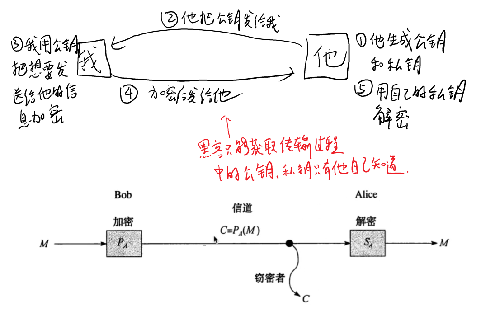
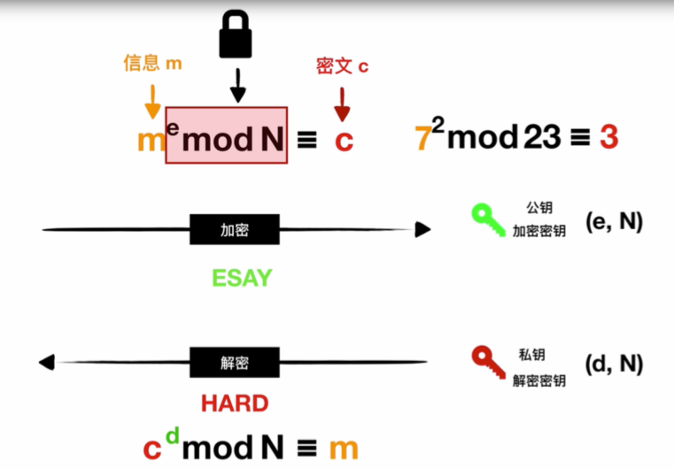
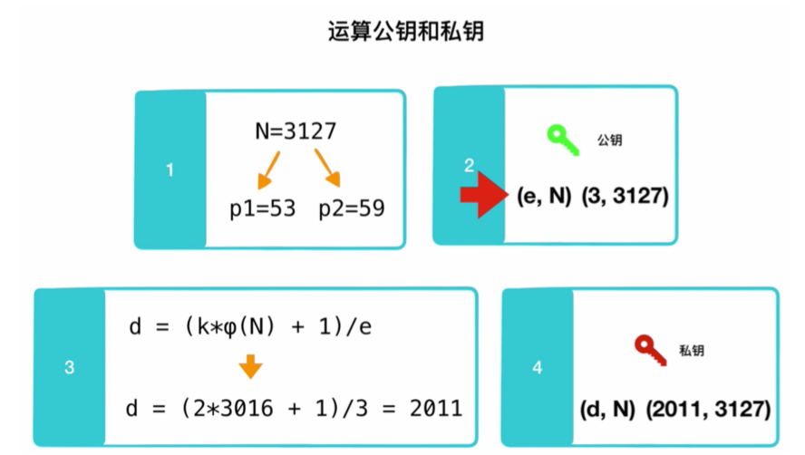
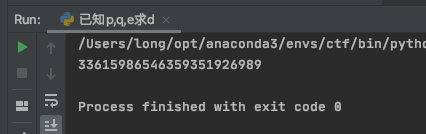
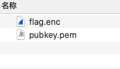
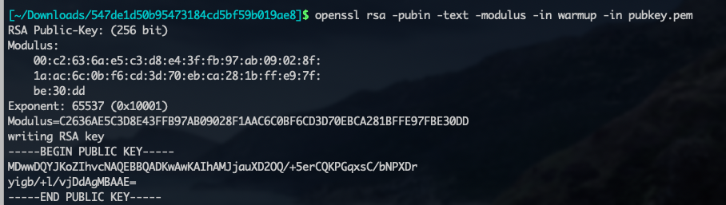
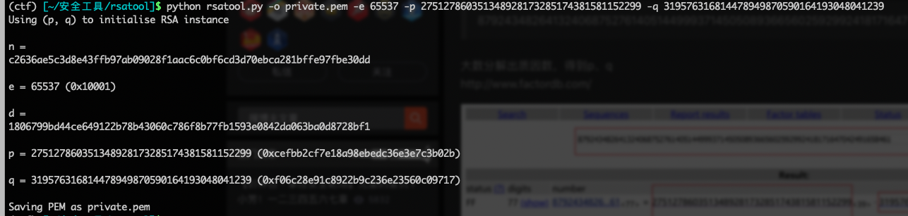
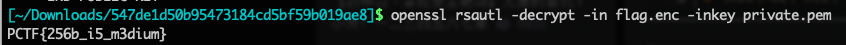

# RSA介绍

REA属于非对称加密

什么是非对称加密和对称加密？

非对称加密就是加密和解密的密钥是不一样的，对称加密的话加解密的密钥是一样的

RSA的应用最常用的就是https

RSA非对称加密系统：

公钥：用来加密，是公开的

私钥：用来解密，是私有的

简单总结一下这个传输原理：

我给他发送一条消息，我的公钥是公开的，就是说我加密的密钥是大家都知道的，但是如果有从中间截取我的消息，他虽然有公钥，但是他解不开，因为公钥是加密用的，公钥不能用于解密，只有用私钥才能解密，但是私钥他不知道，我没有公开。而对方有私钥，那他就可以解密了。写到这我突然问题来了，我的私钥怎么告诉对方，私钥告诉对方的时候，黑客不能从中间截取吗？？？？

4月29日补充：看了书才把之前的疑惑解决了，关键在于私钥在对方手里。是这样的，我给对方发消息，那么对方自己生成一个公钥和私钥，然后把公钥发给我，私钥只在他的手里，然后我拿到公钥，对我想发给他的信息进行加密，然后发给他，他再用自己的私钥进行解密，自始至终私钥只有他自己知道。

画个图解释一下：

[](https://www.onctf.com/images/image-20210803210311401.png)

（图中是Bob给Alice发送消息，c是窃密者，从中间截取信息，但是不知道私钥所以窃取的信息无法解开）

上面是一个通俗的概念，现在具体一点理解RSA（https://www.bilibili.com/video/av73858330）

[](https://www.onctf.com/images/image-20210803210340509.png)

直接看图不好理解，我这里解释一下马上就懂了

先介绍一下取模运算

x mod y = z

注意这个等于号应该是三条横线的，这里打不出来，这个取模运算就是我们说的求余数，官方一点讲就是x除以y的余数和z除以y的余数相等，比如49 mod 23 =3

RSA就是用到取模运算的

我们现在看图片，我们需要发送的信息是m，我们需要把m先加个e次方，然后mod  N，这是一个加密的过程，得到加密后的密文c。那么我们的公钥（即加密密钥）就是(e,N)，就是通过e和N就可以加密得到密文。加密过程是简单的，取模运算即可，但是解密过程是很难的，就是取模运算的逆运算非常难，即通过c用e和N是很难得到m的

但是如果有一个私钥（即解密密钥）那就很简单了。

就是说我们的密文c先加个d次方再mod N即可得到m，这里的d和N是就组成了私钥(d,N)

其实有点神奇，就是密文同样通过取模运算可以得到  信息m，只不过和加密时候取模运算的参数不一样，就是说如果有这个私钥，那就是一个取模运算而已，很容易得到m，但是如果没有这个私钥，那么就需要我们通过加密的取模运算反推回去，那就是取模的逆向了，那就很难了，所以没有私钥是很难解密的。

现在知道了加密解密过程，那么如何生成公钥和私钥（https://www.bilibili.com/video/BV1gE411i7Xr）

先看公钥，由e和N组成，我们先看N，N是由p和q相乘得到的，这个p和q必须都为素数，是我们自己选择的，为了安全越大越好

现在有了p和q并且相乘得到了N，我们还需要算φ(N)这个是通过欧拉函数算的，公式就是=(p-1)*(q-1)。这个φ(N)，暂时不需要知道为什么欧拉函数的公式是这样的。算出来是有用的。现在我们就会发现一个问题，如果不知道p和q就算知道N，那么是算不出φ(N)的，由公式知道我们必须要知道p和q才能算，这就是RSA的其中一个安全性了

然后我们现在再随便取一个e，注意这个e必须 1<e<φ(N)并且还必须与φ(N)互质

 那么现在e和N都有了，公钥就有了

现在看私钥，私钥的N是和公钥的N一样的，所以我们只需要求d，现在求d就需要用到φ(N)了

通过一个欧拉定理来推导，推导过程不写了，结论就是d=(k*φ(N)+1)/e，我们可以看到求d需要三个未知数，其他两个都有了，还有一个k，k是我们自己取的，但是必须保证d算出来是整数就可以了。

所以现在回过头来看，关键就在于p和q的值，如果说我们可以分解N得到p和q，那么RSA就被我们破解了，所以这就是RSA解密的关键

 [](https://www.onctf.com/images/image-20210803210402154.png)

这里有个具体的例子来说明如何算公钥和私钥，就是我们取p为53，q为59得到N然后再取一个e，现在就得到了公钥，然后我们通过公示即可求出d，那么私钥就算出来了。

# 1、已知p、q、e求d

这是最简单的RSA，p和q都有了，私钥d就可以算出来了

```
import gmpy2
p = 
q = 
e = 
fn = (p-1)*(q-1)    #这个fn是φ(n)
d = gmpy2.invert(e,fn)         # 即这个公式： d=(k*φ(n)+1)/e
print(d)
```

例题：

```
import gmpy2
p=976426347589612
q=97544783
e=17
fn = (p-1)*(q-1)
d = gmpy2.invert(e,fn)
print(d)
```

[](https://www.onctf.com/images/image-20210731153557543.png)

# 2、已知n、e求d

这题没有p和q了，只有p和q的乘积n，那么我们只能对n进行分解

分解n网站：

http://factordb.com/

http://www.factordb.com/index.php

分解出p和q之后，就和上面一样了

# 3、已知c、d、n求m

这题是解密，前两题求d只是求出私钥，这题的m是原始信息，即真正的解密

那么这题给了我们d就是私钥，那么求m就很容易了，就是RSA有私钥情况下的解密过程。根据c的d次 mod N即可得到m

直接利用m=pow(c,d,n)    pow(x,y,z)：这个是表示x的y次幂后除以z的余数。即m = pow(c,d) mod n

```
m=pow(c,d,n)
print(m)
```

一般这样打印出来的都是数字，但是因为这是信息m，即需要加密的内容，所以一般情况下应该是字符串。

```
flag = a2b_hex(hex(pow(c,d,n))[2:])  # c,d,n是十六进制也行
print(flag)
```

这样打印出来的就不是数字了，flag一般就是这样

# 4、已知c、e、n求m

这题没给私钥d，让我们解密，那么就只能先把p和q分解出来，然后把私钥求出来，然后就和上一题一样了（即第2题和第3题结合）

# 5、已知私钥文件、c求m

题目中给出了私钥文件private.pem和flag.enc

可在kali或是Ubuntu使用openssl直接进行解密

```
openssl rsautl -decrypt -in flag.enc -inkey private.pem
```

# 6、已知公钥文件、c求m

题目中给出了public.pem和密文flag.enc

使用

```
openssl rsa -pubin -text -modulus -in warmup -in pubkey.pem
```

返回公钥信息，即可以得到n、e，分解n得到p、q

使用rsatool生成私钥文件: private.pem

```
python rsatool.py -o private.pem -e 65537 -p XXX -q XXX
```

即接下来用生成的私钥文件解密flag文件

```
openssl rsautl -decrypt -in flag.enc -inkey private.pem
```

## 例题

这里用攻防世界的Normal_RSA这题举例子，因为涉及到环境的安装，需要验证环境是否可用

[](https://www.onctf.com/images/image-20210731194049601.png)

得到的就是公钥和c两个文件

[](https://www.onctf.com/images/image-20210731194350466.png)

mac环境是可以用openssl的

解释一下这里的Exponent是e，然后Modulus是N

```
e:65537
N:C2636AE5C3D8E43FFB97AB09028F1AAC6C0BF6CD3D70EBCA281BFFE97FBE30DD
```

现在有了N就需要分解一下得p和q

因为现在的N是十六进制的，我们先转成十进制

```
N = "C2636AE5C3D8E43FFB97AB09028F1AAC6C0BF6CD3D70EBCA281BFFE97FBE30DD"
print(int(N,16))
```

n=87924348264132406875276140514499937145050893665602592992418171647042491658461

分解一下

[](https://www.onctf.com/images/image-20210731195739022.png)

```
p=275127860351348928173285174381581152299
q=319576316814478949870590164193048041239
```

现在需要通过这些已知来求私钥文件，通过rsatool来求

https://github.com/ius/rsatool

```
python rsatool.py -o private.pem -e 65537 -p 275127860351348928173285174381581152299 -q 319576316814478949870590164193048041239
```

[](https://www.onctf.com/images/image-20210731201955423.png)

现在私钥文件就生成了

现在有私钥文件了，我们就可以解密了

```
openssl rsautl -decrypt -in flag.enc -inkey private.pem
```

[](https://www.onctf.com/images/image-20210731202923313.png)

# 7、共模攻击

共模攻击指的是有两个不同的e1，e2和一个n，它们分别对一个明文m进行加密，得到两份密文c1，c2，此时可以在不分解n的情况下还原出明文m的值。

# 8、低加密指数攻击

这个题目参考buuctf上面的Dangerous RSA这题的解析，这种题目的通用代码如下

```
from gmpy2 import iroot
import libnum
e = 0x3
n = 0x52d483c27cd806550fbe0e37a61af2e7cf5e0efb723dfc81174c918a27627779b21fa3c851e9e94188eaee3d5cd6f752406a43fbecb53e80836ff1e185d3ccd7782ea846c2e91a7b0808986666e0bdadbfb7bdd65670a589a4d2478e9adcafe97c6ee23614bcb2ecc23580f4d2e3cc1ecfec25c50da4bc754dde6c8bfd8d1fc16956c74d8e9196046a01dc9f3024e11461c294f29d7421140732fedacac97b8fe50999117d27943c953f18c4ff4f8c258d839764078d4b6ef6e8591e0ff5563b31a39e6374d0d41c8c46921c25e5904a817ef8e39e5c9b71225a83269693e0b7e3218fc5e5a1e8412ba16e588b3d6ac536dce39fcdfce81eec79979ea6872793
c = 0x10652cdfaa6b63f6d7bd1109da08181e500e5643f5b240a9024bfa84d5f2cac9310562978347bb232d63e7289283871efab83d84ff5a7b64a94a79d34cfbd4ef121723ba1f663e514f83f6f01492b4e13e1bb4296d96ea5a353d3bf2edd2f449c03c4a3e995237985a596908adc741f32365
k = 0
while 1:
    res = iroot(c+k*n,e)  #c+k*n 开e次方根，res的值里包含一个True或False，如果是True代表可以开e次方。
    #print(res)
    #res = (mpz(13040004482819713819817340524563023159919305047824600478799740488797710355579494486728991357), True)
    if(res[1] == True):
        print(libnum.n2s(int(res[0]))) #转为字符串
        break
    k=k+1
```