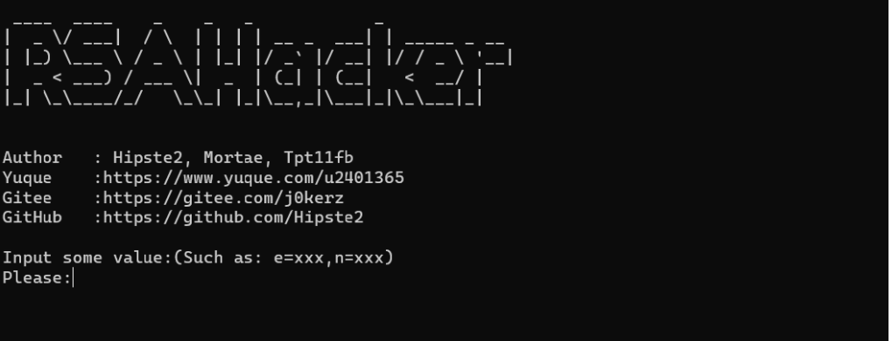
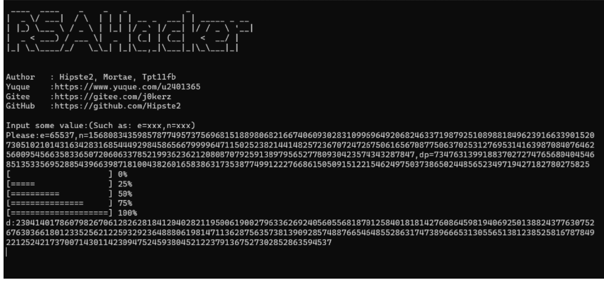

# RSAhacker
CTF中几种基础的RSA，都可以进行破解，其中连分数的维纳攻击来自于https://github.com/pablocelayes/rsa-wiener-attack

安装方法
  直接把所有的py脚本download下来到Linux平台，放在一个文件夹之后，用python3来允许LogicJudge.py

  操作测试不要输入空格！不要输入中文逗号！不要输入未知字符！否则会发生意想不到的错误！！！
  演示：
  
测试
  可以使用提供的Test文件进行测试。
