[TOC]

# 第一篇 RSA简介与相关工具安装

## 一、RSA概述

RSA 加密算法是一种非对称加密算法。在公开密钥加密和电子商业中 RSA 被广泛使用。RSA 是 1977 年由罗纳德 · 李维斯特（Ron Rivest）、阿迪 · 萨莫尔（Adi Shamir）和伦纳德 · 阿德曼（Leonard Adleman）一起提出的。RSA 就是他们三人姓氏开头字母拼在一起组成的。

RSA 算法的可靠性由极大整数因数分解的难度决定。换言之，对一极大整数做因数分解愈困难，RSA 算法愈可靠。假如有人找到一种快速因数分解的算法的话，那么用 RSA 加密的信息的可靠性就肯定会极度下降。但找到这样的算法的可能性是非常小的。如今，只有短的 RSA  密钥才可能被强力方式解破。到 2017 年为止，还没有任何可靠的攻击 RSA 算法的方式。

## 二、RSA基本原理

1. 公钥与私钥的产生：

(1)进行加密之前，首先找出2个不同的大质数p和q

(2)计算n=p*q

(3)根据欧拉函数，求得φ(n)=φ(p)φ(q)=(p−1)(q−1)

(4)找出一个公钥e，e要满足: 1<e<φ(n) 的整数，且使e和φ(N)互质。

(5)根据e*d除以φ(n)余数为1，找到私钥d。

(6)所以,公钥就是(n,e) 私钥就是(n,d)

(7)

```
dp=d%(p-1)
dq=d%(q-1)
```

\2. 消息加密:

m^e除以n求余数即为c(密文)


\3. 消息解密:

c^d除以n求余数即为m(明文)


RSA算法的加解密如上所示，下面来做个题试下。


软考网络工程师考试题目：按照RSA算法，若选取两奇数p=5，q=3，公钥e=7，则私钥d为多少？

(不要直接偷看答案解析哈)
A.6    B.7    C.8    D.9

答案解析(答案给你放远点,怕你偷看)：

由p=5，q=3，e=7

可知n = p*q =15。φ(n)=(p−1)(q−1)=8
由ed除以φ(n)余数为1得，7d=1(mod 8)
mod运算(取余)应该大部分人都会吧，不会的话可以去百度一下。


enn......如果说上面的题目你已经自己做出来了，或者看懂答案解析了，那接着试试下面这道题吧O(∩_∩)O~


what! ( ⊙ o ⊙ )！数好大，怎么搞，这是手要报废的节奏啊Ｏ(≧口≦)Ｏ。

怎么可能那么难啊，看看题目名"VeryEasyRSA"，按道理说应该不难，这是我们就要借用"Python"来帮我们解题了。

## 三、Python密码学模块安装

下面是RSA题目中常用到的模块安装，采用的是Python2的环境。

1. 安装gmpy2模块

```bash
Ubuntu下安装gmpy2模块：
python2：sudo apt-get install python-gmpy2   #python2环境请用这条命令
python3：sudo apt-get install gmpy2  #python3环境请用这条命令
```

\2. 安装libnum模块

```bash
git clone https://github.com/hellman/libnum
sudo python setup.py install 
```

\3. 安装pycipher模块

```bash
sudo pip install pycipher
```

\4. 安装Crypto模块

```bash
sudo pip install pycryptodome
```

安装这几个模块就差不多了。

回到前面的那个题目，我们看看怎么个VeryEasyRSA法。

```python
#coding:utf-8  
 
import gmpy2  
p = 3487583947589437589237958723892346254777  
q = 8767867843568934765983476584376578389  
e = 65537  
phi = (p-1)*(q-1)       #φ(n)在写的时候多用phi代替，因为键盘不好敲出来。  
d = gmpy2.invert(e,phi) #e模phi的逆为d, (e*d)%phi==1 原理上面讲过  
print d 
```

或者

```python
#coding:utf-8
 
import libnum  
p = 3487583947589437589237958723892346254777  
q = 8767867843568934765983476584376578389  
e = 65537  
phi = (p-1)*(q-1)  
d = libnum.invmod(e,phi) #e模phi的逆为d,(e*d)%phi==1   
print d  
```

上面的两种解法只是调用的模块不同，但计算效果是一样的，后面的题目中也会经常使用这些模块，具体想用哪个模块看自己的心情就好。不过建议使用gmpy2模块，该模块的功能更强大。


## 四、SageMath的安装

**SageMath 是在GPL协议下发布的开源数学软件，并且整合了许多已有的开源软件包到一个基于Python的统一界面下。其目标是创造一个Magma，Maple，Mathematica和Matlab的开源替代品。**         

**SageMath 包含了从线性代数、微积分，到密码学、数值计算、组合数学、群论、图论、数论等各种初高等数学的计算功能。**

SageMath 的功能十分强大，现在很多CTF比赛的密码学题目都是能用Sage去求解的。建议大家花一部分时间去学习下。

### **(1)Linux系统安装SageMath**

Ubuntu22.04下通过apt包管理器进行安装：

```bash
sudo apt install sagemath
```

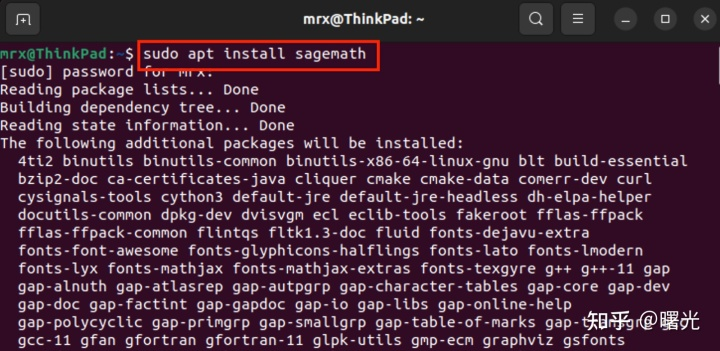

需要注意的是，不同的Linux发行版，包管理器中的SageMath版本是不一样的，具体的Linux发行版对应的SageMath的版本可通过该链接进行查看([https://repology.org/project/sagemath/versions](https://link.zhihu.com/?target=https%3A//repology.org/project/sagemath/versions))。官网建议，安装的SageMath版本不要低于9.2。

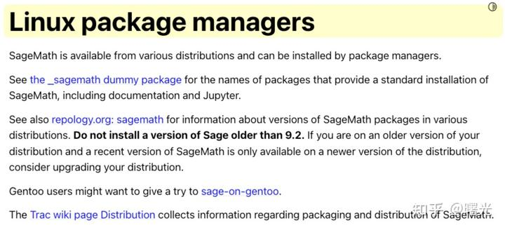

### **(2)Macos系统安装SageMath**

Macos可直接下载相应版本的dmg安装包，双击安装即可。

下载地址：[https://github.com/3-manifolds/Sage_macOS/releases](https://link.zhihu.com/?target=https%3A//github.com/3-manifolds/Sage_macOS/releases)


### **(3)Windows系统安装SageMath**

Windows版的话，官方给出的安装方法是通过WSL子系统的方式进行安装。Windows Subsystem for Linux(WSL)本质的话就是在Windows上安装一个Linux环境。装好Linux环境后，再和上面的示例一样，使用包管理器安装SageMath就可以了。


各版本的安装可参考官网：[https://doc.sagemath.org/html/en/installation/index.html](https://link.zhihu.com/?target=https%3A//doc.sagemath.org/html/en/installation/index.html)

通过上面任何一种方式安装完SageMath后，都可在命令行中输入`sage`打开SageMath。

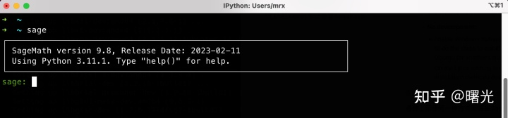

如果觉得安装麻烦的话，可以使用在线的sage：

[Sage Cell Server](https://link.zhihu.com/?target=https%3A//sagecell.sagemath.org/)

个人推荐使用本地安装的，毕竟这样没了网络也可用。

## 五、SageMath的使用

因为SageMath的功能太过强大，详细的使用方法请参考：[https://doc.sagemath.org/pdf/en/tutorial/sage_tutorial.pdf](https://link.zhihu.com/?target=https%3A//doc.sagemath.org/pdf/en/tutorial/sage_tutorial.pdf)

[doc.sagemath.org/pdf/en/tutorial/sage_tutorial.pdf](https://link.zhihu.com/?target=https%3A//doc.sagemath.org/pdf/en/tutorial/sage_tutorial.pdf)

这里仅针对上面的使用教程翻译整理了一小部分，部分示例进行了修改，以便更通俗的去理解。(以后可能会不定期更新这部分)。

### **(1)赋值运算、关系运算、算数运算**


**Sage 使用`=`进行赋值操作。**

```
sage: a = 5
sage: a
5
```

**Sage 使用`==`、`<=`、`>=`、`<`、和`>`进行关系的比较运算。示例如下：**

```bash
sage: 2 == 2
 True
 sage: 2 == 3
 False
 sage: 2 < 3
 True
 sage: 2 > 3
 False
 sage: a = 5   #对a进行赋值
 sage: a == 5  #a的值与数值5进行比较
 True
```

**Sage 提供所有基本的数学运算：**

```
sage: 2**3   #2的3次方
 8
 sage: 2^3    #2的3次方(另一种写法)
 8
 sage: 10 % 3  #取余运算(10除以3，余数为1)
 1
 sage: 10/4    #除法运算(10除以4，结果为分数5/2)
 5/2
 sage: 10//4   #取整运算(10除以4，结果为整数2)
 2
 sage: 4 * (10 // 4) + 10 % 4 == 10  #算数表达式的结果 与 数值10进行比较
 True
 sage: 3^2*4 + 2%5
 38
```

**Sage 还提供了许多熟悉的数学函数。下面是几个例子：**

```
sage: sqrt(4)       #开方。对4开根号，结果为2
 2
sage: sin(5.135)    #求sin(5.135)的值
 -0.912021158525540
sage: sin(pi/3)     #求sin(π/3)
 1/2*sqrt(3)
```

如上面的最后一个示例所示，一些数学表达式会直接返回"精确值"，而不是数值"近似值"。如果需要要获得计算结果的数值近似值，需要使用`函数N`或`方法n`(函数N和方法n是指numerical_approx)。

```cmd
#exp()函数：返回e的n次幂。
 sage: exp(1)
 e
 sage: exp(2)
 e^2
 sage: exp(3)
 e^3

 #Sage中的pi就是数学中的符号π
 #取π的近似值
 sage: sqrt(pi)
 sqrt(pi)
 sage: N(sqrt(pi))  
 1.77245385090552
 sage: n(sqrt(pi))   
 1.77245385090552
 sage: numerical_approx(sqrt(pi)) 
 1.77245385090552
 sage: sqrt(pi).n()  
 1.77245385090552
 sage: sqrt(pi).numerical_approx()
 1.77245385090552
```

`函数N`和`方法n`都支持可选参数`digits`和`prec`。

①`digits`参数是指控制数值的精度，它指定了所需的**十进制有效数字的位数**。例如，如果`digits = 3`，则函数将返回 3 位十进制有效数字位数的数值结果。

②`prec`参数也是控制数值精度的一个参数，但与`digits`参数不同的是，它指定了所需的**二进制有效数字的位数**。例如，如果`prec = 11`，则函数将返回 11 位二进制有效数字位数的数值结果。


二进制有效数字位数基于2的幂，而十进制有效数字位数基于10的幂。

二进制有效数字位数和十进制有效数字位数之间如何转换呢？

10个二进制有效数字位数最多可以表示1024`(2^10)`个不同的值，3个十进制有效数字位数最多可以表示1000`(10^3)`个不同的值，10个二进制有效数字位数和3个十进制有效数字位数能表示的数值是差不多的。

在十进制和二进制之间的转换中，每**3.32个二进制数字位**相当于约**1个十进制数字位**。因此，如果我们想要通过保留 n 位二进制数字来近似保留 m 位十进制数字，可以使用下面公式：

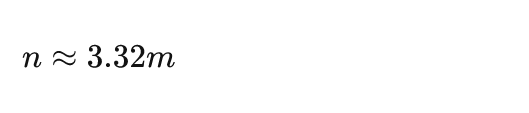

例如，如果希望保留 3 位十进制有效数字的位数，我们可以使用`prec = 10`(3.32*3=9.95)来表示。由于浮点数的存储方式，不是所有的二进制数字都是等价于有效数字的。在实际测试中，可以发现`prec = 10`只能表示出 2 位十进制有效数字位数，所以，必须再大一点，使用`prec = 11`才能表示出 3 位十进有效数字位数。

同理，如果需要根据二进制有效位数求解下大概能表示的十进制有效位数的话，可以使用下面公式：

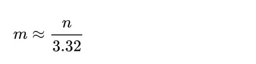

例如，当`prec = 11`时，我们可以计算出该方式可以表示出大概 3 个有效十进制数字位数 

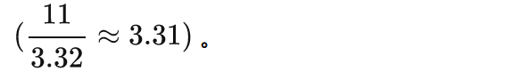

在SageMath中，`digits`和`prec`参数通常是用来控制`RealNumber`对象的精度的。如果表达式中包含其他类型的对象，如复数、矩阵等，那么这些对象的精度可能不受`digits`和`prec`参数的影响。

```cmd
#指定十进制有效数字位数的取近似值
 sage: N(pi, digits=3)
 3.14
 sage: n(pi, digits=3)
 3.14
 sage: numerical_approx(pi, digits=3)
 3.14
 sage: pi.n(digits=3)
 3.14
 sage: pi.numerical_approx(digits=3)
 3.14

 #指定二进制有效数字位数的取近似值
 sage: N(pi, prec=11)
 3.14
 sage: n(pi, prec=11)
 3.14
 sage: numerical_approx(pi, prec=11)
 3.14
 sage: pi.n(prec=11)
 3.14
 sage: pi.numerical_approx(prec=11)
 3.14
```

在 Python 中，变量是动态类型的，它们可以引用任何 Python 对象，并且可以在运行时更改其引用的对象类型。这意味着，变量的类型是在运行时动态推断的。示例如下：

```cmd
sage: a = 5       #a是一个整数
 sage: type(a)
 <class 'sage.rings.integer.Integer'>
 sage:
 sage: a = 5/3     #a现在是一个有理数
 sage: type(a)     #有理数是整数(正整数、0、负整数)和分数的统称。
 <class 'sage.rings.rational.Rational'>
 sage:
 sage: a = "hello" #a现在是一个字符串
 sage: type(a)
 <class 'str'>
```

相反，静态类型的 C 编程语言在编译时会要求变量被声明为特定类型，并且只能在其范围内保存相应类型的值。这意味着，变量类型在编译时是静态确定的。

作者：曙光
链接：https://zhuanlan.zhihu.com/p/76006823
来源：知乎
著作权归作者所有。商业转载请联系作者获得授权，非商业转载请注明出处。


### **(2)获取帮助**

SageMath 内置丰富的文档，可通过键入`函数名称或常量`＋`问号`的方式来访问：

```python
 sage: tan?
 Type:           Function_tan
 String form:    tan
 File:           /private/var/tmp/sage-9.8-current/local/var/lib/sage/venv-python3.11.1/lib/python3.11/site-packages/sage/functions/trig.py
 Docstring:
    The tangent function.
 
    EXAMPLES:
 
       sage: tan(pi)
       0
       sage: tan(3.1415)
 ... ...
```


```python
 sage: sudoku?
 Signature:      sudoku(m)
 Docstring:
    Solves Sudoku puzzles described by matrices.
 
    INPUT:
 
    * "m" - a square Sage matrix over \ZZ, where zeros are blank
      entries
 
    OUTPUT:
 
    A Sage matrix over \ZZ containing the first solution found,
    otherwise "None".
 
    This function matches the behavior of the prior Sudoku solver and
    is included only to replicate that behavior.  It could be safely
    deprecated, since all of its functionality is included in the
    "Sudoku" class.
 ... ...
```

Sage 还提供`Tab 完成`的自动补全功能：键入函数的前几个字母，然后按 Tab 键。例如，如果你输入"ta"紧接着按"Tab按键"，Sage 将打印 tachyon、tan、tanh、taylor。这提供了一种在 Sage 中查找函数名称和其他结构的好方法。


作者：曙光
链接：https://zhuanlan.zhihu.com/p/76006823
来源：知乎
著作权归作者所有。商业转载请联系作者获得授权，非商业转载请注明出处。


### **(3)函数、缩进、计数**

要在 SageMath 中定义一个新函数，需要使用 def 命令并在变量名称列表后加上一个冒号。例如：

```python
 sage: def is_even(n):     #判断输入的n是否为偶数
 ....:     return n%2 == 0
 ....:
 sage: is_even(2)
 True
 sage: is_even(3)
 False
```

在 Python 中，代码块不像许多其他语言那样由大括号或开始和结束块表示。相反，代码块由缩进表示，缩进必须完全匹配。例如：

```python
 sage: def even(n):           #列出1到指定正整数之间的偶数
 ....:     v = []
 ....:     for i in range(1,n):
 ....:         if i % 2 == 0:
 ....:             v.append(i)
 ....:     return v
 ....:
 sage: even(10)
 [2, 4, 6, 8]
```

在大多数情况下，一行以换行结尾，行尾不需要分号。但是，你可以将多个语句放在一行，用分号分隔：

```python
 sage: a = 5; b = a + 3; c = b^2; c
 64
```

SageMath 中最基本的数据结构是列表。例如，使用范围，以下命令创建一个列表： 

```python
 sage: list(range(2,10))
 [2, 3, 4, 5, 6, 7, 8, 9]
```

这是一个更复杂的列表：

```python
 sage: v = [1, "hello", 2/3, sin(x^3)]
 sage: v
 [1, 'hello', 2/3, sin(x^3)]
```

与许多编程语言一样，列表索引是从 0 开始的。

```python
 sage: v[0]
 1
 sage: v[1]
 'hello'
 sage: v[2]
 2/3
```

使用`len(v)`可以获取列表 v 的长度，使用`v.append(obj)`将新对象追加到 v 的末尾，使用 `del v[i]` 可以删除 v 的第 i 个条目：

```python
 sage: v
 [1, 'hello', 2/3, sin(x^3)]
 sage: len(v)
 4
 sage: v.append(1.5)
 sage: v
 [1, 'hello', 2/3, sin(x^3), 1.50000000000000]
 sage: del v[1]
 sage: v
 [1, 2/3, sin(x^3), 1.50000000000000]
```

另一个重要的数据结构是字典。字典和列表很相似，除了它可以用几乎任何对象进行索引(索引必须是不可变的)：

```python
 sage: d = {'hi':-2, 3/8:pi, e:pi}
 sage: d['hi']
 -2
 sage: d[3/8]
 pi
 sage: d[e]
 pi
```

你还可以使用类定义新的数据类型。用类封装数学对象是一种强大的技术，可以帮助简化和组织你的Sage程序。下面，我们定义了一个类，它表示最多为 n 的偶数正整数列表。

```python
 sage: class Evens(list):
 ....:     def __init__(self, n):
 ....:         self.n = n
 ....:         list.__init__(self, range(2, n+1, 2))
 ....:     def __repr__(self):
 ....:         return "Even positive numbers up to n."
```

Evens对象创建时会调用`__init__`方法初始化对象。`__repr__`方法打印出对象。我们在`__init__`方法的第二行调用列表构造方法。

我们创建一个类 Evens 的对象，如下所示：

```python
 sage: e = Evens(10)
 sage: e
 Even positive numbers up to n.
```

e 会使用我们定义的`__repr__`方法进行打印。要查看底层数字列表，请使用列表函数：

```python
 sage: list(e)
 [2, 4, 6, 8, 10]
```

我们还可以访问 n 属性或将 e 视为列表。

```python
 sage: e.n
 10
 sage: e[2]
 6
```

# 第二篇 基础题型讲解与数学基础

### 一、基础题型

### 题目1：**Jarvis OJ - Basic - easyRSA**（给e,n,c求m）

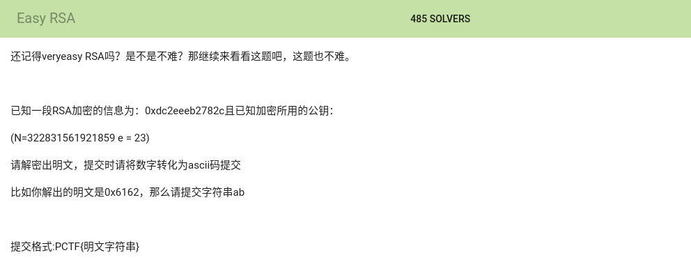

题目给出了e和n以及密文c，需要求明文m。

解题思路是根据n分解求出p和q，然后根据e，p，q求出d，再根据c，d，n求出明文m。

如何求p和q呢，这里涉及到质因数的分解，linux下一般可直接执行命令factor去分解它：

```bash
factor  322831561921859
在sagemath中也是一样
```

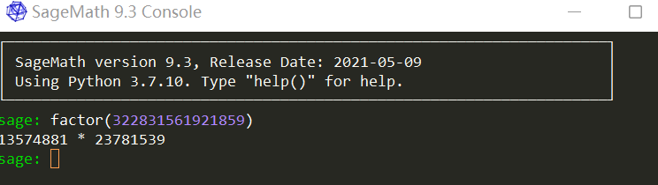

但是factor能分解的数不是很大，当n特别大的时候可以使用factordb这个命令 ：

```bash
factordb 322831561921859
```

使用下面命令来安装factordb：

```bash
pip install factordb-pycli
```

当然，我们也可以直接使用在线网站来分解n:

[factordb.com](https://link.zhihu.com/?target=http%3A//factordb.com/)

[factordb.com/](https://link.zhihu.com/?target=http%3A//factordb.com/)

如果n特别大，这个网站也分解不出来，那就算了吧。这个题肯定不是分解n来解题，一定有别的方法。

本题的解题步骤是先求出p和q：

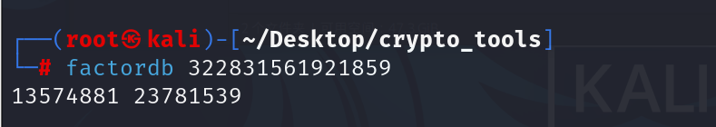

p是13574881或者23781539都行，反正就两个数，你指定第一个是p那么第二个就是q，反之亦可。

解题脚本:

```python
#coding:utf-8
 
import libnum  
from Crypto.Util.number import long_to_bytes  
 
c = 0xdc2eeeb2782c  
n = 322831561921859  
e = 23  
q = 13574881  
p = 23781539  
 
d = libnum.invmod(e, (p - 1) *(q - 1))#ed=1 mod(phi)
m = pow(c, d, n)  #m=c^d mod n
print "m的值为:"  
print long_to_bytes(m)  
```

关于long_to_bytes与bytes_to_long百度一下就知道了，关于如何记住pow里面的变量顺序，我记得好像有个cdn加速来，靠谐音就记住了。关于求d，也就是模逆运算，下面的数学基础中会讲。


### 题目2：Jarvis OJ - Crypto- MediumRSA(给公钥和密文文件（flag.enc,pubkey.pem,解开密文flag.enc）)


题目给出了两个文件，如下图所示:

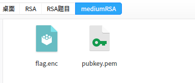


其中flag.enc是密文，pubkey.pem是公钥。正常的话是必须要有私钥才可以解开密文，但是这里加密的强度不高，所以可以直接解开，下面咱们一起来干点坏事O(∩_∩)O哈！

现在，我们只知道密文c，其他的都不知道，怎么办呢？

这里，我们要读取公钥文件pubkey.pem中的基本信息。

用openssl

```shell
openssl rsa -pubin -in pubkey.pem -text modulus
```

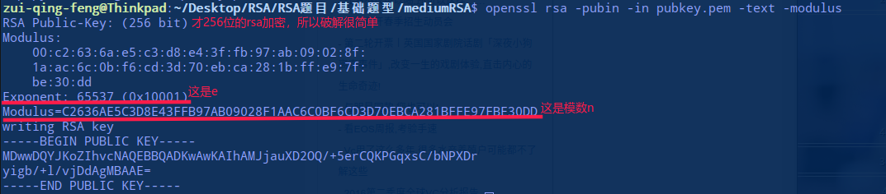

首先把n由16进制转为10进制，接着分解n得到p和q。


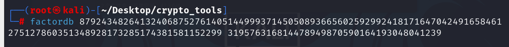

现在我们有了n，p，q，e，c。

接着，我们可以根据p，q求phi。然后，再根据phi和e求d。最后，根据c，d，n即可求出明文m。

解题脚本：

```python
#!/usr/bin/python  
#coding:utf-8  
#@Author:Mr.Aur0ra
 
import libnum  
from Crypto.Util.number import long_to_bytes  
 
n = 87924348264132406875276140514499937145050893665602592992418171647042491658461  
p = 275127860351348928173285174381581152299  
q = 319576316814478949870590164193048041239  
e = 65537  
phi = (p-1)*(q-1)  
d = libnum.invmod(e,phi)  
 
with open('./flag.enc') as f:  
    c = f.read().encode('hex')  
    c = int(c,16)  
m = pow(c,d,n)  
print long_to_bytes(m)
```

或者

```python
#coding:utf-8  
 
import gmpy2  
from Crypto.Util.number import long_to_bytes  
 
n = 87924348264132406875276140514499937145050893665602592992418171647042491658461  
p = 275127860351348928173285174381581152299  
q = 319576316814478949870590164193048041239  
e = 65537  
phi = (p-1)*(q-1)  
d = gmpy2.invert(e,phi)  
 
with open('./flag.enc') as f:  
    c = f.read().encode('hex')  
    c = int(c,16)  
m = pow(c,d,n)  
print long_to_bytes(m)  
```

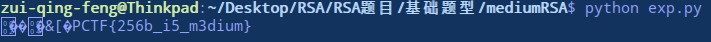

关于文件形式的密文c，一般都是16进制形式读取，接着再转为整型用于计算。上面的读取代码有点冗余了，后面的题目会有更简洁的读取方式。

### **题目3：GUET-CTF 2019-babyRSA(给出p+q，(p+1)*(q+1)，e，d，c，求m)**

真的忘了题目是哪个比赛的题，就叫存货吧。

题目：

```python
p+q : 0x1232fecb92adead91613e7d9ae5e36fe6bb765317d6ed38ad890b4073539a6231a6620584cea5730b5af83a3e80cf30141282c97be4400e33307573af6b25e2ea
    
(p+1)(q+1) : 0x5248becef1d925d45705a7302700d6a0ffe5877fddf9451a9c1181c4d82365806085fd86fbaab08b6fc66a967b2566d743c626547203b34ea3fdb1bc06dd3bb765fd8b919e3bd2cb15bc175c9498f9d9a0e216c2dde64d81255fa4c05a1ee619fc1fc505285a239e7bc655ec6605d9693078b800ee80931a7a0c84f33c851740
e : 0xe6b1bee47bd63f615c7d0a43c529d219
d : 0x2dde7fbaed477f6d62838d55b0d0964868cf6efb2c282a5f13e6008ce7317a24cb57aec49ef0d738919f47cdcd9677cd52ac2293ec5938aa198f962678b5cd0da344453f521a69b2ac03647cdd8339f4e38cec452d54e60698833d67f9315c02ddaa4c79ebaa902c605d7bda32ce970541b2d9a17d62b52df813b2fb0c5ab1a5
enc_flag: 0x50ae00623211ba6089ddfae21e204ab616f6c9d294e913550af3d66e85d0c0693ed53ed55c46d8cca1d7c2ad44839030df26b70f22a8567171a759b76fe5f07b3c5a6ec89117ed0a36c0950956b9cde880c575737f779143f921d745ac3bb0e379c05d9a3cc6bf0bea8aa91e4d5e752c7eb46b2e023edbc07d24a7c460a34a9a
```

题目给出了p+q，(p+1)(q+1)，e，d，c。

当时做这题的时候就蒙了，n在哪? p，q呢? 我是谁? 我在哪?  仔细想了一会，掏出笔记本列了一下等式关系，就出来了...

```text
(p+1)(q+1)
= p*q + p + q + 1
= n + (p+q) + 1
那么：
n = (p+1)(q+1) - (p+q) - 1

m = pow(c,d,n)
```

解题脚本:

```python
#!/usr/bin/python  
#coding:utf-8  
#@Author:Mr.Aur0ra

import gmpy2  
from Crypto.Util.number import long_to_bytes  

#p+q用x表示
#(p+1)(q+1)用y表示
x = 0x1232fecb92adead91613e7d9ae5e36fe6bb765317d6ed38ad890b4073539a6231a6620584cea5730b5af83a3e80cf30141282c97be4400e33307573af6b25e2ea
y = 0x5248becef1d925d45705a7302700d6a0ffe5877fddf9451a9c1181c4d82365806085fd86fbaab08b6fc66a967b2566d743c626547203b34ea3fdb1bc06dd3bb765fd8b919e3bd2cb15bc175c9498f9d9a0e216c2dde64d81255fa4c05a1ee619fc1fc505285a239e7bc655ec6605d9693078b800ee80931a7a0c84f33c851740  
d = 0x2dde7fbaed477f6d62838d55b0d0964868cf6efb2c282a5f13e6008ce7317a24cb57aec49ef0d738919f47cdcd9677cd52ac2293ec5938aa198f962678b5cd0da344453f521a69b2ac03647cdd8339f4e38cec452d54e60698833d67f9315c02ddaa4c79ebaa902c605d7bda32ce970541b2d9a17d62b52df813b2fb0c5ab1a5
c = 0x50ae00623211ba6089ddfae21e204ab616f6c9d294e913550af3d66e85d0c0693ed53ed55c46d8cca1d7c2ad44839030df26b70f22a8567171a759b76fe5f07b3c5a6ec89117ed0a36c0950956b9cde880c575737f779143f921d745ac3bb0e379c05d9a3cc6bf0bea8aa91e4d5e752c7eb46b2e023edbc07d24a7c460a34a9a  

n = y - x - 1
m = pow(c,d,n)  
print long_to_bytes(m) 
```

其实这个题也不是很难哈，就是替换一下什么的的数学小游戏罢了。真正难的在最后面。

### 二、数学基础

这部分是我从别人那里搬来的，然后做了一点点的修改，我觉得吧，还是应该看些数学原理的。毕竟越往深了学，用到的数学知识就越多。话说数学好的人是真的优秀，作为学习网络工程的人，在我眼里，香农是通信方面的大佬，令我没想到的是，他还是个数学专家和密码学专家，业余无聊搞一搞通信。这人太狠了。

如果实在看不懂可以跳过这部分，进入下个标题的学习。不要看都没看就跳过哈。哪怕稍微看点再看下一篇也行。

### **1. RSA应用流程**

上面讲的公钥和私钥产生多半是大白话的，下面是偏数学上的介绍，也很好理解啦：

(1)选取两个较大的互不相等的质数p和q，计算n = p * q 。

(2)计算phi = (p-1) * (q-1) 。

(3)选取任意e，使得e满足 1<e<phi 且 gcd(e , phi) == 1 。

(4)计算e关于n的模逆元d， 即d满足(e * d)% n ==1 。

(5)加密算法：c = (m ^ e) % n 

​    解密算法：m = (c ^ d) % n 

> 其中m为明文，c为密文，(n,e)为公钥对，d为私钥。


### **2. 理解模逆运算**

如果(a*b)%c==1 ，那么a和b互为对方模c的模逆元/数论倒数，也写作mod_inv 。

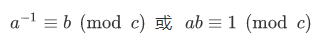

关于最大公约数有一个基本事实：给予两整数a、c，必存在整数x、y使得ax + cy = gcd(a,c) ，基于这个事实，当a,c互素即gcd(a,c)==1 时，有ax+cy=1 ，那么就有(a*x)%c==1  ，所以x就是a 对c的模逆元。因此，a对c存在模逆元b的充要条件是gcd(a,c)==1 。显然对于每一组a,c  ，存在一族满足条件的x，在求模逆元时我们取得是最小正整数解x mod n 。

上述的基本事实很容易理解，因为a和c的最大公约数是gcd(a,b)，所以a和c都可表示为gcd(a,b)的整数倍，那么a和b的任意整系数的线性组合ax+by也必定能表示成gcd(a,c)的整数倍，他们当中最小的正整数就应该是gcd(a,c)。实际上最大公约数有一个定义就是：a和b的最大公约数g是a和b的线性和中的最小正整数 。

求模逆元主要基于扩展欧几里得算法，贴一个Python实现：

```python
#!/usr/bin/python   
#coding:utf-8  
#47模30的逆为23  
 
def egcd ( a , b ):  
 if (b == 0):  
 return 1, 0, a  
 else:  
        x , y , q = egcd( b , a % b ) # q = GCD(a, b) = GCD(b, a%b)  
        x , y = y, ( x - (a // b) * y )  
 return x, y, q  
def mod_inv(a,b):  
    #return egcd(a,b)[0]%b #求a模b得逆元  
 print egcd(a,b)[0]%b  
def main():  
    a = 47  
    b = 30  
    mod_inv(a,b)  
if __name__=="__main__":  
    main()  
```

或者(推荐)

```python
#coding:utf-8  
#求47模30的逆为23  
 
import gmpy2  
 
print gmpy2.invert(47,30)  
```

> 熟悉吧，前面求d的时候用的就是这个。


### **3. 模意义下的运算法则**

(a + b) % n ≡ (a % n + b % n) % n

(a - b) % n ≡ (a % n - b % n) % n

(a * b) % n ≡ (a % n * b % n) % n

(a ^ b) % n ≡ ((a % n) ^ b) % n //幂运算


若 a ≡ b(mod n) ,则

(1)对于任意正整数c,有a^c ≡ b^c(mod n)

(2)对于任意整数c,有ac ≡ bc(mod n),a+c ≡ b+c(mod n),

(3)若 c ≡ d(mod n),则a-c ≡ b-d(mod n),a+c ≡ b+d(mod n),ac ≡ bd(mod n)


如果ac≡bc (mod m)，且c和m互质，则a≡b (mod m）[理解：当且仅当c和m互质,c^-1存在,等式左右可同乘模逆。]


除法规则：

在模n意义下，a/b不再仅仅代表这两个数相除，而是指 a+k1*n 和 b+k2*n这两个组数中任意两个相除，使商为整数

因此也就可以理解，除以一个数等价于乘以它的逆

a/b ≡ c(mod n) <=> a ≡ c*(b^-1) (mod n)，其中b模n的逆记作b的负一次方。


### **4. 费马小定理**

a是整数,p是质数,则a^p==a(mod p),如果a不是p的倍数,还有a^(p-1) ≡ 1(mod p)


### **5. 欧几里得算法**

欧几里得算法是求最大公约数的算法, 也就是中学学的 辗转相除法 。记 gcd(a,b) 为a和b的最大公约数。

欧几里得算法的基本原理是gcd(a,b)==gcd(b,a%b),(b!=0) 和 gcd(a,0)==a 。

```python
# 递归版  
def gcd(a, b):  
    return a if not b else gcd(b, a % b)  
# 迭代版  
def gcd2(a, b):  
    while b:  
        a, b = b, a % b  
return a 
```


### **6. 扩展欧几里得算法**

扩展欧几里得算法基于欧几里得算法，能够求出使得 ax+by=gcd(a,b) 的一组x,y。

对照下图和以下递归版实现容易理解。

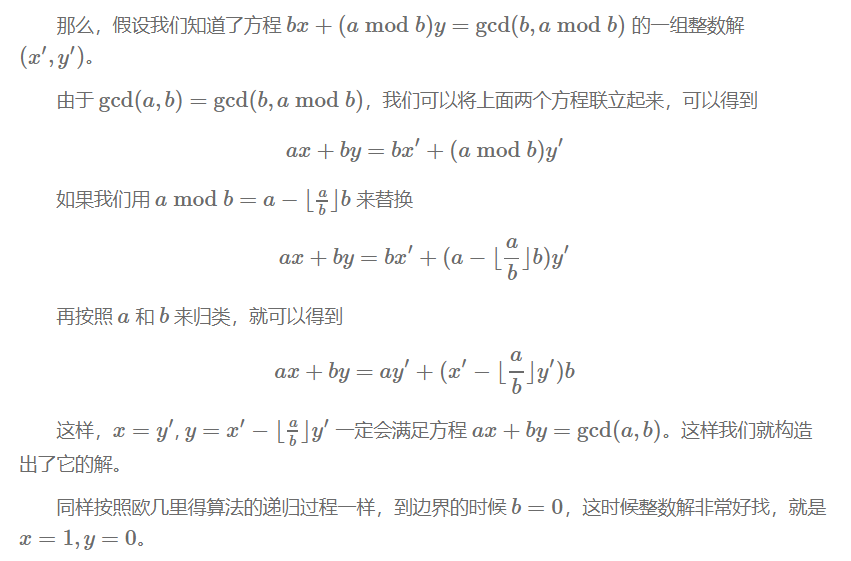

python实现如下:

```python
# 递归版  
def ext_euclid ( a , b ):  
    # ref:https://zh.wikipedia.org/wiki/扩展欧几里得算法  
 if (b == 0):  
 return 1, 0, a  
 else:  
        x1 , y1 , q = ext_euclid( b , a % b ) # q = GCD(a, b) = GCD(b, a%b)  
        x , y = y1, ( x1 - (a // b) * y1 )  
 return x, y, q  
# 迭代版  
def egcd(a, b):  
    # ref:https://blog.csdn.net/wyf12138/article/details/60476773  
 if b == 0:  
 return (1, 0, a)  
    x, y = 0, 1  
    s1, s2 = 1, 0  
    r, q = a % b, a / b  
 while r:  
        m, n = x, y  
        x = s1 - x * q  
        y = s2 - y * q  
        s1, s2 = m, n  
        a, b = b, r  
        r, q = a % b, a / b  
 return (x, y, b)
```

### **7. 中国剩余定理**

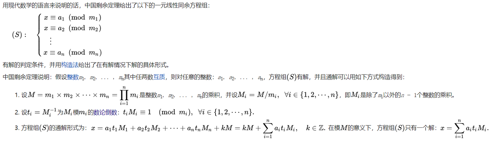

python实现如下：

```python
def CRT(mi, ai):  
    # mi,ai分别表示模数和取模后的值,都为列表结构  
    # Chinese Remainder Theorem  
    # lcm=lambda x , y:x*y/gcd(x,y)  
    # mul=lambda x , y:x*y  
    # assert(reduce(mul,mi)==reduce(lcm,mi))  
    # 以上可用于保证mi两两互质  
 assert (isinstance(mi, list) and isinstance(ai, list))  
    M = reduce(lambda x, y: x * y, mi)  
    ai_ti_Mi = [a * (M / m) * gmpy2.invert(M / m, m) for (m, a) in zip(mi, ai)]  
 return reduce(lambda x, y: x + y, ai_ti_Mi) % M  
```

以上程序将mi当作两两互质处理,实际上有时会遇到其他情况，这时就需要逐一两两合并方程组。我(不是我)参照下图实现了一个互质与不互质两种情况下都能工作良好的中国剩余定理（解同余方程组）的Python程序。

```python
def GCRT(mi, ai):  
    # mi,ai分别表示模数和取模后的值,都为列表结构  
 assert (isinstance(mi, list) and isinstance(ai, list))  
    curm, cura = mi[0], ai[0]  
 for (m, a) in zip(mi[1:], ai[1:]):  
        d = gmpy2.gcd(curm, m)  
        c = a - cura  
 assert (c % d == 0) #不成立则不存在解  
        K = c / d * gmpy2.invert(curm / d, m / d)  
        cura += curm * K  
        curm = curm * m / d  
        cura %= curm  
 return (cura % curm, curm) #(解,最小公倍数) 
```

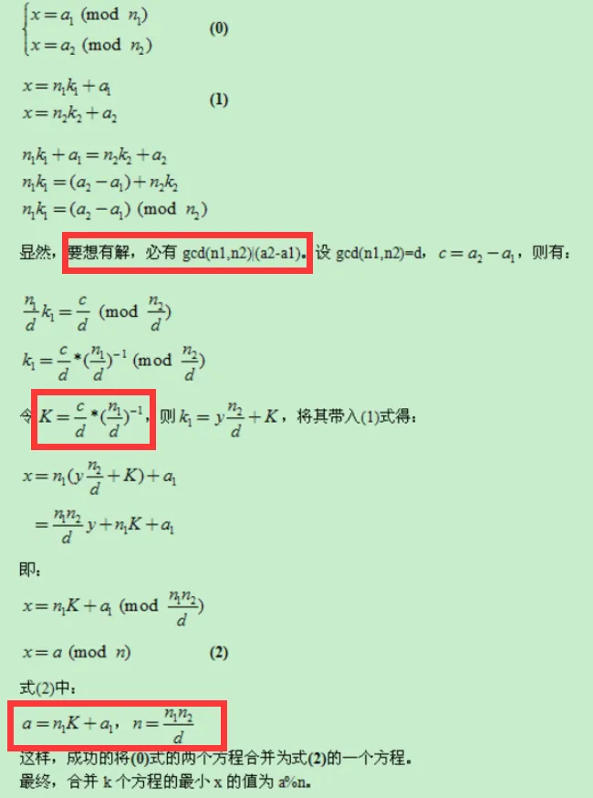

好了，如果都看到这里了的话，说明你还是很厉害的，给你点个赞。

# 第三篇 题型进阶，各类攻击类型例题与讲解

## (1)低加密指数(公钥e)分解攻击

在 RSA 中 e 也称为加密指数。由于 e 是可以随意选取的，选取小一点的 e 可以缩短加密时间（比如 e=2,e=3），但是选取不当的话，就会造成安全问题。下面就是e选取的太小导致存在的安全问题。

### 01. e=2把密文c开平方求解

在RSA加密中，由于e只有2，相当于把明文m平方了而已，得到的c也比n小很多。尝试把c开根号看能否得到明文。Python自带的开根号求解的数并不打。我们可以使用gmpy2库来对大整数开根号。

#### 题目:  01-西湖论剑rsa

```text
已知:
e=2
c=9217979941366220275377875095861710925207028551771520610387238734819759256223080175603032167658086669886661302962985046348865181740591251321966682848536331583243529
求明文m?
```

解题:

```python
#coding:utf-8 
 
import gmpy2  
import libnum  
c = 9217979941366220275377875095861710925207028551771520610387238734819759256223080175603032167658086669886661302962985046348865181740591251321966682848536331583243529  
m = gmpy2.isqrt(c)#求平方根
m = int(m)  
m_text = libnum.n2s(m)#整形转换到string
print(m_text)
```

### 02. e=2 Rabin加密中的N可被分解

Rabin加密是RSA的衍生算法

e=2是Rabin加密典型特征，但并不是所有的RSA在e=2时都是Rabin加密。

Rabin解密的Python实现:   

```python
def rabin_decrypt(c, p, q, e=2):  
    n = p * q  
    mp = pow(c, (p + 1) / 4, p)  
    mq = pow(c, (q + 1) / 4, q)  
    yp = gmpy2.invert(p, q)  
    yq = gmpy2.invert(q, p)  
    r = (yp * p * mq + yq * q * mp) % n  
    rr = n - r  
    s = (yp * p * mq - yq * q * mp) % n  
    ss = n - s  
    return (r, rr, s, ss)  
```

#### 题目:  02-Jarvis OJ -Crypto-Hard RSA(e=2时，Rabin加密中的N可被分解)

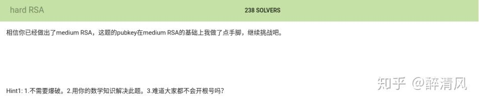

确实如题目描述的一般，出题人做手脚了，按照之前做MediumRSA的步骤做完全做不出来，而且求d的时候就会报错找不到e的模反数:

```text
ValueError: no invmod for given @a and @n 
```

所以要多积累一些题型，这里就是考察的e=2时，Rabin加密中的N可被分解。 

首先通过openssl提取公钥的信息：

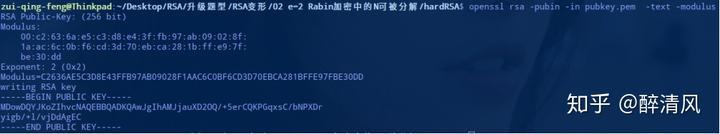

我们得到e=2，n=0xC2636....

然后分解n得到p和q：

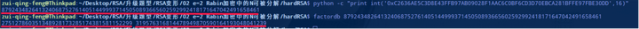

然后就可以写Python脚本了:

```python
#!/usr/bin/python 
#coding:utf-8 
 
import gmpy2  
import libnum  
 
e = 2  
n = 87924348264132406875276140514499937145050893665602592992418171647042491658461  
p = 275127860351348928173285174381581152299  
q = 319576316814478949870590164193048041239  
c=int(open('./flag.enc','rb').read().encode('hex'),16)  
 
mp=pow(c,(p+1)/4,p)  
mq=pow(c,(q+1)/4,q)  
yp=gmpy2.invert(p,q)  
yq=gmpy2.invert(q,p)  
r=(yp*p*mq+yq*q*mp)%n  
rr=n-r  
s=(yp*p*mq-yq*q*mp)%n  
ss=n-s  
print libnum.n2s(r)  
print libnum.n2s(rr)  
print libnum.n2s(s)  
print libnum.n2s(ss)  
```

记住这是模板，以后有类似的题目直接拿来用就好，对了一般读取文件获得变量c的值都是这样表示的，这会使代码看上去更简洁**。**


### 03. e=3 小明文攻击

适用情况：e较小，一般为3。

公钥e很小，明文m也不大的话，于是m^e=k*n+m 中的的k值很小甚至为0，爆破k或直接开三次方即可。

攻击原理：假设用户使用的密钥 e=3。考虑到加密关系满足：


那么： 


攻击者可以从小到大枚举 k，依次开三次根，直到开出整数为止。

#### 题目:  03-Jarvis OJ -Crypto-Extremely RSA

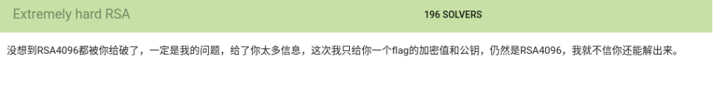

因为e=3，很可能存在小名文攻击，于是直接写脚本进行爆破。解题脚本

```python
#coding:utf-8     
import gmpy2
import binascii
import libnum
import time
from Crypto.Util.number import long_to_bytes

n=0xB0BEE5E3E9E5A7E8D00B493355C618FC8C7D7D03B82E409951C182F398DEE3104580E7BA70D383AE5311475656E8A964D380CB157F48C951ADFA65DB0B122CA40E42FA709189B719A4F0D746E2F6069BAF11CEBD650F14B93C977352FD13B1EEA6D6E1DA775502ABFF89D3A8B3615FD0DB49B88A976BC20568489284E181F6F11E270891C8EF80017BAD238E363039A458470F1749101BC29949D3A4F4038D463938851579C7525A69984F15B5667F34209B70EB261136947FA123E549DFFF00601883AFD936FE411E006E4E93D1A00B0FEA541BBFC8C5186CB6220503A94B2413110D640C77EA54BA3220FC8F4CC6CE77151E29B3E06578C478BD1BEBE04589EF9A197F6F806DB8B3ECD826CAD24F5324CCDEC6E8FEAD2C2150068602C8DCDC59402CCAC9424B790048CCDD9327068095EFA010B7F196C74BA8C37B128F9E1411751633F78B7B9E56F71F77A1B4DAAD3FC54B5E7EF935D9A72FB176759765522B4BBC02E314D5C06B64D5054B7B096C601236E6CCF45B5E611C805D335DBAB0C35D226CC208D8CE4736BA39A0354426FAE006C7FE52D5267DCFB9C3884F51FDDFDF4A9794BCFE0E1557113749E6C8EF421DBA263AFF68739CE00ED80FD0022EF92D3488F76DEB62BDEF7BEA6026F22A1D25AA2A92D124414A8021FE0C174B9803E6BB5FAD75E186A946A17280770F1243F4387446CCCEB2222A965CC30B3929    
e=3    
res=0   #res是m  
c=int(open('flag.enc','rb').read().encode('hex'),16)    
print time.asctime()    
for k in xrange(200000000):    
    if gmpy2.iroot(c+n*k,3)[1]==1:    
        res=gmpy2.iroot(c+n*k,3)[0]    
        print k,res    
        print long_to_bytes(res)    
        print time.asctime()    
        break  
```

## (2)Roll按行加密（给n,e，以及分行的c）

顾名思义，这里的的加密是按行进行的。

题目:  04-实验吧---RSAROLL


不要总是觉得 密文C 就是一连串的字符串，密文C 也可以是分行的，记住不要把分行符删除让 密文C 变为一个字符串。应该按行进行解密。

ｎ为920139713，ｅ为19，手动把加密的部分另存为一份文件roll.txt。

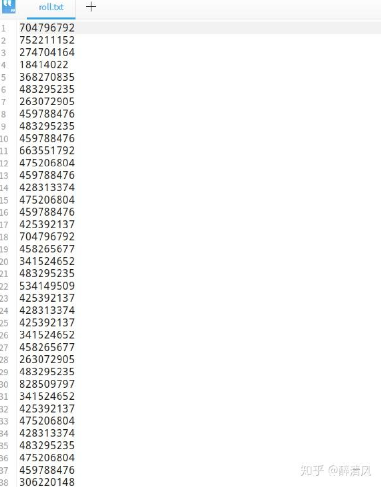

```python
#!/usr/bin/python 
#coding:utf-8 
#@Author:Mr.Aur0ra
 
import gmpy2  
from Crypto.Util.number import long_to_bytes  
 
n = 920139713  
p = 49891  
q = 18443  
e = 19  
phi = (p-1)*(q-1)  
d = gmpy2.invert(e,phi)  
m = ""  
with open('roll.txt','r') as f:  
    for c in f.readlines():  
    m += long_to_bytes(pow(int(c), d, n))  
print m
```

作者：曙光
链接：https://zhuanlan.zhihu.com/p/76228394
来源：知乎
著作权归作者所有。商业转载请联系作者获得授权，非商业转载请注明出处。


## (3)模不互素(存在多个n,共用质数)

适用情况：存在两个或更多模数 ，且gcd(N1,N2)!=1 也就是N1和N2不互质。

多个模数n共用质数，则可以很容易利用欧几里得算法求得他们的质因数之一gcd(N1,N2) ，然后这个最大公约数可用于分解模数分别得到对应的p和q，即可进行解密。实现参照本文欧几里得算法 部分和RSA解密部分。

#### 题目:  05-存货1

```text
N is 18674375108313094928585156581138941368570022222190945461284402673204018075354069827186085851309806592398721628845336840532779579197302984987661547245423180760958022898546496524249201679543421158842103496452861932183144343315925106154322066796612415616342291023962127055311307613898583850177922930685155351380500587263611591893137588708003711296496548004793832636078992866149115453883484010146248683416979269684197112659302912316105354447631916609587360103908746719586185593386794532066034112164661723748874045470225129298518385683561122623859924435600673501186244422907402943929464694448652074412105888867178867357727
e is 65537
message is 0x8BD7BF995BF9E16A0D04ADB49A2411C74FFDB0DB4F35DB3A79A1B44691947C9824085BC4CA5F7F4EFA3C8FD0BC3E870AA6D5E15307A63A2172C44C5903D35785B8D06B51651EE7106B070D5A6AABA089AB67609661265B74914C865F863DC1D2DC08CE0B026107A74EC3FDC62666B50110B9D15A243EAAD6F53646929A3369285404868E42DD0BBE92D956018E3C0B36EF5E9516E433228CFDD06D6E662EC0A9A31061EA11F61CA17EABF43D2D4977FC9D6FC53AB6DC01509401B8D9A46B59A9ADAA97D54CC50C27445E4C21B893510620EC3566AD6E8727FA147437B207505217E6F2DF009E2286C8354D281374D7802D08A2062FE48DBF135BBCAB120EBF84

N is 20071978783607427283823783012022286910630968751671103864055982304683197064862908267206049336732205051588820325894943126769930029619538705149178241710069113634567118672515743206769333625177879492557703359178528342489585156713623530654319500738508146831223487732824835005697932704427046675392714922683584376449203594641540794557871881581407228096642417744611261557101573050163285919971711214856243031354845945564837109657494523902296444463748723639109612438012590084771865377795409000586992732971594598355272609789079147061852664472115395344504822644651957496307894998467309347038349470471900776050769578152203349128951
e is 65537
message is 0x8C3CF3161AA3E37831030985C60566A7604688B73E5B1D3B36E72EF06ED4F71289EFE80E0D94BD755034E6C210F17DA85B9D0388F3AD104C68BC514A8EB1569A109EB5F266F7C5FA4DDFA638258949B43D4CF1406720CCD4CA11E74FDF8AEB35C56A79781C87157FC4213573329C5B0FF411F8A4F34580AA103DB9FD403C0D409FA11860A7C4595FDC49DC2CF94E5112B772E5DEC8F17E24B10A7FD7A95DCB87BE5E27C32FC931574A7847BC506A61EFE9DB3D3F612143845FE80D7B3EA548B886A67A29CBDB2775B1F91178B6DA763F1A6ECFF46592E4C7FFAAB6C9FEF29D9CB9E035A3D98ECFFB26BA2EEAA56D1CD096E6A2CF9A58086CAD7718DDA5CB0C1B

求明文m？
```

这里把明文字符串一分为二做了分别做了RSA加密，上面的message其实就是密文c。关键是加密时它们多个模数使用了相同的质数e，而且模数N1和N2不互素，所以可以进行模不互素攻击。

判断两个数是否互素的脚本:

```python
#!/usr/bin/python 
#coding:utf-8 
#@Author:Mr.Aur0ra
 
def gcd(a,b):    #判断来两个数是否互素,辗转相除法 
    if(b==0):  
        return a  
    else:  
        return gcd(b,a%b)  

def main():  
    x = 17              #x,y的值根据需要修改即可 
    y = 65537  
    if gcd(x,y)==1:    #如果两个数的最大公约数是1，那么两数互素。 
        print str(x)+" "+str(y) + "两个数互素" 
    else:  
        print str(x)+" "+str(y) + "两个数不互素" 
if __name__=="__main__":  
    main()
```


题目是给出的文件rsa2.txt，为了方便Python直接读取文件为变量赋值，这里把无关的解释性东西删除掉，生成新的tmp.txt文件。

内容如下:

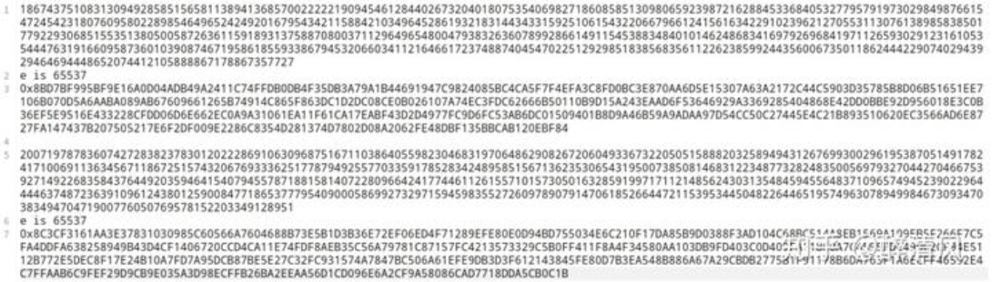

作者：曙光
链接：https://zhuanlan.zhihu.com/p/76228394
来源：知乎
著作权归作者所有。商业转载请联系作者获得授权，非商业转载请注明出处。


解题脚本:

```python
#!/usr/bin/python  
#coding:utf-8  
#@Author:Mr.Aur0ra
  
import gmpy2  
from Crypto.Util.number import long_to_bytes  
  
lines = open('tmp.txt','r').readlines()  
  
c1 = int(lines[2],16)  
c2 = int(lines[6],16)  
n1 = int(lines[0])  
n2 = int(lines[4])  
  
p12 = gmpy2.gcd(n1, n2)  
assert (p12 != 1)  
q1 = n1 / p12  
q2 = n2 / p12  
e = 0x10001  
d1 = gmpy2.invert(e, (p12 - 1) * (q1 - 1))  
d2 = gmpy2.invert(e, (p12 - 1) * (q2 - 1))  
m1 = pow(c1, d1, n1)  
m2 = pow(c2, d2, n2)  
print long_to_bytes(m1)+long_to_bytes(m2)   
```

## (4)共模攻击（明文m、模数n相同，公钥指数e、密文c不同）

适用情况：明文m、模数n相同，公钥指数e、密文c不同，gcd(e1,e2)==1也就是e1和e2互质。

对同一明文的多次加密使用相同的模数和不同的公钥指数可能导致共模攻击。

题目:  06-Jarvis OJ -Crypto-very hard RSA


这个题目就比较有意思了，4096位的RSA加密，要不是这里存在共模攻击说不定你死活都解不开。哈哈哈，要是有量子计算机的话说不定能解开。

题目给出了两个flag.enc文件以及一个easyRSA.py的加密脚本。

通过分析加密脚本可知，该加密脚本首先会从flag.txt中读取字符串flag，然后对flag根据不同的e的值进行2次RSA加密，并分别将密文保存到了flag.enc1和flag.enc2中。

我们发现明文m、模数n相同，但是公钥指数e1和e2不同，而且e1与e2互素（上面给过判断2数是否互素的脚本），所以这就是典型的共模攻击。

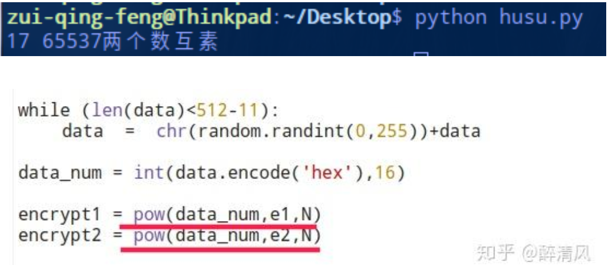

```python
#!/usr/bin/python
#coding:utf-8
#@Author:醉清风

import gmpy2
from Crypto.Util.number import long_to_bytes

e1 = 17
e2 = 65537
n = 0x00b0bee5e3e9e5a7e8d00b493355c618fc8c7d7d03b82e409951c182f398dee3104580e7ba70d383ae5311475656e8a964d380cb157f48c951adfa65db0b122ca40e42fa709189b719a4f0d746e2f6069baf11cebd650f14b93c977352fd13b1eea6d6e1da775502abff89d3a8b3615fd0db49b88a976bc20568489284e181f6f11e270891c8ef80017bad238e363039a458470f1749101bc29949d3a4f4038d463938851579c7525a69984f15b5667f34209b70eb261136947fa123e549dfff00601883afd936fe411e006e4e93d1a00b0fea541bbfc8c5186cb6220503a94b2413110d640c77ea54ba3220fc8f4cc6ce77151e29b3e06578c478bd1bebe04589ef9a197f6f806db8b3ecd826cad24f5324ccdec6e8fead2c2150068602c8dcdc59402ccac9424b790048ccdd9327068095efa010b7f196c74ba8c37b128f9e1411751633f78b7b9e56f71f77a1b4daad3fc54b5e7ef935d9a72fb176759765522b4bbc02e314d5c06b64d5054b7b096c601236e6ccf45b5e611c805d335dbab0c35d226cc208d8ce4736ba39a0354426fae006c7fe52d5267dcfb9c3884f51fddfdf4a9794bcfe0e1557113749e6c8ef421dba263aff68739ce00ed80fd0022ef92d3488f76deb62bdef7bea6026f22a1d25aa2a92d124414a8021fe0c174b9803e6bb5fad75e186a946a17280770f1243f4387446ccceb2222a965cc30b3929L
c1=int(open('./flag.enc1','rb').read().encode('hex'),16)  
c2=int(open('./flag.enc2','rb').read().encode('hex'),16)  


_, r, s = gmpy2.gcdext(e1, e2)

m = pow(c1, r, n) * pow(c2, s, n) % n
print long_to_bytes(m)
```

## (5)低解密指数(密钥d过小，e过大)攻击

在RSA中d也称为解密指数，当d比较小的时候，e也就显得特别大了。

适用情况：e过大或过小（一般e过大时使用）

在e过大或过小的情况下，可使用算法从e中快速推断出d的值，进而求出m。

作者：曙光
链接：https://zhuanlan.zhihu.com/p/76228394
来源：知乎
著作权归作者所有。商业转载请联系作者获得授权，非商业转载请注明出处。


#### 题目:  07-存货2

```text
n = 460657813884289609896372056585544172485318117026246263899744329237492701820627219556007788200590119136173895989001382151536006853823326382892363143604314518686388786002989248800814861248595075326277099645338694977097459168530898776007293695728101976069423971696524237755227187061418202849911479124793990722597L
e = 354611102441307572056572181827925899198345350228753730931089393275463916544456626894245415096107834465778409532373187125318554614722599301791528916212839368121066035541008808261534500586023652767712271625785204280964688004680328300124849680477105302519377370092578107827116821391826210972320377614967547827619L
c = 38230991316229399651823567590692301060044620412191737764632384680546256228451518238842965221394711848337832459443844446889468362154188214840736744657885858943810177675871991111466653158257191139605699916347308294995664530280816850482740530602254559123759121106338359220242637775919026933563326069449424391192
求明文m?
```

首先需要需要下载工具rsa-wiener-attack ：

```
git clone https://github.com/pablocelayes/rsa-wiener-attack
```

然后把破解脚本.py放入这个目录中运行即可：

```python
#!/usr/bin/python
#coding:utf-8

import gmpy2
from Crypto.PublicKey import RSA
import ContinuedFractions, Arithmetic
from Crypto.Util.number import long_to_bytes 

def wiener_hack(e, n):
    # firstly git clone https://github.com/pablocelayes/rsa-wiener-attack.git !
    frac = ContinuedFractions.rational_to_contfrac(e, n)
    convergents = ContinuedFractions.convergents_from_contfrac(frac)
    for (k, d) in convergents:
        if k != 0 and (e * d - 1) % k == 0:
            phi = (e * d - 1) // k
            s = n - phi + 1
            discr = s * s - 4 * n
            if (discr >= 0):
                t = Arithmetic.is_perfect_square(discr)
                if t != -1 and (s + t) % 2 == 0:
                    print("Hacked!")
                    return d
    return False
def main():
    n = 460657813884289609896372056585544172485318117026246263899744329237492701820627219556007788200590119136173895989001382151536006853823326382892363143604314518686388786002989248800814861248595075326277099645338694977097459168530898776007293695728101976069423971696524237755227187061418202849911479124793990722597L
    e = 354611102441307572056572181827925899198345350228753730931089393275463916544456626894245415096107834465778409532373187125318554614722599301791528916212839368121066035541008808261534500586023652767712271625785204280964688004680328300124849680477105302519377370092578107827116821391826210972320377614967547827619L
    c = 38230991316229399651823567590692301060044620412191737764632384680546256228451518238842965221394711848337832459443844446889468362154188214840736744657885858943810177675871991111466653158257191139605699916347308294995664530280816850482740530602254559123759121106338359220242637775919026933563326069449424391192
    d = wiener_hack(e, n)
    m = pow(c,d,n)
    print long_to_bytes(m)
if __name__=="__main__":
    main()
```

## (6)根据公钥计算得到私钥(RsaCtfTools根据公钥生成私钥)

这种题型需要使用RsaCtfTools根据公钥生成私钥

#### 题目: 08-存货3

题目只给出了两个文件（一个私钥文件和一个密文文件）

按照常规查看提取一下公钥文件，发现n特别大，无法直接分解为p和q，而且e也不存在是特殊值的可能，也不存在其他的攻击方法。

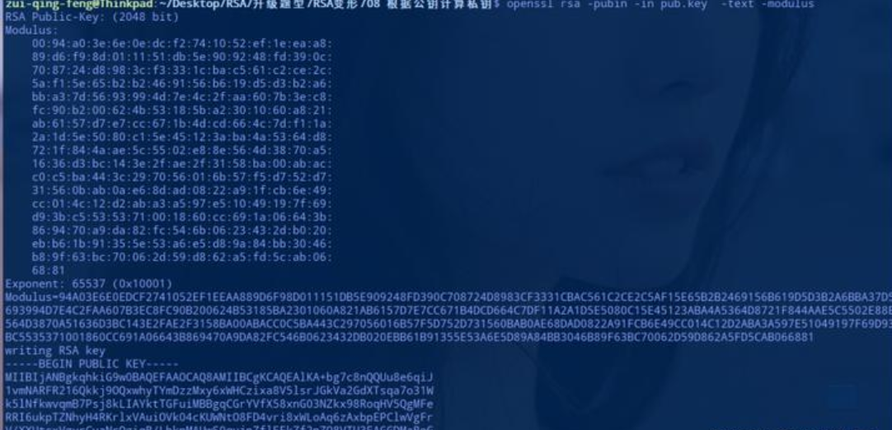

首先进入RsaCtfTools，接着执行下面的命令生成私钥。

```
python RsaCtfTool.py --publickey /home/....../pub.key --private
```

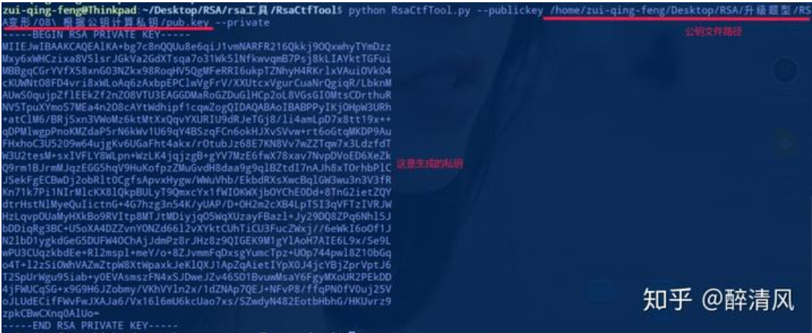

接着把这些内容复制到新创建的文件pri.key中。

使用openssl通过私钥文件进行解密：

```
openssl rsautl -decrypt -inkey pri.key -in enc1 -out txt
```

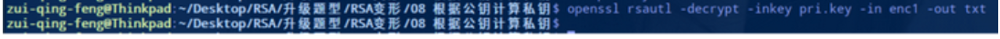

打开生成的文件txt即可得到flag。

作者：曙光
链接：https://zhuanlan.zhihu.com/p/76228394
来源：知乎
著作权归作者所有。商业转载请联系作者获得授权，非商业转载请注明出处。


## (7)分解n得到相同的几个p

这个题目牵扯到欧拉函数的一些知识，一会你就知道该补一补了，哈哈哈。

题目: 09-存货4

题目给出两个文件，一个文件是加密脚本encrypt.py，另一个是加密脚本输出的文件2.txt。

下面是我注释了的加密脚本:

```python
import gmpy2
import random
from Crypto.Util.number import *
from flag import flag

def generate_key(1024):
    p = getPrime(1024)
    r = random.randint(2, 10)
    s = random.randint(r, 1024)
    while True:
        e = random.randint(3, p**r*(p-1))
        if gmpy2.gcd(e, p**s*(p-1)) == 1:
        	break
    pubkey = (long(e), long(p**r))   #返回e和p^r
    return pubkey

def crypt(msg, pubkey):
    e, n = pubkey             #e,n=p^r
    m = bytes_to_long(msg)    
    assert m < n - 1
    enc = pow(m, e, n)       
    return long_to_bytes(enc)

nbit = 1024
pubkey = generate_key(1024)
print 'pubkey =', pubkey  #输出e和p^r
msg = flag值   
enc = crypt(msg, pubkey)  

print 'enc =\n', enc.encode('base64')
```

下面是我当时做题时解题思路：

```text
RSA加密:
pow(enc,e,N)
RSA解密:
n==>p,q
phi=(p-1)*(q-1)  
d = gmpy2.invert(e,phi)
m=pow(enc,d,n)


本题常规解题思路:
enc已知  n已知  d?==> e已知 ,求phi ==>求p和q
看着加密脚本中多次出现p及p^r，
本打算直接开用p=gmpy2.iroot(n,r)[0] 开多次方根求p，进而求q 
//根据加密脚本逆运算 未果 开不出来 ╮(╯▽╰)╭


另一种思路:
e太大 可使用算法从e中快速推断出d的值。 可使用Wiener’s Attack进行解d
求出d可直接求m
但是这样也确实解不出来


好吧 正确解题思路：
n==>分解n得到k个p  即n=p**k
phi=(p**k)-(p**k-1)     //由欧拉函数得
d = gmpy2.invert(e,phi)
m=pow(enc,d,n)
```

题目中幂使用的是r而不是k。解题脚本:

```python
#!/usr/bin/python
#coding:utf-8
#Author:醉清风

import base64
import gmpy2
import libnum
from Crypto.Util.number import long_to_bytes,bytes_to_long

c = "YXmuOsaD1W4poLAG2wPrJ/nYZCkeOh2igCYKnZA6ecCeJadT6B3ZVTciPN6LJ8AcAsRXNnkC6+9PNJPhmosSG5UGGbpIcg2JaZ1iA8Sm3fGiFacGvQsJOqqIWb01rjaQ3rDBKB331rrNo9QNOfMnjKr0ejGG+dNObTtvnskICbYbNnSxMxLQF57H5JnWZ3LbbKQ493vmZzwvC6iH8blNPAp3dBlVzDqIAmxmUbk0OzFjPoHphD1oxHdzXyQNW+sLxVldrf9xcItq92jN5sqBYrG8wADIqY1/sqhTMZvkIYFMHqoMQuiRSnVrCF2h2RtGDEayLo0evgXI/0W3YveyKCHViOnG6wypcBFm91ZWdjp3fVW/4DyxW6xu9hg/NlXyRP6pT/OyQpcyTqKRuiXJLWgFUJI/8TRgyAjBLLgSd3U0N3VM8kewXw5j+fMUTCW9/Gy4iP8m52Zabx/vEKdwdGZ0QyvgvAWGUFZ96EK0g1BM/LU9Tuu2R+VKcCSCprg283x6NfYxmU26KlQE6ZrrjLmbCOe0327uaW9aDbLxZytPYIE5ZkzhSsD9JpQBKL30dCy3UKDbcuNgB6SrDddrbIuUd0/kLxuwh6kTqNbC4NDrOT4WAuP4se8GGOK8Wz0dL6rE6FkzMnI4Qg501MTSNQZ4Bp7cNf6H9lTa/4DNOl0="


e = 58134567416061346246424950552806959952164141873988197038339318172373514096258823300468791726051378264715940131129676561677588167620420173326653609778206847514019727947838555201787320799426605222230914672691109516799571428125187628867529996213312357571123877040878478311539048041218856094075106182505973331343540958942283689866478426396304208219428741602335233702611371265705949787097256178588070830596507292566654989658768800621743910199053418976671932555647943277486556407963532026611905155927444039372549162858720397597240249353233285982136361681173207583516599418613398071006829129512801831381836656333723750840780538831405624097443916290334296178873601780814920445215584052641885068719189673672829046322594471259980936592601952663772403134088200800288081609498310963150240614179242069838645027877593821748402909503021034768609296854733774416318828225610461884703369969948788082261611019699410587591866516317251057371710851269512597271573573054094547368524415495010346641070440768673619729280827372954003276250541274122907588219152496998450489865181536173702554116251973661212376735405818115479880334020160352217975358655472929210184877839964775337545502851880977049299029101466287659419446724781305689536816523774995178046989696610897508786776845460908137698543091418571263630383061605011820139755322231913029643701770497299157169690586232187419462594477116374977216427311975598620616618808494138669546120288334682865354702356192972496556372279363023366842805886601834278434406709218165445335977049796015123909789363819484954615665668979


p = 165740755190793304655854506052794072378181046252118367693457385632818329041540419488625472007710062128632942664366383551452498541560538744582922713808611320176770401587674618121885719953831122487280978418110380597358747915420928053860076414097300832349400288770613227105348835005596365488460445438176193451867

n = p**4

phi = p**4-p**3
#c = int(base64.b64decode(c).encode('hex'),16) 延伸
c = bytes_to_long(c.decode('base64'))
d = gmpy2.invert(e,phi)
m = pow(c,d,n)
print long_to_bytes(m)
```

## (8)已知n,e,d求p,q

一看这个标题你就应该有个觉悟，n一定无法直接分解得到p和q。

### 题目: 10-存货5

题目给出了两个文件，一个是加密脚本chall.py，一个是加密后输出的内容output.txt。分析一下加密脚本：

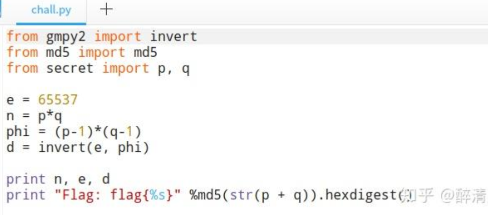

加密脚本真的是很简单啊，flag就是str(p+q)进行md5运算之后的得到的字符串，从output.txt中可以得到n,e,d。

现在的关键问题就是求出p和q来，google一把梭好像可以找到这种骚操作，当时线上比赛做这个题目的时候真的就是google找到的类似题目，百度啊，可不可以靠谱一点。

解题脚本:

```python
#!/usr/bin/python
#coding:utf-8


import random
from md5 import md5

def gcd(a, b):
   if a < b:
     a, b = b, a
   while b != 0:
     temp = a % b
     a = b
     b = temp
   return a

def getpq(n,e,d):
	p = 1
	q = 1
	while p==1 and q==1:
		k = d * e - 1
		g = random.randint ( 0 , n )
		while p==1 and q==1 and k % 2 == 0:
			k /= 2
			y = pow(g,k,n)
			if y!=1 and gcd(y-1,n)>1:
				p = gcd(y-1,n)
				q = n/p
	return p,q

def main():
	n = 16352578963372306131642407541567045533766691177138375676491913897592458965544068296813122740126583082006556217616296009516413202833698268845634497478988128850373221853516973259086845725813424850548682503827191121548693288763243619033224322698075987667531863213468223654181658012754897588147027437229269098246969811226129883327598021859724836993626315476699384610680857047403431430525708390695622848315322636785398223207468754197643541958599210127261345770914514670199047435085714403641469016212958361993969304545214061560160267760786482163373784437641808292654489343487613446165542988382687729593384887516272690654309
	e = 65537
	d = 9459928379973667430138068528059438139092368625339079253289560577985304435062213121398231875832264894458314629575455553485752685643743266654630829957442008775259776311585654014858165341757547284112061885158006881475740553532826576260839430343960738520822367975528644329172668877696208741007648370045520535298040161675407779239300466681615493892692265542290255408673533853011662134953869432632554008235340864803377610352438146264524770710345273439724107080190182918285547426166561803716644089414078389475072103315432638197578186106576626728869020366214077455194554930725576023274922741115941214789600089166754476449453
	p,q = getpq(n,e,d)
	print p 
	print q
	print "Flag: flag{%s}" %md5(str(p + q)).hexdigest()
if __name__ == '__main__':
	main()
```

## (9)私钥文件修复

### 题目:  11-Jarvis OJ -Crypto-God Like RSA


呵呵，这个题我认了，别的不会的题目起码都能看个大概，这个题绝了，只是知道解题脚本中对应的变量是谁了(哈哈哈)，顺带把变量给你们注释了，反正我是写不出来。

这里面涉及到的东西太多了，我觉得绝不单单是Python脚本的问题，什么数学、什么算法的，必须给你安排的明明白白的。So，我把这题作为了一个模板，以后有类似的题目，直接掏出来用，莫非这真是"上帝之手"？

题目给出三个文件，一个是公钥文件pubkey.pem，一个是残损的私钥文件private.corrupted，还有一个是密文文件flag.enc。

首先使用openssl提取公钥信息：

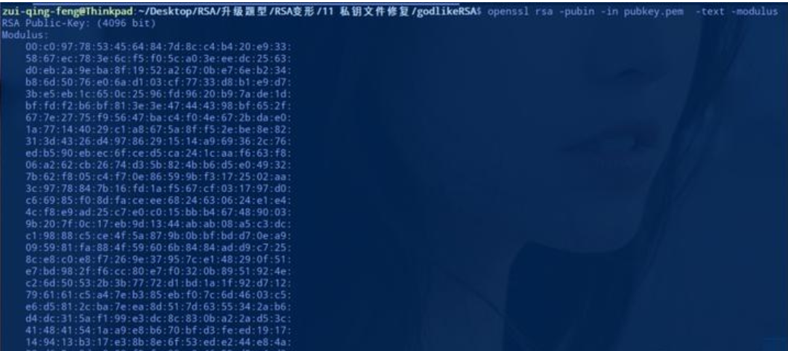

然后将提取到的公钥信息填充到"恢复私钥的脚本/fix.py"中，然后运行这个脚本。

```python
#fix.py
#!/usr/bin/python3

import re
from itertools import product
from Crypto.Util.number import GCD, inverse


def solve_linear(a, b, mod):
    if a & 1 == 0 or b & 1 == 0:
        return None
    return (b * inverse(a, mod)) & (mod - 1)  # ??b*a^(-1)%mod


def to_n(s):
    s = re.sub(r"[^0-9a-f]", "", s)
    return int(s, 16)


def msk(s):
    cleaned = "".join(map(lambda x: x[-2:], s.split(":")))   #????????????
    return msk_ranges(cleaned), msk_mask(cleaned), msk_val(cleaned)


def msk_ranges(s):      #    ????????????
    return [range(16) if c == " " else [int(c, 16)] for c in s]    


def msk_mask(s):
    return int("".join("0" if c == " " else "f" for c in s), 16)


def msk_val(s):
    return int("".join("0" if c == " " else c for c in s), 16)

#openssl从公钥提取的N   #openssl rsa -pubin -in pubkey.pem  -text -modulus
N = to_n("""\
00:c0:97:78:53:45:64:84:7d:8c:c4:b4:20:e9:33:
58:67:ec:78:3e:6c:f5:f0:5c:a0:3e:ee:dc:25:63:
d0:eb:2a:9e:ba:8f:19:52:a2:67:0b:e7:6e:b2:34:
b8:6d:50:76:e0:6a:d1:03:cf:77:33:d8:b1:e9:d7:
3b:e5:eb:1c:65:0c:25:96:fd:96:20:b9:7a:de:1d:
bf:fd:f2:b6:bf:81:3e:3e:47:44:43:98:bf:65:2f:
67:7e:27:75:f9:56:47:ba:c4:f0:4e:67:2b:da:e0:
1a:77:14:40:29:c1:a8:67:5a:8f:f5:2e:be:8e:82:
31:3d:43:26:d4:97:86:29:15:14:a9:69:36:2c:76:
ed:b5:90:eb:ec:6f:ce:d5:ca:24:1c:aa:f6:63:f8:
06:a2:62:cb:26:74:d3:5b:82:4b:b6:d5:e0:49:32:
7b:62:f8:05:c4:f7:0e:86:59:9b:f3:17:25:02:aa:
3c:97:78:84:7b:16:fd:1a:f5:67:cf:03:17:97:d0:
c6:69:85:f0:8d:fa:ce:ee:68:24:63:06:24:e1:e4:
4c:f8:e9:ad:25:c7:e0:c0:15:bb:b4:67:48:90:03:
9b:20:7f:0c:17:eb:9d:13:44:ab:ab:08:a5:c3:dc:
c1:98:88:c5:ce:4f:5a:87:9b:0b:bf:bd:d7:0e:a9:
09:59:81:fa:88:4f:59:60:6b:84:84:ad:d9:c7:25:
8c:e8:c0:e8:f7:26:9e:37:95:7c:e1:48:29:0f:51:
e7:bd:98:2f:f6:cc:80:e7:f0:32:0b:89:51:92:4e:
c2:6d:50:53:2b:3b:77:72:d1:bd:1a:1f:92:d7:12:
79:61:61:c5:a4:7e:b3:85:eb:f0:7c:6d:46:03:c5:
e6:d5:81:2c:ba:7e:ea:8d:51:7d:63:55:34:2a:b6:
d4:dc:31:5a:f1:99:e3:dc:8c:83:0b:a2:2a:d5:3c:
41:48:41:54:1a:a9:e8:b6:70:bf:d3:fe:ed:19:17:
14:94:13:b3:17:e3:8b:8e:6f:53:ed:e2:44:e8:4a:
32:d6:5c:0d:a8:80:f5:fc:02:e9:46:55:d5:a4:d3:
e7:c6:30:77:f9:73:e9:44:52:d8:13:9d:5d:bf:9e:
fa:3a:b5:96:79:82:5b:cd:19:5c:06:a9:00:96:fd:
4c:a4:73:88:1a:ec:3c:11:de:b9:3d:e0:50:00:1e:
ac:21:97:a1:96:7d:6b:15:f9:6c:c9:34:7f:70:d7:
9d:2d:d1:48:4a:81:71:f8:12:dd:32:ba:64:31:60:
08:26:4b:09:22:03:83:90:17:7f:f3:a7:72:57:bf:
89:6d:e4:d7:40:24:8b:7b:bd:df:33:c0:ff:30:2e:
e8:6c:1d""")

#这个就是残缺的私钥中的prime1
p_ranges, pmask_msk, pmask_val = msk("""\
 0: e:  :  :  :c :c :  :  :  :b :  :  :  :  :
  :ab: e: 2: 8:c :  :  : 1:6 :6 : 6: f:d9: 0:
8 :5c:7 :06:  :  :  :0 : 3:5 :4b:  :6 :  :  :
2 :  :6 :  :  :  :2 :bc: c:  :85:1 : 1:d : 3:
 1:b4:  : b: 1: 3: d:a :  :  :6e: 0:b :2 :  :
  :b :  :9 :e :  :82:8d:  :  :13:  :  : a: a:
  :  :4 :  :c : f:  :  :7 :e :0a:  :  : b: 5:
  : e:91:3 :  :3c: 9:  : 6:  :  :b5:7d: 1:  :
  :  :  :b :a1:99:6 :4 :3 :c :1a:02:4 :  : 9:
9 :f : d:bd:  :0 :  :  :  :b3:  : 4:  :e9: 9:
  : d:  :  :7 :  :93:  : e:dc:  : 0:  :e7:  :
e :  :2 : b: 2:5 :  :  :  :  : c:5f:  :  :e2:
  :  : 9:  :2a:  : e:  :  :2 :  :9f: 7:3 :  :
b : f:b :  : 8: 7:  :  :f :6 :e :c :  :3 :  :
f7: 5: 8: 5:  :  :  :  :  : 8: e:  :03: c:  :
33:76:e : 1:7 : c:  : 0:  :0b:  : a:  : 2: 9:
  :c8:bf:  :  :06: 7:d5:  :02: c:b :e2: 7:2 :
  :  """)

#这个就是残缺的私钥中的prime2
q_ranges, qmask_msk, qmask_val = msk("""\
 0: f:  :d0: 1:55: 4:31:  : b:c4:8 :  : e: d:
34: 3:f :  :  :  :  : 8:99:1 :  : a:0 :  :4 :
0 :  :f :  :a4:41:2 :  :a :  : 1:  : a: c:  :
  :  : 9:  :  : 2:f4: f:  :  :  :  :1 : 4:9 :
a :  :  :79:0 :  :  :  :  : 2: 8:b :  :4 : 8:
  :9b: 1:  :d :  :f :e4:  :4 :c :e :  :3 :  :
 7:2 :  :d :8 :2 :7 :  :d :67:fc:e : 0:f9: 7:
8 :  :  :  :1 :2f:  :51:  :  :2e:0a: e:3d: 6:
b :  :dd:  : 0:fb:  :f4:  :  :  :b4: 9:c :  :
 a:  :  :  :d :  :  :6b: 2:  :9b: a:60:  :d6:
 0:4f:16:d1:  :  :5 :fc:  :f :  :8 :  :  :  :
 1: 6:e1:9 : e:4 : 6: c: d:d :73: 3:  :  :7 :
  :8 : 9:  :3b:f : 2:  :  :f1: e:  :  :1e:  :
8 :  :  : 6:0 : 4:99:e :  : 5:  :  : 4:  :  :
  : a:81:64:  :7 :f : 9: d:  :9 :  : 7:93:f :
ac:8c:  : 8:  : 0: d: 8:  :7 :  :1d:  :f :  :
1 :a :6 :8 :  :60:  :b3:  :  :  :89:  :  :14:
  :5 """)


#这个就是残缺的私钥中的privateExponent
_, dmask_msk, dmask_val = msk("""\
  :  :  : f:8 :a5:d : 2: 0:b :7 :  : 1:  : 4:
 1:0d:  :3 :  :6 :  :  : b:  :  :  :e :  :  :
0e: 0:db:  :1a:1c:c0:  : e:  :  :99:bc:8 :a5:
7 :7 :7 : b:  :  : 8: 8:  :7 :55: 2:  :  :f :
b2:  :  :b :f :4 :  : 8:  :b :  :  :  : 0:  :
0 :  :6 :9 :  :  :  : b: 4:  : 0: a: 5:07:b :
 9: c:9a: 9:  : 7:9e:  : b:60:f :  :  :  :0 :
  : 3:0 :  :  :  : 1:b :  :  : b: 6:0 :f :  :
  : 2:18: 6: b:1 :  :  :  :  :d3:f3:  :a :  :
 3:  :  :  :  : 3: d: 1: 2:7 :  : d:  : 2: d:
  :  : d:4 :  :d :  :6d: c:a :b6:  :  :  : 1:
69:  : 7:  :89:  :c :8 :61: d:25: 3:7 :1b: 4:
b :  :8 :55:  :49: 1:2 :3 :  :1 :e9:a8: 3:  :
9 :  : 1:f8:d3:  :e :  :d :  :9 :b6:  :  :71:
1 :  :c1:  : b: 1:  : 6:e :  :64:  :  :1a:c :
  : b:  :bf:c :  : 0:  : 8:a :4 :  :26:a :5 :
6 :  :  :  :eb:  :e5: a:  :3e:f9:10:0 :  :  :
 6:0 :  : 8:  : 1:72: c:0 : f:5 : f:9c: 0: e:
 7:b :  :  :  :  :d9: 4:  : e:c :68:  :  :  :
 c:  :3a:  :  :a0:ea: 3: 4:  :72:a :d : 8:  :
  :0d:5 :0 : a: 7:c :bb: 6: 4:a :ce:d :2 : 1:
  :  :17:6 :  : c: b:  : f:  :3 : 5:6 :3 :0e:
  : 7:c :3e: 2: 9: 7: 6: f: e: f: 9:  :f3: 9:
a :c1:6 :  : 1:9 :  :43:  : f: 5:  :0 :27: 4:
4 :a :  :e9:  : 8: 4:3 :8a: 6:16:d5:c : e: e:
  :d : c:b :a8:  : 7:  : 9:  :7 :7d:  :  :  :
  :  :  :4 :2 :  : 3: 3: 6:  :  :  :7b:0 :  :
 e:  :0 :  :a :  : 5:  :  :  : 5:1 :82:c :0d:
4 :2 :fd:36: 5:50:0 :  :  :d : f: 6:  :  :e :
0 :  :  :ce:  :9e:8 :  :0 :d :07:b3:  :  :  :
0 :e4:  :  :68:b :c :  : c:5 :  :  :3 : 7: 2:
 c:e0:  :5 :  :  :b4:  :ef: 7:  :1 :e : 0:f :
  :6 :  :  :  :e0:c :3 :  :  : 3:  : d:  :  :
 3: 3: c: a:  :b : a:71: 3: 0:a :  :4 :5d:  :
0 :4 """)

#这个就是残缺的私钥中的exponent1
_, dpmask_msk, dpmask_val = msk("""\
  : 3:2a:  : d:  :  :  :  :0 :1 : f:  :  : 6:
1 :2 :1b:07: a:e :b :c5:58:7 :  :e8: 7: 1: c:
  : 1:b :a0: 4:0f:5 :67:  :3 :7 :6 :f9:  : c:
  :79: 0:1 :65:  :8 :  :99: d:d :  :2 :9 :0 :
 e:  :0 :  :  :  : d:  :d :7 :6 :a9: a:8b: b:
  :  : 7: a:37:  :  :7 :1 :6 :  :c2: 7:6 :b :
 e:  :  :  :  :  :  :b :3a:5 :  :  :  :  :  :
  :  :  :cd:8 :  : d:  :7 : 3:  : f:e : c:  :
  : a:  :c : f:c : 7:b :5 :  :  :2 :8 :8 :6 :
0a: a:  :  :3 :db:  : 4:00:  : d:  :b : 5:  :
20: 2: 5:  :82:  : 0: 6:  :8a:  :7 :  : 8:  :
 4: 1:  :  :  : 8:46:  :  :  :  :  : 0:f :c8:
2 :  : c:7 :  : 1:  :  :2 : 0: 5:  :  : 1:9b:
 6:9 : 0:74:  :c :  :e :  :  :cb:b :3 :3 :  :
 2:  :  :47:  :2 : 0:5 :  :  : d: 6:83:  :  :
  :c7:  :  :0b:  :  : c:  :3 :8 :  :9 :4 : 7:
5 :c0:fe:  :f9: 1:  :0 : e: 8:02:  : f:  :c :
55:61""")

#这个就是残缺的私钥中的exponent2
_, dqmask_msk, dqmask_val = msk("""\
  :0b:7 :4 :0 : 0:6 : 7:7e:  : 5:  : 7:  : a:
a :d : 0: 6: 4:86:  :  :8 :  :  :  :  :e :8f:
 9:  :  :  : 1:  :2 :  : 7: b:1 :5 : f:  :8 :
  :d :21:  :e : d:  :c9:e : b:  :  :1 :  :  :
  :d :a2:b7:  :  :  :f3:  :42:  :e : c:  :f :
  : 0:f :7 : 4: 5:34:  :4 : c:  :  :8 :d : 8:
5 :af: 3:1d: 5:4 :  :2 :  :6 :c : 6:a :1 :5 :
 a:9 :  :d :  :  :0a:a1:  :f :7 :9 :b :  :  :
 f:2 :27: f:  :0 :f6:4d:  :  :  :  :  :5 :  :
 4:08:  : 5:  : 8: 5:  :  :  :18: 4: 8:57: 2:
 f: a:  :  :a8: f: c:f : e: 1:9 :c : 4:9 :  :
  :  :  :  :  : 1:  :2 :  :d1:  : 6:e : d:  :
  : f:04:2 :8d:  : 3:  :  :b : 8:  :d6:  : 2:
  :  :  :6 :  : f:  :  : 0:6 :  :51:  :48:19:
  :  :  :69:4 : c:  :c :  : f:  :f4:d :  : f:
 d:0 :0d:b :3 : 3:2 :  :  :6 : b:5 :2 :  : c:
 1:5a: f:f :  :  :7e:3e:  :d :f :0 : d: c: 6:
 1""")

#这个就是残缺的私钥中的publicExponent,或者openssl从公钥中提取e
E = 0x10001

def search(K, Kp, Kq, check_level, break_step):
    max_step = 0
    cands = [0] # ????
    for step in range(1, break_step + 1):
        # step???????step?
        max_step = max(step, max_step)

        mod = 1 << (4 * step)
        mask = mod - 1

        cands_next = []
        for p, new_digit in product(cands, p_ranges[-step]):
            pval = (new_digit << ((step - 1) * 4)) | p

            # ????
            if check_level >= 1:
                qval = solve_linear(pval, N & mask, mod)
                if qval is None or not check_val(qval, mask, qmask_msk, qmask_val):
                    continue

            if check_level >= 2:
                val = solve_linear(E, 1 + K * (N - pval - qval + 1), mod)
                if val is None or not check_val(val, mask, dmask_msk, dmask_val):
                    continue

            if check_level >= 3:
                val = solve_linear(E, 1 + Kp * (pval - 1), mod)
                if val is None or not check_val(val, mask, dpmask_msk, dpmask_val):
                    continue

            if check_level >= 4:
                val = solve_linear(E, 1 + Kq * (qval - 1), mod)
                if val is None or not check_val(val, mask, dqmask_msk, dqmask_val):
                    continue

                if pval * qval == N: #????
                    print("Kq =", Kq)
                    print("pwned")
                    print("p =", pval)
                    print("q =", qval)
                    p = pval
                    q = qval
                    d = inverse(E, (p - 1) * (q - 1))
                    print("d =", d)
                    coef = inverse(p, q)

                    from Crypto.PublicKey import RSA
                    print(RSA.construct((N, E, d, p, q, coef)).exportKey().decode())
                    quit()

            cands_next.append(pval)

        if not cands_next:
            return False
        cands = cands_next
    return True


def check_val(val, mask, mask_msk, mask_val):
    test_mask = mask_msk & mask
    test_val = mask_val & mask
    return val & test_mask == test_val

# K = 4695
# Kp = 15700
# Kq = 5155


for K in range(1, E):
    if K % 100 == 0:
        print("checking", K)
    if search(K, 0, 0, check_level=2, break_step=20):
        print("K =", K)
        break

for Kp in range(1, E):
    if Kp % 1000 == 0:
        print("checking", Kp)
    if search(K, Kp, 0, check_level=3, break_step=30):
        print("Kp =", Kp)
        break

for Kq in range(1, E):
    if Kq % 100 == 0:
        print("checking", Kq)
    if search(K, Kp, Kq, check_level=4, break_step=9999):
        print("Kq =", Kq)
        break
```

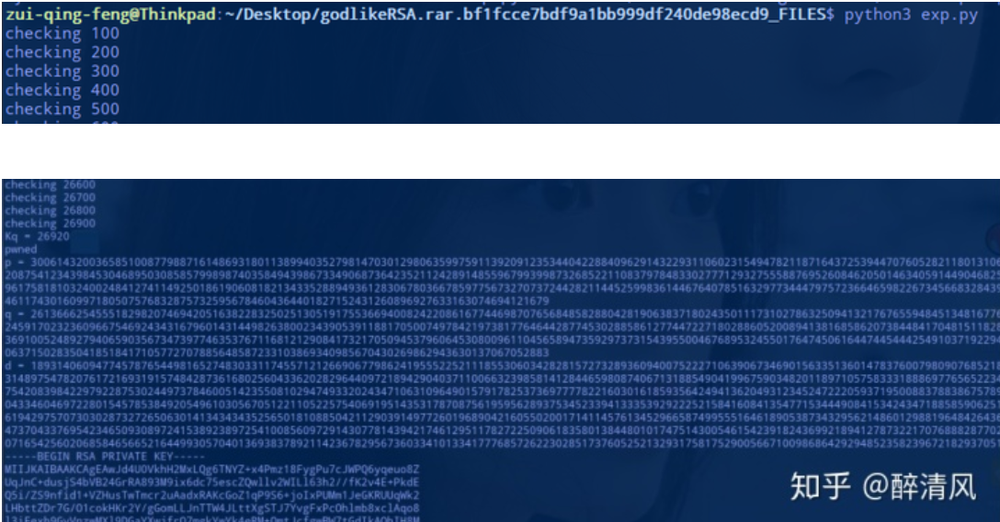

接着，将私钥文件修复脚本fix.py恢复出私钥来，存放到文件private.pem中。

这就结束了吗，没有，god不是白叫的。你会发现你根据私钥使用openssl直接解密密文文件解不开，而且直接根据p，q，d，c也无法直接求出m。这里又涉及到了RSA加密的填充模式。

然后，接着运行下面的脚本即可得到flag。

```python
#!/usr/bin/python
# coding=utf-8

from Crypto.PublicKey import RSA
from Crypto.Cipher import PKCS1_OAEP

with open('pubkey.pem', 'r') as f:
    key = RSA.importKey(f)
    N = key.n
    e = key.e

print N
print e

with open('private.pem', 'r') as f:
    private = RSA.importKey(f)
    oaep = PKCS1_OAEP.new(private)

with open('flag.enc', 'r') as f:
    print oaep.decrypt(f.read())
```

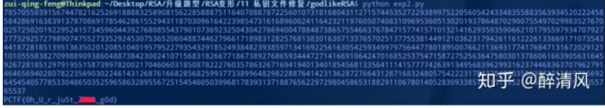

刚才说无法根据私钥使用openssl解密密文文件，那是因为没有指定填充模式，openssl也可以指定模式。

首先，把生成的私钥保存为名为"private.pem"的私钥文件，接着执行命令进行解密。

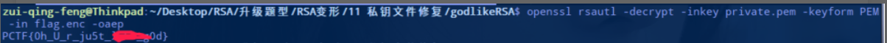

## (10)低加密指数广播攻击（模数n、密文c不同，明文m、加密指数e相同）

如果选取的加密指数较低，并且使用了相同的加密指数给一个接受者的群发送相同的信息，那么可以进行广播攻击得到明文。

适用范围：模数n、密文c不同，明文m、加密指数e相同。一般情况下，e=k (k是题目给出的n和c的组数)。

例如：下面的就是e=k=3


使用不同的模数n，相同的公钥指数e加密相同的信息。就会得到多个

  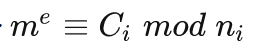

将m^e视为一个整体M，这就是典型的中国剩余定理适用情况。按照本文的中国剩余定理小节容易求得 m^e的值，当e较小时直接开e方即可，可使用gmpy2.iroot(M,e) 方法。（ps:都看到这里了，就一块细下心来把中国剩余定理了解一下吧）

### 题目:  12-Jarvis OJ -2018强网杯nextrsa-Level9 

题目给出n1，n2，n3，c1，c2，c3，e。求明文m的值。

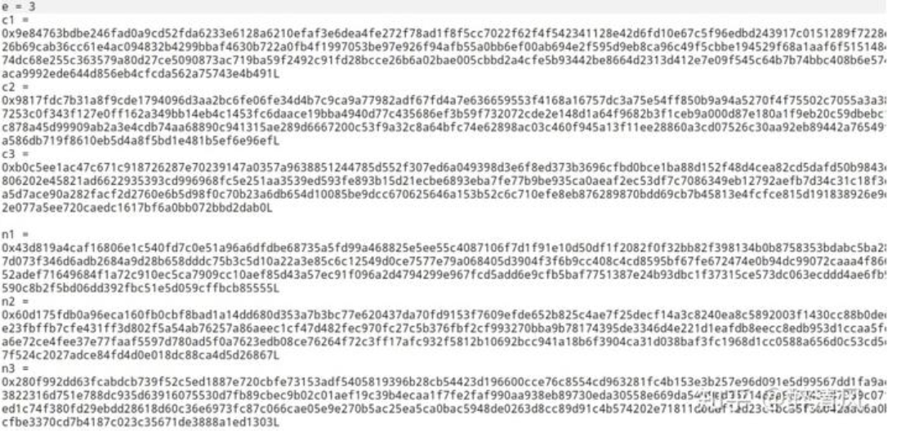

解题脚本1:

```python
#!/usr/bin/python
#coding:utf-8

import random
from gmpy2 import invert, iroot


def broadcast(n1, n2 ,n3, c1, c2, c3):
    n = [n1, n2, n3]
    C = [c1, c2, c3]
    N = 1
    for i in n:
        N *= i

    Ni = []
    for i in n:
        Ni.append(N / i)

    T = []
    for i in xrange(3):
        T.append(long(invert(Ni[i], n[i])))

    X = 0
    for i in xrange(3):
        X += C[i] * Ni[i] * T[i]

    m3 = X % N
    m = iroot(m3, 3)
    return m[0]

def main():
    e = 3
    c1 = 0x9e84763bdbe246fad0a9cd52fda6233e6128a6210efaf3e6dea4fe272f78ad1f8f5cc7022f62f4f542341128e42d6fd10e67c5f96edbd243917c0151289f7228e44019b8c65a541d7306b398465e26b69cab36cc61e4ac094832b4299bbaf4630b722a0fb4f1997053be97e926f94afb55a0bb6ef00ab694e2f595d9eb8ca96c49f5cbbe194529f68a1aaf6f5151484b471285ba8fc8cd30b55612f35a74dc68e255c363579a80d27ce5090873ac719ba59f2492c91fd28bcce26b6a02bae005cbbd2a4cfe5b93442be8664d2313d412e7e09f545c64b7b74bbc408b6e574d0d300135cba8d6c1d73737d59baca9992ede644d856eb4cfcda562a75743e4b491
    c2 = 0x9817fdc7b31a8f9cde1794096d3aa2bc6fe06fe34d4b7c9ca9a77982adf67fd4a7e636659553f4168a16757dc3a75e54ff850b9a94a5270f4f75502c7055a3a389df2ea6b00784a4e78e66901b427253c0f343f127e0ff162a349bb14eb4c1453fc6daace19bba4940d77c435686ef3b59f732072cde2e148d1a64f9682b3f1ceb9a000d87e180a1f9eb20c59dbebc13ddb2e07b64db89217f40369aeec878a45d99909ab2a3e4cdb74aa68890c941315ae289d6667200c53f9a32c8a64bfc74e62898ac03c460f945a13f11ee28860a3cd07526c30aa92eb89442a76549fe4ed8a43d14fdeeb350e90443a3a586db719f8610eb5d4a8f5bd1e481b5ef6e96ef
    c3 = 0xb0c5ee1ac47c671c918726287e70239147a0357a9638851244785d552f307ed6a049398d3e6f8ed373b3696cfbd0bce1ba88d152f48d4cea82cd5dafd50b9843e3fa2155ec7dd4c996edde630987806202e45821ad6622935393cd996968fc5e251aa3539ed593fe893b15d21ecbe6893eba7fe77b9be935ca0aeaf2ec53df7c7086349eb12792aefb7d34c31c18f3cd7fb68e8a432652ef76096096e1a5d7ace90a282facf2d2760e6b5d98f0c70b23a6db654d10085be9dcc670625646a153b52c6c710efe8eb876289870bdd69cb7b45813e4fcfce815d191838926e9d60dd58be73565cff0e10f4e80122e077a5ee720caedc1617bf6a0bb072bbd2dab0
    n1 = 0x43d819a4caf16806e1c540fd7c0e51a96a6dfdbe68735a5fd99a468825e5ee55c4087106f7d1f91e10d50df1f2082f0f32bb82f398134b0b8758353bdabc5ba2817f4e6e0786e176686b2e75a7c47d073f346d6adb2684a9d28b658dddc75b3c5d10a22a3e85c6c12549d0ce7577e79a068405d3904f3f6b9cc408c4cd8595bf67fe672474e0b94dc99072caaa4f866fc6c3feddc74f10d6a0fb31864f52adef71649684f1a72c910ec5ca7909cc10aef85d43a57ec91f096a2d4794299e967fcd5add6e9cfb5baf7751387e24b93dbc1f37315ce573dc063ecddd4ae6fb9127307cfc80a037e7ff5c40a5f7590c8b2f5bd06dd392fbc51e5d059cffbcb85555L
    n2 = 0x60d175fdb0a96eca160fb0cbf8bad1a14dd680d353a7b3bc77e620437da70fd9153f7609efde652b825c4ae7f25decf14a3c8240ea8c5892003f1430cc88b0ded9dae12ebffc6b23632ac530ac4ae23fbffb7cfe431ff3d802f5a54ab76257a86aeec1cf47d482fec970fc27c5b376fbf2cf993270bba9b78174395de3346d4e221d1eafdb8eecc8edb953d1ccaa5fc250aed83b3a458f9e9d947c4b01a6e72ce4fee37e77faaf5597d780ad5f0a7623edb08ce76264f72c3ff17afc932f5812b10692bcc941a18b6f3904ca31d038baf3fc1968d1cc0588a656d0c53cd5c89cedba8a5230956af2170554d27f524c2027adce84fd4d0e018dc88ca4d5d26867L
    n3 = 0x280f992dd63fcabdcb739f52c5ed1887e720cbfe73153adf5405819396b28cb54423d196600cce76c8554cd963281fc4b153e3b257e96d091e5d99567dd1fa9ace52511ace4da407f5269e71b1b13822316d751e788dc935d63916075530d7fb89cbec9b02c01aef19c39b4ecaa1f7fe2faf990aa938eb89730eda30558e669da5459ed96f1463a983443187359c07fba8e97024452087b410c9ac1e39ed1c74f380fd29ebdd28618d60c36e6973fc87c066cae05e9e270b5ac25ea5ca0bac5948de0263d8cc89d91c4b574202e71811d0ddf1ed23c1bc35f3a042aac6a0bdf32d37dede3536f70c257aafb4cfbe3370cd7b4187c023c35671de3888a1ed1303L
    m = broadcast(n1, n2 ,n3, c1, c2, c3)
    print m

if __name__=="__main__":
    main()
```

解题脚本2：

```python
#!/usr/bin/python
#coding:utf-8

import gmpy2
import time
def CRT(items):
    N = reduce(lambda x, y: x * y, (i[1] for i in items))
    result = 0
    for a, n in items:
        m = N / n
        d, r, s = gmpy2.gcdext(n, m)
        if d != 1: raise Exception("Input not pairwise co-prime")
        result += a * s * m
    return result % N, N
# 读入 e, n, c
e = 3
n = [8564529398597496052509875513481234511905571293608253591774352345237876733293108831203723008958367224489489969614656703455962549261315442327443089652074571708651505447379309166100331065440172781968875497386410667715026180057913363208450111095566219238303387888025161407043477291378931412269049849744457547932264137377411127192940332805452317547219248055802197050456726624516860024108642571703812719370387292166670300197241575461417648592309869669813374010765766544607691011957968652581504886331252936146901456910589102484807039294566703917033093028140452849747910537865958098720693569821256189593894121111357731919189L,12222166297277342805260668042066733749258843622057497574551492680820573970618063356710810891221670366396148862070530068431772630271300064517141331380959413811482890080103511756363920299387620181525172247384085449944650678616398890947062703879307721506228672839270493453501648644787019360131991056158375296484870723717496184332078521221915234959627683952251865227849249752415242124235776428944052873501045127442031423538183282845800971359590735184850648986263721823804859410866927117413289461014754456802566932965710529063515405296476007642849800772934170961993925017146017197762805148533435040675962332469643915192423L,5057224034499776793532654516178914954537547410664409403680432108569079856741764362023185604595829263918927121465578691201904227912897025244771553860102714429349163283510695391193774853323951653123109509215361937850724934183826508070404239791710229214063382081391564954935544392514769166830815475459218792639383796711824752291158895292103354274632470559179266550681095452239666165213986993496109747058314685303485222302144835490056402939133225003233112131275635419321982899965440912525225759368684717157077161771778903529280898069381899400305195745292409238361901176051346615633641550303346790420492393767770845418243L]
c = [20010971557789931948130798983030201950038450269144104532821030667924400788869920238579729514672630221804096063149106742412869966814701225466606392171030411339119559280790040322081104363393453503417465768386174002015870794567148694722215873094298859132439253412531445187990845476275251348800166731481176155530755581153710085966976765505591809596417849783597055650440598035159288091495453205698044687869932756053447012994409598155552263807571713982758132066319612777306466708222135510918174055647735727504029507503430288609410745159037684948343055275573269067165460711584845480188706531450367147105629493736100726092945L,19200052919818196558567528701224082155105852846109782021681848107226495293687021416871117444987923837810238872836818190457667509409714021669160815809413653880491792640346474248859559867743715715552372738909255050196638006472279364316678941257894898953088366861786500472095752890593521428325838148184891778283229870316694059734109045397448347320487605412988229047015174998893589731503114337273121463601984792339337970193596813660178636222764332155999993506914518600565394196792457144962180040786607335687020278442899146954126853580244264273526509238060494624980807993322975135366653181977147866567146492356137019414255L,1394721540127922627584993749596603212491913755865039994631041458882716953251760080638497574652888386411767951258467542002582418260315909190241131591474627765734174146981015346732559115044918706641616288474447294129332475081232268241201488455865700933615291016346552048997127415783072860387265063527874160016186183078384940312292521628077750464413013768765371508493304331719166196330883242895556903378707199640686499970367957552543041110199009425369612644492288765891769004579050802446992426813215932250347386859783813875543314196764160792696291742850356532493945652482643696238487389412404616537620013009141601852080L]


data = zip(c, n)
x, n = CRT(data)
m = gmpy2.iroot(gmpy2.mpz(x), e)[0].digits()
print m
```

解题脚本2使用的是中国剩余定理解的题，代码确实简洁。

### 题目:  存货6(给出n1，n2，n3，c1，c2，c3，e。求明文m)

怕你觉得上面解出来的m是纯数字看着不舒服，特意给你找了个带flag的题型，还有就是这个e=9也不大呀。题目给出n1，n2，n3，c1，c2，c3，e。求明文m的值。

解题脚本:

```python
#!/usr/bin/python
#coding:utf-8

import gmpy2
import time
from Crypto.Util.number import long_to_bytes

def CRT(items):
    N = reduce(lambda x, y: x * y, (i[1] for i in items))
    result = 0
    for a, n in items:
        m = N / n
        d, r, s = gmpy2.gcdext(n, m)
        if d != 1: raise Exception("Input not pairwise co-prime")
        result += a * s * m
    return result % N, N
# 读入 e, n, c
e = 9
n = [142782424368849674771976671955176187834932417027468006479038058385550042422280158726561712259205616626939123504489410624745195777853423961104590708231562726165590769610040722589287393102301338152085670464005026301781192671834390892019478189768725018303217559795377795540494239283891894830166363576205812991157L, 153610425077816156109768509904751446801233412970601397035720458311275245730833227428213917577405780162151444202393431444812010569489900435979730559895340377469612234558042643742219128033827948585534761030527275423811282367831985007507137144308704413007806012914286105842311420933479771294576841956749281552971L, 152540067782701001222493009941492423063369171831039847414320547494725020441901272486665728360741395415762864872737675660423920609681185809510355937534756399208661762715484879562585724584849261266873624875852300611683382543315580370484972470694466195837255994159609193239840228218925381488410059939975556977947L, 125842716702134814646356078531900645012495638692517778270527426844383063904041812273637776798591687732598509470005151551320457132061693618473039437320011446697406190781306264437609046721508738109650829547010385875425097336266103994639126319889016342284747700714199556143378526590058467791687837422897022829661L, 116144389285266462769913139639175922392318396923181100785008570884082681963637784423143843845816350379438789947802939701820129805341796427821894273985551331666719808355412080909245720551238149511778060242720419584504473490216670437024863860559347959698828131475160058721701582089480924088773887932997353631767L, 127833907448946785858374094953899556339175475846831397383049660262333005992005484987913355932559627279178940862787593749842796469355336182379062826441222705075178971785791223706944120681105575965622931327112817747065200324610697178273898956820957640413744954233327851461318200323486469677469950386824833536523L, 130561613227079478921314550968562766645507834694262831586725464124109153306162445639759476845681271537955934718244296904503168256991962908095007040044300188572466395275317838178325500238288302672390013747102961340256309124310478931896245221622317302428447389760864327859640573452084295225059466376349115703119L, 115953389401040751013569404909249958538962411171147823610874077094621794755967854844224923689925397631692572916641171075740839099217316101334941033937183815345038898177087515909675028366437302462022970987947264115373697445950951595479758872029099661065186221250394358255523574834723958546450323357472451930993L, 143437107845384843564651522639125300763388830136500260725097766445883003928355325003575359566631064630487365774344508496878731109174874449170057678821440711511966073934025028100604234445470976333825866939923998344367645612128590820812489407412175198698290167077116185959180877334222693344630253253476594907313L]
c = [85033868418784308573673709960700777350314426427677627319697346811123742342359072170220428874952996988431950989321281905284522596263957356289624365171732095210045916218066135140320107686084053271623461104022705353814233772164502775939590711842361956121603943483040254727995655776263673058788416722141673409688L, 66065963470666895005407449599703926269325406456711861190876894466341571726360462706664546294453572319565476664348345756905411939632955966517708138047546806602828064213238537646393524578984547577761559965654539771172357089802682793169968961304179886652390277814477825753096636750388350662980872556701402397564L, 116011740820520887443111656288411611070614127688662643257265381793048354928820176624229624692124188995846076431510548507016903260774215950803926107831505634778278712070141663189086436127990584944132764896694777031370995058271038329228336417590284517922855284619653301817355115583540545182119702335431334401666L, 97640420284096094887471273365295984332267897927392169402918423863919914002451127544715668846623138003564829254309568918651163254043205129883843425179687841236818720463784828905460885026290909768599562386370732119591181513319548915478512030197629196018254041500662654260834562708620760373487652389789200792120L, 8112507653841374573057048967617108909055624101437903775740427861003476480616929517639719198652146909660899632120639789106782550275648578142883715280547602249589837441805676364041484345030575130408744621981440093280624046635769338568542048839419939250444929802135605724150484414516536378791500915047844188300L, 36792148360808115566234645242678223867680969786675055638670907933041180936164293809961667801099516457636164692292891528415720085345494773373966277807505798679784807614784581861287048096977968620964436947452527540958289441390882589051225367658014709290392321808926567572528170531844664734909469690750971883323L, 53043093283305492238903255767698153246673671181809989362223466090875767705978690531154079519999671834688647277179370374802495005937892824566602423646978168777735383632928274082669949750078161820002768640908750005814934158829006019656592134357897586040866207754535586785064545866404380204728594863102313407789L, 88499407133762624445946519155722583633934260410706930537441122463087556094734626189377091740335667052378955691250910459790202385799502439716173363179773811920751410726795431402796346647688144853156900427797933862087074385441977254140336390678022955770879265490567987868532251217565094093318626424653599450992L, 138337520305048557335599940473834485492131424901034295018189264168040969172072024612859307499682986987325414798210700710891033749119834960687318156171051379643844580970963540418974136891389303624057726575516576726845229494107327508855516437230240365759885913142671816868762838801720492804671259709458388192984L]
data = zip(c, n)
x, n = CRT(data)
m = gmpy2.iroot(gmpy2.mpz(x), e)[0].digits()
print long_to_bytes(m)
```

## 题目:  存货6-1(题目给出n1，n2，n3，c1，c2，c3求明文m的值。）

注意这次没有给出e的值。

```
作者：曙光
链接：https://zhuanlan.zhihu.com/p/76228394
来源：知乎
著作权归作者所有。商业转载请联系作者获得授权，非商业转载请注明出处。

n1=0x7d9ec519935fecf80eef98e1e500d1da3f7bdfd5b94375243c9e8cba36bf4cbd5a3cacd9d981e3710172deaf9158628b13e28eafc835bad12123ce0abd66540836e6267b50294ee8bfb7dbaf7ec5c7d593303a3329be749f6bd8226af47ddd0fe2475c4ad0560156e1efa1f91496fa279d18e12ad10bea5f72f18bcf851c22d9a9bac8f70b5a0f227dfa49019d26f673470cd1de0d0bbe0df8c57ca90b1c271733e21bd9cd28f3ae2e7fa25eacf98201fec6fdd585ae58db16f543f31cef0db2ae71e3f184a96d662604bed370ca8daede9dbdfdb39e682bc72d37c31c7d64a4e41710c8ff170075d0e7f8ec9d5a122cad33a11876e7c3def7edf6bd16b1b24aff3d677cdb421e1cd9ade2e137034ae0541631139d55d1641f5f56614feec17221aafe9aefcacd0856f8d114813e73a6e70330d4e2bba5eef984bc824fbcd987993438cc7b6da58c090be809c5b378f40459388c32756770982d0964ae9914a81a43596f306e4cae443c5eecbff4e4af521bdf20dc0c78441030eadc21257c9c7daca9de65f84678566b217e8ea0e1bffb3cd86d9056eb0a814ac4bcf23ddc51a134484d3491689f64611e83a3b35e54811a53ad8f391363f9799d5772f82bcc73ddc30939b3de2a374fa1c451ee64fa50c9a00e9dc8ed6cc787f97918908089853405c80808321202162b32edeb0935c4a1c3b15d6e7190440f445dfa1be269L
n2=0x6b794f7168ab67262328f0f90618e274c8a3f8ba2bac2c1bd2147d894150e1a29a7e92ef4193df5c95331106ac09ce65e90b6e90fc2ce13bf040a92425a97bd0661e5d8b5c5243f4ebc519d7179d05bcccb8e9746ed1281cf3e7782322dd092c515cf1ecbfb4e1f338e3f11760a0011cd102a2b1aedda70ff126ce922b4bd93a84ea09c4ec9785db18be8db02cd2885fc6e3b87e4993bfcc4973cd77ce7fbbe139b0c730138550c7fa363c0807daeb8cac020ce8acbc20a8786ff4b5bccd2a3479fa714096cdd48b29d7f8a522c1aa175b1c39c5de2dec099f9fcb2e2b1ba36f34c5b5cece9cb37e3ac5659373c15ecbc59ba5a89c90f9d19b81b99b3642d6b58d4d3a639239a9c817b4cd714eefd825caa75d083ee2aa19a20842d5b0aa71f9a95c7f5bd35d0df1a3e300a90c92183735e679e5c1be2b96d45dcf22965b914370efc890620f6633bbf4489249071c0f254b641a161c51d4f84c84b5be3eb514ab4bb52d2a2c37a66d9a6370beff5286dbaae080f809a2681d6826fc80399c4332313cab8f9a9e4553bf2f2d2ea09f4c47c472177b1c3bff4c2e4b8b30c88041e6ea6863cb5edc2215470f8ccba6a528004cf094d5a07d9b99b4730358e09cacec353a94fafad6aafef22e8f55952fba96d0d7f63cffcf672ea7550619b140dd500ec1b419a99704c91430afcc2f6f208a0e5544eab606d4884f2c96c17dc609L
n3=0xa023e410eebf1ab19c0022e5fbebbcd40787bbc886980bcbc777f25a0c9bc951da654268d5136b0cc957093d62bfd90086d4545fe02ba4a51707e5231831fc0d60070b5eccb992b321d021dea8d12118937ae7a4f2ad068ed7764fe7ae5057552308df4c64899dff6047e4ef3a74c21403f5783b19ccf6b5bdfa66ded2ada5a8708ab9edd14db3120de55fe94710834dd9015082b2269688b09d22b4d54f5a6f7606bcf07a9c2693bb96914b5faca5cf6e2964ff920f8565ecbf4d7d2458c19908607accdf881023153cfb27fa054bc6b0877e31c88fa1017d2354e58477fe8e68bc1b7a52d61150e3e447d8eaef0bcc0f0b9443b38e334bd2c2cf0546ef14c201be99097ae3a4aa4ba8d519fd77d51a3ebeb944b096cb0665dd3ccbf15a6ff0ea3faeb9163df708ad8b95e5862afb5137d0b945fca589590affd406f24888a2c86f5d4fa148573a7b7cafb9262b06b41cffeef2282782efa131b7f504e064f1904a6c7fbbf97149250719649b139550d6eb1853ac4564dffc76f807de3f0b0a8b0b58b4dc6edf1397efccc9ae08a2cae403269f0c683d3b5559c3eae03d0a910dcc9ce12ddbdca396d4c8c946ced50cbcc33d639f6d788bc98257bb6f97655f6d03cf721aa5b6d2964bfd141cdcd1b8087e04a701c156a754c659c0a19393790cd8dd05739eb6e87c23d90679538f819ab1190a381be8d20cc524d67c40cf89L
c1=0x61ce20185c2f3bb10cd0af2aa5ea62cfc7213896e15a511f6516518c6a8a644a823bb45fcd97ec6297aef54cc8a1ecf5cd7f37b75359b0052b127b4373dba37b7afae4f5a872665e0cadfcff62deba6895a0ae160da052f6fef96a1a87f2e8b9643ee54381f97cf81c38785d81e714427f1e2dd882e0403955605a44a9b85e2d8e94663c95735987fde7c60cbd3e8bd2a485bd2c32776fb2d8541709478d94a4173d5056c0b6c8a4e41465be92a317cebad1dba92b12f22df081039d08025372155bffeaea59a9a6a8a96818f7b47d7fac53dea14b763fc1983ac84e67f54c2d17fcbbd64626036e7c237e460888121af71a355da7641e4d93579c405b3778951a87d7716b9ee348e44ebb7bcc82ac75191ebae109cb885e84858bc0edfd8064e2a4cd7baa4b8d1636b404aaf2a86f555152c133e06439dc125f3dcaaff33cd5ac2a0923192b5843a8fde1bf3198ba87978fd54e2f429c93bfbd9e58372db49aaa558304b322e85c1dc64c608a9fb902956921e1bb3cc0f7ded7cd469a263d9c60950d1e132199b07f4143d47d63234ff4b24b84b866b19e3070591fdd420efe245f24aef5f43c6269cfa4ea7bc40595124f91869b0236a3de679bcfc945019a7385383d18ab1ce1e585371af20ebe6f028361c6c398811aace99f2d1cf402c89190bffb34dd388f8b926a8b8b0f146d4e1612561fad83206b94a71894da4da4L
c2=0x18ec6c682f53a49b6974a96dbb1ac33c6d55011e28acf6cc27adb1dca8db33620ed9cee7b720fe2475eb0ab7ba2ea2b7648794e1c06a0732e2737978ccafabc219259b984065caad51abe73e8fbc20889b5ac64dc75b6adea46122ba589b6c13838b154c2f78ef5782f2a284a51efa0724bc94a4d2c8fd1dadf0d3b23ef21c6144784375b808e3a3eb32059d99a3c359db6e38608196909c2fbc1211aad8fc6215aea1ad422c75dd7842b30c802849ff077a4661dc315c735591bf3e4c4004ed3f8098d4d0afa51192814a0bac7450b9f12a40b218b263c022d2868cce270510023904e0301a8f0c0cd1501c64e1cbd84905b5e801b880067468d7b68e9270b29d0b5657b6d7605ffbbbba7d5e54ac183b45cf72429ee80f98a9f2a4ef6284a4548c00e7b145b998bcdb35d73d1d61e0fc1378554eef7264ce5fc249c5a685d4905d5c9251108013ea5e62f1ee1742699bc991543624640927c1248f55f342f57746b3783659a8a0078c5b8fe14304238d02dc675416fbec6d973418979482cbeba08b81d23f49fee7abeb67bf54ed1726fe4375625225bdb2e73d4b8be5f8d50bf2c7160cd5ec93fa84cf70d28fa848a5df72c41d778b5ba02abc3845a080299527a151ef73d4ecd9f803b6d358f8b3543becf6ad50b3d968c2f3351afa97e7e8e04aa7f73a81a63ecb78856f34bcaf8f7d5c9d025a9a30352de51c74cfebc1L
c3=0x9fc32050f50e191c99070816ddb3dccd0974bf0197c1c1cd067218b5e9c0c8aac90c40245f6e2dff17bf13387bc3bc5ce9eec7bda955feac0b20ef3035a4f847ee2e207cf35002bf33c408f861eb960ed7180ee743b62e84594c237b9e7828225b69b26864ba2127fb208e57d8d16ba49ff2c5c9d294da545290ce8e007392010d6cf1c4b959786341f5d1f044ae6ff36b146d11eba9387e70ac876516d7f96fc5769cb93d46daf91b5d241ac619e3a13b4c6d6b8684cf80690838efa05e751388f3ea255672c181dd8bdcc637552e49ec7e07074b11c52ddfa9eacc4e6db0ed34bf2cbca2621bf32238cea1eb834989858bfb82554cabc60e347ce859a652e7b5eb4e37203324804a3dd66b6aed3a6a1137257fb89bf59d97a7c5fa02440b2f88bd7a4b7986e8ae4e421610adc98ece4b3ab0b66582a1d11527d60196da5c4b63cff7a875adae448e886aa5af4a27d3aac2625914c696da18fae2886710fbf23031327c94a041609da2f8588e0f72ed5355d286906a8e8f28c693e44d53e8382da6d64e9f3237ea71b06b210f3ec1cdf40c383540214dc65d1c3acfb6918c25997a4ae19397dfbc54c56bd4f26cd07187733ed91d1203bd5abadf1667e572d3fef9cc0d3ecea8fc6a3804cd9012aa4f89a1ac3613704b6f2dd566e6d6b4ae797365ca69f966158dc0d62e767bbdabc5fad52d868cec33bec3e2623e3f72d300L
```

解题的话，可以先尝试e=3，但是没解出flag。此时就需要爆破e的值，理论上讲，e的值不可能特别大。

```python
#!/usr/bin/python
#coding:utf-8

import gmpy2
import time
from Crypto.Util.number import long_to_bytes

def CRT(items):
    N = reduce(lambda x, y: x * y, (i[1] for i in items))
    result = 0
    for a, n in items:
        m = N / n
        d, r, s = gmpy2.gcdext(n, m)
        if d != 1: raise Exception("Input not pairwise co-prime")
        result += a * s * m
    return result % N, N

# 读入 e, n, c
# e可以随意取大点的值，本题e很小就可以得到flag
# 所以就做了[1,100)之间的循环，你也可以取[1,65537)
# 注意e不可以为0
for e in range(1,100):
    print "e的值为："+ str(e)
    n = [512485683379248627994222054928198152386318092644738180381554991475217377796405434854335056277622930547863024818767444598344410114539577997600760963632431418175495524212085227342236317690282303579871792604136978688849603906940046044534323144974053231416767418730793910263975433053461456721073431678088001273173284389468140530700307609776388997865772839512574327150259671379170026613490736333987026453811040095250243133527257805577313715212812958664333627735599163789040400505627822241159031720604542905728505522971011717666817345682281260608494735673864681250466412331593958894961131488445737536608944832487664399026112772867107087511943463538583457683579491879673641747689921593966314187930608676512863996255918764250565309330970516261788076369420228272626436321005067854817412234934831868982242339922158712560874614372107706079567173989259456857608363761805364620698478353230772690734471510134342068390134954906482464260622773680007027270240927217704723404590378763918240935998163799908756686555902792898116295063931404222813003278812035337906714468974195245694839181751219111401835806870499348487733491946647101567421316709805465910092315582508830042739317183125257526385847182925549204858279744905286118241383712008804714524959337L,438455129905663326510217996453387937818265147158140912081178396743766705601124940665790932344481155400002301338515524231925714648114810219744906401692738457749458278151114387635536422652494466839733126044697474681703619367177810933835403243322075569780826658879869369073520408208881042059373788457691248620041363036256053901332732025192473513880966852569324181325637113811528881626784815652329195878816996045400785780863488097039442217416113657576307367610903230358079374901165790819244990843302685212147937153498655927622235924092330572523305629875231791404715651959183795358420179448279473775095313467638399477146757229070378632818776284346057352441718601252186467300865188809011881157659965626389442897514625454445586427853274594179142076630186758618951856854369899214565996874415367745532324528369058533990486031307221691495860169756892482038169396339092890711719474815240465100920233523155578622866773601776749758630566368939795717596554340628161945827353855540096690670439478394005656412231410467731001387527736194221724672706430756234754940822630104576940365000003870106656376805817265622018226286424874849207544941467791006032204338343828474870841718078157179104550873232976483975616382329979719134670083763882419066043745801L,653315011935722683633899239971517941619349225695222088452194012082260326313201677835660945384275485145096065789222102748796071121711741203243670414338927148826702659529852592126552866279897276172924949211665542075745606262930965969289469269385301071552633342358778736510473222632405762525274716680890233538863243345692088160380126514797731426532170556602864402270537622591136334016473986479380886333915960074299602274671326676436465721122648878937456119562883070126768308182048342065999178801029549307888585963509968312202636585782857004099050511100978623830631609264692400949699741726049139455818499378351117228903547409337889830316549423121620369033893579169220786264356102811922557390482838303383978852873130668081323828348612838822334030273451283626768826170742066900163715681536233509267601661429117260438377187730730034557272078251624627747748768164927882629463582925338671073691854448141606348848569385399779605558939845122283956988301029392645516848789335435999529269974727866199089608234196347034929836500632922152689344010813924445789115346540480520677473336451000106471051448922245859528982264117288034012176740729039917085047680314285043383807860886975328022081757231586996665711685759320301324337611554984459865268735881L]
    c = [399010311121182943332309121114907411971005715655147896283369909476319473320142906797174433944197736682155228613837419252518602898442959789436466058872795204684719139465569382123104599556182756881512146887835901762524124952169928552088784468883025949156497960737022461897943895387142452146896439885966442758514883551398180828108448038344602784548819521285900170439253491829051725879130937677485144773782521693714498513283707353421186155236088813956052327129437629781022749262691591903818002745150640452705864306967771312436295009214557351255495381997105698411916814556536780279272815368148780203872635230392276897038561029968066298918693863362128071013792150689063207647118900886716782643660458005277167365424238794827411411025963471035659129582133847548362840024006275626160743108434783501160707247644258474071101048981371157536016841319724905482389910167999437472868380967163152370362239187926424917469145689563508506504834309075169219014250408812927354102861156064165623878898346687465296913386550602835135798632531680549909595951180893284332783411347133761580603793979970749905619763806933044555810234621000823825742812412350701424826572434253481700878717477193917096525871323813383655618357256914271825408980286254757657357995428L,101679127888134323725416317100411720344826429929601328830868924222029861957243313130888629593943146715504722159868347829741654002116628427240384129016395510386411083515704260057559942172196997688477611541379008440315525316323378006679145918547369295922501238705223385759650387660754808143678545678441899153341228089669541301309154208551196055571665128996579361850190451835989886402761079553669245333442973834901750807859208019800931394134333884538829836559098119575423601453695242340711462656301014871141326221684472998453644674700574750611088468850059788694559149584998461969466200699430608777201007485329143552935271042350737207244773742158476032266489948431865071820745289852064304693461790424825326755826807490144386639668870704391714183649200687936642883542238703444082716114345750431099371235795680332396127429200259296001455589068681502453198015842837674520962582234472173147801727327037498300172851794008303961739725055356570920954996102811127534547751755606626494829801001521950432984882492261314920320540574998939744987184277444447882158088666360204231746334686511237233889476914338775126672202451100099836815620060273259496385106193137702971000898173496712086672858552829708543458356018009228876954328125176399940266486721L,651772959894870840060102038649718098624287975188831353563157895211464117397354692694376307356217104809294356436693017232734414966073515715756220710870282877518135284377272355100684336075930019293411882322079560643529612235963044721844611100622244718471536231327233428643853698908853467079122167042327498402688154226515102711290801517703393081695874935492231825031203363534068625173045722223997882474274748963849884733327551858142505525087203555003800843026732158720251038619039816119396261158977354910621299476774407868591073821412845260844364621190213250892034844436195591940833748984393882432317958987741676458005543046381494570625865553127054568200356516586531928435872450053173532081370638426771798393956893679060639774311468035158208104718372121197462041463810903719442698671063036585602918806277123795224127059383077780909672382158306786154051753779666264201462236110658367733033404001181979613839663302066116787817088037203018689704591027311041019288748853090272606431612223021609997420842480765936764638248845753574667339942415336226419163132243409610852241935411558278958551060715644054460732821982619702657854190398281165478586242902687379449741828444267651003458264204219235283795584568034971205824995190606412406743814912L]
    data = zip(c, n)
    x, n = CRT(data)
    m = gmpy2.iroot(gmpy2.mpz(x), e)[0].digits()
    print long_to_bytes(m)
```

注：exp脚本中的n为数组形式表示的多个n的值，中间用逗号隔开。(建议先将n从十六进制转为十进制)。

脚本执行结果：

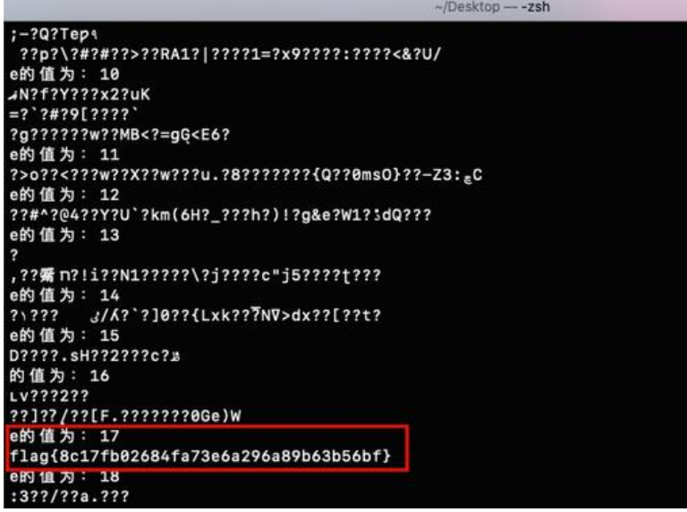

## (11)已知dp,dq求解m

其中关系式如下:

```text
dp=d%(p-1)
dq=d%(q-1)
```

解题脚本： 

```python
#!/usr/bin/python  
#coding:utf-8  
  
import gmpy2  
from Crypto.Util.number import long_to_bytes  
  
c = xxx  
p = xxx  
q = xxx  
dp = xxx  
dq = xxx   
  
InvQ=gmpy2.invert(q,p)  
mp=pow(c,dp,p)  
mq=pow(c,dq,q)  
m=(((mp-mq)*InvQ)%p)*q+mq  
  
print long_to_bytes(m)  
```

这个题型实在没找到对应的题目，就先只记录一下这种方法吧，说不定以后会遇到。

## (13)已知e,n,dp,c求m

题目内容如下: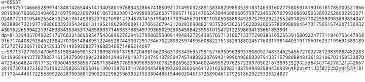解题脚本:

```python
#!/usr/bin/python  
#coding:utf-8  
  
import gmpy2
import libnum
from Crypto.Util.number import long_to_bytes

e= 65537
n = 9637571466652899741848142654451413405801976834328667418509217149503238513830870985353918314633160277580591819016181785300521866901536670666234046521697590230079161867282389124998093526637796571100147052430445089605759722456767679930869250538932528092292071024877213105462554819256136145385237821098127348787416199401770954567019811050508888349297579329222552491826770225583983899834347983888473219771888063393354348613119521862989609112706536794212028369088219375364362615622092005578099889045473175051574207130932430162265994221914833343534531743589037146933738549770365029230545884239551015472122598634133661853901
c = 5971372776574706905158546698157178098706187597204981662036310534369575915776950962893790809274833462545672702278129839887482283641996814437707885716134279091994238891294614019371247451378504745748882207694219990495603397913371579808848136183106703158532870472345648247817132700604598385677497138485776569096958910782582696229046024695529762572289705021673895852985396416704278321332667281973074372362761992335826576550161390158761314769544548809326036026461123102509831887999493584436939086255411387879202594399181211724444617225689922628790388129032022982596393215038044861544602046137258904612792518629229736324827
dp = 81339405704902517676022188908547543689627829453799865550091494842725439570571310071337729038516525539158092247771184675844795891671744082925462138427070614848951224652874430072917346702280925974595608822751382808802457160317381440319175601623719969138918927272712366710634393379149593082774688540571485214097
for i in range(1,65538):
    if (dp*e-1)%i == 0:
        if n%(((dp*e-1)/i)+1)==0:
            p=((dp*e-1)/i)+1
            q=n/(((dp*e-1)/i)+1)
            phi = (p-1)*(q-1)
            d = gmpy2.invert(e,phi)%phi
            m = pow(c,d,n)
            print long_to_bytes(m)
```


## (14)N分解出多个不同的因子（题目给出的模数N可直接分解，但是分解之后得到了多个不同的因子）

题目:  15-山东省大学生爱好者线上赛-上午RSA

题目给出一个文件里面的内容如下：

```
n= 544187306850902797629107353619267427694837163600853983242783
e= 39293
c= 439254895818320413408827022398053685867343267971712332011972
m=???
```

很明显n不大，可直接使用factordb进行分解。

分解得到了3个因子，其实当时做这题时我也是一脸懵的，从没遇到过，试了n种方法，最后推到了这个方法。解题脚本如下:

```python
#!/usr/bin/python
#coding:utf-8

import gmpy2
from Crypto.Util.number import long_to_bytes

n= 544187306850902797629107353619267427694837163600853983242783
e= 39293
c= 439254895818320413408827022398053685867343267971712332011972
p1 = 67724172605733871
p2 = 11571390939636959887
p3 = 694415063702720454699679
phi = (p1-1)*(p2-1)*(p3-1)  
d = gmpy2.invert(e, phi)  
m = pow(c, d, n)  
print long_to_bytes(m)
```

## (16)PKCS1_OAEP模式的RSA

### 西湖论剑2020--BrokenSystems。

题目给出三个文件，一个加密脚本BrokenSystems.py，一个密文文件message，一个RSA公钥文件public.key。

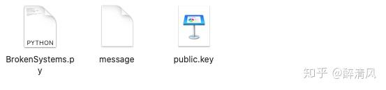

通过openssl查看，可以看到该公钥文件的e特别大，此时便存在rsa-wiener-attack攻击，通过此可以求出d。

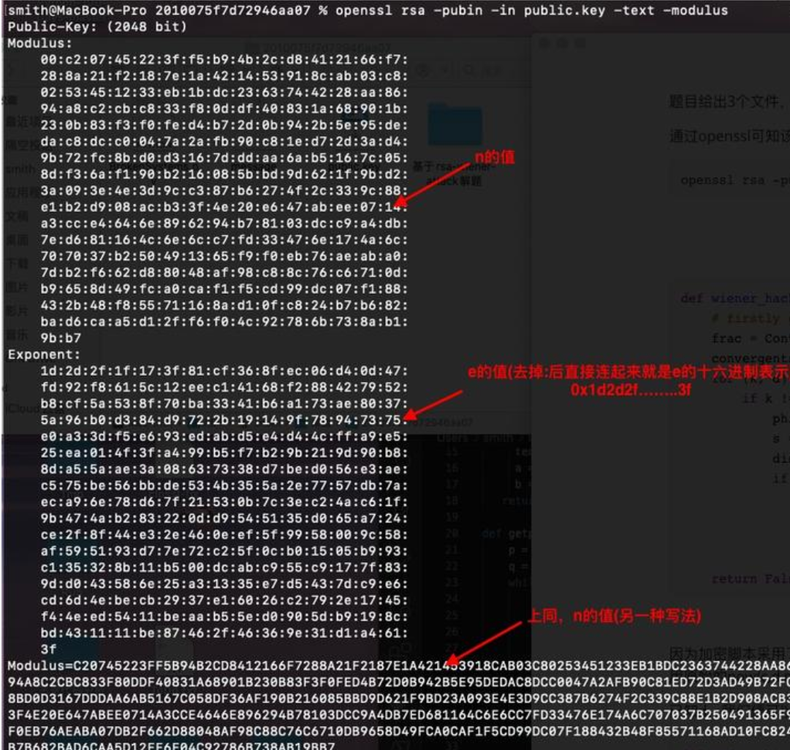

通过rsa-wiener-attack求解d：

```python
作者：曙光
链接：https://zhuanlan.zhihu.com/p/76228394
来源：知乎
著作权归作者所有。商业转载请联系作者获得授权，非商业转载请注明出处。

from Crypto.PublicKey import RSA
import ContinuedFractions, Arithmetic

def wiener_hack(e, n):
    # firstly git clone https://github.com/pablocelayes/rsa-wiener-attack.git !
    frac = ContinuedFractions.rational_to_contfrac(e, n)
    convergents = ContinuedFractions.convergents_from_contfrac(frac)
    for (k, d) in convergents:
        if k != 0 and (e * d - 1) % k == 0:
            phi = (e * d - 1) // k
            s = n - phi + 1
            discr = s * s - 4 * n
            if (discr >= 0):
                t = Arithmetic.is_perfect_square(discr)
                if t != -1 and (s + t) % 2 == 0:
                    print("First: Hacked d.")
                    return d
    return False
n = 0xC20745223FF5B94B2CD8412166F7288A21F2187E1A421453918CAB03C80253451233EB1BDC2363744228AA8694A8C2CBC833F80DDF40831A68901B230B83F3F0FED4B72D0B942B5E95DEDAC8DCC0047A2AFB90C81ED72D3AD49B72FC8BD0D3167DDDAA6AB5167C058DF36AF190B216085BBD9D621F9BD23A093E4E3D9CC387B6274F2C339C88E1B2D908ACB33F4E20E647ABEE0714A3CCE4646E896294B78103DCC9A4DB7ED681164C6E6CC7FD33476E174A6C707037B250491365F9F0EB76AEABA07DB2F662D88048AF98C88C76C6710DB9658D49FCA0CAF1F5CD99DC07F188432B48F85571168AD10FC824B7B682BAD6CAA5D12FF6F04C92786B738AB19BB7
e = 0x1d2d2f1f173f81cf368fec06d40d47fd92f8615c12eec14168f288427952b8cf5a538f70ba3341b6a173ae80375a96b0d384d9722b19149f78947375e0a33df5e693edabd5e4d44cffa9e525ea014f3fa499b5f7b29b219d90b88da55aae3a08637338d7bed056e3aec575be56bbde534b355a2e7757db7aeca96e78d67f21530b7c3ec24ac61f9b474ab283220dd9545135d065a724ce2f8f44e32e460eef5f9958009c58af595193d77e72c25f0cb01505b993c135328b11b500dcabc955c9177f839dd043586e25a31335e7d5437dc9e6cd6d4ebecb2937e16026c2792e1745f44eed5411beaab55ed0905db9198cbd431111be87462f46369e31d1a4613f

message = open('./message', 'r')
secret = message.read()
d = wiener_hack(e, n)
```

```
此时，我们便可以求出d。已知d，我们便可以求出p和q。
def getpq(n,e,d):
    p = 1
    q = 1
    while p==1 and q==1:
        k = d * e - 1
        g = random.randint ( 0 , n )
        while p==1 and q==1 and k % 2 == 0:
            k /= 2
            y = pow(g,k,n)
            if y!=1 and gcd(y-1,n)>1:
                p = gcd(y-1,n)
                q = n/p
    return p,q
```

因为加密脚本采用了PKCS1_OAEP模式下的RSA加密，所以我们需要通过手动构造私钥进而才可以去解密密文。采用原始的pow(c,d,n)是无法正确的解密密文的。

因此，我们需要先采用PKCS1_OAEP模式构造私钥，然后利用这个私钥来解密密文文件。

```python
privkey = RSA.construct((long(n), long(e), long(d), long(p), long(q)))
key = PKCS1_OAEP.new(privkey)  

m = key.decrypt(secret)
print m
```

完整的exp如下：

```python
作者：曙光
链接：https://zhuanlan.zhihu.com/p/76228394
来源：知乎
著作权归作者所有。商业转载请联系作者获得授权，非商业转载请注明出处。

#rsa-wiener-attack/exp1.py
#!/usr/bin/python
#coding:utf-8

import gmpy2
import random
from Crypto.PublicKey import RSA
import ContinuedFractions, Arithmetic
from Crypto.Cipher import PKCS1_OAEP
from Crypto.Util.number import long_to_bytes 
 
def gcd(a, b):
   if a < b:
     a, b = b, a
   while b != 0:
     temp = a % b
     a = b
     b = temp
   return a
 
def getpq(n,e,d):
    p = 1
    q = 1
    while p==1 and q==1:
        k = d * e - 1
        g = random.randint ( 0 , n )
        while p==1 and q==1 and k % 2 == 0:
            k /= 2
            y = pow(g,k,n)
            if y!=1 and gcd(y-1,n)>1:
                p = gcd(y-1,n)
                q = n/p
    return p,q


def wiener_hack(e, n):
    # firstly git clone https://github.com/pablocelayes/rsa-wiener-attack.git !
    frac = ContinuedFractions.rational_to_contfrac(e, n)
    convergents = ContinuedFractions.convergents_from_contfrac(frac)
    for (k, d) in convergents:
        if k != 0 and (e * d - 1) % k == 0:
            phi = (e * d - 1) // k
            s = n - phi + 1
            discr = s * s - 4 * n
            if (discr >= 0):
                t = Arithmetic.is_perfect_square(discr)
                if t != -1 and (s + t) % 2 == 0:
                    print("First: Hacked d.")
                    return d
    return False
def main():
    n = 0xC20745223FF5B94B2CD8412166F7288A21F2187E1A421453918CAB03C80253451233EB1BDC2363744228AA8694A8C2CBC833F80DDF40831A68901B230B83F3F0FED4B72D0B942B5E95DEDAC8DCC0047A2AFB90C81ED72D3AD49B72FC8BD0D3167DDDAA6AB5167C058DF36AF190B216085BBD9D621F9BD23A093E4E3D9CC387B6274F2C339C88E1B2D908ACB33F4E20E647ABEE0714A3CCE4646E896294B78103DCC9A4DB7ED681164C6E6CC7FD33476E174A6C707037B250491365F9F0EB76AEABA07DB2F662D88048AF98C88C76C6710DB9658D49FCA0CAF1F5CD99DC07F188432B48F85571168AD10FC824B7B682BAD6CAA5D12FF6F04C92786B738AB19BB7
    e = 0x1d2d2f1f173f81cf368fec06d40d47fd92f8615c12eec14168f288427952b8cf5a538f70ba3341b6a173ae80375a96b0d384d9722b19149f78947375e0a33df5e693edabd5e4d44cffa9e525ea014f3fa499b5f7b29b219d90b88da55aae3a08637338d7bed056e3aec575be56bbde534b355a2e7757db7aeca96e78d67f21530b7c3ec24ac61f9b474ab283220dd9545135d065a724ce2f8f44e32e460eef5f9958009c58af595193d77e72c25f0cb01505b993c135328b11b500dcabc955c9177f839dd043586e25a31335e7d5437dc9e6cd6d4ebecb2937e16026c2792e1745f44eed5411beaab55ed0905db9198cbd431111be87462f46369e31d1a4613f
    message = open('./message', 'r')
    secret = message.read()
    d = wiener_hack(e, n)
    p,q = getpq(n,e,d)
    #print p
    #print q
    privkey = RSA.construct((long(n), long(e), long(d), long(p), long(q)))
    key = PKCS1_OAEP.new(privkey)  

    m = key.decrypt(secret)
    print m

if __name__=="__main__":
    main()
```

解题脚本如下：

```python
#!/usr/bin/python
#coding:utf-8

import gmpy2
import random
from Crypto.PublicKey import RSA
import ContinuedFractions, Arithmetic
from Crypto.Cipher import PKCS1_OAEP
from Crypto.Util.number import long_to_bytes 
 
def gcd(a, b):
   if a < b:
     a, b = b, a
   while b != 0:
     temp = a % b
     a = b
     b = temp
   return a
 
def getpq(n,e,d):
    p = 1
    q = 1
    while p==1 and q==1:
        k = d * e - 1
        g = random.randint ( 0 , n )
        while p==1 and q==1 and k % 2 == 0:
            k /= 2
            y = pow(g,k,n)
            if y!=1 and gcd(y-1,n)>1:
                p = gcd(y-1,n)
                q = n/p
    return p,q


def wiener_hack(e, n):
    # firstly git clone https://github.com/pablocelayes/rsa-wiener-attack.git !
    frac = ContinuedFractions.rational_to_contfrac(e, n)
    convergents = ContinuedFractions.convergents_from_contfrac(frac)
    for (k, d) in convergents:
        if k != 0 and (e * d - 1) % k == 0:
            phi = (e * d - 1) // k
            s = n - phi + 1
            discr = s * s - 4 * n
            if (discr >= 0):
                t = Arithmetic.is_perfect_square(discr)
                if t != -1 and (s + t) % 2 == 0:
                    print("First: Hacked d.")
                    return d
    return False
def main():
    n = 0xC20745223FF5B94B2CD8412166F7288A21F2187E1A421453918CAB03C80253451233EB1BDC2363744228AA8694A8C2CBC833F80DDF40831A68901B230B83F3F0FED4B72D0B942B5E95DEDAC8DCC0047A2AFB90C81ED72D3AD49B72FC8BD0D3167DDDAA6AB5167C058DF36AF190B216085BBD9D621F9BD23A093E4E3D9CC387B6274F2C339C88E1B2D908ACB33F4E20E647ABEE0714A3CCE4646E896294B78103DCC9A4DB7ED681164C6E6CC7FD33476E174A6C707037B250491365F9F0EB76AEABA07DB2F662D88048AF98C88C76C6710DB9658D49FCA0CAF1F5CD99DC07F188432B48F85571168AD10FC824B7B682BAD6CAA5D12FF6F04C92786B738AB19BB7
    e = 0x1d2d2f1f173f81cf368fec06d40d47fd92f8615c12eec14168f288427952b8cf5a538f70ba3341b6a173ae80375a96b0d384d9722b19149f78947375e0a33df5e693edabd5e4d44cffa9e525ea014f3fa499b5f7b29b219d90b88da55aae3a08637338d7bed056e3aec575be56bbde534b355a2e7757db7aeca96e78d67f21530b7c3ec24ac61f9b474ab283220dd9545135d065a724ce2f8f44e32e460eef5f9958009c58af595193d77e72c25f0cb01505b993c135328b11b500dcabc955c9177f839dd043586e25a31335e7d5437dc9e6cd6d4ebecb2937e16026c2792e1745f44eed5411beaab55ed0905db9198cbd431111be87462f46369e31d1a4613f
    message = open('./message', 'r')
    secret = message.read()
    d = wiener_hack(e, n)
    p,q = getpq(n,e,d)
    #print p
    #print q
    privkey = RSA.construct((long(n), long(e), long(d), long(p), long(q)))
    key = PKCS1_OAEP.new(privkey)  

    m = key.decrypt(secret)
    print m

if __name__=="__main__":
    main()
```

作者：曙光
链接：https://zhuanlan.zhihu.com/p/76228394
来源：知乎
著作权归作者所有。商业转载请联系作者获得授权，非商业转载请注明出处。


## **(17)已知**p+q和**(p+1)(q+1)**

题目给出p+q，(p+1)(q+1)，e和c。


首先需要求出phi，然后求解d，最后再求解m。

```text
phi = (p-1)(q-1)
    = pq - (p+q) + 1 
```

p+q的值题目已经给出了，接下来只需要求出pq的值即可求出phi的值。题目还给出了(p+1)(q+1)，我们考虑下pq是否可以表示为(p+1)(q+1)的形式：

```text
(p+1)(q+1) = pq + p + q + 1    
	   = pq + (p+q) + 1
```

那么pq就可以表示为：

```text
pq = (p+1)(q+1) - (p+q) -1
```

然后，求解phi的值。

```text
phi = (p-1)(q-1)
    = pq - (p+q) + 1 
    = n - (p+q) + 1
```

最后：

```text
d = gmpy2.invert(e,phi)
m = pow(c,d,n)
```

完整的解题脚本如下：

```python
#!/usr/bin/python
#coding:utf-8

import gmpy2
from Crypto.Util.number import long_to_bytes

#p+q通过p_add_q表示
p_add_q = 326429100407681651814978442415826213864753565034919374282004148849764531414964129530662174521568050093736341197400405816551402307458686750141836996345723514698979514133066389538988520826440776264241138888155090851605191090286605183976443204444854546781116840786281855819689375353337207819361769484061133586660

#(p+1)(q+1)为了方便用x表示
x = 26601616557971867831128918184476970808722471200861600741488181559976427915212193001812160532906370924454473038671991616741424706794741682437728013348910646937734672343325523407437596920797247711273378236903138971315823251358525257853681659038646150834388504990678755552658405772625078429891153401221091704935464031276762725209220275197422069811202440482709667987828399235771854454331605660739185369563297937712412914621262089799368586352843414856752338979163598254668715003106493342377951882955338211218066635494610164992383277776336257215001515405312235576928828485922034700150519853591032361405975195251746299510720

c = 24831377919906161196266552704492935537768087456188711284519872226691826290351027606307936414989585764319104737516021733938210516424254235349369088344349700976416957839221585194510124601438798302079231278339823353520868327987552051471031155633165987892206927171527428590536203275545528900845222038924459888879261986663709510987273937159905675940592632023428129764650249246182611973968609631056274792336171105433760493214971141615401120748113420469659787315651721605227003326305005720436114240966565179896456348773794946970503274768701856591123183247406604013805700201562056023223765073732621940021232679124486597812994

e = 65537


#n = pq = (p+1)(q+1) - (p+q) - 1 = x - p_add_q - 1
n = x - p_add_q - 1

#phi = (p-1)(q-1) = pq - (p+q) + 1 = n - (p+q) + 1 = n - p_add_q + 1
phi = n - p_add_q + 1

d = gmpy2.invert(e,phi)
m = pow(c,d,n)
print(long_to_bytes(m))
```

运行结果：


## **(18)已知p-q和n，e，c**

**这个题相比于(17)而言，不太容易直接想到转化的等式。**

题目给出p-q，n，e和c。

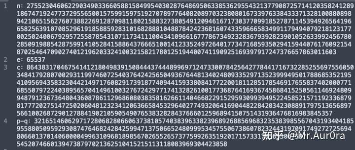

常规的RSA解密步骤：

```text
n = p*q
phi = (p-1)*(q-1)
d = gmpy2.invert(e,phi)
m = pow(c,d,n)
```

因为n不可分解，所以，我们无法直接得到p和q的值，也就无法得到phi的值。

通过对phi的如下分解可知，如果已知n和p+q便可求得phi的值。

```text
phi = (p-1)*(q-1)
    = p*q - (p+q) + 1
    = n - (p+q) + 1
```

因为，给了p-q的值，所以，我们需要设法将p+q表示为p-q，进而求得phi的值。

推导过程如下：

(1) p-q的平方可以如下分解：


因此：


(2) p+q的平方可以如下分解：

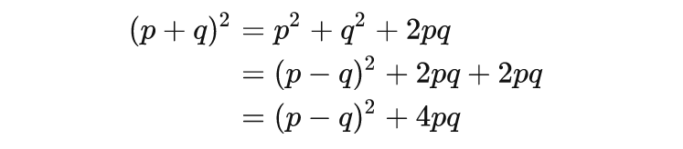

故p+q可表示为：

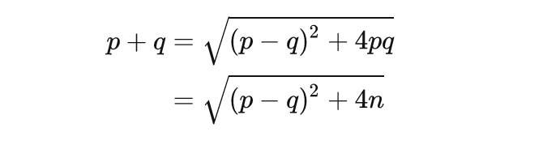

这样，我们就可以求出p+q的值，进而可以求出phi的值。最后就可以求出明文m的值了。解题脚本如下：

```python
#!/usr/bin/python
#coding:utf-8
#变量p_add_q：p + q
#变量p_sub_q：p - q

import gmpy2
from Crypto.Util.number import long_to_bytes

n = 27552304606229034903366058815849954030287648695063385362955432137790872571412035824128918674719247737295565001575991597519270789776408208970323808016733976338433371328100880898942106515627607388226912870981180215883273805491209461671730377099185278711453949265641966582563910708529619185885928310168288810488784242368160743359666583499117949407921812317700250240067929572558785431071173411100434109661677786734923283679392823901052633992456780285091988542875991410528415886437666510014123352497264017734716859350294159440761760921548702546470902740121962033241003215821780125194400741190925169397917247376657863011603
e = 65537 
c = 8643831704675414121804983915084443744489969712473300784256427784417167322852556975560503484179280700293119974607254037642425650493676448134024809335297135239994950178868535219541095694358323044214971760829173918774094415933808417722001811285178546917655837402000771685507972240389565704149610032767242977174132826100177368764169367458684152505611469248099487912367364804360878611296860803835816266114046682291529593099394952245852157119233687981777202751472502060481232341206366584532964027749320641690448228420342308891797513656897566100268729012788419021059054907653832828437666012596894150751431936476816983845357
p_sub_q = 3216514606297172806828066063738105740383963382396892688569683235383985567043193404185955880509592930874764682428425994713750665248099953457550673860782324431970917492727256948066013701406000049963109681898567026552657377599263519201715733179565306750754520746601394738797021362510415215113118083969304423858

p_add_q = gmpy2.iroot(p_sub_q**2 + 4*n, 2)  
#iroot()返回值为一个(x,y)元组。其中x为结果值，y为一个bool型变量，如果x为整数，y=True,否则y=False。


phi = n - p_add_q[0] + 1

d = gmpy2.invert(e,phi)

m = pow(c,d,n)

print(long_to_bytes(m))
```

运行结果：


