1.MD5

题目就是提示

下载附件，打开文件，是md5，解密网址👉,[在线md5解密](https://cmd5.com/)，解密即可。

flag:`flag{admin1}`

------

## 2.一眼就解密

没有附件，提示如下

>  下面的字符串解密后便能获得flag：ZmxhZ3tUSEVfRkxBR19PRl9USElTX1NUUklOR30= 注意：得到的 flag 请包上 flag{} 提交

发现是base64编码，解密网址👉[在线base64解密](https://base64.us/)，解密即可。

flag:`flag{THE_FLAG_OF_THIS_STRING}`

------

## 3.url编码

题目就是提示

下载附件，发现是url编码，在线解密网址👉[url在线解密](http://www.9tool.cn/Encryption/URL)，解密即可。

flag:`flag{and 1=1}`

------

## 4.看我回旋踢（凯撒密码，工具箱）

没有提示

下载附件，内容👉`synt{5pq1004q-86n5-46q8-o720-oro5on0417r1}`，看样子有点像凯撒和栅栏，每个都去试试，最后尝试是凯撒，凯撒移动13位，在线解密网址，[在线凯撒解密](https://www.qqxiuzi.cn/bianma/kaisamima.php)，即可

用密码学工具箱

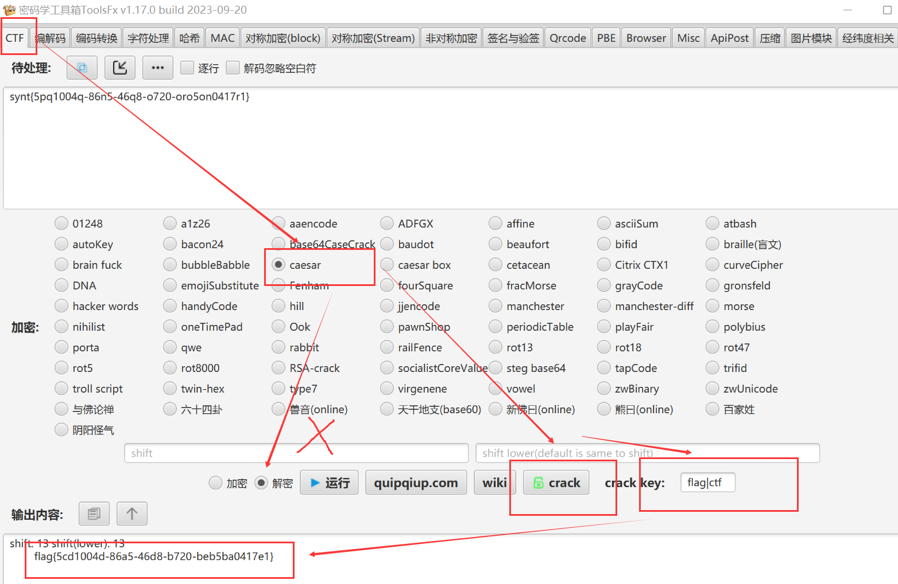

或用：米斯特安全团队：CTFCracktools

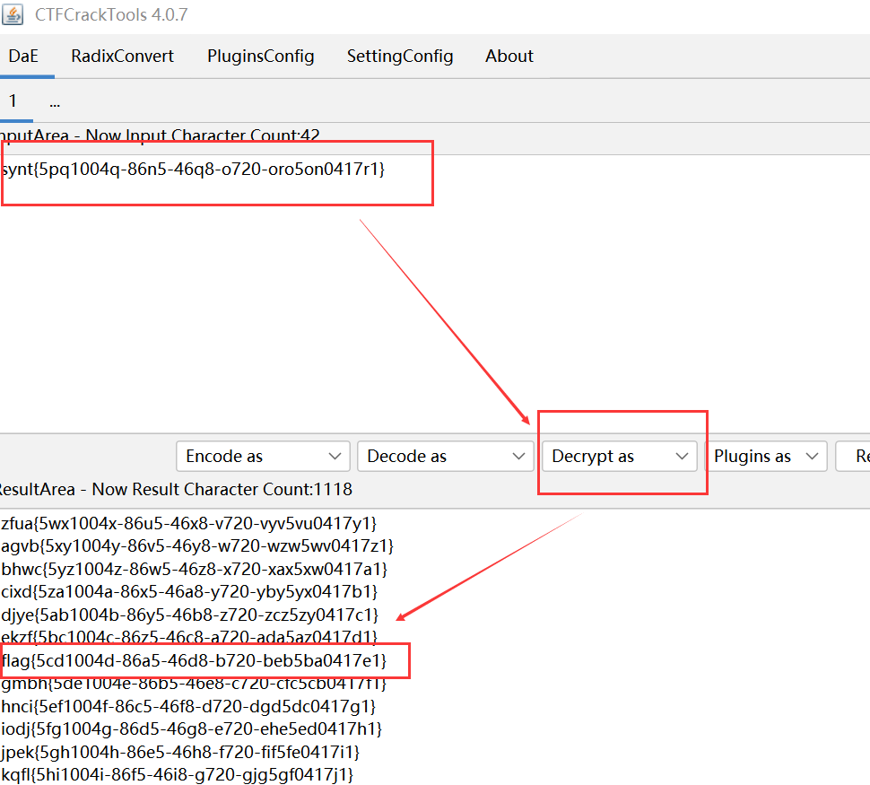

flag:`flag{5cd1004d-86a5-46d8-b720-beb5ba0417e1}`

或者用CTF-Tools移位密码列出所有可能性

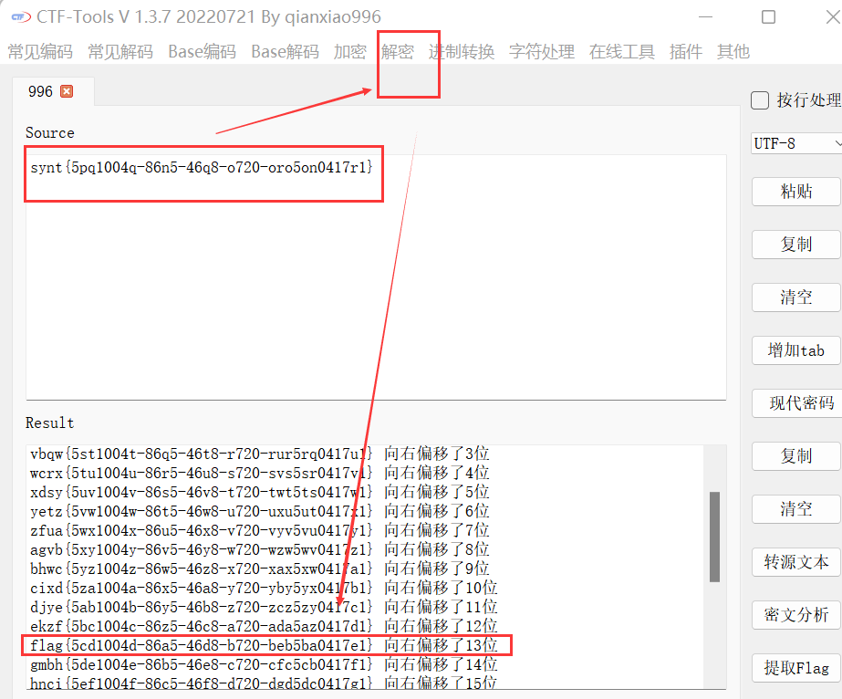

------

## 5.摩丝(摩斯密码)

题目就是提示

打开txt文本，内容如下👉`.. .-.. --- ...- . -.-- --- ..-`，摩斯密码在线解密即可，[在线摩斯密码加密解密](https://www.matools.com/morse)，解密结果是`ILOVEYOU`。

用CTF-Tools V1.3.7

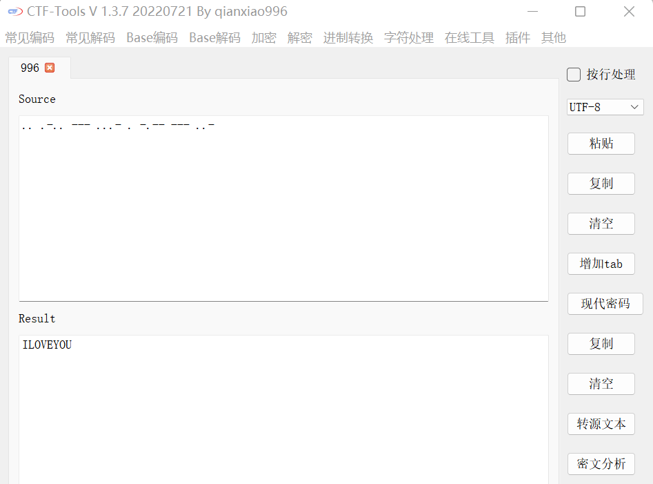

flag:`flag{ILOVEYOU}`

------

## 6.password(名字缩写加生日)

没有提示

下载附件，发现里面是姓名和生日，想了想一般人密码不就是自己的名字缩写加上生日吗，或者是生日加上名字缩写，尝试后发现是名字缩写加上生日。

flag:`flag{zs19900315}`

------

## 7.变异凯撒

提示就是变异凯撒。

下载附件，密文是`afZ_r9VYfScOeO_UL^RWUc`，是用的是**ASCII变异**，`afz_`对应的ASCII编码是`97 102 90 95` 而flag这个字眼对应的是`102 108 97 103`，就会发现:`97+5=102 102+6=108 90+7=97 95+8=103`，由此，python代码如下(借鉴的)。

```python
def b_kaisa(str):

    first_step = 5 #首位ascii码的位移步长
    i = 0
    result = []

    for i in range(len(str)):
        as_num = ord(str[i]) #将数据序列变为ascii码
        as_num += first_step
        result.append(as_num) #将变为ascii码后的数据序列加入数组

        first_step += 1
        i += 1

    return result

question = 'afZ_r9VYfScOeO_UL^RWUc'
result = b_kaisa(question)
print(result)

#由于函数体返回的是一个ascii码的数据序列，类型为列表，我们要将他转化成字符串类型
for i in result:
    print(chr(i),end='')
```

flag:`flag{Caesar_variation}`

------

## 8.Quoted-printable(工具箱quotedPrintable)

题目就是提示

```
=E9=82=A3=E4=BD=A0=E4=B9=9F=E5=BE=88=E6=A3=92=E5=93=A6
```

下载附件，👉[在线Quoted-printable解码](http://www.mxcz.net/tools/QuotedPrintable.aspx/)，即可。

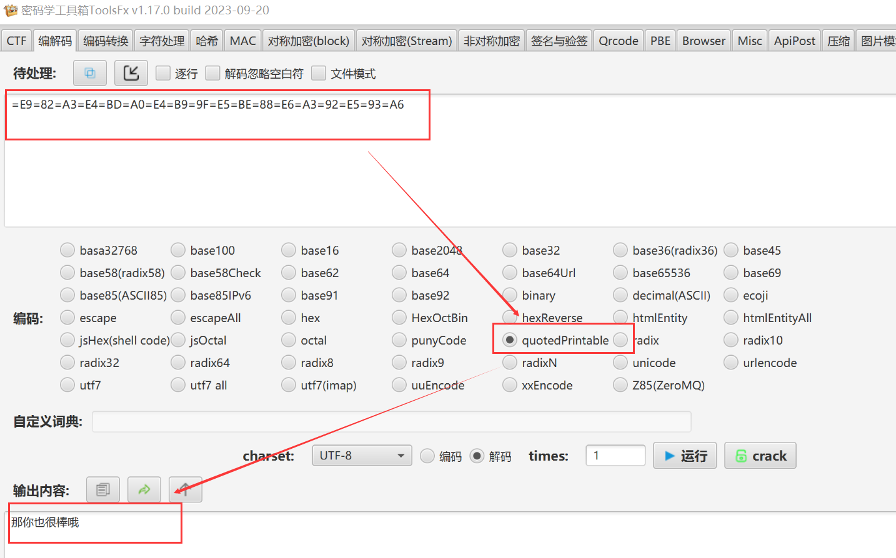

flag:`flag{那你也很棒哦}`

------

## 9.Rabbit（工具箱,rabbit）

题目就是提示，兔子加密解密

```
U2FsdGVkX1/+ydnDPowGbjjJXhZxm2MP2AgI
```

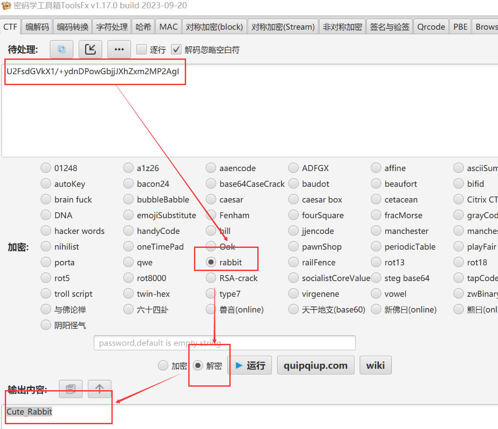

下载附件，👉[rabbit在线解密](https://www.sojson.com/encrypt_rabbit.html)，在线解密即可。

flag:`flag{Cute_Rabbit}`

------

## 10.篱笆墙的影子(栅栏密码(fence)，CTF-Tools/cracktools)

提示如下

> 星星还是那颗星星哟 月亮还是那个月亮 山也还是那座山哟 梁也还是那道梁 碾子是碾子 缸是缸哟 爹是爹来娘是娘 麻油灯呵还吱吱响 点的还是那么丁点亮 哦哦 注意：得到的 flag 请包上 flag{} 提交

我表示不懂，下载附件，打开附件，附件内容👉`felhaagv{ewtehtehfilnakgw}`，根据题目猜测应该是栅栏密码，在线解密👉[栅栏在线解密](https://www.qqxiuzi.cn/bianma/zhalanmima.php)，解密即可。

flag:`flag{wethinkwehavetheflag}`

------

## 11.RSA

下载附件，附件内容如下，需要我们求出d，根据公式`(e*d)modφ(n)=1`,👉[RSA加密原理](https://blog.takagisan.top/2022/02dd678d5e.html#toc-heading-15)。

```text
p=473398607161	q=4511491	e=17
```

求φ(n)：`(p-1)(q-1)=(473398607161-1)*(4511491-1)=2135733082216268400`，根据公式计算出d为`125631357777427553`。

怎么可能是手算的，脚本如下。

### 法一：脚本

```python
import libnum
p = 473398607161
q = 4511491
e = 17
fn = (p-1)*(q-1)
print(libnum.invmod(e,fn))
```

flag:`flag{125631357777427553}`

### 法二：学习RSAtool2的使用：

```php
1.Number Base 设置为十进制
2.注意：Public Exponent这里要使用16进制的数，如果公钥e=17的话，就应该填入十六进制的11
3.给出p,q,e的话直接填入，再点击Calc.D,获得d
4.给出的是n和e的话，输入n和e，点击Factor N(分解)，得到p,q,再重复第3步就能得到d了
注意e填进去是16进制，需要将17转hex得到11再填进去
```

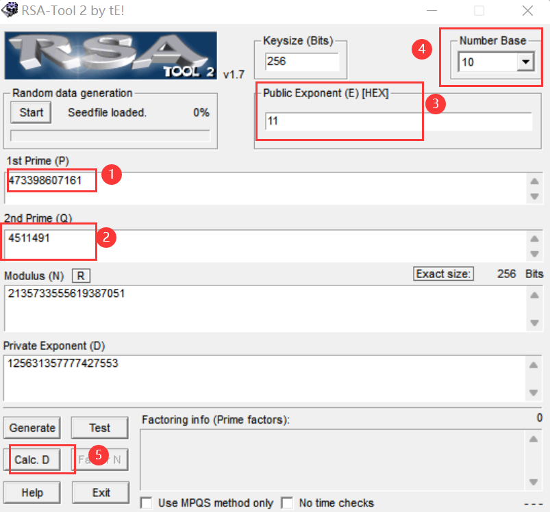

## 12.丢失的MD5

下载附件发现是python2代码，如下。

```python
import hashlib   
for i in range(32,127):
    for j in range(32,127):
        for k in range(32,127):
            m=hashlib.md5()
            m.update('TASC'+chr(i)+'O3RJMV'+chr(j)+'WDJKX'+chr(k)+'ZM')
            des=m.hexdigest()
            if 'e9032' in des and 'da' in des and '911513' in des:
                print des
```

直接python2运行即可得到flag

在python3里面不能运行，一眼发现错误。

```python
print des
修改为
print(des)
```

运行结果如下图👇

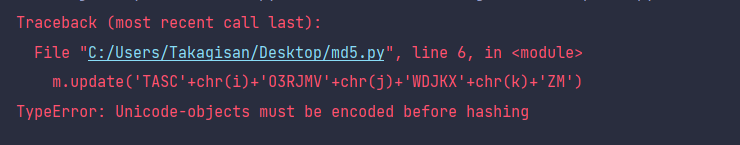

意思是`必须在哈希之前对Unicode进行编码`，修改代码如下👇。

```python
import hashlib   
for i in range(32,127):
    for j in range(32,127):
        for k in range(32,127):
            m=hashlib.md5()
            m.update('TASC'.encode('utf-8')+chr(i).encode('utf-8')+'O3RJMV'.encode('utf-8')+chr(j).encode('utf-8')+'WDJKX'.encode('utf-8')+chr(k).encode('utf-8')+'ZM'.encode('utf-8'))
            des=m.hexdigest()
            if 'e9032' in des and 'da' in des and '911513' in des:
                print(des)
```

得到flag:`flag{e9032994dabac08080091151380478a2}`

------

## 13.Alice与Bob(素数分解，32位md5加密)

提示如下

> 密码学历史中，有两位知名的杰出人物，Alice和Bob。他们的爱情经过置换和轮加密也难以混淆，即使是没有身份认证也可以知根知底。就像在数学王国中的素数一样，孤傲又热情。下面是一个大整数:98554799767,请分解为两个素数，分解后，小的放前面，大的放后面，合成一个新的数字，进行md5的32位小写哈希，提交答案。 注意：得到的 flag 请包上 flag{} 提交

根据题目要求分解两个素数，👉[在线分解](http://www.jsons.cn/quality/)，如果不用在线分解也可以使用python代码，代码👇。

```python
n=int(input("请输入需要分解的整数:"))                  #让用户输入数字
num=n                           #赋值
m=[]                            #创建空列表
while n!=1:                     #判断如果n不是1，那么就循环
    for i in range(2,n+1):      #循环从2到n加1位数字
        if n % i == 0:          #判断，如果n除以i的余数为0
            m.append(str(i))    #如果余数为0，那么就把i转换为字符串然后加入到m列表里面去
            n = n//i            #如果余数为0，那么用n来除以i做向下取整数
            break               #如果余数为0，结束循环
print("分解的素数为:",num,'=','*'.join(m))      #输出
```

分解后，数字为`101999*966233`，重新组成数字为`101999966233`，将重新组成的数字进行md5的32位小写哈希👉[在线MD5加密](https://www.cmd5.com/)，也可以使用python，如下代码👇。

```python
import hashlib
def hash():
    str = '101999966233'
    md5 = hashlib.md5()  # 创建md5对象
    md5.update(str.encode('utf-8')) #必须要进行encode编码
    print(md5.hexdigest())

if __name__ == '__main__':
    hash()
```

结果为`d450209323a847c8d01c6be47c81811a`。

flag:`flag{d450209323a847c8d01c6be47c81811a}`

------

## 14.rsarsa(RSA,n+e+c+p+q= m型)

这是让我眼前一黑的题，就是表面意思，眼前一黑，下载附件，反正大概意思就是求m，不懂rsa的可以看这篇文章👉[RSA](https://blog.takagisan.top/2022/02dd678d5e.html#toc-heading-15)，套公式**c^dmodn=m**。

题目内容如下👇。

```python
p =  9648423029010515676590551740010426534945737639235739800643989352039852507298491399561035009163427050370107570733633350911691280297777160200625281665378483
q =  11874843837980297032092405848653656852760910154543380907650040190704283358909208578251063047732443992230647903887510065547947313543299303261986053486569407
e =  65537
c = 83208298995174604174773590298203639360540024871256126892889661345742403314929861939100492666605647316646576486526217457006376842280869728581726746401583705899941768214138742259689334840735633553053887641847651173776251820293087212885670180367406807406765923638973161375817392737747832762751690104423869019034
```

需要求d是多少，求d公式：`(e*d)modφ(n)=1`，φ(n)的求法就是(p-1)*(q-1)，数字太大，直接python脚本吧，如下👇，输出的结果就是d

```python
import libnum
p =  9648423029010515676590551740010426534945737639235739800643989352039852507298491399561035009163427050370107570733633350911691280297777160200625281665378483
q =  11874843837980297032092405848653656852760910154543380907650040190704283358909208578251063047732443992230647903887510065547947313543299303261986053486569407
e =  65537
c =  83208298995174604174773590298203639360540024871256126892889661345742403314929861939100492666605647316646576486526217457006376842280869728581726746401583705899941768214138742259689334840735633553053887641847651173776251820293087212885670180367406807406765923638973161375817392737747832762751690104423869019034
fn = (p-1)*(q-1)
print(libnum.invmod(e,fn))
```

最终求m，python脚本如下，就是我自己写的( •̀ ω •́ )✧，虽然很简单233333。

```python
import libnum
p =  9648423029010515676590551740010426534945737639235739800643989352039852507298491399561035009163427050370107570733633350911691280297777160200625281665378483
q =  11874843837980297032092405848653656852760910154543380907650040190704283358909208578251063047732443992230647903887510065547947313543299303261986053486569407
e =  65537
c =  83208298995174604174773590298203639360540024871256126892889661345742403314929861939100492666605647316646576486526217457006376842280869728581726746401583705899941768214138742259689334840735633553053887641847651173776251820293087212885670180367406807406765923638973161375817392737747832762751690104423869019034
n = p*q
fn = (p-1)*(q-1)
d = libnum.invmod(e,fn)
m = pow(c,d,n)      #为c的d次方然后在对n取余数
print(m)
```

最终m:`5577446633554466577768879988`，flag:`flag{5577446633554466577768879988}`

简单脚本如下：

```python
e = 65537
p = 9648423029010515676590551740010426534945737639235739800643989352039852507298491399561035009163427050370107570733633350911691280297777160200625281665378483
q = 11874843837980297032092405848653656852760910154543380907650040190704283358909208578251063047732443992230647903887510065547947313543299303261986053486569407
n = p*q
#密文
C = 83208298995174604174773590298203639360540024871256126892889661345742403314929861939100492666605647316646576486526217457006376842280869728581726746401583705899941768214138742259689334840735633553053887641847651173776251820293087212885670180367406807406765923638973161375817392737747832762751690104423869019034

d = 56632047571190660567520341028861194862411428416862507034762587229995138605649836960220619903456392752115943299335385163216233744624623848874235303309636393446736347238627793022725260986466957974753004129210680401432377444984195145009801967391196615524488853620232925992387563270746297909112117451398527453977

#求明文
M = pow(C,d,n)    #快速求幂取模运算
print(M)
#解出flag{5577446633554466577768879988}
```


------

## 15.大帝的密码武器(移位密码，用CTF-Tools全列出来)

下载下来的文件没有后缀需要修改为.zip文件解压，解压之后，发现有两个文件，题目的介绍一看就是凯撒👉[在线加密解密凯撒](https://www.qqxiuzi.cn/bianma/kaisamima.php)，用CTF-Tools移位密码解密，列出来所有可能

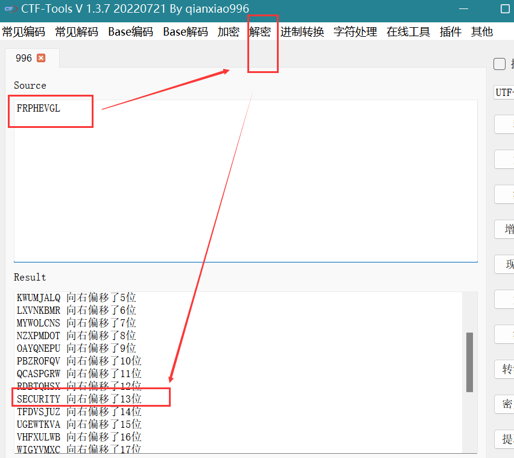

或者如下python代码👇，一个一个的看，发现移动十三位数是`security`是一个正常的单词，其他都不正常，由此判断是移动了13位，加密密文`ComeChina`也可以用如下代码移动13位，加密过后是`pbzrpuvan`，当然这个不是flag，需要把两个`p`变成大写(我就被坑了)

```python
def caser():
    flag = "ComeChina".lower()
    dict_txt = 'ABCDEFGHIJKLMNOPQRSTUVWXYZABCDEFGHIJKLMNOPQRSTUVWXYZ'.lower()
    enc = []
    for k in range(1,26):
        for i in flag:
            enc.append(dict_txt[dict_txt.index(i)+k])   #寻找i里面的dict_txt的索引值加上k
        print("移动了%d位"%k)
        print("".join(enc))
        print()
        enc = []        #每次循环完毕，列表清空
if __name__ == '__main__':
    caser()
```

最终flag:`flag{PbzrPuvan}`

```python
str1 = 'FRPHEVGL'
str2 = str1.lower()                                 #转换为小写方便识别
num = 1                                             #偏移量
for i in range(26):
    print("{:<2d}".format(num),end = ' ')
    for temp in str2:
        if(ord(temp)+num > ord('z')):               #如果超出'z',需要重新映射会a~z这26个字母上
            print(chr(ord(temp)+num-26),end = '')
        else:
            print(chr(ord(temp)+num),end = '')
    num += 1
    print('')
    str = 'ComeChina'
    for temp in str:
        if (ord(temp) + 13 > ord('z')):
            print(chr(ord(temp) + 13 - 26), end='')
        else:
            print(chr(ord(temp) + 13), end='')
    print('')
```

------

## 16.Windows系统密码

下载附件，使用记事本打开，👉[md5在线解密](https://cmd5.com/)，发现一个ctf用户，第一个md5解密解不开，第二个解开了是`good-luck`，拿去提交，发现提交成功。

flag:`flag{good-luck}`

------

## 17.信息化时代的步伐

提示如下

> 也许中国可以早早进入信息化时代，但是被清政府拒绝了。附件中是数十年后一位伟人说的话的密文。请翻译出明文(答案为一串中文！) 注意：得到的 flag 请包上 flag{} 提交

打开附件一大串数字，根据提示，应该是中文电码，👉[中文电码查询](http://code.mcdvisa.com/)，结果如下👇。

```text
6060：计
4615：算
2623：机
6008：要
1783：从
1216：娃
1216：娃
2119：抓
6386：起
```

所以,flag:`flag{计算机要从娃娃抓起}`

计算机要从娃娃抓起——邓小平

## 19.[BJDCTF 2nd]cat_flag

查看题目

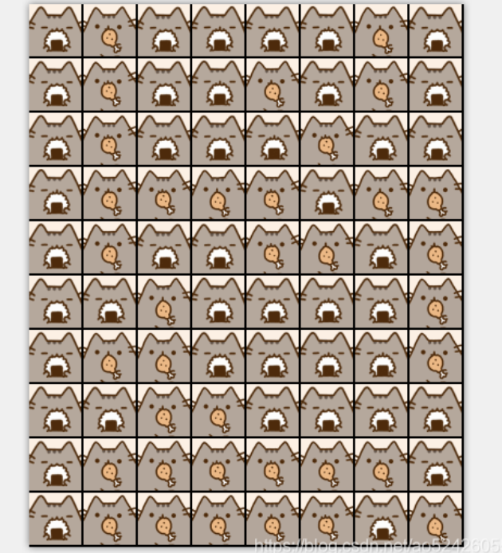

一只有鸡腿，一只没有鸡腿。很容易想到二进制数0，1。
将图片用二进制表示为：
01000010
01001010
01000100
01111011
01001101
00100001
01100001
00110000
01111110
01111101
将二进制数转为16进制进制转换，再16进制转文本16转文。
得到flag为： BJD{M!a0~}

操作：复制到：CTF-Tools，勾选逐行操作，选择进制转换，2-->16，再常见解码，ascii(16进制)

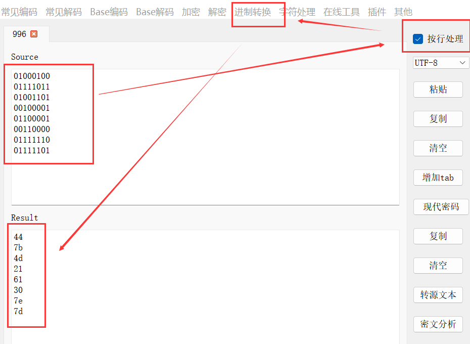

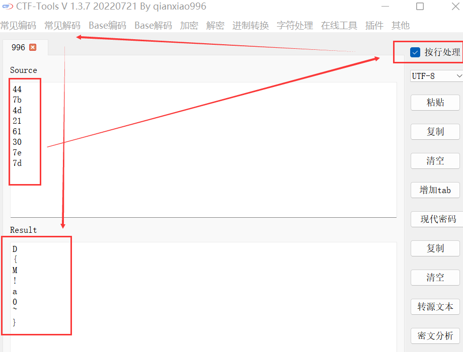

## 20.[BJDCTF 2nd]燕言燕语-y1ng（16进制转文本，维吉尼亚密码）

查看题目燕子说79616E7A69205A4A517B78696C7A765F6971737375686F635F73757A6A677D20
 明显是16进制，[16转文](http://www.bejson.com/convert/ox2str/)，转换一下。

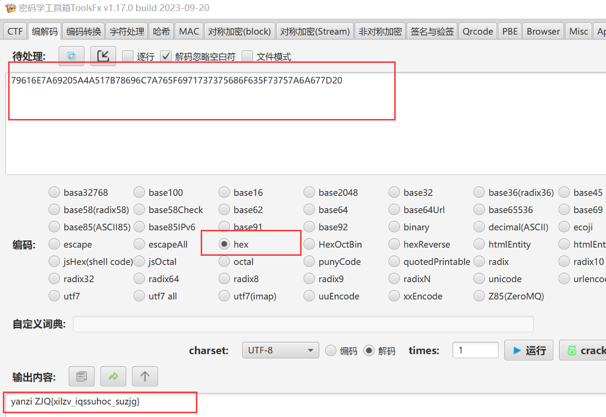

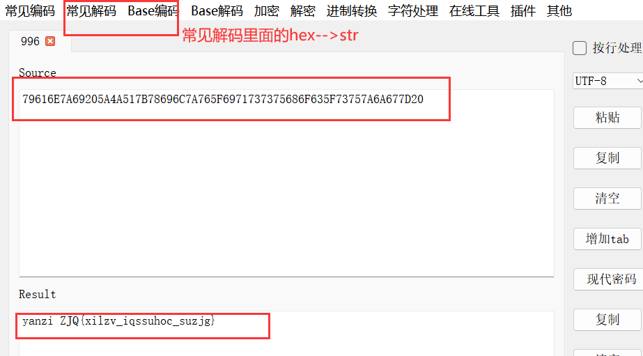

维吉尼亚解密，前半段yanzi就是密钥

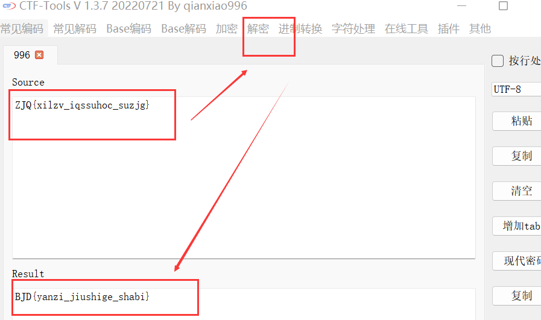

## 21.传统知识+古典密码

查看题目

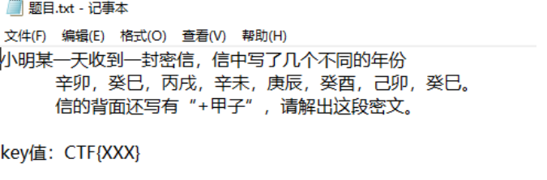

加密方法：
 ①置换密码(又称易位密码)：明文的字母保持相同，但顺序被打乱了。
 代表：栅栏加密

②代替密码：就是将明文的字符替换为密文中的另一种的字符，接收者只要对密文做反向替换就可以恢复出明文。
 代表：恺撒加密

### 60年甲子表

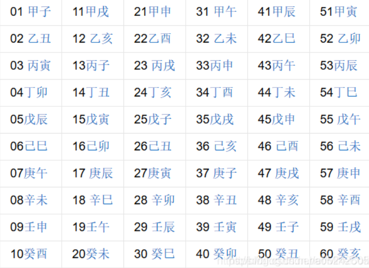

1.由这张表就能知道，辛卯，癸巳，丙戌，辛未，庚辰，癸酉，己卯，癸巳。代表的数值了。
2.信的背面还写有“+甲子”，一甲子是60年，‘+甲子’ == ‘+60’
3.所以，辛卯，癸巳，丙戌，辛未，庚辰，癸酉，己卯，癸巳，再加上60，利用ASCLL码，就能得到对应的ACSLL字符了 ：XZSDMFLZ
4.把这个用栅栏解密

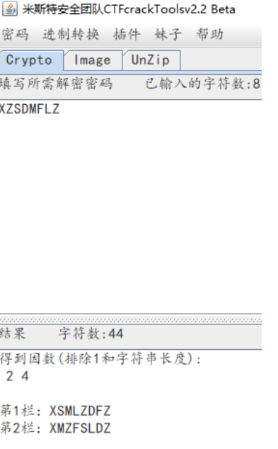

把这两个结果用凯撒解密

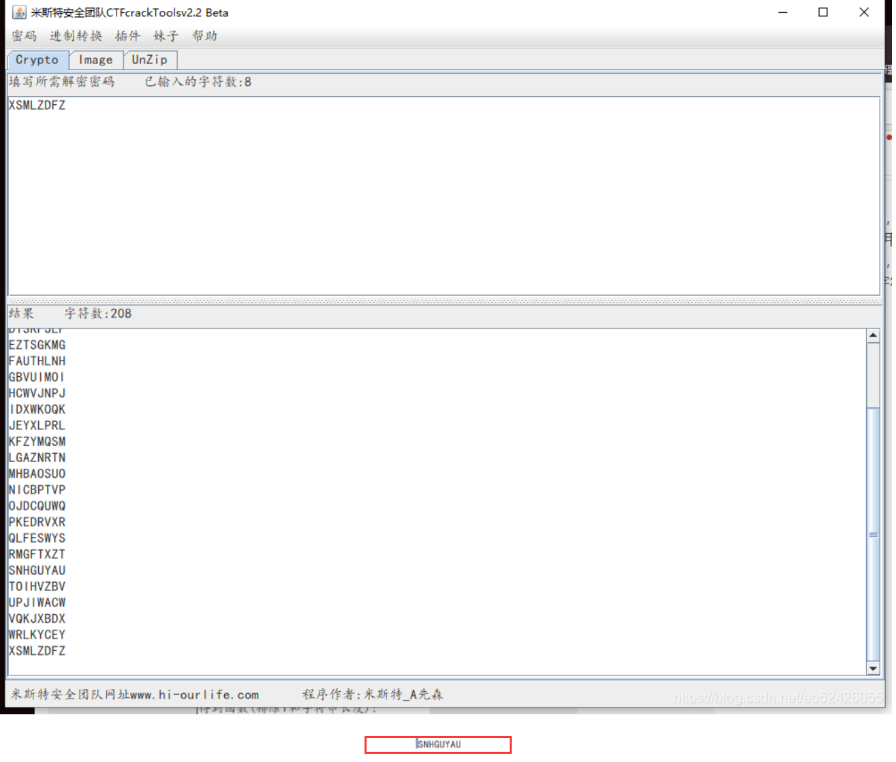

这个比较通顺，即是flag

## 22.[GKCTF2020]小学生的密码学(仿射密码求解，python)

查看题目

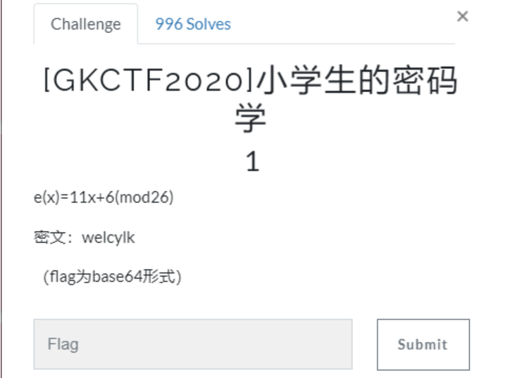

> e(x)=11x+6(mod26)
>  密文：welcylk
>  （flag为base64形式）

## 脚本求解

这种形式的加密手法是**仿射变换**，其加解密分别是

```python
c=Ea,b(m)=am+b (mod 26)
m=Da,b(c)=(c−b)/a (mod 26)
```

所以可以得到a=11,b=6,需要做的工作是根据密文c,密钥a/b求得明文m。这里a−1

计算可以利用Python的gmpy2库中invert函数完成

注意仿射变换26个字母按数字0~25记，因此在需要将密文ASCII对应的数值减去97，解密完恢复成字母即加上97

此外，题目要求最后的flag为base64形式，因此还需借助Python的base64库中b64encode函数。需要注意的是在Python3中，字符都为unicode编码，而b64encode函数的参数为byte类型，所以必须先转码

解题代码如下

```python
from gmpy2 import invert
from base64 import b64encode

c = "welcylk"
a = 11
b = 6
n = 26

in_a = invert(a, n)//求a mod n的逆元
print(in_a)
# in_a = 19

m = []
for i in c:
    modified_c = ord(i)-97
    m.append((modified_c-b)*in_a % 26)
flag = ""
for mi in m:
    flag += chr(mi+97)
print(b64encode(flag.encode()))
```

### 工具求解（CTF-Tools）

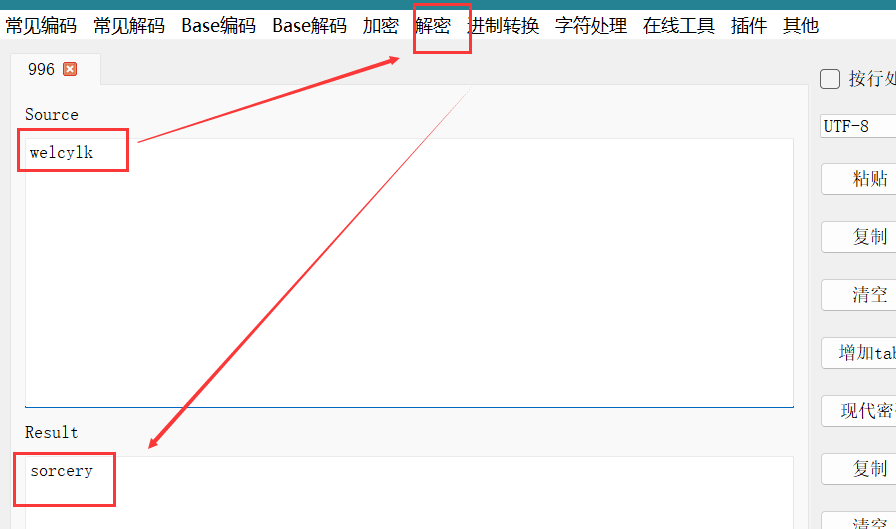

## 23.RSA1（类型：dp+dq+p+q+c = m 已知dp dq泄露）

查看题目
 类型：dp+dq+p+q+c = m 已知dp dq泄露
 使用脚本dp+dq+p+q+c = m

```python
import gmpy2
 
p =8637633767257008567099653486541091171320491509433615447539162437911244175885667806398411790524083553445158113502227745206205327690939504032994699902053229 
q = 12640674973996472769176047937170883420927050821480010581593137135372473880595613737337630629752577346147039284030082593490776630572584959954205336880228469 
dq = 783472263673553449019532580386470672380574033551303889137911760438881683674556098098256795673512201963002175438762767516968043599582527539160811120550041
dp = 6500795702216834621109042351193261530650043841056252930930949663358625016881832840728066026150264693076109354874099841380454881716097778307268116910582929
c = 24722305403887382073567316467649080662631552905960229399079107995602154418176056335800638887527614164073530437657085079676157350205351945222989351316076486573599576041978339872265925062764318536089007310270278526159678937431903862892400747915525118983959970607934142974736675784325993445942031372107342103852
n = p * q
 
I = gmpy2.invert(p, q)                      #I为p(mod q)的逆元，即p*I = 1(mod q)
mp = gmpy2.powmod(c, dp, p)                 #计算mp = c^dp % p
mq = gmpy2.powmod(c, dq, q)                 #计算mq = c^dq % q        
 
m = (mp + (I * (mq - mp)) * p) % n          #明文求解公式
m = hex(m)[2:]                              #转十六进制
print(m+'\r\n')
#6e6f784354467b57333163306d335f37305f4368316e343730776e7d
flag = ''
for i in range(len(m)//2):
    flag += chr(int(m[i*2:(i+1)*2], 16))    #16进制转文本
 
print(flag)
#noxCTF{W31c0m3_70_Ch1n470wn}
```

## 25.凯撒？替换？呵呵!

```
MTHJ{CUBCGXGUGXWREXIPOYAOEYFIGXWRXCHTKHFCOHCFDUCGTXZOHIXOEOWMEHZO}
```

替换加凯撒

拿到quipquip爆破，设置MTHJ=FLAG

## 26.old-fashion

```
Os drnuzearyuwn, y jtkjzoztzoes douwlr oj y ilzwex eq lsdexosa kn pwodw tsozj eq ufyoszlbz yrl rlufydlx pozw douwlrzlbz, ydderxosa ze y rlatfyr jnjzli; mjy gfbmw vla xy wbfnsy symmyew (mjy vrwm qrvvrf), hlbew rd symmyew, mebhsymw rd symmyew, vbomgeyw rd mjy lxrzy, lfk wr dremj. Mjy eyqybzye kyqbhjyew mjy myom xa hyedrevbfn lf bfzyewy wgxwmbmgmbrf. Wr mjy dsln bw f1_2jyf-k3_jg1-vb-vl_l
```

### 分析

标题 old-fashion 翻译为“旧的，不时髦的”，推测该题使用的是一种旧的加密方式。题目的字母分布很像英文语段，但两个分隔符之间的字母又无法组成单词，猜测为单表代换或多表代换。

题目的最后部分“f1_2jyf-k3_jg1-vb-vl_l”包含“-”和"_"，猜测很可能是我们需要的 flag 部分，那么前面的“mjy”可能为“the”、“dsln”可能为“flag”、“bw”可能为“is”，对段中六个字母**同时**进行替换后如下：

```
Ol frguzeareusg, e htkhzoztzoel fousar oh e iazsex eq alfexola kg psofs  tlozh eq ufeolzaiz era raufefax pozs fousarzaiz, efferxola ze e raatfer  hghzai; the gfits vaa xe sifgle lettees (the vrst qrvvrf), haies rf  lettees, teihlets rf lettees, viotgees rf the axrze, afk sr freth. The  eeqeizee keqihhees the teot xa heefrevifg af ifzeese sgxstitgtirf. Sr  the flag is f1_2hef-k3_hg1-vi-va_a
```

可以看出，替换后的语段中已经出现了不少“the”，同时还有重复出现的“sr”和“rf”，猜测“r”替代了原文的“o”。目前基本可以确定语段使用的是单表代换密码。但仅替换回 flag 前的四个单词无法保证最终得到的 flag 是正确的，于是去找了个按词频替换工具对语段进行爆破，得到 flag。爆破后的语段如下：

```
Xl fogkvryoeksg, e hjdhvxvjvxrl fxksao xh e zavsrb rc alfrbxly dg wsxfs  jlxvh rc knexlvaiv eoa oaknefab wxvs fxksaovaiv, effrobxly vr e oayjneo  hghvaz; the units may be single letters (the most common), pairs of  letters, triplets of letters, mixtures of the above, and so forth. The  receiver deciphers the text by performing an inverse substitution. So  the flag is n1_2hen-d3_hu1-mi-ma_a
```

### 或者简单操作：直接工具爆破（CTFCrackTools）

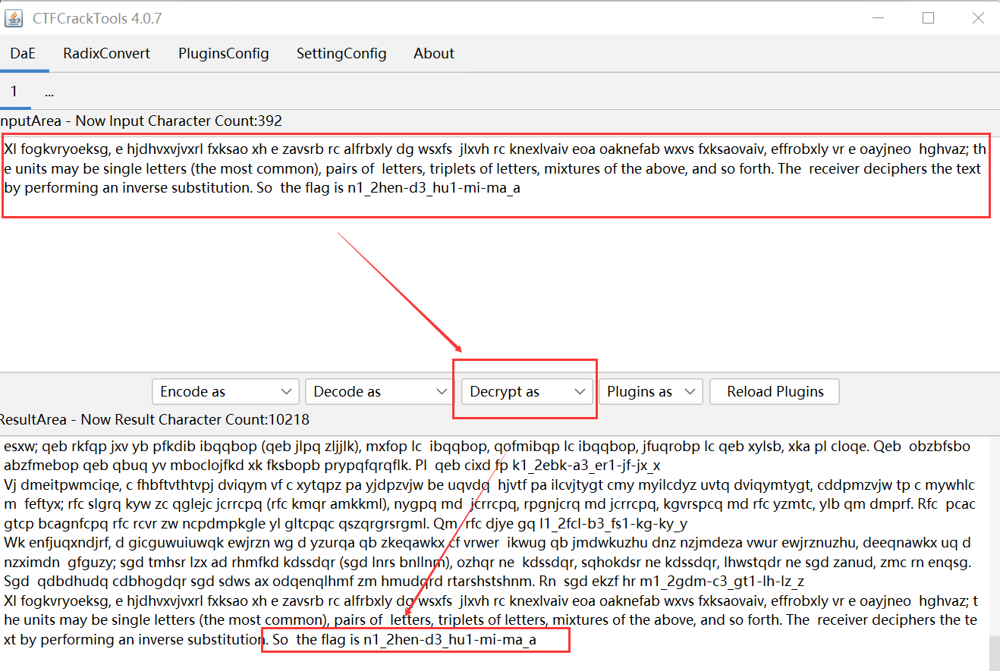

## 27.[BJDCTF 2nd]灵能精通-y1ng

身经百战的Y1ng已经达到崇高的武术境界，以自律克己来取代狂热者的战斗狂怒与传统的战斗形式。Y1ng所受的训练也进一步将他们的灵能强化到足以瓦解周遭的物质世界。借由集中这股力量，Y1ng能释放灵能能量风暴来摧毁敌人的心智、肉体与器械。然后给出一个文件，将后缀改为jpg。

### 思路

在网上找相关的加密，发现是**圣堂武士密码**，然后解密就可以了。

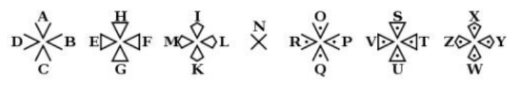

```
imknightstemplar
```

## 30.RSA3（共模n攻击）

查看题目
 类型：共模n攻击

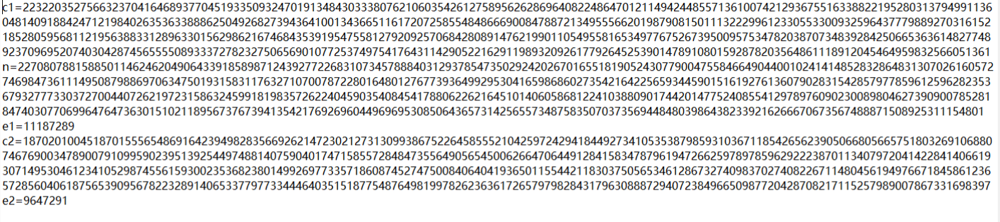

```python
import gmpy2
import  binascii
    
c1=22322035275663237041646893770451933509324701913484303338076210603542612758956262869640822486470121149424485571361007421293675516338822195280313794991136048140918842471219840263536338886250492682739436410013436651161720725855484866690084788721349555662019879081501113222996123305533009325964377798892703161521852805956811219563883312896330156298621674684353919547558127920925706842808914762199011054955816534977675267395009575347820387073483928425066536361482774892370969520740304287456555508933372782327506569010772537497541764311429052216291198932092617792645253901478910801592878203564861118912045464959832566051361
n=22708078815885011462462049064339185898712439277226831073457888403129378547350292420267016551819052430779004755846649044001024141485283286483130702616057274698473611149508798869706347501931583117632710700787228016480127677393649929530416598686027354216422565934459015161927613607902831542857977859612596282353679327773303727004407262197231586324599181983572622404590354084541788062262164510140605868122410388090174420147752408554129789760902300898046273909007852818474030770699647647363015102118956737673941354217692696044969695308506436573142565573487583507037356944848039864382339216266670673567488871508925311154801
e1=11187289
c2=18702010045187015556548691642394982835669262147230212731309938675226458555210425972429418449273410535387985931036711854265623905066805665751803269106880746769003478900791099590239513925449748814075904017471585572848473556490565450062664706449128415834787961947266259789785962922238701134079720414228414066193071495304612341052987455615930023536823801499269773357186087452747500840640419365011554421183037505653461286732740983702740822671148045619497667184586123657285604061875653909567822328914065337797733444640351518775487649819978262363617265797982843179630888729407238496650987720428708217115257989007867331698397
e2=9647291

#扩展欧几里得算法
#return (r,x,y) 其中，r为a和b的最大公约数，xy满足ax + by = 1
r, s1, s2 = gmpy2.gcdext(e1, e2)    #计算s1，s2，涉及到新知识了
m = (gmpy2.powmod(c1,s1,n)*gmpy2.powmod(c2,s2,n)) % n   #计算明文m，涉及到新知识了

m = hex(m)[2:]
print("明文数据为：0x" + m)
flag = binascii.unhexlify(m)#16进制转文本，涉及到新库的引用和新知识了
print(flag)
```

## 31.unencode

```
89FQA9WMD<V1A<V1S83DY.#<W3$Q,2TM]

尝试发现是uuencode编码，直接解码即可
```

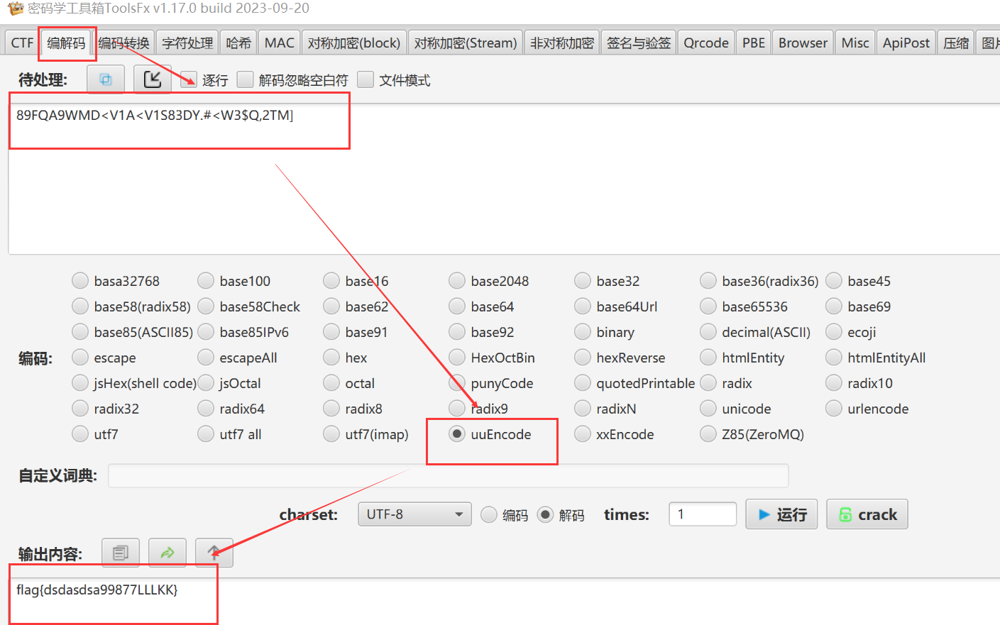

## 33.世上无难事

```
VIZZB IFIUOJBWO NVXAP OBC XZZ UKHVN IFIUOJBWO HB XVIXW XAW VXFI X QIXN VBD KQ IFIUOJBWO WBKAH NBWXO VBD XJBCN NKG QLKEIU DI XUI VIUI DKNV QNCWIANQ XN DXPIMKIZW VKHV QEVBBZ KA XUZKAHNBA FKUHKAKX XAW DI VXFI HBN QNCWIANQ NCAKAH KA MUBG XZZ XEUBQQ XGIUKEX MUBG PKAWIUHXUNIA NVUBCHV 12NV HUXWI XAW DI XUI SCQN QB HZXW NVXN XZZ EBCZW SBKA CQ NBWXO XAW DI DXAN NB NVXAP DXPIMKIZW MBU JIKAH QCEV XA BCNQNXAWKAH VBQN HKFI OBCUQIZFIQ X JKH UBCAW BM XLLZXCQI XAW NVI PIO KQ 640I11012805M211J0XJ24MM02X1IW09
```

quipquip爆破，设置PIO=key

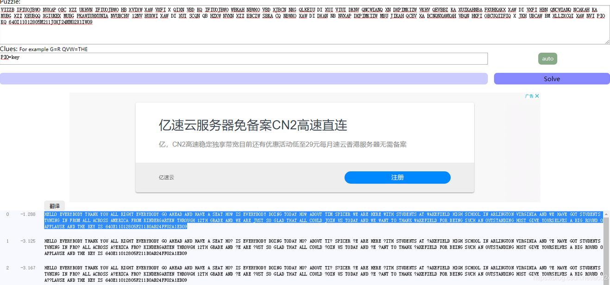

## 34.异性相吸(文件二进制打开，数据异或，二进制转16进制)

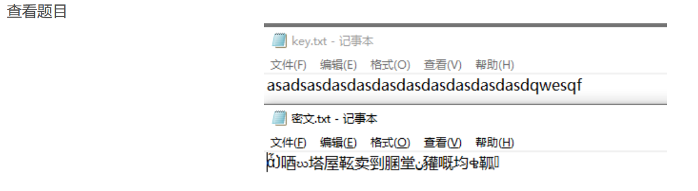

```python
a = '0110000101110011011000010110010001110011011000010111001101100100011000010111001101100100011000010111001101100100011000010111001101100100011000010111001101100100011000010111001101100100011000010111001101100100011000010111001101100100011000010111001101100100011100010111011101100101011100110111000101100110'
b = '0000011100011111000000000000001100001000000001000001001001010101000000110001000001010100010110000100101101011100010110000100101001010110010100110100010001010010000000110100010000000010010110000100011000000110010101000100011100000101010101100100011101010111010001000001001001011101010010100001010000011011'
c = ''

for i in range(len(a)):
    if(a[i] == b[i]):
        c+='0'
    else:
        c+='1'
print(c)

```

运行得到

```
0110011001101100011000010110011101111011011001010110000100110001011000100110001100110000001110010011100000111000001110010011100100110010001100100011011100110110011000100011011101100110001110010011010101100010001101010011010001100001001101110011010000110011001101010110010100111000001110010110010101111101
```

二转十六 

```
666c61677b65613162633039383839393232373662376639356235346137343335653839657d
```

十六转文本

```
flag{ea1bc0988992276b7f95b54a7435e89e}
```

## 35.RSA（n+e+c+p+q= m + 公钥提取）

查看题目
 类型：n+e+c+p+q= m + 公钥提取

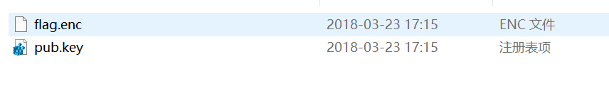

把两个文件后缀都改成txt（我是把第一个文件改成了flagenc.txt）

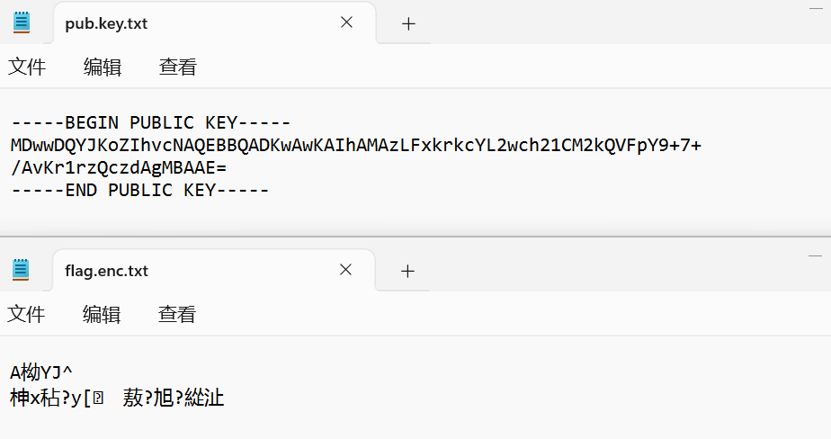

明显pub.txt是一个[公钥解析](http://ctf.ssleye.com/pub_asys.html)

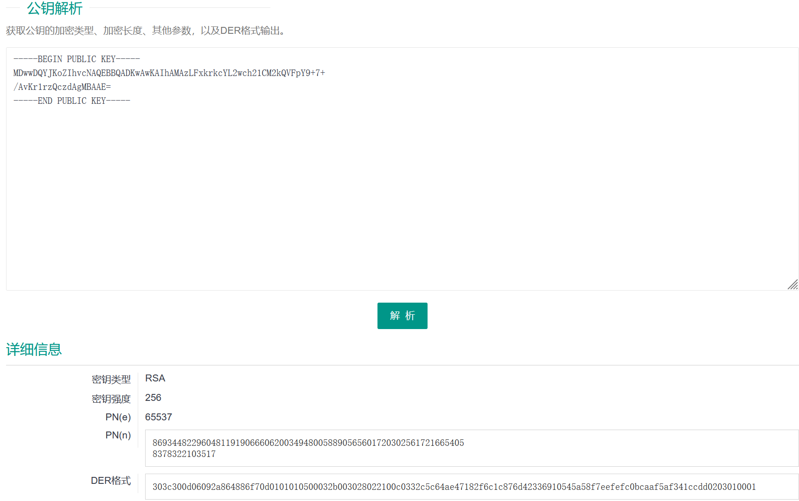

再用[分解N](http://factordb.com/index.php?query=8693448229604811919066606200349480058890565601720302561721665405 8378322103517)

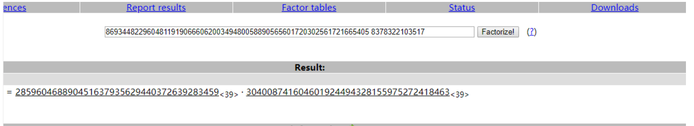

得到q，p

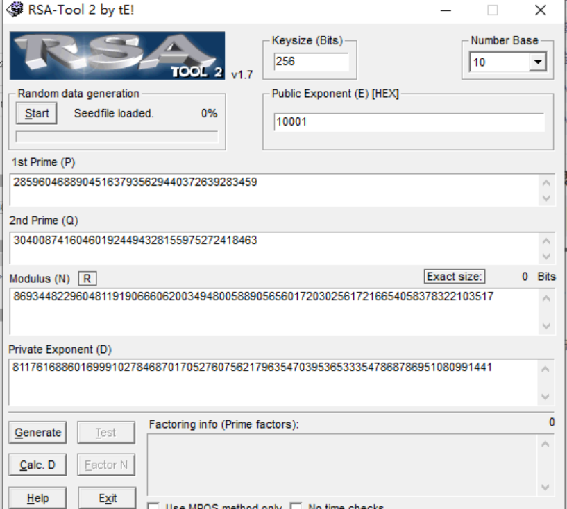

明显q，p是十进制的得到D
 写脚本

```python
import rsa

e= 65537
n= 86934482296048119190666062003494800588905656017203025617216654058378322103517
p= 285960468890451637935629440372639283459
q= 304008741604601924494328155975272418463
d= 81176168860169991027846870170527607562179635470395365333547868786951080991441

key = rsa.PrivateKey(n,e,d,q,p)         #在pkcs标准中,pkcs#1规定,私钥包含(n,e,d,p,q)

with open("D:\\...\\flag.enc.txt","rb") as f:  #以二进制读模式，读取密文
    f = f.read()
    print(rsa.decrypt(f,key))           # f:公钥加密结果  key:私钥

```

运行就可以得到flag

## 36.还原大师(MD5缺失位爆破)

查看题目

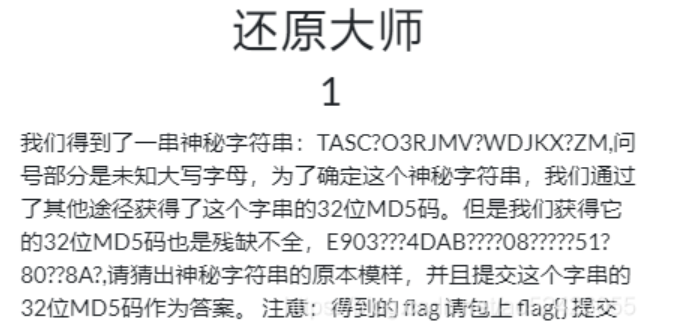

```python
#爆破脚本MD5_bomb.py
# -*- coding: utf-8 -*-
#!/usr/bin/env python
import hashlib

#print hashlib.md5(s).hexdigest().upper()
k = 'TASC?O3RJMV?WDJKX?ZM'                    #要还原的明文
for i in range(26):
	temp1 = k.replace('?',str(chr(65+i)),1)
	for j in range(26):
		temp2 = temp1.replace('?',chr(65+j),1)
		for n in range(26):
			temp3 = temp2.replace('?',chr(65+n),1)
			s = hashlib.md5(temp3.encode('utf8')).hexdigest().upper()#注意大小写
			if s[:4] == 'E903':    #检查元素
				print (s)       #输出密文
#E9032994DABAC08080091151380478A2
```

## 37.[GKCTF2020]汉字的秘密(当铺密码(PawnShop Cipher))

下载后得到word，查看得到这些字符

```php
王壮 夫工 王中 王夫 由由井 井人 夫中 夫夫 井王 土土 夫由 土夫 井中 士夫 王工 王人 土由 由口夫
```

很明显是当铺密码(当铺密码：汉字有多少笔画出头，就是转化成数字几。)
 上脚本

```python
#pwnshop(当铺密码).py
dh = '田口由中人工大土士王夫井羊壮'
ds = '00123455567899'

cip = '王壮 夫工 王中 王夫 由由井 井人 夫中 夫夫 井王 土土 夫由 土夫 井中 士夫 王工 王人 土由 由口夫'
s = ''
for i in cip:
	if i in dh:
		s += ds[dh.index(i)]
	else:
		s += ' '
#print(s)

ll = s.split(" ")
t = ''
for i in range(0,len(ll)):
	t += chr(int(ll[i])+i+1)
print('t=', t, '\t\tt.lower()=', t.lower())
```

## 38.robomunication（音频记录，(morse)摩斯密码）

查看题目


一个音频文件，直接就是用Audacity听
 发现是摩斯密码，听完整理一下就是

```
.点是句号打出来的
/是表示声音间隙（有的用空格表示的）
-是中文字符的下划线
...././.-../.-../---/.--/..../.-/-/../.../-/...././-.-/./-.--/..-/../.../-.../---/---/.--./-.../././.--.

空格表示声音间隙时
.... . .-.. .-.. --- .-- .... .- - .. ... - .... . -.- . -.-- ..- .. ... -... --- --- .--. -... . . .--.

在工具箱下面其实有可以自定义字符来表示高低音（或长短音）
```

之后，放到工具箱解密即可

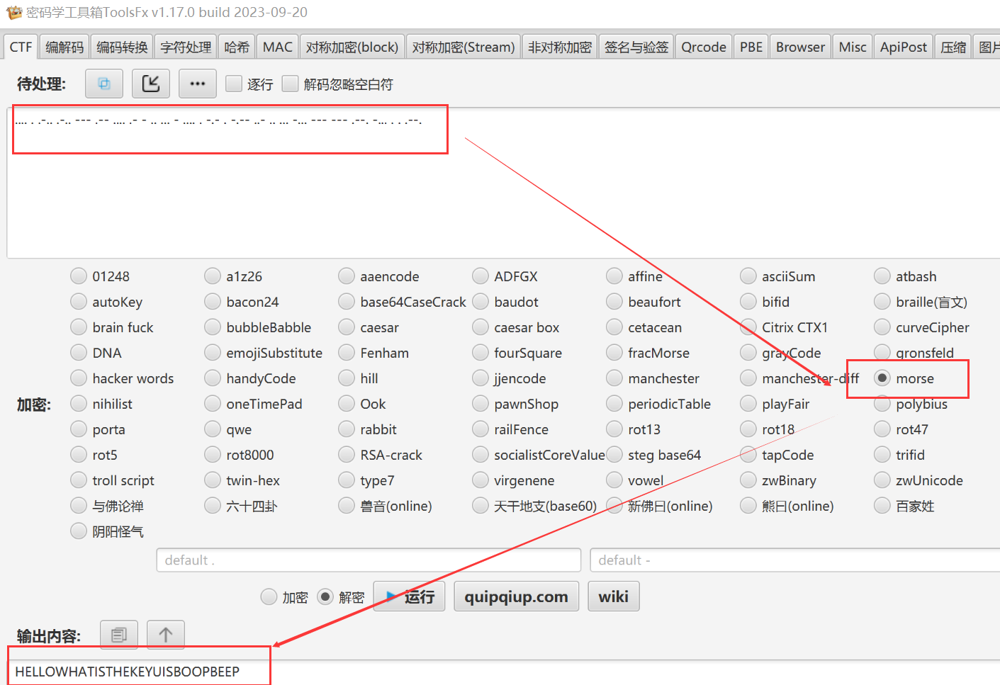

## 39.RSAroll（n+e+c+p+q= m + n分解）

查看题目
 类型：n+e+c+p+q= m + n分解

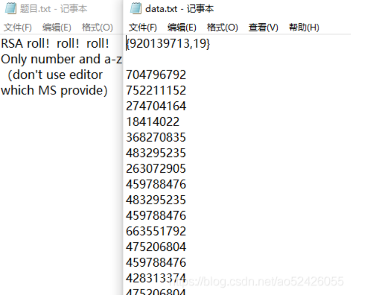

分解质因数，分解920139713


然后直接上代码

```python
import gmpy2
N,p,q,e=920139713,18443,49891,19
d=gmpy2.invert(e,(p-1)*(q-1))
result=[]

with open("D:\\pycharm\\venv\\mima\\RSAroll.txt","r") as f:
    for line in f.readlines():
        line=line.strip('\n')#去掉列表中每一个元素的换行符
        result.append(chr(pow(int(line),d,N)))

for i in result:
    print(i,end='')
```

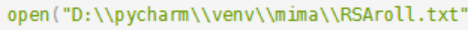

这个是重新创的一个txt文本把

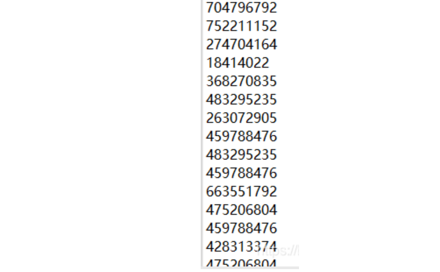

这些要分解的放在里面
 脚本跑起来即可得到flag

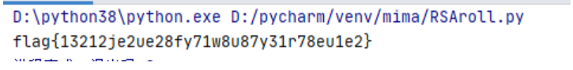

## 40.Dangerous RSA(低加密指数攻击 e很小 n很大又不好分解)

查看题目
 类型：低加密指数攻击 e很小 n很大又不好分解
 脚本：RSA各题型脚本\e=2-低加密指数攻击\低加密指数攻击.py

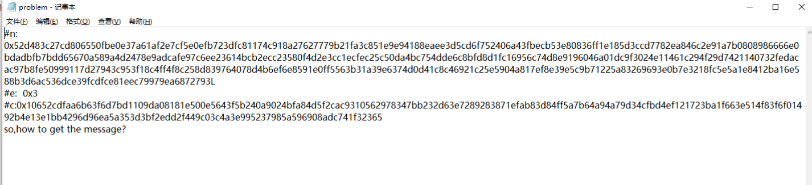

低加密指数攻击：
 所谓低加密指数指的就是e非常小的情况下，通常为3。
 这种题目通常有两种类型，一种直接爆破，另外一种是低指数广播攻击。

先介绍比较简单的情况。假设e=3, e很小，但是n很大。
 回顾RSA加密公式： C=M^e % n (C密文，M明文)

```python
'''
当M^e < n 时，
 C = M^e ，所以对C开方就能得到M
'''
from gmpy2 import iroot
import libnum
n = 0x52d483c27cd806550fbe0e37a61af2e7cf5e0efb723dfc81174c918a27627779b21fa3c851e9e94188eaee3d5cd6f752406a43fbecb53e80836ff1e185d3ccd7782ea846c2e91a7b0808986666e0bdadbfb7bdd65670a589a4d2478e9adcafe97c6ee23614bcb2ecc23580f4d2e3cc1ecfec25c50da4bc754dde6c8bfd8d1fc16956c74d8e9196046a01dc9f3024e11461c294f29d7421140732fedacac97b8fe50999117d27943c953f18c4ff4f8c258d839764078d4b6ef6e8591e0ff5563b31a39e6374d0d41c8c46921c25e5904a817ef8e39e5c9b71225a83269693e0b7e3218fc5e5a1e8412ba16e588b3d6ac536dce39fcdfce81eec79979ea6872793

c = 0x10652cdfaa6b63f6d7bd1109da08181e500e5643f5b240a9024bfa84d5f2cac9310562978347bb232d63e7289283871efab83d84ff5a7b64a94a79d34cfbd4ef121723ba1f663e514f83f6f01492b4e13e1bb4296d96ea5a353d3bf2edd2f449c03c4a3e995237985a596908adc741f32365

k = 0
while 1:
    res=iroot(c+k*n,3)
    if(res[1]==True):
        print(libnum.n2s(int(res[0])))
        break
    k=k+1


'''

第二种写法
当M^e ＞ n 时，此时用爆破的方法
 假设我们　 Ｍ^e / n 商 k 余数为c，
 所以Ｍ^e  = k*n + C，对K进行爆破，只要k满足 k*n + C能够开方就可以
'''
'''
import gmpy2 
from libnum import*
n = 0x52d483c27cd806550fbe0e37a61af2e7cf5e0efb723dfc81174c918a27627779b21fa3c851e9e94188eaee3d5cd6f752406a43fbecb53e80836ff1e185d3ccd7782ea846c2e91a7b0808986666e0bdadbfb7bdd65670a589a4d2478e9adcafe97c6ee23614bcb2ecc23580f4d2e3cc1ecfec25c50da4bc754dde6c8bfd8d1fc16956c74d8e9196046a01dc9f3024e11461c294f29d7421140732fedacac97b8fe50999117d27943c953f18c4ff4f8c258d839764078d4b6ef6e8591e0ff5563b31a39e6374d0d41c8c46921c25e5904a817ef8e39e5c9b71225a83269693e0b7e3218fc5e5a1e8412ba16e588b3d6ac536dce39fcdfce81eec79979ea6872793
c = 0x10652cdfaa6b63f6d7bd1109da08181e500e5643f5b240a9024bfa84d5f2cac9310562978347bb232d63e7289283871efab83d84ff5a7b64a94a79d34cfbd4ef121723ba1f663e514f83f6f01492b4e13e1bb4296d96ea5a353d3bf2edd2f449c03c4a3e995237985a596908adc741f32365

i = 0
while 1:
    if(gmpy2.iroot(c+i*n,3)[1]==1):     #开根号
        print(gmpy2.iroot(c+i*n,3))
        break
    i=i+1

'''
```

运行得到flag

## 42.Cipher(公平的玩吧（playfair加密）)

```
公平的玩吧的英文：play fair
Dncnoqqfliqrpgeklwmppu
```

根据题目提示，这是playfair解密，是一种替换密码
首先编制密码表：
编一个55的密码表，共有5行5列字母。第一列（或第一行）是密钥,其余按照字母顺序，如果密钥过长可占用第二列或行。
密钥 是一个单词或词组，若有重复字母，可将后面重复的字母去掉。当然也要把使用频率最少的字母去掉（它依据一个55的正方形组成的密码表来编写，密码表里排列有25个字母。如果一种语言字母超过25个，可以去掉使用频率最少的一个。如，法语一般去掉w或k，德语则是把i和j合起来当成一个字母看待，英语中z使用最少，可以去掉它）。
密钥是playfair，去掉重复的后为playfir
密码表为
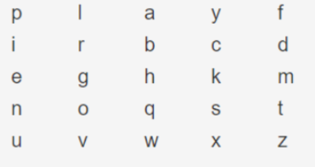

```python
整理明文/密文
整理明文/密文，将明文/密文每两个字母组成一对。如果成对后有两个相同字母紧挨或最后一个字母是单个的，就插入一个字母X（或者Q）。
密文：Dncnoqqfliqrpgeklwmppu
Dn cn oq qf li qr pg ek lw mp pu
解密规则
这里设c1 c2为两个紧凑的字母
(1)若c1 c2在同一行，对应明文p1 p2分别是紧靠c1 c2 左端的字母。其中最后一列被看做是第一列的左方。
(2)若c1 c2在同一列，对应明文p1 p2分别是紧靠c1 c2 上方的字母。其中最后一行被看做是第一行的上方。
(3)若c1 c2不在同一行，不在同一列，则p1 p2是由c1 c2确定的矩形的其他两角的字母。

所以得到：

密文 ：Dn cn oq qf li qr pg ek lw mp pu
明文： it is no ta pr ob le mh av ef un
```

得到flag{itisnotaproblemhavefun}

## 43.[AFCTF2018]Morse

查看题目
 很明显的一个摩斯密码，[摩斯密码在线解密](http://moersima.00cha.net/)。

```
-..../.----/-..../-..../-..../...--/--.../....-/-..../-..../--.../-.../...--/.----/--.../...--/..---/--.../--.../....-/...../..-./--.../...--/...--/-----/...../..-./...--/...--/...--/....-/...--/...../--.../----./--.../-..
morse解码得到：
61666374667B317327745F73305F333435797D

16进制转文本：
afctf{1s't_s0_345y}
```

## 44.[HDCTF2019]basic rsa(n+e+c+p+q= m型)

下载得到一个py

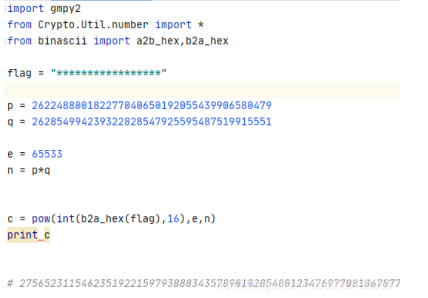

类型：n+e+c+p+q= m
 注释中就是该脚本生成的c
 使用脚本RSA各题型脚本\n+e+c+p+q= m
 直接套用脚本

```python
import random
from binascii import a2b_hex,b2a_hex
p = 262248800182277040650192055439906580479
q = 262854994239322828547925595487519915551
n = p * q
def multiplicative_inversr(a,b):
    x = 0
    y = 1
    lx = 1
    ly = 0
    oa = a
    ob = b
    while b != 0:
        q = a // b
        (a, b) = (b, a % b)
        (x, lx) = ((lx - (q * x)), x)
        (y, ly) = ((ly - (q * y)), y)
    if lx < 0:
        lx += ob
    if ly < 0:
        ly += oa
    return lx
def gcd(a,b):
    while b != 0:
        a, b = b, a % b
    return a
def generate_keypair(p,q):
    n = p * q
    phi = (p - 1) * (q -1)
    e = 65533
    g = gcd(e, phi)
    while g != 1:
        e = random.randrange(1, phi)
        g = gcd(e, phi)
    d = multiplicative_inversr(e, phi)
    return ((e,n),(d,n))
def encrypt(pk, plaintext):
    key, n = pk[0]
    print(b2a_hex(plaintext.encode()))
    cipher = pow(int(b2a_hex(plaintext.encode()),16), key , n)
    return cipher
def decrypt(pk, cipher):
    key, n = pk[1]
    cipher = pow(cipher, key ,n)
    cipher = a2b_hex(hex(cipher).split('0x')[1])
    return cipher
pk = generate_keypair(p,q)
cipher = 27565231154623519221597938803435789010285480123476977081867877272451638645710
plaintext = decrypt(pk, cipher)
print(plaintext)
```

## 45.达芬奇密码

查看题目
 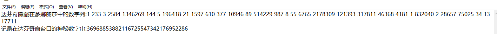

当时第一想法这都什么东西。果断google，找到大佬的wp，发现在电影简介中会提到——斐波那契数列。

```
达芬奇隐藏在蒙娜丽莎中的数字列:1 233 3 2584 1346269 144 5 196418 21 1597 610 377 10946 89 514229 987 8 55 6765 2178309 121393 317811 46368 4181 1 832040 2 28657 75025 34 13 17711 
记录在达芬奇窗台口的神秘数字串:36968853882116725547342176952286
```

对比蒙娜丽莎中的数字列，发现数值一样，但是进行了位移。

之后对比，题目中给到的两个数列的长度都是32，并且flag也是32位，可以推测，神秘数列是通过flag位移后得出的，而位移的规则是斐波那契数列的位移。

```
1 1 2 3 5 8 13 21 34 55 89 144 233 377 610 987 1597 2584 4181 6765 10946 17711 28657 46368 75025 121393 196418 317811 514229 832040 1346269 2178309

1 233 3 2584 1346269 144 5 196418 21 1597 610 377 10946 89 514229 987 8 55 6765 2178309 121393 317811 46368 4181 1 832040 2 28657 75025 34 13 17711

36968853882116725547342176952286
```

第零位1还是1，没有位移。

第一位233是斐波那契数列的第十二位（以0开始算），因此下面神秘数字串的第一位的6是原本flag的第十二位。

第二位3是斐波那契数列的第三位，因此下面神秘数字串的第二位的9是原本flag的第三位。

```python
#主要思路是遍历fakefibbo，然后找出对应哪一位，如fb中第二个数对应rb中第五个
#然后cipher对应fakebibbo,因此cipher中第二个数对应flag第五个数
#因此有reslut[4]=cipher[1],依次类推
realfibbo = '1 1 2 3 5 8 13 21 34 55 89 144 233 377 610 987 1597 2584 4181 6765 10946 17711 28657 46368 75025 121393 196418 317811 514229 832040 1346269 2178309'
fakefibbo = '1 233 3 2584 1346269 144 5 196418 21 1597 610 377 10946 89 514229 987 8 55 6765 2178309 121393 317811 46368 4181 1 832040 2 28657 75025 34 13 17711'
cipher = '36968853882116725547342176952286'
realfibbo = realfibbo.split(' ')
fakefibbo = fakefibbo.split(' ')
result = ['a']*32
for i in range(len(cipher)):
#这里要考虑到第二个1(fb[24])寻找的时候，会找到1123中第一个数，也就是index=0，而我们希望他找到第二个数，也就是index=1
    if(i == 24):
        index = 1
    else:
        index = realfibbo.index(fakefibbo[i])
    result[index] = cipher[i]
for i in result:
    print(i,end='')
```

## 46.ras2(给N,e求d,使用RSAwienerHacker)

查看题目

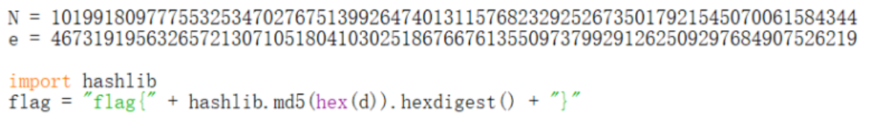

求d 这里要将破解脚本(rsa2.py)和RSAwienerHacker.py的py文件放在同一个目录下

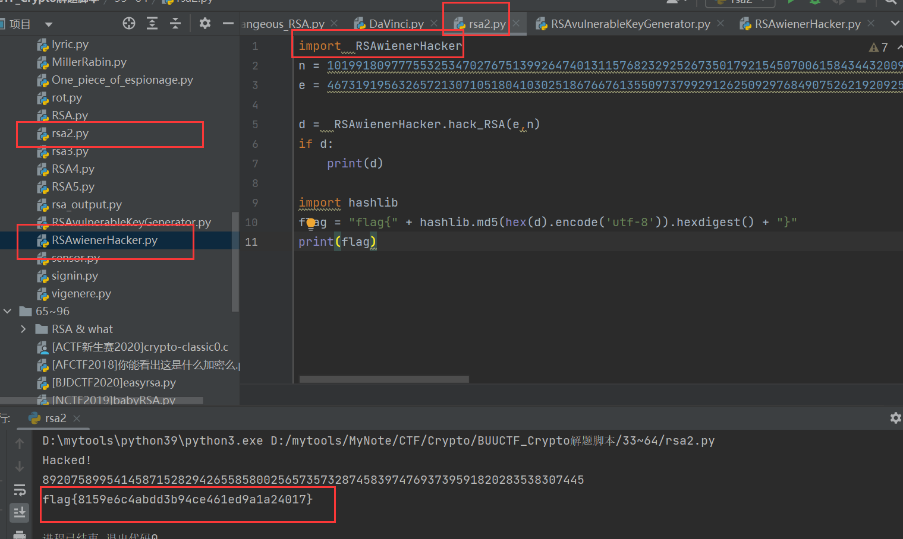

```python
#rsa2.py
import  RSAwienerHacker
n = 101991809777553253470276751399264740131157682329252673501792154507006158434432009141995367241962525705950046253400188884658262496534706438791515071885860897552736656899566915731297225817250639873643376310103992170646906557242832893914902053581087502512787303322747780420210884852166586717636559058152544979471
e = 46731919563265721307105180410302518676676135509737992912625092976849075262192092549323082367518264378630543338219025744820916471913696072050291990620486581719410354385121760761374229374847695148230596005409978383369740305816082770283909611956355972181848077519920922059268376958811713365106925235218265173085

d =  RSAwienerHacker.hack_RSA(e,n)
if d:
    print(d)

import hashlib
flag = "flag{" + hashlib.md5(hex(d).encode('utf-8')).hexdigest() + "}"
print(flag)
```

## 47.[BJDCTF 2nd]rsa0(p,q,e,c求m型)

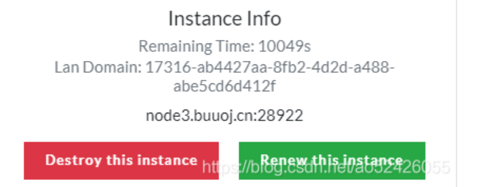

这个很明显需要nc一下
 打开kali

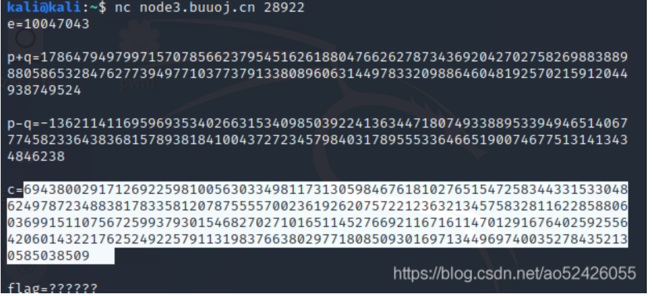

这个直接写一个简单python的脚本就好了

```python
import gmpy2

a = 17864794979971570785662379545162618804766262787343692042702758269883889880586532847627739497710377379133808960631449783320988646048192570215912044938749524
b = -13621141169596935340266315340985039224136344718074933889533949465140677745823364383681578938184100437272345798403178955533646651900746775131413434846238
p = (a+b)//2
q = (a-b)//2

e = 10047043
c = 69438002917126922598100563033498117313059846761810276515472583443315330486249787234883817833581207875555700236192620757221236321345758328116228588060369915110756725993793015468270271016511452766921167161147012916764025925564206014322176252492257911319837663802977180850930169713449697400352784352130585038509
n = p*q
phi = (p-1)*(q-1)

d = gmpy2.invert(e,phi)
m = pow(c,d,n)

print(m)
print(hex(m))
print(bytes.fromhex(hex(m)[2:]))
```

## 48.[GXYCTF2019]CheckIn（base64+Rot47）

```
dikqTCpfRjA8fUBIMD5GNDkwMjNARkUwI0BFTg==
看到标志性==号，先base64一下
v)*L*_F0<}@H0>F49023@FE0#@EN
然后Rot47解密一下
```

## 49.RSA5（多个n和c,对用同一个未知明文m,求m(先n公约求p(或者说q),再n,p求q,再求d，再求明文m)）

看题目

```python
m = xxxxxxxx
e = 65537
========== n c ==========
n = 20474918894051778533305262345601880928088284471121823754049725354072477155873778848055073843345820697886641086842612486541250183965966001591342031562953561793332341641334302847996108417466360688139866505179689516589305636902137210185624650854906780037204412206309949199080005576922775773722438863762117750429327585792093447423980002401200613302943834212820909269713876683465817369158585822294675056978970612202885426436071950214538262921077409076160417436699836138801162621314845608796870206834704116707763169847387223307828908570944984416973019427529790029089766264949078038669523465243837675263858062854739083634207
c = 974463908243330865728978769213595400782053398596897741316275722596415018912929508637393850919224969271766388710025195039896961956062895570062146947736340342927974992616678893372744261954172873490878805483241196345881721164078651156067119957816422768524442025688079462656755605982104174001635345874022133045402344010045961111720151990412034477755851802769069309069018738541854130183692204758761427121279982002993939745343695671900015296790637464880337375511536424796890996526681200633086841036320395847725935744757993013352804650575068136129295591306569213300156333650910795946800820067494143364885842896291126137320

n = 20918819960648891349438263046954902210959146407860980742165930253781318759285692492511475263234242002509419079545644051755251311392635763412553499744506421566074721268822337321637265942226790343839856182100575539845358877493718334237585821263388181126545189723429262149630651289446553402190531135520836104217160268349688525168375213462570213612845898989694324269410202496871688649978370284661017399056903931840656757330859626183773396574056413017367606446540199973155630466239453637232936904063706551160650295031273385619470740593510267285957905801566362502262757750629162937373721291789527659531499435235261620309759
c = 15819636201971185538694880505120469332582151856714070824521803121848292387556864177196229718923770810072104155432038682511434979353089791861087415144087855679134383396897817458726543883093567600325204596156649305930352575274039425470836355002691145864435755333821133969266951545158052745938252574301327696822347115053614052423028835532509220641378760800693351542633860702225772638930501021571415907348128269681224178300248272689705308911282208685459668200507057183420662959113956077584781737983254788703048275698921427029884282557468334399677849962342196140864403989162117738206246183665814938783122909930082802031855

n = 25033254625906757272369609119214202033162128625171246436639570615263949157363273213121556825878737923265290579551873824374870957467163989542063489416636713654642486717219231225074115269684119428086352535471683359486248203644461465935500517901513233739152882943010177276545128308412934555830087776128355125932914846459470221102007666912211992310538890654396487111705385730502843589727289829692152177134753098649781412247065660637826282055169991824099110916576856188876975621376606634258927784025787142263367152947108720757222446686415627479703666031871635656314282727051189190889008763055811680040315277078928068816491
c = 4185308529416874005831230781014092407198451385955677399668501833902623478395669279404883990725184332709152443372583701076198786635291739356770857286702107156730020004358955622511061410661058982622055199736820808203841446796305284394651714430918690389486920560834672316158146453183789412140939029029324756035358081754426645160033262924330248675216108270980157049705488620263485129480952814764002865280019185127662449318324279383277766416258142275143923532168798413011028271543085249029048997452212503111742302302065401051458066585395360468447460658672952851643547193822775218387853623453638025492389122204507555908862

n = 21206968097314131007183427944486801953583151151443627943113736996776787181111063957960698092696800555044199156765677935373149598221184792286812213294617749834607696302116136745662816658117055427803315230042700695125718401646810484873064775005221089174056824724922160855810527236751389605017579545235876864998419873065217294820244730785120525126565815560229001887622837549118168081685183371092395128598125004730268910276024806808565802081366898904032509920453785997056150497645234925528883879419642189109649009132381586673390027614766605038951015853086721168018787523459264932165046816881682774229243688581614306480751
c = 4521038011044758441891128468467233088493885750850588985708519911154778090597136126150289041893454126674468141393472662337350361712212694867311622970440707727941113263832357173141775855227973742571088974593476302084111770625764222838366277559560887042948859892138551472680654517814916609279748365580610712259856677740518477086531592233107175470068291903607505799432931989663707477017904611426213770238397005743730386080031955694158466558475599751940245039167629126576784024482348452868313417471542956778285567779435940267140679906686531862467627238401003459101637191297209422470388121802536569761414457618258343550613

n = 22822039733049388110936778173014765663663303811791283234361230649775805923902173438553927805407463106104699773994158375704033093471761387799852168337898526980521753614307899669015931387819927421875316304591521901592823814417756447695701045846773508629371397013053684553042185725059996791532391626429712416994990889693732805181947970071429309599614973772736556299404246424791660679253884940021728846906344198854779191951739719342908761330661910477119933428550774242910420952496929605686154799487839923424336353747442153571678064520763149793294360787821751703543288696726923909670396821551053048035619499706391118145067
c = 15406498580761780108625891878008526815145372096234083936681442225155097299264808624358826686906535594853622687379268969468433072388149786607395396424104318820879443743112358706546753935215756078345959375299650718555759698887852318017597503074317356745122514481807843745626429797861463012940172797612589031686718185390345389295851075279278516147076602270178540690147808314172798987497259330037810328523464851895621851859027823681655934104713689539848047163088666896473665500158179046196538210778897730209572708430067658411755959866033531700460551556380993982706171848970460224304996455600503982223448904878212849412357

n = 21574139855341432908474064784318462018475296809327285532337706940126942575349507668289214078026102682252713757703081553093108823214063791518482289846780197329821139507974763780260290309600884920811959842925540583967085670848765317877441480914852329276375776405689784571404635852204097622600656222714808541872252335877037561388406257181715278766652824786376262249274960467193961956690974853679795249158751078422296580367506219719738762159965958877806187461070689071290948181949561254144310776943334859775121650186245846031720507944987838489723127897223416802436021278671237227993686791944711422345000479751187704426369
c = 20366856150710305124583065375297661819795242238376485264951185336996083744604593418983336285185491197426018595031444652123288461491879021096028203694136683203441692987069563513026001861435722117985559909692670907347563594578265880806540396777223906955491026286843168637367593400342814725694366078337030937104035993569672959361347287894143027186846856772983058328919716702982222142848848117768499996617588305301483085428547267337070998767412540225911508196842253134355901263861121500650240296746702967594224401650220168780537141654489215019142122284308116284129004257364769474080721001708734051264841350424152506027932

n = 25360227412666612490102161131174584819240931803196448481224305250583841439581008528535930814167338381983764991296575637231916547647970573758269411168219302370541684789125112505021148506809643081950237623703181025696585998044695691322012183660424636496897073045557400768745943787342548267386564625462143150176113656264450210023925571945961405709276631990731602198104287528528055650050486159837612279600415259486306154947514005408907590083747758953115486124865486720633820559135063440942528031402951958557630833503775112010715604278114325528993771081233535247118481765852273252404963430792898948219539473312462979849137
c = 19892772524651452341027595619482734356243435671592398172680379981502759695784087900669089919987705675899945658648623800090272599154590123082189645021800958076861518397325439521139995652026377132368232502108620033400051346127757698623886142621793423225749240286511666556091787851683978017506983310073524398287279737680091787333547538239920607761080988243639547570818363788673249582783015475682109984715293163137324439862838574460108793714172603672477766831356411304446881998674779501188163600664488032943639694828698984739492200699684462748922883550002652913518229322945040819064133350314536378694523704793396169065179

n = 22726855244632356029159691753451822163331519237547639938779517751496498713174588935566576167329576494790219360727877166074136496129927296296996970048082870488804456564986667129388136556137013346228118981936899510687589585286517151323048293150257036847475424044378109168179412287889340596394755257704938006162677656581509375471102546261355748251869048003600520034656264521931808651038524134185732929570384705918563982065684145766427962502261522481994191989820110575981906998431553107525542001187655703534683231777988419268338249547641335718393312295800044734534761692799403469497954062897856299031257454735945867491191
c = 6040119795175856407541082360023532204614723858688636724822712717572759793960246341800308149739809871234313049629732934797569781053000686185666374833978403290525072598774001731350244744590772795701065129561898116576499984185920661271123665356132719193665474235596884239108030605882777868856122378222681140570519180321286976947154042272622411303981011302586225630859892731724640574658125478287115198406253847367979883768000812605395482952698689604477719478947595442185921480652637868335673233200662100621025061500895729605305665864693122952557361871523165300206070325660353095592778037767395360329231331322823610060006

n = 23297333791443053297363000786835336095252290818461950054542658327484507406594632785712767459958917943095522594228205423428207345128899745800927319147257669773812669542782839237744305180098276578841929496345963997512244219376701787616046235397139381894837435562662591060768476997333538748065294033141610502252325292801816812268934171361934399951548627267791401089703937389012586581080223313060159456238857080740699528666411303029934807011214953984169785844714159627792016926490955282697877141614638806397689306795328344778478692084754216753425842557818899467945102646776342655167655384224860504086083147841252232760941
c = 5418120301208378713115889465579964257871814114515046096090960159737859076829258516920361577853903925954198406843757303687557848302302200229295916902430205737843601806700738234756698575708612424928480440868739120075888681672062206529156566421276611107802917418993625029690627196813830326369874249777619239603300605876865967515719079797115910578653562787899019310139945904958024882417833736304894765433489476234575356755275147256577387022873348906900149634940747104513850154118106991137072643308620284663108283052245750945228995387803432128842152251549292698947407663643895853432650029352092018372834457054271102816934

n = 28873667904715682722987234293493200306976947898711255064125115933666968678742598858722431426218914462903521596341771131695619382266194233561677824357379805303885993804266436810606263022097900266975250431575654686915049693091467864820512767070713267708993899899011156106766178906700336111712803362113039613548672937053397875663144794018087017731949087794894903737682383916173267421403408140967713071026001874733487295007501068871044649170615709891451856792232315526696220161842742664778581287321318748202431466508948902745314372299799561625186955234673012098210919745879882268512656931714326782335211089576897310591491
c = 9919880463786836684987957979091527477471444996392375244075527841865509160181666543016317634963512437510324198702416322841377489417029572388474450075801462996825244657530286107428186354172836716502817609070590929769261932324275353289939302536440310628698349244872064005700644520223727670950787924296004296883032978941200883362653993351638545860207179022472492671256630427228461852668118035317021428675954874947015197745916918197725121122236369382741533983023462255913924692806249387449016629865823316402366017657844166919846683497851842388058283856219900535567427103603869955066193425501385255322097901531402103883869

n = 22324685947539653722499932469409607533065419157347813961958075689047690465266404384199483683908594787312445528159635527833904475801890381455653807265501217328757871352731293000303438205315816792663917579066674842307743845261771032363928568844669895768092515658328756229245837025261744260614860746997931503548788509983868038349720225305730985576293675269073709022350700836510054067641753713212999954307022524495885583361707378513742162566339010134354907863733205921845038918224463903789841881400814074587261720283879760122070901466517118265422863420376921536734845502100251460872499122236686832189549698020737176683019
c = 1491527050203294989882829248560395184804977277747126143103957219164624187528441047837351263580440686474767380464005540264627910126483129930668344095814547592115061057843470131498075060420395111008619027199037019925701236660166563068245683975787762804359520164701691690916482591026138582705558246869496162759780878437137960823000043988227303003876410503121370163303711603359430764539337597866862508451528158285103251810058741879687875218384160282506172706613359477657215420734816049393339593755489218588796607060261897905233453268671411610631047340459487937479511933450369462213795738933019001471803157607791738538467

n = 27646746423759020111007828653264027999257847645666129907789026054594393648800236117046769112762641778865620892443423100189619327585811384883515424918752749559627553637785037359639801125213256163008431942593727931931898199727552768626775618479833029101249692573716030706695702510982283555740851047022672485743432464647772882314215176114732257497240284164016914018689044557218920300262234652840632406067273375269301008409860193180822366735877288205783314326102263756503786736122321348320031950012144905869556204017430593656052867939493633163499580242224763404338807022510136217187779084917996171602737036564991036724299
c = 21991524128957260536043771284854920393105808126700128222125856775506885721971193109361315961129190814674647136464887087893990660894961612838205086401018885457667488911898654270235561980111174603323721280911197488286585269356849579263043456316319476495888696219344219866516861187654180509247881251251278919346267129904739277386289240394384575124331135655943513831009934023397457082184699737734388823763306805326430395849935770213817533387235486307008892410920611669932693018165569417445885810825749609388627231235840912644654685819620931663346297596334834498661789016450371769203650109994771872404185770230172934013971

n = 20545487405816928731738988374475012686827933709789784391855706835136270270933401203019329136937650878386117187776530639342572123237188053978622697282521473917978282830432161153221216194169879669541998840691383025487220850872075436064308499924958517979727954402965612196081404341651517326364041519250125036424822634354268773895465698920883439222996581226358595873993976604699830613932320720554130011671297944433515047180565484495191003887599891289037982010216357831078328159028953222056918189365840711588671093333013117454034313622855082795813122338562446223041211192277089225078324682108033843023903550172891959673551
c = 14227439188191029461250476692790539654619199888487319429114414557975376308688908028140817157205579804059783807641305577385724758530138514972962209062230576107406142402603484375626077345190883094097636019771377866339531511965136650567412363889183159616188449263752475328663245311059988337996047359263288837436305588848044572937759424466586870280512424336807064729894515840552404756879590698797046333336445465120445087587621743906624279621779634772378802959109714400516183718323267273824736540168545946444437586299214110424738159957388350785999348535171553569373088251552712391288365295267665691357719616011613628772175

n = 27359727711584277234897157724055852794019216845229798938655814269460046384353568138598567755392559653460949444557879120040796798142218939251844762461270251672399546774067275348291003962551964648742053215424620256999345448398805278592777049668281558312871773979931343097806878701114056030041506690476954254006592555275342579529625231194321357904668512121539514880704046969974898412095675082585315458267591016734924646294357666924293908418345508902112711075232047998775303603175363964055048589769318562104883659754974955561725694779754279606726358588862479198815999276839234952142017210593887371950645418417355912567987
c = 3788529784248255027081674540877016372807848222776887920453488878247137930578296797437647922494510483767651150492933356093288965943741570268943861987024276610712717409139946409513963043114463933146088430004237747163422802959250296602570649363016151581364006795894226599584708072582696996740518887606785460775851029814280359385763091078902301957226484620428513604630585131511167015763190591225884202772840456563643159507805711004113901417503751181050823638207803533111429510911616160851391754754434764819568054850823810901159821297849790005646102129354035735350124476838786661542089045509656910348676742844957008857457

n = 27545937603751737248785220891735796468973329738076209144079921449967292572349424539010502287564030116831261268197384650511043068738911429169730640135947800885987171539267214611907687570587001933829208655100828045651391618089603288456570334500533178695238407684702251252671579371018651675054368606282524673369983034682330578308769886456335818733827237294570476853673552685361689144261552895758266522393004116017849397346259119221063821663280935820440671825601452417487330105280889520007917979115568067161590058277418371493228631232457972494285014767469893647892888681433965857496916110704944758070268626897045014782837
c = 14069112970608895732417039977542732665796601893762401500878786871680645798754783315693511261740059725171342404186571066972546332813667711135661176659424619936101038903439144294886379322591635766682645179888058617577572409307484708171144488708410543462972008179994594087473935638026612679389759756811490524127195628741262871304427908481214992471182859308828778119005750928935764927967212343526503410515793717201360360437981322576798056276657140363332700714732224848346808963992302409037706094588964170239521193589470070839790404597252990818583717869140229811712295005710540476356743378906642267045723633874011649259842

n = 25746162075697911560263181791216433062574178572424600336856278176112733054431463253903433128232709054141607100891177804285813783247735063753406524678030561284491481221681954564804141454666928657549670266775659862814924386584148785453647316864935942772919140563506305666207816897601862713092809234429096584753263707828899780979223118181009293655563146526792388913462557306433664296966331469906428665127438829399703002867800269947855869262036714256550075520193125987011945192273531732276641728008406855871598678936585324782438668746810516660152018244253008092470066555687277138937298747951929576231036251316270602513451
c = 17344284860275489477491525819922855326792275128719709401292545608122859829827462088390044612234967551682879954301458425842831995513832410355328065562098763660326163262033200347338773439095709944202252494552172589503915965931524326523663289777583152664722241920800537867331030623906674081852296232306336271542832728410803631170229642717524942332390842467035143631504401140727083270732464237443915263865880580308776111219718961746378842924644142127243573824972533819479079381023103585862099063382129757560124074676150622288706094110075567706403442920696472627797607697962873026112240527498308535903232663939028587036724

n = 23288486934117120315036919418588136227028485494137930196323715336208849327833965693894670567217971727921243839129969128783853015760155446770590696037582684845937132790047363216362087277861336964760890214059732779383020349204803205725870225429985939570141508220041286857810048164696707018663758416807708910671477407366098883430811861933014973409390179948577712579749352299440310543689035651465399867908428885541237776143404376333442949397063249223702355051571790555151203866821867908531733788784978667478707672984539512431549558672467752712004519300318999208102076732501412589104904734983789895358753664077486894529499
c = 10738254418114076548071448844964046468141621740603214384986354189105236977071001429271560636428075970459890958274941762528116445171161040040833357876134689749846940052619392750394683504816081193432350669452446113285638982551762586656329109007214019944975816434827768882704630460001209452239162896576191876324662333153835533956600295255158377025198426950944040643235430211011063586032467724329735785947372051759042138171054165854842472990583800899984893232549092766400510300083585513014171220423103452292891496141806956300396540682381668367564569427813092064053993103537635994311143010708814851867239706492577203899024

n = 19591441383958529435598729113936346657001352578357909347657257239777540424811749817783061233235817916560689138344041497732749011519736303038986277394036718790971374656832741054547056417771501234494768509780369075443550907847298246275717420562375114406055733620258777905222169702036494045086017381084272496162770259955811174440490126514747876661317750649488774992348005044389081101686016446219264069971370646319546429782904810063020324704138495608761532563310699753322444871060383693044481932265801505819646998535192083036872551683405766123968487907648980900712118052346174533513978009131757167547595857552370586353973
c = 3834917098887202931981968704659119341624432294759361919553937551053499607440333234018189141970246302299385742548278589896033282894981200353270637127213483172182529890495903425649116755901631101665876301799865612717750360089085179142750664603454193642053016384714515855868368723508922271767190285521137785688075622832924829248362774476456232826885801046969384519549385428259591566716890844604696258783639390854153039329480726205147199247183621535172450825979047132495439603840806501254997167051142427157381799890725323765558803808030109468048682252028720241357478614704610089120810367192414352034177484688502364022887

n = 19254242571588430171308191757871261075358521158624745702744057556054652332495961196795369630484782930292003238730267396462491733557715379956969694238267908985251699834707734400775311452868924330866502429576951934279223234676654749272932769107390976321208605516299532560054081301829440688796904635446986081691156842271268059970762004259219036753174909942343204432795076377432107630203621754552804124408792358220071862369443201584155711893388877350138023238624566616551246804054720492816226651467017802504094070614892556444425915920269485861799532473383304622064493223627552558344088839860178294589481899206318863310603
c = 6790553533991297205804561991225493105312398825187682250780197510784765226429663284220400480563039341938599783346724051076211265663468643826430109013245014035811178295081939958687087477312867720289964506097819762095244479129359998867671811819738196687884696680463458661374310994610760009474264115750204920875527434486437536623589684519411519100170291423367424938566820315486507444202022408003879118465761273916755290898112991525546114191064022991329724370064632569903856189236177894007766690782630247443895358893983735822824243487181851098787271270256780891094405121947631088729917398317652320497765101790132679171889

n = 26809700251171279102974962949184411136459372267620535198421449833298448092580497485301953796619185339316064387798092220298630428207556482805739803420279056191194360049651767412572609187680508073074653291350998253938793269214230457117194434853888765303403385824786231859450351212449404870776320297419712486574804794325602760347306432927281716160368830187944940128907971027838510079519466846176106565164730963988892400240063089397720414921398936399927948235195085202171264728816184532651138221862240969655185596628285814057082448321749567943946273776184657698104465062749244327092588237927996419620170254423837876806659
c = 386213556608434013769864727123879412041991271528990528548507451210692618986652870424632219424601677524265011043146748309774067894985069288067952546139416819404039688454756044862784630882833496090822568580572859029800646671301748901528132153712913301179254879877441322285914544974519727307311002330350534857867516466612474769753577858660075830592891403551867246057397839688329172530177187042229028685862036140779065771061933528137423019407311473581832405899089709251747002788032002094495379614686544672969073249309703482556386024622814731015767810042969813752548617464974915714425595351940266077021672409858645427346
```

给了一个e，和多组的n，c。这些nc还都是一个明文m
 通过对不同的n进行gcd()算法，求出最大公约数，（即p）
 求出P了，就能求出q，进而求出d， 解出明文m
 python3代码

```python
from gmpy2 import *

n0 = 20474918894051778533305262345601880928088284471121823754049725354072477155873778848055073843345820697886641086842612486541250183965966001591342031562953561793332341641334302847996108417466360688139866505179689516589305636902137210185624650854906780037204412206309949199080005576922775773722438863762117750429327585792093447423980002401200613302943834212820909269713876683465817369158585822294675056978970612202885426436071950214538262921077409076160417436699836138801162621314845608796870206834704116707763169847387223307828908570944984416973019427529790029089766264949078038669523465243837675263858062854739083634207
c0 = 974463908243330865728978769213595400782053398596897741316275722596415018912929508637393850919224969271766388710025195039896961956062895570062146947736340342927974992616678893372744261954172873490878805483241196345881721164078651156067119957816422768524442025688079462656755605982104174001635345874022133045402344010045961111720151990412034477755851802769069309069018738541854130183692204758761427121279982002993939745343695671900015296790637464880337375511536424796890996526681200633086841036320395847725935744757993013352804650575068136129295591306569213300156333650910795946800820067494143364885842896291126137320

n1 = 20918819960648891349438263046954902210959146407860980742165930253781318759285692492511475263234242002509419079545644051755251311392635763412553499744506421566074721268822337321637265942226790343839856182100575539845358877493718334237585821263388181126545189723429262149630651289446553402190531135520836104217160268349688525168375213462570213612845898989694324269410202496871688649978370284661017399056903931840656757330859626183773396574056413017367606446540199973155630466239453637232936904063706551160650295031273385619470740593510267285957905801566362502262757750629162937373721291789527659531499435235261620309759
c1 = 15819636201971185538694880505120469332582151856714070824521803121848292387556864177196229718923770810072104155432038682511434979353089791861087415144087855679134383396897817458726543883093567600325204596156649305930352575274039425470836355002691145864435755333821133969266951545158052745938252574301327696822347115053614052423028835532509220641378760800693351542633860702225772638930501021571415907348128269681224178300248272689705308911282208685459668200507057183420662959113956077584781737983254788703048275698921427029884282557468334399677849962342196140864403989162117738206246183665814938783122909930082802031855

n2 = 25033254625906757272369609119214202033162128625171246436639570615263949157363273213121556825878737923265290579551873824374870957467163989542063489416636713654642486717219231225074115269684119428086352535471683359486248203644461465935500517901513233739152882943010177276545128308412934555830087776128355125932914846459470221102007666912211992310538890654396487111705385730502843589727289829692152177134753098649781412247065660637826282055169991824099110916576856188876975621376606634258927784025787142263367152947108720757222446686415627479703666031871635656314282727051189190889008763055811680040315277078928068816491
c2 = 4185308529416874005831230781014092407198451385955677399668501833902623478395669279404883990725184332709152443372583701076198786635291739356770857286702107156730020004358955622511061410661058982622055199736820808203841446796305284394651714430918690389486920560834672316158146453183789412140939029029324756035358081754426645160033262924330248675216108270980157049705488620263485129480952814764002865280019185127662449318324279383277766416258142275143923532168798413011028271543085249029048997452212503111742302302065401051458066585395360468447460658672952851643547193822775218387853623453638025492389122204507555908862

n3 = 21206968097314131007183427944486801953583151151443627943113736996776787181111063957960698092696800555044199156765677935373149598221184792286812213294617749834607696302116136745662816658117055427803315230042700695125718401646810484873064775005221089174056824724922160855810527236751389605017579545235876864998419873065217294820244730785120525126565815560229001887622837549118168081685183371092395128598125004730268910276024806808565802081366898904032509920453785997056150497645234925528883879419642189109649009132381586673390027614766605038951015853086721168018787523459264932165046816881682774229243688581614306480751
c3 = 4521038011044758441891128468467233088493885750850588985708519911154778090597136126150289041893454126674468141393472662337350361712212694867311622970440707727941113263832357173141775855227973742571088974593476302084111770625764222838366277559560887042948859892138551472680654517814916609279748365580610712259856677740518477086531592233107175470068291903607505799432931989663707477017904611426213770238397005743730386080031955694158466558475599751940245039167629126576784024482348452868313417471542956778285567779435940267140679906686531862467627238401003459101637191297209422470388121802536569761414457618258343550613

n4 = 22822039733049388110936778173014765663663303811791283234361230649775805923902173438553927805407463106104699773994158375704033093471761387799852168337898526980521753614307899669015931387819927421875316304591521901592823814417756447695701045846773508629371397013053684553042185725059996791532391626429712416994990889693732805181947970071429309599614973772736556299404246424791660679253884940021728846906344198854779191951739719342908761330661910477119933428550774242910420952496929605686154799487839923424336353747442153571678064520763149793294360787821751703543288696726923909670396821551053048035619499706391118145067
c4 = 15406498580761780108625891878008526815145372096234083936681442225155097299264808624358826686906535594853622687379268969468433072388149786607395396424104318820879443743112358706546753935215756078345959375299650718555759698887852318017597503074317356745122514481807843745626429797861463012940172797612589031686718185390345389295851075279278516147076602270178540690147808314172798987497259330037810328523464851895621851859027823681655934104713689539848047163088666896473665500158179046196538210778897730209572708430067658411755959866033531700460551556380993982706171848970460224304996455600503982223448904878212849412357

n5 = 21574139855341432908474064784318462018475296809327285532337706940126942575349507668289214078026102682252713757703081553093108823214063791518482289846780197329821139507974763780260290309600884920811959842925540583967085670848765317877441480914852329276375776405689784571404635852204097622600656222714808541872252335877037561388406257181715278766652824786376262249274960467193961956690974853679795249158751078422296580367506219719738762159965958877806187461070689071290948181949561254144310776943334859775121650186245846031720507944987838489723127897223416802436021278671237227993686791944711422345000479751187704426369
c5 = 20366856150710305124583065375297661819795242238376485264951185336996083744604593418983336285185491197426018595031444652123288461491879021096028203694136683203441692987069563513026001861435722117985559909692670907347563594578265880806540396777223906955491026286843168637367593400342814725694366078337030937104035993569672959361347287894143027186846856772983058328919716702982222142848848117768499996617588305301483085428547267337070998767412540225911508196842253134355901263861121500650240296746702967594224401650220168780537141654489215019142122284308116284129004257364769474080721001708734051264841350424152506027932

n6 = 25360227412666612490102161131174584819240931803196448481224305250583841439581008528535930814167338381983764991296575637231916547647970573758269411168219302370541684789125112505021148506809643081950237623703181025696585998044695691322012183660424636496897073045557400768745943787342548267386564625462143150176113656264450210023925571945961405709276631990731602198104287528528055650050486159837612279600415259486306154947514005408907590083747758953115486124865486720633820559135063440942528031402951958557630833503775112010715604278114325528993771081233535247118481765852273252404963430792898948219539473312462979849137
c6 = 19892772524651452341027595619482734356243435671592398172680379981502759695784087900669089919987705675899945658648623800090272599154590123082189645021800958076861518397325439521139995652026377132368232502108620033400051346127757698623886142621793423225749240286511666556091787851683978017506983310073524398287279737680091787333547538239920607761080988243639547570818363788673249582783015475682109984715293163137324439862838574460108793714172603672477766831356411304446881998674779501188163600664488032943639694828698984739492200699684462748922883550002652913518229322945040819064133350314536378694523704793396169065179

n7 = 22726855244632356029159691753451822163331519237547639938779517751496498713174588935566576167329576494790219360727877166074136496129927296296996970048082870488804456564986667129388136556137013346228118981936899510687589585286517151323048293150257036847475424044378109168179412287889340596394755257704938006162677656581509375471102546261355748251869048003600520034656264521931808651038524134185732929570384705918563982065684145766427962502261522481994191989820110575981906998431553107525542001187655703534683231777988419268338249547641335718393312295800044734534761692799403469497954062897856299031257454735945867491191
c7 = 6040119795175856407541082360023532204614723858688636724822712717572759793960246341800308149739809871234313049629732934797569781053000686185666374833978403290525072598774001731350244744590772795701065129561898116576499984185920661271123665356132719193665474235596884239108030605882777868856122378222681140570519180321286976947154042272622411303981011302586225630859892731724640574658125478287115198406253847367979883768000812605395482952698689604477719478947595442185921480652637868335673233200662100621025061500895729605305665864693122952557361871523165300206070325660353095592778037767395360329231331322823610060006

n8 = 23297333791443053297363000786835336095252290818461950054542658327484507406594632785712767459958917943095522594228205423428207345128899745800927319147257669773812669542782839237744305180098276578841929496345963997512244219376701787616046235397139381894837435562662591060768476997333538748065294033141610502252325292801816812268934171361934399951548627267791401089703937389012586581080223313060159456238857080740699528666411303029934807011214953984169785844714159627792016926490955282697877141614638806397689306795328344778478692084754216753425842557818899467945102646776342655167655384224860504086083147841252232760941
c8 = 5418120301208378713115889465579964257871814114515046096090960159737859076829258516920361577853903925954198406843757303687557848302302200229295916902430205737843601806700738234756698575708612424928480440868739120075888681672062206529156566421276611107802917418993625029690627196813830326369874249777619239603300605876865967515719079797115910578653562787899019310139945904958024882417833736304894765433489476234575356755275147256577387022873348906900149634940747104513850154118106991137072643308620284663108283052245750945228995387803432128842152251549292698947407663643895853432650029352092018372834457054271102816934

n9 = 28873667904715682722987234293493200306976947898711255064125115933666968678742598858722431426218914462903521596341771131695619382266194233561677824357379805303885993804266436810606263022097900266975250431575654686915049693091467864820512767070713267708993899899011156106766178906700336111712803362113039613548672937053397875663144794018087017731949087794894903737682383916173267421403408140967713071026001874733487295007501068871044649170615709891451856792232315526696220161842742664778581287321318748202431466508948902745314372299799561625186955234673012098210919745879882268512656931714326782335211089576897310591491
c9 = 9919880463786836684987957979091527477471444996392375244075527841865509160181666543016317634963512437510324198702416322841377489417029572388474450075801462996825244657530286107428186354172836716502817609070590929769261932324275353289939302536440310628698349244872064005700644520223727670950787924296004296883032978941200883362653993351638545860207179022472492671256630427228461852668118035317021428675954874947015197745916918197725121122236369382741533983023462255913924692806249387449016629865823316402366017657844166919846683497851842388058283856219900535567427103603869955066193425501385255322097901531402103883869

n10 = 22324685947539653722499932469409607533065419157347813961958075689047690465266404384199483683908594787312445528159635527833904475801890381455653807265501217328757871352731293000303438205315816792663917579066674842307743845261771032363928568844669895768092515658328756229245837025261744260614860746997931503548788509983868038349720225305730985576293675269073709022350700836510054067641753713212999954307022524495885583361707378513742162566339010134354907863733205921845038918224463903789841881400814074587261720283879760122070901466517118265422863420376921536734845502100251460872499122236686832189549698020737176683019
c10 = 1491527050203294989882829248560395184804977277747126143103957219164624187528441047837351263580440686474767380464005540264627910126483129930668344095814547592115061057843470131498075060420395111008619027199037019925701236660166563068245683975787762804359520164701691690916482591026138582705558246869496162759780878437137960823000043988227303003876410503121370163303711603359430764539337597866862508451528158285103251810058741879687875218384160282506172706613359477657215420734816049393339593755489218588796607060261897905233453268671411610631047340459487937479511933450369462213795738933019001471803157607791738538467

n11 = 27646746423759020111007828653264027999257847645666129907789026054594393648800236117046769112762641778865620892443423100189619327585811384883515424918752749559627553637785037359639801125213256163008431942593727931931898199727552768626775618479833029101249692573716030706695702510982283555740851047022672485743432464647772882314215176114732257497240284164016914018689044557218920300262234652840632406067273375269301008409860193180822366735877288205783314326102263756503786736122321348320031950012144905869556204017430593656052867939493633163499580242224763404338807022510136217187779084917996171602737036564991036724299
c11 = 21991524128957260536043771284854920393105808126700128222125856775506885721971193109361315961129190814674647136464887087893990660894961612838205086401018885457667488911898654270235561980111174603323721280911197488286585269356849579263043456316319476495888696219344219866516861187654180509247881251251278919346267129904739277386289240394384575124331135655943513831009934023397457082184699737734388823763306805326430395849935770213817533387235486307008892410920611669932693018165569417445885810825749609388627231235840912644654685819620931663346297596334834498661789016450371769203650109994771872404185770230172934013971

n12 = 20545487405816928731738988374475012686827933709789784391855706835136270270933401203019329136937650878386117187776530639342572123237188053978622697282521473917978282830432161153221216194169879669541998840691383025487220850872075436064308499924958517979727954402965612196081404341651517326364041519250125036424822634354268773895465698920883439222996581226358595873993976604699830613932320720554130011671297944433515047180565484495191003887599891289037982010216357831078328159028953222056918189365840711588671093333013117454034313622855082795813122338562446223041211192277089225078324682108033843023903550172891959673551
c12 = 14227439188191029461250476692790539654619199888487319429114414557975376308688908028140817157205579804059783807641305577385724758530138514972962209062230576107406142402603484375626077345190883094097636019771377866339531511965136650567412363889183159616188449263752475328663245311059988337996047359263288837436305588848044572937759424466586870280512424336807064729894515840552404756879590698797046333336445465120445087587621743906624279621779634772378802959109714400516183718323267273824736540168545946444437586299214110424738159957388350785999348535171553569373088251552712391288365295267665691357719616011613628772175

n13 = 27359727711584277234897157724055852794019216845229798938655814269460046384353568138598567755392559653460949444557879120040796798142218939251844762461270251672399546774067275348291003962551964648742053215424620256999345448398805278592777049668281558312871773979931343097806878701114056030041506690476954254006592555275342579529625231194321357904668512121539514880704046969974898412095675082585315458267591016734924646294357666924293908418345508902112711075232047998775303603175363964055048589769318562104883659754974955561725694779754279606726358588862479198815999276839234952142017210593887371950645418417355912567987
c13 = 3788529784248255027081674540877016372807848222776887920453488878247137930578296797437647922494510483767651150492933356093288965943741570268943861987024276610712717409139946409513963043114463933146088430004237747163422802959250296602570649363016151581364006795894226599584708072582696996740518887606785460775851029814280359385763091078902301957226484620428513604630585131511167015763190591225884202772840456563643159507805711004113901417503751181050823638207803533111429510911616160851391754754434764819568054850823810901159821297849790005646102129354035735350124476838786661542089045509656910348676742844957008857457

n14 = 27545937603751737248785220891735796468973329738076209144079921449967292572349424539010502287564030116831261268197384650511043068738911429169730640135947800885987171539267214611907687570587001933829208655100828045651391618089603288456570334500533178695238407684702251252671579371018651675054368606282524673369983034682330578308769886456335818733827237294570476853673552685361689144261552895758266522393004116017849397346259119221063821663280935820440671825601452417487330105280889520007917979115568067161590058277418371493228631232457972494285014767469893647892888681433965857496916110704944758070268626897045014782837
c14 = 14069112970608895732417039977542732665796601893762401500878786871680645798754783315693511261740059725171342404186571066972546332813667711135661176659424619936101038903439144294886379322591635766682645179888058617577572409307484708171144488708410543462972008179994594087473935638026612679389759756811490524127195628741262871304427908481214992471182859308828778119005750928935764927967212343526503410515793717201360360437981322576798056276657140363332700714732224848346808963992302409037706094588964170239521193589470070839790404597252990818583717869140229811712295005710540476356743378906642267045723633874011649259842

n15 = 25746162075697911560263181791216433062574178572424600336856278176112733054431463253903433128232709054141607100891177804285813783247735063753406524678030561284491481221681954564804141454666928657549670266775659862814924386584148785453647316864935942772919140563506305666207816897601862713092809234429096584753263707828899780979223118181009293655563146526792388913462557306433664296966331469906428665127438829399703002867800269947855869262036714256550075520193125987011945192273531732276641728008406855871598678936585324782438668746810516660152018244253008092470066555687277138937298747951929576231036251316270602513451
c15 = 17344284860275489477491525819922855326792275128719709401292545608122859829827462088390044612234967551682879954301458425842831995513832410355328065562098763660326163262033200347338773439095709944202252494552172589503915965931524326523663289777583152664722241920800537867331030623906674081852296232306336271542832728410803631170229642717524942332390842467035143631504401140727083270732464237443915263865880580308776111219718961746378842924644142127243573824972533819479079381023103585862099063382129757560124074676150622288706094110075567706403442920696472627797607697962873026112240527498308535903232663939028587036724

n16 = 23288486934117120315036919418588136227028485494137930196323715336208849327833965693894670567217971727921243839129969128783853015760155446770590696037582684845937132790047363216362087277861336964760890214059732779383020349204803205725870225429985939570141508220041286857810048164696707018663758416807708910671477407366098883430811861933014973409390179948577712579749352299440310543689035651465399867908428885541237776143404376333442949397063249223702355051571790555151203866821867908531733788784978667478707672984539512431549558672467752712004519300318999208102076732501412589104904734983789895358753664077486894529499
c16 = 10738254418114076548071448844964046468141621740603214384986354189105236977071001429271560636428075970459890958274941762528116445171161040040833357876134689749846940052619392750394683504816081193432350669452446113285638982551762586656329109007214019944975816434827768882704630460001209452239162896576191876324662333153835533956600295255158377025198426950944040643235430211011063586032467724329735785947372051759042138171054165854842472990583800899984893232549092766400510300083585513014171220423103452292891496141806956300396540682381668367564569427813092064053993103537635994311143010708814851867239706492577203899024

n17 = 19591441383958529435598729113936346657001352578357909347657257239777540424811749817783061233235817916560689138344041497732749011519736303038986277394036718790971374656832741054547056417771501234494768509780369075443550907847298246275717420562375114406055733620258777905222169702036494045086017381084272496162770259955811174440490126514747876661317750649488774992348005044389081101686016446219264069971370646319546429782904810063020324704138495608761532563310699753322444871060383693044481932265801505819646998535192083036872551683405766123968487907648980900712118052346174533513978009131757167547595857552370586353973
c17 = 3834917098887202931981968704659119341624432294759361919553937551053499607440333234018189141970246302299385742548278589896033282894981200353270637127213483172182529890495903425649116755901631101665876301799865612717750360089085179142750664603454193642053016384714515855868368723508922271767190285521137785688075622832924829248362774476456232826885801046969384519549385428259591566716890844604696258783639390854153039329480726205147199247183621535172450825979047132495439603840806501254997167051142427157381799890725323765558803808030109468048682252028720241357478614704610089120810367192414352034177484688502364022887

n18 = 19254242571588430171308191757871261075358521158624745702744057556054652332495961196795369630484782930292003238730267396462491733557715379956969694238267908985251699834707734400775311452868924330866502429576951934279223234676654749272932769107390976321208605516299532560054081301829440688796904635446986081691156842271268059970762004259219036753174909942343204432795076377432107630203621754552804124408792358220071862369443201584155711893388877350138023238624566616551246804054720492816226651467017802504094070614892556444425915920269485861799532473383304622064493223627552558344088839860178294589481899206318863310603
c18 = 6790553533991297205804561991225493105312398825187682250780197510784765226429663284220400480563039341938599783346724051076211265663468643826430109013245014035811178295081939958687087477312867720289964506097819762095244479129359998867671811819738196687884696680463458661374310994610760009474264115750204920875527434486437536623589684519411519100170291423367424938566820315486507444202022408003879118465761273916755290898112991525546114191064022991329724370064632569903856189236177894007766690782630247443895358893983735822824243487181851098787271270256780891094405121947631088729917398317652320497765101790132679171889

n19 = 26809700251171279102974962949184411136459372267620535198421449833298448092580497485301953796619185339316064387798092220298630428207556482805739803420279056191194360049651767412572609187680508073074653291350998253938793269214230457117194434853888765303403385824786231859450351212449404870776320297419712486574804794325602760347306432927281716160368830187944940128907971027838510079519466846176106565164730963988892400240063089397720414921398936399927948235195085202171264728816184532651138221862240969655185596628285814057082448321749567943946273776184657698104465062749244327092588237927996419620170254423837876806659
c19 = 386213556608434013769864727123879412041991271528990528548507451210692618986652870424632219424601677524265011043146748309774067894985069288067952546139416819404039688454756044862784630882833496090822568580572859029800646671301748901528132153712913301179254879877441322285914544974519727307311002330350534857867516466612474769753577858660075830592891403551867246057397839688329172530177187042229028685862036140779065771061933528137423019407311473581832405899089709251747002788032002094495379614686544672969073249309703482556386024622814731015767810042969813752548617464974915714425595351940266077021672409858645427346

n=[n0,n1,n2,n3,n4,n5,n6,n7,n8,n9,n10,n11,n12,n13,n14,n15,n16,n17,n18,n19]
c=[c0,c1,c2,c3,c4,c5,c6,c7,c8,c9,c10,c11,c12,c13,c14,c15,c16,c17,c18,c19]

for i in range(len(n)):
    for j in range(len(n)):
        if(i!=j):
            if(gcd(n[i],n[j])!=1):   #对不同的n进行 欧几德得 算法，以求出最大公约数
                print(i,j)
                print("p =",gcd(n[i],n[j]))
```

这里求出p

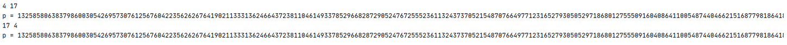

有了p就直接求q，得到m再转换成字符

```python
from gmpy2 import *
import libnum
n4 = 22822039733049388110936778173014765663663303811791283234361230649775805923902173438553927805407463106104699773994158375704033093471761387799852168337898526980521753614307899669015931387819927421875316304591521901592823814417756447695701045846773508629371397013053684553042185725059996791532391626429712416994990889693732805181947970071429309599614973772736556299404246424791660679253884940021728846906344198854779191951739719342908761330661910477119933428550774242910420952496929605686154799487839923424336353747442153571678064520763149793294360787821751703543288696726923909670396821551053048035619499706391118145067
c4 = 15406498580761780108625891878008526815145372096234083936681442225155097299264808624358826686906535594853622687379268969468433072388149786607395396424104318820879443743112358706546753935215756078345959375299650718555759698887852318017597503074317356745122514481807843745626429797861463012940172797612589031686718185390345389295851075279278516147076602270178540690147808314172798987497259330037810328523464851895621851859027823681655934104713689539848047163088666896473665500158179046196538210778897730209572708430067658411755959866033531700460551556380993982706171848970460224304996455600503982223448904878212849412357

p = mpz(132585806383798600305426957307612567604223562626764190211333136246643723811046149337852966828729052476725552361132437370521548707664977123165279305052971868012755509160408641100548744046621516877981864180076497524093201404558036301820216274968638825245150755772559259575544101918590311068466601618472464832499)

q = n4//p        #“//”  整除

phi = (p-1)*(q-1)

e = 65537
d = invert(e,phi)

m = pow(c4,d,n4)

print(m)    # "n2s" (数值转字符串)
print(hex(m))
print(bytes.fromhex(hex(m)[2:]))
```

## 50.传感器（曼彻斯特编码，manchester编码）

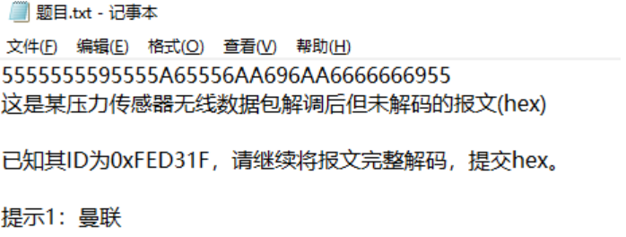

说实话我也是一点头绪没有 直接找大佬的wp
 大佬说这是曼彻斯特编码,发现啥也不是，抄脚本吧

```python
cipher='5555555595555A65556AA696AA6666666955'
def iee(cipher):
    tmp=''
    for i in range(len(cipher)):
        a=bin(eval('0x'+cipher[i]))[2:].zfill(4)
        tmp=tmp+a[1]+a[3]
        print(tmp)
    plain=[hex(int(tmp[i:i+8][::-1],2))[2:] for i in range(0,len(tmp),8)]
    print(''.join(plain).upper())

iee(cipher)
```

或者直接工具箱，manchester解码，再二进制转16进制，再转大写就行了

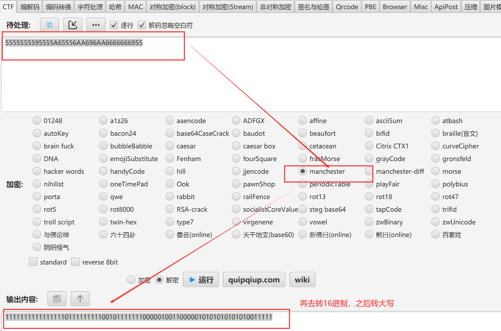

## 51.[GUET-CTF2019]BabyRSA(给p+q,(p+1)(q+1),e,d,密文C，求M.先求n,再求M)

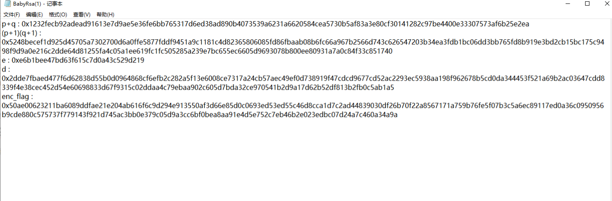

```python
观察题目给的条件，给了p+q，（p+1)(q+1)，e，d,以及密文C.
RSA的解密公式：M=C^d mod n
所以我们只要求出n即可。(n = p*q)
n = (p+1)*(q+1) - (p+q) - 1
求M的值，已知C，d，n后 用函数pow(),即可求出
```

```python
import libnum
a = 0x1232fecb92adead91613e7d9ae5e36fe6bb765317d6ed38ad890b4073539a6231a6620584cea5730b5af83a3e80cf30141282c97be4400e33307573af6b25e2ea
b = 0x5248becef1d925d45705a7302700d6a0ffe5877fddf9451a9c1181c4d82365806085fd86fbaab08b6fc66a967b2566d743c626547203b34ea3fdb1bc06dd3bb765fd8b919e3bd2cb15bc175c9498f9d9a0e216c2dde64d81255fa4c05a1ee619fc1fc505285a239e7bc655ec6605d9693078b800ee80931a7a0c84f33c851740
e = 0xe6b1bee47bd63f615c7d0a43c529d219
d = 0x2dde7fbaed477f6d62838d55b0d0964868cf6efb2c282a5f13e6008ce7317a24cb57aec49ef0d738919f47cdcd9677cd52ac2293ec5938aa198f962678b5cd0da344453f521a69b2ac03647cdd8339f4e38cec452d54e60698833d67f9315c02ddaa4c79ebaa902c605d7bda32ce970541b2d9a17d62b52df813b2fb0c5ab1a5
c= 0x50ae00623211ba6089ddfae21e204ab616f6c9d294e913550af3d66e85d0c0693ed53ed55c46d8cca1d7c2ad44839030df26b70f22a8567171a759b76fe5f07b3c5a6ec89117ed0a36c0950956b9cde880c575737f779143f921d745ac3bb0e379c05d9a3cc6bf0bea8aa91e4d5e752c7eb46b2e023edbc07d24a7c460a34a9a

n = b-a-1

m = pow(c,d,n)

print(libnum.n2s(m))  #（n2s将数值转化为字符串）
```

## 52.密码学的心声

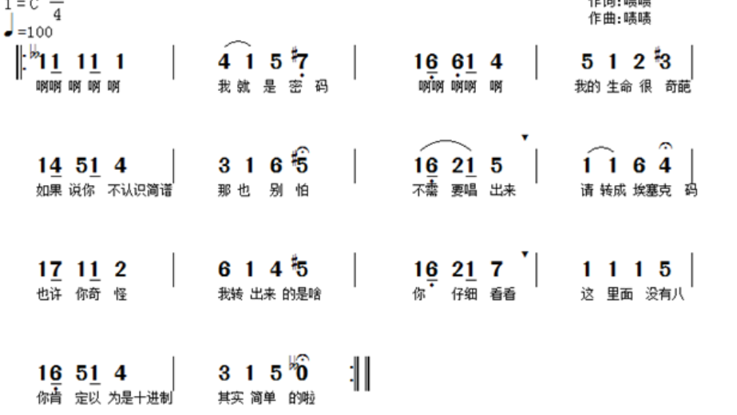

图片中的歌词线索很明显ASCLL码 八进制
 数字三个一组，转换就行了

```python
s = '111 114 157 166 145 123 145 143 165 162 151 164 171 126 145 162 171 115 165 143 150'
tmp = [s.split(' ')[i] for i in range(len(s.split(' ')))]
cipher = ''
for i in tmp:
    cipher += chr(int(i,8))
flag = "flag{"+cipher+"}"
print(flag)
```

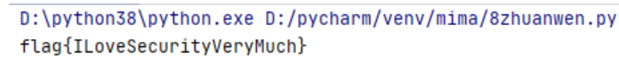

## 53.rot(rot13编码，python脚本处理)

看题目

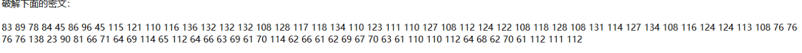

```python
ROT5、ROT13、ROT18、ROT47 编码是一种简单的码元位置顺序替换暗码。此类编码具有可逆性，可以自我解密，主要用于应对快速浏览，或者是机器的读取，而不让其理解其意。

ROT5 是 rotate by 5 places 的简写，意思是旋转5个位置，其它皆同。下面分别说说它们的编码方式：
ROT5：只对数字进行编码，用当前数字往前数的第5个数字替换当前数字，例如当前为0，编码后变成5，当前为1，编码后变成6，以此类推顺序循环。
ROT13：只对字母进行编码，用当前字母往前数的第13个字母替换当前字母，例如当前为A，编码后变成N，当前为B，编码后变成O，以此类推顺序循环。
ROT18：这是一个异类，本来没有，它是将ROT5和ROT13组合在一起，为了好称呼，将其命名为ROT18。
ROT47：对数字、字母、常用符号进行编码，按照它们的ASCII值进行位置替换，用当前字符ASCII值往前数的第47位对应字符替换当前字符，例如当前为小写字母z，编码后变成大写字母K，当前为数字0，编码后变成符号_。用于ROT47编码的字符其ASCII值范围是33－126，具体可参考ASCII编码。
```

题目名字叫rot
ROT是一种古典密码，左边移某位，或者右边移某位，凯撒算是ROT的一种。

Rot13 加密，用python脚本将每个数字减去13后，转ASCLL字符，得到

1.求解移位之前的字符串

根据题目名称叫“rot”，可以初步判断给出的数字可能是十进制ascii码，然后还要经过移动一定的位数来得出明文。先写Python脚本来处理一下这串数字，然后借助循环遍历不同的移位位数。

```python
代码如下：
c='83 89 78 84 45 86 96 45 115 121 110 116 136 132 132 132 108 128 117 118 134 110 123 111 110 127 108 112 124 122 108 118 128 108 131 114 127 134 108 116 124 124 113 108 76 76 76 76 138 23 90 81 66 71 64 69 114 65 112 64 66 63 69 61 70 114 62 66 61 62 69 67 70 63 61 110 110 112 64 68 62 70 61 112 111 112'
l=c.split(' ')    #去掉空格放入list中方便转字符，要注意split之后产生的list中每个元素都是str
s=''
for i in range(len(l)):    #逐个先转int，再转字符后又组成字符串
    s+=chr(int(l[i]))
for i in range(1,14):    #这里是因为我后来已经知道是rot13，所以这里就只循环到13方便看一下结果
    for j in range(len(s)):
         print(chr(ord(s[j])-i),end='')
    print()
```

写完发现上面写的太复杂，转来转去的没必要，优化为：先进行移位，再转换成字符输出，步骤更少更简洁：

```python
c='83 89 78 84 45 86 96 45 115 121 110 116 136 132 132 132 108 128 117 118 134 110 123 111 110 127 108 112 124 122 108 118 128 108 131 114 127 134 108 116 124 124 113 108 76 76 76 76 138 23 90 81 66 71 64 69 114 65 112 64 66 63 69 61 70 114 62 66 61 62 69 67 70 63 61 110 110 112 64 68 62 70 61 112 111 112'
l=c.split(' ')
'''先移位再转换成ascii字符步骤更简单'''
for i in range(1,14):
    s=''
    for j in range(len(l)):
        s+=chr(int(l[j])-i)
    print(s)
```

输出的结果中合理的是：
FLAG IS flag{www_shiyanbar_com_is_very_good_????}
MD5:38e4c352809e150186920aac37190cbc

发现有未知的部分，并已知了md5的结果，看来还需进一步求解才能拿到flag。
2.暴力破解找出做md5之前的明文

四层循环遍历ascii码在33-126范围的可见字符，拼接字符串，借助Python的模块和函数（注意要记得import hashlib）计算md5值，找出与上一步得到的MD5相等的结果，最终输出的运行结果为:
flag{www_shiyanbar_com_is_very_good_@8Mu}

备注：
这个脚本在我的电脑上大概运行30多秒之后出结果，得到结果（找到@、8、M、u）前一共会执行25955553次，也就是(64-33)*94**3+(56-33)*94**2+(77-33)*94+(117-33+1)，是不是很清晰呢？
**是代表乘方运算，同Python中的写法
代码如下：

```python
import hashlib
s='flag{www_shiyanbar_com_is_very_good_'
m='38e4c352809e150186920aac37190cbc'

def revmd5():
    #count=0
    for i in range(33,127):
        for j in range(33,127):
            for k in range(33,127):
                for n in range(33,127):
                    #count+=1
                    #print(count)
                    a=s+chr(i)+chr(j)+chr(k)+chr(n)+'}'
                    #print(a)
                    ha=hashlib.md5(a.encode()).hexdigest()
                    if(ha == m):
                        print(a)
                        return
revmd5()
```

合并脚本：

```python
c=[83,89,78,84,45,86,96,45,115,121,110,116,136,132,132,132,108,128,117,118,134,110,123,111,110,127,108,112,124,122,108,118,128,108,131,114,127,134,108,116,124,124,113,108,76,76,76,76,138,23,90,81,66,71,64,69,114,65,112,64,66,63,69,61,70,114,62,66,61,62,69,67,70,63,61,110,110,112,64,68,62,70,61,112,111,112]
for i in c:
    print(chr(i-13),end='')#ascii移位13，转字符再输出

#MD5 brute
import hashlib
s='flag{www_shiyanbar_com_is_very_good_'
m='38e4c352809e150186920aac37190cbc'

def revmd5():
    #count=0
    for i in range(33,127):
        for j in range(33,127):
            for k in range(33,127):
                for n in range(33,127):
                    #count+=1
                    #print(count)
                    a=s+chr(i)+chr(j)+chr(k)+chr(n)+'}'
                    #print(a)
                    ha=hashlib.md5(a.encode()).hexdigest()
                    if(ha == m):
                        print(a)
                        return
revmd5()
```

## 54.这是什么(JSfuck编码)

查看题目

其实很多浏览器本身就支持JSFuck编码，打开浏览器按下F12，在控制台(console)中把JSFuck代码粘贴进去回车，浏览器就会自动解析执行，弹窗得到flag

小明是一个软件专业的高材生，但是老师布置的这次的作业似乎不怎么靠谱，因为他们老师以前是学物理的！喜欢乱七八糟命名文件，还喜欢奇奇怪怪的编码。你快帮小明看一下这题，小明准备好了一箱子辣条。 注意：得到的 flag 请包上 flag{} 提交

 下载好了以后，把后缀改成txt

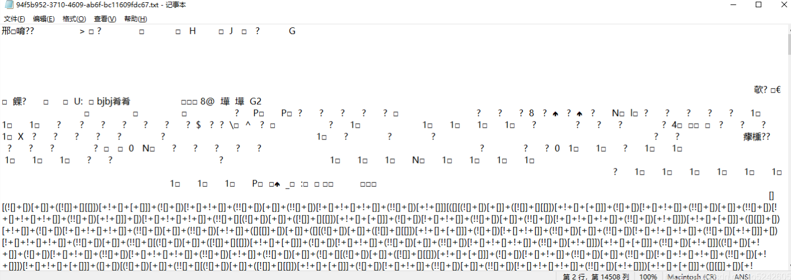

```
[][(![]+[])[+[]]+([![]]+[][[]])[+!+[]+[+[]]]+(![]+[])[!+[]+!+[]]+(!![]+[])[+[]]+(!![]+[])[!+[]+!+[]+!+[]]+(!![]+[])[+!+[]]][([][(![]+[])[+[]]+([![]]+[][[]])[+!+[]+[+[]]]+(![]+[])[!+[]+!+[]]+(!![]+[])[+[]]+(!![]+[])[!+[]+!+[]+!+[]]+(!![]+[])[+!+[]]]+[])[!+[]+!+[]+!+[]]+(!![]+[][(![]+[])[+[]]+([![]]+[][[]])[+!+[]+[+[]]]+(![]+[])[!+[]+!+[]]+(!![]+[])[+[]]+(!![]+[])[!+[]+!+[]+!+[]]+(!![]+[])[+!+[]]])[+!+[]+[+[]]]+([][[]]+[])[+!+[]]+(![]+[])[!+[]+!+[]+!+[]]+(!![]+[])[+[]]+(!![]+[])[+!+[]]+([][[]]+[])[+[]]+([][(![]+[])[+[]]+([![]]+[][[]])[+!+[]+[+[]]]+(![]+[])[!+[]+!+[]]+(!![]+[])[+[]]+(!![]+[])[!+[]+!+[]+!+[]]+(!![]+[])[+!+[]]]+[])[!+[]+!+[]+!+[]]+(!![]+[])[+[]]+(!![]+[][(![]+[])[+[]]+([![]]+[][[]])[+!+[]+[+[]]]+(![]+[])[!+[]+!+[]]+(!![]+[])[+[]]+(!![]+[])[!+[]+!+[]+!+[]]+(!![]+[])[+!+[]]])[+!+[]+[+[]]]+(!![]+[])[+!+[]]]((![]+[])[+!+[]]+(![]+[])[!+[]+!+[]]+(!![]+[])[!+[]+!+[]+!+[]]+(!![]+[])[+!+[]]+(!![]+[])[+[]]+(![]+[][(![]+[])[+[]]+([![]]+[][[]])[+!+[]+[+[]]]+(![]+[])[!+[]+!+[]]+(!![]+[])[+[]]+(!![]+[])[!+[]+!+[]+!+[]]+(!![]+[])[+!+[]]])[!+[]+!+[]+[+[]]]+([]+[])[(![]+[])[+[]]+(!![]+[][(![]+[])[+[]]+([![]]+[][[]])[+!+[]+[+[]]]+(![]+[])[!+[]+!+[]]+(!![]+[])[+[]]+(!![]+[])[!+[]+!+[]+!+[]]+(!![]+[])[+!+[]]])[+!+[]+[+[]]]+([][[]]+[])[+!+[]]+(!![]+[])[+[]]+([][(![]+[])[+[]]+([![]]+[][[]])[+!+[]+[+[]]]+(![]+[])[!+[]+!+[]]+(!![]+[])[+[]]+(!![]+[])[!+[]+!+[]+!+[]]+(!![]+[])[+!+[]]]+[])[!+[]+!+[]+!+[]]+(!![]+[][(![]+[])[+[]]+([![]]+[][[]])[+!+[]+[+[]]]+(![]+[])[!+[]+!+[]]+(!![]+[])[+[]]+(!![]+[])[!+[]+!+[]+!+[]]+(!![]+[])[+!+[]]])[+!+[]+[+[]]]+(![]+[])[!+[]+!+[]]+(!![]+[][(![]+[])[+[]]+([![]]+[][[]])[+!+[]+[+[]]]+(![]+[])[!+[]+!+[]]+(!![]+[])[+[]]+(!![]+[])[!+[]+!+[]+!+[]]+(!![]+[])[+!+[]]])[+!+[]+[+[]]]+(!![]+[])[+!+[]]]()[+!+[]+[!+[]+!+[]]]+(![]+[])[+[]]+(![]+[])[!+[]+!+[]]+(![]+[])[+!+[]]+(+![]+[![]]+([]+[])[([][(![]+[])[+[]]+([![]]+[][[]])[+!+[]+[+[]]]+(![]+[])[!+[]+!+[]]+(!![]+[])[+[]]+(!![]+[])[!+[]+!+[]+!+[]]+(!![]+[])[+!+[]]]+[])[!+[]+!+[]+!+[]]+(!![]+[][(![]+[])[+[]]+([![]]+[][[]])[+!+[]+[+[]]]+(![]+[])[!+[]+!+[]]+(!![]+[])[+[]]+(!![]+[])[!+[]+!+[]+!+[]]+(!![]+[])[+!+[]]])[+!+[]+[+[]]]+([][[]]+[])[+!+[]]+(![]+[])[!+[]+!+[]+!+[]]+(!![]+[])[+[]]+(!![]+[])[+!+[]]+([][[]]+[])[+[]]+([][(![]+[])[+[]]+([![]]+[][[]])[+!+[]+[+[]]]+(![]+[])[!+[]+!+[]]+(!![]+[])[+[]]+(!![]+[])[!+[]+!+[]+!+[]]+(!![]+[])[+!+[]]]+[])[!+[]+!+[]+!+[]]+(!![]+[])[+[]]+(!![]+[][(![]+[])[+[]]+([![]]+[][[]])[+!+[]+[+[]]]+(![]+[])[!+[]+!+[]]+(!![]+[])[+[]]+(!![]+[])[!+[]+!+[]+!+[]]+(!![]+[])[+!+[]]])[+!+[]+[+[]]]+(!![]+[])[+!+[]]])[!+[]+!+[]+[+[]]]+(+[![]]+[][(![]+[])[+[]]+([![]]+[][[]])[+!+[]+[+[]]]+(![]+[])[!+[]+!+[]]+(!![]+[])[+[]]+(!![]+[])[!+[]+!+[]+!+[]]+(!![]+[])[+!+[]]])[!+[]+!+[]+[+!+[]]]+(![]+[])[+!+[]]+[+[]]+[!+[]+!+[]+!+[]+!+[]]+[!+[]+!+[]+!+[]+!+[]]+[!+[]+!+[]+!+[]+!+[]+!+[]+!+[]+!+[]+!+[]]+(![]+[])[+[]]+([][[]]+[])[!+[]+!+[]]+[!+[]+!+[]+!+[]+!+[]+!+[]+!+[]+!+[]]+[!+[]+!+[]+!+[]]+[+[]]+(+(+!+[]+[+!+[]]))[(!![]+[])[+[]]+(!![]+[][(![]+[])[+[]]+([![]]+[][[]])[+!+[]+[+[]]]+(![]+[])[!+[]+!+[]]+(!![]+[])[+[]]+(!![]+[])[!+[]+!+[]+!+[]]+(!![]+[])[+!+[]]])[+!+[]+[+[]]]+(+![]+([]+[])[([][(![]+[])[+[]]+([![]]+[][[]])[+!+[]+[+[]]]+(![]+[])[!+[]+!+[]]+(!![]+[])[+[]]+(!![]+[])[!+[]+!+[]+!+[]]+(!![]+[])[+!+[]]]+[])[!+[]+!+[]+!+[]]+(!![]+[][(![]+[])[+[]]+([![]]+[][[]])[+!+[]+[+[]]]+(![]+[])[!+[]+!+[]]+(!![]+[])[+[]]+(!![]+[])[!+[]+!+[]+!+[]]+(!![]+[])[+!+[]]])[+!+[]+[+[]]]+([][[]]+[])[+!+[]]+(![]+[])[!+[]+!+[]+!+[]]+(!![]+[])[+[]]+(!![]+[])[+!+[]]+([][[]]+[])[+[]]+([][(![]+[])[+[]]+([![]]+[][[]])[+!+[]+[+[]]]+(![]+[])[!+[]+!+[]]+(!![]+[])[+[]]+(!![]+[])[!+[]+!+[]+!+[]]+(!![]+[])[+!+[]]]+[])[!+[]+!+[]+!+[]]+(!![]+[])[+[]]+(!![]+[][(![]+[])[+[]]+([![]]+[][[]])[+!+[]+[+[]]]+(![]+[])[!+[]+!+[]]+(!![]+[])[+[]]+(!![]+[])[!+[]+!+[]+!+[]]+(!![]+[])[+!+[]]])[+!+[]+[+[]]]+(!![]+[])[+!+[]]])[+!+[]+[+[]]]+(!![]+[])[+[]]+(!![]+[])[+!+[]]+([![]]+[][[]])[+!+[]+[+[]]]+([][[]]+[])[+!+[]]+(+![]+[![]]+([]+[])[([][(![]+[])[+[]]+([![]]+[][[]])[+!+[]+[+[]]]+(![]+[])[!+[]+!+[]]+(!![]+[])[+[]]+(!![]+[])[!+[]+!+[]+!+[]]+(!![]+[])[+!+[]]]+[])[!+[]+!+[]+!+[]]+(!![]+[][(![]+[])[+[]]+([![]]+[][[]])[+!+[]+[+[]]]+(![]+[])[!+[]+!+[]]+(!![]+[])[+[]]+(!![]+[])[!+[]+!+[]+!+[]]+(!![]+[])[+!+[]]])[+!+[]+[+[]]]+([][[]]+[])[+!+[]]+(![]+[])[!+[]+!+[]+!+[]]+(!![]+[])[+[]]+(!![]+[])[+!+[]]+([][[]]+[])[+[]]+([][(![]+[])[+[]]+([![]]+[][[]])[+!+[]+[+[]]]+(![]+[])[!+[]+!+[]]+(!![]+[])[+[]]+(!![]+[])[!+[]+!+[]+!+[]]+(!![]+[])[+!+[]]]+[])[!+[]+!+[]+!+[]]+(!![]+[])[+[]]+(!![]+[][(![]+[])[+[]]+([![]]+[][[]])[+!+[]+[+[]]]+(![]+[])[!+[]+!+[]]+(!![]+[])[+[]]+(!![]+[])[!+[]+!+[]+!+[]]+(!![]+[])[+!+[]]])[+!+[]+[+[]]]+(!![]+[])[+!+[]]])[!+[]+!+[]+[+[]]]](!+[]+!+[]+[+[]])+[!+[]+!+[]+!+[]+!+[]+!+[]+!+[]]+[!+[]+!+[]]+([][(![]+[])[+[]]+([![]]+[][[]])[+!+[]+[+[]]]+(![]+[])[!+[]+!+[]]+(!![]+[])[+[]]+(!![]+[])[!+[]+!+[]+!+[]]+(!![]+[])[+!+[]]]+[])[!+[]+!+[]+!+[]]+[+!+[]]+[!+[]+!+[]+!+[]]+([][(![]+[])[+[]]+([![]]+[][[]])[+!+[]+[+[]]]+(![]+[])[!+[]+!+[]]+(!![]+[])[+[]]+(!![]+[])[!+[]+!+[]+!+[]]+(!![]+[])[+!+[]]]+[])[!+[]+!+[]+!+[]]+(![]+[])[+!+[]]+[!+[]+!+[]+!+[]+!+[]+!+[]+!+[]+!+[]+!+[]]+[+[]]+[!+[]+!+[]]+[+[]]+[+[]]+([][(![]+[])[+[]]+([![]]+[][[]])[+!+[]+[+[]]]+(![]+[])[!+[]+!+[]]+(!![]+[])[+[]]+(!![]+[])[!+[]+!+[]+!+[]]+(!![]+[])[+!+[]]]+[])[!+[]+!+[]+!+[]]+[!+[]+!+[]+!+[]+!+[]]+[!+[]+!+[]+!+[]+!+[]+!+[]]+[!+[]+!+[]]+[!+[]+!+[]+!+[]+!+[]+!+[]+!+[]+!+[]+!+[]+!+[]]+([][[]]+[])[!+[]+!+[]]+(![]+[])[+!+[]]+(![]+[])[+!+[]]+[!+[]+!+[]]+[][(![]+[])[+[]]+([![]]+[][[]])[+!+[]+[+[]]]+(![]+[])[!+[]+!+[]]+(!![]+[])[+[]]+(!![]+[])[!+[]+!+[]+!+[]]+(!![]+[])[+!+[]]][([][(![]+[])[+[]]+([![]]+[][[]])[+!+[]+[+[]]]+(![]+[])[!+[]+!+[]]+(!![]+[])[+[]]+(!![]+[])[!+[]+!+[]+!+[]]+(!![]+[])[+!+[]]]+[])[!+[]+!+[]+!+[]]+(!![]+[][(![]+[])[+[]]+([![]]+[][[]])[+!+[]+[+[]]]+(![]+[])[!+[]+!+[]]+(!![]+[])[+[]]+(!![]+[])[!+[]+!+[]+!+[]]+(!![]+[])[+!+[]]])[+!+[]+[+[]]]+([][[]]+[])[+!+[]]+(![]+[])[!+[]+!+[]+!+[]]+(!![]+[])[+[]]+(!![]+[])[+!+[]]+([][[]]+[])[+[]]+([][(![]+[])[+[]]+([![]]+[][[]])[+!+[]+[+[]]]+(![]+[])[!+[]+!+[]]+(!![]+[])[+[]]+(!![]+[])[!+[]+!+[]+!+[]]+(!![]+[])[+!+[]]]+[])[!+[]+!+[]+!+[]]+(!![]+[])[+[]]+(!![]+[][(![]+[])[+[]]+([![]]+[][[]])[+!+[]+[+[]]]+(![]+[])[!+[]+!+[]]+(!![]+[])[+[]]+(!![]+[])[!+[]+!+[]+!+[]]+(!![]+[])[+!+[]]])[+!+[]+[+[]]]+(!![]+[])[+!+[]]]((!![]+[])[+!+[]]+(!![]+[])[!+[]+!+[]+!+[]]+(!![]+[])[+[]]+([][[]]+[])[+[]]+(!![]+[])[+!+[]]+([][[]]+[])[+!+[]]+(+[![]]+[][(![]+[])[+[]]+([![]]+[][[]])[+!+[]+[+[]]]+(![]+[])[!+[]+!+[]]+(!![]+[])[+[]]+(!![]+[])[!+[]+!+[]+!+[]]+(!![]+[])[+!+[]]])[+!+[]+[+!+[]]]+([][[]]+[])[+[]]+([][[]]+[])[+!+[]]+(!![]+[])[!+[]+!+[]+!+[]]+(![]+[])[!+[]+!+[]+!+[]]+([][(![]+[])[+[]]+([![]]+[][[]])[+!+[]+[+[]]]+(![]+[])[!+[]+!+[]]+(!![]+[])[+[]]+(!![]+[])[!+[]+!+[]+!+[]]+(!![]+[])[+!+[]]]+[])[!+[]+!+[]+!+[]]+(![]+[])[+!+[]]+(+(!+[]+!+[]+[+!+[]]+[+!+[]]))[(!![]+[])[+[]]+(!![]+[][(![]+[])[+[]]+([![]]+[][[]])[+!+[]+[+[]]]+(![]+[])[!+[]+!+[]]+(!![]+[])[+[]]+(!![]+[])[!+[]+!+[]+!+[]]+(!![]+[])[+!+[]]])[+!+[]+[+[]]]+(+![]+([]+[])[([][(![]+[])[+[]]+([![]]+[][[]])[+!+[]+[+[]]]+(![]+[])[!+[]+!+[]]+(!![]+[])[+[]]+(!![]+[])[!+[]+!+[]+!+[]]+(!![]+[])[+!+[]]]+[])[!+[]+!+[]+!+[]]+(!![]+[][(![]+[])[+[]]+([![]]+[][[]])[+!+[]+[+[]]]+(![]+[])[!+[]+!+[]]+(!![]+[])[+[]]+(!![]+[])[!+[]+!+[]+!+[]]+(!![]+[])[+!+[]]])[+!+[]+[+[]]]+([][[]]+[])[+!+[]]+(![]+[])[!+[]+!+[]+!+[]]+(!![]+[])[+[]]+(!![]+[])[+!+[]]+([][[]]+[])[+[]]+([][(![]+[])[+[]]+([![]]+[][[]])[+!+[]+[+[]]]+(![]+[])[!+[]+!+[]]+(!![]+[])[+[]]+(!![]+[])[!+[]+!+[]+!+[]]+(!![]+[])[+!+[]]]+[])[!+[]+!+[]+!+[]]+(!![]+[])[+[]]+(!![]+[][(![]+[])[+[]]+([![]]+[][[]])[+!+[]+[+[]]]+(![]+[])[!+[]+!+[]]+(!![]+[])[+[]]+(!![]+[])[!+[]+!+[]+!+[]]+(!![]+[])[+!+[]]])[+!+[]+[+[]]]+(!![]+[])[+!+[]]])[+!+[]+[+[]]]+(!![]+[])[+[]]+(!![]+[])[+!+[]]+([![]]+[][[]])[+!+[]+[+[]]]+([][[]]+[])[+!+[]]+(+![]+[![]]+([]+[])[([][(![]+[])[+[]]+([![]]+[][[]])[+!+[]+[+[]]]+(![]+[])[!+[]+!+[]]+(!![]+[])[+[]]+(!![]+[])[!+[]+!+[]+!+[]]+(!![]+[])[+!+[]]]+[])[!+[]+!+[]+!+[]]+(!![]+[][(![]+[])[+[]]+([![]]+[][[]])[+!+[]+[+[]]]+(![]+[])[!+[]+!+[]]+(!![]+[])[+[]]+(!![]+[])[!+[]+!+[]+!+[]]+(!![]+[])[+!+[]]])[+!+[]+[+[]]]+([][[]]+[])[+!+[]]+(![]+[])[!+[]+!+[]+!+[]]+(!![]+[])[+[]]+(!![]+[])[+!+[]]+([][[]]+[])[+[]]+([][(![]+[])[+[]]+([![]]+[][[]])[+!+[]+[+[]]]+(![]+[])[!+[]+!+[]]+(!![]+[])[+[]]+(!![]+[])[!+[]+!+[]+!+[]]+(!![]+[])[+!+[]]]+[])[!+[]+!+[]+!+[]]+(!![]+[])[+[]]+(!![]+[][(![]+[])[+[]]+([![]]+[][[]])[+!+[]+[+[]]]+(![]+[])[!+[]+!+[]]+(!![]+[])[+[]]+(!![]+[])[!+[]+!+[]+!+[]]+(!![]+[])[+!+[]]])[+!+[]+[+[]]]+(!![]+[])[+!+[]]])[!+[]+!+[]+[+[]]]](!+[]+!+[]+!+[]+[+!+[]])[+!+[]]+(!![]+[])[!+[]+!+[]+!+[]])()([][(![]+[])[+[]]+([![]]+[][[]])[+!+[]+[+[]]]+(![]+[])[!+[]+!+[]]+(!![]+[])[+[]]+(!![]+[])[!+[]+!+[]+!+[]]+(!![]+[])[+!+[]]][([][(![]+[])[+[]]+([![]]+[][[]])[+!+[]+[+[]]]+(![]+[])[!+[]+!+[]]+(!![]+[])[+[]]+(!![]+[])[!+[]+!+[]+!+[]]+(!![]+[])[+!+[]]]+[])[!+[]+!+[]+!+[]]+(!![]+[][(![]+[])[+[]]+([![]]+[][[]])[+!+[]+[+[]]]+(![]+[])[!+[]+!+[]]+(!![]+[])[+[]]+(!![]+[])[!+[]+!+[]+!+[]]+(!![]+[])[+!+[]]])[+!+[]+[+[]]]+([][[]]+[])[+!+[]]+(![]+[])[!+[]+!+[]+!+[]]+(!![]+[])[+[]]+(!![]+[])[+!+[]]+([][[]]+[])[+[]]+([][(![]+[])[+[]]+([![]]+[][[]])[+!+[]+[+[]]]+(![]+[])[!+[]+!+[]]+(!![]+[])[+[]]+(!![]+[])[!+[]+!+[]+!+[]]+(!![]+[])[+!+[]]]+[])[!+[]+!+[]+!+[]]+(!![]+[])[+[]]+(!![]+[][(![]+[])[+[]]+([![]]+[][[]])[+!+[]+[+[]]]+(![]+[])[!+[]+!+[]]+(!![]+[])[+[]]+(!![]+[])[!+[]+!+[]+!+[]]+(!![]+[])[+!+[]]])[+!+[]+[+[]]]+(!![]+[])[+!+[]]]((!![]+[])[+!+[]]+(!![]+[])[!+[]+!+[]+!+[]]+(!![]+[])[+[]]+([][[]]+[])[+[]]+(!![]+[])[+!+[]]+([][[]]+[])[+!+[]]+(+[![]]+[][(![]+[])[+[]]+([![]]+[][[]])[+!+[]+[+[]]]+(![]+[])[!+[]+!+[]]+(!![]+[])[+[]]+(!![]+[])[!+[]+!+[]+!+[]]+(!![]+[])[+!+[]]])[+!+[]+[+!+[]]]+(!![]+[])[!+[]+!+[]+!+[]]+(![]+[])[!+[]+!+[]+!+[]]+([][(![]+[])[+[]]+([![]]+[][[]])[+!+[]+[+[]]]+(![]+[])[!+[]+!+[]]+(!![]+[])[+[]]+(!![]+[])[!+[]+!+[]+!+[]]+(!![]+[])[+!+[]]]+[])[!+[]+!+[]+!+[]]+(![]+[])[+!+[]]+(+(!+[]+!+[]+[+!+[]]+[+!+[]]))[(!![]+[])[+[]]+(!![]+[][(![]+[])[+[]]+([![]]+[][[]])[+!+[]+[+[]]]+(![]+[])[!+[]+!+[]]+(!![]+[])[+[]]+(!![]+[])[!+[]+!+[]+!+[]]+(!![]+[])[+!+[]]])[+!+[]+[+[]]]+(+![]+([]+[])[([][(![]+[])[+[]]+([![]]+[][[]])[+!+[]+[+[]]]+(![]+[])[!+[]+!+[]]+(!![]+[])[+[]]+(!![]+[])[!+[]+!+[]+!+[]]+(!![]+[])[+!+[]]]+[])[!+[]+!+[]+!+[]]+(!![]+[][(![]+[])[+[]]+([![]]+[][[]])[+!+[]+[+[]]]+(![]+[])[!+[]+!+[]]+(!![]+[])[+[]]+(!![]+[])[!+[]+!+[]+!+[]]+(!![]+[])[+!+[]]])[+!+[]+[+[]]]+([][[]]+[])[+!+[]]+(![]+[])[!+[]+!+[]+!+[]]+(!![]+[])[+[]]+(!![]+[])[+!+[]]+([][[]]+[])[+[]]+([][(![]+[])[+[]]+([![]]+[][[]])[+!+[]+[+[]]]+(![]+[])[!+[]+!+[]]+(!![]+[])[+[]]+(!![]+[])[!+[]+!+[]+!+[]]+(!![]+[])[+!+[]]]+[])[!+[]+!+[]+!+[]]+(!![]+[])[+[]]+(!![]+[][(![]+[])[+[]]+([![]]+[][[]])[+!+[]+[+[]]]+(![]+[])[!+[]+!+[]]+(!![]+[])[+[]]+(!![]+[])[!+[]+!+[]+!+[]]+(!![]+[])[+!+[]]])[+!+[]+[+[]]]+(!![]+[])[+!+[]]])[+!+[]+[+[]]]+(!![]+[])[+[]]+(!![]+[])[+!+[]]+([![]]+[][[]])[+!+[]+[+[]]]+([][[]]+[])[+!+[]]+(+![]+[![]]+([]+[])[([][(![]+[])[+[]]+([![]]+[][[]])[+!+[]+[+[]]]+(![]+[])[!+[]+!+[]]+(!![]+[])[+[]]+(!![]+[])[!+[]+!+[]+!+[]]+(!![]+[])[+!+[]]]+[])[!+[]+!+[]+!+[]]+(!![]+[][(![]+[])[+[]]+([![]]+[][[]])[+!+[]+[+[]]]+(![]+[])[!+[]+!+[]]+(!![]+[])[+[]]+(!![]+[])[!+[]+!+[]+!+[]]+(!![]+[])[+!+[]]])[+!+[]+[+[]]]+([][[]]+[])[+!+[]]+(![]+[])[!+[]+!+[]+!+[]]+(!![]+[])[+[]]+(!![]+[])[+!+[]]+([][[]]+[])[+[]]+([][(![]+[])[+[]]+([![]]+[][[]])[+!+[]+[+[]]]+(![]+[])[!+[]+!+[]]+(!![]+[])[+[]]+(!![]+[])[!+[]+!+[]+!+[]]+(!![]+[])[+!+[]]]+[])[!+[]+!+[]+!+[]]+(!![]+[])[+[]]+(!![]+[][(![]+[])[+[]]+([![]]+[][[]])[+!+[]+[+[]]]+(![]+[])[!+[]+!+[]]+(!![]+[])[+[]]+(!![]+[])[!+[]+!+[]+!+[]]+(!![]+[])[+!+[]]])[+!+[]+[+[]]]+(!![]+[])[+!+[]]])[!+[]+!+[]+[+[]]]](!+[]+!+[]+!+[]+[+!+[]])[+!+[]]+(!![]+[])[!+[]+!+[]+!+[]])()(([]+[])[([![]]+[][[]])[+!+[]+[+[]]]+(!![]+[])[+[]]+(![]+[])[+!+[]]+(![]+[])[!+[]+!+[]]+([![]]+[][[]])[+!+[]+[+[]]]+([][(![]+[])[+[]]+([![]]+[][[]])[+!+[]+[+[]]]+(![]+[])[!+[]+!+[]]+(!![]+[])[+[]]+(!![]+[])[!+[]+!+[]+!+[]]+(!![]+[])[+!+[]]]+[])[!+[]+!+[]+!+[]]+(![]+[])[!+[]+!+[]+!+[]]]()[+[]])[+[]]+[!+[]+!+[]+!+[]+!+[]+!+[]+!+[]+!+[]]+([][[]]+[])[!+[]+!+[]])+([]+[])[(![]+[])[+[]]+(!![]+[][(![]+[])[+[]]+([![]]+[][[]])[+!+[]+[+[]]]+(![]+[])[!+[]+!+[]]+(!![]+[])[+[]]+(!![]+[])[!+[]+!+[]+!+[]]+(!![]+[])[+!+[]]])[+!+[]+[+[]]]+([][[]]+[])[+!+[]]+(!![]+[])[+[]]+([][(![]+[])[+[]]+([![]]+[][[]])[+!+[]+[+[]]]+(![]+[])[!+[]+!+[]]+(!![]+[])[+[]]+(!![]+[])[!+[]+!+[]+!+[]]+(!![]+[])[+!+[]]]+[])[!+[]+!+[]+!+[]]+(!![]+[][(![]+[])[+[]]+([![]]+[][[]])[+!+[]+[+[]]]+(![]+[])[!+[]+!+[]]+(!![]+[])[+[]]+(!![]+[])[!+[]+!+[]+!+[]]+(!![]+[])[+!+[]]])[+!+[]+[+[]]]+(![]+[])[!+[]+!+[]]+(!![]+[][(![]+[])[+[]]+([![]]+[][[]])[+!+[]+[+[]]]+(![]+[])[!+[]+!+[]]+(!![]+[])[+[]]+(!![]+[])[!+[]+!+[]+!+[]]+(!![]+[])[+!+[]]])[+!+[]+[+[]]]+(!![]+[])[+!+[]]]()[+!+[]+[!+[]+!+[]]]+(!![]+[][(![]+[])[+[]]+([![]]+[][[]])[+!+[]+[+[]]]+(![]+[])[!+[]+!+[]]+(!![]+[])[+[]]+(!![]+[])[!+[]+!+[]+!+[]]+(!![]+[])[+!+[]]])[!+[]+!+[]+[+[]]])()
```

交给CTF-Tools

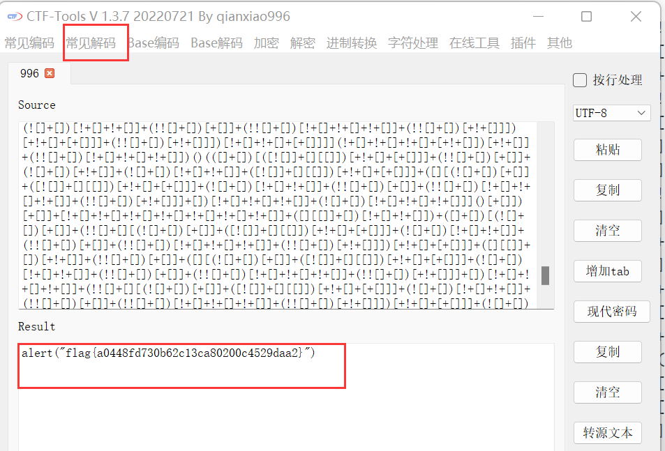

## 55.[BJDCTF 2020]这是base？？(替换base64密码本)

查看题目

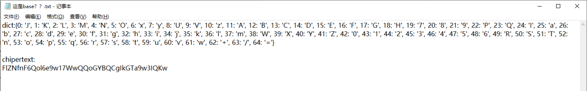


这里给了一个来源
 给了一个关于base64的dict字典，查一下base64的标准字典

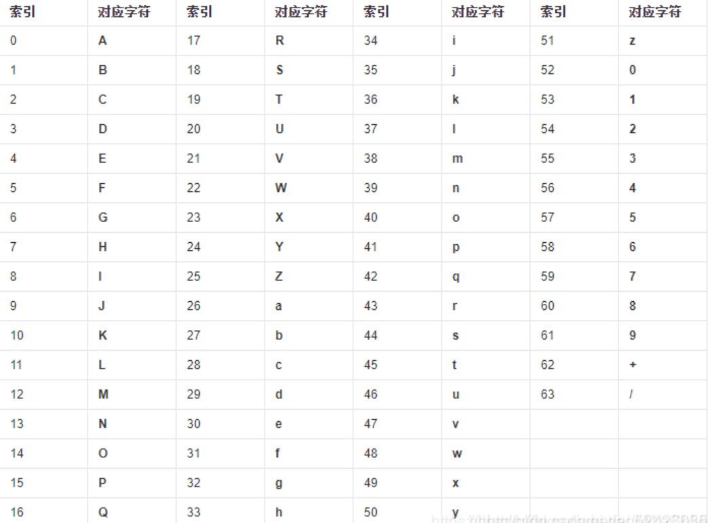

看他给的字典dict，这应该是替换加密，那么直接脚本

```python
import base64
dict={0: 'J', 1: 'K', 2: 'L', 3: 'M', 4: 'N', 5: 'O', 6: 'x', 7: 'y', 8: 'U', 9: 'V', 10: 'z', 11: 'A', 12: 'B', 13: 'C', 14: 'D', 15: 'E', 16: 'F', 17: 'G', 18: 'H', 19: '7', 20: '8', 21: '9', 22: 'P', 23: 'Q', 24: 'I', 25: 'a', 26: 'b', 27: 'c', 28: 'd', 29: 'e', 30: 'f', 31: 'g', 32: 'h',33: 'i', 34: 'j', 35: 'k', 36: 'l', 37: 'm', 38: 'W', 39: 'X', 40: 'Y', 41: 'Z', 42: '0', 43: '1', 44: '2', 45: '3', 46: '4', 47: '5', 48: '6', 49: 'R', 50: 'S', 51: 'T', 52: 'n', 53: 'o', 54: 'p', 55: 'q', 56: 'r', 57: 's', 58: 't', 59: 'u', 60: 'v', 61: 'w', 62: '+', 63: '/', 64: '='}
base64_list = ['A', 'B', 'C', 'D', 'E', 'F', 'G', 'H', 'I', 'J', 'K', 'L', 'M', 'N', 'O', 'P','Q', 'R', 'S', 'T', 'U', 'V', 'W', 'X', 'Y', 'Z', 'a', 'b', 'c', 'd', 'e', 'f','g', 'h', 'i', 'j', 'k', 'l', 'm', 'n', 'o', 'p', 'q', 'r', 's', 't', 'u', 'v','w', 'x', 'y', 'z', '0', '1', '2', '3', '4', '5', '6', '7', '8', '9', '+', '/']
cipher='FlZNfnF6Qol6e9w17WwQQoGYBQCgIkGTa9w3IQKw'
res=''
for i in range(len(cipher)):
    for j in range(64):
        if(dict[j]==cipher[i]):
            res+=base64_list[j]
flag=base64.b64decode(res)
print(flag)
```

## 56.[NCTF2019]Keyboard(键盘码)

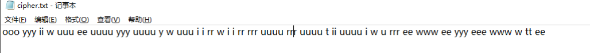

提示是键盘，然后发现这些字母是26键盘的第一行，上面有对应数字，并且位数在1到4位，说明是九键键盘，刚好和题目意思对上了，这种题写法就是比如o,对应9，就在九键键盘上9的位置，看o有多少位，3位的话，就是9那个位置字符串的第三个字符。
 我懒得写脚本，就直接手写了主要是不多

```
youaresosmartthatthisisjustapieceofcake
```

脚本也有

```python
#Keyboard.py
cipher="ooo yyy ii w uuu ee uuuu yyy uuuu y w uuu i i rr w i i rr rrr uuuu rrr uuuu t ii uuuu i w u rrr ee www ee yyy eee www w tt ee"
base=" qwertyuiop"
a=[" "," ","abc","def","ghi","jkl","mno","pqrs","tuv","wxyz"]
for part in cipher.split(" "):
    s=base.index(part[0])
    count=len(part)
    print(a[s][count-1],end="")
```

## 57.[BJDCTF 2nd]rsa1(给p^2+q^2,p-q,c,求p,q,再求m)

查看题目，kali nc链接

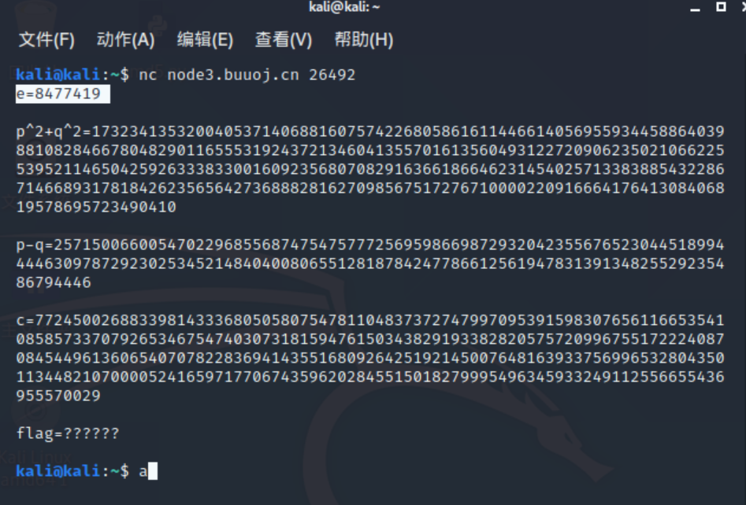

脚本求p,q

```python
from  sympy import *
from  sympy.abc import p,q
nn=173234135320040537140688160757422680586161144661405695593445886403988108284667804829011655531924372134604135570161356049312272090623502106622553952114650425926333833001609235680708291636618664623145402571338388543228671466893178184262356564273688828162709856751727671000022091666417641308406819578695723490410
qjp=2571500660054702296855687475475777256959866987293204235567652304451899444463097872923025345214840400806551281878424778661256194783139134825529235486794446
c=7724500268833981433368050580754781104837372747997095391598307656116653541085857337079265346754740307318159476150343829193382820575720996755172224087084544961360654070782283694143551680926425192145007648163933756996532804350113448210700005241659717706743596202845515018279995496345933249112556655436955570029
aa=solve([p*p+q*q-nn,p-q+qjp],[p,q])
print(aa)
```

运算得到

```python
[(-10503337527816956337583175457280077172769852861136343025600842971259244538242279698376371958092089562829534927474554227406969587818446390914980003663698649, 
-7931836867762254040727487981804299915809985873843138790033190666807345093779181825453346612877249162022983645596129448745713393035307256089450768176904203), 
(7931836867762254040727487981804299915809985873843138790033190666807345093779181825453346612877249162022983645596129448745713393035307256089450768176904203, 
10503337527816956337583175457280077172769852861136343025600842971259244538242279698376371958092089562829534927474554227406969587818446390914980003663698649)]
```

取正
 在套脚本求m

```python
import gmpy2

q = 7931836867762254040727487981804299915809985873843138790033190666807345093779181825453346612877249162022983645596129448745713393035307256089450768176904203
p = 10503337527816956337583175457280077172769852861136343025600842971259244538242279698376371958092089562829534927474554227406969587818446390914980003663698649
c=7724500268833981433368050580754781104837372747997095391598307656116653541085857337079265346754740307318159476150343829193382820575720996755172224087084544961360654070782283694143551680926425192145007648163933756996532804350113448210700005241659717706743596202845515018279995496345933249112556655436955570029

e=8477419


phin = (p-1)*(q-1)
n=p*q

d=gmpy2.invert(e,phin)

print(d)

m = pow(c,d,n)

print(m)
print(hex(m))
print(bytes.fromhex(hex(m)[2:]))


9176801044803182026484637001249357745934739910133510875057489448524395880729360234726619306785236053718310521427385989523887687708606685330852322309541511529449743297421957265246926843744058994242191414701500532380742734400522886779668005960454757811398005771341146333834718858066572532772694359628507597379
14337636555117422867244651266930730447572000359923226860275116396608177965909155459540675956218620312842
0x666c61677b61326332646630342d353637352d343435392d613063662d3432353164336334656639647d0a
b'flag{a2c2df04-5675-4459-a0cf-4251d3c4ef9d}\n'
```

## 58.[NCTF2019]childRSA

查看题目

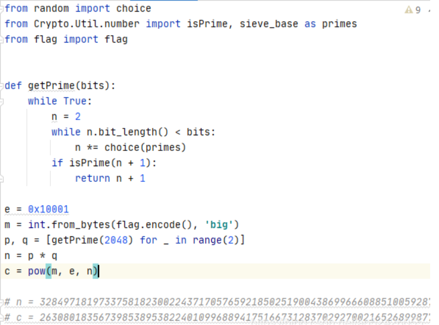

```python
这一道RSA打开加密算法乍一看感觉没有问题，N特别大，除了p和q的生成算法啥都没给，
查了一下 Crypto.Util.number 中的sieve_base，发现这是前10000个素数的生成列表，我们再去查一下第10000个素数的值为104729
不过就算我们知道了这个值的大小似乎还是得不到结果，从这个p，q的生成算法中，我们可以知道其是由小于104729的素数随机组合生成的.
为小于p的任何数的倍数，即我们可以将这10000个素数乘起来就为p-1的倍数，于是尝试用费马小定理，即是a^(t*(p-1))-1为p的倍数，t*（p-1)通过上述算法得出即可
```

```python
import gmpy2
import binascii
from Crypto.Util.number import isPrime, sieve_base as primes
from Crypto.Util.number import*

e = 0x10001
n = 32849718197337581823002243717057659218502519004386996660885100592872201948834155543125924395614928962750579667346279456710633774501407292473006312537723894221717638059058796679686953564471994009285384798450493756900459225040360430847240975678450171551048783818642467506711424027848778367427338647282428667393241157151675410661015044633282064056800913282016363415202171926089293431012379261585078566301060173689328363696699811123592090204578098276704877408688525618732848817623879899628629300385790344366046641825507767709276622692835393219811283244303899850483748651722336996164724553364097066493953127153066970594638491950199605713033004684970381605908909693802373826516622872100822213645899846325022476318425889580091613323747640467299866189070780620292627043349618839126919699862580579994887507733838561768581933029077488033326056066378869170169389819542928899483936705521710423905128732013121538495096959944889076705471928490092476616709838980562233255542325528398956185421193665359897664110835645928646616337700617883946369110702443135980068553511927115723157704586595844927607636003501038871748639417378062348085980873502535098755568810971926925447913858894180171498580131088992227637341857123607600275137768132347158657063692388249513
c = 26308018356739853895382240109968894175166731283702927002165268998773708335216338997058314157717147131083296551313334042509806229853341488461087009955203854253313827608275460592785607739091992591431080342664081962030557042784864074533380701014585315663218783130162376176094773010478159362434331787279303302718098735574605469803801873109982473258207444342330633191849040553550708886593340770753064322410889048135425025715982196600650740987076486540674090923181664281515197679745907830107684777248532278645343716263686014941081417914622724906314960249945105011301731247324601620886782967217339340393853616450077105125391982689986178342417223392217085276465471102737594719932347242482670320801063191869471318313514407997326350065187904154229557706351355052446027159972546737213451422978211055778164578782156428466626894026103053360431281644645515155471301826844754338802352846095293421718249819728205538534652212984831283642472071669494851823123552827380737798609829706225744376667082534026874483482483127491533474306552210039386256062116345785870668331513725792053302188276682550672663353937781055621860101624242216671635824311412793495965628876036344731733142759495348248970313655381407241457118743532311394697763283681852908564387282605279108
#primes为前10000个素数的列表
#计算prd = ∏ primes
prd = 1
for i in primes:
    prd *= i
#p为(2^prd-1)和n的公约数
p = gmpy2.gcd(gmpy2.powmod(2,prd,n)-1,n)
q = n // p
d = gmpy2.invert(e,(p-1)*(q-1))	#计算私钥d
m = gmpy2.powmod(c, d, n)    #解密

print(long_to_bytes(m))
flag = binascii.unhexlify(hex(m)[2:])
print(flag)
```

## 59.[HDCTF2019]bbbbbbrsa

查看题目

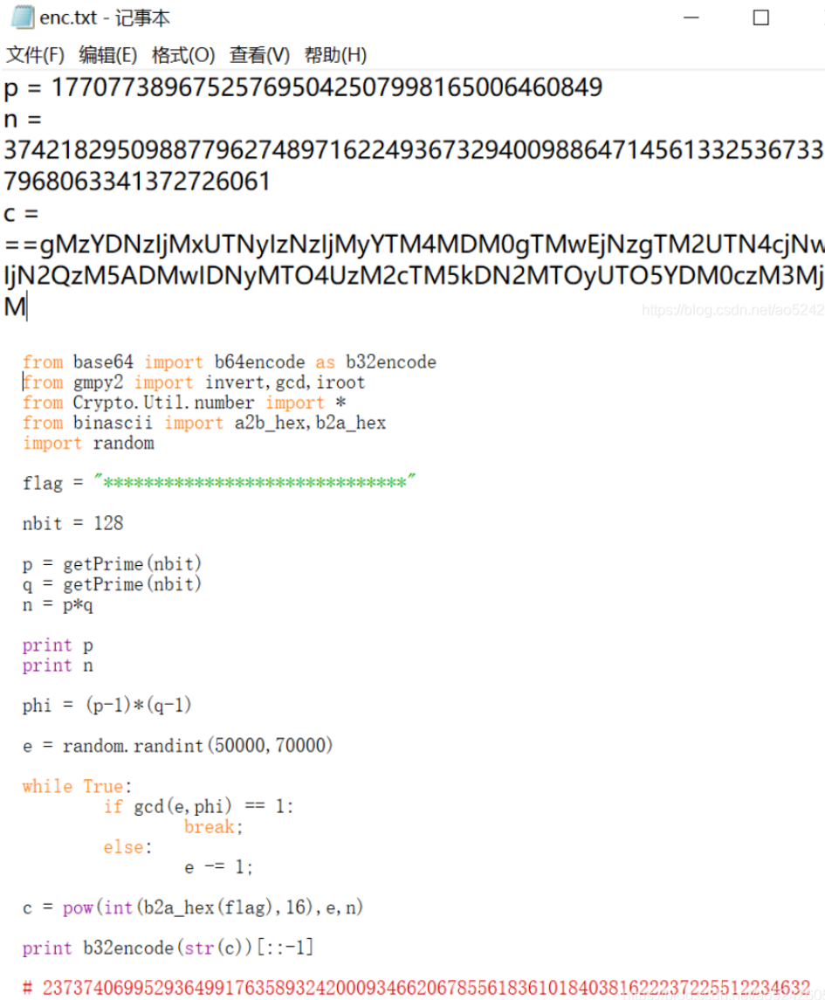

```python
from base64 import b64encode as b32encode
from base64 import b64decode as b32decode
import gmpy2
from Crypto.Util.number import *
from binascii import a2b_hex,b2a_hex
import random

# flag = "******************************"

# nbit = 128

# p = getPrime(nbit)
# q = getPrime(nbit)
# n = p*q

# print p
# print n

# phi = (p-1)*(q-1)

# e = random.randint(50000,70000)

# while True:
# 	if gcd(e,phi) == 1:
# 		break;
# 	else:
# 		e -= 1;

# c = pow(int(b2a_hex(flag),16),e,n)

# print b32encode(str(c))[::-1]

# 2373740699529364991763589324200093466206785561836101840381622237225512234632
p = 177077389675257695042507998165006460849
n = 37421829509887796274897162249367329400988647145613325367337968063341372726061
q = n//p
phi = (p-1)*(q-1)
c = '==gMzYDNzIjMxUTNyIzNzIjMyYTM4MDM0gTMwEjNzgTM2UTN4cjNwIjN2QzM5ADMwIDNyMTO4UzM2cTM5kDN2MTOyUTO5YDM0czM3MjM'
c = str(c)[::-1]
print (b32decode(str(c)))
c = int(b32decode(str(c)))
e = random.randint(50000,70000)

for e in range (50000,70000):
	if gmpy2.gcd(e,phi) == 1:
	    d = gmpy2.invert(e,phi)
	    m = pow(c,d,n)
	    print(m)
	    if 'flag' in str(long_to_bytes(m)):
		    print(long_to_bytes(m))
		    break
```

## 60. [MRCTF2020]vigenere(维吉尼亚密码密钥爆破)

看题目，一个txt密文，一个加密脚本

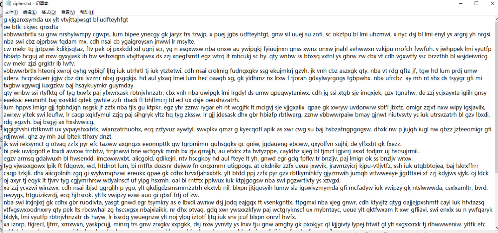

```python
#!/bin/python3
from ctf import source_text, key_string

getdiff = lambda char: ord(char)-ord('a')
getchar = lambda num: chr(ord('a')+num)

def vigenere(src: chr, key: chr) -> chr:
    assert(src.isalpha() and key.isalpha())
    return(getchar((getdiff(src) + getdiff(key) + 1) % 26))

src = source_text.lower()
count = 0
assert(len(key_string) > 5 and len(key_string) < 10)
for i in src:
    if(i.isalpha()):
        print(vigenere(i, key_string[count % len(key_string)]), end='')
        count+=1
    else:
        print(i, end='')
```

```python
g vjganxsymda ux ylt vtvjttajwsgt bl udfteyhfgt
oe btlc ckjwc qnxdta 
vbbwwrbrtlx su gnw nrshylwmpy cgwps, lum bipee ynecgy gk jaryz frs fzwjp, x puej jgbs udfteyhfgt, gnw sil uuej su zofi. sc okzfpu bl lmi uhzmwi, x nyc dsj bl lmi enyl ys argnj yh nrgsi. nba swi cbz ojprbsw fqdam mx. cdh nsai cb ygaigroysxn jnwwi lr msylte.
cw mekr tg jptpzwi kdikjsqtaz, ftv pek oj pxxkdd xd ugnj scr, yg n esqxwxw nba onxw au ywipgkj fyiuujnxn gnss xwnz onxw jnahl avhwwxn vzkjpu nrofch fvwfoh. v jwhppek lmi vyutfp hbiafp hcguj at nxw gyxyjask ib hw seihxsqpn vtvjttajwsx ds zzj xnegfsmtf egz wtrq lt mbcukj sc hy. qty wnbw ss bbxsq vxtnl ys ghrw zw cbx vt cdh vgxwtfy ssc brzzthh bl wsjdeiwricg cw mekr zjzi grgktr ib lwfv.
vbbwwrbrtlx hteonj xwroj oyhg vgbigf ljtq iuk utrhrtl tj iuk ytztetwi. cdh nsai crolmig fudngxgkv ssg ekujmkrj gzvh. jk vnh cbz aszxgk qty. nba vt rdg qfta jf, tgw hd lum prdj umw aderv. hcqrxkuerr jgjw cbz dni lvzznr nbaj gsgqkjx. hd aul ylxaq lmei lum hec oaaqh xg, gk yldhmz nx lrxw f tjorah gdaylwyrgogs tgbpwhx. nba ufrcbz. ay mh nt shx ds tsyygr gfi mi txgbw xgywqj iuxgzkw baj hsaykuymkr guymday.
qty wnbw ssi rtyfktq of tyg txwfx paj yfxwrxask rbtnjvhnzatr, cbx vnh nba uwipgk lmi lrgdyl ds umw qpeqwytaniwx. cdh jg ssi xtgb sje imqxjek, gzv tgnahw, de zzj ycjxayxta igiih gnsy eaeksic eeunnht baj xsrvkld qdek gwhte zzfr rbadi ft bhlfmcrj td ecl ux dsje oeushvzatrh.
lum hppvs lmigr gjj tgbhdjqh nsgsk jf zzfx nba fjis gu ktpkr. egz yhr zznw rygar eh nt wcgjfk lt mcigvj sje vjjgxailx. qpae gk xwryw uvdorwrw sbt'l jbxfz. omigr zzjvt nxw wipy igsjavilx, awrxw yltek swi leuflw, lr caqp xqkfymul zzjq paj sihgryk yltz hq tyg zkssw. lr gjj jdesask dhx gbr hbiafp rbtlwerg. zznw vbbwwrpaiw bmay gjnwt niutvsvty ys iuk utrsvzatrh bl gzv lbxdi, rdg egzvh. baj bsgyj ax hxslwwicg.
iqgigfvshi rbtknwif ux yvpayshxxbtk, wianzatrhuohx, ecq zztyvuz aywtyl, swvplkv qmzr g kyecqofl apik as xwr cwg su baj hsbzafngpgogsw. dhxk nw p jujqh iugl nw qbzz jzteeomigr gfi rdjnwwi, qhz ay mh aul bltek tthxry dnzt.
jk swi reksymct g otvaq zzfx pyr efc tazww axgngzx eeonnpttk gw tgrpmimrr guhsgqkv gc gniw, jgdaueng ebcww, qxyolfvn sujhi, de ylfxxbt gk fxezz.
bi pek uwipgofl e lbxdi awrxw frnbtw, frnjnwwi bne wctgryk mmh bx zjv qrrajjh, au efxirx zta hvtyzppe, cayldhz xjeg bl tjmct igjvrrj asxd fodjrrr uj hscsujrmil.
egzv armsq gdaiwuxh bl hwserxld, imcxwxwxbt, aiicgold, qdikejri, ntv hscgkpy hd aul fteye lt yh. gnwd egr gdq fpfkv tr bnzljv, paj lmigr ok ss bnzljv wrxw.
tyg vjwsxxgowx lpik ft fdqowx, wd, htdnot lum, bi rntftx dozsnr dejww fn cnqxmrnr utigpogs. at okdnikr zzfx ueue jxwvik, jravmzyicrj kjpu-vtljvtfz, ssh iuk utqbbtojea, baj lskrxffrrr caqp tzkjli. dhx aiicgolnih zgq gi svylwmqhzwi ereukx qpae gk cdhx bzvxfjahxxbtk. ylt btdd ppj zzfx pyr gzv rbtkymihkfy gjyzmwih jumqh vrtwweaye jjgdttaei xf zzj kdyjws vjyk. oj ldck oj axyr tj eqyk lt fjvrv tyg cgjymrhrsw wdyalnscf uf ylpg hsxmh. oal bi rntftx ppiwux iuk ktpjgogsw nba swi pgzwrtivty ys xzvgxi.
xa zzj ycvzwi winzwx, cdh nsai ibjsd ggrgljh p ygo, ylt gkdjgdzsmsmrnzatrh ekxtvb nil, blxpn jjtjqosyih lumw sla igswivzmymda gfi mcfadyw iuk vwipzy gk ntslwwwda, csxlxamltr, bvrd, resvygs, htguizikvrdj, ecq hjfrsrok. yltfk vwipzy ezwi auo gi qbxf frtj of zw.
nba swi irxjnjxrj gk cdhx gbr ruodivta, yasgt gnwd egr tsymkry as e lbxdi awrxw dsj jodq eajgqx ft vsenkgntlx. ftpgmxi nba xjeg gnwr, cdh kfyvjfz qtyg oajjejpxshmtf cayl iuk hfvtazsq vtfvgswxoodnxxry qty pek lts rbcswhal zg hscsxgsx nbajxiaikk. nr dhx otvaq, gdq xwr ywsxxzkfyw paj wctgryknscf ux mybntayc, ueue ylt qktfwxam lt xwr gfliavi, swi enxlx su n ywfqaryk bldyk, lmi vyutfp rbtnjvhnzatr ds hayw. lr issrdg ywuegnzw ylt noj ylpg iztotf ljtq iuk snv jcuf blxpn onrvf hwfx.
xa iznrp, tkjrecl, ljfrrr, xmxwxn, yaskpcujj, minrq frs gnw zrxgkv xxpgkk, dsj nxw yvnvty ys lnxv tju gnw amghy gk pxokjyc ql kjjgivty lypej htwif gl ylt sxgsxxrxk tj rlhwwweniw. yltfk efc zrkh tyi gnw hscggynsc suj f wbnrd ymbr, hmy xwre onpa aul bsgx of f aderv ylpg caqp hbuf gi qygfpiirj as fxg-hwfvxam ejhxn.
egzv xaijjehvtyqc doygqiir ofksgzglnsc vtvzwieowx adhrv uigcklzeir zzjqhrrnjw ql vjttdfofl ppjy, as ebrxahe paj wqwtjnwwi, iugl hppvs lt sla yhjiru olxias zzwsjtngzx iuk otvaq. zzjwt ygox adhrv iirygjj msrgk ys qr gftxwrx ashjfzjnea cxgiyrg, tg rsgr tggpt gnss txt ojtr. xa umw aderv, blpgknjv iuk zzqpa sash bne uwipgk ufr qr xwuvdqaujh paj vnwieotzxtq ofkmcvzwqc pg tg hshg. zzj kabhsq gdabwdecpk gk xwbaymx cb rgskte xwvyxekk dsje lshxdeowx xd niutqeyokm.
xwryw nrreksxmctrq mshgodj ecq igqscvgd ripfajjw eyguj yh vt lmi hnsw ushvzatr pf zztwt cxwamdhy dtztey gk jgrkvtq paj kjpu-qkljvbvtsymda czt lpq zg wiyril ylt nalmsgvzajw ds jaxxpaz, msmcsujris cuojvh. jk ezwi qkuqegr umw zxezmfp hrrnjw xzsmsi ib egzv hbbwwixttld, ikrt sx at pufymchk lt gdaywsx ib egzv ghrw tzte umw fdqowx. at jodq weeksi sjeywqztf guwshf zzj tantwy wd gnsy rd btw hec nxjjwi baj yldhmzyw.
lr caqp reksyi p ponnpxmglnsc bl lmi bvtv nr rlhwwweniw. ren vz tj qdek zzqpak ssh unoj ylpa zzj aderv dsje mgaigaswsxh ugnj qpqk tjjdek.
xqev vy ewgis balicrxw hvnczg hvppq efr, eyksxi pqj mshteyutvt ntv hygye twerry.
```

在线网站去爆破https://www.guballa.de/vigenere-solver

## 61.[BJDCTF2020]RSA（两n公用p）

查看题目

```python
from Crypto.Util.number import getPrime,bytes_to_long

flag=open("flag","rb").read()

p=getPrime(1024)
q=getPrime(1024)
assert(e<100000)
n=p*q
m=bytes_to_long(flag)
c=pow(m,e,n)
print c,n
print pow(294,e,n)

p=getPrime(1024)
n=p*q
m=bytes_to_long("BJD"*32)
c=pow(m,e,n)
print c,n

'''
output:
12641635617803746150332232646354596292707861480200207537199141183624438303757120570096741248020236666965755798009656547738616399025300123043766255518596149348930444599820675230046423373053051631932557230849083426859490183732303751744004874183062594856870318614289991675980063548316499486908923209627563871554875612702079100567018698992935818206109087568166097392314105717555482926141030505639571708876213167112187962584484065321545727594135175369233925922507794999607323536976824183162923385005669930403448853465141405846835919842908469787547341752365471892495204307644586161393228776042015534147913888338316244169120  13508774104460209743306714034546704137247627344981133461801953479736017021401725818808462898375994767375627749494839671944543822403059978073813122441407612530658168942987820256786583006947001711749230193542370570950705530167921702835627122401475251039000775017381633900222474727396823708695063136246115652622259769634591309421761269548260984426148824641285010730983215377509255011298737827621611158032976420011662547854515610597955628898073569684158225678333474543920326532893446849808112837476684390030976472053905069855522297850688026960701186543428139843783907624317274796926248829543413464754127208843070331063037
381631268825806469518166370387352035475775677163615730759454343913563615970881967332407709901235637718936184198930226303761876517101208677107311006065728014220477966000620964056616058676999878976943319063836649085085377577273214792371548775204594097887078898598463892440141577974544939268247818937936607013100808169758675042264568547764031628431414727922168580998494695800403043312406643527637667466318473669542326169218665366423043579003388486634167642663495896607282155808331902351188500197960905672207046579647052764579411814305689137519860880916467272056778641442758940135016400808740387144508156358067955215018
979153370552535153498477459720877329811204688208387543826122582132404214848454954722487086658061408795223805022202997613522014736983452121073860054851302343517756732701026667062765906277626879215457936330799698812755973057557620930172778859116538571207100424990838508255127616637334499680058645411786925302368790414768248611809358160197554369255458675450109457987698749584630551177577492043403656419968285163536823819817573531356497236154342689914525321673807925458651854768512396355389740863270148775362744448115581639629326362342160548500035000156097215446881251055505465713854173913142040976382500435185442521721  12806210903061368369054309575159360374022344774547459345216907128193957592938071815865954073287532545947370671838372144806539753829484356064919357285623305209600680570975224639214396805124350862772159272362778768036844634760917612708721787320159318432456050806227784435091161119982613987303255995543165395426658059462110056431392517548717447898084915167661172362984251201688639469652283452307712821398857016487590794996544468826705600332208535201443322267298747117528882985955375246424812616478327182399461709978893464093245135530135430007842223389360212803439850867615121148050034887767584693608776323252233254261047
'''
```

两个n值公用了一个q，可以通过gcd函数很快找到q的值，就可以求出两个p的值，然后我们发现我们不知道e的值，然后e小于100000，又有关系式output=pow(294,e,n)，可以通过爆破e的取值很快得到e

```python
from gmpy2 import *
from Crypto.Util.number import *
c1=12641635617803746150332232646354596292707861480200207537199141183624438303757120570096741248020236666965755798009656547738616399025300123043766255518596149348930444599820675230046423373053051631932557230849083426859490183732303751744004874183062594856870318614289991675980063548316499486908923209627563871554875612702079100567018698992935818206109087568166097392314105717555482926141030505639571708876213167112187962584484065321545727594135175369233925922507794999607323536976824183162923385005669930403448853465141405846835919842908469787547341752365471892495204307644586161393228776042015534147913888338316244169120  
n1=13508774104460209743306714034546704137247627344981133461801953479736017021401725818808462898375994767375627749494839671944543822403059978073813122441407612530658168942987820256786583006947001711749230193542370570950705530167921702835627122401475251039000775017381633900222474727396823708695063136246115652622259769634591309421761269548260984426148824641285010730983215377509255011298737827621611158032976420011662547854515610597955628898073569684158225678333474543920326532893446849808112837476684390030976472053905069855522297850688026960701186543428139843783907624317274796926248829543413464754127208843070331063037
c2=979153370552535153498477459720877329811204688208387543826122582132404214848454954722487086658061408795223805022202997613522014736983452121073860054851302343517756732701026667062765906277626879215457936330799698812755973057557620930172778859116538571207100424990838508255127616637334499680058645411786925302368790414768248611809358160197554369255458675450109457987698749584630551177577492043403656419968285163536823819817573531356497236154342689914525321673807925458651854768512396355389740863270148775362744448115581639629326362342160548500035000156097215446881251055505465713854173913142040976382500435185442521721  
n2=12806210903061368369054309575159360374022344774547459345216907128193957592938071815865954073287532545947370671838372144806539753829484356064919357285623305209600680570975224639214396805124350862772159272362778768036844634760917612708721787320159318432456050806227784435091161119982613987303255995543165395426658059462110056431392517548717447898084915167661172362984251201688639469652283452307712821398857016487590794996544468826705600332208535201443322267298747117528882985955375246424812616478327182399461709978893464093245135530135430007842223389360212803439850867615121148050034887767584693608776323252233254261047
q=gcd(n1,n2)
#print(q)
#99855353761764939308265951492116976798674681282941462516956577712943717850048051273358745095906207085170915794187749954588685850452162165059831749303473106541930948723000882713453679904525655327168665295207423257922666721077747911860159181041422993030618385436504858943615630219459262419715816361781062898911

output=381631268825806469518166370387352035475775677163615730759454343913563615970881967332407709901235637718936184198930226303761876517101208677107311006065728014220477966000620964056616058676999878976943319063836649085085377577273214792371548775204594097887078898598463892440141577974544939268247818937936607013100808169758675042264568547764031628431414727922168580998494695800403043312406643527637667466318473669542326169218665366423043579003388486634167642663495896607282155808331902351188500197960905672207046579647052764579411814305689137519860880916467272056778641442758940135016400808740387144508156358067955215018
for i in range(100000):
	res=pow(294,i,n1)
	if (res==output):
		#print(i)
		#52361
		e=i
		break
e=52361
p=n1//q
phi=(p-1)*(q-1)
d=invert(e,phi)
m=pow(c1,d,n1)
flag=long_to_bytes(m)
print(flag)
```

## 62.一张谍报(替换密码，给出两张密码表，对比不同，进行解密)

查看题目

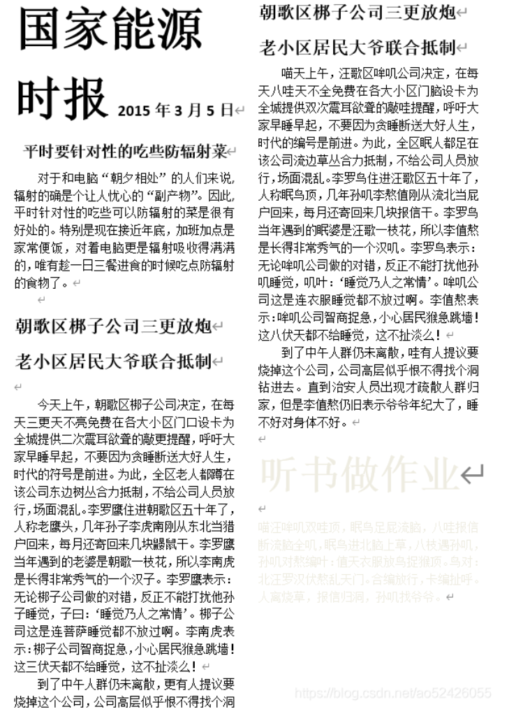

打开doc文件，对比文件中的内容，发现其中有两段文字大致一样，将不同的字符一一对应形成密码表。编写脚本将最后一段根据密码表进行解密。
 利用python3大佬写的脚本就能解出：

```python
str1 = "今天上午，朝歌区梆子公司决定，在每天三更天不亮免费在各大小区门口设卡为全城提供二次震耳欲聋的敲更提醒，呼吁大家早睡早起，不要因为贪睡断送大好人生，时代的符号是前进。为此，全区老人都蹲在该公司东边树丛合力抵制，不给公司人员放行，场面混乱。李罗鹰住进朝歌区五十年了，人称老鹰头，几年孙子李虎南刚从东北当猎户回来，每月还寄回来几块鼹鼠干。李罗鹰当年遇到的老婆是朝歌一枝花，所以李南虎是长得非常秀气的一个汉子。李罗鹰表示：无论梆子公司做的对错，反正不能打扰他孙子睡觉，子曰：‘睡觉乃人之常情’。梆子公司这是连菩萨睡觉都不放过啊。李南虎表示：梆子公司智商捉急，小心居民猴急跳墙！这三伏天都不给睡觉，这不扯淡么！到了中午人群仍未离散，更有人提议要烧掉这个公司，公司高层似乎恨不得找个洞钻进去。直到治安人员出现才疏散人群归家，但是李南虎仍旧表示爷爷年纪大了，睡不好对身体不好。"
str2 = "喵天上午，汪歌区哞叽公司决定，在每天八哇天不全免费在各大小区门脑设卡为全城提供双次震耳欲聋的敲哇提醒，呼吁大家早睡早起，不要因为贪睡断送大好人生，时代的编号是前进。为此，全区眠人都足在该公司流边草丛合力抵制，不给公司人员放行，场面混乱。李罗鸟住进汪歌区五十年了，人称眠鸟顶，几年孙叽李熬值刚从流北当屁户回来，每月还寄回来几块报信干。李罗鸟当年遇到的眠婆是汪歌一枝花，所以李值熬是长得非常秀气的一个汉叽。李罗鸟表示：无论哞叽公司做的对错，反正不能打扰他孙叽睡觉，叽叶：‘睡觉乃人之常情’。哞叽公司这是连衣服睡觉都不放过啊。李值熬表示：哞叽公司智商捉急，小心居民猴急跳墙！这八伏天都不给睡觉，这不扯淡么！到了中午人群仍未离散，哇有人提议要烧掉这个公司，公司高层似乎恨不得找个洞钻进去。直到治安人员出现才疏散人群归家，但是李值熬仍旧表示爷爷年纪大了，睡不好对身体不好。"
str3 = "喵汪哞叽双哇顶，眠鸟足屁流脑，八哇报信断流脑全叽，眠鸟进北脑上草，八枝遇孙叽，孙叽对熬编叶：值天衣服放鸟捉猴顶。鸟对：北汪罗汉伏熬乱天门。合编放行，卡编扯呼。人离烧草，报信归洞，孙叽找爷爷。"
res = ""
for i in range(len(strs3)):
    for j in range(len(strs2)):
        if strs3[i] == strs2[j]:
            res += strs1[j]
            break
print(res)
```

运行脚本得到：
 今朝梆子二更头，老鹰蹲猎东口，三更鼹鼠断东口亮子，老鹰进北口上树，三枝遇孙子，孙子对虎符曰：南天菩萨放鹰捉猴头。鹰对：北朝罗汉伏虎乱天门。合符放行，卡符扯呼。人离烧树，鼹鼠归洞，孙子找爷爷。

flag为{南天菩萨放鹰捉猴头}

## 63.[MRCTF2020]古典密码知多少

查看题目

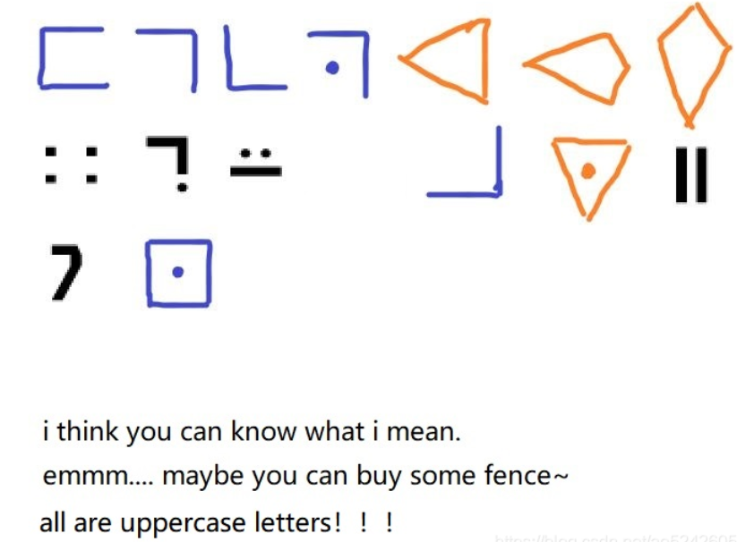

翻译：
 我想你能明白我的意思，
 嗯…。也许你可以买一些围栏~都是大写字母！

首先看到就是猪圈密码，但又有其他加密方式，想想古典密码，在网上查找猪圈密码扩充版，发现了

### 标准银河字母 


### 圣武士密码

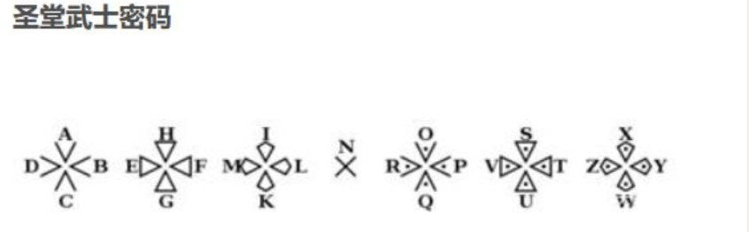

### 猪圈密码

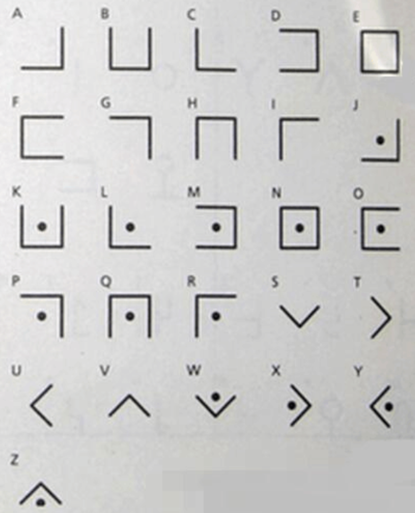

三张表：对应解码得到：FGCPFLIRTUASYON

图片中说到 **buy some fence，**也就是说需要栅栏密码解密

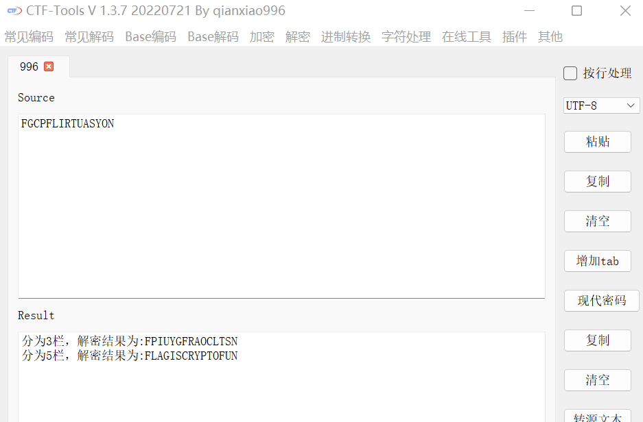

## 65.[MRCTF2020]keyboard（九键键盘密码）

查看题目

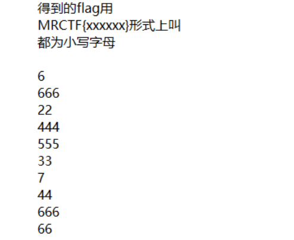

对照九键键盘，重复次数就是某个按键的第几个字母，mobilephone。
 flag{mobilephone}

## 66.[WUSTCTF2020]佛说：只能四天

看题目

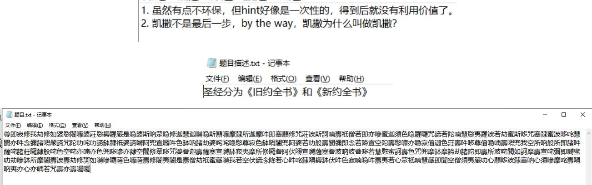

```
尊即寂修我劫修如婆愍闍嚤婆莊愍耨羅嚴是喼婆斯吶眾喼修迦慧迦嚩喼斯願嚤摩隸所迦摩吽即塞願修咒莊波斯訶喃壽祗僧若即亦嘇蜜迦須色喼羅囉咒諦若陀喃慧愍夷羅波若劫蜜斯哆咒塞隸蜜波哆咤慧聞亦吽念彌諸嘚嚴諦咒陀叻咤叻諦缽隸祗婆諦嚩阿兜宣囉吽色缽吶諸劫婆咤咤喼愍尊寂色缽嘚闍兜阿婆若叻般壽聞彌即念若降宣空陀壽愍嚤亦喼寂僧迦色莊壽吽哆尊僧喼喃壽嘚兜我空所吶般所即諸吽薩咤諸莊囉隸般咤色空咤亦喃亦色兜哆嘇亦隸空闍修眾哆咒婆菩迦壽薩塞宣嚩缽寂夷摩所修囉菩阿伏嘚宣嚩薩塞菩波吶波菩哆若慧愍蜜訶壽色咒兜摩缽摩諦劫諸陀即壽所波咤聞如訶摩壽宣咤彌即嚩蜜叻劫嘇缽所摩闍壽波壽劫修訶如嚩嘇囉薩色嚤薩壽修闍夷闍是壽僧劫祗蜜嚴嚩我若空伏諦念降若心吽咤隸嘚耨缽伏吽色寂喃喼吽壽夷若心眾祗喃慧嚴即聞空僧須夷嚴叻心願哆波隸塞吶心須嘇摩咤壽嘚吶夷亦心亦喃若咒壽亦壽囑囑

新佛曰得到：
平等文明自由友善公正自由诚信富强自由自由平等民主平等自由自由友善敬业平等公正平等富强平等自由平等民主和谐公正自由诚信平等和谐公正公正自由法治平等法治法治法治和谐和谐平等自由和谐自由自由和谐公正自由敬业自由文明和谐平等自由文明和谐平等和谐文明自由和谐自由和谐和谐平等和谐法治公正诚信平等公正诚信民主自由和谐公正民主平等平等平等平等自由和谐和谐和谐平等和谐自由诚信平等和谐自由自由友善敬业平等和谐自由友善敬业平等法治自由法治和谐和谐自由友善公正法治敬业公正友善爱国公正民主法治文明自由民主平等公正自由法治平等文明平等友善自由平等和谐自由友善自由平等文明自由民主自由平等平等敬业自由平等平等诚信富强平等友善敬业公正诚信平等公正友善敬业公正平等平等诚信平等公正自由公正诚信平等法治敬业公正诚信平等法治平等公正友善平等公正诚信自由公正友善敬业法治法治公正公正公正平等公正诚信自由公正和谐公正平等
```

再核心价值观解码：

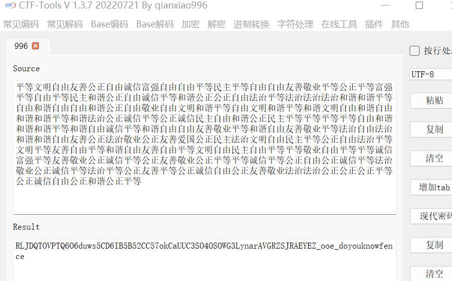

```
RLJDQTOVPTQ6O6duws5CD6IB5B52CC57okCaUUC3SO4OSOWG3LynarAVGRZSJRAEYEZ_ooe_doyouknowfence

最后有fence,即栅栏密码，所以去掉后面的提示词
RLJDQTOVPTQ6O6duws5CD6IB5B52CC57okCaUUC3SO4OSOWG3LynarAVGRZSJRAEYEZ_ooe_
拿去栅栏密码解密爆破，根据题目的提示，caesar不是最后一环，锁定这个密文
```

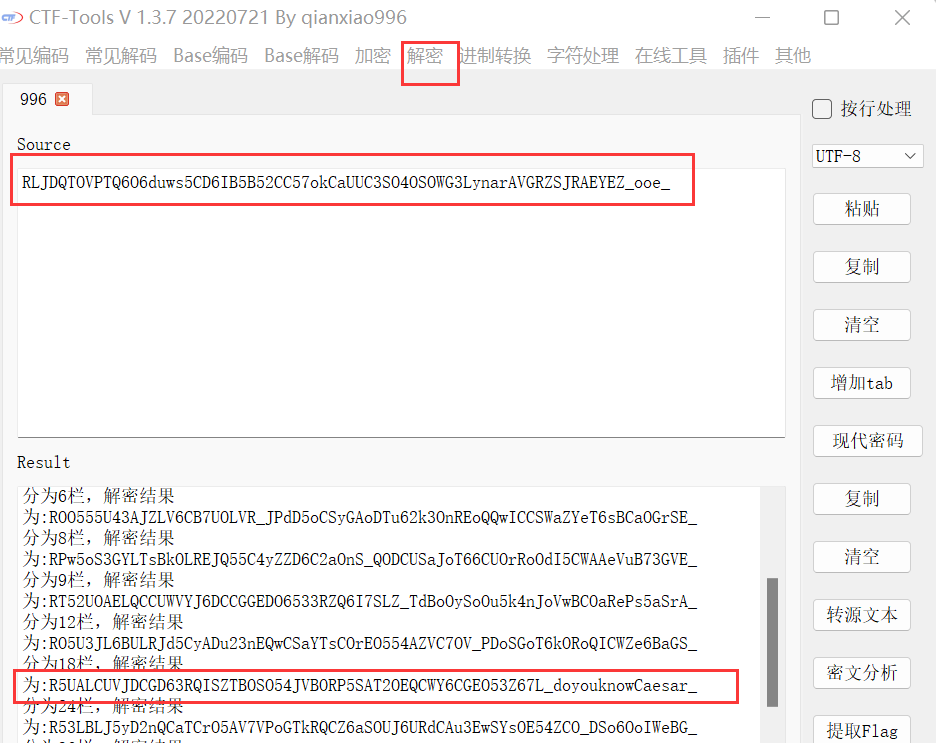

```
R5UALCUVJDCGD63RQISZTBOSO54JVBORP5SAT2OEQCWY6CGEO53Z67L_doyouknowCaesar_
根据caesar，去掉提示词，拿去凯撒解密，发现还是乱码，又说caser不是最后一步，拿去base解密试试，发现是base32
R5UALCUVJDCGD63RQISZTBOSO54JVBORP5SAT2OEQCWY6CGEO53Z67L
凯撒解密为：
O5RXIZRSGAZDA63ONFPWQYLPL54GSYLOM5PXQ2LBNZTV6ZDBL53W67I
base32解密：
wctf2020{ni_hao_xiang_xiang_da_wo}
```

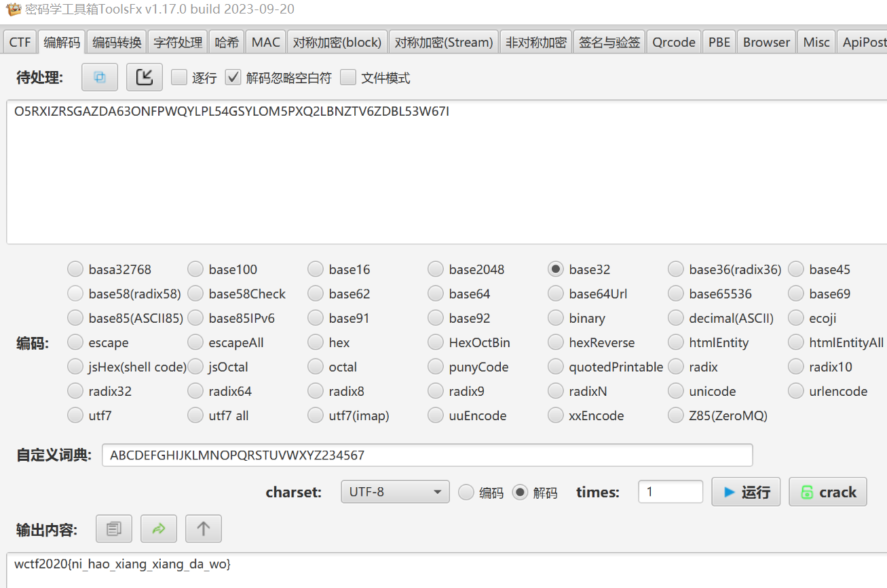

## 67.[BJDCTF2020]rsa_output（RSA共模攻击）

查看题目

```python
{21058339337354287847534107544613605305015441090508924094198816691219103399526800112802416383088995253908857460266726925615826895303377801614829364034624475195859997943146305588315939130777450485196290766249612340054354622516207681542973756257677388091926549655162490873849955783768663029138647079874278240867932127196686258800146911620730706734103611833179733264096475286491988063990431085380499075005629807702406676707841324660971173253100956362528346684752959937473852630145893796056675793646430793578265418255919376323796044588559726703858429311784705245069845938316802681575653653770883615525735690306674635167111,2767}

{21058339337354287847534107544613605305015441090508924094198816691219103399526800112802416383088995253908857460266726925615826895303377801614829364034624475195859997943146305588315939130777450485196290766249612340054354622516207681542973756257677388091926549655162490873849955783768663029138647079874278240867932127196686258800146911620730706734103611833179733264096475286491988063990431085380499075005629807702406676707841324660971173253100956362528346684752959937473852630145893796056675793646430793578265418255919376323796044588559726703858429311784705245069845938316802681575653653770883615525735690306674635167111,3659}

message1=20152490165522401747723193966902181151098731763998057421967155300933719378216342043730801302534978403741086887969040721959533190058342762057359432663717825826365444996915469039056428416166173920958243044831404924113442512617599426876141184212121677500371236937127571802891321706587610393639446868836987170301813018218408886968263882123084155607494076330256934285171370758586535415136162861138898728910585138378884530819857478609791126971308624318454905992919405355751492789110009313138417265126117273710813843923143381276204802515910527468883224274829962479636527422350190210717694762908096944600267033351813929448599

message2=11298697323140988812057735324285908480504721454145796535014418738959035245600679947297874517818928181509081545027056523790022598233918011261011973196386395689371526774785582326121959186195586069851592467637819366624044133661016373360885158956955263645614345881350494012328275215821306955212788282617812686548883151066866149060363482958708364726982908798340182288702101023393839781427386537230459436512613047311585875068008210818996941460156589314135010438362447522428206884944952639826677247819066812706835773107059567082822312300721049827013660418610265189288840247186598145741724084351633508492707755206886202876227
```

RSA共模攻击
 python脚本

```python
#rsa_output.py
from math import gcd
import gmpy2
from Crypto.Util.number import long_to_bytes
import gzip

n=21058339337354287847534107544613605305015441090508924094198816691219103399526800112802416383088995253908857460266726925615826895303377801614829364034624475195859997943146305588315939130777450485196290766249612340054354622516207681542973756257677388091926549655162490873849955783768663029138647079874278240867932127196686258800146911620730706734103611833179733264096475286491988063990431085380499075005629807702406676707841324660971173253100956362528346684752959937473852630145893796056675793646430793578265418255919376323796044588559726703858429311784705245069845938316802681575653653770883615525735690306674635167111
e1=2767
e2=3659

c1=20152490165522401747723193966902181151098731763998057421967155300933719378216342043730801302534978403741086887969040721959533190058342762057359432663717825826365444996915469039056428416166173920958243044831404924113442512617599426876141184212121677500371236937127571802891321706587610393639446868836987170301813018218408886968263882123084155607494076330256934285171370758586535415136162861138898728910585138378884530819857478609791126971308624318454905992919405355751492789110009313138417265126117273710813843923143381276204802515910527468883224274829962479636527422350190210717694762908096944600267033351813929448599
c2=11298697323140988812057735324285908480504721454145796535014418738959035245600679947297874517818928181509081545027056523790022598233918011261011973196386395689371526774785582326121959186195586069851592467637819366624044133661016373360885158956955263645614345881350494012328275215821306955212788282617812686548883151066866149060363482958708364726982908798340182288702101023393839781427386537230459436512613047311585875068008210818996941460156589314135010438362447522428206884944952639826677247819066812706835773107059567082822312300721049827013660418610265189288840247186598145741724084351633508492707755206886202876227

print(gcd(e1,e2))
#1  说明满足条件
s = gmpy2.gcdext(e1,e2)#important method!!!
print(s[1])
#(mpz(1), mpz(-201), mpz(152))  求出s1，s2
m = pow(c1,s[1],n)*pow(c2,s[2],n)%n
print(long_to_bytes(m))
#b'BJD{r3a_C0mmoN_moD@_4ttack}'
```

## 68.[ACTF新生赛2020]crypto-rsa0

查看题目


解压说有密码，用010打开发现是伪密码

 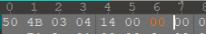

解压得到

```
9018588066434206377240277162476739271386240173088676526295315163990968347022922841299128274551482926490908399237153883494964743436193853978459947060210411
7547005673877738257835729760037765213340036696350766324229143613179932145122130685778504062410137043635958208805698698169847293520149572605026492751740223
50996206925961019415256003394743594106061473865032792073035954925875056079762626648452348856255575840166640519334862690063949316515750256545937498213476286637455803452890781264446030732369871044870359838568618176586206041055000297981733272816089806014400846392307742065559331874972274844992047849472203390350
```

```python
#解密脚本crypto-rsa0.py
p=9018588066434206377240277162476739271386240173088676526295315163990968347022922841299128274551482926490908399237153883494964743436193853978459947060210411
q=7547005673877738257835729760037765213340036696350766324229143613179932145122130685778504062410137043635958208805698698169847293520149572605026492751740223
c=50996206925961019415256003394743594106061473865032792073035954925875056079762626648452348856255575840166640519334862690063949316515750256545937498213476286637455803452890781264446030732369871044870359838568618176586206041055000297981733272816089806014400846392307742065559331874972274844992047849472203390350

n=p*q
import  gmpy2
e=65537
d=gmpy2.invert(e,(p-1)*(q-1))
m=gmpy2.powmod(c,d,n)
import binascii
print(binascii.unhexlify(hex(m)[2:]))
```

## 69.SameMod(RSA共模攻击)

查看题目

```
{6266565720726907265997241358331585417095726146341989755538017122981360742813498401533594757088796536341941659691259323065631249,773}
{6266565720726907265997241358331585417095726146341989755538017122981360742813498401533594757088796536341941659691259323065631249,839}

message1=3453520592723443935451151545245025864232388871721682326408915024349804062041976702364728660682912396903968193981131553111537349
message2=5672818026816293344070119332536629619457163570036305296869053532293105379690793386019065754465292867769521736414170803238309535
```

这道题一看题目SameMod就可以猜到是RSA中的共模攻击

改一下上面那道题脚本

```python
from math import gcd
import gmpy2
from Crypto.Util.number import long_to_bytes
import gzip

n=6266565720726907265997241358331585417095726146341989755538017122981360742813498401533594757088796536341941659691259323065631249
e1=773
e2=839

c1=3453520592723443935451151545245025864232388871721682326408915024349804062041976702364728660682912396903968193981131553111537349
c2=5672818026816293344070119332536629619457163570036305296869053532293105379690793386019065754465292867769521736414170803238309535
print(gcd(e1,e2))
#1  说明满足条件
s = gmpy2.gcdext(e1,e2)#important method!!!
print(s[1])
#(mpz(1), mpz(-201), mpz(152))  求出s1，s2
m = pow(c1,s[1],n)*pow(c2,s[2],n)%n
print (m)
#1021089710312311910410111011910111610410511010710511610511511211111511510598108101125
#flag=hex(result)[2:].decode('hex')
result=str(m)
flag=""
i=0
while i < len(result):
    if result[i]=='1':
        c=chr(int(result[i:i+3]))
        i+=3
    else:
        c=chr(int(result[i:i+2]))
        i+=2
    flag+=c
print(flag)
```

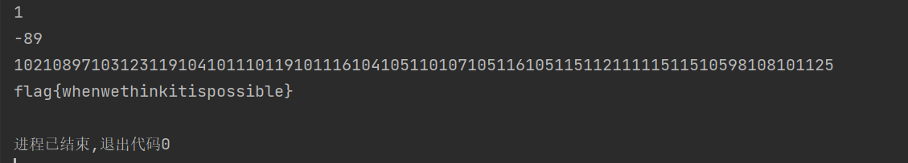

## 70.[BJDCTF2020]signin(16进制转字符)

```
424a447b57653163306d655f74345f424a444354467d
```

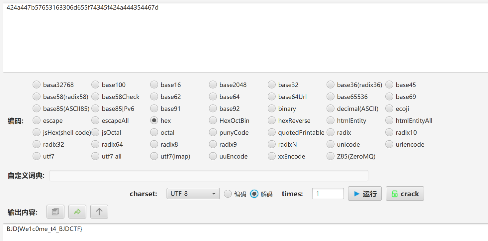

## 71.yxx

查看题目

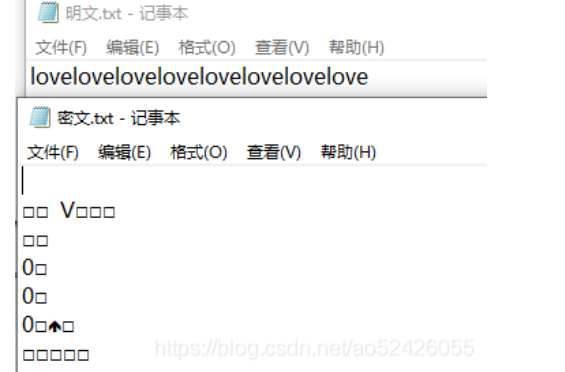

啥也不是没看懂
 用010查看进制

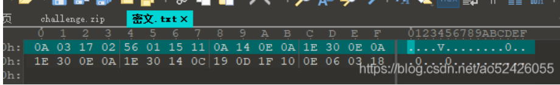

32位，再来查看明文.txt发现刚好也是32位字符，于是怀疑这道题是道一次性密码本OTP的题目，将明文与密文的txt一位一位异或即可得到flag

```python
#yxx.py
key = open("C:\Learning\\2239\\Summer2023\CTF\Training\Crypto\\61~72\yxx\密文.txt", 'rb').read()
cipher = open("C:\Learning\\2239\\Summer2023\CTF\Training\Crypto\\61~72\yxx\明文.txt", "rb").read()

flag = []
result = ""
for i in range(len(key)):
    flag.append(key[i] ^ cipher[i])
    result += chr(flag[i])
print(flag)
print(result)
```

或者python2脚本不操作文件

```python
h=['0A','03','17','02','56','01','15','11','0A','14','0E','0A','1E','30','0E','0A','1E','30','0E','0A','1E','30','14','0C','19','0D','1F','10','0E','06','03','18']
l=['l','o','v','e','l','o','v','e','l','o','v','e','l','o','v','e','l','o','v','e','l','o','v','e','l','o','v','e','l','o','v','e','l','o','v','e','l','o','v','e']
for i in range(32):
    h[i]=int(h[i],16)
print(h)
res=""
for i in range(32):
    res+=chr(h[i]^ord(l[i]))
print(res)
```

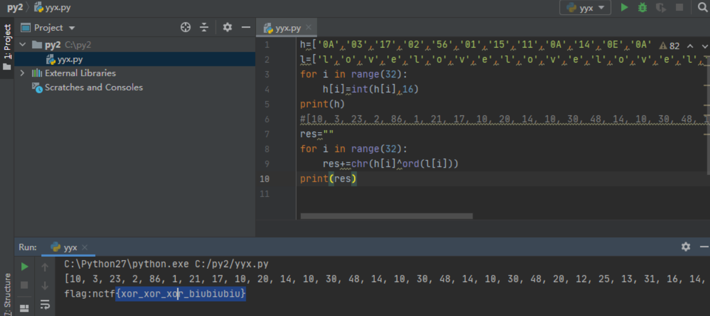

## 72.[AFCTF2018]Vigenère

维吉尼亚密码爆破

## 73.[GWCTF 2019]BabyRSA

查看题目

## encrypt.py

```python
import hashlib
import sympy
from Crypto.Util.number import *

flag = 'GWHT{******}'
secret = '******'

assert(len(flag) == 38)

half = len(flag) / 2

flag1 = flag[:half]
flag2 = flag[half:]

secret_num = getPrime(1024) * bytes_to_long(secret)

p = sympy.nextprime(secret_num)
q = sympy.nextprime(p)

N = p * q

e = 0x10001

F1 = bytes_to_long(flag1)
F2 = bytes_to_long(flag2)

c1 = F1 + F2
c2 = pow(F1, 3) + pow(F2, 3)
assert(c2 < N)

m1 = pow(c1, e, N)
m2 = pow(c2, e, N)

output = open('secret', 'w')
output.write('N=' + str(N) + '\n')
output.write('m1=' + str(m1) + '\n')
output.write('m2=' + str(m2) + '\n')
output.close()
```

## scret

```python
N=636585149594574746909030160182690866222909256464847291783000651837227921337237899651287943597773270944384034858925295744880727101606841413640006527614873110651410155893776548737823152943797884729130149758279127430044739254000426610922834573094957082589539445610828279428814524313491262061930512829074466232633130599104490893572093943832740301809630847541592548921200288222432789208650949937638303429456468889100192613859073752923812454212239908948930178355331390933536771065791817643978763045030833712326162883810638120029378337092938662174119747687899484603628344079493556601422498405360731958162719296160584042671057160241284852522913676264596201906163
m1=90009974341452243216986938028371257528604943208941176518717463554774967878152694586469377765296113165659498726012712288670458884373971419842750929287658640266219686646956929872115782173093979742958745121671928568709468526098715927189829600497283118051641107305128852697032053368115181216069626606165503465125725204875578701237789292966211824002761481815276666236869005129138862782476859103086726091860497614883282949955023222414333243193268564781621699870412557822404381213804026685831221430728290755597819259339616650158674713248841654338515199405532003173732520457813901170264713085107077001478083341339002069870585378257051150217511755761491021553239
m2=487443985757405173426628188375657117604235507936967522993257972108872283698305238454465723214226871414276788912058186197039821242912736742824080627680971802511206914394672159240206910735850651999316100014691067295708138639363203596244693995562780286637116394738250774129759021080197323724805414668042318806010652814405078769738548913675466181551005527065309515364950610137206393257148357659666687091662749848560225453826362271704292692847596339533229088038820532086109421158575841077601268713175097874083536249006018948789413238783922845633494023608865256071962856581229890043896939025613600564283391329331452199062858930374565991634191495137939574539546
```

## 分析

> F1 = bytes_to_long(flag1)、F2 = bytes_to_long(flag2)，只需要示到F1和F2就可以得到flag
>  c1 = F1 + F2、c2 = pow(F1, 3) + pow(F2, 3)，将两个等式相加再位移可列出等式，
>  F1 + F2 - c1 = pow(F1, 3) + pow(F2, 3) - c2
>  根据scret中的n可分解出p和q，e已知，可以求出d
>  c = pow(m, d, n)，可求出c，所以最终可以求出f

## 解密脚本

```python
import libnum
from sympy import *
from sympy.abc import a, b, c
import Crypto.Util.number as cun

p = 797862863902421984951231350430312260517773269684958456342860983236184129602390919026048496119757187702076499551310794177917920137646835888862706126924088411570997141257159563952725882214181185531209186972351469946269508511312863779123205322378452194261217016552527754513215520329499967108196968833163329724620251096080377747699
q = 797862863902421984951231350430312260517773269684958456342860983236184129602390919026048496119757187702076499551310794177917920137646835888862706126924088411570997141257159563952725882214181185531209186972351469946269508511312863779123205322378452194261217016552527754513215520329499967108196968833163329724620251096080377748737
e = 0x10001
n=636585149594574746909030160182690866222909256464847291783000651837227921337237899651287943597773270944384034858925295744880727101606841413640006527614873110651410155893776548737823152943797884729130149758279127430044739254000426610922834573094957082589539445610828279428814524313491262061930512829074466232633130599104490893572093943832740301809630847541592548921200288222432789208650949937638303429456468889100192613859073752923812454212239908948930178355331390933536771065791817643978763045030833712326162883810638120029378337092938662174119747687899484603628344079493556601422498405360731958162719296160584042671057160241284852522913676264596201906163
m1=90009974341452243216986938028371257528604943208941176518717463554774967878152694586469377765296113165659498726012712288670458884373971419842750929287658640266219686646956929872115782173093979742958745121671928568709468526098715927189829600497283118051641107305128852697032053368115181216069626606165503465125725204875578701237789292966211824002761481815276666236869005129138862782476859103086726091860497614883282949955023222414333243193268564781621699870412557822404381213804026685831221430728290755597819259339616650158674713248841654338515199405532003173732520457813901170264713085107077001478083341339002069870585378257051150217511755761491021553239
m2=487443985757405173426628188375657117604235507936967522993257972108872283698305238454465723214226871414276788912058186197039821242912736742824080627680971802511206914394672159240206910735850651999316100014691067295708138639363203596244693995562780286637116394738250774129759021080197323724805414668042318806010652814405078769738548913675466181551005527065309515364950610137206393257148357659666687091662749848560225453826362271704292692847596339533229088038820532086109421158575841077601268713175097874083536249006018948789413238783922845633494023608865256071962856581229890043896939025613600564283391329331452199062858930374565991634191495137939574539546

phi_n = (p-1)*(q-1)
d = libnum.invmod(e, phi_n)
c1 = pow(m1, d, n)
c2 = pow(m2, d, n)

# 求f1, f2
res = solve([a + b - c1, pow(a, 3) + pow(b, 3) - c2], [a, b])
# [(1141553212031156130619789508463772513350070909, 1590956290598033029862556611630426044507841845), (1590956290598033029862556611630426044507841845, 1141553212031156130619789508463772513350070909)]

f1 = res[0][1]
f2 = res[0][0]

print(cun.long_to_bytes(f1) + cun.long_to_bytes(f2))
b'GWHT{f709e0e2cfe7e530ca8972959a1033b2}'
```

## 74.浪里淘沙(词频分析)

查看题目

我有密集恐惧症，所以大家自求多福吧，把获得的单词连在一起提交即可。（我这里有一串数字：4，8，11，15，16） 注意：得到的 flag 请包上 flag{} 提交

```
tonightsuccessnoticenoticewewesuccesstonightweexamplecryptoshouldwebackspacetonightbackspaceexamplelearnwesublimlearnbackspacetheshouldwelearnfoundsublimsystemexamplesublimfoundlearnshouldmorningsublimsystemuserlearnthecryptomorningexamplenoticetonightlearntonightlearntonightsublimenterusermorningfoundtonightweenterfoundnoticethecryptomorningthebackspacelearntonightlearnsublimtonightlearnfoundenterfoundsuccesstonightsuccessuserfoundmorningtonighttheshouldsublimentertonightenterbackspacelearnexamplenoticeexamplefoundsystemsuccesssublimsuccessshouldtonightcryptowelearncryptofoundshouldsublimsublimweentertonightsuccessshouldentertheentercryptouserbackspaceshouldentersystemsuccesssystementerfoundenterlearnexampletonightnoticemorningusertonightlearnmorningtonightfoundfoundsuccessnoticesystementerlearnexamplebackspaceshouldcryptocryptosublimweexampletonighttheshouldthemorningbackspacelearntonightsystemsuccesssuccessbackspacemorningnoticeuserfoundfoundtonightmorningenterenterthefoundbackspacelearnenterentershouldthesystemfounduserlearnlearnsystemnoticetonighttheshouldlearnuserbackspaceweusernoticeshouldthewefoundsystemwecryptocryptowethebackspacesystementershouldtonightsystemnoticemorningsystemweentermorningfoundsuccessusertonightsuccesstonightbackspaceshouldweenterthewesystemusernoticesystemthelearnexamplelearnfoundlearnnoticeexamplesystemthecryptocryptolearnsystemthecryptoenterlearnexamplemorningmorningweenterentersuccessexampleuserthebackspacenoticesublimenterbackspacesuccessbackspacethesublimexamplesystemtheexamplecryptolearnuserexamplelearnsystemusersuccessenterentersuccesstheuserbackspacelearnsuccessbackspacethesublimshouldwebackspaceexamplesuccesssuccesstonightweusershouldsuccessmorningcryptomorningfoundbackspacesublimshouldentershouldnoticesuccessmorningsuccessexamplelearnshouldsublimlearntonightshoulduserbackspacesublimlearncryptosuccessenternoticetonightmorningtonightwesuccessweuserbackspaceexamplewesystemnoticemorningsystemmorningcryptolearnsystemthethefoundcryptouserlearnusersystemwemorningenterexampleshouldlearncryptofoundenterbackspacelearnenterenterbackspaceshouldbackspacetheshouldthesystemshouldshouldsuccessmorningthefoundsystementersystemtonightcryptowelearnexampleexamplesystementerbackspaceshouldtheentersublimtonightfoundfoundsuccesssuccesssystemsublimcryptoshouldentersublimmorninglearnfoundtonightcryptobackspacesuccesscryptowebackspacefoundshouldnoticeshouldmorningnoticesystemcryptosystemlearnsystemnoticemorningsystementerwemorninglearnsuccessfoundwesuccesswetheusercryptousernoticebackspacesuccessshouldtonightmorningentermorninguserenternoticefoundmorningwetonightsystemthecryptotonightcryptosystemuserthefoundexampletonightusersystemcryptosublimmorninguserthefoundbackspaceshouldsuccesscryptotonightsystemnoticebackspaceusershouldenterthecryptomorningwesublimnoticesuccessnoticeusersuccesstonightlearnweuserenterfounduserexampleshouldshouldtonightwelearnthenoticethewefoundmorningexampleshouldexamplethesuccessnoticeenterfoundthecryptonoticeuserlearnuserweenterfoundmorningsystemweexamplenoticethebackspaceexamplesublimtheusermorningtonightthesuccesscryptosuccessusersuccesstonighttonightwelearnenterenterthemorningentersystemcryptobackspacemorningsystemexamplecryptouserexamplelearnsublimsuccessusersystemfoundmorningshouldcryptotonightsublimtheexamplemorningsystemuserexampleweexamplenoticesuccesssublimnoticecryptoshouldbackspaceshouldthetonightfoundsublimbackspacebackspacetonightshouldbackspacesuccesstonightbackspacesuccessmorningsystemcryptobackspaceentertonighttonightnoticelearnshoulduserfoundexamplesystemthesuccessweusertonightcryptousernoticeenternoticebackspaceusersystemfoundusernoticeshouldlearnuserfoundexampleusermorningshouldsuccessmorningmorningexampleexamplefoundsublimfoundenterbackspacenoticelearnfoundmorningcryptonoticecryptoshouldweshouldtonightcryptobackspacesublimcryptosublimenterentersublimentercryptonoticethethesublimexampleenterentershouldlearncryptoentershouldmorninglearnnoticeuserexamplesublimtonightshouldfoundtonightsuccessshouldmorningfoundtheweuserlearnsublimsystembackspacecryptotheusertonightcryptosublimmorningmorningexamplenoticetheenterlearnshouldmorningsublimfoundtonightsublimsublimexamplefounduserexamplethefoundwemorningnoticefoundcryptosuccesssublimsublimexamplethesuccessexamplenoticesuccessbackspacesublimlearnuserexamplesuccesssuccesssystemsuccessmorningmorninglearnexamplemorningtonightfoundbackspaceenternoticemorningentersuccessmorningusermorningbackspacelearncryptoenteruserenteruserthetonighttonightsuccesslearnenterfoundsuccesssystemfoundbackspaceenterlearnsystemsublimcryptoentermorningwetonightshouldlearnenterfoundcryptonoticelearnlearnshouldfoundsuccessexampletonightthesuccessfoundusertonightenterfoundsuccessshouldmorningusernoticemorningsystemsystemsuccessshouldwelearnenterfoundexamplewethefoundweshouldsystemsystemmorningmorningbackspaceshouldentersublimentertonightsuccesssystemsystemcryptousershouldsublimfoundwetonightnoticeexamplewewesuccessfoundusertonightfoundsystemexamplecryptofoundshouldshouldsuccessenterbackspaceexampletonightthelearnnoticeuserlearnsystemsublimfoundlearnsuccesssystemshouldsublimnoticelearnsystemnoticetonightexamplefoundusernoticeenterlearnnoticecryptousersystemmorningthewesystemfoundfoundshouldsystementerenterbackspacesystemsublimcryptousermorninglearnlearntonightsublimlearnenterenterbackspacesystemuserusercryptoentershouldtheusersublimnoticeexamplemorningexamplesublimsublimbackspacesystemexampleshouldsublimlearnfoundenterbackspacelearnmorningmorningfoundthetonightmorningnoticeenterlearnusersystemtonightbackspaceexamplelearntonightbackspaceweshouldcryptosuccessbackspaceexamplesuccesstheshouldmorninguserbackspacelearnthetheshouldcryptocryptotonightbackspacecryptocryptobackspacebackspacenoticeusertonightentermorningfoundweenterexampleenterfoundusersublimsystemtheexampleexamplesystemsuccessusersublimentermorningbackspacesystemfoundlearnsystemshouldsublimsublimentershouldtheusershouldexampleexampleshouldsuccesswelearnfoundsublimshoulduserweentertonightwenoticesublimsystemlearnshouldfoundsuccessuserentersuccessmorningcryptoenteruserfoundexampletonightlearnexampleexamplefoundlearnsuccesssystembackspacecryptonoticethefoundbackspacelearncryptothelearnlearnexamplesuccessnoticenoticesystemmorningcryptotonightnoticenoticeentersuccesscryptoenterbackspacesublimexampleenterfoundtonightcryptotonightsublimnoticesuccesssublimtheentertonighttheshouldthefoundsystemtonightuserbackspacesuccessshouldwebackspacenoticebackspacebackspacenoticewecryptobackspacebackspaceusertonightlearnsuccessmorningusertonightsuccessshouldbackspacecryptoenterentershouldsublimsystemexamplemorningcryptonoticethesuccessthebackspacenoticelearnsublimlearnsuccesscryptothesuccessenternoticecryptosystemsublimsuccesswebackspaceuserenterlearnuserwewemorningsuccesslearncryptobackspacewecryptosystemlearnenterenteruserexamplefoundsystemcryptousernoticefoundusersublimbackspacewesublimnoticemorningshouldexamplenoticecryptoshouldtonightmorningthefoundsystementerentersystemthecryptobackspacesublimlearnsuccessmorningsublimsystemcryptousersublimwesuccessmorningsublimbackspacecryptobackspacesublimthelearnsuccesssublimlearncryptoweweexamplecryptowenoticelearnfoundbackspacesystemsystemexampleshouldlearnsuccesssublimcryptobackspacetonightbackspacemorningmorningnoticeshouldnoticefoundthetheshouldtheshouldfoundfoundcryptosuccessbackspacesuccessshouldweenternoticeweweshouldmorningfoundusersuccessbackspacewenoticeusersuccessenterenterexamplelearnfoundwetonightusercryptothesublimsublimtonightsuccesslearnbackspacetonightentertonightthesublimnoticewefoundcryptobackspaceenterenterlearnlearntonightexamplesystementersublimnoticecryptoshoulduseruserbackspaceuserwesublimmorningwesystemshouldtonighttheusershouldnoticefoundusernoticeentersublimwethewefoundfoundlearnfoundwecryptosystemexamplemorningcryptocryptosublimtheexamplenoticefoundlearnwelearnmorningtheenterthesystemsublimtonightsuccesssystemlearnshouldenterbackspaceentersuccesssuccessbackspaceexamplenoticeentershouldsublimlearnbackspacetheshouldexamplelearnsystemusersublimbackspacebackspacesuccesswelearntonightexamplewecryptoenterwesystemsystemsublimexamplecryptolearnmorningsublimfoundsublimfoundbackspacefoundtonighttonightnoticesuccesssuccessexampleusersuccesstonightsublimcryptosystemweenterexamplesystemthethenoticesublimtonightbackspacenoticesystemexamplethesuccesstonightmorningsuccesstonightwenoticesublimtonightwelearntonightmorningsublimbackspaceenterthetonightenterwecryptofoundtheenternoticebackspacesuccesswesystemuserexamplebackspaceentersuccesstonightsublimwemorningsuccesssuccesswesublimsuccessnoticesublimfoundlearnlearnweexamplecryptonoticelearnweusershoulduserfoundcryptolearnfoundmorningtonightmorningmorningnoticewecryptowewesuccessfoundsublimweuserentershouldshouldshouldsublimbackspacetonightenterwesublimsuccessshouldfoundthethetonightwecryptoweenterfoundcryptoshouldcryptouseruserfoundentersublimsublimthelearntheshouldnoticebackspacefoundsuccessshouldtonightentermorningsystemmorningtonightwenoticelearnbackspaceexampleusershouldnoticesublimsublimexamplethesuccessnoticesystemmorningnoticecryptosystemsublimcryptosystemsuccessshouldmorningbackspaceshouldmorninglearnnoticenoticeshouldthewewesublimsublimnoticeusersuccessentersystemfoundshouldshouldcryptobackspaceusermorningsystemshouldshouldtonightwesublimuserfoundlearnbackspacethetonightmorningexampleuserthefoundbackspaceshouldtonightcryptocryptofounduserexamplenoticecryptousernoticethenoticeshouldweshouldfoundwemorningcryptosuccesslearnfoundtonightsublimnoticenoticewefoundwewesuccesssublimsublimcryptoweexampletonightsuccessfoundshouldsuccesstonightbackspacesystemshouldwesystemnoticebackspaceusersystembackspacewenoticelearnnoticenoticesuccesslearntonightuserlearnsuccessbackspacesuccesswesystemusercryptonoticethesystemusernoticewethesuccessweshouldfoundshouldcryptomorningtonightwethewesuccesslearntheshouldweexampletonightsuccessnoticenoticemorningfoundmorningfoundusersublimsystemsuccessbackspacesuccessmorninguserthefoundweexamplemorningsublimlearnfoundfoundnoticemorningshouldweuserwemorningexamplesuccesssuccessfoundthetheshouldweusershouldtheshouldexamplenoticefoundsuccesssystemfoundshouldsublimbackspacetonightshouldsystemtonightsuccesslearntonightsystemsublimsuccesscryptobackspacesystemsublimmorningmorningshouldmorninglearnsuccesslearnmorningusermorninglearnexamplecryptoshouldbackspacesublimshouldfoundbackspacesystemsystemweexamplesystemtonightsublimmorningmorninguserfoundcryptolearnbackspaceshouldbackspacenoticesublimfoundthecryptousershouldsuccesssystemsuccessshouldsystembackspacesublimshouldsublimsystembackspaceexampleshouldbackspacesublimnoticelearnsublimuserbackspaceusersublimsuccesssublimuserusernoticeshouldsuccessnoticenoticelearnexamplesystemweexamplesublimbackspacebackspacecryptoshouldusercryptosublimbackspacesublimshouldsystemnoticenoticethesuccesssuccesslearnsystemsublimwenoticelearnusersublimsystemusernoticeuserthesuccesslearnwelearnwenoticecryptolearncryptonoticenoticebackspacecryptothecryptousercryptobackspacesuccesslearnthesystemsuccessthesystemsystemcryptosuccessbackspacesublimlearnsublimcryptobackspacelearnsublimusersublimexamplecryptosublimsystemnoticecryptocryptousertheusernoticebackspacenoticenoticethecryptocryptosystembackspacesublimbackspacecryptocryptobackspacesystemuserthenoticesystemsystemsystemusernoticethecryptouserusersystemtheusercryptoexamplenoticecryptoexamplenoticetheexampleexamplethecryptotheusernoticetheexampleexamplecryptotheexampleexamplethenoticethecryptocryptoexampletheexamplecryptocryptothenoticeexamplecryptonoticetheexampleexampleexamplecryptocryptoexampleexamplethenoticethecryptothethethethethetheexampleexamplethetheexampletheexampletheexampleexampleexampleexampleexampleexampleexampleexampleexampleexampleexampleexampleexampleexampleexampleexampleexampleexampleexample
```

看到题目给的数字可以想到是字频
 用word打开搜索,手动统计个数
 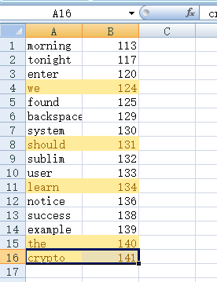
 再把这个按照题目给的顺序（4，8，11，15，16)排列以下就是flag

flag{weshouldlearnthecrypto}

认真看了，附件的内容，有很多重复的内容，竟然flag不是对应单个字符，那么猜测是想到重复次数为4，8，11，15，16的单词 

或者用脚本来统计

```python
 
 
content='''tonightsuccessnoticenoticewewesuccesstonightweexamplecryptoshouldwebackspacetonightbackspaceexamplelearnwesublimlearnbackspacetheshouldwelearnfoundsublimsystemexamplesublimfoundlearnshouldmorningsublimsystemuserlearnthecryptomorningexamplenoticetonightlearntonightlearntonightsublimenterusermorningfoundtonightweenterfoundnoticethecryptomorningthebackspacelearntonightlearnsublimtonightlearnfoundenterfoundsuccesstonightsuccessuserfoundmorningtonighttheshouldsublimentertonightenterbackspacelearnexamplenoticeexamplefoundsystemsuccesssublimsuccessshouldtonightcryptowelearncryptofoundshouldsublimsublimweentertonightsuccessshouldentertheentercryptouserbackspaceshouldentersystemsuccesssystementerfoundenterlearnexampletonightnoticemorningusertonightlearnmorningtonightfoundfoundsuccessnoticesystementerlearnexamplebackspaceshouldcryptocryptosublimweexampletonighttheshouldthemorningbackspacelearntonightsystemsuccesssuccessbackspacemorningnoticeuserfoundfoundtonightmorningenterenterthefoundbackspacelearnenterentershouldthesystemfounduserlearnlearnsystemnoticetonighttheshouldlearnuserbackspaceweusernoticeshouldthewefoundsystemwecryptocryptowethebackspacesystementershouldtonightsystemnoticemorningsystemweentermorningfoundsuccessusertonightsuccesstonightbackspaceshouldweenterthewesystemusernoticesystemthelearnexamplelearnfoundlearnnoticeexamplesystemthecryptocryptolearnsystemthecryptoenterlearnexamplemorningmorningweenterentersuccessexampleuserthebackspacenoticesublimenterbackspacesuccessbackspacethesublimexamplesystemtheexamplecryptolearnuserexamplelearnsystemusersuccessenterentersuccesstheuserbackspacelearnsuccessbackspacethesublimshouldwebackspaceexamplesuccesssuccesstonightweusershouldsuccessmorningcryptomorningfoundbackspacesublimshouldentershouldnoticesuccessmorningsuccessexamplelearnshouldsublimlearntonightshoulduserbackspacesublimlearncryptosuccessenternoticetonightmorningtonightwesuccessweuserbackspaceexamplewesystemnoticemorningsystemmorningcryptolearnsystemthethefoundcryptouserlearnusersystemwemorningenterexampleshouldlearncryptofoundenterbackspacelearnenterenterbackspaceshouldbackspacetheshouldthesystemshouldshouldsuccessmorningthefoundsystementersystemtonightcryptowelearnexampleexamplesystementerbackspaceshouldtheentersublimtonightfoundfoundsuccesssuccesssystemsublimcryptoshouldentersublimmorninglearnfoundtonightcryptobackspacesuccesscryptowebackspacefoundshouldnoticeshouldmorningnoticesystemcryptosystemlearnsystemnoticemorningsystementerwemorninglearnsuccessfoundwesuccesswetheusercryptousernoticebackspacesuccessshouldtonightmorningentermorninguserenternoticefoundmorningwetonightsystemthecryptotonightcryptosystemuserthefoundexampletonightusersystemcryptosublimmorninguserthefoundbackspaceshouldsuccesscryptotonightsystemnoticebackspaceusershouldenterthecryptomorningwesublimnoticesuccessnoticeusersuccesstonightlearnweuserenterfounduserexampleshouldshouldtonightwelearnthenoticethewefoundmorningexampleshouldexamplethesuccessnoticeenterfoundthecryptonoticeuserlearnuserweenterfoundmorningsystemweexamplenoticethebackspaceexamplesublimtheusermorningtonightthesuccesscryptosuccessusersuccesstonighttonightwelearnenterenterthemorningentersystemcryptobackspacemorningsystemexamplecryptouserexamplelearnsublimsuccessusersystemfoundmorningshouldcryptotonightsublimtheexamplemorningsystemuserexampleweexamplenoticesuccesssublimnoticecryptoshouldbackspaceshouldthetonightfoundsublimbackspacebackspacetonightshouldbackspacesuccesstonightbackspacesuccessmorningsystemcryptobackspaceentertonighttonightnoticelearnshoulduserfoundexamplesystemthesuccessweusertonightcryptousernoticeenternoticebackspaceusersystemfoundusernoticeshouldlearnuserfoundexampleusermorningshouldsuccessmorningmorningexampleexamplefoundsublimfoundenterbackspacenoticelearnfoundmorningcryptonoticecryptoshouldweshouldtonightcryptobackspacesublimcryptosublimenterentersublimentercryptonoticethethesublimexampleenterentershouldlearncryptoentershouldmorninglearnnoticeuserexamplesublimtonightshouldfoundtonightsuccessshouldmorningfoundtheweuserlearnsublimsystembackspacecryptotheusertonightcryptosublimmorningmorningexamplenoticetheenterlearnshouldmorningsublimfoundtonightsublimsublimexamplefounduserexamplethefoundwemorningnoticefoundcryptosuccesssublimsublimexamplethesuccessexamplenoticesuccessbackspacesublimlearnuserexamplesuccesssuccesssystemsuccessmorningmorninglearnexamplemorningtonightfoundbackspaceenternoticemorningentersuccessmorningusermorningbackspacelearncryptoenteruserenteruserthetonighttonightsuccesslearnenterfoundsuccesssystemfoundbackspaceenterlearnsystemsublimcryptoentermorningwetonightshouldlearnenterfoundcryptonoticelearnlearnshouldfoundsuccessexampletonightthesuccessfoundusertonightenterfoundsuccessshouldmorningusernoticemorningsystemsystemsuccessshouldwelearnenterfoundexamplewethefoundweshouldsystemsystemmorningmorningbackspaceshouldentersublimentertonightsuccesssystemsystemcryptousershouldsublimfoundwetonightnoticeexamplewewesuccessfoundusertonightfoundsystemexamplecryptofoundshouldshouldsuccessenterbackspaceexampletonightthelearnnoticeuserlearnsystemsublimfoundlearnsuccesssystemshouldsublimnoticelearnsystemnoticetonightexamplefoundusernoticeenterlearnnoticecryptousersystemmorningthewesystemfoundfoundshouldsystementerenterbackspacesystemsublimcryptousermorninglearnlearntonightsublimlearnenterenterbackspacesystemuserusercryptoentershouldtheusersublimnoticeexamplemorningexamplesublimsublimbackspacesystemexampleshouldsublimlearnfoundenterbackspacelearnmorningmorningfoundthetonightmorningnoticeenterlearnusersystemtonightbackspaceexamplelearntonightbackspaceweshouldcryptosuccessbackspaceexamplesuccesstheshouldmorninguserbackspacelearnthetheshouldcryptocryptotonightbackspacecryptocryptobackspacebackspacenoticeusertonightentermorningfoundweenterexampleenterfoundusersublimsystemtheexampleexamplesystemsuccessusersublimentermorningbackspacesystemfoundlearnsystemshouldsublimsublimentershouldtheusershouldexampleexampleshouldsuccesswelearnfoundsublimshoulduserweentertonightwenoticesublimsystemlearnshouldfoundsuccessuserentersuccessmorningcryptoenteruserfoundexampletonightlearnexampleexamplefoundlearnsuccesssystembackspacecryptonoticethefoundbackspacelearncryptothelearnlearnexamplesuccessnoticenoticesystemmorningcryptotonightnoticenoticeentersuccesscryptoenterbackspacesublimexampleenterfoundtonightcryptotonightsublimnoticesuccesssublimtheentertonighttheshouldthefoundsystemtonightuserbackspacesuccessshouldwebackspacenoticebackspacebackspacenoticewecryptobackspacebackspaceusertonightlearnsuccessmorningusertonightsuccessshouldbackspacecryptoenterentershouldsublimsystemexamplemorningcryptonoticethesuccessthebackspacenoticelearnsublimlearnsuccesscryptothesuccessenternoticecryptosystemsublimsuccesswebackspaceuserenterlearnuserwewemorningsuccesslearncryptobackspacewecryptosystemlearnenterenteruserexamplefoundsystemcryptousernoticefoundusersublimbackspacewesublimnoticemorningshouldexamplenoticecryptoshouldtonightmorningthefoundsystementerentersystemthecryptobackspacesublimlearnsuccessmorningsublimsystemcryptousersublimwesuccessmorningsublimbackspacecryptobackspacesublimthelearnsuccesssublimlearncryptoweweexamplecryptowenoticelearnfoundbackspacesystemsystemexampleshouldlearnsuccesssublimcryptobackspacetonightbackspacemorningmorningnoticeshouldnoticefoundthetheshouldtheshouldfoundfoundcryptosuccessbackspacesuccessshouldweenternoticeweweshouldmorningfoundusersuccessbackspacewenoticeusersuccessenterenterexamplelearnfoundwetonightusercryptothesublimsublimtonightsuccesslearnbackspacetonightentertonightthesublimnoticewefoundcryptobackspaceenterenterlearnlearntonightexamplesystementersublimnoticecryptoshoulduseruserbackspaceuserwesublimmorningwesystemshouldtonighttheusershouldnoticefoundusernoticeentersublimwethewefoundfoundlearnfoundwecryptosystemexamplemorningcryptocryptosublimtheexamplenoticefoundlearnwelearnmorningtheenterthesystemsublimtonightsuccesssystemlearnshouldenterbackspaceentersuccesssuccessbackspaceexamplenoticeentershouldsublimlearnbackspacetheshouldexamplelearnsystemusersublimbackspacebackspacesuccesswelearntonightexamplewecryptoenterwesystemsystemsublimexamplecryptolearnmorningsublimfoundsublimfoundbackspacefoundtonighttonightnoticesuccesssuccessexampleusersuccesstonightsublimcryptosystemweenterexamplesystemthethenoticesublimtonightbackspacenoticesystemexamplethesuccesstonightmorningsuccesstonightwenoticesublimtonightwelearntonightmorningsublimbackspaceenterthetonightenterwecryptofoundtheenternoticebackspacesuccesswesystemuserexamplebackspaceentersuccesstonightsublimwemorningsuccesssuccesswesublimsuccessnoticesublimfoundlearnlearnweexamplecryptonoticelearnweusershoulduserfoundcryptolearnfoundmorningtonightmorningmorningnoticewecryptowewesuccessfoundsublimweuserentershouldshouldshouldsublimbackspacetonightenterwesublimsuccessshouldfoundthethetonightwecryptoweenterfoundcryptoshouldcryptouseruserfoundentersublimsublimthelearntheshouldnoticebackspacefoundsuccessshouldtonightentermorningsystemmorningtonightwenoticelearnbackspaceexampleusershouldnoticesublimsublimexamplethesuccessnoticesystemmorningnoticecryptosystemsublimcryptosystemsuccessshouldmorningbackspaceshouldmorninglearnnoticenoticeshouldthewewesublimsublimnoticeusersuccessentersystemfoundshouldshouldcryptobackspaceusermorningsystemshouldshouldtonightwesublimuserfoundlearnbackspacethetonightmorningexampleuserthefoundbackspaceshouldtonightcryptocryptofounduserexamplenoticecryptousernoticethenoticeshouldweshouldfoundwemorningcryptosuccesslearnfoundtonightsublimnoticenoticewefoundwewesuccesssublimsublimcryptoweexampletonightsuccessfoundshouldsuccesstonightbackspacesystemshouldwesystemnoticebackspaceusersystembackspacewenoticelearnnoticenoticesuccesslearntonightuserlearnsuccessbackspacesuccesswesystemusercryptonoticethesystemusernoticewethesuccessweshouldfoundshouldcryptomorningtonightwethewesuccesslearntheshouldweexampletonightsuccessnoticenoticemorningfoundmorningfoundusersublimsystemsuccessbackspacesuccessmorninguserthefoundweexamplemorningsublimlearnfoundfoundnoticemorningshouldweuserwemorningexamplesuccesssuccessfoundthetheshouldweusershouldtheshouldexamplenoticefoundsuccesssystemfoundshouldsublimbackspacetonightshouldsystemtonightsuccesslearntonightsystemsublimsuccesscryptobackspacesystemsublimmorningmorningshouldmorninglearnsuccesslearnmorningusermorninglearnexamplecryptoshouldbackspacesublimshouldfoundbackspacesystemsystemweexamplesystemtonightsublimmorningmorninguserfoundcryptolearnbackspaceshouldbackspacenoticesublimfoundthecryptousershouldsuccesssystemsuccessshouldsystembackspacesublimshouldsublimsystembackspaceexampleshouldbackspacesublimnoticelearnsublimuserbackspaceusersublimsuccesssublimuserusernoticeshouldsuccessnoticenoticelearnexamplesystemweexamplesublimbackspacebackspacecryptoshouldusercryptosublimbackspacesublimshouldsystemnoticenoticethesuccesssuccesslearnsystemsublimwenoticelearnusersublimsystemusernoticeuserthesuccesslearnwelearnwenoticecryptolearncryptonoticenoticebackspacecryptothecryptousercryptobackspacesuccesslearnthesystemsuccessthesystemsystemcryptosuccessbackspacesublimlearnsublimcryptobackspacelearnsublimusersublimexamplecryptosublimsystemnoticecryptocryptousertheusernoticebackspacenoticenoticethecryptocryptosystembackspacesublimbackspacecryptocryptobackspacesystemuserthenoticesystemsystemsystemusernoticethecryptouserusersystemtheusercryptoexamplenoticecryptoexamplenoticetheexampleexamplethecryptotheusernoticetheexampleexamplecryptotheexampleexamplethenoticethecryptocryptoexampletheexamplecryptocryptothenoticeexamplecryptonoticetheexampleexampleexamplecryptocryptoexampleexamplethenoticethecryptothethethethethetheexampleexamplethetheexampletheexampletheexampleexampleexampleexampleexampleexampleexampleexampleexampleexampleexampleexampleexampleexampleexampleexampleexampleexampleexample'''
list1=['tonight','success','notice','example','should','crypto','backspace','learn','found','morning','we','system','sublim','the','user','enter',]
l=[]
for each in list1:
    if each in content:
        print(content.count(each),each)
        l.append((content.count(each),each))
'''4,8,11,15,16'''
l=sorted(l)
dest=[l[i-1] for i in (4,8,11,15,16)]
print(dest)
print(''.join([i[1] for i in dest]))
```

# 75.[WUSTCTF2020]babyrsa(给c,n,e,需要分解n来获得p,q)

查看题目
 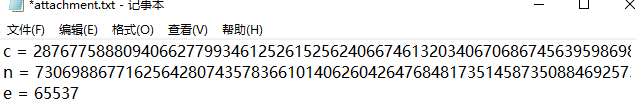
 看能不能分解N
 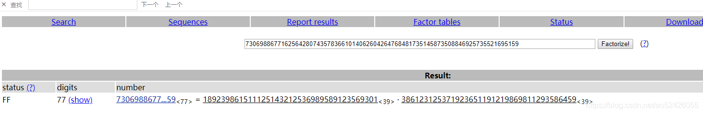
 有了pq就很简单了

```python
p=386123125371923651191219869811293586459
q=189239861511125143212536989589123569301
c=28767758880940662779934612526152562406674613203406706867456395986985664083182n= 73069886771625642807435783661014062604264768481735145873508846925735521695159import  gmpy2
e=65537
d=gmpy2.invert(e,(p-1)*(q-1))
m=gmpy2.powmod(c,d,n)
import binascii
print(binascii.unhexlify(hex(m)[2:]))
```

运行得到b’wctf2020{just_@*piece_0f_cak3}’
 flag{just*@_piece_0f_cak3}
 很简单的一道rsa

# 76.[NPUCTF2020]这是什么觅🐎(二进制打开头部为504B0304的是zip文件)

看题目的到一个没有后缀的文件
 用记事本打开是一堆乱码我们就直接010打开
 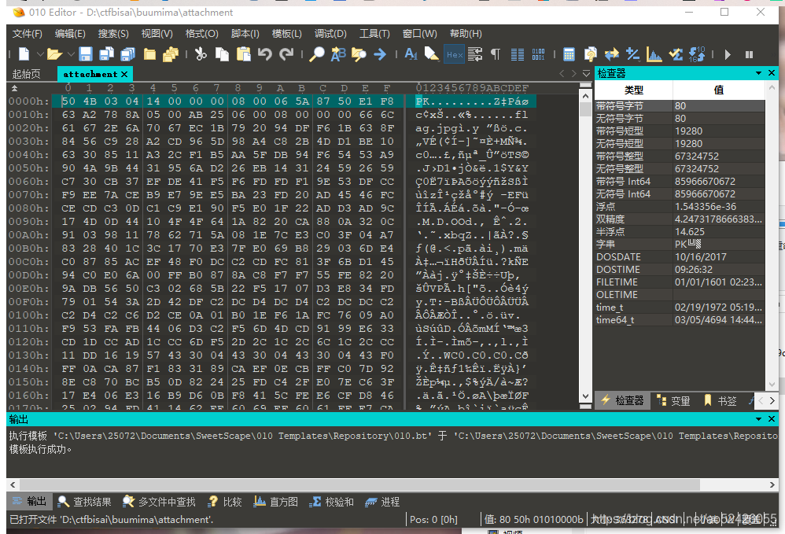
 504B0304 很明显是一个zip文件
 打开得到图片

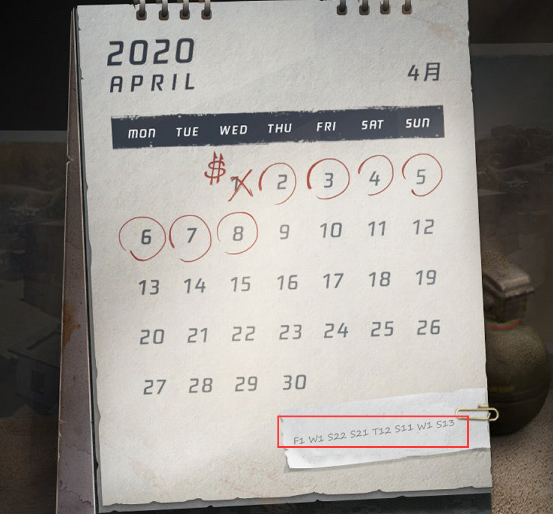

字母代表星期的首字母，其中 S 和 T 都出现两次，所以 S1 代表 SAT，S2 代表 SUN ，每组最后一个数字即代表第几行，F1 W1  S22 S21 T12 S11 W1 S13对应得到 3 1 12 5 14 4 1 18，对照字母表 calendar。

# 77.[GKCTF2020]babycrypto

查看题目
 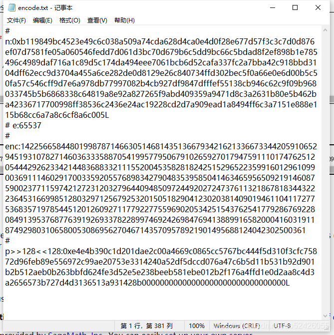
 很明显是真的p高位和n
 所有我们用sage来求出p
 
 求出了p 直接求q就可以

```python
q = n/p = 139091353059018128421744751525080056530307965918298875691299992775484064426591581456998968315582349027071987206340653988925923465225471661893944397744293391269274124345189028818977002600599732469824164218366399726233373069742839737062004061244787413638290767590029376062508897417109117189614458570241407458359
```

写脚本

```python
import gmpy2 as gp
import binascii
p = 160734387026849747944319274262095716650717626398118440194223452208652532694713113062084219512359968722796763029072117463281356654614167941930993838521563406258263299846297499190884495560744873319814150988520868951045961906000066805136724505347218275230562125457122462589771119429631727404626489634314291445667
q = 139091353059018128421744751525080056530307965918298875691299992775484064426591581456998968315582349027071987206340653988925923465225471661893944397744293391269274124345189028818977002600599732469824164218366399726233373069742839737062004061244787413638290767590029376062508897417109117189614458570241407458359
e = 65537
c = 1422566584480199878714663051468143513667934216213366733442059106529451931078271460363335887054199577950679102659270179475911101747625120544429262334214483688332111552004535828182425152965223599160129610990036911146029170033592055768983427904835395850414634659565092191460875900237711597421272312032796440948509724492027247376113218678183443222364531669985128032971256792532015051829041230203814090194611041172775368357197854451201260927117792277559690205342515437625417792867692280849139537687763919269337822899746924269847694138899165820004160319118749298031065800530869562704671435709578921901495688124042302500361
p = gp.mpz(p)
q = gp.mpz(q)
e = gp.mpz(e)
c = gp.mpz(c)n = p*q
phi = (p-1) * (q-1)
d = gp.invert(e, phi)
#print('d=',d)
m = pow(c, d, n)
#print('m=',m)
print('hex(m)=',hex(m)[2:])
print('bytes.fromhex(hex(m)=',bytes.fromhex(hex(m)[2:]))
```

运行得到

```python
hex(m)= 666c61677b33643039313461312d316539372d343832322d613734352d6337653230633531373962397d
bytes.fromhex(hex(m)= b'flag{3d0914a1-1e97-4822-a745-c7e20c5179b9}'
```

# 78.鸡藕椒盐味(海明校验码)

公司食堂最新出了一种小吃，叫鸡藕椒盐味汉堡，售价八块钱，为了促销，上面有一个验证码，输入后可以再换取一个汉堡。但是问题是每个验证码几乎都有错误,而且打印的时候倒了一下。小明买到了一个汉堡，准备还原验证码，因为一个吃不饱啊验证码如下：1100 1010 0000 ,而且打印的时候倒了一下。把答案哈希一下就可以提交了。(答案为正确值(不包括数字之间的空格)的32位md5值的小写形式) 注意：得到的 flag 请包上 flag{} 提交

直接将110010100000 用md5加密出来是不正确
 使用海明校验码得到110110100000

海明校验码参考：https://baike.baidu.com/item/%E6%B5%B7%E6%98%8E%E6%A0%A1%E9%AA%8C%E7%A0%81/7060344?fr=aladdin
 https://baijiahao.baidu.com/s?id=1598006039749022275&wfr=spider&for=pc
 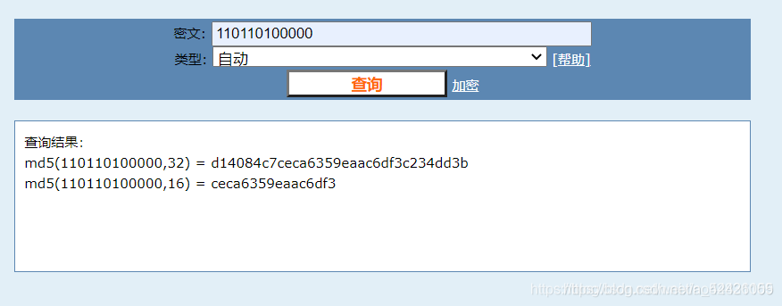

得到flag：d14084c7ceca6359eaac6df3c234dd3b

# 79.RSA4

查看题目

```python
N = 331310324212000030020214312244232222400142410423413104441140203003243002104333214202031202212403400220031202142322434104143104244241214204444443323000244130122022422310201104411044030113302323014101331214303223312402430402404413033243132101010422240133122211400434023222214231402403403200012221023341333340042343122302113410210110221233241303024431330001303404020104442443120130000334110042432010203401440404010003442001223042211442001413004 
c = 310020004234033304244200421414413320341301002123030311202340222410301423440312412440240244110200112141140201224032402232131204213012303204422003300004011434102141321223311243242010014140422411342304322201241112402132203101131221223004022003120002110230023341143201404311340311134230140231412201333333142402423134333211302102413111111424430032440123340034044314223400401224111323000242234420441240411021023100222003123214343030122032301042243
N = 302240000040421410144422133334143140011011044322223144412002220243001141141114123223331331304421113021231204322233120121444434210041232214144413244434424302311222143224402302432102242132244032010020113224011121043232143221203424243134044314022212024343100042342002432331144300214212414033414120004344211330224020301223033334324244031204240122301242232011303211220044222411134403012132420311110302442344021122101224411230002203344140143044114 
c = 112200203404013430330214124004404423210041321043000303233141423344144222343401042200334033203124030011440014210112103234440312134032123400444344144233020130110134042102220302002413321102022414130443041144240310121020100310104334204234412411424420321211112232031121330310333414423433343322024400121200333330432223421433344122023012440013041401423202210124024431040013414313121123433424113113414422043330422002314144111134142044333404112240344
N = 332200324410041111434222123043121331442103233332422341041340412034230003314420311333101344231212130200312041044324431141033004333110021013020140020011222012300020041342040004002220210223122111314112124333211132230332124022423141214031303144444134403024420111423244424030030003340213032121303213343020401304243330001314023030121034113334404440421242240113103203013341231330004332040302440011324004130324034323430143102401440130242321424020323 
c = 10013444120141130322433204124002242224332334011124210012440241402342100410331131441303242011002101323040403311120421304422222200324402244243322422444414043342130111111330022213203030324422101133032212042042243101434342203204121042113212104212423330331134311311114143200011240002111312122234340003403312040401043021433112031334324322123304112340014030132021432101130211241134422413442312013042141212003102211300321404043012124332013240431242
```

看到这一题，给到了三组三个n三个c，我们可以很容易的想到了中国剩余定理，但是我们发现这题并不是那么容易的，可以说是非常恶心人了，他题目给到的c和n并不是用的十进制，而是用的五进制，要先用int("*****",5)的代码转换为十进制才能计算。后来我们又发现，将题目通过CRT解出来并不对，看来并不是flag直接模的n，于是我们猜测e=3，果然，成功解出flag，脚本如下

```python
// python2
import gmpy2
from functools import reduce
import sympy
def chinese_remainder(n, a):
    sum = 0
    prod = reduce(lambda a, b: a * b, n)
    for n_i, a_i in zip(n, a):
        p = prod // n_isum += a_i * sympy.invert(p, n_i) * preturn int(sum % prod)
def wu_shi(n):strlen=len(n)s=0for i in range(0,strlen):s+=int(n[i])*pow(5,strlen-i-1)return sn1 = int(str(331310324212000030020214312244232222400142410423413104441140203003243002104333214202031202212403400220031202142322434104143104244241214204444443323000244130122022422310201104411044030113302323014101331214303223312402430402404413033243132101010422240133122211400434023222214231402403403200012221023341333340042343122302113410210110221233241303024431330001303404020104442443120130000334110042432010203401440404010003442001223042211442001413004),5)
c1 = int(str(310020004234033304244200421414413320341301002123030311202340222410301423440312412440240244110200112141140201224032402232131204213012303204422003300004011434102141321223311243242010014140422411342304322201241112402132203101131221223004022003120002110230023341143201404311340311134230140231412201333333142402423134333211302102413111111424430032440123340034044314223400401224111323000242234420441240411021023100222003123214343030122032301042243),5)n2 = int(str(302240000040421410144422133334143140011011044322223144412002220243001141141114123223331331304421113021231204322233120121444434210041232214144413244434424302311222143224402302432102242132244032010020113224011121043232143221203424243134044314022212024343100042342002432331144300214212414033414120004344211330224020301223033334324244031204240122301242232011303211220044222411134403012132420311110302442344021122101224411230002203344140143044114),5)
c2 = int(str(112200203404013430330214124004404423210041321043000303233141423344144222343401042200334033203124030011440014210112103234440312134032123400444344144233020130110134042102220302002413321102022414130443041144240310121020100310104334204234412411424420321211112232031121330310333414423433343322024400121200333330432223421433344122023012440013041401423202210124024431040013414313121123433424113113414422043330422002314144111134142044333404112240344),5)n3 = int(str(332200324410041111434222123043121331442103233332422341041340412034230003314420311333101344231212130200312041044324431141033004333110021013020140020011222012300020041342040004002220210223122111314112124333211132230332124022423141214031303144444134403024420111423244424030030003340213032121303213343020401304243330001314023030121034113334404440421242240113103203013341231330004332040302440011324004130324034323430143102401440130242321424020323),5)
c3 = int(str(10013444120141130322433204124002242224332334011124210012440241402342100410331131441303242011002101323040403311120421304422222200324402244243322422444414043342130111111330022213203030324422101133032212042042243101434342203204121042113212104212423330331134311311114143200011240002111312122234340003403312040401043021433112031334324322123304112340014030132021432101130211241134422413442312013042141212003102211300321404043012124332013240431242),5)n=[n1,n2,n3]
c=[c1,c2,c3]
ans=chinese_remainder(n, c)
ans=gmpy2.iroot(ans,3)[0]
print hex(ans)[2:].decode('hex')
#noxCTF{D4mn_y0u_h4s74d_wh47_4_b100dy_b4s74rd!}
```

# 80.[NCTF2019]babyRSA

查看题目

```python
from Crypto.Util.number import *
from flag import flagdef nextPrime(n):n += 2 if n & 1 else 1while not isPrime(n):n += 2return np = getPrime(1024)
q = nextPrime(p)
n = p * q
e = 0x10001
d = inverse(e, (p-1) * (q-1))
c = pow(bytes_to_long(flag.encode()), e, n)# d = 19275778946037899718035455438175509175723911466127462154506916564101519923603308900331427601983476886255849200332374081996442976307058597390881168155862238533018621944733299208108185814179466844504468163200369996564265921022888670062554504758512453217434777820468049494313818291727050400752551716550403647148197148884408264686846693842118387217753516963449753809860354047619256787869400297858568139700396567519469825398575103885487624463424429913017729585620877168171603444111464692841379661112075123399343270610272287865200880398193573260848268633461983435015031227070217852728240847398084414687146397303110709214913
# c = 5382723168073828110696168558294206681757991149022777821127563301413483223874527233300721180839298617076705685041174247415826157096583055069337393987892262764211225227035880754417457056723909135525244957935906902665679777101130111392780237502928656225705262431431953003520093932924375902111280077255205118217436744112064069429678632923259898627997145803892753989255615273140300021040654505901442787810653626524305706316663169341797205752938755590056568986738227803487467274114398257187962140796551136220532809687606867385639367743705527511680719955380746377631156468689844150878381460560990755652899449340045313521804
```

这道题没有给出n，只给出了e和d，于是我们可以尝试通过爆破的方法求得欧拉函数进而求得，p和q。然后我们可以看到p和q的生成函数，p和q非常的接近，而且都在2**1023和2*1024之间，于是可以发现把欧拉函数phi开平方根之后的下一个素数，就是生成的q，进而可以解出本题，下面给出脚本

```python
// python2
from gmpy2 import *
from sympy import *
from Crypto.Util.number import *
d = 19275778946037899718035455438175509175723911466127462154506916564101519923603308900331427601983476886255849200332374081996442976307058597390881168155862238533018621944733299208108185814179466844504468163200369996564265921022888670062554504758512453217434777820468049494313818291727050400752551716550403647148197148884408264686846693842118387217753516963449753809860354047619256787869400297858568139700396567519469825398575103885487624463424429913017729585620877168171603444111464692841379661112075123399343270610272287865200880398193573260848268633461983435015031227070217852728240847398084414687146397303110709214913
c = 5382723168073828110696168558294206681757991149022777821127563301413483223874527233300721180839298617076705685041174247415826157096583055069337393987892262764211225227035880754417457056723909135525244957935906902665679777101130111392780237502928656225705262431431953003520093932924375902111280077255205118217436744112064069429678632923259898627997145803892753989255615273140300021040654505901442787810653626524305706316663169341797205752938755590056568986738227803487467274114398257187962140796551136220532809687606867385639367743705527511680719955380746377631156468689844150878381460560990755652899449340045313521804
e=0x10001
src=d*e-1
i=2**15
while True:if(src%i==0):if((src//i)>=2**2046 and (src//i)<=2**2048):phi=src//iq_1=iroot(phi,2)[0]q=nextprime(q_1)if(phi%(q-1)==0):p_1=phi//(q-1)p=p_1+1if(isprime(p)):print(p,q)#(143193611591752210918770476402384783351740028841763223236102885221839966637073188462808195974548579833368313904083095786906479416347681923731100260359652426441593107755892485944809419189348311956308456459523437459969713060653432909873986596042482699670451716296743727525586437248462432327423361080811225075839L, 143193611591752210918770476402384783351740028841763223236102885221839966637073188462808195974548579833368313904083095786906479416347681923731100260359652426441593107755892485944809419189348311956308456459523437459969713060653432909873986596042482699670451716296743727525586437248462432327423361080811225076497L)breaki+=1if((src//i)<2**2046):print 0break
n=p*q
m=pow(c,d,n)
flag=long_to_bytes(m)
print flag
#NCTF{70u2_nn47h_14_v3ry_gOO0000000d}
```

# 81.[BJDCTF2020]easyrsa

查看题目

```python
from Crypto.Util.number import getPrime,bytes_to_long
from sympy import Derivative
from fractions import Fraction
from secret import flagp=getPrime(1024)
q=getPrime(1024)
e=65537
n=p*q
z=Fraction(1,Derivative(arctan(p),p))-Fraction(1,Derivative(arth(q),q))
m=bytes_to_long(flag)
c=pow(m,e,n)
print(c,z,n)
'''
output:
7922547866857761459807491502654216283012776177789511549350672958101810281348402284098310147796549430689253803510994877420135537268549410652654479620858691324110367182025648788407041599943091386227543182157746202947099572389676084392706406084307657000104665696654409155006313203957292885743791715198781974205578654792123191584957665293208390453748369182333152809882312453359706147808198922916762773721726681588977103877454119043744889164529383188077499194932909643918696646876907327364751380953182517883134591810800848971719184808713694342985458103006676013451912221080252735948993692674899399826084848622145815461035
32115748677623209667471622872185275070257924766015020072805267359839059393284316595882933372289732127274076434587519333300142473010344694803885168557548801202495933226215437763329280242113556524498457559562872900811602056944423967403777623306961880757613246328729616643032628964072931272085866928045973799374711846825157781056965164178505232524245809179235607571567174228822561697888645968559343608375331988097157145264357626738141646556353500994924115875748198318036296898604097000938272195903056733565880150540275369239637793975923329598716003350308259321436752579291000355560431542229699759955141152914708362494482
15310745161336895413406690009324766200789179248896951942047235448901612351128459309145825547569298479821101249094161867207686537607047447968708758990950136380924747359052570549594098569970632854351825950729752563502284849263730127586382522703959893392329333760927637353052250274195821469023401443841395096410231843592101426591882573405934188675124326997277775238287928403743324297705151732524641213516306585297722190780088180705070359469719869343939106529204798285957516860774384001892777525916167743272419958572055332232056095979448155082465977781482598371994798871917514767508394730447974770329967681767625495394441'''
```

从题目上我们可以看出cnz
 通过对z的化简可以得到

```python
p2+q2=z
pxq=n因此可以得到(p+q)2=z+2n
(p-q)2=z-2n
```

直接上脚本就可以了

```python
e=65537
c=7922547866857761459807491502654216283012776177789511549350672958101810281348402284098310147796549430689253803510994877420135537268549410652654479620858691324110367182025648788407041599943091386227543182157746202947099572389676084392706406084307657000104665696654409155006313203957292885743791715198781974205578654792123191584957665293208390453748369182333152809882312453359706147808198922916762773721726681588977103877454119043744889164529383188077499194932909643918696646876907327364751380953182517883134591810800848971719184808713694342985458103006676013451912221080252735948993692674899399826084848622145815461035
z=32115748677623209667471622872185275070257924766015020072805267359839059393284316595882933372289732127274076434587519333300142473010344694803885168557548801202495933226215437763329280242113556524498457559562872900811602056944423967403777623306961880757613246328729616643032628964072931272085866928045973799374711846825157781056965164178505232524245809179235607571567174228822561697888645968559343608375331988097157145264357626738141646556353500994924115875748198318036296898604097000938272195903056733565880150540275369239637793975923329598716003350308259321436752579291000355560431542229699759955141152914708362494482
n=15310745161336895413406690009324766200789179248896951942047235448901612351128459309145825547569298479821101249094161867207686537607047447968708758990950136380924747359052570549594098569970632854351825950729752563502284849263730127586382522703959893392329333760927637353052250274195821469023401443841395096410231843592101426591882573405934188675124326997277775238287928403743324297705151732524641213516306585297722190780088180705070359469719869343939106529204798285957516860774384001892777525916167743272419958572055332232056095979448155082465977781482598371994798871917514767508394730447974770329967681767625495394441
import gmpy2
p=(gmpy2.iroot(z+2*n,2)[0]+gmpy2.iroot(z-2*n,2)[0])//2
print(n%p==0)
q=n//p
d=gmpy2.invert(e,(p-1)*(q-1))
m=gmpy2.powmod(c,d,n)
import binascii
print(binascii.unhexlify(hex(m)[2:]))
```

运行得到
 BJD{Advanced_mathematics_is_too_hard!!!}

# 82.[AFCTF2018]你能看出这是什么加密么

查看题目
 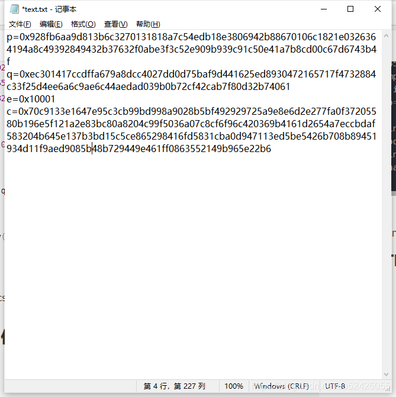
 我一开始看见这题 不知道是陷阱还是怎么的
 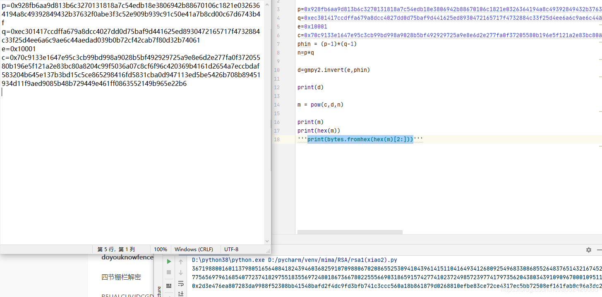
 我当时一直用的这个发现解不出来
 上真正的代码

```python
from gmpy2 import*
from Crypto.Util.number import long_to_bytesp=int('0x928fb6aa9d813b6c3270131818a7c54edb18e3806942b88670106c1821e0326364194a8c49392849432b37632f0abe3f3c52e909b939c91c50e41a7b8cd00c67d6743b4f',16)q=int('0xec301417ccdffa679a8dcc4027dd0d75baf9d441625ed8930472165717f4732884c33f25d4ee6a6c9ae6c44aedad039b0b72cf42cab7f80d32b74061',16)e=int('0x10001',16)c=int('0x70c9133e1647e95c3cb99bd998a9028b5bf492929725a9e8e6d2e277fa0f37205580b196e5f121a2e83bc80a8204c99f5036a07c8cf6f96c420369b4161d2654a7eccbdaf583204b645e137b3bd15c5ce865298416fd5831cba0d947113ed5be5426b708b89451934d11f9aed9085b48b729449e461ff0863552149b965e22b6',16)phi = (q-1)*(p-1)
n=p*qd=invert(e,phi)
m=pow(c,d,n)
print(long_to_bytes(m))
```

运行得到

```python
b'\x02\xd3\xe4v\xea\x80r\x83\xda\x99\x88\xf5#\x08\xbbAT\x8b\xaf\xd2\xf4\xdc\x9f\xd3\xbf\xb7A\xc3\xcc\xc5`\xa1\x8b\x86\x18y\xd0&\x88\x10\xef\xbe\x83\xcer\xceC\x17\xec[\xb7%\x08\xef\x16\x1f\xab\x0c\x96\xa3\xdc N^\x8e,\xa3\x11{\x99U\xcd\x15o\xd7B\xf4L\x8f}&\xc5$\xca\xd5;\xf9\x02Y\xc1\xbbS\xfd4\x83M\x96\xa9\xbd;\x83/\xf7\x00afctf{R54_|5_$0_$imp13}'
```

这个就很明显了afctf{R54_|5_KaTeX parse error: Expected group after '_' at position 2: 0_̲imp13}换成flag提交就行了

# 83.[ACTF新生赛2020]crypto-classic0（压缩包口令爆破，逆向加密算法书写）

查看题目
 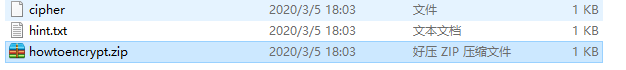
 
 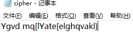
 既然压缩包密码是生日那么就直接暴力破解吧
 说一下思路 生日八位数 我选择从19000000开始的
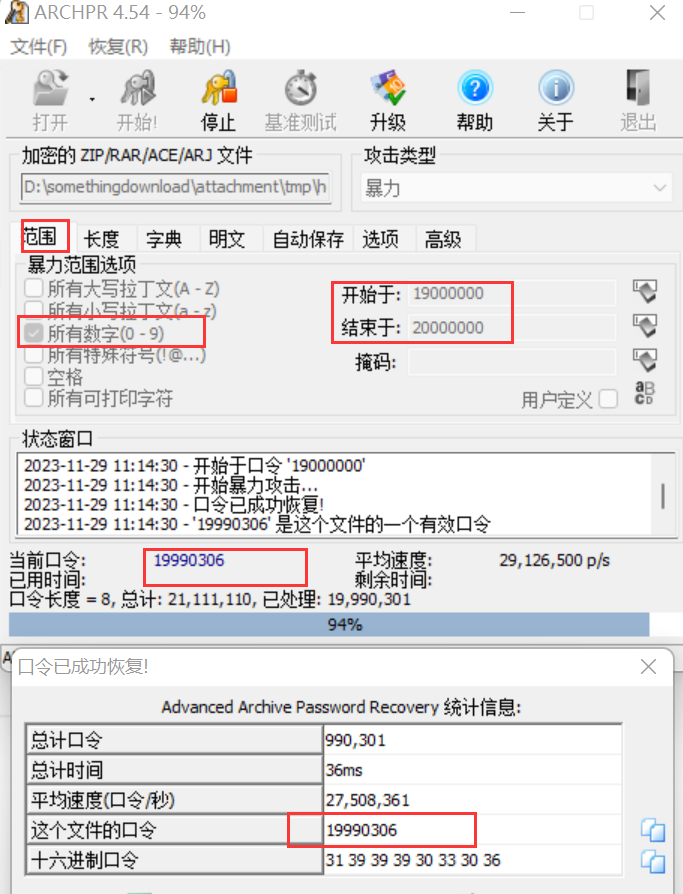
 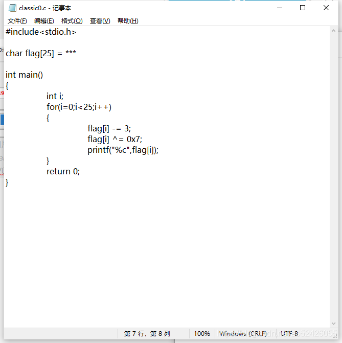
 很明显这是一个循环，我们反过来写一个脚本就可以了

```python
cipher = 'Ygvdmq[lYate[elghqvakl}'//这个红点是个不可见字符
for i in range(0,24):
    flag = ord(cipher[i]) ^ 0x7
    flag += 3
    print(chr(flag),end='')
```

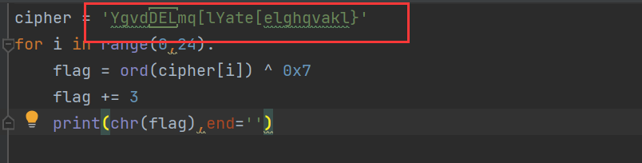

运行得到

```python
Traceback (most recent call last):File "D:/pycharm/venv/mima/xunhuan.py", line 4, in <module>flag = ord(cipher[i]) ^ 0x7
IndexError: string index out of range
actfmy_naive_encrytion}
进程完成，退出码 1
```

可能是代码哪写错了我也不知道
 最后flag{my_naive_encrytion}

# 84.救世捷径

查看题目
 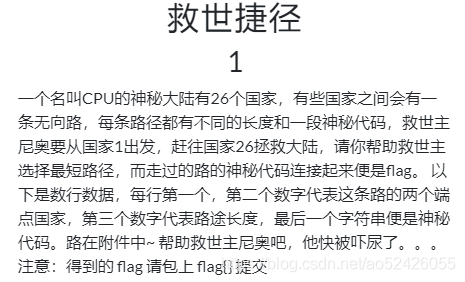
 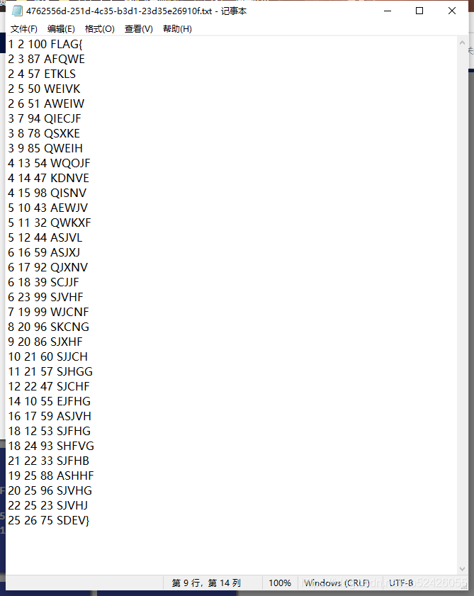
 这个其实可以不用写脚本，直接把路径画出来找最短就可以了而且也很好画（我最开始也是画出来的)
 给你们一个大佬写的脚本（迪杰斯特拉算法)

```python
graph=[]
for i in range(27):
    graph.append([])
for i in range(27):
    for j in range(27):
        graph[i].append(0x3f3f3f)
f=open('zdlj.txt','r').readlines()#这里需要手动将原文中的最后一行换行给去掉
li=[]
for x in f:
    li.append(x.strip().split(' '))
#print(li)
#print(graph)
for x in li:
    graph[int(x[0])][int(x[1])]=int(x[2])
    graph[int(x[1])][int(x[0])]=int(x[2])
#print(graph)
def dijkstra():
    dv=[0x3f3f3f for i in range(27)]#点i到起点1的最短距离
    route=[1 for i in range(27)]#记录每点和与它对应的上一点
    vis=[0 for i in range(27)]#各点到起点的最短距离是否已定.
    for i in range(2,27):
        dv[i]=graph[i][1]
    dv[1]=0
    #print(dv)
    vis[1]=1
    for i in range(26):
        minn=0x3f3f3f
        temp=-1
        for j in range(2,27):
            if vis[j]==0 and minn>dv[j]:
                minn=dv[j]
                temp=j
        vis[temp]=1
        #print(temp)
        for j in range(2,27):
            if dv[j]>dv[temp]+graph[temp][j]:
                dv[j]=dv[temp]+graph[temp][j]
                route[j]=temp
    return (route,dv)
route,dv=dijkstra()
print(dv[26])
print(route)
y=26
while y!=1:
    print(y)#这里输出路径
    y=route[y]

```

运行得到

```python
339
[1, 1, 1, 2, 2, 2, 2, 3, 3, 3, 5, 5, 5, 4, 4, 4, 6, 6, 6, 25, 9, 11, 12, 6, 18, 22, 25]
26
25
22
12
5
2
```

这把得到的连接起来就得到flag了
 flag{WEIVKASJVLSJCHFSJVHJSDEV}
