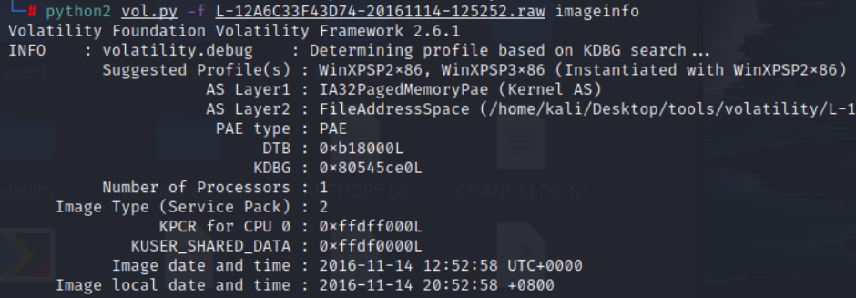
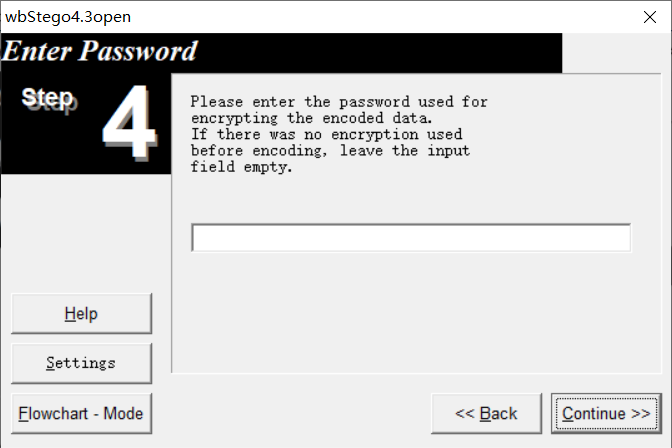
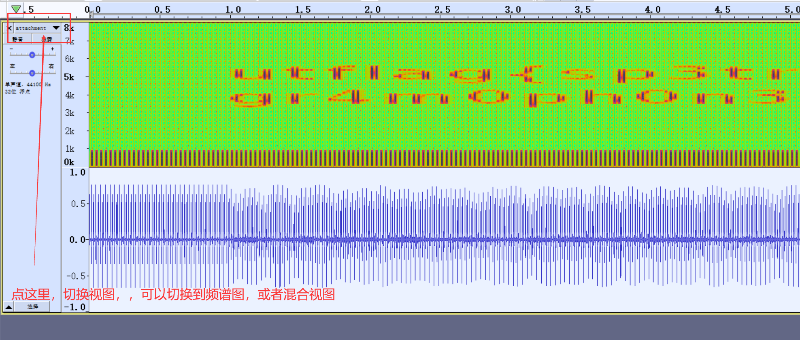
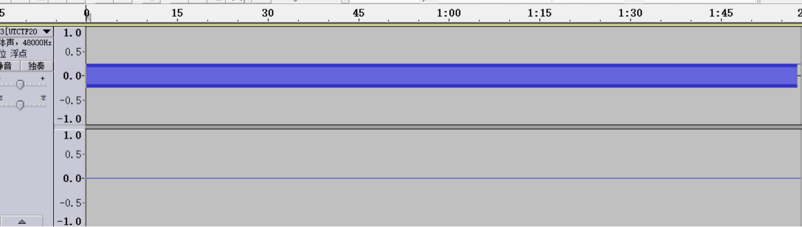
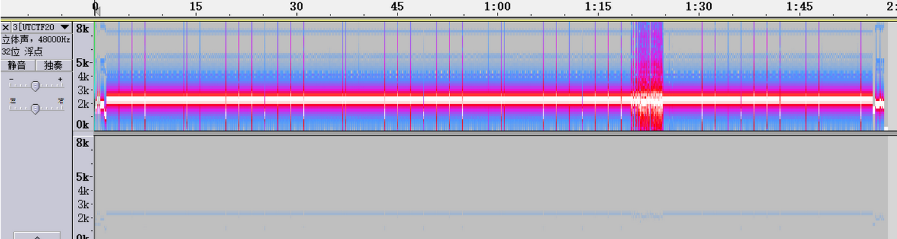
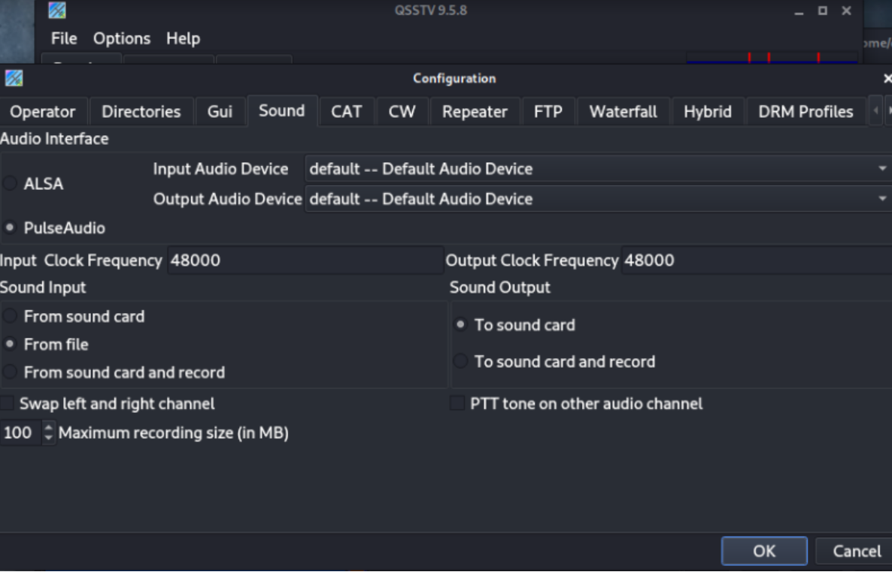

# 1.binwalk(kali,自动分析文件、分离文件)

Binwalk工具是Linux下用来分析和分离文件的工具，可以快速分辨文件是否由多个文件合并而成，并将文件进行分离。如果分离成功会在目标文件的目录。

同目录下生成一个形如_文件名_extracted的文件目录，目录中有分离后的文件。

用法：

```shell
分析文件：binwalk filename
分离文件：binwalk -e filename
注：binwalk遇到压缩包会自动解压。
```

# 2.foremost(kali,自动分离文件)

如果binwalk无法正确分离文件，可以使用foremost，将目标文件复制到kali中，成功执行后，会在目标文件的文件目录下生成我们设置的目录，目录中会按文件类型分离出文件。

用法：

```
foremost 文件名
或
foremost 文件名 -o 输出目录名
注：甚至可以分离出pcpng数据包中的压缩包、图片等文件
```

# 3.dd(kali,手动分离文件)

当文件自动分离出错或者因为其他原因无法自动分离时，可以使用dd实现文件手动分离。

```shell
格式：dd if=源文件 of=目标文件名 bs=1 skip=开始分离的字节数

参数说明：
if=file #输入文件名，缺省为标准输入
of=file #输出文件名，缺省为标准输出
bs=bytes #同时设置读写块的大小为bytes，可代替ibs和obs
skip=blocks #从输入文件开头跳过blocks个块后再开始复制
```


例题：

直接binwalk -e分离不出来，但是看执行结果可以知道就是从2103位开始隐藏了个图片，所以直接用dd命令从2103位开始提取即可：

```
dd if=misc14.jpg of=flag.jpg skip=2103 bs=1
```


# 4.file(kali,自动分析文件)

file 文件名


# 5.010editor(windows,16进制打开文件，查找、修改文件信息)

**1. 查找关键字**

```
1.flag的16进制数据为
666c6167
66006C0061006700 //00是不可见字符那个
```

# 6.zipCenOp.jar(windows,伪加密，清除密码）

```
指令：java -jar ZipCenOp.jar r xxx.zip
```


之后就可以解压了,解压即可得到 flag。

# 7.zsteg(kali，查看文件信息，解LSB隐写)

输入命令：

```shell
zsteg 文件名 
即可查看被隐藏的内容

zsteg -e extradata:0 misc17.png > 1.txt
binwalk -e 1.txt --run-as=root
```


# 8.strings(kali,查看文件内容)

命令：

```
strings 文件名
```


# 9.steghide(kali,隐藏文件，提取图片信息、分离图片文件,音频文件都可以)

```bash
1、安装
apt-get install steghide

2、隐藏文件
steghide embed -cf [图片文件载体] -ef [待隐藏文件]
提示输入密码(提取文件用到)，不输入则为空密码，打开图片显示正常

3、查看图片中嵌入的文件信息
steghide info [文件]

4、提取图片中隐藏的文件
steghide extract -sf [文件]
```

# 10.7z(kali,可解压磁盘文件.vmdk)

命令：

```
7z x xxx.vmdk
```

# 11.d_safe(windows，d盾，webshell查杀等)

图形化工具，直接使用

# 12.F5-steganography(kali，java11,F5隐写)

命令：

```
java Extract /图片的绝对路径 [-p 密码] [-e 输出文件]
```

 默认会将解出来的内容放在txt文件中（得到了一个output.txt文件）


# 13.gnuplot(windows,gp256套件工具之一，坐标绘图)

例题展示：打开result.txt，发现是一堆坐标


结合之前查看图片属性里的文件信息，发现要画图，所以这里就借用gnuplot来进行绘制([gnuplot下载地址](https://pan.baidu.com/s/1VE72XqOErGFQqJeuI3lIug), 提取码：wel5)
不过在使用gnuplot之前需要先将坐标格式转换成gnuplot可以识别的格式，下面是脚本

```python
with open('result.txt', 'r') as res:  # 坐标格式文件比如(7,7)
    re = res.read()
    res.close()
# 写文件,将转换后的坐标写入gnuplotTxt.txt
with open('gnuplotTxt.txt','w') as rw:
    re = re.split()
    for i in range(0,len(re)):
        tem = re[i]
        # tem = tem.lstrip('(').rstrip(')')
        tem = tem.strip('()')# 去除左右()
        tem = tem.replace(',',' ')#替换逗号成空格
        rw.write(tem + '\n')
        print(tem)

```

安装好gnuplot后，可以去环境变量里添加变量，之后就可以直接在命令行输入gnuplot来运行了


QR Rearch扫描二维码即可得出 flag。

```flag
flag{40fc0a979f759c8892f4dc045e28b820}
```

# 14.QR_Research(windows，二维码识别)

直接用即可。

# 15.outguess(kali,apt-get安装，outguess隐写（jpg图片）)

命令：

```
加密：
outguess -k "my secret key" -d hidden.txt demo.jpg out.jpg
加密之后，demo.jpg会覆盖out.jpg,
hidden.txt中的内容是要隐藏的东西

解密：
outguess -k "my secret key" -r out.jpg hidden.txt
解密之后，解密内容放在hidden.txt中

outguess -k abc -r mmm.jpg rusult.txt
```


# 16.pngcheck(kali,apt安装，检查png图片，隐写情况)

命令：

```cmd
pngcheck -v hint.png
```

一般会检查png残缺情况

# 17.NtfsStreamEditotr(Windows,NTFS交换数据流隐写扫描)

将拿到的隐写文件，更改后缀位rar，解压，之后将解压的文件夹路径导入工具，点击搜索，即可发现隐写的信息。


# 18.uncompyle6/pyc（kali/windwos,pyc文件反编译）

### 1. uncompyle6(kali中python版本过高，配置失败，目前无法解决，windows中的可以用)

```
pip install uncompyle6
uncompyle6 sample.pyc > sample.py
```

其中sample.pyc为需要反编译的pyc文件，sample.py为反编译后生成的源代码文件。在终端输入以上命令后，会输出生成的源代码内容。

### 2. pyc（无法使用）

```
pip install pyc
pyc sample.pyc
```

使用pyc反编译工具同样可以对pyc文件进行反编译。在终端输入以上命令后，会自动生成与原pyc文件同名的.py文件。

# 19.cloacked-pixel/python2/3版本(windows/linux都有)

## 1.cloacked-pixel

https://github.com/livz/cloacked-pixel

```
加密：
python2 lsb.py hide -i [img_file] -s [payload_file] -o [out_file] -p [password]
解密：
python2 lsb.py extract 1.png 1.txt 123456
```

## 2.cloacked-pixel-python3

上面工具的python3版本，用法一样

```
加密：
python3 lsb.py hide -i [img_file] -s [payload_file] -o [out_file] -p [password]

解密：
python3 lsb.py extract -i [stego_file] -o [out_file] -p [password]
```

# 20.dtmf2num.exe(windows,dtmf转换器)


# 21.exiftool(kali,jpg隐写，批量处理图片，扫描图片内容)

简单用法：

```bash
exiftool [大量图片的保存路径，可用通配符*] | grep "flag"
exiftool -ThumbnailImage -b misc22.jpg > 1.jpg //缩略图隐写
```


# 22.mimikatz(windows,提取lsass镜像中的信息)

可以从lsass.exe中获取Windows处于active状态的账号明文密码
将lsass.dmp复制到mimikatz目录中，管理员运行x64的mimikatz.exe，执行一下命令

```
# 提升权限
privilege::debug

# 载入dmp文件
sekurlsa::minidump lsass.dmp

# 读取登陆密码
sekurlsa::logonpasswords full
```

# 23.USB流量处理脚本(windows，放在Misc脚本中了)--测试使用失败，用下面这个

```python
'''
USB流量分析
    keyboard scan code转为键盘字符
参数：
    导出的usb流量信息
'''
import sys
import os

usb_codes = {
    0x04: "aA", 0x05: "bB", 0x06: "cC", 0x07: "dD", 0x08: "eE", 0x09: "fF",
    0x0A: "gG", 0x0B: "hH", 0x0C: "iI", 0x0D: "jJ", 0x0E: "kK", 0x0F: "lL",
    0x10: "mM", 0x11: "nN", 0x12: "oO", 0x13: "pP", 0x14: "qQ", 0x15: "rR",
    0x16: "sS", 0x17: "tT", 0x18: "uU", 0x19: "vV", 0x1A: "wW", 0x1B: "xX",
    0x1C: "yY", 0x1D: "zZ", 0x1E: "1!", 0x1F: "2@", 0x20: "3#", 0x21: "4$",
    0x22: "5%", 0x23: "6^", 0x24: "7&", 0x25: "8*", 0x26: "9(", 0x27: "0)",
    0x2C: "  ", 0x2D: "-_", 0x2E: "=+", 0x2F: "[{", 0x30: "]}", 0x32: "#~",
    0x33: ";:", 0x34: "'\"", 0x36: ",<", 0x37: ".>", 0x4f: ">", 0x50: "<"
}


def code2chr(filepath):
    lines = []
    pos = 0
    for x in open(filepath, "r").readlines():
        code = int(x[6:8], 16)  # 即第三个字节
        if code == 0:
            continue
        # newline or down arrow - move down
        if code == 0x51 or code == 0x28:
            pos += 1
            continue
        # up arrow - move up
        if code == 0x52:
            pos -= 1
            continue

        # select the character based on the Shift key
        while len(lines) <= pos:
            lines.append("")
        if code in range(4, 81):
            if int(x[0:2], 16) == 2:
                lines[pos] += usb_codes[code][1]
            else:
                lines[pos] += usb_codes[code][0]

    for x in lines:
        print(x)


if __name__ == "__main__":
    # check argv
    if len(sys.argv) != 2:
        print(
            "Usage:\n\tpython keyboardScanCode.py datafile.txt\nhow to get datafile:\t tshark -r file.usb.pcapng -T fields -e usb.capdata > datafile.txt")
        exit(1)
    else:
        filepath = sys.argv[1]
        code2chr(filepath)
```

用法：

```cmd
#先用tshark分离出 USB 的 Leftover Capture Data
tshark -r usbxx.pcapng[usbxx.pcap] -T fields -e usb.capdata > usbdata.txt

#之后，处理数据即可通杀
python3 usb通杀.py usbdata.txt
```

# 24.UsbKeyboardDataHacker.py(kali,usb流量包处理脚本，好用)

```cmd
python3 usb.py usbxx.pcp
```


# 25.wireshark

快速入门：

#### mac地址/ip/端口过滤

```ini
eth.addr==20:dc:e6:f3:78:cc   //筛选MAC地址是20:dc:e6:f3:78:cc的数据包，包括源或者目的MAC地址
eth.src==20:dc:e6:f3:78:cc    //源MAC地址是20:dc:e6:f3:78:cc
eth.dst==20:dc:e6:f3:78:cc    //目的MAC地址是20:dc:e6:f3:78:cc

ip.addr==192.168.1.122        //筛选出IP地址是192.168.1.122的数据包，包括源IP地址或者目的IP地址
ip.src== 和ip.dst==同上

tcp.port==80         //根据TCP端口筛选数据包，包括源端口或者目的端口
tcp.dstport==80        //根据目的TCP端口筛选
tcp.srcport==80        //根据源TCP端口筛选
udp.port==4010       //根据UDP端口筛选数据包，包括源端口或者目的端口
udp.srcport==4010      //根据源UDP端口筛选
udp.dstport==4010      //根据目的UDP端口筛选
```

#### 协议筛选

常见协议：udp，tcp，arp，icmp，smtp，pop，dns，ip，ssl，http，ftp，ssh

```cpp
http //过滤http流量
http.request.method==GET/POST
http.response
http.response.code >=400（包含错误码）
http.response.phrase == “OK”（过滤响应中的phrase）
http contains "snapshot" //过滤http头中含有指定字符
http.server contains “snapshot” //过滤http头中server字段含有指定字符
http.content_type == “text/html” //过滤content_type是text/html的http响应、post包
http.content_encoding == “gzip” //过滤content_encoding是gzip的http包
http.transfer_encoding == “chunked” //根据transfer_encoding过滤
http.content_length == 279
http.content_length_header == “279” //根据content_length的数值过滤
http.server //过滤所有含有http头中含有server字段的数据包
```

```cmd
常用的过滤命令：

1、过滤IP，如源IP或者目标x.x.x.x
ip.src eq x.x.x.x为or ip.dst eq x.x.x.x或者 ip.addr eqx.x.x.x

2、过滤端口
top. port eq 80 or udp. port eq 80
top. dstport==80只显tcp协议的目标端口为80

tcp. srcport==80只显tcp协议的源端口为80
tcp. port>=1 and tcp. port<=80
http横式过滤
http.request.method =="GET"
http.request.method=="POST"
http.request.uri=="/img/logo-edu.gift " http contains "GET"
http contains "HTTP/1."
http.request.method=="GET" &&http contains "User-Agent:"

http contains"flag"
http contains"key" tcp contains"flag"

tcp contains"command"
```

# 26.bgp(windows，打开bgp格式文件)


# 27.Tweakpng（windows,类似pngcheck,可以图形化检查png图片结构，编辑，删除）


# 28.pngDebugger.exe(windows,png图片结构，CRC校验工具)

使用方法：

```cmd
简单校验：
pngdebugger.exe ../test/example.png
输出更详细的信息（包含宽高等）
pngdebugger.exe  --verbose  ../test/example.png
信息保存到文件
pngdebugger.exe  --verbose   ../test/example.png >fuckresult.txt
```


# 29.stegdetect(windows,隐写检测工具，安装失败)

## 1、使用方法：（已经添加到环境变量，可以cmd直接stegdetect.exe直接调用）

```cmd
执行Stegdetect.exe检测
①.\Stegdetect.exe -tjopi -s 10.0 test.jpg
test.jpg : negative（否定）

应该是没找到

②.\Stegdetect.exe -tjopi -s 10.0 1.jpg

Corrupt JPEG data: 2684 extraneous bytes before marker 0xbf
1.jpg : error: Unsupported marker type 0xbf
损坏的JPEG数据：2684个小字节在标记之前0xbf之前
1.JPG：错误：未支撑的标记类型0xbf

4.4、第四步：结果分析

损坏的第2684个字节的位置，应该被插入了数据
但是未检测出对应的软件
再使用数据编辑工具提取分析出插入的数据
4.5、补充：批量操作
.\stegdetect.exe -tjopi -s10.0 *.jpg
```

## 2、界面化使用

```cmd
5.1、 第一步：打开界面化程序
5.2、第二步：修改配置
由于保持了默认参数， 敏感度 (sensitivity) 的值为 1。请务必调整敏感度， 否则会像下面的结果一样， 未检测到隐藏信息的几率会很高。 把敏感度由 1.00 改成 10.00, 那么检测的结果就更准确了
5.3、第三步：选择文件

点击File选择文件
5.4、第四步：查看结果

如果检测结果显示该文件可能包含隐藏信息， 那么 Stegdetect 会在检测结果后面使用1-3 颗星来标识隐藏信息存在的可能性大小， 3 颗星表示隐藏信息存在的可能性最大。
```

## 3、相关命令：

```cmd
6.1、模板：
stegdetect.exe [ −qnV] [ −s float] [ −d num] [ −t tests] [file ...]
6.2、命令：
-q：仅显示可能包含隐藏内容的图像
-n：启用检查JPEG文件头功能， 以降低误报率。 如果启用， 所有带有批注区域的文件将被视为没有被嵌入信息。 如果JPEG文件的JFIF标识符中的版本号不是1.1, 则禁用OutGuess检测。
-s：修改检测算法的敏感度， 该值的默认值为1。 检测结果的匹配度与检测算法的敏感度成正比， 算法敏感度的值越大， 检测出的可疑文件包含敏感信息的可能性越大。
-ct：打印带行号的调试信息。
-v：显示软件的版本编号。
-d num：打印调试信息。
6.3、对隐写工具的检测
-t：设置要检测哪些隐写工具（默认检测j opi), 可设置的选项如下：
-j：检测图像中的信息是否是用jsteg嵌入的。
-0：检测图像中的信息是否是用OU七 guess嵌入的。
-p：检测图像中的信息是否是用jphide嵌入的。
-i：检测图像中的信息是否是用 invisible secre七s嵌入的
```

# 30.Ciphey（python模块，windwos需要版本python38，安装好了，可以直接命令行调用）

一个功能强大的ai全自动解密工具，输入密文后自动返回解密文本并指出加密方式（虽然不能百分百解出，但有时候试试会有奇效）
 仓库：https://github.com/Ciphey/Ciphey

 

```cmd
1.支持50种的加密方法 例如编码（二进制，base64）和常规加密（例如 Caesar 密码，重复密钥 XOR 等)
2.具有增强搜索功能的定制人工智能（AuSearch)解密时间不到 3 秒 可以精确的告诉你运用了那种加密方式
3.定制的自然语言处理系统 Ciphey 可以确定某些东西是否是纯文本。无论该纯文本是 JSON，CTF 标志还是英语 Ciphey，都可以在几毫秒内获得它
4.多国语言支持 目前，仅有德语和英语（带有 AU，UK，CAN，USA 变体）
5.支持加密和哈希 哈希虽然也支持，不过效果不可控，后期应该会完善
6.有C++为核心而其他替代品，如CyberChef Magic则没有。而且这会使整个过程变得非常快 大部分在3秒左右 一般不超过5秒
```

快速入门：

```powershell
ciphey -t "put_encrypted_message_here"
ciphey -f encrypted_message.txt
加上-q 直接给出结果
加上-g 只输出答案

在使用过程中报错
UnicodeDecodeError: 'gbk' codec can't decode byte 0xbf in position 695: illegal multibyte sequence

解决方法
在python路径下找pywhat模块的regex_identifier.py文件，并对第10行进行修改：
with open(fullpath, "r") as myfile:
改为：
with open(fullpath, "r",encoding='utf-8',errors='ignore') as myfile:

ciphey --help
用法: ciphey [选项] [TEXT_STDIN]
 
  Ciphey - 自动解密工具
 
  文档地址: https://github.com/Ciphey/Ciphey/wiki
 
  Discord (这里支持，我们大部分时间都在线):
  https://discord.ciphey.online/
 
  GitHub: https://github.com/ciphey/ciphey
 
 cipher是一种使用智能人工智能的自动解密工具
和自然语言处理。输入加密文本，获取解密文本
 
 
例如:
	基本用法: ciphey -t "aGVsbG8gbXkgbmFtZSBpcyBiZWU="
 
选项:
  -t, --text TEXT            您想要解密的密文。
  -q, --quiet                减少冗长的显示,直接给结果
  -g, --greppable            只输出答案(对于grep很有用)
  -v, --verbose
  -C, --checker TEXT         使用给定的检查器
  -c, --config TEXT          使用给定的配置文件。默认为
                             appdirs.user_config_dir('ciphey',
                             'ciphey')/'config.yml'
 
  -w, --wordlist TEXT        使用给定的密码字典
  -p, --param TEXT           将参数传递给语言检查器
  -l, --list-params BOOLEAN  列出所选模块的参数
  --searcher TEXT            选择要使用的搜索算法
  -b, --bytes                强制密码使用二进制模式作为输入
  --default-dist TEXT        设置默认的字符/字节分布
  -m, --module PATH          从给定路径添加模块
  -A, --appdirs              输出密码到想要的文件位置
 
  -f, --file FILENAME
  --help                     显示此帮助消息并退出。
```

# 31.stegsolve(windows，解隐写)


 这个没什么好说的，打开文件 ，保存，退出


在分析里面从上到下的依次意思是：

File Format:文件格式

Data Extract:数据提取

Steregram Solve:立体试图 可以左右控制偏移

Frame Browser:帧浏览器

Image Combiner:拼图，图片拼接

用法（使用场景）

1.File Format:这里你会看见图片的具体信息有时候有些图片隐写的flag会藏在这里

2.Data Extract:(好多涉及到数据提取的时候，很多博主在wp中都是一带而过，小白们还以为要一个个试。。)


左边一大部分主要是讲了RGBA（Alpha是透明度）的颜色通道，为了方便理解我们分开说：

RGB是红绿蓝（Red，Green，Blue） 但他们的值代表的实际上是亮度

R的数字越大，则代表红色亮度越高；R的数字越小，则代表红色亮度越低。G，B同理

R的亮度各有256个级别，GB同理。即从0到255，合计为256个。从数字0到255的逐渐增高，我们人眼观察到的就是亮度越来越大，红色、绿色或蓝色越来越亮。然而256是2的8次方 所以你会看见上图的7~0，一共8个通道。

而Alpha就是透明度就是该通道用256级灰度来记录图像中的透明度信息，定义透明、不透明和半透明区域。

alpha的值为0就是全透明，alpha 的值为 255 则表示不透明，因此左半部分就理解了。

右半部分就是Extra By(额外的)和Bit Order（位顺序）和Bit Plane Order（位平面的顺序）

1）Extra By(额外的)：分为row（行）和column（纵）

每个像素用R，G，B三个分量表示，那么一张图片就像一个矩阵，矩阵的每个单位就是（0~255，0~255，0~255），也就会有是纵排列和行排列了，**一般事先访问行再访问列**（如果相反会引起ve使用方法）。

2）Bit Order（位顺序）:MSB是一串数据的最高位，LSB是一串数据的最低位。

3）Bit Plane Order（位平面的顺序)

   整个图像分解为8个位平面，从LSB(最低有效位0)到MSB（最高有效位7）随着从位平面0 到位平面7，位平面图像的特征逐渐变得复杂，细节不断增加。（一般我们的图片如果是RGB那么就是24位 3乘8嘛）

4）Bit Plane Order（位平面的顺序）:一般图片是24位 也就是3个8 大家可以想像成三明治 比如BGR就是B为三明治第一层 G为第二层 R为第三层。

 

3.Steregram Solve:立体试图 可以左右控制偏移 可以放张图片试一下就知道这个是什么意思了

4.Frame Browser:帧浏览器  主要是对GIF之类的动图进行分解，把动图一帧帧的放，有时候会是二维码

5.Image Combiner:拼图，图片拼接（意思显而易见）

 

接下来会带大家实战去深入理解一下Data Extract里面ctf经常用到的LSB隐写

这个我们之前介绍的很详细

而LSB隐写就是修改RGB颜色分量的最低二进制位也就是最低有效位（LSB），而人类的眼睛不会注意到这前后的变化，（人类的眼睛只能识别一部分颜色的变化）


 

 如果我们修改lsb那么颜色依然和没修改的一样，并且修改的话每个像数可以携带3比特的信息。


 这个作用是在于把最低位的二进制全部提取出来


*这个作用在于对提取出来的最低位使用lsb解码算法* 


# 32.mp3stego(windows,音频隐写)

根据题目：

mp3隐写密码为“syclovergeek”

输入命令：“Decode.exe -X -P syclovergeek 2.mp3”

也就是：“Decode.exe -X -P mp3密码 mp3文件名称”

回车解密：（解密ing）


解密完成：


此时在MP3Stego目录下会出现2.mp3.txt与2.mp3.pcm

打开2.mp3.txt就是flag：SYC{Mp3_B15b1uBiu_W0W}

# 33.CaptfEncoder(windows,综合编解码工具，包含一些图片操作)


# 33.VolatilityPro（windows,取证工具（.vmen,.raw,.vol，.img文件）---当前测试没法用）

VolatilityPro

```
 python3 .\QtGUI_run.py
 启动之后，图形化操作
```

# 33.1. volatility2(windows,取证工具（.vmen,.raw,.vol，.img文件）)

这下面给的python版本命令，exe版本应该是一样的。

Volatility是一款开源内存取证框架，能够对导出的内存镜像进行分析，通过获取内核数据结构，使用插件获取内存的详细情况以及系统的运行状态。

[Volatility支持的插件列表](https://www.cnblogs.com/p20050001/p/11892766.html)

```bash
git clone https://github.com/volatilityfoundation/volatility.git

# pip install pycrypto

官方Github：https://github.com/volatilityfoundation

支持pyhton2: https://github.com/volatilityfoundation/volatility

支持python3：https://github.com/volatilityfoundation/volatility3
```

https://mengsec.com/2018/10/20/CTF-Volatility/

用法：

```bash
# 先通过 imageinfo 获取系统信息
python2 vol.py -f Target.vmem imageinfo
python2 vol.py -f ../memory.img imageinfo

# 查看进程
python2 vol.py -f ../memory.img --profile=Win2003SP1x86 pslist

# dump内存
python2 vol.py -f easy_dump.img --profile=Win7SP1x64 memdump -p 2952 --dump-dir=./

# 文件扫描内存中的jpg文件
python2 vol.py -f easy_dump.img --profile=Win7SP1x64 filescan | grep -ia .jpg

# dump文件
python2 vol.py -f easy_dump.img --profile=Win7SP1x64 dumpfiles -Q 0x00000000235c8770 --dump-dir=./

# 查看cmd命令使用记录
python2 vol.py -f ../memory.img --profile=Win2003SP1x86 cmdscan

# 使用hashdump命令获取用户名
python2 vol.py -f Target.vmem --profile=Win7SP1x64 hashdump

# lsadump命令获取最后登录的用户
python2 vol.py -f Target.vmem --profile=Win7SP1x64 lsadump

# 环境变量
volatility -f FILESERV-20211222-032924.raw --profile=Win2003SP2x86 envars
```

用mimikatz插件获取

```
python2 -m pip install construct
cp mimikatz.py /volatility/plugins/
python2 vol.py  -f tmp.vmem --profile=Win7SP1x64 mimikatz
```

**raw文件**

```bash
# 分析镜像
python2 vol.py -f L-12A6C33F43D74-20161114-125252.raw imageinfo
```



```bash
# 查看进程
python2 vol.py -f L-12A6C33F43D74-20161114-125252.raw --profile=WinXPSP2x86 pslist
```


列出可疑进程

```
explorer.exe 1416
notepad.exe 280
cmd.exe 1568
nc.exe 120
DumpIt.exe 392
```


```bash
# 要获取用户的账户密码的话，用hashdump插件把hash值提取出来
python2 vol.py hashdump -f L-12A6C33F43D74-20161114-125252.raw --profile=WinXPSP2x86
```


得到结果如下：

```
Administrator:500:1e27e87bd14ec8af43714428b303e3e4:1e581aafa474dfadfdf83fc31e4fd4ea:::
Guest:501:aad3b435b51404eeaad3b435b51404ee:31d6cfe0d16ae931b73c59d7e0c089c0:::
HelpAssistant:1000:687255e91a0f559b6d75553dbd51f785:b6125736bdd2d5f154fdce59f52e39f1:::
SUPPORT_388945a0:1002:aad3b435b51404eeaad3b435b51404ee:fb41f8d1334fba131974c39bfab09512:::
```

另存为hash.txt文件

`john --wordlist=/usr/share/wordlists/rockyou.txt --rule --format=NT hash.txt `


```bash
# 提取压缩包
python2 vol.py -f L-12A6C33F43D74-20161114-125252.raw --profile=WinXPSP2x86 filescan | grep "P@ssW0rd_is_y0ur_bir7hd4y.zip"

python2 vol.py -f L-12A6C33F43D74-20161114-125252.raw --profile=WinXPSP2x86 dumpfiles -Q 0x0000000002c61318 --dump-dir=./
```


#### 常见的几个进程

##### notepad.exe

notepad.exe是记事本，一般记事本中会有内容hint或者在内存中(还未保存)

```bash
# 用notepad插件列出记事本的内容
python2 vol.py notepad -f L-12A6C33F43D74-20161114-125252.raw --profile=WinXPSP2x86

# 若出现This command does not support the profile Win7SP1x64 则直接通过PID dump notepad.exe的内存
python2 vol.py -f easy_dump.img --profile=Win7SP1x64 memdump --dump-dir=./ -p 2952

# 可以用strings查看dmp 这里由于记事本以16位little-endian存储文本，所以需要使用参数
strings -e l 2952.dmp | grep "flag{" 
```

##### TrueCrypt.exe

推测题目所给的另一个文件是使用TrueCrypt进行加密了的。进程没有退出，那么加密的密钥有可能就在进程中，将该进程作为文件导出。

使用Elcomsoft Forensic Disk Decryptor进行解密


下一步另存为即可，点击mount挂载

工具:ForensicDiskDecryptor

https://www.anxz.com/down/69216.html

序列号激活码：AEFSDRP-LWJQT-52698-FMNVW-84362

winmm.dll放到程序目录下

##### DumpIt.exe

DumpIt是一款绿色免安装的 windows 内存镜像取证工具。利用它我们可以轻松地将一个系统的完整内存镜像下来，并用于后续的调查取证工作。

```bash
# 将DumpIT.exe进程dump下来 -p为进程号
python2 vol.py -f memory.img --profile=Win2003SP1x86 memdump -p 1992 --dump-dir=./

注意，这里1992是explorer.exe的进程

# 分离dmp
foremost 1992.dmp
```

##### mspaint.exe

mspaint.exe是一个画图软件

##### cmd.exe

```bash
# 查看下cmd.exe的使用情况
python2 vol.py -f L-12A6C33F43D74-20161114-125252.raw --profile=WinXPSP2x86 cmdscan
```

# 34.silenteye(Windows,文件隐写，音频文件？.wav)

打开压缩包，有三个音频文件、一个flag压缩包和一个可执行文件

首先先看You know LSB.wav

文件名提示“你知道LSB（隐写）吗？”

打开SilentEye，将文件载入解密得到：


# 35.wbStego4(windows,pdf隐写（一般需要密码），没有就是可能没有，也可能你没找到)


由于文件名为：“No password.pdf”，那应该没有密码。（文件名很重要！）



直接单击Continue

得到密码：OmR#O12#b3b%s*IW


解密得到Last Evenings on Earth.docx

# 36.BlindWaterMark(windows中，用python36运行，图片盲水印)

```cmd
1.注意：安装使用python3.6安装，requirement.txt文件里面的模块版本不能更改
2.安装之后，运行报错，sys未命名，是脚本主模块调用出缺少导入，添加即可
if __name__ == '__main__':
   if '-h' in sys.argv or '--help' in sys.argv or len(sys.argv) < 2:
   
更改之后：
if __name__ == '__main__':
  import sys
   if '-h' in sys.argv or '--help' in sys.argv or len(sys.argv) < 2:
   
3.使用：(bwm.py是python2版本)
//blindwatermark双图盲水印
python2 bwm.py encode 原图.png 水印图.png 有盲水印的图.png
python2 bwm.py decode 原图.png 有盲水印的图.png 反解出来的水印图.png
python36 bwmforpy3.py decode 原图.png 有盲水印的图.png 反解出来的水印图.png
python36 bwmforpy3.py decode 原图.png 有盲水印的图.png 反解出来的水印图.png --oldseed

注意程序python2和python3版本的加解密结果会有所不同，主要原因是python2和python3 random的算法不同，如果要让python3兼容python2的random算法请加 --oldseed参数。
因此，加上“–oldseed”:然后输入
python36 bwmforpy3.py decode 00000000.png 00000232.png result.png --oldseed
```

使用的例题讲解：

foremost分离，得到两张图片：


两张一模一样的图片，但是名字不一样，猜测是盲水印（虽然我也不太懂）

用法（如果报错，比如 No module named 'matplotlib’或者No module named ‘cv2’，就在power shell窗口输入以下代码）注意，一定是这个，不要打开终端，可能跑不出来

```python
python -m pip install matplotlib  #python3环境
pip3 install opencv-python  #python3环境
（这是安装requirments.txt内的需求模块，前面我已经安装，不用管）
```

如果没有报错，python3环境输入

```python
python36 bwmforpy3.py decode 00000000.png 00000232.png output.png
```

但是运行出来是这样的


查了一下才知道，工具里有个说明：注意程序python2和python3版本的加解密结果会有所不同，主要原因是python2和python3 random的算法不同，如果要让python3兼容python2的random算法请加 --oldseed参数。
因此，加上“–oldseed”:然后输入

```python
python36 bwmforpy3.py decode 00000000.png 00000232.png result.png --oldseed
```


注意两张图片的顺序不一样，结果也会不一样，所以都尝试一下


# 37.频域盲水印脚本(python脚本)

###### 脚本

```javascript
import cv2
import numpy as np
import random
import os
from argparse import ArgumentParser

ALPHA = 5

def build_parser():
    parser = ArgumentParser()
    parser.add_argument('--original', dest='ori', required=True)
    parser.add_argument('--image', dest='img', required=True)
    parser.add_argument('--result', dest='res', required=True)
    parser.add_argument('--alpha', dest='alpha', default=ALPHA)
    return parser

def main():
    parser = build_parser()
    options = parser.parse_args()
    ori = options.ori
    img = options.img
    res = options.res
    alpha = options.alpha
    if not os.path.isfile(ori):
        parser.error("original image %s does not exist." % ori)
    if not os.path.isfile(img):
        parser.error("image %s does not exist." % img)
    decode(ori, img, res, alpha)

def decode(ori_path, img_path, res_path, alpha):
    ori = cv2.imread(ori_path)
    img = cv2.imread(img_path)
    ori_f = np.fft.fft2(ori)
    img_f = np.fft.fft2(img)
    height, width = ori.shape[0], ori.shape[1]
    watermark = (ori_f - img_f) / alpha
    watermark = np.real(watermark)
    res = np.zeros(watermark.shape)
    random.seed(height + width)
    x = range(height / 2)
    y = range(width)
    random.shuffle(x)
    random.shuffle(y)
    for i in range(height / 2):
        for j in range(width):
            res[x[i]][y[j]] = watermark[i][j]
    cv2.imwrite(res_path, res, [int(cv2.IMWRITE_JPEG_QUALITY), 100])

if __name__ == '__main__':
    main()
```

###### 使用

```javascript
python pinyubwm.py --original 1.png --image 2.png --result out.png
```

查看 **out.png** 即可，如果无法得到正常图片，可将 **1.png** 和 **2.png** 调换位置再次尝试

# 38.WebP（kali,webp文件操作）

###### 安装（kali中）

```javascript
apt install webp
```

需要的时候按 Y 即可

###### 使用

**cwebp** - 编码器工具：可将png转为webp

```javascript
cwebp 1.png -o 2.webp
```

**dwebp** - 解码器工具：可将webp转为png

```javascript
dwebp 1.webp -o 2.png
```

**vwebp** - 查看器工具：可直接查看webp格式图片

```javascript
vwebp 1.webp
```

**webpinfo** - 格式查看工具：可打印出WebP文件的块级结构以及基本完整性检查

```javascript
webpinfo 1.webp
```

# 39.stegpy（kali,支持多种文件加密）

此种加密支持对PNG、BMP、GIF、WebP和WAV格式加密，同时可以选择有无password

###### 安装（kali中）

```javascript
pip3 install stegpy
```

###### 使用（加密）

不含有密码

```javascript
stegpy 'hello_world' image.png
```

含有密码

```javascript
stegpy "hello_world" image.png -p
Enter password (will not be echoed): # 输入密码（不显示）
Verify password (will not be echoed): # 确认密码（不显示）
```

###### 使用（解密）

不含有密码

```javascript
stegpy _image.png
```

含有密码

```javascript
stegpy _image.png -p
Enter password (will not be echoed): # 输入密码（不显示）
```

# 40.Stegosaurus（windows,pyc隐写_win）

版本：Python 3.6 or later

##### 使用在 **stegosaurus.py** 所在文件夹打开cmd，输入：

```javascript
python36 stegosaurus.py -x [pyc_file]
```

# 41.bftools（可以从图片解brainfuck）

要用cmd

```javascript
bftools.exe decode braincopter flag.png > 1.txt
bftools.exe run 1.txt > 2.png
bftools.exe decode brainloller 2.png > 3.txt
bftools.exe run 3.txt
```

# 42.montage 命令(kali,组合几个单独的图像来创建合成图像)

```bash
montage  -tile 10x12 -resize 200x100 *.jpg -geometry +0+0 out.jpg
当*.jpg在resize前面传入后，它接下来读到行和列对应的图片数就可以进行转换。至于重新设大小之类的等转完再说。
当*.jpg在resize后传入时，它会对指定的图片进行重新设定大小后再拼接。
*.jpg的.可以省略，没有影响
```

`montage` 是 ImageMagick 工具包中的一个命令，用于创建图像拼接（montage）。它可以将多个图像按照指定的排列方式拼接在一起，并生成一个新的图像。

以下是 `montage` 命令的基本语法：

```
bash
montage [options] input_file1 input_file2 ... output_file
```

其中，`input_file1`, `input_file2`, ... 是要拼接的输入图像文件的列表，`output_file` 是生成的拼接图像的文件名。

以下是一些常用的 `montage` 命令选项：

- `-geometry`: 指定拼接图像的几何布局，包括图像大小、边距等。例如，`-geometry 400x200+0+0` 表示每个图像的大小为 400x200 像素，排列方式为从左上角开始。
- `-tile`: 指定拼接图像的排列方式。例如，`-tile 3x3` 表示按 3x3 的网格排列。
- `-title`: 设置拼接图像的标题。
- `-pointsize`: 指定文本的大小。
- `-font`: 指定文本的字体。

下面是一个简单的例子，假设你有三张图像文件 `image1.jpg`, `image2.jpg`, `image3.jpg`，你可以使用以下命令将它们拼接成一个 3x1 的图像：

```
bash
montage -geometry 400x200+0+0 -tile 3x1 image1.jpg image2.jpg image3.jpg output.jpg
```

这会生成一个名为 `output.jpg` 的图像，其中包含了三张输入图像的拼接。你可以根据实际情况调整参数，以满足你的需求。

请注意，`montage` 命令的具体选项和用法可能会因 ImageMagick 版本的不同而有所差异。你可以使用 `man montage` 命令在终端中查看 `montage` 命令的手册，以获取更详细的信息。

# gaps(kali,ubuntu,拼图)

安装：使用python的包管理工具poetry安装

1.下载工具到本地：

```bash
git clone https://github.com/nemanja-m/gaps.git
cd gaps

#后两步先不要执行，需要准备环境
Install requirements:
poetry install

Install project locally:
pip install .
```

2.准备环境：

```shell
1.python3 -m pip install poetry #安装python包管理工具

2.换源
Poetry也支持换源，加速依赖的下载速度.

# 将下方配置添加至pyproject.toml末尾即可
[[tool.poetry.source]]
name = "tsinghua-source"
url = "https://pypi.tuna.tsinghua.edu.cn/simple/"
default = true  # 仅从定义仓库获取

3.用poetry执行，获取包：
python3 -m poetry install

之后匹配 安装：
python3 -m pip install .
之后。gaps --help  开始享用
```

- 创建拼图

```javascript
gaps create [原始图片绝对路径] 创建的拼图名 --size=[尺寸]
```

得到的拼图所有图在一张大图上，可以配合`convert`命令将其切开

- 还原拼图

如果还原的是被切开成一小块一小块的拼图，需要先将其拼在一张大图上（可用`montage`命令），之后再用gaps将其还原：

```javascript
gaps run flag.jpg fuck.jpg --generations=40 --population=120 --size=100
#population为图片数量，size为每个图片高度

run              解拼图的子命令
flag.jpg         前面通过montage合成的，需要计算来恢复的图
fuck.jpg         恢复后保存的结果图
--image           指向拼图的路径//测试已失效
--size            拼图块的像素尺寸
--generations    遗传算法的代的数量
--population    个体数量
--verbose        每一代训练结束后展示最佳结果//尽量加上这个参数
--save            将拼图还原为图像
```

如果不能明确提供`--size`的参数，拼图块尺寸将自适应调整，经过我的多次试验，提供`--size`参数效果会更好

## 例题解析（gaps和montage的用法）：

gaps用法：

```bash
法一：
montage  -tile 10x12 -geometry 200x100+0+0 *jpg flag.jpg
#把图片碎片合成一个图片
#-geometry +0+0的用处是让图片之间没有间隙
#*.jpg指目标为目录下所有的jpg格式图片
- `-geometry`: 指定拼接图像的几何布局，包括图像大小、边距等。例如，`-geometry 400x200+0+0` 表示每个图像的大小为 400x200 像素，排列方式为从左上角开始。
- `-tile`: 指定拼接图像的排列方式。例如，`-tile 3x3` 表示按 3x3 的网格排列。
- `-title`: 设置拼接图像的标题。
- `-pointsize`: 指定文本的大小。
- `-font`: 指定文本的字体。

gaps run flag.jpg fuck.jpg --generations=40 --population=120 --size=100
#population为图片数量，size为每个图片高度


法二：
montage *.jpg -tile 10x12 -resize 4000x2400 -geometry +0+0 out.jpg 
*.jpg指目标为目录下所有的jpg格式图片
population为图片数量，size为每个图片高度

resize后是最终合成图片的长x宽
tile后是从左往右张数x从上往下张数
当*.jpg在resize前面传入后，它接下来读到行和列对应的图片数就可以进行转换。至于重新设大小之类的等转完再说。

当*.jpg在resize后传入时，它会对指定的图片进行重新设定大小后再拼接。
*.jpg的.可以省略，没有影响
```


### **BUUCTF：[MRCTF2020]不眠之夜**

注意:解题时，可能有损坏的图片，干扰合成，要先删掉


下载附件，删去不必要的文件，查看文件夹属性，一共120张图片
 
 再查看图片属性，分辨率为200x100
 

1.使用 `montage` 命令将碎片合成为一张图片,得到flag.jpg

```bash
法一：
montage  -tile 10x12 -geometry 400x200+0+0 *jpg flag.jpg
#把图片碎片合成一个图片
#-geometry +0+0的用处是让图片之间没有间隙
#*.jpg指目标为目录下所有的jpg格式图片

gaps run flag.jpg fuck.jpg --generations=40 --population=120 --size=100
#population为图片数量，size为每个图片高度


法二：
montage *.jpg -tile 10x12 -resize 4000x2400 -geometry +0+0 out.jpg 
*.jpg指目标为目录下所有的jpg格式图片
population为图片数量，size为每个图片高度

resize后是最终合成图片的长x宽
tile后是从左往右张数x从上往下张数
当*.jpg在resize前面传入后，它接下来读到行和列对应的图片数就可以进行转换。至于重新设大小之类的等转完再说。

当*.jpg在resize后传入时，它会对指定的图片进行重新设定大小后再拼接。
*.jpg的.可以省略，没有影响
```


###  **[第一届SXC CTF]拼图**

将100张碎片合成，每个图片分辨率为192x120，生成的out.png分辨率为1920x1200

```bash
montage *png -tile 10x10 -geometry 192x120+0+0 out.png
```


 修改拼接后的图片大小，改为1200x1200
 
 还原拼图

```bash
python3 gaps --image=out.png --generation=30 --population=300 --size=120
1
```


# 43.Audacity(windwos，音频隐写，频谱分析)

## 1.频谱图分析



# 44.veracrypt(windows,磁盘加密、解密挂载工具，.fat文件挂载)

## 1.注意：不同的密码挂载同一个文件，可能进入的不同的存储盘，得到不同的内容

例题示意：

我们获得的文件只有一个[](https://img-blog.csdnimg.cn/20200915093127523.png#pic_center)
遇到这种文件，一般都是直接拿去内存取证的，然而我取了半天似乎没有什么有用的信息，然后这种文件是虚拟机里面的文件，请看介绍。

> VMDK：（VMWare Virtual Machine Disk Format）是虚拟机VMware创建的虚拟硬盘格式，文件存在于VMware文件系统中，被称为VMFS（虚拟机文件系统）

这边我也学会一个技巧，遇到vmdk可以试试使用7z这个压缩软件打开[](https://img-blog.csdnimg.cn/20200915093540165.png?x-oss-process=image/watermark,type_ZmFuZ3poZW5naGVpdGk,shadow_10,text_aHR0cHM6Ly9ibG9nLmNzZG4ubmV0L3BvbmUyMjMz,size_16,color_FFFFFF,t_70#pic_center)


分离出这个0.fat，fat这个文件，其实就是一个硬盘可以挂载

> FAT格式： 即FAT16,这是MS－DOS和最早期的Win 95操作系统中最常见的磁盘分区格式。它采用16位的文件分配表，能支持最大为2GB的分区，几乎所有的操作系统都支持这一种格式，从DOS、Win
> 95、Win 97到现在的Win 98、Windows NT、Win
> 2000，但是在FAT16分区格式中，它有一个最大的缺点：磁盘利用效率低。因为在DOS和Windows系统中，磁盘文件的分配是以簇为单位的，一个簇只分配给一个文件使用，不管这个文件占用整个簇容量的多少。这样，即使一个文件很小的话，它也要占用了一个簇，剩余的空间便全部闲置在那里，形成了磁盘空间的浪费。由于分区表容量的限制，FAT16支持的分区越大，磁盘上每个簇的容量也越大，造成的浪费也越大。所以为了解决这个问题，微软公司在Win
> 97中推出了一种全新的磁盘分区格式FAT32。

然后我们使用VeraCrypt，进行挂载
[](https://img-blog.csdnimg.cn/20200915094014929.png?x-oss-process=image/watermark,type_ZmFuZ3poZW5naGVpdGk,shadow_10,text_aHR0cHM6Ly9ibG9nLmNzZG4ubmV0L3BvbmUyMjMz,size_16,color_FFFFFF,t_70#pic_center)
这个挂载密码，RCTF上面是有写上面的，不过应该也不难猜，大家联想一下这个比赛

> password：rctf

[](https://img-blog.csdnimg.cn/20200915094144663.png#pic_center)
到这一步就说明挂载成功，我们打开这个盘看一下
[](https://img-blog.csdnimg.cn/20200915094223724.png?x-oss-process=image/watermark,type_ZmFuZ3poZW5naGVpdGk,shadow_10,text_aHR0cHM6Ly9ibG9nLmNzZG4ubmV0L3BvbmUyMjMz,size_16,color_FFFFFF,t_70#pic_center)[](https://img-blog.csdnimg.cn/20200915094641727.png?x-oss-process=image/watermark,type_ZmFuZ3poZW5naGVpdGk,shadow_10,text_aHR0cHM6Ly9ibG9nLmNzZG4ubmV0L3BvbmUyMjMz,size_16,color_FFFFFF,t_70#pic_center)


发现他有一个图片，和password.txt我当时以为是jpg加密，当时我使用了
silenteye、stegdetect0.4、jphide、Free_File_Camouflage，都不是，后面发现，这个password中的密码，是这个0.fat的隐藏密码

[](https://img-blog.csdnimg.cn/20200915094726876.png#pic_center)
这里就有一个新的知识点，不同的密码尽然能开启不同的盘瞬间智慧得到了升华。[](https://img-blog.csdnimg.cn/20200915094943118.png?x-oss-process=image/watermark,type_ZmFuZ3poZW5naGVpdGk,shadow_10,text_aHR0cHM6Ly9ibG9nLmNzZG4ubmV0L3BvbmUyMjMz,size_16,color_FFFFFF,t_70#pic_center)
安装成功他是打不开的，我们只能通过winhex来查看磁盘，[](https://img-blog.csdnimg.cn/20200915095113585.png?x-oss-process=image/watermark,type_ZmFuZ3poZW5naGVpdGk,shadow_10,text_aHR0cHM6Ly9ibG9nLmNzZG4ubmV0L3BvbmUyMjMz,size_16,color_FFFFFF,t_70#pic_center)
不过winhex一定一定要管理员打开-》打开磁盘-》选择磁盘-》找flag[](https://img-blog.csdnimg.cn/20200915095140271.png#pic_center)[](https://img-blog.csdnimg.cn/20200915095209794.png#pic_center)
[](https://img-blog.csdnimg.cn/20200915095307156.png?x-oss-process=image/watermark,type_ZmFuZ3poZW5naGVpdGk,shadow_10,text_aHR0cHM6Ly9ibG9nLmNzZG4ubmV0L3BvbmUyMjMz,size_16,color_FFFFFF,t_70#pic_center)
[](https://img-blog.csdnimg.cn/20200915095323507.png?x-oss-process=image/watermark,type_ZmFuZ3poZW5naGVpdGk,shadow_10,text_aHR0cHM6Ly9ibG9nLmNzZG4ubmV0L3BvbmUyMjMz,size_16,color_FFFFFF,t_70#pic_center)
很明显的看到了flag后半段，

> _and_corrupted_1nner_v0lume}

问题就来了，前半段了？？？
然后在重新找一下原来，就在0.fat里面[](https://img-blog.csdnimg.cn/20200915095451642.png?x-oss-process=image/watermark,type_ZmFuZ3poZW5naGVpdGk,shadow_10,text_aHR0cHM6Ly9ibG9nLmNzZG4ubmV0L3BvbmUyMjMz,size_16,color_FFFFFF,t_70#pic_center)

> rctf{unseCure_quick_form4t_vo1ume
> 结合一下
> rctf{unseCure_quick_form4t_vo1ume_and_corrupted_1nner_v0lume}

又掌握了新知识！

```flag
rctf{unseCure_quick_form4t_vo1umer_and_corrupted_1nner_v0lume}
```

# 45.qsstv(kali,wav隐写之一,wav文件波形，频谱都是平的)

又是一道wav隐写题目

audacity打开看波形，竟然是一道平的



看看频谱


Kali安装QSSTV

    apt-get install qsstv

下载好后，在终端输入qsstv，系统自动打开qsstv，然后点击Options->configuration->sound->sound input->from file



点击OK,然后点击这个按钮，选择要解码的文件，然后就开始解码啦
解码


3.flag

flag{6bdfeac1e2baa12d6ac5384cdfd166b0}

# 46.jadx-gui(windows,反编译apk)

# 47.ImageMagick（kali中，包含convert、montage等）

## 一、安装ImageMagick

ImageMagick是一个基于命令行的图像处理工具，可以使用ImageMagick进行图像转换、处理、生成缩略图等操作，应用广泛。下面是安装ImageMagick的步骤。

### 1、安装依赖

在安装ImageMagick之前，需要先安装一些依赖。打开终端，输入以下命令。

```
sudo apt-get update
sudo apt-get install build-essential libjpeg-dev libpng-dev libtiff-dev libgif-dev zlib1g-dev libfreetype6-dev libfontconfig1-dev
```

这些依赖包括构建工具、图像格式库、字体库等，不同的系统可能依赖的包有所不同，可以根据系统提示进行安装。

### 2、下载ImageMagick

在ImageMagick官网（https://imagemagick.org/index.php）下载最新的ImageMagick包。选择“Download”->“Unix”，下载tar.gz格式的包，将其保存至本地。

### 3、编译及安装ImageMagick

打开终端，输入以下命令。

```
tar -xzvf ImageMagick.tar.gz
cd ImageMagick-7.1.0-0
./configure
make
sudo make install
```

其中，“ImageMagick.tar.gz”是下载的包的名字，根据实际情况修改。记得在解压后进入ImageMagick所在目录进行后续操作。

执行make的时间会比较长，取决于机器的配置和ImageMagick版本。当make执行完成之后，执行sudo make install，开始安装ImageMagick。

执行以上命令将安装ImageMagick至默认目录，如果需要安装到其他路径，可以通过添加configure选项进行自定义，如下所示。

```
./configure --prefix=/opt/imagemagick
```

其中，prefix选项指定安装路径，可以自定义。

## 二、配置环境变量

安装完成后，需要将ImageMagick添加到系统环境中，以便在命令行中使用convert、identify等命令。

### 1、打开终端

在桌面环境下，可以通过“Ctrl+Alt+T”快捷键打开终端。

### 2、编辑.bashrc文件

在终端中输入以下命令打开.bashrc文件。

```
sudo gedit ~/.bashrc
```

在文件末尾添加以下代码。

```
export PATH=$PATH:/usr/local/bin
```

保存并关闭文件。

### 3、使环境变量生效

在终端中输入以下命令使.bashrc文件中的环境变量生效。

```
source ~/.bashrc
```

## 三、验证安装

安装完成后，需要验证ImageMagick是否安装成功。

### 1、打开终端

在桌面环境下，可以通过“Ctrl+Alt+T”快捷键打开终端。

### 2、输入命令

在终端中输入以下命令。

```
convert logo: logo.gif
identify logo.gif
```

以上命令会生成一个logo.gif文件，并显示该文件的信息，如果能够正常执行，则说明安装成功。

## 四、常用操作

以下是ImageMagick的一些常用操作。

### 1、转换图像格式

ImageMagick可以将一种图像格式转换为另一种图像格式，例如将jpg转换为png，使用以下命令。

```
convert input.jpg output.png
```

### 2、调整图像大小

ImageMagick可以调整图像大小，可以指定具体大小，也可以按比例缩放。例如将图片缩放至50%，使用以下命令。

```
convert input.jpg -resize 50% output.jpg
```

### 3、生成缩略图

ImageMagick可以生成缩略图，例如将图片生成为100x100像素大小，使用以下命令。

```
convert input.jpg -thumbnail 100x100^ -gravity center -extent 100x100 output.jpg
```

其中，“^”表示将图像按照比例缩放至100x100大小，如果不加“^”，则会保持原图比例在100x100内缩放。

### 4、添加水印

ImageMagick可以添加水印，例如在图片右下角添加文字水印，使用以下命令。

```
convert input.jpg -fill white -undercolor '#00000080' -gravity southeast -pointsize 22 -annotate +10+10 'watermark' output.jpg
```

需要注意的是，使用这条命令需要安装字体，可以通过以下命令安装字体库。

```
sudo apt-get install ttf-mscorefonts-installer
```

### 5、拼接图像

ImageMagick可以拼接多个图像为一个图像，例如将左右两张图片拼接为一个图像，使用以下命令。

```
convert +append left.png right.png output.png
```

## 总结

以上是ImageMagick的安装和常用操作指南，ImageMagick具有强大的功能，可以通过命令行进行图像处理，非常方便实用，不仅适用于个人使用，也适用于企业级应用。

# 48.BlindWatermark.java(windows,java盲水印)

```cmd
直接解码：注意用的是BlindWatermark-v0.0.3-windows-x86_64.jar，不是Android那个
java -jar .\BlindWatermark-v0.0.3-windows-x86_64.jar decode  -c .\challenge.png out.png
```

其他的去他的readme文件可以看到操作

# 50.convert命令(Kali,图形操作，翻转等)

**图像格式转换：**

```
bash
convert input.jpg output.png
```

将 `input.jpg` 转换为 `output.png`。这在图像分析中经常用到，特别是在寻找隐藏在图像中的信息时。

**图像大小调整：**

```
bash
convert input.jpg -resize 50% output.jpg
```

将图像大小减小为原来的一半。这对于处理大型图像以便更轻松地进行分析非常有用。

**图像切割：**

```
bash
convert input.jpg -crop 100x100+50+50 output.jpg
```

从图像中裁剪出一个 100x100 大小的区域，起始点为 (50, 50)。

**图像合并：**

```
bash
convert image1.jpg image2.jpg +append output.jpg
```

将两张图片水平合并。`-append` 可以进行垂直合并。

**图像旋转：**

```
bash
convert input.jpg -rotate 90 output.jpg
```

将图像旋转90度。这对于查看横竖排列的文字或信息时非常有帮助。

**图像反转：**

```
bash
convert input.jpg -flop output.jpg
```

进行水平反转，或者使用 `-flip` 进行垂直反转。

**图像通道操作：**

```
bash
convert input.png -channel RGB -separate channel_%d.png
```

将RGB通道分离成三个图像。这在寻找隐写信息时有时会暴露隐藏的内容。

**图像模糊：**

```
bash
convert input.jpg -blur 0x8 output.jpg
```

对图像进行模糊处理，有时可以帮助识别隐藏信息。

**添加文字水印：**

```
bash
convert input.jpg -pointsize 20 -fill red -annotate +100+100 'Watermark' output.jpg
```

在图像上添加红色的文字水印。

**查看图像信息：**

```
bash
```

1. ```
   identify input.jpg
   ```

   显示图像的详细信息，包括尺寸、色彩深度等。

这些是 `convert` 命令的一些常见用法，但在实际的CTF比赛中，具体的用法会取决于任务和挑战的性质。在处理图像时，还可以结合其他工具和技术，例如 `exiftool`、`steghide`、`strings`等，以便更好地分析和解决任务。

# 51.morse2ascii(kali,音频wav文件转ascii)

```
morse2ascii xxx.wav
```

# 52.Trid(windows,文件类型识别)

```cmd
已经配置到windows环境变量，可以命令行直接调用
0.获取帮助：trid --help
1.直接识别：trid  文件
2.通配符识别路径下所有文件： trid  ./*
3.使用参数 -ae 将会让TrID给文件加上识别到的文件类型的扩展名，这在处理由恢复软件所恢复的大量数据文件时非常方便。
   trid ./* -ae
4.另一个参数 -ce 可以改变扩展名；如果文件没有扩展名，将会被添加一个。
   trid ./* -ce
5.TrID使用 -@参数可以从标准流中获取文件。所以，只需通过管道获得其他命令的输出，然后就可以处理整个tree的文件或特定的文件集。
  eg: dir . /s /b | trid -@ -v  (cmd下运行，下面的图不太对)
  dir命令的参数：/s指列出指定目录及其子目录的所有文件；-b使用空格式(没有标题信息或摘要)，也就是只要文件绝对路径
  可以告诉TrID去展示关于每个匹配的更多信息（比如mime类型，谁创建了这个定义，以及扫描了多少文件），并且还可以限制展示结果的数量。参数 -v即可打开这个开关。
```


# 53.snow（windows,文本文档snow隐写）

```cmd
参数	作用
-C	如果隐藏，则压缩数据，或者如果提取，则会解压缩。
-Q	静音模式。如果未设置，则程序报告统计信息，例如压缩百分比和可用存储空间的数量。
-S	报告文本文件中隐藏消息的近似空间量。考虑线长度，但忽略其他选项。
-p password	如果设置为此，则在隐藏期间将使用此密码加密数据，或在提取期间解密。
-l line-length	在附加空格时，Snow将始终产生比此值短的线条。默认情况下，它设置为80。
-f message-file	此文件的内容将隐藏在输入文本文件中。
-m message-string	此字符串的内容将被隐藏在输入文本文件中。请注意，除非在字符串中包含一个换行符，否则在提取邮件时，否则不会打印换行符。

加密示例 ：
snow.exe -C -m "MyonCTF" -p "kalikali" infile outfile

解密示例：
snow.exe -C -p "kalikali" infile outfile

注意：
infile 必须在 outfile 前，如果不填 infile 选项，则默认从标准输入中获得；如果不填 outfile 选项，则默认输出到标准输出中。
这里我们也可以指定将结果输出到某个文档：
```


### 例题：

#### 依旧是空白

1、题目信息

我们之间还有太多空白格，但是这次的空白格不太一样


2、解题方法

一张图片但宽高有问题，爆破一下得到密码。


```python
s00_b4by_f0r_y0u
```

而另一个文件是空白的txt文档，大致看了一下像是不可见字符，结合题目和给了密码，猜测可能就是snow隐写了。

将文本附件拖到snow.exe所在目录，执行命令：

```python
snow.exe -p s00_b4by_f0r_y0u -C White.txt
flag{2b29e3e0-5f44-402b-8ab3-35548d7a6a11}
```


# UsbMiceDataHacker(kali,USB鼠标流量分析）

USB流量指的是USB设备接口的流量，攻击者能够通过监听usb接口流量获取键盘敲击键、鼠标移动与点击、存储设备的铭文传输通信、USB无线网卡网络传输内容等等。在CTF中，USB流量分析主要以**键盘流量**和**鼠标流量**为主。

> USB流量的捕获可以使用wireshark自带的工具**usbpcap**来进行，安装wirshark时勾选上安装usbpcap即可。

USB协议的数据部分在**Leftover Capture Data**域之中，在Linux/Windows（Windows的在wireshark目录下）下可以用**tshark**工具可以将 leftover capture data单独提取出来，命令如下：

```shell
tshark -r test.pcapng -T fields -e usb.capdata > usbdata.txt
#从test.pcapng中提取出数据段放入usbdata.txt
```

鼠标流量包的数据长度为**4个字节**。

- 第一个字节代表按键。当取0x00时，代表没有按键；当为0x01时，代表按左键；当为0x02时，代表当前按键为右键。
- 第二个字节可以看成是一个signed byte类型，其最高位为符号位，当这个值为正时，代表鼠标水平右移多少像素，为负时，代表水平左移多少像素。
- 第三个字节与第二字节类似，代表垂直上下移动的偏移。

可以用USB鼠标流量包取证工具[UsbMiceDataHacker](https://github.com/WangYihang/UsbMiceDataHacker) 绘制鼠标移动以及拖动轨迹。

```bash
poetry run python usb-mouse-pcap-visualizer.py -i example/example.pcap
```

