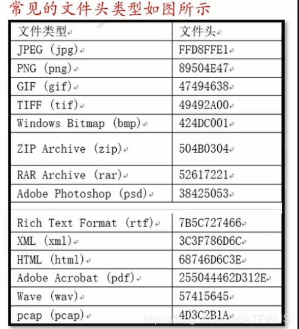
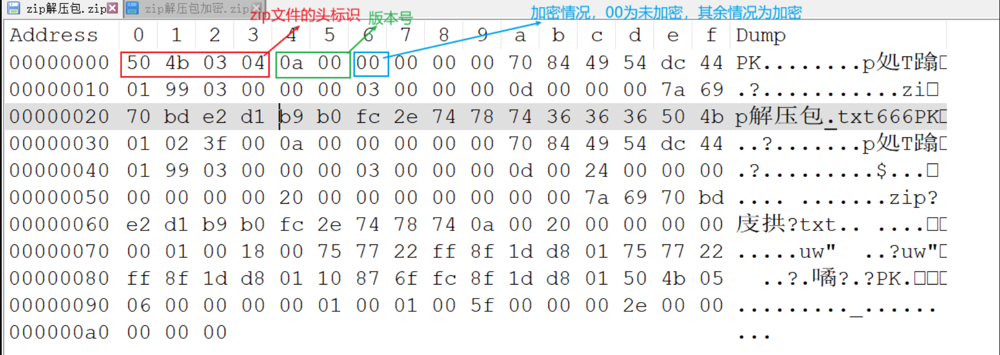
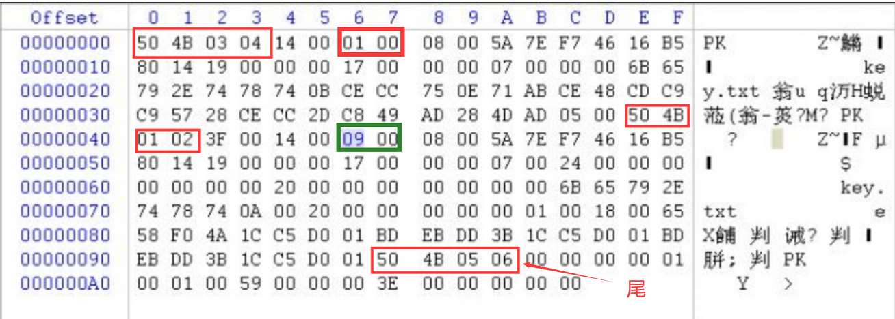
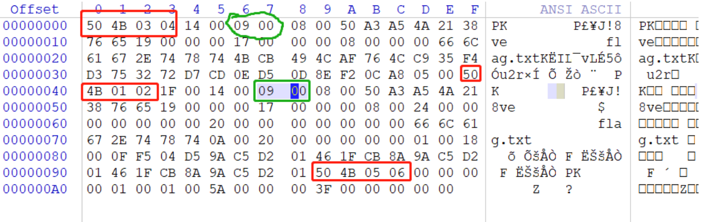
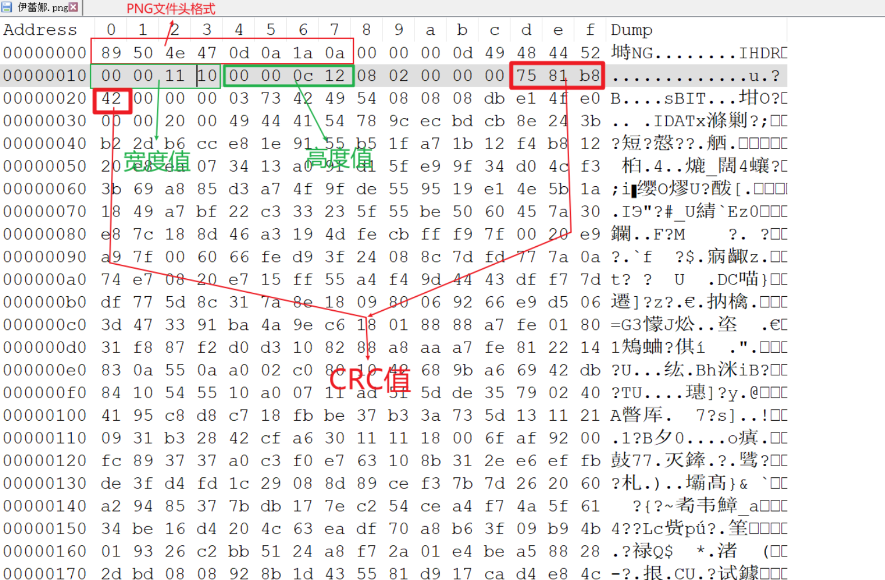
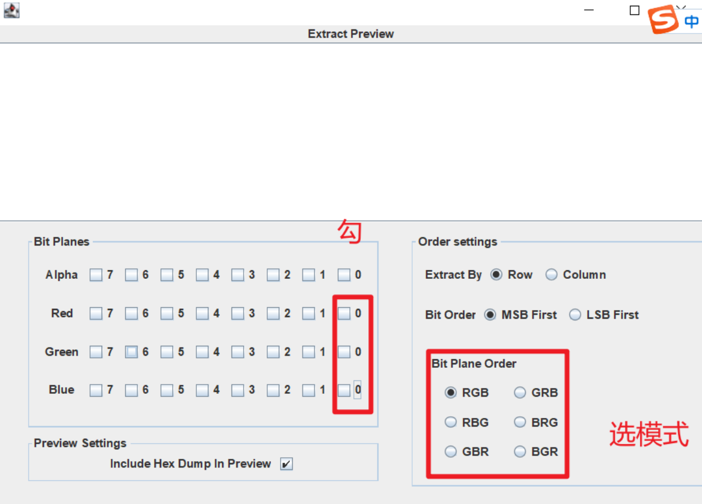
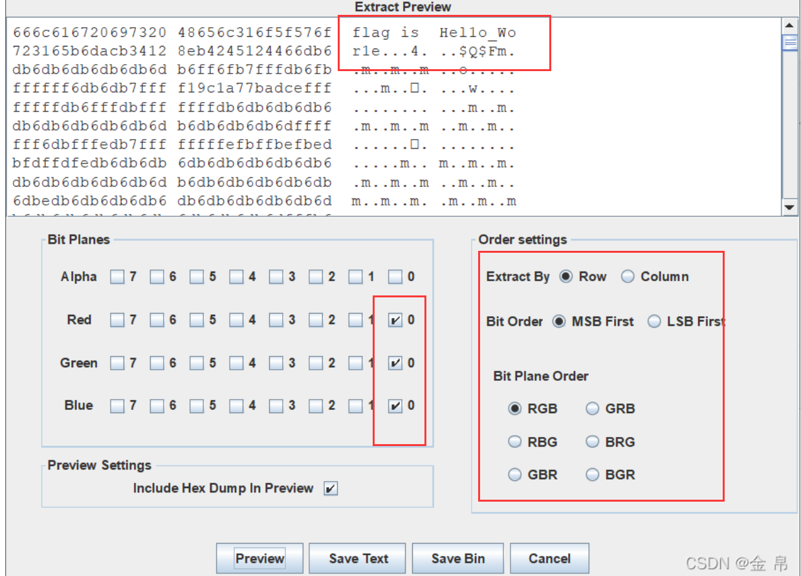
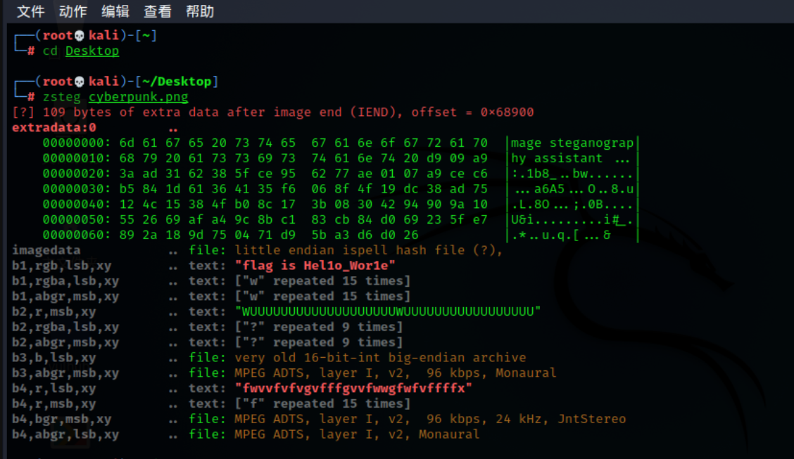

# 一、简单的考法

    1、属性隐藏flag或者是某些重要的信息，如解压包密码 
    2、文件的十六进制数据（中间 \ 结尾）隐藏字符段，那些隐藏的字符段一般都是有规律的，可能需要进行一下解码才能的到flag，例题：Bugku之telnet_l2872253606的博客-CSDN博客
    3、增加文件后缀zip进行解压，解压后的文件里就有flag
    4、补全文件头
    5、常见的文件类型



    6、kali下file命令查看文件类型
        命令：file 文件名

# 二、zip

## 1、文件格式

    •头标识 50 4B 03 04
    •版本号，头标识后面四位
    •加密情况，版本号后面两位，00为未加密，其余通常为加密





## 2、伪加密

原本没有加密的zip文件，在人为的修改16进制的情况（将版本号后面的00改掉），误让解压的时候以为加密了

全局方式位标记的四个数字中只有第二个数字对其有影响

未加密：

    文件头中的全局方式位标记为00 00
    目录中源文件的全局方式位标记为00 00

伪加密：

    文件头中的全局方式位标记为00 00
    目录中源文件的全局方式位标记为09 00

真加密：

    文件头中的全局方式位标记为09 00
    目录中源文件的全局方式位标记为09 00

**第二个数字为奇数时 –>加密**

**第二个数字为偶数时 –>未加密** 



**红色部分对应**压缩源文件数据区+压缩源文件目录区+压缩源文件目录结束标志**这三大部分，绿色部分就是全局方式位标记，第二位数字改为偶数即可破解。**

## 3、密码爆破

    使用工具ARCHPR进行爆破

# 三、PNG

##  1、文件格式

    •头识标，89 50 4E 47 0D 0A 1A 0A
    •宽度位0x10-0x13，不可随意更改，需根据CRC值修改
    •高度位0x14-0x17，可随便改
    •CRC校验位0x1D-0x20，CRC是对文件数据块的校验，修改数据块会使校验失败，linux下文件无法正常显示，windows中可能可以



## 2、高度显示不完整

 例题：Bugku之隐写

## 3、宽度显示不完整

    需根据爆破文件的CRC值修改宽度，否则会打开文件失败

### CRC宽高爆破脚本

```python
import binascii
import struct
crcbp = open("dabai.png", "rb").read()
for i in range(2000):
    for j in range(2000):
        data = crcbp[12:16] + struct.pack('>i', i)+struct.pack('>i', j)+crcbp[24:29]
        crc32 = binascii.crc32(data) & 0xffffffff
        if(crc32 == 0x6D7C7135):
            print(i, j)
            print('hex:', hex(i), hex(j))
```

## 4、LSB隐写

    使用工具stegsolve或者是kali看，kali看得全一点
    例题：Bugku之赛博朋克_l2872253606的博客-CSDN博客

### 用stegsolve查看

文件用stegsolve打开，Analyse，Date Extract



勾选后面三个0，模式一般都是RGB，发现没有的话，可以尝试换一个模式

再点Preview，数据拖到最上方发现flag



### 用kali查看(zsteg)

得先下载zsteg工具，具体方法自行百度，将文件拖入kali

输入命令zsteg 文件名 即可查看被隐藏的内容



# 四、JPG

## 1、文件格式

    •头识标，FF D8
    •尾识标，FF D9

## 2、宽度高度的修改

010editor修改即可

## 3、base64源码转图片

工具箱图片模块直接转就行

# 五、GIF

##  1、文件格式

    •头标识，47 49 46 38（GIF8）   

## 2、flag藏在某一帧中，用stegsolve查看

# 六、文件分离

    有时候一个文件可能隐藏有许多个文件，这时候得用工具进行分离

## 1、自动分析/分离文件（binwalk、foremost）

用kali系统

   •分析文件 binwalk 文件名

   •分离文件 binwalk -e 文件名

   •分离文件 foremost 文件名 -o 目录名

##  2、手动文件分离

自动分离不管用的时候使用，具体操作自己百度
例题：Bugku之easy_nbt_l2872253606的博客-CSDN博客