#### 这里写自定义目录标题

- - [1.看图片属性](file:///C:/Users/yang/Desktop/保存网页资料/Misc/Misc思路(2).html#1_5)
  - [2.隐藏在字节中](file:///C:/Users/yang/Desktop/保存网页资料/Misc/Misc思路(2).html#2_9)
  - [3.补充头部](file:///C:/Users/yang/Desktop/保存网页资料/Misc/Misc思路(2).html#3_13)
  - [4. ZIP](file:///C:/Users/yang/Desktop/保存网页资料/Misc/Misc思路(2).html#4_ZIP_26)
  - - [ZIP文件格式](file:///C:/Users/yang/Desktop/保存网页资料/Misc/Misc思路(2).html#ZIP_28)
    - [真加密](file:///C:/Users/yang/Desktop/保存网页资料/Misc/Misc思路(2).html#_95)
    - [伪加密](file:///C:/Users/yang/Desktop/保存网页资料/Misc/Misc思路(2).html#_100)
  - [5. LSB隐写](file:///C:/Users/yang/Desktop/保存网页资料/Misc/Misc思路(2).html#5_LSB_104)
  - [6. 双图](file:///C:/Users/yang/Desktop/保存网页资料/Misc/Misc思路(2).html#6__109)
  - [7. 音频分析](file:///C:/Users/yang/Desktop/保存网页资料/Misc/Misc思路(2).html#7__130)
  - [8. 压缩包暴力破解](file:///C:/Users/yang/Desktop/保存网页资料/Misc/Misc思路(2).html#8__133)
  - [9. 掩码攻击](file:///C:/Users/yang/Desktop/保存网页资料/Misc/Misc思路(2).html#9__138)
  - [10. 明文攻击](file:///C:/Users/yang/Desktop/保存网页资料/Misc/Misc思路(2).html#10__145)
  - [11. 图片高宽修改](file:///C:/Users/yang/Desktop/保存网页资料/Misc/Misc思路(2).html#11__157)
  - - [计算图片正确宽高](file:///C:/Users/yang/Desktop/保存网页资料/Misc/Misc思路(2).html#_159)
    - [爆破图片高度](file:///C:/Users/yang/Desktop/保存网页资料/Misc/Misc思路(2).html#_191)
    - [JPG格式](file:///C:/Users/yang/Desktop/保存网页资料/Misc/Misc思路(2).html#JPG_221)
    - [PNG格式](file:///C:/Users/yang/Desktop/保存网页资料/Misc/Misc思路(2).html#PNG_226)
  - [12. 文件分离](file:///C:/Users/yang/Desktop/保存网页资料/Misc/Misc思路(2).html#12__233)
  - - [foremost](file:///C:/Users/yang/Desktop/保存网页资料/Misc/Misc思路(2).html#foremost_235)
    - [binwalk](file:///C:/Users/yang/Desktop/保存网页资料/Misc/Misc思路(2).html#binwalk_244)
    - [dd命令](file:///C:/Users/yang/Desktop/保存网页资料/Misc/Misc思路(2).html#dd_251)
  - [13. 隐藏文件加密](file:///C:/Users/yang/Desktop/保存网页资料/Misc/Misc思路(2).html#13__262)
  - - [F5隐写](file:///C:/Users/yang/Desktop/保存网页资料/Misc/Misc思路(2).html#F5_263)
    - [steghide](file:///C:/Users/yang/Desktop/保存网页资料/Misc/Misc思路(2).html#steghide_270)
    - [outguess](file:///C:/Users/yang/Desktop/保存网页资料/Misc/Misc思路(2).html#outguess_277)
    - [JPHS](file:///C:/Users/yang/Desktop/保存网页资料/Misc/Misc思路(2).html#JPHS_284)
    - [cloacked-pixel](file:///C:/Users/yang/Desktop/保存网页资料/Misc/Misc思路(2).html#cloackedpixel_288)
  - [14. 提取电话拨号音](file:///C:/Users/yang/Desktop/保存网页资料/Misc/Misc思路(2).html#14__311)
  - [15. Base64隐写](file:///C:/Users/yang/Desktop/保存网页资料/Misc/Misc思路(2).html#15_Base64_316)
  - [16. CRC碰撞](file:///C:/Users/yang/Desktop/保存网页资料/Misc/Misc思路(2).html#16_CRC_451)
  - [17. Base转图片](file:///C:/Users/yang/Desktop/保存网页资料/Misc/Misc思路(2).html#17_Base_596)
  - [18. 盲水印](file:///C:/Users/yang/Desktop/保存网页资料/Misc/Misc思路(2).html#18__602)
  - - [BlindWaterMark](file:///C:/Users/yang/Desktop/保存网页资料/Misc/Misc思路(2).html#BlindWaterMark_603)
    - [频域盲水印](file:///C:/Users/yang/Desktop/保存网页资料/Misc/Misc思路(2).html#_626)
    - [JAVA盲水印](file:///C:/Users/yang/Desktop/保存网页资料/Misc/Misc思路(2).html#JAVA_686)
  - [19. gnuplot画图](file:///C:/Users/yang/Desktop/保存网页资料/Misc/Misc思路(2).html#19_gnuplot_695)
  - [20. 零宽字符加密](file:///C:/Users/yang/Desktop/保存网页资料/Misc/Misc思路(2).html#20__734)
  - [21. gaps拼图](file:///C:/Users/yang/Desktop/保存网页资料/Misc/Misc思路(2).html#21_gaps_740)
  - [22.十六进制文件字节左右翻转](file:///C:/Users/yang/Desktop/保存网页资料/Misc/Misc思路(2).html#22_776)
  - [23.十六进制文件头尾逆序](file:///C:/Users/yang/Desktop/保存网页资料/Misc/Misc思路(2).html#23_852)
  - [24.zlib解压](file:///C:/Users/yang/Desktop/保存网页资料/Misc/Misc思路(2).html#24zlib_888)
  - [25. 爆破hash](file:///C:/Users/yang/Desktop/保存网页资料/Misc/Misc思路(2).html#25_hash_1012)
  - [26. 哈夫曼编码](file:///C:/Users/yang/Desktop/保存网页资料/Misc/Misc思路(2).html#26__1024)
  - [27. RAR](file:///C:/Users/yang/Desktop/保存网页资料/Misc/Misc思路(2).html#27_RAR_1161)
  - - [RAR文件格式](file:///C:/Users/yang/Desktop/保存网页资料/Misc/Misc思路(2).html#RAR_1163)
    - [RAR伪加密](file:///C:/Users/yang/Desktop/保存网页资料/Misc/Misc思路(2).html#RAR_1173)
    - [RAR文件受损](file:///C:/Users/yang/Desktop/保存网页资料/Misc/Misc思路(2).html#RAR_1182)
  - [29. USB流量分析](file:///C:/Users/yang/Desktop/保存网页资料/Misc/Misc思路(2).html#29_USB_1235)


> 记录做题遇见的不同分类的杂项题，持续更新…

### 1.看图片属性

根据提示，找到图片属性,flag就出来了
 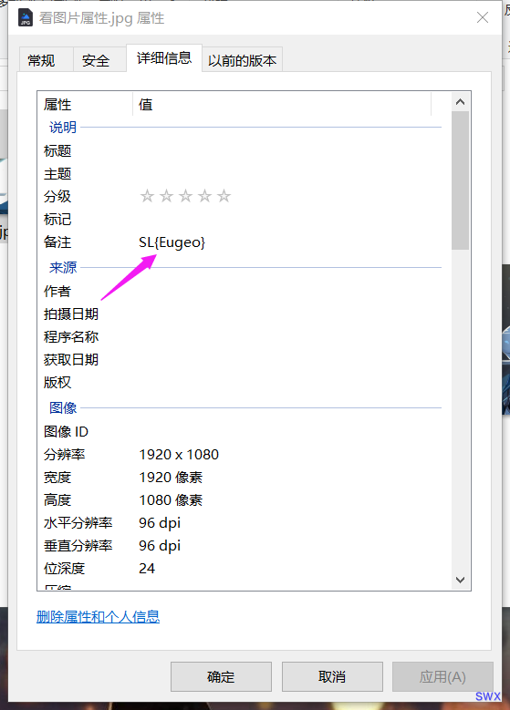

### 2.隐藏在字节中

把图片放入010editor中，在文本中搜索`SL{`

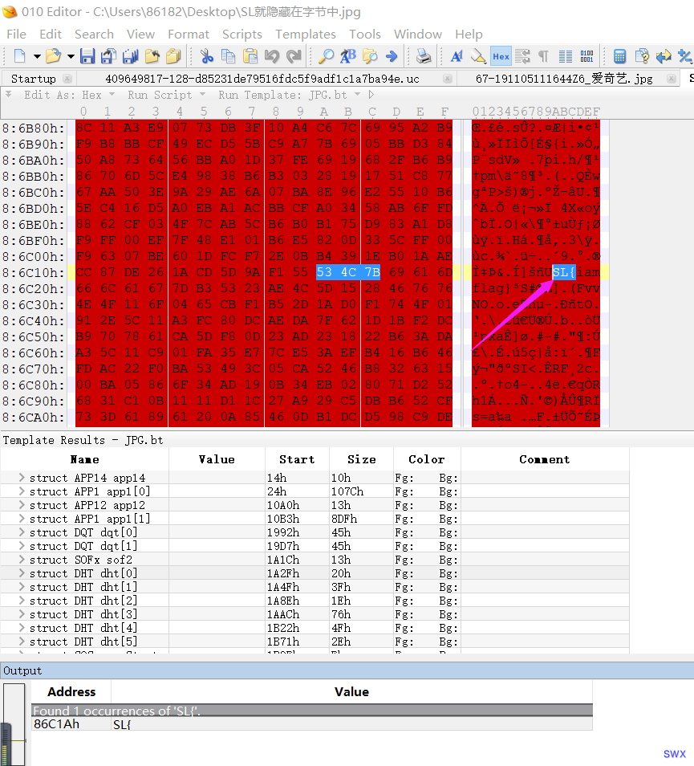

### 3.补充头部

|                   | 常见文件文件头文件尾格式 |             |
| ----------------- | ------------------------ | ----------- |
| 文件名            | 文件头                   | 文件尾      |
| JPEG (jpg)        | FFD8FF                   | FF D9       |
| PNG (png)         | 89504E47                 | AE 42 60 82 |
| GIF (gif)         | 47494638                 | 00 3B       |
| ZIP Archive (zip) | 504B0304                 | FF D9       |
| RAR Archive (rar) | 50 4B                    |             |

将该图片以十六进制格式打开，发现该png图片缺失文件头，补充png文件头89504E47
 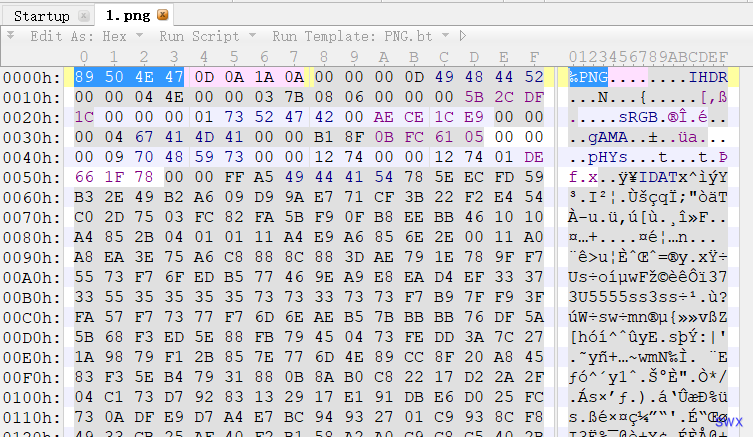

### 4. ZIP

#### ZIP文件格式

一个 ZIP 文件由三个部分组成：

> 压缩源文件数据区+压缩源文件数据区+压缩源文件目录结束标志

**压缩源文件数据区**：

> 50 4B 03 04：这是头文件标记（0x04034b50）
> 14 00：解压文件所需 pkware 版本
> 00 00：全局方式位标记（有无加密）
> 08 00：压缩方式
> 20 9E：最后修改文件时间
> 66 4F：最后修改文件日期
> F2 1B 0F 4A：CRC-32校验（4A0F1BF2）
> 0E 00 00 00：压缩后尺寸
> 0C 00 00 00：未压缩尺寸
> 08 00：文件名长度
> 00 00：扩展记录长度
> 66 6C 61 67 2E 74 78 74: 文件名（不定长）
> 4B CB 49 4C AF 36 34 32 36 31 35 AB 05 00: 文件flag.txt压缩后的数据

**压缩源文件数据区**：

> 50 4B 01 02：目录中文件文件头标记(0x02014b50)
> 1F 00：压缩使用的 pkware 版本
> 14 00：解压文件所需 pkware 版本
> 00 00：全局方式位标记（有无加密，这个更改这里进行伪加密，改为09 00打开就会提示有密码了）
> 08 00：压缩方式 20 9E：最后修改文件时间 66 4F：最后修改文件日期
> F2 1B 0F 4A：CRC-32校验（4A0F1BF2）
> 0E 00 00 00：压缩后尺寸
> 0C 00 00 00：未压缩尺寸
> 08 00：文件名长度
> 24 00：扩展字段长度
> 00 00：文件注释长度
> 00 00：磁盘开始号
> 00 00：内部文件属性
> 20 00 00 00：外部文件属性
> 00 00 00 00：局部头部偏移量

**压缩源文件目录结束标志：**

> 50 4B 05 06：目录结束标记
> 00 00：当前磁盘编号
> 00 00：目录区开始磁盘编号
> 01 00：本磁盘上纪录总数
> 01 00：目录区中纪录总数
> 5A 00 00 00：目录区尺寸大小
> 34 00 00 00：目录区对第一张磁盘的偏移量
> 00 00：ZIP 文件注释长度

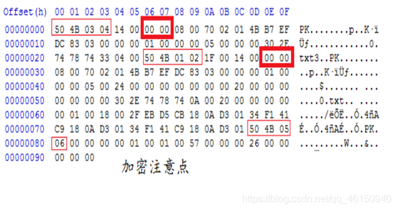
 区分

```bash
无加密
压缩源文件数据区的全局加密应当为00 00
且压缩源文件目录区的全局方式位标记应当为00 00

伪加密         
压缩源文件数据区的全局加密应当为00 00 
且压缩源文件目录区的全局方式位标记应当为09 00

真加密         
压缩源文件数据区的全局加密应当为09 00
且压缩源文件目录区的全局方式位标记应当为09 00
1234567891011
```

#### 真加密

把这个zip文件拖入winhex中，由图中的信息可以知道是真加密
 
 把09 00修改为00 00保存后即可得到flag
 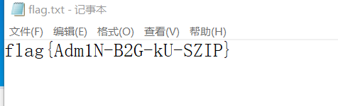

#### 伪加密

伪加密，把全方位标记区 的 01 00 或 09 00 改为 00 00
 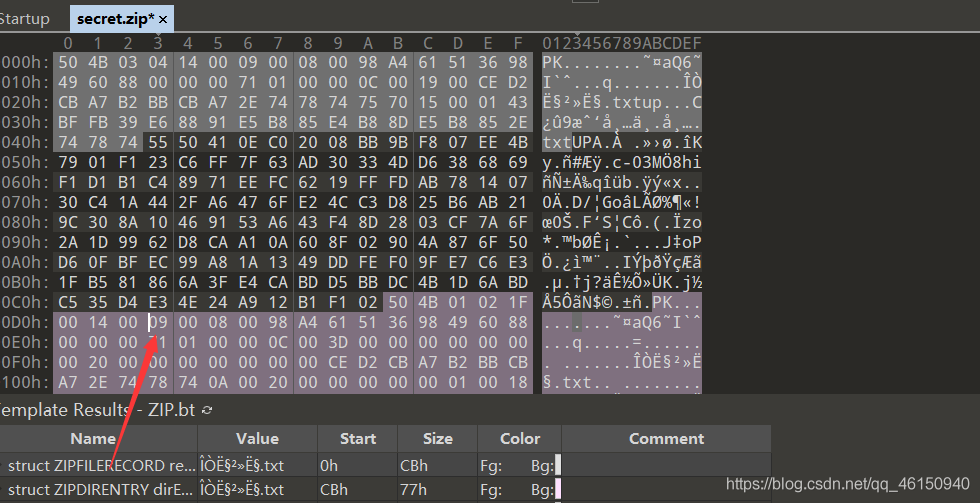

### 5. LSB隐写


 简单的LSB隐写，在最低有效位隐藏信息。可以使用Stegsolve提取。
 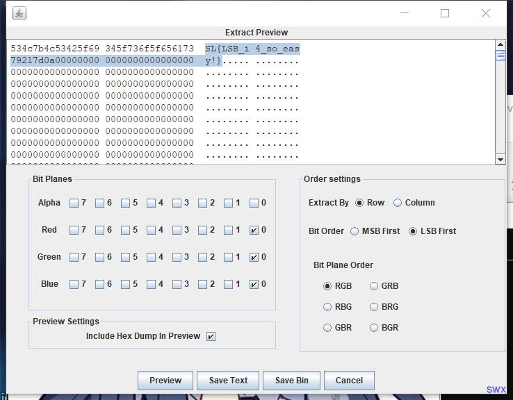

### 6. 双图


 将两张图重叠后，进行异或，出现了疑似二维码的图片
 
 点击Save，将该图片保存下来。
 打开该图片继续进行异或，可以得到三张二维码图片
 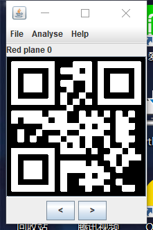
 
 
 依次扫描这三张二维码可得到以下信息

```bash
第一张：DES
第二张：6XaMMbM7
第三张：U2FsdGVkX18IBEATgMBe8NqjIqp65CxRjjMxXIIUxIjBnAODJQRkSLQ/+lHBsjpv1BwwEawMo1c=
123
```

根据该信息，可以知道是DES加密,进行[DES解密](https://www.sojson.com/encrypt_des.html)
 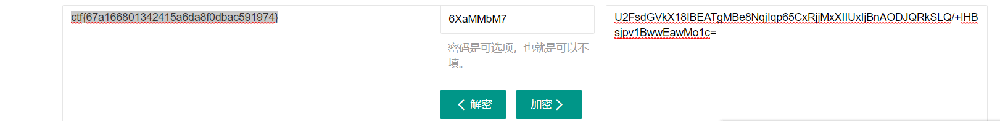

查看频谱图
 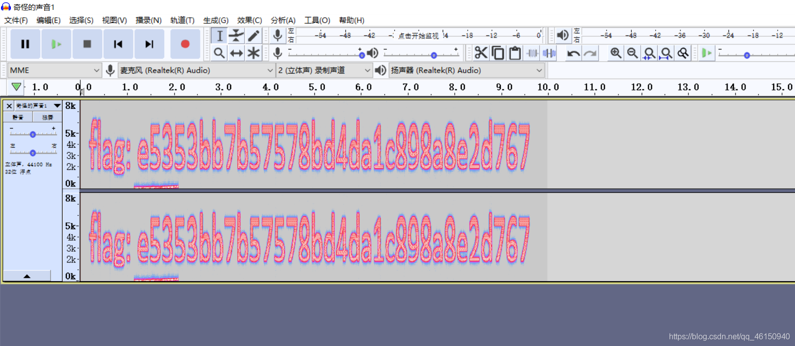

### 7. 音频分析

查看频谱图
 

### 8. 压缩包暴力破解

使用ARCHPR工具，选择Brute-force模式，进行暴力破解
 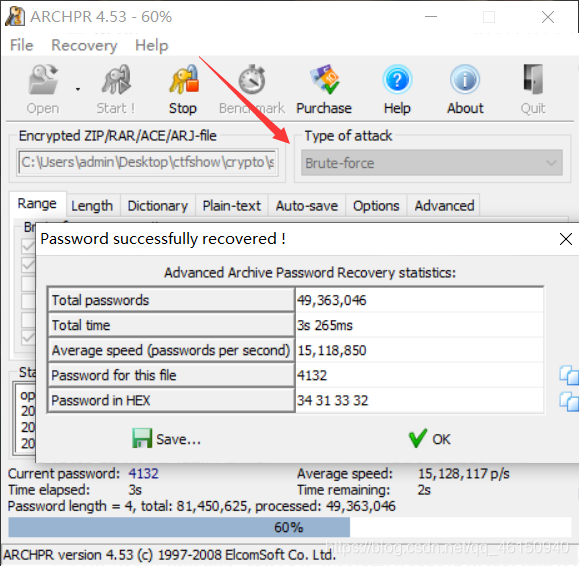

### 9. 掩码攻击

下载附件，是一个加密的压缩包和图片
 

猜测图片里面的内容是压缩包密码，内容是`1317??7p9?`,进行`掩码攻击`，结果提示错误，尝试了很多次，结果将掩码修改成`1317???7p9?`结果成功了。


### 10. 明文攻击

**[ACTF新生赛2020]明文攻击**

把图片拖入010Editor中，发现一个flag.txt
 
 复制完后加上 50 4B，变成一个新的压缩包1.zip
 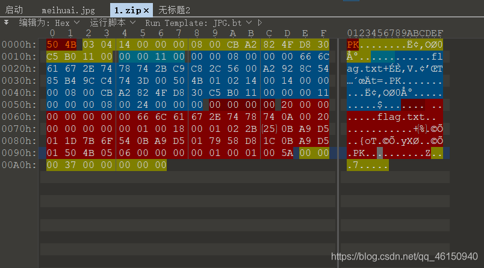
 压缩包1.zip里面的flag.txt与加密压缩包里面的flag.txt的CRC值一样
 
 进行明文攻击
 

### 11. 图片高宽修改

#### 计算图片正确宽高

查看图片crc值

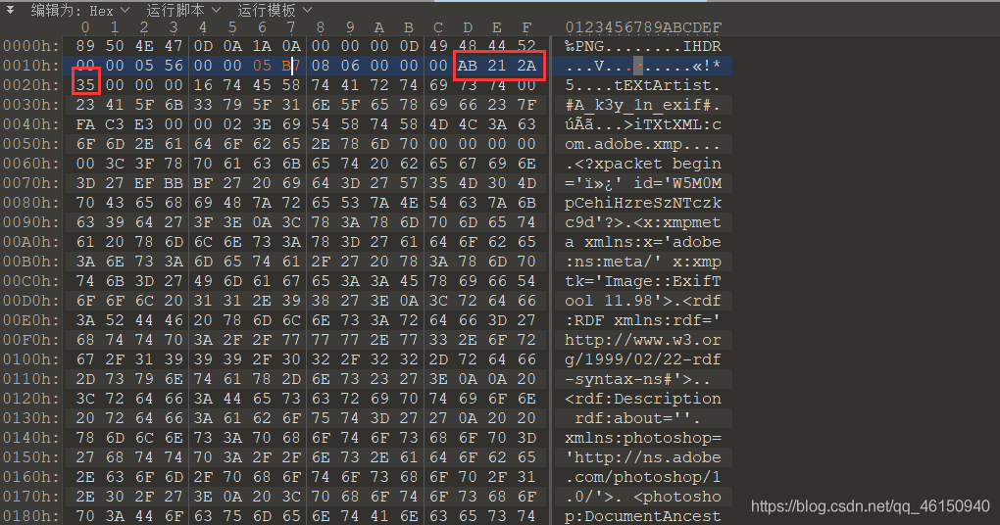
 所以CRC值为0xab212a35，计算图片正确宽高

```python
import struct
import binascii
import os
 
m = open("ctfshow.png","rb").read()
k=0
for i in range(5000):
    if k==1:
        break
    for j in range(5000):
        c = m[12:16] + struct.pack('>i', i) + struct.pack('>i', j)+m[24:29]
        crc = binascii.crc32(c) & 0xffffffff
        if crc == 0xab212a35:
            k = 1
            print(hex(i),hex(j))
            break

1234567891011121314151617
```

运行脚本得到

```bash
0x556 0x5b7
1
```

#### 爆破图片高度

```python
import os
import binascii
import struct
misc = open("ctfshow.png","rb").read()
#print(misc[0x0c:0x0f+1])
# 爆破高

crc32_bytes = misc[0x1d:0x20+1]# 读出bytes
crc32_hex_eval = eval('0x' + crc32_bytes.hex())#bytes串 -> hex串  ->  值
print(crc32_hex_eval)
for i in range(4096):
    data = misc[0x0c:0x0f+1] + misc[0x10:0x13+1] + struct.pack('>i',i)+ misc[0x18:0x1c+1]  #IHDR数据
    crc32 = binascii.crc32(data) & 0xffffffff
    if crc32 == crc32_hex_eval : #IHDR块的crc32值
        print(i)
        print("height_hex:"+ hex(i))

1234567891011121314151617
```

运行脚本得到

```bash
2871077429
1463
height_hex:0x5b7

1234
```

#### JPG格式

打开图片，搜索`FFC0`，在001180 后面4个字节分别是是高宽，把00 80改成02 80
 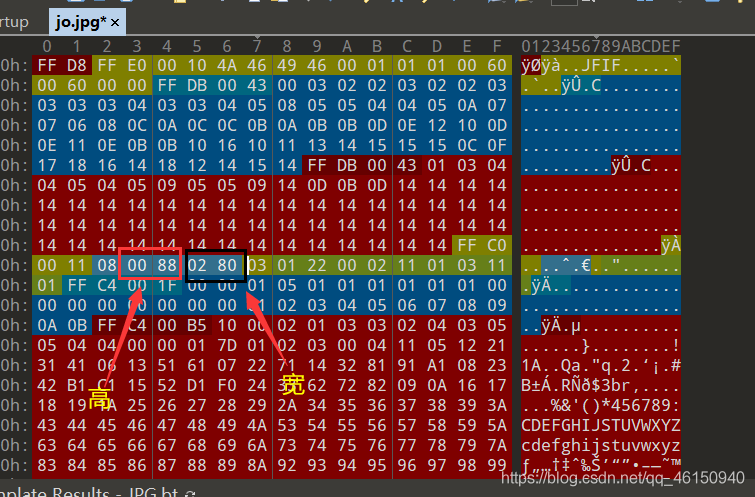

#### PNG格式

> 第二行前四位表示图片的宽，后四位表示图片的高。

十六进制的045F为十进制的1119，十六进制的200为十进制的512
 发现像素大小与属性一致，于是把高跟宽改成同一大小保存数据。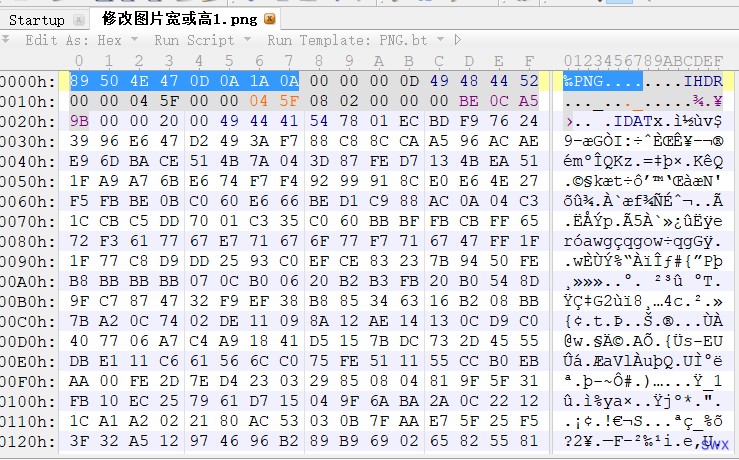

### 12. 文件分离

#### foremost

使用foremost命令`foremost 1.jpg`
 
 得到
 
 带`-T`参数，`foremost -T 1.jpg`会生成以时间为名的文件夹名字，可以避免重复
 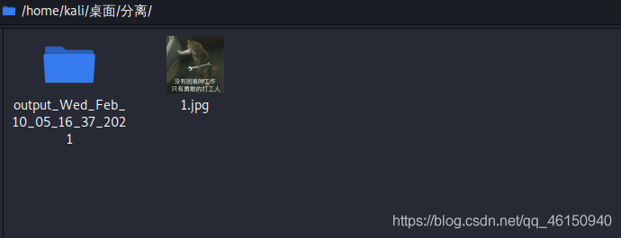

#### binwalk

binwalk一下，发现有隐藏文件
 
 分离文件，分离出1B377.rar
 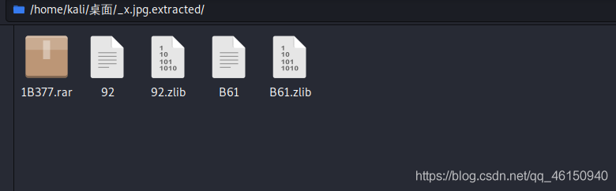

#### dd命令

binwalk图片后得到的信息，jpeg文件是从271007开始

```bash
└─$ dd if=binwalk,foremost,dd.png of=out.jpg bs=1 skip=271007
记录了29053+0 的读入
记录了29053+0 的写出
29053字节（29 kB，28 KiB）已复制，0.175658 s，165 kB/s
1234
```

可以得到png图片

### 13. 隐藏文件加密

#### F5隐写

需要java环境，进入F5-steganography/目录下

```bash
java Extract Matryoshka.jpg -p '!LyJJ9bi&M7E72*JyD'
1
```

生成out.txt
 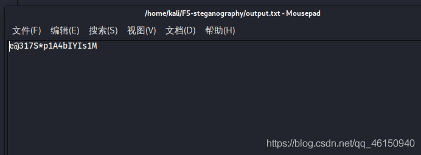

#### steghide

进入目录下

```bash
steghide extract -sf 01.jpg -p A7SL9nHRJXLh@$EbE8 
1
```

生成pwd.txt
 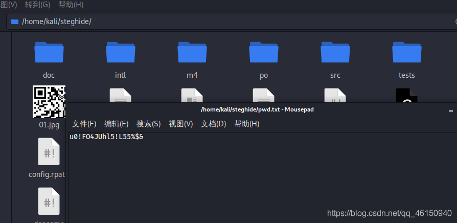

#### outguess

进入目录下，需要新建一个txt文档

```bash
outguess -k "z0GFieYAee%gdf0%lF" -r 02.jpg flag.txt
1
```

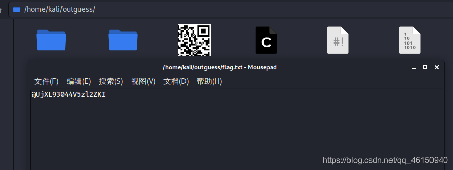

#### JPHS

参考文章：https://blog.csdn.net/drondong/article/details/79326385
 只能打开jpg格式的图片，输入两次相同密码，提取隐藏文件
 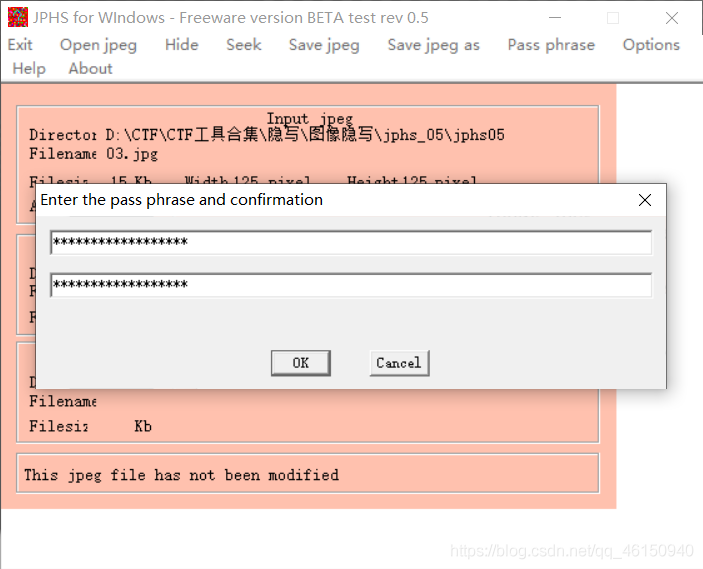

#### cloacked-pixel

**cloacked-pixel安装**

```bash
git clone https://codechina.csdn.net/mirrors/cyberinc/cloacked-pixel.git
1
```

安装需要用到的库

```bash
pip install numpy-1.16.6+mkl-cp27-cp27m-win_amd64.whl
pip install matplotlib
pip install pillow
#卸载陈旧版本的包
pip uninstall crypto
pip uninstall pycrypto
#安装新版本
pip install pycryptodome
12345678
```

使用

```bash
E:\cloacked-pixel>python lsb.py extract lsb（123456）.png flag.txt 123456
[+] Image size: 640x640 pixels.
[+] Written extracted data to flag.txt.
123
```

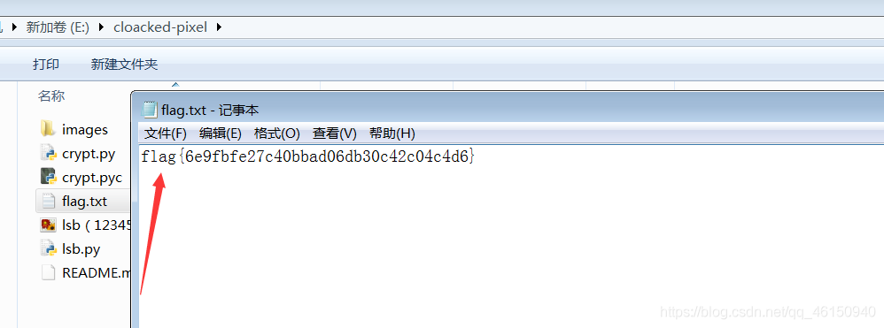

### 14. 提取电话拨号音

工具下载地址：https://www.cr173.com/soft/17040.html
 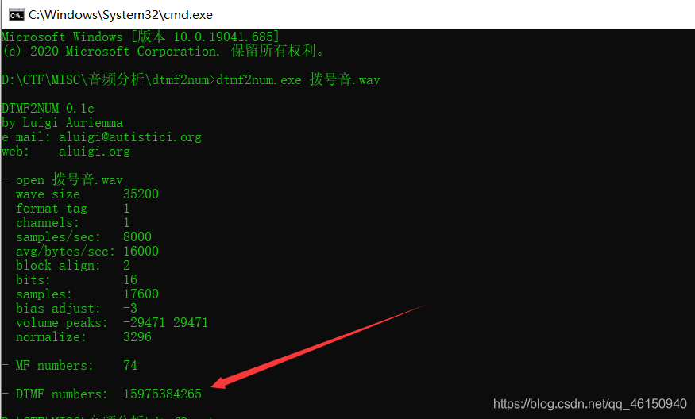

### 15. Base64隐写

**[GXYCTF2019]SXMgdGhpcyBiYXNlPw=**

打开文件是多行base64密文

```bash
Q2V0dGUgbnVpdCwK
SW50ZW5hYmxlIGluc29tbmllLAp=
TGEgZm9saWUgbWUgZ3VldHRlLAo=
SmUgc3VpcyBjZSBxdWUgamUgZnVpcwp=
SmUgc3ViaXMsCt==
Q2V0dGUgY2Fjb3Bob25pZSwK
UXVpIG1lIHNjaWUgbGEgdOmUmnRlLAp=
QXNzb21tYW50ZSBoYXJtb25pZSwK
RWxsZSBtZSBkaXQsCo==
VHUgcGFpZXJhcyB0ZXMgZGVsaXRzLAp=
UXVvaSBxdSdpbCBhZHZpZW5uZSwK
T24gdHJh5Y2vbmUgc2VzIGNoYeWNr25lcywK
U2VzIHBlaW5lcywK
SmUgdm91ZSBtZXMgbnVpdHMsCm==
QSBsJ2Fzc2FzeW1waG9uaWUsCl==
QXV4IHJlcXVpZW1zLAr=
VHVhbnQgcGFyIGRlcGl0LAq=
Q2UgcXVlIGplIHNlbWUsCt==
SmUgdm91ZSBtZXMgbnVpdHMsCp==
QSBsJ2Fzc2FzeW1waG9uaWUsCp==
RXQgYXV4IGJsYXNwaGVtZXMsCo==
Sidhdm91ZSBqZSBtYXVkaXMsCl==
VG91cyBjZXV4IHF1aSBzJ2FpbWVudCwK
TCdlbm5lbWksCu==
VGFwaSBkYW5zIG1vbiBlc3ByaXQsCp==
RumUmnRlIG1lcyBkZWZhaXRlcywK
U2FucyByZXBpdCBtZSBkZWZpZSwK
SmUgcmVuaWUsCq==
TGEgZmF0YWxlIGhlcmVzaWUsCh==
UXVpIHJvbmdlIG1vbiDplJp0cmUsCo==
SmUgdmV1eCByZW5h5Y2vdHJlLAp=
UmVuYeWNr3RyZSwK
SmUgdm91ZSBtZXMgbnVpdHMsCn==
QSBsJ2Fzc2FzeW1waG9uaWUsCq==
QXV4IHJlcXVpZW1zLAp=
VHVhbnQgcGFyIGRlcGl0LAq=
Q2UgcXVlIGplIHNlbWUsCo==
SmUgdm91ZSBtZXMgbnVpdHMsCm==
QSBsJ2Fzc2FzeW1waG9uaWUsCl==
RXQgYXV4IGJsYXNwaGVtZXMsCm==
Sidhdm91ZSBqZSBtYXVkaXMsCu==
VG91cyBjZXV4IHF1aSBzJ2FpbWVudCwK
UGxldXJlbnQgbGVzIHZpb2xvbnMgZGUgbWEgdmllLAp=
TGEgdmlvbGVuY2UgZGUgbWVzIGVudmllcywK
U2lwaG9ubmVlIHN5bXBob25pZSwK
RGVjb25jZXJ0YW50IGNvbmNlcnRvLAq=
SmUgam91ZSBzYW5zIHRvdWNoZXIgbGUgRG8sCo==
TW9uIHRhbGVudCBzb25uZSBmYXV4LAp=
SmUgbm9pZSBtb24gZW5udWksCo==
RGFucyBsYSBtZWxvbWFuaWUsCl==
SmUgdHVlIG1lcyBwaG9iaWVzLAq=
RGFucyBsYSBkZXNoYXJtb25pZSwK
SmUgdm91ZSBtZXMgbnVpdHMsCv==
QSBsJ2Fzc2FzeW1waG9uaWUsCn==
QXV4IHJlcXVpZW1zLAp=
VHVhbnQgcGFyIGRlcGl0LAo=
Q2UgcXVlIGplIHNlbWUsCm==
SmUgdm91ZSBtZXMgbnVpdHMsCp==
QSBsJ2Fzc2FzeW1waG9uaWUsCm==
RXQgYXV4IGJsYXNwaGVtZXMsCu==
Sidhdm91ZSBqZSBtYXVkaXMsCm==
VG91cyBjZXV4IHF1aSBzJ2FpbWVudCwK
SmUgdm91ZSBtZXMgbnVpdHMsCn==
QSBsJ2Fzc2FzeW1waG9uaWUgKGwnYXNzYXN5bXBob25pZSksCn==
Sidhdm91ZSBqZSBtYXVkaXMsCt==
VG91cyBjZXV4IHF1aSBzJ2FpbWVudA==
123456789101112131415161718192021222324252627282930313233343536373839404142434445464748495051525354555657585960616263646566
```

脚本1：

```python
#python2
b64chars = 'ABCDEFGHIJKLMNOPQRSTUVWXYZabcdefghijklmnopqrstuvwxyz0123456789+/'
with open('flag.txt', 'rb') as f:
    bin_str = ''
    for line in f.readlines():
        stegb64 = ''.join(line.split())
        rowb64 =  ''.join(stegb64.decode('base64').encode('base64').split())
        offset = abs(b64chars.index(stegb64.replace('=','')[-1])-b64chars.index(rowb64.replace('=','')[-1]))
        equalnum = stegb64.count('=') #no equalnum no offset
        if equalnum:
            bin_str += bin(offset)[2:].zfill(equalnum * 2)
        print ''.join([chr(int(bin_str[i:i + 8], 2)) for i in xrange(0, len(bin_str), 8)]) 
123456789101112
```

脚本2：

```python
#python2
def get_base64_diff_value(s1, s2):
    base64chars = 'ABCDEFGHIJKLMNOPQRSTUVWXYZabcdefghijklmnopqrstuvwxyz0123456789+/'
    res = 0
    for i in xrange(len(s2)):
        if s1[i] != s2[i]:
            return abs(base64chars.index(s1[i]) - base64chars.index(s2[i]))
    return res


def solve_stego():
    with open('flag.txt','rb') as f:
        file_lines = f.readlines()
        bin_str = ''
        for line in file_lines:
            steg_line = line.replace('\n', '')
            norm_line = line.replace('\n', '').decode('base64').encode('base64').replace('\n', '')
            diff = get_base64_diff_value(steg_line, norm_line)
            print diff
            pads_num = steg_line.count('=')
            if diff:
                bin_str += bin(diff)[2:].zfill(pads_num * 2)
            else:
                bin_str += '0' * pads_num * 2
            print goflag(bin_str)


def goflag(bin_str):
    res_str = ''
    for i in xrange(0, len(bin_str), 8):
        res_str += chr(int(bin_str[i:i + 8], 2))
    return res_str


if __name__ == '__main__':
    solve_stego()
123456789101112131415161718192021222324252627282930313233343536
```

最终得到flag

```bash
GXY{fazhazhenhaoting}
1
```

### 16. CRC碰撞

下载附件，都是压缩包
 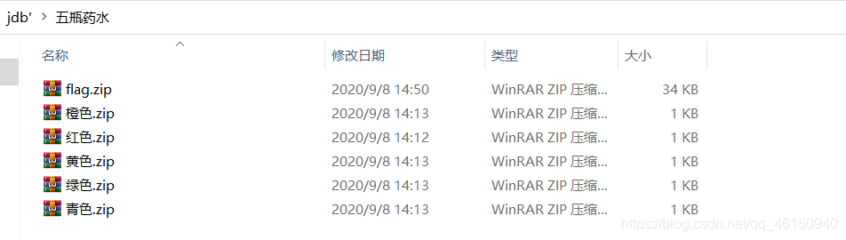

CRC碰撞，根据彩虹排序颜色排序，红橙黄绿青，CRC32值分别为

```php
红 555FA1A2
橙 E5C67F46  
黄 6E957E45
绿 76D6A31A
青 2B042586
12345
```

补充上0x开头，使用脚本进行碰撞

```python
import binascii
import string

dic=string.printable  
crc1 = 0xe5c67f46  
crc2 = 0x555fa1a2
crc3 = 0x6e957e45
crc4 = 0x76d6a31a
crc5 = 0x2b042586

def CrackCrc4(crc):
    for i in dic :
        for j in dic:
            for p in dic:
                for q in dic:
                        s=i+j+p+q
                        if crc == (binascii.crc32(s.encode("ascii"))):
                            print (s)
                            return 1
CrackCrc4(crc1)
CrackCrc4(crc2)
CrackCrc4(crc3)
CrackCrc4(crc4)
CrackCrc4(crc5)
123456789101112131415161718192021222324
```

脚本跑出来

```python
cG90
aW9u
Z2Vu
YjEy
Mw==
12345
```

在进行压缩包内为五字节或六字节爆破时，使用上面的脚本需要的时间太长了，在github上找到两个新的脚本

**项目1**：
 https://github.com/theonlypwner/crc32.git

```bash
└─$ python crc32.py reverse 0x3dacac6b                                                 
4 bytes: {0x47, 0x18, 0x87, 0xce}
verification checksum: 0x3dacac6b (OK)
5 bytes: DCr4m (OK)
6 bytes: 1QhloU (OK)
6 bytes: 3mmr6H (OK)
6 bytes: 49Gqqk (OK)
6 bytes: 5Uumn6 (OK)
6 bytes: 8Gpbyp (OK)
6 bytes: 9G1Sbi (OK)
6 bytes: EHZxWz (OK)
6 bytes: F93jxv (OK)
6 bytes: I6mk_a (OK)
6 bytes: KGEHkt (OK)
6 bytes: O3d8oG (OK)
6 bytes: Uy1jKa (OK)
6 bytes: XJju5k (OK)
6 bytes: Zvoklv (OK)
6 bytes: a3H1hL (OK)
6 bytes: g6AbXj (OK)
6 bytes: kHvqPq (OK)
6 bytes: lQqOzZ (OK)
6 bytes: vwW0Z8 (OK)    
1234567891011121314151617181920212223
```

当然由于crc32.py中字符集中只包含`[A-Za-z0-9_]`,遇到特殊字符可能无法碰撞出来，可以对脚本进行改进，把字符集换成dic，即可打印字符。

```php
dic=string.printable
#0123456789abcdefghijklmnopqrstuvwxyzABCDEFGHIJKLMNOPQRSTUVWXYZ!"#$%&'()*+,-./:;<=>?@[\]^_`{|}~ 
12
```

然后在进行CRC32碰撞，可以得到更多的结果

```bash
┌──(kali㉿kali)-[~/桌面/Python/CRC32]
└─$ python3 crc32.py reverse 0x3dacac6b 
4 bytes: {0x47, 0x18, 0x87, 0xce}
verification checksum: 0x3dacac6b (OK)
5 bytes: (0_0) (OK)
5 bytes: DCr4m (OK)
6 bytes: 1QhloU (OK)
6 bytes: 3mmr6H (OK)
6 bytes: 49Gqqk (OK)
6 bytes: 5Uumn6 (OK)
6 bytes: 7ips7+ (OK)
6 bytes: 8Gpbyp (OK)
6 bytes: 9G1Sbi (OK)
6 bytes: EHZxWz (OK)
6 bytes: F93jxv (OK)
6 bytes: I6mk_a (OK)
6 bytes: J+wTt) (OK)
6 bytes: K+6eo0 (OK)
6 bytes: KGEHkt (OK)
6 bytes: N/jUuJ (OK)
6 bytes: O/+dnS (OK)
6 bytes: O3d8oG (OK)
6 bytes: TX.K94 (OK)
6 bytes: Uy1jKa (OK)
6 bytes: XJju5k (OK)
6 bytes: YJ+D.r (OK)
6 bytes: Zvoklv (OK)
6 bytes: a3H1hL (OK)
6 bytes: dG(pwf (OK)
6 bytes: e7U0i/ (OK)
6 bytes: fgb2/o (OK)
6 bytes: g6AbXj (OK)
6 bytes: kHvqPq (OK)
6 bytes: kT9-Qe (OK)
6 bytes: lQqOzZ (OK)
6 bytes: vwW0Z8 (OK)
123456789101112131415161718192021222324252627282930313233343536
```

**项目2**：
 https://github.com/kmyk/zip-crc-cracker

```bash
└─$ python3 crack.py key.zip
reading zip files...
file found: key.zip / key.txt: crc = 0x3dacac6b, size = 5
compiling...
searching...
crc found: 0x3dacac6b: "yR>\x5c5"
crc found: 0x3dacac6b: "DCr4m"
crc found: 0x3dacac6b: "X\x0c.5y"
crc found: 0x3dacac6b: "(0_0)"
crc found: 0x3dacac6b: "\x09nOYe"
done

key.zip / key.txt : 'yR>\\5'
key.zip / key.txt : 'DCr4m'
key.zip / key.txt : 'X\x0c.5y'
key.zip / key.txt : '(0_0)'
key.zip / key.txt : '\tnOYe
1234567891011121314151617
```

### 17. Base转图片

打开flag.txt，发现`data:image/png;base64`开头，
 
 在线网站[Base64转图片](http://tool.chinaz.com/tools/imgtobase/)
 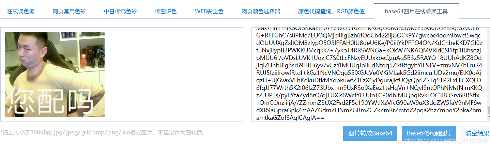

### 18. 盲水印

#### BlindWaterMark

下载地址：https://github.com/chishaxie/BlindWaterMark

需要安装cv2库，pip install opencv-python

```php
python2 -m pip install opencv-python
1
```

合成盲水印

```bash
python bwm.py encode hui.png wm.png hui_with_wm.png
1
```

提取图中的盲水印

```php
python2 bwm.py decode 2.png 1.png  flag.png
或者
python3 bwmforpy3.py decode 2.png 1.png flag.png
#2.png     --original <原始图像文件>
#1.png     --image <图像文件> 
#flag.png  --result <结果文件>
123456
```

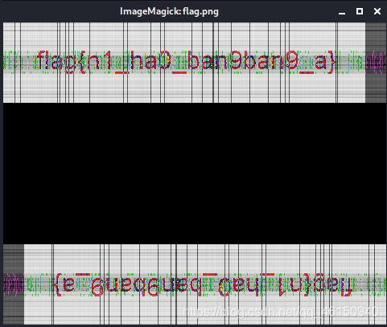

#### 频域盲水印

参考文章：https://xz.aliyun.com/t/1875/#toc-9
 **[GWCTF2019]huyao**
 频域盲水印脚本： BlindWaterMarkplus.py

```bash
# coding=utf-8
import cv2   
import numpy as np
import random
import os
from argparse import ArgumentParser
ALPHA = 5
def build_parser():
    parser = ArgumentParser()
    parser.add_argument('--original', dest='ori', required=True)
    parser.add_argument('--image', dest='img', required=True)
    parser.add_argument('--result', dest='res', required=True)
    parser.add_argument('--alpha', dest='alpha', default=ALPHA)
    return parser
def main():
    parser = build_parser()
    options = parser.parse_args()
    ori = options.ori
    img = options.img
    res = options.res
    alpha = options.alpha
    if not os.path.isfile(ori):
        parser.error("original image %s does not exist." % ori)
    if not os.path.isfile(img):
        parser.error("image %s does not exist." % img)
    decode(ori, img, res, alpha)
def decode(ori_path, img_path, res_path, alpha):
    ori = cv2.imread(ori_path)
    img = cv2.imread(img_path)
    ori_f = np.fft.fft2(ori)
    img_f = np.fft.fft2(img)
    height, width = ori.shape[0], ori.shape[1]
    watermark = (ori_f - img_f) / alpha
    watermark = np.real(watermark)
    res = np.zeros(watermark.shape)
    random.seed(height + width)
    x = range(height / 2)
    y = range(width)
    random.shuffle(x)
    random.shuffle(y)
    for i in range(height / 2):
        for j in range(width):
            res[x[i]][y[j]] = watermark[i][j]
    cv2.imwrite(res_path, res, [int(cv2.IMWRITE_JPEG_QUALITY), 100])
if __name__ == '__main__':
    main()
python BlindWaterMarkplus.py --original huyao.png --image stillhuyao.png --result res.png
1234567891011121314151617181920212223242526272829303132333435363738394041424344454647
```

然后，使用命令

```bash
python BlindWaterMarkplus.py --original huyao.png --image stillhuyao.png --result res.png
1
```

得到res.png
 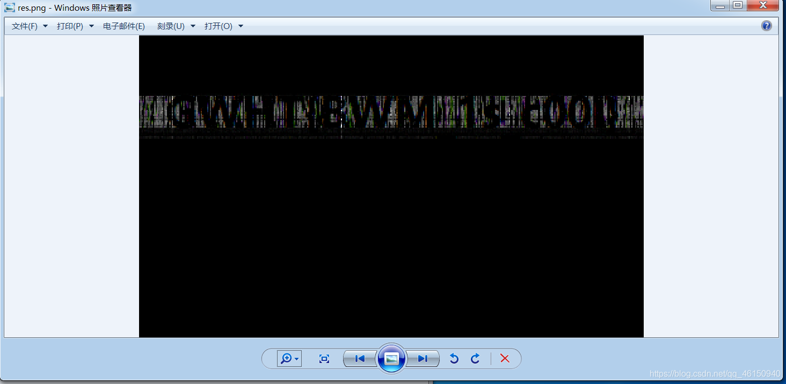

#### JAVA盲水印

项目地址：https://github.com/ww23/BlindWaterMark/releases

执行命令

```bash
java -jar BlindWatermark.jar decode -c bingbing.jpg decode.jpg
1
```

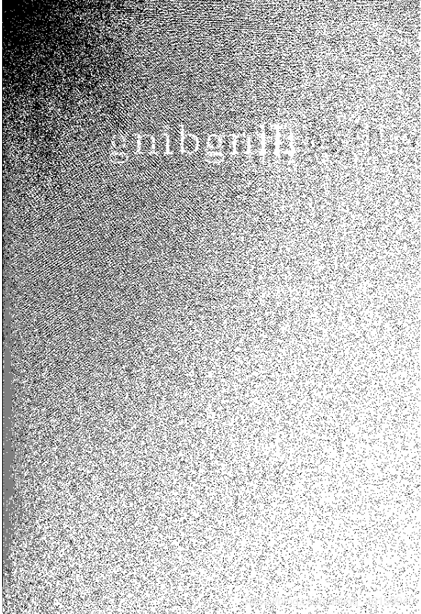

### 19. gnuplot画图

**[BUUCTF]- 梅花香之苦寒来**
 用010 editor打开图片，在文件尾发现大量数据
 
 复制到Notepad++，使用 [ hex转ascll插件](https://blog.csdn.net/anialy/article/details/8183108)
 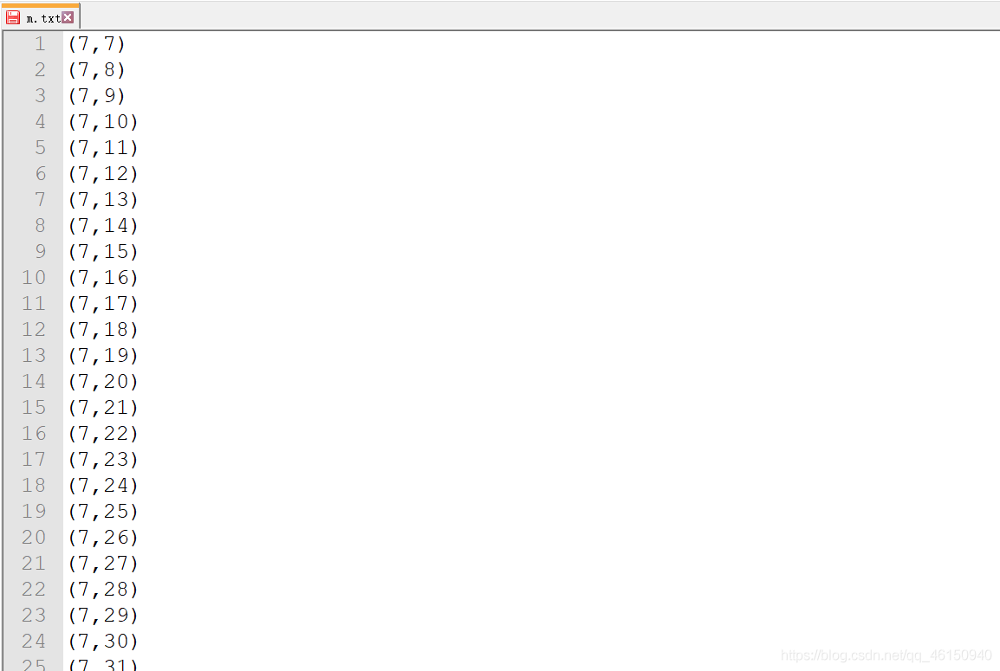
 转换为gnuplot能识别的内容
 
 使用gnuplot工具画图

```bash
plot "m.txt"
1
```

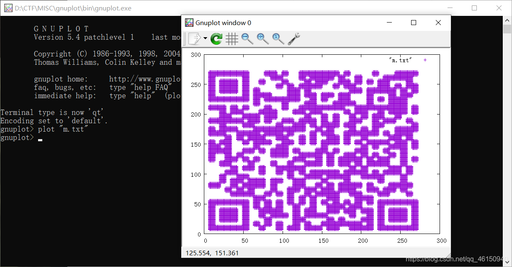
 扫码即可得到flag

看了其他人的解法，大师傅的[python脚本](https://blog.csdn.net/weixin_45485719/article/details/107427378)

```python
import matplotlib.pyplot as plt
import numpy as np


with open('m.txt', 'r') as h:
    h = h.read()
with open('ascii.txt', 'a') as a:
    for i in range(0, len(h), 2):
        tmp = '0x'+h[i]+h[i+1]
        tmp = int(tmp, base=16)
        if chr(tmp) != '(' and chr(tmp) != ')':
            a.write(chr(tmp))


x, y = np.loadtxt('ascii.txt', delimiter=',', unpack=True)
plt.plot(x, y, '.')
plt.show()

123456789101112131415161718
```

### 20. 零宽字符加密

[UTCTF2020]zero
 下载附件，使用vim命令可以看到零宽字符
 
 在线网站，[零宽度字符隐写解密](https://330k.github.io/misc_tools/unicode_steganography.html)
 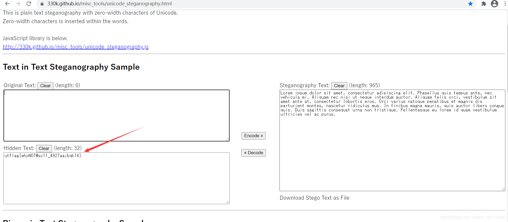

### 21. gaps拼图

**BUUCTF：[MRCTF2020]不眠之夜**

下载附件，删去不必要的文件，查看文件夹属性，一共120张图片
 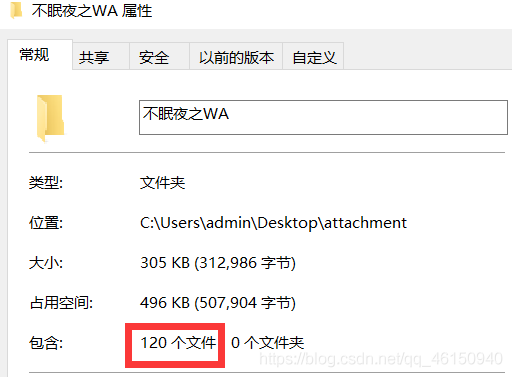
 再查看图片属性，分辨率为200x100
 

1.使用 `montage` 命令将碎片合成为一张图片,得到flag.jpg

```bash
montage *jpg -tile 10x12 -geometry 200x100+0+0 flag.jpg
1
```

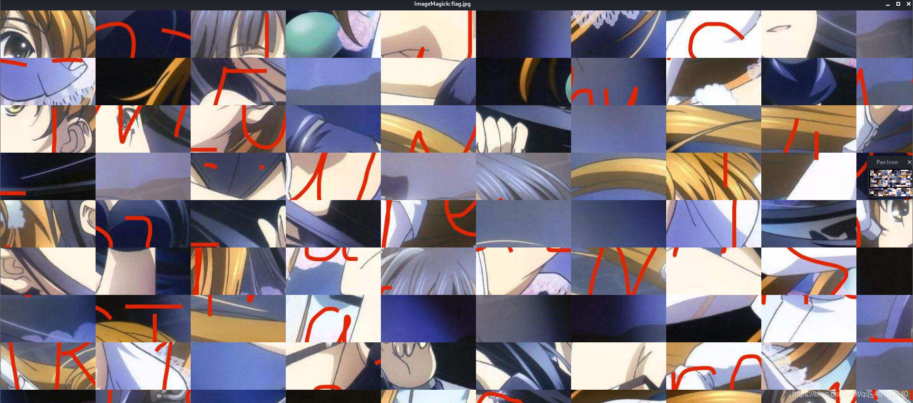

2 .将生成的flag.jpg拖到gaps的bin目录下执行

```bash
python3 gaps --image=flag.jpg --generations=40 --population=120 --size=100
#population为图片数量，size为每个图片高度
12
```

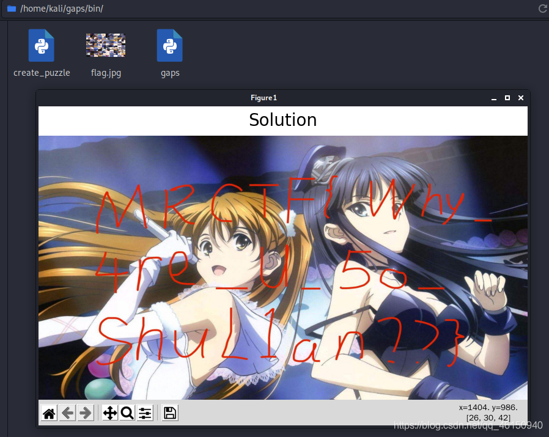
 **[第一届SXC CTF]拼图**

将100张碎片合成，每个图片分辨率为192x120，生成的out.png分辨率为1920x1200

```bash
montage *png -tile 10x10 -geometry 192x120+0+0 out.png
1
```


 修改拼接后的图片大小，改为1200x1200
 
 还原拼图

```bash
python3 gaps --image=out.png --generation=30 --population=300 --size=120
1
```


### 22.十六进制文件字节左右翻转

**[2020金盾信安杯]-我和十六有个约定**
 内容：链接: https://pan.baidu.com/s/1LJiUaVyANUZBN4bb1SHiCQ 密码: u5sr

下载附件，得到ababab.png和flag.zip
 010打开ababab.png，发现其实是GIF，不过没什么用，拖到最后，看到keyis7034735377307244
 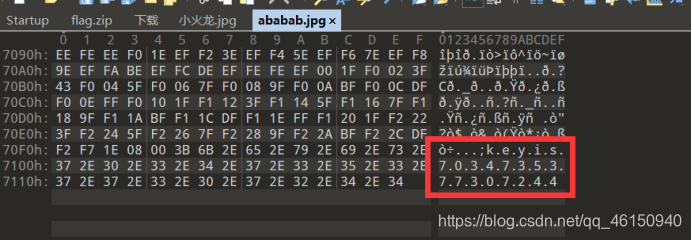

十六进制转字符串，得到p4sSw0rD，这就是压缩包密码解压文件flag.txt和splice.txt
 flag.txt内容为

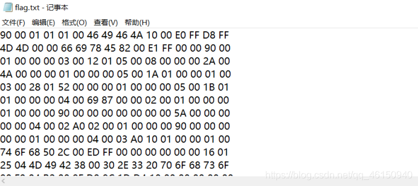

发现第一行`FF D8 FF E0`，倒着读是jpg的文件头，找到一个脚本将flag.txt反转，生成output.txt

```python
#coding=utf-8
import re
f=open("flag.txt")
out = open("output.txt","w")
out.close()
out = open("output.txt","a")

for fl in f.readlines():
    temp=re.findall(r'.{2}',fl)
    order=[]
    for i in temp:
        order.append(i)
    order.reverse()   
    print(''.join(order))
    out.write(''.join(order)+'\n')

f.close()
out.close()
123456789101112131415161718
```

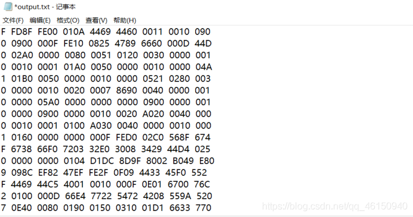

去掉空格
 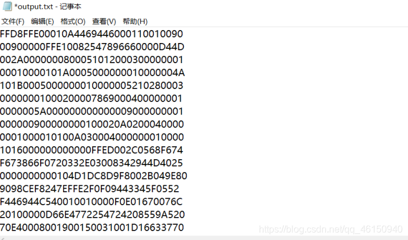
 再贴上一位大佬的脚本

```python
re = []
s = open("./flag1.txt", 'w')     #以覆盖的方式进行写文件
f = open('./flag.txt');          #打开文件,进行读取内容

for line in f.readlines():       #调用readlines()一次读取所有内容并按行返回list
    re = line.split(' ')         #split()函数以空格为划分生成了一个新的列表并放入re[]中
    re = re[:-1]                 #因为readlines返回的每一行最后都有/n换行符，所以要去掉
    re = re[::-1]                #使列表中的值逆序
    s.write(" ".join(re) + '\n') #join()函数用于列表格式化输出，用空格相连接

s.close()
1234567891011
```

得到
 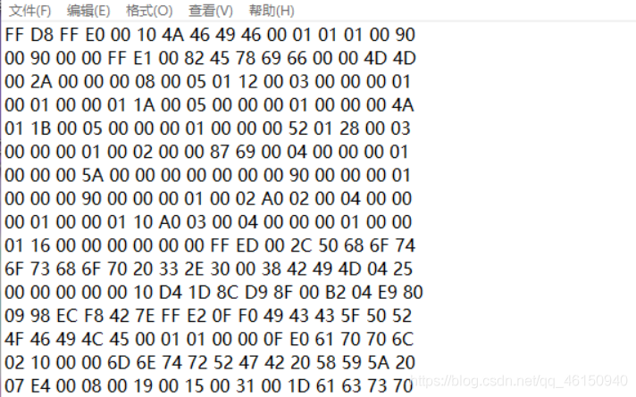

打开010，新建一个Hex file，把编辑后的output.txt内容粘贴进去

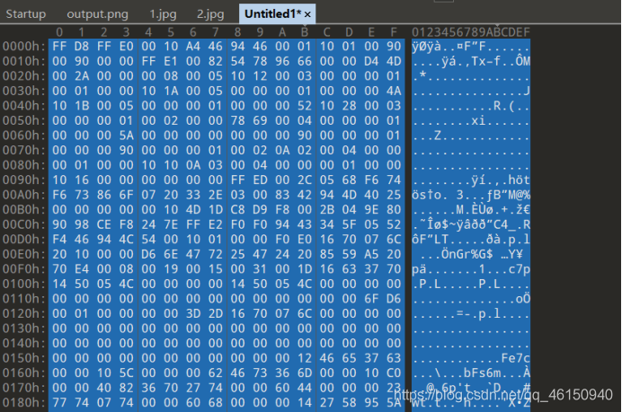

文件头是FF D8 FF E0，是jpg文件，另存为output.jpg，得到一张残缺的二维码
 
 splice.txt内容为
 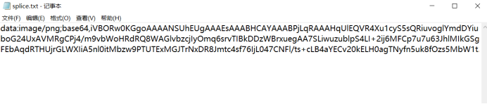

Base64转换为图片
 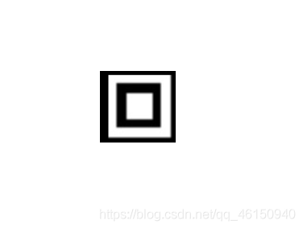

补全二维码，扫码得到flag
 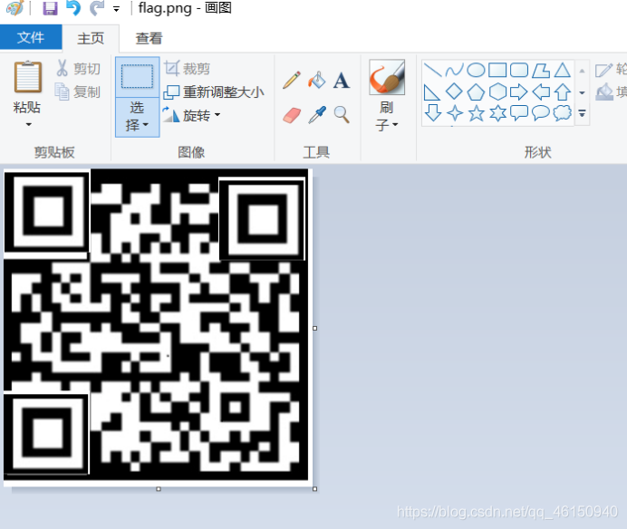

### 23.十六进制文件头尾逆序

**[HGAME2021]-Hallucigenia**

用Stegslove打开进行异或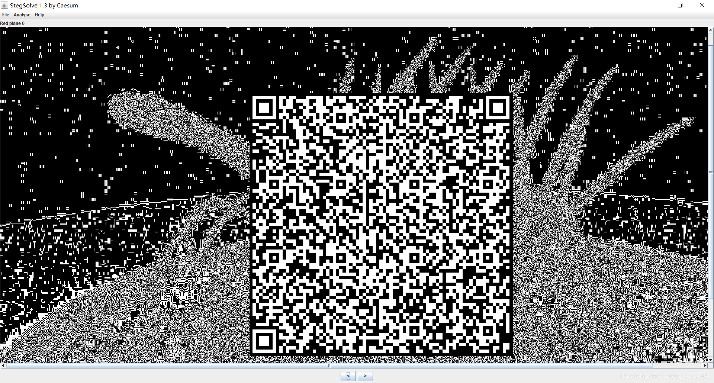
 扫码，是⼆进制⽂件

```bash
gmBCrkRORUkAAAAA+jrgsWajaq0BeC3IQhCEIQhCKZw1MxTzSlNKnmJpivW9IHVPrTjvkkuI3sP7bWAEdIHWCbDsGsRkZ9IUJC9AhfZFbpqrmZBtI+ZvptWC/KCPrL0gFeRPOcI2WyqjndfUWlNj+dgWpe1qSTEcdurXzMRAc5EihsEflmIN8RzuguWq61JWRQpSI51/KHHT/6/ztPZJ33SSKbieTa1C5koONbLcf9aYmsVh7RW6p3SpASnUSb3JuSvpUBKxscbyBjiOpOTq8jcdRsx5/IndXw3VgJV6iO1+6jl4gjVpWouViO6ih9ZmybSPkhaqyNUxVXpV5cYU+Xx5sQTfKystDLipmqaMhxIcgvplLqF/LWZzIS5PvwbqOvrSlNHVEYchCEIQISICSZJijwu50rRQHDyUpaF0y///p6FEDCCDFsuW7YFoVEFEST0BAACLgLOrAAAAAggUAAAAtAAAAFJESEkNAAAAChoKDUdOUIk=
1
```

使用脚本生成二进制文件flag.bin

```bash
from base64 import b64decode
open('flag.bin', 'wb+').write(b64decode(open('flag_inv_b64.txt', 'rb').read()))
12
```

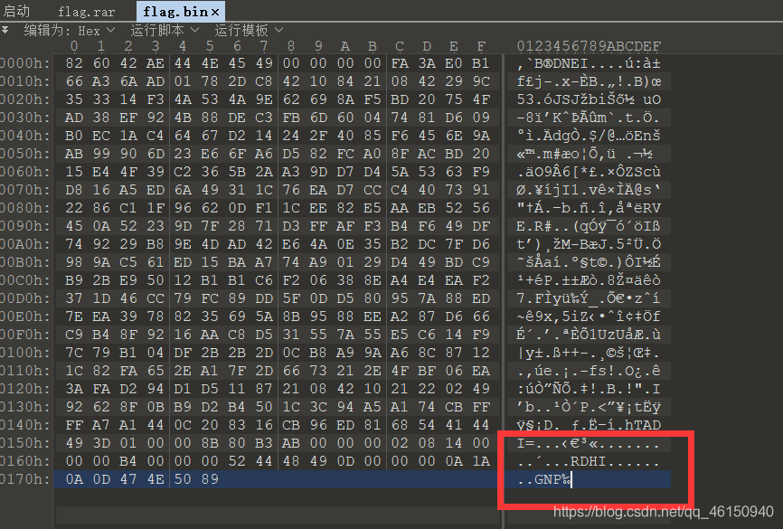
 ⽤ 16 进制编辑器打开可以发现有 PNG、IHDR 等字样，文件头尾逆序

```python
from base64 import b64decode
open('flag.png', 'wb+').write(b64decode(open('h.txt', 'rb').read())[::-1])
12
```

得到flag.png
 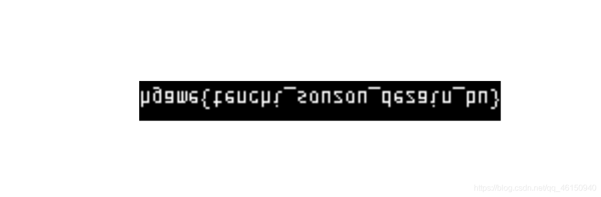
 上下翻转镜像，得到flag

```bash
hgame{tenchi_souzou_dezain_bu}
1
```

使用十六进制文件头尾逆序脚本，颠倒十六进制文件flag.bin也可以得到flag.png

```python
input = open('flag.bin', 'rb')
input_all = input.read()
ss = input_all[::-1]
output = open('flag.png', 'wb')
output.write(ss)
input.close()
output.close()
1234567
```

### 24.[zlib](https://so.csdn.net/so/search?q=zlib&spm=1001.2101.3001.7020)解压

例题1：

```bash
D:\CTF\pngcheck>pngcheck.exe -v pngcheck.png
File: pngcheck.png (135570 bytes)
  chunk IHDR at offset 0x0000c, length 13
    600 x 379 image, 24-bit RGB, non-interlaced
  chunk pHYs at offset 0x00025, length 9: 3827x3827 pixels/meter (97 dpi)
  chunk tEXt at offset 0x0003a, length 17, keyword: Title
  chunk tEXt at offset 0x00057, length 19, keyword: Author
  chunk zTXt at offset 0x00076, length 45, keyword: Description
  chunk IDAT at offset 0x000af, length 135317
    zlib: deflated, 32K window, maximum compression
  chunk IDAT at offset 0x21150, length 92:  EOF while reading data
ERRORS DETECTED in pngcheck.png
123456789101112
```

010 editor搜索IDAT，找到最后那段IDAT块，读取数据时发生错误,可能存在zlib压缩
 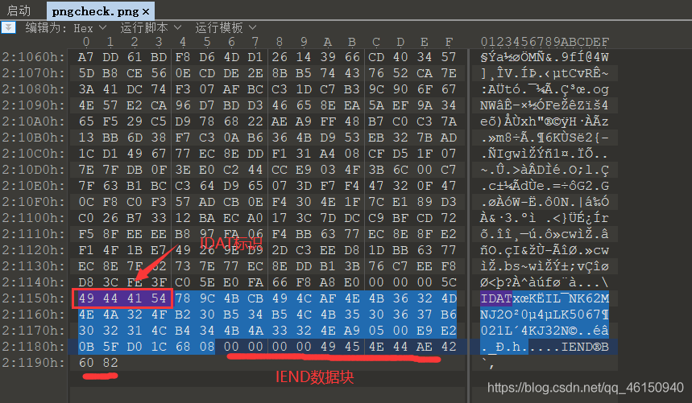

脚本1：

```python
import zlib
s = '789C4BCB494CAF4E4B36324D4E4A324FB230B534B54C4B35303637B63032314CB4344B4A33324EA90500E9E20B5FD01C6808'
b = bytes.fromhex(s)
flag = zlib.decompress(b)
print(flag)
12345
```

运行得到flag

```bash
flag{fc25cbb7b85959fe03738241a96bf23d}
1
```

例题2：

sctf.png
 
 先用pngcheck检查一下

```bash
D:\CTF\pngcheck-3.0.2-win32>pngcheck.win64.exe -v test/sctf.png
File: test/sctf.png (1421461 bytes)
  chunk IHDR at offset 0x0000c, length 13
    1000 x 562 image, 32-bit RGB+alpha, non-interlaced
  chunk sRGB at offset 0x00025, length 1
    rendering intent = perceptual
  chunk gAMA at offset 0x00032, length 4: 0.45455
  chunk pHYs at offset 0x00042, length 9: 3780x3780 pixels/meter (96 dpi)
  chunk IDAT at offset 0x00057, length 65445
    zlib: deflated, 32K window, fast compression
  chunk IDAT at offset 0x10008, length 65524
  chunk IDAT at offset 0x20008, length 65524
  chunk IDAT at offset 0x30008, length 65524
  chunk IDAT at offset 0x40008, length 65524
  chunk IDAT at offset 0x50008, length 65524
  chunk IDAT at offset 0x60008, length 65524
  chunk IDAT at offset 0x70008, length 65524
  chunk IDAT at offset 0x80008, length 65524
  chunk IDAT at offset 0x90008, length 65524
  chunk IDAT at offset 0xa0008, length 65524
  chunk IDAT at offset 0xb0008, length 65524
  chunk IDAT at offset 0xc0008, length 65524
  chunk IDAT at offset 0xd0008, length 65524
  chunk IDAT at offset 0xe0008, length 65524
  chunk IDAT at offset 0xf0008, length 65524
  chunk IDAT at offset 0x100008, length 65524
  chunk IDAT at offset 0x110008, length 65524
  chunk IDAT at offset 0x120008, length 65524
  chunk IDAT at offset 0x130008, length 65524
  chunk IDAT at offset 0x140008, length 65524
  chunk IDAT at offset 0x150008, length 45027
  chunk IDAT at offset 0x15aff7, length 138
  chunk IEND at offset 0x15b08d, length 0
No errors detected in test/sctf.png (28 chunks, 36.8% compression).
12345678910111213141516171819202122232425262728293031323334
```

正常的块的length是65524，而倒数第二个IDAT块长度是45027，最后一个长度是138，最后一个IDAT块异常

010 editor找到最后一个IDAT块的十六进制，使用脚本解压

```python
import zlib
s = '''
78 9C 5D 91 01 12 80 40 08 02 BF 04 FF FF 5C 75
29 4B 55 37 73 8A 21 A2 7D 1E 49 CF D1 7D B3 93
7A 92 E7 E6 03 88 0A 6D 48 51 00 90 1F B0 41 01
53 35 0D E8 31 12 EA 2D 51 C5 4C E2 E5 85 B1 5A
2F C7 8E 88 72 F5 1C 6F C1 88 18 82 F9 3D 37 2D
EF 78 E6 65 B0 C3 6C 52 96 22 A0 A4 55 88 13 88
33 A1 70 A2 07 1D DC D1 82 19 DB 8C 0D 46 5D 8B
69 89 71 96 45 ED 9C 11 C3 6A E3 AB DA EF CF C0
AC F0 23 E7 7C 17 C7 89 76 67 D9 CF A5 A8
'''
s = s.replace(' ','').replace('\n','')
b = bytes.fromhex(s)
flag = zlib.decompress(b)
print(flag)
12345678910111213141516
```

运行得到

```bash
b'1111111000100001101111111100000101110010110100000110111010100000000010111011011101001000000001011101101110101110110100101110110000010101011011010000011111111010101010101111111000000001011101110000000011010011000001010011101101111010101001000011100000000000101000000001001001101000100111001111011100111100001110111110001100101000110011100001010100011010001111010110000010100010110000011011101100100001110011100100001011111110100000000110101001000111101111111011100001101011011100000100001100110001111010111010001101001111100001011101011000111010011100101110100100111011011000110000010110001101000110001111111011010110111011011'
1
```

得到的01 串的长度是625，625 = 25*25，是个正方形的形状

```python
from PIL import Image

MAX = 25
pic = Image.new("RGB",(MAX, MAX))
str = "1111111000100001101111111100000101110010110100000110111010100000000010111011011101001000000001011101101110101110110100101110110000010101011011010000011111111010101010101111111000000001011101110000000011010011000001010011101101111010101001000011100000000000101000000001001001101000100111001111011100111100001110111110001100101000110011100001010100011010001111010110000010100010110000011011101100100001110011100100001011111110100000000110101001000111101111111011100001101011011100000100001100110001111010111010001101001111100001011101011000111010011100101110100100111011011000110000010110001101000110001111111011010110111011011"
i=0
for y in range (0,MAX):
    for x in range (0,MAX):
        if(str[i] == '1'):
            pic.putpixel([x,y],(0, 0, 0))
        else:
            pic.putpixel([x,y],(255,255,255))
        i = i+1
pic.show()
pic.save("flag.png")
123456789101112131415
```

得到一张二维码，扫码得到flag

```bash
SCTF{(121.518549,25.040854)}
1
```

### 25. 爆破hash

```python
import hashlib
def md5(s):
    return hashlib.md5(s).hexdigest()
for i in range(1, 9999999):
    if md5(str(i)).startswith('bf5ede'):
        print i
#找到md5前6位是bf5ede的值
1234567
```

### 26. 哈夫曼编码

```bash
Surprise
Wabby Wabby: 
j 29
z 31
7 25
e 31
l 23
6 37
4 32
p 38
h 27
g 26
x 28
i 25
u 27
n 25
8 36
0 24
o 23
c 28
y 24
1 29
b 26
m 27
2 28
v 25
d 33
f 28
9 33
t 21
w 22
a 31
r 24
s 16
k 32
5 25
q 23
3 32
{ 1
- 4
} 1
Wabby Wabbo: 
0111110001000011001010001111011110101010011011011110100000110010111101000010010010001100001110010000011110011101101111011001111101000000111010100000101101001000111100000000010100110100101001011101110010001100011100010010111001100011100110011010011000101010100011011110001111111110111001011100010100101111100001011011001001001000010111110101110111010111100010111011000011001011001101001010010111111001110101000110001001001100101110111101111000110010010111111000111110000101001100100100001001110100101011111101111110011101011101000000100100100011111111001000101110101001001101110001011101101001001001011010000101111111001011111100110010100111111110001001100100010010010011110111110110110001101000010010110110001011010000100011010111110101110000110000010001111111110000101000100101101111000111100101101011001100010101011000110010011111001010011110100100011000101111110111011011000011011010100011011100010001010001010000000001101001010010100111111010010110110011110100101010010101001010100010101011010011110001000011000100001010111001110001100101100001010111011110110111110000001011011111011101101000111111110100111100110011101111100111100101101101101010100110001100100110101011110000011111111100011110011101010011110101010111100111100001000111110111110100010011110011000010000100001100101111101010110101100011100010010100001110001001010110010010010100010101101101001110000101111110101010110110110000010011000111000010001001101101101101100111000011000011010101111010101100101000011011001011000101101110100011110001100111101111011000100110110000111010101101111101001111111111100001000111000001001011111011110010110101011110001110001101010011000101111100001111111011100110101001000011111101111111011001111110001110111110110010111000111011011110010101010110011001110110011110001111010000011010101000111110111011100101100100100100001111101010011101111100110011100000010100101000111100100011001011111000000111111111000000011111111101110111111001110100100000100000011011111010000000011110101110111101101011001111011010101111000010110001101000111000111000001110110111000100011110101100100100011100111100101101010010110101011111110011100100000111011011010101101110111000001001100110111001000111001000000111000110010110000100100010001001111010101000101101111000000110101110011101001011100110111101101111100001111000110001101010000111100100011110001100110111001101011100010101011110111111111100101100101010001101110101101101010101001110100001101011000100001111011011100101011000001001000011011000111011101110011001101110100000010100000101111010000001000011001101101111010011101000000101101101011101001101110000010011110001110100111000101111101010110111010011010011000011000110110010110001001000101101111000010010001011110100010111010100101100101111010100001110111100000100101101011110010110001000111111001000000101110010111010001101101111101110111000010101100100001010101001010010001011101001100101010101001111110000010011010011110101001001001110010110100111011110110000111101000010011111000111111001111010011101011010011100010001111101001110011110101111111111111011010100000010100010010011110100110011011101011101011101100000100111110111100100000101011000110110000010110001001111111111011101011000010101111110111001011101111111100111011101001000111011110110111101001011110011000110011000010011011001001100010010111110000110100001110111100110110100101010010111001001100101111010010001001111111000010111101010110000001110101000111011010111100110101001001110001110001001111110001000010011011110100111011111000101111110011000011010001000101000110011100011001001011000111011100101101000110001110011011101010101001010011101110100100111101011101010011010101010111101110101101000001111100111111010011010111101000101011111101011100101101101001100011001111101111100100111101101101110111111010111010100100101110111000011100001001000011100010101110100111110011001100101111110110100111101000010001000011011110000011010110111010110001110011111110000011110010001011010010111111101010101110010000001010011111011100101000101101010101101101000101000110011101101010110001100101011101110111100000001010000011110011010011000011111110100111011100100111000001101001110111100000101010110000010000100001110111000011111110010010100111111101010110000000000111011010000101100100111001110000001011101100000110110101011001011000111001111110010101111001011011101000010001100011101110010100111000011111001110001100111110110111101010101011001000101011010001100000010001111110011001101111111010110010001111001100111110001110011100010011011100100010011011000110000100101111100111110111101010010001101010011100110001011001111000100011011110100011101011101010111111110000011110110111011110000010111100110011100011010111101111110100000010001111100101100011110001101011111101111111011111011101010001101001000111000101111110101000110011000111011111101111110100001111011110010100011101110111111010101100111000101100100010011101001011110011111001111101110001110111111011100111100010110010011011010100011100101010101010110000001010111001101111100111110010100111000010101111001110011011011111001101110011111001000000000111101011000111110001101010011011000010100100100111011111110010000000101001111111110101100001010000001110100101001111001011011001001001011100101111110
surprise message len: 1000
1234567891011121314151617181920212223242526272829303132333435363738394041424344
```

参考[Python|Huffman编码的python代码实现](https://blog.csdn.net/gschen_cn/article/details/105898143)

```bash
#节点类
class Node(object):
    def __init__(self,name=None,value=None):
        self._name=name
        self._value=value
        self._left=None
        self._right=None
#哈夫曼树类
class HuffmanTree(object):
	#根据Huffman树的思想：以叶子节点为基础，反向建立Huffman树
    def __init__(self,char_weights):
        self.a=[Node(part[0],part[1]) for part in char_weights] #根据输入的字符及其频数生成叶子节点
        while len(self.a)!=1:
                self.a.sort(key=lambda node:node._value,reverse=True)
                c=Node(value=(self.a[-1]._value+self.a[-2]._value))
                c._left=self.a.pop(-1)
                c._right=self.a.pop(-1)
                self.a.append(c)
        self.root=self.a[0]
        self.b=list(range(10))
    #用递归的思想生成编码
    def pre(self,tree,length):
        node=tree
        if (not node):
                return
        elif node._name:
                x=str(node._name) + '的编码为:'
                for i in range(length):
                        x+=str(self.b[i])
                print(x)
                return
        self.b[length]=0
        self.pre(node._left,length+1)
        self.b[length]=1
        self.pre(node._right,length+1)
    #生成哈夫曼编码
    def get_code(self):
        self.pre(self.root,0)
if __name__=='__main__':
	    #输入的是字符及其频数
        char_weights=[('j',29),('z',31),('7',25),('e',31),('l',23),('6',37),('4',32),('p',38),('h',27),('g',26),('x',28),('i',25),('u',27),('n',25),('8',36),('0',24),('o',23),('c',28),('y',24),('1',29),('b',26),('m',27),('2',28),('v',25),('d',33),('f',28),('9',33),('t',21),('w',22),('a',31),('r',24),('s',16),('k',32),('5',25),('q',23),('3',32),('{',1),('-',4),('}',1)]
        tree=HuffmanTree(char_weights)
        tree.get_code()
12345678910111213141516171819202122232425262728293031323334353637383940414243
```

运行脚本得到

```bash
0的编码为:00000
5的编码为:00001
i的编码为:00010
7的编码为:00011
v的编码为:00100
n的编码为:00101
b的编码为:00110
g的编码为:00111
m的编码为:01000
u的编码为:01001
h的编码为:01010
f的编码为:01011
2的编码为:01100
c的编码为:01101
x的编码为:01110
1的编码为:01111
j的编码为:10000
a的编码为:10001
e的编码为:10010
z的编码为:10011
3的编码为:10100
k的编码为:10101
4的编码为:10110
9的编码为:10111
d的编码为:11000
8的编码为:11001
6的编码为:11010
p的编码为:11011
t的编码为:111000
}的编码为:111001000
{的编码为:111001001
-的编码为:11100101
s的编码为:1110011
w的编码为:111010
q的编码为:111011
o的编码为:111100
l的编码为:111101
r的编码为:111110
y的编码为:111111
123456789101112131415161718192021222324252627282930313233343536373839
```

### 27. RAR

#### RAR文件格式

参考文章：https://www.freebuf.com/column/199854.html

RAR是有四个文件块组成的，分别是分别是标记块、归档头部块、文件块、结束块，这些块之间没有固定地先后顺序，但要求第一个块必须是标志块并且其后紧跟一个归档头部块。每个块都包含以下内容：
 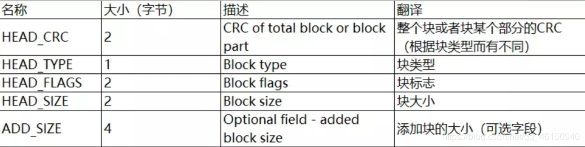
 归档头部块和文件块的内容较多，斗哥仅列出每个块头部内容：
 
 RAR的标记块和结束块都是固定的7字节序列，分别为0x52 61 72 21 1A 07 00和0xC4 3D 7B 00 40 07  00。文件块这边要注意一下HEAD_FLAGS这个头部，其中HEAD_FLAGS的低三位代表加密标志，此位若被置为1，则文件使用了基于密钥的加密。

#### RAR伪加密

参考[L1near师傅的博客](https://l1near.top/index.php/2021/03/15/97.html#comment-174)

我们可以看到RAR第24字节这个地方，对应着一个PASSWORD_ENCRYPTED，所以如果某RAR文件没有被加密，那么这一行中的数字为0，将其修改为1
 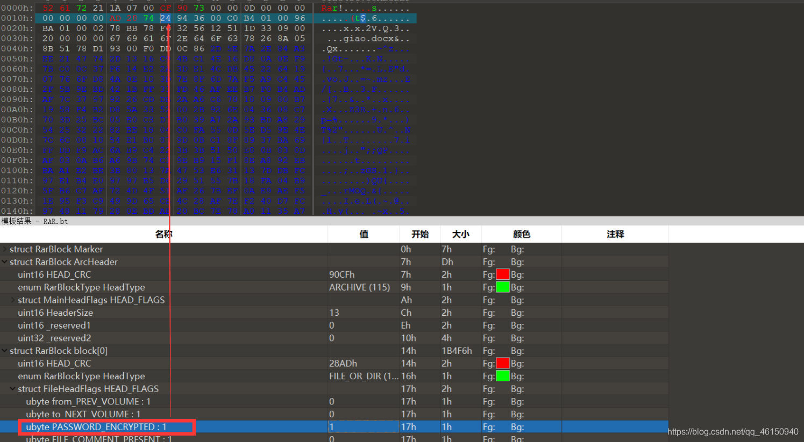
 将其从1改为0就可以正常打开文件了。

也可以直接winhex或者010editor打开，把第24字节的后面一个4改成0也可以。（即从24变成20）

#### RAR文件受损

分析RAR文件结构，文件块的HEAD_TYPE应该是0x74而不是0x7A，修改为74后保存。
 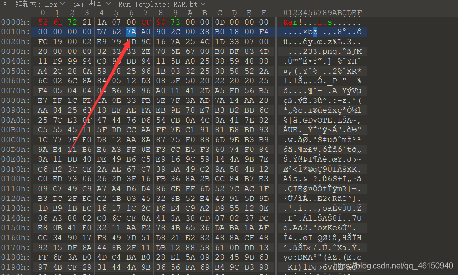
 \28. 凯撒密码爆破脚本

```php
s = "Hello_Atkx"

def kaisa(k):
    t = ""
    for c in s:
        if 'a' <= c <= 'z':
            t += chr(ord('a') + ((ord(c) - ord('a')) + int(k)) % 26)
        elif 'A' <= c <= 'Z':
            t += chr(ord('A') + ((ord(c) - ord('A')) + int(k)) % 26)
        else:
            t += c
    print(t)

for i in range(0,26):
    kaisa(i)
123456789101112131415
```

运行结果：

```python
Hello_Atkx
Ifmmp_Buly
Jgnnq_Cvmz
Khoor_Dwna
Lipps_Exob
Mjqqt_Fypc
Nkrru_Gzqd
Olssv_Hare
Pmttw_Ibsf
Qnuux_Jctg
Rovvy_Kduh
Spwwz_Levi
Tqxxa_Mfwj
Uryyb_Ngxk
Vszzc_Ohyl
Wtaad_Pizm
Xubbe_Qjan
Yvccf_Rkbo
Zwddg_Slcp
Axeeh_Tmdq
Byffi_Uner
Czggj_Vofs
Dahhk_Wpgt
Ebiil_Xqhu
Fcjjm_Yriv
Gdkkn_Zsjw
1234567891011121314151617181920212223242526
```

### 29. USB流量分析

详见之前写过的[USB流量分析](https://blog.csdn.net/qq_46150940/article/details/115431953)