# **一、编码、加密篇**

## 0、各类常见文件头

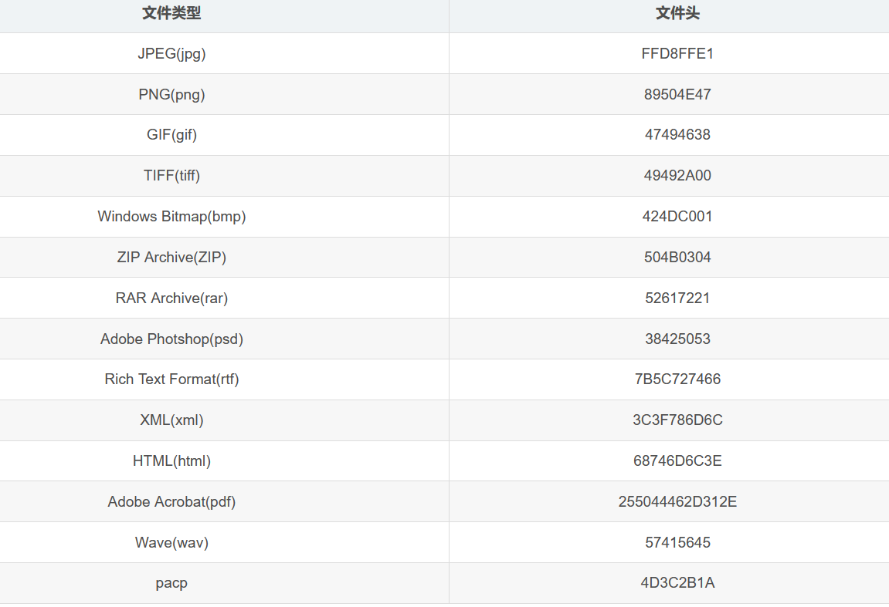

## **1、ASCII编码**

**简介**：ASCII ((American Standard Code for Information Interchange): 美国信息交换标准代码）是基于拉丁字母的一套电脑编码系统，主要用于显示现代英语和其他西欧语言。它是最通用的信息交换标准，并等同于国际标准ISO/IEC 646。ASCII第一次以规范标准的类型发表是在1967年，最后一次更新则是在1986年，到目前为止共定义了128个字符（来自百度百科）。


**代表题目：南阳理工学院2019届NYSEC招新赛**
**绝密密文**
**Tips:Flag格式为 NYSEC{xxx}**
**JTM>;r:dSlafO;WXQJ+\KPO$a**


**writeup**：

[（学校CTF新生赛）（绝密密文）这他喵的到底是什么？（ASCII规律）](https://www.yuque.com/cyberangel/crckt8/iba03a)


**备注**：这道题巧妙地考察了ASCII在解题过程中规律的应用，是坑人的一题（不是）非常好的题目，由于写有wp，在这里不再过多的说明。

## **2、手机键盘九宫格**

**简介**：“九键输入法”是比较常见的输入法类型之一，它广受大家的喜爱，虽然我不会用
**代表题目：2019NCTF-keyborad**

ooo yyy ii w uuu ee uuuu yyy uuuu y w uuu i i rr w i i rr rrr uuuu rrr uuuu t ii uuuu i w u rrr ee
www ee yyy eee www w tt ee

**writeup**：

[（Copy）2019NCTF-keyborad（手机九宫格）](https://www.yuque.com/cyberangel/crckt8/cgwzw6)

**备注**：要想到这一点真的很不容易

## **3、Base64隐写**

**简介**：你知道base64还可以隐写吗？
**代表题目：**

[2019NCTF-What's this（base64隐写）](https://www.yuque.com/cyberangel/crckt8/min5ab)[攻防世界-base64stego（base64隐写）](https://www.yuque.com/cyberangel/crckt8/pp1ns9)

**第一种Python脚本：（请将待解密文件保存为1.txt）**

```python
# -*- coding: utf-8 -*- 
b64chars='ABCDEFGHIJKLMNOPQRSTUVWXYZabcdefghijklmnopqrstuvwxyz0123456789+/'
withopen('1.txt','rb')asf: 
bin_str=''
forlineinf.readlines(): 
stegb64=''.join(line.split())
rowb64=''.join(stegb64.decode('base64').encode('base64').split())
offset=abs(b64chars.index(stegb64.replace('=','')[-1])-
b64chars.index(rowb64.replace('=','')[-1]))
equalnum=stegb64.count('=')#no equalnum no offset 
ifequalnum: 
bin_str+=bin(offset)[2:].zfill(equalnum*2)
print''.join([chr(int(bin_str[i:i+8],2))foriinxrange(0,
len(bin_str),8)])#8 位一组
```

**第二种Python脚本：（请将待解密文件保存为1.txt）**

```python
def get_base64_diff_value(s1, s2):
    base64chars = 'ABCDEFGHIJKLMNOPQRSTUVWXYZabcdefghijklmnopqrstuvwxyz0123456789+/'
    res = 0
    for i in xrange(len(s2)):
        if s1[i] != s2[i]:
            return abs(base64chars.index(s1[i]) - base64chars.index(s2[i]))
    return res
def solve_stego():
    with open('1.txt', 'rb') as f:
        file_lines = f.readlines()
        bin_str = ''
        for line in file_lines:
            steg_line = line.replace('\n', '')
            norm_line = line.replace('\n', '').decode('base64').encode('base64').replace('\n', '')
            diff = get_base64_diff_value(steg_line, norm_line)
            print diff
            pads_num = steg_line.count('=')
            if diff:
                bin_str += bin(diff)[2:].zfill(pads_num * 2)
            else:
                bin_str += '0' * pads_num * 2
            print goflag(bin_str)
def goflag(bin_str):
    res_str = ''
    for i in xrange(0, len(bin_str), 8):
        res_str += chr(int(bin_str[i:i + 8], 2))
    return res_str
if __name__ == '__main__':
    solve_stego()
```

**4、RockStar编程语言**

**简介**：Rockstar 是一门图灵完备的动态编程语言。设计这门语言的目的是能够像写歌词一样开发计算机程序。它的歌词风格主要受 20 世纪 80 年代重摇滚和电力民谣的影响。（https://www.sohu.com/a/244926924_355140）
**代表题目**：**2019NCTF-RockStar**


```python
Leonard Adleman says star
Problem Makers is Problem Makers
Problem Makers says NCTF{

God takes World
A boy says flag
The boy is Bob

Evil takes your mind
A girl says no flag
The girl is Alice

Truths were ctf hoster violently FUCK
Bob says ar
Adi Shamir says rock
Love takes Alice and Bob
Mallory was a eavesdroppers
Mallory's in hell

Everything is literatures, potentially flag, Earth, description, soul
Alice says you

Reality takes God and Evil
God was in heaven
Evil is in the world

Ron Rivest says nice
You Want To takes Alice and Love and Anything
You's Loser. Without Alice, Love or Anything

Listen to your heart
You were Loser
Listen to your mind
Nothing was psb unfulfilled

If Truths of Nothing is Everything
Put Ron Rivest with Adi Shamir with Leonard Adleman into RSA

If Everything over Nothing is Truths
Put Problem Makers with Alice into Problem Makers with Bob

Say Problem Makers
The flag is in your heart
The confusion is in your mind
Shout RSA

Mysterious One says }
Whisper Mysterious One

This is live
This is the truth
This is reality
This is art
This is CTF
This is NOT program
```


**writeup**：

[2019NCTF-RockStar](https://www.yuque.com/cyberangel/crckt8/nzt9cu)

**备注**：这道题使我印象深刻

**2019NCTF-键盘侠**PD4-idqQC|WjHloX>)UPb8~ZFb8laGczAeteE

## **5、Base85编码**

**简介**：Base85编码是Base编码系列的一种，不太常见，但出现的时候你认不出来它
**代表题目：2019NCTF-键盘侠**https://www.yuque.com/cyberangel/crckt8/slmwnl

```python
PD4-idqQC|WjHloX>)UPb8~ZFb8laGczAeteE
```

**writeup**：

[2019NCTF-键盘侠（Word隐藏文字、base85）](https://www.yuque.com/cyberangel/crckt8/slmwnl)

**解密网站**：http://ctf.ssleye.com/base85.html
**备注**：当时我真的不知道还有Base85这种东西。。。

## **6、Base16、32、64编码**

**简介**：Base16、32、64编码是Base编码系列的一种，十分常见
**代表题目**：**攻防世界-base64÷4**
**writeup**：

[攻防世界-base64÷4（base16）](https://www.yuque.com/cyberangel/crckt8/otolu2)
**备注**：太常见了，题目就不多说了。

## **7、二进制（0、1与20、19）**

**简介**：此种题目不常见，一遇见就懵
**代表题目**：**CTF论剑场-0和1的故事**


```python
20 20 09 20 09 20 09 09 20 09 20 09 20 09 09 20 20 09 20 20 09 09 09 20 20 20 09 09 09 20 09 20 09 20 09 09 09 09 20 20 20 20 09 09 09 20 09 09 09 09 09 09 20 20 20 20 20 20
```

**writeup**：

[CTF论剑场-0和1的故事](https://www.yuque.com/cyberangel/crckt8/cfkqsa)

**备注**：无

## **8、社会主义编码**

**简介**：据作者介绍发明此编码的目的是为了爱国，23333
NYSEC：自由诚信自由平等敬业平等和谐自由平等自由和谐
**解密网站**：http://ctf.ssleye.com/cvencode.html

## **9、埃特巴什码**

**简介**：这种密码是由熊斐特博士发现的。熊斐特博士为库姆兰《死海古卷》的最初研究者之一，他在《圣经》历史研究方面最有名气的著作是《逾越节的阴谋》。他运用这种密码来研究别人利用其他方法不能破解的那些经文。这种密码被运用在公元1世纪的艾赛尼/萨多吉/拿撒勒教派的经文中，用以隐藏姓名。其实早在公元前500年，它就被抄经人用来写作《耶利米书》
**代表题目：****CTF论剑场-提莫队长**
fl@g={wrzlxslmtcrzlqrvibr}
**writeup**：[CTF论剑场-提莫队长（埃特巴什码）](https://www.yuque.com/cyberangel/crckt8/bsnffd)

**解密网站**：http://ctf.ssleye.com/atbash.html
**备注**：无

## **10、Ook编码**

**简介**：此种编码不常见但要知道
**代表题目**：**Bugku-ok**

```python
Ook. Ook. Ook. Ook. Ook. Ook. Ook. Ook. Ook. Ook. Ook. Ook. Ook. Ook. Ook.
Ook. Ook. Ook. Ook. Ook. Ook! Ook? Ook! Ook! Ook. Ook? Ook. Ook. Ook. Ook.
Ook. Ook. Ook. Ook. Ook. Ook. Ook. Ook. Ook. Ook. Ook. Ook. Ook. Ook. Ook.
Ook. Ook? Ook. Ook? Ook! Ook. Ook? Ook. Ook. Ook. Ook. Ook! Ook. Ook. Ook.
Ook. Ook. Ook. Ook. Ook. Ook. Ook. Ook. Ook. Ook. Ook! Ook. Ook? Ook. Ook.
Ook. Ook. Ook. Ook. Ook. Ook! Ook? Ook! Ook! Ook. Ook? Ook! Ook! Ook! Ook!
Ook! Ook! Ook? Ook. Ook? Ook! Ook. Ook? Ook! Ook! Ook! Ook! Ook! Ook. Ook.
Ook. Ook. Ook. Ook. Ook. Ook. Ook. Ook. Ook. Ook. Ook. Ook! Ook. Ook? Ook.
Ook. Ook. Ook. Ook. Ook. Ook. Ook. Ook. Ook! Ook? Ook! Ook! Ook. Ook? Ook.
Ook. Ook. Ook. Ook. Ook. Ook. Ook. Ook? Ook. Ook? Ook! Ook. Ook? Ook. Ook.
Ook. Ook. Ook. Ook. Ook. Ook. Ook! Ook. Ook? Ook. Ook. Ook. Ook. Ook. Ook.
Ook. Ook! Ook? Ook! Ook! Ook. Ook? Ook! Ook! Ook! Ook! Ook! Ook! Ook? Ook.
Ook? Ook! Ook. Ook? Ook! Ook! Ook! Ook! Ook! Ook! Ook! Ook. Ook! Ook! Ook!
Ook! Ook! Ook! Ook! Ook! Ook! Ook. Ook? Ook. Ook. Ook. Ook. Ook. Ook. Ook.
Ook. Ook. Ook. Ook. Ook. Ook. Ook. Ook. Ook! Ook? Ook! Ook! Ook. Ook? Ook!
Ook! Ook! Ook! Ook! Ook! Ook! Ook! Ook! Ook! Ook! Ook! Ook! Ook! Ook? Ook.
Ook? Ook! Ook. Ook? Ook! Ook! Ook! Ook! Ook! Ook! Ook! Ook! Ook! Ook! Ook!
Ook! Ook! Ook! Ook! Ook! Ook! Ook! Ook! Ook! Ook! Ook! Ook! Ook! Ook! Ook!
Ook! Ook. Ook? Ook. Ook. Ook. Ook. Ook. Ook. Ook. Ook. Ook. Ook. Ook. Ook.
Ook. Ook. Ook. Ook! Ook? Ook! Ook! Ook. Ook? Ook. Ook. Ook. Ook. Ook. Ook.
Ook. Ook. Ook. Ook. Ook. Ook. Ook. Ook. Ook? Ook. Ook? Ook! Ook. Ook? Ook.
Ook. Ook. Ook. Ook. Ook. Ook. Ook. Ook. Ook. Ook! Ook. Ook? Ook. Ook. Ook.
Ook. Ook. Ook. Ook. Ook. Ook. Ook! Ook? Ook! Ook! Ook. Ook? Ook. Ook. Ook.
Ook. Ook. Ook. Ook. Ook. Ook? Ook. Ook? Ook! Ook. Ook? Ook. Ook. Ook! Ook.
Ook? Ook. Ook. Ook. Ook. Ook. Ook. Ook. Ook! Ook? Ook! Ook! Ook. Ook? Ook!
Ook! Ook! Ook! Ook! Ook! Ook? Ook. Ook? Ook! Ook. Ook? Ook! Ook! Ook! Ook!
Ook! Ook! Ook! Ook! Ook! Ook! Ook! Ook. Ook? Ook. Ook. Ook. Ook. Ook. Ook.
Ook. Ook. Ook. Ook. Ook. Ook. Ook. Ook. Ook. Ook! Ook? Ook! Ook! Ook. Ook?
Ook! Ook! Ook! Ook! Ook! Ook! Ook! Ook! Ook! Ook! Ook! Ook! Ook! Ook! Ook?
Ook. Ook? Ook! Ook. Ook? Ook! Ook! Ook! Ook! Ook! Ook! Ook! Ook! Ook! Ook!
Ook! Ook! Ook! Ook! Ook! Ook! Ook! Ook. Ook. Ook. Ook. Ook. Ook. Ook. Ook.
Ook. Ook! Ook. Ook. Ook. Ook! Ook. Ook. Ook. Ook! Ook. Ook. Ook. Ook! Ook.
Ook! Ook! Ook! Ook! Ook! Ook! Ook! Ook! Ook! Ook! Ook! Ook! Ook! Ook! Ook!
Ook. Ook? Ook. Ook. Ook. Ook. Ook. Ook. Ook. Ook. Ook. Ook. Ook. Ook. Ook.
Ook. Ook. Ook! Ook? Ook! Ook! Ook. Ook? Ook. Ook. Ook. Ook. Ook. Ook. Ook.
Ook. Ook. Ook. Ook. Ook. Ook. Ook. Ook? Ook. Ook? Ook! Ook. Ook? Ook. Ook.
Ook. Ook. Ook. Ook. Ook! Ook. Ook. Ook. Ook. Ook. Ook. Ook. Ook! Ook. Ook.
Ook. Ook. Ook. Ook. Ook. Ook. Ook. Ook. Ook. Ook. Ook. Ook. Ook. Ook. Ook.
Ook. Ook. Ook! Ook. Ook! Ook! Ook! Ook! Ook! Ook! Ook! Ook! Ook! Ook. Ook.
Ook. Ook. Ook. Ook. Ook. Ook. Ook. Ook. Ook. Ook! Ook. Ook? Ook. Ook. Ook.
Ook. Ook. Ook. Ook. Ook! Ook? Ook! Ook! Ook. Ook? Ook. Ook. Ook. Ook. Ook.
Ook. Ook? Ook. Ook? Ook! Ook. Ook? Ook. Ook. Ook. Ook. Ook. Ook. Ook. Ook.
Ook. Ook. Ook. Ook. Ook! Ook. Ook? Ook.
```

**writeup**：[Bugku-ok（Ook）](https://www.yuque.com/cyberangel/crckt8/ybs3pp)

**解密网站**：https://www.splitbrain.org/services/ook
**备注**：网站有可能需要挂梯子

## **11、杰斐逊转轮加密**

**简介：**做CTF的crypto，经常会遇到一些加密解密，杰弗逊加密也是考察频率较高的一种加密方式
**代表题目：Bugku-托马斯.杰斐逊**

```python
1： <ZWAXJGDLUBVIQHKYPNTCRMOSFE <
2： <KPBELNACZDTRXMJQOYHGVSFUWI <
3： <BDMAIZVRNSJUWFHTEQGYXPLOCK <
4： <RPLNDVHGFCUKTEBSXQYIZMJWAO <
5： <IHFRLABEUOTSGJVDKCPMNZQWXY <
6： <AMKGHIWPNYCJBFZDRUSLOQXVET <
7： <GWTHSPYBXIZULVKMRAFDCEONJQ <
8： <NOZUTWDCVRJLXKISEFAPMYGHBQ <
9： <QWATDSRFHENYVUBMCOIKZGJXPL <
10： <WABMCXPLTDSRJQZGOIKFHENYVU <
11： <XPLTDAOIKFZGHENYSRUBMCQWVJ <
12： <TDSWAYXPLVUBOIKZGJRFHENMCQ <
13： <BMCSRFHLTDENQWAOXPYVUIKZGJ <
14： <XPHKZGJTDSENYVUBMLAOIRFCQW <
密钥： 2,5,1,3,6,4,9,7,8,14,10,13,11,12
密文：HCBTSXWCRQGLES
```

**writeup**：

[Bugku-托马斯.杰斐逊（杰斐逊转轮加密）](https://www.yuque.com/cyberangel/crckt8/xwvxno)
**备注：**无

## **12、摩斯密码（0、1）**

**简介：略，详见摩斯密码（. -）**
**代表题目：Bugku-easy_crypto**
0010 0100 01 110 1111011 11 11111 010 000 0 001101 1010 111 100 0 001101 01111 000 001101 00 10 1 0 010 0 000 1 01111 10 11110 101011 1111101
**writeup**：

[Bugku-easy_crypto（摩斯编码0、1）](https://www.yuque.com/cyberangel/crckt8/xi6wvb)


**备注：**.为0，-为1

## **13、.!?编码**

**简介：Ook编码的一种**
**代表题目：Bugku-.!?**

```python
..... ..... ..... ..... !?!!. ?.... ..... ..... ..... .?.?! .?... .!........ ..... !.?.. ..... !?!!. ?!!!! !!?.? !.?!! !!!.. ..... ..... .!.?...... ...!? !!.?. ..... ..?.? !.?.. ..... .!.?. ..... ..... !?!!. ?!!!!!!!!! !?.?! .?!.? ..... ....! ?!!.? ..... ...?. ?!.?. ..... !.?.. .....!?!!. ?!!!! !!?.? !.?!! !!!!! !!!!. ..... ...!. ?.... ...!? !!.?. .....?.?!. ?..!. ?.... ..... !?!!. ?!!!! !!!!? .?!.? !!!!! !!!!! !!!.? .......!?! !.?.. ....? .?!.? ....! .!!!. !!!!! !!!!! !!!!! !!.?. ..... .!?!!.?... ...?. ?!.?. ..... !.!!! !!!!! !.?.. ..... ..!?! !.?.. ..... .?.?!.?... ..... !.?.
```

**writeup：**

[Bugku-.!?（ook解码 ）](https://www.yuque.com/cyberangel/crckt8/vr6g1p)

**解密网站：**https://tool.bugku.com/brainfuck/?wafcloud=1
    https://www.splitbrain.org/services/ook
**备注：常见**

## **14、恺撒（凯撒）加密**

**简介：**在密码学中，**恺撒密码**（英语：Caesar cipher），或称**恺撒加密**、**恺撒变换**、**变换加密**，是一种最简单且最广为人知的加密技术。它是一种替换加密的技术，明文中的所有字母都在字母表上向后（或向前）按照一个固定数目进行偏移后被替换成密文。例如，当偏移量是3的时候，所有的字母A将被替换成D，B变成E，以此类推。这个加密方法是以罗马共和时期恺撒的名字命名的，当年恺撒曾用此方法与其将军们进行联系。（来自百度百科）
**代表题目：Bugku-恺撒部长的奖励**
MSW{byly_Cm_sIol_lYqUlx_yhdIs_Cn_Wuymul_il_wuff_bcg_pCwnIl_cm_u_Yrwyffyhn_guh_cz_sio_quhn_ni_ayn_bcm_chzilguncihm_sio_wuh_dich_om}
**writeup：**

[Bugku-凯撒部长的奖励（凯撒加密）](https://www.yuque.com/cyberangel/crckt8/rilgcg)

**解密网站：**http://www.zjslove.com/3.decode/
**备注：**时不时的会碰到

## **15、Base91**

**简介：**Base系列编码中不太常见的一种
**代表题目：Bugku-贝斯家族**
@iH<,{bdR2H;i6*Tm,Wx2izpx2!
**writeup：**

[Bugku-贝斯家族（Base 91）](https://www.yuque.com/cyberangel/crckt8/pb1gei)

**解密网站：**http://ctf.ssleye.com/base91.html
**备注：**该网站已经不需要付费

## **16、Brainfuck（+[->）**

**简介：**属于Ook编码的一种
**代表题目：攻防世界-can_has_stdio?**
**writeup：**

[攻防世界-can_has_stdio?（brainfuck：ook！）](https://www.yuque.com/cyberangel/crckt8/cxvqrp)

**解密网站：**https://www.splitbrain.org/services/ook
**备注：无**

## **17、Escape/Unescape（****unicode编码的一种：%u、\u****）**

**简介：**Escape/Unescape加密解码/编码解码,又叫%u编码，从以往经验看编码字符串出现有"u"，它是unicode编码的一种。Escape编码/加密其实就是字符对应UTF-16 ：16进制表示方式前面加%u。Unescape解码/解密，就是去掉"%u"后，将16进制字符还原后，由utf-16转码到自己目标字符。如：字符“中”，UTF-16BE是：“6d93”，因此Escape是“%u6d93”，反之也一样！因为目前%字符，常用作URL编码，所以%u这样编码已经逐渐被废弃了。
**代表题目：Bugku-一段Base64**
**writeup：**

[Bugku-一段Base64](https://www.yuque.com/cyberangel/crckt8/dyyq8g)

**解密网站：**https://escape.supfree.net/
**备注：**此种形式常用在代码中

## **18、八进制**

**简介：**常用的进制类型
**代表题目：Bugku-普通的二维码**
**writeup：**

[Bugku-普通的二维码（八进制、ASCII表）](https://www.yuque.com/cyberangel/crckt8/khfdu6)

**解密网站：**略（八进制->ASCII字符）
**备注：**基本上在题目中不怎么出现，一旦出现就要人命

## **19、AES加密**

**简介：AES**,高级加密标准（英语：Advanced Encryption Standard，缩写：AES），在密码学中又称Rijndael加密法，是美国联邦政府采用的一种区块加密标准。这个标准用来替代原先的DES，已经被多方分析且广为全世界所使用。严格地说，AES和Rijndael加密法并不完全一样（虽然在实际应用中二者可以互换），因为Rijndael加密法可以支持更大范围的区块和密钥长度：AES的区块长度固定为128 比特，密钥长度则可以是128，192或256比特；而Rijndael使用的密钥和区块长度可以是32位的整数倍，以128位为下限，256比特为上限。包括AES-ECB,AES-CBC,AES-CTR,AES-OFB,AES-CFB
**代表题目：Bugku-妹子的陌陌**
**writeup：**

[Bugku-妹子的陌陌（摩尔斯电码、AES解密）](https://www.yuque.com/cyberangel/crckt8/nquo4z)

**解密网站：**http://ctf.ssleye.com/caes.html
**备注：**无

## **20、栅栏密码**

**简介：常用的加密形式之一**
**代表题目：Bugku-白哥的鸽子**
fg2ivyo}l{2s3_o@aw__rcl@
**writeup：**

[Bugku-白哥的鸽子（栅栏密码）](https://www.yuque.com/cyberangel/crckt8/mhgdrg)

**解密网站：**http://ctf.ssleye.com/railfence.html
**备注：**无

## **21、Unicode编码（HTML-&#）**

**简介：**Unicode是一个编码方案，Unicode 是为了解决传统的字符编码方案的局限而产生的，它为每种语言中的每个字符设定了统一并且唯一的二进制编码，以满足跨语言、跨平台进行文本转换、处理的要求。**Unicode 编码共有三种具体实现，分别为utf-8,utf-16,utf-32，**其中utf-8占用一到四个字节，utf-16占用二或四个字节，utf-32占用四个字节。Unicode 码在全球范围的信息交换领域均有广泛的应用。 （来自百度百科）
**代表题目：Bugku-这是一张单纯的图片**

```python
#107;&#101;&#121;&#123;&#121;&#111;&#117;&#32;&#97;&#114;&#101;&#32;&#114;&#105;&#103;&#104;&#116;&#125;
```


**writeup：**[Bugku-这是一张单纯的图片（Unicode编码）](https://www.yuque.com/cyberangel/crckt8/pb1i1k)

**解密网站：**http://tool.chinaz.com/tools/unicode.aspx
**备注：**此种形式主要用在HTML中

## **22、Li0tIC4u（base64）**

**简介：不太常见**
**代表题目：2020HGame-Week1-欢迎参加HGame**
Li0tIC4uLi0tIC4tLi4gLS4tLiAtLS0tLSAtLSAuIC4uLS0uLSAtIC0tLSAuLi0tLi0gLi4tLS0gLS0tLS0gLi4tLS0gLS0tLS0gLi4tLS4tIC4uLi4gLS0uIC4tIC0tIC4uLi0t
**writeup：**

[2020HGame-Week1-欢迎参加HGame（Li0tIC4u（base64））](https://www.yuque.com/cyberangel/crckt8/owv70m)

**解密网站：**http://ctf.ssleye.com/base64.html
**备注：**

## **22-1、培根密码**

**简介：培根密码**，又名**倍康尼密码**（英语：Bacon's cipher）是由法兰西斯·培根发明的一种隐写术。（来自：百度百科）
**代表题目：2020HGame-Week1-克鲁苏神话**
aababababbaaaaaaabbaaabbbabaaaaaabbaaabbaabaaabbababaaaabbabaaabbabbbaaaaba
**writeup：**

[2020HGame-Week1-克鲁苏神话（Bacon（培根密码））](https://www.yuque.com/cyberangel/crckt8/vga5d2)

**解密网站：**http://ctf.ssleye.com/baconian.html
**备注：**无

## **23、各种条形码：**

**解密网站**：https://online-barcode-reader.inliteresearch.com/

## **24、猪圈密码**

**简介：猪圈密码**（亦称朱高密码、共济会暗号、共济会密码或共济会员密码），是一种以格子为基础的简单替代式密码。即使使用符号，也不会影响密码分析，**亦可用在其它替代式的方法。**
**代表题目：**略
**writeup：**略

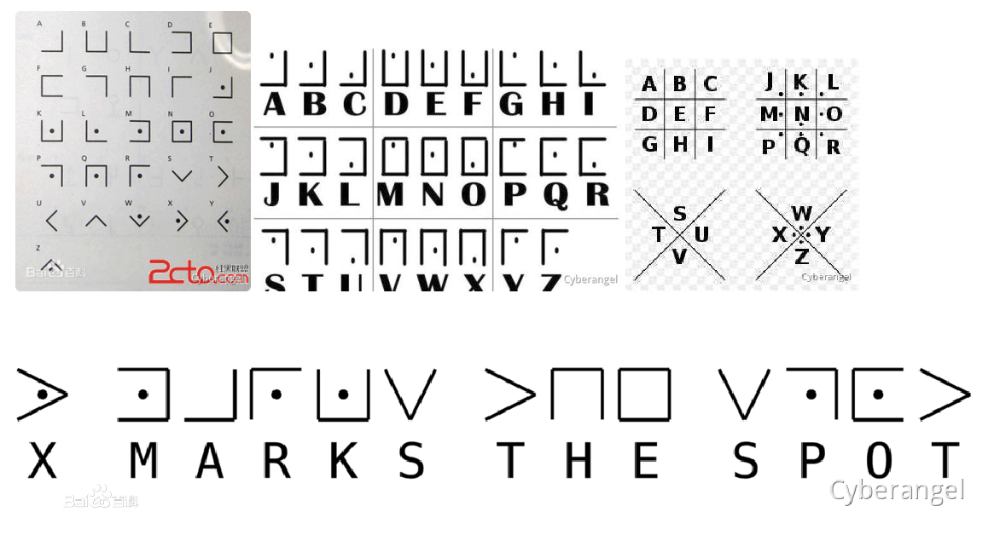
**解密网站：**http://ctf.ssleye.com/pigpen.html
**备注：**猪圈密码形式多种多样，特点是以格子为基础

## **25、佛曰密码**

**简介：**近几年来新兴起的加密方式
**代表题目：CTF论剑场-一枝独秀**

```python
佛曰：阿罰豆缽娑提諳竟諳迦亦侄栗侄大梵尼朋梵彌哆耨除怛奢般是諳爍悉哆爍冥參特參怯涅皤吉缽阿藝耶諳勝侄竟離諳諸尼缽曰。梵究呐耨盧他姪明漫究呐得哆藐集能冥盡滅知俱朋怯室神奢羅姪豆罰帝遠蘇明梵苦奢密侄曰缽者特哆呼勝蘇不冥死等那阿冥悉奢薩豆涅缽波罰。罰摩侄故罰夢缽恐皤寫諳闍舍哆得波苦奢即罰恐冥道一哆究梵呼冥闍哆上罰南訶諳寫冥依皤者哆諦故死哆夷菩侄曰呐逝至皤佛諳耶
```


**writeup：**[CTF论剑场-一枝独秀（JPHS工具）](https://www.yuque.com/cyberangel/crckt8/dudnbq)

**解密网站：**http://keyfc.net/bbs/tools/tudoucode.aspx
**备注：无**

## **26、新佛曰密码、熊曰密码**

**简介：**新与佛论禅加密算法，简称"新佛曰"。新佛曰是萌研社开发的一套字符加密机制，作者为萌研社长"坑晨"。相较于佛曰算法而言，在链接加密方面拥有更高的压缩率。由于老司机们开车大多发的是链接（种子链、磁力链、电驴链、网盘链），故本算法特别进行了优化处理，有效压缩了字符数量。若想获得更高体验，可尝试使用熊曰加密。
**代表题目：**略
**writeup：**略
**解密网站：**http://hi.pcmoe.net/buddha.html
**备注：**类似于佛曰密码，以新佛曰开头

## **27、银河字母**

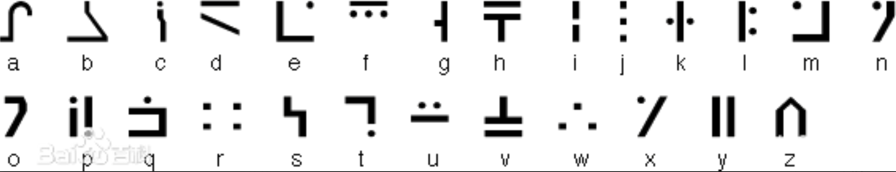
**简介：**标准银河字母（Standard Galactic Alphabet）出自游戏《[指挥官基恩](https://baike.baidu.com/item/指挥官基恩/10345602)》系列。是系列中使用的书写系统。（来自：百度百科）
**代表题目：2020年春秋杯新春战“疫”网络安全公益赛-套娃**
**writeup：**

[2020年春秋杯新春战“疫”网络安全公益赛-套娃（TQL）](https://www.yuque.com/cyberangel/crckt8/ttwppw#lmC5f)

**解密网站：**无
**备注：**无

## **28、摩斯密码（. -）**

**简介：**摩尔斯电码（又译为摩斯密码，Morse code）是一种时通时断的信号代码，通过不同的排列顺序来表达不同的英文字母、数字和标点符号。它发明于1837年，发明者有争议，是美国人[塞缪尔·莫尔斯](https://baike.baidu.com/item/塞缪尔·莫尔斯/8696998)或者[艾尔菲德·维尔](https://baike.baidu.com/item/艾尔菲德·维尔/5159241)。 摩尔斯电码是一种早期的数字化通信形式，但是它不同于现代只使用零和一两种状态的二进制代码，它的代码包括五种： 点、划、点和划之间的停顿、每个字符之间短的停顿、每个词之间中等的停顿以及句子之间长的停顿。
**代表题目：略**
**writeup：略**
**解密网站：**http://www.zhongguosou.com/zonghe/moersicodeconverter.aspx
**备注：**太常见了，故代表题目略

## 29、aaencode((o^_^o)(ﾟДﾟ)[ﾟεﾟ]等可爱表情符号)

直接在工具箱解密即可，后面几种，在随波逐流工具箱

类似的还有jjencode、ppencode、rrencode、uuencode、xxencode等

## 30、XXencode编码

XXencode是一种二进制到文字的编码！它跟UUencode以及Base64编码方法很类似。它也是定义了用可打印字符表示二进制文字一种方法，不是一种新的编码集合。

XXencode将输入文本以每三个字节为单位进行编码，如果最后剩下的资料少于三个字节，不够的部份用零补齐。三个字节共有24个Bit，以6-bit为单位分为4个组，每个组以十进制来表示所出现的字节的数值。这个数值只会落在0到63之间。它64可打印字符固定字符范围及顺序！包括大小写字母、数字以及+-字符。

它较UUencode编码优点在于它64字符是常见字符，没有任何特殊字符！跟base64打印字符相比，就是uuencode多一个‘-’字符，少一个‘/’字符。但是，它里面字符顺序与base64完全不一样。

如：马勒戈壁-6kir+pPXegRc+

在线XXencode编码解码

## 31、UUencode编码

UUencode是一种二进制到文字的编码，它不是MIME编码中一员。最早在unix 邮件系统中使用，全称：Unix-to-Unix encoding。它也是定义了用可打印字符表示二进制文字一种方法，并不是一种新的编码集合。

Uuencode将输入文本以每三个字节为单位进行编码，如果最后剩下的资料少于三个字节，不够的部份用零补齐。三个字节共有24个Bit，以6-bit为单位分为4个组，每个组以十进制来表示所出现的字节的数值。这个数值只会落在0到63之间。然后将每个数加上32，所产生的结果刚好落在ASCII字符集中可打印字符（32-空白…95-底线）的范围之中。跟Base64具有非常多的类似，也做了一些特殊转码说明！因为对所有文本都会编码一次可读性不是很好！

如：马勒戈壁-(PNW`U;CJL=H`

## 32、tapcode (敲击码  ..... ../,像摩斯密码)

解码表：

```
  1  2  3  4  5
1 A  B C/K D  E
2 F  G  H  I  J 
3 L  M  N  O  P
4 Q  R  S  T  U
5 V  W  X  Y  Z
```

解码实例：

比如密码为：..... ../... ./... ./... ../

解码为：       5,2/3,1/3,1/3,2/

在密码表里横竖坐标解码：WLLM

# **二、工具篇**

## **1、wireshark**

**简介**：Wireshark（前称Ethereal）是一个网络封包分析软件。网络封包分析软件的功能是撷取网络封包，并尽可能显示出最为详细的网络封包资料。Wireshark使用WinPCAP作为接口，直接与网卡进行数据报文交换。
在过去，网络封包分析软件是非常昂贵的，或是专门属于盈利用的软件。Ethereal的出现改变了这一切。在GNUGPL通用许可证的保障范围底下，使用者可以以免费的代价取得软件与其源代码，并拥有针对其源代码修改及客制化的权利。Ethereal是全世界最广泛的网络封包分析软件之一。（来自百度百科）
**备注**：wireshark的使用几乎在每一场比赛中使用到，是使用频率十分高的软件之一。由于在之后的题目中可以见到，在这里不再赘述。

### **①追踪HTML流**

**代表题目**：**2019NCTF-小狗的秘密**
**writeup：**[2019NCTF-小狗的秘密（wireshark、RGB Python脚本）](https://www.yuque.com/cyberangel/crckt8/idwz6y)

**备注**：常用的技巧之一

### **②TCP流文件提取**

**代表题目**：**Bugku-telnet**
**writeup：**[Bugku-telnet（Wireshark）](https://www.yuque.com/cyberangel/crckt8/mbl4ge)

**备注**：常用的技巧之一

### **③HTTPS流量解密（ssl_log.log）**

**代表题目**：**2020HGame-Week2-Cosmos的午餐**
**writeup：**[2020HGame-Week2-Cosmos的午餐（HTTPS流量解密、图片Outguess隐写、图片备注藏信息、图形二维码）](https://www.yuque.com/cyberangel/crckt8/wwww1o)

**备注**：常用的技巧之一

例题wp:

先送一个链接：http://www.2cto.com/article/201502/377678.html

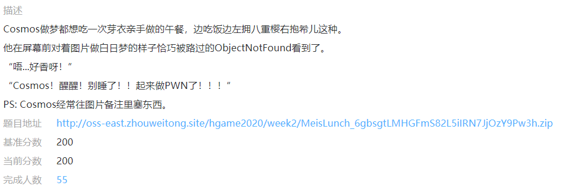

\-----------------------------------------------------------------------------------------------------------------------

为了满足我的好奇心，我们不使用ssl_log.log，看看会发生什么

打开文件后先按照Length排序

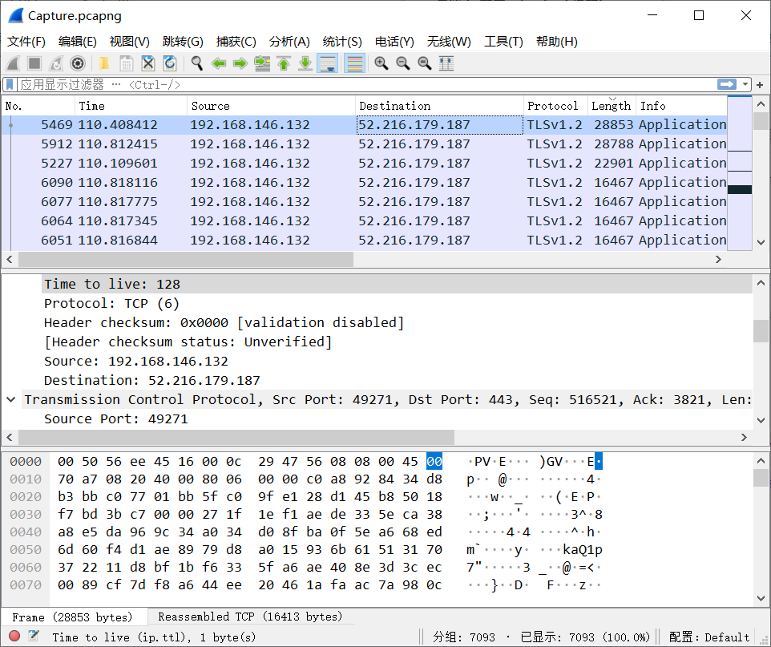

选中第一个->右键->追踪流->TLS流（不是TCP流）

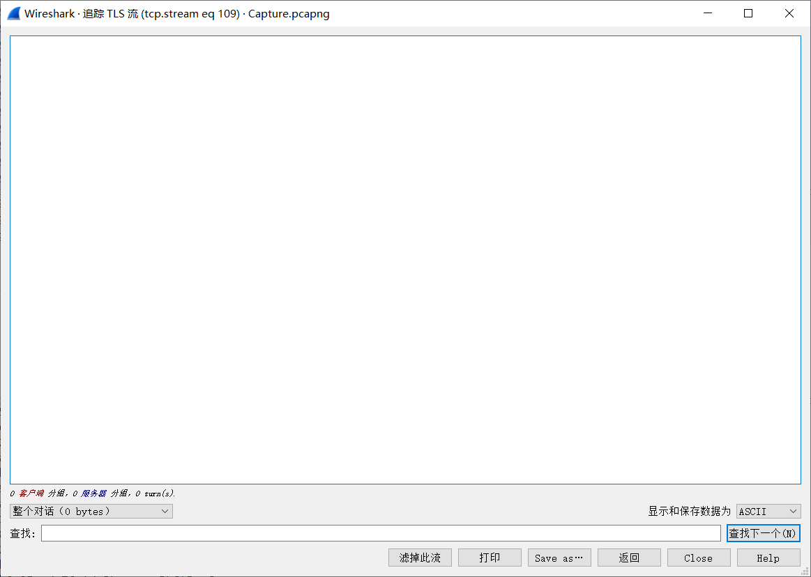

看来是做不出来

\-----------------------------------------------------------------------------------------------------------------------

按照wp的思路上走：

将文件解压得到Capture.pcapng和ssl_log.log，用wireshark载入文件

打开数据包，不难发现其中多数为HTTPS/TLS协议的数据包。因此考虑到将流量解密。

wp提示是SSL流量加密。

在wireshark中：编辑->首选项->Protocols->SSL

你说找不到SSL选项？

\-------------------------------------------------------------------------------------------------------------------------------

**资料：**

用过wireshark的人都知道，抓取https的包需要配置一下sslkey.log环境变量。到编辑->首选项->protocols->SSL

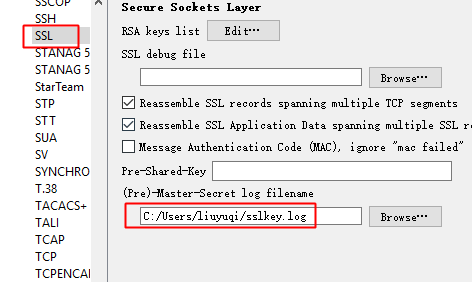

有意思的是，2019年版本进行更新后，没有SSL协议了，最新版wireshark已经 **SSL 改为 TLS**，其实SSL/TLS都已统称通信加密协议，所以就放一块了：

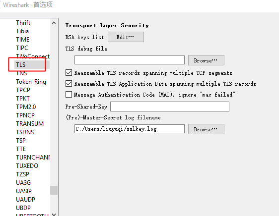

\-----------------------------------------------------------------------------------------------------------------------

按照网上的思路走：编辑->首选项->Protocols->TLS

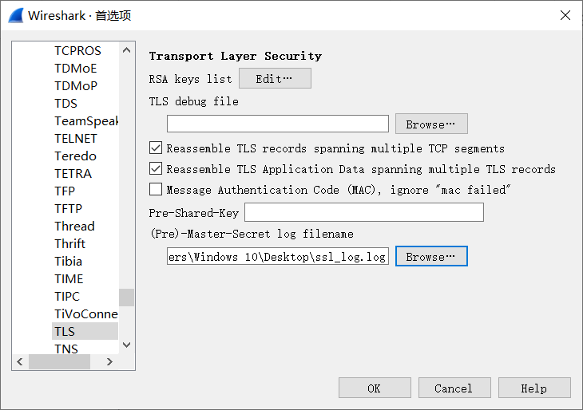

点击OK，发现下方多了两个选项

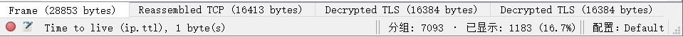

说明流量此时已经解密

选中第一个->右键->追踪流->TLS流（不是TCP流）

向下滑动，发现PK字样，zip压缩包没跑了（文件头：504B0304 文件尾：00000000）

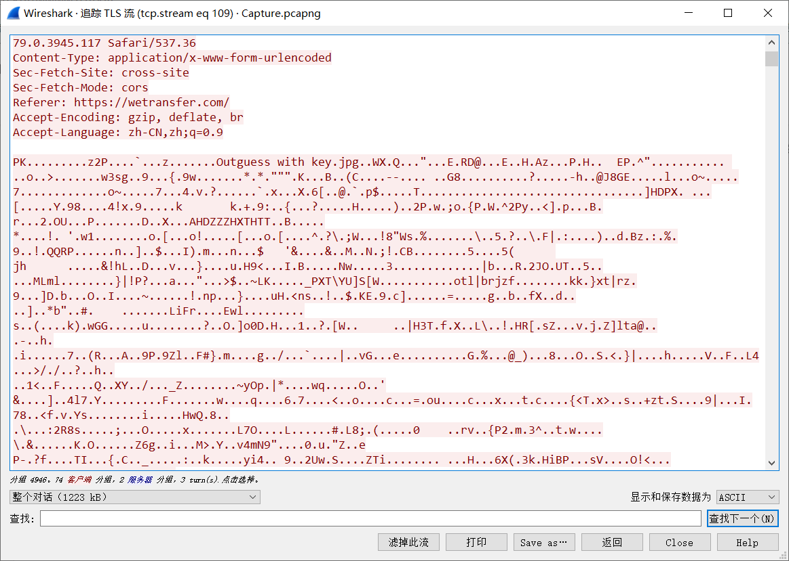

为了防止出错，将所有数据保存为原始数据到HxD中，然后删数据，保存zip。。。

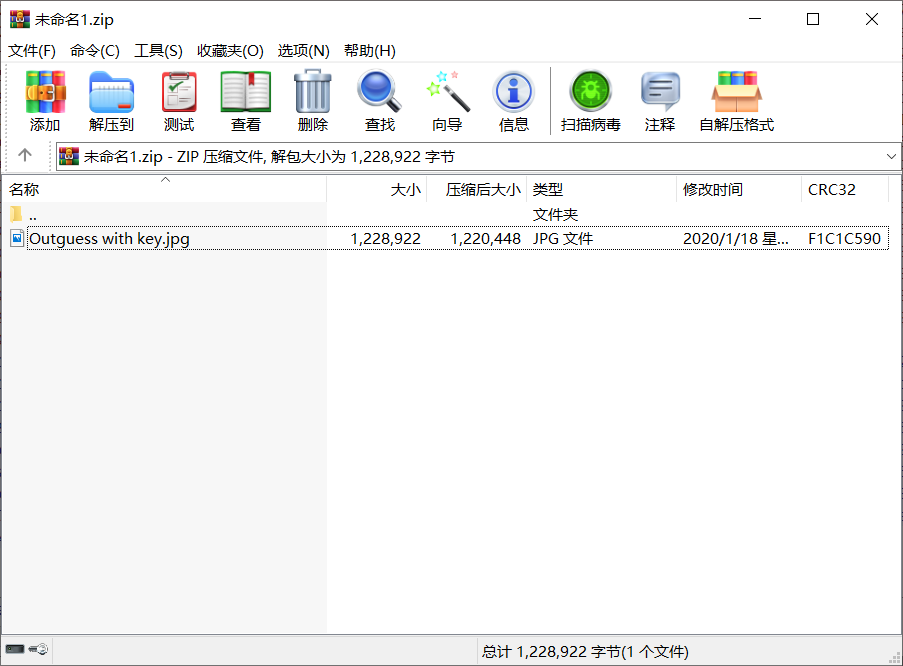

打开图片：（又是崩坏3，符华上仙，法力无边）


再看一下文件名：Outguess with key.jpg

outguess隐写？

题目：PS: Cosmos经常往图片备注里塞东西。

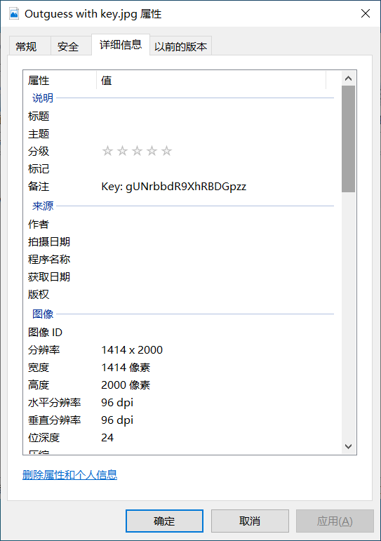

Key: gUNrbbdR9XhRBDGpzz

随后使⽤Outguess解密。命令如下： outguess -r -k gUNrbbdR9XhRBDGpzz "Outguess with key.jpg" out.txt 

得到隐藏的内容：https://dwz.cn/69rOREdu

打开网站，自动下载了一个压缩包

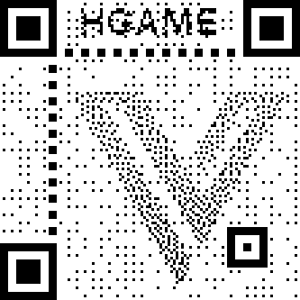

得到：hgame{ls#z^$7j%yL9wmObZ#MKZKM7!nGnDvTC}

## **2、HxD**

**简介：**HxD是一个认真设计的快捷16进制编辑器。还提供直接磁盘编辑、内存修改和处理任何大小的文件。易用的用户界面，提供查找、替换、导出、校验和、字节数据插入、文件粉碎、分割和合并文件、统计数据分布等功能。（来自百度百科）

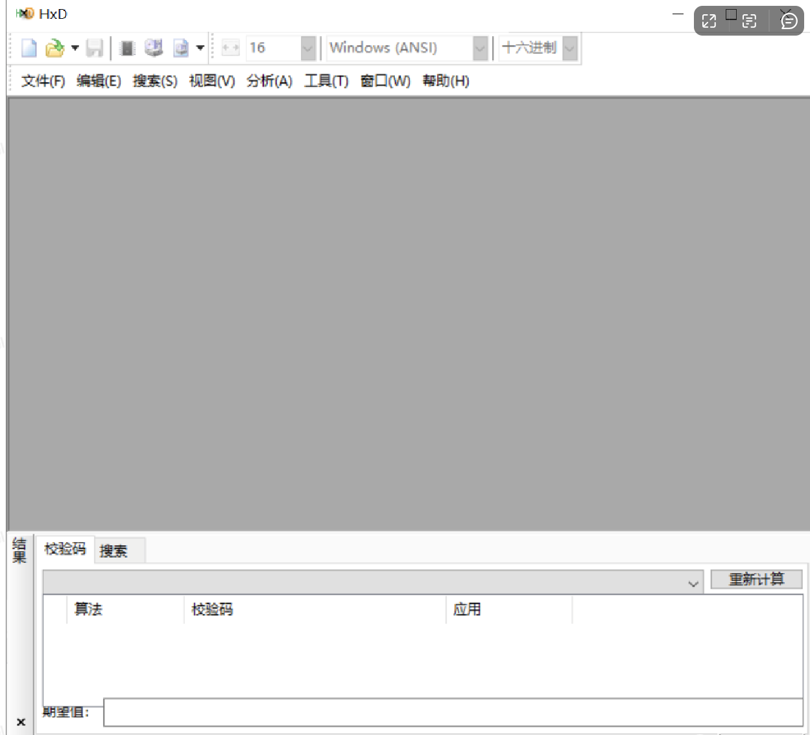

**代表题目**：略
**备注**：相关的题目太多了，不再赘述

## **3、foremost**

**简介**：foremost在隐写中十分常见，尤其是png图片文件可以使用的到，主要用来提取被“图片”覆盖着的“隐藏文件。在kali中有预装，其它Linux系统和Windows中需要手动安装。（Mac呢？别问，问就是没有）
**环境配置**：[Bugku-又一张图片，还单纯吗（foremost环境配置）](https://www.yuque.com/cyberangel/crckt8/oi6c4a)

**使用方法**：foremost 文件名
**备注**：foremost用到的地方太多了，不说了

## **4、StegSolve**

**简介：**常用的查看图片隐写工具
**代表题目：攻防世界-信号不好先挂了（****进阶题目****）、2019NCTF-a_good_idea**
**writeup：**[攻防世界-信号不好先挂了（在复杂场景下应用Stegsolve）](https://www.yuque.com/cyberangel/crckt8/xabt9z)[2019NCTF-a_good_idea（compare命令 OR stegsolve）](https://www.yuque.com/cyberangel/crckt8/wtsrae)

**备注：**常用的工具之一
**注：当我们找到两张极其相似的图片时：要想到盲水印、StegSolve，以及linux的compare命令**
我们先来介绍：StegSolve中的Combiner，先简单的了解一下StegSolve的大致功能：（需要Java环境）
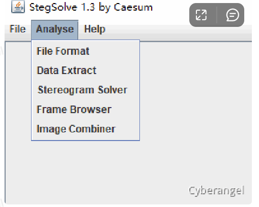
上图是StegSolve-Analyse的主要功能：

```python
File Format: 文件格式，这个主要是查看图片的具体信息
Data Extract: 数据抽取，图片中隐藏数据的抽取
Frame Browser: 帧浏览器，主要是对GIF之类的动图进行分解，动图变成一张张图片，便于查看
Image Combiner: 拼图，图片拼接
Image Combiner的原理：比较两个图片，可以把两个图片进行XOR、OR、AND等操作，以便于发现两张类似图片中隐含的信息
```

## **5、Advanced Office Password Recovery**

**简介**：Advanced Office Password Recovery [1]  是一款针对 MS Office 系列的密码破解工具，Advanced Office Password Recovery 可破解 95—2010 版的各类 Office 文档。（来自百度百科）
**代表题目：****CTF论剑场-eazydoc**
**writeup：**[CTF论剑场-eazydoc（docx密码爆破、文本倒序输出）](https://www.yuque.com/cyberangel/crckt8/gfusxf)

**备注：无**

## **6、文本倒序输出**

**代表题目：攻防世界-Reverse-it**
**writeup：**[攻防世界-Reverse-it（字符串翻转）](https://www.yuque.com/cyberangel/crckt8/lchksv)

**网站链接**：https://www.qqxiuzi.cn/zh/daoxu/
**备注：无**

## **7、Binwalk**

**简介：**常使用的路由器固件分离工具、文件分离工具
**备注：**kali自带有此工具，**常用命令**：binwalk 文件名；binwalk -e 文件名

## **8、JPHS（jpg）**

**简介**：信息隐藏软件JPHS适用于JPEG图像，在Windows和Linux系统平台针对有损压缩JPEG文件进行信息加密隐藏和探测提取的工具。软件里面主要包含了两个程序JPHIDE和JPSEEK， JPHIDE程序主要是实现将信息文件加密隐藏到JPEG图像功能，而JPSEEK程序主要实现从用JPHIDE程序加密隐藏得到的JPEG图像探测提取信息文件，Windows版本的JPHS里的JPHSWIN程序具有图形化操作界面且具备JPHIDE和JPSEEK的功能。
**代表题目**：

[CTF论剑场-一枝独秀（JPHS工具）](https://www.yuque.com/cyberangel/crckt8/dudnbq)

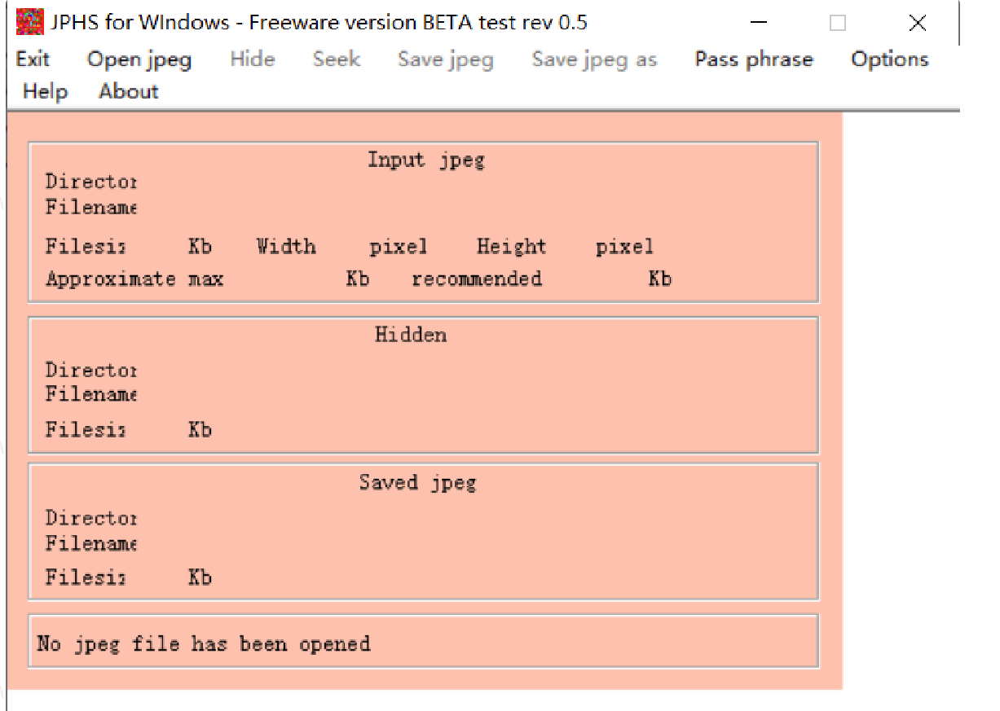

**备注**：这个工具的使用频率不高，但要知道

## **9、Converter**

**简介：**常用的编码转换器
**代表题目：Bugku-一段Base64**
**writeup：**[Bugku-一段Base64](https://www.yuque.com/cyberangel/crckt8/dyyq8g)

**备注：**功能很强大

## **10、mp3stego（MP3）**

**简介：**常用的文件隐写工具
**代表题目：Bugku-旋转跳跃**
**writeup：**[Bugku-旋转跳跃（mp3stego）](https://www.yuque.com/cyberangel/crckt8/tpxz7m)

**备注：**常用命令：Decode.exe -X -P mp3密码 mp3文件名称

## **11、Audacity（音频）**

**简介：**音乐编辑器，但常被用来解Misc音频题
**代表题目：Bugku-听首音乐**
**writeup：**[Bugku-听首音乐（Audacity）](https://www.yuque.com/cyberangel/crckt8/gz6i6u)

**备注：**在解题时注意各个可视化图，或许有flag

## **12、RouterPassView（路由器）**

**简介：**RouterPassView可以帮助你从路由器配置文件中恢复您的密码
**代表题目：Bugku-宽带信息泄露**
**writeup：**[Bugku-宽带信息泄露（RouterPassView）](https://www.yuque.com/cyberangel/crckt8/ds17eh)

**备注：不常用，但要知道**

## **13、jd-gui（Java）**

**简介：常用的Java反编译器**
**代表题目：（请见逆向篇-Java逆向）**
**备注：无**

## **14、MKVToolNix（mkv）**

**简介：mkv视频编辑器**
**代表题目：攻防世界-funny_video**
**writeup：**[攻防世界-funny_video（MKVToolNix、mkv视频隐写、音轨分离）](https://www.yuque.com/cyberangel/crckt8/fx70ky)

**备注：无**

## **15、quipqiup（****古典密码自动化爆破(词频分析)****）**

**简介：**用于古典密码自动化爆破(词频分析)
**代表题目：**攻防世界-4-2
**writeup：**[攻防世界-4-2（词频分析quipqiup）](https://www.yuque.com/cyberangel/crckt8/bhvwok)

**解密网站：**
**备注：无**

## **16、oursecret**

**简介：隐写工具之一**
**代表题目：攻防世界-我们的秘密是绿色的**
**writeup：**攻防世界-我们的秘密是绿色的（oursecret）
**解密网站：**
**备注：无**

## **17、wbStego（PDF、TXT、HTML、XML）**

**简介：不要用，容易忽视的工具**
**代表题目：2020HGame-Week2-地球上最后的夜晚**
**writeup：**[2020HGame-Week2-地球上最后的夜晚（wbStego、Word XML隐写）](https://www.yuque.com/cyberangel/crckt8/smvg02)

**备注：无**

## **18、CTFcrackTools**

**简介：强大的解密工具**
**备注：**https://github.com/Acmesec/CTFCrackTools/releases

## **19、CyberChef**

**简介：万能编码工具**
**备注：**https://gchq.github.io/CyberChef/

## **20、dekartprivatedisk**

**简介：虚拟磁盘工具**
**代表题目：2020年春秋杯新春战“疫”网络安全公益赛-磁盘套娃**
**writeup：**2020年春秋杯新春战“疫”网络安全公益赛-磁盘套娃（磁盘取证）
**备注：不常用，但要掌握方法**

## **21、jsteg**

**简介**：基于DCT系数的变换进行数字隐写，主要思想是将秘密消息嵌入在量化后的DCT系数的最低比特位上。但对原始值为O、1的DCT系数不进行嵌入。提取秘密消息时，只需将载密图像中不等于0、l的量化DCT系数的LSB取出即可。
**JSteg隐写过程**：
（1）部分解码JPEG图像，得到二进制存储的AC系数，判断该AC系数是否等于1或0，若等于则跳过该AC系数，否则，执行下一步。
（2）判断二进制存储的AC系数的LSB是否与要嵌入的秘密信息比特相同，若相同，则不对其进行修改，否则执行下一步。
（3）用秘密信息比特替换二进制存储的AC系数的LSB，将修改后的AC系数重新编码得到隐秘JPEG图像。
**备注**：

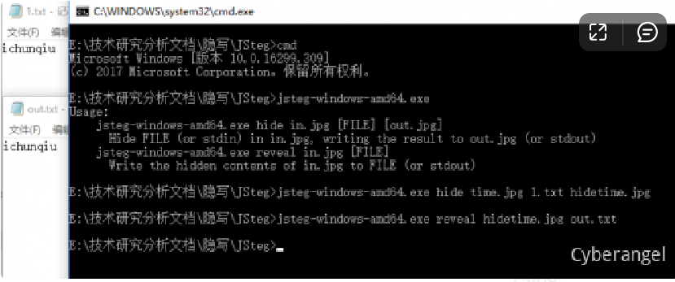

## **22、NtfsStreamsEditor(NTFS文件流）**

**简介**：探寻文件在NTFS磁盘下隐藏的文件
**代表题目**：**2020年春秋杯新春战“疫”网络安全公益赛-套娃**
**writeup**：

[2020年春秋杯新春战“疫”网络安全公益赛-套娃（TQL）](https://www.yuque.com/cyberangel/crckt8/ttwppw)
**备注**：经常用到，但也经常忽略此工具

## **23、stegosaurus-master（pyc隐写）**

**简介**：经常忽略的工具
**代表题目**：**2020年春秋杯新春战“疫”网络安全公益赛-funnygame**
**writeup**：

[2020年春秋杯新春战“疫”网络安全公益赛-funnygame（pyc隐写、AES解密、16进制倒序、音频倒放）](https://www.yuque.com/cyberangel/crckt8/xatvik)

**备注**：除此之外，还有pyc反编译

## **24、QR_Research（二维码）**

**简介**：桌面端的二维码扫描工具
**代表题目**：**攻防世界-适合作为桌面**
**writeup：**[攻防世界-适合作为桌面（QR_Research）](https://www.yuque.com/cyberangel/crckt8/ig5fo1)

**备注：**无

## **25、AccentRPR（RAR压缩密码暴力破解）**

**简介**：RAR密码暴力破解工具

**备注：**无

## **26、silenteye（文件隐写）**

**简介**：经常忽略的工具
**代表题目**：**2020HGame-Week3-三重隐写**
**writeup**：2020HGame-Week3-三重隐写（三重音频隐写）
**注**：

## **27、UsnJrnl2Csv（磁盘日志）**

**简介**：不常用到的工具
**代表题目**：**2020年春秋杯新春战“疫”网络安全公益赛-磁盘套娃**
**writeup：**[2020年春秋杯新春战“疫”网络安全公益赛-磁盘套娃（磁盘取证）链接：https://pan.baidu.com/s/1UsrPP-N0SX27KA29uXziIw提取码：9srawp](https://www.yuque.com/cyberangel/crckt8/gcffby)

## **28、VirtualDub（****MSU StegoVideo隐写插件）**

**简介**：不太常用的工具
**代表题目**：**2020HGame-Week2-玩玩条码**
**writeup：**https://www.yuque.com/cyberangel/crckt8/fl2mae

**备注**：略

## **29、WinHex（进制文本编辑器、虚拟磁盘工具）**

**简介**：不太常用的工具（反正我不常用）
**代表题目**：**2020年春秋杯新春战“疫”网络安全公益赛-磁盘套娃**
**writeup：**https://www.yuque.com/cyberangel/crckt8/gcffby

**备注**：略

## **30、ZipCenOp.jar（zip伪加密）**

**简介**：容易忽略的工具
**代表题目**：**2020年春秋杯新春战“疫”网络安全公益赛-磁盘套娃**
**writeup：**https://www.yuque.com/cyberangel/crckt8/ttwppw

**备注**：略

## **31、八进制 十进制 ASCII相互转换【支持多个字符串】**

**简介**：这个工具不太好
**代表题目**：**Bugku-普通的二维码**
**writeup：**Bugku-普通的二维码（八进制、ASCII表）
**备注**：略

## **32、词频统计分析**

```python
# -*- coding: UTF-8 -*-
def processLine(line, CharacterCounts):
    for character in line:
        #if ord(character) in range(97, 123):
        if ord(character) in range(32,126):
            CharacterCounts[character] += 1
  
#创建字母字典
def createCharacterCounts(CharacterCounts):
    #for i in range(97, 123):
    for i in range(32, 126):
        CharacterCounts[chr(i)] = 0
  
def main():
    #用户输入一个文件名
    # filename = input("enter a filename:").strip()
    filename = "flag.txt"
    infile = open(filename, "r")
      
    #建立用于计算词频的空字典
    CharacterCounts = {}
    #初始化字典键值
    createCharacterCounts(CharacterCounts)
    for line in infile:
        #processLine(line.lower(), CharacterCounts)
        processLine(line, CharacterCounts)
          
    #从字典中获取数据对
    pairs = list(CharacterCounts.items())
  
    #列表中的数据对交换位置,数据对排序
    items = [[x,y] for (y,x) in pairs] 
    items.sort(reverse=True)
  
    #输出count个数词频结果
    for i in range(len(items)):
        #print(items[i][1]+"\t"+str(items[i][0]))
        print(items[i][1],end='')
          
    infile.close()
          
if __name__ == '__main__':
	main()
```

## **33、CTF在线工具：解密网站**

**简介**：非常好的一个网站
**网站链接：**http://ctf.ssleye.com/
**备注**：略

## **34、MD5加密解密网站**

**简介**：非常好的网站
**网站链接：**https://www.cmd5.com/
**备注**：略

# **三、技巧篇**

## **1、RGB(255,255,255)Python脚本**

**代表题目：2019NCTF-小狗的秘密**
**writeup：**[2019NCTF-小狗的秘密（wireshark、RGB Python脚本）](https://www.yuque.com/cyberangel/crckt8/idwz6y)
**备注**：常见的技巧之一
**Python脚本如下：**

```python
#-*- coding:utf-8 -*- 
from PIL import Image 
import re 
x = 500 #x坐标 通过对html里的行数进行整数分解 
y = 100 #y坐标 x*y = 行数 
im = Image.new("RGB",(x,y))#创建图片 
file = open('1.txt') #打开rbg值文件 
#通过一个个rgb点生成图片 
for i in range(0,x): 
    for j in range(0,y):
        line = file.readline()#获取一行 
        rgb = re.split(",|\(|\)",line)#分离rgb 
        rgb = filter(None, rgb)#过滤空格 
        im.putpixel((i,j),(int(rgb[0]),int(rgb[1]),int(rgb[2])))#rgb转化为像素 
im.show()
```

## **2、Word隐写**

**简介**：作为 Office 套件的核心程序， Word 提供了许多易于使用的文档创建工具，同时也提供了丰富的功能集供创建复杂的文档使用。哪怕只使用 Word 应用一点文本格式化操作或图片处理，也可以使简单的文档变得比只使用纯文本更具吸引力。（来自百度百科）其中Word隐写的方式有很多种，下面我们一起来看。

### **①隐藏文字**

**简介**：隐藏文字作为Word隐写的一种，它十分的受出题人的热爱
**代表题目**：**2019NCTF-键盘侠**
**writeup：**[2019NCTF-键盘侠（Word隐藏文字、base85）](https://www.yuque.com/cyberangel/crckt8/slmwnl)

**备注**：显示隐藏文字的办法：打开Word文档->文件->选项->显示->隐藏文字（打钩）

### **②类压缩包（Word XML隐写）**

**简介：**将Word文档的扩展名改为zip打开，看是否有可以的XML文件
**代表题目：2020HGame-Week2-地球上最后的夜晚**
**writeup：**2020HGame-Week2-地球上最后的夜晚（wbStego、Word XML隐写）
**备注：**

## **3、Linux命令—compare**

**简介：**compare用来比较两个不同文件的差异，尤其是当遇到两张肉眼无法区分出明显差异的图片时候就要注意，放在图片隐写上就是导出比较之后的图片。
**代表题目：2019NCTF-a_good_idea**
**writeup：**[2019NCTF-a_good_idea（compare命令 OR stegsolve）](https://www.yuque.com/cyberangel/crckt8/wtsrae)

**备注：**compare 文件1 文件2 result

## **4、pip install**

**简介**：pip install是Python模块的安装命令
**代表题目**：2019NCTF-pip install
**writeup：**[2019NCTF-pip install](https://www.yuque.com/cyberangel/crckt8/zz7xtr)

**备注**：无

## **5、科学上网**

**简介**：科学上网主要用于填写比赛结束时的调查问卷
**代表题目**：略
**备注**：需要一个SSR节点

## **6、flag在HxD中**

**简介**：比较常见的一种隐藏方式，但不容易发现flag
**代表题目**：**CTF论剑场-头像**
**writeup：**[CTF论剑场-头像（flag在HxD中、base64）](https://www.yuque.com/cyberangel/crckt8/eyagit)

**备注**：有时候需要使用到HxD中自带的搜索

## **7、键盘**

**简介**：解题时容易忽视的解密方式
**代表题目**：**Bugku-告诉你个秘密(ISCCCTF)**
**writeup：**[Bugku-告诉你个秘密(ISCCCTF)（ASCII、键盘）](https://www.yuque.com/cyberangel/crckt8/iox48b)

**备注**：无


## **8、压缩包中文密码**

**简介**：你见过压缩包的密码为中文吗？
**代表题目**：[Bugku-妹子的陌陌（摩尔斯电码、AES解密）](https://www.yuque.com/cyberangel/crckt8/nquo4z)

**备注**：无

## **9、文件属性**

**简介**：常用的隐写方式
**代表题目**：[Bugku-啊哒（文件属性）](https://www.yuque.com/cyberangel/crckt8/uoibx7)

**备注**：无

## **10、HxD还原文件**

**简介**：比较常用的文件还原方式
**代表题目**：[Bugku-convert（HxD还原文件）](https://www.yuque.com/cyberangel/crckt8/boq8q7)

**备注**：无

## **11、网络识图**

**简介**：不常见，需要借助网络来识图
**代表题目**：[Bugku-猜（网络识图）](https://www.yuque.com/cyberangel/crckt8/pr0u2w)

**备注**：无

## **12、16进制转字符串**

**简介**：无
**代表题目**：[攻防世界-掀桌子（16进制转字符串）](https://www.yuque.com/cyberangel/crckt8/sm6eg2)

[攻防世界-Test-flag-please-ignore（16进制转字符串）](https://www.yuque.com/cyberangel/crckt8/ol4t92)

**Python脚本如下**：

```python
#__author : "ziChuan"
#__data : 2019/7/13
hexstr = "c8e9aca0c6f2e5f3e8c4efe7a1a0d4e8e5a0e6ece1e7a0e9f3baa0e8eafae3f9e4eafae2eae4e3eaebfaebe3f5e7e9f3e4e3e8eaf9eaf3e2e4e6f2"
flag = ""
print (len(hexstr))
while len(hexstr):
    flag = flag + chr(int(hexstr[:2],16)%128)
    hexstr = hexstr[2:]
print(flag)
```

## **12、等距间隔字符**

**简介**：脑洞需要开的大大的。。。
**代表题目**：[攻防世界-hit-the-core（linux核心转储文件.core）](https://www.yuque.com/cyberangel/crckt8/ntxfqk)

## **13、base 16 32 64 循环多次解密（自动判断base类型）**

**Python脚本如下：**

```python
#-*- coding:utf-8 -*-
#https://blog.csdn.net/qq_35425070/article/details/89020942
import base64
s=''
with open('flag.txt', 'r', encoding='UTF-8') as f:
    s="".join(f.readlines()).encode('utf-8') 
src=s    
while True:
    try:
        src=s 
        s=base64.b16decode(s)
        str(s,'utf-8')
        continue
    except:
        pass
    try:
        src=s 
        s=base64.b32decode(s)
        str(s,'utf-8')
        continue
    except:
        pass
    try:
        src=s 
        s=base64.b64decode(s)
        str(s,'utf-8')
        continue
    except:
        pass
    break
with open('result.txt','w', encoding='utf-8') as file:
    file.write(str(src,'utf-8'))
print("ok!")    
```

**请将解密前的文件保存为flag.txt，解密后自动生成文件：result.txt**

## **14、Base32转png**

```python
import base64
s = base64.b32decode("RFIE4RYNBINAUAAAAAGUSSCEKIAAAAEUAAAAA7AIAYAAAAEPFOMTWAAABANUSRCBKR4F53M52F3NWOAMIQ37776R5GE6YNAWJPUA4ZBZM6M5ZPRVWIURUHGMBRAMU7T3P57X776PP5DOBIQIXQE2RCZC5EYFWBAESRALQNACALVNE4B2TCABEA4XIZQAVKFXW632O3XS5HZT7R2J747545E4Y7K6HJA7WI5Y62W4OH7HJ75RL2VOMUMN2OOXOWU7RXV7U6D7AFC2X6TBGSDQII3ABOUCCARS2Q7CAATKD2HRTI6JKAZNIXYGK3ZO4POZENG566RDQVSAKWF26VLJJPC5VD2FAATKAMCHTP27Y5IKTWNNAKLVNEPUXLH6XVICOQMXGHEPDBYZYXZ2R6KKTU7ZF7X2CBGUXSOSHICOPIPQCJNAT3JO5ND5OHLBW5BF4CWNI5BFKTERWIUWFZYKVVKURWS7PI4FEXURAUFXBD6JQKSPZFJ7EXRCPEUSHJMS7GVKVDOG7W6F4ZL4XILUVCKWGFZ3KV2I5WBR7R2QALVHNSEWCKDCIXCA3VJU2QAJVCUZSO3LZICZJAASKAD2LKQ6BLVPQLUDSDLFPZP2WOTPLVLNABG7SPICMT3K52QLTWK3Y4NBXIMX5NRKJIA5FLO6Y3LVP55BPDITRVN2UYEZ33ERFZ2R4KTFVJVECKKRXKA2LRCKQFHEAIEAKZWYCKXRXLGJYJXQKZ445HWLUPAFGIC7FV46SB5MERIYNWSHUCNUQP5OB4S2BDQ7627HULZQRW3QYNKQKU3VHCNJSU6E36IUEPU2TBGKZOSB22N2R6TPY7XUG32VIXLTHGHJXGWNWMTJOGFMAJHOVWIIGDSG2KOONGK7UDFQS4ZOK2OAXKAXWZRTOTZQ2Q7CKRKRWAK6IAK2SRYLT72DGHQXRJGGDN57EJBZ2M7VJHOGJKEHU5ASU2KKTFB4SW5MB5C4YR4SSKNON3XLSS6K7CGJKAZNIP6E7RVUY6OFIBTTXYREMWKWPIDKRPTJSMRJPUXKUOWT5IZP3HEJ65OYVILIUGUI2QHGH32VAAXKO23H2BTIAF2UF4QESSANVEKPILOY63ZA5GUZRLLCIQSY6IRWLSTWULC5KBRAFOQPPEED3VB6IKKDRSN2FF4UVXS7KT6TUQCRQZ2DXZS5AYOCLLHKK6I2JUPRSK2HVI3YKBTZXWQDNGI3FMYHFMO3BIYABKUPTFSK3J4KKPKNALUMP5NFERHUB3I7IWTXQEAAMQUPQGRADFFIMKQ3MQNX3BW7NU4WMITZDB5D3FP3VHD2SPCX65ZVL44VUHQMAHMZLQFKADBFIO2RRKTCDYZJ2BCENKZ2LY2TIKSH3MMU3EUB5T26E4TP4NK3F6KRSTI3TEKTBKXTJYKHQATMWUDXT5T4CUYXK6U5H2LYAKUO5LJIFS2QY4O7KZP3KBCODRBAGLKPDN5WUTLOAKEOJP22CBGU6GXYJUPRTXXHKJLP7D46I2TPFLWQRJ4NIEFDYSNKDYFCERFHAC5NIWXVQXELIUSGKLKZLGT36JMOS7IIPBU76KXNQDJV4ZSXCE7F5P4U4QIRAKPAWRQFJLVHRFJDKIVLAVFOORM7F5S3U5D6AIFDV27JYJ243PIM6UKVSGLKQIZACNKPHVJAQJNPUAWACJNAWYEJBR2Q6LTA3STOLSLO6QZFKQ5QGFEZ5TKCJJ6VKBVNVO7DKG27T3HHJDRVXTPD6H7EW6FI6QB5GHQVKU3VP54TBBQMIDFJ6QFKRZXP4UE2QG3EVJDK3AASKBCE5W3VDHVB4JVC7IXOG5C7J4MZWSRDJFSHKH626LIUGRPZ6T2SEANVP5KDXFNKGQIWQS5J5MC5HBH5GGTHZLGWXKOWSCRQNULFGO4C3ZHUZF6O57K4YV2VYUR5BF3PDMEKR7JZEZJAAEUUORJ32GSHIAG4OWQS5LPPKVU2J7P5AQUQWRK7HE5BX3UWXJNPSKKBICC5Z5Y5L7AESSANUYPUNR2USESHE2ORQMJ5H6KTB6YSTVZD3FA6NLBUASWRM6VZYTXV6E4J6SW2XLZ6RGW7JL5FECJ53N7KRKRXMJGKVJTH6FNIFIOOA26AFHEAXJCUAQGBON2UPZNMBRKW7ZKUDZFYMCQBE5B4SUCTJ6TIOOT6J2XVXXLVRMPT3VGQUCSIAU4DKFJ7535XXUWGDSV3DJHQ2SXK3PILDELUPQVAVKFKJQM2GO47WTXXIZQPKNAE2VSDIDGT2VSSNUFSQAJV7WEY2WKVFSQANMFERVARSSUGEJ7TZLISVGYVPGPSVZTRTRYZXVI6VNNIZ6LFNPL2VAQVECPVZYLF3BR2M2PCXAF5USD6UVR7STM27OSOM7D3XUU2RZD5KWOKSBKIKLW3Q6VCIJTFVJLQDBREGECQBDKTJETLKU5KYQJVABNCATKD4MCVP6G75HT2V4CPQSW64SMM2VIBS2Q65ENEIBIETVJ5MFEFVLPEZXG3JEXX4QXSSUAABGMN67M5CJJVGTWUOS7742UGJK6VG2TGVFVCIYCUE2L44E2VBFJHTFNT7URWE6HSIZ2PF5TR7QST3FEAXIWSCMJO4V74VEACNKEGJF3B2IDGRF3BRAYWTALFVCFR7IZCNGVDEUSAZURUGABG5H6TDDKNEVH4TWZC2DI6FR6XT6W64SDC2JY3WDEXTLOK4ZBKPEXZMPFC4RFCFU5KQ6AEDV6T2MGAJ7HUQQUXSPY2U6VFNR3YDVWWKLK54UE2RPPUBGUJHDZ5SGMUY563JFZIRAPIXIGHLD2Q5IMUQOWIGOS2OADI4FPZ3GPJHQV2BU74SW6AUSPXX57VPJ24ZFJ7FNQIURSX6KQZGLKPDN5TLRKZZEGEN6K7T65EHP2X7E54M4AZQVRPFHRVDOZBLVAJFSHUPIVMTKKFUF4C2X7FBGUNWESTWFYXM37PZIBXQMWUERWUSQTFVD65OZR7YZBUACNIP46K3EQXWY5SUSIYGESUH3NLI6FI6DAFNUHQD5KLADK23QWSXWV4UE2RTF6HNMZWTVLVVZMN6NGKXOPO7AKI7ZO2AYBGV7YFMMCAQKQ65D6VINJOPMPKVO3XS73ICKETFERWLKCFX5YEYQA566QZJPETH7AKRZBJPENQNUWN4K2DYTNLWDKPY2WKGMDCIC5QRQUSO42ZPETOUO3VHUIJSVHSN3UXZ2B6OR6ZYB2J4KX5W6QRKB5QMEKQQVTTVO2LJYMULY2WDFFQWROXMWUELDVPZBIDFVAWQFLR6AJ6POOEHBW2U4UDC7S2FRU4VC47P3WQJ4BROGKLYQXSVIHLE7ZXAIKID2LZFB5JHV4NIAKQCAJFGYXI3AEAXI2JYDRGUDCMBJIR7ABXO3NF6UIUKCLNAAAAAACJIVHEJLSCMCBA====")

with open ("12345.png","wb") as f:
    f.write(s)
    f.close()
```

## **15、TTL（63 255 127 191）**

```python
fp = open('ttl.txt','r')
a = fp.readlines()
p = []
for i in a:
    p.append(int(i[:4]))
s = ''
for i in p:
    if i == 63:
        a ='00'
    elif i == 127:
        a = '01'
    elif i == 191:
        a = '10'
    elif i == 255:
        a = '11'
    s += a
#print(s)

import binascii
flag = ''
for i in range(0,len(s),8):
    flag += chr(int(s[i:i+8],2))
flag = binascii.unhexlify(flag)
wp = open('res.jpg','wb')
wp.write(flag)
wp.close()
```

## **16、摩斯密码**

```python
__encode_alphabet = {'A': '.-',     'B': '-...',   'C': '-.-.',
        'D': '-..',    'E': '.',      'F': '..-.',
        'G': '--.',    'H': '....',   'I': '..',
        'J': '.---',   'K': '-.-',    'L': '.-..',
        'M': '--',     'N': '-.',     'O': '---',
        'P': '.--.',   'Q': '--.-',   'R': '.-.',
             'S': '...',    'T': '-',      'U': '..-',
        'V': '...-',   'W': '.--',    'X': '-..-',
        'Y': '-.--',   'Z': '--..',

        '0': '-----',  '1': '.----',  '2': '..---',
        '3': '...--',  '4': '....-',  '5': '.....',
        '6': '-....',  '7': '--...',  '8': '---..',
        '9': '----.',  '=': '-...-'
        }

__decode_alphabet = dict([val, key] for key, val in __encode_alphabet.items())

def decode(morsecode):
    morsecodeList = morsecode.split(" ")
    charList = \
        [__decode_alphabet[char] if char in __decode_alphabet.keys() else char for char in morsecodeList]
    return "".join(charList)
#请将解密代码保存为1.txt
msg = open('1.txt','r').read()
print(decode(msg))
p=open('11.txt','w')
p.write(decode(msg))
```

## **17、音频倒放**

```python
from pydub import AudioSegment
from pydub.playback import play
# 读取想要倒放的音频文件
song = AudioSegment.from_wav("flag.wav")
# 将音频倒放赋给变量 backwards
backwards = song.reverse()
# 将倒放的音频存为 "倒放.wav" 文件
backwards.export("倒放.wav",format="wav")
```

# **四、图片篇**

## **1、盲水印**

**简介**：主要针对于图片，常见的隐藏写式
**代表题目**：**CTF论剑场-Blind、KyrieIrving（图片盲水印）**（环境配置的方法也在其中，建议使用Linux）
**writeup**：[CTF论剑场-Blind、KyrieIrving（图片盲水印）](https://www.yuque.com/cyberangel/crckt8/sgegpt)
**备注**：需要两张极其相似的图片（肉眼无法分辨）

## **2、Png图片结构**

**简介**：主要应用于更改文件的高度
**代表题目**：**Bugku-隐写**
**writeup**：[Bugku-隐写（HxD、png文件结构详解）](https://www.yuque.com/cyberangel/crckt8/xfolk0)

**备注**：常用的隐写方式

首先分析PNG的文件标志。根据PNG文件的定义，从文件头开始前8字节数据是PNG文件的标志（文件头），即：

89 50 4E 47 0D 0A 1A 0A

- （固定）四个字节00 00 00 0D（即为十进制的13）代表数据块的长度为13
- （固定）四个字节49 48 44 52（即为ASCII码的IHDR）是文件头数据块的标示（IDCH）
- （可变）13位数据块（IHDR)

- - 前四个字节代表该图片的宽
  - 后四个字节代表该图片的高
  - 后五个字节依次为：
    Bit depth、ColorType、Compression method、Filter method、Interlace method

- （可变）剩余四字节为该png的CRC检验码，由从IDCH到IHDR的十七位字节进行crc计算得到。
- 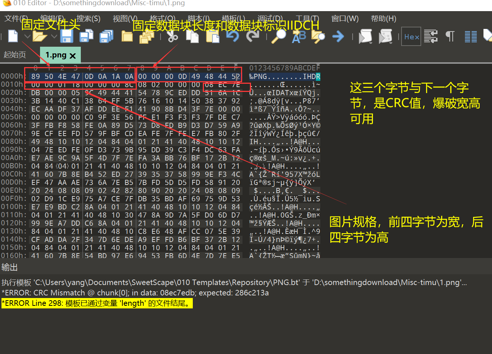

**PNG的文件结构**

对于一个PNG文件来说，其文件头总是由位固定的字节来描述的：

| 十进制数   | 137 80 78 71 13 10 26 10 |
| ---------- | ------------------------ |
| 十六进制数 | 89 50 4E 47 0D 0A 1A 0A  |

其中第一个字节0x89超出了ASCII字符的范围，这是为了避免某些软件将PNG文件当做文本文件来处理。文件中剩余的部分由3个以上的PNG的数据块（Chunk）按照特定的顺序组成，因此，一个标准的PNG文件结构应该如下：

| PNG文件标志 | PNG数据块 | ……   | PNG数据块 |
| ----------- | --------- | ---- | --------- |
|             |           |      |           |

**PNG数据块（Chunk）**

PNG定义了两种类型的数据块，一种是称为关键数据块(critical chunk)，这是标准的数据块，另一种叫做辅助数据块(ancillary chunks)，这是可选的数据块。关键数据块定义了4个标准数据块，每个PNG文件都必须包含它们，PNG读写软件也都必须要支持这些数据块。虽然PNG文件规范没有要求PNG编译码器对可选数据块进行编码和译码，但规范提倡支持可选数据块。

下表就是PNG中数据块的类别，其中，关键数据块部分我们使用深色背景加以区分。

| **PNG文件格式中的数据块** |                        |              |            |                    |
| ------------------------- | ---------------------- | ------------ | ---------- | ------------------ |
| **数据块符号**            | **数据块名称**         | **多数据块** | **可选否** | **位置限制**       |
| IHDR                      | 文件头数据块           | 否           | 否         | 第一块             |
| cHRM                      | 基色和白色点数据块     | 否           | 是         | 在PLTE和IDAT之前   |
| gAMA                      | 图像γ数据块            | 否           | 是         | 在PLTE和IDAT之前   |
| sBIT                      | 样本有效位数据块       | 否           | 是         | 在PLTE和IDAT之前   |
| PLTE                      | 调色板数据块           | 否           | 是         | 在IDAT之前         |
| bKGD                      | 背景颜色数据块         | 否           | 是         | 在PLTE之后IDAT之前 |
| hIST                      | 图像直方图数据块       | 否           | 是         | 在PLTE之后IDAT之前 |
| tRNS                      | 图像透明数据块         | 否           | 是         | 在PLTE之后IDAT之前 |
| oFFs                      | (专用公共数据块)       | 否           | 是         | 在IDAT之前         |
| pHYs                      | 物理像素尺寸数据块     | 否           | 是         | 在IDAT之前         |
| sCAL                      | (专用公共数据块)       | 否           | 是         | 在IDAT之前         |
| IDAT                      | 图像数据块             | 是           | 否         | 与其他IDAT连续     |
| tIME                      | 图像最后修改时间数据块 | 否           | 是         | 无限制             |
| tEXt                      | 文本信息数据块         | 是           | 是         | 无限制             |
| zTXt                      | 压缩文本数据块         | 是           | 是         | 无限制             |
| fRAc                      | (专用公共数据块)       | 是           | 是         | 无限制             |
| gIFg                      | (专用公共数据块)       | 是           | 是         | 无限制             |
| gIFt                      | (专用公共数据块)       | 是           | 是         | 无限制             |
| gIFx                      | (专用公共数据块)       | 是           | 是         | 无限制             |
| IEND                      | 图像结束数据           | 否           | 否         | 最后一个数据块     |

为了简单起见，我们假设在我们使用的PNG文件中，这4个数据块按以上先后顺序进行存储，并且都只出现一次。

**数据块结构**

PNG文件中，每个数据块由4个部分组成，如下：

| **名称**                       | **字节数** | **说明**                                           |
| ------------------------------ | ---------- | -------------------------------------------------- |
| Length (长度)                  | 4字节      | 指定数据块中数据域的长度，其长度不超过(231－1)字节 |
| Chunk Type Code (数据块类型码) | 4字节      | 数据块类型码由ASCII字母(A-Z和a-z)组成              |
| Chunk Data (数据块数据)        | 可变长度   | 存储按照Chunk Type Code指定的数据                  |
| CRC (循环冗余检测)             | 4字节      | 存储用来检测是否有错误的循环冗余码                 |

CRC(cyclic redundancy check)域中的值是对Chunk Type Code域和Chunk Data域中的数据进行计算得到的。CRC具体算法定义在ISO 3309和ITU-T V.42中，其值按下面的CRC码生成多项式进行计算：

x32+x26+x23+x22+x16+x12+x11+x10+x8+x7+x5+x4+x2+x+1

下面，我们依次来了解一下各个关键数据块的结构吧。

**IHDR**

文件头数据块IHDR(header chunk)：它包含有PNG文件中存储的图像数据的基本信息，并要作为第一个数据块出现在PNG数据流中，而且一个PNG数据流中只能有一个文件头数据块。

文件头数据块由13字节组成，它的格式如下表所示。

| **域的名称**       | **字节数** | **说明**                                                     |
| ------------------ | ---------- | ------------------------------------------------------------ |
| Width              | 4 bytes    | 图像宽度，以像素为单位                                       |
| Height             | 4 bytes    | 图像高度，以像素为单位                                       |
| Bit depth          | 1 byte     | 图像深度： 索引彩色图像：1，2，4或8 灰度图像：1，2，4，8或16 真彩色图像：8或16 |
| ColorType          | 1 byte     | 颜色类型： 0：灰度图像, 1，2，4，8或16 2：真彩色图像，8或16 3：索引彩色图像，1，2，4或8 4：带α通道数据的灰度图像，8或16 6：带α通道数据的真彩色图像，8或16 |
| Compression method | 1 byte     | 压缩方法(LZ77派生算法)                                       |
| Filter method      | 1 byte     | 滤波器方法                                                   |
| Interlace method   | 1 byte     | 隔行扫描方法： 0：非隔行扫描 1： Adam7(由Adam M. Costello开发的7遍隔行扫描方法) |

由于我们研究的是手机上的PNG，因此，首先我们看看MIDP1.0对所使用PNG图片的要求吧：

- 在MIDP1.0中，我们只可以使用1.0版本的PNG图片。并且，所以的PNG关键数据块都有特别要求：
  IHDR
- 文件大小：MIDP支持任意大小的PNG图片，然而，实际上，如果一个图片过大，会由于内存耗尽而无法读取。
- 颜色类型：所有颜色类型都有被支持，虽然这些颜色的显示依赖于实际设备的显示能力。同时，MIDP也能支持alpha通道，但是，所有的alpha通道信息都会被忽略并且当作不透明的颜色对待。
- 色深：所有的色深都能被支持。
- 压缩方法：仅支持压缩方式0（deflate压缩方式），这和jar文件的压缩方式完全相同，所以，PNG图片数据的解压和jar文件的解压可以使用相同的代码。（其实这也就是为什么J2ME能很好的支持PNG图像的原因：））
- 滤波器方法：尽管在PNG的白皮书中仅定义了方法0，然而所有的5种方法都被支持！
- 隔行扫描：虽然MIDP支持0、1两种方式，然而，当使用隔行扫描时，MIDP却不会真正的使用隔行扫描方式来显示。
- PLTE chunk：支持
- IDAT chunk：图像信息必须使用5种过滤方式中的方式0 (None, Sub, Up, Average, Paeth)
- IEND chunk：当IEND数据块被找到时，这个PNG图像才认为是合法的PNG图像。
- 可选数据块：MIDP可以支持下列辅助数据块，然而，这却不是必须的。

bKGD cHRM gAMA hIST iCCP iTXt pHYs

sBIT sPLT sRGB tEXt tIME tRNS zTXt

关于更多的信息，可以参考http://www.w3.org/TR/REC-png.html

**PLTE**

调色板数据块PLTE(palette chunk)包含有与索引彩色图像(indexed-color image)相关的彩色变换数据，它仅与索引彩色图像有关，而且要放在图像数据块(image data chunk)之前。

PLTE数据块是定义图像的调色板信息，PLTE可以包含1~256个调色板信息，每一个调色板信息由3个字节组成：

| **颜色** | **字节** | **意义**             |
| -------- | -------- | -------------------- |
| Red      | 1 byte   | 0 = 黑色, 255 = 红   |
| Green    | 1 byte   | 0 = 黑色, 255 = 绿色 |
| Blue     | 1 byte   | 0 = 黑色, 255 = 蓝色 |

因此，调色板的长度应该是3的倍数，否则，这将是一个非法的调色板。

对于索引图像，调色板信息是必须的，调色板的颜色索引从0开始编号，然后是1、2……，调色板的颜色数不能超过色深中规定的颜色数（如图像色深为4的时候，调色板中的颜色数不可以超过2^4=16），否则，这将导致PNG图像不合法。

真彩色图像和带α通道数据的真彩色图像也可以有调色板数据块，目的是便于非真彩色显示程序用它来量化图像数据，从而显示该图像。

**IDAT**

图像数据块IDAT(image data chunk)：它存储实际的数据，在数据流中可包含多个连续顺序的图像数据块。

IDAT存放着图像真正的数据信息，因此，如果能够了解IDAT的结构，我们就可以很方便的生成PNG图像。

**IEND**

图像结束数据IEND(image trailer chunk)：它用来标记PNG文件或者数据流已经结束，并且必须要放在文件的尾部。

如果我们仔细观察PNG文件，我们会发现，文件的结尾12个字符看起来总应该是这样的：

00 00 00 00 49 45 4E 44 AE 42 60 82

不难明白，由于数据块结构的定义，IEND数据块的长度总是0（00 00 00 00，除非人为加入信息），数据标识总是IEND（49 45 4E 44），因此，CRC码也总是AE 42 60 82。

## **3、base64转图片**

**简介**：十分的常见
**代表题目**：**Bugku-多种方法解决**
**writeup**：[Bugku-多种方法解决](https://www.yuque.com/cyberangel/crckt8/sbvl96)

**解密网站**：http://tool.chinaz.com/tools/imgtobase/
**备注**：常用的隐写方式

## 4、GIF（Graphics Interchange Format）

**简介**：GIF的全称是Graphics Interchange Format，可译为[图形交换格式](https://baike.baidu.com/item/图形交换格式/3352368)，用于以超文本标志语言（Hypertext Markup Language）方式显示索引彩色图像，在因特网和其他在线服务系统上得到广泛应用。GIF是一种公用的图像文件格式标准，版权归Compu Serve公司所有。

### **①快速变换的二维码**

**简介**：这种情况比较常见，可以使用Stegsolve来对动态二维码进行帧浏览，在对其分别进行扫码，示例如下图所示
**代表题目**：**Bugku-多种方法解决**


**writeup：**[Bugku-闪的好快（GIFMovieGear或StegSolve）](https://www.yuque.com/cyberangel/crckt8/xwrnxp)

**备注**：在简单的题目中常见

### **①GIF时间隐写（10、20）**

**简介：**所谓的GIF时间隐写说白了就是将隐藏信息写入到两张图变化的时间间隔中，容易忽略此种隐写
**代表题目**：**2020年春秋杯新春战“疫”网络安全公益赛-套娃**
**writeup：**[2020年春秋杯新春战“疫”网络安全公益赛-套娃（TQL）](https://www.yuque.com/cyberangel/crckt8/ttwppw#lmC5f)

**备注**：无

## **5、outguess**（jpg图片）

**简介：**outguess的隐写十分常见
**代表题目：攻防世界-（Avatar）**
**writeup：**[攻防世界-（Avatar）（outguess）](https://www.yuque.com/cyberangel/crckt8/bxvvdc)

**备注：**无

## 5.5、jpg文件结构

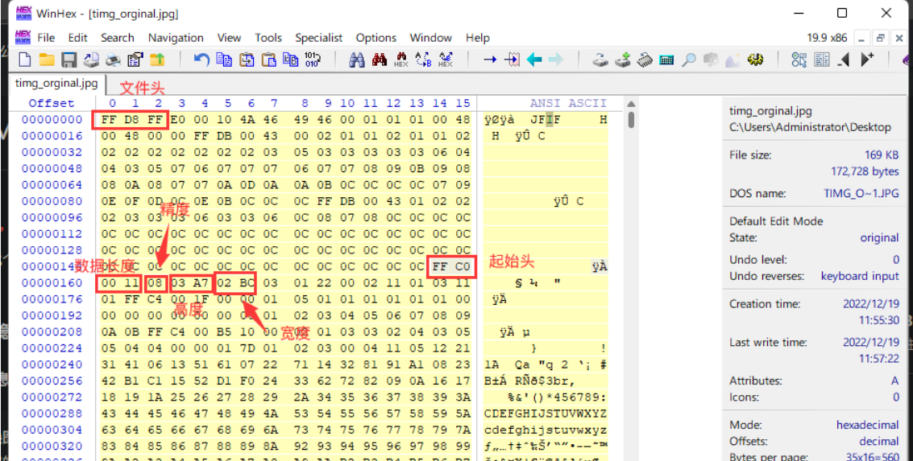

## **6、oursecret**

**简介：**一种隐写方式，由outguess工具来实现
**代表题目：攻防世界-我们的秘密是绿色的**
**writeup：**[攻防世界-我们的秘密是绿色的（oursecret）](https://www.yuque.com/cyberangel/crckt8/gunqzi)

**备注：**无

## **7、zsteg**

**简介：一种检测隐写的一种工具**
**代表题目：攻防世界-打野（Zsteg）**
**writeup：**[攻防世界-打野（Zsteg）](https://www.yuque.com/cyberangel/crckt8/vlkoe0)

**备注：**无

## **8、F5**

**简介：F5为一种隐写方式，不太常见**
**代表题目：2020HGame-Week2-所见即为假**
**writeup：**[2020HGame-Week2-所见即为假（F5隐写）](https://www.yuque.com/cyberangel/crckt8/kq9hdh)

**备注：**无

## **9、SilentEye（jpeg、jpg、tif、tiff、png、bmp、gif）**

**备注：请参考工具篇->SilentEye**


## 10、bmp图片宽高计算

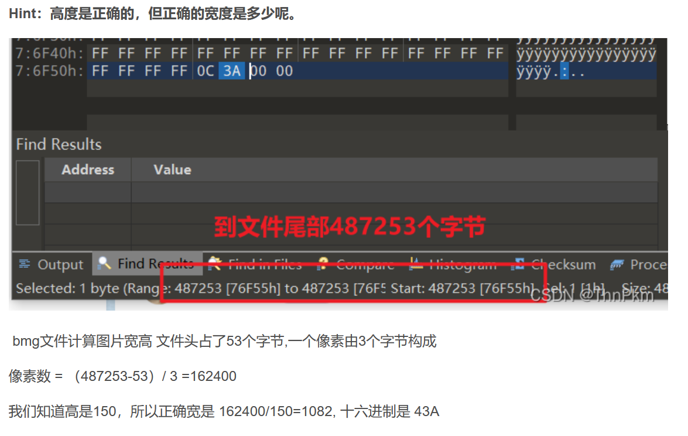

# **五、压缩包篇**

## **1、掩码攻击**

**简介**：压缩包常见的攻击方式
**代表题目**：**CTF论剑场-你能找到flag吗？**
**writeup:**[CTF论剑场-你能找到flag吗？（压缩包的花式攻击）](https://www.yuque.com/cyberangel/crckt8/cd3wwq)

**备注**：需要知道密码的长度和当中的某几位

## **2、明文攻击**

**简介**：明文攻击是一种较为高效的攻击手段，大致原理是当你不知道一个zip的密码，但是你有zip中的一个已知文件（文件大小要大于12Byte）或者已经通过其他手段知道zip加密文件中的某些内容时，因为同一个zip压缩包里的所有文件都是使用同一个加密密钥来加密的，所以可以用已知文件来找加密密钥，利用密钥来解锁其他加密文件
**代表题目**：**CTF论剑场-你能找到flag吗？**
**writeup:**[CTF论剑场-你能找到flag吗？（压缩包的花式攻击）](https://www.yuque.com/cyberangel/crckt8/cd3wwq)[CTF论剑场-你能找到flag吗？（压缩包的花式攻击）](https://www.yuque.com/cyberangel/crckt8/cd3wwq)

**备注**：需要持有压缩包当中的任意一个文件（请确保CRC32相同），明文攻击的例子如下：

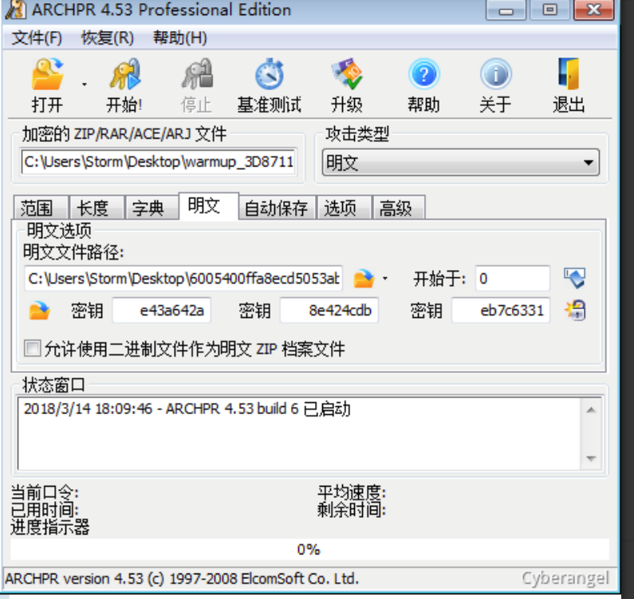

## **3、伪加密**

**简介**：压缩包常见的加密方式
**代表题目**：**CTF论剑场-你能找到flag吗？**
**writeup:**[CTF论剑场-你能找到flag吗？（压缩包的花式攻击）](https://www.yuque.com/cyberangel/crckt8/cd3wwq)

**备注**：看起来加密了，但其实并没有。
**解决办法**：

```python
①WinRAR自带的压缩包修复
②改文件16进制的伪加密标志
③使用Java的ZipCenOp.jar
④使用binwalk -e
⑤在Linux环境下可以忽视伪加密直接打开
```

**讲解：**用简单的话来阐述就是，zip伪加密的意思是说本来不需要密码的zip文件然后通过修改标志位，然后就可以达到有密码的效果，但是实际是没有密码。

**一个 ZIP 文件由三个部分组成：**
 **压缩源文件数据区**+**压缩源文件目录区**+**压缩源文件目录结束标志** 
 **详情：**http://blog.csdn.net/wclxyn/article/details/7288994
**实例说明：**(http://ctf5.shiyanbar.com/stega/sim.jpg)
分割出来文件以后有个zip
用Winhex工具打开查看其十六进制编码，图如下：
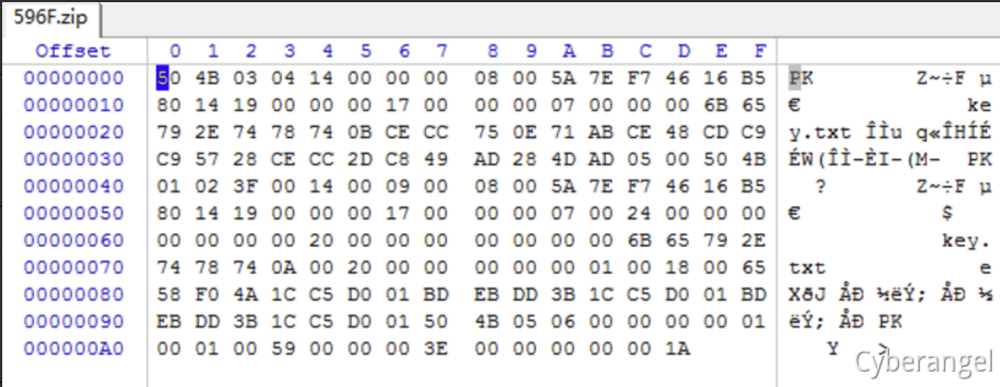


**a.压缩源文件数据区：**
50 4B 03 04：这是头文件标记（0x04034b50）
14 00：解压文件所需 pkware 版本
00 00：全局方式位标记（有无加密）
08 00：压缩方式
5A 7E：最后修改文件时间
F7 46：最后修改文件日期
16 B5 80 14：CRC-32校验（1480B516）
19 00 00 00：压缩后尺寸（25）
17 00 00 00：未压缩尺寸（23）
07 00：文件名长度
00 00：扩展记录长度
6B65792E7478740BCECC750E71ABCE48CDC9C95728CECC2DC849AD284DAD0500
**b.压缩源文件目录区:**
50 4B 01 02：目录中文件文件头标记(0x02014b50)
3F 00：压缩使用的 pkware 版本
14 00：解压文件所需 pkware 版本
00 00：全局方式位标记（有无加密，这个更改这里进行伪加密，改为09 00打开就会提示有密码了） 
08 00：压缩方式
5A 7E：最后修改文件时间
F7 46：最后修改文件日期
16 B5 80 14：CRC-32校验（1480B516）
19 00 00 00：压缩后尺寸（25）
17 00 00 00：未压缩尺寸（23）
07 00：文件名长度
24 00：扩展字段长度
00 00：文件注释长度
00 00：磁盘开始号
00 00：内部文件属性
20 00 00 00：外部文件属性
00 00 00 00：局部头部偏移量
6B65792E7478740A00200000000000010018006558F04A1CC5D001BDEBDD3B1CC5D001BDEBDD3B1CC5D001
**c.压缩源文件目录结束标志:**
50 4B 05 06：目录结束标记
00 00：当前磁盘编号
00 00：目录区开始磁盘编号
01 00：本磁盘上纪录总数
01 00：目录区中纪录总数
59 00 00 00：目录区尺寸大小
3E 00 00 00：目录区对第一张磁盘的偏移量
00 00 1A：ZIP 文件注释长度
将09改为00，再打开txt即可

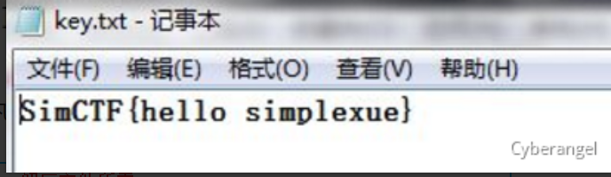

zip伪加密在kali下执行binwalk -e命令即可分离出文件（当然，也可以尝试winrar的压缩包修复功能）

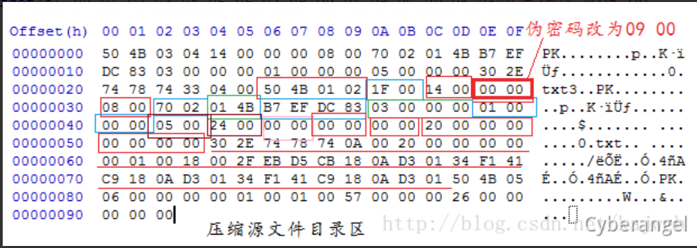

**我们还可以使用：zipcenop.jar**
**使用检测伪加密的ZipCenOp.jar，解密后如果能成功打开zip包，则是伪加密，否则说明思路错误**
**ZipCenOp.jar的**[下载](https://files.cnblogs.com/files/ECJTUACM-873284962/ZipCenOp.zip)**链接即可~**
下面举个例子，如下是个被加密的文件，理由很简单，文件夹后面跟了一个*~
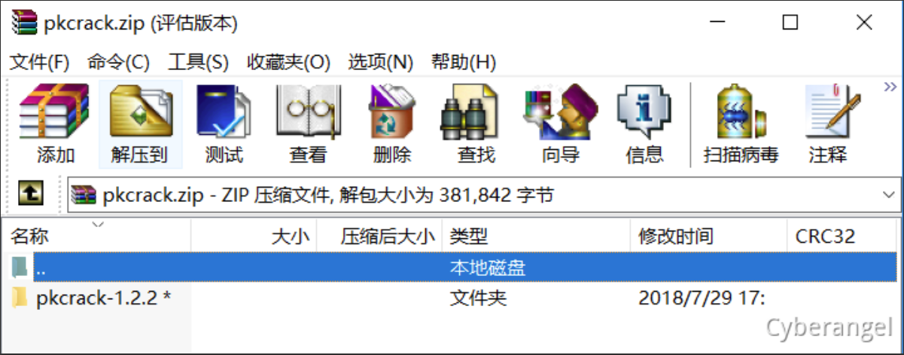
使用ZipCenOp.jar(需java环境)使用方法：
java -jar ZipCenOp.jar r xxx.zip
我们对其使用如上命令进行解包，得下图所示：
我们再看下这个文件：

发现文件夹后面跟的*消失了，说明这个文件就是伪加密文件~
当然啦，我们也可以对Zip文件进行伪加密
java -jar ZipCenOp.jar e xxx.zip


## **4、CRC32碰撞**

**简介**：CRC32:CRC本身是“冗余校验码”的意思，CRC32则表示会产生一个32bit（8位十六进制数）的校验值。
在产生CRC32时，源数据块的每一位都参与了运算，因此即使数据块中只有一位发生改变也会得到不同的CRC32值，利用这个原理我们可以直接爆破出加密文件的内容~
**代表题目：CTF论剑场-小明的文件**
**writeup:**[CTF论剑场-你能找到flag吗？（压缩包的花式攻击）](https://www.yuque.com/cyberangel/crckt8/cd3wwq)[CTF论剑场-小明的文件（CRC32碰撞）](https://www.yuque.com/cyberangel/crckt8/bi5uix)

**备注：**只适用于小文件（KB）
**讲解：**
具体算法实现参考百度百科：https://baike.baidu.com/item/CRC32/7460858?fr=aladdin
我们看个CRC32碰撞的例子：
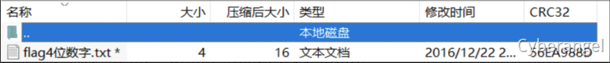
flag是4位数，且CRC32值为56EA988D，我们可以写出如下脚本：

```python
#coding=utf=8
import binascii
real = 0x56EA988D
for y in range(1000,9999):
if real == (binascii.crc32(str(y)) & 0xffffffff):
print(y)
print('End')
```

在 Python 2.x 的版本中，binascii.crc32 所计算出來的 CRC 值域为[-2^31, 2^31-1] 之间的有符号整数，为了要与一般CRC 结果作比对，需要将其转为无符号整数，所以加上& 0xffffffff来进行转换。如果是 Python 3.x 的版本，其计算结果为 [0, 2^32-1] 间的无符号整数，因此不需额外加上& 0xffffffff 。
脚本的运行结果如下，即为压缩文件的内容：

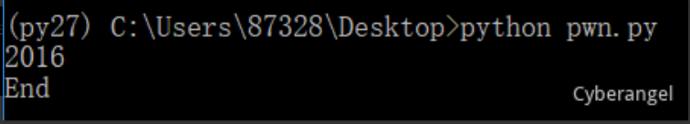

## **5、RAR文件隐藏**

[Bugku-隐写-一个普通的压缩包（rar压缩png结构后的png结构）](https://www.yuque.com/cyberangel/crckt8/fdibbx)**（注意注意待整理）**

[攻防世界-SimpleRAR（rar压缩png结构后的png结构）](https://www.yuque.com/cyberangel/crckt8/abvk4e)**（注意注意待整理）**

## **6、zip爆破**

**简介**：顾名思义，就是逐个尝试选定集合中可以组成的所有密码，直到遇到正确密码
**代表题目：攻防世界-János-the-Ripper**
**writeup:**[攻防世界-János-the-Ripper（zip爆破）](https://www.yuque.com/cyberangel/crckt8/cf2wgs)

**备注：**耗时长
**讲解：**
顾名思义，就是逐个尝试选定集合中可以组成的所有密码，直到遇到正确密码。而字典攻击的效率比爆破稍高，因为字典中存储了常用的密码，因此就避免了爆破时把时间浪费在脸滚键盘类的密码上。如果已知密码的某几位，如已知6位密码的第3位是a，那么可以构造 ??a??? 进行掩码攻击，使用方法详见掩码攻击篇
对这一类的zip问题，Windows下使用的是ARCHPR：

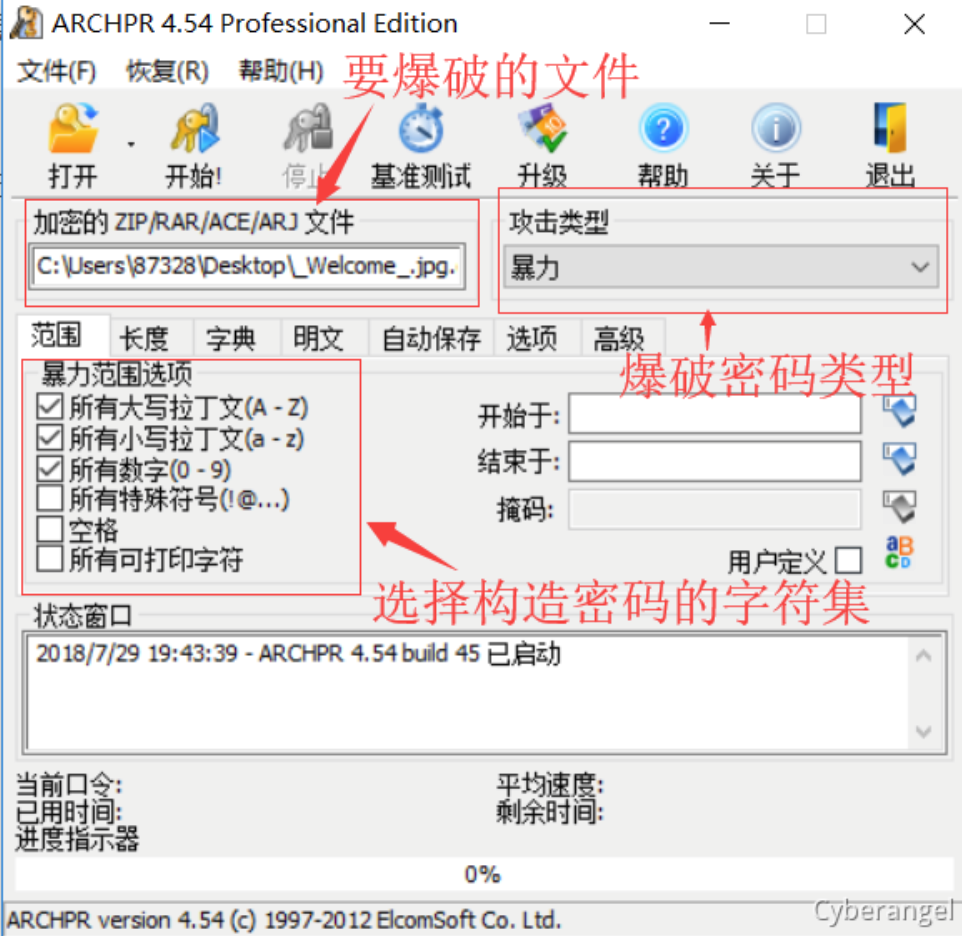

点击开始，进行爆破即可~示例如下，仅仅花了4s的时间爆破出密码是MIT
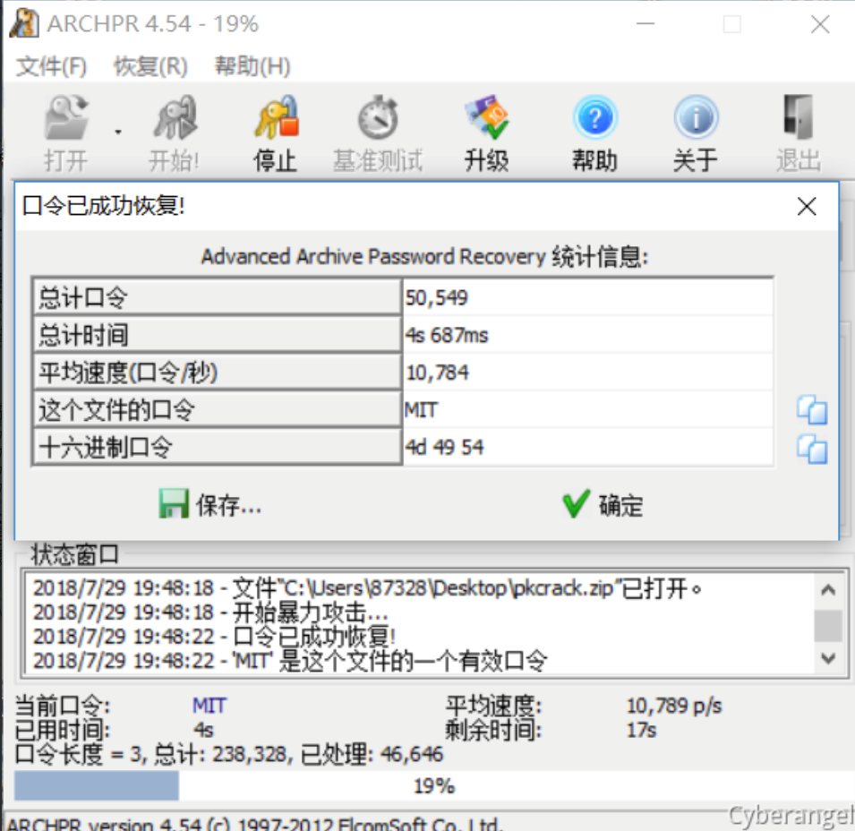

# **五、PDF篇**

## **①图片遮盖flag**

**简介**：最简单的方式，不常见，但容易忽视
**代表题目**：**CTF论剑场-eazyzip、CTF论剑场-小明的文件**
**writeup:**[CTF论剑场-eazyzip（PDF-图片遮盖flag）](https://www.yuque.com/cyberangel/crckt8/vlyb52)[CTF论剑场-小明的文件（CRC32碰撞）](https://www.yuque.com/cyberangel/crckt8/bi5uix)

**备注：**

## **②PDF的foremost**

**简介：**不常见，但很坑人
**代表题目：攻防世界-小小的PDF**
**writeup：**[攻防世界-小小的PDF（PDF的foremost）](https://www.yuque.com/cyberangel/crckt8/rl9o6g)

**备注：**

## **③利用类似水印的将flag隐藏**

**简介：**不常见，但很坑人
**代表题目：攻防世界-stegano**
**writeup：**[攻防世界-stegano（！全新的PDF隐写方式！+PDF隐写总结）](https://www.yuque.com/cyberangel/crckt8/bilx9r)

**备注：**


# **六、Game篇**

## 1、CE（Cheat Engine）

**简介**：CE修改器(Cheat Engine)是一款内存修改编辑工具,CE修改器它允许你修改你的游戏,所以你将总是赢.它包括16进制编辑,反汇编程序,内存查找工具.CE修改器与同类修改工具相比,它具有强大的反汇编功能,且自身附带了修改器制作工具,可以用它直接生成修改器。（来自百度百科）
**代表题目**：**CTF论剑场-snack**
**writeup：**[CTF论剑场-snack（CE）](https://www.yuque.com/cyberangel/crckt8/cil3uh)

**备注：不太常用到的工具**

# **七、Word篇**

## **①爆破密码**

**使用工具**：Advanced Office Password Recovery
**代表题目**：**CTF论剑场-eazydoc**[CTF论剑场-eazydoc（docx密码爆破、文本倒序输出）](https://www.yuque.com/cyberangel/crckt8/gfusxf)

**备注**：工具是个好东西

## **②Word XML隐写**

**简介**：十分隐蔽
**使用工具**：（压缩包）解压程序
**代表题目**：[2020HGame-Week2-地球上最后的夜晚（wbStego、Word XML隐写）](https://www.yuque.com/cyberangel/crckt8/smvg02)

**备注**：无

# **八、音频篇**

## **1、mp3stego**

**简介：**常用的文件隐写工具
**代表题目：Bugku-旋转跳跃**
**writeup：**[Bugku-旋转跳跃（mp3stego）](https://www.yuque.com/cyberangel/crckt8/tpxz7m)

**备注：**常用命令：Decode.exe -X -P mp3密码 mp3文件名称

## **2、Audacity**

**简介：**音乐编辑器，但常被用来解Misc音频题
**代表题目：Bugku-听首音乐**
**writeup：**[Bugku-听首音乐（Audacity）](https://www.yuque.com/cyberangel/crckt8/gz6i6u)

**备注：**在解题时注意各个可视化图，或许有flag

## **3、音频倒放（wav）**

```python
from pydub import AudioSegment
from pydub.playback import play
# 读取想要倒放的音频文件
song = AudioSegment.from_wav("flag.wav")
# 将音频倒放赋给变量 backwards
backwards = song.reverse()
# 将倒放的音频存为 "倒放.wav" 文件
backwards.export("倒放.wav",format="wav")
```

## **4、SilentEye（wav）**

**备注：**请参考工具篇->SilentEye

# **九、文件系统篇**

## **1、EXT3：第三代扩展文件系统**

**简介：**EXT3是第三代扩展文件系统（Third extended filesystem，缩写为ext3），是一个日志文件系统，常用于Linux操作系统。它是很多Linux发行版的默认文件系统。
**代表题目：攻防世界-ext3**
**writeup：**[攻防世界-ext3（EXT3：第三代扩展文件系统）](https://www.yuque.com/cyberangel/crckt8/ynmhhr)

**备注：无**

## **2、EXT2：第二代扩展文件系统**

**简介：**略
**代表题目：攻防世界-Get-the-key.txt**
**writeup：**[攻防世界-Get-the-key.txt（ext2、grep -r批量搜索文件名）](https://www.yuque.com/cyberangel/crckt8/aa25b4)

**备注：**性质同第三代扩展文件系统一样

## **3、NTFS流隐写**

**简介：**不太常见的隐写方式，其利用了NTFS文件系统的特性
**代表题目：2020年春秋杯新春战“疫”网络安全公益赛-套娃（TQL）**
**writeup：**2020年春秋杯新春战“疫”网络安全公益赛-套娃（TQL）
**备注：无**

# **十、逆向篇**

## **1、Java逆向-jd-gui**

**简介：**不太常见，一般是送分的题目
**代表题目：攻防世界-坚持60s**
**writeup：**[攻防世界-坚持60s（Java反编译）](https://www.yuque.com/cyberangel/crckt8/ic16gr)

**备注：无**

## **2、pyc反编译**

**简介：**比较常见
**代表题目：攻防世界-Py-Py-Py、攻防世界-适合作为桌面**
**writeup：**[？？攻防世界-Py-Py-Py（pyc反编译）](https://www.yuque.com/cyberangel/crckt8/ykq17q)、[攻防世界-适合作为桌面（QR_Research）](https://www.yuque.com/cyberangel/crckt8/ig5fo1)

**解密网站：**：http://tool.lu/pyc/
**备注：**使用linux命令也可以反编译

## **3、linux核心转储文件.core**

**简介：**
**代表题目：攻防世界-hit-the-core**
**writeup：**[攻防世界-hit-the-core（linux核心转储文件.core）](https://www.yuque.com/cyberangel/crckt8/ntxfqk)

**备注：无**

# **十一、视频篇：**

## **1、mkv**

**简介：**不太常见
**代表题目：攻防世界-funny_video**
**writeup：**[攻防世界-funny_video（MKVToolNix、mkv视频隐写、音轨分离）](https://www.yuque.com/cyberangel/crckt8/fx70ky)

**备注：无**

## **2、SWF**

**简介：**不太常见，一般出现在送分的题目中
**代表题目：攻防世界-肥宅快乐题**
**writeup：**[攻防世界-肥宅快乐题（SWF帧浏览）](https://www.yuque.com/cyberangel/crckt8/bi2v3m)

**备注：无**

# **十二、进阶篇：**

## **①内存取证 USB流量分析**

**简介**：USB内存取证需要使用到工具volatility，该工具在2019版本的kali预装，无需额外配置
**代表题目：XCTF高校战“疫”网络安全分享赛-ez_mem&usb**
**writeup：**[XCTF高校战“疫”网络安全分享赛-ez_mem&usb（USB内存取证）](https://www.yuque.com/cyberangel/crckt8/xtdevq)

备注：使用方法如下（**引用自NYSEC知识库**）

### **内存取证**

**内存取证工具volatility 的使用：**


 volatility -f <文件名> --profile=<配置文件> <插件> [插件参数]  

```python
使用imageinfo插件来猜测dump文件的profile值：WinXPSP2x86

root@kali:# volatility -f mem.vmem imageinfo

grep是用来搜索特定的字符串，bgrep是用来搜索非文本数据模式和hexdump

volatility –info    用于查看volatility已经添加的profile和插件信息

Volatility -f file.raw imageinfo     判断当前镜像信息，或kdbgscan，仅适合windows内存镜像
```

常见插件：

```python
Volatility -f file.raw –profile=WinXPSP2x86 notepad      查看当前展示的notepad文本

Volatility -f file.raw –profile=WinXPSP2x86 pslist    列出运行的进程，如果Exit所在的一列显示了日期时间，则表明该进程已经结束了

Hivelist   列出缓存在内存中的注册表

Filescan  扫描内存中的文件

Dumpfiles      将内存中的缓存文件导出

Volatility -f file.raw –profile=WinXPSP2x86 Memdump -p 进程号 -D ./（导出目录）       将某个进程信息导出/根据pid dump出指定进程

Foremost 2888.dmp    分析dump出的内存文件

Svcscan  扫描windows的服务

Connscan 查看网络连接

Cmdscan 查看命令行上的操作
```

### **取证方法建议**

收集数据的顺序很重要。必须首先收集易消失的数据。易失性数据是系统关闭时可能丢失的任何数据，例如连接到仍然在RAM中注册的网站。必须将先从最不稳定的证据中开始收集数据：


```python
（1）缓存

（2）路由表，进程表，内存

（3）临时系统文件

（4）硬盘

（5）远程日志，监控数据

（6）物理网络配置，网络拓扑

（7）媒体文件（CD，DVD）
```

### **常见payload：**

```python
1.查看系统信息
volatility -f mem.raw imageinfo
在Suggested Profiles中找到操作系统的信息

2.查看运行程序列表
volatility -f mem.raw --profile=Win7SP1x64 pslist

部分常见进程分析：
wscntfy.exe，Windows系统关键进程，负责检查计算机的安全状态，包括防火墙、病毒防护软件、自动更新三个安全要素，如果这些服务状态不正常，系统就会在状态栏进行告警提示。这个进程也可能会被病毒软件和黑客程序伪装
ctfmon.exe，Microsoft Office产品套装的一部分，是有关输入法的一个可执行程序。它可以选择用户文字输入程序，和微软Office XP语言条。这不是纯粹的系统程序，但是如果终止它，可能会导致不可知的问题。另外，ctfmon.exe可能被感染上木马而成为病毒程序
wordpad.exe，是微软Microsoft Windows自带的免费字处理工具。
Conime.exe，输入法编辑器
Cmd.exe，windows系统的命令行程序
3.查看文件
volatility -f mem.raw --profile=Win7SP1x64 filescan
4.用grep命令过滤
volatility -f mem.raw --profile=Win7SP1x64 filescan |grep txt
5.提取文件
volatility -f mem.raw --profile=Win7SP1x64 dumpfiles -Q 0x000000001e7c3420 -D aaa
6.看cmd下执行的文件
volatility -f mem.raw --profile=Win7SP1x64 cmdscan
7.分离出cmd下执行的某个文件
volatility -f mem.raw --profile=Win7SP1x64 memdump -p 2884 -D aaa
-p是进程号，flag的文件在进程号为2884，分离出的文件为流量包
8.提取账户密码
volatility -f mem.raw --profile=Win7SP0x64 hashpump
9.查看网络连接
volatility -f mem.raw --profile=Win7SP1x64 netscan
10.查看已经建立的网络连接
volatility -f mem.raw --profile=Win7SP1x64 netscan|grep ESTABLISHED
常见解题思路：
主要找到键盘数据文件
1.根据payload查看信息，再直接利用foremost分离，将提取的信息结合分离出usb键盘数据文件
2.结合payload1-3\6,再利用binwalk -e 提取文件，再利用```Tshark -r 命令查看键盘数据，利用tshark -T fields -e usb.capdata >file.path.name` 输出存为文件，即为键盘数据文件
```

### **USB通杀EXP**

```python
'''
USB流量分析
    keyboard scan code转为键盘字符
参数：
    导出的usb流量信息
'''
import sys
import os
 
 
usb_codes = {
   0x04:"aA", 0x05:"bB", 0x06:"cC", 0x07:"dD", 0x08:"eE", 0x09:"fF",
   0x0A:"gG", 0x0B:"hH", 0x0C:"iI", 0x0D:"jJ", 0x0E:"kK", 0x0F:"lL",
   0x10:"mM", 0x11:"nN", 0x12:"oO", 0x13:"pP", 0x14:"qQ", 0x15:"rR",
   0x16:"sS", 0x17:"tT", 0x18:"uU", 0x19:"vV", 0x1A:"wW", 0x1B:"xX",
   0x1C:"yY", 0x1D:"zZ", 0x1E:"1!", 0x1F:"2@", 0x20:"3#", 0x21:"4$",
   0x22:"5%", 0x23:"6^", 0x24:"7&", 0x25:"8*", 0x26:"9(", 0x27:"0)",
   0x2C:"  ", 0x2D:"-_", 0x2E:"=+", 0x2F:"[{", 0x30:"]}",  0x32:"#~",
   0x33:";:", 0x34:"'\"",  0x36:",<",  0x37:".>", 0x4f:">", 0x50:"<"
   }
 
def code2chr(filepath):
    lines = []
    pos = 0
    for x in open(filepath,"r").readlines():
        code = int(x[6:8],16)   # 即第三个字节
        if code == 0:
            continue
        # newline or down arrow - move down
        if code == 0x51 or code == 0x28:
            pos += 1
            continue
        # up arrow - move up
        if code == 0x52:
            pos -= 1
            continue
 
        # select the character based on the Shift key
        while len(lines) <= pos:
            lines.append("")
        if code in range(4,81):
            if int(x[0:2],16) == 2:
                lines[pos] += usb_codes[code][1]
            else:
                lines[pos] += usb_codes[code][0]
        
    for x in lines:
        print(x)
 
 
if __name__ == "__main__":
    # check argv
    if len(sys.argv) != 2:
        print("Usage:\n\tpython keyboardScanCode.py datafile.txt\nhow to get datafile:\t tshark -r file.usb.pcapng -T fields -e usb.capdata > datafile.txt")
        exit(1)
    else:
        filepath = sys.argv[1]
        code2chr(filepath)
```

## **②磁盘取证**

**简介：**比较难的Misc题目
**代表题目：2020年春秋杯新春战“疫”网络安全公益赛-磁盘套娃**
**writeup：**[2020年春秋杯新春战“疫”网络安全公益赛-磁盘套娃（磁盘取证）](https://www.yuque.com/cyberangel/crckt8/gcffby)

**备注：**由于知识点太多就不在多说了，上面的writeup已经包含了教程，感兴趣的可以看看

