#                          

#### 删库跑路

> 某星星在离职前给公司服务器来了一记rm -rf /*，真实演绎了什么叫"删库跑路"，老板把恢复数据的希望寄托在刚刚入职的你身上。你能帮助公司恢复出硬盘里的重要数据吗
> Hint1：通常来说删除文件只是把磁盘上对应的空间标记为未使用状态，数据本身还是存在于原本的位置
> Hint2：有一款强大的工具可以识别或提取常见二进制文件内的数据

下载到一个 `vm-106-disk-1.qcow2`，QEMU 虚拟机的磁盘文件，用十六进制编辑器打开全是 `00`

[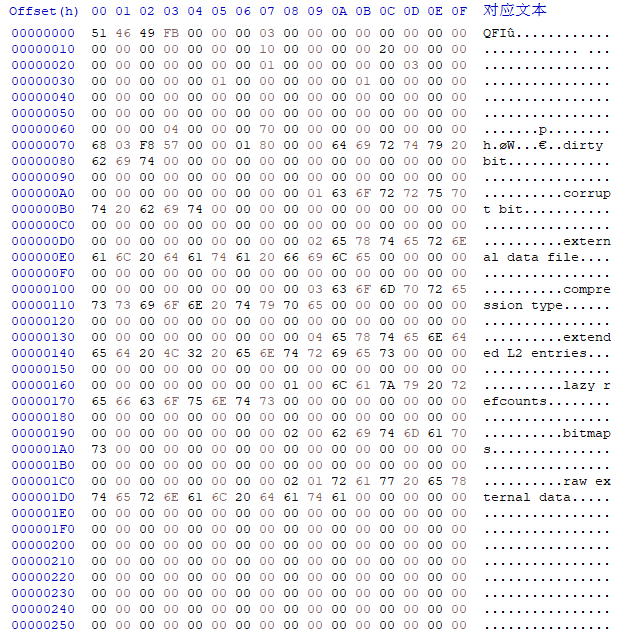](https://s2.loli.net/2022/12/01/v1tEDRBozKk8fWG.png)

用 binwalk 分解

[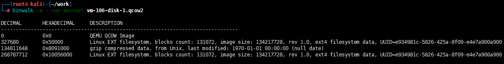](https://s2.loli.net/2022/12/01/W3lFR6xAVvBJThG.png)

两个 EXT 分区文件都是空的，还有一个压缩包，用 7-Zip 打开，发现 flag.txt

[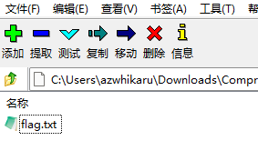](https://s2.loli.net/2022/12/01/hRSix6bwes3ECAr.png)

#### 凯撒大帝在培根里藏了什么[#](https://www.cnblogs.com/azwhikaru/p/16943709.html#凯撒大帝在培根里藏了什么)

> 究极简单题（认真
>
> 格式为flag

得到一串字符串

```none
ABBABAABBAAAAABABABAABABBAAAAABAABBAAABAABBBABBAABABBABABAAABABBBAABAABABABBBAABBABAA
```

先用培根密码解密，得到

[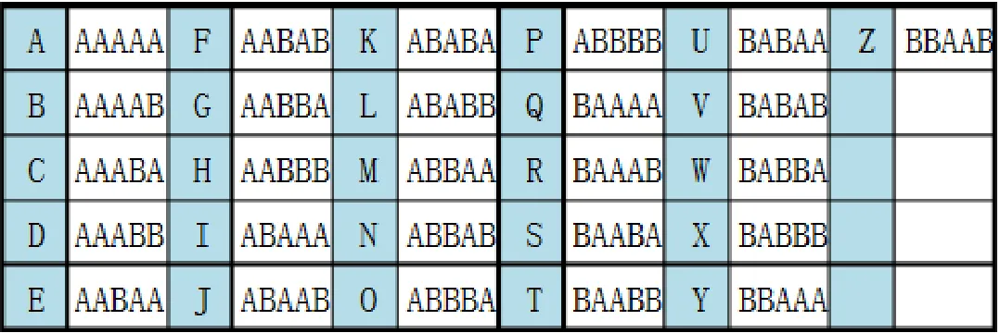](https://s2.loli.net/2022/12/01/a1BtPeNijxJlImY.png)

```none
NGBKLATCOZNIXEVZU
```

再用凯撒密码解密，试到偏移 6 的时候出现

```none
HAVEFUNWITHCRYPTO
```

#### 简单的base编码[#](https://www.cnblogs.com/azwhikaru/p/16943709.html#简单的base编码)

> 你懂base编码吗？

下载到很长一串编码，先用 BASE64 一直解码，直到解出 BASE92 编码，再解码 BASE92 即得 flag

```
Base64 -> Base64 -> Base64 -> Base64 -> Base64  -> Base64 -> Base64 -> Base64 -> Base64 -> Base64 ->  Base64 -> Base64 -> Base64 -> Base64 -> Base64 -> Base64  -> Base64 -> Base64 -> Base64 -> Base64 -> Base92
```

#### 来自银河的信号[#](https://www.cnblogs.com/azwhikaru/p/16943709.html#来自银河的信号)

> alien把秘密藏在了这段音频中。

[SSTV](https://baike.baidu.com/item/慢扫描电视/4229071?fromtitle=sstv&fromid=9387312&fr=aladdin)，用 MMSSTV 软件接收，得到图片

[](https://s2.loli.net/2022/12/01/zsfxvbNhPD6Bl4G.jpg)

f7liavga{[1M_0105n_cC@okmei_nFge](https://blog.csdn.net/qq_62046273/article/details/1M_0105n_cC@okmei_nFge)!s}，用栅栏密码解密，栏目数 2，得到 flag{M00nc@ke_Fes7iva1_15_Coming!} [参考](https://blog.csdn.net/qq_53105813/article/details/127201728)

#### stge没有py[#](https://www.cnblogs.com/azwhikaru/p/16943709.html#stge没有py)

挖坑待填

#### 时间刺客！[#](https://www.cnblogs.com/azwhikaru/p/16943709.html#时间刺客)

挖坑待填

#### 看雪看雪看雪[#](https://www.cnblogs.com/azwhikaru/p/16943709.html#看雪看雪看雪)

> 还记得仙三的长卿和紫萱吗？他们最后没有在一起，但是看了同一场雪

下载到一个压缩包，用 WinRAR 之类的软件解压会报错，并且看不见隐藏的文件，需要用 7-Zip 打开

[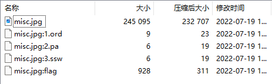](https://s2.loli.net/2022/12/02/rTQ3xpHbj4GFLaJ.png)

把 misc.jpg:flag 里的内容全选复制出来，新建 flag.txt 并粘贴。用 [SNOW 隐写工具](https://www.darkside.com.au/snow/) 解密 flag.txt，密码依次是 pa、ssw、ord 里的内容 `他朝若是同淋雪`

#### 流量分析2[#](https://www.cnblogs.com/azwhikaru/p/16943709.html#流量分析2)

挖坑待填

#### nice_bgm[#](https://www.cnblogs.com/azwhikaru/p/16943709.html#nice_bgm)

挖坑待填

#### fakezip[#](https://www.cnblogs.com/azwhikaru/p/16943709.html#fakezip)

> 无描述

ZIP 伪加密，用 binwalk 可以无视

#### Check[#](https://www.cnblogs.com/azwhikaru/p/16943709.html#check)

> 套娃？

[LSB 隐写](https://zhuanlan.zhihu.com/p/461716971)，Stegsolve，得到一串 HTML 编码，解码得到 flag

[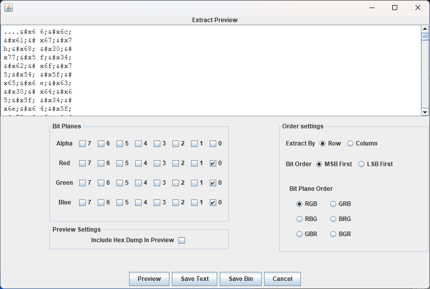](https://s2.loli.net/2022/12/01/sOeqpwWFyUuVQoS.png)

#### Wire1[#](https://www.cnblogs.com/azwhikaru/p/16943709.html#wire1)

挖坑待填

#### Encode[#](https://www.cnblogs.com/azwhikaru/p/16943709.html#encode)

> 套娃？

先把乱码 TXT 转为 ANSI 编码，得到

```none
4O595954494Q32515046324757595N534R52415653334357474R4N575955544R4O5N4Q46434S4O59474253464Q5N444R4Q51334557524O5N4S424944473542554O595N44534O324R49565746515532464O49345649564O464R4R494543504N35
```

丢进 Ciphey 解密

[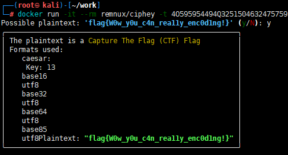](https://s2.loli.net/2022/12/01/gGlKCvf4QaVduPk.png)

#### 1-misc[#](https://www.cnblogs.com/azwhikaru/p/16943709.html#1-misc)

> 无描述

下载到一个压缩包，注释 `偷偷告诉你，密码是出题人生日`。用 ARCHPR 爆破，得到密码 `20001228`。将 fakeflag.jpg 解压后单独压缩，明文攻击 `2.zip`。最后得到 `3.zip`，注释没有密码 (伪加密)，binwalk 无视伪加密解压

#### 碎纸机11[#](https://www.cnblogs.com/azwhikaru/p/16943709.html#碎纸机11)

> 我们从碎纸机里抢救回来了某个关键图片资料，你能帮我们修复它吗？

下载到一堆被切割的图片，按时间升序拼接成完整的二维码，然后用 [Barcode Reader](https://online-barcode-reader.inliteresearch.com/) 扫码获得 flag

[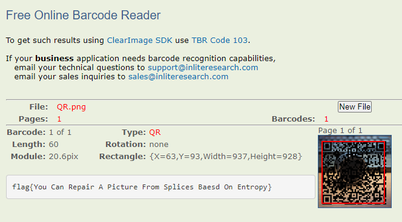](https://s2.loli.net/2022/12/02/MSZ789TeWgfyjmY.png)

#### Let_god_knows[#](https://www.cnblogs.com/azwhikaru/p/16943709.html#let_god_knows)

> 让苍天知道，你不认输？

保存 Red plane 0 通道，放大如下位置得到二维码，扫码即得 flag

[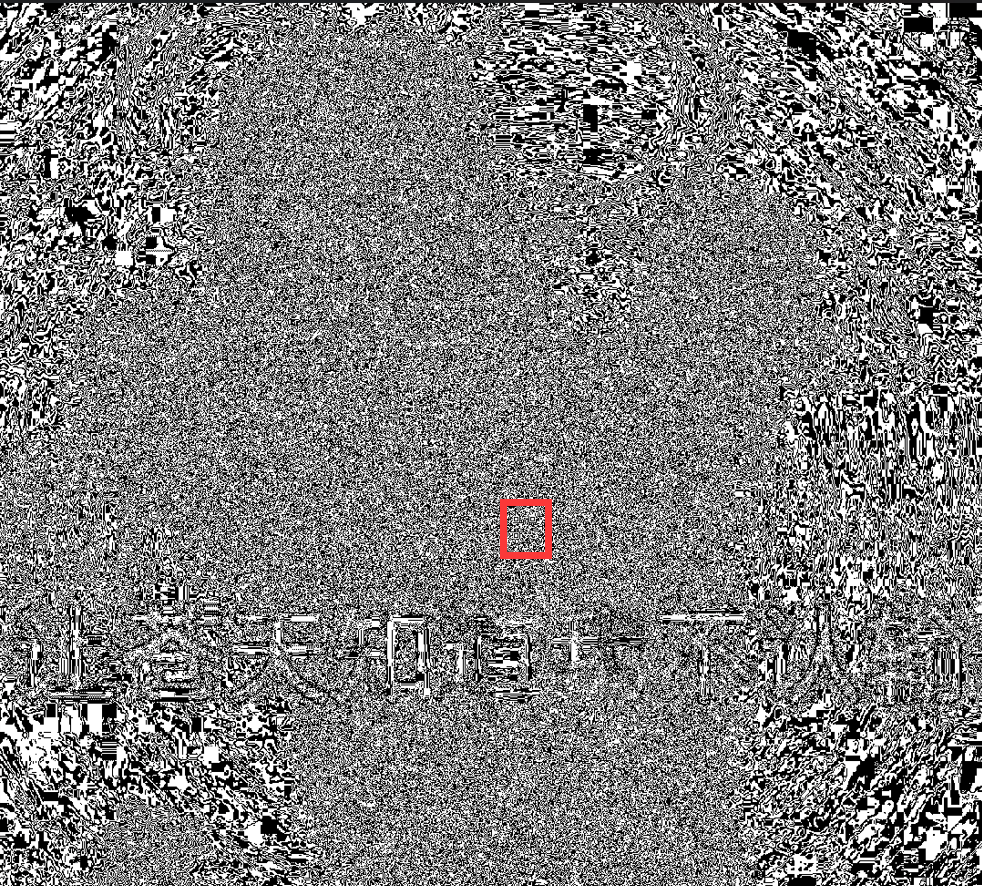](https://s2.loli.net/2022/12/02/bmtJujynGx3DZhS.png)

#### misc2-1[#](https://www.cnblogs.com/azwhikaru/p/16943709.html#misc2-1)

挖坑待填

#### pcap1[#](https://www.cnblogs.com/azwhikaru/p/16943709.html#pcap1)

挖坑待填

#### running[#](https://www.cnblogs.com/azwhikaru/p/16943709.html#running)

挖坑待填

#### 流量分析1[#](https://www.cnblogs.com/azwhikaru/p/16943709.html#流量分析1)

> 流量分析，你知道这堆流量做了什么事情吗，你能恢复出来flag吗？

用 Wireshark 打开抓包数据，过滤 Destination 和 Source 之后发现流量是客户端在对服务器进行 SQL 注入，客户端提交的数据格式

```sql
id=1) and if((ascii(substr((select flag from flag),2,1))='XXXX'),sleep(3),0) -- 
```

通过 sleep 语句看出是在进行 [SQL 延时注入](https://blog.csdn.net/weixin_38237216/article/details/124109892)。在 **SQL 盲注** 中，因为执行 SQL 语句后，信息并不能返回到前端页面，无法得到报错信息，因此需要特殊的延时函数。当发生错误时，程序会很快返回，而正常执行的时间比较长，对比服务器响应时间可以判断是否注入成功。因此过滤响应时间为 3 秒

```none
http and frame.time_delta > 3
```

[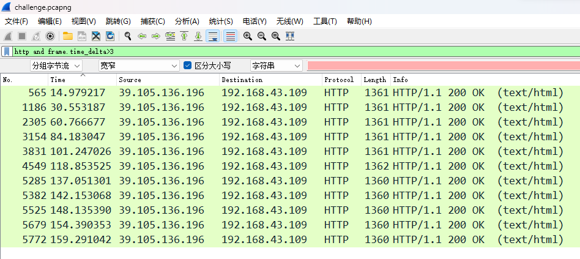](https://s2.loli.net/2022/12/01/xeuSOt4k76oYA9J.png)

按顺序排列过滤到的信息，逐个将 `XXXX` 部分的 ASCII 码转为字母即得到 flag

[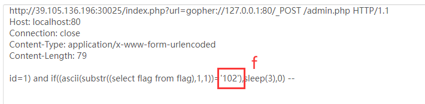](https://s2.loli.net/2022/12/01/pjyeRQlPksEwAX1.png)

#### 津门杯2021-m1[#](https://www.cnblogs.com/azwhikaru/p/16943709.html#津门杯2021-m1)

> 津门杯2021-m1

LSB 隐写，BASE 64

[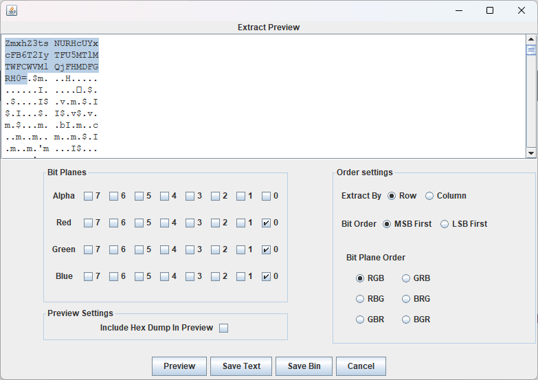](https://s2.loli.net/2022/12/02/7BKQoS2MX1ysvez.png)

## easycap

1.附件是一个数据包，这里用Wireshark分析一下,统计会话然后发现一个TCP包，追踪一下流，发现了flag。

```
FLAG:385b87afc8671dee07550290d16a8071
```

[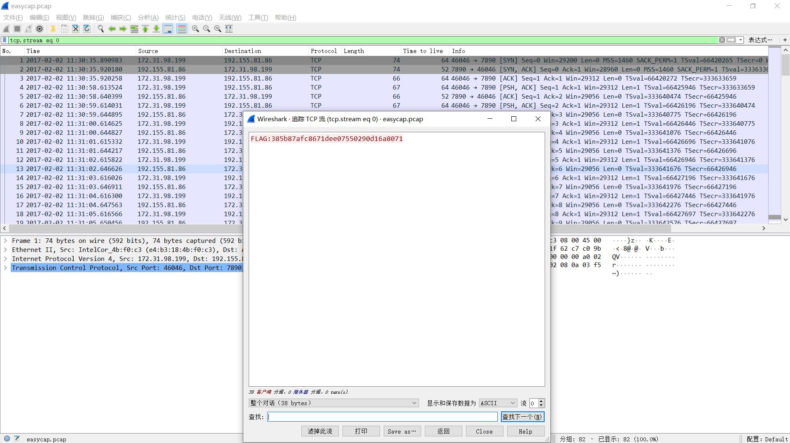](https://i.loli.net/2019/11/24/QRjJ4GuqFly3mcg.png)

## Avatar

​    1.附件是一张照片，用Stegsolve分析一下没有发现什么有用的信息。

​    2.尝试用binwalk分析一下文件是否隐含了其他文件，但是并没有，只是一张图     片。

​    3.然后想到了outguess这个工具，然后试试能否提取出照片中隐含的信息。

[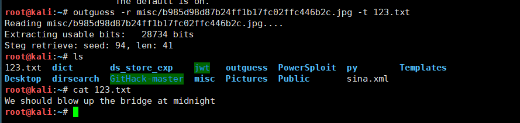](https://i.loli.net/2019/11/24/glDt9Rzia6jc31d.png)

​    这里确实确实存在隐藏的信息，并且提取出来了，得到了flag。

​    `We should blow up the bridge at midnight`

​    outguess是一款隐写工具，安装过程如下

```
  
git clone https://github.com/crorvick/outguess 
./configure && make && make install
```

## What-is-this

​    1.附件是一个gz压缩包，解压出来发现有一个未知文件。

​    2.用file命令读取文件信息，发现是tar文件。

[](https://i.loli.net/2019/11/24/UjGP52Q9eC8Vays.png)

​    3.这里用tar命令解压一下：

​        `tar –xvf file.tar` 

​                                                        [](https://i.loli.net/2019/11/24/7ka5SRXcyHQAGlg.png)    

4.获得两张图片，这里使用Stegsolve合并一下：

[](https://i.loli.net/2019/11/24/qShQpNTKROX16gc.png)

可以得到flag为 `AZADI TOWER`.

## embarrass

​    1.附件是个压缩包，解压发现是一个260M的数据包。

​    2.这里同样使用Wireshark，追踪TCP流，发现很多东西。

​    [](https://i.loli.net/2019/11/24/6ep1Cro84ahDvmi.png)

​    3.有个48M的流量包，追踪一下，直接搜索关键字flag，

[](https://i.loli.net/2019/11/24/4TK7IVE9qkoswBe.png)

​    4.虽然这道题的数据包很大，但是其实很多数据都是干扰的，不要被吓到，其实很简单的一道题目。

​            `flag{Good_b0y_W3ll_Done}`

## 肥宅快乐题

​    1.根据题目提示，发现是一个Flash游戏，并且要注意与NPC的对话，

​    2.我们只看有NPC对话的部分，发现在57帧的时候，有一串奇怪的字符串

[](https://i.loli.net/2019/11/24/WuoO3CPJlZDrYAL.png)

​            `U1lDe0YzaVpoYWlfa3U0aWxlx1QxMTF9`

​    3.用base64解码即可得到flag。

​        `SYC{F3iZhai_ku4ileǔ111}`

## Get-the-key.txt

​    1.附件是压缩包，解压可得到forensic100。

​    2.这里用binwalk分析下forensic100，发现存在240个压缩包，然后把它们分离出来。

​    3.然后发现有一个key.txt，打开

[](https://i.loli.net/2019/11/24/GrhxDukicPUtwbL.png)

发现有很多条，尝试用第一条，发现竟然可以。

```
SECCON{@]NL7n+-s75FrET]vU=7Z}
```

## 签到题

1.`Z2dRQGdRMWZxaDBvaHRqcHRfc3d7Z2ZoZ3MjfQ==` 题目是一串字符串。

2.先用base64解码，得到`ggQ@gQ1fqh0ohtjpt_sw{gfhgs# }`。

3，看起来像栅栏密码，用栅栏解一下，

```
ggQ@gQ1fqh0ohtjpt_sw{gfhgs# }
2栏：`
`gjgpQt@_gsQw1{fgqfhh0gosh#t}
4栏：`
`gfjggqpfQhth@0_ggossQhw#1t{}
7栏：`
`ggqht{ggQht_gsQ10jsf#@fopwh}
14栏：`
`gQg1q0hjts{fg#g@Qfhotp_wghs}
```

4.发现在7栏的时候，比较像flag格式，然后尝试用凯撒密码解码。

5.即可得到flag为`ssctf{ssCtf_seC10ver#@rabit}`

## 小小的PDF

​    1.附件是个pdf，用binwalk分析一下，发现存在三张照片和三个pdf文件。

​    2.尝试用binwalk分离一下，发现并不能分离出图片来。

​    3.然后用foremost分离，可以提取三张图片。

​                                [](https://i.loli.net/2019/11/24/MPUhY9qvJsCwt7V.png)

4.打开其中含有flag的图片即可得到flag。

​        `SYC{so_so_so_easy}`

## Training-Stegano-1

1.这道题很简单，很小的一张图片，直接用010打开，发现一段文字

​        `Look what the hex-edit revealed: passwd:steganoI`

​        flag为：`steganoI`

## 10.Test-flag-please-ignore

1.附件是压缩包，解压之后得到misc10.

2.用file命令分析下misc10的文件格式

[](https://i.loli.net/2019/11/24/EADbWuyQVRo71Mh.png)

3.发现是文本格式，直接用文本编辑器打开

```
666c61677b68656c6c6f5f776f726c647d
```

4.这里应该是16进制的数，转为字符串

[](https://i.loli.net/2019/11/24/3h2A7WCnzqERTkU.png)

所以flag为：`flag{hello_world}`

## Excaliflag

​    1.直接用Steg对图片分析，可以得到flag。

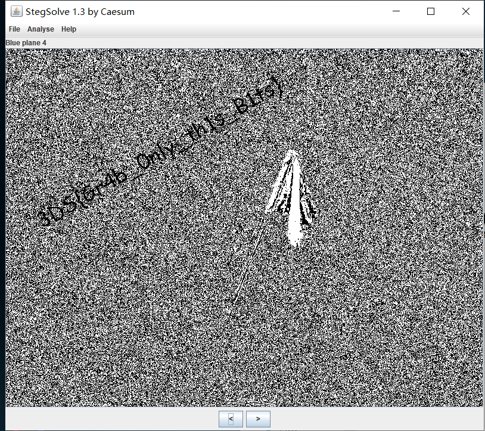](https://i.loli.net/2019/11/24/LvtWeVxAjfPpzuB.png)

​    2.也可以用[老外一个网站](https://29a.ch/photo-forensics/#forensic-magnifier)，错误分析就可以得到flag了。

[](https://i.loli.net/2019/11/24/9woeL5qhiGz7bXd.png)

​    flag为： `3DS{Gr4b_Only_th1s_B1ts}`

## glance-50

​    1.附近是2*600的动图，仔细看，会发现图中间有数字略过。

​    2.所以思路就是把gif分解为图片，并且拼装起来。

​    3.用python脚本分解(文件夹要先创建好)

```
  
from PIL import Image

savepath = "yumu\\"
path = '.\\'

im = Image.open('2.gif')
try:
    im.save(savepath+'2{:d}.png'.format(im.tell()))
    while True:
        im.seek(im.tell()+1)
        im.save(savepath+'2{:d}.png'.format(im.tell()))
except:
    pass
```

4.然后用合并起来就可以了

```
  
# coding:utf-8
from PIL import Image
path = "yumu\\"
save_path = '.\\'

im = Image.new('RGBA',(2*201,600))

imagefile = []
width = 0    
for i in range(201):
    imagefile.append(Image.open(path+'2'+str(i)+'.png'))

for image in imagefile:
    im.paste(image,(width,0,2+width,600))
    width = width +2
im.save(save_path+'yumu.png')
im.show()
```

5.自动打开图片

[](https://i.loli.net/2019/11/24/CoOD3qUxzsvnBhW.png)

得到flag为 `TWCTF{Bliss by Charles O'Rear}`

6.这里也可以直接在[网站](https://tu.sioe.cn/gj/fenjie/)上分解。

[](https://i.loli.net/2019/11/24/E6dDHZAmtsCRoiG.png)

同样可以得到flag，就是没有那么清晰而已。

## 4-2

​    1.附件是一个文本，打开发现一大段文字

```
Eg qnlyjtcnzydl z umaujejmjetg qeydsn eu z bsjdtx tw sgqtxegc al kdeqd mgeju tw yrzegjsoj zns nsyrzqsx kejd qeydsnjsoj`
`Ew ltm fgtk jds kzl tw sgqtxegc m kerr csj jds wrzc kdeqd eu qrzuueqzr-qeydsn_eu_gtj_usqmnejl_du
```

2.这里用了凯撒和base64都不行。

3.最后尝试去统计字母频率。

4.[在线统计字母频率](https://quipqiup.com/)

```
In cryptography a substitution cipher is a ?ethod of encoding  by which units of plaintext are replaced with ciphertext If you know the way of encoding u will get the flag which is  classical-cipher_is_not_security_hs
```

可以得到flag为  `classical-cipher_is_not_security_hs`

## misc1 ( DDCTF-2018 )

​    1.只有一串16进制的字符串：

 `d4e8e1f4a0f7e1f3a0e6e1f3f4a1a0d4e8e5a0e6ece1e7a0e9f3baa0c4c4c3d4c6fbb9e1e6b3e3b9e4b3b7b7e2b6b1e4b2b6b9e2b1b1b3b3b7e6b3b3b0e3b9b3b5e6fd` 

​    2.每两个一个字符的话，发现每个都超过了128。

​    3.然后尝试用每两位对应的十进制减去128，然后再转为字符串，发现可以得到    flag。

​    4.脚本：

```
  
import re
sss = 'd4e8e1f4a0f7e1f3a0e6e1f3f4a1a0d4e8e5a0e6ece1e7a0e9f3baa0c4c4c3d4c6fbb9e1e6b3e3b9e4b3b7b7e2b6b1e4b2b6b9e2b1b1b3b3b7e6b3b3b0e3b9b3b5e6fd'
nums = re.findall('\w{2}',sss)
#利用正则匹配每两个字符，并转为数组
flag = ''
for one in nums:
    ch = chr(int(one,16) - 128)
    flag += ch
print(flag)
#output
#That was fast! The flag is: DDCTF{9af3c9d377b61d269b11337f330c935f}
```

## hit-the-core ( alexctf-2017 )

​    1.附件是core文件，用gdb命令分析文件，发现并不可行。

​    2.binwalk分析一下，发现存在有共享和可执行的elf文件。

​    3.这里并不能提取出来，用readelf只能查看elf文件头信息，没有得到有用的信息。

​    4.然后搜了一下，发现Linux中存在strings命令。

​             `**strings命令**在对象文件或二进制文件中查找可打印的字符串。字符串是4个或更多可打印字符的任意序列，以换行符或空字符结束。 strings命令对识别随机对象文件很有用。` 

​    5.这里可以用strings命令读取文件，发现存在一个字符串很像flag格式。

​    [](https://i.loli.net/2019/11/24/K2SUpwJ7qlfZnNM.png)

​    `cvqAeqacLtqazEigwiXobxrCrtuiTzahfFreqc{bnjrKwgk83kgd43j85ePgb_e_rwqr7fvbmHjklo3tews_hmkogooyf0vbnk0ii87Drfgh_n kiwutfb0ghk9ro987k5tfb_hjiouo087ptfcv}`

​    6.仔细观察可以发现ALEXCTF这些大写字母，刚好是比赛的名称，发现其中的字符出现的很有规律，去掉        前三个，每五个字符的开头就是我们想要的字符。

​    7.这里直接写个python脚本提取出来就可以了：

```
  
string='cvqAeqacLtqazEigwiXobxrCrtuiTzahfFreqc{bnjrKwgk83kgd43j85ePgb_e_rwqr7fvbmHjklo3tews_hmkogooyf0vbnk0ii87Drfgh_n kiwutfb0ghk9ro987k5tfb_hjiouo087ptfcv}'
flag_tmp=string[3:]
flag=''
for i in range(len(flag_tmp)):
	if(i%5==0):
		flag=flag+flag_tmp[i]
print(flag)
#output:ALEXCTF{K33P_7H3_g00D_w0rk_up}
```

## Cephalopod

​        1.附件是一个数据包，用wireshark分析，发现有一张图片。

​        2.想直接用wireshark导出的图片的，发现只能导出HTTP协议的。

​        3.然后用binwalk分析一下啊，确实是存在PNG图片，可是并不能分离出来。

​        4.然后用了foremost提取一下，发现也不行。

​        5.去Google了一下流量包的提取方法，发现tcpxtract可以直接提取流量包里的图片。

​        6.直接用`tcpxtract -f` 命令提取

```
  
`root@kali:~# tcpxtract -f 66b7f39d97364ca5a2f928a4e61b46ee.pcap 
Found file of type "png" in session [10.0.2.7:49818 -> 10.0.2.10:36890], exporting to 00000000.png
Found file of type "png" in session [10.0.2.7:49818 -> 10.0.2.10:36890], exporting to 00000001.png`
```

​        7.打开图片就可以得到flag。

[](https://i.loli.net/2019/11/24/fXhTLMZol6EDy3G.png)

​        8.kali是没有自带tcpxtract的，所以要先安装，安装命令：

​             `apt-get install tcpxtract` 

## pure_color

​    1.附件是一张纯白色照片。

​    2.这里可以用stegsolve，蓝色通道为0是就可以得到flag了。

​    [](https://i.loli.net/2019/11/24/q59863kNxXDOtLC.png)

​    3.然后想起之前用的那个工具Forensically。

​    4.然后ELA分析一波，然后就简单地得到flag了。

[](https://i.loli.net/2019/11/24/wi3Vf7KHM4Eazv9.png)

```
flag:true_steganographers_doesnt_need_any_tools
```

​        这里简单介绍一下ELA： 全称Error Level Analysis，汉译为”错误级别分析”，简单来说就是能        把修改过的内容突出显示出来。[具体的介绍](https://github.com/qumuase/ELA)。  

## 2-1

​    1.附件是一张照片，用**010**打开，发现文件头错了。

​        `PNG文件8字节分别为 89 50 4e 47 0d 0a 1a 0a`

​        [](https://i.loli.net/2019/11/24/xpGdbDOXmIiLnHs.png)

​    2.并且这里图片宽度也有问题，可以用**CRC爆破**得到图片宽度。

```
  
import os
import binascii
import struct
misc = open("misc4.png","rb").read()
for i in range(1024):
    data = misc[12:16] + struct.pack('>i',i)+ misc[20:29]
    crc32 = binascii.crc32(data) & 0xffffffff
    if crc32 == 0x932f8a6b:
        print i
```

​        [](https://i.loli.net/2019/11/24/KxYElPBO4vAzwpI.png)

​    3.然后修改宽度就可以得到flag了。

​        [](https://i.loli.net/2019/11/24/MurXfxO9vc4IZ2T.png)

​        **flag**:`wdflag{Png_C2c_u_kn0W}`

## János-the-Ripper

1.附件是个压缩包，解压之后得到misc100。

2.用**010**分析发现是个压缩包，并且里面有flag.txt。

3.用**foremost**提取压缩包。

4.这里解压要密码，要破解一下，这里用ARCHPR，得到解压密码为`flish`。

[](https://i.loli.net/2019/11/24/fO5l6nu7Dod3XIe.png)

5.然后打开flag.txt

```
Flag: flag{ev3n::y0u::bru7us?!}
```

## 神奇的Modbus

​    1.附件是流量包，用wireshark打开，题目是Modbus。

​    [](https://i.loli.net/2019/11/24/7z9iGcYpHNOWDJm.png)

​    2.所以flag应该在modbus协议这个数据包中，追踪一下这个包。

​    [](https://i.loli.net/2019/11/24/qY9mk4QLK5HoUAN.png)

​    3.这里尝试了很久`sctf{Easy_Mdbus}`,发现怎么都不可以，然后强行加个o，竟        然可以。这里有点坑。

​    4.最后flag为 `sctf{Easy_Modbus}`。

## 适合作为桌面

​    1.附件是一张图片,用**010**分析，没有发现隐含其他文件。

​    2.尝试用其他图片分析文件，这里还是用**Forensically**。

​    3.主要是采用[**PCA**](https://zh.wikipedia.org/wiki/主成分分析)技术。

​    [](https://i.loli.net/2019/11/24/aCiQ6Ygf29v7ITP.jpg)

​    4.得到二维码，用**QR** 扫描得到内容

​                                                [](https://i.loli.net/2019/11/24/BjVs2tbkN9r3mRc.png)

​                [](https://i.loli.net/2019/11/24/34klB6GprJbALYM.jpg)

​    5.这里都是十六进制，然后我们把他复制到**winhex**中,发现是**pyc**编译文件。尝试运行发现什么都没有，只能反编译了。

​                    [](https://i.loli.net/2019/11/24/Bim3QAR9PsyjXCg.jpg)

​    6.发现有一个函数，但是没有调用，修改一下就可以得到flag了。

​         `flag{38a57032085441e7}`

​        反编译使用的工具是 [**`uncompyle`**](https://github.com/rocky/python-uncompyle6/) 。

```
  
安装 `pip install uncompyle` 
使用  `uncompyle6 foo.pyc > foo.py`
```

## MISCall

​    1.附件是一个未知格式的文件，用file命令分析一下，发现是bzip2文件。

​        [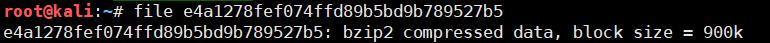](https://i.loli.net/2019/11/24/qWfVJZNy1bO49zo.png)

​    2.用bzip -vd 解压文件，得到一个未知文件，继续用file，发现是tar文件。

​                        [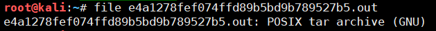](https://i.loli.net/2019/11/24/L1gtNwQsvr9FOdo.png)

​    3.用tar -xvf  解压文件，发现存在ctf文件夹，里面有flag.txt文件，直接打开，flag不在里面。

​                                            [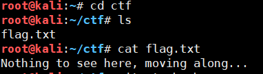](https://i.loli.net/2019/11/24/7ABxHShF6nRcZT9.png)

​    4.发现有个.git目录被隐藏了，然后用[git stash](https://www.jianshu.com/p/14afc9916dcb)命令，恢复文件，得到s.py，运行得到flag。

​              [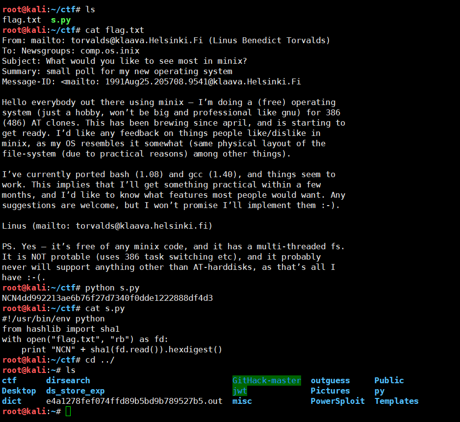](https://i.loli.net/2019/11/24/EsqIy3er1LQb9Xi.png)

```
  
git stash命令
		git stash list---查看修改列表
		git stash apply--重新存储，文件复原
```

