# 攻防世界-stage1（Stegsolve、16进制字符串处理、pyc反编译）

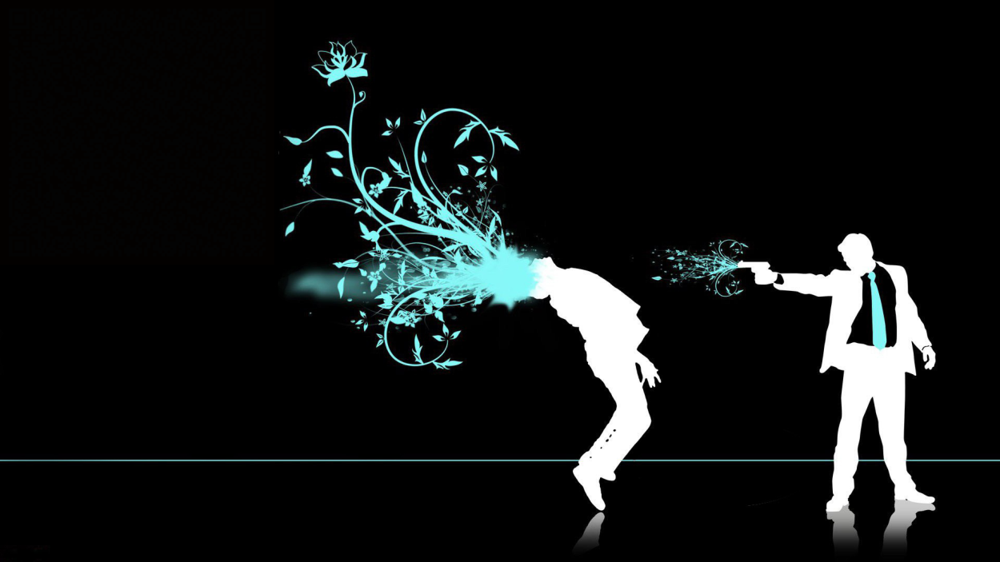

载入stegsolve，切换图层通道

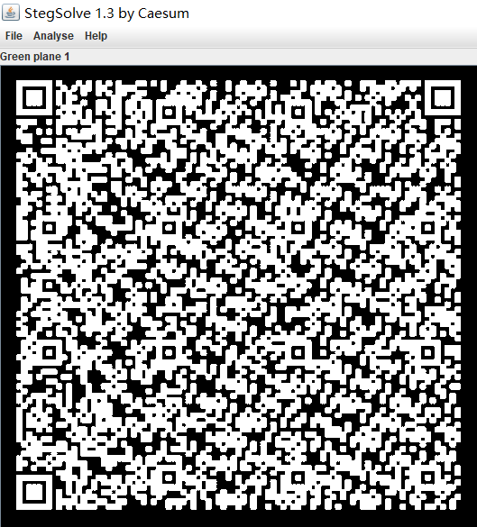

扫描二维码：

03F30D0AB6266A576300000000000000000100000040000000730D0000006400008400005A00006401005328020000006300000000030000000800000043000000734E0000006401006402006403006404006405006406006405006407006708007D00006408007D0100781E007C0000445D16007D02007C01007400007C0200830100377D0100712B00577C010047486400005328090000004E6941000000696C000000697000000069680000006961000000694C0000006962000000740000000028010000007403000000636872280300000074030000007374727404000000666C6167740100000069280000000028000000007307000000746573742E7079520300000001000000730A00000000011E0106010D0114014E280100000052030000002800000000280000000028000000007307000000746573742E707974080000003C6D6F64756C653E010000007300000000

16进制？

16进制转字符串？不对

文件，没跑了

将16进制粘贴到HxD中，发现ASCII中有py的字样，那应该是py文件或者是pyc文件

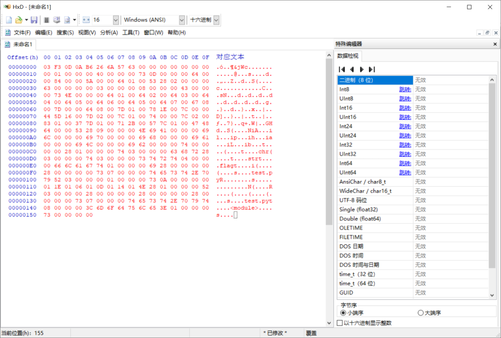

事实证明，为pyc文件

将pyc文件进行反编译得到：

```python
def flag():

  str = [65,108,112,104,97,76,97,98]

  flag = ''
  for i in str:
    flag += chr(i)
  print flag
#flag：AlphaLab
```

# 攻防世界-快乐游戏题（只是个游戏而已）

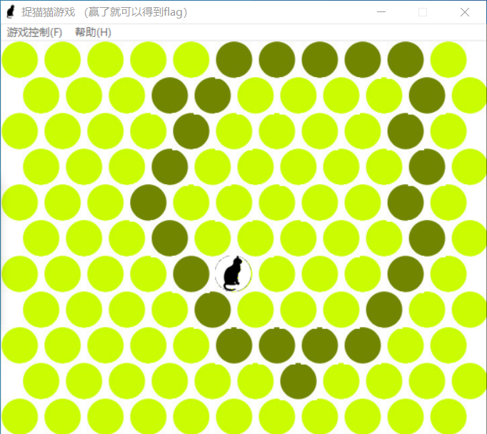

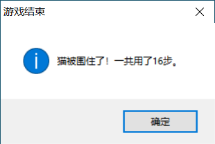

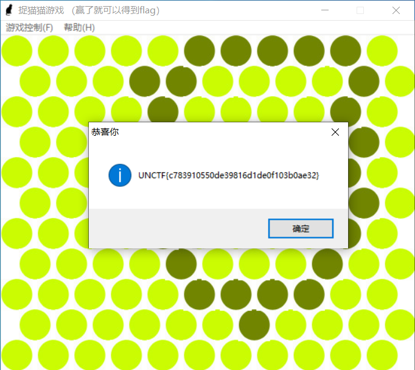

UNCTF{c783910550de39816d1de0f103b0ae32}

# 攻防世界-信号不好先挂了（在复杂场景下应用Stegsolve）

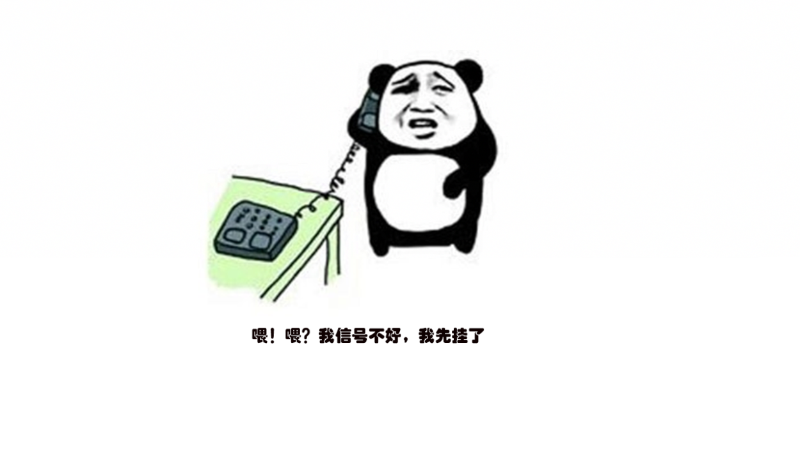

各种方法都用了结果都解不出来。。。

网上提示Stegsolve，那估计是Stegsolve的复杂用法：

先看两篇博客：

第一篇：

https://www.cnblogs.com/nul1/p/9594387.html

\-----------------------------------------------------------------------------------------------------------------------

应该也不是工具的问题吧，更多的是图片。但是不知道咋取就写工具了。

比如：

http://ctf5.shiyanbar.com/stega/chromatophoria/steg.png

我在想为毛要选择

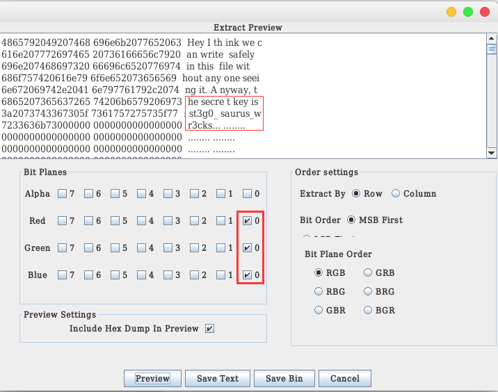

才能得到key

抱着这个想法就开始了今天的研究。

这是原图：

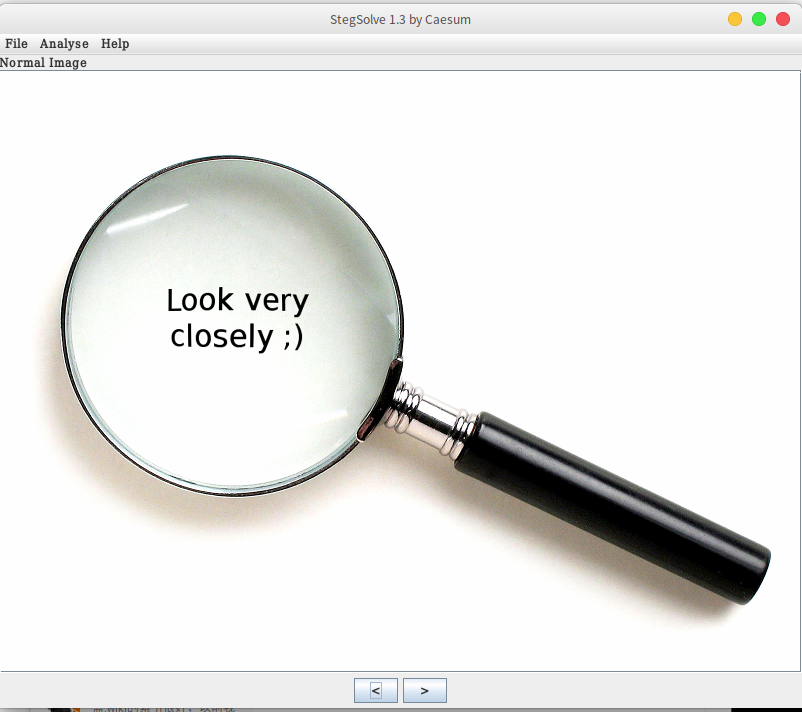

然后我点击向右。

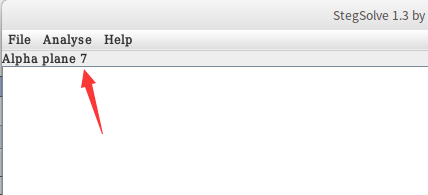

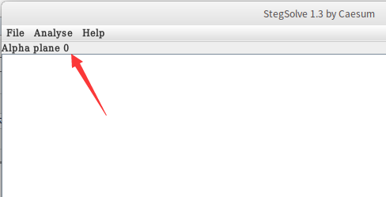

发现Alpha plane 7一直到Alpha plane 0都是差不多的图片（空白的）

然后再向右，到了red发现7-1也都是差不多（图片有变化但还能看清图），但是到了0的时候差距就完全不一样了（纯黑）。 

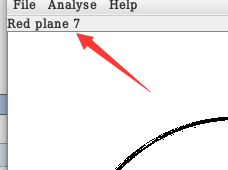

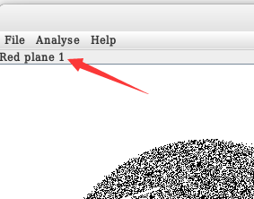

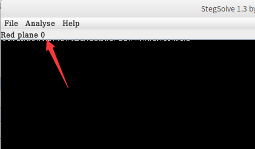

Green plance的也是7-1的时候都是差不多但是到了0的时候就完全黑了。

所以这就有了选择RGB的red、green和blue的最低位0的道理了

。我之前还以为都TMD是瞎JB点。

加粗的字是关键

\-----------------------------------------------------------------------------------------------------------------------

第二篇：

https://www.cnblogs.com/cat47/p/11483478.html

\-----------------------------------------------------------------------------------------------------------------------

Stegsolve使用方法（是因为ctf题总是遇到并且目前百度没有十分详细的探究说明）

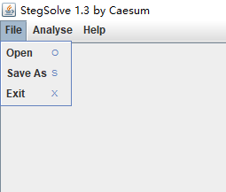

 这个没什么好说的，打开文件 ，保存，退出

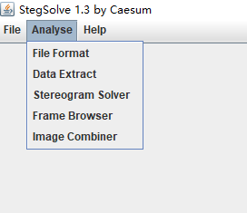

在分析里面从上到下的依次意思是：

File Format:文件格式

Data Extract:数据提取

Steregram Solve:立体试图 可以左右控制偏移

Frame Browser:帧浏览器

Image Combiner:拼图，图片拼接

 

用法（使用场景）

1.File Format:这里你会看见图片的具体信息有时候有些图片隐写的flag会藏在这里

2.Data Extract:(好多涉及到数据提取的时候，很多博主在wp中都是一带而过，小白们还以为要一个个试。。)

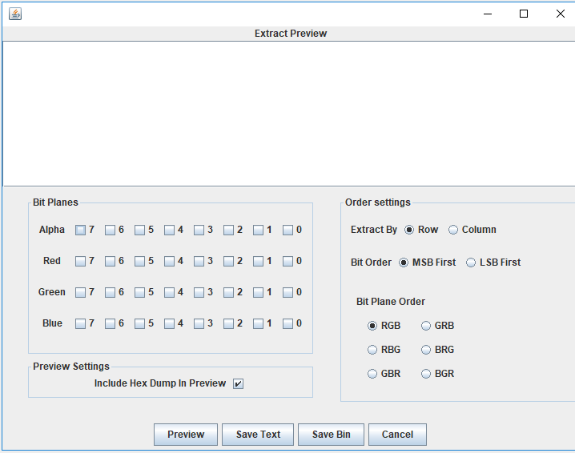

左边一大部分主要是讲了RGBA（Alpha是透明度）的颜色通道，为了方便理解我们分开说：

RGB是红绿蓝（Red，Green，Blue） 但他们的值代表的实际上是亮度

R的数字越大，则代表红色亮度越高；R的数字越小，则代表红色亮度越低。G，B同理

R的亮度各有256个级别，GB同理。即从0到255，合计为256个。从数字0到255的逐渐增高，我们人眼观察到的就是亮度越来越大，红色、绿色或蓝色越来越亮。然而256是2的8次方 所以你会看见上图的7~0，一共8个通道。

而Alpha就是透明度就是该通道用256级灰度来记录图像中的透明度信息，定义透明、不透明和半透明区域。

alpha的值为0就是全透明，alpha 的值为 255 则表示不透明，因此左半部分就理解了。

右半部分就是Extra By(额外的)和Bit Order（位顺序）和Bit Plane Order（位平面的顺序）

1）Extra By(额外的)：分为row（行）和column（纵）

每个像素用R，G，B三个分量表示，那么一张图片就像一个矩阵，矩阵的每个单位就是（0~255，0~255，0~255），也就会有是纵排列和行排列了，

一般事先访问行再访问列

（如果相反会引起ve使用方法）。

2）Bit Order（位顺序）:MSB是一串数据的最高位，LSB是一串数据的最低位。

3）Bit Plane Order（位平面的顺序)

   整个图像分解为8个位平面，从LSB(最低有效位0)到MSB（最高有效位7）随着从位平面0 到位平面7，位平面图像的特征逐渐变得复杂，细节不断增加。（一般我们的图片如果是RGB那么就是24位 3乘8嘛）

4）Bit Plane Order（位平面的顺序）:一般图片是24位 也就是3个8 大家可以想像成三明治 比如BGR就是B为三明治第一层 G为第二层 R为第三层。

 

3.Steregram Solve:立体试图 可以左右控制偏移 可以放张图片试一下就知道这个是什么意思了

4.Frame Browser:帧浏览器  主要是对GIF之类的动图进行分解，把动图一帧帧的放，有时候会是二维码

5.Image Combiner:拼图，图片拼接（意思显而易见）

 

接下来会带大家实战去深入理解一下Data Extract里面ctf经常用到的LSB隐写

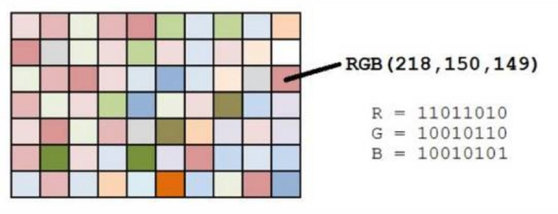

这个我们之前介绍的很详细

而LSB隐写就是修改RGB颜色分量的最低二进制位也就是最低有效位（LSB），而人类的眼睛不会注意到这前后的变化，（人类的眼睛只能识别一部分颜色的变化）

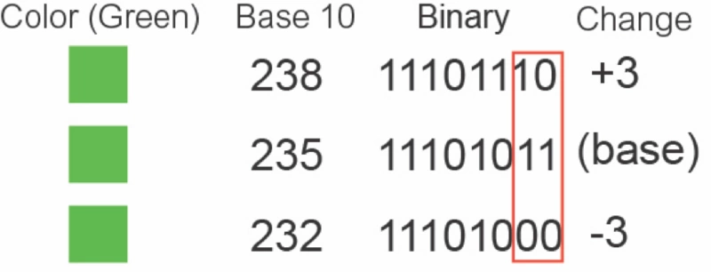

 

 如果我们修改lsb那么颜色依然和没修改的一样，并且修改的话每个像数可以携带3比特的信息。

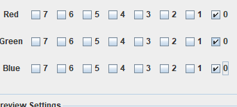

 这个作用是在于把最低位的二进制全部提取出来

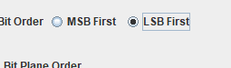

这个作用在于对提取出来的最低位使用lsb解码算法

 

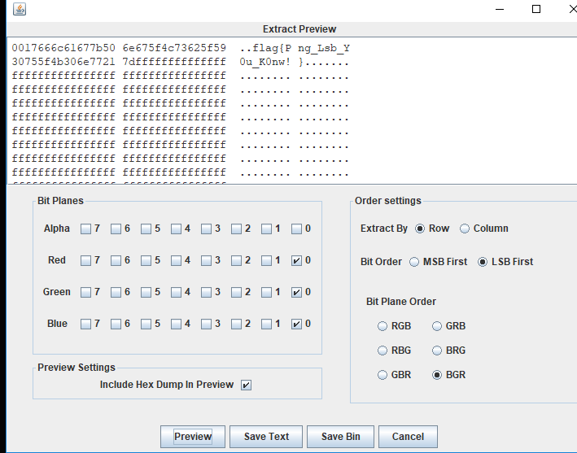

\-----------------------------------------------------------------------------------------------------------------------

好了，到这里应该大概了解了Stegsolve的使用方法，接下来我们进入实战。

回到这道题：


通常的，遇见png图片我们先用binwalk过一遍，再看看是否有LSB隐写。

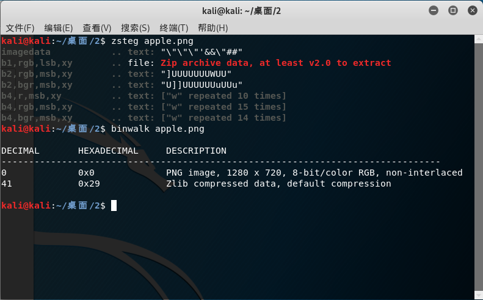

由此可见，binwalk不一定可以检测出png文件当中的隐写。（zsteg提示我们图片有隐写，通常情况下为LSB隐写）

将文件载入到Stegsolve中，我们慢慢来看：

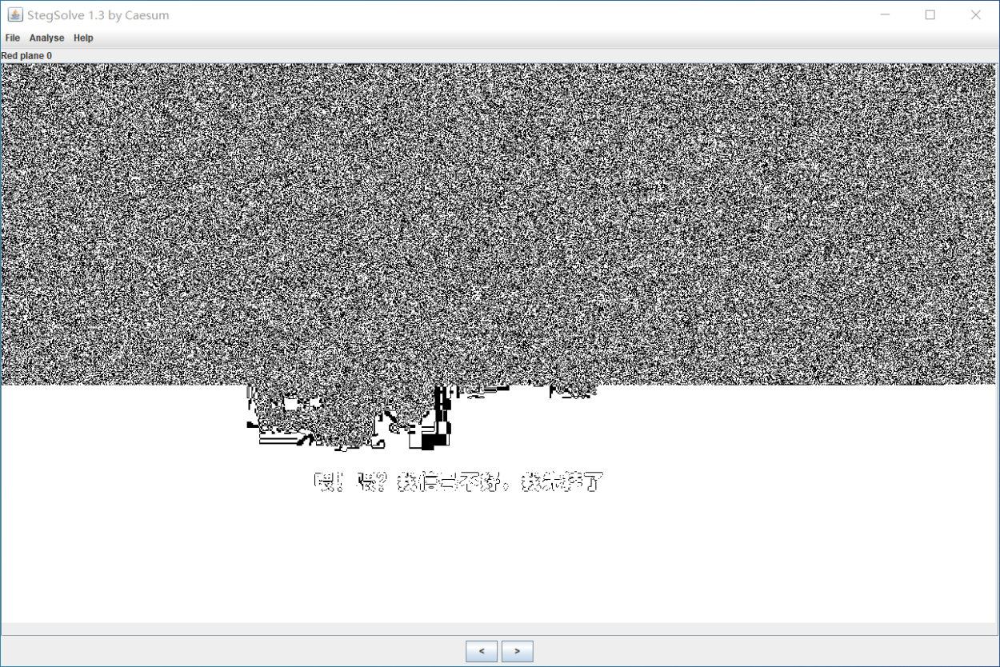

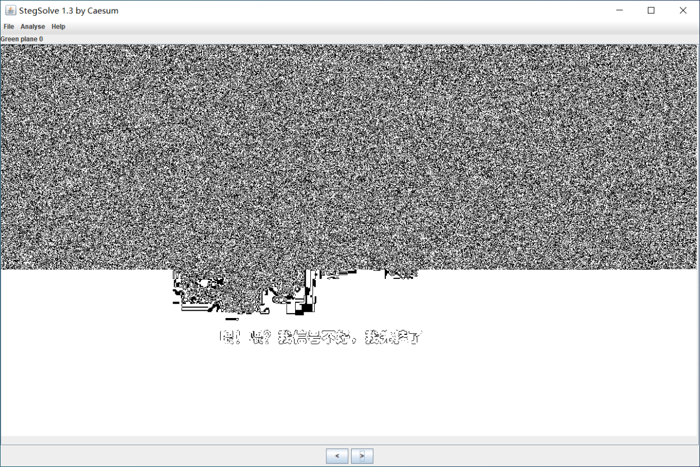

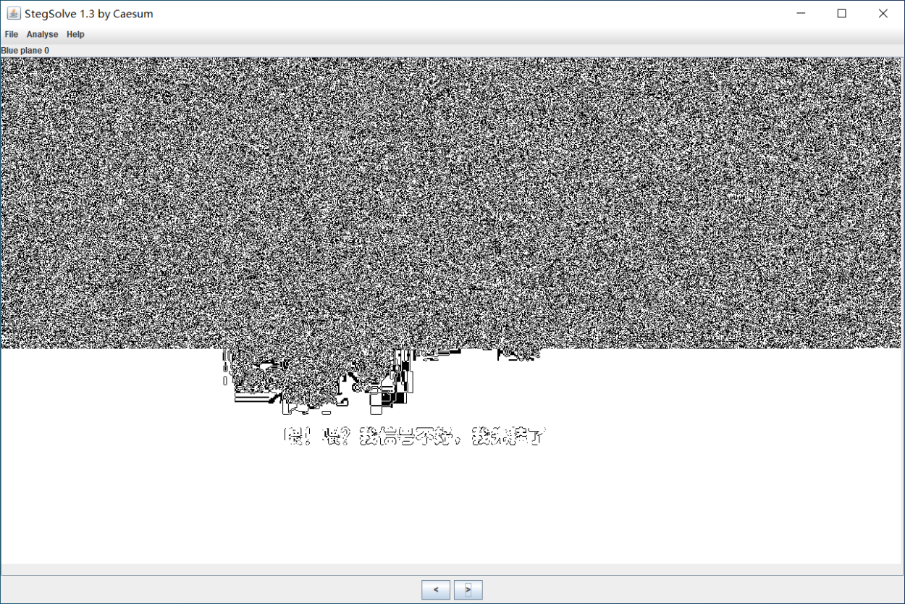

切换图片得到图层通道，我们在Red plane 0、Green plane 0、Blue plane 0中发现异常，alpha plane中没有发现异常。


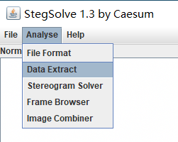

在Stegsolve中切换至Data Extract

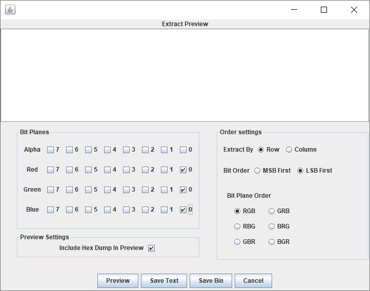

勾选：

Red plane 0、Greenplane 0、Blue plane 0，其他先不要动，单击Preview

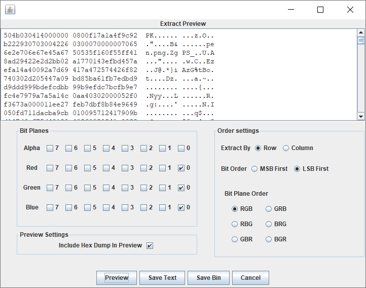

发现压缩包，点击Save Bin，保存为1.zip

直接打开压缩包提示文件损坏，用winrar的修复压缩包功能进行修复。得到与原图几乎一模一样的图片，盲水印走起！

得到flag：unctf{9d0649505b702643}

# 攻防世界-János-the-Ripper（zip爆破(字母密码)）

不是伪加密，那就爆破（别只顾着用数字爆破，还有字母）：

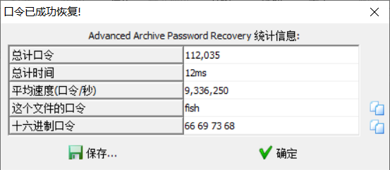

flag{ev3n::y0u::bru7us?!}

# 攻防世界-base64÷4（base16）

base64÷4=base16

。。。。。。。

666C61677B45333342374644384133423834314341393639394544444241323442363041417D

得到：

flag{E33B7FD8A3B841CA9699EDDBA24B60AA}

# 攻防世界-flag_universe（zsteg）

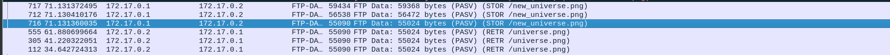

一个universe，一个new_universe,我还以为是盲水印。。。。试了半天。。。

两张图片只有一张有LSB隐写。。。

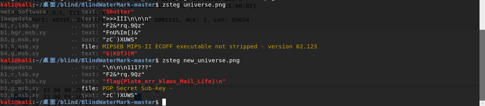

flag：

flag{Plate_err_klaus_Mail_Life}

# 攻防世界-打野（Zsteg）

首先在kali中执行：sudo gem install zsteg

然后：

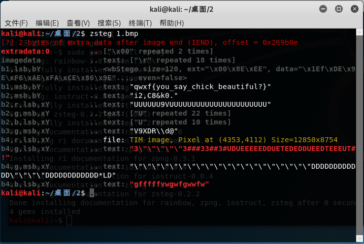

qwxf{you_say_chick_beautiful?}

# 攻防世界-wireshark-1

题目中提示:

题目描述：黑客通过wireshark抓到管理员登陆网站的一段流量包（管理员的密码即是答案)。 flag提交形式为flag{XXXX}


既然是管理员登录网站的流量包，在wireshark中注意到：

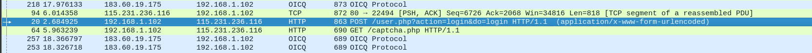

追踪TCP流，

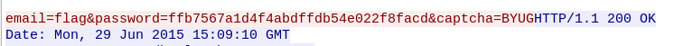

得到flag：

flag{ffb7567a1d4f4abdffdb54e022f8facd}


# 攻防世界-Reverse-it（file命令、字符串翻转）

在linux中查看文件的属性：

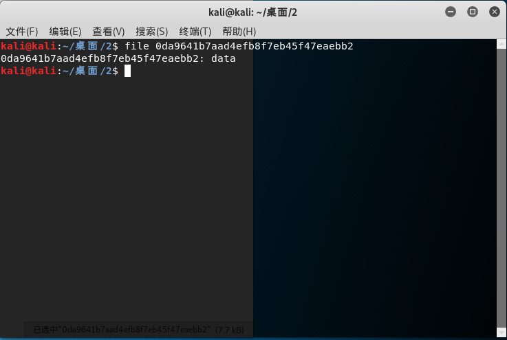

什么都没有。。。。

既然是Reverse-it，就应该存在什么逆序。。。

将文件载入到HxD中

直接查看尾部：

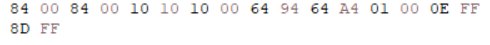

FF D8 FF E0.......这不正是jpg文件头吗？

将16进制字符串倒序输出，在放入到HxD中，保存：

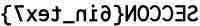

flag：SECCON{6in_tex7}

# 攻防世界-Get-the-key.txt（ext2、grep -r批量搜索文件名）

声明：grep -r 快速搜索在目录下面的含有关键字的文件

用记事本打开是乱码，拖进kali查看一下文件类型：

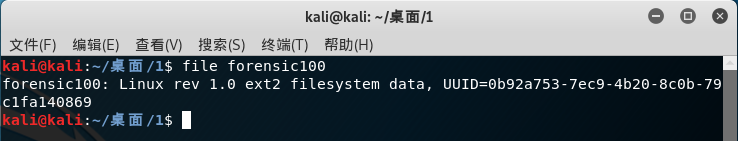

？又是你！ext

在windows下直接将文件的扩展名改为.zip

用winrar打开：

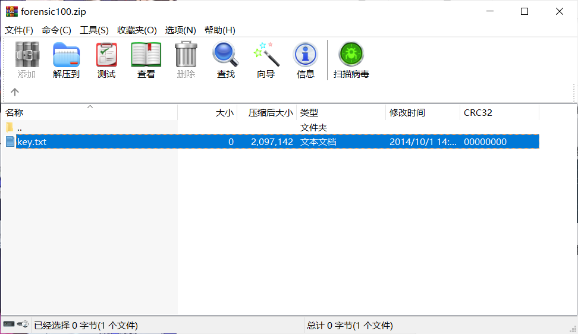

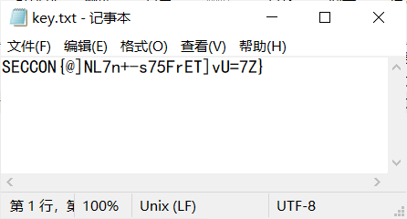

SECCON{@]NL7n+-s75FrET]vU=7Z}

撞大运了，正好是flag......


用360压缩打开：

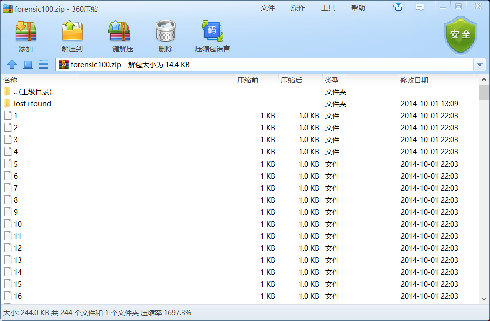

事实表明，每一个文件都是压缩包，每个压缩包里都有一个txt文件...

不能一个一个去找吧？！

在kali中用strings查看文件中的字符串：

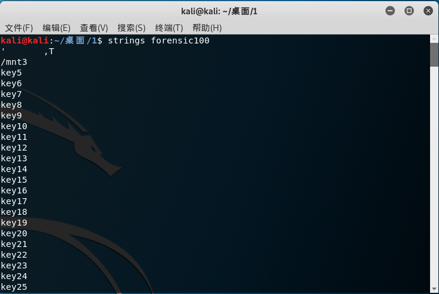


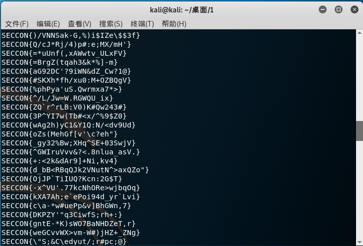

...........


参考一下别人的writeup

https://blog.csdn.net/weixin_44159598/article/details/100853291

拿到forensic 100文件后，首先在winhex中打开，发现有大量的key.txt文件，然后在Linux中用file打开文件，发现是linux系统文件

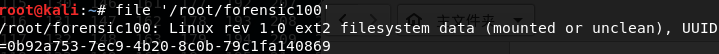

接下来创建 /tmp/forensic文件夹，将forensic100解压在该文件夹下，发现为同类压缩包

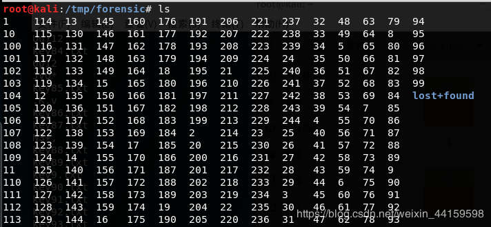

244个压缩包根本看不过来，所以根据题目提示 get-the-key.txt，使用命令：

grep -r key.txt

进行文件匹配，得到二进制文件

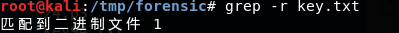

查看该文件类型：

file 1

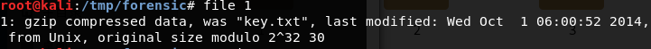

接下来解压文件，这里有一点问题

用 gunzip 1无法识别文件后缀， tar -xzvf 1 没有反应，使用binwalk 1 也没有得到结果

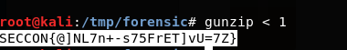

最后使用 gunzip<1 得到flag

一个菜鸡注：何必这么麻烦，改扩展名直接解压缩不就行了.....

SECCON{@]NL7n+-s75FrET]vU=7Z}

如果正好利用strings 来读取文件内容，尝试ket.txt的上一行，就正好是flag

# 攻防世界-stegano（！全新的PDF隐写方式！+PDF隐写总结）

参考资料：[https://blog.csdn.net/vhkjhwbs/article/details/100775409#14%EF%BC%8C%E5%B0%8F%E5%B0%8F%E7%9A%84PDF](https://blog.csdn.net/vhkjhwbs/article/details/100775409#14，小小的PDF)

先总结一下：

在攻防世界中已经 遇到 三种 pdf 的隐写方式：

1，新手区 ： pdf  ：将flag隐藏在图片的下面    》  需要 先将格式转为 word  再将图片拖开 就能看到 flag

2，新手区 ：stegano  ：利用类似水印的方法将flag隐藏在大量文字下面（不清楚具体方法） 》 全选复制 到 txt文件中就能 显示出密文

3，高手区： 小小的pdf： 嵌入文件  》 直接用 formost 分析 或用  binwalk分离

全新的PDF隐写方式：

下载PDF后打开，里面的乱七八糟的文字都没有什么用。。。

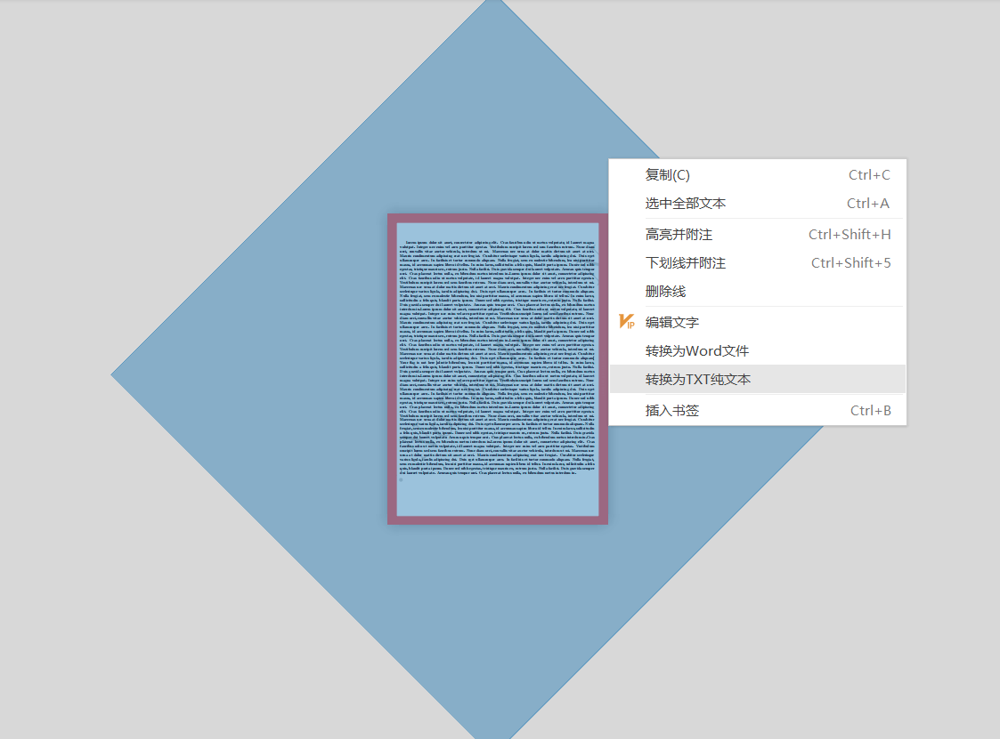

全选后，导出PDF中的文字：

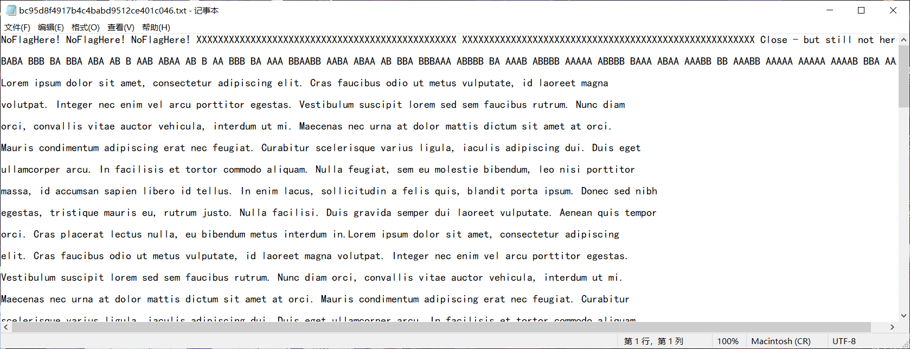

BABA BBB BA BBA ABA AB B AAB ABAA AB B AA BBB BA AAA BBAABB AABA ABAA AB BBA BBBAAA ABBBB BA AAAB ABBBB AAAAA ABBBB BAAA ABAA AAABB BB AAABB AAAAA AAAAA AAAAB BBA AAABB

将A变为 . ，B变为 - ，摩斯解密为：

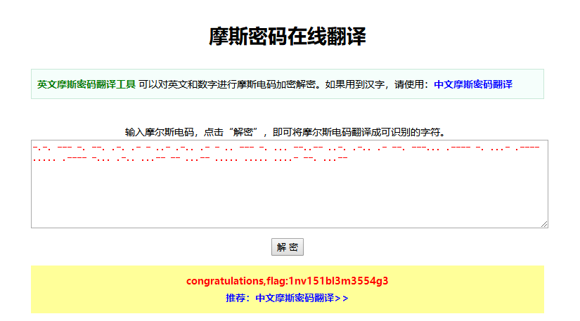

复制代码flag{1nv151bl3m3554g3}

# 攻防世界-肥宅快乐题（SWF帧浏览）

PS：游戏挺好玩的

得到swf文件，这让我想起了一道swf反编译题，用的工具是JPEXS Free Flash

但这道题不是反编译，而是swf帧浏览：

你可以用任何一个支持swf文件的播放器来跳帧播放，根据题目提示，最终我们可以得到flag：

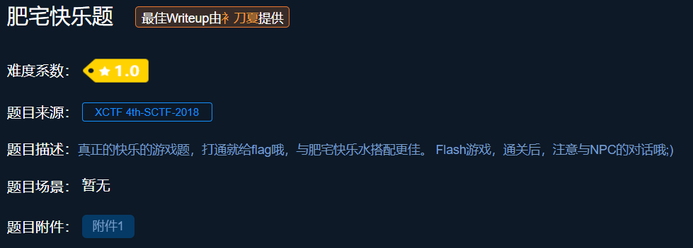

这里我们用360压缩自带的播放器来播放，当然也可以用其他播放器：

将swf文件压缩到zip文件中，用360压缩打开，并直接播放swf

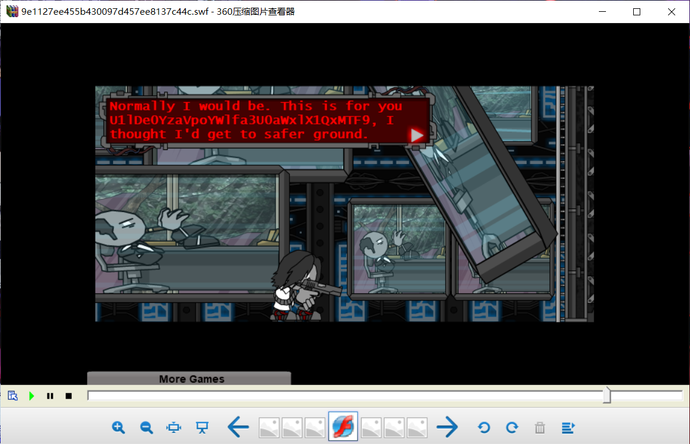

发现base64：

U1lDe0YzaVpoYWlfa3U0aWxlX1QxMTF9

SYC{F3iZhai_ku4ile_T111}

# 攻防世界-ext3（EXT3：第三代扩展文件系统）

什么是ext3？

EXT3是第三代扩展文件系统（

[英语](https://baike.baidu.com/item/英语/109997)

：Third extended filesystem，缩写为ext3），是一个日志文件系统，常用于

[Linux操作系统](https://baike.baidu.com/item/Linux操作系统)

。它是很多Linux发行版的默认

[文件系统](https://baike.baidu.com/item/文件系统/4827215)

。


知道这些就够了：

ext3本质上是一个压缩包：我们可以在windows环境下直接用360压缩打开它

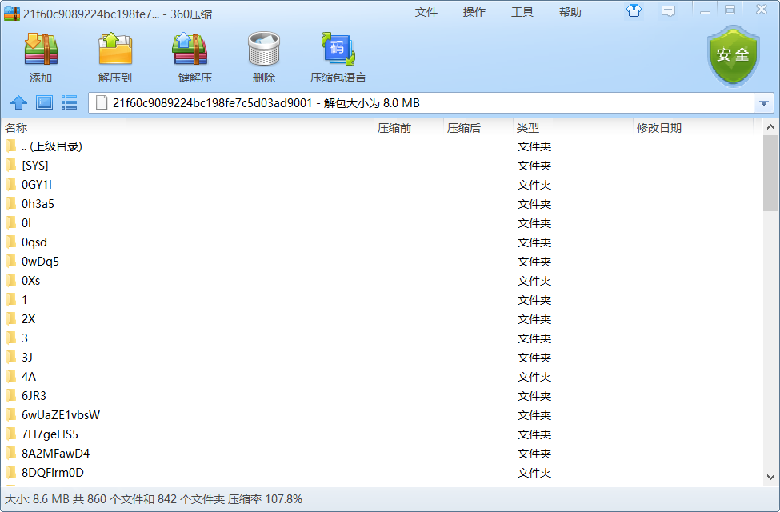

我们按照时间排序：

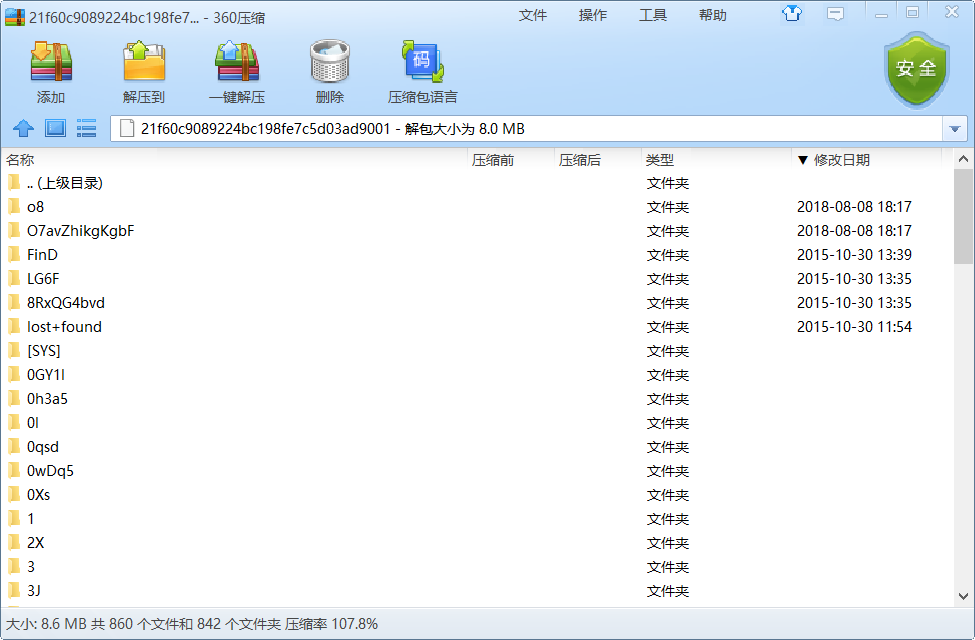

按照顺序打开文件夹，发现：

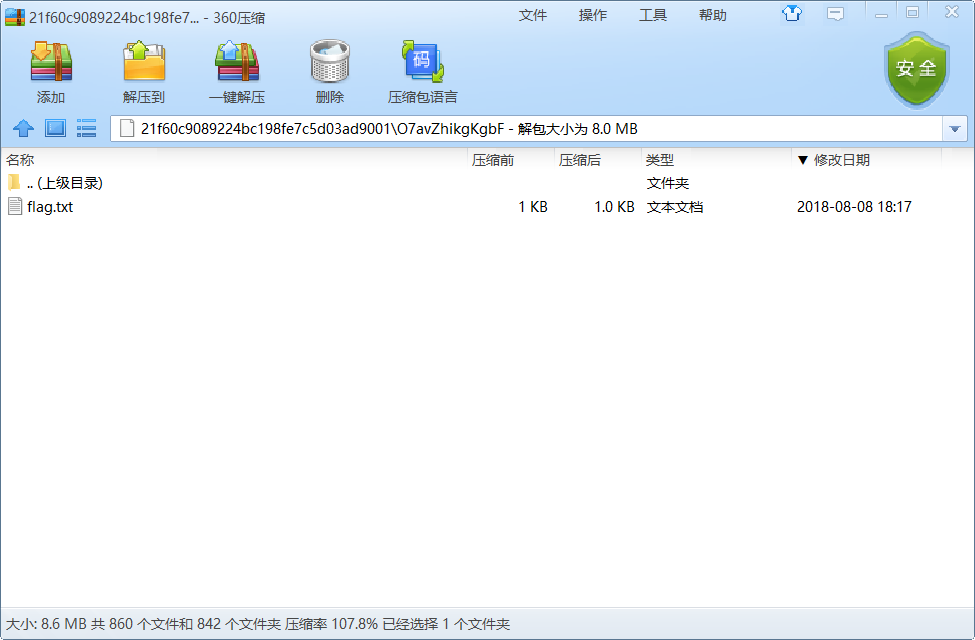

打开，得到：

ZmxhZ3tzYWpiY2lienNrampjbmJoc2J2Y2pianN6Y3N6Ymt6an0=

base64解码得到：

flag{sajbcibzskjjcnbhsbvcjbjszcszbkzj}

# Bugku-神秘的文件（zip明文攻击）

下载解压得到：


binwalk和foremost走一波：

没有东西.....

网上提到zip明文攻击，那就构造一下：

将logo.png用winrar压缩到logo.zip中

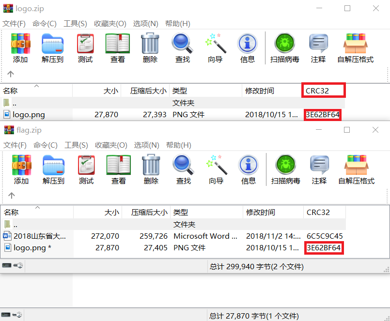

发现两个压缩包中的logo.png的CRC32相同，符合明文攻击的条件

打开ARCHPR

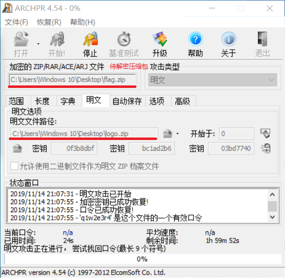

几秒后：

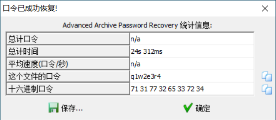

得到密码：q1w2e3r4

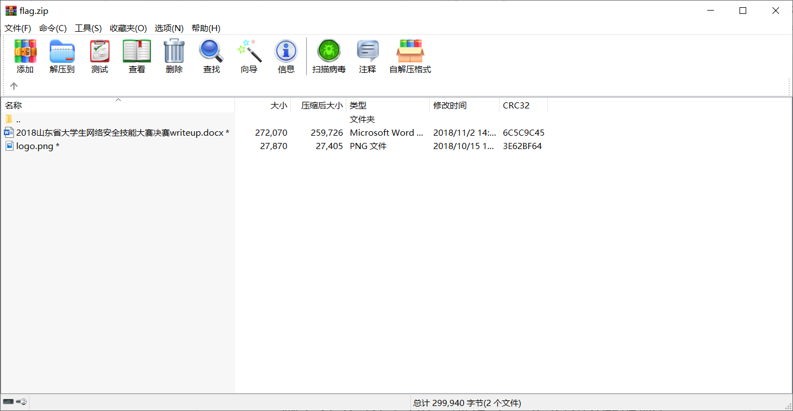

打开“

2018山东省大学生网络安全技能大赛决赛writeup.docx

”

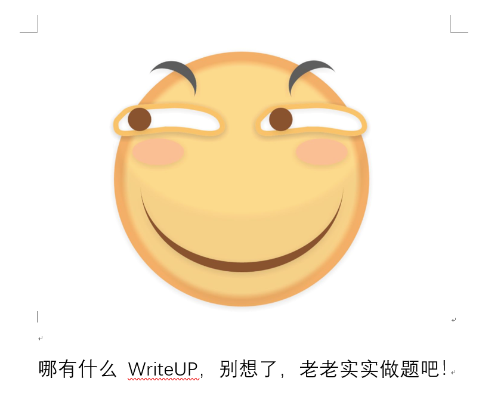

给你个大嘴巴子：

foremost走起：

得到压缩包

在压缩包中：docProps/flag.txt

打开有：ZmxhZ3tkMGNYXzFzX3ppUF9maWxlfQ==

base64解密得到：flag{d0cX_1s_ziP_file}

over！

# Bugku-凯撒部长的奖励（凯撒加密爆破）

嗯，是凯撒加密：

MSW{byly_Cm_sIol_lYqUlx_yhdIs_Cn_Wuymul_il_wuff_bcg_pCwnIl_cm_u_Yrwyffyhn_guh_cz_sio_quhn_ni_ayn_bcm_chzilguncihm_sio_wuh_dich_om}

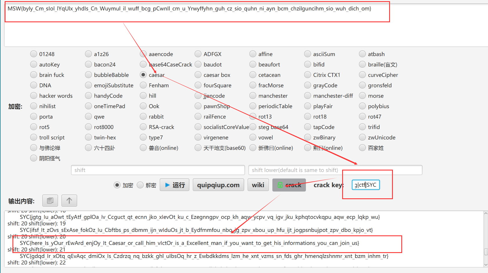

# Bugku-托马斯.杰斐逊（杰斐逊转轮加密）

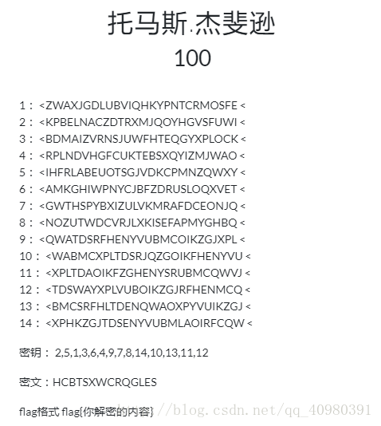

没见过这个密码，百度上查了一下这个人，

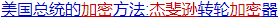

了解转轮加密方式后

得到

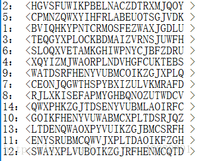

发现倒数第六列,有bugku这几个词，所以flag{XSXSBUGKUADMIN}

发现不对，就换成小写

flag{xsxsbugkuadmin}


网上资料：

做CTF的crypto，经常会遇到一些加密解密，杰弗逊加密也是考察频率较高的一种加密方式

像今年的ISCC CTF中就有一条转轮加密题目：


加密表：

 1: < ZWAXJGDLUBVIQHKYPNTCRMOSFE <

 2: < KPBELNACZDTRXMJQOYHGVSFUWI <

 3: < BDMAIZVRNSJUWFHTEQGYXPLOCK <

 4: < RPLNDVHGFCUKTEBSXQYIZMJWAO <

 5: < IHFRLABEUOTSGJVDKCPMNZQWXY <

 6: < AMKGHIWPNYCJBFZDRUSLOQXVET <

 7: < GWTHSPYBXIZULVKMRAFDCEONJQ <

 8: < NOZUTWDCVRJLXKISEFAPMYGHBQ <

 9: < XPLTDSRFHENYVUBMCQWAOIKZGJ <

10:< UDNAJFBOWTGVRSCZQKELMXYIHP <

11:< MNBVCXZQWERTPOIUYALSKDJFHG <

12:< LVNCMXZPQOWEIURYTASBKJDFHG <

13:< JZQAWSXCDERFVBGTYHNUMKILOP <

密钥： 2,5,1,3,6,4,9,7,8,14,10,13,11,12

密文：HCBTSXWCRQGLES

​    起初在网上没有找到这种加密的具体原理，对源码以及最后的代码分析过后，发现这种古典密码其实很简单，下面我来阐释它的解密原理:

​    首先托马斯-杰弗逊转轮加密由三串字符串组成，第一部分为加密表，第二部分为密钥，第三部分为密文

​    加密表就是我们需要利用密钥和密文来进行加密，具体的过程如下：

​    ①首先查看密钥第一个字符为2，因此我们需要到加密表中去查找第2行2<KPBELNACZDTRXMJQOYHGVSFUWI < 这里我们再利用密文的第一个字符N进行旋转，N在这里的作用就是旋转过后的第一个字符即为N，在这里的旋转为循环，不为补0 因此我们可以来对加密表中的第一段密文进行解密： 原先：KPBELNACZDTRXMJQOYHGVSFUWI 旋转：NACZDTRXMJQOYHGVSFUWIKPBEL 同理下面的字符串也可以利用同样的方式进行解密 最终的解密为： 

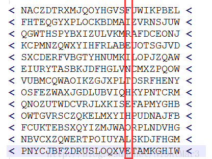

# 2020第五空间-run（ps-双图层）

将文件下载下来，发现是一个自解压文件，所以将文件解压可以得到run_1.exe，和一个word文件，运行run_1.exe文件可以得到一个tif图片文件，添加上扩展名，用ps打开，发现有两个图层，其中重要的图层如下图所示：

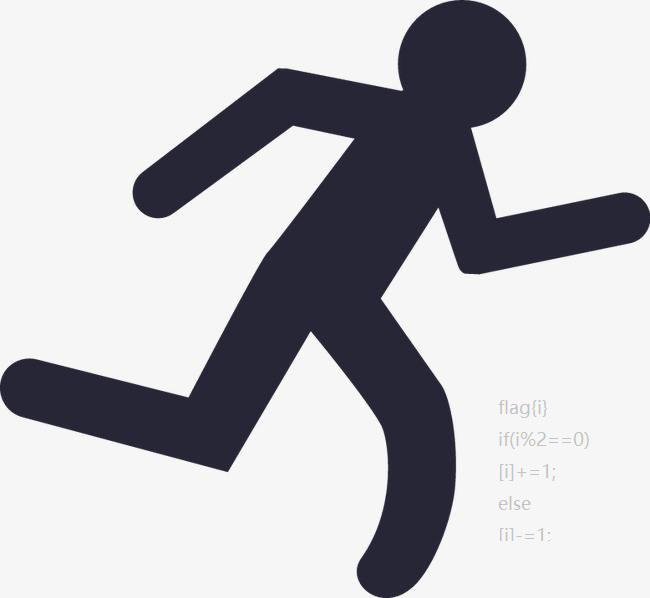

同时在原tif文件尾发现了一个字符串：

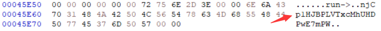

两个结合写出如下逆向代码：

```python
#include<iostream>
#include<string.h>
using namespace std;
int main(){
    char str[]="njCp1HJBPLVTxcMhUHDPwE7mPW";
    char flag[]="";
    for(int i = 0;i<strlen(str);i++){
        if(i%2==0){
            flag[i]=str[i]-1;
        }
        else{
            flag[i]=str[i]+1;
        }
    }
    for(int i = 0;i<strlen(str);i++){
        printf("%c",flag[i]);
    }
    
    return 0;
}
```

```
str = 'njCp1HJBPLVTxcMhUHDPwE7mPW'
flag = ''
for i in range(len(str)):
    if(i % 2 == 0):
        i = chr(ord(str[i]) - 1)
    else:
        i = chr(ord(str[i]) + 1)
    flag += i
print(flag)
```

# 2020年DASCTF-四月春季战-Keyboard（volatility工具使用，vol文件提取、电脑键盘QWE密码、NTFS流隐写））

将文件放入到kali中，执行命令：

```
volatility -f Keyboard.raw imageinfo  #获取基本信息
```

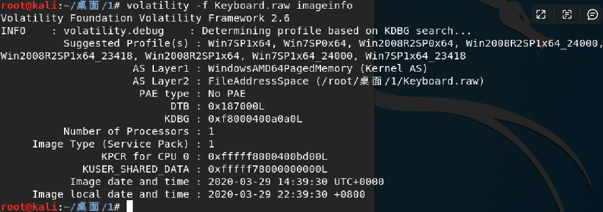

```
volatility -f Keyboard.raw --profile=Win7SP1x64 pslist #查看进程，发现VeraCrypt.exe和keyboard-log.exe
```

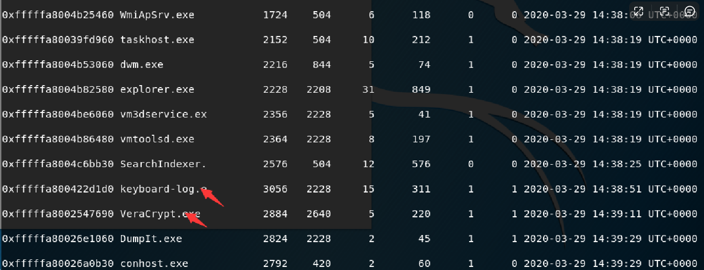

```
volatility -f Keyboard.raw --profile=Win7SP1x64 filescan | grep keyboard  #扫描包含Keyboard的文件
```

发现t.txt文件

```
volatility -f Keyboard.raw --profile=Win7SP1x64 dumpfiles -Q 0x000000003d700880 --dump-dir=./ #提取一下
```

```
使用文本编辑器将其打开，发现内容：
2020- 3-29 22:35:25  
[BP][BP][BP][BP]hhhhh flag is not n[BP]here  #flag不再这儿
 
2020- 3-29 22:35:30  
  
 
2020- 3-29 22:36:41  
ctfwikiCRYPTO ABC  #密钥相关信息提示
CTKQEKNHZHQLLVGKROLATNWGQKRRKQGWNTA  #加密内容 
 
2020- 3-29 22:37:23  
[BP][BP]decrypto hou xiao xie geng[BP][BP] yi kan chu  #解密后的字符串转换为小写更易看出
 
2020- 3-29 22:39:24  
But the password is in uppercase  #但是密码是大写
```

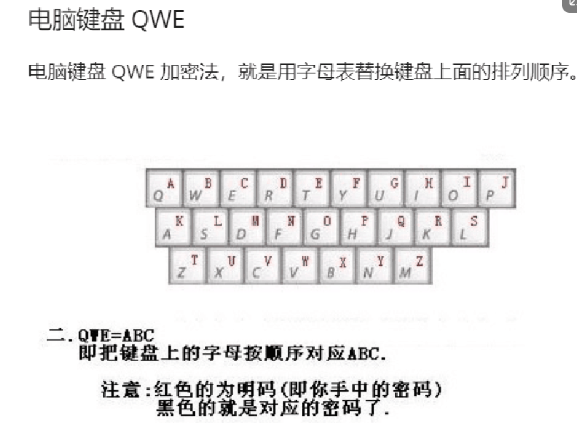

得到`VERACRYPTPASSWORDISKEYBOARDDRAOBYEK`，提示小写更容易看出：`veracryptpasswordiskeyboarddraobyek`

得到密码`keyboarddraobyek`，但是下面提示还是要大写：KEYBOARDDRAOBYEK

拿VeraCrypt.exe加载一下Secret，然后挂载vhd文件

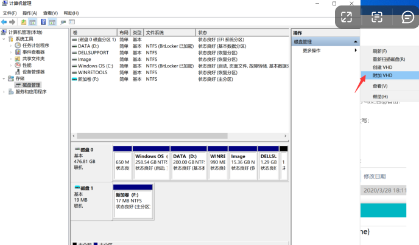

打开之后什么也没有？它把文件隐藏了，设置一下就好了

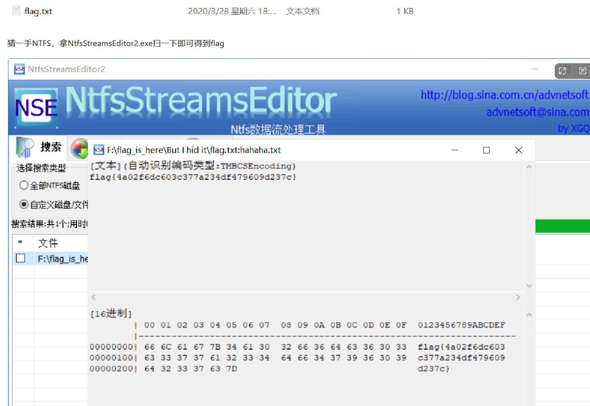

# 2020HGame-Week2-地球上最后的夜晚（wbStego、Word XML隐写）

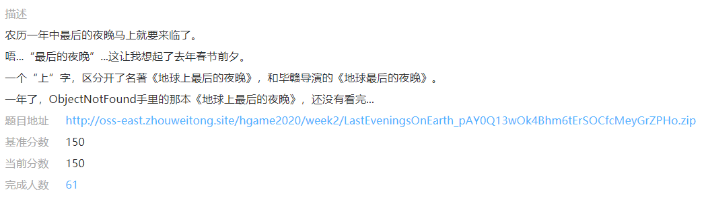

下载得到一个未加密的压缩包：

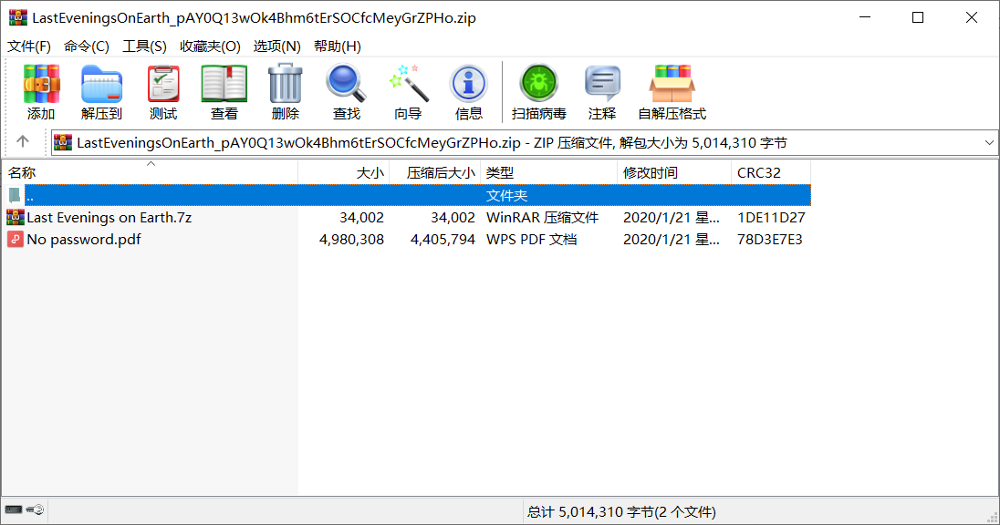

Last Evenings on Earth.7z提示加密且无法查看内容，那么密码应该藏在No password.pdf中

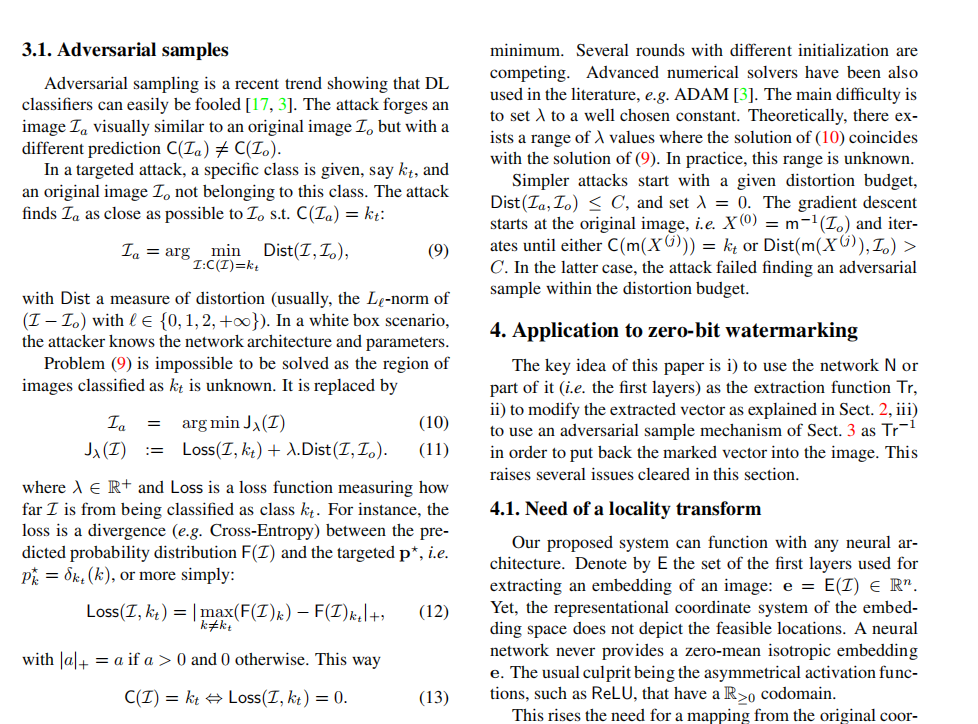

一开始关注到带有颜色的数字，但是方向错了

wp上提示

wbStego。。。


由于文件名为：“

No password.pdf

”，那应该没有密码。（文件名很重要！）

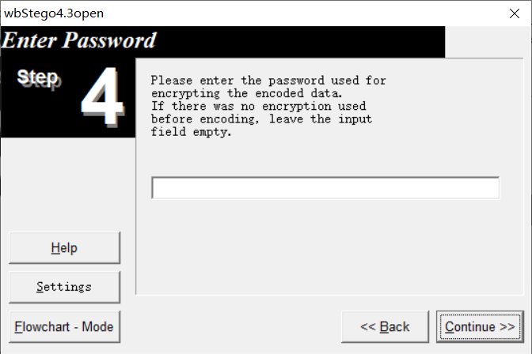

直接单击Continue

得到密码：OmR#O12#b3b%s*IW

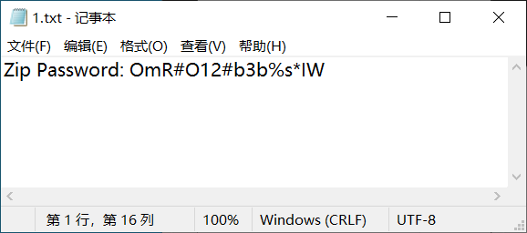

解密得到Last Evenings on Earth.docx

打开，大致浏览一下文章，好像没有什么信息

换一种方式：将Last Evenings on Earth.docx改为Last Evenings on Earth.zip，打开它

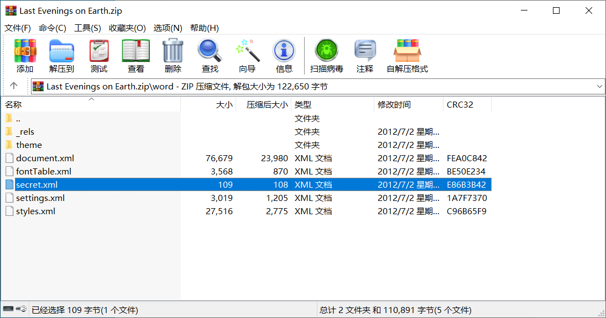

最终发现secret.xml可疑，打开：

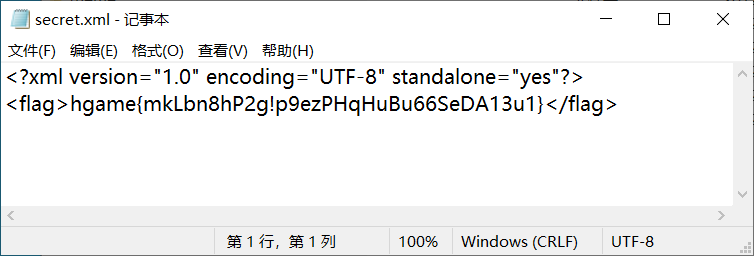

hgame{mkLbn8hP2g!p9ezPHqHuBu66SeDA13u1}

# 攻防世界-gif(黑白图片转换01)

这是攻防世界新手练习区的第七题，题目如下：
 [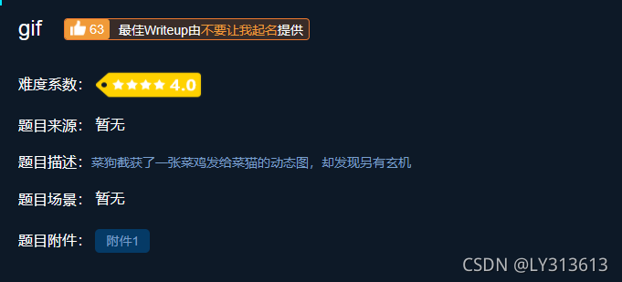](https://img-blog.csdnimg.cn/419710d9dfc24b7b9e145d6c9c959d19.png?x-oss-process=image/watermark,type_ZHJvaWRzYW5zZmFsbGJhY2s,shadow_50,text_Q1NETiBATFkzMTM2MTM=,size_20,color_FFFFFF,t_70,g_se,x_16)
 点击下载附件1，得到一个压缩包，解压后得到一些图片
 [](https://img-blog.csdnimg.cn/ca7e4a8c77b9493fbb0af0490fccb757.png?x-oss-process=image/watermark,type_ZHJvaWRzYW5zZmFsbGJhY2s,shadow_50,text_Q1NETiBATFkzMTM2MTM=,size_20,color_FFFFFF,t_70,g_se,x_16)
  嗯，黑白相间（又是懵逼的时候），又跑去看WP了，说是打开文件出现多个黑白，让人联想到二进制，白色图片代表0，黑色图片代表1（这脑洞也太大了吧，或许是我经验不够，菜啊）,不过问题是，这么多图片，难道要手工给它转换过来吗？（这工程有一点大啊）写个脚本转换一下：


```bash
k = ""
for i in range(0,104):
    c = r'C:\\Users\\29162\\Desktop\\python\\gif\\'  # 这里要改成图片所在的路径
    jpg_name = c + str(i) + ".jpg"
    with open(jpg_name, "rb") as f:
        n = f.read()
        if n[0x273] == 0x80:
            k += "0"
        elif n[0x273] == 0xB2:
            k += "1"
        else:
            print("无法识别该图片")
print(k)
```

这里解释一下是如何识别图片是黑色的还是白色的，先用010editor打开黑色的图片和白色的图片,观察它们16进制不同的地方，可以看到在0x273的位置白色图片的值为0x80，如下图
 [](https://img-blog.csdnimg.cn/c1bd094bb4e7448c9931ddfb640f9b12.png?x-oss-process=image/watermark,type_ZHJvaWRzYW5zZmFsbGJhY2s,shadow_50,text_Q1NETiBATFkzMTM2MTM=,size_20,color_FFFFFF,t_70,g_se,x_16#pic_center)
 黑色图片在该位置的值为0xB2，如下图
 [](https://img-blog.csdnimg.cn/7524d3248fbc4be2a3f9d21ba276086c.png?x-oss-process=image/watermark,type_ZHJvaWRzYW5zZmFsbGJhY2s,shadow_50,text_Q1NETiBATFkzMTM2MTM=,size_20,color_FFFFFF,t_70,g_se,x_16#pic_center)
 其实不一定要这个位置，只要两张图片在相同的位置的值不同也可以作为判断的标准。
 脚本的执行结果如下：
 [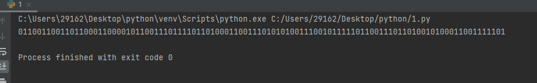](https://img-blog.csdnimg.cn/529dac4a032c4988a09d94548be4c116.png)


```bash
01100110011011000110000101100111011110110100011001110101010011100101111101100111011010010100011001111101
```

找个网站将二进制转换为字符串：
 [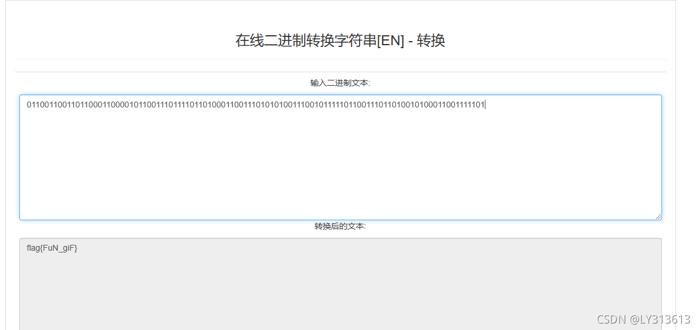](https://img-blog.csdnimg.cn/371c4927571d446b877ec1ad4275b6d4.png?x-oss-process=image/watermark,type_ZHJvaWRzYW5zZmFsbGJhY2s,shadow_50,text_Q1NETiBATFkzMTM2MTM=,size_20,color_FFFFFF,t_70,g_se,x_16)
 所以这道题的flag如下：

```bash
flag{FuN_giF}
```

