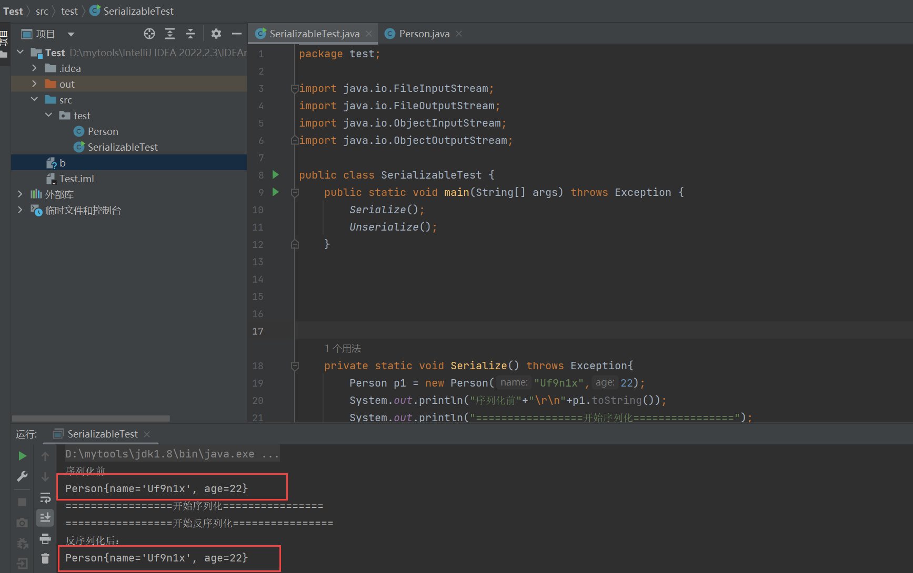
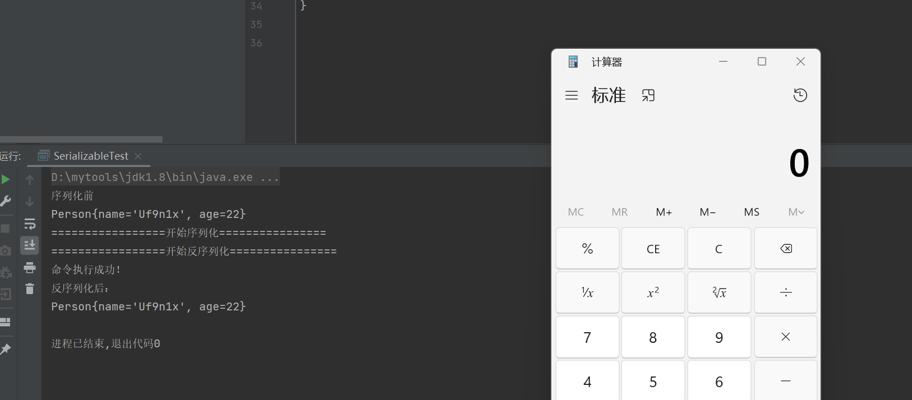

## 序列化与反序列化

**Java序列化**是指把Java对象转换为字节序列的过程；而**Java反序列化**是指把字节序列恢复为Java对象的过程。

Java的反序列化和PHP的反序列化其实有点类似，他们都只能将一个对象中的属性按照某种特定的格式生成一段数据流，在反序列化的时候再按照这个格式将属性拿回来，再赋值给新的对象。

但Java相对PHP序列化更深入的地方在于，其提供了更加高级、灵活地方法writeObject，允许开发者在序列化流中插入一些自定义数据，进而在反序列化的时候能够使用readObject进行读取。当然，PHP中也提供了一个魔术方法叫__wakeup，在反序列化的时候进行触发。

很多人会认为Java的readObject和PHP的__wakeup类似，但其实不全对，虽然都是在反序列化的时候触发，但他们解决的问题稍微有些差异。Java设计readObject的思路和PHP的__wakeup不同点于：readObject倾向于解决“**反序列化时如何还原一个完整对象**”这个问题，而PHP的__wakeup更倾向于解决“**反序列化后如何初始化这个对象**”的问题。

## 序列化实现

只有实现了Serializable或者Externalizable接口的类的对象才能被序列化为字节序列。（不是则会抛出异常）

**Serializable 接口**

```java
public interface Serializable {
}
```

Serializable 用来标识当前类可以被 ObjectOutputStream 序列化，以及被 ObjectInputStream 反序列化。

### Serializable 接口的基本使用

通过 ObjectOutputStream 将需要序列化数据写入到流中，因为 Java IO 是一种[装饰者模式](https://blog.csdn.net/twelvechenlin/article/details/72599130)，因此可以通过 ObjectOutStream 包装 FileOutStream 将数据写入到文件中或者包装 ByteArrayOutStream 将数据写入到内存中。同理，可以通过 ObjectInputStream 将数据从磁盘 FileInputStream 或者内存 ByteArrayInputStream 读取出来然后转化为指定的对象即可。

**代码实现**

定义一个Person类进行测试。

```java
import java.io.Serializable;

public class Person implements Serializable {
    public String name;
    public int age;

    Person(String name, int age) {
        this.name = name;
        this.age = age;
    }

    public String getName() {
        return name;
    }

    public void setName(String name) {
        this.name = name;
    }

    public int getAge() {
        return age;
    }

    public void setAge(int age) {
        this.age = age;
    }

    @Override
    public String toString() {
        return "Person{" +
                "name='" + name + '\'' +
                ", age=" + age +
                '}';
    }
}
```

**测试类**

把序列化和反序列化写在一个文件进行测试。

```java
package test;

import java.io.FileInputStream;
import java.io.FileOutputStream;
import java.io.ObjectInputStream;
import java.io.ObjectOutputStream;

public class SerializableTest {
    public static void main(String[] args) throws Exception {
        Serialize();
        Unserialize();
    }

    private static void Serialize() throws Exception{
        Person p1 = new Person("Uf9n1x",22);
        System.out.println("序列化前"+"\r\n"+p1.toString());
        System.out.println("=================开始序列化================");
        ObjectOutputStream oos = new ObjectOutputStream(new FileOutputStream("\\......\\Test\\b"));
        oos.writeObject(p1);
        oos.flush();
        oos.close();
    }

    private static void Unserialize() throws Exception{
        System.out.println("=================开始反序列化================");
        ObjectInputStream ois = new ObjectInputStream(new FileInputStream("\\.......\\Test\\b"));
        Person p2 = (Person) ois.readObject();
        ois.close();
        System.out.println("反序列化后：");
        System.out.println(p2);

    }


}
```



**ObjectOutputStream代表对象输出流：它的writeObject(Object obj)方法可对参数指定的obj对象进行序列化，把得到的字节序列写到一个目标输出流中**

**ObjectInputStream代表对象输入流：它的readObject()方法从一个源输入流中读取字节序列，再把它们反序列化为一个对象，并将其返回。**

**很显然，writeObject和readObject是序列化和反序列化的关键。**

使用[SerializationDumper](https://github.com/NickstaDB/SerializationDumper)查看序列化文件:

```java
java -jar SerializationDumper.jar -r "\D:\..........\Test\b"
STREAM_MAGIC - 0xac ed
STREAM_VERSION - 0x00 05
Contents
  TC_OBJECT - 0x73
    TC_CLASSDESC - 0x72
      className
        Length - 11 - 0x00 0b
        Value - test.Person - 0x746573742e506572736f6e
      serialVersionUID - 0x6f 32 59 11 fb f8 d0 75
      newHandle 0x00 7e 00 00
      classDescFlags - 0x02 - SC_SERIALIZABLE
      fieldCount - 2 - 0x00 02
      Fields
        0:
          Int - I - 0x49
          fieldName
            Length - 3 - 0x00 03
            Value - age - 0x616765
        1:
          Object - L - 0x4c
          fieldName
            Length - 4 - 0x00 04
            Value - name - 0x6e616d65
          className1
            TC_STRING - 0x74
              newHandle 0x00 7e 00 01
              Length - 18 - 0x00 12
              Value - Ljava/lang/String; - 0x4c6a6176612f6c616e672f537472696e673b
      classAnnotations
        TC_ENDBLOCKDATA - 0x78
      superClassDesc
        TC_NULL - 0x70
    newHandle 0x00 7e 00 02
    classdata
      test.Person
        values
          age
            (int)22 - 0x00 00 00 16
          name
            (object)
              TC_STRING - 0x74
                newHandle 0x00 7e 00 03
                Length - 6 - 0x00 06
                Value - Uf9n1x - 0x5566396e3178
```

可以看到，classdata存储类的相关数据，序列化重新取出使用。

## 安全问题

**为什么会产生安全问题？**

只要服务端反序列化数据，客户端传递类的readObject中的代码会自动执行，给予攻击者在服务器上运行代码的能力。

### **传递类产生漏洞的形式：**

#### 1）入口类的reaadObject直接调用危险方法。

Person类加入readObject重写方法，reaadObject（反序列化）调用命令执行方法。

```java
import java.io.ObjectInput;
import java.io.ObjectInputStream;
import java.io.Serializable;

public class Person implements Serializable {
    public String name;
    public int age;

    Person(String name, int age) {
        this.name = name;
        this.age = age;
    }

    public String getName() {
        return name;
    }

    public void setName(String name) {
        this.name = name;
    }

    public int getAge() {
        return age;
    }

    public void setAge(int age) {
        this.age = age;
    }

    @Override
    public String toString() {
        return "Person{" +
                "name='" + name + '\'' +
                ", age=" + age +
                '}';
    }

    private void readObject(ObjectInputStream ois) throws Exception{
        ois.defaultReadObject(); //该方法从该流中读取当前类的非静态和非瞬态字段。
        Runtime.getRuntime().exec("calc");
        System.out.println("命令执行成功！");
    }

}
```



#### 2）入口类参数中包含可控类，这个类有危险方法，readObject时调用。

​	入口A HashMap接收参数O (O.func) ->目标类B URL->目标类调用B.func->A.readObject.invoke->B.func==== URLDNS

#### 3）入口类参数中包含可控类，该类又调用其他有危险的类，readObject时调用。

​	目标类B.func

​	入口A[O]->O.abc->B.func

​	O[B] invoke->B.func

​	O 是动态代理

#### 4）构造函数/静态代码块等类加载时隐式执行。

上面的4个类别，入口类 Source 的共同的特征是：

- **实现Serializable；**
- **重写readObject方法，调用一个常见的函数；**
- **参数类型宽泛；**
- **最好JDK自带；**

## 小结

1. Java类只有实现Serializable接口或Externalizable接口才可启用序列化功能；
2. 当一个对象被序列化时，只保存对象的非静态成员变量；
3. 如果一个对象发成员变量是一个对象，那么这个对象的数据成员也会被序列化；
4. 使用transient关键字声明不需要被序列化的变量；（private transient String sex）
5. 如果父类实现序列化，那么子类就自动实现序列化，不需要再显式实现Serializable接口；
6. 显式定义serialVersionUID。
