# 1. 前言

在之前的文章都主要都是对APK文件进行信息收集，而信息收集后就需要对APP漏洞进行挖掘，但是从本质上来看，APP其实就是将原先应该部署在网站上的页面塞入APP中，所有的调用都是给予服务器，而且在对WEB漏洞进行挖掘的时候，除了部分漏洞是基于本地页面所导致的，其它的可以说基本上就是由于服务端的问题。

所以本质上在获取到APP相关的信息后可以直接在浏览器中打开，或者截取相关的数据包来进行截断测试，比如获取到IP地址，可以直接使用nmap进行端口扫描，看看是否开放数据库端口、远程连接端口、中间件端口等，都进行可以扫描挖掘。

## 1.1. 其它

本章主要就是介绍一下APP反编译，所谓的反编译在渗透中也是安全的一部分，例如，APP通过反编译植入后门，在发送给别人安装，亦或者通过反编译修改会员功能、免费阅读、破解等均属于APP的范畴中。

由于个人水平有限，对反编译这一块只能说是作为参考，更细致的可能需要读者自行搜索相关的内容进行学习。

# 2. 安装工具

所谓"工欲善其事，必先利其器"，那么在反编译之前就需要将相关的工具安装好。

## 2.1. 下载jadx工具

jadx - Dex to Java反编译器

用于从Android Dex和Apk文件生成Java源代码的命令行和GUI工具

### 2.1.1. 下载链接

[jadx下载](https://github.com/skylot/jadx)


### 2.1.2. 执行文件

下载后进入该文件的lib目录下，执行命令，执行完就能够看到界面了，后面就需要使用到这个界面。

```
 java -jar .\jadx-gui-1.4.7.jar
```


## 2.2. 下载apktool工具

apktool是逆向工程第三方，封闭，二进制Android应用程序的工具。它可以将资源解码为接近原始的形式，并在进行一些修改后重建它们。它还使使用应用程序更容易，因为项目喜欢文件结构和自动化的一些重复性任务，如构建apk等。

### 2.2.1. 下载链接

[apktool下载](https://ibotpeaches.github.io/Apktool/install/)

这里需要右击`wrapper script`选择`从链接另存为文件` 一定要是bat结尾。

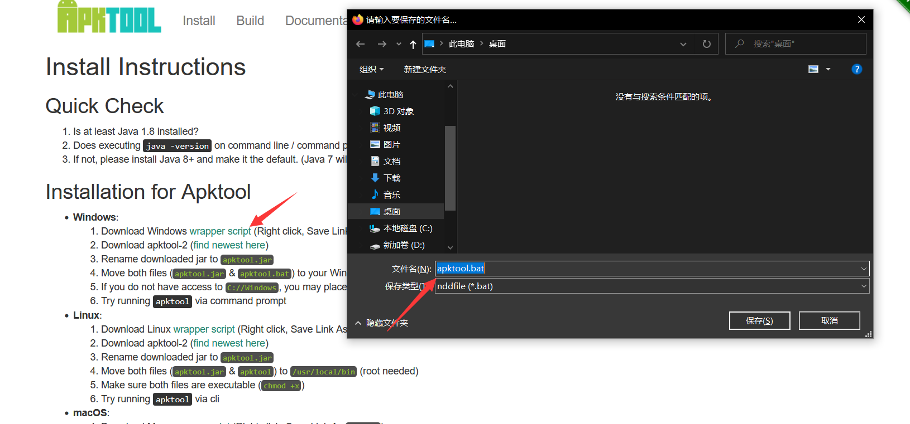

选择`find newest here`然后继续下载最新的jar即可。


### 2.2.2. 测试

这里输入执行命令后，只要打印出相关的信息就证明成功了。

```
apktool
```

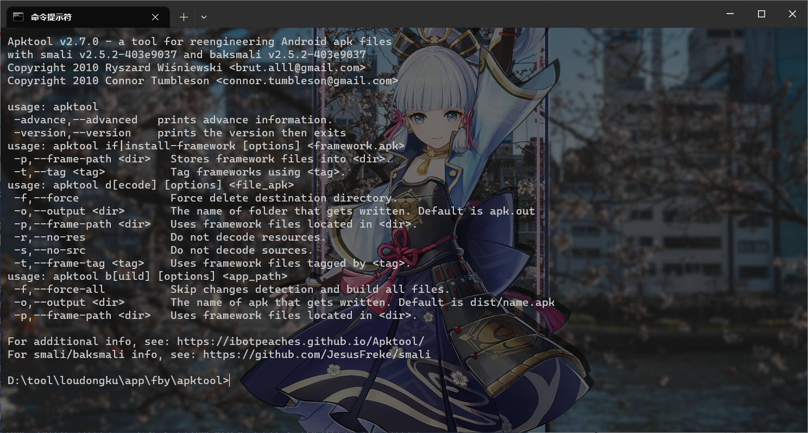

## 2.3. 下载dex2jar工具

将 classes.dex 转换为jar文件。

### 2.3.1. 下载链接

[dex2jar](https://sourceforge.net/projects/dex2jar/files/)

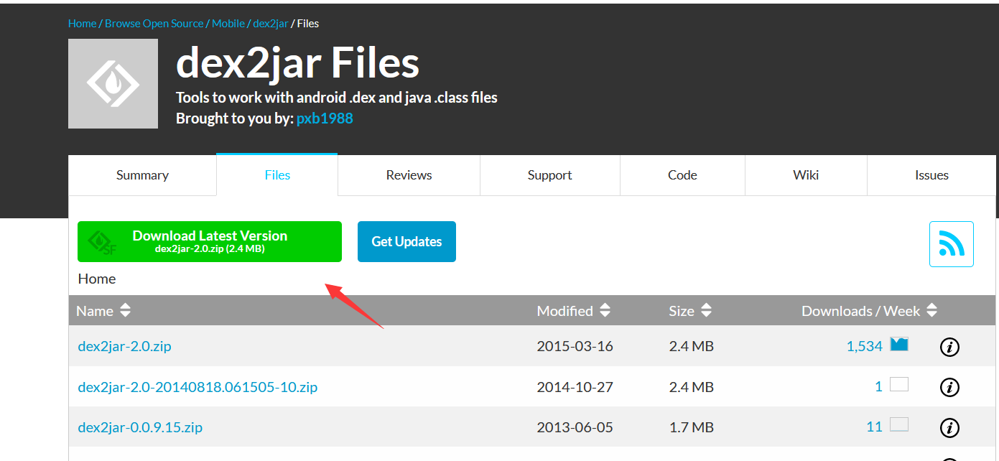

# 3. 查壳脱壳

查壳和脱壳主要是在我们对APK文件进行反编译的时候，可能会出现APK文件带壳，那么想要顺利的对APK文件进行反编译就需要脱壳，当然啦一边APK文件能够加壳的都是一些大企业才会添加的，普通的企业大概率是不会对APK文件进行加壳。

加壳是在二进制的程序中植入一段代码，在运行的时候优先取得程序的控制权，做一些额外的工作。大多数病毒就是基于此原理。是应用加固的一种手法对原始二进制原文进行加密/隐藏/混淆。 

作用：加壳的程序可以有效阻止对程序的反汇编分析，常用来保护软件版权，防止被软件破解。

## 3.1. 查壳

查壳主要就是方便对APK文件进行反编译，否则是无法对APK文件进行反编译的，这里网上有很多的工具，这里我就不给了，肯定有更好用的查壳工具，而且这个工具已经断更了，所以这里主要是为了演示。

这里我们准备两个APK文件，一个是探探的，一个是棋牌的APK文件。

### 3.1.1. 探探查壳

可以看到探探APK文件是使用了网易易盾进行加固，而且像这些大厂加固的壳，通常来说是比较难以脱壳的，毕竟加壳公司需要赚钱，如果轻易的被脱壳了，那么还怎么挣钱，当然啦，也不排除有大佬有这方面技术，当时人家也都是用来赚钱的，怎么会公开脱壳方式，而且公开了可能也会有一些风险，至于什么风险，想必应该都知道。


### 3.1.2. 棋牌查壳

这个棋牌是个非法软件，基本上不可能会对软件进行加壳的，那么像这种没有壳的就能够对其进行反编译，或者能够脱壳的APK文件均可以进行反编译。


## 3.2. 脱壳

脱壳就是将原本加壳的APK文件进行脱壳操作，这样就可以将APK文件进行反编译，但是还是那句话，大厂的加壳不是那么轻易脱的，小厂的可能还能将就着脱。

[BlackDex](https://github.com/CodingGay/Blackdex)

### 3.2.1. 某妃脱壳

这里演示一下某妃脱壳，某妃是没有壳的，你想一个色色APP开发者可能会考虑那么多的安全性么？

#### 3.2.1.1. 尝试脱壳

可以看到这里是脱壳成功了，那么文件也就存储在这个链接中，如果想要将文件提取出来，就可以进入到这个链接中去提取出来。


#### 3.2.1.2. 下载文件

这里由于使用模拟器中的文件复制粘贴，有点不好操作，这里就使用终端进行下载文件了。

```
adb pull 模拟器中文件路径 下载到主机的路径
```


#### 3.2.1.3. 打开文件

这里就可以使用刚刚的jadx工具打开文件了。

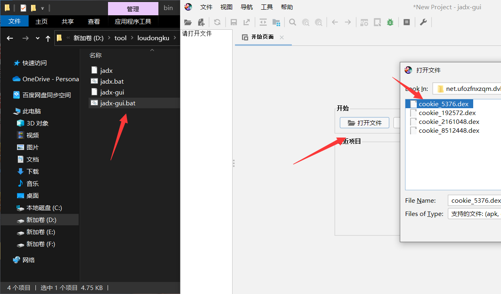

#### 3.2.1.4. 打开效果

这里就能够看到打开的效果了，当然在某妃下面不单单这一个文件，还有三个都可以。


## 3.3. 总结

本来想找一个脱壳失败的截图，我发现这工具居然基本上都能脱壳，但是至于脱出来的内容有没有用，我不是大佬就不得知了。

# 4. 反编译

反编译其实就是我们下载到的 App 安装包是 Apk 文件(Android Application Package),通过 Apk 文件，我们也可以得到这个应用的代码和资源文件，对应用进行修改。

而在渗透测试中反编译其实就是相当于测试是否能够被反编译，如果能够被反编译，并且修改里面的内容，使其绕过官方限制，当然一些无伤大雅的修改可能不会造成那么大的严重后果，但是如果修改看一些核心内容，那么就可能会造成一些未知的后果，那么这个APP程序就不算安全。

## 4.1. 其它

由于个人水平较差，同时写文章主要也是学习记录，所以这里我也就使用简单一点的APP来进行反编译，至于复杂的，就算我反编译了，也是不知道原理，那么还不如看别人的呢。

当然我写这个文章也是给自己的学习留下笔记，后面可以保证自己能够快速回忆起。

## 4.2. 反编译尝试

我们就使用无壳的进行测试，有壳的话，肯定就需要先脱壳了，这里需要进入apktool目录下执行命令，当然如果你配置了环境变量，那么就不需要进入目录了。

这里我也是在网上随便找了一个简单的APP来进行测试，这个是一个空APP，源文章在下面：

[反编译一款APP然后重新打包](https://www.cnblogs.com/niceyoo/p/13303136.html)

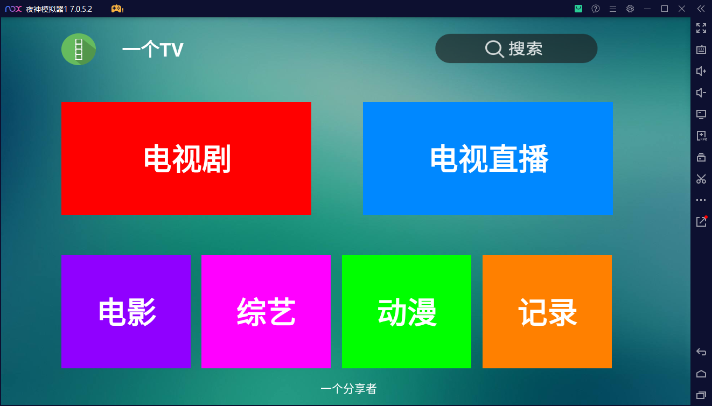

### 4.2.1. apktool工具

不过反编译后的文件是在apktool目录下的，使用总归还是需要进入目录的。

需要注意：d,代表反编译，b代表回编译。

```
apktool d APK文件
```


### 4.2.2. 查看编译效果

这里我们反编译后获取到的是smail文件，而我们需要的是.dex文件。

这里我找了一下网上对反编译后的各个文件夹的解释：

Apk文件本质上其实是一个zip包。直接拿解压工具解压就可以看到其中包含了什么。下面简单介绍一下Apk文件的结构。

- AndroidManifest.xml：应用的全局配置文件
- assets文件夹：原始资源文件夹，对应着Android工程的assets文件夹，一般用于存放原始的网页、音频等等，与res文件夹的区别这里不再赘述，可以参考上面介绍的两篇文章。
- classes.dex：源代码编译成class后，转成jar，再压缩成dex文件，dex是可以直接在Android虚拟机上运行的文件。
- lib文件夹：引用的第三方sdk的so文件。
- META-INF文件夹：Apk签名文件。
- res文件夹：资源文件，包括了布局、图片等等。
- resources.arsc：记录资源文件和资源id的映射关系。

我们已经得到一个可以用文本编辑器打开的阅读的AndroidManifest.xml文件、assets文件夹、res文件夹、smali文件夹等等。original文件夹是原始的AndroidManifest.xml文件，res文件夹是反编译出来的所有资源，smali文件夹是反编译出来的代码。注意，smali文件夹下面，结构和我们的源代码的package一模一样，只不过换成了smali语言。它有点类似于汇编的语法，是Android虚拟机所使用的寄存器语言。

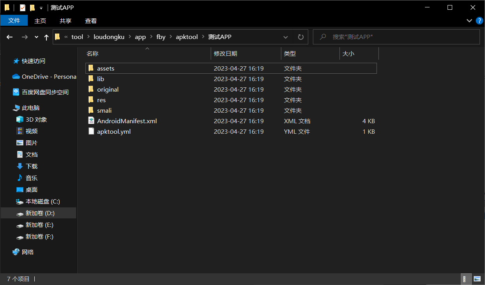

### 4.2.3. 保留dex文件

再次回到文件中，就可以看到里面存在dex文件了。

```
apktool d -s -f D:\tool\loudongku\app\测试文件夹\测试APP.apk
```

```
d ##反编译 apk 文件，注意需要这里是使用d，而不是-d
-s ##不反编译 dex 文件，而是将其保留
-f ##如果目标文件夹存在，则删除后重新反编译
```


### 4.2.4. 其它方式获取dex文件

dex文件可以使用上述的办法进行获取，不过这里还可以使用其它的办法获取。

#### 4.2.4.1. 修改APK后缀

这里可以将要反编译的 APK 后缀名改为 .rar 或者 .zip，并解压，得到其中的classes.dex 文件（它就是java文件编译再通过dx工具打包而成的）。

通过这个办法同样能够获取到这个dex文件，同时可以看到xml文件，但是这个xml文件是未经过反编译的，所以是打不开的。

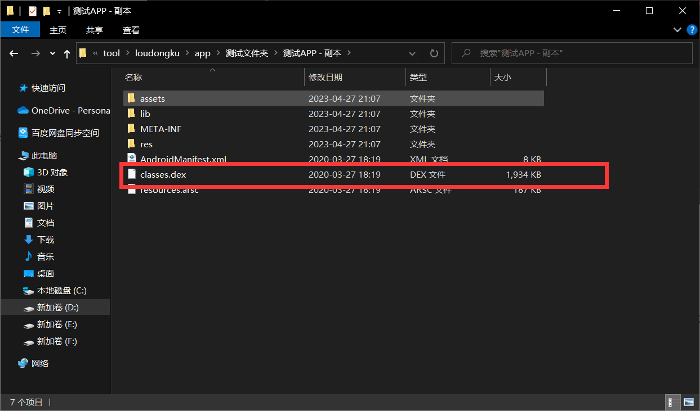

## 4.3. 编译java源码

这里在获取到dex文件后，就可以使用dex2jar进行生成jar文件，这个文件主要是用于来分析逻辑的，若修改的话还是需要在xml文件中修改的，也就是之前通过apktool工具获取到的xml文件进行修改。

### 4.3.1. 移动dex文件

这里我们将dex文件移动到dex2jar目录下。

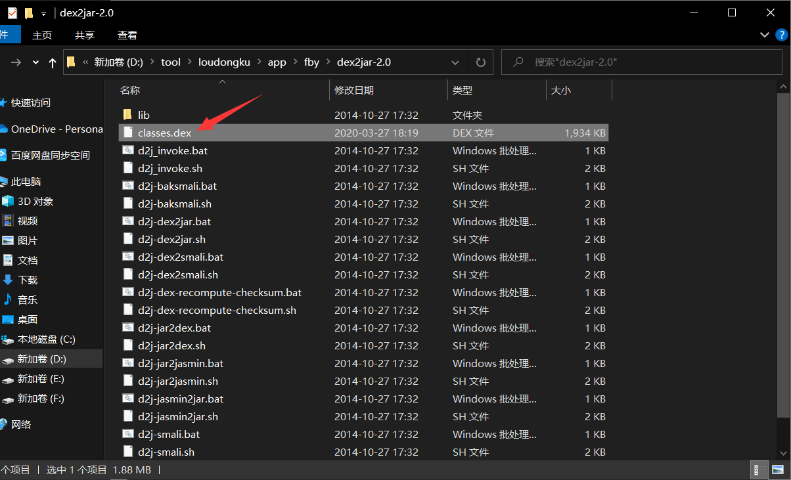

### 4.3.2. 执行命令

这里我们通过执行命令，使其dex文件变成jar文件。

```
d2j-dex2jar classes.dex
```

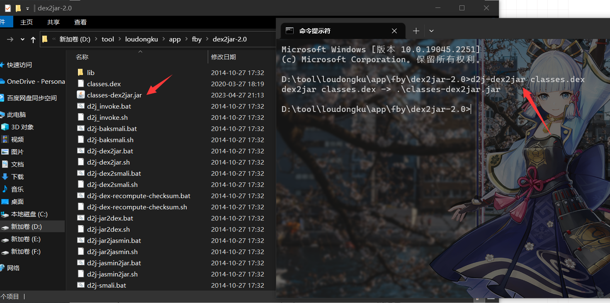

### 4.3.3. 查看源码

这里同样可以使用jadx工具来查看源码，这里直接将文件拖拽进去即可。


### 4.3.4. 总结

这里翻译成java代码还方面在进行反编译的时候进行代码的还原，否则xml文件不好反编译，但是修改还是需要修改xml中的文件。

# 5. 后续流程

## 5.1. 修改数据

到这里我们就可以对数据进行修改了，但是我这里还是需要说一句，由于我也是临时学到这里，更细致的反编译也不是一句话两句话就能够将清楚的，我们主要需要知道一个整体的流程，具体详细的内容，还需要各位自行的学习。

### 5.1.1. 修改apk文件名称

这里也没找太复杂的apk文件进行修改，同时这个apk文件中也没什么内容可修改的，所以就修改apk名称吧！

这里我是将原先的名称修改为`djyt`


## 5.2. 回编译

这里的回编译就是将修改后的文件恢复，当执行完下面的命令后，会在原先的文件夹下生成一个 dist 目录，目录下有个apk文件，这个apk文件就是安装好的。

不过这里还不能安装，由于apk文件都是需要签名的，若没有签名或者是使用第三方签名，都可以判断app存在漏洞。

```
apktool b 文件夹名称
```

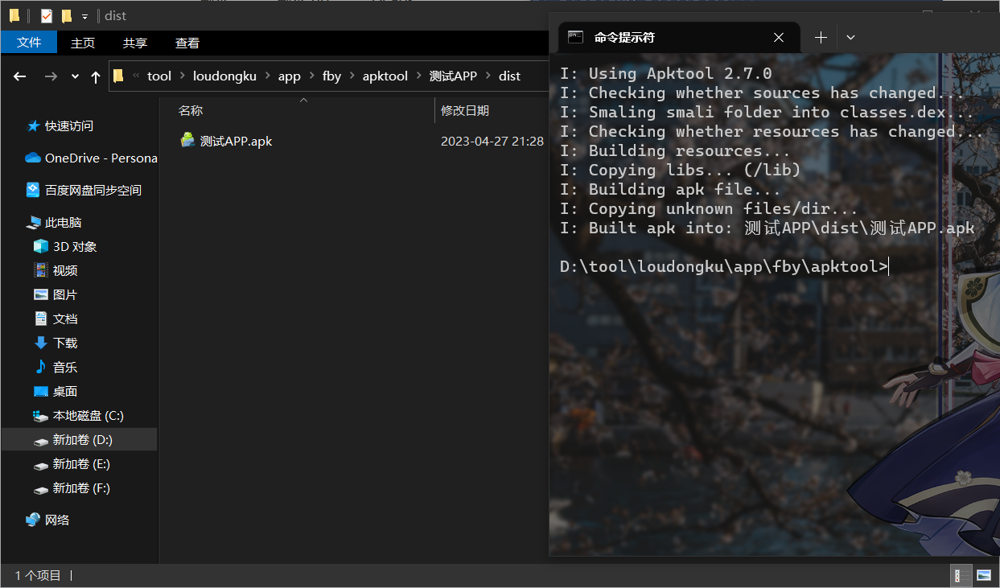

## 5.3. 应用签名

这里上面参考的文章中，在应用签名这里挖了一个很大的坑，如果是mac电脑还好，如果是Windows电脑，直接就是一个大坑。介绍的是Windows的应用签名，但是最好采用的是mac工具进行应用签名，所以我说挖了一个很大的坑。

~~关于应用签名这里，我也没找到好的办法，都挺复杂的，由于个人能力有限应用签名实在是无能为力了，当然有安卓修改大师可以一键修改，生成等，可以去了解了解，这里我就不介绍了。~~

~~属实无能为力，而且文章也相当于烂尾了，后续找找相关资料，看看有没有相关的app渗透需要检测哪些内容，除了基本的漏洞挖掘，看看有没有其它的方面也属于安全测试范围内的。~~

### 5.3.1. MT管理器签名

这里将之前回编译获取到的APK，上传到模拟器中，然后打开MT管理器，找到刚刚上传的APK文件，点击就会出现签名。

可以看到这里并没有签名，这里点击功能，就会出现选项，确认即可，就会在当前目录下生成一个文件。

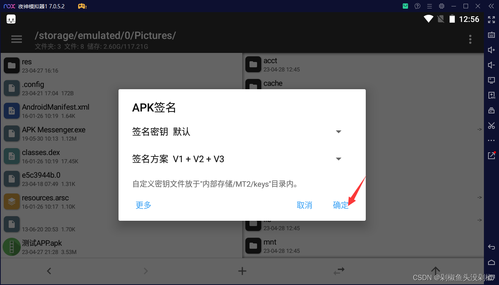

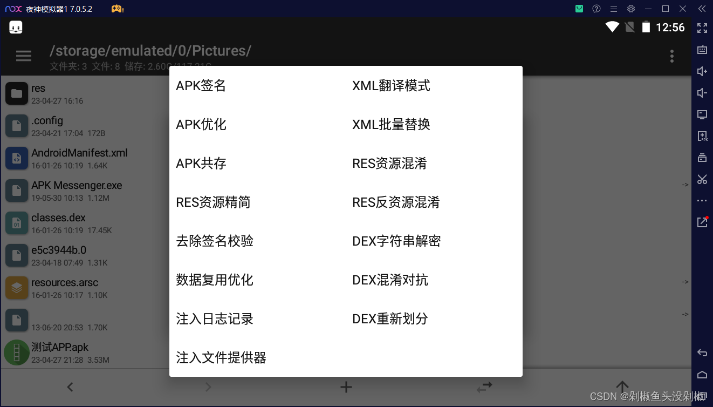

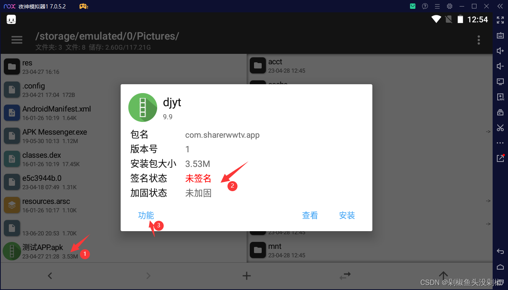

### 5.3.2. 查看效果

可以看到当前目录下生成另外一个APK文件了，我们点击安装即可。

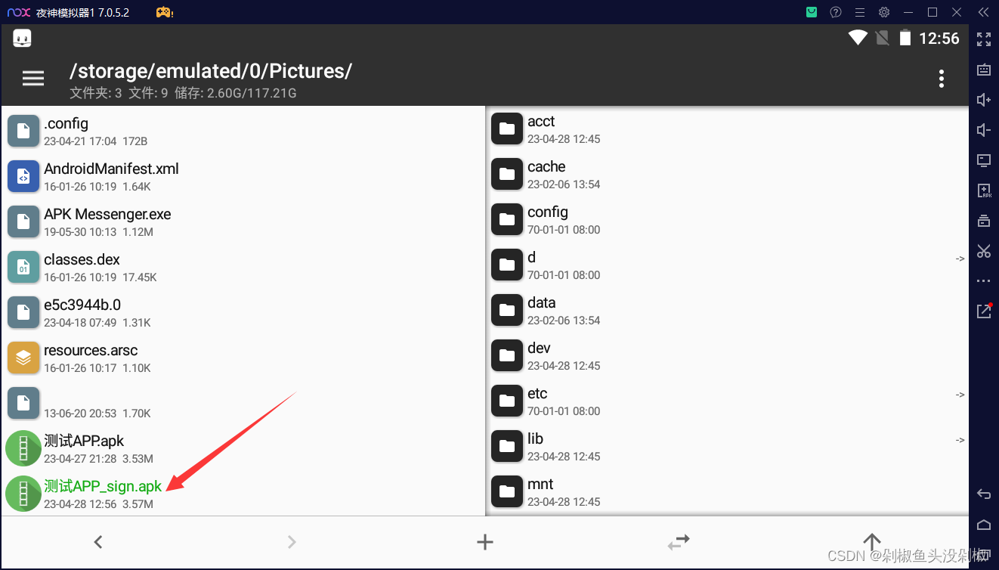

### 5.3.3. 查看安装后效果

这里可以看到，我们刚刚修改的就是名称，所以这里显示的就是`djyt`了。

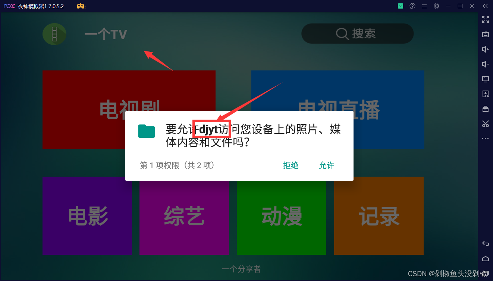