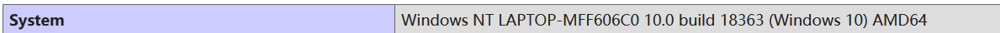

**.git、.svn、.hg、.DS_Store等泄露，都用dvcs-ripper工具挺好**（尤其.svn，其他工具都有点拉跨）

## 一、phpinfo()信息泄露

PHPInfo()函数主要用于网站建设过程中测试搭建的PHP环境是否正确，很多网站在测试完毕后并没有及时删除，因此当访问这些测试页面时，会输出服务器的关键信息，这些信息的泄露将导致服务器被渗透的风险。
 该函数返回 PHP 的所有信息，包括了 PHP 的编译选项及扩充配置、PHP 版本、服务器信息及环境变量、PHP 环境变量、操作系统版本信息、路径及环境变量配置、HTTP 标头、及版权宣告等信息。

```
查找phpinfo页面的方法：
1、使用web扫描工具进行扫描。 
2、手工构造网站url，http://127.0.0.1/index.php?cmd=phpinfo();或者http://127.0.0.1/phpinfo.php
```

### 1、操作系统版本（system）



### 2、php扩展的路径（extension_dir）


### 3、web根目录


### 4、绝对路径


### 5、支持的程序

可以通过phpinfo()查看系统支持的程序服务，比如redis、memcache、mysql、SMTP、curl等

### 6、泄露真实IP

http_x_real_ip配置项可以直接获取到真实IP，无视代理和cdn。

### 7、敏感配置

可以查看很多配置选项是否开启，比如：llow_url_include、allow_url_fopen、disable_functions、open_basedir、short_open_tag等等。


允许<??>这种形式，并且<?=等价于<? echo
 

### 8、gopher

如果支持gopher，可以利用ssrf漏洞。
  Gopher是Internet.上一个很有名的信息查找系统，它将Internet.上的文件组织成某种索引，很方便用户获取。Gopher协议使得Internet上的所有Gopher客户程序能够与已注册的Gopher服务器对话。简单来说，在WWW出现之前，Gopher 是Internet.上最主要的检索工具。

```
它的使用格式是gopher://url。
在SSRF中经常会使用Gopher来构造GET/POST包攻击应用。
```

### 9、fastcgi

查看是否开启fastcgi和fastcgi的版本，可能导致解析漏洞、远程命令执行、任意文件读取等问题。
 Nginx默认以CGI的方式支持PHP解析，普遍的做法是在Nginx配置文件中通过正则匹配设置SCRIPT_FILENAME。

当访问 `http://ip/phpinfo.jpg/1.php` 这个URL时，`$fastcgi_script_name` 会被设置为 `phpinfo.jpg/1.php` ，然后构造成`SCRIPT_FILENAME` 传递给 PHP CGI。如果 PHP 中开启了 fix_pathinfo 选项，PHP 会认为 `SCRIPT_FILENAME` 是 phpinfo.jpg，而 1.php 是 `PATH_INFO`，所以就会将 phpinfo.jpg 作为 PHP 文件来解析。

------

## 二、js敏感信息泄露

javascript作为一种客户端脚本语言，边解释边执行，其源码可以被任何用户通过网页获取。但是有些时候，开发者不注意将一些敏感信息保存在了JavaScript中，导致攻击者可以对这些信息加以利用。

### 1、JS文件泄露后台管理敏感路径及API

此类问题主要存在于后台登陆页面以及类似网页内引入的JS文件中。在企业渗透测试时如果遇到后台，在SQL注入或者是路径爆破都试过，但是仍然无法进入后台时。根据此类漏洞，说不定登陆页面下引入的js文件暴露的后台路径会成为突破口。如果某台的某一个页面没有对是否登陆状态做验证，攻击者就可以一次未授权访问这些暴露的API，实现篡改前台内容甚至是getshell。

### 2、页面内JS泄露http-only保护的cookie

程序员直接将受http-only保护的cookie写入页面，导致通过利用crossdoamin.xml配置不当等漏洞，攻击者可以轻松跨域读取到受保护的cookie。

### 3、页面内JS以及AJAX请求泄露用户敏感信息

此类漏洞常见该类型的泄露常见于网站评论功能实现处。其实该类型的漏洞比通过jsonp漏洞收集用户敏感信息来的更加快捷容易。由于程序员疏忽直接在页面的js以及AJAX请求返回的内容中输出参与评论用户的敏感信息，导致攻击者可以轻松获取用户的手机号，真实姓名，注册邮箱，住址甚至有可能获取用户手机的IMEI，和抽奖和抽中的游戏礼包号。

------

## 三、Web源码泄露

### 1、git源码泄露

Git是一个开源的分布式版本控制系统，在执行git init初始化目录的时候，会在当前目录下自动创建一个.git目录，用来记录代码的变更记录等。发布代码的时候，如果没有把.git这个目录删除，就直接发布到了服务器上，攻击者就可以通过它来恢复源代码。

```
漏洞利用工具：GitHack
github项目地址：https://github.com/lijiejie/GitHack
用法示例：
GitHack.py http://www.openssl.org/.git/
1234
```

### 2、svn源码泄露

SVN是一个开放源代码的版本控制系统。在使用SVN管理本地代码过程中，会自动生成一个名为.svn的隐藏文件夹，其中包含重要的源代码信息。网站管理员在发布代码时，没有使用‘导出’功能，而是直接复制代码文件夹到WEB服务器上，这就使.svn隐藏文件夹被暴露于外网环境。

```
可以利用.svn/entries文件，获取到服务器源码。
漏洞利用工具：Seay SVN漏洞利用工具
```

```
利用工具：dvcs-ripper的rip-svn.pl脚本
```

例题示意：

```cmd
python3 dirsearch.py -u http://challenge-09e40d4fa439d842.sandbox.ctfhub.com:10800/ -e *发现存在.svn泄露

使用dvcs-ripper工具中的 rip-svn.pl脚本进行 clone
./rip-svn.pl -u -v http://challenge-09e40d4fa439d842.sandbox.ctfhub.com:10800/.svn/
```

注意：这里查看dump下来的文件一定要用**ls -al**命令，不然看不到.svn等文件夹


从wc.db中找到flag的文件的文件名, 尝试访问结果发现被删除了

```
cat wc.db | grep -a flag
```


转而查找.svn/pristine/ 中的文件(仔细点找)，找到flag——ctfhub{fc8dfadda86879a9956cde97}


### 3、hg源码泄漏

Mercurial 是一种轻量级分布式版本控制系统，使用 hg init的时候会生成.hg。

```
漏洞利用工具： dvcs-ripper
github项目地址： https://github.com/kost/dvcs-ripper
用法示例：
rip-hg.pl -v -u http://www.example.com/.hg/
1234
```

### 4、CVS泄露

CVS是一个C/S系统，多个开发人员通过一个中心版本控制系统来记录文件版本，从而达到保证文件同步的目的。主要是针对 CVS/Root以及CVS/Entries目录，直接就可以看到泄露的信息。

```
http://url/CVS/Root 返回根信息 
http://url/CVS/Entries 返回所有文件的结构
12
漏洞利用工具：dvcs-ripper
github项目地址：https://github.com/kost/dvcs-ripper.git
运行示例:
rip-cvs.pl -v -u http://www.example.com/CVS/
1234
```

### 5、Bazaar/bzr泄露

bzr也是个版本控制工具, 虽然不是很热门, 但它也是多平台支持, 并且有不错的图形界面。

```
运行示例：
rip-bzr.pl -v -u http://www.example.com/.bzr/
```

### 6、网站备份压缩文件

管理员将网站源代码备份在Web目录下，攻击者通过猜解文件路径，下载备份文件，导致源代码泄露。

```
常见的备份文件后缀：
.rar
.zip
.7z
.tar.gz
.bak
.txt
.old
.temp
漏洞利用工具：御剑等目录扫描工具
```

### 7、WEB-INF/web.xml 泄露

WEB-INF是Java的WEB应用的安全目录，如果想在页面中直接访问其中的文件，必须通过web.xml文件对要访问的文件进行相应映射才能访问。

```
WEB-INF 主要包含一下文件或目录：
WEB-INF/web.xml : Web应用程序配置文件, 描述了servlet和其他的应用组件配置及命名规则.
WEB-INF/database.properties : 数据库配置文件
WEB-INF/classes/ : 一般用来存放Java类文件(.class)
WEB-INF/lib/ : 用来存放打包好的库(.jar)
WEB-INF/src/ : 用来放源代码(.asp和.php等)
```

通过找到 web.xml 文件，推断 class 文件的路径，最后直接 class 文件，再通过反编译 class 文件，得到网站源码。

### 8、DS_Store 文件泄露

.DS_Store是Mac下Finder用来保存如何展示 文件/文件夹 的数据文件，每个文件夹下对应一个。如果将.DS_Store上传部署到服务器，可能造成文件目录结构泄漏，特别是备份文件、源代码文件。

```
漏洞利用工具：
github项目地址： https://github.com/lijiejie/ds_store_exp
用法示例：
ds_store_exp.py http://hd.zj.qq.com/themes/galaxyw/.DS_Store
```

### 9、SWP 文件泄露

swp即swap文件，在编辑文件时产生的临时文件，它是隐藏文件，如果程序正常退出，临时文件自动删除，如果意外退出就会保留，文件名为 .filename.swp。

```
漏洞利用：直接访问.swp文件，下载回来后删掉末尾的.swp，获得源码文件。
```

### 10、GitHub源码泄漏

GitHub是一个面向开源及私有软件项目的托管平台。很多人喜欢把自己的代码上传到平台托管，通过关键词进行搜索，可以找到关于目标站点的敏感信息，甚至可以下载网站源码。

参考链接：[zhuanlan.zhihu.com/p/110389472](https://zhuanlan.zhihu.com/p/110389472)

------

## 四、软件等敏感信息泄露

### 1、操作系统版本

```
可用nmap扫描得知
　　nmap -o -A
```

### 2、中间件的类型、版本

```
http返回头
　　404报错页面
　　使用工具（如whatweb）
```

### 3、web程序（cms类型及版本、敏感信息）

```
可用whatweb、cms_identify 
```

------

## 五、web敏感信息

```html
1、外网泄露测试页面
   test.cgi、info.php等。phpinfo页面也属于测试页面。
2、编辑器备份文件泄漏
   http://[ip]/.test.php.swp
   http://[ip]/test.php.bak
   http://[ip]/test.jsp.old
   http://[ip]/cgi~
   常见编辑器备份后缀
3\版本管理工具(如git)文件信息泄漏
   http://[ip]/.git/config
   http://[ip]/CVS/Entriesp
   http://[ip]/.svn/entriesp
4、HTTP认证泄漏漏洞
   http://[ip]/basic/index.php
   Web目录开启了HTTP Basic认证，但未限制IP，导致可暴力破解账号、密码
5、管理后台地址泄漏
   http://[ip]/login.php
   http://[ip]/admin.php
   http://[ip]/manager.php
   http://[ip]/admin_login.php
6、泄漏员工邮箱、分机号码
泄漏邮箱及分机号码可被社工，也可生成字典
7、错误页面暴漏信息，面熟sql错误、php错误、暴漏cms版本等
8、探针文件
9、robots.txt
10、phpMyAdmin
11、网站源码备份文件(www.rar/sitename.tar.gz/web/zip等)
```