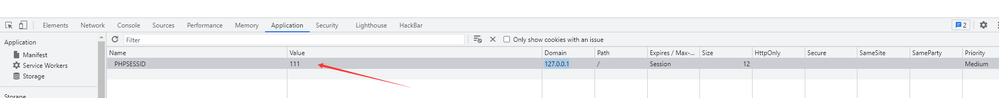
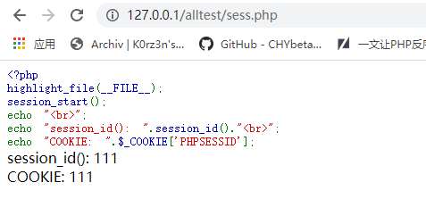

这一篇介绍一下Session反序列化。

<!--more-->

## 1.Session到底是啥？

前面我们说到，Session是浏览器和服务器之间交互的会话，会话是啥呢？就是我问候你好吗？你回答说很好。就是一次会话，那么对话完成后，这次会话相当于就结束了，但为什么会出现Session会话呢？因为我们用浏览器访问网站用的是`http`协议，`http`协议是一种无状态的协议

就是说它不会储存任何东西，每一次的请求都是没有关联的，无状态的协议好处就是快速；但它也有不方便的地方，比如说我们在`login.php`登录了，我们肯定希望在`index.php`中也是登录的状态，否则我们登录还有什么意义呢？但前面说到了`http`协议是无状态的协议，那访问两个页面就是发起两个`http`请求，他们俩之间是无关联的，所以无法单纯的在index.php中读取到它在login.php中已经登陆了的；为了解决这个问题，`cookie`就诞生了，`cookie`是把少量数据存在**客户端**，它在一个域名下是全局的，相当于`php`可以在这个域名下的任何页面读取`cookie`信息，那只要我们访问的两个页面在同一个域名下，那就可以通过`cookie`获取到登录信息了；但这里就存在安全问题了，因为`cookie`是存在于客户端的，那用户就是可见的，并且可以随意修改的；那如何又要安全，又可以全局读取信息呢？这时候Session就出现了，其实它的本质和`cookie`是一样的，只不过它是存在于服务器端的

## 2.Session的产生和保存

上面讲了Session产生的原因，那它具体长啥样子呢？这里我们用`php`中的Session机制，因为后面讲的反序列化也是基于`php`的嘛

首先，当我们需要使用Session时，我们要首先打开Session，开启Session的语句是`session_start();`，这个函数没有任何返回值，既不会成功也不会报错，它的作用是打开Session，并且随机生成一个32位的session_id，session的全部机制也是基于这个session_id，服务器就是通过这个唯一的session_id来区分出这是哪个用户访问的：

```php
<?php
highlight_file(__FILE__);
session_start();
echo "session_id(): ".session_id()."<br>";
echo "COOKIE: ".$_COOKIE["PHPSESSID"];
```

image.png

这里可以看出`session_id()`这个系统方法是输出了本次生成的`session_id`，并且存入了`COOKIE`中，参数名为`PHPSESSID`，这两个值是相同的，而且只要浏览器一直不关，无论刷新多少次它的值都是不变的，但当你关掉浏览器之后它就消失了，重新打开之后会生成一个新的`session_id`，`session_id`就是用来标识一个用户的，就像是一个人的身份证一样，接下来就来看看`session`它是怎么保存的：

它是保存在服务器中的临时目录下的，保存的路径需要看`php.ini`的配置，我的是保存在`D:\phpStudy\PHPTutorial\tmp\tmp`这个路径下的，我们可以打开来看看：

image.png

可以看到它的储存形式是文件名为`sess`+`_`+`session_id`，那我们能不能通过修改`COOKIE`中`PHPSESSID`的值来修改`session_id`呢？

image.png

然后刷新页面，可以发现成功了，成功修改了`session_id`的值，并且去保存的路径下去看发现也成功写进去了：

image.png

image.png

image.png

但由上图可知，它的文件内容是为空的，里面什么都没有，那我们能不能尝试往里面写入东西呢？依然在`a.php`中操作，给它赋个值：

image.png

image.png

发现成功写进去了，它的内容就是将键值对**序列化**之后的结果

我们把大致过程总结一下：

就是HTTP请求一个页面后，如果用到开启`session`，会去读`COOKIE`中的`PHPSESSID`是否有，如果没有，则会新生成一个`session_id`，先存入`COOKIE`中的`PHPSESSID`中，再生成一个`sess_`前缀文件。当有**写入**`$_SESSION`的时候，就会往`sess_`文件里序列化写入数据。当**读取**到`session`变量的时候，先会读取`COOKIE`中的`PHPSESSID`，获得`session_id`，然后再去找这个`sess_session_id`文件，来获取对应的数据。由于默认的`PHPSESSID`是临时的会话，在浏览器关闭后就会消失，所以，当我们打开浏览器重新访问的时候，就会新生成`session_id`和`sess_session_id`这个文件。

## 3.有关的配置

好了，上面铺垫了这么多，应该明白`Session`是什么以及`Session`的机制了，下面就开始正式进入正题，来看看`Session`反序列化

首先，我们先去`php.ini`中去看几项与`session`有关的配置：

1.`session.save_path`：这个是`session`的存储路径，也就是上文中`sess_session_id`那个文件存储的路径

image.png

2.`session.auto_start`：这个开关是指定是否在请求开始时就自动启动一个会话，默认为Off；如果它为`On`的话，相当于就先执行了一个`session_start()`，会生成一个`session_id`，一般来说这个开关是不会打开的

image.png

3.`session.save_handler`：这个是设置用户自定义`session`存储的选项，默认是`files`，也就是以文件的形式来存储的，当然你也可以选择其它的形式，比如说数据库啥的

image.png

4.`session.serialize_handler`：这个是最为重要的一个，用来定义`session`序列化存储所用的处理器的名称，不同的处理器序列化以及读取出来会产生不同的结果；默认的处理器为`php`，常见的还有`php_binary`和`php_serialize`，接下来来一个一个的看它们：

image.png

首先是`php`，因为它默认就是`php`，所以说用的应该是最多的，它处理之后的格式是**键名+竖线|+经过`serialize()`序列化处理后的值**

image.png

然后我们来看`php_binary`，首先我们把处理器换成`php_binary`需要用语句`ini_set('session.serialize_handler','php_binary');`这个处理器的格式是**键名的长度对应的 ASCII 字符 ＋ 键名 ＋ 经过 serialize() 函数序列化处理后的值**；注意这个键名的长度所所对应的ASCII字符，就比如说键名长度为4，那它对应的就是ASCII码为4的字符，是个不可见字符EOT，具体可见下表，从1到31都是不可见字符

image.png

所以说它最后的结果如下，框框代表的就是不可见字符：

image.png

最后我们来看`php_serialize`，这个处理器需要php版本>5.5.4才能使用，首先我们还是得先用`ini_set`进行设置，语句如下：`ini_set('session.serialize_handler','php_serialize');`这个的格式是**直接进行序列化，把`session`中的键和值都会被进行序列化操作**，然后把它当成一个数组返回回来：

image.png

## 4.Session反序列化原理

讲了这么多，相信很多人还是一头雾水，那为什么会产生`Session`反序列化漏洞呢？这个问题其实也困扰了我很久，以前我也是只知道操作但不清楚原理，知道前面加个`|`就可以成功但至于为什么就一脸懵逼，因为我们都知道`Session`反序列化是不需要`unserialize()`函数就可以实现的，那这具体是怎么实现的呢？今天就来把它彻底搞懂：

首先我们再来看看`session_start()`函数，前面我们看到的是没有打开`Session`的情况下它是打开`Session`并且返回一个`session_id`，但假如我们前面就已经打开了`Session`呢？这里我们再来看看官方文档：

image.png

这里重点看我框了的内容，尤其我箭头指向的地方，它会自动反序列化数据，那就很漂亮啊！这里就解决了没有`unserialize()`的问题，那我们可不可以考虑先把序列化后的数据写入`sess_session_id`文件中，然后在有反序列化漏洞页面刷新页面，由于这个页面依然有`session_start()`，那它就去读取那个文件的内容，然后自动进行反序列化操作，这样就会触发反序列化漏洞，完美！！

这个思路理论上是可以成功的，但这里还有一个核心问题没有解决，就是说我们怎么让它**反序列化的是我们传入的序列化的内容**，因为我们传入的是键值对，那么`session`序列化存储所用的处理器肯定也是将这个**键值对**写了进去，那我们怎么让它正好反序列化到我们传入的内容呢？这里就需要介绍出**两种处理器的差别**了，`php`处理器写入时的格式为`键名+竖线|+经过serialize()序列化处理后的值`那它读取时，肯定就会以`竖线|`作为一个分隔符，前面的为键名，后面的为键值，然后将键值进行**反序列化**操作；而`php_serialize`处理器是直接进行序列化，然后返回**序列化后的数组**，那我们能不能在我们传入的序列化内容前加一个分隔符`|`，从而正好**序列化我们传入的内容呢**？

这肯定是可以的，而这正是我们`Session`反序列化的原理，如果看到这有点发晕的话，没关系，咱接着往下看，接下来咱来分析一个例子

## 5.案例分析

首先我们来写一个存在反序列化漏洞的页面：

```php
<?php
highlight_file(__FILE__);
ini_set('session.serialize_handler', 'php');
session_start();
class Test{
    public $code;
    function __wakeup(){
    eval($this->code);
    }
}
?>
```

这应该是很简单的一个反序列化，反序列化后会先直接进入`__wakeup()`，然后就`eval`执行任意代码了，我们先写个exp：

```php
<?php
class Test{
    public $code='phpinfo();';
}
$a = new Test();
echo serialize($a);
?>
```

然后我们再写一个页面，因为这里既没有传参的点也没有反序列化的点，相对于有漏洞利用不了，那我们就写一个利用它的页面`sess.php`：

```php
<?php
highlight_file(__FILE__);
ini_set('session.serialize_handler', 'php_serialize');
session_start();
if(isset($_GET['test'])){
    $_SESSION['test']=$_GET['test'];
}
?>
```

有了这个页面我们就可以把想要的内容写入到`Session`中了，然后就可以在有漏洞的页面中执行反序列化了，接下来开始操作，首先运行`exp.php`：


然后我们通过`sess.php`将运行结果写入`Session`中，记得在前面加上`|`：


然后我们去看它成功写入`Session`没有，并且看看写入的内容是什么：


可以看到它已经成功写入进去了，并且内容也是我们想要的内容，按照`php`处理器的处理方法，会以`|`为分隔符，左边为键，右边为值，然后将值进行反序列化操作，那我们就去有漏洞的页面去刷新，看看它有没有反序列化之后触发反序列化漏洞：

