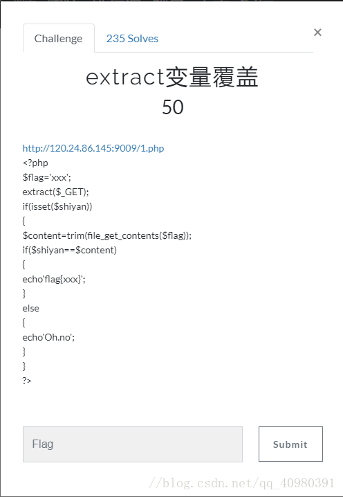
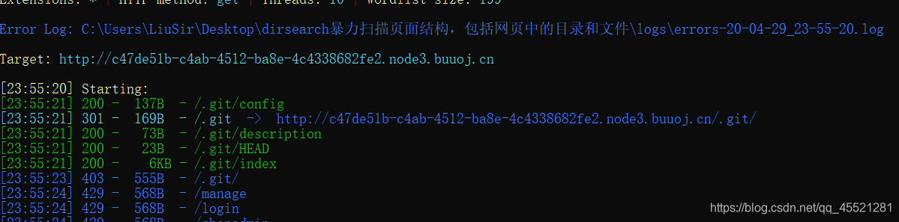
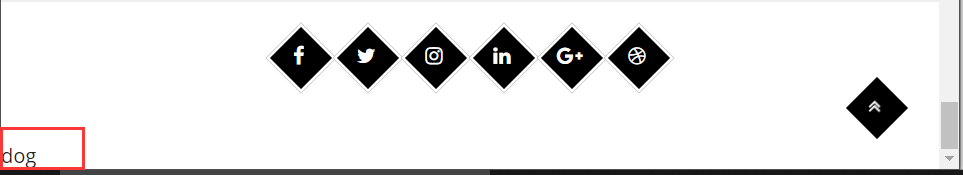

# 什么是变量覆盖漏洞

自定义的参数值替换原有变量值的情况称为变量覆盖漏洞
经常导致变量覆盖漏洞场景有：$$ 使用不当，extract() 函数使用不当，parse_str() 函数使用不当，import_request_variables() 使用不当，开启了全局变量注册等。

# 几种变量覆盖漏洞

## 0x01 全局变量覆盖

register_globals的意思就是注册为全局变量，所以当为On的时候，传递过来的值会被直接注册为全局变量直接使用，而Off的时候，我们需要到特定的数组里去得到它。

代码示例1：

```php
<?php  
//?id=1
$id=0;
echo "Register_globals: ".(int)ini_get("register_globals")."<br/>";   //ini_get — 获取一个配置选项的值
echo '$_GET["id"] :'.$_GET['id']."<br/>";
echo '$id :'.$id;
?>
```

**当register_globals=Off的时候，程序接收的时候应该用$_GET['id']来接受传递过来的值；
当register_globals=On的时候，程序可以直接使用$id来接受值，也可以用$_GET['id']来接受传递过来的值。**
**通过这种方式就可以向程序注册一个之前没有声明的变量，不过如果之前变量已经存在就无法覆盖掉，原已有变量值不变。**

如，上面的代码中，已经对变量$id赋了初始值，比如$id=0，那么即使在URL中有/test.php?id=1，也不会将变量覆盖，id值为0

### extract()变量覆盖

extract() 函数从数组中将变量导入到当前的符号表。

该函数使用数组键名作为变量名，使用数组键值作为变量值。针对数组中的每个元素，将在当前符号表中创建对应的一个变量。

实例：

    <?php
    $a = "Original";
    $my_array = array("a" => "Cat","b" => "Dog", "c" => "Horse");
    extract($my_array);
    echo "\$a = $a; \$b = $b; \$c = $c";
    ?>
        
    //运行结果：$a = Cat; $b = Dog; $c = Horse（Cat将Original覆盖了）

extract() 函数将检查和符号表中已存在的变量名是否冲突。对冲突的键名的处理将根据此参数决定。（EXTR_OVERWRITE - 默认。如果有冲突，则覆盖已有的变量。）

extract()这个函数在指定参数为EXTR_OVERWRITE或者没有指定函数可以导致变量覆盖。

    <?php  
        $auth = '0';  
        // 这里可以覆盖$auth的变量值
        extract($_GET);   
        if($auth == 1){  
            echo "private!";  
        } else{  
            echo "public!";  
        }  
    ?>
    // 构造payload：?auth=1即可




```php
一个名叫flag的变量等于‘xxx’
将通过GET传过来的数组转为一个名为数组键名，值为数组值的变量(如果新的变量和已有变量重名，会将已有变量替换)
如果存在一个名叫shiyan的字符串
将flag变量的值赋给名为content变量
如果变量shiyan和变量content的值相同，就输出flag的值，否则就输出Oh,no
因为extract()会把符号表中已存在的变量名的值替换掉，所以制造Payload ：?shiyan=&flag=
也就是利用新传入的值为空的flag替换原有的flag的值。构造空等于空，成功输出flag的值
```

file_get_contents() 函数把整个文件读入一个字符串中。这里一定要注意，如果文件不存在(比如自己编了一个文件xxxx.txt)，此函数返回fales（0）。
所以我们也可以构造以下payload：

```php
http://123.206.87.240:9009/1.php?shiyan=&flag=xxxx.txt
```

只要是flag的值是一个不存在的文件，content的值就为0。所以这里我们可以把shiyan的值设置为空。

## 0x02 $$导致的变量覆盖问题（重点）

由$$定义的变量为可变变量。就是说，一个变量的变量名可以动态的设置和使用。一个可变变量获取了一个普通变量的值作为这个可变变量的变量名。如：

```php
<?php
$a = 'hello';
$$a = 'world';
?>
```

例子中 hello 使用了两个美元符号（ ） 以 后 ， 就 可 以 作 为 一 个 可 变 变 量 的 变 量 了 。 这 时 ‘ ）以后，就可以作为一个可变变量的变量了。这时` ）以后，就可以作为一个可变变量的变量了。这时‘ a = ′ w o r l d ′ ‘ 即 可 表 示 为 ‘ a = 'world'`即可表示为` a=′world′‘即可表示为‘( a ) = a)= a)=(hello)=‘world’`，$a 的内容是“hello”并且 $hello 的内容是“world”。

先说一下foreach循环


```php
foreach 有以下两种语法格式：
//格式1
foreach (array_expression as $value){
  statement
}
//格式2
foreach (array_expression as $key => $value){
  statement
}
第一种格式遍历 array_expression 数组时，每次循环将数组的值赋给 $value；第二种遍历不仅将数组值赋给 $value，还将键名赋给 $key。
```

代码实例：

```php
<?php
$a='hi';
foreach ($_GET as $key => $value) {
	echo $key;
    ${$key} = $value;      // $$key = $value;
}
echo $a;
?>
```

get得到的数据$key和$value，关键第5行，${$key}用get传进来的$key做为新的变量，将get传进来的$value赋值给它。
get ?a=1 第5行回解析为${a}=1（即$a=1）。就造成了变量覆盖。

```php
<?php
foreach (array('_COOKIE','_POST','_GET') as $_request)  //把数组array中的每个值（如：'_COOKIE','_POST','_GET'）赋给变量$_request
{
    foreach ($$_request as $_key=>$_value)  //此处$_request的值在前面加上一个$，就成了'$_COOKIE','$_POST','$_GET'这几个预定义变量
    {
        $$_key = $_value;   //此处把GET到的id前再加上一个$就又构成了一个新的变量$id,其=1，即可往下进行
    }
}
$id = isset($id) ? $id : 2;
if($id == 1) {
    echo "flag{xxxxxxxxxx}";
    die();
}
echo $id;
?>
```

### 漏洞产生:

使用foreach来遍历数组中的值，然后再将获取到的数组键名作为变量名，数组中的键值作为变量的值。因此就产生了变量覆盖漏洞。请求?id=1 会将$id的值覆盖，$id=1。

## 0x03 parse_str()导致的变量覆盖

parse_str(string,array)函数把**查询字符串解析到变量中。 **

array参数规定存储变量的数组名称。该参数指示变量存储到一个指定的数组中。

注释：如果未设置 array 参数，由该函数设置的变量将覆盖已存在的同名变量。

查询字符串（URL参数）是指在URL的末尾加上用于向服务器发送信息的字符串（变量）。将“？”放在URL的末尾，然后再加上“参数＝值”，想加上多个参数的话，使用“&”。以这个形式，可以将想要发送给服务器的数据添加到URL中。

```php
// 把查询字符串解析到变量中：
<?php
parse_str("name=Peter&age=43");
echo $name."<br>";
echo $age;
?>
```

```php
//运行结果
Peter
43
parse_str函数的作用就是解析字符串并注册成变量，在注册变量之前不会验证当前变量是否存在，所以直接覆盖掉已有变量

<?php
$a = 1;                  //原变量值为1
parse_str('a=2');   //经过parse_str()函数后注册变量$a，重新赋值
print_r($a);          //输出结果为2
?>
```

漏洞重现

```php
<?php
error_reporting(0);
if(
empty($_GET['id'])) {                    //empty()检查是否为空
show_source(__FILE__);            //highlight_file—语法高亮一个文件
die();                                          //等同于exit—输出一个消息并且退出当前脚本
} else {
include ('flag.php');
$a = "www.OPENCTF.com";
$id = $_GET['id'];
@parse_str($id);
if ($a[0] != 'QNKCDZO' && md5($a[0]) == md5('QNKCDZO')) {
echo $flag;
} else {
exit('其实很简单其实并不难！');
}
}
?>
```

题目分析

```php
$a[0] != ‘QNKCDZO’ && md5($a[0]) == md5(‘QNKCDZO’)
PHP Hash比较存在缺陷
md5(‘QNKCDZO’)的结果是0e830400451993494058024219903391
//所以构造payload：?id=a[0]=s878926199a,即可得到flag
```

tips：parse_str()类似的函数还有mb_parse_str()，用法基本一致。

### 例题——[BJDCTF2020]Mark loves cat

进入题目，很酷的一个网站，

应该有git泄露。dirsearch扫描一下，果然发现/.git目录，

用githack获取得到源码：

```php
flag.php：

<?php

$flag = file_get_contents('/flag');xxxxxxxxxx flag.php：<?php$flag = file_get_contents('/flag');123
    index.php：

    
index.php：
<?php
include 'flag.php';
$yds = "dog";
$is = "cat";
$handsome = 'yds';

foreach($_POST as $x => $y){
    $$x = $y;
}

foreach($_GET as $x => $y){
    $$x = $$y;    //漏洞在这里  比如输入 yds=flag 相当于 $yds=$flag
}

foreach($_GET as $x => $y){
    if($_GET['flag'] === $x && $x !== 'flag'){	//GET方式传flag只能传一个flag=flag。//判断get传进来的值等不等于flag 如果等于flag则跳过
        exit($handsome);
    }
}

if(!isset($_GET['flag']) && !isset($_POST['flag'])){	//只要没有flag参数，就会exit($yds)，就可以得到flag了。
    exit($yds);
}

if($_POST['flag'] === 'flag'  || $_GET['flag'] === 'flag'){	//GET和POST传flag，必须不能是flag=flag
    exit($is);
}

echo "the flag is: ".$flag;
```

在这里如果我们什么也没有传入，仅刚一进去的初始状态，由于if(!isset($_GET['flag']) && !isset($_POST['flag']))所以会输出dog，尽管最后一行代码有echo "the flag is: ".$flag;他也不会执行：

在index.php中有三个exit()函数，表示结束并输出里面的内容，所以我们要用exit（）函数来输出我们的flag
这里我们借助exit($yds);这一个函数，我们构造pyload：

    GET：yds=flag
    POST:$flag=flag

这里由于：

    foreach($_GET as $x => $y){
        $$x = $$y;

GET输入 yds=flag 相当于 $yds=$flag，而$flag即成为了flag.php中的$flag， f l a g 就 是 真 正 的 f l a g X X X X X X 。 ‘ flag就是真正的flag{XXXXXX}。` flag就是真正的flagXXXXXX。‘$x = $ y ‘ ， 也 就 是 ‘ y`，也就是` y‘，也就是‘yds=flag{XXXXXX}`。
POST传入：$flag=flag：

    foreach($_POST as $x => $y){
        $$x = $y;

即$$flag=$flag
又

    if(!isset($_GET['flag']) && !isset($_POST['flag'])){	//只要没有flag参数，就会exit($yds)，就可以得到flag了。
        exit($yds);
    }

所以只要没有flag参数，就会exit($yds)，就可以得到flag了，所以这里POST传入的数据可以随意，只要不是flag=xxxxxx就行。