注意以下内容均基于 chrome，firefox 有比 chrome 更好的代码格式化能力，chrome 有比 firefox 跟好的代码调试能力。

# 查找目标

## 保留日志、停用缓存

分析一个网站的时候，肯定要先找发送数据的那个请求是在哪里的，这个时候可以勾选上保留日志和停用缓存。

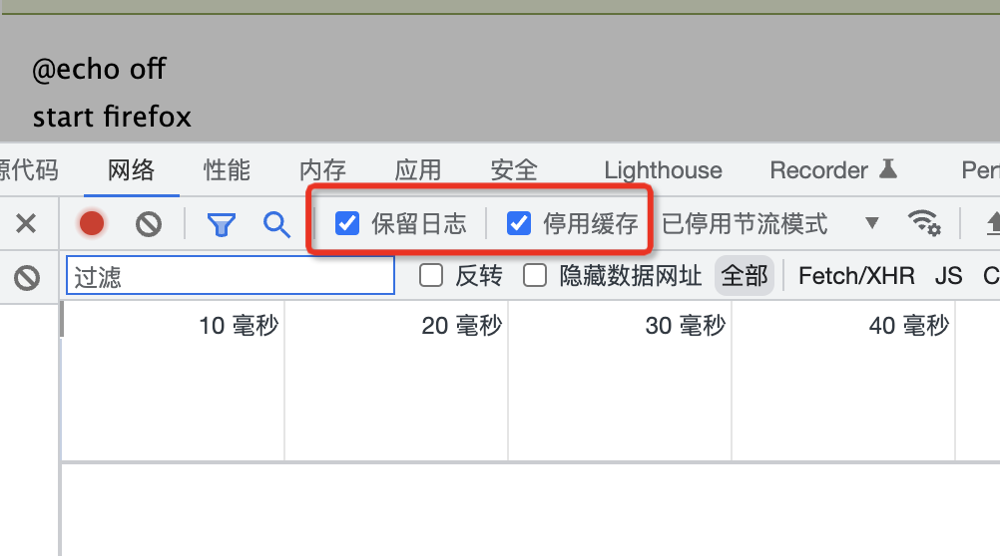

这样就可以更加方便我们找具体的请求了

## type 排序

可以通过类型排序来方便查找要关注的类型，比如可以忽略 gif、png，而关注 document、xhr 等

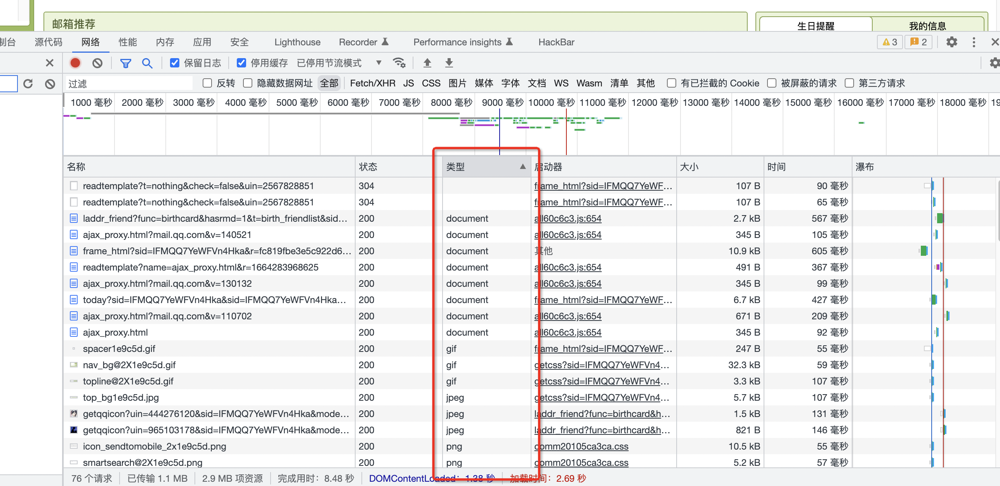

## 搜索

如果你要找的字段是比较特殊的，具有唯一性，那么可以通过搜索来快速查找这个特殊字段在 js 文件中的位置，这里我把请求 js 的过程都删除了，所以我没有搜到

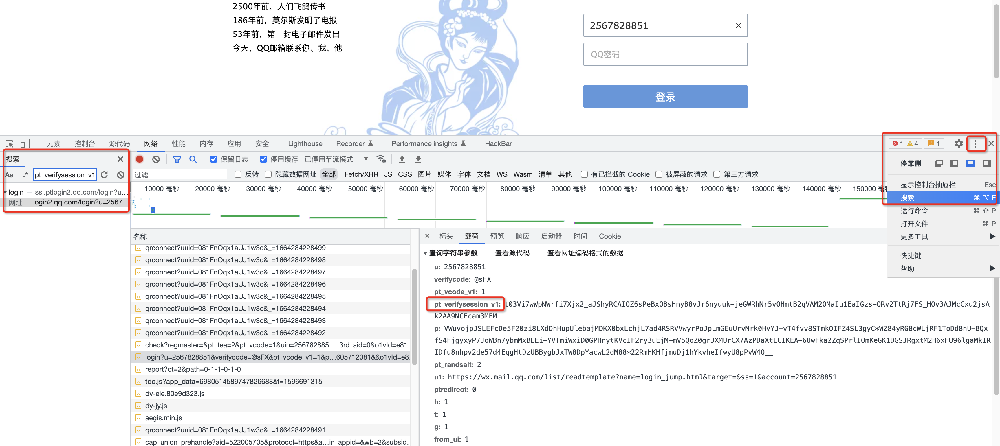

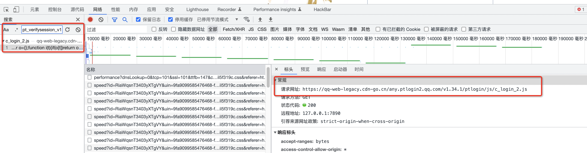

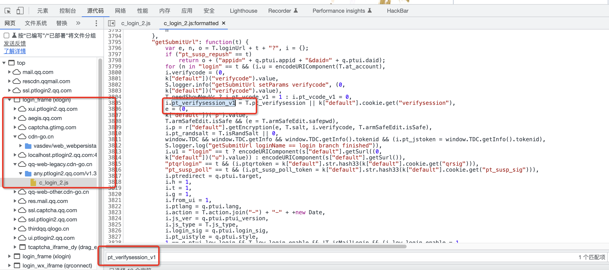

## 判断方法是不是加密方法

主要判断方法体里面有没有 encrypt  这种的运算逻辑

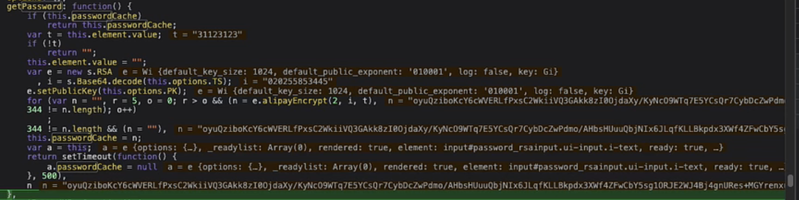

## 快速查看关键字

可以查找以下关键字来加快查看关键代码的速度

```javascript
setPublicKey
getPublicKey
setKey
getKey
encrypt
setPrivateKey
getPrivateKey
AES.encrypt
enc.utf8.parse
等等
```

# 获取函数位置及内容

当断点断到某一行时，你可以直接在控制台里面输入函数() 来查看运算结果，或者输入函数来获取函数的内容(双击函数内容即可跳转到该函数所在的 js 文件)

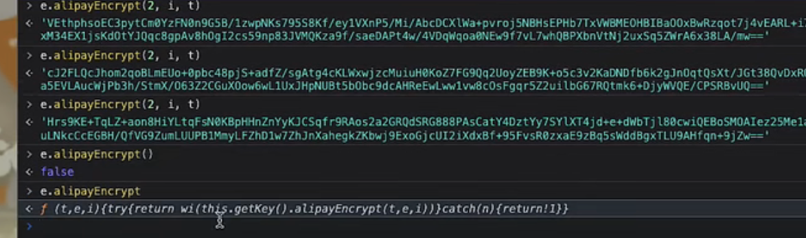

或者将鼠标放到函数名上，然后即可点击 FunxtionLocation 所标识的地址即可跳转

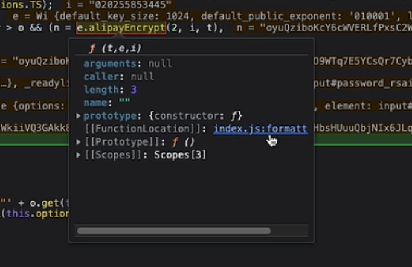


## Xhr 断点调试

可以在 xhr 这里添加断点，然后调试查找

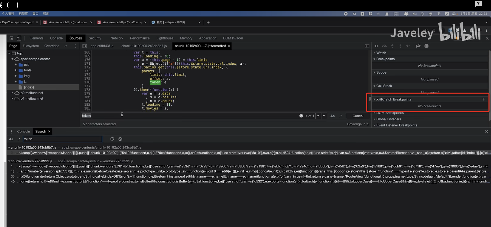


## 借助 VSCode 格式化 js 查找代码边界

当代码比较长时(比如直接找一整个库函数)，那么可以利用 VSCode 中的代码格式化能力，来查找代码的边界

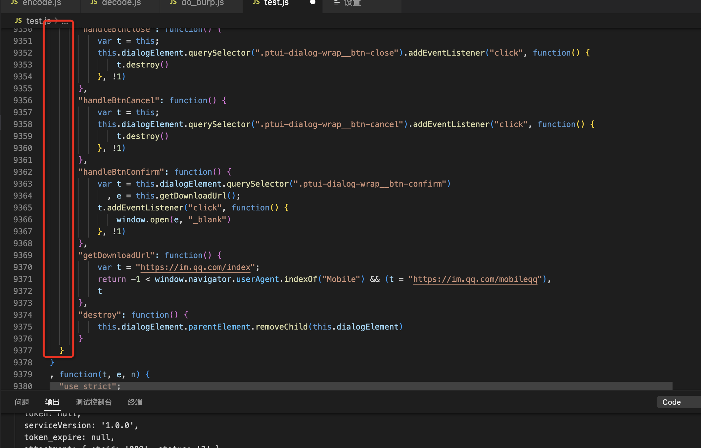

## 研究代码逻辑

可以直接将代码输入到浏览器控制台

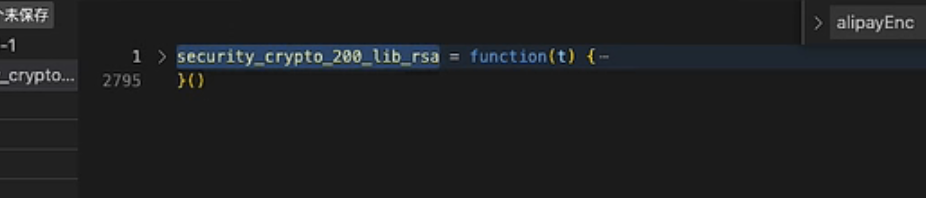

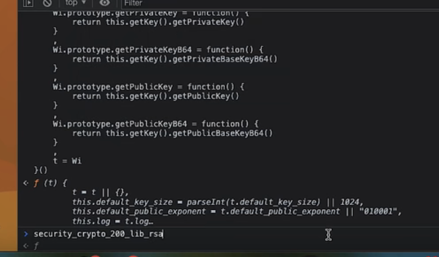

然后 new 一个这个函数的对象

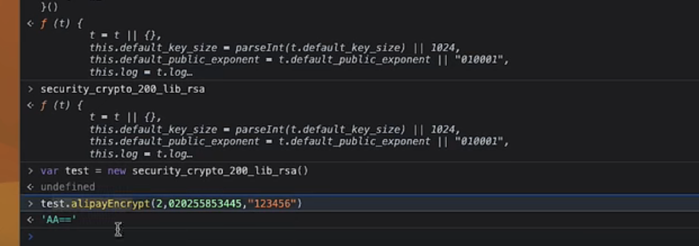

然后调用这个对象的加密方法，然后发现结果并不对，那是因为这个加密时非对称加密，这里没有给公钥

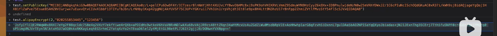

# 常见的 JS 方法执行方式

常规的js函数命名方法：

```javascript
//1. 常规function
var test = function(){
    console.log(123);
}

function test(){
    console.log(2);
}
```

自执行函数:

```javascript
//2. 自执行function
!function(){
    console.log(1);
}()
// => function a(){} a() 


//2.1
!function(e){
    console.log(e)
     var n={
    t:"txt",
    exports:{},
    n:function(){console.log("function n ")}
}
}("echo this")

//2.2
!function(e){
    console.log(e)
     var n={
    t:"txt",
    exports:{},
    n:function(){console.log("function n ")}}
}(
    {
        "test":function(){
                console.log("test")}
    }    
)
//(["test":function(){console.log])
```

将从网站上复制过来的模块方法变成自执行方法

```javascript
!function(parm){
  function c(){ dosomethin }
}({"some":"thing"})
```

加入我们需要调用 c() ,那么我们可以把 c() 赋值给全局变量

```javascript
var _c;
!function(parm){
  function c(){ dosomethin }
  _c = c;
}({"some":"thing"})
console.log(_c)
```

call 和apply 的使用效果基本一致，可以让A对象调用B对象的方法：

让 Vx 对象调用 _x 对象的 say() 方法

```javascript
var Vx={
       name:"一位不愿透露姓名的热心网友",
       age:"18cm"
};
var _x={
    name:"热心网友",
    age:"18mm",
    say:function(){console.log("name:"+this.name+" age:"+this.age)}
}
_x.say.call(Vx)
//name:一位不愿透露姓名的热心网友 age:18cm
```

## 如何找到加载器

### loader 加载器

Webpack 站点与普通站点的 JS 代码扣取是不一样的，因为 Webpack 站点的资源加载是围绕着加载器进行的，然后把静态资源当作模块传入调用，传入的模块就是参数，需要加载什么就运行什么模块。

先简单看一下加载器长相。

```javascript
!function(e){
    var t={}
    function d(n){
        if (t[n])
            return t[n].exports;
        console.log(n)
        var r = t[n] = {
            i:n,
            l:!1,
            exports:{}
            };
        return e[n].call(r.exports,r,r.exports,d),
        r.l = !0;
        r.exports
    }

    d(1)

}(
    [
    function(){console.log("function1");console.log(this.r.i)},
    function(){console.log("function2")}
    ]
);
```

#### 加载器分析

将加载器拆分为两部分：

**函数方法部分：**

```javascript
!function(e){
    var t={}
    function d(n){
        if (t[n])
            return t[n].exports;
        var r = t[n] = {
            i:n,
            l:!1,
            exports:{}
            };
        return e[n].call(r.exports,r,r.exports,d),
        r.l = !0;
        r.exports
    }

    d(1)
```

**参数部分：**

```javascript
(
    [
    function(){console.log("function1");console.log(this.r.i)}
    ,
    function(){console.log("function2")}
    ]
)
/* 这里的参数可以是传入数组，也可以是对象，都是经常看见的。
*/
(
    {
    "1":function(){console.log("function1");console.log(this.r.i)}
    ,
   "2":function(){console.log("function2")}
    }
)
```

这里的加载器是将参数作为一个数组  []  传入的，格式为：`!function(e){}(数组)`  参数e就是传入的数组， 接着看：

```javascript
var t={}
  function d(n){
        if (t[n])
            return t[n].exports;
        var r = t[n] = {
            i:n,
            l:!1,
            exports:{}
            };
        return e[n].call(r.exports,r,r.exports,d),
        r.l = !0;
        r.exports
    }
 d(1)
```

上述代码声明了一个 d 方法并执行，传入 1 作为参数，d 方法中的 `if (t[n])` 并没有实际意义，因为 t 本来就没有声明的，可以缩减为：

```javascript
function d(n){
        var r = t[n] = {
            i:n,
            l:!1,
            exports:{}
            };
        return e[n].call(r.exports,r,r.exports,d),
        r.l = !0;
        r.exports
    }
 d(1)
```

那么`r=t[n]={ xxxx} `可以变成 `var r = { xxx}`，现在就剩下一句：

```
return e[n].call(r.exports,r,r.exports,d)
```

前面说过了，`e`是传入的参数，也就是数组；`n`是`d(1)`传入的值，为`1`。

`r.exports `就是`r`对象里的`exports`属性为空对象`{}`。

转化代码：

```javascript
return 数组[1].call({},r对象,{},d函数自己)

--> 继续转换：

function(){
console.log("function2")
}.call({},r对象,{},d函数)
```

由于`call()`方法是用于调用方法的，所以其他参数可以忽略，缩减为：

```javascript
function(){
console.log("function2")
}.call(d函数)
```

加载器并没有太多实际的意义，就是自己调用自己，只是用来混淆的；

经过分析后代码可以直接缩减为（当然，只是针对现在这个例子）：

```javascript
!function(e){
    var t={}
    console.log("自执行传入的参数是："+e)
    function d(n){

        return e[n].call(d)
    }

    d(1)

}(
    [
    function(){console.log("function1");console.log()},
    function(){console.log("function2")}
    ]
);
```

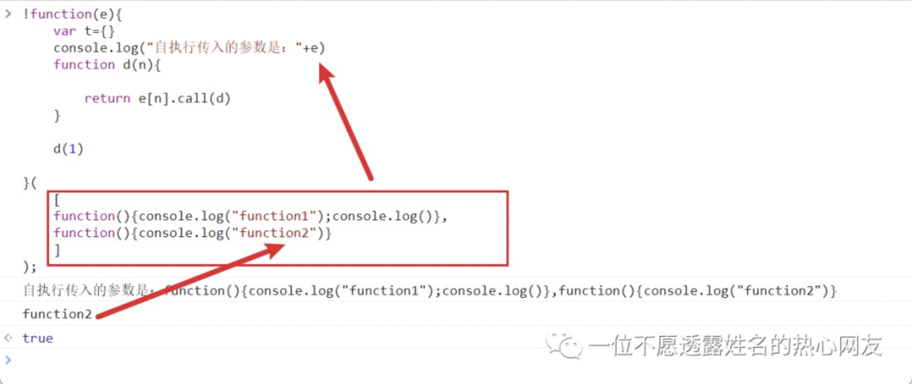

#### 分离加载

在模块较多的情况下，webpack 会将模块打包成一整个 JS 模块文件；并使用 Window 对象的 webpackJsonp 属性存储起来。然后通过 push() 方法传入模块。

如下：

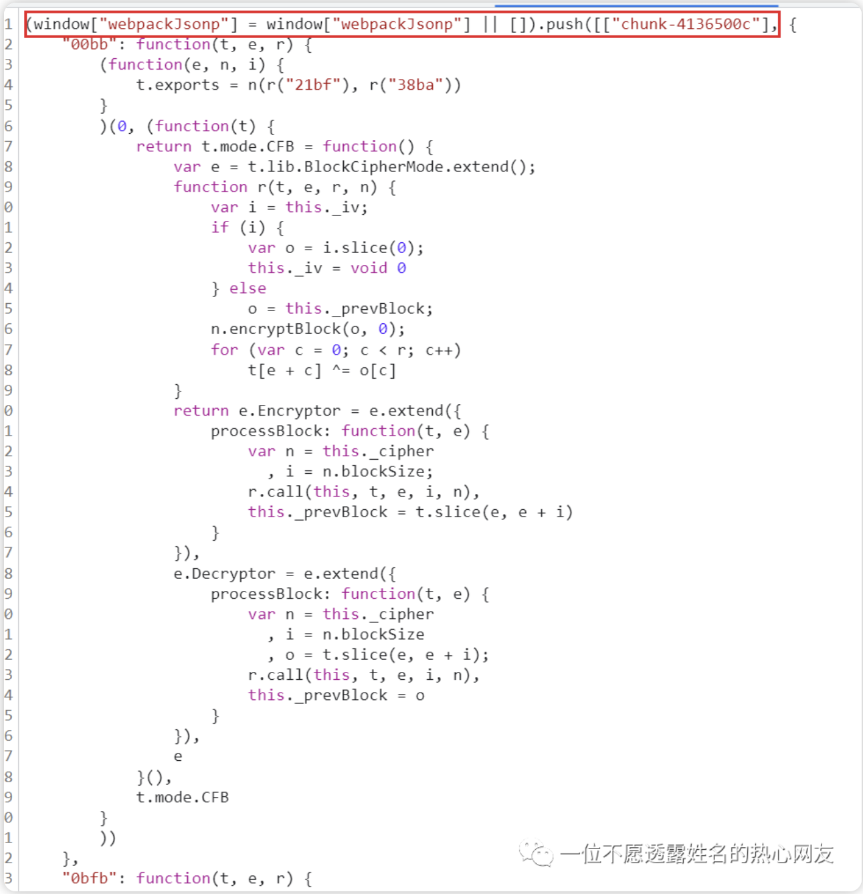

格式为：

```javascript
  (window["webpackJsonp"] = window["webpackJsonp"] || [] ).push(
    [
       ["xx"], { "module":function(){} } 
    ]
  );
```

运行结果：可以理解为 appen 追加内容，向 webpackJsonp 属性追加了 [xx] ,和 mod 数组

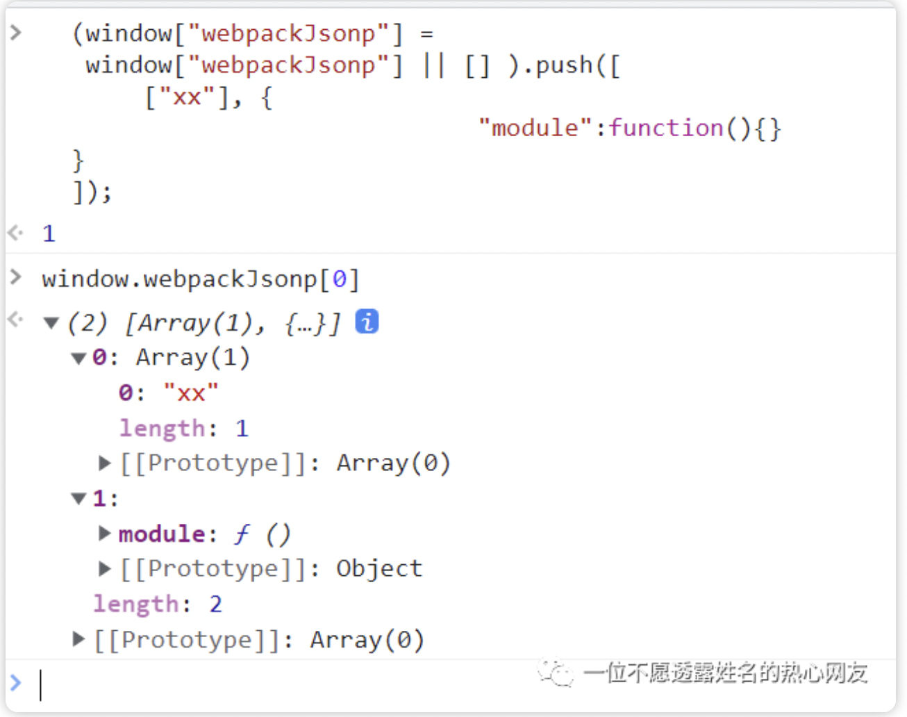


找这样的结构下断点，就能找到加载在哪里了

```javascript
r("3852")
```


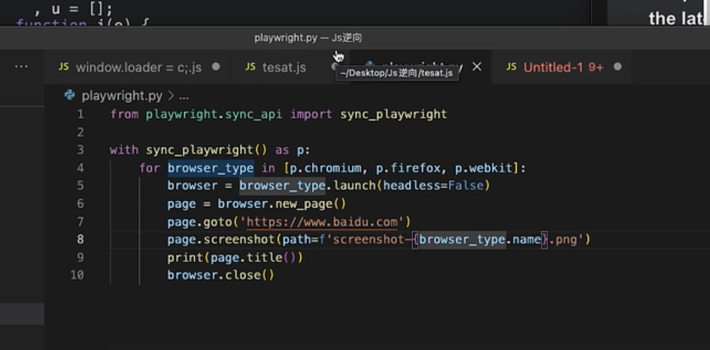

# 分析加密

Webpack站点分析的思路主要以下两点：

1. **首先找到食材，也就是定位到加密模块**
2. **其次找到锅，loader加载器**
3. **使用加载器去加载模块**

在这里的的难点就是定位加密模块，因为调用加密的地方肯定是只有固定的一两个点，如：登录提交。而加载器则什么地方都在调用（网站图片、css、js等资源  都是通过加载器加载出来的）

在上一文《[JS逆向｜40分钟视频通杀大厂登陆加密](https://mp.weixin.qq.com/s?__biz=MzkzODEzNjA3MQ==&mid=2247485456&idx=1&sn=839bffe306d8fa8563bce289cf352791&scene=21#wechat_redirect)》视频中已经讲解了常规加密的快速定位办法，在webpack站点中使用这种定位办法也有概率可能会有效，其实加密点也是有规律的，如：

```javascript
//1. 
xxxxx{
    a:e.name,
    data:e.data,
    b:e.url,
    c:n
}
```

这种键值对格式的跟 ajax 请求长得很相似，有可能是请求赋值的地方，也不绝对，只是大家注意就好。

访问站点右键源码就能发现这是一个 webpack 网站，数据并不存在于源码之中，是通过 XHR 获取的 JSON 数据。

# Referer

```javascript
https://mp.weixin.qq.com/s/3EmnYaEeFy8v7F6b0tdEXw
https://www.bilibili.com/video/BV13F411P7XB
```

